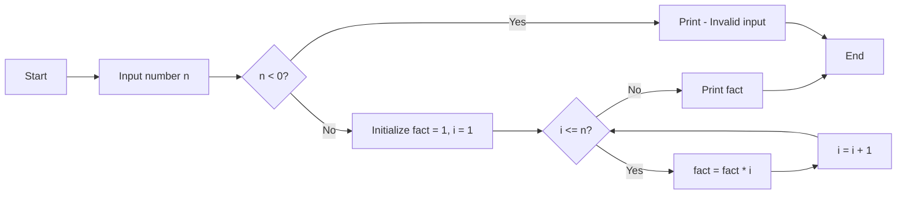

## Question 1(a) [3 marks]

**Explain the steps involved in problem-solving.**

**Answer**:

**Table:**

| Step | Description |
|------|-------------|
| **Problem Understanding** | Read and understand the problem clearly |
| **Analysis** | Break down the problem into smaller parts |
| **Algorithm Design** | Create step-by-step solution approach |
| **Implementation** | Code the solution using programming language |
| **Testing** | Verify solution with different test cases |
| **Documentation** | Document the solution for future reference |

**Key Points:**

- **Problem Definition**: Clearly identify what needs to be solved
- **Input/Output**: Determine required inputs and expected outputs
- **Logic Building**: Create logical flow of solution

**Mnemonic:** "People Always Design Implementation Tests Daily"

## Question 1(b) [4 marks]

**Write features of Python.**

**Answer**:

**Table:**

| Feature | Description |
|---------|-------------|
| **Simple Syntax** | Easy to read and write code |
| **Interpreted** | No compilation needed, runs directly |
| **Platform Independent** | Runs on Windows, Mac, Linux |
| **Object-Oriented** | Supports classes and objects |
| **Large Library** | Extensive built-in modules |
| **Dynamic Typing** | No need to declare variable types |

**Key Features:**

- **Free and Open Source**: Available for everyone to use
- **High-level Language**: Close to human language
- **Extensive Support**: Large community and documentation

**Mnemonic:** "Simple Interpreted Platform-independent Object-oriented Libraries Dynamic"

## Question 1(c) [7 marks]

**Draw a flowchart and write algorithm to calculate the factorial of a given number.**

**Answer**:

**Flowchart:**



**Algorithm:**

1. Start
2. Input number n
3. If n < 0, print "Invalid input" and go to step 8
4. Initialize fact = 1, i = 1
5. While i <= n, do:
   - fact = fact * i
   - i = i + 1
6. Print fact
7. End

**Key Points:**

- **Base Case**: 0! = 1 and 1! = 1
- **Validation**: Check for negative numbers
- **Loop Logic**: Multiply all numbers from 1 to n

**Mnemonic:** "Input Validate Initialize Loop Print"

## Question 1(c OR) [7 marks]

**Explain relational and assignment operators with example.**

**Answer**:

**Relational Operators Table:**

| Operator | Description | Example |
|----------|-------------|---------|
| **==** | Equal to | 5 == 5 (True) |
| **!=** | Not equal to | 5 != 3 (True) |
| **>** | Greater than | 7 > 3 (True) |
| **<** | Less than | 2 < 8 (True) |
| **>=** | Greater than or equal | 5 >= 5 (True) |
| **<=** | Less than or equal | 4 <= 6 (True) |

**Assignment Operators Table:**

| Operator | Description | Example |
|----------|-------------|---------|
| **=** | Simple assignment | x = 5 |
| **+=** | Add and assign | x += 3 (x = x + 3) |
| **-=** | Subtract and assign | x -= 2 (x = x - 2) |
| **\*=** | Multiply and assign | x *= 4 (x = x \* 4) |
| **/=** | Divide and assign | x /= 2 (x = x / 2) |

**Code Example:**

```python
# Relational operators
a, b = 10, 5
print(a > b)   # True
print(a == b)  # False

# Assignment operators
x = 10
x += 5  # x becomes 15
x *= 2  # x becomes 30
```

**Mnemonic:** "Compare Relations, Assign Values"

## Question 2(a) [3 marks]

**Draw various symbols used for flowchart and write purpose of each symbol.**

**Answer**:

**Flowchart Symbols Table:**

| Symbol | Name | Purpose |
|--------|------|---------|
| **Oval** | Terminal | Start/End of program |
| **Rectangle** | Process | Processing operations |
| **Diamond** | Decision | Conditional statements |
| **Parallelogram** | Input/Output | Data input/output |
| **Circle** | Connector | Connect different parts |
| **Arrow** | Flow line | Direction of flow |

**ASCII Diagram:**

```goat
   ( Start/End )     [ Process ]     < Decision >
        
   / Input/Output \     O Connector     ---> Flow
```

**Key Points:**

- **Standard Symbols**: Universally recognized shapes
- **Clear Flow**: Arrows show program direction
- **Logical Structure**: Helps visualize program logic

**Mnemonic:** "Terminals Process Decisions Input Connectors Flow"

## Question 2(b) [4 marks]

**List out characteristics of good algorithm.**

**Answer**:

**Table:**

| Characteristic | Description |
|----------------|-------------|
| **Finite** | Must terminate after finite steps |
| **Definite** | Each step clearly defined |
| **Input** | Zero or more inputs specified |
| **Output** | At least one output produced |
| **Effective** | Steps must be simple and feasible |
| **Unambiguous** | Each step has only one meaning |

**Key Characteristics:**

- **Correctness**: Produces correct results for all valid inputs
- **Efficiency**: Uses minimum time and space resources
- **Clarity**: Easy to understand and implement

**Mnemonic:** "Finite Definite Input Output Effective Unambiguous"

## Question 2(c) [7 marks]

**Use proper data type to represent the following data values.**

**Answer**:

**Data Type Mapping Table:**

| Data Value | Data Type | Example |
|------------|-----------|---------|
| **(1) Number of days in a week** | **int** | `days = 7` |
| **(2) Resident of Gujarat or not** | **bool** | `is_resident = True` |
| **(3) Mobile number** | **str** | `mobile = "9876543210"` |
| **(4) Bank account balance** | **float** | `balance = 15000.50` |
| **(5) Volume of a sphere** | **float** | `volume = 523.33` |
| **(6) Perimeter of a square** | **float** | `perimeter = 20.0` |
| **(7) Name of the student** | **str** | `name = "Rahul"` |

**Code Example:**

```python
# Data type examples
days = 7                    # int
is_resident = True          # bool
mobile = "9876543210"       # str
balance = 15000.50          # float
volume = 523.33            # float
perimeter = 20.0           # float
name = "Rahul"             # str
```

**Key Points:**

- **int**: Whole numbers without decimals
- **float**: Numbers with decimal points
- **str**: Text data in quotes
- **bool**: True/False values only

**Mnemonic:** "Integers Float Strings Booleans"

## Question 2(a OR) [3 marks]

**Find the output of following code.**

```python
num1 = 2+9*((3*12)-8)/10
print(num1)
```

**Answer**:

**Step-by-step calculation:**

```python
num1 = 2+9*((3*12)-8)/10
# Step 1: 3*12 = 36
# Step 2: 36-8 = 28
# Step 3: 9*28 = 252
# Step 4: 252/10 = 25.2
# Step 5: 2+25.2 = 27.2
```

**Output:** `27.2`

**Key Points:**

- **BODMAS Rule**: Brackets, Orders, Division, Multiplication, Addition, Subtraction
- **Operator Precedence**: Parentheses first, then multiplication/division
- **Result Type**: Float due to division operation

**Mnemonic:** "Brackets Orders Division Multiplication Addition Subtraction"

## Question 2(b OR) [4 marks]

**List out the various types of operators used in Python.**

**Answer**:

**Python Operators Table:**

| Type | Operators | Example |
|------|-----------|---------|
| **Arithmetic** | +, -, *, /, %, **, // | `5 + 3 = 8` |
| **Comparison** | ==, !=, >, <, >=, <= | `5 > 3 = True` |
| **Logical** | and, or, not | `True and False = False` |
| **Assignment** | =, +=, -=, *=, /= | `x += 5` |
| **Bitwise** | &, \|, ^, ~, <<, >> | `5 & 3 = 1` |
| **Membership** | in, not in | `'a' in 'cat' = True` |
| **Identity** | is, is not | `x is y` |

**Key Points:**

- **Arithmetic**: Mathematical operations
- **Comparison**: Compare values and return boolean
- **Logical**: Combine boolean expressions

**Mnemonic:** "Arithmetic Comparison Logical Assignment Bitwise Membership Identity"

## Question 2(c OR) [7 marks]

**Write a program to find the sum and average of all the positive numbers entered by the user. As soon as the user enters a negative number, stop taking in any further input from the user and display the sum and average.**

**Answer**:

**Code:**

```python
# Program to find sum and average of positive numbers
total_sum = 0
count = 0

print("Enter positive numbers (negative to stop):")

while True:
    num = float(input("Enter number: "))
    
    if num < 0:
        break
    
    total_sum += num
    count += 1

if count > 0:
    average = total_sum / count
    print(f"Sum: {total_sum}")
    print(f"Average: {average}")
else:
    print("No positive numbers entered")
```

**Key Points:**

- **Loop Control**: While loop with break statement
- **Input Validation**: Check for negative numbers
- **Division by Zero**: Handle case when no numbers entered

**Mnemonic:** "Input Loop Check Calculate Display"

## Question 3(a) [3 marks]

**Explain while loop with example.**

**Answer**:

**While Loop Structure:**

```python
while condition:
    # statements
    # update condition
```

**Example:**

```python
# Print numbers 1 to 5
i = 1
while i <= 5:
    print(i)
    i += 1
```

**Key Points:**

- **Pre-tested Loop**: Condition checked before execution
- **Infinite Loop Risk**: Condition must eventually become False
- **Loop Variable**: Must be updated inside loop

**Mnemonic:** "While Condition True Execute"

## Question 3(b) [4 marks]

**Write a program to find the sum of digits of an integer number, input by the user.**

**Answer**:

**Code:**

```python
# Program to find sum of digits
num = int(input("Enter a number: "))
original_num = num
digit_sum = 0

while num > 0:
    digit = num % 10
    digit_sum += digit
    num = num // 10

print(f"Sum of digits of {original_num} is {digit_sum}")
```

**Key Points:**

- **Modulo Operation**: Extract last digit using %10
- **Integer Division**: Remove last digit using //10
- **Loop Until Zero**: Continue until no digits remain

**Mnemonic:** "Extract Add Remove Repeat"

## Question 3(c) [7 marks]

**Write a program to print Armstrong numbers between 100 to 10000 using a user-defined function.**

**Answer**:

**Code:**

```python
def is_armstrong(num):
    """Check if number is Armstrong number"""
    original = num
    num_digits = len(str(num))
    sum_powers = 0
    
    while num > 0:
        digit = num % 10
        sum_powers += digit ** num_digits
        num //= 10
    
    return sum_powers == original

def print_armstrong_range(start, end):
    """Print Armstrong numbers in given range"""
    print(f"Armstrong numbers between {start} and {end}:")
    
    for num in range(start, end + 1):
        if is_armstrong(num):
            print(num, end=" ")
    print()

# Main program
print_armstrong_range(100, 10000)
```

**Key Points:**

- **Function Definition**: def keyword to create functions
- **Armstrong Logic**: Sum of digits raised to power of number of digits
- **Range Function**: Generate numbers in specified range

**Mnemonic:** "Define Check Calculate Compare Print"

## Question 3(a OR) [3 marks]

**Write a Program to print following pattern.**

```
5 4 3 2 1
4 3 2 1
3 2 1
2 1
1
```

**Answer**:

**Code:**

```python
# Pattern printing program
for i in range(5, 0, -1):
    for j in range(i, 0, -1):
        print(j, end=" ")
    print()
```

**Key Points:**

- **Nested Loops**: Outer loop for rows, inner for columns
- **Reverse Range**: range(start, stop, -1) for decreasing
- **Print Control**: end=" " for space, print() for newline

**Mnemonic:** "Outer Inner Reverse Print"

## Question 3(b OR) [4 marks]

**Explain nested if…else statement.**

**Answer**:

**Structure:**

```python
if condition1:
    if condition2:
        # statements
    else:
        # statements
else:
    if condition3:
        # statements
    else:
        # statements
```

**Example:**

```python
marks = 85

if marks >= 50:
    if marks >= 90:
        grade = "A+"
    elif marks >= 80:
        grade = "A"
    else:
        grade = "B"
else:
    grade = "F"

print(f"Grade: {grade}")
```

**Key Points:**

- **Inner Conditions**: if-else inside another if-else
- **Multiple Levels**: Can nest multiple levels deep
- **Logical Flow**: Inner conditions execute only if outer is true

**Mnemonic:** "Outer Inner Multiple Levels"

## Question 3(c OR) [7 marks]

**Write a program to enter n numbers in list and using statistics module find mean, median and mode.**

**Answer**:

**Code:**

```python
import statistics

# Input number of elements
n = int(input("Enter number of elements: "))
numbers = []

# Input numbers
for i in range(n):
    num = float(input(f"Enter number {i+1}: "))
    numbers.append(num)

# Calculate statistics
mean_val = statistics.mean(numbers)
median_val = statistics.median(numbers)

try:
    mode_val = statistics.mode(numbers)
except statistics.StatisticsError:
    mode_val = "No unique mode"

# Display results
print(f"Numbers: {numbers}")
print(f"Mean: {mean_val}")
print(f"Median: {median_val}")
print(f"Mode: {mode_val}")
```

**Key Points:**

- **Statistics Module**: Built-in module for statistical functions
- **List Input**: Store numbers in list for processing
- **Exception Handling**: Handle mode calculation errors

**Mnemonic:** "Import Input Calculate Display"

## Question 4(a) [3 marks]

**Differentiate between a for loop and a while loop in python.**

**Answer**:

**Comparison Table:**

| Feature | For Loop | While Loop |
|---------|----------|------------|
| **Purpose** | Known iterations | Unknown iterations |
| **Syntax** | for var in sequence | while condition |
| **Initialization** | Automatic | Manual |
| **Update** | Automatic | Manual |
| **Use Case** | Iterate over collections | Repeat until condition |

**Examples:**

```python
# For loop
for i in range(5):
    print(i)

# While loop  
i = 0
while i < 5:
    print(i)
    i += 1
```

**Mnemonic:** "For Known While Unknown"

## Question 4(b) [4 marks]

**Match the following.**

**Answer**:

**Correct Matching:**

- **A. If statement → 3.** Used to conditionally execute a block of code based on a certain condition
- **B. While loop → 1.** Executes a block of code repeatedly as long as a certain condition is met  
- **C. Break statement → 5.** Terminates the current loop and moves on to the next iteration
- **D. Continue statement → 2.** Skips the current iteration and moves on to the next one

**Key Points:**

- **If Statement**: Conditional execution
- **While Loop**: Repeated execution with condition
- **Break**: Exit loop completely
- **Continue**: Skip current iteration only

**Mnemonic:** "If Conditions While Repeats Break Exits Continue Skips"

## Question 4(c) [7 marks]

**Differentiate between following with the help of an example:**
**a) Argument and Parameter**
**b) Global and Local variable**

**Answer**:

**a) Argument vs Parameter:**

```python
def greet(name, age):  # name, age are parameters
    print(f"Hello {name}, you are {age} years old")

greet("Raj", 20)  # "Raj", 20 are arguments
```

**b) Global vs Local Variable:**

```python
x = 10  # Global variable

def my_function():
    y = 5  # Local variable
    global x
    x = 15  # Modifying global variable
    print(f"Local y: {y}")
    print(f"Global x: {x}")

my_function()
print(f"Global x outside: {x}")
```

**Comparison Table:**

| Type | Scope | Access | Example |
|------|-------|--------|---------|
| **Parameter** | Function definition | Receives values | `def func(param):` |
| **Argument** | Function call | Passes values | `func(argument)` |
| **Global** | Entire program | Everywhere | `x = 10` |
| **Local** | Inside function | Function only | `y = 5` in function |

**Mnemonic:** "Parameters Receive Arguments Pass Globals Everywhere Locals Function"

## Question 4(a OR) [3 marks]

**Find the output of following statements.**

**Answer**:

**Code Analysis:**

```python
import math
(i) print(math.ceil(-9.7))   # Output: -9
(ii) print(math.floor(-9.7)) # Output: -10  
(iii) print(math.fabs(-12.3)) # Output: 12.3
```

**Explanation:**

- **ceil(-9.7)**: Ceiling rounds up to nearest integer = -9
- **floor(-9.7)**: Floor rounds down to nearest integer = -10
- **fabs(-12.3)**: Absolute value removes negative sign = 12.3

**Key Points:**

- **Math Module**: Import required for mathematical functions
- **Negative Numbers**: Ceiling and floor work differently with negatives
- **Absolute Value**: Always returns positive value

**Mnemonic:** "Ceiling Up Floor Down Absolute Positive"

## Question 4(b OR) [4 marks]

**Write advantages of function.**

**Answer**:

**Advantages Table:**

| Advantage | Description |
|-----------|-------------|
| **Code Reusability** | Write once, use multiple times |
| **Modularity** | Break complex problems into smaller parts |
| **Easier Debugging** | Locate and fix errors easily |
| **Code Organization** | Better structure and readability |
| **Maintainability** | Easy to update and modify |
| **Reduced Complexity** | Simplify complex operations |

**Key Benefits:**

- **Avoid Repetition**: No need to write same code again
- **Team Collaboration**: Different people can work on different functions
- **Testing**: Each function can be tested independently

**Mnemonic:** "Reuse Modular Debug Organize Maintain Reduce"

## Question 4(c OR) [7 marks]

**Write a program to find the smallest and largest number in a given list without using in built functions.**

**Answer**:

**Code:**

```python
# Program to find smallest and largest without built-in functions
def find_min_max(numbers):
    """Find minimum and maximum without built-in functions"""
    if not numbers:
        return None, None
    
    smallest = numbers[0]
    largest = numbers[0]
    
    for num in numbers[1:]:
        if num < smallest:
            smallest = num
        if num > largest:
            largest = num
    
    return smallest, largest

# Input list
n = int(input("Enter number of elements: "))
numbers = []

for i in range(n):
    num = float(input(f"Enter number {i+1}: "))
    numbers.append(num)

# Find min and max
min_num, max_num = find_min_max(numbers)

print(f"List: {numbers}")
print(f"Smallest number: {min_num}")
print(f"Largest number: {max_num}")
```

**Key Points:**

- **Manual Comparison**: Use if conditions instead of min()/max()
- **Initialize Variables**: Start with first element
- **Loop Through**: Compare each element with current min/max

**Mnemonic:** "Initialize Compare Update Return"

## Question 5(a) [3 marks]

**Differentiate sort() and sorted() methods for list in python.**

**Answer**:

**Comparison Table:**

| Feature | sort() | sorted() |
|---------|--------|----------|
| **Return Type** | None (modifies original) | New sorted list |
| **Original List** | Modified in-place | Unchanged |
| **Usage** | list.sort() | sorted(list) |
| **Memory** | Efficient | Uses extra memory |

**Examples:**

```python
# sort() method
list1 = [3, 1, 4, 2]
list1.sort()
print(list1)  # [1, 2, 3, 4]

# sorted() function
list2 = [3, 1, 4, 2]
new_list = sorted(list2)
print(list2)      # [3, 1, 4, 2] (unchanged)
print(new_list)   # [1, 2, 3, 4]
```

**Mnemonic:** "Sort Modifies Sorted Creates"

## Question 5(b) [4 marks]

**Explain different way of traversing a string in python with example.**

**Answer**:

**String Traversal Methods:**

**1. Using For Loop:**

```python
text = "Python"
for char in text:
    print(char, end=" ")  # P y t h o n
```

**2. Using Index:**

```python
text = "Python"
for i in range(len(text)):
    print(text[i], end=" ")  # P y t h o n
```

**3. Using While Loop:**

```python
text = "Python"
i = 0
while i < len(text):
    print(text[i], end=" ")
    i += 1
```

**4. Using Enumerate:**

```python
text = "Python"
for index, char in enumerate(text):
    print(f"{index}:{char}", end=" ")  # 0:P 1:y 2:t 3:h 4:o 5:n
```

**Mnemonic:** "For Index While Enumerate"

## Question 5(c) [7 marks]

**Write output of following scripts.**

**Answer**:

**Output Results:**

```python
(1) s = "Hello, World!"
    print(s[0:5])              # Output: Hello

(2) lst = [1, 2, 3, 4, 5]
    print(lst[2:4])            # Output: [3, 4]

(3) s = "python"
    print(len(s))              # Output: 6

(4) lst = [5, 2, 3, 1, 8]
    lst.sort()                 # lst becomes [1, 2, 3, 5, 8]

(5) s1 = "hello"
    s2 = "world"
    print(s1 + s2)             # Output: helloworld

(6) lst = [1, 2, 3, 4, 5]
    print(sum(lst))            # Output: 15

(7) s = "python"
    print(s[::-1])             # Output: nohtyp
```

**Key Points:**

- **Slicing**: [start:end] extracts substring/sublist
- **String Length**: len() returns character count
- **List Sorting**: sort() modifies list in-place
- **String Concatenation**: + operator joins strings
- **Sum Function**: Adds all list elements
- **Reverse Slicing**: [::-1] reverses sequence

**Mnemonic:** "Slice Length Sort Concatenate Sum Reverse"

## Question 5(a OR) [3 marks]

**Explain type conversion in python.**

**Answer**:

**Type Conversion Table:**

| Type | Function | Example |
|------|----------|---------|
| **int()** | Convert to integer | `int("5")` → 5 |
| **float()** | Convert to float | `float("3.14")` → 3.14 |
| **str()** | Convert to string | `str(25)` → "25" |
| **bool()** | Convert to boolean | `bool(1)` → True |
| **list()** | Convert to list | `list("abc")` → ['a','b','c'] |

**Examples:**

```python
# Implicit conversion
x = 5 + 3.2  # int + float = float (8.2)

# Explicit conversion
num_str = "123"
num_int = int(num_str)  # "123" → 123
```

**Key Points:**

- **Implicit**: Python automatically converts
- **Explicit**: Programmer manually converts using functions
- **Type Safety**: Some conversions may raise errors

**Mnemonic:** "Implicit Automatic Explicit Manual"

## Question 5(b OR) [4 marks]

**Explain concatenation and repetition operation on string with example.**

**Answer**:

**String Operations:**

**1. Concatenation (+):**

```python
str1 = "Hello"
str2 = "World"
result = str1 + " " + str2
print(result)  # Hello World

# Multiple concatenation
name = "Python"
version = "3.9"
info = "Language: " + name + " Version: " + version
print(info)  # Language: Python Version: 3.9
```

**2. Repetition (*):**

```python
text = "Hi! "
repeated = text * 3
print(repeated)  # Hi! Hi! Hi! 

# Pattern creation
pattern = "-" * 10
print(pattern)  # ----------
```

**Key Points:**

- **Concatenation**: Joins strings together using +
- **Repetition**: Repeats string n times using *
- **Immutable**: Original strings remain unchanged

**Mnemonic:** "Plus Joins Star Repeats"

## Question 5(c OR) [7 marks]

**Write a program to count and display the number of vowels, consonants, uppercase, lowercase characters in a string.**

**Answer**:

**Code:**

```python
def analyze_string(text):
    """Analyze string for different character types"""
    vowels = "aeiouAEIOU"
    
    vowel_count = 0
    consonant_count = 0
    uppercase_count = 0
    lowercase_count = 0
    
    for char in text:
        if char.isalpha():  # Check if character is alphabet
            if char in vowels:
                vowel_count += 1
            else:
                consonant_count += 1
            
            if char.isupper():
                uppercase_count += 1
            elif char.islower():
                lowercase_count += 1
    
    return vowel_count, consonant_count, uppercase_count, lowercase_count

# Input string
text = input("Enter a string: ")

# Analyze string
vowels, consonants, uppercase, lowercase = analyze_string(text)

# Display results
print(f"String: '{text}'")
print(f"Vowels: {vowels}")
print(f"Consonants: {consonants}")
print(f"Uppercase: {uppercase}")
print(f"Lowercase: {lowercase}")
```

**Key Points:**

- **Character Classification**: Use isalpha(), isupper(), islower()
- **Vowel Check**: Compare with vowel string
- **Loop Processing**: Check each character individually

**Mnemonic:** "Check Classify Count Display"
