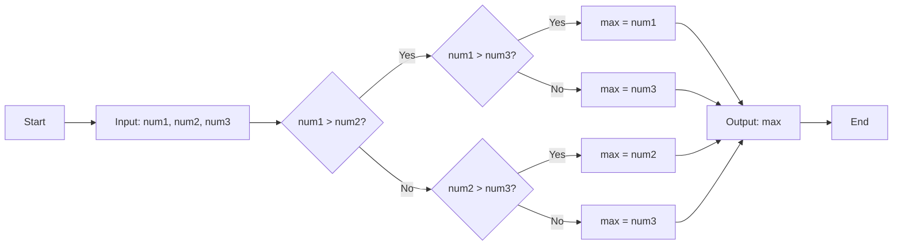
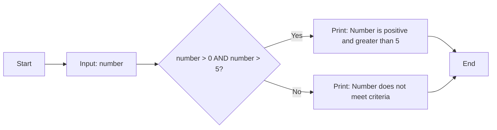

## પ્રશ્ન 1(અ) [3 ગુણ]

**સમસ્યાનું નિરાકરણ વ્યાખ્યાયિત કરો અને સમસ્યા હલ કરવાના પગલાંની સૂચિ બનાવો.**

**ઉત્તર**:
સમસ્યાનું નિરાકરણ એ એક વ્યવસ્થિત પદ્ધતિ છે જે તર્કસંગત વિચારસરણી અને સંરચિત પદ્ધતિઓનો ઉપયોગ કરીને સમસ્યાઓને ઓળખવા, તેનું વિશ્લેષણ કરવા અને હલ કરવા માટે વપરાય છે.

**સમસ્યા નિરાકરણના પગલાં:**

| પગલું | વર્ણન |
|------|-------|
| 1. **સમસ્યાની ઓળખ** | સમસ્યાને સ્પષ્ટપણે સમજવી અને વ્યાખ્યાયિત કરવી |
| 2. **સમસ્યાનું વિશ્લેષણ** | સમસ્યાને નાના ભાગોમાં વિભાજિત કરવી |
| 3. **સોલ્યુશન ડિઝાઇન** | સંભવિત ઉકેલો અથવા એલ્ગોરિધમ વિકસાવવા |
| 4. **અમલીકરણ** | પસંદ કરેલા ઉકેલને અમલમાં મૂકવો |
| 5. **ટેસ્ટિંગ અને વેલિડેશન** | ઉકેલ યોગ્ય રીતે કામ કરે છે તેની ખાતરી કરવી |
| 6. **ડોક્યુમેન્ટેશન** | ભાવિ સંદર્ભ માટે ઉકેલને રેકોર્ડ કરવો |

**મેમરી ટ્રીક:** "હું હંમેશા ડિઝાઇન અમલીકરણ ટેસ્ટ દૈનિક"

---

## પ્રશ્ન 1(બ) [4 ગુણ]

**વેરિએબલ વ્યાખ્યાયિત કરો અને વેરિએબલના નામ પસંદ કરવા માટેના નિયમનો ઉલ્લેખ કરો.**

**ઉત્તર**:
વેરિએબલ એ મેમરીમાં એક નામાંકિત સ્ટોરેજ સ્થાન છે જે ડેટા વેલ્યુઝ ધરાવે છે અને પ્રોગ્રામ એક્ઝિક્યુશન દરમિયાન બદલાઈ શકે છે.

**વેરિએબલ નામકરણ નિયમો:**

| નિયમ | વર્ણન |
|------|-------|
| **શરૂઆતી અક્ષર** | અક્ષર (a-z, A-Z) અથવા અન્ડરસ્કોર (_) થી શરૂ થવું જોઈએ |
| **મંજૂર અક્ષરો** | અક્ષરો, અંકો (0-9), અને અન્ડરસ્કોર હોઈ શકે |
| **કેસ સેંસિટિવ** | myVar અને MyVar જુદા વેરિએબલ છે |
| **કોઈ કીવર્ડ્સ નહીં** | Python ના રિઝર્વ્ડ શબ્દો વાપરી શકાતા નથી |
| **કોઈ સ્પેસ નહીં** | સ્પેસની જગ્યાએ અન્ડરસ્કોર વાપરો |
| **વર્ણનાત્મક નામ** | અર્થપૂર્ણ નામ પસંદ કરો (age, x નહીં) |

**મેમરી ટ્રીક:** "અક્ષરથી શરૂઆત, સાવધાનીથી ચાલુ, ક્યારેય કીવર્ડ્સ નહીં"

---

## પ્રશ્ન 1(ક) [7 ગુણ]

**આપેલ ત્રણ નંબરોમાંથી મહત્તમ સંખ્યા શોધવા માટે ફ્લોચાર્ટ ડિઝાઇન કરો.**

**ઉત્તર**:
ફ્લોચાર્ટ કમ્પેરિઝન ઓપરેશન્સ વાપરીને ત્રણ નંબરોમાંથી મહત્તમ શોધવાના તાર્કિક પ્રવાહને દર્શાવે છે.

**ફ્લોચાર્ટ:**



**મુખ્ય મુદ્દાઓ:**

- **ઇનપુટ**: ત્રણ નંબરો (num1, num2, num3)
- **પ્રોસેસ**: નેસ્ટેડ કંડિશન્સ વાપરીને નંબરોની તુલના
- **આઉટપુટ**: ત્રણેય વચ્ચે મહત્તમ મૂલ્ય

**મેમરી ટ્રીક:** "પહેલા બેની તુલના, પછી ત્રીજા સાથે"

---

## પ્રશ્ન 1(ક અથવા) [7 ગુણ]

**દાખલ કરેલ નંબર પોઝિટિવ છે અને 5 કરતા વધારે છે કે નહીં તે તપાસવા એક એલ્ગોરિધમ બનાવો.**

**ઉત્તર**:
એક નંબર પોઝિટિવ અને 5 કરતા વધારે છે કે કેમ તે ચકાસવા માટેનું એલ્ગોરિધમ.

**એલ્ગોરિધમ:**

```
Algorithm: CheckPositiveGreaterThan5
Step 1: START
Step 2: INPUT number
Step 3: IF number > 0 AND number > 5 THEN
           PRINT "Number is positive and greater than 5"
        ELSE
           PRINT "Number does not meet criteria"
        END IF
Step 4: END
```

**ફ્લોચાર્ટ:**



**મુખ્ય શરતો:**

- **પોઝિટિવ**: number > 0
- **5 કરતા વધારે**: number > 5
- **સંયુક્ત**: બંને શરતો સાચી હોવી જોઈએ

**મેમરી ટ્રીક:** "પોઝિટિવ પ્લસ પાંચ"

---

## પ્રશ્ન 2(અ) [3 ગુણ]

**એરિથમેટિક ઓપરેટરો પર શોર્ટ નોટ લખો.**

**ઉત્તર**:
એરિથમેટિક ઓપરેટરો Python પ્રોગ્રામિંગમાં ન્યુમેરિક વેલ્યુઝ પર ગાણિતિક ગણતરીઓ કરે છે.

**એરિથમેટિક ઓપરેટરો ટેબલ:**

| ઓપરેટર | નામ | ઉદાહરણ | પરિણામ |
|---------|-----|---------|---------|
| + | ઉમેરાણ | 5 + 3 | 8 |
| - | બાદબાકી | 5 - 3 | 2 |
| * | ગુણાકાર | 5 * 3 | 15 |
| / | ભાગાકાર | 5 / 3 | 1.67 |
| // | ફ્લોર ડિવિઝન | 5 // 3 | 1 |
| % | મોડ્યુલસ | 5 % 3 | 2 |
| ** | ઘાત | 5 ** 3 | 125 |

**મેમરી ટ્રીક:** "ઉમેરો બાદ કરો ગુણો ભાગો ફ્લોર મોડ પાવર"

---

## પ્રશ્ન 2(બ) [4 ગુણ]

**કંટિન્યુ અને બ્રેક સ્ટેટમેંટની જરૂરિયાત સમજાવો.**

**ઉત્તર**:
કંટિન્યુ અને બ્રેક સ્ટેટમેંટ્સ કાર્યક્ષમ પ્રોગ્રામિંગ માટે લૂપ એક્ઝિક્યુશન ફ્લોને નિયંત્રિત કરે છે.

**સ્ટેટમેંટ કમ્પેરિઝન:**

| સ્ટેટમેંટ | હેતુ | ક્રિયા |
|-----------|------|-------|
| **break** | લૂપમાંથી સંપૂર્ણ બહાર નીકળવું | સંપૂર્ણ લૂપને સમાપ્ત કરે છે |
| **continue** | વર્તમાન આવૃત્તિ છોડવી | આગલી આવૃત્તિ પર જાય છે |

**વપરાશના ઉદાહરણો:**

- **break**: શરત પૂરી થાય ત્યારે બહાર નીકળવું (ચોક્કસ મૂલ્ય શોધવું)
- **continue**: અયોગ્ય ડેટા છોડવો (પોઝિટિવ લિસ્ટમાં નેગેટિવ નંબરો)

**ફાયદાઓ:**

- **કાર્યક્ષમતા**: બિનજરૂરી આવૃત્તિઓ ટાળવી
- **નિયંત્રણ**: પ્રોગ્રામ ફ્લોનું વધુ સારું મેનેજમેંટ
- **સ્પષ્ટતા**: વધુ સ્વચ્છ કોડ લોજિક

**મેમરી ટ્રીક:** "બ્રેક બહાર નીકળે, કંટિન્યુ છોડે"

---

## પ્રશ્ન 2(ક) [7 ગુણ]

**દાખલ કરેલ સંખ્યા સમ છે કે વિષમ છે તે તપાસવા માટે એક પ્રોગ્રામ બનાવો.**

**ઉત્તર**:
મોડ્યુલસ ઓપરેટર વાપરીને નંબર સમ કે વિષમ છે તે નિર્ધારિત કરવા માટેનો Python પ્રોગ્રામ.

**Python કોડ:**

```python
# સમ કે વિષમ તપાસવા માટેનો પ્રોગ્રામ
number = int(input("એક નંબર દાખલ કરો: "))

if number % 2 == 0:
    print(f"{number} સમ છે")
else:
    print(f"{number} વિષમ છે")
```

**લોજિક સમજૂતી:**

| શરત | પરિણામ | સમજૂતી |
|-----|---------|----------|
| number % 2 == 0 | સમ | 2 વડે વિભાજ્ય, કોઈ બાકી નહીં |
| number % 2 == 1 | વિષમ | 2 વડે વિભાજ્ય નહીં, બાકી 1 |

**સેમ્પલ આઉટપુટ:**

- ઇનપુટ: 8 → આઉટપુટ: "8 સમ છે"
- ઇનપુટ: 7 → આઉટપુટ: "7 વિષમ છે"

**મેમરી ટ્રીક:** "મોડ્યુલસ શૂન્ય સમ, એક વિષમ"

---

## પ્રશ્ન 2(અ અથવા) [3 ગુણ]

**Python ના કમ્પેરિઝન ઓપરેટરોનો સારાંશ આપો.**

**ઉત્તર**:
કમ્પેરિઝન ઓપરેટરો વેલ્યુઝની તુલના કરે છે અને બુલિયન પરિણામો (True/False) આપે છે.

**કમ્પેરિઝન ઓપરેટરો ટેબલ:**

| ઓપરેટર | નામ | ઉદાહરણ | પરિણામ |
|---------|-----|---------|---------|
| == | બરાબર | 5 == 5 | True |
| != | બરાબર નથી | 5 != 3 | True |
| > | મોટું | 5 > 3 | True |
| < | નાનું | 5 < 3 | False |
| >= | મોટું અથવા બરાબર | 5 >= 5 | True |
| <= | નાનું અથવા બરાબર | 5 <= 3 | False |

**રિટર્ન ટાઇપ:** બધા ઓપરેટરો બુલિયન વેલ્યુઝ (True/False) આપે છે

**મેમરી ટ્રીક:** "બરાબર નહીં મોટું નાનું મોટું-બરાબર નાનું-બરાબર"

---

## પ્રશ્ન 2(બ અથવા) [4 ગુણ]

**While લૂપ પર ટૂંકી નોંધ લખો.**

**ઉત્તર**:
While લૂપ જ્યાં સુધી શરત સાચી રહે છે ત્યાં સુધી કોડ બ્લોકને વારંવાર એક્ઝિક્યુટ કરે છે.

**While લૂપ સ્ટ્રક્ચર:**

| ઘટક | વર્ણન |
|------|-------|
| **પ્રારંભિકરણ** | લૂપ પહેલાં પ્રારંભિક મૂલ્ય સેટ કરવું |
| **શરત** | તપાસવા માટેનું બુલિયન એક્સપ્રેશન |
| **બોડી** | વારંવાર એક્ઝિક્યુટ કરવાનો કોડ |
| **અપડેટ** | અનંત લૂપ ટાળવા માટે વેરિએબલ બદલવો |

**સિન્ટેક્સ:**

```python
while condition:
    # loop body
    # update statement
```

**લક્ષણો:**

- **પ્રી-ટેસ્ટેડ**: એક્ઝિક્યુશન પહેલાં શરત તપાસાય છે
- **વેરિએબલ આવૃત્તિઓ**: અજાણી સંખ્યામાં પુનરાવર્તન
- **નિયંત્રણ**: શરત ચાલુ રાખવું નક્કી કરે છે

**મેમરી ટ્રીક:** "જ્યારે શરત સાચી, લૂપ ચલાવો"

---

## પ્રશ્ન 2(ક અથવા) [7 ગુણ]

**યુઝર પાસેથી ત્રણ નંબરો વાંચવા અને તે નંબરોની સરેરાશ શોધવા માટે એક પ્રોગ્રામ બનાવો.**

**ઉત્તર**:
યુઝર-ઇનપુટ ત્રણ નંબરોની સરેરાશ ગણવા માટેનો Python પ્રોગ્રામ.

**Python કોડ:**

```python
# ત્રણ નંબરોની સરેરાશ શોધવા માટેનો પ્રોગ્રામ
num1 = float(input("પહેલો નંબર દાખલ કરો: "))
num2 = float(input("બીજો નંબર દાખલ કરો: "))
num3 = float(input("ત્રીજો નંબર દાખલ કરો: "))

average = (num1 + num2 + num3) / 3

print(f"{num1}, {num2}, {num3} ની સરેરાશ: {average:.2f} છે")
```

**ગણતરી પ્રક્રિયા:**

| પગલું | ઓપરેશન |
|-------|---------|
| **ઇનપુટ** | ત્રણ નંબરો વાંચો |
| **સરવાળો** | ત્રણેય નંબરો ઉમેરો |
| **ભાગાકાર** | સરવાળો ÷ 3 |
| **આઉટપુટ** | ફોર્મેટ કરેલ પરિણામ દર્શાવો |

**સેમ્પલ એક્ઝિક્યુશન:**

- ઇનપુટ: 10, 20, 30
- સરવાળો: 60
- સરેરાશ: 20.00

**મેમરી ટ્રીક:** "ત્રણ ઉમેરો ભાગો દર્શાવો"

---

## પ્રશ્ન 3(અ) [3 ગુણ]

**કંટ્રોલ સ્ટ્રક્ચર્સ વ્યાખ્યાયિત કરો, પાયથોનમાં ઉપલબ્ધ કંટ્રોલ સ્ટ્રક્ચર્સની સૂચિ બનાવો.**

**ઉત્તર**:
કંટ્રોલ સ્ટ્રક્ચર્સ પ્રોગ્રામમાં એક્ઝિક્યુશન ફ્લો અને સ્ટેટમેંટ્સનો ક્રમ નિર્ધારિત કરે છે.

**Python કંટ્રોલ સ્ટ્રક્ચર્સ:**

| પ્રકાર | સ્ટ્રક્ચર્સ | હેતુ |
|-------|------------|------|
| **સિક્વેન્શિયલ** | સામાન્ય ફ્લો | સ્ટેટમેંટ્સ ક્રમમાં એક્ઝિક્યુટ કરવા |
| **સિલેક્શન** | if, if-else, elif | વિકલ્પો વચ્ચે પસંદગી |
| **આઇટરેશન** | for, while | કોડ બ્લોક્સનું પુનરાવર્તન |
| **જમ્પ** | break, continue, pass | સામાન્ય ફ્લો બદલવો |

**કેટેગરીઝ:**

- **કંડિશનલ**: નિર્ણય લેવો (if સ્ટેટમેંટ્સ)
- **લૂપિંગ**: પુનરાવર્તન (for/while લૂપ્સ)
- **બ્રાન્ચિંગ**: ફ્લો કંટ્રોલ (break/continue)

**મેમરી ટ્રીક:** "સિક્વેન્સ સિલેક્ટ આઇટરેટ જમ્પ"

---

## પ્રશ્ન 3(બ) [4 ગુણ]

**યુઝર ડિફાઇન્ડ ફંકશન વ્યાખ્યાયિત કરો અને કેવી રીતે યુઝર ડિફાઇન્ડ ફંકશન કૉલ કરવું તે ઉદાહરણ આપીને સમજાવો.**

**ઉત્તર**:
યુઝર-ડિફાઇન્ડ ફંકશન્સ ચોક્કસ કાર્યો કરતા પુનઃ ઉપયોગી કોડના કસ્ટમ બ્લોક્સ છે.

**ફંકશન સ્ટ્રક્ચર:**

| ઘટક | સિન્ટેક્સ | હેતુ |
|------|---------|------|
| **ડેફિનિશન** | def function_name(): | ફંકશન બનાવવું |
| **પેરામીટર્સ** | def func(param1, param2): | ઇનપુટ્સ સ્વીકારવા |
| **બોડી** | ઇન્ડેન્ટેડ કોડ બ્લોક | ફંકશન લોજિક |
| **રિટર્ન** | return value | પરિણામ પાછું મોકલવું |
| **કૉલ** | function_name() | ફંકશન એક્ઝિક્યુટ કરવું |

**ઉદાહરણ કોડ:**

```python
# ફંકશન ડેફિનિશન
def greet_user(name):
    message = f"નમસ્તે, {name}!"
    return message

# ફંકશન કૉલ
result = greet_user("Python")
print(result)  # આઉટપુટ: નમસ્તે, Python!
```

**મેમરી ટ્રીક:** "ડિફાઇન પેરામીટર્સ બોડી રિટર્ન કૉલ"

---

## પ્રશ્ન 3(ક) [7 ગુણ]

**લૂપ કોન્સેપ્ટનો ઉપયોગ કરીને નીચેની પેટર્ન દર્શાવવા માટે એક પ્રોગ્રામ બનાવો**

**ઉત્તર**:
નેસ્ટેડ લૂપ્સ વાપરીને નંબર પેટર્ન બનાવવા માટેનો Python પ્રોગ્રામ.

**Python કોડ:**

```python
# પેટર્ન પ્રિન્ટિંગ પ્રોગ્રામ
for i in range(1, 6):
    for j in range(1, i + 1):
        print(i, end="")
    print()  # દરેક પંક્તિ પછી નવી લાઇન
```

**પેટર્ન લોજિક:**

| પંક્તિ | આવૃત્તિઓ | આઉટપુટ |
|-------|----------|---------|
| 1 | 1 વખત | 1 |
| 2 | 2 વખત | 22 |
| 3 | 3 વખત | 333 |
| 4 | 4 વખત | 4444 |
| 5 | 5 વખત | 55555 |

**લૂપ સ્ટ્રક્ચર:**

- **બાહ્ય લૂપ**: પંક્તિઓને નિયંત્રિત કરે છે (1 થી 5)
- **આંતરિક લૂપ**: વર્તમાન પંક્તિ નંબર પ્રિન્ટ કરે છે
- **પેટર્ન**: પંક્તિ નંબર પંક્તિ વખત પુનરાવર્તિત

**મેમરી ટ્રીક:** "બાહ્ય પંક્તિઓ આંતરિક પુનરાવર્તન"

---

## પ્રશ્ન 3(અ અથવા) [3 ગુણ]

**યોગ્ય ઉદાહરણનો ઉપયોગ કરીને નેસ્ટેડ લૂપ સમજાવો.**

**ઉત્તર**:
નેસ્ટેડ લૂપ એ બીજા લૂપની અંદર આવેલ લૂપ છે જ્યાં દરેક બાહ્ય લૂપ આવૃત્તિ માટે આંતરિક લૂપ તેની બધી આવૃત્તિઓ પૂર્ણ કરે છે.

**નેસ્ટેડ લૂપ સ્ટ્રક્ચર:**

| ઘટક | વર્ણન |
|------|-------|
| **બાહ્ય લૂપ** | મુખ્ય આવૃત્તિઓને નિયંત્રિત કરે છે |
| **આંતરિક લૂપ** | દરેક બાહ્ય આવૃત્તિ માટે સંપૂર્ણ એક્ઝિક્યુટ થાય છે |
| **એક્ઝિક્યુશન** | આંતરિક લૂપ કુલ n×m વખત ચાલે છે |

**ઉદાહરણ કોડ:**

```python
# નેસ્ટેડ લૂપ ઉદાહરણ - ગુણાકાર કોષ્ટક
for i in range(1, 4):      # બાહ્ય લૂપ
    for j in range(1, 4):  # આંતરિક લૂપ
        print(f"{i}×{j}={i*j}", end=" ")
    print()  # નવી લાઇન
```

**આઉટપુટ પેટર્ન:**

```
1×1=1 1×2=2 1×3=3
2×1=2 2×2=4 2×3=6
3×1=3 3×2=6 3×3=9
```

**મેમરી ટ્રીક:** "લૂપ અંદર લૂપ"

---

## પ્રશ્ન 3(બ અથવા) [4 ગુણ]

**વેરિએબલના લોકલ અને ગ્લોબલ સ્કોપ પર શોર્ટ નોંધ લખો**

**ઉત્તર**:
વેરિએબલ સ્કોપ નિર્ધારિત કરે છે કે પ્રોગ્રામમાં વેરિએબલ્સ ક્યાં એક્સેસ કરી શકાય છે.

**સ્કોપ કમ્પેરિઝન:**

| સ્કોપ પ્રકાર | વ્યાખ્યા | એક્સેસ | જીવનકાળ |
|-------------|---------|---------|----------|
| **લોકલ** | ફંકશનની અંદર | ફક્ત ફંકશન | ફંકશન એક્ઝિક્યુશન |
| **ગ્લોબલ** | ફંકશન્સની બહાર | સંપૂર્ણ પ્રોગ્રામ | પ્રોગ્રામ એક્ઝિક્યુશન |

**ઉદાહરણ કોડ:**

```python
global_var = "હું ગ્લોબલ છું"  # ગ્લોબલ સ્કોપ

def my_function():
    local_var = "હું લોકલ છું"    # લોકલ સ્કોપ
    global global_var
    print(global_var)   # એક્સેસિબલ
    print(local_var)    # એક્સેસિબલ

print(global_var)   # એક્સેસિબલ
# print(local_var)  # એરર - એક્સેસિબલ નથી
```

**મુખ્ય મુદ્દાઓ:**

- **લોકલ**: ફંકશન-સ્પેસિફિક વેરિએબલ્સ
- **ગ્લોબલ**: પ્રોગ્રામ-વ્યાપી વેરિએબલ્સ
- **એક્સેસ**: ફંકશન્સમાં લોકલ ગ્લોબલને ઓવરરાઇડ કરે છે

**મેમરી ટ્રીક:** "લોકલ મર્યાદિત, ગ્લોબલ સામાન્ય"

---

## પ્રશ્ન 3(ક અથવા) [7 ગુણ]

**આપેલ સંખ્યાના ફેક્ટોરિયલ શોધવા માટે યુઝર ડિફાઇન્ડ ફંકશન વિકસાવો.**

**ઉત્તર**:
પોઝિટિવ પૂર્ણાંકના ફેક્ટોરિયલની ગણતરી કરવા માટેનું રિકર્સિવ ફંકશન.

**Python કોડ:**

```python
def factorial(n):
    """n નું ફેક્ટોરિયલ ગણવું"""
    if n == 0 or n == 1:
        return 1
    else:
        return n * factorial(n - 1)

# ફંકશનને ટેસ્ટ કરવું
number = int(input("એક નંબર દાખલ કરો: "))
if number < 0:
    print("નેગેટિવ નંબરો માટે ફેક્ટોરિયલ વ્યાખ્યાયિત નથી")
else:
    result = factorial(number)
    print(f"{number} નું ફેક્ટોરિયલ {result} છે")
```

**ફેક્ટોરિયલ લોજિક:**

| ઇનપુટ | ગણતરી | પરિણામ |
|-------|---------|---------|
| 0 | બેઝ કેસ | 1 |
| 1 | બેઝ કેસ | 1 |
| 5 | 5 × 4 × 3 × 2 × 1 | 120 |

**ફંકશન લક્ષણો:**

- **રિકર્સિવ**: ફંકશન પોતાને કૉલ કરે છે
- **બેઝ કેસ**: n=0 અથવા n=1 પર રિકર્શન રોકે છે
- **વેલિડેશન**: નેગેટિવ ઇનપુટ્સને હેન્ડલ કરે છે

**મેમરી ટ્રીક:** "બધા પાછલા નંબરોનો ગુણાકાર"

---

## પ્રશ્ન 4(અ) [3 ગુણ]

**મેથ મોડ્યુલ વિવિધ ફંકશન સાથે સમજાવો**

**ઉત્તર**:
મેથ મોડ્યુલ ન્યુમેરિકલ કોમ્પ્યુટેશન્સ માટે ગાણિતિક ફંકશન્સ અને કોન્સ્ટન્ટ્સ પ્રદાન કરે છે.

**મેથ મોડ્યુલ ફંકશન્સ:**

| ફંકશન | હેતુ | ઉદાહરણ |
|--------|------|---------|
| **math.sqrt()** | વર્ગમૂળ | math.sqrt(16) = 4.0 |
| **math.pow()** | ઘાત ગણતરી | math.pow(2, 3) = 8.0 |
| **math.ceil()** | ઉપર રાઉન્ડ | math.ceil(4.3) = 5 |
| **math.floor()** | નીચે રાઉન્ડ | math.floor(4.7) = 4 |
| **math.factorial()** | ફેક્ટોરિયલ | math.factorial(5) = 120 |

**વપરાશ:**

```python
import math
result = math.sqrt(25)  # 5.0 રિટર્ન કરે છે
```

**મેમરી ટ્રીક:** "વર્ગ ઘાત સીલિંગ ફ્લોર ફેક્ટોરિયલ"

---

## પ્રશ્ન 4(બ) [4 ગુણ]

**નીચેના લિસ્ટના ફંકશનની ચર્ચા કરો: i. len() ii. sum() iii. sort() iv. index()**

**ઉત્તર**:
ડેટા મેનિપ્યુલેશન અને વિશ્લેષણ માટેના આવશ્યક લિસ્ટ ફંકશન્સ.

**લિસ્ટ ફંકશન્સ કમ્પેરિઝન:**

| ફંકશન | હેતુ | રિટર્ન ટાઇપ | ઉદાહરણ |
|--------|------|-------------|---------|
| **len()** | એલિમેન્ટ્સ ગણવા | Integer | len([1,2,3]) = 3 |
| **sum()** | બધા નંબરોનો સરવાળો | Number | sum([1,2,3]) = 6 |
| **sort()** | ક્રમમાં ગોઠવવું | None (લિસ્ટ બદલે છે) | list.sort() |
| **index()** | એલિમેન્ટની સ્થિતિ શોધવી | Integer | [1,2,3].index(2) = 1 |

**વપરાશની નોંધો:**

- **len()**: કોઈપણ સિક્વેન્સ સાથે કામ કરે છે
- **sum()**: ફક્ત ન્યુમેરિક લિસ્ટ્સ
- **sort()**: મૂળ લિસ્ટને બદલે છે
- **index()**: પ્રથમ ઓકરન્સ રિટર્ન કરે છે

**મેમરી ટ્રીક:** "લેન્થ સમ સોર્ટ ઇન્ડેક્સ"

---

## પ્રશ્ન 4(ક) [7 ગુણ]

**0 થી N નંબરોની ફિબોનાકી શ્રેણીને છાપવા માટે યુઝર ડિફાઇન્ડ ફંકશન બનાવો. (જ્યાં N પૂર્ણાંક સંખ્યા છે અને આર્ગ્યુમેન્ટ તરીકે પસાર થાય છે)**

**ઉત્તર**:
N ટર્મ્સ સુધી ફિબોનાકી સિક્વેન્સ જનરેટ અને ડિસ્પ્લે કરવા માટેનું ફંકશન.

**Python કોડ:**

```python
def fibonacci_series(n):
    """n ટર્મ્સની ફિબોનાકી શ્રેણી પ્રિન્ટ કરવું"""
    if n <= 0:
        print("કૃપા કરીને પોઝિટિવ નંબર દાખલ કરો")
        return
    
    # પ્રથમ બે ટર્મ્સ
    a, b = 0, 1
    
    if n == 1:
        print(f"ફિબોનાકી શ્રેણી: {a}")
        return
    
    print(f"ફિબોનાકી શ્રેણી: {a}, {b}", end="")
    
    # બાકીના ટર્મ્સ જનરેટ કરવા
    for i in range(2, n):
        c = a + b
        print(f", {c}", end="")
        a, b = b, c
    print()  # નવી લાઇન

# ફંકશનને ટેસ્ટ કરવું
num = int(input("ટર્મ્સની સંખ્યા દાખલ કરો: "))
fibonacci_series(num)
```

**ફિબોનાકી લોજિક:**

| ટર્મ | મૂલ્ય | ગણતરી |
|-----|------|---------|
| 1મી | 0 | આપેલ |
| 2જી | 1 | આપેલ |
| 3જી | 1 | 0 + 1 |
| 4થી | 2 | 1 + 1 |
| 5મી | 3 | 1 + 2 |

**મેમરી ટ્રીક:** "પાછલા બે નંબરોનો ઉમેરો"

---

## પ્રશ્ન 4(અ અથવા) [3 ગુણ]

**રેન્ડમ મોડ્યુલ વિવિધ ફંકશન સાથે સમજાવો**

**ઉત્તર**:
રેન્ડમ મોડ્યુલ વિવિધ એપ્લિકેશન્સ માટે રેન્ડમ નંબરો જનરેટ કરે છે અને રેન્ડમ સિલેક્શન્સ કરે છે.

**રેન્ડમ મોડ્યુલ ફંકશન્સ:**

| ફંકશન | હેતુ | ઉદાહરણ |
|--------|------|---------|
| **random()** | 0.0 થી 1.0 ફ્લોટ | random.random() |
| **randint()** | રેન્જમાં ઇન્ટિજર | random.randint(1, 10) |
| **choice()** | રેન્ડમ લિસ્ટ એલિમેન્ટ | random.choice([1,2,3]) |
| **shuffle()** | લિસ્ટનો ક્રમ ભેળસેળ કરવો | random.shuffle(list) |
| **uniform()** | રેન્જમાં ફ્લોટ | random.uniform(1.0, 5.0) |

**વપરાશ:**

```python
import random
number = random.randint(1, 100)
```

**એપ્લિકેશન્સ:** ગેમ્સ, સિમ્યુલેશન્સ, ટેસ્ટિંગ, ક્રિપ્ટોગ્રાફી

**મેમરી ટ્રીક:** "રેન્ડમ રેન્જ ચોઇસ શફલ યુનિફોર્મ"

---

## પ્રશ્ન 4(બ અથવા) [4 ગુણ]

**આપેલ એલિમેન્ટ લિસ્ટનું સભ્ય છે કે નહીં તે તપાસવા માટે પાયથોન કોડ બનાવો**

**ઉત્તર**:
મેમ્બરશિપ ઓપરેટર વાપરીને લિસ્ટમાં એલિમેન્ટ અસ્તિત્વમાં છે કે કેમ તે ચકાસવા માટેનો Python પ્રોગ્રામ.

**Python કોડ:**

```python
# લિસ્ટમાં એલિમેન્ટ મેમ્બરશિપ તપાસવું
def check_membership():
    # સેમ્પલ લિસ્ટ
    numbers = [10, 20, 30, 40, 50]
    
    # શોધવા માટેનું એલિમેન્ટ મેળવવું
    element = int(input("શોધવા માટે એલિમેન્ટ દાખલ કરો: "))
    
    # મેમ્બરશિપ તપાસવી
    if element in numbers:
        print(f"{element} લિસ્ટમાં હાજર છે")
        print(f"સ્થિતિ: {numbers.index(element)}")
    else:
        print(f"{element} લિસ્ટમાં હાજર નથી")

# ફંકશન કૉલ કરવું
check_membership()
```

**મેમ્બરશિપ મેથડ્સ:**

| મેથડ | સિન્ટેક્સ | રિટર્ન કરે છે |
|------|---------|-------------|
| **in ઓપરેટર** | element in list | Boolean |
| **not in ઓપરેટર** | element not in list | Boolean |
| **count() મેથડ** | list.count(element) | Integer |

**મેમરી ટ્રીક:** "લિસ્ટમાં ટ્રુ ફોલ્સ"

---

## પ્રશ્ન 4(ક અથવા) [7 ગુણ]

**દાખલ કરેલ શબ્દમાળા શબ્દોને ઉલટાવે તે માટે યુઝર ડિફાઇન્ડ ફંકશન વિકસાવો**

**ઉત્તર**:
શબ્દની સ્થિતિ જાળવીને સ્ટ્રિંગમાં દરેક શબ્દને ઉલટાવવા માટેનું ફંકશન.

**Python કોડ:**

```python
def reverse_string_words(text):
    """સ્ટ્રિંગમાં દરેક શબ્દને ઉલટાવવું"""
    # સ્ટ્રિંગને શબ્દોમાં વિભાજિત કરવી
    words = text.split()
    
    # દરેક શબ્દને ઉલટાવવું
    reversed_words = []
    for word in words:
        reversed_word = word[::-1]  # ઉલટાવવા માટે સ્લાઇસ નોટેશન
        reversed_words.append(reversed_word)
    
    # શબ્દોને પાછા જોડવા
    result = " ".join(reversed_words)
    return result

# ફંકશનને ટેસ્ટ કરવું
input_string = input("એક સ્ટ્રિંગ દાખલ કરો: ")
output = reverse_string_words(input_string)
print(f"ઇનપુટ: \"{input_string}\"")
print(f"આઉટપુટ: \"{output}\"")

# આપેલ ઇનપુટ સાથે ઉદાહરણ
test_input = "Hello IT"
test_output = reverse_string_words(test_input)
print(f"ઇનપુટ: \"{test_input}\"")
print(f"આઉટપુટ: \"{test_output}\"")  # આઉટપુટ: "olleH TI"
```

**પ્રોસેસ સ્ટેપ્સ:**

| સ્ટેપ | ઓપરેશન | ઉદાહરણ |
|------|---------|---------|
| 1 | શબ્દોમાં વિભાજિત કરવું | ["Hello", "IT"] |
| 2 | દરેક શબ્દ ઉલટાવવો | ["olleH", "TI"] |
| 3 | સ્પેસ સાથે જોડવું | "olleH TI" |

**મેમરી ટ્રીક:** "વિભાજિત ઉલટાવો જોડો"

---

## પ્રશ્ન 5(અ) [3 ગુણ]

**આપેલ સ્ટ્રિંગની પદ્ધતિઓ સમજાવો: i. count() ii. strip() iii. replace()**

**ઉત્તર**:
ટેક્સ્ટ પ્રોસેસિંગ અને મેનિપ્યુલેશન માટેના આવશ્યક સ્ટ્રિંગ મેથડ્સ.

**સ્ટ્રિંગ મેથડ્સ કમ્પેરિઝન:**

| મેથડ | હેતુ | સિન્ટેક્સ | ઉદાહરણ |
|------|------|---------|---------|
| **count()** | ઓકરન્સ ગણવા | str.count(substring) | "hello".count("l") = 2 |
| **strip()** | વ્હાઇટસ્પેસ હટાવવો | str.strip() | " text ".strip() = "text" |
| **replace()** | સબસ્ટ્રિંગ બદલવો | str.replace(old, new) | "hi".replace("i", "ello") = "hello" |

**રિટર્ન વેલ્યુઝ:**

- **count()**: ઇન્ટિજર (ઓકરન્સની સંખ્યા)
- **strip()**: નવી સ્ટ્રિંગ (વ્હાઇટસ્પેસ હટાવેલ)
- **replace()**: નવી સ્ટ્રિંગ (બદલાવ કરેલ)

**મેમરી ટ્રીક:** "ગણો સ્ટ્રિપ બદલો"

---

## પ્રશ્ન 5(બ) [4 ગુણ]

**સ્ટ્રિંગમાં કેવી રીતે ટ્રાવર્સલ કરવું તે ઉદાહરણ આપીને સમજાવો.**

**ઉત્તર**:
સ્ટ્રિંગ ટ્રાવર્સલ માનેે સ્ટ્રિંગમાં દરેક કેરેક્ટરને ક્રમિક રીતે એક્સેસ કરવું.

**ટ્રાવર્સલ મેથડ્સ:**

| મેથડ | સિન્ટેક્સ | ઉપયોગ |
|------|---------|--------|
| **ઇન્ડેક્સ-બેઝ્ડ** | for i in range(len(str)) | સ્થિતિ જરૂરી |
| **ડાયરેક્ટ આઇટરેશન** | for char in string | ફક્ત કેરેક્ટર્સ |
| **એન્યુમરેટ** | for i, char in enumerate(str) | ઇન્ડેક્સ અને કેરેક્ટર બંને |

**ઉદાહરણ કોડ:**

```python
text = "Python"

# મેથડ 1: ડાયરેક્ટ આઇટરેશન
for char in text:
    print(char, end=" ")  # P y t h o n

# મેથડ 2: ઇન્ડેક્સ-બેઝ્ડ
for i in range(len(text)):
    print(f"{i}: {text[i]}")

# મેથડ 3: એન્યુમરેટ
for index, character in enumerate(text):
    print(f"સ્થિતિ {index}: {character}")
```

**મેમરી ટ્રીક:** "ડાયરેક્ટ ઇન્ડેક્સ એન્યુમરેટ"

---

## પ્રશ્ન 5(ક) [7 ગુણ]

**નીચેની આપેલ લિસ્ટના ઓપરેશન માટેના પ્રોગ્રામ વિકસાવો:**

**ઉત્તર**:
આવશ્યક લિસ્ટ ઓપરેશન્સ અને વિશ્લેષણ માટેના બે પ્રોગ્રામ્સ.

**પ્રોગ્રામ 1: એલિમેન્ટ અસ્તિત્વ તપાસવું**

```python
def check_element_exists(lst, element):
    """લિસ્ટમાં એલિમેન્ટ અસ્તિત્વમાં છે કે કેમ તપાસવું"""
    if element in lst:
        return True, lst.index(element)
    else:
        return False, -1

# પ્રોગ્રામ 1 ટેસ્ટ કરવું
numbers = [10, 25, 30, 45, 50]
search_item = int(input("શોધવા માટે એલિમેન્ટ દાખલ કરો: "))
exists, position = check_element_exists(numbers, search_item)

if exists:
    print(f"{search_item} સ્થિતિ {position} પર મળ્યું")
else:
    print(f"{search_item} લિસ્ટમાં નથી મળ્યું")
```

**પ્રોગ્રામ 2: સૌથી નાનું અને મોટું શોધવું**

```python
def find_min_max(lst):
    """સૌથી નાના અને મોટા એલિમેન્ટ્સ શોધવા"""
    if not lst:  # ખાલી લિસ્ટ તપાસવી
        return None, None
    
    smallest = min(lst)
    largest = max(lst)
    return smallest, largest

# પ્રોગ્રામ 2 ટેસ્ટ કરવું
numbers = [15, 8, 23, 4, 16, 42]
min_val, max_val = find_min_max(numbers)
print(f"લિસ્ટ: {numbers}")
print(f"સૌથી નાનું: {min_val}")
print(f"સૌથી મોટું: {max_val}")
```

**મુખ્ય ઓપરેશન્સ:**

- **મેમ્બરશિપ**: 'in' ઓપરેટર વાપરવો
- **Min/Max**: બિલ્ટ-ઇન ફંકશન્સ
- **વેલિડેશન**: ખાલી લિસ્ટ હેન્ડલિંગ

**મેમરી ટ્રીક:** "શોધો મેળવો તુલના કરો"

---

## પ્રશ્ન 5(અ અથવા) [3 ગુણ]

**લિસ્ટનું સ્લાઇસિંગ ઉદાહરણ સાથે સમજાવો.**

**ઉત્તર**:
લિસ્ટ સ્લાઇસિંગ ઇન્ડેક્સ રેન્જ વાપરીને લિસ્ટના ચોક્કસ ભાગો કાઢે છે.

**સ્લાઇસિંગ સિન્ટેક્સ:**

| ફોર્મેટ | વર્ણન | ઉદાહરણ |
|--------|-------|---------|
| **list[start:end]** | start થી end-1 સુધીના એલિમેન્ટ્સ | [1,2,3,4][1:3] = [2,3] |
| **list[:end]** | શરૂઆતથી end-1 સુધી | [1,2,3,4][:2] = [1,2] |
| **list[start:]** | start થી અંત સુધી | [1,2,3,4][2:] = [3,4] |
| **list[::step]** | દરેક step એલિમેન્ટ | [1,2,3,4][::2] = [1,3] |

**ઉદાહરણ:**

```python
numbers = [0, 1, 2, 3, 4, 5]
print(numbers[1:4])   # [1, 2, 3]
print(numbers[:3])    # [0, 1, 2]
print(numbers[3:])    # [3, 4, 5]
print(numbers[::2])   # [0, 2, 4]
```

**મેમરી ટ્રીક:** "શરૂઆત અંત સ્ટેપ"

---

## પ્રશ્ન 5(બ અથવા) [4 ગુણ]

**લિસ્ટમાં કેવી રીતે ટ્રાવર્સલ કરવું તે ઉદાહરણ આપીને સમજાવો.**

**ઉત્તર**:
લિસ્ટ ટ્રાવર્સલમાં લિસ્ટમાં દરેક એલિમેન્ટને વ્યવસ્થિત રીતે એક્સેસ કરવાનો સમાવેશ થાય છે.

**ટ્રાવર્સલ ટેકનિક્સ:**

| મેથડ | સિન્ટેક્સ | આઉટપુટ ટાઇપ |
|------|---------|-------------|
| **વેલ્યુ આઇટરેશન** | for item in list | ફક્ત એલિમેન્ટ્સ |
| **ઇન્ડેક્સ આઇટરેશન** | for i in range(len(list)) | ઇન્ડેક્સ એક્સેસ |
| **એન્યુમરેટ** | for i, item in enumerate(list) | ઇન્ડેક્સ અને વેલ્યુ |

**ઉદાહરણ કોડ:**

```python
fruits = ["સફરજન", "કેળું", "નારંગી"]

# મેથડ 1: ડાયરેક્ટ વેલ્યુ એક્સેસ
print("ફક્ત વેલ્યુઝ:")
for fruit in fruits:
    print(fruit)

# મેથડ 2: ઇન્ડેક્સ-બેઝ્ડ એક્સેસ
print("\nઇન્ડેક્સ સાથે:")
for i in range(len(fruits)):
    print(f"ઇન્ડેક્સ {i}: {fruits[i]}")

# મેથડ 3: એન્યુમરેટ
print("\nએન્યુમરેટ વાપરીને:")
for index, fruit in enumerate(fruits):
    print(f"{index} -> {fruit}")
```

**ઉપયોગના કેસ:**

- **ફક્ત વેલ્યુ**: સાદી પ્રોસેસિંગ
- **ઇન્ડેક્સ એક્સેસ**: પોઝિશન-આધારિત ઓપરેશન્સ
- **એન્યુમરેટ**: ઇન્ડેક્સ અને વેલ્યુ બંને જરૂરી

**મેમરી ટ્રીક:** "વેલ્યુ ઇન્ડેક્સ બંને"

---

## પ્રશ્ન 5(ક અથવા) [7 ગુણ]

**1 થી 50 ની શ્રેણીમાં પ્રાઇમ અને નોન-પ્રાઇમ નંબરોનું લિસ્ટ બનાવવા માટે પાયથોન કોડ વિકસાવો.**

**ઉત્તર**:
નંબરોને પ્રાઇમ અને નોન-પ્રાઇમ લિસ્ટ્સમાં વર્ગીકૃત કરવા માટેનો Python પ્રોગ્રામ.

**Python કોડ:**

```python
def is_prime(n):
    """નંબર પ્રાઇમ છે કે કેમ તે તપાસવું"""
    if n < 2:
        return False
    for i in range(2, int(n**0.5) + 1):
        if n % i == 0:
            return False
    return True

def categorize_numbers(start, end):
    """પ્રાઇમ અને નોન-પ્રાઇમ નંબરોની લિસ્ટ બનાવવી"""
    prime_numbers = []
    non_prime_numbers = []
    
    for num in range(start, end + 1):
        if is_prime(num):
            prime_numbers.append(num)
        else:
            non_prime_numbers.append(num)
    
    return prime_numbers, non_prime_numbers

# 1 થી 50 માટે લિસ્ટ્સ જનરેટ કરવી
primes, non_primes = categorize_numbers(1, 50)

print("પ્રાઇમ નંબરો (1-50):")
print(primes)
print(f"\nકુલ પ્રાઇમ નંબરો: {len(primes)}")

print("\nનોન-પ્રાઇમ નંબરો (1-50):")
print(non_primes)
print(f"\nકુલ નોન-પ્રાઇમ નંબરો: {len(non_primes)}")
```

**પ્રાઇમ લોજિક:**

| નંબર પ્રકાર | શરત | ઉદાહરણો |
|-------------|-----|----------|
| **પ્રાઇમ** | ફક્ત 1 અને પોતાના વડે જ ભાગાય | 2, 3, 5, 7, 11 |
| **નોન-પ્રાઇમ** | અન્ય ભાજકો છે | 1, 4, 6, 8, 9 |

**એલ્ગોરિધમ સ્ટેપ્સ:**

- **ભાજ્યતા તપાસવી** 2 થી √n સુધી
- **વર્ગીકરણ** પ્રાઇમ ટેસ્ટના આધારે
- **સ્ટોર** યોગ્ય લિસ્ટ્સમાં

**મેમરી ટ્રીક:** "તપાસો ભાગો વર્ગીકૃત કરો સ્ટોર કરો"
