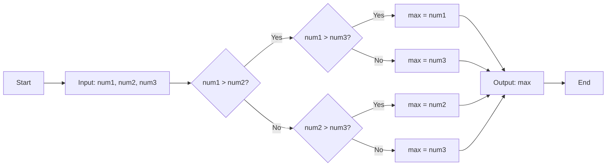
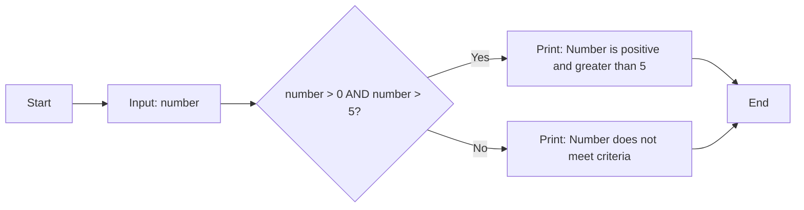

## Question 1(a) [3 marks]

**Define problem solving and list out the steps of problem solving.**

**Answer**:
Problem solving is a systematic approach to identify, analyze, and resolve challenges or issues using logical thinking and structured methods.

**Steps of Problem Solving:**

| Step | Description |
|------|-------------|
| 1. **Problem Identification** | Clearly understand and define the problem |
| 2. **Problem Analysis** | Break down the problem into smaller parts |
| 3. **Solution Design** | Develop possible solutions or algorithms |
| 4. **Implementation** | Execute the chosen solution |
| 5. **Testing & Validation** | Verify the solution works correctly |
| 6. **Documentation** | Record the solution for future reference |

**Mnemonic:** "I Always Design Implementation Tests Daily"

---

## Question 1(b) [4 marks]

**Define variable and mention rule for choosing names of variable.**

**Answer**:
A variable is a named storage location in memory that holds data values which can be changed during program execution.

**Variable Naming Rules:**

| Rule | Description |
|------|-------------|
| **Start Character** | Must begin with letter (a-z, A-Z) or underscore (_) |
| **Allowed Characters** | Can contain letters, digits (0-9), and underscores |
| **Case Sensitive** | myVar and MyVar are different variables |
| **No Keywords** | Cannot use Python reserved words (if, for, while) |
| **No Spaces** | Use underscore instead of spaces |
| **Descriptive Names** | Choose meaningful names (age, not x) |

**Mnemonic:** "Start Alphabetically, Continue Carefully, Never Keywords"

---

## Question 1(c) [7 marks]

**Design a flowchart to find maximum number out of three given numbers.**

**Answer**:
A flowchart shows the logical flow to find the maximum of three numbers using comparison operations.

**Flowchart:**



**Key Points:**

- **Input**: Three numbers (num1, num2, num3)
- **Process**: Compare numbers using nested conditions
- **Output**: Maximum value among the three

**Mnemonic:** "Compare First Two, Then With Third"

---

## Question 1(c OR) [7 marks]

**Construct an algorithm which checks entered number is positive and greater than 5 or not.**

**Answer**:
An algorithm to verify if a number is both positive and greater than 5.

**Algorithm:**

```
Algorithm: CheckPositiveGreaterThan5
Step 1: START
Step 2: INPUT number
Step 3: IF number > 0 AND number > 5 THEN
           PRINT "Number is positive and greater than 5"
        ELSE
           PRINT "Number does not meet criteria"
        END IF
Step 4: END
```

**Flowchart:**



**Key Conditions:**

- **Positive**: number > 0
- **Greater than 5**: number > 5
- **Combined**: Both conditions must be true

**Mnemonic:** "Positive Plus Five"

---

## Question 2(a) [3 marks]

**Write a short note on arithmetic operators.**

**Answer**:
Arithmetic operators perform mathematical calculations on numeric values in Python programming.

**Arithmetic Operators Table:**

| Operator | Name | Example | Result |
|----------|------|---------|--------|
| + | Addition | 5 + 3 | 8 |
| - | Subtraction | 5 - 3 | 2 |
| * | Multiplication | 5 * 3 | 15 |
| / | Division | 5 / 3 | 1.67 |
| // | Floor Division | 5 // 3 | 1 |
| % | Modulus | 5 % 3 | 2 |
| ** | Exponentiation | 5 ** 3 | 125 |

**Mnemonic:** "Add Subtract Multiply Divide Floor Mod Power"

---

## Question 2(b) [4 marks]

**Explain the need for continue and break statements.**

**Answer**:
Continue and break statements control loop execution flow for efficient programming.

**Statement Comparison:**

| Statement | Purpose | Action |
|-----------|---------|--------|
| **break** | Exit loop completely | Terminates entire loop |
| **continue** | Skip current iteration | Jumps to next iteration |

**Usage Examples:**

- **break**: Exit when condition met (finding specific value)
- **continue**: Skip invalid data (negative numbers in positive list)

**Benefits:**

- **Efficiency**: Avoid unnecessary iterations
- **Control**: Better program flow management
- **Clarity**: Cleaner code logic

**Mnemonic:** "Break Exits, Continue Skips"

---

## Question 2(c) [7 marks]

**Create a program to check whether entered number is even or odd.**

**Answer**:
A Python program using modulus operator to determine if a number is even or odd.

**Python Code:**

```python
# Program to check even or odd
number = int(input("Enter a number: "))

if number % 2 == 0:
    print(f"{number} is Even")
else:
    print(f"{number} is Odd")
```

**Logic Explanation:**

| Condition | Result | Explanation |
|-----------|--------|-------------|
| number % 2 == 0 | Even | Divisible by 2, no remainder |
| number % 2 == 1 | Odd | Not divisible by 2, remainder 1 |

**Sample Output:**

- Input: 8 → Output: "8 is Even"
- Input: 7 → Output: "7 is Odd"

**Mnemonic:** "Modulus Zero Even, One Odd"

---

## Question 2(a OR) [3 marks]

**Summarize the comparison operators of python.**

**Answer**:
Comparison operators compare values and return boolean results (True/False).

**Comparison Operators Table:**

| Operator | Name | Example | Result |
|----------|------|---------|--------|
| == | Equal to | 5 == 5 | True |
| != | Not equal to | 5 != 3 | True |
| > | Greater than | 5 > 3 | True |
| < | Less than | 5 < 3 | False |
| >= | Greater than or equal | 5 >= 5 | True |
| <= | Less than or equal | 5 <= 3 | False |

**Return Type:** All operators return boolean values (True/False)

**Mnemonic:** "Equal Not Greater Less Greater-Equal Less-Equal"

---

## Question 2(b OR) [4 marks]

**Write short note on while loop.**

**Answer**:
While loop repeatedly executes code block as long as condition remains true.

**While Loop Structure:**

| Component | Description |
|-----------|-------------|
| **Initialization** | Set initial value before loop |
| **Condition** | Boolean expression to test |
| **Body** | Code to execute repeatedly |
| **Update** | Modify variable to avoid infinite loop |

**Syntax:**

```python
while condition:
    # loop body
    # update statement
```

**Characteristics:**

- **Pre-tested**: Condition checked before execution
- **Variable iterations**: Unknown number of repetitions
- **Control**: Condition determines continuation

**Mnemonic:** "While Condition True, Execute Loop"

---

## Question 2(c OR) [7 marks]

**Create a program to read three numbers from the user and find the average of the numbers.**

**Answer**:
A Python program to calculate average of three user-input numbers.

**Python Code:**

```python
# Program to find average of three numbers
num1 = float(input("Enter first number: "))
num2 = float(input("Enter second number: "))
num3 = float(input("Enter third number: "))

average = (num1 + num2 + num3) / 3

print(f"Average of {num1}, {num2}, {num3} is: {average:.2f}")
```

**Calculation Process:**

| Step | Operation |
|------|-----------|
| **Input** | Read three numbers |
| **Sum** | Add all three numbers |
| **Divide** | Sum ÷ 3 |
| **Output** | Display formatted result |

**Sample Execution:**

- Input: 10, 20, 30
- Sum: 60
- Average: 20.00

**Mnemonic:** "Sum Three Divide Display"

---

## Question 3(a) [3 marks]

**Define control structures, List out control structures available in python.**

**Answer**:
Control structures determine the execution flow and order of statements in a program.

**Python Control Structures:**

| Type | Structures | Purpose |
|------|------------|---------|
| **Sequential** | Normal flow | Execute statements in order |
| **Selection** | if, if-else, elif | Choose between alternatives |
| **Iteration** | for, while | Repeat code blocks |
| **Jump** | break, continue, pass | Alter normal flow |

**Categories:**

- **Conditional**: Decision making (if statements)
- **Looping**: Repetition (for/while loops)
- **Branching**: Flow control (break/continue)

**Mnemonic:** "Sequence Select Iterate Jump"

---

## Question 3(b) [4 marks]

**Explain how to define and call user defined function by giving example.**

**Answer**:
User-defined functions are custom blocks of reusable code that perform specific tasks.

**Function Structure:**

| Component | Syntax | Purpose |
|-----------|--------|---------|
| **Definition** | def function_name(): | Create function |
| **Parameters** | def func(param1, param2): | Accept inputs |
| **Body** | Indented code block | Function logic |
| **Return** | return value | Send result back |
| **Call** | function_name() | Execute function |

**Example Code:**

```python
# Function definition
def greet_user(name):
    message = f"Hello, {name}!"
    return message

# Function call
result = greet_user("Python")
print(result)  # Output: Hello, Python!
```

**Mnemonic:** "Define Parameters Body Return Call"

---

## Question 3(c) [7 marks]

**Create a program to display the following patterns using loop concept**

**Answer**:
A Python program using nested loops to create number patterns.

**Python Code:**

```python
# Pattern printing program
for i in range(1, 6):
    for j in range(1, i + 1):
        print(i, end="")
    print()  # New line after each row
```

**Pattern Logic:**

| Row | Iterations | Output |
|-----|------------|--------|
| 1 | 1 time | 1 |
| 2 | 2 times | 22 |
| 3 | 3 times | 333 |
| 4 | 4 times | 4444 |
| 5 | 5 times | 55555 |

**Loop Structure:**

- **Outer loop**: Controls rows (1 to 5)
- **Inner loop**: Prints current row number
- **Pattern**: Row number repeated row times

**Mnemonic:** "Outer Rows Inner Repeats"

---

## Question 3(a OR) [3 marks]

**Explain nested loop using suitable example.**

**Answer**:
Nested loop is a loop inside another loop where inner loop completes all iterations for each outer loop iteration.

**Nested Loop Structure:**

| Component | Description |
|-----------|-------------|
| **Outer Loop** | Controls main iterations |
| **Inner Loop** | Executes completely for each outer iteration |
| **Execution** | Inner loop runs n×m times total |

**Example Code:**

```python
# Nested loop example - Multiplication table
for i in range(1, 4):      # Outer loop
    for j in range(1, 4):  # Inner loop
        print(f"{i}×{j}={i*j}", end=" ")
    print()  # New line
```

**Output Pattern:**

```
1×1=1 1×2=2 1×3=3
2×1=2 2×2=4 2×3=6
3×1=3 3×2=6 3×3=9
```

**Mnemonic:** "Loop Inside Loop"

---

## Question 3(b OR) [4 marks]

**Write short note on local and global scope of variables**

**Answer**:
Variable scope determines where variables can be accessed in a program.

**Scope Comparison:**

| Scope Type | Definition | Access | Lifetime |
|------------|------------|--------|----------|
| **Local** | Inside function | Function only | Function execution |
| **Global** | Outside functions | Entire program | Program execution |

**Example Code:**

```python
global_var = "I am global"  # Global scope

def my_function():
    local_var = "I am local"    # Local scope
    global global_var
    print(global_var)   # Accessible
    print(local_var)    # Accessible

print(global_var)   # Accessible
# print(local_var)  # Error - not accessible
```

**Key Points:**

- **Local**: Function-specific variables
- **Global**: Program-wide variables
- **Access**: Local overrides global in functions

**Mnemonic:** "Local Limited, Global General"

---

## Question 3(c OR) [7 marks]

**Develop a user-defined function to find the factorial of a given number.**

**Answer**:
A recursive function to calculate factorial of a positive integer.

**Python Code:**

```python
def factorial(n):
    """Calculate factorial of n"""
    if n == 0 or n == 1:
        return 1
    else:
        return n * factorial(n - 1)

# Test the function
number = int(input("Enter a number: "))
if number < 0:
    print("Factorial not defined for negative numbers")
else:
    result = factorial(number)
    print(f"Factorial of {number} is {result}")
```

**Factorial Logic:**

| Input | Calculation | Result |
|-------|-------------|--------|
| 0 | Base case | 1 |
| 1 | Base case | 1 |
| 5 | 5 × 4 × 3 × 2 × 1 | 120 |

**Function Features:**

- **Recursive**: Function calls itself
- **Base case**: Stops recursion at n=0 or n=1
- **Validation**: Handles negative inputs

**Mnemonic:** "Multiply All Previous Numbers"

---

## Question 4(a) [3 marks]

**Explain math module with various functions**

**Answer**:
Math module provides mathematical functions and constants for numerical computations.

**Math Module Functions:**

| Function | Purpose | Example |
|----------|---------|---------|
| **math.sqrt()** | Square root | math.sqrt(16) = 4.0 |
| **math.pow()** | Power calculation | math.pow(2, 3) = 8.0 |
| **math.ceil()** | Round up | math.ceil(4.3) = 5 |
| **math.floor()** | Round down | math.floor(4.7) = 4 |
| **math.factorial()** | Factorial | math.factorial(5) = 120 |

**Usage:**

```python
import math
result = math.sqrt(25)  # Returns 5.0
```

**Mnemonic:** "Square Power Ceiling Floor Factorial"

---

## Question 4(b) [4 marks]

**Discuss the following list functions: i. len() ii. sum() iii. sort() iv. index()**

**Answer**:
Essential list functions for data manipulation and analysis.

**List Functions Comparison:**

| Function | Purpose | Return Type | Example |
|----------|---------|-------------|---------|
| **len()** | Count elements | Integer | len([1,2,3]) = 3 |
| **sum()** | Add all numbers | Number | sum([1,2,3]) = 6 |
| **sort()** | Arrange in order | None (modifies list) | list.sort() |
| **index()** | Find element position | Integer | [1,2,3].index(2) = 1 |

**Usage Notes:**

- **len()**: Works with any sequence
- **sum()**: Only numeric lists
- **sort()**: Modifies original list
- **index()**: Returns first occurrence

**Mnemonic:** "Length Sum Sort Index"

---

## Question 4(c) [7 marks]

**Create a user-defined function to print the Fibonacci series of 0 to N numbers. (Where N is an integer number and passed as an argument)**

**Answer**:
A function to generate and display Fibonacci sequence up to N terms.

**Python Code:**

```python
def fibonacci_series(n):
    """Print Fibonacci series of n terms"""
    if n <= 0:
        print("Please enter a positive number")
        return
    
    # First two terms
    a, b = 0, 1
    
    if n == 1:
        print(f"Fibonacci series: {a}")
        return
    
    print(f"Fibonacci series: {a}, {b}", end="")
    
    # Generate remaining terms
    for i in range(2, n):
        c = a + b
        print(f", {c}", end="")
        a, b = b, c
    print()  # New line

# Test function
num = int(input("Enter number of terms: "))
fibonacci_series(num)
```

**Fibonacci Logic:**

| Term | Value | Calculation |
|------|-------|-------------|
| 1st | 0 | Given |
| 2nd | 1 | Given |
| 3rd | 1 | 0 + 1 |
| 4th | 2 | 1 + 1 |
| 5th | 3 | 1 + 2 |

**Mnemonic:** "Add Previous Two Numbers"

---

## Question 4(a OR) [3 marks]

**Explain random module with various functions**

**Answer**:
Random module generates random numbers and makes random selections for various applications.

**Random Module Functions:**

| Function | Purpose | Example |
|----------|---------|---------|
| **random()** | Float 0.0 to 1.0 | random.random() |
| **randint()** | Integer in range | random.randint(1, 10) |
| **choice()** | Random list element | random.choice([1,2,3]) |
| **shuffle()** | Mix list order | random.shuffle(list) |
| **uniform()** | Float in range | random.uniform(1.0, 5.0) |

**Usage:**

```python
import random
number = random.randint(1, 100)
```

**Applications:** Games, simulations, testing, cryptography

**Mnemonic:** "Random Range Choice Shuffle Uniform"

---

## Question 4(b OR) [4 marks]

**Build a python code to check whether given element is member of list or not.**

**Answer**:
A Python program to verify if an element exists in a list using membership operator.

**Python Code:**

```python
# Check element membership in list
def check_membership():
    # Sample list
    numbers = [10, 20, 30, 40, 50]
    
    # Get element to search
    element = int(input("Enter element to search: "))
    
    # Check membership
    if element in numbers:
        print(f"{element} is present in the list")
        print(f"Position: {numbers.index(element)}")
    else:
        print(f"{element} is not present in the list")

# Call function
check_membership()
```

**Membership Methods:**

| Method | Syntax | Returns |
|--------|--------|---------|
| **in operator** | element in list | Boolean |
| **not in operator** | element not in list | Boolean |
| **count() method** | list.count(element) | Integer |

**Mnemonic:** "In List True False"

---

## Question 4(c OR) [7 marks]

**Develop a user defined function that reverses the entered string words**

**Answer**:
A function to reverse each word in a string while maintaining word positions.

**Python Code:**

```python
def reverse_string_words(text):
    """Reverse each word in the string"""
    # Split string into words
    words = text.split()
    
    # Reverse each word
    reversed_words = []
    for word in words:
        reversed_word = word[::-1]  # Slice notation for reversal
        reversed_words.append(reversed_word)
    
    # Join words back
    result = " ".join(reversed_words)
    return result

# Test function
input_string = input("Enter a string: ")
output = reverse_string_words(input_string)
print(f"Input: \"{input_string}\"")
print(f"Output: \"{output}\"")

# Example with given input
test_input = "Hello IT"
test_output = reverse_string_words(test_input)
print(f"Input: \"{test_input}\"")
print(f"Output: \"{test_output}\"")  # Output: "olleH TI"
```

**Process Steps:**

| Step | Operation | Example |
|------|-----------|---------|
| 1 | Split into words | ["Hello", "IT"] |
| 2 | Reverse each word | ["olleH", "TI"] |
| 3 | Join with spaces | "olleH TI" |

**Mnemonic:** "Split Reverse Join"

---

## Question 5(a) [3 marks]

**Explain given string methods: i. count() ii. strip() iii. replace()**

**Answer**:
Essential string methods for text processing and manipulation.

**String Methods Comparison:**

| Method | Purpose | Syntax | Example |
|--------|---------|--------|---------|
| **count()** | Count occurrences | str.count(substring) | "hello".count("l") = 2 |
| **strip()** | Remove whitespace | str.strip() | " text ".strip() = "text" |
| **replace()** | Replace substring | str.replace(old, new) | "hi".replace("i", "ello") = "hello" |

**Return Values:**

- **count()**: Integer (number of occurrences)
- **strip()**: New string (whitespace removed)
- **replace()**: New string (replacements made)

**Mnemonic:** "Count Strip Replace"

---

## Question 5(b) [4 marks]

**Explain how to traverse a string by giving example.**

**Answer**:
String traversal means accessing each character in a string sequentially.

**Traversal Methods:**

| Method | Syntax | Use Case |
|--------|--------|----------|
| **Index-based** | for i in range(len(str)) | Need position |
| **Direct iteration** | for char in string | Just characters |
| **Enumerate** | for i, char in enumerate(str) | Both index and character |

**Example Code:**

```python
text = "Python"

# Method 1: Direct iteration
for char in text:
    print(char, end=" ")  # P y t h o n

# Method 2: Index-based
for i in range(len(text)):
    print(f"{i}: {text[i]}")

# Method 3: Enumerate
for index, character in enumerate(text):
    print(f"Position {index}: {character}")
```

**Mnemonic:** "Direct Index Enumerate"

---

## Question 5(c) [7 marks]

**Develop programs to perform the following list operations:**

**Answer**:
Two programs for essential list operations and analysis.

**Program 1: Check Element Existence**

```python
def check_element_exists(lst, element):
    """Check if element exists in list"""
    if element in lst:
        return True, lst.index(element)
    else:
        return False, -1

# Test program 1
numbers = [10, 25, 30, 45, 50]
search_item = int(input("Enter element to search: "))
exists, position = check_element_exists(numbers, search_item)

if exists:
    print(f"{search_item} found at position {position}")
else:
    print(f"{search_item} not found in list")
```

**Program 2: Find Smallest and Largest**

```python
def find_min_max(lst):
    """Find smallest and largest elements"""
    if not lst:  # Empty list check
        return None, None
    
    smallest = min(lst)
    largest = max(lst)
    return smallest, largest

# Test program 2
numbers = [15, 8, 23, 4, 16, 42]
min_val, max_val = find_min_max(numbers)
print(f"List: {numbers}")
print(f"Smallest: {min_val}")
print(f"Largest: {max_val}")
```

**Key Operations:**

- **Membership**: Using 'in' operator
- **Min/Max**: Built-in functions
- **Validation**: Empty list handling

**Mnemonic:** "Search Find Compare"

---

## Question 5(a OR) [3 marks]

**Explain slicing of list with example.**

**Answer**:
List slicing extracts specific portions of a list using index ranges.

**Slicing Syntax:**

| Format | Description | Example |
|--------|-------------|---------|
| **list[start:end]** | Elements from start to end-1 | [1,2,3,4][1:3] = [2,3] |
| **list[:end]** | From beginning to end-1 | [1,2,3,4][:2] = [1,2] |
| **list[start:]** | From start to end | [1,2,3,4][2:] = [3,4] |
| **list[::step]** | Every step element | [1,2,3,4][::2] = [1,3] |

**Example:**

```python
numbers = [0, 1, 2, 3, 4, 5]
print(numbers[1:4])   # [1, 2, 3]
print(numbers[:3])    # [0, 1, 2]
print(numbers[3:])    # [3, 4, 5]
print(numbers[::2])   # [0, 2, 4]
```

**Mnemonic:** "Start End Step"

---

## Question 5(b OR) [4 marks]

**Explain how to traverse a list by giving example.**

**Answer**:
List traversal involves accessing each element in a list systematically.

**Traversal Techniques:**

| Method | Syntax | Output Type |
|--------|--------|-------------|
| **Value iteration** | for item in list | Elements only |
| **Index iteration** | for i in range(len(list)) | Index access |
| **Enumerate** | for i, item in enumerate(list) | Index and value |

**Example Code:**

```python
fruits = ["apple", "banana", "orange"]

# Method 1: Direct value access
print("Values only:")
for fruit in fruits:
    print(fruit)

# Method 2: Index-based access
print("\nWith indices:")
for i in range(len(fruits)):
    print(f"Index {i}: {fruits[i]}")

# Method 3: Enumerate
print("\nUsing enumerate:")
for index, fruit in enumerate(fruits):
    print(f"{index} -> {fruit}")
```

**Use Cases:**

- **Value only**: Simple processing
- **Index access**: Position-dependent operations
- **Enumerate**: Both index and value needed

**Mnemonic:** "Value Index Both"

---

## Question 5(c OR) [7 marks]

**Develop python code to create list of prime and non-prime numbers in range 1 to 50.**

**Answer**:
A Python program to categorize numbers into prime and non-prime lists.

**Python Code:**

```python
def is_prime(n):
    """Check if a number is prime"""
    if n < 2:
        return False
    for i in range(2, int(n**0.5) + 1):
        if n % i == 0:
            return False
    return True

def categorize_numbers(start, end):
    """Create lists of prime and non-prime numbers"""
    prime_numbers = []
    non_prime_numbers = []
    
    for num in range(start, end + 1):
        if is_prime(num):
            prime_numbers.append(num)
        else:
            non_prime_numbers.append(num)
    
    return prime_numbers, non_prime_numbers

# Generate lists for 1 to 50
primes, non_primes = categorize_numbers(1, 50)

print("Prime numbers (1-50):")
print(primes)
print(f"\nTotal prime numbers: {len(primes)}")

print("\nNon-prime numbers (1-50):")
print(non_primes)
print(f"\nTotal non-prime numbers: {len(non_primes)}")
```

**Prime Logic:**

| Number Type | Condition | Examples |
|-------------|-----------|----------|
| **Prime** | Only divisible by 1 and itself | 2, 3, 5, 7, 11 |
| **Non-Prime** | Has other divisors | 1, 4, 6, 8, 9 |

**Algorithm Steps:**

- **Check divisibility** from 2 to √n
- **Categorize** based on prime test
- **Store** in appropriate lists

**Mnemonic:** "Check Divide Categorize Store"
