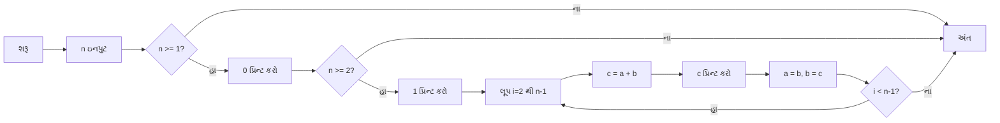
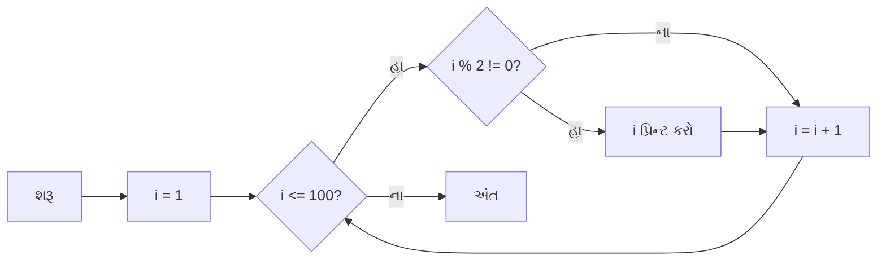
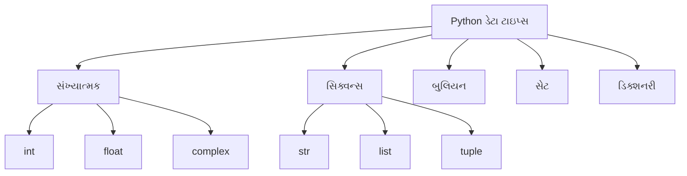

## પ્રશ્ન 1(અ) [3 ગુણ]

**ફ્લો ચાર્ટ શું છે? ફ્લો ચાર્ટમાં વપરાતા પ્રતીકોની યાદી બનાવો.**

**જવાબ**:

**ફ્લો ચાર્ટ** એ અલ્ગોરિધમની ગ્રાફિકલ રજૂઆત છે જે પ્રક્રિયાના પગલાંઓ અને નિર્ણય બિંદુઓ દર્શાવે છે.

**ફ્લો ચાર્ટ પ્રતીકોનું ટેબલ:**

| પ્રતીક | નામ | ઉપયોગ |
|--------|------|---------|
| અંડાકાર | ટર્મિનલ | પ્રારંભ/અંત |
| લંબચોરસ | પ્રોસેસ | પ્રક્રિયા/ગણતરી |
| હીરો | નિર્ણય | શરતી નિવેદનો |
| સમાંતર ચતુષ્કોણ | ઇનપુટ/આઉટપુટ | ડેટા લેવો/આપવો |
| વૃત્ત | કનેક્ટર | ભાગોને જોડવા |
| તીર | ફ્લો લાઇન | દિશા |

**મુખ્ય બિંદુઓ:**

- **વિઝ્યુઅલ રજૂઆત**: પ્રોગ્રામ લોજિક ગ્રાફિકલી દર્શાવે
- **પગલાં દર પગલાં**: ક્રમિક ઓપરેશનનો ફ્લો
- **નિર્ણય લેવો**: હીરા શરતી શાખાઓ દર્શાવે

**મેમરી ટ્રીક:** "ફ્લો ચાર્ટ્સ પ્રોગ્રામ સ્ટેપ્સ વિઝ્યુઅલી દર્શાવે"

## પ્રશ્ન 1(બ) [4 ગુણ]

**for લૂપ માટે ટૂંકી નોંધ લખો.**

**જવાબ**:

**for લૂપ** Python માં સિક્વન્સ (list, tuple, string, range) પર iterate કરવા માટે વપરાય છે.

**For લૂપ ટેબલ:**

| ઘટક | સિન્ટેક્સ | ઉદાહરણ |
|-----------|--------|---------|
| મૂળભૂત | `for variable in sequence:` | `for i in range(5):` |
| રેન્જ | `range(start, stop, step)` | `range(1, 10, 2)` |
| યાદી | `for item in list:` | `for x in [1,2,3]:` |
| સ્ટ્રિંગ | `for char in string:` | `for c in "hello":` |

**સરળ કોડ ઉદાહરણ:**

```python
for i in range(3):
    print(i)
# આઉટપુટ: 0, 1, 2
```

**મુખ્ય લક્ષણો:**

- **ઓટોમેટિક iteration**: મેન્યુઅલ કાઉન્ટરની જરૂર નથી
- **સિક્વન્સ ટ્રાવર્સલ**: કોઈપણ iterable ઓબ્જેક્ટ સાથે કામ કરે
- **રેન્જ ફંક્શન**: નંબર સિક્વન્સ સરળતાથી બનાવે

**મેમરી ટ્રીક:** "For લૂપ્સ સિક્વન્સમાં iterate કરે"

## પ્રશ્ન 1(ક) [7 ગુણ]

**ફિબોનાકી શ્રેણીને nમી ટર્મ સુધી દર્શાવવા માટે એક પ્રોગ્રામ લખો જ્યાં યુઝર દ્વારા n આપવામાં આવે છે.**

**જવાબ**:

**ફિબોનાકી શ્રેણી પ્રોગ્રામ:**

```python
# યુઝર પાસેથી ટર્મ્સની સંખ્યા લો
n = int(input("ટર્મ્સની સંખ્યા દાખલ કરો: "))

# પ્રથમ બે ટર્મ્સ initialize કરો
a, b = 0, 1

# પ્રથમ ટર્મ દર્શાવો
if n >= 1:
    print(a, end=" ")
    
# બીજી ટર્મ દર્શાવો
if n >= 2:
    print(b, end=" ")

# બાકીની ટર્મ્સ જનરેટ કરો
for i in range(2, n):
    c = a + b
    print(c, end=" ")
    a, b = b, c
```

**અલ્ગોરિધમ ફ્લો:**



**મુખ્ય કોન્સેપ્ટ્સ:**

- **સિક્વેન્શિયલ જનરેશન**: દરેક ટર્મ = પાછલી બે ટર્મનો સરવાળો
- **વેરિયેબલ સ્વેપિંગ**: a, b વેલ્યુઝ અસરકારક રીતે અપડેટ કરો
- **યુઝર ઇનપુટ**: ડાયનેમિક શ્રેણી લેન્થ

**મેમરી ટ્રીક:** "ફિબોનાકી: પાછલા બે નંબરો ઉમેરો"

## પ્રશ્ન 1(ક OR) [7 ગુણ]

**1 થી 100 સુધીના ODD નંબરો પ્રિન્ટ કરવા માટે ફ્લો ચાર્ટ દોરો.**

**જવાબ**:

**1 થી 100 ODD નંબરો માટે ફ્લોચાર્ટ:**



**અનુસંગિક Python કોડ:**

```python
for i in range(1, 101):
    if i % 2 != 0:
        print(i, end=" ")
```

**વૈકલ્પિક પદ્ધતિ:**

```python
for i in range(1, 101, 2):
    print(i, end=" ")
```

**મુખ્ય તત્વો:**

- **લૂપ કંટ્રોલ**: i 1 થી 100 સુધી
- **વિષમ ચેક**: i % 2 != 0 શરત
- **સ્ટેપ વધારો**: આગલા નંબર પર જાઓ

**મેમરી ટ્રીક:** "વિષમ નંબરો: 2 થી ભાગ્યે 1 બાકી"

## પ્રશ્ન 2(અ) [3 ગુણ]

**નંબર પેલિન્ડ્રોમ છે કે નહીં તે શોધવા માટે પ્રોગ્રામ લખો.**

**જવાબ**:

**પેલિન્ડ્રોમ ચેક પ્રોગ્રામ:**

```python
# નંબર ઇનપુટ
num = int(input("નંબર દાખલ કરો: "))
temp = num
reverse = 0

# નંબરને રિવર્સ કરો
while temp > 0:
    reverse = reverse * 10 + temp % 10
    temp = temp // 10

# પેલિન્ડ્રોમ ચેક કરો
if num == reverse:
    print(f"{num} પેલિન્ડ્રોમ છે")
else:
    print(f"{num} પેલિન્ડ્રોમ નથી")
```

**અલ્ગોરિધમ ટેબલ:**

| પગલું | ઓપરેશન | ઉદાહરણ (121) |
|------|-----------|---------------|
| 1 | છેલ્લો અંક મેળવો | 121 % 10 = 1 |
| 2 | રિવર્સ બનાવો | 0*10 + 1 = 1 |
| 3 | છેલ્લો અંક દૂર કરો | 121 // 10 = 12 |
| 4 | 0 સુધી પુનરાવર્તન | પ્રક્રિયા ચાલુ રાખો |

**મુખ્ય બિંદુઓ:**

- **ડિજિટ એક્સ્ટ્રેક્શન**: મોડ્યુલો (%) ઓપરેટર વાપરો
- **રિવર્સ બિલ્ડિંગ**: 10 થી ગુણા કરી ડિજિટ ઉમેરો
- **સરખામણી**: મૂળ બરાબર રિવર્સ

**મેમરી ટ્રીક:** "પેલિન્ડ્રોમ આગળ પાછળ સરખું વાંચાય"

## પ્રશ્ન 2(બ) [4 ગુણ]

**Python પ્રોગ્રામિંગની વિશેષતાઓ સમજાવો.**

**જવાબ**:

**Python વિશેષતાઓનું ટેબલ:**

| વિશેષતા | વર્ણન | ફાયદો |
|---------|-------------|---------|
| સરળ સિન્ટેક્સ | સાદો, વાંચી શકાય તેવો કોડ | ઝડપી ડેવલપમેન્ટ |
| ઇન્ટરપ્રિટેડ | કમ્પાઇલેશનની જરૂર નથી | ઝડપી ટેસ્ટિંગ |
| ઓબ્જેક્ટ-ઓરિએન્ટેડ | ક્લાસ અને ઓબ્જેક્ટ સપોર્ટ | કોડ રિયુઝેબિલિટી |
| ઓપન સોર્સ | વાપરવા માટે ફ્રી | લાઇસન્સિંગ કોસ્ટ નથી |
| ક્રોસ-પ્લેટફોર્મ | મલ્ટિપલ OS પર ચાલે | વ્યાપક કમ્પેટિબિલિટી |
| મોટી લાઇબ્રેરીઓ | વ્યાપક બિલ્ટ-ઇન મોડ્યુલ્સ | સમૃદ્ધ કાર્યક્ષમતા |

**મુખ્ય ફાયદાઓ:**

- **શિખાઉ-મિત્ર**: શીખવામાં અને સમજવામાં સરળ
- **વર્સેટાઇલ**: વેબ ડેવલપમેન્ટ, AI, ડેટા સાયન્સ
- **કોમ્યુનિટી સપોર્ટ**: મોટો ડેવલપર કોમ્યુનિટી
- **ડાયનેમિક ટાઇપિંગ**: વેરિયેબલ ટાઇપ ડિક્લેરેશનની જરૂર નથી

**મેમરી ટ્રીક:** "Python: સરળ, શક્તિશાળી, લોકપ્રિય પ્રોગ્રામિંગ"

## પ્રશ્ન 2(ક) [7 ગુણ]

**Python પ્રોગ્રામની બેસિક સ્ટ્રક્ચર સમજાવો.**

**જવાબ**:

**Python પ્રોગ્રામ સ્ટ્રક્ચર:**

```python
#!/usr/bin/env python3
# Shebang લાઇન (વૈકલ્પિક)

"""
ડોક્યુમેન્ટેશન સ્ટ્રિંગ (docstring)
પ્રોગ્રામનો હેતુ વર્ણવે છે
"""

# Import સ્ટેટમેન્ટ્સ
import math
from datetime import date

# ગ્લોબલ વેરિયેબલ્સ
PI = 3.14159
count = 0

# ફંક્શન ડેફિનિશન્સ
def calculate_area(radius):
    """વર્તુળનો ક્ષેત્રફળ કેલ્ક્યુલેટ કરે"""
    return PI * radius * radius

# ક્લાસ ડેફિનિશન્સ
class Calculator:
    def __init__(self):
        self.result = 0

# મેઇન પ્રોગ્રામ એક્ઝિક્યુશન
if __name__ == "__main__":
    # પ્રોગ્રામ લોજિક અહીં
    radius = 5
    area = calculate_area(radius)
    print(f"ક્ષેત્રફળ: {area}")
```

**સ્ટ્રક્ચર કમ્પોનન્ટ્સ ટેબલ:**

| કમ્પોનન્ટ | હેતુ | ઉદાહરણ |
|-----------|---------|---------|
| Shebang | સિસ્ટમ ઇન્ટરપ્રિટર | `#!/usr/bin/env python3` |
| Docstring | પ્રોગ્રામ ડોક્યુમેન્ટેશન | `"""પ્રોગ્રામ વર્ણન"""` |
| Imports | બાહ્ય મોડ્યુલ્સ | `import math` |
| વેરિયેબલ્સ | ગ્લોબલ ડેટા સ્ટોરેજ | `PI = 3.14159` |
| ફંક્શન્સ | પુનઃવપરાશ કોડ બ્લોક્સ | `def function_name():` |
| ક્લાસીસ | ઓબ્જેક્ટ ટેમ્પ્લેટ્સ | `class ClassName:` |
| મેઇન બ્લોક | પ્રોગ્રામ એક્ઝિક્યુશન | `if __name__ == "__main__":` |

**મુખ્ય સિદ્ધાંતો:**

- **ઇન્ડેન્ટેશન**: કોડ બ્લોક્સ વ્યાખ્યાયિત કરે (4 સ્પેસીસ આગ્રહણીય)
- **કોમેન્ટ્સ**: સિંગલ લાઇન માટે #, મલ્ટિ-લાઇન માટે """ """
- **મોડ્યુલેરિટી**: ફંક્શન અને ક્લાસમાં કોડ ગોઠવો

**મેમરી ટ્રીક:** "સ્ટ્રક્ચર: ઇમ્પોર્ટ, ડિફાઇન, એક્ઝિક્યુટ"

## પ્રશ્ન 2(અ OR) [3 ગુણ]

**સ્ટ્રિંગને રિવર્સ કરવા માટે પ્રોગ્રામ લખો.**

**જવાબ**:

**સ્ટ્રિંગ રિવર્સલ પ્રોગ્રામ:**

```python
# પદ્ધતિ 1: સ્લાઇસિંગ વાપરીને
string = input("સ્ટ્રિંગ દાખલ કરો: ")
reversed_string = string[::-1]
print(f"રિવર્સ: {reversed_string}")

# પદ્ધતિ 2: લૂપ વાપરીને
string = input("સ્ટ્રિંગ દાખલ કરો: ")
reversed_string = ""
for char in string:
    reversed_string = char + reversed_string
print(f"રિવર્સ: {reversed_string}")
```

**રિવર્સલ પદ્ધતિઓનું ટેબલ:**

| પદ્ધતિ | સિન્ટેક્સ | ઉદાહરણ |
|--------|--------|---------|
| સ્લાઇસિંગ | `string[::-1]` | "hello" → "olleh" |
| લૂપ | કેરેક્ટર દ્વારા કેરેક્ટર બનાવો | દરેક char આગળ ઉમેરો |
| બિલ્ટ-ઇન | `"".join(reversed(string))` | રિવર્સ સિક્વન્સ જોડો |

**મુખ્ય કોન્સેપ્ટ્સ:**

- **સ્લાઇસિંગ**: સૌથી અસરકારક પદ્ધતિ
- **કન્કેટેનેશન**: કેરેક્ટર દ્વારા કેરેક્ટર સ્ટ્રિંગ બનાવો
- **ઇન્ડેક્સિંગ**: સ્ટ્રિંગ પોઝિશન્સ એક્સેસ કરો

**મેમરી ટ્રીક:** "રિવર્સ: છેલ્લો કેરેક્ટર પહેલો"

## પ્રશ્ન 2(બ OR) [4 ગુણ]

**લોજિકલ ઓપરેટર્સને ઉદાહરણ સાથે સમજાવો.**

**જવાબ**:

**Python લોજિકલ ઓપરેટર્સ:**

| ઓપરેટર | સિમ્બોલ | વર્ણન | ઉદાહરણ | પરિણામ |
|----------|--------|-------------|---------|--------|
| AND | `and` | બંને શરતો સાચી | `True and False` | `False` |
| OR | `or` | ઓછામાં ઓછી એક શરત સાચી | `True or False` | `True` |
| NOT | `not` | શરતની વિરુદ્ધ | `not True` | `False` |

**ઉદાહરણ કોડ:**

```python
a = 10
b = 5

# AND ઓપરેટર
if a > 5 and b < 10:
    print("બંને શરતો સાચી")

# OR ઓપરેટર  
if a > 15 or b < 10:
    print("ઓછામાં ઓછી એક શરત સાચી")

# NOT ઓપરેટર
if not (a < 5):
    print("a 5 કરતાં નાનું નથી")
```

**ટ્રુથ ટેબલ:**

| A | B | A and B | A or B | not A |
|---|---|---------|--------|-------|
| T | T | T | T | F |
| T | F | F | T | F |
| F | T | F | T | T |
| F | F | F | F | T |

**મુખ્ય ઉપયોગો:**

- **જટિલ શરતો**: બહુવિધ ચેક્સ કંબાઇન કરો
- **નિર્ણય લેવો**: પ્રોગ્રામ ફ્લો કંટ્રોલ કરો
- **બુલિયન લોજિક**: True/False ઓપરેશન્સ

**મેમરી ટ્રીક:** "AND બધાની જરૂર, OR એકની જરૂર, NOT ઉલટાવે"

## પ્રશ્ન 2(ક OR) [7 ગુણ]

**Python માં વિવિધ ડેટા પ્રકારો સમજાવો**

**જવાબ**:

**Python ડેટા ટાઇપ્સ વર્ગીકરણ:**



**ડેટા ટાઇપ્સ ટેબલ:**

| ટાઇપ | ઉદાહરણ | વર્ણન | Mutable |
|------|---------|-------------|---------|
| int | `42` | પૂર્ણ સંખ્યાઓ | ના |
| float | `3.14` | દશાંશ સંખ્યાઓ | ના |
| str | `"hello"` | ટેક્સ્ટ ડેટા | ના |
| list | `[1,2,3]` | ક્રમાંકિત સંગ્રહ | હા |
| tuple | `(1,2,3)` | ક્રમાંકિત અપરિવર્તનીય | ના |
| dict | `{"a":1}` | કી-વેલ્યુ જોડીઓ | હા |
| bool | `True/False` | બુલિયન વેલ્યુઝ | ના |
| set | `{1,2,3}` | યુનિક તત્વો | હા |

**ઉદાહરણ કોડ:**

```python
# સંખ્યાત્મક ટાઇપ્સ
age = 25          # int
price = 99.99     # float
complex_num = 3+4j # complex

# સિક્વન્સ ટાઇપ્સ
name = "Python"         # string
numbers = [1,2,3,4]     # list
coordinates = (10,20)   # tuple

# અન્ય ટાઇપ્સ
is_active = True        # boolean
unique_items = {1,2,3}  # set
student = {"name":"John", "age":20}  # dict
```

**મુખ્ય લક્ષણો:**

- **ડાયનેમિક ટાઇપિંગ**: વેરિયેબલ ટાઇપ ડિક્લેર કરવાની જરૂર નથી
- **ટાઇપ કન્વર્ઝન**: સુસંગત ટાઇપ્સ વચ્ચે કન્વર્ટ કરો
- **બિલ્ટ-ઇન ફંક્શન્સ**: ચેકિંગ માટે `type()`, `isinstance()`

**મેમરી ટ્રીક:** "Python ટાઇપ્સ: નંબર્સ, સિક્વન્સીસ, કલેક્શન્સ"

## પ્રશ્ન 3(અ) [3 ગુણ]

**Python માં ફ્લો કંટ્રોલ શું છે? ઉદાહરણ સાથે સમજાવો**

**જવાબ**:

**ફ્લો કંટ્રોલ** શરતી અને લૂપ સ્ટ્રક્ચર્સ વાપરીને પ્રોગ્રામ સ્ટેટમેન્ટ્સનો એક્ઝિક્યુશન ઓર્ડર મેનેજ કરે છે.

**ફ્લો કંટ્રોલ પ્રકારોનું ટેબલ:**

| પ્રકાર | સ્ટેટમેન્ટ | હેતુ | ઉદાહરણ |
|------|-----------|---------|---------|
| સિક્વેન્શિયલ | સામાન્ય એક્ઝિક્યુશન | લાઇન બાય લાઇન | `print("Hello")` |
| સિલેક્શન | if, elif, else | નિર્ણય લેવો | `if x > 0:` |
| Iteration | for, while | પુનરાવર્તન | `for i in range(5):` |
| Jump | break, continue | લૂપ કંટ્રોલ | `break` |

**ઉદાહરણ કોડ:**

```python
# સિલેક્શન ઉદાહરણ
age = 18
if age >= 18:
    print("પુખ્ત")
else:
    print("બાલક")

# Iteration ઉદાહરણ
for i in range(3):
    print(f"ગણતરી: {i}")
```

**મુખ્ય કોન્સેપ્ટ્સ:**

- **શરતી એક્ઝિક્યુશન**: શરતોના આધારે કોડ ચાલે
- **લૂપ સ્ટ્રક્ચર્સ**: કોડ બ્લોક્સ પુનરાવર્તન
- **પ્રોગ્રામ ફ્લો**: એક્ઝિક્યુશન પાથ કંટ્રોલ

**મેમરી ટ્રીક:** "ફ્લો કંટ્રોલ: નિર્ણય, પુનરાવર્તન, Jump"

## પ્રશ્ન 3(બ) [4 ગુણ]

**નેસ્ટેડ if સ્ટેટમેન્ટ સમજાવવા માટે પ્રોગ્રામ લખો.**

**જવાબ**:

**નેસ્ટેડ If સ્ટેટમેન્ટ પ્રોગ્રામ:**

```python
# નેસ્ટેડ if વાપરીને ગ્રેડ કેલ્ક્યુલેશન
marks = int(input("માર્ક્સ દાખલ કરો: "))

if marks >= 0 and marks <= 100:
    if marks >= 90:
        grade = "A+"
    elif marks >= 80:
        if marks >= 85:
            grade = "A"
        else:
            grade = "B+"
    elif marks >= 70:
        grade = "B"
    elif marks >= 60:
        grade = "C"
    else:
        grade = "F"
    print(f"ગ્રેડ: {grade}")
else:
    print("અયોગ્ય માર્ક્સ")
```

**નેસ્ટેડ સ્ટ્રક્ચર ડાયાગ્રામ:**

```goat
                    marks input
                         |
                   ┌─────▼───────┐
                   │0<=marks<=100│
                   └─────┬───────┘
              True       │       False
           ┌─────────────┼─────────────┐
           │             │             │
      ┌────▼────┐        │        ┌────▼────┐
      │marks>=90│        │        │ Invalid │
      └────┬────┘        │        └─────────┘
           │             │
         A+│           ┌─▼─┐
           │           │...│
           │           └───┘
```

**મુખ્ય લક્ષણો:**

- **બહુવિધ સ્તરો**: if સ્ટેટમેન્ટ્સ અંદર if સ્ટેટમેન્ટ્સ
- **જટિલ શરતો**: બહુવિધ માપદંડો હેન્ડલ કરો
- **લોજિકલ સ્ટ્રક્ચર**: નિર્ણય વૃક્ષો ગોઠવો

**મેમરી ટ્રીક:** "નેસ્ટેડ If: નિર્ણયોની અંદર નિર્ણયો"

## પ્રશ્ન 3(ક) [7 ગુણ]

**Arguments અને Parameters ના પ્રકારો સમજાવવા માટે એક પ્રોગ્રામ લખો.**

**જવાબ**:

**Arguments અને Parameters ના પ્રકારો:**

```python
# 1. પોઝિશનલ Arguments
def greet(name, age):
    print(f"હેલો {name}, તમારી ઉંમર {age} વર્ષ છે")

greet("જોન", 25)  # પોઝિશનલ arguments

# 2. કીવર્ડ Arguments  
greet(age=30, name="એલિસ")  # કીવર્ડ arguments

# 3. ડિફૉલ્ટ Parameters
def introduce(name, city="અજાણ"):
    print(f"{name} {city} માં રહે છે")

introduce("બોબ")  # ડિફૉલ્ટ વેલ્યુ વાપરે
introduce("કેરોલ", "મુંબઈ")  # ડિફૉલ્ટ ઓવરરાઇડ

# 4. વેરિયેબલ-લેન્થ Arguments (*args)
def sum_all(*numbers):
    return sum(numbers)

result = sum_all(1, 2, 3, 4, 5)
print(f"સરવાળો: {result}")

# 5. કીવર્ડ વેરિયેબલ Arguments (**kwargs)
def display_info(**info):
    for key, value in info.items():
        print(f"{key}: {value}")

display_info(name="ડેવિડ", age=28, city="બોસ્ટન")
```

**Parameters પ્રકારોનું ટેબલ:**

| પ્રકાર | સિન્ટેક્સ | ઉદાહરણ | વર્ણન |
|------|--------|---------|-------------|
| પોઝિશનલ | `def func(a, b):` | `func(1, 2)` | ક્રમ મહત્વનો |
| કીવર્ડ | `def func(a, b):` | `func(b=2, a=1)` | નામ સ્પેસિફાઇડ |
| ડિફૉલ્ટ | `def func(a, b=10):` | `func(5)` | ડિફૉલ્ટ વેલ્યુ |
| *args | `def func(*args):` | `func(1,2,3)` | વેરિયેબલ પોઝિશનલ |
| **kwargs | `def func(**kwargs):` | `func(a=1, b=2)` | વેરિયેબલ કીવર્ડ |

**મુખ્ય કોન્સેપ્ટ્સ:**

- **લવચીકતા**: ડેટા પાસ કરવાની વિવિધ રીતો
- **ક્રમ મહત્વ**: પોઝિશનલ vs કીવર્ડ
- **વેરિયેબલ arguments**: અજાણી સંખ્યાના ઇનપુટ્સ હેન્ડલ કરો

**મેમરી ટ્રીક:** "Parameters: પોઝિશન, કીવર્ડ્સ, ડિફૉલ્ટ્સ, વેરિયેબલ્સ"

## પ્રશ્ન 3(અ OR) [3 ગુણ]

**break અને continue statement ને ઉદાહરણ સાથે સમજાવો.**

**જવાબ**:

**Break અને Continue સ્ટેટમેન્ટ્સ:**

**Break સ્ટેટમેન્ટ:**

```python
# Break ઉદાહરણ - લૂપમાંથી બહાર નીકળો
for i in range(10):
    if i == 5:
        break
    print(i)
# આઉટપુટ: 0, 1, 2, 3, 4
```

**Continue સ્ટેટમેન્ટ:**

```python
# Continue ઉદાહરણ - iteration છોડો
for i in range(5):
    if i == 2:
        continue
    print(i)
# આઉટપુટ: 0, 1, 3, 4
```

**સરખામણી ટેબલ:**

| સ્ટેટમેન્ટ | હેતુ | ક્રિયા | ઉદાહરણ ઉપયોગ |
|-----------|---------|--------|-------------|
| break | લૂપમાંથી બહાર નીકળો | સંપૂર્ણ લૂપ સમાપ્ત કરે | શરત પર બહાર નીકળો |
| continue | iteration છોડો | આગલા iteration પર જાઓ | સ્પેસિફિક વેલ્યુઝ છોડો |

**મુખ્ય તફાવતો:**

- **Break**: લૂપમાંથી સંપૂર્ણે બહાર નીકળે
- **Continue**: માત્ર વર્તમાન iteration છોડે
- **ફ્લો કંટ્રોલ**: લૂપ એક્ઝિક્યુશન મેનેજ કરે

**મેમરી ટ્રીક:** "Break બહાર નીકળે, Continue છોડે"

## પ્રશ્ન 3(બ OR) [4 ગુણ]

**નીચેની પેટર્ન દર્શાવવા માટે એક પ્રોગ્રામ બનાવો**

```
1
12
123
1234
12345
```

**જવાબ**:

**નંબર પેટર્ન પ્રોગ્રામ:**

```python
# પદ્ધતિ 1: નેસ્ટેડ લૂપ્સ વાપરીને
rows = 5
for i in range(1, rows + 1):
    for j in range(1, i + 1):
        print(j, end="")
    print()  # નવી લાઇન

# પદ્ધતિ 2: સ્ટ્રિંગ મેનિપ્યુલેશન વાપરીને
for i in range(1, 6):
    line = ""
    for j in range(1, i + 1):
        line += str(j)
    print(line)

# પદ્ધતિ 3: join વાપરીને
for i in range(1, 6):
    numbers = [str(j) for j in range(1, i + 1)]
    print("".join(numbers))
```

**પેટર્ન લોજિક ટેબલ:**

| પંક્તિ | નંબર્સ | રેન્જ | આઉટપુટ |
|-----|---------|-------|--------|
| 1 | 1 | 1 થી 1 | 1 |
| 2 | 1,2 | 1 થી 2 | 12 |
| 3 | 1,2,3 | 1 થી 3 | 123 |
| 4 | 1,2,3,4 | 1 થી 4 | 1234 |
| 5 | 1,2,3,4,5 | 1 થી 5 | 12345 |

**મુખ્ય કોન્સેપ્ટ્સ:**

- **નેસ્ટેડ લૂપ્સ**: બાહ્ય પંક્તિઓ માટે, અંદરૂની નંબર્સ માટે
- **રેન્જ ફંક્શન**: નંબર સિક્વન્સ જનરેટ કરે
- **પ્રિન્ટ કંટ્રોલ**: નવી લાઇનો ટાળવા માટે end="" વાપરો

**મેમરી ટ્રીક:** "પેટર્ન: પંક્તિ નંબર કોલમ કાઉન્ટ નક્કી કરે"

## પ્રશ્ન 3(ક OR) [7 ગુણ]

**દરેક માટે કોડ લખીને નીચેના ગાણિતિક કાર્યો સમજાવો: 1. abs() 2. max() 3. pow() 4. sum()**

**જવાબ**:

**Python માં ગાણિતિક ફંક્શન્સ:**

```python
# 1. abs() - એબ્સોલ્યુટ વેલ્યુ
numbers = [-5, 3.7, -10.2, 0]
print("abs() ફંક્શન ઉદાહરણો:")
for num in numbers:
    print(f"abs({num}) = {abs(num)}")

# 2. max() - મહત્તમ વેલ્યુ
list1 = [4, 7, 2, 9, 1]
print(f"\nmax() ફંક્શન ઉદાહરણો:")
print(f"max({list1}) = {max(list1)}")
print(f"max(10, 25, 5) = {max(10, 25, 5)}")
print(f"max('hello') = {max('hello')}")  # વર્ણમાળા પ્રમાણે

# 3. pow() - પાવર ફંક્શન
print(f"\npow() ફંક્શન ઉદાહરણો:")
print(f"pow(2, 3) = {pow(2, 3)}")      # 2^3 = 8
print(f"pow(5, 2) = {pow(5, 2)}")      # 5^2 = 25
print(f"pow(8, 1/3) = {pow(8, 1/3)}")  # 8 નો ઘન મૂળ

# 4. sum() - સરવાળો ફંક્શન
numbers = [1, 2, 3, 4, 5]
print(f"\nsum() ફંક્શન ઉદાહરણો:")
print(f"sum({numbers}) = {sum(numbers)}")
print(f"sum({numbers}, 10) = {sum(numbers, 10)}")  # શરૂઆતી વેલ્યુ સાથે
```

**ફંક્શન્સ સારાંશ ટેબલ:**

| ફંક્શન | સિન્ટેક્સ | હેતુ | ઉદાહરણ | પરિણામ |
|----------|--------|---------|---------|--------|
| abs() | `abs(x)` | એબ્સોલ્યુટ વેલ્યુ | `abs(-5)` | 5 |
| max() | `max(iterable)` | મહત્તમ વેલ્યુ | `max([1,5,3])` | 5 |
| pow() | `pow(x, y)` | x ને y ની પાવર | `pow(2, 3)` | 8 |
| sum() | `sum(iterable)` | વેલ્યુઝનો સરવાળો | `sum([1,2,3])` | 6 |

**મુખ્ય ઉપયોગો:**

- **abs()**: અંતર ગણતરી, એરર હેન્ડલિંગ
- **max()**: મહત્તમ શોધવું, સ્પર્ધાના પરિણામો
- **pow()**: વૈજ્ઞાનિક ગણતરી, ચક્રવૃદ્ધિ વ્યાજ
- **sum()**: કુલ ગણતરી, આંકડાશાસ્ત્ર

**મેમરી ટ્રીક:** "Math ફંક્શન્સ: એબ્સોલ્યુટ, મહત્તમ, પાવર, સરવાળો"

## પ્રશ્ન 4(અ) [3 ગુણ]

**Variables નો scope સમજાવો.**

**જવાબ**:

**વેરિયેબલ સ્કોપ** એ પ્રોગ્રામમાં તે પ્રદેશનો સંદર્ભ આપે છે જ્યાં વેરિયેબલ એક્સેસ કરી શકાય.

**સ્કોપ પ્રકારોનું ટેબલ:**

| સ્કોપ | વર્ણન | જીવનકાળ | એક્સેસ |
|-------|-------------|----------|--------|
| લોકલ | ફંક્શનની અંદર | ફંક્શન એક્ઝિક્યુશન | માત્ર ફંક્શન |
| ગ્લોબલ | ફંક્શનોની બહાર | પ્રોગ્રામ એક્ઝિક્યુશન | આખો પ્રોગ્રામ |
| બિલ્ટ-ઇન | Python કીવર્ડ્સ | Python સેશન | બધે |

**ઉદાહરણ કોડ:**

```python
x = 10  # ગ્લોબલ વેરિયેબલ

def my_function():
    y = 20  # લોકલ વેરિયેબલ
    print(f"લોકલ y: {y}")
    print(f"ગ્લોબલ x: {x}")

my_function()
print(f"ગ્લોબલ x: {x}")
# print(y)  # એરર: y અહીં એક્સેસિબલ નથી
```

**મુખ્ય નિયમો:**

- **લોકલ વેરિયેબલ્સ**: ફંક્શનોની અંદર બનાવાય
- **ગ્લોબલ વેરિયેબલ્સ**: સમગ્ર પ્રોગ્રામમાં એક્સેસિબલ
- **LEGB નિયમ**: Local → Enclosing → Global → Built-in

**મેમરી ટ્રીક:** "સ્કોપ: લોકલ ફંક્શનમાં રહે, ગ્લોબલ બધે રહે"

## પ્રશ્ન 4(બ) [4 ગુણ]

**નેસ્ટેડ LOOP અને નંબર્સ ડિસ્પ્લે કરવા માટે પ્રોગ્રામ ડેવલપ કરો.**

**જવાબ**:

**નેસ્ટેડ લૂપ પ્રોગ્રામ:**

```python
# ઉદાહરણ 1: નંબર ગ્રિડ
print("નંબર ગ્રિડ પેટર્ન:")
for i in range(1, 4):
    for j in range(1, 5):
        print(f"{i}{j}", end=" ")
    print()  # દરેક પંક્તિ પછી નવી લાઇન

# ઉદાહરણ 2: ગુણાકાર ટેબલ
print("\nગુણાકાર ટેબલ:")
for i in range(1, 4):
    for j in range(1, 6):
        result = i * j
        print(f"{result:3}", end=" ")
    print()

# ઉદાહરણ 3: નંબર પિરામિડ
print("\nનંબર પિરામિડ:")
for i in range(1, 5):
    for j in range(1, i + 1):
        print(j, end=" ")
    print()
```

**નેસ્ટેડ લૂપ સ્ટ્રક્ચર:**

```goat
    બાહ્ય લૂપ (i)
         │
    ┌────▼────┐
    │  i = 1  │
    └────┬────┘
         │
    અંદરૂની લૂપ (j)
    ┌────▼────┐
    │j=1,2,3,4│
    └────┬────┘
         │
    ┌────▼────┐
    │  i = 2  │
    └─────────┘
```

**મુખ્ય કોન્સેપ્ટ્સ:**

- **બાહ્ય લૂપ**: પંક્તિઓ/મુખ્ય iterations કંટ્રોલ કરે
- **અંદરૂની લૂપ**: કોલમ્સ/નાના iterations કંટ્રોલ કરે
- **એક્ઝિક્યુશન ફ્લો**: અંદરૂનું પૂર્ણ થાય પછી બાહ્ય વધે

**મેમરી ટ્રીક:** "નેસ્ટેડ લૂપ્સ: બાહ્ય અંદરૂનીને કંટ્રોલ કરે"

## પ્રશ્ન 4(ક) [7 ગુણ]

**1 થી 50 ની રેન્જમાં ODD અને EVEN નંબરોની LIST બનાવવા માટે પ્રોગ્રામ લખો.**

**જવાબ**:

**ODD અને EVEN નંબર્સ પ્રોગ્રામ:**

```python
# પદ્ધતિ 1: લૂપ્સ અને શરતો વાપરીને
odd_numbers = []
even_numbers = []

for i in range(1, 51):
    if i % 2 == 0:
        even_numbers.append(i)
    else:
        odd_numbers.append(i)

print("વિષમ નંબર્સ (1-50):")
print(odd_numbers)
print(f"ગણતરી: {len(odd_numbers)}")

print("\nસમ નંબર્સ (1-50):")
print(even_numbers)
print(f"ગણતરી: {len(even_numbers)}")

# પદ્ધતિ 2: લિસ્ટ કમ્પ્રીહેન્શન વાપરીને
odd_list = [i for i in range(1, 51) if i % 2 != 0]
even_list = [i for i in range(1, 51) if i % 2 == 0]

print(f"\nવિષમ (લિસ્ટ કમ્પ્રીહેન્શન): {odd_list[:10]}...")  # પ્રથમ 10
print(f"સમ (લિસ્ટ કમ્પ્રીહેન્શન): {even_list[:10]}...")  # પ્રથમ 10

# પદ્ધતિ 3: સ્ટેપ સાથે રેન્જ વાપરીને
odd_range = list(range(1, 51, 2))   # શરૂ 1, સ્ટેપ 2
even_range = list(range(2, 51, 2))  # શરૂ 2, સ્ટેપ 2

print(f"\nવિષમ (રેન્જ પદ્ધતિ): {odd_range[:10]}...")
print(f"સમ (રેન્જ પદ્ધતિ): {even_range[:10]}...")
```

**નંબર વર્ગીકરણ ટેબલ:**

| પ્રકાર | શરત | રેન્જ 1-10 | કાઉન્ટ (1-50) |
|------|-----------|------------|--------------|
| વિષમ | `n % 2 != 0` | 1,3,5,7,9 | 25 |
| સમ | `n % 2 == 0` | 2,4,6,8,10 | 25 |

**મુખ્ય તકનીકો:**

- **મોડ્યુલો ઓપરેટર**: બાકીની ચેક માટે `%`
- **લિસ્ટ કમ્પ્રીહેન્શન**: સંક્ષિપ્ત લિસ્ટ સર્જન
- **રેન્જ ફંક્શન**: સિક્વન્સ અસરકારક રીતે જનરેટ કરે

**મેમરી ટ્રીક:** "વિષમ/સમ: 2 થી ભાગ્યે બાકી 1/0"

## પ્રશ્ન 4(અ OR) [3 ગુણ]

**સ્ટ્રિંગ સ્લાઇસિંગને ઉદાહરણ સાથે સમજાવો.**

**જવાબ**:

**સ્ટ્રિંગ સ્લાઇસિંગ** `[start:stop:step]` સિન્ટેક્સ વાપરીને સ્ટ્રિંગના ભાગો એક્સ્ટ્રેક્ટ કરે છે.

**સ્લાઇસિંગ સિન્ટેક્સ ટેબલ:**

| સિન્ટેક્સ | વર્ણન | ઉદાહરણ | પરિણામ |
|--------|-------------|---------|--------|
| `s[start:stop]` | start થી stop-1 સુધી | `"hello"[1:4]` | "ell" |
| `s[start:]` | start થી અંત સુધી | `"hello"[2:]` | "llo" |
| `s[:stop]` | શરૂઆતથી stop-1 સુધી | `"hello"[:3]` | "hel" |
| `s[::step]` | દરેક step કેરેક્ટર | `"hello"[::2]` | "hlo" |
| `s[::-1]` | સ્ટ્રિંગ રિવર્સ | `"hello"[::-1]` | "olleh" |

**ઉદાહરણ કોડ:**

```python
text = "Python Programming"

# મૂળભૂત સ્લાઇસિંગ
print(f"પ્રથમ 6 અક્ષરો: {text[:6]}")      # "Python"
print(f"છેલ્લા 11 અક્ષરો: {text[7:]}")      # "Programming"
print(f"મધ્ય ભાગ: {text[2:8]}")       # "thon P"

# સ્ટેપ સ્લાઇસિંગ
print(f"દર 2જો અક્ષર: {text[::2]}")    # "Pto rgamn"

# નેગેટિવ ઇન્ડેક્સિંગ
print(f"છેલ્લો અક્ષર: {text[-1]}")     # "g"
print(f"રિવર્સ: {text[::-1]}")          # "gnimmargorP nohtyP"
```

**મુખ્ય લક્ષણો:**

- **ઝીરો-બેસ્ડ ઇન્ડેક્સિંગ**: 0 થી શરૂ
- **નેગેટિવ ઇન્ડેક્સિંગ**: અંતથી ગણતરી (-1)
- **અપરિવર્તનીય**: મૂળ સ્ટ્રિંગ અપરિવર્તિત

**મેમરી ટ્રીક:** "સ્લાઇસ: શરૂ, બંધ, સ્ટેપ"

## પ્રશ્ન 4(બ OR) [4 ગુણ]

**આપેલ સંખ્યાના ફેક્ટોરિયલ શોધવા માટે user defined function નો ઉપયોગ કરીને પ્રોગ્રામ લખો.**

**જવાબ**:

**ફેક્ટોરિયલ ફંક્શન પ્રોગ્રામ:**

```python
def factorial(n):
    """રિકર્શન વાપરીને ફેક્ટોરિયલ કેલ્ક્યુલેટ કરે"""
    if n == 0 or n == 1:
        return 1
    else:
        return n * factorial(n - 1)

def factorial_iterative(n):
    """લૂપ વાપરીને ફેક્ટોરિયલ કેલ્ક્યુલેટ કરે"""
    result = 1
    for i in range(1, n + 1):
        result *= i
    return result

# મુખ્ય પ્રોગ્રામ
number = int(input("સંખ્યા દાખલ કરો: "))
if number < 0:
    print("નેગેટિવ સંખ્યાઓ માટે ફેક્ટોરિયલ વ્યાખ્યાયિત નથી")
else:
    result1 = factorial(number)
    result2 = factorial_iterative(number)
    print(f"{number} નું ફેક્ટોરિયલ = {result1}")
```

**ફેક્ટોરિયલ ટેબલ:**

| n | ફેક્ટોરિયલ | ગણતરી |
|---|-----------|-------------|
| 0 | 1 | બેઝ કેસ |
| 1 | 1 | બેઝ કેસ |
| 3 | 6 | 3 × 2 × 1 |
| 5 | 120 | 5 × 4 × 3 × 2 × 1 |

**મુખ્ય કોન્સેપ્ટ્સ:**

- **રિકર્શન**: ફંક્શન પોતાને કોલ કરે
- **બેઝ કેસ**: રિકર્સિવ કોલ્સ બંધ કરે
- **યુઝર-ડિફાઇન્ડ**: કસ્ટમ ફંક્શન સર્જન

**મેમરી ટ્રીક:** "ફેક્ટોરિયલ: નીચેના બધા નંબર્સ ગુણા કરો"

## પ્રશ્ન 4(ક OR) [7 ગુણ]

**આપેલ સ્ટ્રિંગમાં સબ સ્ટ્રિંગ હાજર છે કે કેમ તે તપાસવા માટે user defined function લખો.**

**જવાબ**:

**સબસ્ટ્રિંગ ચેક ફંક્શન:**

```python
def find_substring(main_string, sub_string):
    """મુખ્ય સ્ટ્રિંગમાં સબસ્ટ્રિંગ અસ્તિત્વ ચેક કરે"""
    if sub_string in main_string:
        index = main_string.find(sub_string)
        return True, index
    else:
        return False, -1

def count_substring(main_string, sub_string):
    """સબસ્ટ્રિંગની ઘટનાઓ ગણે"""
    return main_string.count(sub_string)

def find_all_positions(main_string, sub_string):
    """સબસ્ટ્રિંગની બધી પોઝિશન્સ શોધે"""
    positions = []
    start = 0
    while True:
        pos = main_string.find(sub_string, start)
        if pos == -1:
            break
        positions.append(pos)
        start = pos + 1
    return positions

# મુખ્ય પ્રોગ્રામ
text = input("મુખ્ય સ્ટ્રિંગ દાખલ કરો: ")
search = input("શોધવા માટે સબસ્ટ્રિંગ દાખલ કરો: ")

found, position = find_substring(text, search)
if found:
    print(f"સબસ્ટ્રિંગ '{search}' પોઝિશન {position} પર મળ્યું")
    count = count_substring(text, search)
    all_pos = find_all_positions(text, search)
    print(f"કુલ ઘટનાઓ: {count}")
    print(f"બધી પોઝિશન્સ: {all_pos}")
else:
    print(f"સબસ્ટ્રિંગ '{search}' મળ્યું નથી")
```

**સ્ટ્રિંગ મેથડ્સ ટેબલ:**

| મેથડ | હેતુ | ઉદાહરણ | પરિણામ |
|--------|---------|---------|--------|
| `find()` | પ્રથમ પોઝિશન શોધે | `"hello".find("ll")` | 2 |
| `count()` | ઘટનાઓ ગણે | `"hello".count("l")` | 2 |
| `in` | અસ્તિત્વ ચેક કરે | `"ll" in "hello"` | True |
| `index()` | પોઝિશન શોધે (ન મળે તો એરર) | `"hello".index("e")` | 1 |

**મુખ્ય લક્ષણો:**

- **બહુવિધ પદ્ધતિઓ**: શોધવાની વિવિધ રીતો
- **પોઝિશન ટ્રેકિંગ**: મળેલ સબસ્ટ્રિંગનો ઇન્ડેક્સ પરત કરે
- **એરર હેન્ડલિંગ**: પ્રોસેસિંગ પહેલાં ચેક કરે

**મેમરી ટ્રીક:** "સબસ્ટ્રિંગ: શોધ, મેળવ, ગણ, પોઝિશન"

## પ્રશ્ન 5(અ) [3 ગુણ]

**ઉદાહરણ સાથે List કેવી રીતે બનાવવી અને એક્સેસ કરવી તે સમજાવો.**

**જવાબ**:

**લિસ્ટ સર્જન અને એક્સેસ:**

```python
# લિસ્ટ બનાવવી
empty_list = []
numbers = [1, 2, 3, 4, 5]
mixed = [1, "hello", 3.14, True]
nested = [[1, 2], [3, 4], [5, 6]]

# તત્વો એક્સેસ કરવા
print(f"પ્રથમ તત્વ: {numbers[0]}")      # 1
print(f"છેલ્લું તત્વ: {numbers[-1]}")      # 5
print(f"સ્લાઇસ: {numbers[1:4]}")           # [2, 3, 4]
```

**લિસ્ટ એક્સેસ પદ્ધતિઓ:**

| પદ્ધતિ | સિન્ટેક્સ | ઉદાહરણ | પરિણામ |
|--------|--------|---------|--------|
| ઇન્ડેક્સ | `list[i]` | `[1,2,3][1]` | 2 |
| નેગેટિવ | `list[-i]` | `[1,2,3][-1]` | 3 |
| સ્લાઇસ | `list[start:stop]` | `[1,2,3,4][1:3]` | [2,3] |

**મુખ્ય લક્ષણો:**

- **ક્રમાંકિત સંગ્રહ**: તત્વોની પોઝિશન્સ છે
- **પરિવર્તનશીલ**: સર્જન પછી સુધારી શકાય
- **મિશ્ર પ્રકાર**: વિવિધ ડેટા ટાઇપ્સની મંજૂરી

**મેમરી ટ્રીક:** "લિસ્ટ્સ: બનાવો, ઇન્ડેક્સ, એક્સેસ"

## પ્રશ્ન 5(બ) [4 ગુણ]

**LIST પર કરી શકાય તેવી કામગીરીની યાદી બનાવો. એક લિસ્ટને બીજી લિસ્ટમાં બનાવવા અને કૉપી કરવા માટે પ્રોગ્રામ લખો.**

**જવાબ**:

**લિસ્ટ ઓપરેશન્સ અને કૉપી પ્રોગ્રામ:**

```python
# મૂળ લિસ્ટ
original = [1, 2, 3, 4, 5]
print(f"મૂળ લિસ્ટ: {original}")

# કૉપી કરવાની પદ્ધતિઓ
shallow_copy = original.copy()
slice_copy = original[:]
list_copy = list(original)

# મૂળ લિસ્ટ સુધારો
original.append(6)
print(f"append પછી: {original}")
print(f"શેલો કૉપી: {shallow_copy}")

# લિસ્ટ ઓપરેશન્સ પ્રદર્શન
numbers = [10, 20, 30]
numbers.append(40)          # અંતે ઉમેરો
numbers.insert(1, 15)       # પોઝિશન પર ઇન્સર્ટ કરો
numbers.remove(20)          # સ્પેસિફિક વેલ્યુ દૂર કરો
popped = numbers.pop()      # છેલ્લું દૂર કરી પરત કરો
```

**લિસ્ટ ઓપરેશન્સ ટેબલ:**

| ઓપરેશન | મેથડ | ઉદાહરણ | પરિણામ |
|-----------|--------|---------|--------|
| ઉમેરો | `append()` | `[1,2].append(3)` | [1,2,3] |
| ઇન્સર્ટ | `insert()` | `[1,3].insert(1,2)` | [1,2,3] |
| દૂર કરો | `remove()` | `[1,2,3].remove(2)` | [1,3] |
| પોપ | `pop()` | `[1,2,3].pop()` | [1,2] |

**મુખ્ય કોન્સેપ્ટ્સ:**

- **શેલો કૉપી**: સમાન તત્વો સાથે સ્વતંત્ર લિસ્ટ
- **ડીપ કૉપી**: નેસ્ટેડ સ્ટ્રક્ચર માટે જરૂરી
- **બહુવિધ પદ્ધતિઓ**: કૉપી કરવાની વિવિધ તકનીકો

**મેમરી ટ્રીક:** "લિસ્ટ ઓપરેશન્સ: ઉમેરો, ઇન્સર્ટ, દૂર કરો, પોપ, કૉપી"

## પ્રશ્ન 5(ક) [7 ગુણ]

**LIST ની વિવિધ બિલ્ટ-ઇન methods ની સૂચિ બનાવો અને ઉપયોગ દર્શાવો**

**જવાબ**:

**બિલ્ટ-ઇન લિસ્ટ મેથડ્સ:**

```python
# નમૂના લિસ્ટ પ્રદર્શન માટે
fruits = ['apple', 'banana', 'cherry', 'apple']
numbers = [3, 1, 4, 1, 5, 9, 2]

# સુધારણા મેથડ્સ
fruits.append('date')              # અંતે ઉમેરો
fruits.insert(1, 'avocado')       # ઇન્ડેક્સ પર ઇન્સર્ટ કરો
fruits.remove('apple')            # પ્રથમ occurrence દૂર કરો
last_fruit = fruits.pop()         # છેલ્લું દૂર કરી પરત કરો
fruits.clear()                    # બધા તત્વો દૂર કરો

# શોધ અને ગણતરી મેથડ્સ
fruits = ['apple', 'banana', 'apple', 'cherry']
count = fruits.count('apple')     # occurrences ગણો
index = fruits.index('banana')    # પ્રથમ ઇન્ડેક્સ શોધો

# સોર્ટિંગ અને રિવર્સિંગ
numbers.sort()                    # in place સોર્ટ કરો
numbers.reverse()                 # in place રિવર્સ કરો
sorted_copy = sorted(fruits)      # સોર્ટેડ કૉપી પરત કરો

# એક્સ્ટેન્શન
more_fruits = ['grape', 'orange']
fruits.extend(more_fruits)        # બહુવિધ આઇટમ્સ ઉમેરો
```

**લિસ્ટ મેથડ્સ સારાંશ:**

| કેટેગરી | મેથડ | હેતુ | પરત કરે | મૂળ સુધારે |
|----------|--------|---------|---------|-------------------|
| ઉમેરો | `append(x)` | અંતે આઇટમ ઉમેરો | None | હા |
| ઉમેરો | `insert(i,x)` | પોઝિશન પર ઇન્સર્ટ કરો | None | હા |
| ઉમેરો | `extend(list)` | બહુવિધ આઇટમ્સ ઉમેરો | None | હા |
| દૂર કરો | `remove(x)` | પ્રથમ x દૂર કરો | None | હા |
| દૂર કરો | `pop(i)` | ઇન્ડેક્સ પર દૂર કરો | દૂર કરેલ આઇટમ | હા |
| દૂર કરો | `clear()` | બધું દૂર કરો | None | હા |
| શોધ | `index(x)` | પોઝિશન શોધો | ઇન્ડેક્સ | ના |
| શોધ | `count(x)` | occurrences ગણો | કાઉન્ટ | ના |
| સોર્ટ | `sort()` | in place સોર્ટ કરો | None | હા |
| સોર્ટ | `reverse()` | ક્રમ ઉલટાવો | None | હા |
| કૉપી | `copy()` | શેલો કૉપી | નવી લિસ્ટ | ના |

**વ્યવહારિક ઉદાહરણો:**

```python
# શોપિંગ કાર્ટ ઉદાહરણ
cart = []
cart.append('દૂધ')
cart.extend(['બ્રેડ', 'ઈંડા', 'માખણ'])
print(f"કાર્ટમાં વસ્તુઓ: {len(cart)}")

if 'દૂધ' in cart:
    cart.remove('દૂધ')
    print("દૂધ કાર્ટમાંથી દૂર કર્યું")

cart.sort()
print(f"સોર્ટેડ કાર્ટ: {cart}")
```

**મુખ્ય ઉપયોગો:**

- **ડેટા મેનેજમેન્ટ**: આઇટમ્સ ઉમેરો, દૂર કરો, ગોઠવો
- **શોધ ઓપરેશન્સ**: તત્વો શોધો અને ગણો
- **સોર્ટિંગ**: ડેટાને ક્રમમાં ગોઠવો

**મેમરી ટ્રીક:** "લિસ્ટ મેથડ્સ: ઉમેરો, દૂર કરો, શોધો, સોર્ટ, કૉપી"

## પ્રશ્ન 5(અ OR) [3 ગુણ]

**ઉદાહરણ આપીને string ને કેવી રીતે create અને traverse કરવી તે સમજાવો.**

**જવાબ**:

**સ્ટ્રિંગ સર્જન અને ટ્રાવર્સલ:**

```python
# સ્ટ્રિંગ સર્જન પદ્ધતિઓ
string1 = "Hello World"        # ડબલ કોટ્સ
string2 = 'Python Programming' # સિંગલ કોટ્સ
string3 = """મલ્ટિ-લાઇન
સ્ટ્રિંગ ઉદાહરણ"""              # ટ્રિપલ કોટ્સ

# સ્ટ્રિંગ ટ્રાવર્સલ પદ્ધતિઓ
text = "Python"

# પદ્ધતિ 1: for લૂપ વાપરીને
for char in text:
    print(char, end=" ")
print()

# પદ્ધતિ 2: ઇન્ડેક્સ વાપરીને
for i in range(len(text)):
    print(f"{text[i]} ઇન્ડેક્સ {i} પર")

# પદ્ધતિ 3: enumerate વાપરીને
for index, char in enumerate(text):
    print(f"ઇન્ડેક્સ {index}: {char}")
```

**ટ્રાવર્સલ પદ્ધતિઓનું ટેબલ:**

| પદ્ધતિ | સિન્ટેક્સ | ઉપયોગ કેસ |
|--------|--------|----------|
| ડાયરેક્ટ | `for char in string:` | સાદી કેરેક્ટર એક્સેસ |
| ઇન્ડેક્સ | `for i in range(len(s)):` | પોઝિશન માહિતી જોઈએ |
| Enumerate | `for i, char in enumerate(s):` | ઇન્ડેક્સ અને કેરેક્ટર બંને |

**મુખ્ય કોન્સેપ્ટ્સ:**

- **અપરિવર્તનીય**: સ્ટ્રિંગ્સ બદલી શકાતી નથી
- **Iterable**: કેરેક્ટર્સમાં લૂપ કરી શકાય
- **ઇન્ડેક્સિંગ**: વ્યક્તિગત કેરેક્ટર્સ એક્સેસ કરી શકાય

**મેમરી ટ્રીક:** "સ્ટ્રિંગ્સ: બનાવો, લૂપ, એક્સેસ"

## પ્રશ્ન 5(બ OR) [4 ગુણ]

**સ્ટ્રિંગ પર કરી શકાય તેવી કામગીરીની યાદી બનાવો. કોઈપણ 2 કામગીરી માટે કોડ લખો**

**જવાબ**:

**સ્ટ્રિંગ ઓપરેશન્સ:**

```python
# સ્ટ્રિંગ ઓપરેશન્સ ઉદાહરણો
text = "Python Programming"

# ઓપરેશન 1: સ્ટ્રિંગ કન્કેટેનેશન અને ફોર્મેટિંગ
first_name = "જોન"
last_name = "ડો"
full_name = first_name + " " + last_name
formatted = f"નમસ્તે, {full_name}!"
print(f"કન્કેટેનેશન: {full_name}")
print(f"ફોર્મેટિંગ: {formatted}")

# ઓપરેશન 2: સ્ટ્રિંગ કેસ કન્વર્ઝન અને સ્પ્લિટિંગ
sentence = "python programming સરળતાથી શીખો"
title_case = sentence.title()
upper_case = sentence.upper()
words = sentence.split()
print(f"ટાઇટલ કેસ: {title_case}")
print(f"અપર કેસ: {upper_case}")
print(f"સ્પ્લિટ શબ્દો: {words}")
```

**સ્ટ્રિંગ ઓપરેશન્સ ટેબલ:**

| કેટેગરી | ઓપરેશન | ઉદાહરણ | પરિણામ |
|----------|-----------|---------|--------|
| જોડાણ | કન્કેટેનેશન | `"Hello" + " World"` | "Hello World" |
| કેસ | `upper()` | `"hello".upper()` | "HELLO" |
| કેસ | `lower()` | `"HELLO".lower()` | "hello" |
| કેસ | `title()` | `"hello world".title()` | "Hello World" |
| સ્પ્લિટ | `split()` | `"a,b,c".split(",")` | ['a','b','c'] |
| રિપ્લેસ | `replace()` | `"hello".replace("l","x")` | "hexxo" |
| સ્ટ્રિપ | `strip()` | `" hello ".strip()` | "hello" |
| શોધ | `find()` | `"hello".find("e")` | 1 |

**મુખ્ય લક્ષણો:**

- **અપરિવર્તનીય**: ઓપરેશન્સ નવી સ્ટ્રિંગ્સ પરત કરે
- **મેથડ ચેઇનિંગ**: બહુવિધ ઓપરેશન્સ કંબાઇન કરો
- **લવચીક**: ઘણા બિલ્ટ-ઇન ઓપરેશન્સ ઉપલબ્ધ

**મેમરી ટ્રીક:** "સ્ટ્રિંગ ઓપરેશન્સ: જોડો, કેસ, સ્પ્લિટ, શોધો"

## પ્રશ્ન 5(ક OR) [7 ગુણ]

**સ્ટ્રિંગની વિવિધ બિલ્ટ-ઇન methods ની સૂચિ બનાવો અને ઉપયોગ દર્શાવો.**

**જવાબ**:

**બિલ્ટ-ઇન સ્ટ્રિંગ મેથડ્સ:**

```python
# પ્રદર્શન માટે નમૂના સ્ટ્રિંગ
text = "  Python Programming Language  "
sample = "Hello World Programming"

# કેસ કન્વર્ઝન મેથડ્સ
print(f"મૂળ: '{text}'")
print(f"upper(): {text.upper()}")
print(f"lower(): {text.lower()}")
print(f"title(): {text.title()}")
print(f"capitalize(): {text.capitalize()}")
print(f"swapcase(): {'Hello'.swapcase()}")

# વ્હાઇટસ્પેસ મેથડ્સ
print(f"strip(): '{text.strip()}'")
print(f"lstrip(): '{text.lstrip()}'")
print(f"rstrip(): '{text.rstrip()}'")

# શોધ અને ચેક મેથડ્સ
print(f"find('Python'): {text.find('Python')}")
print(f"count('o'): {sample.count('o')}")
print(f"startswith('  Py'): {text.startswith('  Py')}")
print(f"endswith('ge  '): {text.endswith('ge  ')}")

# કેરેક્ટર ટાઇપ ચેકિંગ
test_string = "Python123"
print(f"isalpha(): {'Python'.isalpha()}")
print(f"isdigit(): {'123'.isdigit()}")
print(f"isalnum(): {test_string.isalnum()}")

# સ્પ્લિટ અને જોઇન મેથડ્સ
words = sample.split()
joined = "-".join(words)
print(f"split(): {words}")
print(f"join(): {joined}")

# રિપ્લેસ મેથડ
replaced = sample.replace("World", "Universe")
print(f"replace(): {replaced}")
```

**સ્ટ્રિંગ મેથડ્સ વર્ગીકરણ:**

| કેટેગરી | મેથડ્સ | હેતુ | ઉદાહરણ |
|----------|---------|---------|---------|
| કેસ | `upper(), lower(), title(), capitalize()` | કેસ બદલો | `"hello".upper()` → "HELLO" |
| વ્હાઇટસ્પેસ | `strip(), lstrip(), rstrip()` | સ્પેસીસ દૂર કરો | `" hi ".strip()` → "hi" |
| શોધ | `find(), index(), count()` | સબસ્ટ્રિંગ્સ શોધો | `"hello".find("e")` → 1 |
| ચેક | `startswith(), endswith()` | સ્ટ્રિંગ અંત ટેસ્ટ કરો | `"hello".startswith("h")` → True |
| ટાઇપ ચેક | `isalpha(), isdigit(), isalnum()` | કેરેક્ટર પ્રકાર | `"123".isdigit()` → True |
| સ્પ્લિટ/જોઇન | `split(), join()` | તોડો/જોડો | `"a-b".split("-")` → ['a','b'] |
| રિપ્લેસ | `replace()` | ટેક્સ્ટ બદલો | `"hi".replace("i","o")` → "ho" |

**વાસ્તવિક જીવનના ઉદાહરણો:**

```python
# ઈમેઇલ વેલિડેશન ઉદાહરણ
email = "  USER@EXAMPLE.COM  "
clean_email = email.strip().lower()
is_valid = "@" in clean_email and "." in clean_email
print(f"સાફ ઈમેઇલ: {clean_email}")
print(f"યોગ્ય ફોર્મેટ: {is_valid}")

# ટેક્સ્ટ પ્રોસેસિંગ ઉદાહરણ
user_input = "python programming"
formatted_title = user_input.title()
word_count = len(user_input.split())
print(f"ફોર્મેટેડ: {formatted_title}")
print(f"શબ્દ ગણતરી: {word_count}")
```

**મુખ્ય ઉપયોગો:**

- **ડેટા ક્લીનિંગ**: અનઇચ્છિત સ્પેસીસ દૂર કરો, કેસ ઠીક કરો
- **ટેક્સ્ટ પ્રોસેસિંગ**: સર્ચ, રિપ્લેસ, સ્પ્લિટ કન્ટેન્ટ
- **વેલિડેશન**: સ્ટ્રિંગ ફોર્મેટ અને કન્ટેન્ટ ચેક કરો
- **ફોર્મેટિંગ**: ડિસ્પ્લે માટે ટેક્સ્ટ તૈયાર કરો

**મેમરી ટ્રીક:** "સ્ટ્રિંગ મેથડ્સ: કેસ, સાફ, ચેક, બદલો"
