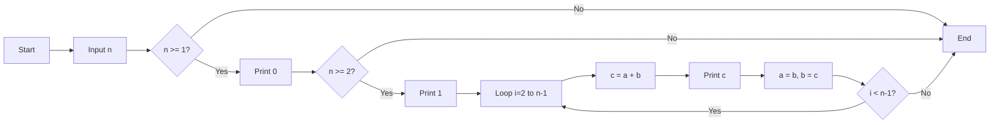
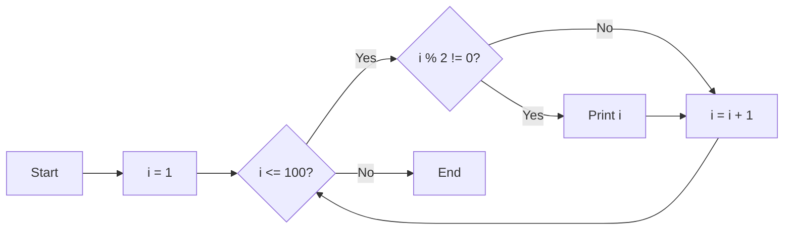
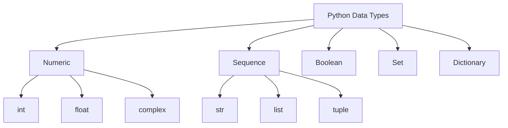

## Question 1(a) [3 marks]

**What is Flow chart? List out symbols used in Flow chart.**

**Answer**:

A **flowchart** is a graphical representation of an algorithm that shows the sequence of steps and decision points in a process using standardized symbols.

**Flowchart Symbols Table:**

| Symbol | Name | Purpose |
|--------|------|---------|
| Oval | Terminal | Start/End of program |
| Rectangle | Process | Processing/Calculation steps |
| Diamond | Decision | Conditional statements |
| Parallelogram | Input/Output | Data input or output |
| Circle | Connector | Connect flowchart parts |
| Arrow | Flow line | Direction of flow |

**Key Points:**

- **Visual representation**: Shows program logic graphically
- **Step-by-step**: Displays sequential flow of operations
- **Decision making**: Diamond symbols show conditional branches

**Mnemonic:** "Flow Charts Show Program Steps Visually"

## Question 1(b) [4 marks]

**Write a short note on for loop.**

**Answer**:

The **for loop** is used to iterate over a sequence (list, tuple, string, range) in Python.

**For Loop Table:**

| Component | Syntax | Example |
|-----------|--------|---------|
| Basic | `for variable in sequence:` | `for i in range(5):` |
| Range | `range(start, stop, step)` | `range(1, 10, 2)` |
| List | `for item in list:` | `for x in [1,2,3]:` |
| String | `for char in string:` | `for c in "hello":` |

**Simple Code Example:**

```python
for i in range(3):
    print(i)
# Output: 0, 1, 2
```

**Key Features:**

- **Automatic iteration**: No manual counter needed
- **Sequence traversal**: Works with any iterable object
- **Range function**: Creates number sequences easily

**Mnemonic:** "For Loops Iterate Through Sequences"

## Question 1(c) [7 marks]

**Write a program to display Fibonacci series up to nth term where n is provided by the user.**

**Answer**:

**Fibonacci Series Program:**

```python
# Get number of terms from user
n = int(input("Enter number of terms: "))

# Initialize first two terms
a, b = 0, 1

# Display first term
if n >= 1:
    print(a, end=" ")
    
# Display second term
if n >= 2:
    print(b, end=" ")

# Generate remaining terms
for i in range(2, n):
    c = a + b
    print(c, end=" ")
    a, b = b, c
```

**Algorithm Flow:**



**Key Concepts:**

- **Sequential generation**: Each term = sum of previous two
- **Variable swapping**: Update a, b values efficiently
- **User input**: Dynamic series length

**Mnemonic:** "Fibonacci: Add Previous Two Numbers"

## Question 1(c OR) [7 marks]

**Draw a flow chart to print ODD numbers from 1 to 100.**

**Answer**:

**Flowchart for ODD Numbers 1 to 100:**



**Corresponding Python Code:**

```python
for i in range(1, 101):
    if i % 2 != 0:
        print(i, end=" ")
```

**Alternative Method:**

```python
for i in range(1, 101, 2):
    print(i, end=" ")
```

**Key Elements:**

- **Loop control**: i from 1 to 100
- **Odd check**: i % 2 != 0 condition
- **Step increment**: Move to next number

**Mnemonic:** "Odd Numbers: Remainder 1 When Divided by 2"

## Question 2(a) [3 marks]

**Write a Program to find whether a number is Palindrome or not.**

**Answer**:

**Palindrome Check Program:**

```python
# Input number
num = int(input("Enter a number: "))
temp = num
reverse = 0

# Reverse the number
while temp > 0:
    reverse = reverse * 10 + temp % 10
    temp = temp // 10

# Check palindrome
if num == reverse:
    print(f"{num} is palindrome")
else:
    print(f"{num} is not palindrome")
```

**Algorithm Table:**

| Step | Operation | Example (121) |
|------|-----------|---------------|
| 1 | Get last digit | 121 % 10 = 1 |
| 2 | Build reverse | 0*10 + 1 = 1 |
| 3 | Remove last digit | 121 // 10 = 12 |
| 4 | Repeat until 0 | Continue process |

**Key Points:**

- **Digit extraction**: Use modulo (%) operator
- **Reverse building**: Multiply by 10 and add digit
- **Comparison**: Original equals reversed

**Mnemonic:** "Palindrome Reads Same Forward Backward"

## Question 2(b) [4 marks]

**Explain features of Python Programming.**

**Answer**:

**Python Features Table:**

| Feature | Description | Benefit |
|---------|-------------|---------|
| Easy Syntax | Simple, readable code | Faster development |
| Interpreted | No compilation needed | Quick testing |
| Object-Oriented | Classes and objects support | Code reusability |
| Open Source | Free to use | No licensing cost |
| Cross-Platform | Runs on multiple OS | Wide compatibility |
| Large Libraries | Extensive built-in modules | Rich functionality |

**Key Advantages:**

- **Beginner-friendly**: Easy to learn and understand
- **Versatile**: Web development, AI, data science
- **Community support**: Large developer community
- **Dynamic typing**: No variable type declaration needed

**Mnemonic:** "Python: Easy, Powerful, Popular Programming"

## Question 2(c) [7 marks]

**Explain basic structure of Python Program.**

**Answer**:

**Python Program Structure:**

```python
#!/usr/bin/env python3
# Shebang line (optional)

"""
Documentation string (docstring)
Describes program purpose
"""

# Import statements
import math
from datetime import date

# Global variables
PI = 3.14159
count = 0

# Function definitions
def calculate_area(radius):
    """Calculate circle area"""
    return PI * radius * radius

# Class definitions
class Calculator:
    def __init__(self):
        self.result = 0

# Main program execution
if __name__ == "__main__":
    # Program logic here
    radius = 5
    area = calculate_area(radius)
    print(f"Area: {area}")
```

**Structure Components Table:**

| Component | Purpose | Example |
|-----------|---------|---------|
| Shebang | System interpreter | `#!/usr/bin/env python3` |
| Docstring | Program documentation | `"""Program description"""` |
| Imports | External modules | `import math` |
| Variables | Global data storage | `PI = 3.14159` |
| Functions | Reusable code blocks | `def function_name():` |
| Classes | Object templates | `class ClassName:` |
| Main block | Program execution | `if __name__ == "__main__":` |

**Key Principles:**

- **Indentation**: Defines code blocks (4 spaces recommended)
- **Comments**: Use # for single line, """ """ for multi-line
- **Modularity**: Organize code in functions and classes

**Mnemonic:** "Structure: Import, Define, Execute"

## Question 2(a OR) [3 marks]

**Write a Program to reverse a string.**

**Answer**:

**String Reversal Program:**

```python
# Method 1: Using slicing
string = input("Enter a string: ")
reversed_string = string[::-1]
print(f"Reversed: {reversed_string}")

# Method 2: Using loop
string = input("Enter a string: ")
reversed_string = ""
for char in string:
    reversed_string = char + reversed_string
print(f"Reversed: {reversed_string}")
```

**Reversal Methods Table:**

| Method | Syntax | Example |
|--------|--------|---------|
| Slicing | `string[::-1]` | "hello" → "olleh" |
| Loop | Build character by character | Add each char to front |
| Built-in | `"".join(reversed(string))` | Join reversed sequence |

**Key Concepts:**

- **Slicing**: Most efficient method
- **Concatenation**: Build string character by character
- **Indexing**: Access string positions

**Mnemonic:** "Reverse: Last Character First"

## Question 2(b OR) [4 marks]

**Explain Logical Operators with example.**

**Answer**:

**Python Logical Operators:**

| Operator | Symbol | Description | Example | Result |
|----------|--------|-------------|---------|--------|
| AND | `and` | Both conditions true | `True and False` | `False` |
| OR | `or` | At least one condition true | `True or False` | `True` |
| NOT | `not` | Opposite of condition | `not True` | `False` |

**Example Code:**

```python
a = 10
b = 5

# AND operator
if a > 5 and b < 10:
    print("Both conditions true")

# OR operator  
if a > 15 or b < 10:
    print("At least one condition true")

# NOT operator
if not (a < 5):
    print("a is not less than 5")
```

**Truth Table:**

| A | B | A and B | A or B | not A |
|---|---|---------|--------|-------|
| T | T | T | T | F |
| T | F | F | T | F |
| F | T | F | T | T |
| F | F | F | F | T |

**Key Uses:**

- **Complex conditions**: Combine multiple checks
- **Decision making**: Control program flow
- **Boolean logic**: True/False operations

**Mnemonic:** "AND needs All, OR needs One, NOT reverses"

## Question 2(c OR) [7 marks]

**Explain different Data Types in Python Programming language**

**Answer**:

**Python Data Types Classification:**



**Data Types Table:**

| Type | Example | Description | Mutable |
|------|---------|-------------|---------|
| int | `42` | Whole numbers | No |
| float | `3.14` | Decimal numbers | No |
| str | `"hello"` | Text data | No |
| list | `[1,2,3]` | Ordered collection | Yes |
| tuple | `(1,2,3)` | Ordered immutable | No |
| dict | `{"a":1}` | Key-value pairs | Yes |
| bool | `True/False` | Boolean values | No |
| set | `{1,2,3}` | Unique elements | Yes |

**Example Code:**

```python
# Numeric types
age = 25          # int
price = 99.99     # float
complex_num = 3+4j # complex

# Sequence types
name = "Python"         # string
numbers = [1,2,3,4]     # list
coordinates = (10,20)   # tuple

# Other types
is_active = True        # boolean
unique_items = {1,2,3}  # set
student = {"name":"John", "age":20}  # dict
```

**Key Features:**

- **Dynamic typing**: No need to declare variable types
- **Type conversion**: Convert between compatible types
- **Built-in functions**: `type()`, `isinstance()` for checking types

**Mnemonic:** "Python Types: Numbers, Sequences, Collections"

## Question 3(a) [3 marks]

**What is flow control in Python? Explain with example**

**Answer**:

**Flow control** manages the execution order of program statements using conditional and loop structures.

**Flow Control Types Table:**

| Type | Statement | Purpose | Example |
|------|-----------|---------|---------|
| Sequential | Normal execution | Line by line | `print("Hello")` |
| Selection | if, elif, else | Decision making | `if x > 0:` |
| Iteration | for, while | Repetition | `for i in range(5):` |
| Jump | break, continue | Loop control | `break` |

**Example Code:**

```python
# Selection example
age = 18
if age >= 18:
    print("Adult")
else:
    print("Minor")

# Iteration example
for i in range(3):
    print(f"Count: {i}")
```

**Key Concepts:**

- **Conditional execution**: Code runs based on conditions
- **Loop structures**: Repeat code blocks
- **Program flow**: Control execution path

**Mnemonic:** "Flow Control: Decide, Repeat, Jump"

## Question 3(b) [4 marks]

**Write a program to explain nested if statement.**

**Answer**:

**Nested If Statement Program:**

```python
# Grade calculation using nested if
marks = int(input("Enter marks: "))

if marks >= 0 and marks <= 100:
    if marks >= 90:
        grade = "A+"
    elif marks >= 80:
        if marks >= 85:
            grade = "A"
        else:
            grade = "B+"
    elif marks >= 70:
        grade = "B"
    elif marks >= 60:
        grade = "C"
    else:
        grade = "F"
    print(f"Grade: {grade}")
else:
    print("Invalid marks")
```

**Nested Structure Diagram:**

```goat
                    marks input
                         |
                   ┌─────▼─────┐
                   │0<=marks<=100│
                   └─────┬─────┘
              True       │       False
           ┌─────────────┼─────────────┐
           │             │             │
      ┌────▼────┐        │        ┌────▼────┐
      │marks>=90│        │        │ Invalid │
      └────┬────┘        │        └─────────┘
           │             │
         A+│           ┌─▼─┐
           │           │...│
           │           └───┘
```

**Key Features:**

- **Multiple levels**: if inside if statements
- **Complex conditions**: Handle multiple criteria
- **Logical structure**: Organize decision trees

**Mnemonic:** "Nested If: Decisions Within Decisions"

## Question 3(c) [7 marks]

**Write a program to Explain types of Arguments and Parameters.**

**Answer**:

**Types of Arguments and Parameters:**

```python
# 1. Positional Arguments
def greet(name, age):
    print(f"Hello {name}, you are {age} years old")

greet("John", 25)  # Positional arguments

# 2. Keyword Arguments  
greet(age=30, name="Alice")  # Keyword arguments

# 3. Default Parameters
def introduce(name, city="Unknown"):
    print(f"{name} lives in {city}")

introduce("Bob")  # Uses default value
introduce("Carol", "NYC")  # Override default

# 4. Variable-length Arguments (*args)
def sum_all(*numbers):
    return sum(numbers)

result = sum_all(1, 2, 3, 4, 5)
print(f"Sum: {result}")

# 5. Keyword Variable Arguments (**kwargs)
def display_info(**info):
    for key, value in info.items():
        print(f"{key}: {value}")

display_info(name="David", age=28, city="Boston")
```

**Parameters Types Table:**

| Type | Syntax | Example | Description |
|------|--------|---------|-------------|
| Positional | `def func(a, b):` | `func(1, 2)` | Order matters |
| Keyword | `def func(a, b):` | `func(b=2, a=1)` | Name specified |
| Default | `def func(a, b=10):` | `func(5)` | Default value |
| *args | `def func(*args):` | `func(1,2,3)` | Variable positional |
| **kwargs | `def func(**kwargs):` | `func(a=1, b=2)` | Variable keyword |

**Function Call Examples:**

```python
def example(pos1, pos2, default=100, *args, **kwargs):
    print(f"pos1: {pos1}")
    print(f"pos2: {pos2}")  
    print(f"default: {default}")
    print(f"args: {args}")
    print(f"kwargs: {kwargs}")

example(1, 2, 3, 4, 5, name="test", value=42)
```

**Key Concepts:**

- **Flexibility**: Different ways to pass data
- **Order importance**: Positional vs keyword
- **Variable arguments**: Handle unknown number of inputs

**Mnemonic:** "Parameters: Position, Keywords, Defaults, Variables"

## Question 3(a OR) [3 marks]

**Explain break and continue statement with example.**

**Answer**:

**Break and Continue Statements:**

**Break Statement:**

```python
# Break example - exit loop
for i in range(10):
    if i == 5:
        break
    print(i)
# Output: 0, 1, 2, 3, 4
```

**Continue Statement:**

```python
# Continue example - skip iteration
for i in range(5):
    if i == 2:
        continue
    print(i)
# Output: 0, 1, 3, 4
```

**Comparison Table:**

| Statement | Purpose | Action | Example Use |
|-----------|---------|--------|-------------|
| break | Exit loop | Terminates entire loop | Exit on condition |
| continue | Skip iteration | Jump to next iteration | Skip specific values |

**Key Differences:**

- **Break**: Completely exits loop
- **Continue**: Skips current iteration only
- **Flow control**: Manage loop execution

**Mnemonic:** "Break Exits, Continue Skips"

## Question 3(b OR) [4 marks]

**Create a program to display the following pattern**

```
1
12
123
1234
12345
```

**Answer**:

**Number Pattern Program:**

```python
# Method 1: Using nested loops
rows = 5
for i in range(1, rows + 1):
    for j in range(1, i + 1):
        print(j, end="")
    print()  # New line

# Method 2: Using string manipulation
for i in range(1, 6):
    line = ""
    for j in range(1, i + 1):
        line += str(j)
    print(line)

# Method 3: Using join
for i in range(1, 6):
    numbers = [str(j) for j in range(1, i + 1)]
    print("".join(numbers))
```

**Pattern Logic Table:**

| Row | Numbers | Range | Output |
|-----|---------|-------|--------|
| 1 | 1 | 1 to 1 | 1 |
| 2 | 1,2 | 1 to 2 | 12 |
| 3 | 1,2,3 | 1 to 3 | 123 |
| 4 | 1,2,3,4 | 1 to 4 | 1234 |
| 5 | 1,2,3,4,5 | 1 to 5 | 12345 |

**Key Concepts:**

- **Nested loops**: Outer for rows, inner for numbers
- **Range function**: Generate number sequences
- **Print control**: Use end="" to avoid newlines

**Mnemonic:** "Pattern: Row Number Determines Column Count"

## Question 3(c OR) [7 marks]

**Explain the following mathematical functions by writing a code for each: 1. abs() 2. max() 3. pow() 4. sum()**

**Answer**:

**Mathematical Functions in Python:**

```python
# 1. abs() - Absolute value
numbers = [-5, 3.7, -10.2, 0]
print("abs() function examples:")
for num in numbers:
    print(f"abs({num}) = {abs(num)}")

# 2. max() - Maximum value
list1 = [4, 7, 2, 9, 1]
print(f"\nmax() function examples:")
print(f"max({list1}) = {max(list1)}")
print(f"max(10, 25, 5) = {max(10, 25, 5)}")
print(f"max('hello') = {max('hello')}")  # Alphabetically

# 3. pow() - Power function
print(f"\npow() function examples:")
print(f"pow(2, 3) = {pow(2, 3)}")      # 2^3 = 8
print(f"pow(5, 2) = {pow(5, 2)}")      # 5^2 = 25
print(f"pow(8, 1/3) = {pow(8, 1/3)}")  # Cube root of 8

# 4. sum() - Sum of sequence
numbers = [1, 2, 3, 4, 5]
print(f"\nsum() function examples:")
print(f"sum({numbers}) = {sum(numbers)}")
print(f"sum({numbers}, 10) = {sum(numbers, 10)}")  # With start value
```

**Functions Summary Table:**

| Function | Syntax | Purpose | Example | Result |
|----------|--------|---------|---------|--------|
| abs() | `abs(x)` | Absolute value | `abs(-5)` | 5 |
| max() | `max(iterable)` | Maximum value | `max([1,5,3])` | 5 |
| pow() | `pow(x, y)` | x raised to power y | `pow(2, 3)` | 8 |
| sum() | `sum(iterable)` | Sum of values | `sum([1,2,3])` | 6 |

**Detailed Examples:**

```python
# Real-world usage
distances = [-10, 15, -8, 12]  # Signed distances
actual_distances = [abs(d) for d in distances]
print(f"Actual distances: {actual_distances}")

scores = [85, 92, 78, 96, 88]
highest_score = max(scores)
total_score = sum(scores)
print(f"Highest: {highest_score}, Total: {total_score}")

# Calculate compound interest
principal = 1000
rate = 0.05
time = 3
amount = principal * pow(1 + rate, time)
print(f"Compound Interest Amount: {amount}")
```

**Key Applications:**

- **abs()**: Distance calculations, error handling
- **max()**: Finding extremes, competition results
- **pow()**: Scientific calculations, compound interest
- **sum()**: Total calculations, statistics

**Mnemonic:** "Math Functions: Absolute, Maximum, Power, Sum"

## Question 4(a) [3 marks]

**Explain scope of variables.**

**Answer**:

**Variable Scope** refers to the region where a variable can be accessed in a program.

**Scope Types Table:**

| Scope | Description | Lifetime | Access |
|-------|-------------|----------|--------|
| Local | Inside function | Function execution | Function only |
| Global | Outside functions | Program execution | Entire program |
| Built-in | Python keywords | Python session | Everywhere |

**Example Code:**

```python
x = 10  # Global variable

def my_function():
    y = 20  # Local variable
    print(f"Local y: {y}")
    print(f"Global x: {x}")

my_function()
print(f"Global x: {x}")
# print(y)  # Error: y not accessible here
```

**Key Rules:**

- **Local variables**: Created inside functions
- **Global variables**: Accessible throughout program
- **LEGB rule**: Local → Enclosing → Global → Built-in

**Mnemonic:** "Scope: Local Lives in Functions, Global Lives Everywhere"

## Question 4(b) [4 marks]

**Develop a program to create nested LOOP and display numbers.**

**Answer**:

**Nested Loop Program:**

```python
# Example 1: Number grid
print("Number Grid Pattern:")
for i in range(1, 4):
    for j in range(1, 5):
        print(f"{i}{j}", end=" ")
    print()  # New line after each row

# Example 2: Multiplication table
print("\nMultiplication Table:")
for i in range(1, 4):
    for j in range(1, 6):
        result = i * j
        print(f"{result:3}", end=" ")
    print()

# Example 3: Number pyramid
print("\nNumber Pyramid:")
for i in range(1, 5):
    for j in range(1, i + 1):
        print(j, end=" ")
    print()
```

**Nested Loop Structure:**

```goat
    Outer Loop (i)
         │
    ┌────▼────┐
    │  i = 1  │
    └────┬────┘
         │
    Inner Loop (j)
    ┌────▼────┐
    │j=1,2,3,4│
    └────┬────┘
         │
    ┌────▼────┐
    │  i = 2  │
    └─────────┘
```

**Key Concepts:**

- **Outer loop**: Controls rows/major iterations
- **Inner loop**: Controls columns/minor iterations
- **Execution flow**: Inner completes before outer increments

**Mnemonic:** "Nested Loops: Outer Controls Inner"

## Question 4(c) [7 marks]

**Write a program to create a list of ODD and EVEN numbers in range of 1 to 50.**

**Answer**:

**ODD and EVEN Numbers Program:**

```python
# Method 1: Using loops and conditions
odd_numbers = []
even_numbers = []

for i in range(1, 51):
    if i % 2 == 0:
        even_numbers.append(i)
    else:
        odd_numbers.append(i)

print("ODD Numbers (1-50):")
print(odd_numbers)
print(f"Count: {len(odd_numbers)}")

print("\nEVEN Numbers (1-50):")
print(even_numbers)
print(f"Count: {len(even_numbers)}")

# Method 2: Using list comprehension
odd_list = [i for i in range(1, 51) if i % 2 != 0]
even_list = [i for i in range(1, 51) if i % 2 == 0]

print(f"\nOdd (List Comprehension): {odd_list[:10]}...")  # First 10
print(f"Even (List Comprehension): {even_list[:10]}...")  # First 10

# Method 3: Using range with step
odd_range = list(range(1, 51, 2))   # Start 1, step 2
even_range = list(range(2, 51, 2))  # Start 2, step 2

print(f"\nOdd (Range method): {odd_range[:10]}...")
print(f"Even (Range method): {even_range[:10]}...")
```

**Number Classification Table:**

| Type | Condition | Range 1-10 | Count (1-50) |
|------|-----------|------------|--------------|
| ODD | `n % 2 != 0` | 1,3,5,7,9 | 25 |
| EVEN | `n % 2 == 0` | 2,4,6,8,10 | 25 |

**Statistical Analysis:**

```python
# Analysis of generated lists
print(f"\nStatistical Analysis:")
print(f"Total numbers: {len(odd_numbers) + len(even_numbers)}")
print(f"Odd percentage: {len(odd_numbers)/50*100}%")
print(f"Even percentage: {len(even_numbers)/50*100}%")
print(f"Largest odd: {max(odd_numbers)}")
print(f"Largest even: {max(even_numbers)}")
```

**Key Techniques:**

- **Modulo operator**: `%` for remainder check
- **List comprehension**: Concise list creation
- **Range function**: Generate sequences efficiently

**Mnemonic:** "Odd/Even: Remainder 1/0 When Divided by 2"

## Question 4(a OR) [3 marks]

**Explain String Slicing with example.**

**Answer**:

**String Slicing** extracts parts of a string using `[start:stop:step]` syntax.

**Slicing Syntax Table:**

| Syntax | Description | Example | Result |
|--------|-------------|---------|--------|
| `s[start:stop]` | From start to stop-1 | `"hello"[1:4]` | "ell" |
| `s[start:]` | From start to end | `"hello"[2:]` | "llo" |
| `s[:stop]` | From beginning to stop-1 | `"hello"[:3]` | "hel" |
| `s[::step]` | Every step character | `"hello"[::2]` | "hlo" |
| `s[::-1]` | Reverse string | `"hello"[::-1]` | "olleh" |

**Example Code:**

```python
text = "Python Programming"

# Basic slicing
print(f"First 6 chars: {text[:6]}")      # "Python"
print(f"Last 11 chars: {text[7:]}")      # "Programming"
print(f"Middle part: {text[2:8]}")       # "thon P"

# Step slicing
print(f"Every 2nd char: {text[::2]}")    # "Pto rgamn"

# Negative indexing:**
print(f"Last character: {text[-1]}")     # "g"
print(f"Reverse: {text[::-1]}")          # "gnimmargorP nohtyP"
```

**Key Features:**

- **Zero-based indexing**: Start from 0
- **Negative indexing**: Count from end (-1)
- **Immutable**: Original string unchanged

**Mnemonic:** "Slice: Start, Stop, Step"

## Question 4(b OR) [4 marks]

**Write a program using user defined function to find the factorial of a given number.**

**Answer**:

**Factorial Function Program:**

```python
def factorial(n):
    """Calculate factorial using recursion"""
    if n == 0 or n == 1:
        return 1
    else:
        return n * factorial(n - 1)

def factorial_iterative(n):
    """Calculate factorial using loop"""
    result = 1
    for i in range(1, n + 1):
        result *= i
    return result

# Main program
number = int(input("Enter a number: "))
if number < 0:
    print("Factorial not defined for negative numbers")
else:
    result1 = factorial(number)
    result2 = factorial_iterative(number)
    print(f"Factorial of {number} = {result1}")
```

**Factorial Table:**

| n | Factorial | Calculation |
|---|-----------|-------------|
| 0 | 1 | Base case |
| 1 | 1 | Base case |
| 3 | 6 | 3 × 2 × 1 |
| 5 | 120 | 5 × 4 × 3 × 2 × 1 |

**Key Concepts:**

- **Recursion**: Function calls itself
- **Base case**: Stops recursive calls
- **User-defined**: Custom function creation

**Mnemonic:** "Factorial: Multiply All Numbers Below"

## Question 4(c OR) [7 marks]

**Write a user defined function to check whether a sub string is present in a given string.**

**Answer**:

**Substring Check Function:**

```python
def find_substring(main_string, sub_string):
    """Check if substring exists in main string"""
    if sub_string in main_string:
        index = main_string.find(sub_string)
        return True, index
    else:
        return False, -1

def count_substring(main_string, sub_string):
    """Count occurrences of substring"""
    return main_string.count(sub_string)

def find_all_positions(main_string, sub_string):
    """Find all positions of substring"""
    positions = []
    start = 0
    while True:
        pos = main_string.find(sub_string, start)
        if pos == -1:
            break
        positions.append(pos)
        start = pos + 1
    return positions

# Main program
text = input("Enter main string: ")
search = input("Enter substring to search: ")

found, position = find_substring(text, search)
if found:
    print(f"Substring '{search}' found at position {position}")
    count = count_substring(text, search)
    all_pos = find_all_positions(text, search)
    print(f"Total occurrences: {count}")
    print(f"All positions: {all_pos}")
else:
    print(f"Substring '{search}' not found")
```

**String Methods Table:**

| Method | Purpose | Example | Result |
|--------|---------|---------|--------|
| `find()` | Find first position | `"hello".find("ll")` | 2 |
| `count()` | Count occurrences | `"hello".count("l")` | 2 |
| `in` | Check existence | `"ll" in "hello"` | True |
| `index()` | Find position (error if not found) | `"hello".index("e")` | 1 |

**Key Features:**

- **Multiple methods**: Different ways to search
- **Position tracking**: Return index of found substring
- **Error handling**: Check before processing

**Mnemonic:** "Substring: Search, Find, Count, Position"

## Question 5(a) [3 marks]

**Explain how to create and access a List with example.**

**Answer**:

**List Creation and Access:**

```python
# Creating lists
empty_list = []
numbers = [1, 2, 3, 4, 5]
mixed = [1, "hello", 3.14, True]
nested = [[1, 2], [3, 4], [5, 6]]

# Accessing elements
print(f"First element: {numbers[0]}")      # 1
print(f"Last element: {numbers[-1]}")      # 5
print(f"Slice: {numbers[1:4]}")           # [2, 3, 4]
```

**List Access Methods:**

| Method | Syntax | Example | Result |
|--------|--------|---------|--------|
| Index | `list[i]` | `[1,2,3][1]` | 2 |
| Negative | `list[-i]` | `[1,2,3][-1]` | 3 |
| Slice | `list[start:stop]` | `[1,2,3,4][1:3]` | [2,3] |

**Key Features:**

- **Ordered collection**: Elements have positions
- **Mutable**: Can be modified after creation
- **Mixed types**: Different data types allowed

**Mnemonic:** "Lists: Create, Index, Access"

## Question 5(b) [4 marks]

**List out the operations that can be performed on a LIST. Write a program to create and copy one List into another List.**

**Answer**:

**List Operations and Copy Program:**

```python
# Original list
original = [1, 2, 3, 4, 5]
print(f"Original list: {original}")

# Copying methods
shallow_copy = original.copy()
slice_copy = original[:]
list_copy = list(original)

# Modify original
original.append(6)
print(f"After append: {original}")
print(f"Shallow copy: {shallow_copy}")

# List operations demonstration
numbers = [10, 20, 30]
numbers.append(40)          # Add to end
numbers.insert(1, 15)       # Insert at position
numbers.remove(20)          # Remove specific value
popped = numbers.pop()      # Remove and return last
```

**List Operations Table:**

| Operation | Method | Example | Result |
|-----------|--------|---------|--------|
| Add | `append()` | `[1,2].append(3)` | [1,2,3] |
| Insert | `insert()` | `[1,3].insert(1,2)` | [1,2,3] |
| Remove | `remove()` | `[1,2,3].remove(2)` | [1,3] |
| Pop | `pop()` | `[1,2,3].pop()` | [1,2] |

**Key Concepts:**

- **Shallow copy**: Independent list with same elements
- **Deep copy**: Needed for nested structures
- **Multiple methods**: Different copying techniques

**Mnemonic:** "List Operations: Add, Insert, Remove, Pop, Copy"

## Question 5(c) [7 marks]

**List and give use of various Built in methods of LIST**

**Answer**:

**Built-in List Methods:**

```python
# Sample list for demonstrations
fruits = ['apple', 'banana', 'cherry', 'apple']
numbers = [3, 1, 4, 1, 5, 9, 2]

# Modification methods
fruits.append('date')              # Add to end
fruits.insert(1, 'avocado')       # Insert at index
fruits.remove('apple')            # Remove first occurrence
last_fruit = fruits.pop()         # Remove and return last
fruits.clear()                    # Remove all elements

# Search and count methods
fruits = ['apple', 'banana', 'apple', 'cherry']
count = fruits.count('apple')     # Count occurrences
index = fruits.index('banana')    # Find first index

# Sorting and reversing
numbers.sort()                    # Sort in place
numbers.reverse()                 # Reverse in place
sorted_copy = sorted(fruits)      # Return sorted copy

# Extension
more_fruits = ['grape', 'orange']
fruits.extend(more_fruits)        # Add multiple items
```

**List Methods Summary:**

| Category | Method | Purpose | Returns | Modifies Original |
|----------|--------|---------|---------|-------------------|
| Add | `append(x)` | Add item to end | None | Yes |
| Add | `insert(i,x)` | Insert at position | None | Yes |
| Add | `extend(list)` | Add multiple items | None | Yes |
| Remove | `remove(x)` | Remove first x | None | Yes |
| Remove | `pop(i)` | Remove at index | Removed item | Yes |
| Remove | `clear()` | Remove all | None | Yes |
| Search | `index(x)` | Find position | Index | No |
| Search | `count(x)` | Count occurrences | Count | No |
| Sort | `sort()` | Sort in place | None | Yes |
| Sort | `reverse()` | Reverse order | None | Yes |
| Copy | `copy()` | Shallow copy | New list | No |

**Practical Examples:**

```python
# Shopping cart example
cart = []
cart.append('milk')
cart.extend(['bread', 'eggs', 'butter'])
print(f"Items in cart: {len(cart)}")

if 'milk' in cart:
    cart.remove('milk')
    print("Milk removed from cart")

cart.sort()
print(f"Sorted cart: {cart}")
```

**Key Applications:**

- **Data management**: Add, remove, organize items
- **Search operations**: Find and count elements
- **Sorting**: Organize data in order

**Mnemonic:** "List Methods: Add, Remove, Search, Sort, Copy"

## Question 5(a OR) [3 marks]

**Explain how to create and traverse a string by giving an example.**

**Answer**:

**String Creation and Traversal:**

```python
# String creation methods
string1 = "Hello World"        # Double quotes
string2 = 'Python Programming' # Single quotes
string3 = """Multi-line
string example"""              # Triple quotes

# String traversal methods
text = "Python"

# Method 1: Using for loop
for char in text:
    print(char, end=" ")
print()

# Method 2: Using index
for i in range(len(text)):
    print(f"{text[i]} at index {i}")

# Method 3: Using enumerate
for index, char in enumerate(text):
    print(f"Index {index}: {char}")
```

**Traversal Methods Table:**

| Method | Syntax | Use Case |
|--------|--------|----------|
| Direct | `for char in string:` | Simple character access |
| Index | `for i in range(len(s)):` | Need position info |
| Enumerate | `for i, char in enumerate(s):` | Both index and character |

**Key Concepts:**

- **Immutable**: Strings cannot be changed
- **Iterable**: Can loop through characters
- **Indexing**: Access individual characters

**Mnemonic:** "Strings: Create, Loop, Access"

## Question 5(b OR) [4 marks]

**List out the operations that can be performed on a String. Write a code for any 2 operations**

**Answer**:

**String Operations:**

```python
# String operations examples
text = "Python Programming"

# Operation 1: String concatenation and formatting
first_name = "John"
last_name = "Doe"
full_name = first_name + " " + last_name
formatted = f"Hello, {full_name}!"
print(f"Concatenation: {full_name}")
print(f"Formatting: {formatted}")

# Operation 2: String case conversion and splitting
sentence = "learn python programming easily"
title_case = sentence.title()
upper_case = sentence.upper()
words = sentence.split()
print(f"Title case: {title_case}")
print(f"Upper case: {upper_case}")
print(f"Split words: {words}")
```

**String Operations Table:**

| Category | Operation | Example | Result |
|----------|-----------|---------|--------|
| Join | Concatenation | `"Hello" + " World"` | "Hello World" |
| Case | `upper()` | `"hello".upper()` | "HELLO" |
| Case | `lower()` | `"HELLO".lower()` | "hello" |
| Case | `title()` | `"hello world".title()` | "Hello World" |
| Split | `split()` | `"a,b,c".split(",")` | ['a','b','c'] |
| Replace | `replace()` | `"hello".replace("l","x")` | "hexxo" |
| Strip | `strip()` | `" hello ".strip()` | "hello" |
| Find | `find()` | `"hello".find("e")` | 1 |

**Key Features:**

- **Immutable**: Operations return new strings
- **Method chaining**: Combine multiple operations
- **Flexible**: Many built-in operations available

**Mnemonic:** "String Operations: Join, Case, Split, Find"

## Question 5(c OR) [7 marks]

**List and give use of various built – in methods of String.**

**Answer**:

**Built-in String Methods:**

```python
# Sample string for demonstration
text = "  Python Programming Language  "
sample = "Hello World Programming"

# Case conversion methods
print(f"Original: '{text}'")
print(f"upper(): {text.upper()}")
print(f"lower(): {text.lower()}")
print(f"title(): {text.title()}")
print(f"capitalize(): {text.capitalize()}")
print(f"swapcase(): 'Hello'.swapcase()}")

# Whitespace methods
print(f"strip(): '{text.strip()}'")
print(f"lstrip(): '{text.lstrip()}'")
print(f"rstrip(): '{text.rstrip()}'")

# Search and check methods
print(f"find('Python'): {text.find('Python')}")
print(f"count('o'): {sample.count('o')}")
print(f"startswith('  Py'): {text.startswith('  Py')}")
print(f"endswith('ge  '): {text.endswith('ge  ')}")

# Character type checking
test_string = "Python123"
print(f"isalpha(): {'Python'.isalpha()}")
print(f"isdigit(): {'123'.isdigit()}")
print(f"isalnum(): {test_string.isalnum()}")

# Split and join methods
words = sample.split()
joined = "-".join(words)
print(f"split(): {words}")
print(f"join(): {joined}")

# Replace method
replaced = sample.replace("World", "Universe")
print(f"replace(): {replaced}")
```

**String Methods Classification:**

| Category | Methods | Purpose | Example |
|----------|---------|---------|---------|
| Case | `upper(), lower(), title(), capitalize()` | Change case | `"hello".upper()` → "HELLO" |
| Whitespace | `strip(), lstrip(), rstrip()` | Remove spaces | `" hi ".strip()` → "hi" |
| Search | `find(), index(), count()` | Find substrings | `"hello".find("e")` → 1 |
| Check | `startswith(), endswith()` | Test string ends | `"hello".startswith("h")` → True |
| Type Check | `isalpha(), isdigit(), isalnum()` | Character types | `"123".isdigit()` → True |
| Split/Join | `split(), join()` | Break/combine | `"a-b".split("-")` → ['a','b'] |
| Replace | `replace()` | Substitute text | `"hi".replace("i","o")` → "ho" |

**Real-world Examples:**

```python
# Email validation example
email = "  USER@EXAMPLE.COM  "
clean_email = email.strip().lower()
is_valid = "@" in clean_email and "." in clean_email
print(f"Clean email: {clean_email}")
print(f"Valid format: {is_valid}")

# Text processing example
user_input = "python programming"
formatted_title = user_input.title()
word_count = len(user_input.split())
print(f"Formatted: {formatted_title}")
print(f"Word count: {word_count}")
```

**Key Applications:**

- **Data cleaning**: Remove unwanted spaces, fix case
- **Text processing**: Search, replace, split content
- **Validation**: Check string format and content
- **Formatting**: Prepare text for display

**Mnemonic:** "String Methods: Case, Clean, Check, Change"
