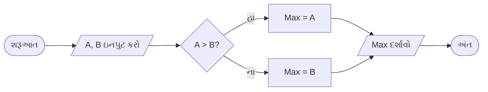

## પ્રશ્ન 1(અ) [3 ગુણ]

**પ્રોબ્લમ સોલવિંગ, અલ્ગોરિધમ અને સ્યુડો કોડ વ્યાખ્યાયિત કરો.**

**જવાબ**:

| શબ્દ | વ્યાખ્યા |
|------|------------|
| **પ્રોબ્લમ સોલવિંગ** | તર્કસંગત વિચારસરણી વાપરીને જટિલ સમસ્યાઓનાં ઉકેલ શોધવાની પદ્ધતિ |
| **અલ્ગોરિધમ** | મર્યાદિત ઓપરેશન સાથે સમસ્યા ઉકેલવાની પગલું-દર-પગલું પ્રક્રિયા |
| **સ્યુડો કોડ** | સામાન્ય અંગ્રેજી જેવા syntax નો ઉપયોગ કરીને program logic નું અનૌપચારિક વર્ણન |

- **પ્રોબ્લમ સોલવિંગ**: જટિલ સમસ્યાઓને વ્યવસ્થિત પગલાઓમાં વહેંચવું
- **અલ્ગોરિધમ**: મર્યાદિત, નિશ્ચિત, અસરકારક અને યોગ્ય આઉટપુટ આપતું હોવું જોઈએ
- **સ્યુડો કોડ**: માનવ ભાષા અને programming કોડ વચ્ચેનો સેતુ

**મેમરી ટ્રીક:** "PAP - Problem, Algorithm, Pseudo"

## પ્રશ્ન 1(બ) [4 ગુણ]

**ફ્લોચાર્ટના જુદા જુદા સિમ્બોલ સમજાવો. બે નંબર માંથી મહત્તમ નંબર શોધતો ફ્લોચાર્ટ ડિઝાઇન કરો.**

**જવાબ**:

| સિમ્બોલ | આકાર | હેતુ |
|--------|-------|---------|
| **અંડાકાર** | ⬭ | શરૂઆત/અંત |
| **લંબચોરસ** | ▭ | પ્રક્રિયા/ક્રિયા |
| **હીરો** | ◊ | નિર્ણય |
| **સમાંતર ચતુષ્કોણ** | ▱ | ઇનપુટ/આઉટપુટ |

**બે નંબરના મહત્તમ માટે ફ્લોચાર્ટ:**



- **શરૂઆત/અંત**: પ્રવેશ અને બહાર નીકળવાના બિંદુઓ
- **ઇનપુટ/આઉટપુટ**: ડેટા ફ્લો ઓપરેશન્સ
- **નિર્ણય**: શરતી branching
- **પ્રક્રિયા**: ગણતરીના પગલાં

**મેમરી ટ્રીક:** "SIPO - Start, Input, Process, Output"

## પ્રશ્ન 1(ક) [7 ગુણ]

**પાયથોનના વિવિધ એરિથમેટિક ઓપરેટરોની યાદી બનાવો. વિવિધ એરિથમેટિક ઓપરેશન્સ માટેનો Python કોડ લખો.**

**જવાબ**:

| ઓપરેટર | સિમ્બોલ | ઉદાહરણ | પરિણામ |
|----------|--------|---------|--------|
| **ઉમેરો** | + | 5 + 3 | 8 |
| **બાદબાકી** | - | 5 - 3 | 2 |
| **ગુણાકાર** | * | 5 * 3 | 15 |
| **ભાગાકાર** | / | 5 / 3 | 1.667 |
| **ફ્લોર ડિવિઝન** | // | 5 // 3 | 1 |
| **મોડ્યુલસ** | % | 5 % 3 | 2 |
| **ઘાત** | ** | 5 ** 3 | 125 |

**કોડ:**

```python
a = 10
b = 3
print(f"ઉમેરો: {a + b}")
print(f"બાદબાકી: {a - b}")
print(f"ગુણાકાર: {a * b}")
print(f"ભાગાકાર: {a / b}")
print(f"ફ્લોર ડિવિઝન: {a // b}")
print(f"મોડ્યુલસ: {a % b}")
print(f"ઘાત: {a ** b}")
```

**મેમરી ટ્રીક:** "Add-Sub-Mul-Div-Floor-Mod-Pow"

## પ્રશ્ન 1(ક OR) [7 ગુણ]

**પાયથોનના વિવિધ કંપેરિઝન ઓપરેટરોની યાદી બનાવો. વિવિધ કંપેરિઝન ઓપરેશન્સ માટેનો Python કોડ લખો.**

**જવાબ**:

| ઓપરેટર | સિમ્બોલ | હેતુ | ઉદાહરણ |
|----------|--------|---------|---------|
| **સમાન** | == | સમાનતા ચકાસો | 5 == 3 → False |
| **અસમાન** | != | અસમાનતા ચકાસો | 5 != 3 → True |
| **મોટું** | > | મોટું ચકાસો | 5 > 3 → True |
| **નાનું** | < | નાનું ચકાસો | 5 < 3 → False |
| **મોટું સમાન** | >= | મોટું/સમાન ચકાસો | 5 >= 3 → True |
| **નાનું સમાન** | <= | નાનું/સમાન ચકાસો | 5 <= 3 → False |

**કોડ:**

```python
x = 8
y = 5
print(f"સમાન: {x == y}")
print(f"અસમાન: {x != y}")
print(f"મોટું: {x > y}")
print(f"નાનું: {x < y}")
print(f"મોટું સમાન: {x >= y}")
print(f"નાનું સમાન: {x <= y}")
```

**મેમરી ટ્રીક:** "Equal-Not-Greater-Less-GreaterEqual-LessEqual"

## પ્રશ્ન 2(અ) [3 ગુણ]

**મેમ્બરશિપ ઓપરેટર્સ ઉપર ટૂંક નોંધ લખો.**

**જવાબ**:

| ઓપરેટર | હેતુ | ઉદાહરણ |
|----------|---------|---------|
| **in** | એલિમેન્ટ અસ્તિત્વ ચકાસો | 'a' in 'apple' → True |
| **not in** | એલિમેન્ટ અનસ્તિત્વ ચકાસો | 'z' not in 'apple' → True |

- **in ઓપરેટર**: જો એલિમેન્ટ sequence માં મળે તો True આપે
- **not in ઓપરેટર**: જો એલિમેન્ટ sequence માં ન મળે તો True આપે
- **ઉપયોગ**: Lists, strings, tuples, dictionaries માં

**મેમરી ટ્રીક:** "In-Not-In for membership testing"

## પ્રશ્ન 2(બ) [4 ગુણ]

**પાયથોન વ્યાખ્યાયિત કરો. પાયથોન પ્રોગ્રામિંગની વિવિધ એપ્લિકેશનો લખો.**

**જવાબ**:

**પાયથોન વ્યાખ્યા**: સરળતા અને વાંચનીયતા માટે જાણીતી high-level, interpreted programming language.

| એપ્લિકેશન ક્ષેત્ર | ઉદાહરણો |
|------------------|----------|
| **વેબ ડેવલપમેન્ટ** | Django, Flask frameworks |
| **ડેટા સાયન્સ** | NumPy, Pandas, Matplotlib |
| **AI/ML** | TensorFlow, Scikit-learn |
| **ડેસ્કટોપ એપ્સ** | Tkinter, PyQt |
| **ગેમ ડેવલપમેન્ટ** | Pygame library |

- **Interpreted**: compilation ની જરૂર નથી
- **Cross-platform**: બહુવિધ OS પર ચાલે છે
- **વિશાળ libraries**: વ્યાપક standard library

**મેમરી ટ્રીક:** "Web-Data-AI-Desktop-Games"

## પ્રશ્ન 2(ક) [7 ગુણ]

**પાયથોન પ્રોગ્રામ લખો જે નીચેની વિગતોનો ઉપયોગ કરીને વીજળી બિલની ગણતરી કરે છે.**

**જવાબ**:

**દરોનું ટેબલ:**

| યુનિટ રેન્જ | દર પ્રતિ યુનિટ |
|------------|---------------|
| ≤ 100 | રૂ 5.00 |
| 101-200 | રૂ 7.50 |
| 201-300 | રૂ 10.00 |
| ≥ 301 | રૂ 15.00 |

**કોડ:**

```python
units = int(input("વપરાયેલ યુનિટ્સ દાખલ કરો: "))

if units <= 100:
    bill = units * 5.00
elif units <= 200:
    bill = units * 7.50
elif units <= 300:
    bill = units * 10.00
else:
    bill = units * 15.00

print(f"કુલ બિલ: રૂ {bill}")
```

- **શરતી તર્ક**: if-elif-else structure
- **દર ગણતરી**: યુનિટ slabs આધારિત
- **યુઝર ઇનપુટ**: interactive billing system

**મેમરી ટ્રીક:** "Input-Check-Calculate-Display"

## પ્રશ્ન 2(અ OR) [3 ગુણ]

**આઇડેન્ટિટી ઓપરેટર્સ ઉપર ટૂંક નોંધ લખો.**

**જવાબ**:

| ઓપરેટર | હેતુ | ઉદાહરણ |
|----------|---------|---------|
| **is** | સમાન ઓબ્જેક્ટ ચકાસો | a is b |
| **is not** | જુદા ઓબ્જેક્ટ ચકાસો | a is not b |

- **is ઓપરેટર**: ઓબ્જેક્ટ identity સરખાવે, values નહીં
- **is not ઓપરેટર**: ઓબ્જેક્ટ્સ જુદા છે કે નહીં ચકાસે
- **મેમરી સરખામણી**: સમાન મેમરી સ્થાન ચકાસે

**મેમરી ટ્રીક:** "Is-IsNot for object identity"

## પ્રશ્ન 2(બ OR) [4 ગુણ]

**પાયથોનમાં ઇન્ડેન્ટેશન શું છે? પાયથોનની વિવિધ વિશેષતાઓ સમજાવો.**

**જવાબ**:

**ઇન્ડેન્ટેશન**: કોડ બ્લોક્સ વ્યાખ્યાયિત કરવા માટે લાઇનની શરૂઆતમાં whitespace.

| વિશેષતા | વર્ણન |
|---------|-------------|
| **સરળ Syntax** | વાંચવા અને લખવામાં સરળ |
| **Interpreted** | compilation step નથી |
| **Object-Oriented** | OOP concepts સપોર્ટ કરે |
| **Cross-Platform** | બહુવિધ OS પર ચાલે |
| **વિશાળ Library** | વ્યાપક standard library |

- **ઇન્ડેન્ટેશન**: curly braces {} ને બદલે છે
- **સુસંગત**: સામાન્ય રીતે પ્રતિ level 4 spaces
- **ફરજિયાત**: કોડ માળખું બનાવે છે

**મેમરી ટ્રીક:** "Simple-Interpreted-Object-Cross-Large"

## પ્રશ્ન 2(ક OR) [7 ગુણ]

**પાયથોન પ્રોગ્રામ લખો જે નીચેની વિગતોનો ઉપયોગ કરીને વિદ્યાર્થીના વર્ગ/ગ્રેડની ગણતરી કરતો પાયથોન પ્રોગ્રામ લખો.**

**જવાબ**:

**ગ્રેડિંગ ટેબલ:**

| ટકાવારી | ગ્રેડ |
|------------|-------|
| ≥ 70 | ડિસ્ટિંક્શન |
| 60-69 | ફર્સ્ટ ક્લાસ |
| 50-59 | સેકન્ડ ક્લાસ |
| 35-49 | પાસ ક્લાસ |
| < 35 | નિષ્ફળ |

**કોડ:**

```python
percentage = float(input("ટકાવારી દાખલ કરો: "))

if percentage >= 70:
    grade = "ડિસ્ટિંક્શન"
elif percentage >= 60:
    grade = "ફર્સ્ટ ક્લાસ"
elif percentage >= 50:
    grade = "સેકન્ડ ક્લાસ"
elif percentage >= 35:
    grade = "પાસ ક્લાસ"
else:
    grade = "નિષ્ફળ"

print(f"ગ્રેડ: {grade}")
```

- **બહુવિધ શરતો**: Nested if-elif structure
- **ગ્રેડ નિર્ધારણ**: ટકાવારી ranges આધારિત
- **Float ઇનપુટ**: દશાંશ ટકાવારી handle કરે

**મેમરી ટ્રીક:** "Distinction-First-Second-Pass-Fail"

## પ્રશ્ન 3(અ) [3 ગુણ]

**સિલેક્શન કંટ્રોલ સ્ટેટમેન્ટ શું છે? તેની યાદી બનાવો.**

**જવાબ**:

| સ્ટેટમેન્ટ પ્રકાર | હેતુ |
|----------------|---------|
| **if** | એક શરત ચકાસણી |
| **if-else** | બે-માર્ગી branching |
| **if-elif-else** | બહુ-માર્ગી branching |
| **nested if** | શરતોની અંદર શરતો |

- **Selection statements**: શરતો આધારે program flow control કરે
- **Boolean evaluation**: True/False logic વાપરે
- **Branching**: execution ના જુદા રસ્તાઓ

**મેમરી ટ્રીક:** "If-IfElse-IfElif-Nested"

## પ્રશ્ન 3(બ) [4 ગુણ]

**નેસ્ટેડ લૂપ ઉપર ટૂંક નોંધ લખો.**

**જવાબ**:

| લૂપ પ્રકાર | માળખું |
|-----------|-----------|
| **બાહ્ય લૂપ** | iterations control કરે |
| **આંતરિક લૂપ** | દરેક બાહ્ય iteration માટે સંપૂર્ણ execute થાય |
| **કુલ Iterations** | બાહ્ય × આંતરિક |

- **Nested માળખું**: બીજા લૂપની અંદર લૂપ
- **સંપૂર્ણ execution**: આંતરિક લૂપ પૂરું થાય પછી બાહ્ય આગળ વધે
- **Pattern creation**: 2D structures માટે ઉપયોગી

**કોડ ઉદાહરણ:**

```python
for i in range(3):
    for j in range(2):
        print(f"i={i}, j={j}")
```

**મેમરી ટ્રીક:** "Outer-Inner-Complete-Pattern"

## પ્રશ્ન 3(ક) [7 ગુણ]

**યુઝર ડિફાઇન ફંક્શન લખો જે 1 થી 100 સુધીની બધી સંખ્યાઓ દર્શાવે, જે 4 થી વિભાજ્ય છે.**

**જવાબ**:

**કોડ:**

```python
def display_divisible_by_4():
    print("1 થી 100 સુધીની 4 થી વિભાજ્ય સંખ્યાઓ:")
    for num in range(1, 101):
        if num % 4 == 0:
            print(num, end=" ")
    print()

# ફંક્શન કૉલ
display_divisible_by_4()
```

**Return સાથે વિકલ્પ:**

```python
def get_divisible_by_4():
    return [num for num in range(1, 101) if num % 4 == 0]

result = get_divisible_by_4()
print(result)
```

- **ફંક્શન વ્યાખ્યા**: def keyword નો ઉપયોગ
- **Range ફંક્શન**: 1 થી 100 iteration
- **Modulus ચકાસણી**: num % 4 == 0 શરત
- **List comprehension**: વૈકલ્પિક અભિગમ

**મેમરી ટ્રીક:** "Define-Range-Check-Display"

## પ્રશ્ન 3(અ OR) [3 ગુણ]

**રિપીટેશન કંટ્રોલ સ્ટેટમેન્ટ શું છે? તેની યાદી બનાવો.**

**જવાબ**:

| સ્ટેટમેન્ટ પ્રકાર | હેતુ |
|----------------|---------|
| **for loop** | જાણીતી સંખ્યાના iterations |
| **while loop** | શરત આધારિત repetition |
| **nested loop** | લૂપની અંદર લૂપ |

- **Repetition statements**: કોડ બ્લોક્સ વારંવાર execute કરે
- **Iteration control**: looping ની જુદી પદ્ધતિઓ
- **Loop variables**: iteration progress track કરે

**મેમરી ટ્રીક:** "For-While-Nested"

## પ્રશ્ન 3(બ OR) [4 ગુણ]

**break અને continue સ્ટેટમેન્ટ વચ્ચેનો તફાવત આપો.**

**જવાબ**:

| પાસું | break | continue |
|--------|-------|----------|
| **હેતુ** | લૂપ સંપૂર્ણ બહાર નીકળો | વર્તમાન iteration છોડો |
| **Execution** | લૂપમાંથી બહાર jump કરે | આગલા iteration પર jump કરે |
| **ઉપયોગ** | લૂપ જલ્દી સમાપ્ત કરો | ખાસ શરતો છોડો |
| **અસર** | લૂપ સમાપ્ત થાય | લૂપ ચાલુ રહે |

**કોડ ઉદાહરણ:**

```python
# break ઉદાહરણ
for i in range(5):
    if i == 3:
        break
    print(i)  # આઉટપુટ: 0, 1, 2

# continue ઉદાહરણ  
for i in range(5):
    if i == 2:
        continue
    print(i)  # આઉટપુટ: 0, 1, 3, 4
```

**મેમરી ટ્રીક:** "Break-Exit, Continue-Skip"

## પ્રશ્ન 3(ક OR) [7 ગુણ]

**યુઝર ડિફાઇન ફંક્શન લખો જે 1 થી 100 સુધીની બધી બેકી સંખ્યાઓ દર્શાવે.**

**જવાબ**:

**કોડ:**

```python
def display_even_numbers():
    print("1 થી 100 સુધીની બેકી સંખ્યાઓ:")
    for num in range(2, 101, 2):
        print(num, end=" ")
    print()

# વૈકલ્પિક પદ્ધતિ
def display_even_alt():
    even_nums = []
    for num in range(1, 101):
        if num % 2 == 0:
            even_nums.append(num)
    print(even_nums)

# ફંક્શન કૉલ
display_even_numbers()
```

- **કાર્યક્ષમ range**: બેકી સંખ્યાઓ માટે range(2, 101, 2)
- **Modulus પદ્ધતિ**: % 2 == 0 સાથે વૈકલ્પિક ચકાસણી
- **ફંક્શન ડિઝાઇન**: પુનઃઉપયોગી કોડ બ્લોક

**મેમરી ટ્રીક:** "Range-Step-Even-Display"

## પ્રશ્ન 4(અ) [3 ગુણ]

**ફંક્શન વ્યાખ્યાયિત કરો. પાયથોનમાં ઉપલબ્ધ વિવિધ પ્રકારના ફંક્શનની યાદી આપો.**

**જવાબ**:

**ફંક્શન**: ખાસ કાર્ય કરતો પુનઃઉપયોગી કોડ બ્લોક.

| ફંક્શન પ્રકાર | વર્ણન |
|---------------|-------------|
| **Built-in** | પૂર્વ-નિર્ધારિત ફંક્શન્સ (print, len) |
| **User-defined** | પ્રોગ્રામર દ્વારા બનાવાયેલ |
| **Lambda** | અનામ એક-લાઇન ફંક્શન્સ |
| **Recursive** | પોતાને call કરતા ફંક્શન્સ |

- **કોડ પુનઃઉપયોગ**: એકવાર લખો, ઘણીવાર વાપરો
- **મોડ્યુલારિટી**: જટિલ સમસ્યાઓને નાના ભાગોમાં વહેંચવી
- **Parameters**: ફંક્શન્સ માટે ઇનપુટ values

**મેમરી ટ્રીક:** "Built-User-Lambda-Recursive"

## પ્રશ્ન 4(બ) [4 ગુણ]

**વેરિએબલના સ્કોપ ઉપર ટૂંક નોંધ લખો.**

**જવાબ**:

| સ્કોપ પ્રકાર | વર્ણન | ઉદાહરણ |
|------------|-------------|---------|
| **Local** | ફંક્શનની અંદર જ | ફંક્શન variables |
| **Global** | સમગ્ર પ્રોગ્રામમાં | Module-level variables |
| **Built-in** | Python keywords | print, len, type |

**કોડ ઉદાહરણ:**

```python
x = 10  # Global variable

def my_function():
    y = 20  # Local variable
    print(x)  # Global access
    print(y)  # Local access

my_function()
# print(y)  # Error: y accessible નથી
```

- **Variable accessibility**: variables ક્યાં વાપરી શકાય
- **LEGB rule**: Local, Enclosing, Global, Built-in

**મેમરી ટ્રીક:** "Local-Global-Builtin"

## પ્રશ્ન 4(ક) [7 ગુણ]

**Python કોડ લખો જે ઉપભોક્તાને મુખ્ય સ્ટ્રિંગ અને સબસ્ટ્રિંગ માટે પૂછે છે અને મુખ્ય સ્ટ્રિંગમાં સબસ્ટ્રિંગની મેમ્બરશિપ તપાસે છે.**

**જવાબ**:

**કોડ:**

```python
def check_substring():
    main_string = input("મુખ્ય સ્ટ્રિંગ દાખલ કરો: ")
    substring = input("સબસ્ટ્રિંગ દાખલ કરો: ")
    
    if substring in main_string:
        print(f"'{substring}' મળ્યું '{main_string}' માં")
        print(f"સ્થિતિ: {main_string.find(substring)}")
    else:
        print(f"'{substring}' મળ્યું નથી '{main_string}' માં")

# વિસ્તૃત વર્ઝન case handling સાથે
def check_substring_enhanced():
    main_string = input("મુખ્ય સ્ટ્રિંગ દાખલ કરો: ")
    substring = input("સબસ્ટ્રિંગ દાખલ કરો: ")
    
    if substring.lower() in main_string.lower():
        print("સબસ્ટ્રિંગ મળ્યું (case-insensitive)")
    else:
        print("સબસ્ટ્રિંગ મળ્યું નથી")

check_substring()
```

- **યુઝર ઇન્ટરેક્શન**: string collection માટે input()
- **Membership testing**: 'in' operator નો ઉપયોગ
- **Case sensitivity**: વૈકલ્પિક case handling

**મેમરી ટ્રીક:** "Input-Check-Report-Position"

## પ્રશ્ન 4(અ OR) [3 ગુણ]

**લોકલ વેરિએબલ અને ગ્લોબલ વેરિએબલ શું છે?**

**જવાબ**:

| વેરિએબલ પ્રકાર | સ્કોપ | આયુષ્ય | પ્રવેશ |
|---------------|-------|----------|--------|
| **Local** | ફક્ત ફંક્શનમાં | ફંક્શન execution | મર્યાદિત |
| **Global** | સમગ્ર પ્રોગ્રામ | પ્રોગ્રામ execution | વ્યાપક |

**ઉદાહરણ:**

```python
global_var = 100  # Global

def function():
    local_var = 50  # Local
    print(global_var)  # ✓ સુલભ
    print(local_var)   # ✓ સુલભ

print(global_var)  # ✓ સુલભ
# print(local_var)  # ✗ Error
```

- **Local variables**: ફંક્શન્સની અંદર બનાવાયેલ
- **Global variables**: ફંક્શન્સની બહાર બનાવાયેલ

**મેમરી ટ્રીક:** "Local-Limited, Global-Everywhere"

## પ્રશ્ન 4(બ OR) [4 ગુણ]

**પાયથોનના કોઈપણ ચાર બિલ્ટ-ઇન ફંક્શન સમજાવો.**

**જવાબ**:

| ફંક્શન | હેતુ | ઉદાહરણ |
|----------|---------|---------|
| **len()** | લંબાઈ આપે | len("hello") → 5 |
| **type()** | ડેટા ટાઇપ આપે | type(10) → <class 'int'> |
| **input()** | યુઝર ઇનપુટ લે | name = input("નામ: ") |
| **print()** | આઉટપુટ દર્શાવે | print("હેલો") |

**વધારાના ઉદાહરણો:**

```python
# len() ફંક્શન
print(len([1, 2, 3, 4]))  # આઉટપુટ: 4

# type() ફંક્શન  
print(type(3.14))  # આઉટપુટ: <class 'float'>

# input() ફંક્શન
age = input("ઉંમર દાખલ કરો: ")

# print() ફંક્શન
print("તમારી ઉંમર છે:", age)
```

**મેમરી ટ્રીક:** "Length-Type-Input-Print"

## પ્રશ્ન 4(ક OR) [7 ગુણ]

**Python કોડ લખો જે આપેલ સ્ટ્રિંગમાં સબસ્ટ્રિંગને શોધે છે.**

**જવાબ**:

**કોડ:**

```python
def locate_substring():
    main_string = input("મુખ્ય સ્ટ્રિંગ દાખલ કરો: ")
    substring = input("શોધવા માટે સબસ્ટ્રિંગ દાખલ કરો: ")
    
    # પદ્ધતિ 1: find() વાપરીને
    position = main_string.find(substring)
    if position != -1:
        print(f"index પર મળ્યું: {position}")
    else:
        print("સબસ્ટ્રિંગ મળ્યું નથી")
    
    # પદ્ધતિ 2: index() exception handling સાથે
    try:
        position = main_string.index(substring)
        print(f"index પર સ્થિત: {position}")
    except ValueError:
        print("સબસ્ટ્રિંગ મળ્યું નથી")
    
    # પદ્ધતિ 3: બધી occurrences શોધો
    positions = []
    start = 0
    while True:
        pos = main_string.find(substring, start)
        if pos == -1:
            break
        positions.append(pos)
        start = pos + 1
    
    if positions:
        print(f"બધી સ્થિતિઓ: {positions}")

locate_substring()
```

- **find() method**: index આપે અથવા -1
- **index() method**: index આપે અથવા exception raise કરે
- **બહુવિધ occurrences**: બધી સ્થિતિઓ શોધવા માટે લૂપ

**મેમરી ટ્રીક:** "Find-Index-Exception-Multiple"

## પ્રશ્ન 5(અ) [3 ગુણ]

**સ્ટ્રિંગ વ્યાખ્યાયિત કરો. વિવિધ સ્ટ્રિંગ ઓપરેશન્સની યાદી બનાવો.**

**જવાબ**:

**સ્ટ્રિંગ**: quotes માં બંધ characters ની sequence.

| ઓપરેશન | મેથડ | ઉદાહરણ |
|-----------|--------|---------|
| **સંયોજન** | + | "Hello" + "World" |
| **પુનરાવર્તન** | * | "Hi" * 3 |
| **સ્લાઇસિંગ** | [start:end] | "Hello"[1:4] |
| **લંબાઈ** | len() | len("Hello") |
| **કેસ** | upper(), lower() | "hello".upper() |

- **Immutable**: સ્ટ્રિંગ બનાવ્યા પછી બદલી શકાતી નથી
- **Indexing**: વ્યક્તિગત characters access કરવું
- **Methods**: manipulation માટે built-in functions

**મેમરી ટ્રીક:** "Concat-Repeat-Slice-Length-Case"

## પ્રશ્ન 5(બ) [4 ગુણ]

**આપણે કેવી રીતે ઓળખી શકીએ કે એલિમેન્ટ એ લિસ્ટનો સભ્ય છે કે નહીં? યોગ્ય ઉદાહરણ સાથે સમજાવો.**

**જવાબ**:

| પદ્ધતિ | ઓપરેટર | પરિણામ |
|--------|----------|---------|
| **in** | element in list | True/False |
| **not in** | element not in list | True/False |
| **count()** | list.count(element) | occurrences ની સંખ્યા |

**ઉદાહરણ:**

```python
fruits = ["apple", "banana", "orange", "mango"]

# 'in' ઓપરેટર વાપરીને
if "apple" in fruits:
    print("Apple ઉપલબ્ધ છે")

# 'not in' ઓપરેટર વાપરીને  
if "grapes" not in fruits:
    print("Grapes ઉપલબ્ધ નથી")

# count() method વાપરીને
count = fruits.count("apple")
if count > 0:
    print(f"Apple {count} વખત મળ્યું")
```

- **Boolean પરિણામ**: મળે તો True, નહીં તો False
- **Case sensitive**: "Apple" ≠ "apple"
- **કાર્યક્ષમતા**: 'in' ઓપરેટર સૌથી સામાન્ય

**મેમરી ટ્રીક:** "In-NotIn-Count for membership"

## પ્રશ્ન 5(ક) [7 ગુણ]

**Python કોડ લખો જે આપેલ સ્ટ્રિંગના બીજા સબસ્ટ્રિંગ સાથે સબસ્ટ્રિંગને બદલે છે. આપેલ સ્ટ્રિંગ 'Welcome to GTU' તરીકે ધ્યાનમાં લો અને સબસ્ટ્રિંગ 'GTU' ને 'Gujarat Technological University' સાથે બદલો.**

**જવાબ**:

**કોડ:**

```python
def replace_substring():
    # આપેલ સ્ટ્રિંગ
    original = "Welcome to GTU"
    old_substring = "GTU"
    new_substring = "Gujarat Technological University"
    
    # પદ્ધતિ 1: replace() વાપરીને
    result1 = original.replace(old_substring, new_substring)
    print(f"મૂળ: {original}")
    print(f"બદલાયેલ: {result1}")
    
    # પદ્ધતિ 2: મેન્યુઅલ રિપ્લેસમેન્ટ
    if old_substring in original:
        index = original.find(old_substring)
        result2 = original[:index] + new_substring + original[index + len(old_substring):]
        print(f"મેન્યુઅલ પદ્ધતિ: {result2}")
    
    # પદ્ધતિ 3: બધી occurrences બદલો
    test_string = "GTU offers GTU degree from GTU"
    result3 = test_string.replace("GTU", "Gujarat Technological University")
    print(f"બહુવિધ બદલાવ: {result3}")

replace_substring()
```

**આઉટપુટ:**

```
મૂળ: Welcome to GTU
બદલાયેલ: Welcome to Gujarat Technological University
```

- **replace() method**: built-in string function
- **Slicing method**: મેન્યુઅલ string manipulation
- **બધી occurrences**: દરેક instance બદલે છે

**મેમરી ટ્રીક:** "Find-Replace-Slice-All"

## પ્રશ્ન 5(અ OR) [3 ગુણ]

**લિસ્ટ વ્યાખ્યાયિત કરો. વિવિધ લિસ્ટ ઓપરેશન્સની યાદી બનાવો.**

**જવાબ**:

**લિસ્ટ**: ક્રમબદ્ધ items નો collection જે modify કરી શકાય છે.

| ઓપરેશન | મેથડ | ઉદાહરણ |
|-----------|--------|---------|
| **ઉમેરો** | append(), insert() | list.append(item) |
| **દૂર કરો** | remove(), pop() | list.remove(item) |
| **પ્રવેશ** | [index] | list[0] |
| **સ્લાઇસ** | [start:end] | list[1:3] |
| **સોર્ટ** | sort() | list.sort() |

- **Mutable**: લિસ્ટ બનાવ્યા પછી બદલી શકાય છે
- **Indexed**: સ્થિતિ દ્વારા elements access કરાય છે
- **Dynamic**: કદ વધી અથવા ઘટી શકે છે

**મેમરી ટ્રીક:** "Add-Remove-Access-Slice-Sort"

## પ્રશ્ન 5(બ OR) [4 ગુણ]

**સ્ટ્રિંગ સ્લાઇસિંગ ઉપર ટૂંક નોંધ લખો. યોગ્ય ઉદાહરણ સાથે સમજાવો.**

**જવાબ**:

**સ્ટ્રિંગ સ્લાઇસિંગ**: [start:end:step] વાપરીને string ના ભાગો extract કરવું.

| Syntax | વર્ણન | ઉદાહરણ |
|--------|-------------|---------|
| **[start:]** | start થી અંત સુધી | "Hello"[1:] → "ello" |
| **[:end]** | શરૂઆત થી end સુધી | "Hello"[:3] → "Hel" |
| **[start:end]** | ખાસ રેન્જ | "Hello"[1:4] → "ell" |
| **[::-1]** | રિવર્સ સ્ટ્રિંગ | "Hello"[::-1] → "olleH" |

**ઉદાહરણ:**

```python
text = "Python Programming"

print(text[0:6])    # "Python"
print(text[7:])     # "Programming"  
print(text[:6])     # "Python"
print(text[::2])    # "Pto rgamn"
print(text[::-1])   # "gnimmargorP nohtyP"
```

- **Negative indexing**: છેલ્લા character માટે -1
- **Step parameter**: increment control કરે છે

**મેમરી ટ્રીક:** "Start-End-Step for slicing"

## પ્રશ્ન 5(ક OR) [7 ગુણ]

**Python કોડ લખો જે લિસ્ટમાં સ્પેસિફાઇડ એલિમેન્ટ કેટલી વખત દેખાય છે તેની ગણતરી કરે છે.**

**જવાબ**:

**કોડ:**

```python
def count_element_occurrences():
    # નમૂના લિસ્ટ બનાવો
    numbers = [1, 2, 3, 2, 4, 2, 5, 2, 6]
    element = int(input("ગણવા માટે એલિમેન્ટ દાખલ કરો: "))
    
    # પદ્ધતિ 1: count() method વાપરીને
    count1 = numbers.count(element)
    print(f"count() વાપરીને: {element} એ {count1} વખત દેખાય છે")
    
    # પદ્ધતિ 2: મેન્યુઅલ ગણતરી
    count2 = 0
    for num in numbers:
        if num == element:
            count2 += 1
    print(f"મેન્યુઅલ ગણતરી: {element} એ {count2} વખત દેખાય છે")
    
    # પદ્ધતિ 3: List comprehension
    count3 = len([x for x in numbers if x == element])
    print(f"List comprehension: {element} એ {count3} વખત દેખાય છે")
    
    # પદ્ધતિ 4: કોઈપણ પ્રકારની લિસ્ટ માટે
    mixed_list = [1, "hello", 3.14, "hello", True, "hello"]
    element_str = input("મિશ્ર લિસ્ટમાં શોધવા માટે એલિમેન્ટ દાખલ કરો: ")
    count4 = mixed_list.count(element_str)
    print(f"મિશ્ર લિસ્ટમાં: '{element_str}' એ {count4} વખત દેખાય છે")

count_element_occurrences()
```

- **count() method**: built-in list function
- **મેન્યુઅલ iteration**: ગણતરી માટે loops વાપરવું
- **List comprehension**: ગણતરીની Pythonic રીત
- **Type flexibility**: કોઈપણ ડેટા ટાઇપ સાથે કામ કરે

**મેમરી ટ્રીક:** "Count-Manual-Comprehension-Flexible"
