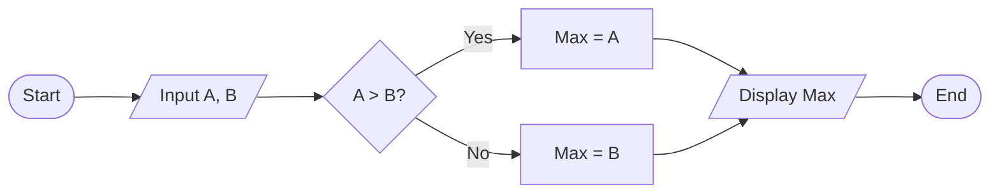

## Question 1(a) [3 marks]

**Define Problem Solving, Algorithm and Pseudo Code.**

**Answer**:

| Term | Definition |
|------|------------|
| **Problem Solving** | Systematic process of finding solutions to complex issues using logical thinking |
| **Algorithm** | Step-by-step procedure to solve a problem with finite operations |
| **Pseudo Code** | Informal description of program logic using plain English-like syntax |

- **Problem Solving**: Breaking down complex problems into manageable steps
- **Algorithm**: Must be finite, definite, effective, and produce correct output
- **Pseudo Code**: Bridge between human language and programming code

**Mnemonic:** "PAP - Problem, Algorithm, Pseudo"

## Question 1(b) [4 marks]

**Explain various Flowchart Symbols. Design a Flowchart to find maximum number out of two given numbers**

**Answer**:

| Symbol | Shape | Purpose |
|--------|-------|---------|
| **Oval** | ⬭ | Start/End |
| **Rectangle** | ▭ | Process/Action |
| **Diamond** | ◊ | Decision |
| **Parallelogram** | ▱ | Input/Output |

**Flowchart for Maximum of Two Numbers:**



- **Start/End**: Entry and exit points
- **Input/Output**: Data flow operations
- **Decision**: Conditional branching
- **Process**: Computational steps

**Mnemonic:** "SIPO - Start, Input, Process, Output"

## Question 1(c) [7 marks]

**List out various arithmetic operators of python. Write Python Code that performs various arithmetic operations.**

**Answer**:

| Operator | Symbol | Example | Result |
|----------|--------|---------|--------|
| **Addition** | + | 5 + 3 | 8 |
| **Subtraction** | - | 5 - 3 | 2 |
| **Multiplication** | * | 5 * 3 | 15 |
| **Division** | / | 5 / 3 | 1.667 |
| **Floor Division** | // | 5 // 3 | 1 |
| **Modulus** | % | 5 % 3 | 2 |
| **Exponentiation** | ** | 5 ** 3 | 125 |

**Code:**

```python
a = 10
b = 3
print(f"Addition: {a + b}")
print(f"Subtraction: {a - b}")
print(f"Multiplication: {a * b}")
print(f"Division: {a / b}")
print(f"Floor Division: {a // b}")
print(f"Modulus: {a % b}")
print(f"Power: {a ** b}")
```

**Mnemonic:** "Add-Sub-Mul-Div-Floor-Mod-Pow"

## Question 1(c OR) [7 marks]

**List out various comparison operators of python. Write Python Code which performs various comparison operations.**

**Answer**:

| Operator | Symbol | Purpose | Example |
|----------|--------|---------|---------|
| **Equal** | == | Check equality | 5 == 3 → False |
| **Not Equal** | != | Check inequality | 5 != 3 → True |
| **Greater Than** | > | Check greater | 5 > 3 → True |
| **Less Than** | < | Check smaller | 5 < 3 → False |
| **Greater Equal** | >= | Check greater/equal | 5 >= 3 → True |
| **Less Equal** | <= | Check smaller/equal | 5 <= 3 → False |

**Code:**

```python
x = 8
y = 5
print(f"Equal: {x == y}")
print(f"Not Equal: {x != y}")
print(f"Greater: {x > y}")
print(f"Less: {x < y}")
print(f"Greater Equal: {x >= y}")
print(f"Less Equal: {x <= y}")
```

**Mnemonic:** "Equal-Not-Greater-Less-GreaterEqual-LessEqual"

## Question 2(a) [3 marks]

**Write short note on membership operators.**

**Answer**:

| Operator | Purpose | Example |
|----------|---------|---------|
| **in** | Check if element exists | 'a' in 'apple' → True |
| **not in** | Check if element doesn't exist | 'z' not in 'apple' → True |

- **in operator**: Returns True if element found in sequence
- **not in operator**: Returns True if element not found in sequence
- **Usage**: Lists, strings, tuples, dictionaries

**Mnemonic:** "In-Not-In for membership testing"

## Question 2(b) [4 marks]

**Define Python. Write down various applications of Python Programming.**

**Answer**:

**Python Definition**: High-level, interpreted programming language known for simplicity and readability.

| Application Area | Examples |
|------------------|----------|
| **Web Development** | Django, Flask frameworks |
| **Data Science** | NumPy, Pandas, Matplotlib |
| **AI/ML** | TensorFlow, Scikit-learn |
| **Desktop Apps** | Tkinter, PyQt |
| **Game Development** | Pygame library |

- **Interpreted**: No compilation needed
- **Cross-platform**: Runs on multiple OS
- **Large libraries**: Extensive standard library

**Mnemonic:** "Web-Data-AI-Desktop-Games"

## Question 2(c) [7 marks]

**Write python program which calculates electricity bill using following details.**

**Answer**:

**Table of Rates:**

| Unit Range | Rate per Unit |
|------------|---------------|
| ≤ 100 | Rs 5.00 |
| 101-200 | Rs 7.50 |
| 201-300 | Rs 10.00 |
| ≥ 301 | Rs 15.00 |

**Code:**

```python
units = int(input("Enter consumed units: "))

if units <= 100:
    bill = units * 5.00
elif units <= 200:
    bill = units * 7.50
elif units <= 300:
    bill = units * 10.00
else:
    bill = units * 15.00

print(f"Total Bill: Rs {bill}")
```

- **Conditional logic**: if-elif-else structure
- **Rate calculation**: Based on unit slabs
- **User input**: Interactive billing system

**Mnemonic:** "Input-Check-Calculate-Display"

## Question 2(a OR) [3 marks]

**Write short note on identity operators.**

**Answer**:

| Operator | Purpose | Example |
|----------|---------|---------|
| **is** | Check same object | a is b |
| **is not** | Check different object | a is not b |

- **is operator**: Compares object identity, not values
- **is not operator**: Checks if objects are different
- **Memory comparison**: Checks same memory location

**Mnemonic:** "Is-IsNot for object identity"

## Question 2(b OR) [4 marks]

**What is indentation in Python? Explain various features of Python.**

**Answer**:

**Indentation**: Whitespace at line beginning to define code blocks.

| Feature | Description |
|---------|-------------|
| **Simple Syntax** | Easy to read and write |
| **Interpreted** | No compilation step |
| **Object-Oriented** | Supports OOP concepts |
| **Cross-Platform** | Runs on multiple OS |
| **Large Library** | Extensive standard library |

- **Indentation**: Replaces curly braces {}
- **Consistent**: Usually 4 spaces per level
- **Mandatory**: Creates code structure

**Mnemonic:** "Simple-Interpreted-Object-Cross-Large"

## Question 2(c OR) [7 marks]

**Write a python program that calculates Student's class/grade using following details.**

**Answer**:

**Grading Table:**

| Percentage | Grade |
|------------|-------|
| ≥ 70 | Distinction |
| 60-69 | First Class |
| 50-59 | Second Class |
| 35-49 | Pass Class |
| < 35 | Fail |

**Code:**

```python
percentage = float(input("Enter percentage: "))

if percentage >= 70:
    grade = "Distinction"
elif percentage >= 60:
    grade = "First Class"
elif percentage >= 50:
    grade = "Second Class"
elif percentage >= 35:
    grade = "Pass Class"
else:
    grade = "Fail"

print(f"Grade: {grade}")
```

- **Multiple conditions**: Nested if-elif structure
- **Grade assignment**: Based on percentage ranges
- **Float input**: Handles decimal percentages

**Mnemonic:** "Distinction-First-Second-Pass-Fail"

## Question 3(a) [3 marks]

**What is Selection Control Statement? List it out.**

**Answer**:

| Statement Type | Purpose |
|----------------|---------|
| **if** | Single condition check |
| **if-else** | Two-way branching |
| **if-elif-else** | Multi-way branching |
| **nested if** | Conditions within conditions |

- **Selection statements**: Control program flow based on conditions
- **Boolean evaluation**: Uses True/False logic
- **Branching**: Different paths of execution

**Mnemonic:** "If-IfElse-IfElif-Nested"

## Question 3(b) [4 marks]

**Write short note on nested loops.**

**Answer**:

| Loop Type | Structure |
|-----------|-----------|
| **Outer Loop** | Controls iterations |
| **Inner Loop** | Executes completely for each outer iteration |
| **Total Iterations** | Outer × Inner |

- **Nested structure**: Loop inside another loop
- **Complete execution**: Inner loop finishes before outer continues
- **Pattern creation**: Useful for 2D structures

**Code Example:**

```python
for i in range(3):
    for j in range(2):
        print(f"i={i}, j={j}")
```

**Mnemonic:** "Outer-Inner-Complete-Pattern"

## Question 3(c) [7 marks]

**Write a user-define function that displays all numbers, which are divisible by 4 from 1 to 100.**

**Answer**:

**Code:**

```python
def display_divisible_by_4():
    print("Numbers divisible by 4 from 1 to 100:")
    for num in range(1, 101):
        if num % 4 == 0:
            print(num, end=" ")
    print()

# Function call
display_divisible_by_4()
```

**Alternative with return:**

```python
def get_divisible_by_4():
    return [num for num in range(1, 101) if num % 4 == 0]

result = get_divisible_by_4()
print(result)
```

- **Function definition**: def keyword usage
- **Range function**: 1 to 100 iteration
- **Modulus check**: num % 4 == 0 condition
- **List comprehension**: Alternative approach

**Mnemonic:** "Define-Range-Check-Display"

## Question 3(a OR) [3 marks]

**What is Repetition Control Statement? List it out.**

**Answer**:

| Statement Type | Purpose |
|----------------|---------|
| **for loop** | Known number of iterations |
| **while loop** | Condition-based repetition |
| **nested loop** | Loop within loop |

- **Repetition statements**: Execute code blocks repeatedly
- **Iteration control**: Different methods of looping
- **Loop variables**: Track iteration progress

**Mnemonic:** "For-While-Nested"

## Question 3(b OR) [4 marks]

**Differentiate break and continue statements.**

**Answer**:

| Aspect | break | continue |
|--------|-------|----------|
| **Purpose** | Exit loop completely | Skip current iteration |
| **Execution** | Jumps out of loop | Jumps to next iteration |
| **Usage** | Terminate loop early | Skip specific conditions |
| **Effect** | Loop ends | Loop continues |

**Code Example:**

```python
# break example
for i in range(5):
    if i == 3:
        break
    print(i)  # Output: 0, 1, 2

# continue example  
for i in range(5):
    if i == 2:
        continue
    print(i)  # Output: 0, 1, 3, 4
```

**Mnemonic:** "Break-Exit, Continue-Skip"

## Question 3(c OR) [7 marks]

**Write a user-define function which displays all even numbers from 1 to 100.**

**Answer**:

**Code:**

```python
def display_even_numbers():
    print("Even numbers from 1 to 100:")
    for num in range(2, 101, 2):
        print(num, end=" ")
    print()

# Alternative method
def display_even_alt():
    even_nums = []
    for num in range(1, 101):
        if num % 2 == 0:
            even_nums.append(num)
    print(even_nums)

# Function call
display_even_numbers()
```

- **Efficient range**: range(2, 101, 2) for even numbers
- **Modulus method**: Alternative checking with % 2 == 0
- **Function design**: Reusable code block

**Mnemonic:** "Range-Step-Even-Display"

## Question 4(a) [3 marks]

**Define Function. List out various types of Functions available in Python.**

**Answer**:

**Function**: Reusable block of code that performs specific task.

| Function Type | Description |
|---------------|-------------|
| **Built-in** | Pre-defined functions (print, len) |
| **User-defined** | Created by programmer |
| **Lambda** | Anonymous single-line functions |
| **Recursive** | Functions calling themselves |

- **Code reusability**: Write once, use many times
- **Modularity**: Breaking complex problems into smaller parts
- **Parameters**: Input values to functions

**Mnemonic:** "Built-User-Lambda-Recursive"

## Question 4(b) [4 marks]

**Write short note on Scope of a variable.**

**Answer**:

| Scope Type | Description | Example |
|------------|-------------|---------|
| **Local** | Inside function only | Function variables |
| **Global** | Throughout program | Module-level variables |
| **Built-in** | Python keywords | print, len, type |

**Code Example:**

```python
x = 10  # Global variable

def my_function():
    y = 20  # Local variable
    print(x)  # Access global
    print(y)  # Access local

my_function()
# print(y)  # Error: y not accessible
```

- **Variable accessibility**: Where variables can be used
- **LEGB rule**: Local, Enclosing, Global, Built-in

**Mnemonic:** "Local-Global-Builtin"

## Question 4(c) [7 marks]

**Write Python code which asks user for Main string and Substring and checks membership of a Substring in the Main String.**

**Answer**:

**Code:**

```python
def check_substring():
    main_string = input("Enter main string: ")
    substring = input("Enter substring: ")
    
    if substring in main_string:
        print(f"'{substring}' found in '{main_string}'")
        print(f"Position: {main_string.find(substring)}")
    else:
        print(f"'{substring}' not found in '{main_string}'")

# Enhanced version with case handling
def check_substring_enhanced():
    main_string = input("Enter main string: ")
    substring = input("Enter substring: ")
    
    if substring.lower() in main_string.lower():
        print("Substring found (case-insensitive)")
    else:
        print("Substring not found")

check_substring()
```

- **User interaction**: input() for string collection
- **Membership testing**: 'in' operator usage
- **Case sensitivity**: Optional case handling

**Mnemonic:** "Input-Check-Report-Position"

## Question 4(a OR) [3 marks]

**What is Local variable and Global variable?**

**Answer**:

| Variable Type | Scope | Lifetime | Access |
|---------------|-------|----------|--------|
| **Local** | Function only | Function execution | Limited |
| **Global** | Entire program | Program execution | Widespread |

**Example:**

```python
global_var = 100  # Global

def function():
    local_var = 50  # Local
    print(global_var)  # ✓ Accessible
    print(local_var)   # ✓ Accessible

print(global_var)  # ✓ Accessible
# print(local_var)  # ✗ Error
```

- **Local variables**: Created inside functions
- **Global variables**: Created outside functions

**Mnemonic:** "Local-Limited, Global-Everywhere"

## Question 4(b OR) [4 marks]

**Explain any four built-in functions of Python.**

**Answer**:

| Function | Purpose | Example |
|----------|---------|---------|
| **len()** | Returns length | len("hello") → 5 |
| **type()** | Returns data type | type(10) → <class 'int'> |
| **input()** | Gets user input | name = input("Name: ") |
| **print()** | Displays output | print("Hello") |

**Additional Examples:**

```python
# len() function
print(len([1, 2, 3, 4]))  # Output: 4

# type() function  
print(type(3.14))  # Output: <class 'float'>

# input() function
age = input("Enter age: ")

# print() function
print("Your age is:", age)
```

**Mnemonic:** "Length-Type-Input-Print"

## Question 4(c OR) [7 marks]

**Write Python code which locates a substring in a given string.**

**Answer**:

**Code:**

```python
def locate_substring():
    main_string = input("Enter main string: ")
    substring = input("Enter substring to find: ")
    
    # Method 1: Using find()
    position = main_string.find(substring)
    if position != -1:
        print(f"Found at index: {position}")
    else:
        print("Substring not found")
    
    # Method 2: Using index() with exception handling
    try:
        position = main_string.index(substring)
        print(f"Located at index: {position}")
    except ValueError:
        print("Substring not found")
    
    # Method 3: Find all occurrences
    positions = []
    start = 0
    while True:
        pos = main_string.find(substring, start)
        if pos == -1:
            break
        positions.append(pos)
        start = pos + 1
    
    if positions:
        print(f"All positions: {positions}")

locate_substring()
```

- **find() method**: Returns index or -1
- **index() method**: Returns index or raises exception
- **Multiple occurrences**: Loop to find all positions

**Mnemonic:** "Find-Index-Exception-Multiple"

## Question 5(a) [3 marks]

**Define String. List out various string operations.**

**Answer**:

**String**: Sequence of characters enclosed in quotes.

| Operation | Method | Example |
|-----------|--------|---------|
| **Concatenation** | + | "Hello" + "World" |
| **Repetition** | * | "Hi" * 3 |
| **Slicing** | [start:end] | "Hello"[1:4] |
| **Length** | len() | len("Hello") |
| **Case** | upper(), lower() | "hello".upper() |

- **Immutable**: Strings cannot be changed after creation
- **Indexing**: Access individual characters
- **Methods**: Built-in functions for manipulation

**Mnemonic:** "Concat-Repeat-Slice-Length-Case"

## Question 5(b) [4 marks]

**How can we identify whether an element is a member of a list or not? Explain with a suitable example.**

**Answer**:

| Method | Operator | Returns |
|--------|----------|---------|
| **in** | element in list | True/False |
| **not in** | element not in list | True/False |
| **count()** | list.count(element) | Number of occurrences |

**Example:**

```python
fruits = ["apple", "banana", "orange", "mango"]

# Using 'in' operator
if "apple" in fruits:
    print("Apple is available")

# Using 'not in' operator  
if "grapes" not in fruits:
    print("Grapes not available")

# Using count() method
count = fruits.count("apple")
if count > 0:
    print(f"Apple found {count} times")
```

- **Boolean result**: True if found, False otherwise
- **Case sensitive**: "Apple" ≠ "apple"
- **Efficiency**: 'in' operator is most common

**Mnemonic:** "In-NotIn-Count for membership"

## Question 5(c) [7 marks]

**Write Python code that replaces a substring with another substring of a given string. Consider the given string as 'Welcome to GTU' and replace the substring 'GTU' with 'Gujarat Technological University'.**

**Answer**:

**Code:**

```python
def replace_substring():
    # Given string
    original = "Welcome to GTU"
    old_substring = "GTU"
    new_substring = "Gujarat Technological University"
    
    # Method 1: Using replace()
    result1 = original.replace(old_substring, new_substring)
    print(f"Original: {original}")
    print(f"Modified: {result1}")
    
    # Method 2: Manual replacement
    if old_substring in original:
        index = original.find(old_substring)
        result2 = original[:index] + new_substring + original[index + len(old_substring):]
        print(f"Manual method: {result2}")
    
    # Method 3: Replace all occurrences
    test_string = "GTU offers GTU degree from GTU"
    result3 = test_string.replace("GTU", "Gujarat Technological University")
    print(f"Multiple replacements: {result3}")

replace_substring()
```

**Output:**

```
Original: Welcome to GTU
Modified: Welcome to Gujarat Technological University
```

- **replace() method**: Built-in string function
- **Slicing method**: Manual string manipulation
- **All occurrences**: Replaces every instance

**Mnemonic:** "Find-Replace-Slice-All"

## Question 5(a OR) [3 marks]

**Define List. List out various list operations.**

**Answer**:

**List**: Ordered collection of items that can be modified.

| Operation | Method | Example |
|-----------|--------|---------|
| **Add** | append(), insert() | list.append(item) |
| **Remove** | remove(), pop() | list.remove(item) |
| **Access** | [index] | list[0] |
| **Slice** | [start:end] | list[1:3] |
| **Sort** | sort() | list.sort() |

- **Mutable**: Lists can be changed after creation
- **Indexed**: Elements accessed by position
- **Dynamic**: Size can grow or shrink

**Mnemonic:** "Add-Remove-Access-Slice-Sort"

## Question 5(b OR) [4 marks]

**Write short note on String Slicing. Explain with suitable example.**

**Answer**:

**String Slicing**: Extracting parts of string using [start:end:step].

| Syntax | Description | Example |
|--------|-------------|---------|
| **[start:]** | From start to end | "Hello"[1:] → "ello" |
| **[:end]** | From beginning to end | "Hello"[:3] → "Hel" |
| **[start:end]** | Specific range | "Hello"[1:4] → "ell" |
| **[::-1]** | Reverse string | "Hello"[::-1] → "olleH" |

**Example:**

```python
text = "Python Programming"

print(text[0:6])    # "Python"
print(text[7:])     # "Programming"  
print(text[:6])     # "Python"
print(text[::2])    # "Pto rgamn"
print(text[::-1])   # "gnimmargorP nohtyP"
```

- **Negative indexing**: -1 for last character
- **Step parameter**: Controls increment

**Mnemonic:** "Start-End-Step for slicing"

## Question 5(c OR) [7 marks]

**Write Python code which counts the number of times the specified element appears in the list.**

**Answer**:

**Code:**

```python
def count_element_occurrences():
    # Create a sample list
    numbers = [1, 2, 3, 2, 4, 2, 5, 2, 6]
    element = int(input("Enter element to count: "))
    
    # Method 1: Using count() method
    count1 = numbers.count(element)
    print(f"Using count(): {element} appears {count1} times")
    
    # Method 2: Manual counting
    count2 = 0
    for num in numbers:
        if num == element:
            count2 += 1
    print(f"Manual count: {element} appears {count2} times")
    
    # Method 3: List comprehension
    count3 = len([x for x in numbers if x == element])
    print(f"List comprehension: {element} appears {count3} times")
    
    # Method 4: For any type of list
    mixed_list = [1, "hello", 3.14, "hello", True, "hello"]
    element_str = input("Enter element to search in mixed list: ")
    count4 = mixed_list.count(element_str)
    print(f"In mixed list: '{element_str}' appears {count4} times")

count_element_occurrences()
```

- **count() method**: Built-in list function
- **Manual iteration**: Using loops for counting
- **List comprehension**: Pythonic way of counting
- **Type flexibility**: Works with any data type

**Mnemonic:** "Count-Manual-Comprehension-Flexible"
