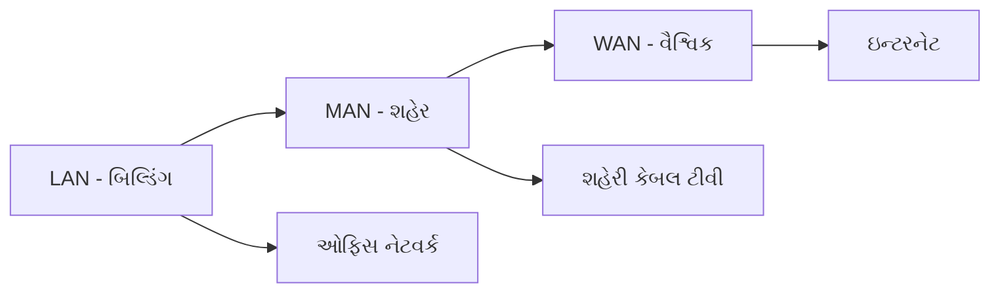
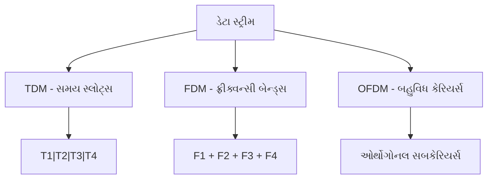
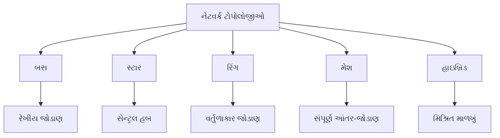
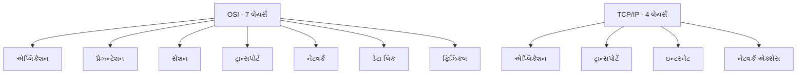
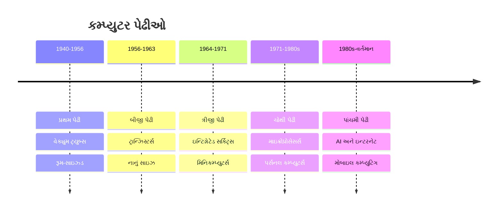
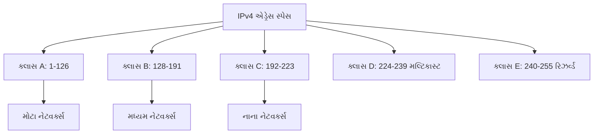

## પ્રશ્ન ૧(આ) [૩ ગુણ]

**કમ્પ્યુટરના મુખ્ય ઘટકોની ચચાર્ કરો.**

**જવાબ**:

**કોષ્ટક: કમ્પ્યુટરના મુખ્ય ઘટકો**

| ઘટક | કાર્ય | ઉદાહરણ |
|-----|------|--------|
| **ઇનપુટ યુનિટ** | ડેટા અને સૂચનાઓ પ્રાપ્ત કરે | કીબોર્ડ, માઉસ |
| **સીપીયુ** | ડેટા પ્રોસેસ કરે અને કંટ્રોલ કરે | Intel i5, AMD Ryzen |
| **મેમરી** | ડેટા અસ્થાયી/કાયમી સંગ્રહ કરે | RAM, હાર્ડ ડિસ્ક |
| **આઉટપુટ યુનિટ** | પ્રોસેસ કરેલા પરિણામો દર્શાવે | મોનિટર, પ્રિન્ટર |

**મુખ્ય ઘટકો:**

- **હાર્ડવેર**: ભૌતિક ભાગો જેવા કે CPU, RAM, મધરબોર્ડ
- **સોફ્ટવેર**: પ્રોગ્રામ્સ અને ઓપરેટિંગ સિસ્ટમ
- **ડેટા**: કમ્પ્યુટર દ્વારા પ્રોસેસ થતી માહિતી

**મેમરી ટ્રીક:** "ઇનપુટ સીપીયુ મેમરી આઉટપુટ"

## પ્રશ્ન ૧(બ) [૪ ગુણ]

**વેબ બ્રાઉઝર અને તેનો પ્રકાર સમજાવો.**

**જવાબ**:

**વેબ બ્રાઉઝર** એ એવો સોફ્ટવેર છે જે ઇન્ટરનેટથી વેબ પૃષ્ઠોને ઍક્સેસ કરે અને દર્શાવે છે.

**કોષ્ટક: વેબ બ્રાઉઝરના પ્રકારો**

| બ્રાઉઝર પ્રકાર | વિશેષતાઓ | ઉદાહરણો |
|-------------|--------|---------|
| **ગ્રાફિકલ** | GUI ઇન્ટરફેસ, મલ્ટિમીડિયા સપોર્ટ | Chrome, Firefox |
| **ટેક્સ્ટ-આધારિત** | કમાન્ડ લાઇન, ઝડપી લોડિંગ | Lynx, Links |
| **મોબાઇલ** | ટચ ઇન્ટરફેસ, ફોન માટે અનુકૂલિત | Safari Mobile, Chrome Mobile |

**વિશેષતાઓ:**

- **નેવિગેશન**: આગળ, પાછળ, રિફ્રેશ બટન્સ
- **બુકમાર્ક્સ**: પ્રિય વેબસાઇટ્સ સેવ કરો
- **ટેબ્સ**: એક વિન્ડોમાં બહુવિધ પૃષ્ઠો
- **સિક્યોરિટી**: HTTPS સપોર્ટ, પોપઅપ બ્લોકર્સ

**મેમરી ટ્રીક:** "બ્રાઉઝ કરો સલામત રીતે ઓનલાઇન"

## પ્રશ્ન ૧(સ) [૭ ગુણ]

**LAN, MAN અને WAN ને ઉદાહરણો સાથે સમજાવો.**

**જવાબ**:

**કોષ્ટક: નેટવર્ક પ્રકારોની સરખામણી**

| નેટવર્ક | કવરેજ | સ્પીડ | ઉદાહરણ | ખર્ચ |
|---------|-------|-------|---------|-----|
| **LAN** | બિલ્ડિંગ/કેમ્પસ | ઊંચી (100Mbps-1Gbps) | ઓફિસ નેટવર્ક | ઓછો |
| **MAN** | શહેર/મેટ્રોપોલિટન | મધ્યમ (10-100Mbps) | કેબલ ટીવી નેટવર્ક | મધ્યમ |
| **WAN** | દેશ/વૈશ્વિક | બદલાતી (1-100Mbps) | ઇન્ટરનેટ | વધુ |

**વિસ્તૃત સમજાવટ:**

**LAN (Local Area Network):**

- **કવરેજ**: બિલ્ડિંગ કે નાના વિસ્તારમાં
- **ટેકનોલોજી**: Ethernet, Wi-Fi
- **ઉદાહરણ**: કમ્પ્યુટર લેબ, ઘરેલું નેટવર્ક

**MAN (Metropolitan Area Network):**

- **કવરેજ**: શહેર કે મેટ્રોપોલિટન વિસ્તાર
- **ટેકનોલોજી**: ફાઇબર ઓપ્ટિક, માઇક્રોવેવ
- **ઉદાહરણ**: શહેરવ્યાપી કેબલ ઇન્ટરનેટ

**WAN (Wide Area Network):**

- **કવરેજ**: બહુવિધ શહેરો/દેશો
- **ટેકનોલોજી**: સેટેલાઇટ, ફાઇબર ઓપ્ટિક
- **ઉદાહરણ**: ઇન્ટરનેટ, બેંક ATM નેટવર્ક

**આકૃતિ:**



**મેમરી ટ્રીક:** "લોકલ મેટ્રો વર્લ્ડ" (LAN-MAN-WAN)

## પ્રશ્ન ૧(સ અથવા) [૭ ગુણ]

**ડોસ અને યુનિક્સ ઓપરેટિંગ સિસ્ટમ વચ્ચે તફાવત લખો.**

**જવાબ**:

**કોષ્ટક: DOS વિ Unix સરખામણી**

| વિશેષતા | DOS | Unix |
|---------|-----|------|
| **ઇન્ટરફેસ** | કમાન્ડ લાઇન (ટેક્સ્ટ-આધારિત) | કમાન્ડ લાઇન + GUI |
| **મલ્ટિ-યુઝર** | સિંગલ યુઝર | મલ્ટિ-યુઝર સપોર્ટ |
| **મલ્ટિટાસ્કિંગ** | મર્યાદિત | સંપૂર્ણ મલ્ટિટાસ્કિંગ |
| **સિક્યોરિટી** | મૂળભૂત | અદ્યતન સિક્યોરિટી |
| **ફાઇલ સિસ્ટમ** | FAT16/FAT32 | વિવિધ (ext3, ext4) |
| **કિંમત** | કોમર્શિયલ (Microsoft) | ફ્રી/ઓપન સોર્સ વેરિયન્ટ્સ |

**મુખ્ય તફાવતો:**

**DOS (Disk Operating System):**

- **આર્કિટેક્ચર**: 16-bit, સિંગલ-યુઝર
- **મેમરી**: 640KB પરંપરાગત મેમરી મર્યાદા
- **કમાન્ડ્સ**: DIR, COPY, DEL
- **ફાઇલ નેમિંગ**: 8.3 ફોર્મેટ મર્યાદા

**Unix:**

- **આર્કિટેક્ચર**: 32/64-bit, મલ્ટિ-યુઝર
- **મેમરી**: અદ્યતન મેમરી મેનેજમેન્ટ
- **કમાન્ડ્સ**: ls, cp, rm, grep
- **ફાઇલ નેમિંગ**: કેસ-સેન્સિટિવ, લાંબા નામો

**ઉદાહરણો:**

- **DOS**: MS-DOS, PC-DOS
- **Unix**: Linux, Solaris, AIX

**મેમરી ટ્રીક:** "DOS સરળ, Unix શક્તિશાળી" (સિંગલ વિ મલ્ટિ-યુઝર)

## પ્રશ્ન ૨(આ) [૩ ગુણ]

**ઓપરેટિંગ સિસ્ટમના લક્ષણોની યાદી આપો.**

**જવાબ**:

**કોષ્ટક: ઓપરેટિંગ સિસ્ટમની વિશેષતાઓ**

| વિશેષતા | વર્ણન |
|---------|-------|
| **પ્રોસેસ મેનેજમેન્ટ** | પ્રોગ્રામ એક્ઝિક્યુશન કંટ્રોલ કરે |
| **મેમરી મેનેજમેન્ટ** | RAM કાર્યક્ષમ રીતે વહેંચે |
| **ફાઇલ મેનેજમેન્ટ** | ડેટા સ્ટોરેજ વ્યવસ્થિત કરે |
| **ડિવાઇસ મેનેજમેન્ટ** | હાર્ડવેર ડિવાઇસો કંટ્રોલ કરે |

**મુખ્ય વિશેષતાઓ:**

- **યુઝર ઇન્ટરફેસ**: GUI અથવા કમાન્ડ લાઇન
- **સિક્યોરિટી**: યુઝર ઓથેન્ટિકેશન, ઍક્સેસ કંટ્રોલ
- **મલ્ટિટાસ્કિંગ**: એકસાથે બહુવિધ પ્રોગ્રામ્સ ચલાવો
- **રિસોર્સ ઍલોકેશન**: CPU, મેમરી વિતરણ

**મેમરી ટ્રીક:** "પ્રોસેસ મેમરી ફાઇલ ડિવાઇસ"

## પ્રશ્ન ૨(બ) [૪ ગુણ]

**હાફ ડુપ્લેક્સ અને ફુલ ડુપ્લેક્સ ટ્રાન્સમિશન મોડ્સ વ્યાખ્યાયિત લખો.**

**જવાબ**:

**કોષ્ટક: ટ્રાન્સમિશન મોડ્સની સરખામણી**

| મોડ | દિશા | ઉદાહરણ | કાર્યક્ષમતા |
|----|-----|---------|-----------|
| **હાફ ડુપ્લેક્સ** | દ્વિદિશીય (એક સમયે એક) | વોકી-ટોકી | મધ્યમ |
| **ફુલ ડુપ્લેક્સ** | દ્વિદિશીય (એકસાથે) | ટેલિફોન | ઊંચી |

**વ્યાખ્યાઓ:**

**હાફ ડુપ્લેક્સ:**

- **કોમ્યુનિકેશન**: બે-તરફી પણ એકસાથે નહીં
- **ઉદાહરણ**: રેડિયો કોમ્યુનિકેશન, જૂના Ethernet hubs
- **મર્યાદા**: વારો લેવાની જરૂર

**ફુલ ડુપ્લેક્સ:**

- **કોમ્યુનિકેશન**: બે-તરફી એકસાથે
- **ઉદાહરણ**: આધુનિક Ethernet, ટેલિફોન કૉલ્સ
- **ફાયદો**: રાહ જોવાનો સમય નથી

**આકૃતિ:**

```goat
હાફ ડુપ્લેક્સ:
A -----> B  (A મોકલે)
A <----- B  (B મોકલે - A રાહ જુએ)

ફુલ ડુપ્લેક્સ:
A <----> B  (બંને એકસાથે મોકલે/મેળવે)
```

**મેમરી ટ્રીક:** "હાફ રાહ જુએ, ફુલ વહે છે" (હાફ=રાહ, ફુલ=એકસાથે)

## પ્રશ્ન ૨(સ) [૭ ગુણ]

**ઓપન સોર્સ અને પ્રોપરાઇટરી સોફ્ટવેર વચ્ચેનો તફાવત.**

**જવાબ**:

**કોષ્ટક: ઓપન સોર્સ વિ પ્રોપરાઇટરી સોફ્ટવેર**

| પાસા | ઓપન સોર્સ | પ્રોપરાઇટરી |
|-----|----------|------------|
| **સોર્સ કોડ** | ફ્રીમાં ઉપલબ્ધ | છુપાયેલો/સુરક્ષિત |
| **કિંમત** | સામાન્ય રીતે ફ્રી | પેઇડ લાઇસન્સ |
| **મોડિફિકેશન** | મંજૂર | પ્રતિબંધિત |
| **સપોર્ટ** | કોમ્યુનિટી-આધારિત | વેન્ડર સપોર્ટ |
| **સિક્યોરિટી** | ટ્રાન્સપેરન્ટ | સિક્યોરિટી through obscurity |
| **ઉદાહરણો** | Linux, Firefox, Apache | Windows, MS Office |

**વિસ્તૃત સરખામણી:**

**ઓપન સોર્સ સોફ્ટવેર:**

- **વ્યાખ્યા**: સોર્સ કોડ જાહેરમાં ઉપલબ્ધ
- **લાઇસન્સિંગ**: GPL, MIT, Apache લાઇસન્સ
- **ફાયદા**: ખર્ચ-અસરકારક, કસ્ટમાઇઝેબલ, પારદર્શક
- **ઉદાહરણો**: LibreOffice, GIMP, MySQL

**પ્રોપરાઇટરી સોફ્ટવેર:**

- **વ્યાખ્યા**: વ્યક્તિ/કંપની દ્વારા માલિકી
- **લાઇસન્સિંગ**: End User License Agreement (EULA)
- **ફાયદા**: વ્યાવસાયિક સપોર્ટ, ગેરેંટીશુદા અપડેટ્સ
- **ઉદાહરણો**: Adobe Photoshop, Oracle Database

**ફાયદા અને નુકસાનો:**

**ઓપન સોર્સ ફાયદા:** ફ્રી, લવચીક, કોમ્યુનિટી સપોર્ટ
**ઓપન સોર્સ નુકસાન:** મર્યાદિત વ્યાવસાયિક સપોર્ટ

**પ્રોપરાઇટરી ફાયદા:** વ્યાવસાયિક સપોર્ટ, વોરન્ટી
**પ્રોપરાઇટરી નુકસાન:** મોંઘું, વેન્ડર લોક-ઇન

**મેમરી ટ્રીક:** "ઓપન = જોવા માટે ફ્રી, પ્રોપરાઇટરી = વાપરવા માટે પૈસા આપો"

## પ્રશ્ન ૨(આ અથવા) [૩ ગુણ]

**RAM અને ROM વચ્ચે તફાવત લખો.**

**જવાબ**:

**કોષ્ટક: RAM વિ ROM સરખામણી**

| વિશેષતા | RAM | ROM |
|---------|-----|-----|
| **પૂર્ણ નામ** | Random Access Memory | Read Only Memory |
| **વોલેટિલિટી** | વોલેટાઇલ (ડેટા ગુમાવે) | નોન-વોલેટાઇલ (ડેટા જાળવે) |
| **ઍક્સેસ** | રીડ/રાઇટ | ફક્ત રીડ |
| **સ્પીડ** | ખૂબ ઝડપી | RAM કરતાં ધીમી |

**મુખ્ય તફાવતો:**

- **હેતુ**: RAM અસ્થાયી સ્ટોરેજ માટે, ROM કાયમી માટે
- **કિંમત**: RAM પ્રતિ GB વધુ મોંઘી
- **વપરાશ**: RAM પ્રોગ્રામ્સ માટે, ROM ફર્મવેર માટે

**મેમરી ટ્રીક:** "RAM દોડે, ROM યાદ રાખે" (અસ્થાયી વિ કાયમી)

## પ્રશ્ન ૨(બ અથવા) [૪ ગુણ]

**ઉદાહરણ સાથે AND લોજિક ગેટ સમજાવો.**

**જવાબ**:

**AND ગેટ વ્યાખ્યા:** આઉટપુટ ત્યારે જ HIGH આવે જ્યારે બધા ઇનપુટ્સ HIGH હોય.

**ટ્રુથ ટેબલ:**

| ઇનપુટ A | ઇનપુટ B | આઉટપુટ (A AND B) |
|---------|---------|------------------|
| 0 | 0 | 0 |
| 0 | 1 | 0 |
| 1 | 0 | 0 |
| 1 | 1 | 1 |

**સિમ્બોલ:**

```goat
    A ----\
           >---- આઉટપુટ
    B ----/
```

**ઉદાહરણ ઍપ્લિકેશન્સ:**

- **સિક્યોરિટી સિસ્ટમ**: દરવાજો ચાવી AND કાર્ડ બંનેથી ખુલે
- **કાર સ્ટાર્ટિંગ**: એન્જિન ચાવી AND બ્રેક પર પગ બંનેથી ચાલે
- **બુલિયન એક્સપ્રેશન**: Y = A · B અથવા Y = A ∧ B

**વાસ્તવિક જીવનનું ઉદાહરણ:** વોશિંગ મશીન ત્યારે જ ચાલે જ્યારે દરવાજો બંધ હોય AND પાવર બટન દબાયેલ હોય.

**મેમરી ટ્રીક:** "બધા ઇનપુટ્સ સાચા = આઉટપુટ સાચો"

## પ્રશ્ન ૨(સ અથવા) [૭ ગુણ]

**ઈથરનેટ કેબલ કલર કોડ સમજાવો.**

**જવાબ**:

**સ્ટાન્ડર્ડ: TIA/EIA-568B કલર કોડ**

**કોષ્ટક: વાયર કલર સિક્વન્સ**

| પિન | રંગ | કાર્ય |
|-----|------|------|
| 1 | વાઇટ/ઓરેન્જ | ટ્રાન્સમિટ+ |
| 2 | ઓરેન્જ | ટ્રાન્સમિટ- |
| 3 | વાઇટ/ગ્રીન | રિસીવ+ |
| 4 | બ્લુ | વાપરતા નથી |
| 5 | વાઇટ/બ્લુ | વાપરતા નથી |
| 6 | ગ્રીન | રિસીવ- |
| 7 | વાઇટ/બ્રાઉન | વાપરતા નથી |
| 8 | બ્રાઉન | વાપરતા નથી |

**કેબલના પ્રકારો:**

**સ્ટ્રેઇટ-થ્રુ કેબલ (568B બંને છેડે):**

- **વપરાશ**: કમ્પ્યુટર થી સ્વિચ/હબ
- **કલર સિક્વન્સ**: બંને છેડે સમાન

**ક્રોસ-ઓવર કેબલ (568A એક છેડે, 568B બીજે):**

- **વપરાશ**: કમ્પ્યુટર થી કમ્પ્યુટર સીધું
- **પિન્સ સ્વેપ**: 1↔3, 2↔6

**વાયરિંગ આકૃતિ:**

```goat
RJ-45 કનેક્ટર (568B):
પિન 1: વાઇટ/ઓરેન્જ
પિન 2: ઓરેન્જ  
પિન 3: વાઇટ/ગ્રીન
પિન 4: બ્લુ
પિન 5: વાઇટ/બ્લુ
પિન 6: ગ્રીન
પિન 7: વાઇટ/બ્રાઉન
પિન 8: બ્રાઉન
```

**તૈયારીના પગલાં:**

1. બાહ્ય જેકેટ સ્ટ્રિપ કરો (1 ઇંચ)
2. વાયર્સને કલર ક્રમમાં ગોઠવો
3. વાયર્સને સરખી કાપો
4. RJ-45 કનેક્ટરમાં નાખો
5. ક્રિમ્પિંગ ટૂલથી ક્રિમ્પ કરો

**મેમરી ટ્રીક:** "વાઇટ ઓરેન્જ, ઓરેન્જ, વાઇટ ગ્રીન, બ્લુ, વાઇટ બ્લુ, ગ્રીન, વાઇટ બ્રાઉન, બ્રાઉન"

## પ્રશ્ન ૩(આ) [૩ ગુણ]

**વાયર્ડ અને વાયરલેસ કોમ્યુનિકેશનની સરખામણી લખો.**

**જવાબ**:

**કોષ્ટક: વાયર્ડ વિ વાયરલેસ કોમ્યુનિકેશન**

| પાસા | વાયર્ડ | વાયરલેસ |
|-----|--------|----------|
| **માધ્યમ** | કેબલ્સ (કોપર/ફાઇબર) | રેડિયો તરંગો/ઇન્ફ્રારેડ |
| **સ્પીડ** | વધુ (100Gbps સુધી) | ઓછી (1Gbps સુધી) |
| **સિક્યોરિટી** | વધુ સુરક્ષિત | ઓછી સુરક્ષિત |
| **મોબિલિટી** | મર્યાદિત | ઊંચી મોબિલિટી |
| **કિંમત** | વધુ ઇન્સ્ટોલેશન | ઓછી ઇન્સ્ટોલેશન |
| **ઇન્ટરફેરન્સ** | ન્યૂનતમ | સિગ્નલ ઇન્ટરફેરન્સ |

**મુખ્ય મુદ્દા:**

- **વાયર્ડ**: વિશ્વસનીય, ઝડપી, સુરક્ષિત પણ મર્યાદિત મોબિલિટી
- **વાયરલેસ**: મોબાઇલ, લવચીક પણ સિક્યોરિટીની ચિંતા

**મેમરી ટ્રીક:** "વાયર્સ ઝડપી, વાયરલેસ મુક્ત" (સ્પીડ વિ મોબિલિટી)

## પ્રશ્ન ૩(બ) [૪ ગુણ]

**કમ્પ્યુટર સિસ્ટમના વિવિધ પ્રકારોની ચર્ચા કરો.**

**જવાબ**:

**કોષ્ટક: કમ્પ્યુટર સિસ્ટમના પ્રકારો**

| પ્રકાર | સાઇઝ | પ્રોસેસિંગ પાવર | ઉદાહરણ |
|------|-----|----------------|---------|
| **સુપરકમ્પ્યુટર** | રૂમ-સાઇઝ્ડ | અત્યંત ઊંચી | હવામાન આગાહી |
| **મેઇનફ્રેમ** | મોટી કેબિનેટ | ખૂબ ઊંચી | બેંક ટ્રાન્ઝેક્શન્સ |
| **મિનિકમ્પ્યુટર** | ડેસ્ક-સાઇઝ્ડ | મધ્યમ | નાના બિઝનેસ |
| **માઇક્રોકમ્પ્યુટર** | ડેસ્કટોપ/લેપટોપ | ઓછીથી મધ્યમ | વ્યક્તિગત વપરાશ |

**વર્ગીકરણ:**

**સાઇઝ અને પાવર દ્વારા:**

- **સુપરકમ્પ્યુટર**: વૈજ્ઞાનિક ગણતરીઓ, સંશોધન
- **મેઇનફ્રેમ**: મોટી સંસ્થાઓ, એકસાથે વધારે યુઝર્સ
- **પર્સનલ કમ્પ્યુટર**: વ્યક્તિગત યુઝર્સ, ઓફિસ વર્ક
- **એમ્બેડેડ સિસ્ટમ્સ**: ચોક્કસ કાર્યો (વોશિંગ મશીન)

**હેતુ દ્વારા:**

- **જનરલ પર્પઝ**: બહુમુખી, બહુવિધ ઍપ્લિકેશન્સ
- **સ્પેશિયલ પર્પઝ**: સમર્પિત કાર્યો (ATM, ગેમિંગ કન્સોલ)

**મેમરી ટ્રીક:** "સુપર મેઇન મિની માઇક્રો" (ઘટતા સાઇઝનો ક્રમ)

## પ્રશ્ન ૩(સ) [૭ ગુણ]

**TDM, FDM, OFDM પર ટૂંકી નોંધ લખો.**

**જવાબ**:

**કાર્યક્ષમ કોમ્યુનિકેશન માટે મલ્ટિપ્લેક્સિંગ તકનીકો**

**કોષ્ટક: મલ્ટિપ્લેક્સિંગ સરખામણી**

| તકનીક | વિભાજન પદ્ધતિ | ઍપ્લિકેશન | ફાયદો |
|--------|---------------|------------|-------|
| **TDM** | સમય સ્લોટ્સ | ડિજિટલ ટેલિફોની | સરળ અમલીકરણ |
| **FDM** | ફ્રીક્વન્સી બેન્ડ્સ | રેડિયો/ટીવી બ્રોડકાસ્ટિંગ | એકસાથે ટ્રાન્સમિશન |
| **OFDM** | બહુવિધ કેરિયર્સ | Wi-Fi, 4G/5G | ઊંચા ડેટા રેટ્સ |

**ટાઇમ ડિવિઝન મલ્ટિપ્લેક્સિંગ (TDM):**

- **સિદ્ધાંત**: દરેક યુઝરને નિશ્ચિત સમય સ્લોટ મળે
- **અમલીકરણ**: અનુક્રમિક ડેટા ટ્રાન્સમિશન
- **ઉદાહરણ**: ડિજિટલ ટેલિફોન સિસ્ટમ્સ, GSM
- **ફાયદો**: બેન્ડવિડ્થનો કાર્યક્ષમ ઉપયોગ

**ફ્રીક્વન્સી ડિવિઝન મલ્ટિપ્લેક્સિંગ (FDM):**

- **સિદ્ધાંત**: દરેક યુઝરને અનન્ય ફ્રીક્વન્સી બેન્ડ મળે
- **અમલીકરણ**: એકસાથે ટ્રાન્સમિશન
- **ઉદાહરણ**: FM રેડિયો, કેબલ ટીવી
- **ફાયદો**: ટાઇમિંગ કોઓર્ડિનેશનની જરૂર નથી

**ઓર્થોગોનલ ફ્રીક્વન્સી ડિવિઝન મલ્ટિપ્લેક્સિંગ (OFDM):**

- **સિદ્ધાંત**: બહુવિધ ઓર્થોગોનલ સબકેરિયર્સ
- **અમલીકરણ**: પેરેલલ ડેટા સ્ટ્રીમ્સ
- **ઉદાહરણ**: Wi-Fi (802.11), LTE, DSL
- **ફાયદો**: ઊંચી સ્પેક્ટ્રલ કાર્યક્ષમતા, ઇન્ટરફેરન્સ સામે મજબૂત

**આકૃતિ:**



**ઍપ્લિકેશન્સ:**

- **TDM**: ISDN, T1/E1 લાઇન્સ
- **FDM**: એનાલોગ ટીવી, રેડિયો
- **OFDM**: આધુનિક વાયરલેસ સિસ્ટમ્સ

**મેમરી ટ્રીક:** "સમય ફ્રીક્વન્સી ઓર્થોગોનલ" (TDM-FDM-OFDM)

## પ્રશ્ન ૩(આ અથવા) [૩ ગુણ]

**FSK અને PSK ની ચર્ચા કરો.**

**જવાબ**:

**ડિજિટલ મોડ્યુલેશન તકનીકો**

**કોષ્ટક: FSK વિ PSK**

| પાસા | FSK | PSK |
|-----|-----|-----|
| **પેરામીટર** | ફ્રીક્વન્સી | ફેઝ |
| **કોમ્પ્લેક્સિટી** | સરળ | જટિલ |
| **નોઇઝ ઇમ્યુનિટી** | સારી | ઉત્તમ |
| **બેન્ડવિડ્થ** | વધુ | ઓછી |

**FSK (Frequency Shift Keying):**

- **સિદ્ધાંત**: 0 અને 1 માટે અલગ ફ્રીક્વન્સીઝ
- **અમલીકરણ**: '0' માટે f1, '1' માટે f2
- **ઉદાહરણ**: કમ્પ્યુટર મોડેમ્સ, RFID

**PSK (Phase Shift Keying):**

- **સિદ્ધાંત**: ફેઝ ચેન્જેસ ડેટા દર્શાવે
- **અમલીકરણ**: '0' માટે 0°, '1' માટે 180°
- **ઉદાહરણ**: Wi-Fi, સેટેલાઇટ કોમ્યુનિકેશન

**મેમરી ટ્રીક:** "ફ્રીક્વન્સી શિફ્ટ, ફેઝ શિફ્ટ" (FSK-PSK)

## પ્રશ્ન ૩(બ અથવા) [૪ ગુણ]

**મલ્ટિટાસ્કિંગ અને મલ્ટિપ્રોગ્રામિંગ OS વચ્ચે તફાવત લખો.**

**જવાબ**:

**કોષ્ટક: મલ્ટિટાસ્કિંગ વિ મલ્ટિપ્રોગ્રામિંગ**

| વિશેષતા | મલ્ટિટાસ્કિંગ | મલ્ટિપ્રોગ્રામિંગ |
|---------|--------------|------------------|
| **યુઝર ઇન્ટરેક્શન** | ઇન્ટરેક્ટિવ | બેચ પ્રોસેસિંગ |
| **રિસ્પોન્સ ટાઇમ** | ઝડપી | ધીમી |
| **CPU શેરિંગ** | ટાઇમ સ્લાઇસિંગ | જોબ સ્વિચિંગ |
| **ઉદાહરણ** | Windows, Linux | પ્રારંભિક મેઇનફ્રેમ્સ |

**મલ્ટિટાસ્કિંગ:**

- **વ્યાખ્યા**: બહુવિધ કાર્યો દેખીતી રીતે એકસાથે ચાલે
- **પદ્ધતિ**: ઝડપી સ્વિચિંગ સાથે ટાઇમ શેરિંગ
- **યુઝર અનુભવ**: ઇન્ટરેક્ટિવ, પ્રતિસાદી
- **પ્રકારો**: પ્રીએમ્પ્ટિવ, કોઓપરેટિવ

**મલ્ટિપ્રોગ્રામિંગ:**

- **વ્યાખ્યા**: મેમરીમાં બહુવિધ પ્રોગ્રામ્સ
- **પદ્ધતિ**: I/O ઓપરેશન્સ દરમિયાન CPU સ્વિચ કરે
- **યુઝર અનુભવ**: બેચ જોબ પ્રોસેસિંગ
- **હેતુ**: CPU ઉપયોગિતા સુધારો

**મેમરી ટ્રીક:** "ટાસ્ક્સ ઇન્ટરેક્ટિવ, પ્રોગ્રામ્સ બેચ્ડ"

## પ્રશ્ન ૩(સ અથવા) [૭ ગુણ]

**નેટવર્ક ટોપોલોજી પર ટૂંકી નોંધ લખો.**

**જવાબ**:

**નેટવર્ક ટોપોલોજીના પ્રકારો અને લાક્ષણિકતાઓ**

**કોષ્ટક: ટોપોલોજી સરખામણી**

| ટોપોલોજી | માળખું | ફાયદા | નુકસાન | કિંમત |
|----------|--------|--------|---------|-------|
| **બસ** | રેખીય | સરળ, કિફાયતી | સિંગલ પોઇન્ટ ફેઇલ્યુર | ઓછી |
| **સ્ટાર** | સેન્ટ્રલ હબ | ટ્રબલશૂટિંગ સરળ | હબ ફેઇલ થાય તો બધાને અસર | મધ્યમ |
| **રિંગ** | વર્તુળાકાર | સમાન ઍક્સેસ | બ્રેક નેટવર્કને અસર કરે | મધ્યમ |
| **મેશ** | આંતર-જોડાયેલ | ઊંચી વિશ્વસનીયતા | જટિલ, મોંઘું | ઊંચી |
| **હાઇબ્રિડ** | મિશ્રિત | લવચીક | જટિલ મેનેજમેન્ટ | બદલાતી |

**વિસ્તૃત વર્ણનો:**

**બસ ટોપોલોજી:**

- **માળખું**: સિંગલ બેકબોન કેબલ
- **ટર્મિનેશન**: બંને છેડે જરૂરી
- **ઉદાહરણ**: પ્રારંભિક Ethernet (10BASE2)
- **ફેઇલ્યુર ઇમ્પેક્ટ**: કેબલ તૂટે તો આખું નેટવર્ક બંધ

**સ્ટાર ટોપોલોજી:**

- **માળખું**: સેન્ટ્રલ સ્વિચ/હબ સાથે સ્પોક્સ
- **સ્કેલેબિલિટી**: નોડ્સ ઉમેરવા/દૂર કરવા સરળ
- **ઉદાહરણ**: આધુનિક Ethernet નેટવર્ક્સ
- **ફેઇલ્યુર ઇમ્પેક્ટ**: ફક્ત અસરગ્રસ્ત નોડ ફેઇલ થાય

**રિંગ ટોપોલોજી:**

- **માળખું**: વર્તુળમાં નોડ્સ જોડાયેલ
- **ડેટા ફ્લો**: એકદિશીય ટોકન પેસિંગ
- **ઉદાહરણ**: Token Ring, FDDI
- **ફેઇલ્યુર ઇમ્પેક્ટ**: સિંગલ બ્રેક નેટવર્ક બંધ કરે

**મેશ ટોપોલોજી:**

- **માળખું**: દરેક નોડ બીજા બધા સાથે જોડાયેલ
- **પ્રકારો**: ફુલ મેશ, પાર્શિયલ મેશ
- **ઉદાહરણ**: ઇન્ટરનેટ બેકબોન, મિલિટરી નેટવર્ક્સ
- **વિશ્વસનીયતા**: બહુવિધ પાથ ઉપલબ્ધ

**હાઇબ્રિડ ટોપોલોજી:**

- **માળખું**: ટોપોલોજીઓનું મિશ્રણ
- **ઉદાહરણ**: સ્ટાર-બસ, સ્ટાર-રિંગ
- **લવચીકતા**: દરેક પ્રકારની શ્રેષ્ઠ વિશેષતાઓ

**આકૃતિ:**



**પસંદગીના માપદંડો:**

- **કિંમત**: બસ < સ્ટાર < રિંગ < મેશ
- **વિશ્વસનીયતા**: બસ < રિંગ < સ્ટાર < મેશ
- **સ્કેલેબિલિટી**: રિંગ < બસ < સ્ટાર < મેશ

**મેમરી ટ્રીક:** "બસ સ્ટાર રિંગ મેશ હાઇબ્રિડ" (વધતી જટિલતા)

## પ્રશ્ન ૪(આ) [૩ ગુણ]

**સ્વિચ સમજાવો.**

**જવાબ**:

**નેટવર્ક સ્વિચ વ્યાખ્યા અને કાર્યો**

**કોષ્ટક: સ્વિચની લાક્ષણિકતાઓ**

| વિશેષતા | વર્ણન |
|---------|-------|
| **કાર્ય** | LAN માં ડિવાઇસો કનેક્ટ કરે |
| **લેયર** | ડેટા લિંક લેયર (લેયર 2) |
| **પદ્ધતિ** | MAC એડ્રેસ લર્નિંગ |
| **કોલિઝન** | કોલિઝન દૂર કરે |

**મુખ્ય વિશેષતાઓ:**

- **MAC એડ્રેસ ટેબલ**: ડિવાઇસ એડ્રેસ શીખે અને સ્ટોર કરે
- **ફુલ ડુપ્લેક્સ**: એકસાથે મોકલવું/મેળવવું
- **ડેડિકેટેડ બેન્ડવિડ્થ**: દરેક પોર્ટને સંપૂર્ણ બેન્ડવિડ્થ મળે
- **VLAN સપોર્ટ**: વર્ચ્યુઅલ નેટવર્ક સેગ્રિગેશન

**કાર્યો:**

- **ફ્રેમ ફોરવર્ડિંગ**: ચોક્કસ પોર્ટને ડેટા મોકલે
- **એડ્રેસ લર્નિંગ**: MAC એડ્રેસ ટેબલ બનાવે
- **લૂપ પ્રિવેન્શન**: સ્પેનિંગ ટ્રી પ્રોટોકોલ

**મેમરી ટ્રીક:** "સ્વિચ MAC એડ્રેસ શીખે"

## પ્રશ્ન ૪(બ) [૪ ગુણ]

**સાયબરથ્રેટને ઉદાહરણ સાથે વ્યાખ્યાયિત કરો.**

**જવાબ**:

**સાયબરથ્રેટ વ્યાખ્યા:** કમ્પ્યુટર સિસ્ટમને નુકસાન, વિક્ષેપ અથવા અનધિકૃત પ્રવેશ મેળવવાનો દુષ્ટ પ્રયાસ.

**કોષ્ટક: સાયબરથ્રેટના પ્રકારો**

| પ્રકાર | પદ્ધતિ | ઉદાહરણ | અસર |
|-------|-------|---------|-----|
| **મેલવેર** | દુષ્ટ સોફ્ટવેર | વાયરસ, ટ્રોજન | ડેટા કરપ્શન |
| **ફિશિંગ** | નકલી ઇમેઇલ્સ/વેબસાઇટ્સ | નકલી બેંક ઇમેઇલ્સ | આઇડેન્ટિટી ચોરી |
| **રેન્સમવેર** | ફાઇલો એન્ક્રિપ્ટ કરે | WannaCry એટેક | આર્થિક નુકસાન |
| **DDoS** | ટ્રાફિક ઓવરલોડ | સર્વર ફ્લડિંગ | સેવા ડિસરપ્શન |

**ઉદાહરણ - ફિશિંગ એટેક:**

- **પદ્ધતિ**: "બેંક" તરફથી નકલી ઇમેઇલ
- **વિનંતી**: લૉગિન ક્રેડેન્શિયલ્સ
- **પરિણામ**: એકાઉન્ટ કોમ્પ્રોમાઇઝ
- **પ્રિવેન્શન**: મોકલનારની પ્રામાણિકતા ચકાસો

**સામાન્ય સંકેતો:**

- **શંકાસ્પદ ઇમેઇલ્સ**: અજાણ્યા મોકલનારા, તાત્કાલિક વિનંતીઓ
- **અસામાન્ય સિસ્ટમ વર્તન**: ધીમી કામગીરી, પોપઅપ્સ
- **અનધિકૃત પ્રવેશ**: બદલાયેલા પાસવર્ડ્સ, નવી ફાઇલો

**મેમરી ટ્રીક:** "સાયબર ક્રિમિનલ્સ ચેઓસ ક્રિએટ કરે" (ખતરાઓ નુકસાન કરે)

## પ્રશ્ન ૪(સ) [૭ ગુણ]

**TCP/IP અને OSI નેટવર્કિંગ મોડલ્સની સરખામણી કરો.**

**જવાબ**:

**કોષ્ટક: TCP/IP વિ OSI મોડલ સરખામણી**

| OSI લેયર | OSI કાર્ય | TCP/IP લેયર | TCP/IP કાર્ય |
|----------|----------|-------------|-------------|
| **એપ્લિકેશન** | યુઝર ઇન્ટરફેસ | **એપ્લિકેશન** | યુઝર સેવાઓ |
| **પ્રેઝન્ટેશન** | ડેટા ફોર્મેટિંગ | **એપ્લિકેશન** | (સંયુક્ત) |
| **સેશન** | સેશન મેનેજમેન્ટ | **એપ્લિકેશન** | (સંયુક્ત) |
| **ટ્રાન્સપોર્ટ** | વિશ્વસનીય ડિલિવરી | **ટ્રાન્સપોર્ટ** | એન્ડ-ટુ-એન્ડ ડિલિવરી |
| **નેટવર્ક** | રાઉટિંગ | **ઇન્ટરનેટ** | IP એડ્રેસિંગ |
| **ડેટા લિંક** | ફ્રેમ હેન્ડલિંગ | **નેટવર્ક એક્સેસ** | ફિઝિકલ ટ્રાન્સમિશન |
| **ફિઝિકલ** | ઇલેક્ટ્રિકલ સિગ્નલ્સ | **નેટવર્ક એક્સેસ** | (સંયુક્ત) |

**મુખ્ય તફાવતો:**

**OSI મોડલ (7 લેયર્સ):**

- **હેતુ**: થિયોરેટિકલ રેફરન્સ મોડલ
- **ડેવલપમેન્ટ**: ISO સ્ટાન્ડર્ડ
- **લેયર્સ**: સ્પષ્ટ રીતે અલગ કાર્યો
- **વપરાશ**: શિક્ષણ, ટ્રબલશૂટિંગ

**TCP/IP મોડલ (4 લેયર્સ):**

- **હેતુ**: પ્રેક્ટિકલ અમલીકરણ
- **ડેવલપમેન્ટ**: DARPA/ઇન્ટરનેટ
- **લેયર્સ**: સંયુક્ત કાર્યક્ષમતા
- **વપરાશ**: ઇન્ટરનેટ, વાસ્તવિક નેટવર્ક્સ

**ફાયદા:**

**OSI મોડલ:**

- **સ્ટાન્ડર્ડાઇઝેશન**: યુનિવર્સલ રેફરન્સ
- **ટ્રબલશૂટિંગ**: લેયર-બાય-લેયર વિશ્લેષણ
- **શિક્ષણ**: સ્પષ્ટ કન્સેપ્ટ સેપરેશન

**TCP/IP મોડલ:**

- **સરળતા**: ઓછી લેયર્સ
- **પ્રેક્ટિકલિટી**: ઇન્ટરનેટ-પ્રુવન
- **લવચીકતા**: પ્રોટોકોલ ઇન્ડિપેન્ડન્સ

**પ્રોટોકોલ ઉદાહરણો:**

- **OSI**: કન્સેપ્ચ્યુઅલ ફ્રેમવર્ક
- **TCP/IP**: HTTP, FTP, TCP, UDP, IP

**આકૃતિ:**



**મેમરી ટ્રીક:** "OSI પરફેક્ટ થિયોરી, TCP/IP પ્રેક્ટિકલ રિયાલિટી"

## પ્રશ્ન ૪(આ અથવા) [૩ ગુણ]

**સાયબર સુરક્ષાના મુખ્ય ઉદ્દેશો લખો.**

**જવાબ**:

**કોષ્ટક: સાયબર સિક્યોરિટી ઉદ્દેશ્યો (CIA ટ્રાયડ)**

| ઉદ્દેશ્ય | વર્ણન | ઉદાહરણ |
|---------|-------|---------|
| **ગુપ્તતા (Confidentiality)** | અનધિકૃત ઍક્સેસથી ડેટા સુરક્ષિત કરો | એન્ક્રિપ્શન, પાસવર્ડ્સ |
| **અખંડતા (Integrity)** | ડેટાની ચોકસાઈ અને સંપૂર્ણતા સુનિશ્ચિત કરો | ડિજિટલ સિગ્નેચર્સ, ચેકસમ્સ |
| **ઉપલબ્ધતા (Availability)** | સિસ્ટમની પહોંચ સુનિશ્ચિત કરો | બેકઅપ સિસ્ટમ્સ, રિડન્ડન્સી |

**વધારાના ઉદ્દેશ્યો:**

- **ઓથેન્ટિકેશન**: યુઝર આઇડેન્ટિટી ચકાસો
- **ઓથોરાઇઝેશન**: ઍક્સેસ રાઇટ્સ કંટ્રોલ કરો
- **નોન-રિપ્યુડિએશન**: ક્રિયાઓનો ઇનકાર અટકાવો

**મેમરી ટ્રીક:** "CIA ડેટાને પ્રોટેક્ટ કરે" (Confidentiality-Integrity-Availability)

## પ્રશ્ન ૪(બ અથવા) [૪ ગુણ]

**નેટવર્કિંગમાં વપરાતા નવિવિધ પ્રકારના નેટવર્કિંગ ઉપકરણોની યાદી બનાવો.**

**જવાબ**:

**કોષ્ટક: નેટવર્કિંગ ઉપકરણો**

| ઉપકરણ | લેયર | કાર્ય | ઉદાહરણ વપરાશ |
|--------|------|------|-------------|
| **હબ** | ફિઝિકલ | સિગ્નલ રિપીટર | લેગસી નેટવર્ક્સ |
| **સ્વિચ** | ડેટા લિંક | ફ્રેમ ફોરવર્ડિંગ | LAN કનેક્ટિવિટી |
| **રાઉટર** | નેટવર્ક | પેકેટ રાઉટિંગ | ઇન્ટરનેટ કનેક્શન |
| **બ્રિજ** | ડેટા લિંક | નેટવર્ક સેગ્મેન્ટેશન | LAN એક્સટેન્શન |
| **ગેટવે** | ઓલ લેયર્સ | પ્રોટોકોલ કન્વર્ઝન | નેટવર્ક ઇન્ટરકનેક્શન |
| **રિપીટર** | ફિઝિકલ | સિગ્નલ એમ્પ્લિફિકેશન | કેબલ એક્સટેન્શન |
| **એક્સેસ પોઇન્ટ** | ડેટા લિંક | વાયરલેસ કનેક્ટિવિટી | Wi-Fi નેટવર્ક્સ |
| **ફાયરવોલ** | નેટવર્ક+ | સિક્યોરિટી ફિલ્ટરિંગ | નેટવર્ક પ્રોટેક્શન |

**કાર્યો:**

- **કનેક્ટિવિટી**: હબ, સ્વિચ, બ્રિજ
- **રાઉટિંગ**: રાઉટર, ગેટવે
- **સિક્યોરિટી**: ફાયરવોલ, પ્રોક્સી
- **વાયરલેસ**: એક્સેસ પોઇન્ટ, વાયરલેસ રાઉટર

**મેમરી ટ્રીક:** "હબ્સ સ્વિચ રાઉટ બ્રિજ ગેટવે"

## પ્રશ્ન ૪(સ અથવા) [૭ ગુણ]

**વિવિધ પ્રકારના સુરક્ષા હુમલાઓ લખો.**

**જવાબ**:

**સિક્યોરિટી એટેક્સનું વર્ગીકરણ**

**કોષ્ટક: એટેક પ્રકારો અને લાક્ષણિકતાઓ**

| એટેક પ્રકાર | પદ્ધતિ | લક્ષ્ય | ઉદાહરણ | પ્રિવેન્શન |
|------------|-------|-------|---------|-----------|
| **પેસિવ** | છૂપું સાંભળવું | માહિતી | ટ્રાફિક એનાલિસિસ | એન્ક્રિપ્શન |
| **એક્ટિવ** | સિસ્ટમ મોડિફિકેશન | અખંડતા | ડેટા ઓલ્ટરેશન | ઓથેન્ટિકેશન |
| **ફિઝિકલ** | હાર્ડવેર ઍક્સેસ | ઉપકરણ | ડિવાઇસ ચોરી | ફિઝિકલ સિક્યોરિટી |
| **સોશિયલ એન્જિનિયરિંગ** | મનુષ્ય મેનિપ્યુલેશન | યુઝર્સ | ફિશિંગ | યુઝર એજ્યુકેશન |

**વિસ્તૃત એટેક કેટેગરીઝ:**

**1. નેટવર્ક એટેક્સ:**

- **મેન-ઇન-ધ-મિડલ**: કોમ્યુનિકેશન ઇન્ટરસેપ્ટ કરો
- **DDoS**: સર્વરને ટ્રાફિકથી ભરાવો
- **પેકેટ સ્નિફિંગ**: નેટવર્ક ડેટા કેપ્ચર કરો
- **IP સ્પૂફિંગ**: નકલી સોર્સ એડ્રેસ

**2. એપ્લિકેશન એટેક્સ:**

- **SQL ઇન્જેક્શન**: ડેટાબેઝ મેનિપ્યુલેશન
- **ક્રોસ-સાઇટ સ્ક્રિપ્ટિંગ (XSS)**: વેબ વલ્નરેબિલિટી
- **બફર ઓવરફ્લો**: મેમરી કરપ્શન
- **ઝીરો-ડે એક્સપ્લોઇટ્સ**: અજાણ્યા વલ્નરેબિલિટીઝ

**3. મેલવેર એટેક્સ:**

- **વાયરસ**: સેલ્ફ-રેપ્લિકેટિંગ કોડ
- **વોર્મ**: નેટવર્ક-સ્પ્રેડિંગ મેલવેર
- **ટ્રોજન**: છદ્મવેશી દુષ્ટ સોફ્ટવેર
- **રેન્સમવેર**: પેમેન્ટ માટે ડેટા એન્ક્રિપ્શન

**4. સોશિયલ એન્જિનિયરિંગ:**

- **ફિશિંગ**: નકલી ઇમેઇલ્સ/વેબસાઇટ્સ
- **પ્રીટેક્સ્ટિંગ**: ખોટા સિનારિયો
- **બેટિંગ**: દુષ્ટ ડાઉનલોડ્સ
- **ટેઇલગેટિંગ**: ફિઝિકલ ઍક્સેસ ફોલોઇંગ

**5. ક્રિપ્ટોગ્રાફિક એટેક્સ:**

- **બ્રુટ ફોર્સ**: બધા કોમ્બિનેશન્સ ટ્રાય કરો
- **ડિક્શનરી એટેક**: કોમન પાસવર્ડ્સ
- **રેઇનબો ટેબલ્સ**: પ્રી-કમ્પ્યુટેડ હેશેસ
- **સાઇડ-ચેનલ**: ઇન્ફોર્મેશન લીકેજ

**એટેક વેક્ટર્સ:**

- **એક્સટર્નલ**: ઇન્ટરનેટ-આધારિત એટેક્સ
- **ઇન્ટર્નલ**: ઇનસાઇડર થ્રેટ્સ
- **ફિઝિકલ**: ડાયરેક્ટ હાર્ડવેર ઍક્સેસ
- **વાયરલેસ**: Wi-Fi વલ્નરેબિલિટીઝ

**પ્રિવેન્શન સ્ટ્રેટેજીઝ:**

- **ટેકનિકલ**: ફાયરવોલ્સ, એન્ટિવાયરસ, એન્ક્રિપ્શન
- **એડમિનિસ્ટ્રેટિવ**: પોલિસીઝ, પ્રોસીજર્સ
- **ફિઝિકલ**: લોક્સ, સર્વેલન્સ
- **એજ્યુકેશન**: યુઝર અવેરનેસ ટ્રેનિંગ

**મેમરી ટ્રીક:** "નેટવર્ક એપ્લિકેશન મેલવેર સોશિયલ ક્રિપ્ટો" (એટેક કેટેગરીઝ)

## પ્રશ્ન ૫(આ) [૩ ગુણ]

**(5AB.4) હેક્સાડેસિમલ સંખ્યાની બાઈનરી ગણતરી કરો.**

**જવાબ**:

**હેક્સાડેસિમલ થી બાઈનરી કન્વર્ઝન**

**પદ્ધતિ:** દરેક હેક્સ ડિજિટને 4-બિટ બાઈનરીમાં કન્વર્ટ કરો

**કોષ્ટક: હેક્સ થી બાઈનરી કન્વર્ઝન**

| હેક્સ ડિજિટ | બાઈનરી | હેક્સ ડિજિટ | બાઈનરી |
|------------|--------|------------|--------|
| 5 | 0101 | B | 1011 |
| A | 1010 | 4 | 0100 |

**સ્ટેપ-બાય-સ્ટેપ કન્વર્ઝન:**

- **5** → **0101**
- **A** → **1010** 
- **B** → **1011**
- **.** → **.** (દશાંશ બિંદુ)
- **4** → **0100**

**અંતિમ જવાબ:** (5AB.4)₁₆ = (010110101011.0100)₂

**સરળીકૃત:** (10110101011.01)₂

**મેમરી ટ્રીક:** "દરેક હેક્સ = 4 બિટ્સ"

## પ્રશ્ન ૫(બ) [૪ ગુણ]

**Digi-Locker, e-rupi ની મુખ્ય વિશેષતાઓની યાદી બનાવો.**

**જવાબ**:

**કોષ્ટક: ડિજિટલ પ્લેટફોર્મ વિશેષતાઓ**

| પ્લેટફોર્મ | હેતુ | મુખ્ય વિશેષતાઓ | ફાયદા |
|----------|-----|--------------|-------|
| **Digi-Locker** | ડોક્યુમેન્ટ સ્ટોરેજ | ક્લાઉડ સ્ટોરેજ, ડિજિટલ સર્ટિફિકેટ્સ | પેપરલેસ વેરિફિકેશન |
| **e-RUPI** | ડિજિટલ પેમેન્ટ | QR/SMS વાઉચર, પ્રી-પેઇડ | ટાર્ગેટેડ વેલ્ફેર ડિલિવરી |

**Digi-Locker વિશેષતાઓ:**

- **ડિજિટલ વોલેટ**: ક્લાઉડમાં ડોક્યુમેન્ટ્સ સ્ટોર કરો
- **ઓથેન્ટિકેશન**: આધાર-આધારિત વેરિફિકેશન  
- **ઇન્ટિગ્રેશન**: સરકારી વિભાગોનો ઍક્સેસ
- **શેરિંગ**: સુરક્ષિત ડોક્યુમેન્ટ શેરિંગ

**e-RUPI વિશેષતાઓ:**

- **પ્રીપેઇડ વાઉચર**: હેતુ-વિશિષ્ટ પેમેન્ટ્સ
- **કોન્ટેક્ટ-લેસ**: QR કોડ/SMS આધારિત
- **સિક્યોરિટી**: કોઈ વ્યક્તિગત/બેંક વિગતો શેર નથી
- **વપરાશ**: હેલ્થકેર, એજ્યુકેશન, વેલ્ફેર સ્કીમ્સ

**મેમરી ટ્રીક:** "Digi સ્ટોર કરે, e-RUPI પેમેન્ટ કરે" (સ્ટોરેજ વિ પેમેન્ટ)

## પ્રશ્ન ૫(સ) [૭ ગુણ]

**કમ્પ્યુટર સિસ્ટમની વિવિધ પેઢીઓનું વર્ણન કરો.**

**જવાબ**:

**કમ્પ્યુટર પેઢીઓનું ઉત્ક્રાંતિ**

**કોષ્ટક: કમ્પ્યુટર પેઢીઓની સરખામણી**

| પેઢી | સમયગાળો | ટેકનોલોજી | સાઇઝ | સ્પીડ | ઉદાહરણો |
|------|---------|-----------|------|-------|---------|
| **પ્રથમ** | 1940-1956 | વેક્યુમ ટ્યુબ્સ | રૂમ-સાઇઝ્ડ | ધીમી | ENIAC, UNIVAC |
| **બીજી** | 1956-1963 | ટ્રાન્ઝિસ્ટર્સ | નાની | ઝડપી | IBM 1401, CDC 1604 |
| **ત્રીજી** | 1964-1971 | ઇન્ટિગ્રેટેડ સર્કિટ્સ | ડેસ્ક-સાઇઝ્ડ | વધુ ઝડપી | IBM 360, PDP-8 |
| **ચોથી** | 1971-1980s | માઇક્રોપ્રોસેસર્સ | પર્સનલ | ખૂબ ઝડપી | Intel 4004, Apple II |
| **પાંચમી** | 1980s-વર્તમાન | AI/પેરેલલ પ્રોસેસિંગ | પોર્ટેબલ | અત્યંત ઝડપી | આધુનિક PCs, સ્માર્ટફોન્સ |

**વિસ્તૃત વર્ણન:**

**પ્રથમ પેઢી (1940-1956):**

- **ટેકનોલોજી**: લોજિક/મેમરી માટે વેક્યુમ ટ્યુબ્સ
- **પ્રોગ્રામિંગ**: મશીન લેન્ગ્વેજ, પંચ કાર્ડ્સ
- **લાક્ષણિકતાઓ**: મોટા, મોંઘા, અવિશ્વસનીય
- **ગરમી**: ભારે ગરમી ઉત્પન્ન કરતા
- **ઉદાહરણો**: ENIAC (30 ટન), UNIVAC I

**બીજી પેઢી (1956-1963):**

- **ટેકનોલોજી**: વેક્યુમ ટ્યુબ્સની જગ્યાએ ટ્રાન્ઝિસ્ટર્સ
- **પ્રોગ્રામિંગ**: એસેમ્બલી લેન્ગ્વેજ, FORTRAN, COBOL
- **સુધારા**: નાના, ઝડપી, વધુ વિશ્વસનીય
- **મેમરી**: મેગ્નેટિક કોર મેમરી
- **ઉદાહરણો**: IBM 1401, Honeywell 400

**ત્રીજી પેઢી (1964-1971):**

- **ટેકનોલોજી**: ઇન્ટિગ્રેટેડ સર્કિટ્સ (ICs)
- **પ્રોગ્રામિંગ**: હાઇ-લેવલ લેન્ગ્વેજેસ
- **વિશેષતાઓ**: ઓપરેટિંગ સિસ્ટમ્સ, મલ્ટિપ્રોસેસિંગ
- **સાઇઝ**: મિની-કમ્પ્યુટરનો ઉદભવ
- **ઉદાહરણો**: IBM System/360, PDP-8

**ચોથી પેઢી (1971-1980s):**

- **ટેકનોલોજી**: માઇક્રોપ્રોસેસર્સ (ચિપ પર CPU)
- **ડેવલપમેન્ટ**: પર્સનલ કમ્પ્યુટર્સનો જન્મ
- **વિશેષતાઓ**: GUI, નેટવર્કિંગ ક્ષમતાઓ
- **સ્ટોરેજ**: ફ્લોપી ડિસ્ક્સ, હાર્ડ ડ્રાઇવ્સ
- **ઉદાહરણો**: Intel 8080, Apple II, IBM PC

**પાંચમી પેઢી (1980s-વર્તમાન):**

- **ટેકનોલોજી**: AI, પેરેલલ પ્રોસેસિંગ, VLSI
- **વિશેષતાઓ**: ઇન્ટરનેટ, મલ્ટિમીડિયા, મોબાઇલ કમ્પ્યુટિંગ
- **લાક્ષણિકતાઓ**: યુઝર-ફ્રેન્ડલી, પોર્ટેબલ, શક્તિશાળી
- **વર્તમાન**: સ્માર્ટફોન્સ, ટેબલેટ્સ, ક્લાઉડ કમ્પ્યુટિંગ
- **ઉદાહરણો**: આધુનિક લેપટોપ્સ, સ્માર્ટફોન્સ, સુપરકમ્પ્યુટર્સ

**પેઢી દ્વારા મુખ્ય નવીનતાઓ:**

- **1મી**: ઇલેક્ટ્રોનિક કમ્પ્યુટિંગ
- **2જી**: સ્ટોર્ડ પ્રોગ્રામ્સ
- **3જી**: ઓપરેટિંગ સિસ્ટમ્સ
- **4થી**: પર્સનલ કમ્પ્યુટિંગ
- **5મી**: ઇન્ટરનેટ અને AI

**આકૃતિ:**



**મેમરી ટ્રીક:** "વેક્યુમ ટ્રાન્ઝિસ્ટર IC માઇક્રો AI" (ટેકનોલોજી પ્રોગ્રેશન)

## પ્રશ્ન ૫(આ અથવા) [૩ ગુણ]

**ઉદાહરણ સાથે ડેટા અને ઇન્ફોર્મેશન વચ્ચેનો તફાવત લખો.**

**જવાબ**:

**કોષ્ટક: ડેટા વિ ઇન્ફોર્મેશન**

| પાસા | ડેટા | ઇન્ફોર્મેશન |
|-----|------|-------------|
| **વ્યાખ્યા** | કાચા તથ્યો/આંકડા | પ્રોસેસ કરેલો ડેટા |
| **અર્થ** | કોઈ સંદર્ભ નથી | સંદર્ભ ધરાવે |
| **ઉદાહરણ** | 85, 92, 78 | સરેરાશ સ્કોર: 85% |
| **હેતુ** | પ્રોસેસિંગ માટે ઇનપુટ | નિર્ણય માટે આઉટપુટ |

**ઉદાહરણો:**

- **ડેટા**: વિદ્યાર્થીના ગુણ (85, 92, 78, 88)
- **ઇન્ફોર્મેશન**: વર્ગની સરેરાશ 85.75% છે

**લાક્ષણિકતાઓ:**

- **ડેટા**: અવ્યવસ્થિત, કાચો, પ્રોસેસિંગની જરૂર
- **ઇન્ફોર્મેશન**: વ્યવસ્થિત, અર્થપૂર્ણ, નિર્ણયો માટે ઉપયોગી

**મેમરી ટ્રીક:** "ડેટા કાચો, ઇન્ફોર્મેશન રિફાઇન્ડ"

## પ્રશ્ન ૫(બ અથવા) [૪ ગુણ]

**એનાલોગ મોડ્યુલેશન અને ડિજિટલ મોડ્યુલેશનની સરખામણી કરો.**

**જવાબ**:

**કોષ્ટક: એનાલોગ વિ ડિજિટલ મોડ્યુલેશન**

| વિશેષતા | એનાલોગ મોડ્યુલેશન | ડિજિટલ મોડ્યુલેશન |
|---------|------------------|-------------------|
| **સિગ્નલ પ્રકાર** | કન્ટિન્યુઅસ | ડિસ્ક્રીટ (0s અને 1s) |
| **નોઇઝ ઇમ્યુનિટી** | નબળી | ઉત્તમ |
| **બેન્ડવિડ્થ** | ઓછી | વધુ |
| **ક્વોલિટી** | અંતર સાથે ઘટે | ક્વોલિટી જાળવે |
| **ઉદાહરણો** | AM, FM રેડિયો | FSK, PSK, QAM |

**એનાલોગ મોડ્યુલેશન:**

- **પ્રકારો**: AM (એમ્પ્લિટ્યુડ), FM (ફ્રીક્વન્સી), PM (ફેઝ)
- **ઍપ્લિકેશન્સ**: રેડિયો બ્રોડકાસ્ટિંગ, એનાલોગ ટીવી
- **ફાયદા**: સરળ, ઓછી બેન્ડવિડ્થ
- **નુકસાન**: નોઇઝ સંવેદનશીલ, ક્વોલિટી લોસ

**ડિજિટલ મોડ્યુલેશન:**

- **પ્રકારો**: ASK, FSK, PSK, QAM
- **ઍપ્લિકેશન્સ**: Wi-Fi, સેલ્યુલર, સેટેલાઇટ
- **ફાયદા**: નોઇઝ રેઝિસ્ટન્ટ, એરર કરેક્શન
- **નુકસાન**: જટિલ, વધુ બેન્ડવિડ્થ

**મેમરી ટ્રીક:** "એનાલોગ સરળ, ડિજિટલ સ્માર્ટ"

## પ્રશ્ન ૫(સ અથવા) [૭ ગુણ]

**IPv4 માં IP સરનામાની શ્રેણીની ચર્ચા કરો.**

**જવાબ**:

**IPv4 એડ્રેસ રેન્જ અને વર્ગીકરણ**

**કોષ્ટક: IPv4 એડ્રેસ ક્લાસેસ**

| ક્લાસ | રેન્જ | ડિફોલ્ટ સબનેટ | નેટવર્ક્સ | પ્રતિ નેટવર્ક હોસ્ટ્સ | વપરાશ |
|-------|-------|---------------|---------|-------------------|-------|
| **A** | 1.0.0.0 - 126.0.0.0 | /8 (255.0.0.0) | 126 | 16,777,214 | મોટી સંસ્થાઓ |
| **B** | 128.0.0.0 - 191.255.0.0 | /16 (255.255.0.0) | 16,384 | 65,534 | મધ્યમ સંસ્થાઓ |
| **C** | 192.0.0.0 - 223.255.255.0 | /24 (255.255.255.0) | 2,097,152 | 254 | નાની સંસ્થાઓ |
| **D** | 224.0.0.0 - 239.255.255.255 | N/A | N/A | N/A | મલ્ટિકાસ્ટ |
| **E** | 240.0.0.0 - 255.255.255.255 | N/A | N/A | N/A | રિઝર્વ્ડ/એક્સપેરિમેન્ટલ |

**સ્પેશિયલ એડ્રેસ રેન્જ:**

**પ્રાઇવેટ IP રેન્જ (RFC 1918):**

- **ક્લાસ A**: 10.0.0.0 - 10.255.255.255 (/8)
- **ક્લાસ B**: 172.16.0.0 - 172.31.255.255 (/12)  
- **ક્લાસ C**: 192.168.0.0 - 192.168.255.255 (/16)

**રિઝર્વ્ડ એડ્રેસેસ:**

- **લૂપબેક**: 127.0.0.0 - 127.255.255.255
- **લિંક-લોકલ**: 169.254.0.0 - 169.254.255.255
- **બ્રોડકાસ્ટ**: x.x.x.255 (સબનેટનું છેલ્લું એડ્રેસ)
- **નેટવર્ક**: x.x.x.0 (સબનેટનું પ્રથમ એડ્રેસ)

**એડ્રેસ સ્ટ્રક્ચર:**

- **કુલ IPv4 સ્પેસ**: 4,294,967,296 એડ્રેસેસ (2³²)
- **ફોર્મેટ**: ડોટેડ ડેસિમલમાં 32-બિટ એડ્રેસ
- **ઉદાહરણ**: 192.168.1.100

**સબનેટ ગણતરીનું ઉદાહરણ:**

- **નેટવર્ક**: 192.168.1.0/24
- **સબનેટ માસ્ક**: 255.255.255.0
- **હોસ્ટ રેન્જ**: 192.168.1.1 - 192.168.1.254
- **બ્રોડકાસ્ટ**: 192.168.1.255

**CIDR નોટેશન:**

- **/8**: 255.0.0.0 (ક્લાસ A ડિફોલ્ટ)
- **/16**: 255.255.0.0 (ક્લાસ B ડિફોલ્ટ)
- **/24**: 255.255.255.0 (ક્લાસ C ડિફોલ્ટ)
- **/30**: 255.255.255.252 (પોઇન્ટ-ટુ-પોઇન્ટ લિંક્સ)

**IPv4 એક્ઝોશન:**

- **સમસ્યા**: મર્યાદિત એડ્રેસ સ્પેસ
- **સોલ્યુશન**: IPv6 (128-બિટ એડ્રેસેસ)
- **અસ્થાયી ઉકેલો**: NAT, CIDR, પ્રાઇવેટ એડ્રેસિંગ

**આકૃતિ:**



**ઍપ્લિકેશન્સ:**

- **પબ્લિક IPs**: ઇન્ટરનેટ રાઉટિંગ
- **પ્રાઇવેટ IPs**: ઇન્ટર્નલ નેટવર્ક્સ
- **મલ્ટિકાસ્ટ**: વન-ટુ-મેની કોમ્યુનિકેશન
- **લૂપબેક**: લોકલ ટેસ્ટિંગ

**મેમરી ટ્રીક:** "A બિગ કંપની ડિલિવર્ડ એવરીથિંગ" (ક્લાસેસ A-B-C-D-E)
