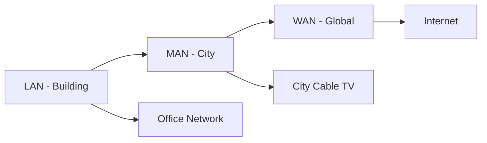
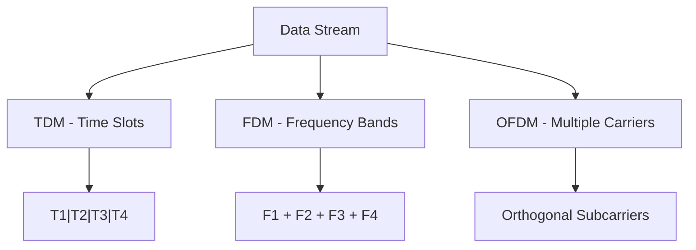
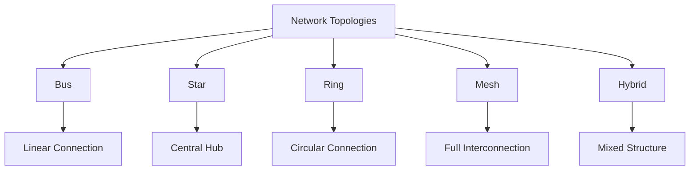
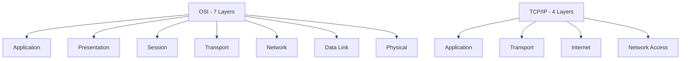
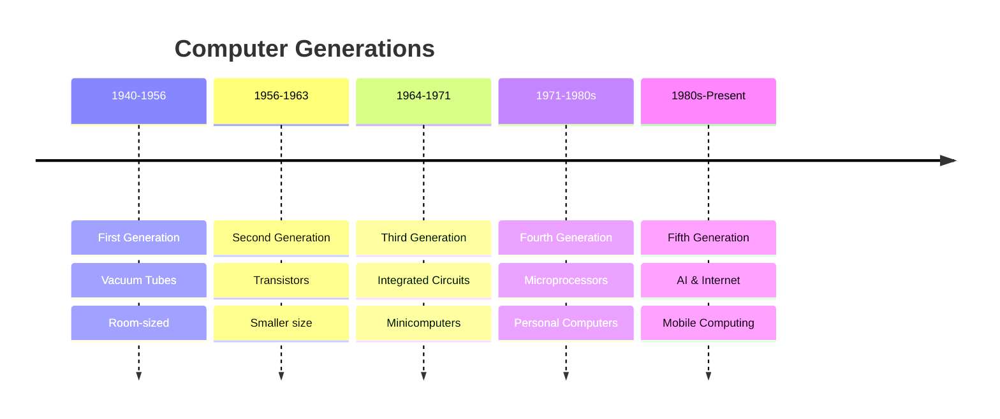
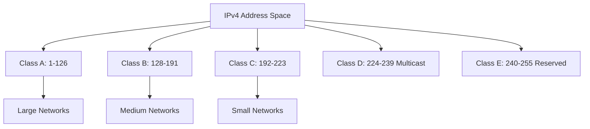

## Question 1(a) [3 marks]

**Discuss the main components of the Computer.**

**Answer**:

**Table: Main Components of Computer**

| Component | Function | Example |
|-----------|----------|---------|
| **Input Unit** | Receives data and instructions | Keyboard, Mouse |
| **CPU** | Processes data and controls operations | Intel i5, AMD Ryzen |
| **Memory** | Stores data temporarily/permanently | RAM, Hard Disk |
| **Output Unit** | Displays processed results | Monitor, Printer |

**Key Components:**

- **Hardware**: Physical parts like CPU, RAM, motherboard
- **Software**: Programs and operating systems
- **Data**: Information processed by computer

**Mnemonic:** "I Can Make Output" (Input-CPU-Memory-Output)

## Question 1(b) [4 marks]

**Explain the web browser and its type.**

**Answer**:

A **web browser** is software that accesses and displays web pages from the internet.

**Table: Types of Web Browsers**

| Browser Type | Features | Examples |
|--------------|----------|----------|
| **Graphical** | GUI interface, multimedia support | Chrome, Firefox |
| **Text-based** | Command line, fast loading | Lynx, Links |
| **Mobile** | Touch interface, optimized for phones | Safari Mobile, Chrome Mobile |

**Features:**

- **Navigation**: Forward, back, refresh buttons
- **Bookmarks**: Save favorite websites
- **Tabs**: Multiple pages in one window
- **Security**: HTTPS support, popup blockers

**Mnemonic:** "Browse Safely Online" (Bookmarks-Security-Online)

## Question 1(c) [7 marks]

**Explain LAN, MAN and WAN with example.**

**Answer**:

**Table: Network Types Comparison**

| Network | Coverage | Speed | Example | Cost |
|---------|----------|--------|---------|------|
| **LAN** | Building/Campus | High (100Mbps-1Gbps) | Office network | Low |
| **MAN** | City/Metropolitan | Medium (10-100Mbps) | Cable TV network | Medium |
| **WAN** | Country/Global | Variable (1-100Mbps) | Internet | High |

**Detailed Explanation:**

**LAN (Local Area Network):**

- **Coverage**: Within building or small area
- **Technology**: Ethernet, Wi-Fi
- **Example**: Computer lab, home network

**MAN (Metropolitan Area Network):**

- **Coverage**: Across city or metropolitan area
- **Technology**: Fiber optic, microwave
- **Example**: City-wide cable internet

**WAN (Wide Area Network):**

- **Coverage**: Multiple cities/countries
- **Technology**: Satellite, fiber optic
- **Example**: Internet, bank ATM networks

**Diagram:**



**Mnemonic:** "Local Metro World" (LAN-MAN-WAN)

## Question 1(c OR) [7 marks]

**Difference between DOS and Unix Operating system.**

**Answer**:

**Table: DOS vs Unix Comparison**

| Feature | DOS | Unix |
|---------|-----|------|
| **Interface** | Command Line (text-based) | Command Line + GUI |
| **Multi-user** | Single user | Multi-user support |
| **Multitasking** | Limited | Full multitasking |
| **Security** | Basic | Advanced security |
| **File System** | FAT16/FAT32 | Various (ext3, ext4) |
| **Cost** | Commercial (Microsoft) | Free/Open source variants |

**Key Differences:**

**DOS (Disk Operating System):**

- **Architecture**: 16-bit, single-user
- **Memory**: Limited to 640KB conventional
- **Commands**: DIR, COPY, DEL
- **File naming**: 8.3 format limitation

**Unix:**

- **Architecture**: 32/64-bit, multi-user
- **Memory**: Advanced memory management
- **Commands**: ls, cp, rm, grep
- **File naming**: Case-sensitive, long names

**Examples:**

- **DOS**: MS-DOS, PC-DOS
- **Unix**: Linux, Solaris, AIX

**Mnemonic:** "DOS Simple, Unix Powerful" (Single vs Multi-user)

## Question 2(a) [3 marks]

**List out features of operating system.**

**Answer**:

**Table: Operating System Features**

| Feature | Description |
|---------|-------------|
| **Process Management** | Controls program execution |
| **Memory Management** | Allocates RAM efficiently |
| **File Management** | Organizes data storage |
| **Device Management** | Controls hardware devices |

**Core Features:**

- **User Interface**: GUI or command line
- **Security**: User authentication, access control
- **Multitasking**: Run multiple programs simultaneously
- **Resource Allocation**: CPU, memory distribution

**Mnemonic:** "Please Manage Files Properly" (Process-Memory-File-Device)

## Question 2(b) [4 marks]

**Define half duplex and full duplex transmission modes.**

**Answer**:

**Table: Transmission Modes Comparison**

| Mode | Direction | Example | Efficiency |
|------|-----------|---------|------------|
| **Half Duplex** | Bidirectional (one at a time) | Walkie-talkie | Medium |
| **Full Duplex** | Bidirectional (simultaneous) | Telephone | High |

**Definitions:**

**Half Duplex:**

- **Communication**: Two-way but not simultaneous
- **Example**: Radio communication, old Ethernet hubs
- **Limitation**: Turn-taking required

**Full Duplex:**

- **Communication**: Two-way simultaneous
- **Example**: Modern Ethernet, telephone calls
- **Advantage**: No waiting time

**Diagram:**

```goat
Half Duplex:
A -----> B  (A sends)
A <----- B  (B sends - A waits)

Full Duplex:
A <----> B  (Both send/receive simultaneously)
```

**Mnemonic:** "Half waits, Full flows" (Half=waiting, Full=simultaneous)

## Question 2(c) [7 marks]

**Difference between open source and proprietary software.**

**Answer**:

**Table: Open Source vs Proprietary Software**

| Aspect | Open Source | Proprietary |
|--------|-------------|-------------|
| **Source Code** | Freely available | Hidden/Protected |
| **Cost** | Usually free | Paid licenses |
| **Modification** | Allowed | Restricted |
| **Support** | Community-based | Vendor support |
| **Security** | Transparent | Security through obscurity |
| **Examples** | Linux, Firefox, Apache | Windows, MS Office |

**Detailed Comparison:**

**Open Source Software:**

- **Definition**: Source code publicly available
- **Licensing**: GPL, MIT, Apache licenses
- **Benefits**: Cost-effective, customizable, transparent
- **Examples**: LibreOffice, GIMP, MySQL

**Proprietary Software:**

- **Definition**: Owned by individual/company
- **Licensing**: End User License Agreement (EULA)
- **Benefits**: Professional support, guaranteed updates
- **Examples**: Adobe Photoshop, Oracle Database

**Advantages & Disadvantages:**

**Open Source Pros:** Free, flexible, community support
**Open Source Cons:** Limited professional support

**Proprietary Pros:** Professional support, warranty
**Proprietary Cons:** Expensive, vendor lock-in

**Mnemonic:** "Open = Free to See, Proprietary = Pay to Use"

## Question 2(a OR) [3 marks]

**Differentiate between RAM and ROM.**

**Answer**:

**Table: RAM vs ROM Comparison**

| Feature | RAM | ROM |
|---------|-----|-----|
| **Full Form** | Random Access Memory | Read Only Memory |
| **Volatility** | Volatile (loses data) | Non-volatile (retains data) |
| **Access** | Read/Write | Read only |
| **Speed** | Very fast | Slower than RAM |

**Key Differences:**

- **Purpose**: RAM for temporary storage, ROM for permanent
- **Cost**: RAM more expensive per GB
- **Usage**: RAM for programs, ROM for firmware

**Mnemonic:** "RAM Runs, ROM Remembers" (temporary vs permanent)

## Question 2(b OR) [4 marks]

**Explain AND logic gate with Example.**

**Answer**:

**AND Gate Definition:** Output is HIGH only when ALL inputs are HIGH.

**Truth Table:**

| Input A | Input B | Output (A AND B) |
|---------|---------|------------------|
| 0 | 0 | 0 |
| 0 | 1 | 0 |
| 1 | 0 | 0 |
| 1 | 1 | 1 |

**Symbol:**

```goat
    A ----\
           >---- Output
    B ----/
```

**Example Applications:**

- **Security System**: Door opens only with key AND card
- **Car Starting**: Engine starts with key AND foot on brake
- **Boolean Expression**: Y = A · B or Y = A ∧ B

**Real-life Example:** Washing machine starts only when door is closed AND power button is pressed.

**Mnemonic:** "ALL inputs True = Output True"

## Question 2(c OR) [7 marks]

**Explain the Ethernet Cable Color code.**

**Answer**:

**Standard: TIA/EIA-568B Color Code**

**Table: Wire Color Sequence**

| Pin | Color | Function |
|-----|--------|----------|
| 1 | White/Orange | Transmit+ |
| 2 | Orange | Transmit- |
| 3 | White/Green | Receive+ |
| 4 | Blue | Not used |
| 5 | White/Blue | Not used |
| 6 | Green | Receive- |
| 7 | White/Brown | Not used |
| 8 | Brown | Not used |

**Cable Types:**

**Straight-Through Cable (568B both ends):**

- **Use**: Computer to switch/hub
- **Color sequence**: Same on both ends

**Cross-Over Cable (568A one end, 568B other):**

- **Use**: Computer to computer direct
- **Pins swapped**: 1↔3, 2↔6

**Wiring Diagram:**

```goat
RJ-45 Connector (568B):
Pin 1: White/Orange
Pin 2: Orange  
Pin 3: White/Green
Pin 4: Blue
Pin 5: White/Blue
Pin 6: Green
Pin 7: White/Brown
Pin 8: Brown
```

**Preparation Steps:**

1. Strip outer jacket (1 inch)
2. Arrange wires in color order
3. Cut wires evenly
4. Insert into RJ-45 connector
5. Crimp with crimping tool

**Mnemonic:** "White Orange, Orange, White Green, Blue, White Blue, Green, White Brown, Brown"

## Question 3(a) [3 marks]

**Compare wired and Wireless Communication.**

**Answer**:

**Table: Wired vs Wireless Communication**

| Aspect | Wired | Wireless |
|--------|-------|----------|
| **Medium** | Cables (copper/fiber) | Radio waves/infrared |
| **Speed** | Higher (up to 100Gbps) | Lower (up to 1Gbps) |
| **Security** | More secure | Less secure |
| **Mobility** | Limited | High mobility |
| **Cost** | Higher installation | Lower installation |
| **Interference** | Minimal | Signal interference |

**Key Points:**

- **Wired**: Reliable, fast, secure but limited mobility
- **Wireless**: Mobile, flexible but security concerns

**Mnemonic:** "Wires are Fast, Wireless is Free" (speed vs mobility)

## Question 3(b) [4 marks]

**Discuss the different types of computer systems.**

**Answer**:

**Table: Computer System Types**

| Type | Size | Processing Power | Example |
|------|------|------------------|---------|
| **Supercomputer** | Room-sized | Extremely high | Weather forecasting |
| **Mainframe** | Large cabinet | Very high | Bank transactions |
| **Minicomputer** | Desk-sized | Medium | Small business |
| **Microcomputer** | Desktop/laptop | Low to medium | Personal use |

**Classifications:**

**By Size & Power:**

- **Supercomputer**: Scientific calculations, research
- **Mainframe**: Large organizations, concurrent users
- **Personal Computer**: Individual users, office work
- **Embedded Systems**: Specific functions (washing machines)

**By Purpose:**

- **General Purpose**: Versatile, multiple applications
- **Special Purpose**: Dedicated tasks (ATM, gaming console)

**Mnemonic:** "Super Main Mini Micro" (decreasing size order)

## Question 3(c) [7 marks]

**Write short note on TDM, FDM, and OFDM.**

**Answer**:

**Multiplexing Techniques for Efficient Communication**

**Table: Multiplexing Comparison**

| Technique | Division Method | Application | Advantage |
|-----------|----------------|-------------|-----------|
| **TDM** | Time slots | Digital telephony | Simple implementation |
| **FDM** | Frequency bands | Radio/TV broadcasting | Simultaneous transmission |
| **OFDM** | Multiple carriers | Wi-Fi, 4G/5G | High data rates |

**Time Division Multiplexing (TDM):**

- **Principle**: Each user gets fixed time slot
- **Implementation**: Sequential data transmission
- **Example**: Digital telephone systems, GSM
- **Advantage**: Efficient use of bandwidth

**Frequency Division Multiplexing (FDM):**

- **Principle**: Each user gets unique frequency band
- **Implementation**: Simultaneous transmission
- **Example**: FM radio, cable TV
- **Advantage**: No timing coordination needed

**Orthogonal Frequency Division Multiplexing (OFDM):**

- **Principle**: Multiple orthogonal subcarriers
- **Implementation**: Parallel data streams
- **Example**: Wi-Fi (802.11), LTE, DSL
- **Advantage**: High spectral efficiency, robust against interference

**Diagram:**



**Applications:**

- **TDM**: ISDN, T1/E1 lines
- **FDM**: Analog TV, radio
- **OFDM**: Modern wireless systems

**Mnemonic:** "Time Frequency Orthogonal" (TDM-FDM-OFDM)

## Question 3(a OR) [3 marks]

**Discuss FSK and PSK.**

**Answer**:

**Digital Modulation Techniques**

**Table: FSK vs PSK**

| Aspect | FSK | PSK |
|--------|-----|-----|
| **Parameter** | Frequency | Phase |
| **Complexity** | Simple | Complex |
| **Noise Immunity** | Good | Excellent |
| **Bandwidth** | Higher | Lower |

**FSK (Frequency Shift Keying):**

- **Principle**: Different frequencies for 0 and 1
- **Implementation**: f1 for '0', f2 for '1'
- **Example**: Computer modems, RFID

**PSK (Phase Shift Keying):**

- **Principle**: Phase changes represent data
- **Implementation**: 0° for '0', 180° for '1'
- **Example**: Wi-Fi, satellite communication

**Mnemonic:** "Frequency Shifts, Phase Shifts" (FSK-PSK)

## Question 3(b OR) [4 marks]

**Differentiate between Multitasking and Multi programming OS.**

**Answer**:

**Table: Multitasking vs Multiprogramming**

| Feature | Multitasking | Multiprogramming |
|---------|--------------|------------------|
| **User Interaction** | Interactive | Batch processing |
| **Response Time** | Fast | Slower |
| **CPU Sharing** | Time slicing | Job switching |
| **Example** | Windows, Linux | Early mainframes |

**Multitasking:**

- **Definition**: Multiple tasks run seemingly simultaneously
- **Method**: Time sharing with quick switching
- **User Experience**: Interactive, responsive
- **Types**: Preemptive, cooperative

**Multiprogramming:**

- **Definition**: Multiple programs in memory
- **Method**: CPU switches when I/O operations occur
- **User Experience**: Batch job processing
- **Purpose**: CPU utilization improvement

**Mnemonic:** "Tasks are Interactive, Programs are Batched"

## Question 3(c OR) [7 marks]

**Write short note on network topologies.**

**Answer**:

**Network Topology Types and Characteristics**

**Table: Topology Comparison**

| Topology | Structure | Advantages | Disadvantages | Cost |
|----------|-----------|------------|---------------|------|
| **Bus** | Linear | Simple, cost-effective | Single point failure | Low |
| **Star** | Central hub | Easy troubleshooting | Hub failure affects all | Medium |
| **Ring** | Circular | Equal access | Break affects network | Medium |
| **Mesh** | Interconnected | High reliability | Complex, expensive | High |
| **Hybrid** | Mixed | Flexible | Complex management | Variable |

**Detailed Descriptions:**

**Bus Topology:**

- **Structure**: Single backbone cable
- **Termination**: Required at both ends
- **Example**: Early Ethernet (10BASE2)
- **Failure Impact**: Cable break stops entire network

**Star Topology:**

- **Structure**: Central switch/hub with spokes
- **Scalability**: Easy to add/remove nodes
- **Example**: Modern Ethernet networks
- **Failure Impact**: Only affected node fails

**Ring Topology:**

- **Structure**: Nodes connected in circle
- **Data Flow**: Unidirectional token passing
- **Example**: Token Ring, FDDI
- **Failure Impact**: Single break stops network

**Mesh Topology:**

- **Structure**: Every node connected to every other
- **Types**: Full mesh, partial mesh
- **Example**: Internet backbone, military networks
- **Reliability**: Multiple paths available

**Hybrid Topology:**

- **Structure**: Combination of topologies
- **Example**: Star-bus, star-ring
- **Flexibility**: Best features of each type

**Diagram:**



**Selection Criteria:**

- **Cost**: Bus < Star < Ring < Mesh
- **Reliability**: Bus < Ring < Star < Mesh
- **Scalability**: Ring < Bus < Star < Mesh

**Mnemonic:** "Bus Star Ring Mesh Hybrid" (increasing complexity)

## Question 4(a) [3 marks]

**Explain Switch.**

**Answer**:

**Network Switch Definition and Functions**

**Table: Switch Characteristics**

| Feature | Description |
|---------|-------------|
| **Function** | Connects devices in LAN |
| **Layer** | Data Link Layer (Layer 2) |
| **Method** | MAC address learning |
| **Collision** | Eliminates collisions |

**Key Features:**

- **MAC Address Table**: Learns and stores device addresses
- **Full Duplex**: Simultaneous send/receive
- **Dedicated Bandwidth**: Each port gets full bandwidth
- **VLAN Support**: Virtual network segregation

**Functions:**

- **Frame Forwarding**: Sends data to specific port
- **Address Learning**: Builds MAC address table
- **Loop Prevention**: Spanning Tree Protocol

**Mnemonic:** "Switch Learns MAC Addresses"

## Question 4(b) [4 marks]

**Define Cyberthreat with an example.**

**Answer**:

**Cyberthreat Definition:** Malicious attempt to damage, disrupt, or gain unauthorized access to computer systems.

**Table: Cyberthreat Types**

| Type | Method | Example | Impact |
|------|--------|---------|--------|
| **Malware** | Malicious software | Virus, Trojan | Data corruption |
| **Phishing** | Fake emails/websites | Fake bank emails | Identity theft |
| **Ransomware** | Encrypt files | WannaCry attack | Financial loss |
| **DDoS** | Traffic overload | Server flooding | Service disruption |

**Example - Phishing Attack:**

- **Method**: Fake email from "bank"
- **Request**: Login credentials
- **Result**: Account compromise
- **Prevention**: Verify sender authenticity

**Common Indicators:**

- **Suspicious emails**: Unknown senders, urgent requests
- **Unusual system behavior**: Slow performance, pop-ups
- **Unauthorized access**: Changed passwords, new files

**Mnemonic:** "Cyber Criminals Create Chaos" (threats cause damage)

## Question 4(c) [7 marks]

**Compare TCP/IP and OSI networking models.**

**Answer**:

**Table: TCP/IP vs OSI Model Comparison**

| OSI Layer | OSI Function | TCP/IP Layer | TCP/IP Function |
|-----------|--------------|--------------|----------------|
| **Application** | User interface | **Application** | User services |
| **Presentation** | Data formatting | **Application** | (Combined) |
| **Session** | Session management | **Application** | (Combined) |
| **Transport** | Reliable delivery | **Transport** | End-to-end delivery |
| **Network** | Routing | **Internet** | IP addressing |
| **Data Link** | Frame handling | **Network Access** | Physical transmission |
| **Physical** | Electrical signals | **Network Access** | (Combined) |

**Key Differences:**

**OSI Model (7 layers):**

- **Purpose**: Theoretical reference model
- **Development**: ISO standard
- **Layers**: Clearly separated functions
- **Usage**: Educational, troubleshooting

**TCP/IP Model (4 layers):**

- **Purpose**: Practical implementation
- **Development**: DARPA/Internet
- **Layers**: Combined functionality
- **Usage**: Internet, real networks

**Advantages:**

**OSI Model:**

- **Standardization**: Universal reference
- **Troubleshooting**: Layer-by-layer analysis
- **Education**: Clear concept separation

**TCP/IP Model:**

- **Simplicity**: Fewer layers
- **Practicality**: Internet-proven
- **Flexibility**: Protocol independence

**Protocols Examples:**

- **OSI**: Conceptual framework
- **TCP/IP**: HTTP, FTP, TCP, UDP, IP

**Diagram:**



**Mnemonic:** "OSI is Perfect Theory, TCP/IP is Practical Reality"

## Question 4(a OR) [3 marks]

**Write main objectives of cyber security.**

**Answer**:

**Table: Cyber Security Objectives (CIA Triad)**

| Objective | Description | Example |
|-----------|-------------|---------|
| **Confidentiality** | Protect data from unauthorized access | Encryption, passwords |
| **Integrity** | Ensure data accuracy and completeness | Digital signatures, checksums |
| **Availability** | Ensure system accessibility | Backup systems, redundancy |

**Additional Objectives:**

- **Authentication**: Verify user identity
- **Authorization**: Control access rights
- **Non-repudiation**: Prevent denial of actions

**Mnemonic:** "CIA protects data" (Confidentiality-Integrity-Availability)

## Question 4(b OR) [4 marks]

**List out different types of networking devices used in the networking.**

**Answer**:

**Table: Networking Devices**

| Device | Layer | Function | Example Use |
|--------|-------|----------|-------------|
| **Hub** | Physical | Signal repeater | Legacy networks |
| **Switch** | Data Link | Frame forwarding | LAN connectivity |
| **Router** | Network | Packet routing | Internet connection |
| **Bridge** | Data Link | Network segmentation | LAN extension |
| **Gateway** | All layers | Protocol conversion | Network interconnection |
| **Repeater** | Physical | Signal amplification | Cable extension |
| **Access Point** | Data Link | Wireless connectivity | Wi-Fi networks |
| **Firewall** | Network+ | Security filtering | Network protection |

**Functions:**

- **Connectivity**: Hub, switch, bridge
- **Routing**: Router, gateway
- **Security**: Firewall, proxy
- **Wireless**: Access point, wireless router

**Mnemonic:** "Hubs Switch Routes Bridges Gateways"

## Question 4(c OR) [7 marks]

**Write different types of security attacks.**

**Answer**:

**Classification of Security Attacks**

**Table: Attack Types and Characteristics**

| Attack Type | Method | Target | Example | Prevention |
|-------------|--------|--------|---------|------------|
| **Passive** | Eavesdropping | Information | Traffic analysis | Encryption |
| **Active** | System modification | Integrity | Data alteration | Authentication |
| **Physical** | Hardware access | Equipment | Device theft | Physical security |
| **Social Engineering** | Human manipulation | Users | Phishing | User education |

**Detailed Attack Categories:**

**1. Network Attacks:**

- **Man-in-the-Middle**: Intercept communication
- **DDoS**: Overwhelm server with traffic
- **Packet Sniffing**: Capture network data
- **IP Spoofing**: Fake source addresses

**2. Application Attacks:**

- **SQL Injection**: Database manipulation
- **Cross-site Scripting (XSS)**: Web vulnerability
- **Buffer Overflow**: Memory corruption
- **Zero-day Exploits**: Unknown vulnerabilities

**3. Malware Attacks:**

- **Virus**: Self-replicating code
- **Worm**: Network-spreading malware
- **Trojan**: Disguised malicious software
- **Ransomware**: Data encryption for payment

**4. Social Engineering:**

- **Phishing**: Fake emails/websites
- **Pretexting**: False scenarios
- **Baiting**: Malicious downloads
- **Tailgating**: Physical access following

**5. Cryptographic Attacks:**

- **Brute Force**: Try all combinations
- **Dictionary Attack**: Common passwords
- **Rainbow Tables**: Pre-computed hashes
- **Side-channel**: Information leakage

**Attack Vectors:**

- **External**: Internet-based attacks
- **Internal**: Insider threats
- **Physical**: Direct hardware access
- **Wireless**: Wi-Fi vulnerabilities

**Prevention Strategies:**

- **Technical**: Firewalls, antivirus, encryption
- **Administrative**: Policies, procedures
- **Physical**: Locks, surveillance
- **Education**: User awareness training

**Mnemonic:** "Network Application Malware Social Crypto" (attack categories)

## Question 5(a) [3 marks]

**Calculate binary of (5AB.4) hexadecimal number.**

**Answer**:

**Hexadecimal to Binary Conversion**

**Method:** Convert each hex digit to 4-bit binary

**Table: Hex to Binary Conversion**

| Hex Digit | Binary | Hex Digit | Binary |
|-----------|--------|-----------|--------|
| 5 | 0101 | B | 1011 |
| A | 1010 | 4 | 0100 |

**Step-by-step Conversion:**

- **5** → **0101**
- **A** → **1010** 
- **B** → **1011**
- **.** → **.** (decimal point)
- **4** → **0100**

**Final Answer:** (5AB.4)₁₆ = (010110101011.0100)₂

**Simplified:** (10110101011.01)₂

**Mnemonic:** "Each Hex = 4 Bits"

## Question 5(b) [4 marks]

**List out the main features of Digi-Locker, e-rupi.**

**Answer**:

**Table: Digital Platform Features**

| Platform | Purpose | Key Features | Benefits |
|----------|---------|--------------|----------|
| **Digi-Locker** | Document storage | Cloud storage, digital certificates | Paperless verification |
| **e-RUPI** | Digital payment | QR/SMS voucher, pre-paid | Targeted welfare delivery |

**Digi-Locker Features:**

- **Digital Wallet**: Store documents in cloud
- **Authentication**: Aadhaar-based verification  
- **Integration**: Government department access
- **Sharing**: Secure document sharing

**e-RUPI Features:**

- **Prepaid Voucher**: Purpose-specific payments
- **Contact-less**: QR code/SMS based
- **Security**: No personal/bank details shared
- **Usage**: Healthcare, education, welfare schemes

**Mnemonic:** "Digi Stores, e-RUPI Pays" (storage vs payment)

## Question 5(c) [7 marks]

**Describe different generations of a computer system.**

**Answer**:

**Computer Generations Evolution**

**Table: Computer Generations Comparison**

| Generation | Period | Technology | Size | Speed | Examples |
|------------|--------|------------|------|-------|----------|
| **First** | 1940-1956 | Vacuum Tubes | Room-sized | Slow | ENIAC, UNIVAC |
| **Second** | 1956-1963 | Transistors | Smaller | Faster | IBM 1401, CDC 1604 |
| **Third** | 1964-1971 | Integrated Circuits | Desk-sized | Much faster | IBM 360, PDP-8 |
| **Fourth** | 1971-1980s | Microprocessors | Personal | Very fast | Intel 4004, Apple II |
| **Fifth** | 1980s-Present | AI/Parallel Processing | Portable | Extremely fast | Modern PCs, smartphones |

**Detailed Description:**

**First Generation (1940-1956):**

- **Technology**: Vacuum tubes for logic/memory
- **Programming**: Machine language, punch cards
- **Characteristics**: Large, expensive, unreliable
- **Heat**: Generated enormous heat
- **Examples**: ENIAC (30 tons), UNIVAC I

**Second Generation (1956-1963):**

- **Technology**: Transistors replaced vacuum tubes
- **Programming**: Assembly language, FORTRAN, COBOL
- **Improvements**: Smaller, faster, more reliable
- **Memory**: Magnetic core memory
- **Examples**: IBM 1401, Honeywell 400

**Third Generation (1964-1971):**

- **Technology**: Integrated Circuits (ICs)
- **Programming**: High-level languages
- **Features**: Operating systems, multiprocessing
- **Size**: Mini-computer emergence
- **Examples**: IBM System/360, PDP-8

**Fourth Generation (1971-1980s):**

- **Technology**: Microprocessors (CPU on chip)
- **Development**: Personal computers born
- **Features**: GUI, networking capabilities
- **Storage**: Floppy disks, hard drives
- **Examples**: Intel 8080, Apple II, IBM PC

**Fifth Generation (1980s-Present):**

- **Technology**: AI, parallel processing, VLSI
- **Features**: Internet, multimedia, mobile computing
- **Characteristics**: User-friendly, portable, powerful
- **Current**: Smartphones, tablets, cloud computing
- **Examples**: Modern laptops, smartphones, supercomputers

**Key Innovations by Generation:**

- **1st**: Electronic computing
- **2nd**: Stored programs
- **3rd**: Operating systems
- **4th**: Personal computing
- **5th**: Internet and AI

**Diagram:**



**Mnemonic:** "Vacuum Transistor IC Micro AI" (technology progression)

## Question 5(a OR) [3 marks]

**Write Difference between Data and Information with example.**

**Answer**:

**Table: Data vs Information**

| Aspect | Data | Information |
|--------|------|-------------|
| **Definition** | Raw facts/figures | Processed data |
| **Meaning** | No context | Has context |
| **Example** | 85, 92, 78 | Average score: 85% |
| **Purpose** | Input for processing | Output for decision-making |

**Examples:**

- **Data**: Student marks (85, 92, 78, 88)
- **Information**: Class average is 85.75%

**Characteristics:**

- **Data**: Unorganized, raw, needs processing
- **Information**: Organized, meaningful, useful for decisions

**Mnemonic:** "Data is Raw, Information is Refined"

## Question 5(b OR) [4 marks]

**Compare analog modulation and digital modulation.**

**Answer**:

**Table: Analog vs Digital Modulation**

| Feature | Analog Modulation | Digital Modulation |
|---------|------------------|-------------------|
| **Signal Type** | Continuous | Discrete (0s and 1s) |
| **Noise Immunity** | Poor | Excellent |
| **Bandwidth** | Lower | Higher |
| **Quality** | Degrades with distance | Maintains quality |
| **Examples** | AM, FM radio | FSK, PSK, QAM |

**Analog Modulation:**

- **Types**: AM (Amplitude), FM (Frequency), PM (Phase)
- **Applications**: Radio broadcasting, analog TV
- **Advantages**: Simple, lower bandwidth
- **Disadvantages**: Noise susceptible, quality loss

**Digital Modulation:**

- **Types**: ASK, FSK, PSK, QAM
- **Applications**: Wi-Fi, cellular, satellite
- **Advantages**: Noise resistant, error correction
- **Disadvantages**: Complex, higher bandwidth

**Mnemonic:** "Analog is Simple, Digital is Smart"

## Question 5(c OR) [7 marks]

**Discuss the range of IP addresses in IPv4**

**Answer**:

**IPv4 Address Range and Classification**

**Table: IPv4 Address Classes**

| Class | Range | Default Subnet | Networks | Hosts per Network | Usage |
|-------|-------|----------------|----------|-------------------|-------|
| **A** | 1.0.0.0 - 126.0.0.0 | /8 (255.0.0.0) | 126 | 16,777,214 | Large organizations |
| **B** | 128.0.0.0 - 191.255.0.0 | /16 (255.255.0.0) | 16,384 | 65,534 | Medium organizations |
| **C** | 192.0.0.0 - 223.255.255.0 | /24 (255.255.255.0) | 2,097,152 | 254 | Small organizations |
| **D** | 224.0.0.0 - 239.255.255.255 | N/A | N/A | N/A | Multicast |
| **E** | 240.0.0.0 - 255.255.255.255 | N/A | N/A | N/A | Reserved/Experimental |

**Special Address Ranges:**

**Private IP Ranges (RFC 1918):**

- **Class A**: 10.0.0.0 - 10.255.255.255 (/8)
- **Class B**: 172.16.0.0 - 172.31.255.255 (/12)  
- **Class C**: 192.168.0.0 - 192.168.255.255 (/16)

**Reserved Addresses:**

- **Loopback**: 127.0.0.0 - 127.255.255.255
- **Link-local**: 169.254.0.0 - 169.254.255.255
- **Broadcast**: x.x.x.255 (last address in subnet)
- **Network**: x.x.x.0 (first address in subnet)

**Address Structure:**

- **Total IPv4 space**: 4,294,967,296 addresses (2³²)
- **Format**: 32-bit address in dotted decimal
- **Example**: 192.168.1.100

**Subnet Calculation Example:**

- **Network**: 192.168.1.0/24
- **Subnet Mask**: 255.255.255.0
- **Host Range**: 192.168.1.1 - 192.168.1.254
- **Broadcast**: 192.168.1.255

**CIDR Notation:**

- **/8**: 255.0.0.0 (Class A default)
- **/16**: 255.255.0.0 (Class B default)
- **/24**: 255.255.255.0 (Class C default)
- **/30**: 255.255.255.252 (Point-to-point links)

**IPv4 Exhaustion:**

- **Problem**: Limited address space
- **Solution**: IPv6 (128-bit addresses)
- **Temporary fixes**: NAT, CIDR, private addressing

**Diagram:**



**Applications:**

- **Public IPs**: Internet routing
- **Private IPs**: Internal networks
- **Multicast**: One-to-many communication
- **Loopback**: Local testing

**Mnemonic:** "A Big Company Delivered Everything" (Classes A-B-C-D-E)
