## પ્રશ્ન 1(અ) [3 ગુણ]

**નીચેની મુદ્દાઓ વ્યાખ્યાયિત કરો:**
**1. ડેટા**
**2. માહિતી** 
**3. જ્ઞાન**

**જવાબ:**

**ડેટા, માહિતી અને જ્ઞાનની વ્યાખ્યાઓ:**

| શબ્દ | વ્યાખ્યા |
|------|---------|
| **ડેટા** | કાચા તથ્યો અને આંકડાઓ જેમાં અર્થ અથવા સંદર્ભ નથી |
| **માહિતી** | પ્રોસેસ કરેલો ડેટા જે અર્થપૂર્ણ અને ઉપયોગી હોય |
| **જ્ઞાન** | અનુભવ અને સમજ સાથે જોડાયેલી માહિતી |

- **ડેટા**: અર્થઘટન વિના મૂળભૂત બિલ્ડિંગ બ્લોક્સ
- **માહિતી**: અર્થપૂર્ણ સંદર્ભ પ્રદાન કરવા માટે પ્રોસેસ કરેલો ડેટા
- **જ્ઞાન**: માનવીય અંતર્દૃષ્ટિ અને વિવેક સાથે વધારેલી માહિતી

**મેમરી ટ્રીક:** "DIK - ડેટા ઈઝ નોલેજના પાયા"

## પ્રશ્ન 1(બ) [4 ગુણ]

**સંક્ષિપ્તમાં પ્રાથમિક મેમરી સમજાવો.**

**જવાબ:**

**પ્રાથમિક મેમરીની લાક્ષણિકતાઓ:**

| પાસાં | વિવરણ |
|-------|-------|
| **વ્યાખ્યા** | મુખ્ય મેમરી જે સીપીયુ સાથે સીધું કમ્યુનિકેશન કરે |
| **એક્સેસ સ્પીડ** | ખૂબ જ ઝડપી એક્સેસ ટાઇમ |
| **વોલેટિલિટી** | વોલેટાઇલ (પાવર બંધ થતાં ડેટા ગુમ થાય) |
| **ઉદાહરણો** | RAM, કેશ મેમરી |

- **RAM (રેન્ડમ એક્સેસ મેમરી)**: વર્તમાન પ્રોગ્રામ્સ માટેની મુખ્ય કાર્યકારી મેમરી
- **કેશ મેમરી**: સીપીયુ અને RAM વચ્ચે અતિ-ઝડપી મેમરી
- **વોલેટાઇલ પ્રકૃતિ**: કમ્પ્યુટર બંધ થતાં ડેટા અદૃશ્ય થઈ જાય
- **સીધું સીપીયુ એક્સેસ**: સીપીયુ સીધું ડેટા વાંચી/લખી શકે

**મેમરી ટ્રીક:** "પ્રાઇમરી ઈઝ ફાસ્ટ બટ ફોરગેટફુલ"

## પ્રશ્ન 1(ક) [7 ગુણ]

**ઉદાહરણ સાથે રિયલ ટાઇમ OSના પ્રકારો સમજાવો.**

**જવાબ:**

**રિયલ-ટાઇમ ઓપરેટિંગ સિસ્ટમના પ્રકારો:**

| પ્રકાર | રિસ્પોન્સ ટાઇમ | ઉદાહરણો | ઉપયોગ |
|-------|---------------|-----------|------|
| **હાર્ડ રિયલ-ટાઇમ** | ગેરંટીડ ડેડલાઇન | QNX, VxWorks | મેડિકલ ડિવાઇસ, એરક્રાફ્ટ |
| **સોફ્ટ રિયલ-ટાઇમ** | શ્રેષ્ઠ પ્રયાસ ટાઇમિંગ | Windows RT, Linux RT | મલ્ટીમીડિયા, ગેમિંગ |
| **ફર્મ રિયલ-ટાઇમ** | ક્યારેક ડેડલાઇન મિસ | Embedded Linux | ઇન્ડસ્ટ્રિયલ કંટ્રોલ |

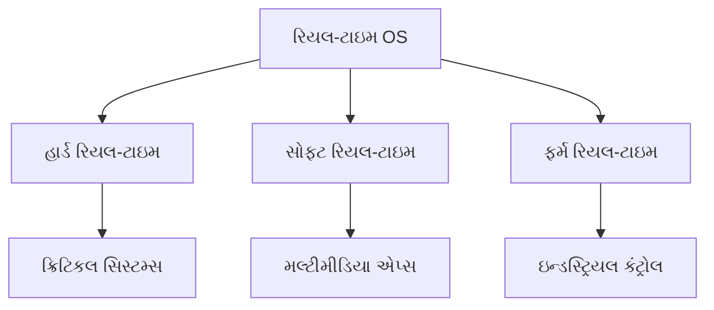

- **હાર્ડ રિયલ-ટાઇમ**: ડેડલાઇન ચૂકવાથી સિસ્ટમ ફેઇલ થાય
- **સોફ્ટ રિયલ-ટાઇમ**: વિલંબિત રિસ્પોન્સ પરફોર્મન્સ ઘટાડે પરંતુ સિસ્ટમ ચાલુ રહે
- **નિર્ધારિત રિસ્પોન્સ**: અનુમાનિત ટાઇમિંગ વર્તણૂક આવશ્યક

**મેમરી ટ્રીક:** "HSF - હાર્ડ, સોફ્ટ, ફર્મ ટાઇમિંગ જરૂરિયાતો"

## પ્રશ્ન 1(ક OR) [7 ગુણ]

**Linux આર્કિટેક્ચરનું વર્ણન કરો અને Linux ની કામગીરીના મોડની ચર્ચા કરો.**

**જવાબ:**

**Linux આર્કિટેક્ચર ડાયાગ્રામ:**

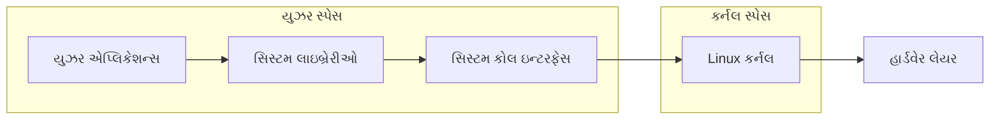

**Linux ઓપરેશન મોડ્સ:**

| મોડ | વિવરણ | એક્સેસ લેવલ | ઉદાહરણો |
|-----|-------|-------------|---------|
| **યુઝર મોડ** | પ્રતિબંધિત એક્સેસ | મર્યાદિત અધિકારો | એપ્લિકેશન્સ, યુઝર પ્રોગ્રામ્સ |
| **કર્નલ મોડ** | સંપૂર્ણ સિસ્ટમ એક્સેસ | સંપૂર્ણ નિયંત્રણ | ડિવાઇસ ડ્રાઇવર્સ, OS ફંક્શન્સ |

- **લેયર્ડ આર્કિટેક્ચર**: યુઝર અને સિસ્ટમ કમ્પોનન્ટ્સ વચ્ચે સ્પષ્ટ અલગીકરણ
- **મોડ સ્વિચિંગ**: સીપીયુ યુઝર અને કર્નલ મોડ્સ વચ્ચે સ્વિચ કરે
- **સિસ્ટમ કોલ્સ**: યુઝર પ્રોગ્રામ્સ માટે કર્નલ સેવાઓ એક્સેસ કરવાનું ઇન્ટરફેસ
- **સિક્યોરિટી**: યુઝર મોડ સીધું હાર્ડવેર એક્સેસ અટકાવે

**મેમરી ટ્રીક:** "LUSK - Linux Uses Safe Kernel protection"

## પ્રશ્ન 2(અ) [3 ગુણ]

**XOR ગેટ તેના સત્ય કોષ્ટક સાથે વર્ણવો.**

**જવાબ:**

**XOR ગેટ સિમ્બોલ:**

```goat
    A ──┐
        │ )──── આઉટપુટ
    B ──┘
```

**સત્ય કોષ્ટક:**

| A | B | આઉટપુટ (A ⊕ B) |
|---|---|----------------|
| 0 | 0 | 0 |
| 0 | 1 | 1 |
| 1 | 0 | 1 |
| 1 | 1 | 0 |

- **એક્સક્લુસિવ OR**: જ્યારે ઇનપુટ્સ અલગ હોય ત્યારે આઉટપુટ 1
- **લોજિક ફંક્શન**: A ⊕ B = A'B + AB'
- **એપ્લિકેશન્સ**: હાફ એડર, પેરિટી ચેકર, એન્ક્રિપ્શન

**મેમરી ટ્રીક:** "XOR - eXclusive OR અલગ ઇનપુટ્સ માટે 1 આપે"

## પ્રશ્ન 2(બ) [4 ગુણ]

**નીચેના ઉકેલો.**
**i) (4C6)₁₆ = (_____)₂ = (_____)₁₀**
**ii) (186)₁₀ = (_____)₈ = (_____)₂**

**જવાબ:**

**રૂપાંતરણ કોષ્ટક:**

| રૂપાંતરણ | પગલું | પરિણામ |
|-----------|------|--------|
| **(4C6)₁₆** | હેક્સ ટુ બાઇનરી | **10011000110₂** |
| | બાઇનરી ટુ ડેસિમલ | **1222₁₀** |
| **(186)₁₀** | ડેસિમલ ટુ ઓક્ટલ | **272₈** |
| | ડેસિમલ ટુ બાઇનરી | **10111010₂** |

**વિગતવાર સોલ્યુશન્સ:**

i) **(4C6)₁₆ = (10011000110)₂ = (1222)₁₀**

- 4 = 0100, C = 1100, 6 = 0110
- સંયુક્ત: 010011000110 = 10011000110₂
- ડેસિમલ: 1×2¹⁰ + 0×2⁹ + 0×2⁸ + 1×2⁷ + 1×2⁶ + 0×2⁵ + 0×2⁴ + 0×2³ + 1×2² + 1×2¹ + 0×2⁰ = 1222₁₀

ii) **(186)₁₀ = (272)₈ = (10111010)₂**

- ઓક્ટલ: 186 ÷ 8 = 23 બાકી 2, 23 ÷ 8 = 2 બાકી 7, 2 ÷ 8 = 0 બાકી 2 → 272₈
- બાઇનરી: 186 = 128 + 32 + 16 + 8 + 2 = 10111010₂

**મેમરી ટ્રીક:** "HDB - હેક્સ, ડેસિમલ, બાઇનરી કન્વર્શન્સ"

## પ્રશ્ન 2(ક) [7 ગુણ]

**નીચેના OS ને સમજાવો**
**i) નેટવર્ક ઓપરેટિંગ સિસ્ટમ**
**ii) મોબાઇલ ઓપરેટિંગ સિસ્ટમ**

**જવાબ:**

**ઓપરેટિંગ સિસ્ટમ સરખામણી કોષ્ટક:**

| લાક્ષણિકતા | નેટવર્ક OS | મોબાઇલ OS |
|-------------|------------|-----------|
| **હેતુ** | નેટવર્ક રિસોર્સ મેનેજ કરવું | મોબાઇલ ડિવાઇસ મેનેજમેન્ટ |
| **ઉદાહરણો** | Windows Server, Linux Server | Android, iOS, Windows Mobile |
| **મુખ્ય ફીચર્સ** | ફાઇલ શેરિંગ, પ્રિન્ટર શેરિંગ | ટચ ઇન્ટરફેસ, બેટરી મેનેજમેન્ટ |
| **યુઝર્સ** | મલ્ટિપલ સાથોસાથ યુઝર્સ | સામાન્ય રીતે સિંગલ યુઝર |

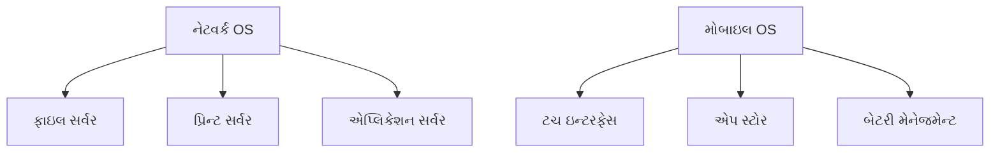

**i) નેટવર્ક ઓપરેટિંગ સિસ્ટમ:**

- **મલ્ટિ-યુઝર સપોર્ટ**: મલ્ટિપલ સાથોસાથ યુઝર્સ હેન્ડલ કરે
- **રિસોર્સ શેરિંગ**: ફાઇલો, પ્રિન્ટર્સ, એપ્લિકેશન્સ નેટવર્કમાં શેર કરાય
- **સિક્યોરિટી મેનેજમેન્ટ**: યુઝર ઓથેન્ટિકેશન અને એક્સેસ કંટ્રોલ

**ii) મોબાઇલ ઓપરેટિંગ સિસ્ટમ:**

- **ટચ-ઓપ્ટિમાઇઝ્ડ**: આંગળી-આધારિત ઇન્ટરેક્શન માટે ડિઝાઇન
- **પાવર મેનેજમેન્ટ**: કાર્યક્ષમ બેટરી ઉપયોગ
- **એપ ઇકોસિસ્ટમ**: કેન્દ્રીકૃત એપ વિતરણ અને મેનેજમેન્ટ

**મેમરી ટ્રીક:** "NOS ફોર નેટવર્ક્સ, MOS ફોર મોબિલિટી"

## પ્રશ્ન 2(અ OR) [3 ગુણ]

**ફક્ત NAND ગેટનો ઉપયોગ કરીને OR ગેટ અને NOT ગેટનું લોજિક સર્કિટ દોરો.**

**જવાબ:**

**NAND ઉપયોગ કરી OR ગેટ:**

```goat
A ──┐  ┌─── NOT A ──┐
    │ )────────────── │
    └─┘              │ )──── A+B
B ──┐  ┌─── NOT B ──┘
    │ )──────────────
    └─┘
```

**NAND ઉપયોગ કરી NOT ગેટ:**

```goat
A ──┐
    │ )──── A'
A ──┘
```

**સત્ય વેરિફિકેશન કોષ્ટક:**

| A | B | A' | B' | (A'·B')' = A+B |
|---|---|----|----|----------------|
| 0 | 0 | 1  | 1  | 0 |
| 0 | 1 | 1  | 0  | 1 |
| 1 | 0 | 0  | 1  | 1 |
| 1 | 1 | 0  | 0  | 1 |

- **NAND યુનિવર્સલ**: કોઈ પણ લોજિક ફંક્શન ઇમ્પ્લિમેન્ટ કરી શકે
- **ડી મોર્ગનનો નિયમ**: (A'·B')' = A+B

**મેમરી ટ્રીક:** "NAND ઈઝ યુનિવર્સલ - બધા ગેટ્સ બનાવી શકે"

## પ્રશ્ન 2(બ OR) [4 ગુણ]

**i) બાઇનરી સંખ્યાને દશાંશ સંખ્યામાં રૂપાંતરિત કરો: (i) 11101 (ii) 10011**
**ii) દશાંશ સંખ્યાને બાઇનરી સંખ્યામાં રૂપાંતરિત કરો: (i) 19 (ii) 64**

**જવાબ:**

**રૂપાંતરણ કોષ્ટક:**

| પ્રકાર | સંખ્યા | પ્રક્રિયા | પરિણામ |
|--------|--------|---------|--------|
| **બાઇનરી ટુ ડેસિમલ** | 11101₂ | 1×2⁴+1×2³+1×2²+0×2¹+1×2⁰ | **29₁₀** |
| | 10011₂ | 1×2⁴+0×2³+0×2²+1×2¹+1×2⁰ | **19₁₀** |
| **ડેસિમલ ટુ બાઇનરી** | 19₁₀ | 2 વડે ભાગાકાર પદ્ધતિ | **10011₂** |
| | 64₁₀ | 2 વડે ભાગાકાર પદ્ધતિ | **1000000₂** |

**વિગતવાર સોલ્યુશન્સ:**

**i) બાઇનરી ટુ ડેસિમલ:**

- 11101₂ = 16 + 8 + 4 + 0 + 1 = 29₁₀
- 10011₂ = 16 + 0 + 0 + 2 + 1 = 19₁₀

**ii) ડેસિમલ ટુ બાઇનરી:**

- 19 ÷ 2 = 9 બાકી 1, 9 ÷ 2 = 4 બાકી 1, 4 ÷ 2 = 2 બાકી 0, 2 ÷ 2 = 1 બાકી 0, 1 ÷ 2 = 0 બાકી 1 → 10011₂
- 64 ÷ 2 = 32 બાકી 0... → 1000000₂

**મેમરી ટ્રીક:** "બાઇનરી ટુ ડેસિમલ માટે 2 ની શક્તિઓ"

## પ્રશ્ન 2(ક OR) [7 ગુણ]

**ઓપન સોર્સ સોફ્ટવેર અને પ્રોપ્રાઇટરી સોફ્ટવેર સમજાવો. બંને પ્રકારના સોફ્ટવેરના ઓછામાં ઓછા પાંચ ઉદાહરણો આપો.**

**જવાબ:**

**સોફ્ટવેર પ્રકાર સરખામણી કોષ્ટક:**

| પાસાં | ઓપન-સોર્સ | પ્રોપ્રાઇટરી |
|-------|-----------|-------------|
| **સોર્સ કોડ** | મુક્તપણે ઉપલબ્ધ | બંધ/છુપાયેલ |
| **કિંમત** | સામાન્ય રીતે મફત | કોમર્શિયલ લાઇસન્સ |
| **મોડિફિકેશન** | મંજૂર | પ્રતિબંધિત |
| **સપોર્ટ** | કમ્યુનિટી-આધારિત | વેન્ડર સપોર્ટ |

**સોફ્ટવેર ઉદાહરણો:**

| ઓપન-સોર્સ | પ્રોપ્રાઇટરી |
|------------|-------------|
| Linux | Microsoft Windows |
| LibreOffice | Microsoft Office |
| Firefox | Internet Explorer |
| GIMP | Adobe Photoshop |
| MySQL | Oracle Database |

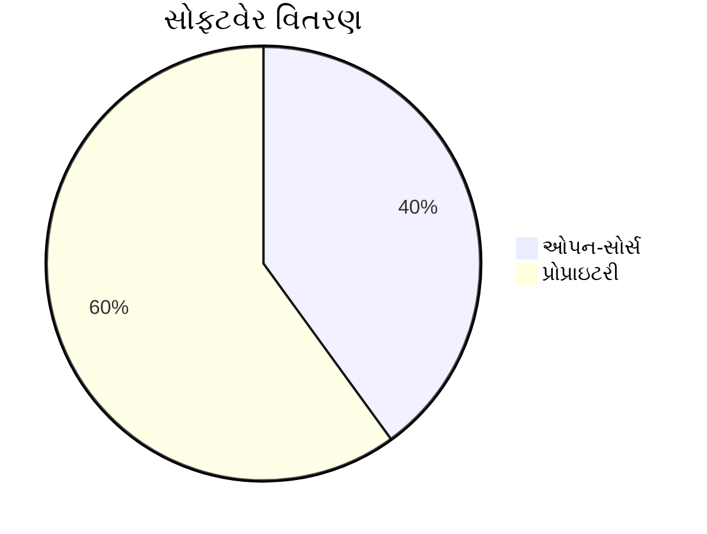

**ઓપન-સોર્સ લાક્ષણિકતાઓ:**

- **મોડિફાઇ કરવાની સ્વતંત્રતા**: યુઝર્સ સોર્સ કોડ બદલી શકે
- **કમ્યુનિટી ડેવલપમેન્ટ**: સહયોગી સુધારણા
- **પારદર્શિતા**: તમામ કોડ દૃશ્યમાન અને ઓડિટ કરી શકાય

**પ્રોપ્રાઇટરી લાક્ષણિકતાઓ:**

- **કોમર્શિયલ મોડેલ**: લાઇસન્સિંગ દ્વારા આવક
- **પ્રોફેશનલ સપોર્ટ**: સમર્પિત કસ્ટમર સેવા
- **ગુણવત્તા ખાતરી**: કઠોર પરીક્ષણ અને માન્યતા

**મેમરી ટ્રીક:** "FOSS ઈઝ ફ્રી, ઓપન, શેર્ડ, કમ્યુનિટી દ્વારા સપોર્ટેડ"

## પ્રશ્ન 3(અ) [3 ગુણ]

**વ્યાખ્યાયિત કરો**
**1. મોડ્યુલેશન**
**2. મલ્ટિપ્લેક્સિંગ**

**જવાબ:**

**વ્યાખ્યા કોષ્ટક:**

| શબ્દ | વ્યાખ્યા | હેતુ |
|------|---------|------|
| **મોડ્યુલેશન** | કેરિયર સિગ્નલના ગુણધર્મો બદલવાની પ્રક્રિયા | લાંબા અંતરનું ટ્રાન્સમિશન સક્ષમ કરવું |
| **મલ્ટિપ્લેક્સિંગ** | ટ્રાન્સમિશન માટે મલ્ટિપલ સિગ્નલો જોડવા | કાર્યક્ષમ ચેનલ ઉપયોગ |

- **મોડ્યુલેશન**: કેરિયર વેવના એમ્પ્લિટ્યુડ, ફ્રીક્વન્સી અથવા ફેઝ બદલે
- **મલ્ટિપ્લેક્સિંગ**: મલ્ટિપલ યુઝર્સને એક જ કમ્યુનિકેશન મીડિયમ શેર કરવાની મંજૂરી આપે
- **સિગ્નલ પ્રોસેસિંગ**: બંને તકનીકો કમ્યુનિકેશન કાર્યક્ષમતા સુધારે

**મેમરી ટ્રીક:** "MM - મોડ્યુલેશન મોડિફાઇ કરે, મલ્ટિપ્લેક્સિંગ મર્જ કરે"

## પ્રશ્ન 3(બ) [4 ગુણ]

**સ્ટાર ટોપોલોજી સમજાવો.**

**જવાબ:**

**સ્ટાર ટોપોલોજી ડાયાગ્રામ:**

```goat
    Computer1
        |
Computer4──Hub──Computer2
        |
    Computer3
```

**સ્ટાર ટોપોલોજી ફીચર્સ કોષ્ટક:**

| ફીચર | વિવરણ |
|-------|-------|
| **કેન્દ્રીય ડિવાઇસ** | હબ/સ્વિચ બધા નોડ્સને જોડે |
| **ફોલ્ટ ટોલરન્સ** | સિંગલ નોડ ફેઇલ્યૂર અન્યને અસર કરતું નથી |
| **પર્ફોર્મન્સ** | દરેક કનેક્શન માટે સમર્પિત બેન્ડવિથ |
| **સ્કેલેબિલિટી** | નોડ્સ ઉમેરવા/હટાવવા સરળ |

- **કેન્દ્રીય હબ**: બધું કમ્યુનિકેશન કેન્દ્રીય ડિવાઇસ દ્વારા પસાર થાય
- **સરળ ટ્રબલશૂટિંગ**: સમસ્યાઓ વ્યક્તિગત કનેક્શન્સમાં અલગ
- **વધુ કિંમત**: બસ ટોપોલોજી કરતાં વધુ કેબલ જરૂરી
- **સિંગલ પોઇન્ટ ઓફ ફેઇલ્યૂર**: હબ ફેઇલ થવાથી આખું નેટવર્ક અસર પામે

**મેમરી ટ્રીક:** "STAR - સિંગલ પોઇન્ટ, ટ્રબલશૂટિંગ ઇઝી, ઓલ થ્રુ હબ, રિલાયબલ"

## પ્રશ્ન 3(ક) [7 ગુણ]

**ટાઇમ ડિવિઝન મલ્ટિપ્લેક્સિંગ (TDM) પર ટૂંકી નોંધ તૈયાર કરો**

**જવાબ:**

**TDM કન્સેપ્ટ ડાયાગ્રામ:**

```mermaid
gantt
    title ટાઇમ ડિવિઝન મલ્ટિપ્લેક્સિંગ
    dateFormat X
    axisFormat %s
    
    section ચેનલ A
    સ્લોટ 1    :0, 1
    સ્લોટ 4    :3, 4
    સ્લોટ 7    :6, 7
    
    section ચેનલ B  
    સ્લોટ 2    :1, 2
    સ્લોટ 5    :4, 5
    સ્લોટ 8    :7, 8
    
    section ચેનલ C
    સ્લોટ 3    :2, 3
    સ્લોટ 6    :5, 6
    સ્લોટ 9    :8, 9
```

**TDM લાક્ષણિકતાઓ કોષ્ટક:**

| ફીચર | વિવરણ |
|-------|-------|
| **સિદ્ધાંત** | વિવિધ યુઝર્સને વિવિધ ટાઇમ સ્લોટ્સ ફાળવાય |
| **સિન્ક્રોનાઇઝેશન** | બધા ડિવાઇસ સિન્ક્રોનાઇઝ હોવા જોઈએ |
| **કાર્યક્ષમતા** | સ્લોટ્સ ભરાયા હોય ત્યારે સંપૂર્ણ બેન્ડવિથ ઉપયોગ |
| **એપ્લિકેશન્સ** | ડિજિટલ ટેલિફોન સિસ્ટમ્સ, T1/E1 લાઇન્સ |

**TDM પ્રકારો:**

- **સિન્ક્રોનસ TDM**: ડેટા ઉપલબ્ધતાને ધ્યાનમાં લીધા વિના નિશ્ચિત ટાઇમ સ્લોટ્સ
- **એસિન્ક્રોનસ TDM**: માંગના આધારે ડાયનેમિક સ્લોટ ફાળવણી
- **સ્ટેટિસ્ટિકલ TDM**: આંકડાકીય આધારે સ્લોટ્સ ફાળવાય

**ફાયદાઓ:**

- **ન્યાયી શેરિંગ**: બધા યુઝર્સ માટે સમાન ટાઇમ ફાળવણી
- **કોઈ સિગ્નલ ઇન્ટરફેરન્સ નહીં**: ટાઇમ-આધારિત અલગીકરણ સંઘર્ષ અટકાવે

**મેમરી ટ્રીક:** "TDM - ટાઇમ ડિવાઇડ્સ મીડિયમ ન્યાયથી"

## પ્રશ્ન 3(અ OR) [3 ગુણ]

**એમ્પ્લિટ્યુડ મોડ્યુલેશન (AM) સમજાવો.**

**જવાબ:**

**AM સિગ્નલ ડાયાગ્રામ:**

```goat
Message Signal:    ~~~~~~~~~~~~~~~~~~~~
                  
Carrier Signal:    ||||||||||||||||||||

AM Output:         |~~||~~~~||~~||||~~~|
```

**AM લાક્ષણિકતાઓ કોષ્ટક:**

| પેરામીટર | વિવરણ |
|-----------|-------|
| **વ્યાખ્યા** | મેસેજ સિગ્નલ સાથે કેરિયરનું એમ્પ્લિટ્યુડ બદલાય |
| **ફ્રીક્વન્સી રેન્જ** | 535-1605 kHz (AM રેડિયો) |
| **બેન્ડવિથ** | મેસેજ સિગ્નલ ફ્રીક્વન્સીથી બમણું |

- **કેરિયર વેવ**: માહિતી વહન કરતું હાઇ ફ્રીક્વન્સી સિગ્નલ
- **મોડ્યુલેશન ઇન્ડેક્સ**: એમ્પ્લિટ્યુડ વેરિએશનની ઊંડાઈ નક્કી કરે
- **એપ્લિકેશન્સ**: AM રેડિયો બ્રોડકાસ્ટિંગ, એરક્રાફ્ટ કમ્યુનિકેશન

**મેમરી ટ્રીક:** "AM - એમ્પ્લિટ્યુડ મેસેજ સાથે મોડિફાઇ થાય"

## પ્રશ્ન 3(બ OR) [4 ગુણ]

**DNS વર્ણવો.**

**જવાબ:**

**DNS હાયરાર્કી:**

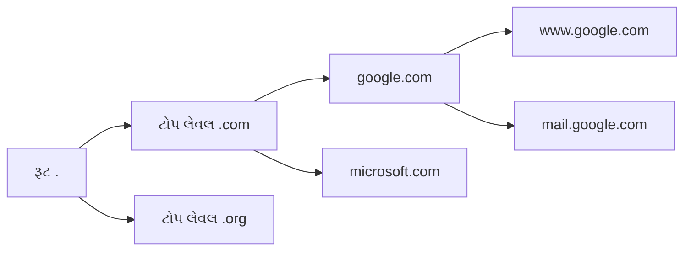

**DNS કમ્પોનન્ટ્સ કોષ્ટક:**

| કમ્પોનન્ટ | ફંક્શન |
|-----------|-------|
| **ડોમેઇન નેમ** | માનવ-વાંચી શકાય તેવું વેબ એડ્રેસ |
| **IP એડ્રેસ** | સર્વરનું સંખ્યાકીય એડ્રેસ |
| **DNS સર્વર** | નામોને IP એડ્રેસમાં ટ્રાન્સલેટ કરે |
| **રેકોર્ડ્સ** | વિવિધ પ્રકારો (A, MX, CNAME) |

- **નેમ રિઝોલ્યુશન**: ડોમેઇન નામોને IP એડ્રેસમાં કન્વર્ટ કરે
- **હાયરાર્કિકલ સ્ટ્રક્ચર**: રૂટ, TLD, સેકન્ડ-લેવલ ડોમેઇન્સ
- **ડિસ્ટ્રિબ્યુટેડ ડેટાબેસ**: કોઈ સિંગલ પોઇન્ટ ઓફ ફેઇલ્યૂર નથી
- **કેશિંગ**: તાજેતરના લુકઅપ્સ સ્ટોર કરીને પર્ફોર્મન્સ સુધારે

**મેમરી ટ્રીક:** "DNS - ડોમેઇન નેમ સિસ્ટમ એડ્રેસ ટ્રાન્સલેટ કરે"

## પ્રશ્ન 3(ક OR) [7 ગુણ]

**નીચેનું વર્ણન કરો.**
**1. સીરિયલ કમ્યુનિકેશન**
**2. સિન્ક્રોનસ ટ્રાન્સમિશન**

**જવાબ:**

**કમ્યુનિકેશન પ્રકારો ડાયાગ્રામ:**

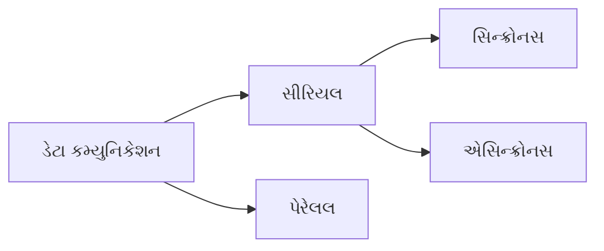

**કમ્યુનિકેશન સરખામણી કોષ્ટક:**

| પ્રકાર | વિવરણ | ટાઇમિંગ | ઉદાહરણો |
|-------|-------|---------|---------|
| **સીરિયલ કમ્યુનિકેશન** | ડેટા બિટ્સ એક પછી એક મોકલાય | ધીમું પરંતુ વિશ્વસનીય | RS-232, USB, ઇથરનેટ |
| **સિન્ક્રોનસ ટ્રાન્સમિશન** | ક્લોક સિગ્નલ સેન્ડર/રિસીવર સિન્ક કરે | ચોક્કસ ટાઇમિંગ | HDLC, SDLC |

**1. સીરિયલ કમ્યુનિકેશન:**

- **સિંગલ વાયર**: ડેટા સિંગલ ચેનલ પર બિટ બાય બિટ ટ્રાન્સમિટ થાય
- **કોસ્ટ ઇફેક્ટિવ**: પેરેલલ કરતાં ઓછા વાયર જરૂરી
- **લાંબો અંતર**: નોઇઝ અને ઇન્ટરફેરન્સને ઓછું સંવેદનશીલ
- **એરર ડિટેક્શન**: ડેટા ઇન્ટેગ્રિટી માટે બિલ્ટ-ઇન મેકેનિઝમ

**2. સિન્ક્રોનસ ટ્રાન્સમિશન:**

- **ક્લોક સિન્ક્રોનાઇઝેશન**: અલગ ક્લોક સિગ્નલ અથવા એમ્બેડેડ ટાઇમિંગ
- **બ્લોક ટ્રાન્સમિશન**: ડેટા સતત બ્લોક્સમાં મોકલાય
- **વધુ કાર્યક્ષમતા**: સ્ટાર્ટ/સ્ટોપ બિટ્સની જરૂર નથી
- **કોમ્પ્લેક્સ હાર્ડવેર**: સિન્ક્રોનાઇઝ્ડ ક્લોક્સ જરૂરી

**મેમરી ટ્રીક:** "સીરિયલ ઈઝ સિક્વેન્શિયલ, સિન્ક્રોનસ ઈઝ સાયમલ્ટેનિયસ"

## પ્રશ્ન 4(અ) [3 ગુણ]

**મેશ અને બસ ટોપોલોજીમાં તફાવત કરો.**

**જવાબ:**

**ટોપોલોજી સરખામણી કોષ્ટક:**

| ફીચર | મેશ ટોપોલોજી | બસ ટોપોલોજી |
|-------|---------------|--------------|
| **કનેક્શન** | દરેક નોડ બીજા દરેક સાથે જોડાયેલ | બધા નોડ્સ સિંગલ કેબલ પર |
| **ફોલ્ટ ટોલરન્સ** | ખૂબ વધારે | ઓછું (સિંગલ પોઇન્ટ ઓફ ફેઇલ્યૂર) |
| **કિંમત** | ખૂબ મોંઘું | આર્થિક |
| **પર્ફોર્મન્સ** | ઉત્તમ | વધુ નોડ્સ સાથે ઘટે |

**મેશ ટોપોલોજી:**

```goat
A ─── B
│ \ / │
│  X  │
│ / \ │
C ─── D
```

**બસ ટોપોલોજી:**

```goat
A ── B ── C ── D ── ટર્મિનેટર
```

- **મેશ ફાયદાઓ**: રિડન્ડન્ટ પાથ, ઉચ્ચ વિશ્વસનીયતા
- **બસ ફાયદાઓ**: સરળ ઇન્સ્ટોલેશન, કોસ્ટ-ઇફેક્ટિવ
- **કેબલ જરૂરિયાતો**: મેશને n(n-1)/2 કનેક્શન્સ જરૂરી, બસને સિંગલ કેબલ

**મેમરી ટ્રીક:** "મેશ ઈઝ મેની કનેક્શન્સ, બસ ઈઝ બેસિક સિંગલ લાઇન"

## પ્રશ્ન 4(બ) [4 ગુણ]

**FDM અને TDM ની સરખામણી કરો.**

**જવાબ:**

**FDM vs TDM સરખામણી કોષ્ટક:**

| પેરામીટર | FDM | TDM |
|-----------|-----|-----|
| **ફુલ ફોર્મ** | ફ્રીક્વન્સી ડિવિઝન મલ્ટિપ્લેક્સિંગ | ટાઇમ ડિવિઝન મલ્ટિપ્લેક્સિંગ |
| **વિભાજન આધાર** | ફ્રીક્વન્સી બેન્ડ્સ | ટાઇમ સ્લોટ્સ |
| **સિગ્નલ પ્રકાર** | એનાલોગ | ડિજિટલ |
| **ક્રોસટોક** | ચેનલો વચ્ચે શક્ય | કોઈ ક્રોસટોક નથી |
| **સિન્ક્રોનાઇઝેશન** | જરૂરી નથી | જરૂરી |
| **કાર્યક્ષમતા** | ગાર્ડ બેન્ડ્સને કારણે ઓછી | વધુ કાર્યક્ષમતા |

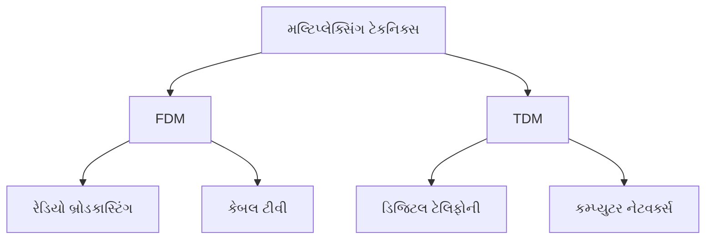

**FDM લાક્ષણિકતાઓ:**

- **ફ્રીક્વન્સી સેપેરેશન**: દરેક સિગ્નલને અલગ ફ્રીક્વન્સી બેન્ડ ફાળવાય
- **સાથોસાથ ટ્રાન્સમિશન**: બધા સિગ્નલો એક જ સમયે ટ્રાન્સમિટ થાય
- **ગાર્ડ બેન્ડ્સ**: ચેનલો વચ્ચે ઇન્ટરફેરન્સ અટકાવે

**TDM લાક્ષણિકતાઓ:**

- **ટાઇમ સેપેરેશન**: દરેક સિગ્નલને અલગ ટાઇમ સ્લોટ ફાળવાય
- **ક્રમિક ટ્રાન્સમિશન**: સિગ્નલો એક પછી એક ટ્રાન્સમિટ થાય
- **ચોક્કસ ટાઇમિંગ**: સિન્ક્રોનાઇઝ્ડ ક્લોક્સ જરૂરી

**મેમરી ટ્રીક:** "FDM ફ્રીક્વન્સી ઉપયોગ કરે, TDM ટાઇમ ઉપયોગ કરે"

## પ્રશ્ન 4(ક) [7 ગુણ]

**OSI રેફરન્સ મોડેલ દોરો અને સમજાવો.**

**જવાબ:**

**OSI મોડેલ ડાયાગ્રામ:**

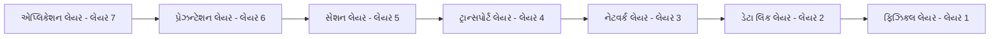

**OSI લેયર ફંક્શન્સ કોષ્ટક:**

| લેયર | નામ | ફંક્શન | ઉદાહરણો |
|------|-----|--------|---------|
| **7** | એપ્લિકેશન | યુઝર ઇન્ટરફેસ | HTTP, FTP, SMTP |
| **6** | પ્રેઝન્ટેશન | ડેટા ફોર્મેટિંગ | એન્ક્રિપ્શન, કમ્પ્રેશન |
| **5** | સેશન | સેશન મેનેજમેન્ટ | NetBIOS, RPC |
| **4** | ટ્રાન્સપોર્ટ | એન્ડ-ટુ-એન્ડ ડિલિવરી | TCP, UDP |
| **3** | નેટવર્ક | રાઉટિંગ | IP, ICMP |
| **2** | ડેટા લિંક | ફ્રેમ ડિલિવરી | ઇથરનેટ, PPP |
| **1** | ફિઝિકલ | બિટ ટ્રાન્સમિશન | કેબલ્સ, હબ્સ |

**મુખ્ય ફીચર્સ:**

- **લેયર્ડ આર્કિટેક્ચર**: દરેક લેયરની ચોક્કસ જવાબદારીઓ
- **પ્રોટોકોલ ઇન્ડિપેન્ડન્સ**: લેયર્સ સ્વતંત્ર રીતે મોડિફાઇ કરી શકાય
- **સ્ટાન્ડર્ડાઇઝેશન**: નેટવર્ક કમ્યુનિકેશન માટે સામાન્ય ફ્રેમવર્ક
- **એન્કેપ્સુલેશન**: દરેક લેયર પોતાનું હેડર ઉમેરે

**મેમરી ટ્રીક:** "All People Seem To Need Data Processing"

## પ્રશ્ન 4(અ OR) [3 ગુણ]

**સંક્ષિપ્તમાં હબનું વર્ણન કરો.**

**જવાબ:**

**હબ ડાયાગ્રામ:**

```goat
    PC1
     |
PC4──HUB──PC2
     |
    PC3
```

**હબ લાક્ષણિકતાઓ કોષ્ટક:**

| ફીચર | વિવરણ |
|-------|-------|
| **ફંક્શન** | ડિવાઇસ માટે કેન્દ્રીય કનેક્શન પોઇન્ટ |
| **પ્રકાર** | ફિઝિકલ લેયર ડિવાઇસ (લેયર 1) |
| **ડેટા હેન્ડલિંગ** | બધા કનેક્ટેડ ડિવાઇસમાં બ્રોડકાસ્ટ |
| **કોલિઝન ડોમેઇન** | બધા પોર્ટ્સ એક જ કોલિઝન ડોમેઇન શેર કરે |

- **શેર્ડ બેન્ડવિથ**: બધા કનેક્ટેડ ડિવાઇસ કુલ બેન્ડવિથ શેર કરે
- **હાફ-ડુપ્લેક્સ**: સાથોસાથ મોકલી અને મેળવી શકતું નથી
- **સિક્યોરિટી ઇશ્યૂઝ**: બધા ડિવાઇસ બધો ટ્રાન્સમિટ થયેલો ડેટા મેળવે
- **અપ્રચલિત ટેકનોલોજી**: આધુનિક નેટવર્ક્સમાં સ્વિચ દ્વારા બદલાયું

**મેમરી ટ્રીક:** "હબ ઈઝ હાફ-ડુપ્લેક્સ, શેર્સ બેન્ડવિથ"

## પ્રશ્ન 4(બ OR) [4 ગુણ]

**STP અને UTP ની સરખામણી કરો.**

**જવાબ:**

**STP vs UTP કેબલ સરખામણી કોષ્ટક:**

| ફીચર | STP (શિલ્ડેડ ટ્વિસ્ટેડ પેર) | UTP (અનશિલ્ડેડ ટ્વિસ્ટેડ પેર) |
|-------|----------------------------|-------------------------------|
| **શિલ્ડિંગ** | મેટલ ફોઇલ/બ્રેઇડ પ્રોટેક્શન | કોઈ શિલ્ડિંગ નથી |
| **કિંમત** | વધુ મોંઘું | ઓછું મોંઘું |
| **ઇન્સ્ટોલેશન** | ગ્રાઉન્ડિંગને કારણે જટિલ | સરળ ઇન્સ્ટોલેશન |
| **EMI રેઝિસ્ટન્સ** | ઉત્તમ પ્રોટેક્શન | મધ્યમ પ્રોટેક્શન |
| **એપ્લિકેશન્સ** | ઇન્ડસ્ટ્રિયલ વાતાવરણ | ઓફિસ વાતાવરણ |

**કેબલ સ્ટ્રક્ચર:**

```goat
UTP:    |wire1 wire2|
        |wire3 wire4|

STP:    |Shield|wire1 wire2|Shield|
        |Shield|wire3 wire4|Shield|
```

**STP ફાયદાઓ:**

- **બેહતર નોઇઝ ઇમ્યુનિટી**: શિલ્ડ ઇલેક્ટ્રોમેગ્નેટિક ઇન્ટરફેરન્સ બ્લોક કરે
- **હાયર ડેટા રેટ્સ**: ઝડપી ટ્રાન્સમિશન સ્પીડ સપોર્ટ કરે
- **સિક્યોર ટ્રાન્સમિશન**: ઇવ્સડ્રોપિંગ માટે ઓછું સંવેદનશીલ

**UTP ફાયદાઓ:**

- **કોસ્ટ ઇફેક્ટિવ**: STP કરતાં સસ્તું
- **ઇઝી ઇન્સ્ટોલેશન**: ગ્રાઉન્ડિંગ જરૂરિયાતો નથી
- **ફ્લેક્સિબિલિટી**: વધુ લવચીક અને હેન્ડલ કરવામાં સરળ

**મેમરી ટ્રીક:** "STP ઈઝ શિલ્ડેડ બટ પ્રાઇસી, UTP ઈઝ અનશિલ્ડેડ બટ પોપ્યુલર"

## પ્રશ્ન 4(ક OR) [7 ગુણ]

**LAN, MAN, WAN મા ભેદ પાડો.**

**જવાબ:**

**નેટવર્ક સાઇઝ સરખામણી:**

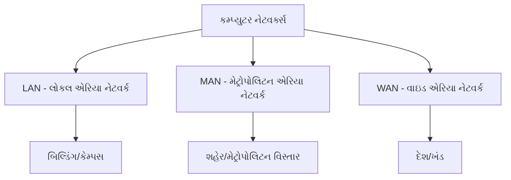

**નેટવર્ક પ્રકાર સરખામણી કોષ્ટક:**

| પેરામીટર | LAN | MAN | WAN |
|-----------|-----|-----|-----|
| **કવરેજ** | બિલ્ડિંગ/કેમ્પસ | શહેર/મેટ્રોપોલિટન વિસ્તાર | દેશ/ખંડ |
| **સ્પીડ** | 10 Mbps - 1 Gbps | 1-100 Mbps | 56 Kbps - 100 Mbps |
| **કિંમત** | ઓછી | મધ્યમ | વધારે |
| **માલિકી** | પ્રાઇવેટ | પ્રાઇવેટ/પબ્લિક | પબ્લિક/લીઝ્ડ |
| **ટેકનોલોજી** | ઇથરનેટ, Wi-Fi | ફાઇબર ઓપ્ટિક, WiMAX | સેટેલાઇટ, લીઝ્ડ લાઇન્સ |
| **એરર રેટ** | ખૂબ ઓછો | ઓછો | વધારે |

**વિગતવાર લાક્ષણિકતાઓ:**

**LAN (લોકલ એરિયા નેટવર્ક):**

- **હાઇ સ્પીડ**: નાના વિસ્તારમાં ઝડપી ડેટા ટ્રાન્સમિશન
- **લો કોસ્ટ**: સેટ અપ અને મેન્ટેઇન કરવા માટે સસ્તું
- **પ્રાઇવેટ ઓનરશિપ**: સામાન્ય રીતે સિંગલ સંસ્થાની માલિકી

**MAN (મેટ્રોપોલિટન એરિયા નેટવર્ક):**

- **સિટી-વાઇડ કવરેજ**: મેટ્રોપોલિટન વિસ્તારમાં ફેલાયેલું
- **મીડિયમ સ્પીડ**: મધ્યમ ટ્રાન્સમિશન સ્પીડ
- **મિક્સ્ડ ઓનરશિપ**: પબ્લિક અથવા પ્રાઇવેટ હોઈ શકે

**WAN (વાઇડ એરિયા નેટવર્ક):**

- **ગ્લોબલ કવરેજ**: દેશો અને ખંડોમાં ફેલાયેલું
- **વેરિયેબલ સ્પીડ**: કનેક્શન પ્રકાર પર આધાર રાખે
- **પબ્લિક ઇન્ફ્રાસ્ટ્રક્ચર**: પબ્લિક ટેલિકમ્યુનિકેશન નેટવર્ક્સ ઉપયોગ કરે

**મેમરી ટ્રીક:** "LAN ઈઝ લોકલ, MAN ઈઝ મેટ્રોપોલિટન, WAN ઈઝ વાઇડ"

## પ્રશ્ન 5(અ) [3 ગુણ]

**ડિનાયલ ઓફ સર્વિસ અટેક સમજાવો.**

**જવાબ:**

**DoS અટેક ડાયાગ્રામ:**

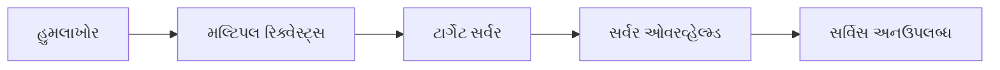

**DoS અટેક પ્રકારો કોષ્ટક:**

| પ્રકાર | વિવરણ |
|-------|-------|
| **વોલ્યુમ-બેસ્ડ** | ટ્રાફિક સાથે બેન્ડવિથ ફ્લડ કરે |
| **પ્રોટોકોલ-બેસ્ડ** | પ્રોટોકોલ નબળાઈઓનો ફાયદો લે |
| **એપ્લિકેશન-બેસ્ડ** | એપ્લિકેશન રિસોર્સને ટાર્ગેટ કરે |

- **ઉદ્દેશ્ય**: કાયદેસર યુઝર્સ માટે સેવાઓ અનઉપલબ્ધ બનાવવી
- **પદ્ધતિઓ**: ટ્રાફિક ફ્લડિંગ, રિસોર્સ એક્ઝોશન, નબળાઈઓનો ફાયદો
- **અસર**: સર્વિસ ડિસરપ્શન, ફાઇનાન્શિયલ લોસ, રેપ્યુટેશન ડેમેજ
- **પ્રિવેન્શન**: ફાયરવોલ્સ, લોડ બેલેન્સર્સ, ઇન્ટ્રુઝન ડિટેક્શન સિસ્ટમ્સ

**મેમરી ટ્રીક:** "DoS ડિનાયઝ અધર્સ સર્વિસ"

## પ્રશ્ન 5(બ) [4 ગુણ]

**i) ડેટા ટ્રાન્સમિશનનું વર્ગીકરણ કરો.**
**ii) બસ ટોપોલોજીમાં ટર્મિનેટરનો ઉપયોગ લખો.**

**જવાબ:**

**i) ડેટા ટ્રાન્સમિશન વર્ગીકરણ:**

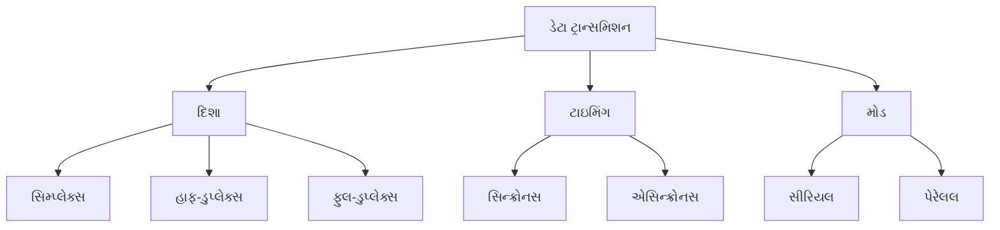

**ii) બસ ટોપોલોજીમાં ટર્મિનેટર:**

**ટર્મિનેટર ફંક્શન્સ કોષ્ટક:**

| ફંક્શન | વિવરણ |
|--------|-------|
| **સિગ્નલ એબ્સોર્પ્શન** | સિગ્નલ રિફ્લેક્શન અટકાવે |
| **ઇમ્પીડન્સ મેચિંગ** | કેબલ ઇમ્પીડન્સ મેચ કરે |
| **નેટવર્ક ઇન્ટેગ્રિટી** | સિગ્નલ ગુણવત્તા જાળવે |

- **રિફ્લેક્શન પ્રિવેન્શન**: સિગ્નલને વાપસ બાઉન્સ થવાથી રોકે
- **સિગ્નલ ક્વોલિટી**: સ્વચ્છ સિગ્નલ ટ્રાન્સમિશન જાળવે
- **બંને છેડે જરૂરી**: બસ ટોપોલોજીને કેબલના બંને છેડે ટર્મિનેટર જોઈએ
- **રેઝિસ્ટન્સ વેલ્યુ**: ઇથરનેટ નેટવર્ક્સ માટે સામાન્ય રીતે 50 ઓહ્મ

**મેમરી ટ્રીક:** "ટર્મિનેટર સ્ટોપ્સ સિગ્નલ ટ્રાવેલ"

## પ્રશ્ન 5(ક) [7 ગુણ]

**CIA ટ્રાઇડ વર્ણવો.**

**જવાબ:**

**CIA ટ્રાઇડ ડાયાગ્રામ:**

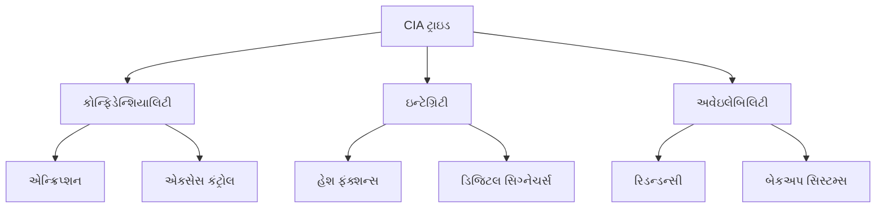

**CIA ટ્રાઇડ કમ્પોનન્ટ્સ કોષ્ટક:**

| કમ્પોનન્ટ | વ્યાખ્યા | ઇમ્પ્લિમેન્ટેશન | જોખમો |
|-----------|---------|-----------------|------|
| **કોન્ફિડેન્શિયાલિટી** | માહિતીની ગુપ્તતા | એન્ક્રિપ્શન, એક્સેસ કંટ્રોલ | અનધિકૃત ડિસક્લોઝર |
| **ઇન્ટેગ્રિટી** | ડેટાની ચોકસાઈ અને સંપૂર્ણતા | હેશ ફંક્શન્સ, ડિજિટલ સિગ્નેચર્સ | ડેટા મોડિફિકેશન |
| **અવેઇલેબિલિટી** | માહિતીની પહોંચ યોગ્યતા | રિડન્ડન્સી, બેકઅપ સિસ્ટમ્સ | સર્વિસ ડિસરપ્શન |

**વિગતવાર સમજૂતી:**

**કોન્ફિડેન્શિયાલિટી:**

- **ડેટા પ્રોટેક્શન**: ફક્ત અધિકૃત યુઝર્સ જ માહિતી એક્સેસ કરી શકે
- **પ્રાઇવસી પગલાં**: એન્ક્રિપ્શન, ઓથેન્ટિકેશન, એક્સેસ કંટ્રોલ્સ
- **ઉદાહરણો**: પાસવર્ડ પ્રોટેક્શન, ફાઇલ પરમિશન્સ

**ઇન્ટેગ્રિટી:**

- **ડેટા એક્યુરસી**: ટ્રાન્સમિશન/સ્ટોરેજ દરમિયાન માહિતી બદલાતી નથી
- **વેરિફિકેશન પદ્ધતિઓ**: ચેકસમ્સ, ડિજિટલ સિગ્નેચર્સ, વર્ઝન કંટ્રોલ
- **ઉદાહરણો**: હેશ ફંક્શન્સ, ડેટાબેસ કન્સ્ટ્રેઇન્ટ્સ

**અવેઇલેબિલિટી:**

- **સિસ્ટમ એક્સેસિબિલિટી**: જરૂર પડે ત્યારે માહિતી અને સેવાઓ ઉપલબ્ધ
- **રિલાયબિલિટી પગલાં**: રિડન્ડન્સી, ફોલ્ટ ટોલરન્સ, ડિઝાસ્ટર રિકવરી
- **ઉદાહરણો**: લોડ બેલેન્સિંગ, બેકઅપ સિસ્ટમ્સ, UPS

**મેમરી ટ્રીક:** "CIA પ્રોટેક્ટ્સ - કોન્ફિડેન્શિયાલિટી, ઇન્ટેગ્રિટી, અવેઇલેબિલિટી"

## પ્રશ્ન 5(અ OR) [3 ગુણ]

**વ્યાખ્યાયિત કરો**
**1. ક્રિપ્ટોગ્રાફી**
**2. ડિક્રિપ્શન**

**જવાબ:**

**વ્યાખ્યા કોષ્ટક:**

| શબ્દ | વ્યાખ્યા | હેતુ |
|------|---------|------|
| **ક્રિપ્ટોગ્રાફી** | એન્કોડિંગ દ્વારા માહિતી સુરક્ષિત કરવાનું વિજ્ઞાન | ડેટા કોન્ફિડેન્શિયાલિટી સુરક્ષિત કરવી |
| **ડિક્રિપ્શન** | એન્ક્રિપ્ટેડ ડેટાને મૂળ સ્વરૂપમાં પાછું કન્વર્ટ કરવાની પ્રક્રિયા | મૂળ માહિતી પુનઃપ્રાપ્ત કરવી |

- **ક્રિપ્ટોગ્રાફી**: વાંચી શકાય તેવા ડેટાને વાંચી ન શકાય તેવા ફોર્મેટમાં ટ્રાન્સફોર્મ કરવા માટે ગાણિતિક અલ્ગોરિધમ્સ ઉપયોગ કરે
- **ડિક્રિપ્શન**: કીઝ ઉપયોગ કરીને મૂળ ડેટા પુનઃસ્થાપિત કરવાની વિપરીત પ્રક્રિયા
- **કી-બેસ્ડ સિક્યોરિટી**: બંને પ્રક્રિયાઓ ક્રિપ્ટોગ્રાફિક કીઝ પર આધાર રાખે

**મેમરી ટ્રીક:** "ક્રિપ્ટો કન્સીલ્સ, ડિક્રિપ્શન ડિસ્ક્લોઝ"

## પ્રશ્ન 5(બ OR) [4 ગુણ]

**i) ટ્વિસ્ટેડ પેર કેબલ્સમાં વાયરો શા માટે ટ્વિસ્ટેડ રાખવામાં આવે છે તેનું કારણ જણાવો.**
**ii) OSI મોડેલના સ્તરને ઓળખો કે જેના પર નીચેના નેટવર્ક ઉપકરણો સપોર્ટ કરે છે 1. રાઉટર 2. બ્રિજ**

**જવાબ:**

**i) ટ્વિસ્ટેડ પેર કેબલ ડિઝાઇન:**

```goat
Normal Wires:     ||||||||||||
                  ||||||||||||
                  (પેરેલલ ઇન્ટરફેરન્સ)

Twisted Wires:    \/\/\/\/\/\/
                  /\/\/\/\/\/\
                  (કેન્સલેશન ઇફેક્ટ)
```

**વાયર ટ્વિસ્ટિંગ ફાયદાઓ કોષ્ટક:**

| ફાયદો | વિવરણ |
|-------|-------|
| **નોઇઝ રિડક્શન** | ઇલેક્ટ્રોમેગ્નેટિક ઇન્ટરફેરન્સ કેન્સલ કરે |
| **ક્રોસટોક પ્રિવેન્શન** | પેર્સ વચ્ચે સિગ્નલ ઇન્ટરફેરન્સ ઘટાડે |
| **સિગ્નલ ક્વોલિટી** | બેહતર સિગ્નલ ઇન્ટેગ્રિટી જાળવે |

**ii) OSI લેયર આઇડેન્ટિફિકેશન:**

**નેટવર્ક ડિવાઇસ અને OSI લેયર્સ કોષ્ટક:**

| ડિવાઇસ | OSI લેયર | ફંક્શન |
|--------|-----------|--------|
| **રાઉટર** | લેયર 3 (નેટવર્ક) | વિવિધ નેટવર્ક્સ વચ્ચે રાઉટિંગ |
| **બ્રિજ** | લેયર 2 (ડેટા લિંક) | નેટવર્ક સેગમેન્ટ્સ કનેક્ટ કરવા |

- **વાયર ટ્વિસ્ટિંગ**: દરેક ટ્વિસ્ટ બાજુના વાયરમાંથી ઇલેક્ટ્રોમેગ્નેટિક ઇન્ટરફેરન્સ કેન્સલ કરે
- **ઇન્ટરફેરન્સ કેન્સલેશન**: નોઇઝ બંને વાયરને સમાન રીતે પરંતુ વિપરીત દિશામાં અસર કરે
- **રાઉટર ફંક્શન**: IP એડ્રેસના આધારે રાઉટિંગ નિર્ણયો લે
- **બ્રિજ ફંક્શન**: MAC એડ્રેસના આધારે ફ્રેમ્સ ફોરવર્ડ કરે

**મેમરી ટ્રીક:** "ટ્વિસ્ટેડ વાયર્સ રિડ્યુસ ઇન્ટરફેરન્સ, રાઉટર એટ લેયર 3, બ્રિજ એટ લેયર 2"

## પ્રશ્ન 5(ક OR) [7 ગુણ]

**સાયબર એટેકને વ્યાખ્યાયિત કરો અને વિવિધ સાયબર હુમલાઓને સંક્ષિપ્તમાં સમજાવો**

**જવાબ:**

**સાયબર એટેક વ્યાખ્યા:**
સાયબર એટેક એ કમ્પ્યુટર સિસ્ટમ્સ, નેટવર્ક્સ અથવા ડિજિટલ ડિવાઇસને કમ્પ્રોમાઇઝ કરવાનો ઇરાદાપૂર્વકનો પ્રયાસ છે જેથી ડેટા ચોરી, બદલાવ અથવા નાશ કરી શકાય.

**સાયબર હુમલાઓના પ્રકારો:**

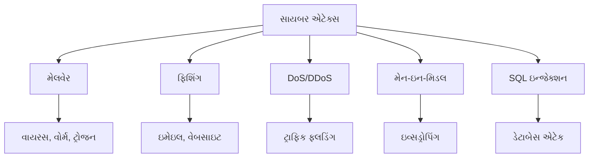

**સાયબર એટેક પ્રકારો કોષ્ટક:**

| હુમલાનો પ્રકાર | વિવરણ | અસર | પ્રિવેન્શન |
|-------------|-------|-----|-----------|
| **મેલવેર** | દુર્ભાવનાપૂર્ણ સોફ્ટવેર (વાયરસ, વોર્મ, ટ્રોજન) | સિસ્ટમ કરપ્શન, ડેટા ચોરી | એન્ટીવાયરસ, અપડેટ્સ |
| **ફિશિંગ** | ક્રેડેન્શિયલ્સ ચોરવા માટે ફ્રોડ ઇમેઇલ્સ/વેબસાઇટ્સ | આઇડેન્ટિટી થેફ્ટ, ફાઇનાન્શિયલ લોસ | યુઝર જાગૃતિ, ઇમેઇલ ફિલ્ટર્સ |
| **DoS/DDoS** | ટાર્ગેટને ટ્રાફિક સાથે ઓવરવ્હેલ્મ કરવું | સર્વિસ અનઉપલબ્ધતા | ફાયરવોલ્સ, લોડ બેલેન્સર્સ |
| **મેન-ઇન-મિડલ** | પક્ષો વચ્ચે કમ્યુનિકેશન ઇન્ટરસેપ્ટ કરવું | ડેટા ઇવ્સડ્રોપિંગ | એન્ક્રિપ્શન, સિક્યોર પ્રોટોકોલ્સ |
| **SQL ઇન્જેક્શન** | ડેટાબેસ ક્વેરીમાં દુર્ભાવનાપૂર્ણ કોડ દાખલ કરવો | ડેટાબેસ કમ્પ્રોમાઇઝ | ઇનપુટ વેલિડેશન, પેરામીટરાઇઝ્ડ ક્વેરીઝ |

**વિગતવાર હુમલાઓની સમજૂતી:**

**મેલવેર એટેક્સ:**

- **વાયરસ**: ફાઇલોમાં જોડાતો સ્વ-પ્રતિકૃતિ કોડ
- **વોર્મ**: નેટવર્ક્સમાં ફેલાતો સ્ટેન્ડઅલોન મેલવેર
- **ટ્રોજન**: કાયદેસર દેખાતો છુપાયેલો મેલવેર

**સોશિયલ એન્જિનીયરિંગ:**

- **ફિશિંગ**: સંવેદનશીલ માહિતી માંગતી નકલી ઇમેઇલ્સ
- **સ્પીયર ફિશિંગ**: ચોક્કસ વ્યક્તિઓ પર ટાર્ગેટેડ હુમલાઓ
- **બેઇટિંગ**: મેલવેર પહોંચાડવા માટે આકર્ષક ઓફર્સનો ઉપયોગ

**નેટવર્ક એટેક્સ:**

- **પેકેટ સ્નિફિંગ**: વિશ્લેષણ માટે નેટવર્ક ટ્રાફિક કેપ્ચર કરવું
- **સેશન હાઇજેકિંગ**: યુઝર સેશન્સ કબજે કરવા
- **પાસવર્ડ એટેક્સ**: બ્રુટ ફોર્સ, ડિક્શનરી એટેક્સ

**મેમરી ટ્રીક:** "MPDMS - મેલવેર, ફિશિંગ, DoS, મેન-ઇન-મિડલ, SQL ઇન્જેક્શન"
