## Question 1(a) [3 marks]

**Define Following Term:**
**1. Data**
**2. Information**
**3. Knowledge**

**Answer:**

**Table: Data, Information, and Knowledge Definitions**

| Term | Definition |
|------|------------|
| **Data** | Raw facts and figures without meaning or context |
| **Information** | Processed data that has meaning and is useful |
| **Knowledge** | Information combined with experience and understanding |

- **Data**: Basic building blocks without interpretation
- **Information**: Data processed to provide meaningful context
- **Knowledge**: Information enhanced with human insight and wisdom

**Mnemonic:** "DIK - Data Is Knowledge's foundation"

## Question 1(b) [4 marks]

**Explain Primary Memory in brief.**

**Answer:**

**Table: Primary Memory Characteristics**

| Aspect | Description |
|--------|-------------|
| **Definition** | Main memory that directly communicates with CPU |
| **Access Speed** | Very fast access time |
| **Volatility** | Volatile (loses data when power off) |
| **Examples** | RAM, Cache memory |

- **RAM (Random Access Memory)**: Main working memory for current programs
- **Cache Memory**: Ultra-fast memory between CPU and RAM
- **Volatile Nature**: Data disappears when computer shuts down
- **Direct CPU Access**: CPU can directly read/write data

**Mnemonic:** "Primary is Fast but Forgetful"

## Question 1(c) [7 marks]

**Explain types of real time OS with example.**

**Answer:**

**Table: Real-Time Operating System Types**

| Type | Response Time | Examples | Use Cases |
|------|---------------|----------|-----------|
| **Hard Real-Time** | Guaranteed deadline | QNX, VxWorks | Medical devices, Aircraft |
| **Soft Real-Time** | Best effort timing | Windows RT, Linux RT | Multimedia, Gaming |
| **Firm Real-Time** | Occasional deadline miss | Embedded Linux | Industrial control |

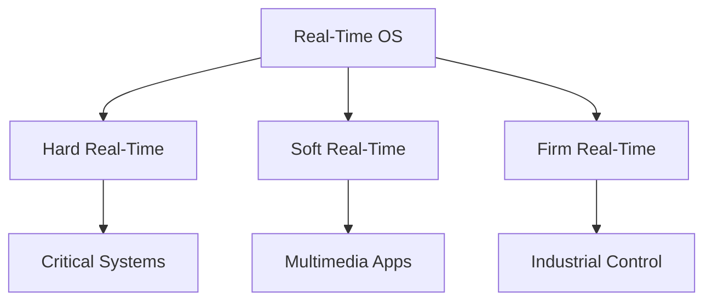

- **Hard Real-Time**: Missing deadline causes system failure
- **Soft Real-Time**: Delayed response reduces performance but system continues
- **Deterministic Response**: Predictable timing behavior is essential

**Mnemonic:** "HSF - Hard, Soft, Firm timing requirements"

## Question 1(c OR) [7 marks]

**Describe Linux architecture and discuss the mode of the operation of Linux**

**Answer:**

**Linux Architecture Diagram:**

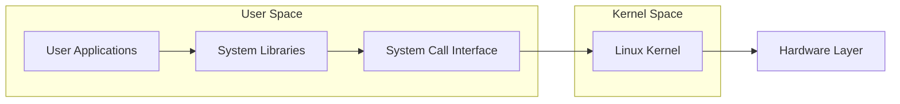

**Table: Linux Operation Modes**

| Mode | Description | Access Level | Examples |
|------|-------------|--------------|----------|
| **User Mode** | Restricted access | Limited privileges | Applications, user programs |
| **Kernel Mode** | Full system access | Complete control | Device drivers, OS functions |

- **Layered Architecture**: Clear separation between user and system components
- **Mode Switching**: CPU switches between user and kernel modes
- **System Calls**: Interface for user programs to access kernel services
- **Security**: User mode prevents direct hardware access

**Mnemonic:** "LUSK - Linux Uses Safe Kernel protection"

## Question 2(a) [3 marks]

**Describe XOR gate with its truth table.**

**Answer:**

**XOR Gate Symbol:**

```goat
    A ──┐
        │ )──── Output
    B ──┘
```

**Truth Table:**

| A | B | Output (A ⊕ B) |
|---|---|----------------|
| 0 | 0 | 0 |
| 0 | 1 | 1 |
| 1 | 0 | 1 |
| 1 | 1 | 0 |

- **Exclusive OR**: Output is 1 when inputs are different
- **Logic Function**: A ⊕ B = A'B + AB'
- **Applications**: Half adder, parity checker, encryption

**Mnemonic:** "XOR - eXclusive OR gives 1 for different inputs"

## Question 2(b) [4 marks]

**Solve following.**
**i) (4C6)₁₆ = (_____)₂ = (_____)₁₀**
**ii) (186)₁₀ = (_____)₈ = (_____)₂**

**Answer:**

**Solution Table:**

| Conversion | Step | Result |
|------------|------|--------|
| **(4C6)₁₆** | Hex to Binary | **10011000110₂** |
| | Binary to Decimal | **1222₁₀** |
| **(186)₁₀** | Decimal to Octal | **272₈** |
| | Decimal to Binary | **10111010₂** |

**Detailed Solutions:**

i) **(4C6)₁₆ = (10011000110)₂ = (1222)₁₀**

- 4 = 0100, C = 1100, 6 = 0110
- Combined: 010011000110 = 10011000110₂
- Decimal: 1×2¹⁰ + 0×2⁹ + 0×2⁸ + 1×2⁷ + 1×2⁶ + 0×2⁵ + 0×2⁴ + 0×2³ + 1×2² + 1×2¹ + 0×2⁰ = 1222₁₀

ii) **(186)₁₀ = (272)₈ = (10111010)₂**

- Octal: 186 ÷ 8 = 23 remainder 2, 23 ÷ 8 = 2 remainder 7, 2 ÷ 8 = 0 remainder 2 → 272₈
- Binary: 186 = 128 + 32 + 16 + 8 + 2 = 10111010₂

**Mnemonic:** "HDB - Hex, Decimal, Binary conversions"

## Question 2(c) [7 marks]

**Illustrate following OS**
**i) Network Operating System**
**ii) Mobile Operating System**

**Answer:**

**Table: Operating System Comparison**

| Feature | Network OS | Mobile OS |
|---------|------------|-----------|
| **Purpose** | Manage network resources | Mobile device management |
| **Examples** | Windows Server, Linux Server | Android, iOS, Windows Mobile |
| **Key Features** | File sharing, printer sharing | Touch interface, battery management |
| **Users** | Multiple simultaneous users | Single user typically |

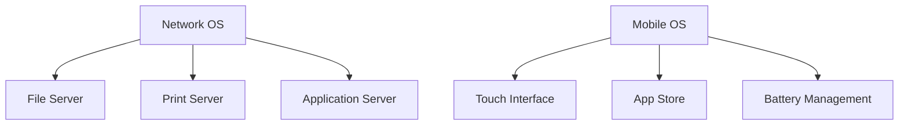

**i) Network Operating System:**

- **Multi-user Support**: Handles multiple concurrent users
- **Resource Sharing**: Files, printers, applications shared across network
- **Security Management**: User authentication and access control

**ii) Mobile Operating System:**

- **Touch-Optimized**: Designed for finger-based interaction
- **Power Management**: Efficient battery usage
- **App Ecosystem**: Centralized app distribution and management

**Mnemonic:** "NOS for Networks, MOS for Mobility"

## Question 2(a OR) [3 marks]

**Draw Logic circuit of OR gate and NOT gate using only NAND gate.**

**Answer:**

**OR Gate using NAND:**

```goat
A ──┐  ┌─── NOT A ──┐
    │ )────────────── │
    └─┘              │ )──── A+B
B ──┐  ┌─── NOT B ──┘
    │ )──────────────
    └─┘
```

**NOT Gate using NAND:**

```goat
A ──┐
    │ )──── A'
A ──┘
```

**Truth Verification Table:**

| A | B | A' | B' | (A'·B')' = A+B |
|---|---|----|----|----------------|
| 0 | 0 | 1  | 1  | 0 |
| 0 | 1 | 1  | 0  | 1 |
| 1 | 0 | 0  | 1  | 1 |
| 1 | 1 | 0  | 0  | 1 |

- **NAND Universal**: Can implement any logic function
- **De Morgan's Law**: (A'·B')' = A+B

**Mnemonic:** "NAND is Universal - can make all gates"

## Question 2(b OR) [4 marks]

**i) Convert Binary number into Decimal number: (i) 11101 (ii) 10011**
**ii) Convert decimal number into binary number: (i) 19 (ii) 64**

**Answer:**

**Conversion Table:**

| Type | Number | Process | Result |
|------|--------|---------|--------|
| **Binary to Decimal** | 11101₂ | 1×2⁴+1×2³+1×2²+0×2¹+1×2⁰ | **29₁₀** |
| | 10011₂ | 1×2⁴+0×2³+0×2²+1×2¹+1×2⁰ | **19₁₀** |
| **Decimal to Binary** | 19₁₀ | Division by 2 method | **10011₂** |
| | 64₁₀ | Division by 2 method | **1000000₂** |

**Detailed Solutions:**

**i) Binary to Decimal:**

- 11101₂ = 16 + 8 + 4 + 0 + 1 = 29₁₀
- 10011₂ = 16 + 0 + 0 + 2 + 1 = 19₁₀

**ii) Decimal to Binary:**

- 19 ÷ 2 = 9 remainder 1, 9 ÷ 2 = 4 remainder 1, 4 ÷ 2 = 2 remainder 0, 2 ÷ 2 = 1 remainder 0, 1 ÷ 2 = 0 remainder 1 → 10011₂
- 64 ÷ 2 = 32 remainder 0... → 1000000₂

**Mnemonic:** "Powers of 2 for Binary to Decimal"

## Question 2(c OR) [7 marks]

**Explain Open-source software and Proprietary software. Give at least five examples of both the types of software.**

**Answer:**

**Table: Software Type Comparison**

| Aspect | Open-Source | Proprietary |
|--------|-------------|-------------|
| **Source Code** | Freely available | Closed/Hidden |
| **Cost** | Usually free | Commercial license |
| **Modification** | Allowed | Restricted |
| **Support** | Community-based | Vendor support |

**Software Examples:**

| Open-Source | Proprietary |
|-------------|-------------|
| Linux | Microsoft Windows |
| LibreOffice | Microsoft Office |
| Firefox | Internet Explorer |
| GIMP | Adobe Photoshop |
| MySQL | Oracle Database |

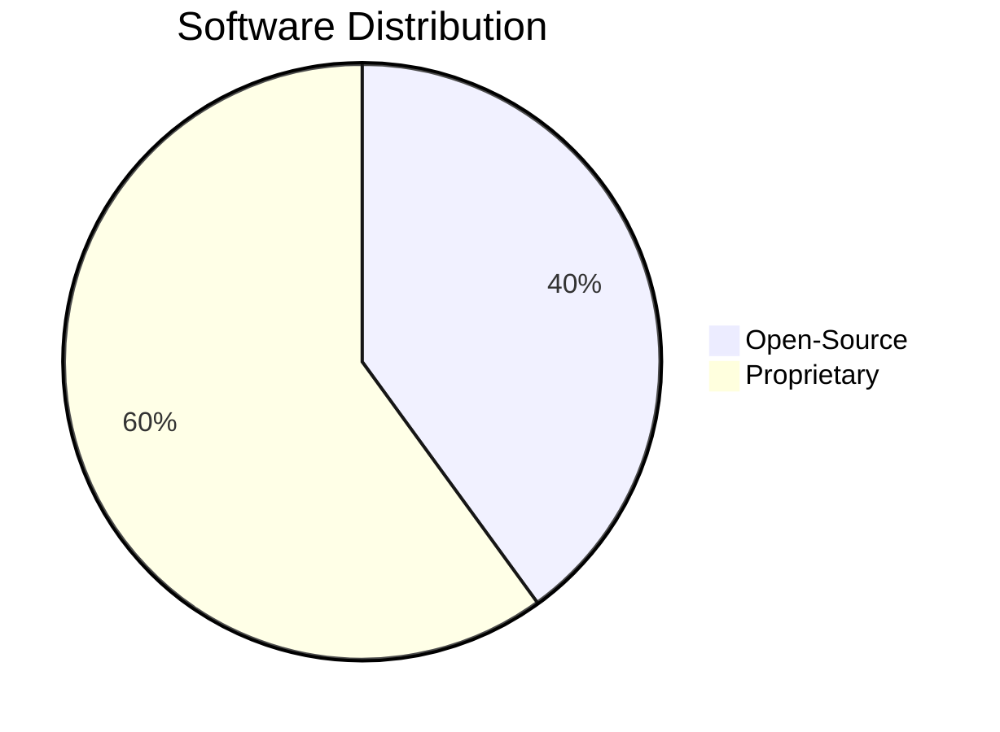

**Open-Source Characteristics:**

- **Freedom to Modify**: Users can change source code
- **Community Development**: Collaborative improvement
- **Transparency**: All code is visible and auditable

**Proprietary Characteristics:**

- **Commercial Model**: Revenue through licensing
- **Professional Support**: Dedicated customer service
- **Quality Assurance**: Rigorous testing and validation

**Mnemonic:** "FOSS is Free, Open, Shared, Supported by community"

## Question 3(a) [3 marks]

**Define**
**1. Modulation**
**2. Multiplexing**

**Answer:**

**Definition Table:**

| Term | Definition | Purpose |
|------|------------|---------|
| **Modulation** | Process of varying carrier signal properties | Enable long-distance transmission |
| **Multiplexing** | Combining multiple signals for transmission | Efficient channel utilization |

- **Modulation**: Changes amplitude, frequency, or phase of carrier wave
- **Multiplexing**: Allows multiple users to share same communication medium
- **Signal Processing**: Both techniques improve communication efficiency

**Mnemonic:** "MM - Modulation Modifies, Multiplexing Merges"

## Question 3(b) [4 marks]

**Explain star topology.**

**Answer:**

**Star Topology Diagram:**

```goat
    Computer1
        |
Computer4──Hub──Computer2
        |
    Computer3
```

**Table: Star Topology Features**

| Feature | Description |
|---------|-------------|
| **Central Device** | Hub/Switch connects all nodes |
| **Fault Tolerance** | Single node failure doesn't affect others |
| **Performance** | Dedicated bandwidth per connection |
| **Scalability** | Easy to add/remove nodes |

- **Central Hub**: All communication passes through central device
- **Easy Troubleshooting**: Problems isolated to individual connections
- **Higher Cost**: Requires more cable than bus topology
- **Single Point of Failure**: Hub failure affects entire network

**Mnemonic:** "STAR - Single point, Troubleshooting easy, All through hub, Reliable"

## Question 3(c) [7 marks]

**Prepare a short note on Time Division Multiplexing (TDM)**

**Answer:**

**TDM Concept Diagram:**

```mermaid
gantt
    title Time Division Multiplexing
    dateFormat X
    axisFormat %s
    
    section Channel A
    Slot 1    :0, 1
    Slot 4    :3, 4
    Slot 7    :6, 7
    
    section Channel B  
    Slot 2    :1, 2
    Slot 5    :4, 5
    Slot 8    :7, 8
    
    section Channel C
    Slot 3    :2, 3
    Slot 6    :5, 6
    Slot 9    :8, 9
```

**Table: TDM Characteristics**

| Feature | Description |
|---------|-------------|
| **Principle** | Different users allocated different time slots |
| **Synchronization** | All devices must be synchronized |
| **Efficiency** | Full bandwidth utilization when slots filled |
| **Applications** | Digital telephone systems, T1/E1 lines |

**TDM Types:**

- **Synchronous TDM**: Fixed time slots regardless of data availability
- **Asynchronous TDM**: Dynamic slot allocation based on demand
- **Statistical TDM**: Slots allocated on statistical basis

**Advantages:**

- **Fair Sharing**: Equal time allocation for all users
- **No Signal Interference**: Time-based separation prevents conflicts

**Mnemonic:** "TDM - Time Divides Medium fairly"

## Question 3(a OR) [3 marks]

**Explain Amplitude Modulation (AM).**

**Answer:**

**AM Signal Diagram:**

```goat
Message Signal:    ~~~~~~~~~~~~~~~~~~~~
                  
Carrier Signal:    ||||||||||||||||||||

AM Output:         |~~||~~~~||~~||||~~~|
```

**Table: AM Characteristics**

| Parameter | Description |
|-----------|-------------|
| **Definition** | Amplitude of carrier varies with message signal |
| **Frequency Range** | 535-1605 kHz (AM radio) |
| **Bandwidth** | Twice the message signal frequency |

- **Carrier Wave**: High frequency signal that carries information
- **Modulation Index**: Determines depth of amplitude variation
- **Applications**: AM radio broadcasting, aircraft communication

**Mnemonic:** "AM - Amplitude Modifies with message"

## Question 3(b OR) [4 marks]

**Describe DNS.**

**Answer:**

**DNS Hierarchy:**

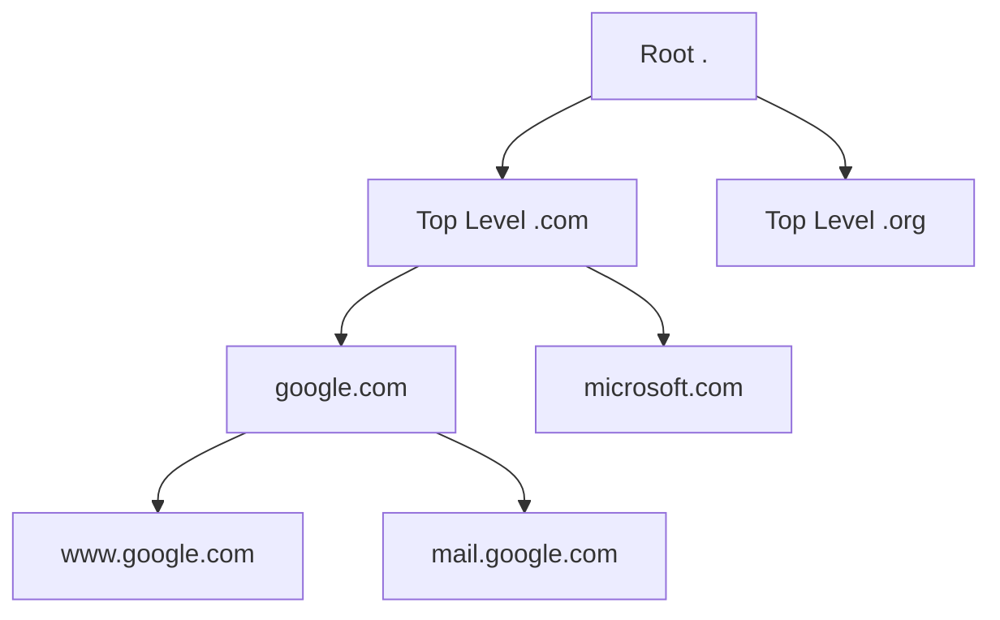

**Table: DNS Components**

| Component | Function |
|-----------|----------|
| **Domain Name** | Human-readable web address |
| **IP Address** | Numerical address of server |
| **DNS Server** | Translates names to IP addresses |
| **Records** | Different types (A, MX, CNAME) |

- **Name Resolution**: Converts domain names to IP addresses
- **Hierarchical Structure**: Root, TLD, second-level domains
- **Distributed Database**: No single point of failure
- **Caching**: Improves performance by storing recent lookups

**Mnemonic:** "DNS - Domain Name System translates addresses"

## Question 3(c OR) [7 marks]

**Describe following**
**1. Serial Communication**
**2. Synchronous Transmission**

**Answer:**

**Communication Types Diagram:**

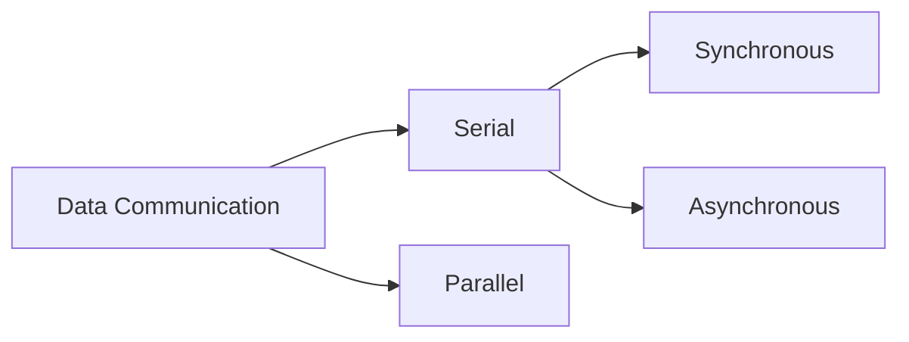

**Table: Communication Comparison**

| Type | Description | Timing | Examples |
|------|-------------|--------|----------|
| **Serial Communication** | Data bits sent one after another | Slower but reliable | RS-232, USB, Ethernet |
| **Synchronous Transmission** | Clock signal synchronizes sender/receiver | Precise timing | HDLC, SDLC |

**1. Serial Communication:**

- **Single Wire**: Data transmitted bit by bit over single channel
- **Cost Effective**: Requires fewer wires than parallel
- **Long Distance**: Less susceptible to noise and interference
- **Error Detection**: Built-in mechanisms for data integrity

**2. Synchronous Transmission:**

- **Clock Synchronization**: Separate clock signal or embedded timing
- **Block Transmission**: Data sent in continuous blocks
- **Higher Efficiency**: No start/stop bits needed
- **Complex Hardware**: Requires synchronized clocks

**Mnemonic:** "Serial is Sequential, Synchronous is Simultaneous"

## Question 4(a) [3 marks]

**Differentiate Mesh and Bus topology.**

**Answer:**

**Topology Comparison Table:**

| Feature | Mesh Topology | Bus Topology |
|---------|---------------|--------------|
| **Connection** | Every node connected to every other | All nodes on single cable |
| **Fault Tolerance** | Very high | Low (single point of failure) |
| **Cost** | Very expensive | Economical |
| **Performance** | Excellent | Degrades with more nodes |

**Mesh Topology:**

```goat
A ─── B
│ \ / │
│  X  │
│ / \ │
C ─── D
```

**Bus Topology:**

```goat
A ── B ── C ── D ── Terminator
```

- **Mesh Advantages**: Redundant paths, high reliability
- **Bus Advantages**: Simple installation, cost-effective
- **Cable Requirements**: Mesh needs n(n-1)/2 connections, Bus needs single cable

**Mnemonic:** "Mesh is Many connections, Bus is Basic single line"

## Question 4(b) [4 marks]

**Compare FDM and TDM.**

**Answer:**

**Table: FDM vs TDM Comparison**

| Parameter | FDM | TDM |
|-----------|-----|-----|
| **Full Form** | Frequency Division Multiplexing | Time Division Multiplexing |
| **Division Basis** | Frequency bands | Time slots |
| **Signal Type** | Analog | Digital |
| **Crosstalk** | Possible between channels | No crosstalk |
| **Synchronization** | Not required | Required |
| **Efficiency** | Lower due to guard bands | Higher efficiency |

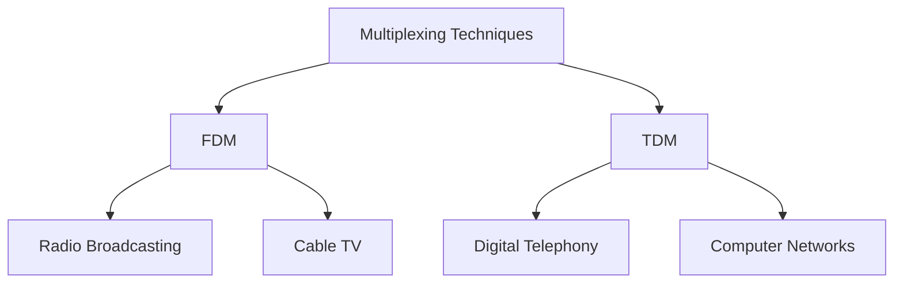

**FDM Characteristics:**

- **Frequency Separation**: Each signal allocated different frequency band
- **Simultaneous Transmission**: All signals transmitted at same time
- **Guard Bands**: Prevent interference between channels

**TDM Characteristics:**

- **Time Separation**: Each signal allocated different time slot
- **Sequential Transmission**: Signals transmitted one after another
- **Precise Timing**: Requires synchronized clocks

**Mnemonic:** "FDM uses Frequency, TDM uses Time"

## Question 4(c) [7 marks]

**Draw and illustrate OSI reference model.**

**Answer:**

**OSI Model Diagram:**


**Table: OSI Layer Functions**

| Layer | Name | Function | Examples |
|-------|------|----------|----------|
| **7** | Application | User interface | HTTP, FTP, SMTP |
| **6** | Presentation | Data formatting | Encryption, Compression |
| **5** | Session | Session management | NetBIOS, RPC |
| **4** | Transport | End-to-end delivery | TCP, UDP |
| **3** | Network | Routing | IP, ICMP |
| **2** | Data Link | Frame delivery | Ethernet, PPP |
| **1** | Physical | Bit transmission | Cables, Hubs |

**Key Features:**

- **Layered Architecture**: Each layer has specific responsibilities
- **Protocol Independence**: Layers can be modified independently
- **Standardization**: Common framework for network communication
- **Encapsulation**: Each layer adds its own header

**Mnemonic:** "All People Seem To Need Data Processing"

## Question 4(a OR) [3 marks]

**Describe Hub in brief.**

**Answer:**

**Hub Diagram:**

```goat
    PC1
     |
PC4──HUB──PC2
     |
    PC3
```

**Table: Hub Characteristics**

| Feature | Description |
|---------|-------------|
| **Function** | Central connection point for devices |
| **Type** | Physical layer device (Layer 1) |
| **Data Handling** | Broadcasts to all connected devices |
| **Collision Domain** | All ports share same collision domain |

- **Shared Bandwidth**: All connected devices share total bandwidth
- **Half-Duplex**: Cannot send and receive simultaneously
- **Security Issues**: All devices receive all transmitted data
- **Obsolete Technology**: Replaced by switches in modern networks

**Mnemonic:** "Hub is Half-duplex, shares Bandwidth"

## Question 4(b OR) [4 marks]

**Compare STP and UTP.**

**Answer:**

**Table: STP vs UTP Cable Comparison**

| Feature | STP (Shielded Twisted Pair) | UTP (Unshielded Twisted Pair) |
|---------|----------------------------|-------------------------------|
| **Shielding** | Metal foil/braid protection | No shielding |
| **Cost** | More expensive | Less expensive |
| **Installation** | Complex due to grounding | Simple installation |
| **EMI Resistance** | Excellent protection | Moderate protection |
| **Applications** | Industrial environments | Office environments |

**Cable Structure:**

```goat
UTP:    |wire1 wire2|
        |wire3 wire4|

STP:    |Shield|wire1 wire2|Shield|
        |Shield|wire3 wire4|Shield|
```

**STP Advantages:**

- **Better Noise Immunity**: Shield blocks electromagnetic interference
- **Higher Data Rates**: Supports faster transmission speeds
- **Secure Transmission**: Less susceptible to eavesdropping

**UTP Advantages:**

- **Cost Effective**: Cheaper than STP
- **Easy Installation**: No grounding requirements
- **Flexibility**: More flexible and easier to handle

**Mnemonic:** "STP is Shielded but Pricey, UTP is Unshielded but Popular"

## Question 4(c OR) [7 marks]

**Distinguish LAN, MAN, WAN.**

**Answer:**

**Network Size Comparison:**

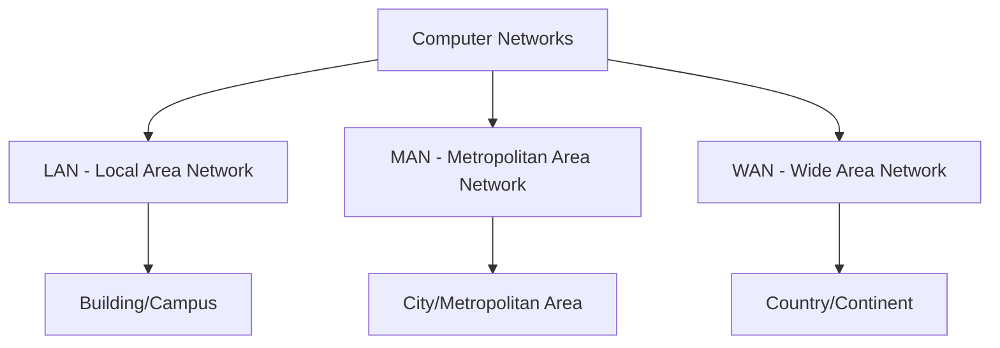

**Table: Network Type Comparison**

| Parameter | LAN | MAN | WAN |
|-----------|-----|-----|-----|
| **Coverage** | Building/Campus | City/Metropolitan area | Country/Continent |
| **Speed** | 10 Mbps - 1 Gbps | 1-100 Mbps | 56 Kbps - 100 Mbps |
| **Cost** | Low | Medium | High |
| **Ownership** | Private | Private/Public | Public/Leased |
| **Technology** | Ethernet, Wi-Fi | Fiber optic, WiMAX | Satellite, Leased lines |
| **Error Rate** | Very low | Low | Higher |

**Detailed Characteristics:**

**LAN (Local Area Network):**

- **High Speed**: Fast data transmission within small area
- **Low Cost**: Inexpensive to set up and maintain
- **Private Ownership**: Usually owned by single organization

**MAN (Metropolitan Area Network):**

- **City-wide Coverage**: Spans across metropolitan area
- **Medium Speed**: Moderate transmission speeds
- **Mixed Ownership**: Can be public or private

**WAN (Wide Area Network):**

- **Global Coverage**: Spans countries and continents
- **Variable Speed**: Depends on connection type
- **Public Infrastructure**: Uses public telecommunication networks

**Mnemonic:** "LAN is Local, MAN is Metropolitan, WAN is Wide"

## Question 5(a) [3 marks]

**Explain Denial of Service Attack.**

**Answer:**

**DoS Attack Diagram:**

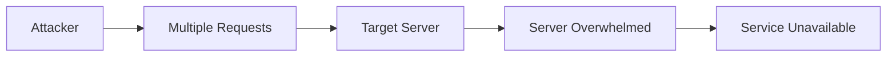

**Table: DoS Attack Types**

| Type | Description |
|------|-------------|
| **Volume-based** | Floods bandwidth with traffic |
| **Protocol-based** | Exploits protocol weaknesses |
| **Application-based** | Targets application resources |

- **Objective**: Make services unavailable to legitimate users
- **Methods**: Traffic flooding, resource exhaustion, exploit vulnerabilities
- **Impact**: Service disruption, financial loss, reputation damage
- **Prevention**: Firewalls, load balancers, intrusion detection systems

**Mnemonic:** "DoS Denies Others Service"

## Question 5(b) [4 marks]

**i) Classify data transmission**
**ii) Write down use of Terminator in Bus Topology.**

**Answer:**

**i) Data Transmission Classification:**

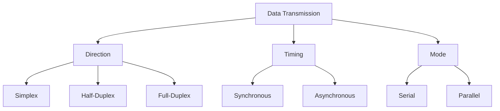

**ii) Terminator in Bus Topology:**

**Table: Terminator Functions**

| Function | Description |
|----------|-------------|
| **Signal Absorption** | Prevents signal reflection |
| **Impedance Matching** | Matches cable impedance |
| **Network Integrity** | Maintains signal quality |

- **Prevention of Reflection**: Stops signals from bouncing back
- **Signal Quality**: Maintains clean signal transmission
- **Required at Both Ends**: Bus topology needs terminators at both cable ends
- **Resistance Value**: Usually 50 ohms for Ethernet networks

**Mnemonic:** "Terminator Stops signal Travel"

## Question 5(c) [7 marks]

**Describe CIA triad.**

**Answer:**

**CIA Triad Diagram:**

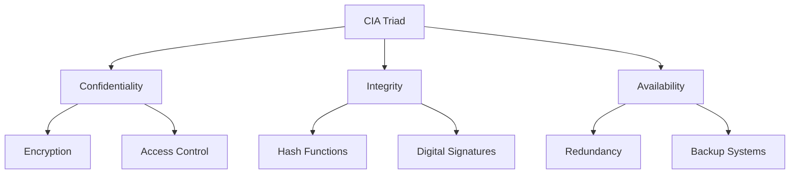

**Table: CIA Triad Components**

| Component | Definition | Implementation | Threats |
|-----------|------------|----------------|---------|
| **Confidentiality** | Information secrecy | Encryption, Access control | Unauthorized disclosure |
| **Integrity** | Data accuracy and completeness | Hash functions, Digital signatures | Data modification |
| **Availability** | Information accessibility | Redundancy, Backup systems | Service disruption |

**Detailed Explanation:**

**Confidentiality:**

- **Data Protection**: Only authorized users can access information
- **Privacy Measures**: Encryption, authentication, access controls
- **Examples**: Password protection, file permissions

**Integrity:**

- **Data Accuracy**: Information remains unaltered during transmission/storage
- **Verification Methods**: Checksums, digital signatures, version control
- **Examples**: Hash functions, database constraints

**Availability:**

- **System Accessibility**: Information and services available when needed
- **Reliability Measures**: Redundancy, fault tolerance, disaster recovery
- **Examples**: Load balancing, backup systems, UPS

**Mnemonic:** "CIA protects - Confidentiality, Integrity, Availability"

## Question 5(a OR) [3 marks]

**Define**
**1. Cryptography**
**2. Decryption**

**Answer:**

**Definition Table:**

| Term | Definition | Purpose |
|------|------------|---------|
| **Cryptography** | Science of securing information through encoding | Protect data confidentiality |
| **Decryption** | Process of converting encrypted data back to original | Retrieve original information |

- **Cryptography**: Uses mathematical algorithms to transform readable data into unreadable format
- **Decryption**: Reverse process using keys to restore original data
- **Key-based Security**: Both processes rely on cryptographic keys

**Mnemonic:** "Crypto Conceals, Decryption Discloses"

## Question 5(b OR) [4 marks]

**i) State the reason why wires are twisted in twisted pair cables.**
**ii) Identify the layer of OSI model at which the following network devices support 1. Router 2. Bridge**

**Answer:**

**i) Twisted Pair Cable Design:**

```goat
Normal Wires:     ||||||||||||
                  ||||||||||||
                  (Parallel interference)

Twisted Wires:    \/\/\/\/\/\/
                  /\/\/\/\/\/\
                  (Cancellation effect)
```

**Table: Wire Twisting Benefits**

| Benefit | Description |
|---------|-------------|
| **Noise Reduction** | Cancels electromagnetic interference |
| **Crosstalk Prevention** | Reduces signal interference between pairs |
| **Signal Quality** | Maintains better signal integrity |

**ii) OSI Layer Identification:**

**Table: Network Devices and OSI Layers**

| Device | OSI Layer | Function |
|--------|-----------|----------|
| **Router** | Layer 3 (Network) | Routing between different networks |
| **Bridge** | Layer 2 (Data Link) | Connecting network segments |

- **Wire Twisting**: Each twist cancels out electromagnetic interference from adjacent wire
- **Interference Cancellation**: Noise affects both wires equally but in opposite directions
- **Router Function**: Makes routing decisions based on IP addresses
- **Bridge Function**: Forwards frames based on MAC addresses

**Mnemonic:** "Twisted wires Reduce interference, Router at layer 3, Bridge at layer 2"

## Question 5(c OR) [7 marks]

**Define Cyber Attack and Explain various cyber-attacks in brief**

**Answer:**

**Cyber Attack Definition:**
Cyber attack is a deliberate attempt to compromise computer systems, networks, or digital devices to steal, alter, or destroy data.

**Types of Cyber Attacks:**

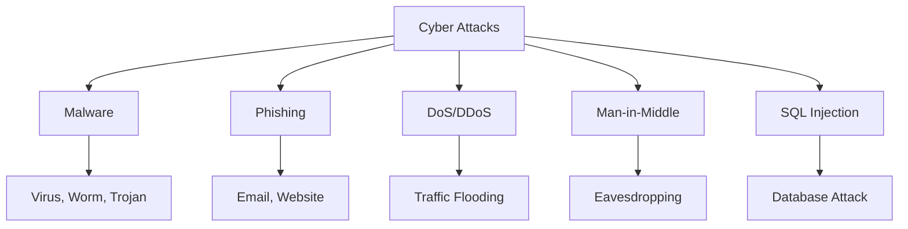

**Table: Cyber Attack Types**

| Attack Type | Description | Impact | Prevention |
|-------------|-------------|--------|------------|
| **Malware** | Malicious software (virus, worm, trojan) | System corruption, data theft | Antivirus, updates |
| **Phishing** | Fraudulent emails/websites to steal credentials | Identity theft, financial loss | User awareness, email filters |
| **DoS/DDoS** | Overwhelming target with traffic | Service unavailability | Firewalls, load balancers |
| **Man-in-Middle** | Intercepting communication between parties | Data eavesdropping | Encryption, secure protocols |
| **SQL Injection** | Malicious code inserted into database queries | Database compromise | Input validation, parameterized queries |

**Detailed Attack Explanations:**

**Malware Attacks:**

- **Virus**: Self-replicating code that attaches to files
- **Worm**: Standalone malware that spreads across networks
- **Trojan**: Disguised malware that appears legitimate

**Social Engineering:**

- **Phishing**: Fake emails requesting sensitive information
- **Spear Phishing**: Targeted attacks on specific individuals
- **Baiting**: Using attractive offers to deliver malware

**Network Attacks:**

- **Packet Sniffing**: Capturing network traffic for analysis
- **Session Hijacking**: Taking over user sessions
- **Password Attacks**: Brute force, dictionary attacks

**Mnemonic:** "MPDMS - Malware, Phishing, DoS, Man-in-middle, SQL injection"
