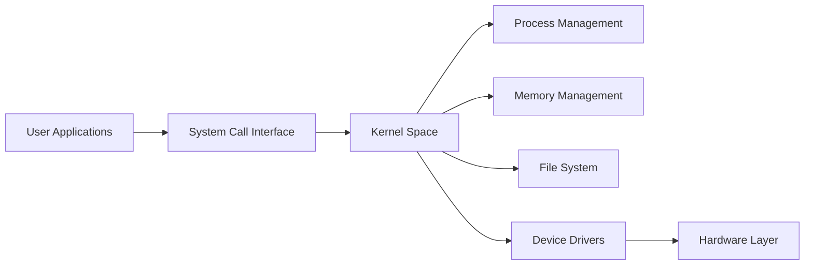
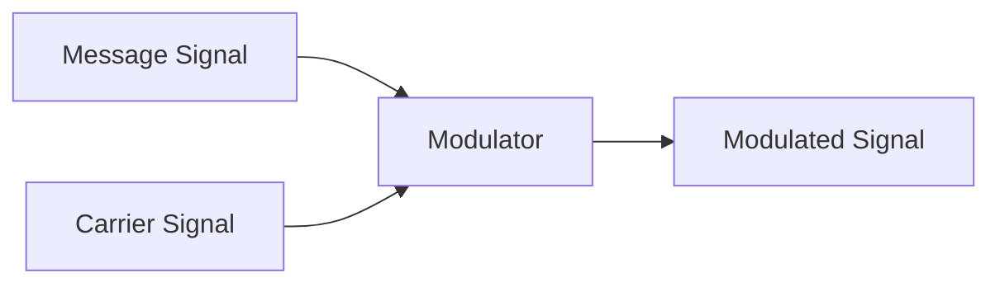
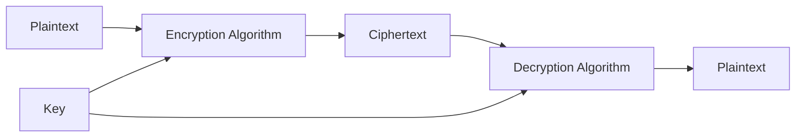

## પ્રશ્ન 1(અ) [3 ગુણ]

**Information અને Knowledge વચ્ચેનો તફાવત આપો.**

**જવાબ**:

| **પાસાં** | **Information** | **Knowledge** |
|------------|-----------------|---------------|
| **વ્યાખ્યા** | કાચા તથ્યો અને આંકડાઓ | અનુભવ સાથે પ્રક્રિયા કરેલી માહિતી |
| **પ્રક્રિયા** | ગોઠવેલો ડેટા | અનુભવ સાથે જોડાયેલી માહિતી |
| **ઉપયોગ** | સહેલાઈથી શેર કરી શકાય | અર્થઘટન અને સંદર્ભ જરૂરી |

- **Information**: કાચા તથ્યો, ડેટા અને આંકડાઓ કે જેની પ્રક્રિયા કરી શકાય
- **Knowledge**: અનુભવ અને શિક્ષણ દ્વારા પ્રાપ્ત સમજ

**મેમરી ટ્રીક:** "Information માહિતી આપે, Knowledge જ્ઞાન આપે"

## પ્રશ્ન 1(બ) [4 ગુણ]

**OS ના કાર્યો સમજાવો.**

**જવાબ**:

**ઓપરેટિંગ સિસ્ટમના મુખ્ય કાર્યો:**

| **કાર્ય** | **વર્ણન** |
|--------------|-----------------|
| **Process Management** | પ્રોગ્રામ્સના અમલીકરણને નિયંત્રિત કરે |
| **Memory Management** | મેમરી ફાળવણી અને મુક્તિ |
| **File Management** | ફાઇલોનું સંગઠન અને વ્યવસ્થાપન |
| **Device Management** | ઇનપુટ/આઉટપુટ ઉપકરણોનું નિયંત્રણ |

- **Process Control**: ચાલતા પ્રોગ્રામ્સનું શેડ્યુલિંગ અને વ્યવસ્થાપન
- **Resource Allocation**: સિસ્ટમ સંસાધનોનું કાર્યક્ષમ વિતરણ
- **User Interface**: યુઝર અને કમ્પ્યુટર વચ્ચે ક્રિયાપ્રતિક્રિયા

**મેમરી ટ્રીક:** "PMFD - Process, Memory, File, Device"

## પ્રશ્ન 1(ક) [7 ગુણ]

**યુનિવર્સલ ગેટ વ્યાખ્યાયિત કરો અને NAND યુનિવર્સલ ગેટનો ઉપયોગ કરીને બેસિક ગેટ બનાવો.**

**જવાબ**:

**યુનિવર્સલ ગેટની વ્યાખ્યા:**
એવા લોજિક ગેટ કે જે અન્ય કોઈ ગેટનો ઉપયોગ કર્યા વિના કોઈપણ Boolean function અમલ કરી શકે.

**NAND ગેટ Truth Table:**

| A | B | NAND આઉટપુટ |
|---|---|-------------|
| 0 | 0 | 1 |
| 0 | 1 | 1 |
| 1 | 0 | 1 |
| 1 | 1 | 0 |

**NAND વડે બેસિક ગેટ્સ:**

```goat
NOT Gate using NAND:
A ----+
      |
      NAND ---- આઉટપુટ (NOT A)
      |
A ----+

AND Gate using NAND:
A ----+
      |
      NAND ---- NAND ---- આઉટપુટ (A AND B)
      |
B ----+

OR Gate using NAND:
A ---- NAND ----+
                |
                NAND ---- આઉટપુટ (A OR B)
                |
B ---- NAND ----+
```

- **NOT**: બંને NAND ઇનપુટમાં એક જ ઇનપુટ આપવું
- **AND**: NAND પછી NOT (બીજું NAND)
- **OR**: બંને ઇનપુટ્સને NOT કરો, પછી NAND કરો

**મેમરી ટ્રીક:** "NAND ને બીજા NAND ની નિશ્ચિત જરૂર"

## પ્રશ્ન 1(ક OR) [7 ગુણ]

**નીચેના રૂપાંતરણ કરો:**

**જવાબ**:

**રૂપાંતરણ ઉકેલો:**

| **માંથી** | **માં** | **પ્રક્રિયા** | **પરિણામ** |
|----------|--------|-------------|------------|
| (1456)₈ | Base 16 | 8→10→16 | (32E)₁₆ |
| (1011)₂ | Base 10 | Binary to Decimal | (11)₁₀ |
| (247.38)₁₀ | Base 8 | Integer અને Fraction અલગ | (367.3)₈ |

**વિગતવાર ઉકેલ:**

1) **(1456)₈ = (32E)₁₆**
   - 1×8³ + 4×8² + 5×8¹ + 6×8⁰ = 512 + 256 + 40 + 6 = (814)₁₀
   - 814 ÷ 16 = 50 remainder 14(E), 50 ÷ 16 = 3 remainder 2
   - પરિણામ: (32E)₁₆

2) **(1011)₂ = (11)₁₀**
   - 1×2³ + 0×2² + 1×2¹ + 1×2⁰ = 8 + 0 + 2 + 1 = (11)₁₀

3) **(247.38)₁₀ = (367.3)₈**
   - પૂર્ણાંક: 247 ÷ 8 = 30 બાકી 7, 30 ÷ 8 = 3 બાકી 6, 3 ÷ 8 = 0 બાકી 3
   - દશાંશ: 0.38 × 8 = 3.04 (3 લો)
   - પરિણામ: (367.3)₈

**મેમરી ટ્રીક:** "રૂપાંતરણ સાવચેતીથી, ગણતરી ચકાસીને"

## પ્રશ્ન 2(અ) [3 ગુણ]

**મેમરીના પ્રકારોની સૂચિ બનાવો.**

**જવાબ**:

**મેમરી વર્ગીકરણ:**

| **પ્રકાર** | **ઉદાહરણ** | **લાક્ષણિકતાઓ** |
|----------|--------------|-------------------|
| **Primary Memory** | RAM, ROM, Cache | CPU દ્વારા સીધી પહોંચ |
| **Secondary Memory** | HDD, SSD, CD/DVD | બિન-અસ્થાયી સંગ્રહ |
| **Cache Memory** | L1, L2, L3 | હાઇ-સ્પીડ બફર મેમરી |

- **Volatile**: પાવર બંધ કરવાથી ડેટા ગુમાવે (RAM)
- **Non-volatile**: પાવર વિના ડેટા જાળવે (ROM, HDD)
- **ઍક્સેસ સ્પીડ**: Cache > RAM > Secondary Storage

**મેમરી ટ્રીક:** "Primary પ્રક્રિયા કરે, Secondary સંગ્રહ કરે"

## પ્રશ્ન 2(બ) [4 ગુણ]

**Kernel Mode અને User Mode વચ્ચે તફાવત આપો.**

**જવાબ**:

| **પાસાં** | **Kernel Mode** | **User Mode** |
|------------|-----------------|---------------|
| **અધિકાર સ્તર** | સંપૂર્ણ સિસ્ટમ ઍક્સેસ | મર્યાદિત ઍક્સેસ |
| **સૂચનાઓ** | બધી સૂચનાઓની મંજૂરી | મર્યાદિત સૂચના સેટ |
| **મેમરી ઍક્સેસ** | સંપૂર્ણ મેમરી ઍક્સેસ | મર્યાદિત મેમરી વિસ્તારો |
| **સિસ્ટમ કૉલ્સ** | સીધી હાર્ડવેર ઍક્સેસ | માત્ર સિસ્ટમ કૉલ્સ દ્વારા |

- **Kernel Mode**: ઓપરેટિંગ સિસ્ટમ સંપૂર્ણ અધિકારો સાથે ચાલે
- **User Mode**: એપ્લિકેશન્સ મર્યાદિત અધિકારો સાથે ચાલે
- **સુરક્ષા**: મોડ સ્વિચિંગ અનધિકૃત ઍક્સેસ અટકાવે

**મેમરી ટ્રીક:** "Kernel નિયંત્રણ કરે, User ઉપયોગ કરે"

## પ્રશ્ન 2(ક) [7 ગુણ]

**OS ના પ્રકારોની યાદી બનાવો અને કોઈપણ બે OS સમજાવો**

**જવાબ**:

**ઓપરેટિંગ સિસ્ટમના પ્રકારો:**

| **પ્રકાર** | **ઉદાહરણ** | **લાક્ષણિકતાઓ** |
|----------|--------------|-------------------|
| **Batch OS** | પ્રારંભિક mainframes | યુઝર ક્રિયાપ્રતિક્રિયા નથી |
| **Time-sharing OS** | UNIX, Linux | એકસાથે બહુવિધ યુઝર્સ |
| **Real-time OS** | Embedded systems | ગેરંટીડ પ્રતિસાદ સમય |
| **Distributed OS** | Cloud systems | બહુવિધ જોડાયેલા કમ્પ્યુટર્સ |
| **Network OS** | Windows Server | નેટવર્ક સંસાધન વ્યવસ્થાપન |
| **Mobile OS** | Android, iOS | સ્માર્ટફોન/ટેબલેટ સિસ્ટમ્સ |

**વિગતવાર સમજૂતી:**

**1. Time-sharing OS (Linux):**

- **Multi-user**: બહુવિધ યુઝર્સ એકસાથે ઍક્સેસ કરી શકે
- **Multi-tasking**: બહુવિધ પ્રક્રિયાઓ સમાંતર ચલાવે
- **સંસાધન શેરિંગ**: CPU સમય પ્રક્રિયાઓ વચ્ચે વહેંચાય
- **ઉદાહરણ**: UNIX, Linux, Windows

**2. Real-time OS:**

- **નિર્ધારિત**: સમય મર્યાદામાં ગેરંટીડ પ્રતિસાદ
- **પ્રાથમિકતા આધારિત**: મહત્વપૂર્ણ કાર્યોને ઊંચી પ્રાથમિકતા
- **ઉપયોગ**: મેડિકલ ઉપકરણો, ઔદ્યોગિક નિયંત્રણ
- **પ્રકાર**: Hard real-time અને Soft real-time

**મેમરી ટ્રીક:** "સમય ટિક કરે, Real-time રિએક્ટ કરે"

## પ્રશ્ન 2(અ OR) [3 ગુણ]

**Linux Operating System નું આર્કિટેક્ચર સમજાવો.**

**જવાબ**:

**Linux આર્કિટેક્ચર સ્તરો:**



- **User Space**: એપ્લિકેશન્સ અને યુઝર પ્રોગ્રામ્સ
- **System Calls**: યુઝર અને kernel વચ્ચેનું ઇન્ટરફેસ
- **Kernel**: મુખ્ય ઓપરેટિંગ સિસ્ટમ કાર્યો

**મેમરી ટ્રીક:** "યુઝર્સ ઉપયોગ કરે, Kernel નિયંત્રણ કરે"

## પ્રશ્ન 2(બ OR) [4 ગુણ]

**Search Engine ની કામગીરી સમજાવો.**

**જવાબ**:

**Search Engine કામકાજની પ્રક્રિયા:**

| **સ્ટેપ** | **પ્રક્રિયા** | **કાર્ય** |
|----------|-------------|--------------|
| **Crawling** | વેબ સ્પાઇડર્સ વેબસાઇટ્સ સ્કેન કરે | વેબ પેજીસ શોધે |
| **Indexing** | કન્ટેન્ટ વિશ્લેષણ અને સંગ્રહ | શોધી શકાય તેવો ડેટાબેસ બનાવે |
| **Ranking** | ઍલ્ગોરિધમ લાગુ કરે | સુસંગતતાનો ક્રમ નક્કી કરે |
| **Retrieval** | પરિણામો પરત કરે | ક્રમબદ્ધ પરિણામો દર્શાવે |

**કામકાજના પગલાં:**

- **વેબ ક્રોલર્સ**: ઓટોમેટેડ બોટ્સ ઇન્ટરનેટ કન્ટેન્ટ સ્કેન કરે
- **ઇન્ડેક્સ ડેટાબેસ**: વેબપેજ માહિતી સંગ્રહિત અને ગોઠવે
- **ક્વેરી પ્રોસેસિંગ**: યુઝર શોધ શબ્દોનું વિશ્લેષણ કરે
- **પરિણામ રેન્કિંગ**: સુસંગતતા અનુસાર પરિણામોનો ક્રમ કરે

**મેમરી ટ્રીક:** "ક્રોલ, ઇન્ડેક્સ, રેન્ક, પુનઃપ્રાપ્ત"

## પ્રશ્ન 2(ક OR) [7 ગુણ]

**Open Source Software અને Proprietary Software વચ્ચે તફાવત આપો.**

**જવાબ**:

| **પાસાં** | **Open Source Software** | **Proprietary Software** |
|------------|---------------------------|---------------------------|
| **સોર્સ કોડ** | મુક્તપણે ઉપલબ્ધ અને સુધારી શકાય | બંધ અને સુરક્ષિત |
| **કિંમત** | સામાન્યતે મફત | લાઇસન્સ ખરીદવાની જરૂર |
| **સપોર્ટ** | કમ્યુનિટી આધારિત | વેન્ડર દ્વારા પૂરું પાડવામાં આવે |
| **કસ્ટમાઇઝેશન** | સંપૂર્ણ કસ્ટમાઇઝ કરી શકાય | મર્યાદિત કસ્ટમાઇઝેશન |
| **ઉદાહરણ** | Linux, Firefox, LibreOffice | Windows, MS Office, Photoshop |
| **સુરક્ષા** | પારદર્શક, કમ્યુનિટી ઓડિટેડ | અસ્પષ્ટતા દ્વારા સુરક્ષા |
| **અપડેટ્સ** | કમ્યુનિટી સંચાલિત | વેન્ડર નિયંત્રિત |

**મુખ્ય તફાવતો:**

- **લાઇસન્સિંગ**: Open source પુનઃવિતરણ અને સુધારાની મંજૂરી આપે vs proprietary પેઇડ
- **કિંમત મોડેલ**: Open source સામાન્યતે મફત vs proprietary પેઇડ
- **ડેવલપમેન્ટ**: કમ્યુનિટી સહયોગ vs કંપની નિયંત્રિત
- **પારદર્શિતા**: Open source કોડ દૃશ્યમાન vs proprietary છુપાયેલ

**ફાયદા:**

- **Open Source**: કિફાયતી, કસ્ટમાઇઝ કરી શકાય, સુરક્ષિત
- **Proprietary**: વ્યાવસાયિક સપોર્ટ, એકીકૃત લક્ષણો, યુઝર-ફ્રેન્ડલી

**મેમરી ટ્રીક:** "Open ખુલ્લું કરે, Proprietary સુરક્ષિત કરે"

## પ્રશ્ન 3(અ) [3 ગુણ]

**નીચેનાનું સંપૂર્ણ નામ આપો: OSI, LLC, FTP**

**જવાબ**:

**સંપૂર્ણ રૂપો:**

| **સંક્ષેપ** | **સંપૂર્ણ રૂપ** |
|------------------|---------------|
| **OSI** | Open Systems Interconnection |
| **LLC** | Logical Link Control |
| **FTP** | File Transfer Protocol |

- **OSI**: 7 સ્તરો સાથેનું નેટવર્કિંગ સંદર્ભ મોડેલ
- **LLC**: OSI મોડેલમાં Data Link Layer નું સબલેયર
- **FTP**: નેટવર્ક પર ફાઇલો ટ્રાન્સફર કરવા માટેનું પ્રોટોકોલ

**મેમરી ટ્રીક:** "Open Logic Files"

## પ્રશ્ન 3(બ) [4 ગુણ]

**Twisted Pair Cable ના ફાયદા અને ગેરફાયદા આપો**

**જવાબ**:

**Twisted Pair Cable વિશ્લેષણ:**

| **ફાયદા** | **ગેરફાયદા** |
|----------------|-------------------|
| **ઓછી કિંમત** | **મર્યાદિત અંતર** |
| **સરળ ઇન્સ્ટોલેશન** | **ઇલેક્ટ્રોમેગ્નેટિક હસ્તક્ષેપ** |
| **લવચીક** | **ઓછી બેન્ડવિડ્થ** |
| **વ્યાપકપણે ઉપલબ્ધ** | **સુરક્ષા સમસ્યાઓ** |

**ફાયદા:**

- **કિફાયતી**: સૌથી સસ્તો નેટવર્કિંગ કેબલ વિકલ્પ
- **સરળ ઇન્સ્ટોલેશન**: ઇન્સ્ટોલ અને જાળવણી સરળ
- **લવચીકતા**: સહેલાઈથી વાળી અને રૂટ કરી શકાય

**ગેરફાયદા:**

- **અંતર મર્યાદા**: રિપીટર વિના મહત્તમ 100 મીટર
- **હસ્તક્ષેપ**: ઇલેક્ટ્રોમેગ્નેટિક હસ્તક્ષેપ માટે સંવેદનશીલ
- **બેન્ડવિડ્થ**: ફાઇબર કરતાં ઓછા ડેટા ટ્રાન્સમિશન રેટ

**મેમરી ટ્રીક:** "Twisted સસ્તું પણ મર્યાદિત"

## પ્રશ્ન 3(ક) [7 ગુણ]

**Modulation શું છે? Analog Modulation સમજાવો.**

**જવાબ**:

**Modulation ની વ્યાખ્યા:**
લાંબા અંતર સુધી માહિતી ટ્રાન્સમિટ કરવા માટે carrier signal ની લાક્ષણિકતાઓ બદલવાની પ્રક્રિયા.

**Analog Modulation પ્રકારો:**

| **પ્રકાર** | **બદલાતું પરિમાણ** | **ઉપયોગ** |
|----------|---------------------|----------------|
| **AM** | Amplitude | રેડિયો બ્રોડકાસ્ટિંગ |
| **FM** | Frequency | FM રેડિયો, TV સાઉન્ડ |
| **PM** | Phase | ડિજિટલ કમ્યુનિકેશન્સ |

**Amplitude Modulation (AM):**



**મુખ્ય ખ્યાલો:**

- **Carrier Wave**: ટ્રાન્સમિશન માટે હાઇ-ફ્રીક્વન્સી સિગ્નલ
- **Message Signal**: ટ્રાન્સમિટ કરવાની માહિતી
- **Modulation Index**: લાગુ કરેલ modulation ની માત્રા

**ઉપયોગ:**

- **AM Radio**: 530-1710 kHz ફ્રીક્વન્સી બેન્ડ
- **FM Radio**: 88-108 MHz ફ્રીક્વન્સી બેન્ડ
- **ટેલિવિઝન**: વિવિધ modulation તકનીકો

**ફાયદા:**

- **લાંબું અંતર**: લાંબા અંતરની કમ્યુનિકેશન શક્ય બનાવે
- **Noise Immunity**: FM વધુ સારી noise પ્રતિકાર આપે

**મેમરી ટ્રીક:** "Amplitude બદલાય, Frequency ફ્લક્ચ્યુએટ કરે"

## પ્રશ્ન 3(અ OR) [3 ગુણ]

**Network Topology ની યાદી બનાવો. Bus Topology ના ફાયદા અને ગેરફાયદા લખો.**

**જવાબ**:

**નેટવર્ક ટોપોલોજીઓ:**

- **Bus Topology**
- **Star Topology**
- **Ring Topology**
- **Mesh Topology**
- **Hybrid Topology**

**Bus Topology વિશ્લેષણ:**

| **ફાયદા** | **ગેરફાયદા** |
|----------------|-------------------|
| **સરળ ડિઝાઇન** | **સિંગલ પોઇન્ટ ઓફ ફેઇલ્યુર** |
| **કિફાયતી** | **મર્યાદિત કેબલ લંબાઇ** |
| **સરળ વિસ્તરણ** | **પર્ફોર્મન્સ ઘટાડો** |

**મેમરી ટ્રીક:** "Bus સરળ પણ સિંગલ-ફેઇલ્યુર-પ્રોન"

## પ્રશ્ન 3(બ OR) [4 ગુણ]

**Serial અને Parallel Transmission વચ્ચેનો તફાવત જણાવો.**

**જવાબ**:

| **પાસાં** | **Serial Transmission** | **Parallel Transmission** |
|------------|-------------------------|---------------------------|
| **ડેટા પાથ** | સિંગલ કમ્યુનિકેશન લાઇન | એકસાથે બહુવિધ લાઇન્સ |
| **સ્પીડ** | ટૂંકા અંતર માટે ધીમું | ટૂંકા અંતર માટે ઝડપી |
| **કિંમત** | ઓછી કિંમત | વધારે કિંમત |
| **અંતર** | લાંબા અંતર માટે યોગ્ય | ટૂંકા અંતર માટે મર્યાદિત |

**લાક્ષણિકતાઓ:**

- **Serial**: બિટ્સ એક પછી એક ટ્રાન્સમિટ થાય
- **Parallel**: બહુવિધ બિટ્સ એકસાથે ટ્રાન્સમિટ થાય
- **ઉપયોગ**: નેટવર્ક માટે Serial, આંતરિક બસ માટે Parallel

**મેમરી ટ્રીક:** "Serial સિંગલ-ફાઇલ, Parallel પ્રોસેસીસ"

## પ્રશ્ન 3(ક OR) [7 ગુણ]

**Transmission Modes સમજાવો.**

**જવાબ**:

**Transmission Modes વર્ગીકરણ:**

| **મોડ** | **દિશા** | **ઉદાહરણ** | **ઉપયોગ** |
|----------|---------------|--------------|------------------|
| **Simplex** | માત્ર એક દિશા | રેડિયો, TV બ્રોડકાસ્ટ | બ્રોડકાસ્ટિંગ |
| **Half-duplex** | બંને દિશા, એકસાથે નહીં | વોકી-ટૉકી | વારાફરતી કમ્યુનિકેશન |
| **Full-duplex** | બંને દિશા એકસાથે | ટેલિફોન | રિયલ-ટાઇમ કમ્યુનિકેશન |

**વિગતવાર સમજૂતી:**

**1. Simplex Mode:**

- **એકદિશીય**: ડેટા માત્ર એક દિશામાં વહે
- **ઉદાહરણ**: ટેલિવિઝન બ્રોડકાસ્ટિંગ, રેડિયો ટ્રાન્સમિશન
- **ફાયદો**: સરળ અમલીકરણ
- **ગેરફાયદો**: ફીડબેક શક્ય નથી

**2. Half-duplex Mode:**

- **દ્વિદિશીય**: બંને દિશામાં ડેટા વહી શકે, પણ એકસાથે નહીં
- **ઉદાહરણ**: વોકી-ટૉકીઝ, CB રેડિયો
- **ફાયદો**: સિંગલ ચેનલ સાથે બે-દિશીય કમ્યુનિકેશન
- **ગેરફાયદો**: એકસાથે મોકલી અને મેળવી શકાતું નથી

**3. Full-duplex Mode:**

- **એકસાથે દ્વિદિશીય**: બંને દિશામાં એક જ સમયે ડેટા વહે
- **ઉદાહરણ**: ટેલિફોન વાતચીત, આધુનિક નેટવર્ક્સ
- **ફાયદો**: કાર્યક્ષમ રિયલ-ટાઇમ કમ્યુનિકેશન
- **ગેરફાયદો**: વધુ જટિલ અમલીકરણ જરૂરી

**મેમરી ટ્રીક:** "Simplex સિંગલ, Half-duplex અટકે, Full-duplex વહે"

## પ્રશ્ન 4(અ) [3 ગુણ]

**Crossover Ethernet Cable દોરો.**

**જવાબ**:

**Crossover Cable વાયરિંગ ડાયાગ્રામ:**

```goat
RJ-45 Connector A          RJ-45 Connector B
Pin 1: White-Orange  <---> Pin 3: White-Green
Pin 2: Orange        <---> Pin 6: Green
Pin 3: White-Green   <---> Pin 1: White-Orange
Pin 4: Blue          <---> Pin 4: Blue
Pin 5: White-Blue    <---> Pin 5: White-Blue
Pin 6: Green         <---> Pin 2: Orange
Pin 7: White-Brown   <---> Pin 7: White-Brown
Pin 8: Brown         <---> Pin 8: Brown
```

**મુખ્ય મુદ્દાઓ:**

- **હેતુ**: સમાન ઉપકરણો વચ્ચે સીધું કનેક્શન
- **ક્રોસ્ડ પેર્સ**: ટ્રાન્સમિટ અને રિસીવ પેર્સ અદલાબદલી
- **ઉપયોગ**: PC થી PC, Switch થી Switch કનેક્શન્સ

**મેમરી ટ્રીક:** "Cross કમ્પ્યુટર્સને કનેક્ટ કરે"

## પ્રશ્ન 4(બ) [4 ગુણ]

**IPv4 અને IPv6 વચ્ચેનો તફાવત જણાવો.**

**જવાબ**:

| **લક્ષણ** | **IPv4** | **IPv6** |
|-------------|----------|----------|
| **એડ્રેસ સાઇઝ** | 32 બિટ્સ | 128 બિટ્સ |
| **એડ્રેસ ફોર્મેટ** | ડોટેડ ડેસિમલ | હેક્સાડેસિમલ કોલોન |
| **એડ્રેસ સ્પેસ** | 4.3 બિલિયન એડ્રેસ | 340 અનડેસિલિયન એડ્રેસ |
| **હેડર સાઇઝ** | વેરિયેબલ (20-60 બાઇટ્સ) | ફિક્સ્ડ (40 બાઇટ્સ) |

**મુખ્ય તફાવતો:**

- **IPv4 ઉદાહરણ**: 192.168.1.1
- **IPv6 ઉદાહરણ**: 2001:0db8:85a3:0000:0000:8a2e:0370:7334
- **સુરક્ષા**: IPv6 માં બિલ્ટ-ઇન IPSec સપોર્ટ
- **NAT**: IPv4 ને NAT જરૂરી, IPv6 જરૂરિયાત દૂર કરે

**મેમરી ટ્રીક:** "IPv4 ચાર-બિલિયન, IPv6 છ-ગણાં-વધારે"

## પ્રશ્ન 4(ક) [7 ગુણ]

**OSI મોડલની સુઘડ અને સ્વચ્છ આકૃતિ દોરો અને Physical Layer અને Data Link Layer ની કાર્યક્ષમતા લખો.**

**જવાબ**:

**OSI મોડલ ડાયાગ્રામ:**


**લેયર કાર્યો:**

| **લેયર** | **કાર્ય** | **ઉદાહરણ** |
|-----------|--------------|--------------|
| **Physical (Layer 1)** | માધ્યમ પર બિટ ટ્રાન્સમિશન | કેબલ્સ, હબ્સ, રિપીટર્સ |
| **Data Link (Layer 2)** | નજીકના નોડ્સ વચ્ચે ફ્રેમ ડિલિવરી | સ્વિચ, MAC એડ્રેસ |

**Physical Layer કાર્યો:**

- **બિટ ટ્રાન્સમિશન**: ડેટાને ઇલેક્ટ્રિકલ/ઑપ્ટિકલ સિગ્નલમાં રૂપાંતરિત કરે
- **માધ્યમ સ્પેસિફિકેશન**: કેબલ પ્રકારો અને કનેક્ટર્સ વ્યાખ્યાયિત કરે
- **સિગ્નલ એન્કોડિંગ**: બિટ્સ કેવી રીતે રજૂ કરવા નક્કી કરે
- **ટ્રાન્સમિશન રેટ**: ડેટા સ્પીડ નિયંત્રિત કરે

**Data Link Layer કાર્યો:**

- **ફ્રેમ ફોર્મેશન**: બિટ્સને ફ્રેમ્સમાં ગોઠવે
- **એરર ડિટેક્શન**: ટ્રાન્સમિશન એરર્સ ઓળખે
- **ફ્લો કંટ્રોલ**: ડેટા ટ્રાન્સમિશન રેટ મેનેજ કરે
- **MAC એડ્રેસિંગ**: લોકલ ડિલિવરી માટે હાર્ડવેર એડ્રેસ ઉપયોગ કરે

**મેમરી ટ્રીક:** "Physical ધકેલે, Data-Link પહોંચાડે"

## પ્રશ્ન 4(અ OR) [3 ગુણ]

**Time Division Multiplexing સમજાવો.**

**જવાબ**:

**Time Division Multiplexing (TDM):**

```mermaid
gantt
    title TDM Time Slots
    dateFormat X
    axisFormat %L
    
    section Channel A
    Data A1 :0, 100
    Data A2 :300, 400
    
    section Channel B
    Data B1 :100, 200
    Data B2 :400, 500
    
    section Channel C
    Data C1 :200, 300
    Data C2 :500, 600
```



**TDM લાક્ષણિકતાઓ:**

- **ટાઇમ સ્લોટ્સ**: દરેક ચેનલને સમર્પિત સમય અવધિ મળે
- **સિંક્રોનાઇઝેશન**: બધી ચેનલો સિંક્રોનાઇઝ હોવી જોઈએ
- **બેન્ડવિડ્થ શેરિંગ**: બહુવિધ ચેનલો વચ્ચે સિંગલ હાઇ-સ્પીડ લિંક શેર

**મેમરી ટ્રીક:** "ટાઇમ વળતા લે"

## પ્રશ્ન 4(બ OR) [4 ગુણ]

**નેટવર્કિંગ ઉપકરણના પ્રકારોની યાદી બનાવો અને કોઈપણ એક સમજાવો.**

**જવાબ**:

**નેટવર્કિંગ ઉપકરણો:**

| **ઉપકરણ** | **લેયર** | **કાર્ય** |
|------------|-----------|--------------|
| **Hub** | Physical | સિગ્નલ રિપીટર |
| **Switch** | Data Link | ફ્રેમ સ્વિચિંગ |
| **Router** | Network | પેકેટ રાઉટિંગ |
| **Bridge** | Data Link | નેટવર્ક સેગમેન્ટેશન |

**Switch સમજૂતી:**

- **કાર્ય**: MAC એડ્રેસ આધારે ફ્રેમ્સ ફોરવર્ડ કરે
- **લર્નિંગ**: MAC એડ્રેસ ટેબલ ડાયનેમિકલી બનાવે
- **કોલિઝન ડોમેન**: દરેક પોર્ટ અલગ કોલિઝન ડોમેન બનાવે
- **ફુલ-ડુપ્લેક્સ**: દરેક પોર્ટ પર એકસાથે મોકલી/મેળવી શકે

**ફાયદા:**

- **બેન્ડવિડ્થ**: દરેક પોર્ટ માટે સંપૂર્ણ બેન્ડવિડ્થ
- **સુરક્ષા**: ફ્રેમ્સ માત્ર ઇચ્છિત પ્રાપ્તકર્તાને મોકલાય
- **કોલિઝન**: કોલિઝન દૂર કરે

**મેમરી ટ્રીક:** "Switch સ્માર્ટલી મોકલે"

## પ્રશ્ન 4(ક OR) [7 ગુણ]

**Computer Network શું છે? Computer Network ના પ્રકારો સમજાવો.**

**જવાબ**:

**Computer Network વ્યાખ્યા:**
આંતરસંબંધિત સ્વતંત્ર કમ્પ્યુટર્સનો સંગ્રહ કે જે કમ્યુનિકેટ કરી શકે અને સંસાધનો શેર કરી શકે.

**Computer Networks ના પ્રકારો:**

| **પ્રકાર** | **કવરેજ** | **ઉદાહરણ** | **લાક્ષણિકતાઓ** |
|----------|--------------|--------------|-------------------|
| **LAN** | લોકલ એરિયા (બિલ્ડિંગ) | ઑફિસ નેટવર્ક | હાઇ સ્પીડ, લો કોસ્ટ |
| **MAN** | મેટ્રોપોલિટન એરિયા (શહેર) | શહેરવ્યાપી નેટવર્ક | મીડિયમ સ્પીડ, મોડરેટ કોસ્ટ |
| **WAN** | વાઇડ એરિયા (દેશ/વિશ્વ) | ઇન્ટરનેટ | ઓછી સ્પીડ, વધારે કિંમત |

**વિગતવાર સમજૂતી:**

**1. Local Area Network (LAN):**

- **કવરેજ**: સિંગલ બિલ્ડિંગ કે કેમ્પસ
- **સ્પીડ**: હાઇ (100 Mbps થી 10 Gbps)
- **ટેકનોલોજી**: Ethernet, Wi-Fi
- **માલિકી**: સિંગલ સંસ્થા

**2. Metropolitan Area Network (MAN):**

- **કવરેજ**: શહેર કે મેટ્રોપોલિટન એરિયા
- **સ્પીડ**: મીડિયમ (10-100 Mbps)
- **ટેકનોલોજી**: ફાઇબર ઑપ્ટિક, માઇક્રોવેવ
- **ઉદાહરણ**: કેબલ TV નેટવર્ક્સ

**3. Wide Area Network (WAN):**

- **કવરેજ**: દેશો કે ખંડો
- **સ્પીડ**: વેરિયેબલ (ટેકનોલોજી પર આધાર)
- **ટેકનોલોજી**: સેટેલાઇટ, લીઝ્ડ લાઇન્સ
- **ઉદાહરણ**: ઇન્ટરનેટ, કોર્પોરેટ નેટવર્ક્સ

**નેટવર્ક ફાયદા:**

- **સંસાધન શેરિંગ**: ફાઇલો, પ્રિન્ટર્સ, એપ્લિકેશન્સ
- **કમ્યુનિકેશન**: ઇમેઇલ, મેસેજિંગ, વિડિયો કોન્ફરન્સિંગ
- **કિંમત ઘટાડો**: શેર કરેલ સંસાધનો કિંમત ઘટાડે
- **ડેટા બેકઅપ**: કેન્દ્રીકૃત બેકઅપ સિસ્ટમ્સ

**મેમરી ટ્રીક:** "લોકલ પ્રેમ કરે, મેટ્રો મેનેજ કરે, વાઇડ ભટકે"

## પ્રશ્ન 5(અ) [3 ગુણ]

**Information security ની જરૂરિયાત સમજાવો.**

**જવાબ**:

**માહિતી સુરક્ષાની જરૂરિયાતો:**

| **ધમકી** | **અસર** | **સુરક્ષા જરૂર** |
|------------|------------|-------------------|
| **ડેટા ચોરી** | આર્થિક નુકસાન | ગોપનીયતા |
| **અનધિકૃત પ્રવેશ** | ગોપનીયતા ભંગ | પ્રવેશ નિયંત્રણ |
| **સિસ્ટમ હુમલા** | સેવા વિક્ષેપ | ઉપલબ્ધતા |

**મુખ્ય આવશ્યકતાઓ:**

- **ગોપનીયતા**: અનધિકૃત પ્રવેશથી સંવેદનશીલ માહિતીનું રક્ષણ
- **ડેટા સુરક્ષા**: મૂલ્યવાન ડેટાના નુકસાન કે દૂષિતતા અટકાવવું
- **બિઝનેસ કન્ટિન્યુઇટી**: સિસ્ટમ્સ ચાલુ રહેવાની ખાતરી

**મેમરી ટ્રીક:** "સુરક્ષા સંવેદનશીલ સિસ્ટમ્સ બચાવે"

## પ્રશ્ન 5(બ) [4 ગુણ]

**Fiber Optic Cable ના ફાયદા અને ગેરફાયદા લખો.**

**જવાબ**:

| **ફાયદા** | **ગેરફાયદા** |
|----------------|-------------------|
| **વધારે બેન્ડવિડ્થ** | **વધારે કિંમત** |
| **EMI થી મુક્તિ** | **મુશ્કેલ ઇન્સ્ટોલેશન** |
| **લાંબું અંતર** | **નાજુક પ્રકૃતિ** |
| **સુરક્ષિત ટ્રાન્સમિશન** | **વિશેષ સાધનો** |

**ફાયદા:**

- **સ્પીડ**: સૌથી વધારે ડેટા ટ્રાન્સમિશન રેટ
- **અંતર**: સિગ્નલ ડિગ્રેડેશન વિના લાંબા અંતર સુધી જઈ શકે
- **સુરક્ષા**: ટેપ કરવું મુશ્કેલ, સુરક્ષિત કમ્યુનિકેશન આપે

**ગેરફાયદા:**

- **કિંમત**: મોંઘા કેબલ અને સાધનો
- **ઇન્સ્ટોલેશન**: કુશળ ટેકનિશિયન જરૂરી
- **જાળવણી**: રિપેર અને સ્પ્લાઇસ કરવું મુશ્કેલ

**મેમરી ટ્રીક:** "ફાઇબર ફાસ્ટ પણ નાજુક"

## પ્રશ્ન 5(ક) [7 ગુણ]

**Attack ના પ્રકારોની યાદી બનાવો. અને કોઈપણ બે Web આધારિત Attack ને સમજાવો.**

**જવાબ**:

**હુમલાના પ્રકારો:**

| **કેટેગરી** | **હુમલાના પ્રકારો** | **લક્ષ્ય** |
|--------------|------------------|------------|
| **વેબ-આધારિત** | SQL Injection, XSS, CSRF | વેબ એપ્લિકેશન્સ |
| **નેટવર્ક** | DoS, DDoS, Man-in-Middle | નેટવર્ક ઇન્ફ્રાસ્ટ્રક્ચર |
| **મેલવેર** | વાઇરસ, ટ્રોજન, રેન્સમવેર | સિસ્ટમ્સ અને ડેટા |
| **સામાજિક** | ફિશિંગ, સોશિયલ એન્જિનિયરિંગ | માનવ યુઝર્સ |

**વેબ-આધારિત હુમલાઓ સમજાવ્યા:**

**1. SQL Injection:**

- **પદ્ધતિ**: વેબ એપ્લિકેશન ઇનપુટ્સમાં દુર્ભાવનાપૂર્ણ SQL કોડ દાખલ કરવો
- **અસર**: અનધિકૃત ડેટાબેસ ઍક્સેસ, ડેટા ચોરી
- **ઉદાહરણ**: લોગિન ફોર્મમાં `'; DROP TABLE users;--` દાખલ કરવું
- **અટકાવવાનો ઉપાય**: ઇનપુટ વેલિડેશન, પેરામીટરાઇઝ્ડ ક્વેરીઝ
- **ગંભીરતા**: સંપૂર્ણ ડેટાબેસ કમ્પ્રોમાઇઝ કરી શકે

**2. Cross-Site Scripting (XSS):**

- **પદ્ધતિ**: વેબ પેજીસમાં દુર્ભાવનાપૂર્ણ સ્ક્રિપ્ટ્સ ઇન્જેક્ટ કરવી
- **અસર**: સેશન હાઇજેકિંગ, કૂકી ચોરી, પેજ ડિફેસમેન્ટ
- **પ્રકારો**: Stored XSS, Reflected XSS, DOM-based XSS
- **અટકાવવાનો ઉપાય**: ઇનપુટ સેનિટાઇઝેશન, આઉટપુટ એન્કોડિંગ
- **લક્ષ્ય**: કમ્પ્રોમાઇઝ્ડ વેબસાઇટ્સ મુલાકાત લેતા યુઝર્સને અસર કરે

**હુમલાની લાક્ષણિકતાઓ:**

- **SQL Injection**: વેબ એપ્લિકેશન દ્વારા ડેટાબેસને લક્ષ્ય બનાવે
- **XSS**: કમ્પ્રોમાઇઝ્ડ વેબ પેજીસ દ્વારા યુઝર્સને લક્ષ્ય બનાવે
- **સામાન્ય પરિબળ**: બંને અપૂરતા ઇનપુટ વેલિડેશનનો લાભ લે

**અટકાવવાના ઉપાયો:**

- **ઇનપુટ વેલિડેશન**: બધા યુઝર ઇનપુટ્સ ચકાસો
- **નિયમિત અપડેટ્સ**: સોફ્ટવેર અને સિસ્ટમ્સ અપડેટ રાખો
- **સુરક્ષા પ્રશિક્ષણ**: યુઝર્સને હુમલાની પદ્ધતિઓ શીખવો

**મેમરી ટ્રીક:** "SQL ચોરે, XSS સ્ક્રિપ્ટ્સ એક્સપ્લોઇટ કરે"

## પ્રશ્ન 5(અ OR) [3 ગુણ]

**Confidentiality, Integrity અને Availability સમજાવો.**

**જવાબ**:

**CIA ત્રિકોણના ઘટકો:**

| **ઘટક** | **વ્યાખ્યા** | **ઉદાહરણ** |
|---------------|----------------|--------------|
| **Confidentiality** | માત્ર અધિકૃત યુઝર્સ દ્વારા માહિતીની પ્રવેશ | એન્ક્રિપ્શન, ઍક્સેસ કંટ્રોલ્સ |
| **Integrity** | ડેટાની સચોટતા અને સંપૂર્ણતા | ચેકસમ્સ, ડિજિટલ સિગ્નેચર્સ |
| **Availability** | જરૂર પડે ત્યારે સિસ્ટમ્સ ઍક્સેસિબલ | રીડન્ડન્સી, બેકઅપ સિસ્ટમ્સ |

**મુખ્ય ખ્યાલો:**

- **Confidentiality**: અનધિકૃત યુઝર્સથી માહિતી ગુપ્ત રાખે
- **Integrity**: ડેટા અનધિકૃત રીતે સુધારાયો નથી તેની ખાતરી કરે
- **Availability**: જરૂર પડે ત્યારે સિસ્ટમ્સ ચાલુ હોવાની ગેરંટી આપે

**મેમરી ટ્રીક:** "CIA સંપૂર્ણપણે માહિતીનું રક્ષણ કરે"

## પ્રશ્ન 5(બ OR) [4 ગુણ]

**નીચેના IP સરનામાઓનો Class શોધો.**

**જવાબ**:

**IP એડ્રેસ Class ઓળખ:**

| **IP એડ્રેસ** | **પ્રથમ ઓક્ટેટ** | **ક્લાસ** | **રેન્જ** |
|----------------|-----------------|-----------|-----------|
| **192.12.44.12** | 192 | Class C | 192-223 |
| **123.77.42.213** | 123 | Class A | 1-126 |
| **190.65.22.15** | 190 | Class B | 128-191 |
| **10.0.0.11** | 10 | Class A (Private) | 1-126 |

**ક્લાસ લાક્ષણિકતાઓ:**

- **Class A**: 1-126 (પ્રથમ બિટ 0), મોટા નેટવર્ક્સને સપોર્ટ કરે
- **Class B**: 128-191 (પ્રથમ બે બિટ્સ 10), મધ્યમ નેટવર્ક્સ
- **Class C**: 192-223 (પ્રથમ ત્રણ બિટ્સ 110), નાના નેટવર્ક્સ
- **Private IPs**: 10.x.x.x, 172.16-31.x.x, 192.168.x.x

**મેમરી ટ્રીક:** "A ઓસમ, B બેટર, C કોમ્પેક્ટ"

## પ્રશ્ન 5(ક OR) [7 ગુણ]

**Cryptography સમજાવો.**

**જવાબ**:

**Cryptography વ્યાખ્યા:**
માત્ર અધિકૃત પક્ષકારો જ ઍક્સેસ કરી શકે તે રીતે માહિતીને એન્કોડ કરીને કમ્યુનિકેશન સુરક્ષિત કરવાનું વિજ્ઞાન.

**Cryptography પ્રકારો:**

| **પ્રકાર** | **કી ઉપયોગ** | **ઉદાહરણ** | **ઉપયોગ** |
|----------|---------------|--------------|------------------|
| **Symmetric** | સિંગલ શેર્ડ કી | DES, AES | ઝડપી બલ્ક એન્ક્રિપ્શન |
| **Asymmetric** | પબ્લિક-પ્રાઇવેટ કી જોડી | RSA, ECC | ડિજિટલ સિગ્નેચર્સ, કી એક્સચેન્જ |
| **Hash Functions** | એક-દિશીય રૂપાંતરણ | MD5, SHA | ડેટા ઇન્ટેગ્રિટી, પાસવર્ડ્સ |

**મુખ્ય ખ્યાલો:**

**1. Symmetric Cryptography:**

- **સિંગલ કી**: એન્ક્રિપ્શન અને ડિક્રિપ્શન માટે સમાન કી
- **સ્પીડ**: મોટા ડેટા માટે ઝડપી પ્રોસેસિંગ
- **પડકાર**: સુરક્ષિત કી વિતરણ
- **ઉદાહરણ**: AES-256, 3DES

**2. Asymmetric Cryptography:**

- **કી જોડી**: પબ્લિક કી (શેર કરી શકાય) અને પ્રાઇવેટ કી (ગુપ્ત)
- **ડિજિટલ સિગ્નેચર્સ**: પ્રામાણિકતા અને બિન-ઇનકાર સાબિત કરે
- **કી એક્સચેન્જ**: સિમેટ્રિક કીઝ શેર કરવાની સુરક્ષિત પદ્ધતિ
- **ઉદાહરણ**: RSA, Elliptic Curve Cryptography

**3. Hash Functions:**

- **એક-દિશીય**: હેશ ગણતરી કરવી સરળ, ઉલટાવવી મુશ્કેલ
- **નિશ્ચિત આઉટપુટ**: હંમેશા સમાન લંબાઇનું આઉટપુટ આપે
- **કોલિઝન પ્રતિકાર**: અલગ ઇનપુટ્સ અલગ હેશ આપવા જોઈએ
- **ઉપયોગ**: પાસવર્ડ સંગ્રહ, ડિજિટલ ફોરેન્સિક્સ

**ક્રિપ્ટોગ્રાફિક પ્રક્રિયા:**



**ઉપયોગ:**

- **સુરક્ષિત કમ્યુનિકેશન**: HTTPS, VPN, ઇમેઇલ એન્ક્રિપ્શન
- **ડેટા સુરક્ષા**: ફાઇલ એન્ક્રિપ્શન, ડેટાબેસ સિક્યોરિટી
- **ઓથેન્ટિકેશન**: ડિજિટલ સર્ટિફિકેટ્સ, પાસવર્ડ હેશિંગ
- **નાણાકીય સિસ્ટમ્સ**: ઑનલાઇન બેન્કિંગ, ક્રિપ્ટોકરન્સી

**આધુનિક પડકારો:**

- **ક્વાન્ટમ કમ્પ્યુટિંગ**: વર્તમાન એન્ક્રિપ્શન પદ્ધતિઓ માટે ધમકી
- **કી મેનેજમેન્ટ**: કીઝનો સુરક્ષિત સંગ્રહ અને વિતરણ
- **પર્ફોર્મન્સ**: સિસ્ટમ પર્ફોર્મન્સ સાથે સુરક્ષાનું સંતુલન

**મેમરી ટ્રીક:** "Cryptography કોડેડ કમ્યુનિકેશન્સ બનાવે"
