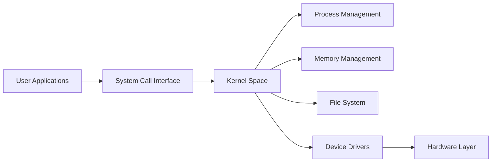
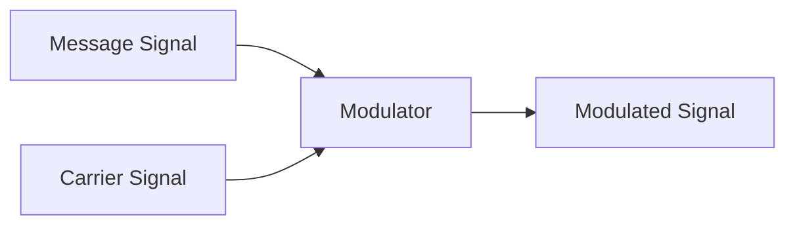
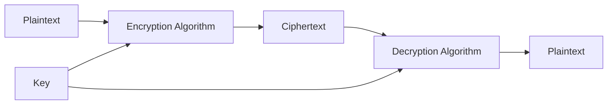

## Question 1(a) [3 marks]

**Differentiate between Information and Knowledge.**

**Answer**:

| **Aspect** | **Information** | **Knowledge** |
|------------|-----------------|---------------|
| **Definition** | Raw facts and figures | Processed information with understanding |
| **Processing** | Data that is organized | Information combined with experience |
| **Application** | Can be shared easily | Requires interpretation and context |

- **Information**: Raw facts, data, and figures that can be processed
- **Knowledge**: Understanding gained through experience and learning

**Mnemonic:** "Information Informs, Knowledge Knows"

## Question 1(b) [4 marks]

**Explain Functions of OS.**

**Answer**:

**Primary Functions of Operating System:**

| **Function** | **Description** |
|--------------|-----------------|
| **Process Management** | Controls execution of programs |
| **Memory Management** | Allocates and deallocates memory |
| **File Management** | Organizes and manages files |
| **Device Management** | Controls input/output devices |

- **Process Control**: Scheduling and managing running programs
- **Resource Allocation**: Distributing system resources efficiently
- **User Interface**: Providing interaction between user and computer

**Mnemonic:** "PMFD - Process, Memory, File, Device"

## Question 1(c) [7 marks]

**Define Universal gate and Build Basic gate using NAND Universal gate.**

**Answer**:

**Universal Gate Definition:**
A logic gate that can implement any Boolean function without using any other type of gate.

**NAND Gate Truth Table:**

| A | B | NAND Output |
|---|---|-------------|
| 0 | 0 | 1 |
| 0 | 1 | 1 |
| 1 | 0 | 1 |
| 1 | 1 | 0 |

**Basic Gates using NAND:**

```goat
NOT Gate using NAND:
A ----+
      |
      NAND ---- Output (NOT A)
      |
A ----+

AND Gate using NAND:
A ----+
      |
      NAND ---- NAND ---- Output (A AND B)
      |
B ----+

OR Gate using NAND:
A ---- NAND ----+
                |
                NAND ---- Output (A OR B)
                |
B ---- NAND ----+
```

- **NOT**: Single input to both NAND inputs
- **AND**: NAND followed by NOT (another NAND)
- **OR**: NOT both inputs, then NAND result

**Mnemonic:** "NAND Needs Another NAND Definitely"

## Question 1(c OR) [7 marks]

**Perform Following Conversion:**

**Answer**:

**Conversion Solutions:**

| **From** | **To** | **Process** | **Result** |
|----------|--------|-------------|------------|
| (1456)₈ | Base 16 | 8→10→16 | (32E)₁₆ |
| (1011)₂ | Base 10 | Binary to Decimal | (11)₁₀ |
| (247.38)₁₀ | Base 8 | Integer and Fraction separately | (367.3)₈ |

**Detailed Solutions:**

1) **(1456)₈ = (32E)₁₆**
   - 1×8³ + 4×8² + 5×8¹ + 6×8⁰ = 512 + 256 + 40 + 6 = (814)₁₀
   - 814 ÷ 16 = 50 remainder 14(E), 50 ÷ 16 = 3 remainder 2
   - Result: (32E)₁₆

2) **(1011)₂ = (11)₁₀**
   - 1×2³ + 0×2² + 1×2¹ + 1×2⁰ = 8 + 0 + 2 + 1 = (11)₁₀

3) **(247.38)₁₀ = (367.3)₈**
   - Integer: 247 ÷ 8 = 30 remainder 7, 30 ÷ 8 = 3 remainder 6, 3 ÷ 8 = 0 remainder 3
   - Fraction: 0.38 × 8 = 3.04 (take 3)
   - Result: (367.3)₈

**Mnemonic:** "Convert Carefully, Check Calculations"

## Question 2(a) [3 marks]

**List out types of Memory.**

**Answer**:

**Memory Classification:**

| **Type** | **Examples** | **Characteristics** |
|----------|--------------|-------------------|
| **Primary Memory** | RAM, ROM, Cache | Directly accessible by CPU |
| **Secondary Memory** | HDD, SSD, CD/DVD | Non-volatile storage |
| **Cache Memory** | L1, L2, L3 | High-speed buffer memory |

- **Volatile**: Loses data when power off (RAM)
- **Non-volatile**: Retains data without power (ROM, HDD)
- **Access Speed**: Cache > RAM > Secondary Storage

**Mnemonic:** "Primary Processes, Secondary Stores"

## Question 2(b) [4 marks]

**Differentiate Kernel Mode Vs User Mode.**

**Answer**:

| **Aspect** | **Kernel Mode** | **User Mode** |
|------------|-----------------|---------------|
| **Privilege Level** | Full system access | Restricted access |
| **Instructions** | All instructions allowed | Limited instruction set |
| **Memory Access** | Complete memory access | Limited memory regions |
| **System Calls** | Direct hardware access | Through system calls only |

- **Kernel Mode**: Operating system runs with full privileges
- **User Mode**: Applications run with limited privileges
- **Security**: Mode switching prevents unauthorized access

**Mnemonic:** "Kernel Controls, User Consumes"

## Question 2(c) [7 marks]

**List out types of OS and Explain any two OS**

**Answer**:

**Types of Operating Systems:**

| **Type** | **Examples** | **Characteristics** |
|----------|--------------|-------------------|
| **Batch OS** | Early mainframes | No user interaction |
| **Time-sharing OS** | UNIX, Linux | Multiple users simultaneously |
| **Real-time OS** | Embedded systems | Guaranteed response time |
| **Distributed OS** | Cloud systems | Multiple connected computers |
| **Network OS** | Windows Server | Network resource management |
| **Mobile OS** | Android, iOS | Smartphone/tablet systems |

**Detailed Explanation:**

**1. Time-sharing OS (Linux):**

- **Multi-user**: Multiple users can access simultaneously
- **Multi-tasking**: Runs multiple processes concurrently
- **Resource Sharing**: CPU time divided among processes
- **Examples**: UNIX, Linux, Windows

**2. Real-time OS:**

- **Deterministic**: Guaranteed response within time limits
- **Priority-based**: Critical tasks get higher priority
- **Applications**: Medical devices, industrial control
- **Types**: Hard real-time and Soft real-time

**Mnemonic:** "Time Ticks, Real-time Reacts"

## Question 2(a OR) [3 marks]

**Explain Architecture of Linux Operating System.**

**Answer**:

**Linux Architecture Layers:**



- **User Space**: Applications and user programs
- **System Calls**: Interface between user and kernel
- **Kernel**: Core operating system functions

**Mnemonic:** "Users Use, Kernel Controls"

## Question 2(b OR) [4 marks]

**Explain Working of Search Engine.**

**Answer**:

**Search Engine Working Process:**

| **Step** | **Process** | **Function** |
|----------|-------------|--------------|
| **Crawling** | Web spiders scan websites | Discovers web pages |
| **Indexing** | Analyzes and stores content | Creates searchable database |
| **Ranking** | Applies algorithms | Determines relevance order |
| **Retrieval** | Returns results | Displays ranked results |

**Working Steps:**

- **Web Crawlers**: Automated bots scan internet content
- **Index Database**: Stores and organizes webpage information
- **Query Processing**: Analyzes user search terms
- **Result Ranking**: Uses algorithms to order results by relevance

**Mnemonic:** "Crawl, Index, Rank, Retrieve"

## Question 2(c OR) [7 marks]

**Difference between Open Source Software and Proprietary Software.**

**Answer**:

| **Aspect** | **Open Source Software** | **Proprietary Software** |
|------------|---------------------------|---------------------------|
| **Source Code** | Freely available and modifiable | Closed and protected |
| **Cost** | Usually free | Requires license purchase |
| **Support** | Community-based | Vendor-provided |
| **Customization** | Fully customizable | Limited customization |
| **Examples** | Linux, Firefox, LibreOffice | Windows, MS Office, Photoshop |
| **Security** | Transparent, community-audited | Security through obscurity |
| **Updates** | Community-driven | Vendor-controlled |

**Key Differences:**

- **Licensing**: Open source allows redistribution and modification
- **Cost Model**: Open source typically free vs. proprietary paid
- **Development**: Community collaboration vs. company-controlled
- **Transparency**: Open source code visible vs. proprietary hidden

**Advantages:**

- **Open Source**: Cost-effective, customizable, secure
- **Proprietary**: Professional support, integrated features, user-friendly

**Mnemonic:** "Open Opens, Proprietary Protects"

## Question 3(a) [3 marks]

**Give full form of the following: OSI, LLC, FTP**

**Answer**:

**Full Forms:**

| **Abbreviation** | **Full Form** |
|------------------|---------------|
| **OSI** | Open Systems Interconnection |
| **LLC** | Logical Link Control |
| **FTP** | File Transfer Protocol |

- **OSI**: Networking reference model with 7 layers
- **LLC**: Sublayer of Data Link Layer in OSI model
- **FTP**: Protocol for transferring files over network

**Mnemonic:** "Open Logic Files"

## Question 3(b) [4 marks]

**Give advantages and disadvantages of Twisted Pair Cable.**

**Answer**:

**Twisted Pair Cable Analysis:**

| **Advantages** | **Disadvantages** |
|----------------|-------------------|
| **Low Cost** | **Limited Distance** |
| **Easy Installation** | **Electromagnetic Interference** |
| **Flexible** | **Lower Bandwidth** |
| **Widely Available** | **Security Issues** |

**Advantages:**

- **Cost-effective**: Cheapest networking cable option
- **Easy Installation**: Simple to install and maintain
- **Flexibility**: Can be bent and routed easily

**Disadvantages:**

- **Distance Limitation**: Maximum 100 meters without repeater
- **Interference**: Susceptible to electromagnetic interference
- **Bandwidth**: Lower data transmission rates compared to fiber

**Mnemonic:** "Twisted is Cheap but Limited"

## Question 3(c) [7 marks]

**What is Modulation? Explain Analog Modulation.**

**Answer**:

**Modulation Definition:**
Process of varying carrier signal characteristics to transmit information over long distances.

**Analog Modulation Types:**

| **Type** | **Parameter Varied** | **Application** |
|----------|---------------------|----------------|
| **AM** | Amplitude | Radio broadcasting |
| **FM** | Frequency | FM radio, TV sound |
| **PM** | Phase | Digital communications |

**Amplitude Modulation (AM):**



**Key Concepts:**

- **Carrier Wave**: High-frequency signal for transmission
- **Message Signal**: Information to be transmitted
- **Modulation Index**: Degree of modulation applied

**Applications:**

- **AM Radio**: 530-1710 kHz frequency band
- **FM Radio**: 88-108 MHz frequency band
- **Television**: Various modulation techniques

**Advantages:**

- **Long Distance**: Enables long-range communication
- **Noise Immunity**: FM provides better noise resistance

**Mnemonic:** "Amplitude Alters, Frequency Fluctuates"

## Question 3(a OR) [3 marks]

**List out Network Topologies. Write Advantages and Disadvantages of Bus Topology.**

**Answer**:

**Network Topologies:**

- **Bus Topology**
- **Star Topology**
- **Ring Topology**
- **Mesh Topology**
- **Hybrid Topology**

**Bus Topology Analysis:**

| **Advantages** | **Disadvantages** |
|----------------|-------------------|
| **Simple Design** | **Single Point of Failure** |
| **Cost-effective** | **Limited Cable Length** |
| **Easy to Expand** | **Performance Degradation** |

**Mnemonic:** "Bus is Simple but Single-failure-prone"

## Question 3(b OR) [4 marks]

**Differentiate Serial and Parallel Transmission.**

**Answer**:

| **Aspect** | **Serial Transmission** | **Parallel Transmission** |
|------------|-------------------------|---------------------------|
| **Data Path** | Single communication line | Multiple lines simultaneously |
| **Speed** | Slower for short distances | Faster for short distances |
| **Cost** | Lower cost | Higher cost |
| **Distance** | Suitable for long distances | Limited to short distances |

**Characteristics:**

- **Serial**: Bits transmitted one after another
- **Parallel**: Multiple bits transmitted simultaneously
- **Applications**: Serial for networks, Parallel for internal buses

**Mnemonic:** "Serial Single-file, Parallel Processes"

## Question 3(c OR) [7 marks]

**Explain Transmission Modes.**

**Answer**:

**Transmission Modes Classification:**

| **Mode** | **Direction** | **Examples** | **Applications** |
|----------|---------------|--------------|------------------|
| **Simplex** | One-way only | Radio, TV broadcast | Broadcasting |
| **Half-duplex** | Two-way, not simultaneous | Walkie-talkie | Turn-based communication |
| **Full-duplex** | Two-way simultaneous | Telephone | Real-time communication |

**Detailed Explanation:**

**1. Simplex Mode:**

- **Unidirectional**: Data flows in one direction only
- **Examples**: Television broadcasting, radio transmission
- **Advantage**: Simple implementation
- **Disadvantage**: No feedback possible

**2. Half-duplex Mode:**

- **Bidirectional**: Data can flow both ways, but not simultaneously
- **Examples**: Walkie-talkies, CB radio
- **Advantage**: Two-way communication with single channel
- **Disadvantage**: Cannot send and receive simultaneously

**3. Full-duplex Mode:**

- **Simultaneous Bidirectional**: Data flows both ways at same time
- **Examples**: Telephone conversations, modern networks
- **Advantage**: Efficient real-time communication
- **Disadvantage**: Requires more complex implementation

**Mnemonic:** "Simplex Single, Half-duplex Halts, Full-duplex Flows"

## Question 4(a) [3 marks]

**Draw Crossover Ethernet Cable.**

**Answer**:

**Crossover Cable Wiring Diagram:**

```goat
RJ-45 Connector A          RJ-45 Connector B
Pin 1: White-Orange  <---> Pin 3: White-Green
Pin 2: Orange        <---> Pin 6: Green
Pin 3: White-Green   <---> Pin 1: White-Orange
Pin 4: Blue          <---> Pin 4: Blue
Pin 5: White-Blue    <---> Pin 5: White-Blue
Pin 6: Green         <---> Pin 2: Orange
Pin 7: White-Brown   <---> Pin 7: White-Brown
Pin 8: Brown         <---> Pin 8: Brown
```

**Key Points:**

- **Purpose**: Direct connection between similar devices
- **Crossed Pairs**: Transmit and receive pairs are swapped
- **Usage**: PC to PC, Switch to Switch connections

**Mnemonic:** "Cross Connects Computers"

## Question 4(b) [4 marks]

**Difference between IPv4 and IPv6.**

**Answer**:

| **Feature** | **IPv4** | **IPv6** |
|-------------|----------|----------|
| **Address Size** | 32 bits | 128 bits |
| **Address Format** | Dotted decimal | Hexadecimal colon |
| **Address Space** | 4.3 billion addresses | 340 undecillion addresses |
| **Header Size** | Variable (20-60 bytes) | Fixed (40 bytes) |

**Key Differences:**

- **IPv4 Example**: 192.168.1.1
- **IPv6 Example**: 2001:0db8:85a3:0000:0000:8a2e:0370:7334
- **Security**: IPv6 has built-in IPSec support
- **NAT**: IPv4 requires NAT, IPv6 eliminates need

**Mnemonic:** "IPv4 Four-billion, IPv6 Six-teen-times-more"

## Question 4(c) [7 marks]

**Draw neat and clean figure of OSI Model and write down the functionality of Physical Layer and Data Link Layer.**

**Answer**:

**OSI Model Diagram:**


**Layer Functions:**

| **Layer** | **Function** | **Examples** |
|-----------|--------------|--------------|
| **Physical (Layer 1)** | Bit transmission over medium | Cables, hubs, repeaters |
| **Data Link (Layer 2)** | Frame delivery between adjacent nodes | Switches, MAC addresses |

**Physical Layer Functions:**

- **Bit Transmission**: Converts data into electrical/optical signals
- **Medium Specification**: Defines cable types and connectors
- **Signal Encoding**: Determines how bits are represented
- **Transmission Rate**: Controls data speed

**Data Link Layer Functions:**

- **Frame Formation**: Organizes bits into frames
- **Error Detection**: Identifies transmission errors
- **Flow Control**: Manages data transmission rate
- **MAC Addressing**: Uses hardware addresses for local delivery

**Mnemonic:** "Physical Pushes, Data-Link Delivers"

## Question 4(a OR) [3 marks]

**Explain Time Division Multiplexing.**

**Answer**:

**Time Division Multiplexing (TDM):**

```mermaid
gantt
    title TDM Time Slots
    dateFormat X
    axisFormat %L
    
    section Channel A
    Data A1 :0, 100
    Data A2 :300, 400
    
    section Channel B
    Data B1 :100, 200
    Data B2 :400, 500
    
    section Channel C
    Data C1 :200, 300
    Data C2 :500, 600
```



**TDM Characteristics:**

- **Time Slots**: Each channel gets dedicated time period
- **Synchronization**: All channels must be synchronized
- **Bandwidth Sharing**: Single high-speed link shared among multiple channels

**Mnemonic:** "Time Takes Turns"

## Question 4(b OR) [4 marks]

**List out types of Networking Device and Explain any one.**

**Answer**:

**Networking Devices:**

| **Device** | **Layer** | **Function** |
|------------|-----------|--------------|
| **Hub** | Physical | Signal repeater |
| **Switch** | Data Link | Frame switching |
| **Router** | Network | Packet routing |
| **Bridge** | Data Link | Network segmentation |

**Switch Explanation:**

- **Function**: Forwards frames based on MAC addresses
- **Learning**: Builds MAC address table dynamically
- **Collision Domain**: Each port creates separate collision domain
- **Full-duplex**: Simultaneous send/receive on each port

**Advantages:**

- **Bandwidth**: Full bandwidth per port
- **Security**: Frames sent only to intended recipient
- **Collision**: Eliminates collisions

**Mnemonic:** "Switch Smartly Sends"

## Question 4(c OR) [7 marks]

**What is Computer Network? Explain types of Computer Network.**

**Answer**:

**Computer Network Definition:**
Interconnected collection of autonomous computers that can communicate and share resources.

**Types of Computer Networks:**

| **Type** | **Coverage** | **Examples** | **Characteristics** |
|----------|--------------|--------------|-------------------|
| **LAN** | Local area (building) | Office network | High speed, low cost |
| **MAN** | Metropolitan area (city) | City-wide network | Medium speed, moderate cost |
| **WAN** | Wide area (country/world) | Internet | Lower speed, high cost |

**Detailed Explanation:**

**1. Local Area Network (LAN):**

- **Coverage**: Single building or campus
- **Speed**: High (100 Mbps to 10 Gbps)
- **Technology**: Ethernet, Wi-Fi
- **Ownership**: Single organization

**2. Metropolitan Area Network (MAN):**

- **Coverage**: City or metropolitan area
- **Speed**: Medium (10-100 Mbps)
- **Technology**: Fiber optic, microwave
- **Examples**: Cable TV networks

**3. Wide Area Network (WAN):**

- **Coverage**: Countries or continents
- **Speed**: Variable (depends on technology)
- **Technology**: Satellite, leased lines
- **Examples**: Internet, corporate networks

**Network Benefits:**

- **Resource Sharing**: Files, printers, applications
- **Communication**: Email, messaging, video conferencing
- **Cost Reduction**: Shared resources reduce costs
- **Data Backup**: Centralized backup systems

**Mnemonic:** "Local Loves, Metro Manages, Wide Wanders"

## Question 5(a) [3 marks]

**Explain the need for information security.**

**Answer**:

**Information Security Needs:**

| **Threat** | **Impact** | **Protection Need** |
|------------|------------|-------------------|
| **Data Theft** | Financial loss | Confidentiality |
| **Unauthorized Access** | Privacy breach | Access control |
| **System Attacks** | Service disruption | Availability |

**Key Requirements:**

- **Confidentiality**: Protecting sensitive information from unauthorized access
- **Data Protection**: Preventing loss or corruption of valuable data
- **Business Continuity**: Ensuring systems remain operational

**Mnemonic:** "Security Secures Sensitive Systems"

## Question 5(b) [4 marks]

**Write advantages and disadvantages of Fiber Optic Cable.**

**Answer**:

| **Advantages** | **Disadvantages** |
|----------------|-------------------|
| **High Bandwidth** | **High Cost** |
| **Immunity to EMI** | **Difficult Installation** |
| **Long Distance** | **Fragile Nature** |
| **Secure Transmission** | **Specialized Equipment** |

**Advantages:**

- **Speed**: Highest data transmission rates
- **Distance**: Can span long distances without signal degradation
- **Security**: Difficult to tap, providing secure communication

**Disadvantages:**

- **Cost**: Expensive cable and equipment
- **Installation**: Requires skilled technicians
- **Maintenance**: Difficult to repair and splice

**Mnemonic:** "Fiber is Fast but Fragile"

## Question 5(c) [7 marks]

**List out types of Attack. And Explain any two web based attack.**

**Answer**:

**Types of Attacks:**

| **Category** | **Attack Types** | **Target** |
|--------------|------------------|------------|
| **Web-based** | SQL Injection, XSS, CSRF | Web applications |
| **Network** | DoS, DDoS, Man-in-Middle | Network infrastructure |
| **Malware** | Virus, Trojan, Ransomware | Systems and data |
| **Social** | Phishing, Social Engineering | Human users |

**Web-based Attacks Explained:**

**1. SQL Injection:**

- **Method**: Inserting malicious SQL code into web application inputs
- **Impact**: Unauthorized database access, data theft
- **Example**: Entering `'; DROP TABLE users;--` in login form
- **Prevention**: Input validation, parameterized queries
- **Severity**: Can compromise entire database

**2. Cross-Site Scripting (XSS):**

- **Method**: Injecting malicious scripts into web pages
- **Impact**: Session hijacking, cookie theft, page defacement
- **Types**: Stored XSS, Reflected XSS, DOM-based XSS
- **Prevention**: Input sanitization, output encoding
- **Target**: Affects users visiting compromised websites

**Attack Characteristics:**

- **SQL Injection**: Targets database through web application
- **XSS**: Targets users through compromised web pages
- **Common Factor**: Both exploit insufficient input validation

**Prevention Measures:**

- **Input Validation**: Check all user inputs
- **Regular Updates**: Keep software and systems updated
- **Security Training**: Educate users about attack methods

**Mnemonic:** "SQL Steals, XSS eXploits Scripts"

## Question 5(a OR) [3 marks]

**Explain Confidentiality, Integrity and Availability.**

**Answer**:

**CIA Triad Components:**

| **Component** | **Definition** | **Examples** |
|---------------|----------------|--------------|
| **Confidentiality** | Information access only by authorized users | Encryption, access controls |
| **Integrity** | Data accuracy and completeness | Checksums, digital signatures |
| **Availability** | Systems accessible when needed | Redundancy, backup systems |

**Key Concepts:**

- **Confidentiality**: Keeps information secret from unauthorized users
- **Integrity**: Ensures data hasn't been modified without authorization
- **Availability**: Guarantees systems are operational when required

**Mnemonic:** "CIA Completely Protects Information"

## Question 5(b OR) [4 marks]

**Find class of following IP addresses.**

**Answer**:

**IP Address Class Identification:**

| **IP Address** | **First Octet** | **Class** | **Range** |
|----------------|-----------------|-----------|-----------|
| **192.12.44.12** | 192 | Class C | 192-223 |
| **123.77.42.213** | 123 | Class A | 1-126 |
| **190.65.22.15** | 190 | Class B | 128-191 |
| **10.0.0.11** | 10 | Class A (Private) | 1-126 |

**Class Characteristics:**

- **Class A**: 1-126 (first bit 0), supports large networks
- **Class B**: 128-191 (first two bits 10), medium networks  
- **Class C**: 192-223 (first three bits 110), small networks
- **Private IPs**: 10.x.x.x, 172.16-31.x.x, 192.168.x.x

**Mnemonic:** "A is Awesome, B is Better, C is Compact"

## Question 5(c OR) [7 marks]

**Explain Cryptography.**

**Answer**:

**Cryptography Definition:**
Science of securing communication through encoding information so only authorized parties can access it.

**Cryptography Types:**

| **Type** | **Key Usage** | **Examples** | **Applications** |
|----------|---------------|--------------|------------------|
| **Symmetric** | Single shared key | DES, AES | Fast bulk encryption |
| **Asymmetric** | Public-private key pair | RSA, ECC | Digital signatures, key exchange |
| **Hash Functions** | One-way transformation | MD5, SHA | Data integrity, passwords |

**Key Concepts:**

**1. Symmetric Cryptography:**

- **Single Key**: Same key for encryption and decryption
- **Speed**: Fast processing for large amounts of data
- **Challenge**: Secure key distribution
- **Examples**: AES-256, 3DES

**2. Asymmetric Cryptography:**

- **Key Pairs**: Public key (shareable) and private key (secret)
- **Digital Signatures**: Proves authenticity and non-repudiation
- **Key Exchange**: Secure method to share symmetric keys
- **Examples**: RSA, Elliptic Curve Cryptography

**3. Hash Functions:**

- **One-way**: Easy to compute hash, difficult to reverse
- **Fixed Output**: Always produces same length output
- **Collision Resistance**: Different inputs should produce different hashes
- **Applications**: Password storage, digital forensics

**Cryptographic Process:**



**Applications:**

- **Secure Communication**: HTTPS, VPN, email encryption
- **Data Protection**: File encryption, database security
- **Authentication**: Digital certificates, password hashing
- **Financial Systems**: Online banking, cryptocurrency

**Modern Challenges:**

- **Quantum Computing**: Threat to current encryption methods
- **Key Management**: Secure storage and distribution of keys
- **Performance**: Balancing security with system performance

**Mnemonic:** "Cryptography Creates Coded Communications"
