## પ્રશ્ન 1(a) [3 ગુણ]

**NAND લૉજિક ગેટ સમજાવો.**

**જવાબ**:

NAND ગેટ એક યુનિવર્સલ લૉજિક ગેટ છે જે માત્ર ત્યારે જ 0 આઉટપુટ આપે છે જ્યારે બધા ઇનપુટ્સ 1 હોય.

**ટ્રુથ ટેબલ:**

| A | B | Y = A NAND B |
|---|---|--------------|
| 0 | 0 | 1           |
| 0 | 1 | 1           |
| 1 | 0 | 1           |
| 1 | 1 | 0           |

**સિમ્બોલ:**

```goat
    A ----+---D>o--- Y
          |   |
    B ----+   |
              |
```

- **NAND ફંક્શન**: આઉટપુટ એ AND ઓપરેશનનું કમ્પલિમેન્ટ છે
- **યુનિવર્સલ ગેટ**: કોઈપણ લૉજિક ફંક્શન બનાવી શકે છે
- **લો પાવર**: IC ડિઝાઇનમાં ઓછા ટ્રાન્ઝિસ્ટરની જરૂર

**મેમરી ટ્રીક:** "NOT AND = NAND"

## પ્રશ્ન 1(b) [4 ગુણ]

**AND લૉજિક ગેટ ફક્ત NOR ગેટ વાપરીને દોરો.**

**જવાબ**:

AND ગેટને NOR ગેટ્સ વાપરીને ડી મોર્ગનના થિયરમ લાગુ કરીને બનાવી શકાય છે.

**સર્કિટ ડાયાગ્રામ:**

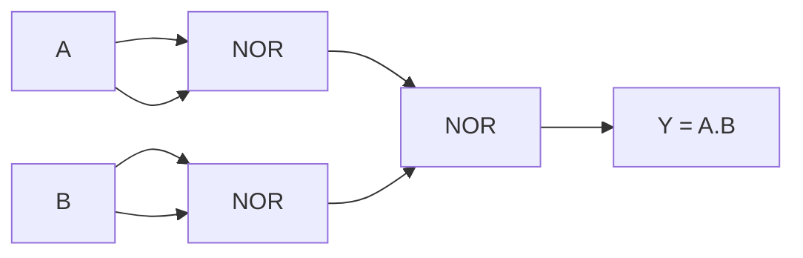

**અમલીકરણના પગલાં:**

- **પગલું 1**: NOR ગેટ વાપરીને NOT A બનાવો (A NOR A = A')
- **પગલું 2**: NOR ગેટ વાપરીને NOT B બનાવો (B NOR B = B')
- **પગલું 3**: ડી મોર્ગન લાગુ કરો: A.B = (A' + B')'
- **અંતિમ આઉટપુટ**: A AND B

**મેમરી ટ્રીક:** "ડબલ ઇન્વર્શન ઓરિજિનલ ફંક્શન આપે છે"

## પ્રશ્ન 1(c) [7 ગુણ]

**ઇન્ફોર્મેશન સિસ્ટમના ઘટકો આકૃતિ સાથે સમજાવો.**

**જવાબ**:

ઇન્ફોર્મેશન સિસ્ટમમાં પાંચ મુખ્ય ઘટકો છે જે ડેટાને ઉપયોગી માહિતીમાં બદલવા માટે સાથે કામ કરે છે.

**સિસ્ટમ ડાયાગ્રામ:**

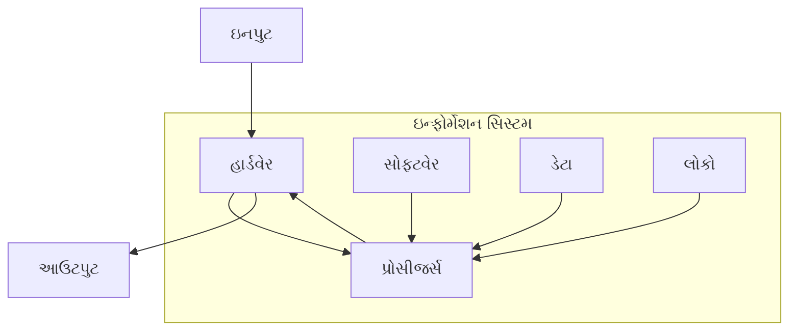

**ઘટકો:**

| ઘટક | વર્ણન | ઉદાહરણો |
|------|--------|----------|
| **હાર્ડવેર** | ભૌતિક ઉપકરણો | CPU, મેમરી, કીબોર્ડ |
| **સોફ્ટવેર** | પ્રોગ્રામ્સ અને એપ્લિકેશન્સ | OS, એપ્લિકેશન્સ, યુટિલિટીઝ |
| **ડેટા** | કાચા તથ્યો અને આંકડાઓ | નંબરો, ટેક્સ્ટ, ઇમેજીસ |
| **પ્રોસીજર્સ** | નિયમો અને સૂચનાઓ | યુઝર મેન્યુઅલ્સ, SOPs |
| **લોકો** | વપરાશકર્તાઓ અને ઓપરેટર્સ | એન્ડ યુઝર્સ, IT સ્ટાફ |

- **ઇનપુટ પ્રોસેસિંગ**: ડેટા હાર્ડવેર દ્વારા પ્રવેશે છે
- **સ્ટોરેજ મેનેજમેન્ટ**: ડેટા કાર્યક્ષમતાથી સ્ટોર અને રિટ્રીવ થાય છે
- **આઉટપુટ જનરેશન**: માહિતી વપરાશકર્તાઓને પ્રસ્તુત કરવામાં આવે છે
- **ઇન્ટીગ્રેશન**: બધા ઘટકો સમન્વયથી કામ કરે છે

**મેમરી ટ્રીક:** "હાર્ડવેર સપોર્ટ્સ ડેટા પ્રોસેસિંગ પીપલ"

## પ્રશ્ન 1(c OR) [7 ગુણ]

**Google Search Engine ની કાર્યપદ્ધતિ ઉદાહરણ સાથે સમજાવો.**

**જવાબ**:

Google Search Engine વપરાશકર્તાના ક્વેરીઝના આધારે વેબ પેજીસ શોધવા અને રેન્ક કરવા માટે જટિલ અલ્ગોરિધમ્સ વાપરે છે.

**કાર્યપ્રક્રિયા:**

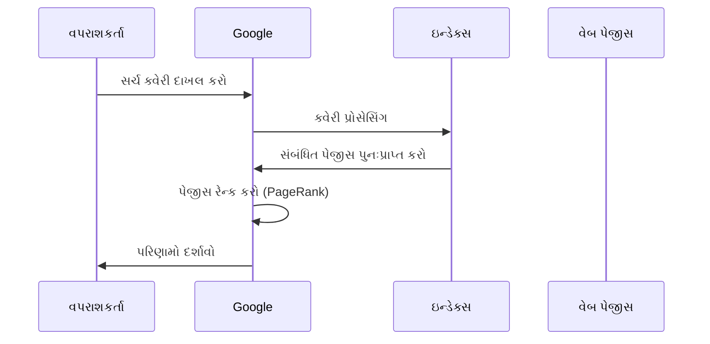

**મુખ્ય ઘટકો:**

| તબક્કો | પ્રક્રિયા | ઉદાહરણ |
|-------|---------|---------|
| **ક્રોલિંગ** | વેબ પેજીસ શોધો | Googlebot વેબસાઇટ્સની મુલાકાત લે છે |
| **ઇન્ડેક્સિંગ** | પેજ કન્ટેન્ટ સ્ટોર કરો | કીવર્ડ્સ ડેટાબેઝમાં સ્ટોર થાય છે |
| **રેન્કિંગ** | પ્રાસંગિકતા પ્રમાણે ક્રમાંકિત કરો | PageRank અલ્ગોરિધમ |
| **સર્વિંગ** | પરિણામો પ્રદર્શિત કરો | સર્ચ રિઝલ્ટ પેજ |

**ઉદાહરણ સર્ચ પ્રક્રિયા:**

- **ક્વેરી**: "Introduction to IT Systems"
- **પ્રોસેસિંગ**: કીવર્ડ્સ પાર્સ કરો, ઇન્ડેક્સ ચેક કરો
- **રેન્કિંગ**: શૈક્ષણિક સાઇટ્સને વધુ રેન્ક આપો
- **પરિણામો**: GTU સિલેબસ, ટ્યુટોરિયલ્સ, કોર્સીસ

- **PageRank અલ્ગોરિધમ**: લિંક્સ પેજની મહત્વતા નક્કી કરે છે
- **મશીન લર્નિંગ**: સમય જતાં સર્ચ અચોક્કસતા સુધારે છે
- **રીઅલ-ટાઇમ અપડેટ્સ**: નવા કન્ટેન્ટને પ્રાથમિકતા

**મેમરી ટ્રીક:** "ક્રોલ ઇન્ડેક્સ રેન્ક સર્વ"

## પ્રશ્ન 2(a) [3 ગુણ]

**રૂપાંતરણ (16.75)10= ( )8**

**જવાબ**:

દશાંશ 16.75 ને અષ્ટાંશમાં રૂપાંતરિત કરવા માટે પૂર્ણાંક અને દશાંશ ભાગનું અલગ રૂપાંતરણ જરૂરી છે.

**પૂર્ણાંક ભાગનું રૂપાંતરણ (16):**

| ભાગાકાર | ભાગફળ | શેષ |
|----------|--------|-----|
| 16 ÷ 8   | 2      | 0   |
| 2 ÷ 8    | 0      | 2   |

**દશાંશ ભાગનું રૂપાંતરણ (0.75):**

| ગુણાકાર | પૂર્ણાંક ભાગ |
|----------|--------------|
| 0.75 × 8 = 6.0 | 6 |

**અંતિમ જવાબ**: (16.75)10 = (20.6)8

**ચકાસણી**: 2×8¹ + 0×8⁰ + 6×8⁻¹ = 16 + 0 + 0.75 = 16.75 ✓

**મેમરી ટ્રીક:** "પૂર્ણાંકનો ભાગાકાર, દશાંશનો ગુણાકાર"

## પ્રશ્ન 2(b) [4 ગુણ]

**મલ્ટિપ્રોસેસિંગ ઓપરેટિંગ સિસ્ટમ સમજાવો.**

**જવાબ**:

મલ્ટિપ્રોસેસિંગ OS એકસાથે કામ કરતા બહુવિધ પ્રોસેસર્સનું સંચાલન કરીને પ્રોસેસીસ એક્ઝીક્યુટ કરે છે.

**આર્કિટેક્ચર ડાયાગ્રામ:**

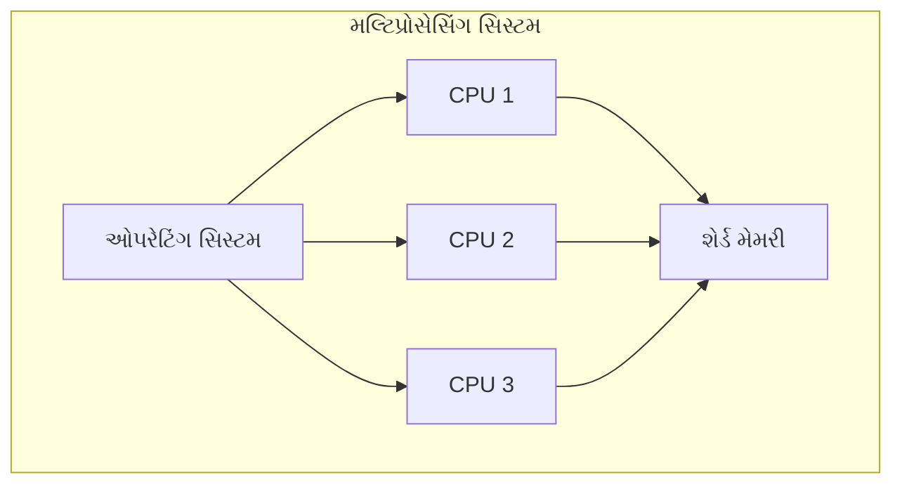

**મુખ્ય લક્ષણો:**

| લક્ષણ | વર્ણન | ફાયદો |
|-------|--------|-------|
| **પેરેલલ પ્રોસેસિંગ** | બહુવિધ CPUs સાથે કામ કરે છે | ઝડપી એક્ઝીક્યુશન |
| **લોડ બેલેન્સિંગ** | કાર્યો સમાનરૂપે વિતરિત કરે છે | શ્રેષ્ઠ રિસોર્સ ઉપયોગ |
| **ફૉલ્ટ ટોલરન્સ** | એક CPU ફેઇલ થાય તો સિસ્ટમ ચાલુ રહે છે | વધુ વિશ્વસનીયતા |
| **શેર્ડ રિસોર્સીસ** | સામાન્ય મેમરી અને I/O ઉપકરણો | ખર્ચ અસરકારક |

- **સિમેટ્રિક મલ્ટિપ્રોસેસિંગ**: બધા પ્રોસેસર્સને સમાન એક્સેસ
- **પ્રોસેસ સિન્ક્રોનાઇઝેશન**: પ્રોસેસર્સ વચ્ચે સમન્વય
- **વર્ધિત પ્રદર્શન**: પ્રોસેસર કાઉન્ટ સાથે લિનિયર સ્પીડઅપ

**મેમરી ટ્રીક:** "મલ્ટિપલ પ્રોસેસર્સ પેરેલલ પ્રોસેસ"

## પ્રશ્ન 2(c) [7 ગુણ]

**ઓપરેટિંગ સિસ્ટમની વ્યાખ્યા આપો. ઓપરેટિંગ સિસ્ટમના કાર્યોની યાદી બનાવો અને સમજાવો.**

**જવાબ**:

**વ્યાખ્યા**: ઓપરેટિંગ સિસ્ટમ એ સિસ્ટમ સોફ્ટવેર છે જે કમ્પ્યુટર હાર્ડવેરનું સંચાલન કરે છે અને એપ્લિકેશન પ્રોગ્રામ્સને સેવાઓ પૂરી પાડે છે.

**મુખ્ય કાર્યો:**

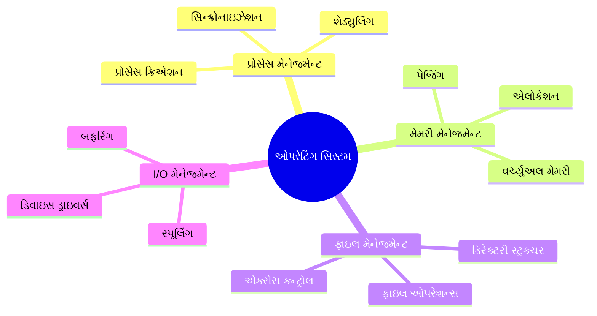

**વિગતવાર કાર્યો:**

| કાર્ય | વર્ણન | ઉદાહરણો |
|------|--------|----------|
| **પ્રોસેસ મેનેજમેન્ટ** | પ્રોગ્રામ એક્ઝીક્યુશનનું નિયંત્રણ | ટાસ્ક શેડ્યુલિંગ, મલ્ટિટાસ્કિંગ |
| **મેમરી મેનેજમેન્ટ** | RAM ને કાર્યક્ષમતાથી ફાળવે છે | વર્ચ્યુઅલ મેમરી, પેજિંગ |
| **ફાઇલ મેનેજમેન્ટ** | ડેટા સ્ટોરેજનું આયોજન | ફાઇલ સિસ્ટમ્સ, ડિરેક્ટરીઝ |
| **I/O મેનેજમેન્ટ** | ઇનપુટ/આઉટપુટ ઉપકરણોનું નિયંત્રણ | પ્રિન્ટર સ્પૂલિંગ, ડિસ્ક એક્સેસ |
| **સિક્યોરિટી** | સિસ્ટમ રિસોર્સીસનું રક્ષણ | યુઝર ઓથેન્ટિકેશન, એક્સેસ કન્ટ્રોલ |

- **રિસોર્સ એલોકેશન**: CPU ટાઇમ અને મેમરીનું વિતરણ
- **યુઝર ઇન્ટરફેસ**: કમાન્ડ લાઇન અથવા GUI ઇન્ટરેક્શન પૂરું પાડે છે
- **એરર હેન્ડલિંગ**: સિસ્ટમ ફેઇલ્યોર્સનું ગ્રેસફુલ મેનેજમેન્ટ
- **સિસ્ટમ કૉલ્સ**: એપ્લિકેશન્સ અને હાર્ડવેર વચ્ચે ઇન્ટરફેસ

**મેમરી ટ્રીક:** "પ્રોસેસ મેમરી ફાઇલ્સ ઇનપુટ-આઉટપુટ સિક્યોરિટી"

## પ્રશ્ન 2(a OR) [3 ગુણ]

**રૂપાંતરણ (1111111.11)2 = ( )10**

**જવાબ**:

દ્વિસંખ્યાને દશાંશમાં સ્થાનિક સંકેત પદ્ધતિ વાપરીને રૂપાંતરિત કરવું.

**રૂપાંતરણ ટેબલ:**

| સ્થાન | બિટ | ઘાત | મૂલ્ય |
|--------|-----|-----|-------|
| 6 | 1 | 2⁶ | 64 |
| 5 | 1 | 2⁵ | 32 |
| 4 | 1 | 2⁴ | 16 |
| 3 | 1 | 2³ | 8 |
| 2 | 1 | 2² | 4 |
| 1 | 1 | 2¹ | 2 |
| 0 | 1 | 2⁰ | 1 |
| -1 | 1 | 2⁻¹ | 0.5 |
| -2 | 1 | 2⁻² | 0.25 |

**ગણતરી**: 64 + 32 + 16 + 8 + 4 + 2 + 1 + 0.5 + 0.25 = 127.75

**અંતિમ જવાબ**: (1111111.11)2 = (127.75)10

**મેમરી ટ્રીક:** "બેની ઘાતાઓ એકસાથે ઉમેરો"

## પ્રશ્ન 2(b OR) [4 ગુણ]

**બેચ ઓપરેટિંગ સિસ્ટમ સમજાવો.**

**જવાબ**:

બેચ OS એક્ઝીક્યુશન દરમિયાન યુઝર ઇન્ટરેક્શન વિના જ જોબ્સને ગ્રૂપમાં પ્રોસેસ કરે છે.

**વર્કિંગ મોડલ:**

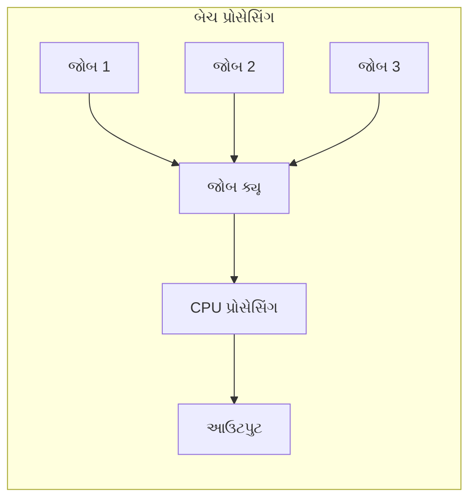

**લક્ષણો:**

| લક્ષણ | વર્ણન | અસર |
|-------|--------|-----|
| **કોઈ ઇન્ટરેક્શન નહીં** | જોબ્સ યુઝર ઇનપુટ વિના ચાલે છે | ઉચ્ચ થ્રુપુટ |
| **જોબ ક્યૂ** | બહુવિધ જોબ્સ ક્રમમાં રાહ જુએ છે | કાર્યક્ષમ પ્રોસેસિંગ |
| **ઓટોમેટિક શેડ્યુલિંગ** | OS આગળનો જોબ પસંદ કરે છે | ન્યૂનતમ ઓવરહેડ |
| **બેચ પ્રોસેસિંગ** | સમાન જોબ્સ એકસાથે ગ્રૂપ કરવામાં આવે છે | રિસોર્સ ઓપ્ટિમાઇઝેશન |

- **ફાયદાઓ**: ઉચ્ચ સિસ્ટમ ઉપયોગ, ખર્ચ અસરકારક
- **નુકસાનો**: કોઈ રીઅલ-ટાઇમ ઇન્ટરેક્શન નહીં, ડીબગિંગ મુશ્કેલી
- **એપ્લિકેશન્સ**: પેરોલ પ્રોસેસિંગ, ડેટા બેકઅપ સિસ્ટમ્સ

**મેમરી ટ્રીક:** "બેચ જોબ્સ ક્યૂ ઓટોમેટિકલી"

## પ્રશ્ન 2(c OR) [7 ગુણ]

**લિનક્સ સિસ્ટમનું આર્કિટેક્ચર અને મોડ્સ આકૃતિ સાથે સમજાવો.**

**જવાબ**:

લિનક્સ વિશિષ્ટ યુઝર અને કર્નલ મોડ્સ સાથે સ્તરીય આર્કિટેક્ચરને અનુસરે છે.

**સિસ્ટમ આર્કિટેક્ચર:**

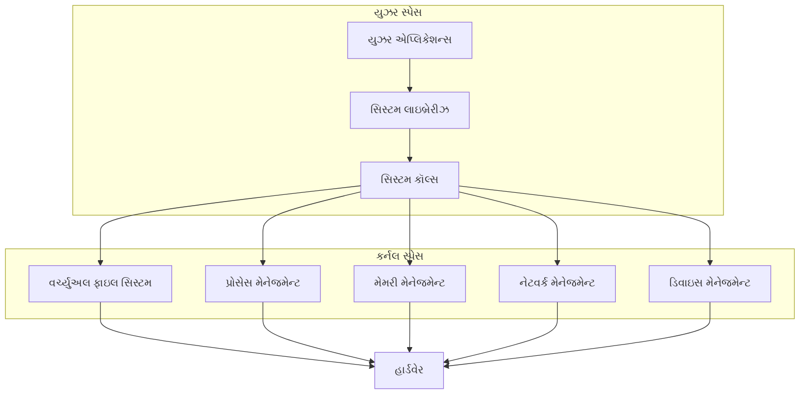

**ઓપરેટિંગ મોડ્સ:**

| મોડ | વર્ણન | એક્સેસ લેવલ |
|-----|--------|--------------|
| **યુઝર મોડ** | એપ્લિકેશન્સ અહીં ચાલે છે | મર્યાદિત વિશેષાધિકારો |
| **કર્નલ મોડ** | OS કોર ફંક્શન્સ | સંપૂર્ણ હાર્ડવેર એક્સેસ |
| **સિસ્ટમ કૉલ ઇન્ટરફેસ** | કમ્યુનિકેશન બ્રિજ | નિયંત્રિત સંક્રમણ |

**મુખ્ય ઘટકો:**

- **શેલ**: કમાન્ડ ઇન્ટરપ્રીટર ઇન્ટરફેસ
- **કર્નલ**: કોર સિસ્ટમ મેનેજમેન્ટ
- **ફાઇલ સિસ્ટમ**: હાયરાર્કિકલ ડેટા ઓર્ગેનાઇઝેશન
- **ડિવાઇસ ડ્રાઇવર્સ**: હાર્ડવેર એબ્સ્ટ્રેક્શન લેયર

- **સિક્યોરિટી મોડલ**: પરમિશન-આધારિત એક્સેસ કન્ટ્રોલ
- **મોડ્યુલેરિટી**: લોડેબલ કર્નલ મોડ્યુલ્સ લવચીકતા માટે
- **પોર્ટેબિલિટી**: બહુવિધ હાર્ડવેર પ્લેટફોર્મ પર ચાલે છે

**મેમરી ટ્રીક:** "યુઝર્સ કર્નલને હાર્ડવેર માટે કૉલ કરે છે"

## પ્રશ્ન 3(a) [3 ગુણ]

**ઓપન સોર્સ સોફ્ટવેર અને પ્રોપ્રાઇટરી સોફ્ટવેર વચ્ચે ફરક લખો.**

**જવાબ**:

**તુલના ટેબલ:**

| પાસું | ઓપન સોર્સ સોફ્ટવેર | પ્રોપ્રાઇટરી સોફ્ટવેર |
|------|-------------------|---------------------|
| **સોર્સ કોડ** | મુક્તપણે ઉપલબ્ધ | બંધ અને સુરક્ષિત |
| **કિંમત** | સામાન્યપણે મફત | કોમર્શિયલ લાઇસન્સ જરૂરી |
| **મોડિફિકેશન** | બદલી શકાય છે | બદલી શકાતું નથી |
| **ઉદાહરણો** | Linux, Firefox, LibreOffice | Windows, MS Office, Photoshop |
| **સપોર્ટ** | કમ્યુનિટી-આધારિત | વેન્ડર-પ્રદાન |
| **લાઇસન્સિંગ** | GPL, MIT, Apache | EULA, કોમર્શિયલ |

**મુખ્ય ફરકો:**

- **સ્વતંત્રતા**: ઓપન સોર્સ સંપૂર્ણ કસ્ટમાઇઝેશનની મંજૂરી આપે છે
- **સિક્યોરિટી**: ઓપન કોડ કમ્યુનિટી સિક્યોરિટી રિવ્યુ સક્ષમ કરે છે
- **વેન્ડર લોક-ઇન**: પ્રોપ્રાઇટરી વેન્ડર પર નિર્ભરતા બનાવે છે

**મેમરી ટ્રીક:** "ઓપન શેર કરે છે, પ્રોપ્રાઇટરી રક્ષણ કરે છે"

## પ્રશ્ન 3(b) [4 ગુણ]

**ઇથરનેટ કેબલ સમજાવો.**

**જવાબ**:

ઇથરનેટ કેબલ LAN કનેક્શન્સ માટે સ્ટાન્ડર્ડ વાયર્ડ નેટવર્કિંગ માધ્યમ છે.

**કેબલ પ્રકારો:**

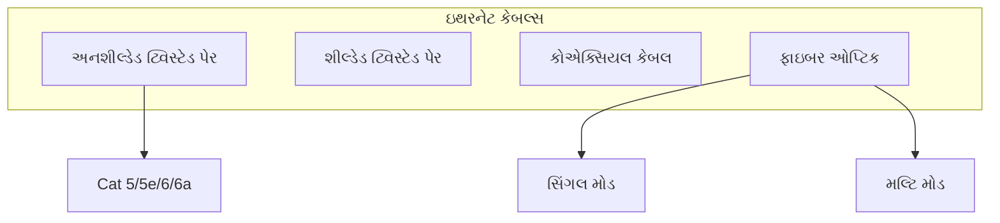

**કેબલ સ્પેસિફિકેશન્સ:**

| પ્રકાર | સ્પીડ | અંતર | ઉપયોગ |
|-------|-------|-------|-------|
| **Cat 5e** | 1 Gbps | 100m | બેઝિક નેટવર્કિંગ |
| **Cat 6** | 10 Gbps | 55m | હાઇ-સ્પીડ LAN |
| **Cat 6a** | 10 Gbps | 100m | એન્ટરપ્રાઇઝ નેટવર્ક્સ |
| **ફાઇબર ઓપ્ટિક** | 100+ Gbps | 40km+ | લાંબા અંતર, હાઇ-સ્પીડ |

- **કનેક્ટર ટાઇપ**: ટ્વિસ્ટેડ પેર કેબલ્સ માટે RJ-45
- **વાયરિંગ સ્ટાન્ડર્ડ્સ**: T568A અને T568B કલર કોડ્સ
- **એપ્લિકેશન્સ**: ઇન્ટરનેટ કનેક્ટિવિટી, ફાઇલ શેરિંગ, VoIP

**મેમરી ટ્રીક:** "ટ્વિસ્ટેડ પેર્સ ડિજિટલ ડેટા વહન કરે છે"

## પ્રશ્ન 3(c) [7 ગુણ]

**ટાઇમ ડિવિઝન મલ્ટિપ્લેક્સિંગ આકૃતિ સાથે સમજાવો.**

**જવાબ**:

TDM ટાઇમ સ્લોટ્સ ફાળવીને બહુવિધ સિગ્નલ્સને સિંગલ ટ્રાન્સમિશન માધ્યમ શેર કરવાની મંજૂરી આપે છે.

**TDM પ્રક્રિયા:**

```mermaid
gantt
    title ટાઇમ ડિવિઝન મલ્ટિપ્લેક્સિંગ
    dateFormat X
    axisFormat %s
    
    section ચેનલ A
    સ્લોટ A1 :0, 1
    સ્લોટ A2 :4, 5
    સ્લોટ A3 :8, 9
    
    section ચેનલ B
    સ્લોટ B1 :1, 2
    સ્લોટ B2 :5, 6
    સ્લોટ B3 :9, 10
    
    section ચેનલ C
    સ્લોટ C1 :2, 3
    સ્લોટ C2 :6, 7
    સ્લોટ C3 :10, 11
    
    section ચેનલ D
    સ્લોટ D1 :3, 4
    સ્લોટ D2 :7, 8
    સ્લોટ D3 :11, 12
```

**સિસ્ટમ ઘટકો:**

| ઘટક | કાર્ય | હેતુ |
|------|------|-----|
| **મલ્ટિપ્લેક્સર** | ઇનપુટ સિગ્નલ્સને જોડે છે | સિંગલ ટ્રાન્સમિશન |
| **ટાઇમ સ્લોટ્સ** | નિશ્ચિત અવધિના અંતરાલો | ન્યાયી ચેનલ એક્સેસ |
| **ડીમલ્ટિપ્લેક્સર** | કંબાઇન્ડ સિગ્નલને અલગ કરે છે | ઓરિજિનલ સિગ્નલ રિકવરી |
| **સિંક્રોનાઇઝેશન** | ટાઇમિંગ એલાઇનમેન્ટ જાળવે છે | એરર-ફ્રી ટ્રાન્સમિશન |

**TDM ના પ્રકારો:**

- **સિંક્રોનસ TDM**: દરેક ચેનલ માટે નિશ્ચિત ટાઇમ સ્લોટ્સ
- **એસિંક્રોનસ TDM**: માંગના આધારે ડાયનેમિક સ્લોટ એલોકેશન
- **સ્ટેટિસ્ટિકલ TDM**: બેન્ડવિડ્થ ઉપયોગને ઓપ્ટિમાઇઝ કરે છે

- **ફાયદાઓ**: કાર્યક્ષમ બેન્ડવિડ્થ ઉપયોગ, ડિજિટલ સુસંગતતા
- **એપ્લિકેશન્સ**: ટેલિફોન સિસ્ટમ્સ, ડિજિટલ TV બ્રોડકાસ્ટિંગ
- **બેન્ડવિડ્થ કાર્યક્ષમતા**: બહુવિધ ચેનલ્સ સિંગલ લિંક શેર કરે છે

**મેમરી ટ્રીક:** "ટાઇમ બહુવિધ સિગ્નલ્સને વિભાજિત કરે છે"

## પ્રશ્ન 3(a OR) [3 ગુણ]

**હાર્ડ રીઅલ ટાઇમ અને સોફ્ટ રીઅલ ટાઇમ ઓપરેટિંગ સિસ્ટમ વચ્ચે ફરક લખો.**

**જવાબ**:

**તુલના ટેબલ:**

| પાસું | હાર્ડ રીઅલ ટાઇમ | સોફ્ટ રીઅલ ટાઇમ |
|------|----------------|-----------------|
| **ડેડલાઇન** | સંપૂર્ણપણે પૂરી કરવી જ જોઈએ | પ્રાધાન્ય પરંતુ લવચીક |
| **પરિણામો** | ચૂકી જવાથી સિસ્ટમ ફેઇલ | પ્રદર્શનમાં ઘટાડો |
| **ઉદાહરણો** | એરક્રાફ્ટ કન્ટ્રોલ, પેસમેકર | વિડિયો સ્ટ્રીમિંગ, ગેમિંગ |
| **રિસ્પોન્સ ટાઇમ** | ગેરેન્ટીડ મહત્તમ | બેસ્ટ એફર્ટ આધાર |
| **કિંમત** | ઉચ્ચ ડેવલપમેન્ટ કોસ્ટ | મધ્યમ કિંમત |
| **વિશ્વસનીયતા** | ક્રિટિકલ સિસ્ટમ વિશ્વસનીયતા | યુઝર એક્સપિરિયન્સ ફોકસ્ડ |

**મુખ્ય લક્ષણો:**

- **હાર્ડ RT**: ડેડલાઇન મિસ માટે શૂન્ય ટોલરન્સ
- **સોફ્ટ RT**: અવારનવાર વિલંબ સ્વીકાર્ય
- **એપ્લિકેશન્સ**: સેફ્ટી-ક્રિટિકલ વિ યુઝર-ઇન્ટરેક્ટિવ સિસ્ટમ્સ

**મેમરી ટ્રીક:** "હાર્ડને ચોકસાઈ જોઈએ, સોફ્ટ લવચીકતાની મંજૂરી આપે છે"

## પ્રશ્ન 3(b OR) [4 ગુણ]

**ટ્રાન્સમિશન મોડ્સ સમજાવો.**

**જવાબ**:

ટ્રાન્સમિશન મોડ્સ કમ્યુનિકેટિંગ ડિવાઇસીસ વચ્ચે ડેટા ફ્લોની દિશા વ્યાખ્યાયિત કરે છે.

**મોડ પ્રકારો:**

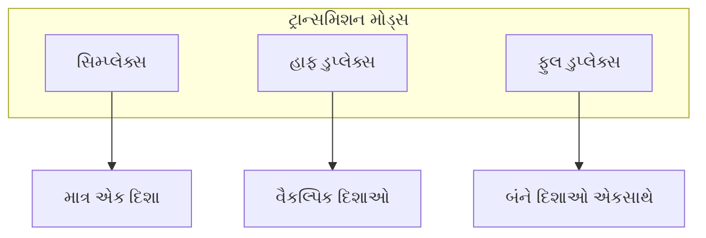

**વિગતવાર તુલના:**

| મોડ | ડેટા ફ્લો | ઉદાહરણો | એપ્લિકેશન્સ |
|-----|----------|----------|-------------|
| **સિમ્પ્લેક્સ** | માત્ર એક દિશા | રેડિયો, TV બ્રોડકાસ્ટ | બ્રોડકાસ્ટિંગ સિસ્ટમ્સ |
| **હાફ ડુપ્લેક્સ** | બંને દિશા, એકસાથે નહીં | વોકી-ટોકી, CB રેડિયો | બે-માર્ગી રેડિયો |
| **ફુલ ડુપ્લેક્સ** | બંને દિશાઓ એકસાથે | ટેલિફોન, ઇથરનેટ | આધુનિક કમ્યુનિકેશન |

- **બેન્ડવિડ્થ કાર્યક્ષમતા**: ફુલ ડુપ્લેક્સ ચેનલ ઉપયોગને મહત્તમ બનાવે છે
- **કિંમત ફેક્ટર**: સિમ્પ્લેક્સ સૌથી સસ્તું, ફુલ ડુપ્લેક્સ સૌથી મોંઘું
- **ઉપયોગ કેસીસ**: એપ્લિકેશન આવશ્યકતાઓના આધારે પસંદ કરો

**મેમરી ટ્રીક:** "સિમ્પ્લેક્સ સિંગલ, હાફ સ્વિચ કરે છે, ફુલ બંને ફ્લો કરે છે"

## પ્રશ્ન 3(c OR) [7 ગુણ]

**એનાલોગ મોડ્યુલેશનના પ્રકારોની યાદી બનાવો. એમ્પ્લીટ્યુડ મોડ્યુલેશન આકૃતિ સાથે સમજાવો.**

**જવાબ**:

**એનાલોગ મોડ્યુલેશનના પ્રકારો:**

1. **એમ્પ્લીટ્યુડ મોડ્યુલેશન (AM)**
2. **ફ્રીક્વન્સી મોડ્યુલેશન (FM)**
3. **ફેઝ મોડ્યુલેશન (PM)**

**એમ્પ્લીટ્યુડ મોડ્યુલેશન પ્રક્રિયા:**

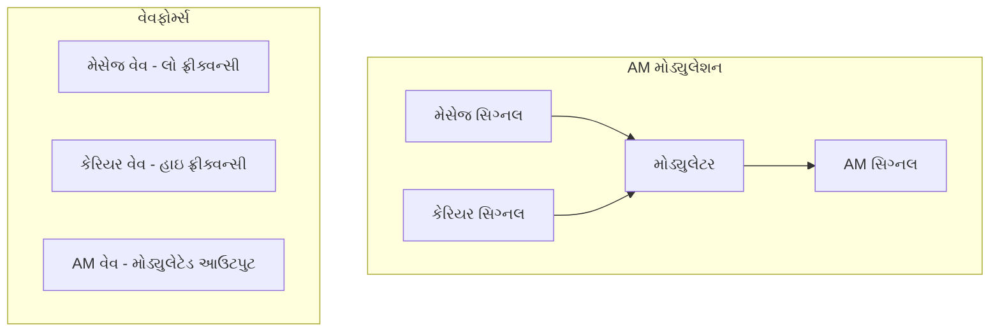

**AM લક્ષણો:**

| પેરામીટર | વર્ણન | ટિપિકલ વેલ્યુઝ |
|----------|--------|-----------------|
| **કેરિયર ફ્રીક્વન્સી** | હાઇ ફ્રીક્વન્સી બેઝ સિગ્નલ | 550-1600 kHz (AM રેડિયો) |
| **મેસેજ ફ્રીક્વન્સી** | ઇન્ફોર્મેશન સિગ્નલ | 20 Hz - 20 kHz (ઓડિયો) |
| **મોડ્યુલેશન ઇન્ડેક્સ** | મોડ્યુલેશનની ગહરાઈ | 0 થી 1 (0-100%) |
| **બેન્ડવિડ્થ** | વપરાયેલ ફ્રીક્વન્સી સ્પેક્ટ્રમ | 2 × મેસેજ ફ્રીક્વન્સી |

**ગાણિતિક અભિવ્યક્તિ:**

- **AM સિગ્નલ**: s(t) = Ac[1 + m·cos(ωmt)]cos(ωct)
- **જ્યાં**: Ac = કેરિયર એમ્પ્લીટ્યુડ, m = મોડ્યુલેશન ઇન્ડેક્સ

**એપ્લિકેશન્સ:**

- **બ્રોડકાસ્ટિંગ**: AM રેડિયો સ્ટેશન્સ
- **એવિએશન**: એર ટ્રાફિક કન્ટ્રોલ કમ્યુનિકેશન
- **સિટિઝન્સ બેન્ડ**: CB રેડિયો સિસ્ટમ્સ

- **ફાયદાઓ**: સિમ્પલ ઇમ્પ્લીમેન્ટેશન, લો કોસ્ટ રિસીવર્સ
- **નુકસાનો**: નોઇઝ માટે સંવેદનશીલ, પાવર ઇન્ફિશિયન્ટ

**મેમરી ટ્રીક:** "એમ્પ્લીટ્યુડ મેસેજ સાથે બદલાય છે"

## પ્રશ્ન 4(a) [3 ગુણ]

**FSK અને PSK ની આકૃતિ દોરો.**

**જવાબ**:

**ફ્રીક્વન્સી શિફ્ટ કીઇંગ (FSK):**

```goat
Binary Data:  1    0    1    1    0
             
FSK Signal:   ╭╲╱╲╱╲╱╲╱╮  ╭╱╲╱╲╱╲╱╮  ╭╲╱╲╱╲╱╲╱╮
             ╱           ╲╱         ╲╱          ╲
            ╱             ╲         ╱            ╲
           ╱               ╲_______╱              ╲
          
          f1 (ઉચ્ચ ફ્રીક્વ)   f2 (નીચી ફ્રીક્વ)   f1 (ઉચ્ચ ફ્રીક્વ)
```

**ફેઝ શિફ્ટ કીઇંગ (PSK):**

```goat
Binary Data:  1      0      1      1      0
             
PSK Signal:   ╭─╲ ╱─╮   ╭╲ ╱╮   ╭─╲ ╱─╮   ╭─╲ ╱─╮   ╭╲ ╱╮
             ╱   ╲╱   ╲ ╱  ╲╱  ╲ ╱   ╲╱   ╲ ╱   ╲╱   ╲ ╱  ╲╱  ╲
            ╱         ╲╱        ╲╱         ╲╱         ╲╱        ╲
           
           0° ફેઝ       180° ફેઝ    0° ફેઝ      0° ફેઝ     180° ફેઝ
```

**મુખ્ય ફરકો:**

- **FSK**: 1 અને 0 માટે અલગ ફ્રીક્વન્સીઝ
- **PSK**: 1 અને 0 માટે અલગ ફેઝીસ

**મેમરી ટ્રીક:** "FSK ફ્રીક્વન્સી બદલે છે, PSK ફેઝ બદલે છે"

## પ્રશ્ન 4(b) [4 ગુણ]

**જો મેશ ટોપોલોજીમાં 45 લિંક્સ છે, તો વધુમાં વધુ કેટલા નોડ્સ હોવા જોઈએ તે શોધો.**

**જવાબ**:

**મેશ ટોપોલોજી માટે ફોર્મ્યુલા:**
લિંક્સની સંખ્યા = n(n-1)/2

જ્યાં n = નોડ્સની સંખ્યા

**આપેલ**: લિંક્સની સંખ્યા = 45

**ગણતરી:**
45 = n(n-1)/2
90 = n(n-1)
n² - n - 90 = 0

**ક્વાડ્રેટિક સમીકરણ ઉકેલવું:**
ક્વાડ્રેટિક ફોર્મ્યુલા વાપરીને: n = [-b ± √(b² - 4ac)] / 2a

જ્યાં a=1, b=-1, c=-90

n = [1 ± √(1 + 360)] / 2
n = [1 ± √361] / 2  
n = [1 ± 19] / 2

**ઉકેલો:**
n = (1 + 19)/2 = 10 અથવા n = (1 - 19)/2 = -9

**જવાબ**: વધુમાં વધુ નોડ્સની સંખ્યા = 10

**ચકાસણી**: 10(10-1)/2 = 10×9/2 = 45 ✓

**મેમરી ટ્રીક:** "n નોડ્સને n(n-1)/2 લિંક્સની જરૂર"

## પ્રશ્ન 4(c) [7 ગુણ]

**OSI મોડેલ આકૃતિ સાથે સમજાવો.**

**જવાબ**:

OSI (ઓપન સિસ્ટમ્સ ઇન્ટરકનેક્શન) મોડેલ નેટવર્ક કમ્યુનિકેશન માટે સાત સ્તરો વ્યાખ્યાયિત કરે છે.

**OSI લેયર સ્ટેક:**

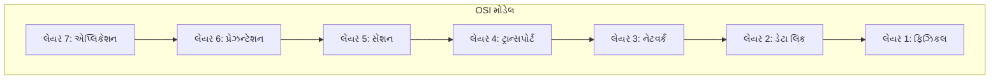

**લેયર કાર્યો:**

| લેયર | નામ | કાર્ય | પ્રોટોકોલ્સ | ડિવાઇસીસ |
|------|-----|------|-----------|---------|
| **7** | એપ્લિકેશન | યુઝર ઇન્ટરફેસ | HTTP, FTP, SMTP | ગેટવેઝ |
| **6** | પ્રેઝન્ટેશન | ડેટા ફોર્મેટિંગ | SSL, JPEG, MPEG | ગેટવેઝ |
| **5** | સેશન | કનેક્શન મેનેજમેન્ટ | NetBIOS, RPC | ગેટવેઝ |
| **4** | ટ્રાન્સપોર્ટ | એન્ડ-ટુ-એન્ડ ડેલિવરી | TCP, UDP | ગેટવેઝ |
| **3** | નેટવર્ક | રાઉટિંગ | IP, ICMP | રાઉટર્સ |
| **2** | ડેટા લિંક | ફ્રેમ ટ્રાન્સમિશન | Ethernet, PPP | સ્વિચીસ |
| **1** | ફિઝિકલ | બિટ ટ્રાન્સમિશન | Ethernet cables | હબ્સ, રિપીટર્સ |

**ડેટા ફ્લો પ્રોસેસ:**

- **એન્કેપ્સ્યુલેશન**: ડેટા લેયર્સ નીચે જાય છે, હેડર્સ ઉમેરાય છે
- **ટ્રાન્સમિશન**: ફિઝિકલ લેયર માધ્યમ પર બિટ્સ મોકલે છે
- **ડીકેપ્સ્યુલેશન**: રિસીવિંગ એન્ડ લેયર્સ ઉપર જાય છે, હેડર્સ દૂર કરાય છે

- **સ્ટાન્ડર્ડાઇઝેશન**: વેન્ડર્સ વચ્ચે ઇન્ટરઓપરેબિલિટી સક્ષમ કરે છે
- **મોડ્યુલેરિટી**: દરેક લેયરની વિશિષ્ટ જવાબદારીઓ
- **ટ્રબલશૂટિંગ**: ચોક્કસ લેયર્સમાં સમસ્યાઓને અલગ કરે છે

**મેમરી ટ્રીક:** "બધા લોકો સેશન ટ્રાન્સપોર્ટ નેટવર્ક ડેટા પ્રોસેસિંગ જોઈએ"

## પ્રશ્ન 4(a OR) [3 ગુણ]

**IPv4 ક્લાસફુલ એડ્રેસિંગ સ્કીમ ઉદાહરણ સાથે સમજાવો.**

**જવાબ**:

IPv4 ક્લાસફુલ એડ્રેસિંગ નેટવર્ક સાઇઝના આધારે IP સ્પેસને પૂર્વવ્યાખ્યાયિત ક્લાસીસમાં વિભાજિત કરે છે.

**ક્લાસ સ્ટ્રક્ચર:**

| ક્લાસ | રેન્જ | ડિફોલ્ટ માસ્ક | નેટવર્ક્સ | નેટવર્ક દીઠ હોસ્ટ્સ |
|-------|-------|--------------|----------|-------------------|
| **A** | 1-126 | /8 (255.0.0.0) | 126 | 16,777,214 |
| **B** | 128-191 | /16 (255.255.0.0) | 16,384 | 65,534 |
| **C** | 192-223 | /24 (255.255.255.0) | 2,097,152 | 254 |

**ઉદાહરણો:**

- **ક્લાસ A**: 10.0.0.1 (ISPs જેવા મોટા નેટવર્ક્સ)
- **ક્લાસ B**: 172.16.0.1 (યુનિવર્સિટીઝ જેવા મધ્યમ નેટવર્ક્સ)
- **ક્લાસ C**: 192.168.1.1 (ઓફિસીસ જેવા નાના નેટવર્ક્સ)

**એડ્રેસ ફોર્મેટ:**

- **ક્લાસ A**: N.H.H.H (N=નેટવર્ક, H=હોસ્ટ)
- **ક્લાસ B**: N.N.H.H
- **ક્લાસ C**: N.N.N.H

**મેમરી ટ્રીક:** "A ઓલ (મોટા) માટે, B બિઝનેસ (મધ્યમ) માટે, C કંપની (નાના) માટે"

## પ્રશ્ન 4(b OR) [4 ગુણ]

**જો મેશ ટોપોલોજીમાં 11 નોડ્સ છે તો ઓછામાં ઓછી કેટલી લિંક્સ હોવી જોઈએ તે શોધો.**

**જવાબ**:

**મેશ ટોપોલોજી માટે ફોર્મ્યુલા:**
લિંક્સની સંખ્યા = n(n-1)/2

જ્યાં n = નોડ્સની સંખ્યા

**આપેલ**: નોડ્સની સંખ્યા = 11

**ગણતરી:**
લિંક્સની સંખ્યા = 11(11-1)/2
= 11 × 10/2
= 110/2
= 55

**જવાબ**: ઓછામાં ઓછી જરૂરી લિંક્સની સંખ્યા = 55

**સમજૂતી:**

- મેશ ટોપોલોજીમાં, દરેક નોડ બીજા દરેક નોડ સાથે જોડાય છે
- દરેક નોડને (n-1) કનેક્શન્સ છે
- કુલ કનેક્શન્સ = n(n-1), પરંતુ દરેક લિંક બે વાર ગણાય છે
- તેથી, વાસ્તવિક લિંક્સ = n(n-1)/2

**મેમરી ટ્રીક:** "દરેક નોડ બીજા દરેક સાથે જોડાય છે"

## પ્રશ્ન 4(c OR) [7 ગુણ]

**ડોમેન નેમ સિસ્ટમ (DNS) આકૃતિ સાથે સમજાવો.**

**જવાબ**:

DNS માનવ-વાંચી શકાય તેવા ડોમેન નેમ્સને નેટવર્ક રાઉટિંગ માટે IP એડ્રેસીસમાં ટ્રાન્સલેટ કરે છે.

**DNS હાયરાર્કી:**

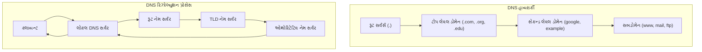

**DNS ઘટકો:**

| ઘટક | કાર્ય | ઉદાહરણો |
|------|------|----------|
| **રૂટ સર્વર્સ** | ટોપ-લેવલ ઓથોરિટી | વિશ્વભરમાં 13 રૂટ સર્વર્સ |
| **TLD સર્વર્સ** | ટોપ-લેવલ ડોમેન્સનું સંચાલન | .com, .org, .edu, .gov |
| **ઓથોરિટેટિવ સર્વર્સ** | વાસ્તવિક DNS રેકોર્ડ્સ સ્ટોર કરે છે | કંપની DNS સર્વર્સ |
| **લોકલ DNS સર્વર્સ** | ક્વેરીઝ કેશ અને ફોરવર્ડ કરે છે | ISP DNS સર્વર્સ |

**DNS રેકોર્ડ પ્રકારો:**

- **A રેકોર્ડ**: ડોમેનને IPv4 એડ્રેસ સાથે મેપ કરે છે
- **AAAA રેકોર્ડ**: ડોમેનને IPv6 એડ્રેસ સાથે મેપ કરે છે  
- **CNAME**: ડોમેન એલિયાસીસ બનાવે છે
- **MX રેકોર્ડ**: મેઇલ સર્વર્સ સ્પેસિફાઇ કરે છે
- **NS રેકોર્ડ**: નેમ સર્વર્સ આઇડેન્ટિફાઇ કરે છે

**રિઝોલ્યુશન પ્રોસેસ:**

1. **ક્લાયન્ટ ક્વેરી**: યુઝર ડોમેન નેમ એન્ટર કરે છે
2. **લોકલ કેશ ચેક**: લોકલ DNS કેશ ચેક કરે છે
3. **રિકર્સિવ ક્વેરી**: લોકલ સર્વર હાયરાર્કી ક્વેરી કરે છે
4. **રિસ્પોન્સ રિટર્ન**: IP એડ્રેસ ક્લાયન્ટને પરત કરવામાં આવે છે

- **કેશિંગ**: પ્રદર્શન સુધારે છે અને નેટવર્ક ટ્રાફિક ઘટાડે છે
- **રીડન્ડન્સી**: બહુવિધ સર્વર્સ ઉપલબ્ધતા સુનિશ્ચિત કરે છે
- **લોડ ડિસ્ટ્રિબ્યુશન**: સર્વર્સમાં ક્વેરી લોડ સંતુલિત કરે છે

**મેમરી ટ્રીક:** "ડોમેન્સને સિસ્ટેમેટિક નેમ-ટુ-એડ્રેસ ટ્રાન્સલેશનની જરૂર છે"

## પ્રશ્ન 5(a) [3 ગુણ]

**IPv6 ની જરૂરિયાત સમજાવો.**

**જવાબ**:

IPv6 ને IPv4 ની મર્યાદાઓને સંબોધવા અને ભવિષ્યની ઇન્ટરનેટ વૃદ્ધિને સપોર્ટ કરવા માટે વિકસાવવામાં આવ્યું.

**મુખ્ય આવશ્યકતાઓ:**

| સમસ્યા | IPv4 મર્યાદા | IPv6 ઉકેલ |
|--------|-------------|-----------|
| **એડ્રેસ સ્પેસ** | 4.3 બિલિયન એડ્રેસીસ | 340 અંડેસિલિયન એડ્રેસીસ |
| **NAT જટિલતા** | પ્રાઇવેટ-પબ્લિક ટ્રાન્સલેશન | એન્ડ-ટુ-એન્ડ કનેક્ટિવિટી |
| **સિક્યોરિટી** | વૈકલ્પિક IPSec | બિલ્ટ-ઇન IPSec સપોર્ટ |
| **મોબાઇલ સપોર્ટ** | મર્યાદિત મોબિલિટી | નેટિવ મોબિલિટી સપોર્ટ |

**મહત્વપૂર્ણ જરૂરિયાતો:**

- **IoT વિસ્ફોટ**: અબજો કનેક્ટેડ ડિવાઇસીસને અનન્ય એડ્રેસીસની જરૂર
- **મોબાઇલ વૃદ્ધિ**: સ્માર્ટફોન્સ અને ટેબ્લેટ્સને ઇન્ટરનેટ એક્સેસ જોઈએ
- **ગ્લોબલ કનેક્ટિવિટી**: ઉભરતા બજારો ઇન્ટરનેટમાં જોડાય છે

- **એડ્રેસ ફોર્મેટ**: IPv4 માં 32-બિટ વિ 128-બિટ
- **સિમ્પ્લિફાઇડ હેડર**: વધુ કાર્યક્ષમ પેકેટ પ્રોસેસિંગ
- **નો ફ્રેગમેન્ટેશન**: રાઉટર્સ પેકેટ્સને ફ્રેગમેન્ટ કરતા નથી

**મેમરી ટ્રીક:** "IPv6 ઇન્ટરનેટ વૃદ્ધિ માટે અનંત એડ્રેસીસ પૂરું પાડે છે"

## પ્રશ્ન 5(b) [4 ગુણ]

**એસિમેટ્રિક કી એન્ક્રિપ્શનનું ઉપયોગ કરીને કોન્ફિડેન્શિયાલિટી સમજાવો.**

**જવાબ**:

એસિમેટ્રિક એન્ક્રિપ્શન ડેટા કોન્ફિડેન્શિયાલિટી સુનિશ્ચિત કરવા માટે કી પેર્સ (પબ્લિક-પ્રાઇવેટ) વાપરે છે.

**એન્ક્રિપ્શન પ્રોસેસ:**

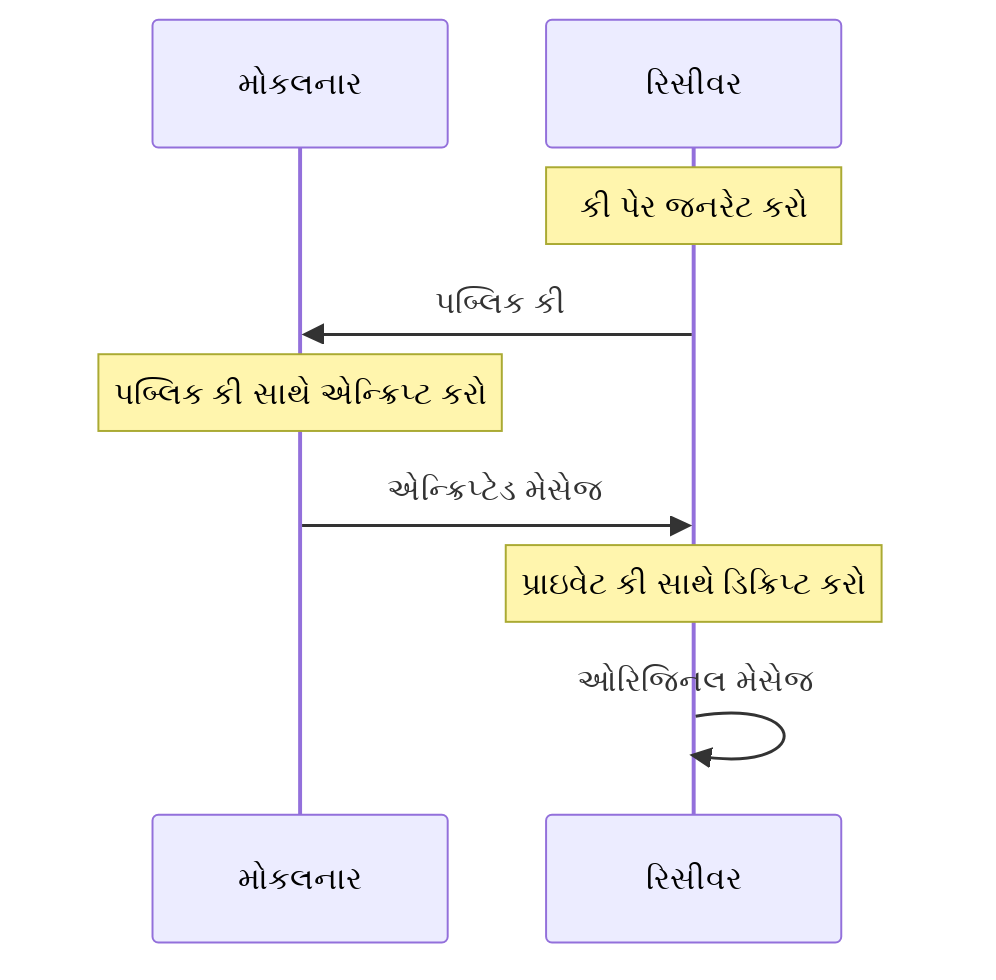

**મુખ્ય લક્ષણો:**

| પાસું | વર્ણન | સિક્યોરિટી બેનિફિટ |
|------|--------|---------------------|
| **પબ્લિક કી** | મુક્તપણે વિતરિત | કોઈપણ એન્ક્રિપ્ટ કરી શકે છે |
| **પ્રાઇવેટ કી** | ગુપ્ત રાખવામાં આવે છે | માત્ર માલિક ડિક્રિપ્ટ કરી શકે છે |
| **કી પેર** | ગાણિતિક રીતે સંબંધિત | સુરક્ષિત કમ્યુનિકેશન |
| **અલ્ગોરિધમ** | RSA, ECC, DSA | મજબૂત એન્ક્રિપ્શન |

**કોન્ફિડેન્શિયાલિટી પ્રોસેસ:**

- **પગલું 1**: રિસીવર પબ્લિક-પ્રાઇવેટ કી પેર જનરેટ કરે છે
- **પગલું 2**: પબ્લિક કી મોકલનાર સાથે શેર કરવામાં આવે છે
- **પગલું 3**: મોકલનાર પબ્લિક કી સાથે મેસેજ એન્ક્રિપ્ટ કરે છે
- **પગલું 4**: માત્ર રિસીવરની પ્રાઇવેટ કી ડિક્રિપ્ટ કરી શકે છે

- **કોઈ કી એક્સચેન્જ નહીં**: કી ડિસ્ટ્રિબ્યુશન સમસ્યાને દૂર કરે છે
- **નોન-રિપ્યુડિયેશન**: મોકલનાર મેસેજ મોકલવાનો ઇનકાર કરી શકે નહીં
- **ડિજિટલ સિગ્નેચર્સ**: ઓથેન્ટિકેશન અને ઇન્ટેગ્રિટી

**મેમરી ટ્રીક:** "પબ્લિક લોક કરે છે, પ્રાઇવેટ અનલોક કરે છે"

## પ્રશ્ન 5(c) [7 ગુણ]

**મેન ઇન મિડલ અટેક ઉદાહરણ સાથે સમજાવો.**

**જવાબ**:

મેન-ઇન-ધ-મિડલ અટેક બે પક્ષો વચ્ચેનો સંદેશાવ્યવહાર તેમની જાણ વિના અટકાવે છે.

**અટેક પ્રોસેસ:**

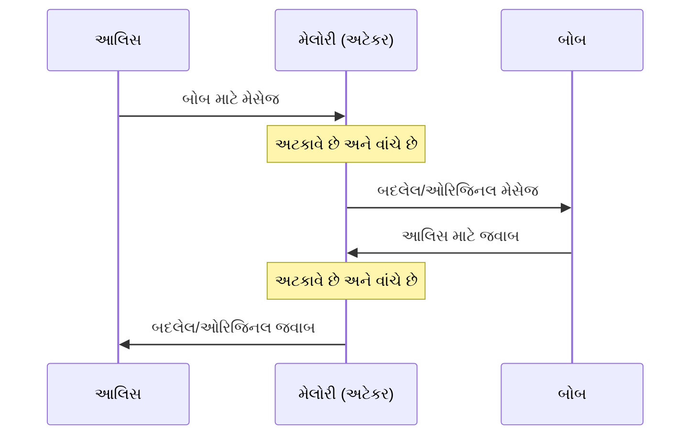

**અટેક તબક્કાઓ:**

| તબક્કો | અટેકરની ક્રિયા | પીડિતની અસર |
|-------|----------------|--------------|
| **ઇન્ટરસેપ્શન** | પક્ષો વચ્ચે સ્થિતિ | પીડિતોને અજાણ |
| **ડિક્રિપ્શન** | એન્ક્રિપ્શન તોડે/બાયપાસ કરે | ડેટાની એક્સેસ |
| **મોડિફિકેશન** | મેસેજીસ બદલે | ખોટી માહિતી |
| **રી-એન્ક્રિપ્શન** | ટેમ્પરિંગ છુપાવે | ભ્રમ જાળવે છે |

**વાસ્તવિક જગતનું ઉદાહરણ:**

- **સિનેરિયો**: ઓનલાઇન બેંકિંગ સેશન
- **અટેક**: પબ્લિક WiFi પર અટેકર ટ્રાફિક અટકાવે છે
- **પદ્ધતિ**: નકલી એક્સેસ પોઇન્ટ "Free_WiFi" બનાવે છે
- **પરિણામ**: બેંકિંગ ક્રેડેન્શિયલ્સ ચોરે છે અને પૈસા ટ્રાન્સફર કરે છે

**સામાન્ય ટાર્ગેટ્સ:**

- **પબ્લિક WiFi**: કોફી શોપ્સ, એરપોર્ટ્સ, હોટેલ્સ
- **ઇમેઇલ કમ્યુનિકેશન**: કોર્પોરેટ કમ્યુનિકેશન્સ
- **ઓનલાઇન શોપિંગ**: ક્રેડિટ કાર્ડ માહિતી ચોરી
- **સોશિયલ મીડિયા**: વ્યક્તિગત માહિતી હાર્વેસ્ટિંગ

**બચાવના પગલાં:**

- **SSL/TLS**: એન્ડ-ટુ-એન્ડ એન્ક્રિપ્શન પ્રોટોકોલ્સ
- **VPN ઉપયોગ**: બધા ટ્રાફિક માટે સુરક્ષિત ટનલ
- **સર્ટિફિકેટ વેરિફિકેશન**: વેબસાઇટની અધિકૃતતા ચેક કરો
- **પબ્લિક WiFi ટાળો**: સંવેદનશીલ કાર્યો માટે સેલ્યુલર ડેટા વાપરો

**મેમરી ટ્રીક:** "મેલોરી આલિસ અને બોબ વચ્ચે મેસેજીસ અટકાવે છે"

## પ્રશ્ન 5(a OR) [3 ગુણ]

**નીચે દશાર્વેલ ડિવાઇસીસ માટે સંબંધિત OSI મોડેલના લેયર્સના નામ આપો.**
**1. Repeater 2. Router 3. Switch**

**જવાબ**:

**ડિવાઇસ-લેયર મેપિંગ:**

| ડિવાઇસ | OSI લેયર | લેયર નામ | કાર્ય |
|--------|-----------|-----------|------|
| **Repeater** | લેયર 1 | ફિઝિકલ લેયર | સિગ્નલ એમ્પ્લિફિકેશન |
| **Router** | લેયર 3 | નેટવર્ક લેયર | IP રાઉટિંગ ડિસિઝન્સ |
| **Switch** | લેયર 2 | ડેટા લિંક લેયર | ફ્રેમ સ્વિચિંગ |

**વિગતવાર કાર્યો:**

- **Repeater**: નેટવર્ક ડિસ્ટન્સ વધારવા માટે ઇલેક્ટ્રિકલ સિગ્નલ્સ પુનર્જીવિત કરે છે
- **Router**: IP એડ્રેસીસના આધારે ફોરવર્ડિંગ ડિસિઝન્સ લે છે
- **Switch**: MAC એડ્રેસીસના આધારે ફ્રેમ્સ ફોરવર્ડ કરે છે

**મેમરી ટ્રીક:** "રિપીટર્સ ફિઝિકલ કામ કરે છે, સ્વિચીસ ડેટા લિંક કરે છે, રાઉટર્સ નેટવર્ક રાઉટ કરે છે"

## પ્રશ્ન 5(b OR) [4 ગુણ]

**સિમેટ્રિક કી એન્ક્રિપ્શનનો ઉપયોગ કરીને કોન્ફિડેન્શિયાલિટી સમજાવો.**

**જવાબ**:

સિમેટ્રિક એન્ક્રિપ્શન એન્ક્રિપ્શન અને ડિક્રિપ્શન બંને માટે સિંગલ શેર્ડ કી વાપરે છે.

**એન્ક્રિપ્શન પ્રોસેસ:**

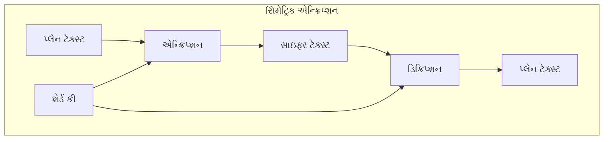

**મુખ્ય લક્ષણો:**

| લક્ષણ | વર્ણન | ઉદાહરણ |
|-------|--------|----------|
| **સિંગલ કી** | એન્ક્રિપ્ટ/ડિક્રિપ્ટ માટે સમાન કી | AES-256 કી |
| **ઝડપી પ્રોસેસિંગ** | કાર્યક્ષમ અલ્ગોરિધમ્સ | રીઅલ-ટાઇમ કમ્યુનિકેશન |
| **કી ડિસ્ટ્રિબ્યુશન** | સુરક્ષિત કી શેરિંગ જરૂરી | પ્રી-શેર્ડ કીઝ |
| **અલ્ગોરિધમ પ્રકારો** | બ્લોક અને સ્ટ્રીમ સાઇફર્સ | AES, DES, RC4 |

**કોન્ફિડેન્શિયાલિટી મેકેનિઝમ:**

- **શેર્ડ સિક્રેટ**: બંને પક્ષો પાસે સમાન કી હોવી જોઈએ
- **એન્ક્રિપ્શન**: મોકલનાર શેર્ડ કી સાથે એન્ક્રિપ્ટ કરે છે
- **ટ્રાન્સમિશન**: સાઇફર ટેક્સ્ટ અસુરક્ષિત ચેનલ પર મોકલવામાં આવે છે
- **ડિક્રિપ્શન**: રિસીવર સમાન કી સાથે ડિક્રિપ્ટ કરે છે

- **ફાયદાઓ**: ઝડપી એક્ઝીક્યુશન, લો કોમ્પ્યુટેશનલ ઓવરહેડ
- **નુકસાનો**: કી ડિસ્ટ્રિબ્યુશન ચેલેન્જ, સ્કેલેબિલિટી ઇશ્યુઝ
- **એપ્લિકેશન્સ**: VPN ટનલ્સ, ફાઇલ એન્ક્રિપ્શન, ડેટાબેઝ સિક્યોરિટી

**મેમરી ટ્રીક:** "સમાન કી એન્ક્રિપ્ટ અને ડિક્રિપ્ટ કરે છે"

## પ્રશ્ન 5(c OR) [7 ગુણ]

**ડિનાયલ ઓફ સર્વિસ અટેક ઉદાહરણ સાથે સમજાવો.**

**જવાબ**:

DoS અટેક સિસ્ટમને ઓવરવેલ્મ કરીને કાયદેસર વપરાશકર્તાઓ માટે નેટવર્ક રિસોર્સીસને અનુપલબ્ધ બનાવે છે.

**અટેક પ્રકારો:**

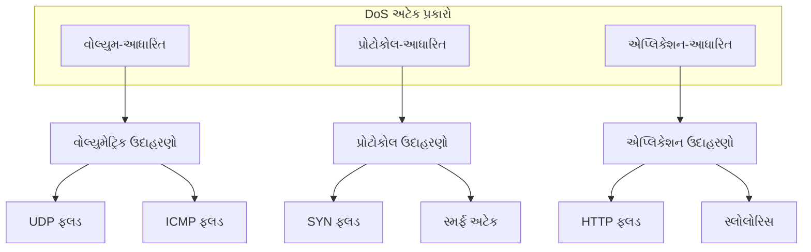

**અટેક કેટેગરીઝ:**

| પ્રકાર | પદ્ધતિ | ટાર્ગેટ | અસર |
|------|--------|--------|-----|
| **વોલ્યુમ-આધારિત** | ટ્રાફિક સાથે ફ્લડ | બેન્ડવિડ્થ | નેટવર્ક કંજેશન |
| **પ્રોટોકોલ-આધારિત** | પ્રોટોકોલ વીકનેસનો ઉપયોગ | સર્વર રિસોર્સીસ | સર્વિસ અનુપલબ્ધતા |
| **એપ્લિકેશન-આધારિત** | એપ્લિકેશન લેયર ટાર્ગેટ | એપ્લિકેશન સર્વર | સર્વિસ ડિગ્રેડેશન |

**વાસ્તવિક જગતનું ઉદાહરણ - ઇ-કોમર્સ પર DDoS:**

- **ટાર્ગેટ**: સેલ સિઝન દરમિયાન ઓનલાઇન શોપિંગ વેબસાઇટ
- **પદ્ધતિ**: 10,000 ઇન્ફેક્ટેડ કમ્પ્યુટર્સનું બોટનેટ
- **અટેક**: દરેક બોટ સેકન્ડ દીઠ 100 રિક્વેસ્ટ્સ મોકલે છે
- **પરિણામ**: સેકન્ડ દીઠ 1 મિલિયન રિક્વેસ્ટ્સ સર્વર્સને ઓવરવેલ્મ કરે છે
- **અસર**: વેબસાઇટ ક્રેશ થાય છે, ગ્રાહકો પર્ચેઝ કરી શકતા નથી, આવકની ખોટ

**સામાન્ય DoS તકનીકો:**

- **SYN ફ્લડ**: TCP હેન્ડશેક પ્રોસેસનો દુરુપયોગ કરે છે
- **UDP ફ્લડ**: મોટી સંખ્યામાં UDP પેકેટ્સ મોકલે છે
- **પિંગ ઓફ ડેથ**: ઓવરસાઇઝ્ડ પિંગ પેકેટ્સ સિસ્ટમ્સને ક્રેશ કરે છે
- **સ્લોલોરિસ**: સર્વર એક્સોસ્ટ કરવા માટે કનેક્શન્સ ઓપન રાખે છે

**ડિફેન્સ સ્ટ્રેટેજીઝ:**

- **રેટ લિમિટિંગ**: IP એડ્રેસ દીઠ રિક્વેસ્ટ્સ પ્રતિબંધિત કરે છે
- **ફાયરવોલ રૂલ્સ**: શંકાસ્પદ ટ્રાફિક પેટર્ન્સ બ્લોક કરે છે
- **DDoS પ્રોટેક્શન સર્વિસીસ**: CloudFlare, AWS Shield
- **લોડ બેલેન્સિંગ**: સર્વર્સમાં ટ્રાફિક વિતરિત કરે છે
- **ટ્રાફિક એનાલિસિસ**: અસામાન્ય પેટર્ન્સ માટે મોનિટર કરે છે

**બિઝનેસ અસર:**

- **આવકની ખોટ**: ગ્રાહકો સર્વિસીસ એક્સેસ કરી શકતા નથી
- **પ્રતિષ્ઠાને નુકસાન**: વપરાશકર્તાઓ વિશ્વસનીયતામાં વિશ્વાસ ગુમાવે છે
- **ઓપરેશનલ કોસ્ટ**: મિટિગેશન પર રિસોર્સીસ ખર્ચાય છે
- **કાનૂની મુદ્દાઓ**: SLA વાયોલેશન્સ, કમ્પ્લાયન્સ પ્રોબ્લેમ્સ

**મેમરી ટ્રીક:** "રિક્વેસ્ટ્સ સાથે ઓવરવેલ્મિંગ દ્વારા સર્વિસ ડિનાઇ કરો"
