## Question 1(a) [3 marks]

**Explain NAND logic gate.**

**Answer**:

NAND gate is a universal logic gate that produces output 0 only when all inputs are 1.

**Truth Table:**

| A | B | Y = A NAND B |
|---|---|--------------|
| 0 | 0 | 1           |
| 0 | 1 | 1           |
| 1 | 0 | 1           |
| 1 | 1 | 0           |

**Symbol:**

```goat
    A ----+---D>o--- Y
          |   |
    B ----+   |
              |
```

- **NAND Function**: Output is complement of AND operation
- **Universal Gate**: Can implement any logic function
- **Low Power**: Requires fewer transistors in IC design

**Mnemonic:** "NOT AND = NAND"

## Question 1(b) [4 marks]

**Draw AND logic Gate using NOR Gate only.**

**Answer**:

AND gate can be implemented using NOR gates by applying De Morgan's theorem.

**Circuit Diagram:**

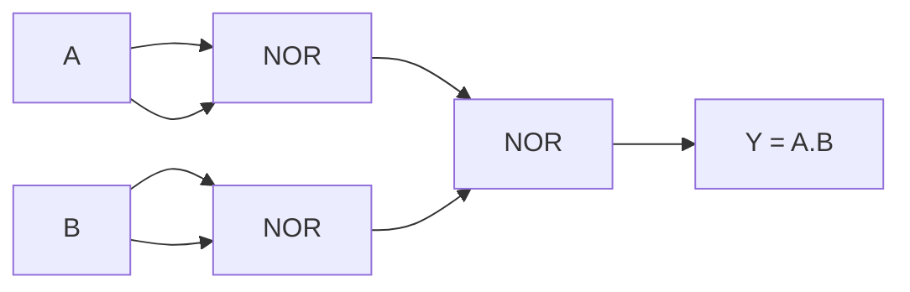

**Implementation Steps:**

- **Step 1**: Create NOT A using NOR gate (A NOR A = A')
- **Step 2**: Create NOT B using NOR gate (B NOR B = B')
- **Step 3**: Apply De Morgan's: A.B = (A' + B')'
- **Final Output**: A AND B

**Mnemonic:** "Double inversion gives original function"

## Question 1(c) [7 marks]

**Explain components of Information System with diagram.**

**Answer**:

Information System consists of five key components working together to process data into useful information.

**System Diagram:**

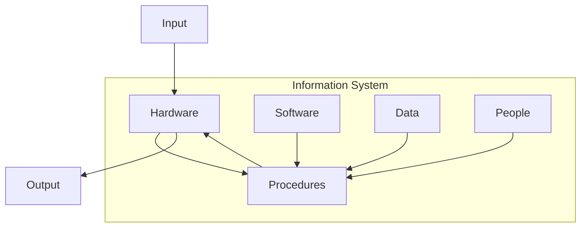

**Components:**

| Component | Description | Examples |
|-----------|-------------|----------|
| **Hardware** | Physical devices | CPU, Memory, Keyboards |
| **Software** | Programs and applications | OS, Applications, Utilities |
| **Data** | Raw facts and figures | Numbers, Text, Images |
| **Procedures** | Rules and instructions | User manuals, SOPs |
| **People** | Users and operators | End users, IT staff |

- **Input Processing**: Data enters through hardware
- **Storage Management**: Data stored and retrieved efficiently  
- **Output Generation**: Information presented to users
- **Integration**: All components work cohesively

**Mnemonic:** "Hardware Supports Data Processing People"

## Question 1(c OR) [7 marks]

**Explain the working of Google Search Engine with example.**

**Answer**:

Google Search Engine uses complex algorithms to find and rank web pages based on user queries.

**Working Process:**

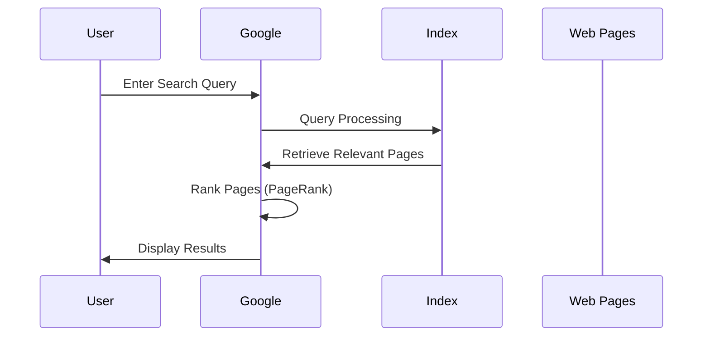

**Key Components:**

| Stage | Process | Example |
|-------|---------|---------|
| **Crawling** | Discover web pages | Googlebot visits websites |
| **Indexing** | Store page content | Keywords stored in database |
| **Ranking** | Order by relevance | PageRank algorithm |
| **Serving** | Display results | Search results page |

**Example Search Process:**

- **Query**: "Introduction to IT Systems"
- **Processing**: Parse keywords, check index
- **Ranking**: Educational sites ranked higher
- **Results**: GTU syllabus, tutorials, courses

- **PageRank Algorithm**: Links determine page importance
- **Machine Learning**: Improves search accuracy over time
- **Real-time Updates**: Fresh content prioritized

**Mnemonic:** "Crawl Index Rank Serve"

## Question 2(a) [3 marks]

**Convert (16.75)10= ( )8**

**Answer**:

Converting decimal 16.75 to octal requires separate conversion of integer and fractional parts.

**Integer Part Conversion (16):**

| Division | Quotient | Remainder |
|----------|----------|-----------|
| 16 ÷ 8   | 2        | 0         |
| 2 ÷ 8    | 0        | 2         |

**Fractional Part Conversion (0.75):**

| Multiplication | Integer Part |
|----------------|--------------|
| 0.75 × 8 = 6.0 | 6           |

**Final Answer**: (16.75)10 = (20.6)8

**Verification**: 2×8¹ + 0×8⁰ + 6×8⁻¹ = 16 + 0 + 0.75 = 16.75 ✓

**Mnemonic:** "Divide integer, Multiply fraction"

## Question 2(b) [4 marks]

**Explain Multiprocessing Operating System.**

**Answer**:

Multiprocessing OS manages multiple processors working simultaneously to execute processes.

**Architecture Diagram:**

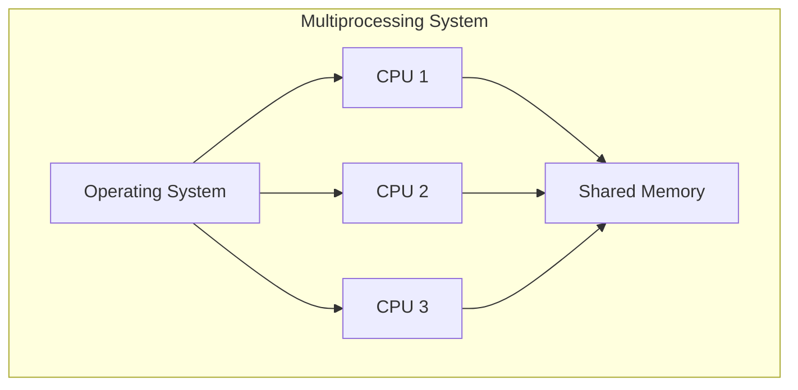

**Key Features:**

| Feature | Description | Benefit |
|---------|-------------|---------|
| **Parallel Processing** | Multiple CPUs work together | Faster execution |
| **Load Balancing** | Tasks distributed evenly | Optimal resource usage |
| **Fault Tolerance** | System continues if one CPU fails | Higher reliability |
| **Shared Resources** | Common memory and I/O devices | Cost effective |

- **Symmetric Multiprocessing**: All processors have equal access
- **Process Synchronization**: Coordinates between processors
- **Enhanced Performance**: Linear speedup with processor count

**Mnemonic:** "Multiple Processors Process Parallel"

## Question 2(c) [7 marks]

**Define Operating System. List out and Explain the functions of Operating System.**

**Answer**:

**Definition**: Operating System is system software that manages computer hardware and provides services to application programs.

**Core Functions:**

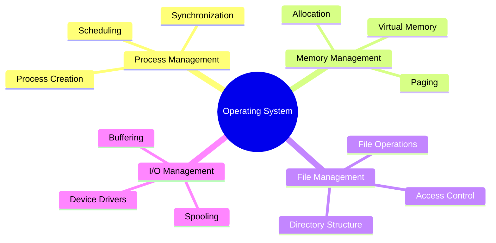

**Detailed Functions:**

| Function | Description | Examples |
|----------|-------------|----------|
| **Process Management** | Controls program execution | Task scheduling, multitasking |
| **Memory Management** | Allocates RAM efficiently | Virtual memory, paging |
| **File Management** | Organizes data storage | File systems, directories |
| **I/O Management** | Controls input/output devices | Printer spooling, disk access |
| **Security** | Protects system resources | User authentication, access control |

- **Resource Allocation**: Distributes CPU time and memory
- **User Interface**: Provides command line or GUI interaction
- **Error Handling**: Manages system failures gracefully
- **System Calls**: Interface between applications and hardware

**Mnemonic:** "Process Memory Files Input-Output Security"

## Question 2(a OR) [3 marks]

**Convert (1111111.11)2= ( )10**

**Answer**:

Converting binary to decimal using positional notation method.

**Conversion Table:**

| Position | Bit | Power | Value |
|----------|-----|-------|--------|
| 6 | 1 | 2⁶ | 64 |
| 5 | 1 | 2⁵ | 32 |
| 4 | 1 | 2⁴ | 16 |
| 3 | 1 | 2³ | 8 |
| 2 | 1 | 2² | 4 |
| 1 | 1 | 2¹ | 2 |
| 0 | 1 | 2⁰ | 1 |
| -1 | 1 | 2⁻¹ | 0.5 |
| -2 | 1 | 2⁻² | 0.25 |

**Calculation**: 64 + 32 + 16 + 8 + 4 + 2 + 1 + 0.5 + 0.25 = 127.75

**Final Answer**: (1111111.11)2 = (127.75)10

**Mnemonic:** "Powers of Two add Together"

## Question 2(b OR) [4 marks]

**Explain Batch Operating System.**

**Answer**:

Batch OS processes jobs in groups without user interaction during execution.

**Working Model:**

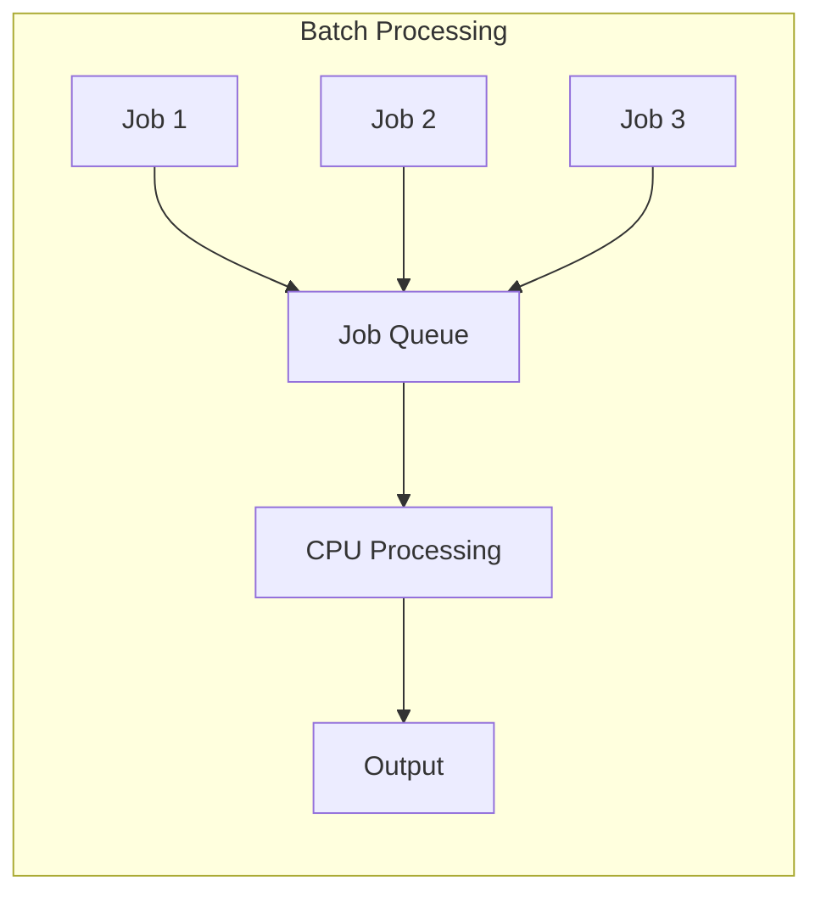

**Characteristics:**

| Feature | Description | Impact |
|---------|-------------|--------|
| **No Interaction** | Jobs run without user input | High throughput |
| **Job Queue** | Multiple jobs wait in sequence | Efficient processing |
| **Automatic Scheduling** | OS selects next job | Minimal overhead |
| **Batch Processing** | Similar jobs grouped together | Resource optimization |

- **Advantages**: High system utilization, cost effective
- **Disadvantages**: No real-time interaction, debugging difficulty
- **Applications**: Payroll processing, data backup systems

**Mnemonic:** "Batch Jobs Queue Automatically"

## Question 2(c OR) [7 marks]

**Explain Architecture and modes of Linux System with Diagram.**

**Answer**:

Linux follows layered architecture with distinct user and kernel modes.

**System Architecture:**

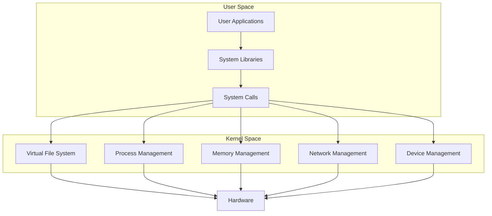

**Operating Modes:**

| Mode | Description | Access Level |
|------|-------------|--------------|
| **User Mode** | Applications run here | Limited privileges |
| **Kernel Mode** | OS core functions | Full hardware access |
| **System Call Interface** | Communication bridge | Controlled transition |

**Key Components:**

- **Shell**: Command interpreter interface
- **Kernel**: Core system management
- **File System**: Hierarchical data organization
- **Device Drivers**: Hardware abstraction layer

- **Security Model**: Permission-based access control
- **Modularity**: Loadable kernel modules for flexibility
- **Portability**: Runs on multiple hardware platforms

**Mnemonic:** "Users call Kernel for Hardware"

## Question 3(a) [3 marks]

**Differentiate between Open-source Software and Proprietary Software.**

**Answer**:

**Comparison Table:**

| Aspect | Open-source Software | Proprietary Software |
|--------|---------------------|---------------------|
| **Source Code** | Freely available | Closed and protected |
| **Cost** | Usually free | Commercial license required |
| **Modification** | Can be modified | Cannot be modified |
| **Examples** | Linux, Firefox, LibreOffice | Windows, MS Office, Photoshop |
| **Support** | Community-based | Vendor-provided |
| **Licensing** | GPL, MIT, Apache | EULA, Commercial |

**Key Differences:**

- **Freedom**: Open-source allows complete customization
- **Security**: Open code enables community security reviews
- **Vendor Lock-in**: Proprietary creates dependency on vendor

**Mnemonic:** "Open Shares, Proprietary Protects"

## Question 3(b) [4 marks]

**Explain Ethernet Cable.**

**Answer**:

Ethernet cable is the standard wired networking medium for LAN connections.

**Cable Types:**

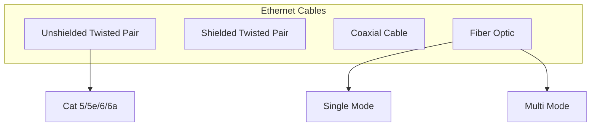

**Cable Specifications:**

| Type | Speed | Distance | Usage |
|------|-------|----------|-------|
| **Cat 5e** | 1 Gbps | 100m | Basic networking |
| **Cat 6** | 10 Gbps | 55m | High-speed LAN |
| **Cat 6a** | 10 Gbps | 100m | Enterprise networks |
| **Fiber Optic** | 100+ Gbps | 40km+ | Long-distance, high-speed |

- **Connector Type**: RJ-45 for twisted pair cables
- **Wiring Standards**: T568A and T568B color codes
- **Applications**: Internet connectivity, file sharing, VoIP

**Mnemonic:** "Twisted pairs Carry Digital Data"

## Question 3(c) [7 marks]

**Explain Time Division Multiplexing with diagram.**

**Answer**:

TDM allows multiple signals to share single transmission medium by allocating time slots.

**TDM Process:**

```mermaid
gantt
    title Time Division Multiplexing
    dateFormat X
    axisFormat %s
    
    section Channel A
    Slot A1 :0, 1
    Slot A2 :4, 5
    Slot A3 :8, 9
    
    section Channel B
    Slot B1 :1, 2
    Slot B2 :5, 6
    Slot B3 :9, 10
    
    section Channel C
    Slot C1 :2, 3
    Slot C2 :6, 7
    Slot C3 :10, 11
    
    section Channel D
    Slot D1 :3, 4
    Slot D2 :7, 8
    Slot D3 :11, 12
```

**System Components:**

| Component | Function | Purpose |
|-----------|----------|---------|
| **Multiplexer** | Combines input signals | Single transmission |
| **Time Slots** | Fixed duration intervals | Fair channel access |
| **Demultiplexer** | Separates combined signal | Original signal recovery |
| **Synchronization** | Maintains timing alignment | Error-free transmission |

**Types of TDM:**

- **Synchronous TDM**: Fixed time slots for each channel
- **Asynchronous TDM**: Dynamic slot allocation based on demand
- **Statistical TDM**: Optimizes bandwidth utilization

- **Advantages**: Efficient bandwidth usage, digital compatibility
- **Applications**: Telephone systems, digital TV broadcasting
- **Bandwidth Efficiency**: Multiple channels share single link

**Mnemonic:** "Time Divides Multiple Signals"

## Question 3(a OR) [3 marks]

**Differentiate between Hard Real Time and Soft Real Time Operating System.**

**Answer**:

**Comparison Table:**

| Aspect | Hard Real Time | Soft Real Time |
|--------|----------------|----------------|
| **Deadline** | Must be met absolutely | Preferred but flexible |
| **Consequences** | System failure if missed | Performance degradation |
| **Examples** | Aircraft control, Pacemaker | Video streaming, Gaming |
| **Response Time** | Guaranteed maximum | Best effort basis |
| **Cost** | High development cost | Moderate cost |
| **Reliability** | Critical system reliability | User experience focused |

**Key Characteristics:**

- **Hard RT**: Zero tolerance for deadline misses
- **Soft RT**: Occasional delays acceptable
- **Applications**: Safety-critical vs user-interactive systems

**Mnemonic:** "Hard requires Precision, Soft allows Flexibility"

## Question 3(b OR) [4 marks]

**Explain Transmission Modes.**

**Answer**:

Transmission modes define direction of data flow between communicating devices.

**Mode Types:**

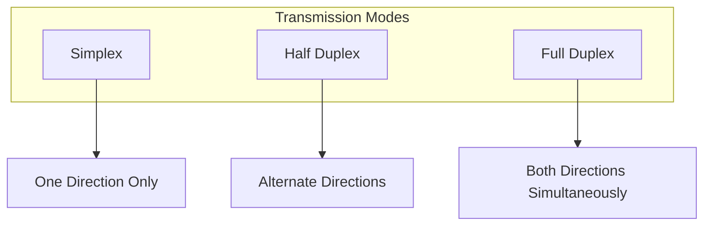

**Detailed Comparison:**

| Mode | Data Flow | Examples | Applications |
|------|-----------|----------|--------------|
| **Simplex** | One direction only | Radio, TV broadcast | Broadcasting systems |
| **Half Duplex** | Both directions, not simultaneous | Walkie-talkie, CB radio | Two-way radios |
| **Full Duplex** | Both directions simultaneously | Telephone, Ethernet | Modern communication |

- **Bandwidth Efficiency**: Full duplex maximizes channel utilization
- **Cost Factor**: Simplex cheapest, full duplex most expensive
- **Use Cases**: Choose based on application requirements

**Mnemonic:** "Simplex Single, Half switches, Full flows Both"

## Question 3(c OR) [7 marks]

**List out types of Analog Modulation. Explain Amplitude Modulation with diagram.**

**Answer**:

**Types of Analog Modulation:**

1. **Amplitude Modulation (AM)**
2. **Frequency Modulation (FM)** 
3. **Phase Modulation (PM)**

**Amplitude Modulation Process:**

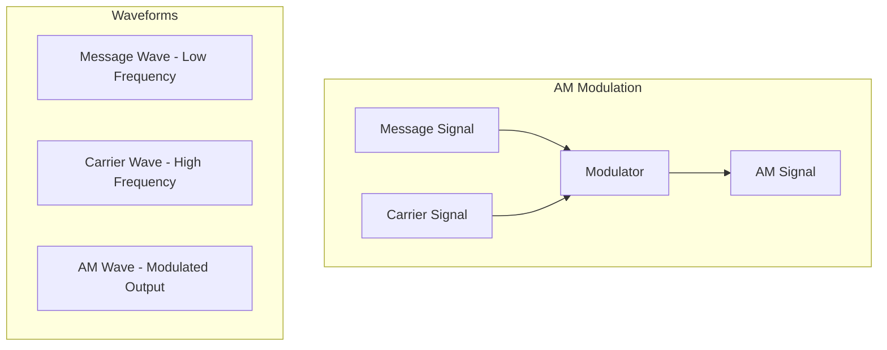

**AM Characteristics:**

| Parameter | Description | Typical Values |
|-----------|-------------|----------------|
| **Carrier Frequency** | High frequency base signal | 550-1600 kHz (AM radio) |
| **Message Frequency** | Information signal | 20 Hz - 20 kHz (audio) |
| **Modulation Index** | Depth of modulation | 0 to 1 (0-100%) |
| **Bandwidth** | Frequency spectrum used | 2 × Message frequency |

**Mathematical Expression:**

- **AM Signal**: s(t) = Ac[1 + m·cos(ωmt)]cos(ωct)
- **Where**: Ac = carrier amplitude, m = modulation index

**Applications:**

- **Broadcasting**: AM radio stations
- **Aviation**: Air traffic control communication
- **Citizens Band**: CB radio systems

- **Advantages**: Simple implementation, low cost receivers
- **Disadvantages**: Susceptible to noise, power inefficient

**Mnemonic:** "Amplitude Varies with Message"

## Question 4(a) [3 marks]

**Draw Diagram of FSK AND PSK.**

**Answer**:

**Frequency Shift Keying (FSK):**

```goat
Binary Data:  1    0    1    1    0
             
FSK Signal:   ╭╲╱╲╱╲╱╲╱╮  ╭╱╲╱╲╱╲╱╮  ╭╲╱╲╱╲╱╲╱╮
             ╱           ╲╱         ╲╱           ╲
            ╱             ╲         ╱             ╲
           ╱               ╲_______╱               ╲
          
          f1 (High Freq)    f2 (Low Freq)    f1 (High Freq)
```

**Phase Shift Keying (PSK):**

```goat
Binary Data:  1      0      1      1      0
             
PSK Signal:   ╭─╲ ╱─╮   ╭╲ ╱╮   ╭─╲ ╱─╮   ╭─╲ ╱─╮   ╭╲ ╱╮
             ╱   ╲╱   ╲ ╱  ╲╱  ╲ ╱   ╲╱   ╲ ╱   ╲╱   ╲ ╱  ╲╱  ╲
            ╱         ╲╱        ╲╱         ╲╱         ╲╱        ╲
           
           0° Phase      180° Phase    0° Phase     0° Phase    180° Phase
```

**Key Differences:**

- **FSK**: Different frequencies for 1 and 0
- **PSK**: Different phases for 1 and 0

**Mnemonic:** "FSK changes Frequency, PSK changes Phase"

## Question 4(b) [4 marks]

**If number of links in mesh topology are 45 than find maximum number of required nodes.**

**Answer**:

**Formula for Mesh Topology:**
Number of links = n(n-1)/2

Where n = number of nodes

**Given**: Number of links = 45

**Calculation:**
45 = n(n-1)/2
90 = n(n-1)
n² - n - 90 = 0

**Solving Quadratic Equation:**
Using quadratic formula: n = [-b ± √(b² - 4ac)] / 2a

Where a=1, b=-1, c=-90

n = [1 ± √(1 + 360)] / 2
n = [1 ± √361] / 2  
n = [1 ± 19] / 2

**Solutions:**
n = (1 + 19)/2 = 10 or n = (1 - 19)/2 = -9

**Answer**: Maximum number of nodes = 10

**Verification**: 10(10-1)/2 = 10×9/2 = 45 ✓

**Mnemonic:** "n nodes need n(n-1)/2 links"

## Question 4(c) [7 marks]

**Explain OSI Model with diagram.**

**Answer**:

OSI (Open Systems Interconnection) model defines seven layers for network communication.

**OSI Layer Stack:**

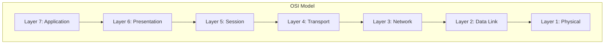

**Layer Functions:**

| Layer | Name | Function | Protocols | Devices |
|-------|------|----------|-----------|---------|
| **7** | Application | User interface | HTTP, FTP, SMTP | Gateways |
| **6** | Presentation | Data formatting | SSL, JPEG, MPEG | Gateways |
| **5** | Session | Connection management | NetBIOS, RPC | Gateways |
| **4** | Transport | End-to-end delivery | TCP, UDP | Gateways |
| **3** | Network | Routing | IP, ICMP | Routers |
| **2** | Data Link | Frame transmission | Ethernet, PPP | Switches |
| **1** | Physical | Bit transmission | Ethernet cables | Hubs, Repeaters |

**Data Flow Process:**

- **Encapsulation**: Data moves down layers, headers added
- **Transmission**: Physical layer sends bits across medium
- **Decapsulation**: Receiving end moves up layers, headers removed

- **Standardization**: Enables interoperability between vendors
- **Modularity**: Each layer has specific responsibilities
- **Troubleshooting**: Isolates problems to specific layers

**Mnemonic:** "All People Seem To Need Data Processing"

## Question 4(a OR) [3 marks]

**Explain Classful IPv4 addressing scheme with example.**

**Answer**:

IPv4 classful addressing divides IP space into predefined classes based on network size.

**Class Structure:**

| Class | Range | Default Mask | Networks | Hosts per Network |
|-------|-------|--------------|----------|-------------------|
| **A** | 1-126 | /8 (255.0.0.0) | 126 | 16,777,214 |
| **B** | 128-191 | /16 (255.255.0.0) | 16,384 | 65,534 |
| **C** | 192-223 | /24 (255.255.255.0) | 2,097,152 | 254 |

**Examples:**

- **Class A**: 10.0.0.1 (Large networks like ISPs)
- **Class B**: 172.16.0.1 (Medium networks like universities)
- **Class C**: 192.168.1.1 (Small networks like offices)

**Address Format:**

- **Class A**: N.H.H.H (N=Network, H=Host)
- **Class B**: N.N.H.H
- **Class C**: N.N.N.H

**Mnemonic:** "A for All (large), B for Business (medium), C for Company (small)"

## Question 4(b OR) [4 marks]

**If number of nodes in mesh topology are 11 than find minimum number of required links.**

**Answer**:

**Formula for Mesh Topology:**
Number of links = n(n-1)/2

Where n = number of nodes

**Given**: Number of nodes = 11

**Calculation:**
Number of links = 11(11-1)/2
= 11 × 10/2
= 110/2
= 55

**Answer**: Minimum number of required links = 55

**Explanation:**

- In mesh topology, every node connects to every other node
- Each node has (n-1) connections
- Total connections = n(n-1), but each link counted twice
- Therefore, actual links = n(n-1)/2

**Mnemonic:** "Every node connects to Every other"

## Question 4(c OR) [7 marks]

**Explain domain name system (DNS) with diagram.**

**Answer**:

DNS translates human-readable domain names into IP addresses for network routing.

**DNS Hierarchy:**

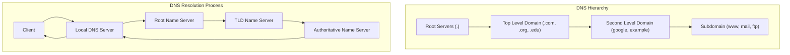

**DNS Components:**

| Component | Function | Examples |
|-----------|----------|----------|
| **Root Servers** | Top-level authority | 13 root servers worldwide |
| **TLD Servers** | Manage top-level domains | .com, .org, .edu, .gov |
| **Authoritative Servers** | Hold actual DNS records | Company DNS servers |
| **Local DNS Servers** | Cache and forward queries | ISP DNS servers |

**DNS Record Types:**

- **A Record**: Maps domain to IPv4 address
- **AAAA Record**: Maps domain to IPv6 address  
- **CNAME**: Creates domain aliases
- **MX Record**: Specifies mail servers
- **NS Record**: Identifies name servers

**Resolution Process:**

1. **Client Query**: User enters domain name
2. **Local Cache Check**: Check local DNS cache
3. **Recursive Query**: Local server queries hierarchy
4. **Response Return**: IP address returned to client

- **Caching**: Improves performance and reduces network traffic
- **Redundancy**: Multiple servers ensure availability
- **Load Distribution**: Balances query load across servers

**Mnemonic:** "Domains Need Systematic name-to-address translation"

## Question 5(a) [3 marks]

**Explain the need of IPv6.**

**Answer**:

IPv6 was developed to address limitations of IPv4 and support future internet growth.

**Key Requirements:**

| Problem | IPv4 Limitation | IPv6 Solution |
|---------|----------------|---------------|
| **Address Space** | 4.3 billion addresses | 340 undecillion addresses |
| **NAT Complexity** | Private-public translation | End-to-end connectivity |
| **Security** | Optional IPSec | Built-in IPSec support |
| **Mobile Support** | Limited mobility | Native mobility support |

**Critical Needs:**

- **IoT Explosion**: Billions of connected devices need unique addresses
- **Mobile Growth**: Smartphones and tablets require internet access
- **Global Connectivity**: Emerging markets joining internet

- **Address Format**: 128-bit vs 32-bit in IPv4
- **Simplified Header**: More efficient packet processing
- **No Fragmentation**: Routers don't fragment packets

**Mnemonic:** "IPv6 provides Infinite addresses for Internet growth"

## Question 5(b) [4 marks]

**Explain confidentiality using Asymmetric Key encryption.**

**Answer**:

Asymmetric encryption uses key pairs (public-private) to ensure data confidentiality.

**Encryption Process:**

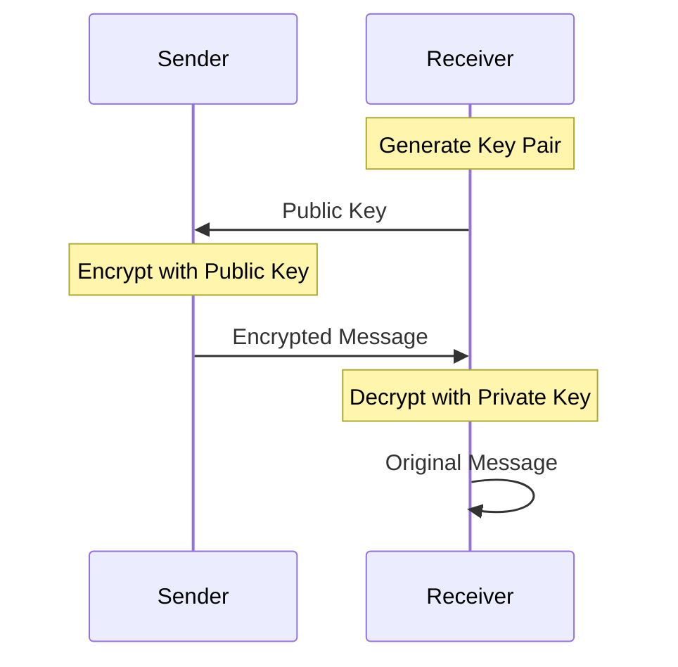

**Key Characteristics:**

| Aspect | Description | Security Benefit |
|--------|-------------|------------------|
| **Public Key** | Freely distributed | Anyone can encrypt |
| **Private Key** | Kept secret | Only owner can decrypt |
| **Key Pair** | Mathematically related | Secure communication |
| **Algorithm** | RSA, ECC, DSA | Strong encryption |

**Confidentiality Process:**

- **Step 1**: Receiver generates public-private key pair
- **Step 2**: Public key shared with sender
- **Step 3**: Sender encrypts message with public key
- **Step 4**: Only receiver's private key can decrypt

- **No Key Exchange**: Eliminates key distribution problem
- **Non-repudiation**: Sender cannot deny sending message
- **Digital Signatures**: Authentication and integrity

**Mnemonic:** "Public locks, Private unlocks"

## Question 5(c) [7 marks]

**Explain man-in-middle attack with example.**

**Answer**:

Man-in-the-middle attack intercepts communication between two parties without their knowledge.

**Attack Process:**

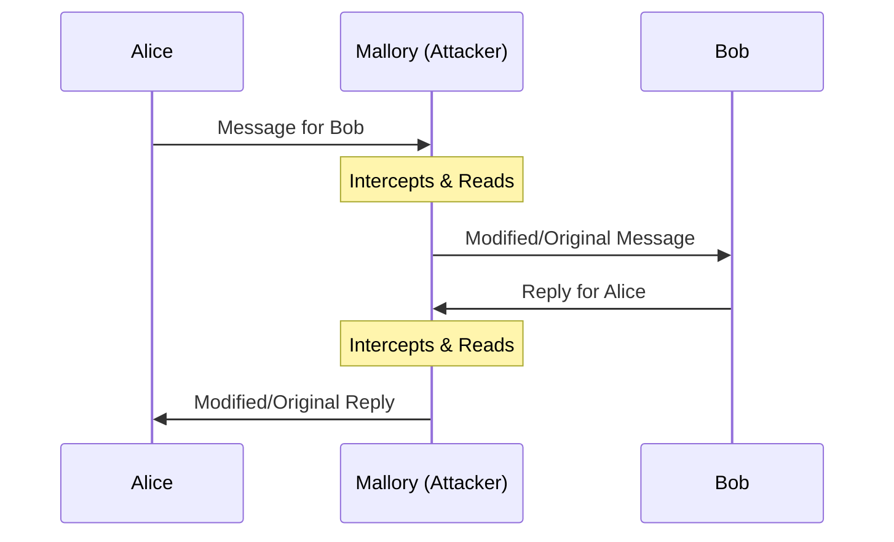

**Attack Stages:**

| Stage | Attacker Action | Victim Impact |
|-------|----------------|---------------|
| **Interception** | Position between parties | Unknown to victims |
| **Decryption** | Break/bypass encryption | Access to data |
| **Modification** | Alter messages | False information |
| **Re-encryption** | Hide tampering | Maintain illusion |

**Real-world Example:**

- **Scenario**: Online banking session
- **Attack**: Attacker on public WiFi intercepts traffic
- **Method**: Creates fake access point "Free_WiFi"
- **Result**: Steals banking credentials and transfers money

**Common Targets:**

- **Public WiFi**: Coffee shops, airports, hotels
- **Email Communication**: Corporate communications
- **Online Shopping**: Credit card information theft
- **Social Media**: Personal information harvesting

**Prevention Measures:**

- **SSL/TLS**: End-to-end encryption protocols
- **VPN Usage**: Secure tunnel for all traffic
- **Certificate Verification**: Check website authenticity
- **Avoid Public WiFi**: Use cellular data for sensitive tasks

**Mnemonic:** "Mallory Intercepts Messages between Alice and Bob"

## Question 5(a OR) [3 marks]

**Give the name of OSI model layers with respect to the following devices.**
**1. Repeater 2. Router 3. Switch**

**Answer**:

**Device-Layer Mapping:**

| Device | OSI Layer | Layer Name | Function |
|--------|-----------|------------|----------|
| **Repeater** | Layer 1 | Physical Layer | Signal amplification |
| **Router** | Layer 3 | Network Layer | IP routing decisions |
| **Switch** | Layer 2 | Data Link Layer | Frame switching |

**Detailed Functions:**

- **Repeater**: Regenerates electrical signals to extend network distance
- **Router**: Makes forwarding decisions based on IP addresses
- **Switch**: Forwards frames based on MAC addresses

**Mnemonic:** "Repeaters work Physically, Switches link Data, Routers route Networks"

## Question 5(b OR) [4 marks]

**Explain confidentiality using Symmetric Key encryption.**

**Answer**:

Symmetric encryption uses single shared key for both encryption and decryption.

**Encryption Process:**

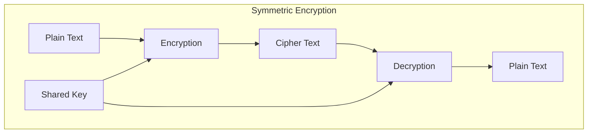

**Key Characteristics:**

| Feature | Description | Example |
|---------|-------------|---------|
| **Single Key** | Same key for encrypt/decrypt | AES-256 key |
| **Fast Processing** | Efficient algorithms | Real-time communication |
| **Key Distribution** | Secure key sharing required | Pre-shared keys |
| **Algorithm Types** | Block and stream ciphers | AES, DES, RC4 |

**Confidentiality Mechanism:**

- **Shared Secret**: Both parties must have same key
- **Encryption**: Sender encrypts with shared key
- **Transmission**: Cipher text sent over insecure channel
- **Decryption**: Receiver decrypts with same key

- **Advantages**: Fast execution, low computational overhead
- **Disadvantages**: Key distribution challenge, scalability issues
- **Applications**: VPN tunnels, file encryption, database security

**Mnemonic:** "Same key Encrypts and Decrypts"

## Question 5(c OR) [7 marks]

**Explain denial of service attack with example.**

**Answer**:

DoS attack makes network resources unavailable to legitimate users by overwhelming the system.

**Attack Types:**

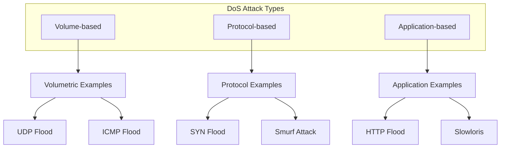

**Attack Categories:**

| Type | Method | Target | Impact |
|------|--------|--------|--------|
| **Volume-based** | Flood with traffic | Bandwidth | Network congestion |
| **Protocol-based** | Exploit protocol weakness | Server resources | Service unavailability |
| **Application-based** | Target application layer | Application server | Service degradation |

**Real-world Example - DDoS on E-commerce:**

- **Target**: Online shopping website during sale season
- **Method**: Botnet of 10,000 infected computers
- **Attack**: Each bot sends 100 requests per second
- **Result**: 1 million requests/second overwhelm servers
- **Impact**: Website crashes, customers cannot purchase, revenue loss

**Common DoS Techniques:**

- **SYN Flood**: Exploits TCP handshake process
- **UDP Flood**: Sends large number of UDP packets
- **Ping of Death**: Oversized ping packets crash systems
- **Slowloris**: Keeps connections open to exhaust server

**Defense Strategies:**

- **Rate Limiting**: Restrict requests per IP address
- **Firewall Rules**: Block suspicious traffic patterns
- **DDoS Protection Services**: CloudFlare, AWS Shield
- **Load Balancing**: Distribute traffic across servers
- **Traffic Analysis**: Monitor for abnormal patterns

**Business Impact:**

- **Revenue Loss**: Customers cannot access services
- **Reputation Damage**: Users lose trust in reliability
- **Operational Cost**: Resources spent on mitigation
- **Legal Issues**: SLA violations, compliance problems

**Mnemonic:** "Deny service by Overwhelming with requests"
