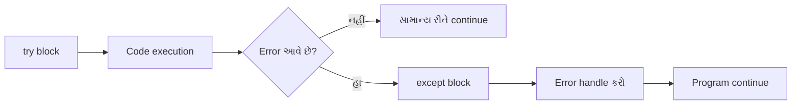

## પ્રશ્ન 1(અ) [3 માર્ક્સ]

**લિસ્ટ શું છે? તેનો પાયથનમાં ઉપયોગ શું છે અને તેની લાક્ષણિકતાઓ લખો.**

**જવાબ**:

લિસ્ટ એ એક ordered collection છે જે એક જ variable માં multiple values store કરી શકે છે. લિસ્ટ mutable છે અને duplicate elements ની મંજૂરી આપે છે.

**ટેબલ: લિસ્ટ લાક્ષણિકતાઓ**

| ફીચર | વર્ણન |
|-------|--------|
| **Ordered** | Elements નો ક્રમ નિર્ધારિત હોય છે |
| **Mutable** | બનાવ્યા પછી બદલી શકાય છે |
| **Indexed** | Index [0,1,2...] વાપરીને access કરી શકાય |
| **Duplicates** | Duplicate values ની મંજૂરી છે |

**પાયથનમાં ઉપયોગ:**

- **Data Storage**: સંબંધિત items નો સંગ્રહ
- **Dynamic Arrays**: Runtime દરમિયાન size બદલી શકાય
- **Iteration**: Elements માં આસાનીથી loop કરી શકાય

**મેમરી ટ્રીક:** "OMID - Ordered, Mutable, Indexed, Duplicates"

---

## પ્રશ્ન 1(બ) [4 માર્ક્સ]

**પાયથનમાં String built-in functions સમજાવો.**

**જવાબ**:

String built-in functions પાયથન પ્રોગ્રામમાં text data ને efficiently manipulate અને process કરવામાં મદદ કરે છે.

**ટેબલ: સામાન્ય String Functions**

| Function | હેતુ | ઉદાહરણ |
|----------|-----|---------|
| **upper()** | Uppercase માં convert કરે | "hello".upper() → "HELLO" |
| **lower()** | Lowercase માં convert કરે | "WORLD".lower() → "world" |
| **strip()** | Whitespace remove કરે | " hi ".strip() → "hi" |
| **split()** | List માં split કરે | "a,b".split(",") → ['a','b'] |
| **replace()** | Substring replace કરે | "cat".replace("c","b") → "bat" |
| **find()** | Substring position શોધે | "hello".find("e") → 1 |

**મુખ્ય મુદ્દાઓ:**

- **Immutable**: Original string અપરિવર્તિત રહે છે
- **Return Values**: Functions નવી strings return કરે છે
- **Case Sensitive**: Functions case ને ધ્યાનમાં રાખે છે

**મેમરી ટ્રીક:** "ULSR-FR - Upper, Lower, Strip, Replace, Find, Replace"

---

## પ્રશ્ન 1(ક OR) [7 માર્ક્સ]

**બિલ્ટ-ઇન Dictionary functions ની યાદી લખો. Dictionary ના functions અને operations દર્શાવવા માટે પ્રોગ્રામ લખો.**

**જવાબ**:

Dictionary એ key-value pairs નો collection છે જે fast lookup અને flexible data organization પ્રદાન કરે છે.

**ટેબલ: Dictionary Functions**

| Function | હેતુ | Return કરે છે |
|----------|-----|---------------|
| **keys()** | બધી keys મેળવે | dict_keys object |
| **values()** | બધી values મેળવે | dict_values object |
| **items()** | Key-value pairs મેળવે | dict_items object |
| **get()** | Safe value retrieval | Value અથવા None |
| **pop()** | Remove કરીને value return કરે | Removed value |
| **clear()** | બધી items remove કરે | None |
| **update()** | Dictionaries merge કરે | None |

**પ્રોગ્રામ ઉદાહરણ:**

```python
# Dictionary બનાવવી
student = {'name': 'John', 'age': 20, 'grade': 'A'}

# Dictionary operations
print("Keys:", list(student.keys()))
print("Values:", list(student.values()))
print("Items:", list(student.items()))

# Safe access
print("Age:", student.get('age', 'Not found'))

# Update અને add
student.update({'city': 'Mumbai', 'age': 21})
print("Updated:", student)

# Remove operations
grade = student.pop('grade')
print("Removed grade:", grade)
```

**મુખ્ય ફીચર્સ:**

- **Fast Lookup**: O(1) average time complexity
- **Flexible Keys**: Strings, numbers, tuples વાપરી શકાય
- **Dynamic**: કોઈ પણ સમયે items add/remove કરી શકાય

**મેમરી ટ્રીક:** "KVIGPCU - Keys, Values, Items, Get, Pop, Clear, Update"

---

## પ્રશ્ન 2(અ) [3 માર્ક્સ]

**Tuple ની વ્યાખ્યા લખો અને તે કઈ રીતે પાયથનમાં બનાવાય?**

**જવાબ**:

Tuple એ ordered collection છે જે immutable છે (બનાવ્યા પછી બદલી શકાતી નથી).

**ટેબલ: Tuple Creation Methods**

| Method | Syntax | ઉદાહરણ |
|--------|--------|---------|
| **Parentheses** | (item1, item2) | (1, 2, 3) |
| **Without Parentheses** | item1, item2 | 1, 2, 3 |
| **Single Item** | (item,) | (5,) |
| **Empty Tuple** | () | () |

**Code ઉદાહરણો:**

```python
# Tuples બનાવવાની વિવિધ રીતો
coordinates = (10, 20)          # Standard way
colors = 'red', 'blue', 'green' # Parentheses વિના
single = (42,)                  # Single element (comma જરૂરી)
empty = ()                      # Empty tuple
```

**મુખ્ય મુદ્દાઓ:**

- **Immutable**: બનાવ્યા પછી elements બદલી શકાતા નથી
- **Ordered**: Elements પોતાની position જાળવે છે
- **Indexable**: Lists જેવી રીતે index વાપરીને access કરી શકાય

**મેમરી ટ્રીક:** "IOI - Immutable, Ordered, Indexed"

---

## પ્રશ્ન 2(બ) [4 માર્ક્સ]

**Module ના ફાયદાઓ સમજાવો.**

**જવાબ**:

Modules એ Python files છે જેમાં functions, classes, અને variables હોય છે જે બીજા programs માં import કરીને reuse કરી શકાય છે.

**ટેબલ: Module ફાયદાઓ**

| ફાયદો | વર્ણન | લાભ |
|-------|-------|-----|
| **Reusability** | Same code multiple times વાપરી શકાય | Development time બચાવે |
| **Organization** | Code ને logical units માં વિભાજિત કરે | Better code structure |
| **Namespace** | Naming conflicts ટાળે | Cleaner code |
| **Maintainability** | એક જ જગ્યાએ code update કરવું | Easy debugging |

**લાભો:**

- **Code Reuse**: એક વાર લખો, ઘણી વાર વાપરો
- **Modularity**: મોટા programs ને નાના ભાગોમાં તોડો
- **Collaboration**: Multiple developers અલગ modules પર કામ કરી શકે
- **Testing**: Individual modules ને અલગથી test કરી શકાય

**ઉદાહરણ Structure:**

```python
# math_utils.py (module)
def add(a, b):
    return a + b

# main.py (module વાપરતું)
import math_utils
result = math_utils.add(5, 3)
```

**મેમરી ટ્રીક:** "RONM - Reusability, Organization, Namespace, Maintainability"

---

## પ્રશ્ન 2(ક) [7 માર્ક્સ]

**યોગ્ય ઉદાહરણ સાથે user defined package બનાવવા માટેના steps લખો.**

**જવાબ**:

Package એ directory છે જેમાં multiple modules હોય છે અને special `__init__.py` file હોય છે.

**Package બનાવવાના Steps:**


**ઉદાહરણ Package Structure:**

```
mathtools/
    __init__.py
    basic.py
    advanced.py
```

**Step-by-Step Implementation:**

**Step 1: Directory બનાવો**

```bash
mkdir mathtools
```

**Step 2: __init__.py બનાવો**

```python
# mathtools/__init__.py
print("MathTools package loaded")
```

**Step 3: basic.py બનાવો**

```python
# mathtools/basic.py
def add(a, b):
    return a + b

def subtract(a, b):
    return a - b
```

**Step 4: advanced.py બનાવો**

```python
# mathtools/advanced.py
def power(base, exp):
    return base ** exp

def factorial(n):
    if n <= 1:
        return 1
    return n * factorial(n-1)
```

**Step 5: Package વાપરો**

```python
# main.py
import mathtools.basic
from mathtools.advanced import power

result1 = mathtools.basic.add(5, 3)
result2 = power(2, 3)
print(f"Addition: {result1}, Power: {result2}")
```

**મુખ્ય આવશ્યકતાઓ:**

- **Directory**: Package directory હોવી જોઈએ
- **__init__.py**: જરૂરી file (ખાલી પણ હોઈ શકે)
- **Modules**: Package અંદર Python files
- **Import Path**: Python ને package path માં મળવું જોઈએ

**મેમરી ટ્રીક:** "DDMFU - Directory, Dunder-init, Modules, Functions, Use"

---

## પ્રશ્ન 2(અ OR) [3 માર્ક્સ]

**Tuple અને List વચ્ચેનો તફાવત લખો.**

**જવાબ**:

Tuple અને List બંને sequence data types છે પરંતુ behavior અને usage માં મહત્વપૂર્ણ તફાવતો છે.

**ટેબલ: Tuple vs List તુલના**

| ફીચર | Tuple | List |
|-------|-------|------|
| **Mutability** | Immutable (બદલી શકાતું નથી) | Mutable (બદલી શકાય છે) |
| **Syntax** | (1, 2, 3) | [1, 2, 3] |
| **Performance** | વધુ ઝડપી | ધીમું |
| **Methods** | મર્યાદિત methods | ઘણી methods ઉપલબ્ધ |
| **Use Case** | Fixed data | Dynamic data |
| **Memory** | ઓછી memory | વધુ memory |

**Code ઉદાહરણ:**

```python
# Tuple - Immutable
coordinates = (10, 20)
# coordinates[0] = 15  # Error!

# List - Mutable  
numbers = [1, 2, 3]
numbers[0] = 10      # બરાબર કામ કરે છે
numbers.append(4)    # Elements add કરી શકાય
```

**ક્યારે વાપરવું:**

- **Tuple**: Coordinates, database records, function arguments
- **List**: Shopping cart, student grades, dynamic collections

**મેમરી ટ્રીક:** "TIF-LIM - Tuple Immutable Fixed, List Mutable Dynamic"

---

## પ્રશ્ન 2(બ OR) [4 માર્ક્સ]

**પાયથનમાં intra-package reference concept સમજાવો.**

**જવાબ**:

Intra-package references package અંદરના modules ને relative imports વાપરીને એકબીજાને import અને use કરવાની મંજૂરી આપે છે.

**Import Types:**

**ટેબલ: Import પ્રકારો**

| Type | Syntax | Usage |
|------|--------|-------|
| **Absolute** | from package.module import function | Root થી full path |
| **Relative** | from .module import function | Same package અંદર |
| **Parent** | from ..module import function | Parent package |

**Package Structure ઉદાહરણ:**

```
calculator/
    __init__.py
    basic.py
    scientific.py
    utils/
        __init__.py
        helpers.py
```

**Implementation:**

```python
# calculator/basic.py
def add(a, b):
    return a + b

# calculator/scientific.py
from .basic import add  # Relative import
from .utils.helpers import validate  # Sub-package import

def advanced_add(a, b):
    if validate(a) and validate(b):
        return add(a, b)
    return None

# calculator/utils/helpers.py
def validate(num):
    return isinstance(num, (int, float))
```

**લાભો:**

- **Clean Code**: ટૂંકા import statements
- **Package Independence**: Packages ને સરળતાથી relocate કરી શકાય
- **Clear Structure**: Package relationships દર્શાવે છે

**મેમરી ટ્રીક:** "RAP - Relative, Absolute, Parent imports"

---

## પ્રશ્ન 2(ક OR) [7 માર્ક્સ]

**Module એટલે શું? વર્તુળનું ક્ષેત્રફળ અને પરિઘ શોધવા માટે module બનાવવાનો પ્રોગ્રામ લખો. આ module ને પ્રોગ્રામમાં import કરો અને તેમાંથી functions call કરો.**

**જવાબ**:

Module એ Python file છે જેમાં functions, classes, અને variables હોય છે જે બીજા programs માં import કરીને વાપરી શકાય છે.

**Circle Module (circle.py):**

```python
# circle.py - Circle operations module
import math

def area(radius):
    """વર્તુળનું ક્ષેત્રફળ calculate કરે"""
    if radius < 0:
        return None
    return math.pi * radius * radius

def circumference(radius):
    """વર્તુળનું પરિઘ calculate કરે"""
    if radius < 0:
        return None
    return 2 * math.pi * radius

def diameter(radius):
    """વર્તુળનું વ્યાસ calculate કરે"""
    if radius < 0:
        return None
    return 2 * radius

# Module constant
PI = math.pi
```

**Main Program (main.py):**

```python
# main.py - Circle module વાપરતો
import circle
from circle import area, circumference

# Method 1: Module name વાપરીને
radius = 5
print("Module name વાપરીને:")
print(f"ક્ષેત્રફળ: {circle.area(radius):.2f}")
print(f"પરિઘ: {circle.circumference(radius):.2f}")

# Method 2: Direct function import
print("\nDirect import વાપરીને:")
print(f"ક્ષેત્રફળ: {area(radius):.2f}")
print(f"પરિઘ: {circumference(radius):.2f}")

# Module constant વાપરવું
print(f"PI મૂલ્ય: {circle.PI:.4f}")
```

**Alternative Import Methods:**

```python
# બધા functions import કરવા
from circle import *

# Alias સાથે import
import circle as c
result = c.area(10)

# Specific function ને alias સાથે import
from circle import area as circle_area
```

**Module લાભો:**

- **Reusability**: Multiple programs માં વાપરી શકાય
- **Organization**: Related functions એકસાથે રાખી શકાય
- **Namespace**: Function name conflicts ટાળી શકાય
- **Testing**: Module functions ને અલગથી test કરી શકાય

**Output ઉદાહરણ:**

```
Module name વાપરીને:
ક્ષેત્રફળ: 78.54
પરિઘ: 31.42

Direct import વાપરીને:
ક્ષેત્રફળ: 78.54
પરિઘ: 31.42
PI મૂલ્ય: 3.1416
```

**મેમરી ટ્રીક:** "IRUD - Import, Reuse, Use, Debug") [7 માર્ક્સ]

**સેટમાંથી કોઈ element કેવી રીતે ઉમેરવું, દૂર કરવું તે લખો. POP remove થી કઈ રીતે અલગ છે તે સમજાવો.**

**જવાબ**:

Sets એ unique elements નો unordered collection છે. પાયથન sets ને modify કરવા માટે વિવિધ methods પ્રદાન કરે છે.

**ટેબલ: Set Operations**

| Operation | Method | Syntax | ઉદાહરણ |
|-----------|--------|--------|---------|
| **Add** | add() | set.add(element) | s.add(5) |
| **Remove** | remove() | set.remove(element) | s.remove(3) |
| **Remove Safe** | discard() | set.discard(element) | s.discard(7) |
| **Pop** | pop() | set.pop() | s.pop() |

**Code ઉદાહરણ:**

```python
# Set બનાવવું
my_set = {1, 2, 3, 4}

# Element ઉમેરવું
my_set.add(5)        # {1, 2, 3, 4, 5}

# Elements દૂર કરવા
my_set.remove(2)     # {1, 3, 4, 5}
my_set.discard(10)   # Element ન હોય તો error નહીં

# Pop operation
element = my_set.pop()  # Random element remove કરે
```

**POP vs REMOVE તફાવત:**

| પાસું | pop() | remove() |
|------|-------|----------|
| **Target** | Random element | Specific element |
| **Parameter** | Parameter જરૂરી નથી | Element value જરૂરી |
| **Return** | Removed element return કરે | None return કરે |
| **Error** | Set empty હોય તો error | Element ન મળે તો error |

**મુખ્ય મુદ્દાઓ:**

- **Random Nature**: pop() unordered nature ને કારણે arbitrary element remove કરે
- **Predictability**: remove() specific known element ને target કરે
- **Error Handling**: KeyError ટાળવા માટે discard() વાપરો

**મેમરી ટ્રીક:** "PRRE - Pop Random, Remove Exact"

---

## પ્રશ્ન 3(અ) [3 માર્ક્સ]

**પાયથનમાં errors ના પ્રકારો સમજાવો.**

**જવાબ**:

Python errors ત્યારે આવે છે જ્યારે code properly execute ન થઈ શકે. Error types સમજવાથી debugging અને robust programs લખવામાં મદદ મળે છે.

**ટેબલ: Python Error પ્રકારો**

| Error Type | વર્ણન | ઉદાહરણ |
|------------|-------|---------|
| **Syntax Error** | Code structure ખોટું | Colon, brackets ગુમ |
| **Runtime Error** | Execution દરમિયાન error | Zero થી division |
| **Logical Error** | Code run થાય પણ wrong result | ખોટું formula |

**સામાન્ય ઉદાહરણો:**

```python
# Syntax Error
# if x > 5  # Colon ગુમ

# Runtime Error  
# result = 10 / 0  # ZeroDivisionError

# Logical Error
def average(a, b):
    return a + b / 2  # (a + b) / 2 હોવું જોઈએ
```

**Error લાક્ષણિકતાઓ:**

- **Syntax**: Execution પહેલાં detect થાય
- **Runtime**: Execution દરમિયાન detect થાય  
- **Logical**: Automatically detect નથી થતી

**મેમરી ટ્રીક:** "SRL - Syntax, Runtime, Logical"

---

## પ્રશ્ન 3(બ) [4 માર્ક્સ]

**try except નું structure સમજાવો.**

**જવાબ**:

Try-except structure runtime errors ને gracefully handle કરે છે, program crashes અટકાવે છે અને user-friendly error messages પ્રદાન કરે છે.

**Basic Structure:**



**Syntax Structure:**

```python
try:
    # Code જે error આપી શકે
    risky_code()
except ErrorType:
    # Specific error handle કરો
    handle_error()
except:
    # કોઈ પણ બીજી error handle કરો
    handle_all_errors()
finally:
    # હંમેશા execute થાય
    cleanup_code()
```

**ટેબલ: Structure Components**

| Block | હેતુ | જરૂરી |
|-------|-----|-------|
| **try** | Risky code સમાવે છે | હા |
| **except** | Specific errors handle કરે | હા |
| **else** | Error ન આવે તો run થાય | નહીં |
| **finally** | હંમેશા execute થાય | નહીં |

**ઉદાહરણ:**

```python
try:
    num = int(input("નંબર દાખલ કરો: "))
    result = 100 / num
    print(f"પરિણામ: {result}")
except ValueError:
    print("અમાન્ય નંબર format")
except ZeroDivisionError:
    print("Zero થી ભાગ આપી શકાતો નથી")
finally:
    print("Operation પૂર્ણ થયું")
```

**મેમરી ટ્રીક:** "TEEF - Try, Except, Else, Finally"

---

## પ્રશ્ન 3(ક) [7 માર્ક્સ]

**Marks Result માટે એક function બનાવો જેમાં English અને Maths marks ની બે arguments હોય, જો કોઈપણ argument નું value 0 કરતાં ઓછું હોય તો error generate કરાવો.**

**જવાબ**:

Custom error handling data validation ensure કરે છે અને invalid inputs માટે meaningful feedback પ્રદાન કરે છે.

**Complete Implementation:**

```python
# Custom exception class
class InvalidMarksError(Exception):
    """Invalid marks માટે custom exception"""
    def __init__(self, subject, marks):
        self.subject = subject
        self.marks = marks
        super().__init__(f"અમાન્ય {subject} marks: {marks}. Marks negative નહીં હોઈ શકે.")

def marks_result(english, maths):
    """
    English અને Maths marks આધારે result calculate કરે
    
    Args:
        english (float): English subject marks
        maths (float): Mathematics subject marks
    
    Returns:
        dict: Total, percentage, અને grade સાથે result
    
    Raises:
        InvalidMarksError: Marks negative હોય તો
        TypeError: Marks numeric ન હોય તો
    """
    
    # Type validation
    if not isinstance(english, (int, float)) or not isinstance(maths, (int, float)):
        raise TypeError("Marks numeric values હોવા જોઈએ")
    
    # Negative marks validation
    if english < 0:
        raise InvalidMarksError("English", english)
    
    if maths < 0:
        raise InvalidMarksError("Mathematics", maths)
    
    # Marks range validation (0-100)
    if english > 100:
        raise InvalidMarksError("English", english)
    
    if maths > 100:
        raise InvalidMarksError("Mathematics", maths)
    
    # Results calculate કરો
    total = english + maths
    percentage = (total / 200) * 100
    
    # Grade નક્કી કરો
    if percentage >= 90:
        grade = 'A+'
    elif percentage >= 80:
        grade = 'A'
    elif percentage >= 70:
        grade = 'B'
    elif percentage >= 60:
        grade = 'C'
    elif percentage >= 50:
        grade = 'D'
    else:
        grade = 'F'
    
    return {
        'english': english,
        'maths': maths,
        'total': total,
        'percentage': round(percentage, 2),
        'grade': grade,
        'status': 'Pass' if percentage >= 50 else 'Fail'
    }

# Usage examples with error handling
def main():
    """Marks_result function ને demonstrate કરતો main function"""
    
    test_cases = [
        (85, 92),      # Valid marks
        (-10, 85),     # Negative English
        (75, -5),      # Negative Maths
        (105, 80),     # Marks > 100
        ("80", 90),    # String input
    ]
    
    for i, (eng, math) in enumerate(test_cases, 1):
        print(f"\nTest Case {i}: English={eng}, Maths={math}")
        try:
            result = marks_result(eng, math)
            print(f"પરિણામ: {result}")
            
        except InvalidMarksError as e:
            print(f"Custom Error: {e}")
            
        except TypeError as e:
            print(f"Type Error: {e}")
            
        except Exception as e:
            print(f"Unexpected Error: {e}")

# Interactive function
def get_student_result():
    """Student marks મેળવવા માટે interactive function"""
    
    while True:
        try:
            print("\n--- Student Result Calculator ---")
            english = float(input("English marks દાખલ કરો (0-100): "))
            maths = float(input("Maths marks દાખલ કરો (0-100): "))
            
            result = marks_result(english, maths)
            
            print(f"\n--- પરિણામ ---")
            print(f"English: {result['english']}")
            print(f"Mathematics: {result['maths']}")
            print(f"Total: {result['total']}/200")
            print(f"Percentage: {result['percentage']}%")
            print(f"Grade: {result['grade']}")
            print(f"Status: {result['status']}")
            
            break
            
        except InvalidMarksError as e:
            print(f"Error: {e}")
            print("કૃપા કરીને valid marks દાખલ કરો (0-100)")
            
        except ValueError:
            print("Error: કૃપા કરીને માત્ર numeric values દાખલ કરો")
            
        except KeyboardInterrupt:
            print("\nProgram user દ્વારા terminate કરાયો")
            break

if __name__ == "__main__":
    main()
    get_student_result()
```

**મુખ્ય ફીચર્સ:**

- **Custom Exception**: InvalidMarksError specific validation માટે
- **Multiple Validations**: Negative, type, અને range checks
- **Comprehensive Results**: Total, percentage, grade calculation
- **User-Friendly**: Interactive input સાથે error handling

**Error Handling લાભો:**

- **Data Integrity**: Valid input data ensure કરે
- **User Experience**: Clear error messages
- **Program Stability**: Crashes અટકાવે
- **Debugging**: Issues identify કરવામાં સરળ

**મેમરી ટ્રીક:** "CVIR - Custom, Validate, Interactive, Robust"

---

## પ્રશ્ન 3(અ OR) [3 માર્ક્સ]

**પાયથનમાં કોઈપણ પાંચ built-in exceptions ની યાદી લખો.**

**જવાબ**:

Built-in exceptions એ predefined error types છે જે Python specific error conditions દરમિયાન raise કરે છે.

**ટેબલ: સામાન્ય Built-in Exceptions**

| Exception | કારણ | ઉદાહરણ |
|-----------|-----|---------|
| **ValueError** | Operation માટે invalid value | int("abc") |
| **TypeError** | ખોટો data type | "5" + 5 |
| **IndexError** | Index range બહાર | list[10] 5-item list માટે |
| **KeyError** | Dictionary key ન મળે | dict["missing_key"] |
| **ZeroDivisionError** | Zero થી division | 10 / 0 |

**Code ઉદાહરણો:**

```python
# ValueError
try:
    number = int("hello")  # Int માં convert ન થઈ શકે
except ValueError:
    print("અમાન્ય number format")

# TypeError  
try:
    result = "text" + 42   # String અને int add ન થઈ શકે
except TypeError:
    print("Type mismatch")

# IndexError
try:
    mylist = [1, 2, 3]
    print(mylist[5])       # Index 5 અસ્તિત્વમાં નથી
except IndexError:
    print("Index range બહાર")
```

**Additional સામાન્ય Exceptions:**

- **FileNotFoundError**: File અસ્તિત્વમાં નથી
- **AttributeError**: Object માં attribute નથી
- **ImportError**: Module import ન થઈ શકે

**મેમરી ટ્રીક:** "VTIKZ - ValueError, TypeError, IndexError, KeyError, ZeroDivisionError"

---

## પ્રશ્ન 3(બ OR) [4 માર્ક્સ]

**Finally પર મુદ્દાઓ લખો અને ઉદાહરણ સાથે સમજાવો.**

**જવાબ**:

`finally` block એ special block છે જે exception આવે કે ન આવે તેની પરવા કર્યા વિના હંમેશા execute થાય છે.

**ટેબલ: Finally Block લાક્ષણિકતાઓ**

| ફીચર | વર્ણન |
|-------|-------|
| **હંમેશા Execute** | Exception આવે તો પણ run થાય |
| **Cleanup Code** | Resource cleanup માટે perfect |
| **Try/Except પછી** | Try અને except blocks પછી execute |
| **Skip ન થઈ શકે** | Return statements પણ skip ન કરી શકે |

**મુખ્ય મુદ્દાઓ:**

- **Guaranteed Execution**: બધા scenarios માં run થાય
- **Resource Management**: Files, database connections બંધ કરે
- **Cleanup Operations**: Memory free કરે, variables reset કરે
- **Return સાથે પણ**: Function return પહેલાં execute થાય

**ઉદાહરણ પ્રોગ્રામ:**

```python
def file_operations(filename):
    """File operations સાથે finally block demonstrate કરે"""
    file_handle = None
    
    try:
        print("File ખોલી રહ્યા છીએ...")
        file_handle = open(filename, 'r')
        
        print("File content વાંચી રહ્યા છીએ...")
        content = file_handle.read()
        
        # Potential error simulate કરો
        if len(content) == 0:
            raise ValueError("File ખાલી છે")
            
        print(f"File content: {content}")
        return content
        
    except FileNotFoundError:
        print("Error: File મળી નથી")
        return None
        
    except ValueError as e:
        print(f"Error: {e}")
        return None
        
    finally:
        print("Finally block execute થઈ રહ્યો છે...")
        if file_handle:
            file_handle.close()
            print("File સફળતાપૂર્વક બંધ થઈ")
        else:
            print("બંધ કરવા માટે કોઈ file નથી")
        print("Cleanup પૂર્ણ થયું")
```

**Function ટેસ્ટ કરો:**

```python
print("=== ટેસ્ટ 1: Valid file ===")
result1 = file_operations("test.txt")

print("\n=== ટેસ્ટ 2: Non-existent file ===") 
result2 = file_operations("missing.txt")
```

**Output ઉદાહરણ:**

```
=== ટેસ્ટ 1: Valid file ===
File ખોલી રહ્યા છીએ...
File content વાંચી રહ્યા છીએ...
File content: Hello World
Finally block execute થઈ રહ્યો છે...
File સફળતાપૂર્વક બંધ થઈ
Cleanup પૂર્ણ થયું

=== ટેસ્ટ 2: Non-existent file ===
File ખોલી રહ્યા છીએ...
Error: File મળી નથી
Finally block execute થઈ રહ્યો છે...
બંધ કરવા માટે કોઈ file નથી
Cleanup પૂર્ણ થયું
```

**મેમરી ટ્રીક:** "ARGC - Always Runs, Resource Cleanup"

---

## પ્રશ્ન 3(ક OR) [7 માર્ક્સ]

**Finally clause સાથે Divide by Zero Exception catch કરવા માટેનો પ્રોગ્રામ લખો.**

**જવાબ**:

Divide by zero exception handling finally clause સાથે proper error management અને resource cleanup demonstrate કરે છે.

**સંપૂર્ણ પ્રોગ્રામ:**

```python
import sys
import logging

# Logging configure કરો
logging.basicConfig(level=logging.INFO, format='%(asctime)s - %(levelname)s - %(message)s')

class DivisionCalculator:
    """Divide by zero exception handling સાથે calculator class"""
    
    def __init__(self):
        self.calculation_count = 0
        self.error_count = 0
    
    def safe_divide(self, dividend, divisor):
        """
        Exception handling સાથે division કરે
        
        Args:
            dividend (float): ભાગવેલો નંબર
            divisor (float): ભાગહાર નંબર
            
        Returns:
            float or None: Division નું પરિણામ અથવા error હોય તો None
        """
        operation_id = self.calculation_count + 1
        
        try:
            print(f"\n--- Operation {operation_id} ---")
            print(f"{dividend} ને {divisor} થી ભાગવાનો પ્રયાસ કરી રહ્યા છીએ")
            logging.info(f"Division operation શરૂ થયું: {dividend} ÷ {divisor}")
            
            # Type validation
            if not isinstance(dividend, (int, float)) or not isinstance(divisor, (int, float)):
                raise TypeError("બંને arguments numeric હોવા જોઈએ")
            
            # Division કરો
            result = dividend / divisor
            
            print(f"પરિણામ: {dividend} ÷ {divisor} = {result}")
            logging.info(f"Division સફળ: {result}")
            
            return result
            
        except ZeroDivisionError:
            error_msg = f"Error: {dividend} ને zero થી ભાગી શકાતું નથી!"
            print(error_msg)
            logging.error(error_msg)
            self.error_count += 1
            return None
            
        except TypeError as e:
            error_msg = f"Type Error: {e}"
            print(error_msg)
            logging.error(error_msg)
            self.error_count += 1
            return None
            
        except Exception as e:
            error_msg = f"Unexpected error: {e}"
            print(error_msg)
            logging.error(error_msg)
            self.error_count += 1
            return None
            
        finally:
            # હંમેશા execute થાય - cleanup અને logging
            self.calculation_count += 1
            print(f"Operation {operation_id} પૂર્ણ થયું")
            print(f"કુલ operations: {self.calculation_count}")
            print(f"કુલ errors: {self.error_count}")
            logging.info(f"Operation {operation_id} finalized")
            
            # Resource cleanup simulation
            if hasattr(self, 'temp_data'):
                delattr(self, 'temp_data')
                print("Temporary data સાફ કર્યો")

def interactive_calculator():
    """Interactive division calculator"""
    
    calc = DivisionCalculator()
    print("=== Interactive Division Calculator ===")
    print("Program exit કરવા માટે 'quit' લખો")
    
    while True:
        try:
            print("\n" + "="*40)
            
            # Dividend મેળવો
            dividend_input = input("ભાગવેલ (dividend) દાખલ કરો: ")
            if dividend_input.lower() == 'quit':
                break
                
            dividend = float(dividend_input)
            
            # Divisor મેળવો
            divisor_input = input("ભાગહાર (divisor) દાખલ કરો: ")
            if divisor_input.lower() == 'quit':
                break
                
            divisor = float(divisor_input)
            
            # Calculation કરો
            result = calc.safe_divide(dividend, divisor)
            
            if result is not None:
                print(f"✓ સફળતા: {dividend} ÷ {divisor} = {result}")
            else:
                print("✗ Operation નિષ્ફળ")
                
        except ValueError:
            print("Error: કૃપા કરીને valid numeric values દાખલ કરો")
            calc.error_count += 1
            
        except KeyboardInterrupt:
            print("\n\nProgram user દ્વારા interrupt કરાયો")
            break
            
        finally:
            # દરેક iteration માટે final cleanup
            if 'dividend_input' in locals():
                del dividend_input
            if 'divisor_input' in locals():
                del divisor_input
            print("Input variables સાફ કર્યા")

def test_division_cases():
    """વિવિધ division scenarios ટેસ્ટ કરો"""
    
    print("=== Division Cases ટેસ્ટ કરી રહ્યા છીએ ===")
    calc = DivisionCalculator()
    
    test_cases = [
        (10, 2),       # Normal division
        (15, 0),       # Divide by zero
        (7.5, 2.5),    # Float division
        (-20, 4),      # Negative numbers
        (0, 5),        # Zero dividend
        ("10", 2),     # String input
        (100, 0.0),    # Zero as float
    ]
    
    for dividend, divisor in test_cases:
        result = calc.safe_divide(dividend, divisor)
    
    # Final statistics
    print(f"\n=== અંતિમ આંકડા ===")
    print(f"કુલ operations પ્રયાસ: {calc.calculation_count}")
    print(f"કુલ errors મળ્યા: {calc.error_count}")
    print(f"સફળતા દર: {((calc.calculation_count - calc.error_count) / calc.calculation_count * 100):.1f}%")

if __name__ == "__main__":
    # Test cases ચલાવો
    test_division_cases()
    
    # Interactive calculator ચલાવો
    interactive_calculator()
```

**મુખ્ય ફીચર્સ:**

- **Comprehensive Error Handling**: Multiple exception types
- **Finally Clause**: Cleanup માટે હંમેશા execute થાય
- **Logging**: Operations અને errors track કરે
- **Interactive Mode**: User-friendly interface
- **Statistics**: Operation success tracking

**મેમરી ટ્રીક:** "CFLIS - Comprehensive, Finally, Logging, Interactive, Statistics"

---

## પ્રશ્ન 4(અ) [3 માર્ક્સ]

**File Handling શું છે? File Handling Operations ની યાદી બનાવો.**

**જવાબ**:

File Handling એ computer storage devices પર stored files સાથે કામ કરવાની process છે data read, write, અને manipulate કરવા માટે.

**ટેબલ: File Handling Operations**

| Operation | હેતુ | Method |
|-----------|-----|--------|
| **Open** | Operations માટે file access કરે | open() |
| **Read** | File માંથી content retrieve કરે | read(), readline() |
| **Write** | File માં content add કરે | write(), writelines() |
| **Close** | File resources release કરે | close() |
| **Seek** | File pointer move કરે | seek() |
| **Tell** | Current position મેળવે | tell() |

**સામાન્ય Use Cases:**

- **Data Storage**: Program data permanently save કરે
- **Configuration**: Files માંથી settings read કરે
- **Logging**: Program activities record કરે
- **Import/Export**: અન્ય programs સાથે data exchange કરે

**Basic ઉદાહરણ:**

```python
# Basic file operations
file = open("data.txt", "w")  # Open
file.write("Hello World")     # Write
file.close()                  # Close
```

**મેમરી ટ્રીક:** "ORWCST - Open, Read, Write, Close, Seek, Tell"

---

## પ્રશ્ન 4(બ) [4 માર્ક્સ]

**Object Serialization સમજાવો.**

**જવાબ**:

Object Serialization એ Python objects ને એવા format માં convert કરવાની process છે જે files માં store કરી શકાય અથવા networks પર transmit કરી શકાય.

**ટેબલ: Serialization Methods**

| Method | Module | હેતુ | File Type |
|--------|--------|-----|-----------|
| **Pickle** | pickle | Python objects | Binary |
| **JSON** | json | Web-compatible data | Text |
| **CSV** | csv | Tabular data | Text |
| **XML** | xml | Structured documents | Text |

**Pickle ઉદાહરણ:**

```python
import pickle

# Serialization (લખવું)
data = {'name': 'John', 'age': 25, 'scores': [85, 92, 78]}

with open('data.pkl', 'wb') as file:
    pickle.dump(data, file)

# Deserialization (વાંચવું)
with open('data.pkl', 'rb') as file:
    loaded_data = pickle.load(file)
    print(loaded_data)
```

**લાભો:**

- **Persistence**: Objects permanently store કરે
- **Data Transfer**: Programs વચ્ચે objects send કરે
- **Caching**: Processed results save કરે
- **Backup**: Object snapshots બનાવે

**મર્યાદાઓ:**

- **Python Specific**: Pickle માત્ર Python સાથે કામ કરે
- **Security Risk**: Untrusted pickle files load ન કરો
- **Version Compatibility**: અલગ Python versions માં issues આવી શકે

**મેમરી ટ્રીક:** "SPDT - Store, Persist, Data Transfer"

---

## પ્રશ્ન 4(ક) [7 માર્ક્સ]

**ફાઇલમાં ના તમામ સ્વરોની ગણતરી કરવા માટેનો પ્રોગ્રામ લખો.**

**જવાબ**:

Vowel counting program file reading અને text processing comprehensive error handling સાથે demonstrate કરે છે.

**સંપૂર્ણ પ્રોગ્રામ:**

```python
import os
import string
from collections import Counter

class VowelCounter:
    """Text files માં vowels count કરવા માટેની class"""
    
    def __init__(self):
        self.vowels = set('aeiouAEIOU')
        self.total_files_processed = 0
        self.total_vowels_found = 0
    
    def count_vowels_in_text(self, text):
        """
        આપેલા text માં vowels count કરે
        
        Args:
            text (str): Analyze કરવાનો text
            
        Returns:
            dict: Vowel counts અને statistics
        """
        vowel_counts = {vowel.lower(): 0 for vowel in 'aeiou'}
        total_vowels = 0
        total_characters = 0
        
        for char in text:
            if char.isalpha():
                total_characters += 1
                if char.lower() in vowel_counts:
                    vowel_counts[char.lower()] += 1
                    total_vowels += 1
        
        return {
            'vowel_counts': vowel_counts,
            'total_vowels': total_vowels,
            'total_characters': total_characters,
            'vowel_percentage': (total_vowels / total_characters * 100) if total_characters > 0 else 0
        }
    
    def count_vowels_in_file(self, filename):
        """
        Specific file માં vowels count કરે
        
        Args:
            filename (str): File નો path
            
        Returns:
            dict or None: Vowel analysis results
        """
        try:
            print(f"\n--- File process કરી રહ્યા છીએ: {filename} ---")
            
            # ચકાસો કે file exists છે કે નહીં
            if not os.path.exists(filename):
                raise FileNotFoundError(f"File '{filename}' મળી નથી")
            
            # ચકાસો કે તે file છે (directory નહીં)
            if not os.path.isfile(filename):
                raise ValueError(f"'{filename}' file નથી")
            
            # File content read કરો
            with open(filename, 'r', encoding='utf-8') as file:
                content = file.read()
            
            print(f"File size: {len(content)} characters")
            
            if not content.strip():
                print("Warning: File ખાલી છે")
                return None
            
            # Vowels count કરો
            results = self.count_vowels_in_text(content)
            
            # Results display કરો
            print(f"કુલ characters (માત્ર letters): {results['total_characters']}")
            print(f"કુલ vowels મળ્યા: {results['total_vowels']}")
            print(f"Vowel percentage: {results['vowel_percentage']:.2f}%")
            
            print("\nવ્યક્તિગત vowel counts:")
            for vowel, count in results['vowel_counts'].items():
                percentage = (count / results['total_vowels'] * 100) if results['total_vowels'] > 0 else 0
                print(f"  {vowel.upper()}: {count} ({percentage:.1f}%)")
            
            # Statistics update કરો
            self.total_files_processed += 1
            self.total_vowels_found += results['total_vowels']
            
            return results
            
        except FileNotFoundError as e:
            print(f"Error: {e}")
            return None
            
        except PermissionError:
            print(f"Error: '{filename}' read કરવાની permission નથી")
            return None
            
        except UnicodeDecodeError:
            print(f"Error: File '{filename}' decode ન થઈ શકે. અલગ encoding વાપરો.")
            return None
            
        except Exception as e:
            print(f"Unexpected error: {e}")
            return None
        
        finally:
            print(f"File processing પૂર્ણ થયું: {filename}")
    
    def create_sample_file(self, filename="sample.txt"):
        """Testing માટે sample file બનાવે"""
        sample_content = """Python એક programming language છે.
તે શીખવામાં સરળ અને શક્તિશાળી છે.
Python નું syntax સરળ છે અને ઉત્તમ libraries છે.
આપણે Python વાપરીને web development, data science, અને automation કરી શકીએ છીએ.
આ file માં વિવિધ vowels છે: a, e, i, o, u.
UPPER CASE VOWELS: A, E, I, O, U."""
        
        try:
            with open(filename, 'w', encoding='utf-8') as file:
                file.write(sample_content)
            print(f"Sample file '{filename}' સફળતાપૂર્વક બનાવી")
            return True
        except Exception as e:
            print(f"Sample file બનાવવામાં error: {e}")
            return False
    
    def batch_process_files(self, file_list):
        """Multiple files process કરે"""
        print("=== Batch Processing Files ===")
        
        all_results = []
        
        for filename in file_list:
            result = self.count_vowels_in_file(filename)
            if result:
                all_results.append((filename, result))
        
        # Summary statistics
        if all_results:
            print(f"\n=== Batch Processing Summary ===")
            print(f"Files સફળતાપૂર્વક process થયા: {len(all_results)}")
            
            total_vowels = sum(result['total_vowels'] for _, result in all_results)
            total_chars = sum(result['total_characters'] for _, result in all_results)
            
            print(f"બધી files માં કુલ vowels: {total_vowels}")
            print(f"બધી files માં કુલ characters: {total_chars}")
            print(f"એકંદર vowel percentage: {(total_vowels/total_chars*100):.2f}%")

def interactive_vowel_counter():
    """Interactive vowel counter program"""
    
    counter = VowelCounter()
    
    while True:
        print("\n" + "="*50)
        print("VOWEL COUNTER PROGRAM")
        print("="*50)
        print("1. હાલની file માં vowels count કરો")
        print("2. Sample file બનાવીને vowels count કરો")
        print("3. Text સીધો દાખલ કરો")
        print("4. Multiple files process કરો")
        print("5. Exit")
        
        try:
            choice = input("\nતમારી પસંદગી દાખલ કરો (1-5): ").strip()
            
            if choice == '1':
                filename = input("Filename દાખલ કરો: ").strip()
                counter.count_vowels_in_file(filename)
                
            elif choice == '2':
                filename = input("Sample માટે filename દાખલ કરો (default: sample.txt): ").strip()
                if not filename:
                    filename = "sample.txt"
                
                if counter.create_sample_file(filename):
                    counter.count_vowels_in_file(filename)
                
            elif choice == '3':
                text = input("Analyze કરવા માટે text દાખલ કરો: ")
                if text.strip():
                    result = counter.count_vowels_in_text(text)
                    print(f"\nદાખલ કરેલા text માટે vowel analysis:")
                    print(f"કુલ vowels: {result['total_vowels']}")
                    print(f"Vowel percentage: {result['vowel_percentage']:.2f}%")
                    for vowel, count in result['vowel_counts'].items():
                        if count > 0:
                            print(f"  {vowel.upper()}: {count}")
                else:
                    print("કોઈ text દાખલ કર્યો નથી")
                    
            elif choice == '4':
                files_input = input("Commas થી વિભાજિત filenames દાખલ કરો: ")
                file_list = [f.strip() for f in files_input.split(',') if f.strip()]
                if file_list:
                    counter.batch_process_files(file_list)
                else:
                    print("કોઈ files specify કરી નથી")
                    
            elif choice == '5':
                print("Vowel Counter વાપરવા બદલ આભાર!")
                break
                
            else:
                print("અમાન્ય પસંદગી. કૃપા કરીને 1-5 દાખલ કરો.")
                
        except KeyboardInterrupt:
            print("\n\nProgram interrupt કરાયો. ગુડબાય!")
            break
        except Exception as e:
            print(f"Error: {e}")

if __name__ == "__main__":
    interactive_vowel_counter()
```

**પ્રોગ્રામ ફીચર્સ:**

- **File Validation**: File existence અને permissions check કરે
- **Error Handling**: Comprehensive exception management
- **Multiple Modes**: File input, text input, batch processing
- **Statistics**: Individual અને overall vowel counts
- **Interactive Interface**: User-friendly menu system

**Output ઉદાહરણ:**

```
--- File process કરી રહ્યા છીએ: sample.txt ---
File size: 245 characters
કુલ characters (માત્ર letters): 195
કુલ vowels મળ્યા: 78
Vowel percentage: 40.00%

વ્યક્તિગત vowel counts:
  A: 15 (19.2%)
  E: 20 (25.6%)
  I: 12 (15.4%)
  O: 18 (23.1%)
  U: 13 (16.7%)
```

**મેમરી ટ્રીક:** "FVESI - File Validation, Vowel Extraction, Statistics, Interactive"

---

## પ્રશ્ન 4(અ OR) [3 માર્ક્સ]

**ફાઇલ કેવી રીતે open અને close કરવી? તેના માટે syntax પણ આપો.**

**જવાબ**:

File opening અને closing Python માં file handling ના fundamental operations છે specific syntax અને modes સાથે.

**ટેબલ: File Opening Modes**

| Mode | હેતુ | વર્ણન |
|------|-----|-------|
| **'r'** | Read | Existing file read કરે (default) |
| **'w'** | Write | નવી file બનાવે અથવા existing ને overwrite કરે |
| **'a'** | Append | Existing file ના અંતે add કરે |
| **'r+'** | Read/Write | Existing file read અને write કરે |

**Syntax ઉદાહરણો:**

```python
# Files opening
file = open("filename.txt", "r")     # Read mode
file = open("data.txt", "w")         # Write mode
file = open("log.txt", "a")          # Append mode

# Files closing
file.close()                         # Manual closing

# 'with' statement સાથે automatic closing
with open("filename.txt", "r") as file:
    content = file.read()
# અહીં file automatically close થઈ જાય છે
```

**Best Practices:**

- **હંમેશા Close કરો**: Resource leaks અટકાવો
- **'with' વાપરો**: Automatic file closing
- **Mode Specify કરો**: File mode વિશે explicit રહો
- **Errors Handle કરો**: File operations માટે try-except વાપરો

**મેમરી ટ્રીક:** "ORWA - Open, Read, Write, Append modes"

---

## પ્રશ્ન 4(બ OR) [4 માર્ક્સ]

**Text file અને Binary file નો તફાવત લખો.**

**જવાબ**:

Text અને Binary files અલગ formats માં data store કરે છે, Python programming માં અલગ handling approaches જરૂરી છે.

**ટેબલ: Text vs Binary Files તુલના**

| પાસું | Text File | Binary File |
|------|-----------|-------------|
| **Content** | Human-readable characters | Machine-readable bytes |
| **Mode** | 'r', 'w', 'a' | 'rb', 'wb', 'ab' |
| **Encoding** | UTF-8, ASCII encoding | કોઈ encoding નથી |
| **Size** | Encoding ને કારણે મોટી | નાની, compact |
| **ઉદાહરણો** | .txt, .py, .html | .jpg, .exe, .pkl |
| **Editing** | કોઈપણ text editor | Specialized software |

**Code ઉદાહરણો:**

```python
# Text File Operations
with open("text_file.txt", "w") as file:
    file.write("Hello World!")

with open("text_file.txt", "r") as file:
    content = file.read()
    print(content)  # Output: Hello World!

# Binary File Operations  
import pickle

data = [1, 2, 3, 4, 5]

# Binary write
with open("binary_file.pkl", "wb") as file:
    pickle.dump(data, file)

# Binary read
with open("binary_file.pkl", "rb") as file:
    loaded_data = pickle.load(file)
    print(loaded_data)  # Output: [1, 2, 3, 4, 5]
```

**ક્યારે વાપરવું:**

- **Text Files**: Configuration, logs, source code, documentation
- **Binary Files**: Images, videos, executables, serialized objects

**મુખ્ય તફાવતો:**

- **Portability**: Text files systems વચ્ચે વધુ portable
- **Efficiency**: Binary files space અને time efficient
- **Human Readable**: Text files સીધી રીતે જોઈ શકાય

**મેમરી ટ્રીક:** "TCEB - Text Character Encoding Bigger, Binary Compact Efficient"

---

## પ્રશ્ન 4(ક OR) [7 માર્ક્સ]

**સીટ નંબર અને નામ store કરવા માટે binary file બનાવવાનો પ્રોગ્રામ લખો. કોઈપણ સીટ નંબર શોધો અને જો સીટ નંબર મળે તો નામ display કરો અન્યથા "Seat no not found" display કરો.**

**જવાબ**:

Student record management માટે binary file program pickle serialization સાથે search functionality દર્શાવે છે.

**સંપૂર્ણ પ્રોગ્રામ:**

```python
import pickle
import os
from typing import Dict, Optional

class StudentRecordManager:
    """Binary file માં student records manage કરવા માટે"""
    
    def __init__(self, filename="students.pkl"):
        self.filename = filename
        self.records = {}
        self.load_records()
    
    def load_records(self):
        """Binary file માંથી existing records load કરે"""
        try:
            if os.path.exists(self.filename):
                with open(self.filename, 'rb') as file:
                    self.records = pickle.load(file)
                print(f"{len(self.records)} existing records load કર્યા")
            else:
                print("કોઈ existing record file મળી નથી. નવી શરૂઆત કરી રહ્યા છીએ.")
                self.records = {}
        except Exception as e:
            print(f"Records load કરવામાં error: {e}")
            self.records = {}
    
    def save_records(self):
        """Records ને binary file માં save કરે"""
        try:
            with open(self.filename, 'wb') as file:
                pickle.dump(self.records, file)
            print(f"Records સફળતાપૂર્વક {self.filename} માં save કર્યા")
            return True
        except Exception as e:
            print(f"Records save કરવામાં error: {e}")
            return False
    
    def add_student(self, seat_no: int, name: str):
        """નવો student record add કરે"""
        try:
            if not isinstance(seat_no, int) or seat_no <= 0:
                raise ValueError("Seat number positive integer હોવું જોઈએ")
            
            if not name or not name.strip():
                raise ValueError("Name ખાલી ન હોઈ શકે")
            
            name = name.strip().title()
            
            if seat_no in self.records:
                print(f"Warning: Seat {seat_no} પહેલેથી અસ્તિત્વમાં છે નામ '{self.records[seat_no]}'")
                overwrite = input("શું તમે overwrite કરવા માંગો છો? (y/n): ").lower()
                if overwrite != 'y':
                    print("Record add કર્યો નથી")
                    return False
            
            self.records[seat_no] = name
            self.save_records()
            print(f"Student add કર્યો: Seat {seat_no} - {name}")
            return True
            
        except ValueError as e:
            print(f"Error: {e}")
            return False
        except Exception as e:
            print(f"Unexpected error: {e}")
            return False
    
    def search_student(self, seat_no: int):
        """Seat number દ્વારા student શોધે"""
        try:
            if not isinstance(seat_no, int):
                raise ValueError("Seat number integer હોવું જોઈએ")
            
            if seat_no in self.records:
                name = self.records[seat_no]
                print(f"મળ્યું: Seat {seat_no} - {name}")
                return name
            else:
                print("Seat no not found")
                return None
                
        except ValueError as e:
            print(f"Error: {e}")
            return None
        except Exception as e:
            print(f"Unexpected error: {e}")
            return None
    
    def display_all_records(self):
        """બધા student records display કરે"""
        if not self.records:
            print("કોઈ records મળ્યા નથી")
            return
        
        print(f"\n--- બધા Student Records (કુલ {len(self.records)}) ---")
        print("Seat No. | Name")
        print("-" * 25)
        
        # Better display માટે seat number થી sort કરો
        for seat_no in sorted(self.records.keys()):
            print(f"{seat_no:8} | {self.records[seat_no]}")
    
    def delete_student(self, seat_no: int):
        """Student record delete કરે"""
        try:
            if seat_no in self.records:
                name = self.records[seat_no]
                del self.records[seat_no]
                self.save_records()
                print(f"Delete કર્યું: Seat {seat_no} - {name}")
                return True
            else:
                print("Seat no not found")
                return False
        except Exception as e:
            print(f"Record delete કરવામાં error: {e}")
            return False
    
    def get_statistics(self):
        """Record statistics મેળવે"""
        if not self.records:
            print("Statistics માટે કોઈ records ઉપલબ્ધ નથી")
            return
        
        seat_numbers = list(self.records.keys())
        print(f"\n--- આંકડા ---")
        print(f"કુલ students: {len(self.records)}")
        print(f"સૌથી નીચો seat number: {min(seat_numbers)}")
        print(f"સૌથી ઊંચો seat number: {max(seat_numbers)}")
        print(f"File size: {os.path.getsize(self.filename) if os.path.exists(self.filename) else 0} bytes")

def add_sample_data(manager):
    """Testing માટે sample student data add કરે"""
    sample_students = [
        (101, "Alice Johnson"),
        (102, "Bob Smith"),
        (103, "Charlie Brown"),
        (104, "Diana Prince"),
        (105, "Edward Norton"),
        (201, "Fiona Apple"),
        (202, "George Wilson"),
        (203, "Hannah Montana"),
        (204, "Ian Fleming"),
        (205, "Julia Roberts")
    ]
    
    print("Sample data add કરી રહ્યા છીએ...")
    for seat_no, name in sample_students:
        manager.records[seat_no] = name
    
    manager.save_records()
    print(f"{len(sample_students)} sample records add કર્યા")

def main():
    """Interactive menu સાથે main program"""
    
    print("=" * 50)
    print("STUDENT RECORD MANAGEMENT SYSTEM")
    print("Binary File Storage with Search")
    print("=" * 50)
    
    manager = StudentRecordManager()
    
    while True:
        print(f"\n--- મેનું ---")
        print("1. નવો student add કરો")
        print("2. Seat number દ્વારા student શોધો")
        print("3. બધા records display કરો")
        print("4. Student record delete કરો")
        print("5. Sample data add કરો")
        print("6. Statistics બતાવો")
        print("7. Exit")
        
        try:
            choice = input("\nતમારી પસંદગી દાખલ કરો (1-7): ").strip()
            
            if choice == '1':
                try:
                    seat_no = int(input("Seat number દાખલ કરો: "))
                    name = input("Student નું નામ દાખલ કરો: ")
                    manager.add_student(seat_no, name)
                except ValueError:
                    print("Error: કૃપા કરીને valid seat number દાખલ કરો")
            
            elif choice == '2':
                try:
                    seat_no = int(input("શોધવા માટે seat number દાખલ કરો: "))
                    manager.search_student(seat_no)
                except ValueError:
                    print("Error: કૃપા કરીને valid seat number દાખલ કરો")
            
            elif choice == '3':
                manager.display_all_records()
            
            elif choice == '4':
                try:
                    seat_no = int(input("Delete કરવા માટે seat number દાખલ કરો: "))
                    confirm = input(f"શું તમે ખરેખર seat {seat_no} delete કરવા માંગો છો? (y/n): ")
                    if confirm.lower() == 'y':
                        manager.delete_student(seat_no)
                except ValueError:
                    print("Error: કૃપા કરીને valid seat number દાખલ કરો")
            
            elif choice == '5':
                confirm = input("આ sample data add કરશે. Continue કરવું? (y/n): ")
                if confirm.lower() == 'y':
                    add_sample_data(manager)
            
            elif choice == '6':
                manager.get_statistics()
            
            elif choice == '7':
                print("Student Record System વાપરવા બદલ આભાર!")
                break
            
            else:
                print("અમાન્ય પસંદગી. કૃપા કરીને 1-7 દાખલ કરો.")
                
        except KeyboardInterrupt:
            print("\n\nProgram interrupt કરાયો. ગુડબાય!")
            break
        except Exception as e:
            print(f"Error: {e}")

def quick_demo():
    """Program નું quick demonstration"""
    print("\n--- QUICK DEMO ---")
    
    # Demo file સાથે manager બનાવો
    demo_manager = StudentRecordManager("demo_students.pkl")
    
    # કેટલાક students add કરો
    demo_students = [
        (101, "John Doe"),
        (102, "Jane Smith"),
        (103, "Mike Johnson")
    ]
    
    print("Demo students add કરી રહ્યા છીએ...")
    for seat_no, name in demo_students:
        demo_manager.add_student(seat_no, name)
    
    print("\nExists કરતા student માટે search:")
    demo_manager.search_student(102)
    
    print("\nNon-existing student માટે search:")
    demo_manager.search_student(999)
    
    print("\nબધા records:")
    demo_manager.display_all_records()

if __name__ == "__main__":
    # User ને demo અથવા full program માટે પૂછો
    mode = input("(d)emo ચલાવવું કે (f)ull program? (d/f): ").lower()
    
    if mode == 'd':
        quick_demo()
    else:
        main()
```

**પ્રોગ્રામ ફીચર્સ:**

- **Binary Storage**: Efficient data storage માટે pickle વાપરે
- **Search Functionality**: ઝડપી seat number lookup
- **Error Handling**: Comprehensive input validation
- **CRUD Operations**: Create, Read, Update, Delete records
- **Statistics**: File અને record information
- **Interactive Menu**: User-friendly interface

**Sample Output:**

```
શોધવા માટે seat number દાખલ કરો: 102
મળ્યું: Seat 102 - Jane Smith

શોધવા માટે seat number દાખલ કરો: 999
Seat no not found
```

**મેમરી ટ્રીક:** "BSECH - Binary Storage, Search Efficiently, CRUD Handling"

---

## પ્રશ્ન 5(અ) [3 માર્ક્સ]

**Turtle શું છે અને તેનો ઉપયોગ objects દોરવા માટે કેવી રીતે થાય છે?**

**જવાબ**:

Turtle એ Python graphics module છે જે virtual drawing canvas પ્રદાન કરે છે turtle cursor સાથે programmatically graphics બનાવવા માટે.

**ટેબલ: Turtle Basics**

| Component | વર્ણન | હેતુ |
|-----------|-------|-----|
| **Canvas** | Drawing surface | ગ્રાફિક્સ દેખાય તે વિસ્તાર |
| **Turtle** | Drawing cursor | ખસે છે અને lines દોરે છે |
| **Pen** | Drawing tool | Line appearance control કરે |
| **Commands** | Movement functions | Turtle actions control કરે |

**Basic Drawing Concept:**

```python
import turtle

# Screen અને turtle બનાવો
screen = turtle.Screen()
pen = turtle.Turtle()

# એક square દોરો
for i in range(4):
    pen.forward(100)    # 100 units આગળ જાઓ
    pen.right(90)       # 90 degrees જમણે વળો

screen.exitonclick()    # Click પર બંધ કરો
```

**મુખ્ય ફીચર્સ:**

- **Visual Programming**: તરત જ results જોઈ શકાય
- **Educational**: Programming concepts શીખવા માટે સરસ
- **Interactive**: Real-time drawing feedback
- **Simple Syntax**: જટિલ graphics માટે સરળ commands

**સામાન્ય ઉપયોગો:**

- **Geometric Shapes**: વર્ગ, વર્તુળ, બહુકોણ
- **Patterns**: Fractals, spirals, designs
- **Educational Graphics**: Geometry અને programming શીખવવા

**મેમરી ટ્રીક:** "CPTT - Canvas, Pen, Turtle, Teaching tool"

---

## પ્રશ્ન 5(બ) [4 માર્ક્સ]

**Turtle ને બીજી સ્થિતિમાં ખસેડવાની વિવિધ રીતો સમજાવો.**

**જવાબ**:

Turtle drawing canvas પર positioning અને navigation માટે multiple movement methods પ્રદાન કરે છે.

**ટેબલ: Turtle Movement Methods**

| Method | હેતુ | Pen State | ઉદાહરણ |
|--------|-----|-----------|---------|
| **forward(distance)** | આગળ જાઓ | Line દોરે | forward(100) |
| **backward(distance)** | પાછળ જાઓ | Line દોરે | backward(50) |
| **goto(x, y)** | Coordinates પર જાઓ | Line દોરે | goto(100, 50) |
| **penup()** | Pen ઉઠાવો | Drawing નહીં | penup() |
| **pendown()** | Pen નીચે કરો | Line દોરે | pendown() |
| **setx(x)** | X coordinate set કરો | Line દોરે | setx(200) |
| **sety(y)** | Y coordinate set કરો | Line દોરે | sety(150) |

**Movement ઉદાહરણો:**

```python
import turtle

pen = turtle.Turtle()
pen.speed(3)

# Method 1: Forward/Backward movement
pen.forward(100)
pen.backward(50)

# Method 2: Drawing સાથે direct positioning
pen.goto(200, 100)

# Method 3: Drawing વિના move કરવું
pen.penup()
pen.goto(-100, -100)
pen.pendown()

# Method 4: Coordinates અલગથી set કરવા
pen.setx(0)
pen.sety(0)
```

**Rotation Methods:**

- **right(angle)**: Clockwise turn
- **left(angle)**: Counterclockwise turn
- **setheading(angle)**: Absolute direction set કરો

**Position Control:**

- **Drawing Mode**: Pen down, trail છોડે
- **Moving Mode**: Pen up, કોઈ trail નહીં
- **Coordinate System**: Center (0,0), positive Y ઉપર

**મેમરી ટ્રીક:** "FGPRS - Forward, Goto, Penup, Rotate, Set coordinates"

---

## પ્રશ્ન 5(ક) [7 માર્ક્સ]

**Turtle માં loops કેવી રીતે ઉપયોગી થઈ શકે તે ઉદાહરણ સાથે સમજાવો.**

**જવાબ**:

Turtle graphics માં loops repetitive patterns, complex shapes, અને geometric designs માટે efficient code enable કરે છે.

**Loops ના Turtle માં ફાયદા:**

**ટેબલ: Loop Applications**

| Loop Type | Use Case | ઉદાહરણ Pattern |
|-----------|----------|-----------------|
| **For Loop** | Fixed repetitions | Regular polygons |
| **While Loop** | Conditional drawing | Spirals |
| **Nested Loops** | Complex patterns | Grids, fractals |
| **Range Loop** | Incremental changes | Color gradients |

**સંપૂર્ણ ઉદાહરણ પ્રોગ્રામ:**

```python
import turtle
import random
import math

def setup_screen():
    """Turtle screen setup કરે"""
    screen = turtle.Screen()
    screen.bgcolor("black")
    screen.title("Turtle Graphics with Loops")
    screen.setup(800, 600)
    return screen

def draw_polygon(sides, size, pen):
    """For loop વાપરીને regular polygon દોરે"""
    angle = 360 / sides
    
    for i in range(sides):
        pen.forward(size)
        pen.right(angle)

def draw_spiral(pen):
    """While loop વાપરીને spiral દોરે"""
    pen.color("cyan")
    pen.speed(10)
    
    distance = 1
    while distance < 100:
        pen.forward(distance)
        pen.right(91)
        distance += 2

def draw_flower_pattern(pen):
    """Nested loops વાપરીને flower દોરે"""
    pen.color("red")
    pen.speed(0)
    
    # Petals માટે outer loop
    for petal in range(36):
        pen.color(random.choice(["red", "pink", "yellow", "orange"]))
        
        # દરેક petal shape માટે inner loop
        for side in range(4):
            pen.forward(50)
            pen.right(90)
        
        pen.right(10)  # આગલી petal માટે rotate

def draw_colorful_squares(pen):
    """Colors અને sizes બદલતા squares દોરે"""
    colors = ["red", "blue", "green", "yellow", "purple", "orange"]
    pen.speed(0)
    
    for i in range(50):
        pen.color(colors[i % len(colors)])
        pen.forward(i * 2)
        pen.right(91)

def draw_geometric_pattern(pen):
    """Nested loops સાથે complex geometric pattern"""
    pen.speed(0)
    
    # Pattern repetition માટે outer loop
    for pattern in range(6):
        pen.color(random.choice(["blue", "green", "purple", "orange"]))
        
        # Shape creation માટે middle loop
        for shape in range(8):
            # Individual shape માટે inner loop
            for side in range(6):
                pen.forward(30)
                pen.right(60)
            pen.right(45)
        
        pen.right(60)

def draw_star_with_loop(pen):
    """Loop વાપરીને star દોરે"""
    pen.color("gold")
    pen.begin_fill()
    
    for point in range(5):
        pen.forward(100)
        pen.right(144)
    
    pen.end_fill()

def draw_concentric_circles(pen):
    """Loop વાપરીને concentric circles દોરે"""
    pen.speed(0)
    colors = ["red", "orange", "yellow", "green", "blue", "purple"]
    
    for i in range(6):
        pen.color(colors[i])
        pen.circle(20 + i * 15)
        pen.penup()
        pen.goto(0, -(10 + i * 15))
        pen.pendown()

def main_demo():
    """Main demonstration function"""
    screen = setup_screen()
    pen = turtle.Turtle()
    pen.pensize(2)
    
    while True:
        print("\n=== TURTLE GRAPHICS LOOP ઉદાહરણો ===")
        print("1. Regular Polygon (ત્રિકોણ, ચોરસ, પંચકોણ, વગેરે)")
        print("2. Spiral Pattern")
        print("3. Flower Pattern") 
        print("4. Colorful Squares")
        print("5. Geometric Pattern")
        print("6. Star Shape")
        print("7. Concentric Circles")
        print("8. Screen સાફ કરો")
        print("9. Exit")
        
        try:
            choice = input("પસંદગી દાખલ કરો (1-9): ").strip()
            
            if choice == '1':
                pen.clear()
                pen.home()
                
                sides = int(input("Sides નંબર દાખલ કરો (3-10): "))
                if 3 <= sides <= 10:
                    size = int(input("Size દાખલ કરો (50-200): "))
                    pen.color("blue")
                    draw_polygon(sides, size, pen)
                    print(f"For loop વાપરીને {sides}-sided polygon દોર્યો!")
                else:
                    print("અમાન્ય sides નંબર")
            
            elif choice == '2':
                pen.clear()
                pen.home()
                draw_spiral(pen)
                print("While loop વાપરીને spiral દોર્યો!")
            
            elif choice == '3':
                pen.clear()
                pen.home()
                draw_flower_pattern(pen)
                print("Nested loops વાપરીને flower pattern દોર્યો!")
            
            elif choice == '4':
                pen.clear()
                pen.home()
                draw_colorful_squares(pen)
                print("Colors સાથે for loop વાપરીને colorful squares દોર્યા!")
            
            elif choice == '5':
                pen.clear()
                pen.home()
                draw_geometric_pattern(pen)
                print("Nested loops વાપરીને complex geometric pattern દોર્યો!")
            
            elif choice == '6':
                pen.clear()
                pen.home()
                draw_star_with_loop(pen)
                print("For loop વાપરીને star દોર્યો!")
            
            elif choice == '7':
                pen.clear()
                pen.home()
                draw_concentric_circles(pen)
                print("For loop વાપરીને concentric circles દોર્યા!")
            
            elif choice == '8':
                pen.clear()
                pen.home()
                print("Screen સાફ કર્યો!")
            
            elif choice == '9':
                print("Turtle graphics explore કરવા બદલ આભાર!")
                break
            
            else:
                print("અમાન્ય પસંદગી!")
                
        except ValueError:
            print("કૃપા કરીને valid numbers દાખલ કરો!")
        except Exception as e:
            print(f"Error: {e}")
    
    screen.exitonclick()

if __name__ == "__main__":
    main_demo()
```

**Turtle માં Loop ફાયદા:**

**ટેબલ: Loop Benefits**

| ફાયદો | વર્ણન | ઉદાહરણ |
|-------|-------|---------|
| **Code Efficiency** | Repetitive code ઓછો | એક loop vs 100 lines |
| **Pattern Creation** | Regular geometric patterns | Polygons, spirals |
| **Dynamic Graphics** | Variable-based drawing | Size/color changes |
| **Complex Designs** | Nested loop patterns | Flowers, fractals |

**મુખ્ય Programming Concepts:**

- **Iteration**: Drawing commands repeat કરવા
- **Variables**: Size, angle, color control કરવા
- **Nesting**: Complex multi-layer patterns બનાવવા
- **Conditionals**: Conditions આધારે behavior બદલવું

**Mathematical Applications:**

- **Geometry**: Regular polygons (360°/n sides)
- **Trigonometry**: Angles વાપરીને circular patterns
- **Fibonacci**: Mathematical ratios સાથે spiral patterns
- **Fractals**: Self-repeating patterns

**Performance Tips:**

- **Speed Control**: ઝડપી drawing માટે `pen.speed(0)` વાપરો
- **Pen Movements ઓછા કરો**: Drawing operations group કરો
- **Color Efficiency**: Color lists pre-define કરો
- **Screen Updates**: Complex patterns માટે `screen.tracer(0)` વાપરો

**મેમરી ટ્રીક:** "LPDC - Loops, Patterns, Dynamic, Complex graphics"

---

## પ્રશ્ન 5(અ OR) [3 માર્ક્સ]

**Turtle માં Shape function સમજાવો અને Turtle માં તેમના કેટલા પ્રકારના આકાર હોય છે?**

**જવાબ**:

Turtle shape function cursor appearance ને default arrow થી વિવિધ predefined shapes માં બદલે છે better visual representation માટે.

**ટેબલ: Built-in Turtle Shapes**

| Shape Name | વર્ણન | Usage |
|------------|-------|-------|
| **"arrow"** | Default arrow cursor | turtle.shape("arrow") |
| **"turtle"** | Turtle icon | turtle.shape("turtle") |
| **"circle"** | Circular cursor | turtle.shape("circle") |
| **"square"** | Square cursor | turtle.shape("square") |
| **"triangle"** | Triangle cursor | turtle.shape("triangle") |
| **"classic"** | Classic turtle shape | turtle.shape("classic") |

**Shape Function Usage:**

```python
import turtle

pen = turtle.Turtle()

# વિવિધ shapes માં બદલો
pen.shape("turtle")     # Turtle icon
pen.shape("circle")     # Circle cursor
pen.shape("square")     # Square cursor
pen.shape("triangle")   # Triangle cursor

# Current shape મેળવો
current = pen.shape()
print(f"Current shape: {current}")

# Available shapes ની list મેળવો
shapes = pen.getshapes()
print(f"Available shapes: {shapes}")
```

**Custom Shapes:**

- **Register New**: Custom polygon shapes બનાવી શકાય
- **Import Images**: External image files વાપરી શકાય
- **Shape Coordinates**: Coordinate points વાપરીને shape define કરી શકાય

**ફાયદા:**

- **Visual Appeal**: Default arrow કરતાં સારું લાગે
- **Orientation**: Turtle ની direction સ્પષ્ટ રીતે બતાવે
- **Thematic Design**: Project theme સાથે shape match કરી શકાય

**મેમરી ટ્રીક:** "ATCSTC - Arrow, Turtle, Circle, Square, Triangle, Classic"

---

## પ્રશ્ન 5(બ OR) [4 માર્ક્સ]

**Turtle માં વિવિધ પ્રકારના pen command શું છે? તે સમજાવો.**

**જવાબ**:

Pen commands turtle movement દ્વારા બનાવાતી lines ની drawing behavior અને appearance control કરે છે.

**ટેબલ: Pen Control Commands**

| Command Category | Commands | હેતુ |
|------------------|----------|-----|
| **Pen State** | penup(), pendown() | Drawing control |
| **Pen Size** | pensize(width) | Line thickness |
| **Pen Color** | pencolor(color) | Line color |
| **Pen Speed** | speed(value) | Drawing speed |

**વિગતવાર Pen Commands:**

**State Control:**

```python
import turtle

pen = turtle.Turtle()

# Pen state commands
pen.penup()      # Pen ઉઠાવો - કોઈ drawing નહીં
pen.pendown()    # Pen નીચે કરો - lines દોરો
pen.isdown()     # Check કરો કે pen નીચે છે (True/False)
```

**Appearance Control:**

```python
# Size control
pen.pensize(1)    # પાતળી line
pen.pensize(5)    # જાડી line
pen.width(3)      # pensize નો alternative

# Color control
pen.pencolor("red")           # Single color
pen.pencolor(255, 0, 0)      # RGB values
pen.pencolor("#FF0000")      # Hex color

# Current settings મેળવો
current_size = pen.pensize()
current_color = pen.pencolor()
```

**Speed Control:**

```python
# Speed settings (1-10 અથવા string)
pen.speed(1)        # સૌથી ધીમો
pen.speed(5)        # Medium
pen.speed(10)       # ઝડપી
pen.speed(0)        # સૌથી ઝડપી (કોઈ animation નહીં)
pen.speed("slow")   # String options
pen.speed("fast")
```

**ટેબલ: Speed Values**

| Value | Speed | વર્ણન |
|-------|-------|-------|
| **1** | સૌથી ધીમો | Step-by-step animation |
| **3** | ધીમો | Clear movement |
| **6** | સામાન્ય | Default speed |
| **10** | ઝડપી | Quick drawing |
| **0** | સૌથી ઝડપી | કોઈ animation delay નહીં |

**Fill Commands:**

```python
# Shapes ને color સાથે fill કરો
pen.fillcolor("blue")
pen.begin_fill()    # Fill શરૂ કરો
pen.circle(50)      # Shape દોરો
pen.end_fill()      # Fill પૂર્ણ કરો
```

**ઉદાહરણ પ્રોગ્રામ:**

```python
import turtle

def demonstrate_pen_commands():
    screen = turtle.Screen()
    screen.bgcolor("white")
    
    pen = turtle.Turtle()
    
    # વિવિધ pen sizes demonstrate કરો
    for size in range(1, 6):
        pen.pensize(size)
        pen.forward(50)
        pen.penup()
        pen.goto(0, size * -20)
        pen.pendown()
    
    # Colors demonstrate કરો
    colors = ["red", "blue", "green", "purple", "orange"]
    pen.goto(-200, 100)
    
    for i, color in enumerate(colors):
        pen.pencolor(color)
        pen.circle(20)
        pen.penup()
        pen.forward(50)
        pen.pendown()
    
    screen.exitonclick()

demonstrate_pen_commands()
```

**મેમરી ટ્રીક:** "SSCSF - State, Size, Color, Speed, Fill commands"

---

## પ્રશ્ન 5(ક OR) [7 માર્ક્સ]

**Turtle નો ઉપયોગ કરીને ભારતીય ધ્વજ દોરવા માટેનો પ્રોગ્રામ લખો.**

**જવાબ**:

ભારતીય ધ્વજ દોરવાનો પ્રોગ્રામ turtle graphics ને precise measurements, colors, અને geometric construction સાથે demonstrate કરે છે.

**સંપૂર્ણ ભારતીય ધ્વજ પ્રોગ્રામ:**

```python
import turtle
import math

class IndianFlagDrawer:
    """ચોક્કસ specifications સાથે ભારતીય ધ્વજ દોરવા માટેની class"""
    
    def __init__(self):
        self.setup_screen()
        self.pen = turtle.Turtle()
        self.setup_pen()
        
        # ધ્વજ dimensions (2:3 ratio જાળવીને)
        self.flag_width = 300
        self.flag_height = 200
        self.stripe_height = self.flag_height // 3
        
        # રંગો
        self.saffron = "#FF9933"
        self.white = "#FFFFFF"
        self.green = "#138808"
        self.navy_blue = "#000080"
        
    def setup_screen(self):
        """Turtle screen setup કરે"""
        self.screen = turtle.Screen()
        self.screen.bgcolor("lightblue")
        self.screen.title("ભારતીય રાષ્ટ્રીય ધ્વજ")
        self.screen.setup(800, 600)
        
    def setup_pen(self):
        """Turtle pen setup કરે"""
        self.pen.speed(5)
        self.pen.pensize(2)
        
    def draw_rectangle(self, width, height, color):
        """Filled rectangle દોરે"""
        self.pen.fillcolor(color)
        self.pen.begin_fill()
        
        for _ in range(2):
            self.pen.forward(width)
            self.pen.right(90)
            self.pen.forward(height)
            self.pen.right(90)
            
        self.pen.end_fill()
    
    def draw_flag_stripes(self):
        """ત્રણ રંગીન પટ્ટીઓ દોરે"""
        # ધ્વજ માટે starting position
        start_x = -self.flag_width // 2
        start_y = self.flag_height // 2
        
        # કેસરી પટ્ટી દોરો (ઉપર)
        self.pen.penup()
        self.pen.goto(start_x, start_y)
        self.pen.pendown()
        self.draw_rectangle(self.flag_width, self.stripe_height, self.saffron)
        
        # સફેદ પટ્ટી દોરો (મધ્યમાં)
        self.pen.penup()
        self.pen.goto(start_x, start_y - self.stripe_height)
        self.pen.pendown()
        self.draw_rectangle(self.flag_width, self.stripe_height, self.white)
        
        # લીલી પટ્ટી દોરો (નીચે)
        self.pen.penup()
        self.pen.goto(start_x, start_y - 2 * self.stripe_height)
        self.pen.pendown()
        self.draw_rectangle(self.flag_width, self.stripe_height, self.green)
    
    def draw_ashoka_chakra(self):
        """અશોક ચક્ર (24-spoke wheel) દોરે"""
        # સફેદ પટ્ટીના center પર position કરો
        center_x = 0
        center_y = 0
        chakra_radius = 30
        
        self.pen.penup()
        self.pen.goto(center_x, center_y)
        self.pen.pendown()
        
        # બાહ્ય વર્તુળ દોરો
        self.pen.color(self.navy_blue)
        self.pen.pensize(3)
        self.pen.circle(chakra_radius)
        
        # અંદરનું વર્તુળ દોરો
        self.pen.penup()
        self.pen.goto(center_x, center_y + 5)
        self.pen.pendown()
        self.pen.circle(chakra_radius - 5)
        
        # 24 spokes દોરો
        self.pen.pensize(2)
        spoke_angle = 360 / 24  # દરેક spoke માટે 15 degrees
        
        for spoke in range(24):
            # Spoke endpoints calculate કરો
            angle_rad = math.radians(spoke * spoke_angle)
            
            # અંદરનો point
            inner_x = center_x + (chakra_radius - 10) * math.cos(angle_rad)
            inner_y = center_y + (chakra_radius - 10) * math.sin(angle_rad)
            
            # બાહ્ય point
            outer_x = center_x + (chakra_radius - 3) * math.cos(angle_rad)
            outer_y = center_y + (chakra_radius - 3) * math.sin(angle_rad)
            
            # Spoke દોરો
            self.pen.penup()
            self.pen.goto(inner_x, inner_y)
            self.pen.pendown()
            self.pen.goto(outer_x, outer_y)
        
        # Center dot દોરો
        self.pen.penup()
        self.pen.goto(center_x, center_y - 2)
        self.pen.pendown()
        self.pen.begin_fill()
        self.pen.circle(2)
        self.pen.end_fill()
    
    def draw_flag_pole(self):
        """ધ્વજદંડ દોરે"""
        pole_height = 400
        pole_width = 8
        
        # ધ્વજની ડાબી બાજુએ pole position કરો
        pole_x = -self.flag_width // 2 - 20
        pole_y = self.flag_height // 2
        
        self.pen.penup()
        self.pen.goto(pole_x, pole_y)
        self.pen.pendown()
        
        # દંડ દોરો
        self.pen.color("brown")
        self.pen.pensize(pole_width)
        self.pen.setheading(270)  # નીચે તરફ point કરો
        self.pen.forward(pole_height)
        
        # દંડનો base દોરો
        self.pen.penup()
        self.pen.goto(pole_x - 15, pole_y - pole_height)
        self.pen.pendown()
        self.pen.setheading(0)
        self.pen.color("gray")
        self.pen.pensize(4)
        self.pen.forward(30)
    
    def add_title_and_info(self):
        """Title અને information add કરે"""
        self.pen.penup()
        self.pen.goto(0, self.flag_height // 2 + 50)
        self.pen.pendown()
        self.pen.color("black")
        self.pen.pensize(1)
        
        # Title લખો
        self.pen.write("ભારતીય રાષ્ટ્રીય ધ્વજ", align="center", 
                      font=("Arial", 16, "bold"))
        
        # Information add કરો
        self.pen.penup()
        self.pen.goto(0, -self.flag_height // 2 - 50)
        self.pen.pendown()
        
        info_text = "કેસરી: હિંમત અને બલિદાન | સફેદ: સત્ય અને શાંતિ | લીલો: શ્રદ્ધા અને શૌર્ય"
        self.pen.write(info_text, align="center", 
                      font=("Arial", 10, "normal"))
        
        # અશોક ચક્ર info add કરો
        self.pen.penup()
        self.pen.goto(0, -self.flag_height // 2 - 70)
        self.pen.pendown()
        
        chakra_text = "અશોક ચક્ર: 24 spokes દિવસના 24 કલાકો દર્શાવે છે"
        self.pen.write(chakra_text, align="center", 
                      font=("Arial", 9, "italic"))
    
    def draw_complete_flag(self):
        """સંપૂર્ણ ભારતીય ધ્વજ દોરે"""
        print("ભારતીય રાષ્ટ્રીય ધ્વજ દોરી રહ્યા છીએ...")
        
        # ધ્વજના components દોરો
        self.draw_flag_pole()
        self.draw_flag_stripes()
        self.draw_ashoka_chakra()
        self.add_title_and_info()
        
        # ધ્વજની આસપાસ border add કરો
        self.pen.penup()
        self.pen.goto(-self.flag_width // 2, self.flag_height // 2)
        self.pen.pendown()
        self.pen.color("black")
        self.pen.pensize(2)
        
        for _ in range(2):
            self.pen.forward(self.flag_width)
            self.pen.right(90)
            self.pen.forward(self.flag_height)
            self.pen.right(90)
        
        # Turtle hide કરો
        self.pen.hideturtle()
        
        print("ભારતીય ધ્વજ સફળતાપૂર્વક દોર્યો!")
        print("🇮🇳 જય હિંદ! 🇮🇳")
    
    def interactive_demo(self):
        """Interactive demonstration"""
        print("\n=== ભારતીય ધ્વજ DRAWING પ્રોગ્રામ ===")
        print("આ પ્રોગ્રામ ભારતીય રાષ્ટ્રીય ધ્વજ દોરે છે")
        print("યોગ્ય રંગો અને અશોક ચક્ર સાથે")
        
        input("Drawing શરૂ કરવા માટે Enter દબાવો...")
        
        self.draw_complete_flag()
        
        print("\nધ્વજના components:")
        print("✓ કેસરી પટ્ટી (ઉપર)")
        print("✓ સફેદ પટ્ટી (મધ્યમાં)")
        print("✓ લીલી પટ્ટી (નીચે)")
        print("✓ અશોક ચક્ર (24 spokes)")
        print("✓ ધ્વજદંડ")
        print("✓ Title અને information")
        
        self.screen.exitonclick()

def simple_flag_version():
    """Beginners માટે simplified version"""
    screen = turtle.Screen()
    screen.bgcolor("lightblue")
    screen.title("સરળ ભારતીય ધ્વજ")
    
    pen = turtle.Turtle()
    pen.speed(3)
    
    # સરળ ત્રણ rectangles
    colors = ["#FF9933", "#FFFFFF", "#138808"]
    
    pen.penup()
    pen.goto(-150, 100)
    pen.pendown()
    
    for i, color in enumerate(colors):
        pen.fillcolor(color)
        pen.begin_fill()
        
        for _ in range(2):
            pen.forward(300)
            pen.right(90)
            pen.forward(66)
            pen.right(90)
        
        pen.end_fill()
        pen.penup()
        pen.goto(-150, 100 - (i + 1) * 66)
        pen.pendown()
    
    # સરળ chakra
    pen.penup()
    pen.goto(0, 33)
    pen.pendown()
    pen.color("#000080")
    pen.circle(20)
    
    pen.hideturtle()
    screen.exitonclick()

def main():
    """Main program"""
    print("ભારતીય ધ્વજ Drawing વિકલ્પો:")
    print("1. સંપૂર્ણ વિગતવાર ધ્વજ")
    print("2. સરળ version")
    
    choice = input("વિકલ્પ પસંદ કરો (1 અથવા 2): ").strip()
    
    if choice == "1":
        flag_drawer = IndianFlagDrawer()
        flag_drawer.interactive_demo()
    elif choice == "2":
        simple_flag_version()
    else:
        print("અમાન્ય પસંદગી. વિગતવાર version ચલાવી રહ્યા છીએ...")
        flag_drawer = IndianFlagDrawer()
        flag_drawer.draw_complete_flag()
        flag_drawer.screen.exitonclick()

if __name__ == "__main__":
    main()
```

**પ્રોગ્રામ ફીચર્સ:**

- **ચોક્કસ Proportions**: Specifications અનુસાર 2:3 ધ્વજ ratio
- **યોગ્ય રંગો**: Official કેસરી, સફેદ, લીલા રંગો
- **અશોક ચક્ર**: Mathematical precision સાથે 24-spoke wheel
- **ધ્વજદંડ**: Base સાથે સંપૂર્ણ
- **શિક્ષણાત્મક માહિતી**: રંગોના અર્થ અને મહત્વ
- **Interactive**: User-friendly demonstration

**તકનીકી Concepts:**

- **Geometric Calculations**: Spoke positioning માટે mathematical
- **Color Management**: Accuracy માટે hex color codes
- **Modular Design**: દરેક component માટે અલગ functions
- **Object-Oriented**: Class-based organization

**Mathematical Elements:**

- **Circle Geometry**: Chakra radius calculations
- **Trigonometry**: Spoke angle calculations (360°/24 = 15°)
- **Coordinate System**: Precise positioning
- **Proportional Scaling**: ધ્વજ ratios જાળવવા

**આઉટપુટ ઉદાહરણ:**

```
=== ભારતીય ધ્વજ DRAWING પ્રોગ્રામ ===
આ પ્રોગ્રામ ભારતીય રાષ્ટ્રીય ધ્વજ દોરે છે
યોગ્ય રંગો અને અશોક ચક્ર સાથે

Drawing શરૂ કરવા માટે Enter દબાવો...
ભારતીય રાષ્ટ્રીય ધ્વજ દોરી રહ્યા છીએ...
ભારતીય ધ્વજ સફળતાપૂર્વક દોર્યો!
🇮🇳 જય હિંદ! 🇮🇳

ધ્વજના components:
✓ કેસરી પટ્ટી (ઉપર)
✓ સફેદ પટ્ટી (મધ્યમાં)
✓ લીલી પટ્ટી (નીચે)
✓ અશોક ચક્ર (24 spokes)
✓ ધ્વજદંડ
✓ Title અને information
```

**મેમરી ટ્રીક:** "SWACP - Stripes, White-chakra, Accurate, Colors, Proportional"
