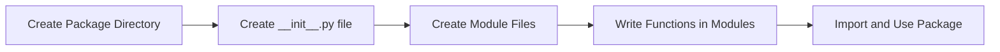
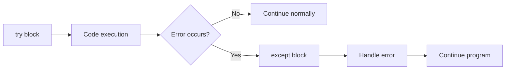

## Question 1(a) [3 marks]

**What is List? What are the use of List in python and write characteristics of List.**

**Answer**:

A List is an ordered collection of items (elements) that can store multiple values in a single variable. Lists are mutable and allow duplicate elements.

**Table: List Characteristics**

| Feature | Description |
|---------|-------------|
| **Ordered** | Elements have a defined order |
| **Mutable** | Can be changed after creation |
| **Indexed** | Access elements using index [0,1,2...] |
| **Duplicates** | Allows duplicate values |

**Uses in Python:**

- **Data Storage**: Store multiple related items
- **Dynamic Arrays**: Size can change during runtime
- **Iteration**: Easy to loop through elements

**Mnemonic:** "OMID - Ordered, Mutable, Indexed, Duplicates"

---

## Question 1(b) [4 marks]

**Explain String built-in functions in python.**

**Answer**:

String built-in functions help manipulate and process text data efficiently in Python programs.

**Table: Common String Functions**

| Function | Purpose | Example |
|----------|---------|---------|
| **upper()** | Convert to uppercase | "hello".upper() → "HELLO" |
| **lower()** | Convert to lowercase | "WORLD".lower() → "world" |
| **strip()** | Remove whitespace | " hi ".strip() → "hi" |
| **split()** | Split into list | "a,b".split(",") → ['a','b'] |
| **replace()** | Replace substring | "cat".replace("c","b") → "bat" |
| **find()** | Find substring position | "hello".find("e") → 1 |

**Key Points:**

- **Immutable**: Original string remains unchanged
- **Return Values**: Functions return new strings
- **Case Sensitive**: Functions consider case differences

**Mnemonic:** "ULSR-FR - Upper, Lower, Strip, Replace, Find, Replace"

---

## Question 1(c) [7 marks]

**Write how to add, remove, an element from a set. Explain why POP is different from remove.**

**Answer**:

Sets are unordered collections of unique elements. Python provides various methods to modify sets.

**Table: Set Operations**

| Operation | Method | Syntax | Example |
|-----------|--------|--------|---------|
| **Add** | add() | set.add(element) | s.add(5) |
| **Remove** | remove() | set.remove(element) | s.remove(3) |
| **Remove Safe** | discard() | set.discard(element) | s.discard(7) |
| **Pop** | pop() | set.pop() | s.pop() |

**Code Example:**

```python
# Creating set
my_set = {1, 2, 3, 4}

# Adding element
my_set.add(5)        # {1, 2, 3, 4, 5}

# Removing elements
my_set.remove(2)     # {1, 3, 4, 5}
my_set.discard(10)   # No error if element doesn't exist

# Pop operation
element = my_set.pop()  # Removes random element
```

**POP vs REMOVE Differences:**

| Aspect | pop() | remove() |
|--------|-------|----------|
| **Target** | Random element | Specific element |
| **Parameter** | No parameter needed | Requires element value |
| **Return** | Returns removed element | Returns None |
| **Error** | Error if set is empty | Error if element not found |

**Key Points:**

- **Random Nature**: pop() removes arbitrary element due to unordered nature
- **Predictability**: remove() targets specific known element
- **Error Handling**: Use discard() to avoid KeyError

**Mnemonic:** "PRRE - Pop Random, Remove Exact"

---

## Question 1(c OR) [7 marks]

**List out built-in Dictionary functions. Write a program to demonstrate the dictionaries functions and operations.**

**Answer**:

Dictionary is a collection of key-value pairs that provides fast lookup and flexible data organization.

**Table: Dictionary Functions**

| Function | Purpose | Returns |
|----------|---------|---------|
| **keys()** | Get all keys | dict_keys object |
| **values()** | Get all values | dict_values object |
| **items()** | Get key-value pairs | dict_items object |
| **get()** | Safe value retrieval | Value or None |
| **pop()** | Remove and return value | Removed value |
| **clear()** | Remove all items | None |
| **update()** | Merge dictionaries | None |

**Program Example:**

```python
# Create dictionary
student = {'name': 'John', 'age': 20, 'grade': 'A'}

# Dictionary operations
print("Keys:", list(student.keys()))
print("Values:", list(student.values()))
print("Items:", list(student.items()))

# Safe access
print("Age:", student.get('age', 'Not found'))

# Update and add
student.update({'city': 'Mumbai', 'age': 21})
print("Updated:", student)

# Remove operations
grade = student.pop('grade')
print("Removed grade:", grade)
```

**Key Features:**

- **Fast Lookup**: O(1) average time complexity
- **Flexible Keys**: Use strings, numbers, tuples as keys
- **Dynamic**: Can add/remove items anytime

**Mnemonic:** "KVIGPCU - Keys, Values, Items, Get, Pop, Clear, Update"

---

## Question 2(a) [3 marks]

**Define Tuple and how is it created in python?**

**Answer**:

A Tuple is an ordered collection of items that is immutable (cannot be changed after creation).

**Table: Tuple Creation Methods**

| Method | Syntax | Example |
|--------|--------|---------|
| **Parentheses** | (item1, item2) | (1, 2, 3) |
| **Without Parentheses** | item1, item2 | 1, 2, 3 |
| **Single Item** | (item,) | (5,) |
| **Empty Tuple** | () | () |

**Code Examples:**

```python
# Different ways to create tuples
coordinates = (10, 20)          # Standard way
colors = 'red', 'blue', 'green' # Without parentheses
single = (42,)                  # Single element (comma needed)
empty = ()                      # Empty tuple
```

**Key Points:**

- **Immutable**: Cannot change elements after creation
- **Ordered**: Elements maintain their position
- **Indexable**: Access using index like lists

**Mnemonic:** "IOI - Immutable, Ordered, Indexed"

---

## Question 2(b) [4 marks]

**Explain the advantages of the module.**

**Answer**:

Modules are Python files containing functions, classes, and variables that can be imported and reused in other programs.

**Table: Module Advantages**

| Advantage | Description | Benefit |
|-----------|-------------|---------|
| **Reusability** | Use same code multiple times | Saves development time |
| **Organization** | Separate code into logical units | Better code structure |
| **Namespace** | Avoid naming conflicts | Cleaner code |
| **Maintainability** | Update code in one place | Easy debugging |

**Benefits:**

- **Code Reuse**: Write once, use many times
- **Modularity**: Break large programs into smaller parts
- **Collaboration**: Multiple developers can work on different modules
- **Testing**: Test individual modules separately

**Example Structure:**

```python
# math_utils.py (module)
def add(a, b):
    return a + b

# main.py (using module)
import math_utils
result = math_utils.add(5, 3)
```

**Mnemonic:** "RONM - Reusability, Organization, Namespace, Maintainability"

---

## Question 2(c) [7 marks]

**List out the steps to create a user defined package with proper example.**

**Answer**:

A package is a directory containing multiple modules with a special `__init__.py` file.

**Steps to Create Package:**



**Example Package Structure:**

```
mathtools/
    __init__.py
    basic.py
    advanced.py
```

**Step-by-Step Implementation:**

**Step 1: Create Directory**

```bash
mkdir mathtools
```

**Step 2: Create __init__.py**

```python
# mathtools/__init__.py
print("MathTools package loaded")
```

**Step 3: Create basic.py**

```python
# mathtools/basic.py
def add(a, b):
    return a + b

def subtract(a, b):
    return a - b
```

**Step 4: Create advanced.py**

```python
# mathtools/advanced.py
def power(base, exp):
    return base ** exp

def factorial(n):
    if n <= 1:
        return 1
    return n * factorial(n-1)
```

**Step 5: Use Package**

```python
# main.py
import mathtools.basic
from mathtools.advanced import power

result1 = mathtools.basic.add(5, 3)
result2 = power(2, 3)
print(f"Addition: {result1}, Power: {result2}")
```

**Key Requirements:**

- **Directory**: Package must be a directory
- **__init__.py**: Required file (can be empty)
- **Modules**: Python files inside package
- **Import Path**: Python must find package in path

**Mnemonic:** "DDMFU - Directory, Dunder-init, Modules, Functions, Use"

---

## Question 2(a OR) [3 marks]

**Differentiate between Tuple and List.**

**Answer**:

Both Tuple and List are sequence data types but have important differences in behavior and usage.

**Table: Tuple vs List Comparison**

| Feature | Tuple | List |
|---------|-------|------|
| **Mutability** | Immutable (cannot change) | Mutable (can change) |
| **Syntax** | (1, 2, 3) | [1, 2, 3] |
| **Performance** | Faster | Slower |
| **Methods** | Limited methods | Many methods available |
| **Use Case** | Fixed data | Dynamic data |
| **Memory** | Less memory | More memory |

**Code Example:**

```python
# Tuple - Immutable
coordinates = (10, 20)
# coordinates[0] = 15  # Error!

# List - Mutable  
numbers = [1, 2, 3]
numbers[0] = 10      # Works fine
numbers.append(4)    # Can add elements
```

**When to Use:**

- **Tuple**: Coordinates, database records, function arguments
- **List**: Shopping cart, student grades, dynamic collections

**Mnemonic:** "TIF-LIM - Tuple Immutable Fixed, List Mutable Dynamic"

---

## Question 2(b OR) [4 marks]

**Explain the intra-package reference concept in python.**

**Answer**:

Intra-package references allow modules within a package to import and use each other using relative imports.

**Types of Imports:**

**Table: Import Types**

| Type | Syntax | Usage |
|------|--------|-------|
| **Absolute** | from package.module import function | Full path from root |
| **Relative** | from .module import function | Within same package |
| **Parent** | from ..module import function | Parent package |

**Package Structure Example:**

```
calculator/
    __init__.py
    basic.py
    scientific.py
    utils/
        __init__.py
        helpers.py
```

**Implementation:**

```python
# calculator/basic.py
def add(a, b):
    return a + b

# calculator/scientific.py
from .basic import add  # Relative import
from .utils.helpers import validate  # Sub-package import

def advanced_add(a, b):
    if validate(a) and validate(b):
        return add(a, b)
    return None

# calculator/utils/helpers.py
def validate(num):
    return isinstance(num, (int, float))
```

**Benefits:**

- **Clean Code**: Shorter import statements
- **Package Independence**: Easy to relocate packages
- **Clear Structure**: Shows package relationships

**Mnemonic:** "RAP - Relative, Absolute, Parent imports"

---

## Question 2(c OR) [7 marks]

**What is module? Write a program to define a module to find the area and circumference of circle. Import this module in a program and call functions from it.**

**Answer**:

A module is a Python file containing functions, classes, and variables that can be imported and used in other programs.

**Circle Module (circle.py):**

```python
# circle.py - Circle operations module
import math

def area(radius):
    """Calculate area of circle"""
    if radius < 0:
        return None
    return math.pi * radius * radius

def circumference(radius):
    """Calculate circumference of circle"""
    if radius < 0:
        return None
    return 2 * math.pi * radius

def diameter(radius):
    """Calculate diameter of circle"""
    if radius < 0:
        return None
    return 2 * radius

# Module constant
PI = math.pi
```

**Main Program (main.py):**

```python
# main.py - Using circle module
import circle
from circle import area, circumference

# Method 1: Using module name
radius = 5
print("Using module name:")
print(f"Area: {circle.area(radius):.2f}")
print(f"Circumference: {circle.circumference(radius):.2f}")

# Method 2: Direct function import
print("\nUsing direct import:")
print(f"Area: {area(radius):.2f}")
print(f"Circumference: {circumference(radius):.2f}")

# Using module constant
print(f"PI value: {circle.PI:.4f}")
```

**Alternative Import Methods:**

```python
# Import all functions
from circle import *

# Import with alias
import circle as c
result = c.area(10)

# Import specific function with alias
from circle import area as circle_area
```

**Module Benefits:**

- **Reusability**: Use in multiple programs
- **Organization**: Keep related functions together
- **Namespace**: Avoid function name conflicts
- **Testing**: Test module functions separately

**Output Example:**

```
Using module name:
Area: 78.54
Circumference: 31.42

Using direct import:
Area: 78.54
Circumference: 31.42
PI value: 3.1416
```

**Mnemonic:** "IRUD - Import, Reuse, Use, Debug"

---

## Question 3(a) [3 marks]

**Explain Types of errors in python.**

**Answer**:

Python errors occur when code cannot execute properly. Understanding error types helps in debugging and writing robust programs.

**Table: Python Error Types**

| Error Type | Description | Example |
|------------|-------------|---------|
| **Syntax Error** | Code structure is wrong | Missing colon, brackets |
| **Runtime Error** | Error during execution | Division by zero |
| **Logical Error** | Code runs but wrong result | Wrong formula used |

**Common Examples:**

```python
# Syntax Error
# if x > 5  # Missing colon

# Runtime Error  
# result = 10 / 0  # ZeroDivisionError

# Logical Error
def average(a, b):
    return a + b / 2  # Should be (a + b) / 2
```

**Error Characteristics:**

- **Syntax**: Detected before execution
- **Runtime**: Detected during execution
- **Logical**: Not detected automatically

**Mnemonic:** "SRL - Syntax, Runtime, Logical"

---

## Question 3(b) [4 marks]

**Explain the structure of try except.**

**Answer**:

Try-except structure handles runtime errors gracefully, preventing program crashes and providing user-friendly error messages.

**Basic Structure:**



**Syntax Structure:**

```python
try:
    # Code that might cause error
    risky_code()
except ErrorType:
    # Handle specific error
    handle_error()
except:
    # Handle any other error
    handle_all_errors()
finally:
    # Always executed
    cleanup_code()
```

**Table: Structure Components**

| Block | Purpose | Required |
|-------|---------|----------|
| **try** | Contains risky code | Yes |
| **except** | Handles specific errors | Yes |
| **else** | Runs if no error | No |
| **finally** | Always executes | No |

**Example:**

```python
try:
    num = int(input("Enter number: "))
    result = 100 / num
    print(f"Result: {result}")
except ValueError:
    print("Invalid number format")
except ZeroDivisionError:
    print("Cannot divide by zero")
finally:
    print("Operation completed")
```

**Mnemonic:** "TEEF - Try, Except, Else, Finally"

---

## Question 3(c) [7 marks]

**Develop a function for marks Result which contains two arguments English and Maths marks, if the value of any argument is less than 0 then raise an error.**

**Answer**:

Custom error handling ensures data validation and provides meaningful feedback for invalid inputs.

**Complete Implementation:**

```python
# Custom exception class
class InvalidMarksError(Exception):
    """Custom exception for invalid marks"""
    def __init__(self, subject, marks):
        self.subject = subject
        self.marks = marks
        super().__init__(f"Invalid {subject} marks: {marks}. Marks cannot be negative.")

def marks_result(english, maths):
    """
    Calculate result based on English and Maths marks
    
    Args:
        english (float): English subject marks
        maths (float): Mathematics subject marks
    
    Returns:
        dict: Result with total, percentage, and grade
    
    Raises:
        InvalidMarksError: If any marks are negative
        TypeError: If marks are not numeric
    """
    
    # Type validation
    if not isinstance(english, (int, float)) or not isinstance(maths, (int, float)):
        raise TypeError("Marks must be numeric values")
    
    # Negative marks validation
    if english < 0:
        raise InvalidMarksError("English", english)
    
    if maths < 0:
        raise InvalidMarksError("Mathematics", maths)
    
    # Marks range validation (0-100)
    if english > 100:
        raise InvalidMarksError("English", english)
    
    if maths > 100:
        raise InvalidMarksError("Mathematics", maths)
    
    # Calculate results
    total = english + maths
    percentage = (total / 200) * 100
    
    # Determine grade
    if percentage >= 90:
        grade = 'A+'
    elif percentage >= 80:
        grade = 'A'
    elif percentage >= 70:
        grade = 'B'
    elif percentage >= 60:
        grade = 'C'
    elif percentage >= 50:
        grade = 'D'
    else:
        grade = 'F'
    
    return {
        'english': english,
        'maths': maths,
        'total': total,
        'percentage': round(percentage, 2),
        'grade': grade,
        'status': 'Pass' if percentage >= 50 else 'Fail'
    }

# Usage examples with error handling
def main():
    """Main function to demonstrate the marks_result function"""
    
    test_cases = [
        (85, 92),      # Valid marks
        (-10, 85),     # Negative English
        (75, -5),      # Negative Maths
        (105, 80),     # Marks > 100
        ("80", 90),    # String input
    ]
    
    for i, (eng, math) in enumerate(test_cases, 1):
        print(f"\nTest Case {i}: English={eng}, Maths={math}")
        try:
            result = marks_result(eng, math)
            print(f"Result: {result}")
            
        except InvalidMarksError as e:
            print(f"Custom Error: {e}")
            
        except TypeError as e:
            print(f"Type Error: {e}")
            
        except Exception as e:
            print(f"Unexpected Error: {e}")

# Interactive function
def get_student_result():
    """Interactive function to get student marks"""
    
    while True:
        try:
            print("\n--- Student Result Calculator ---")
            english = float(input("Enter English marks (0-100): "))
            maths = float(input("Enter Maths marks (0-100): "))
            
            result = marks_result(english, maths)
            
            print(f"\n--- RESULT ---")
            print(f"English: {result['english']}")
            print(f"Mathematics: {result['maths']}")
            print(f"Total: {result['total']}/200")
            print(f"Percentage: {result['percentage']}%")
            print(f"Grade: {result['grade']}")
            print(f"Status: {result['status']}")
            
            break
            
        except InvalidMarksError as e:
            print(f"Error: {e}")
            print("Please enter valid marks (0-100)")
            
        except ValueError:
            print("Error: Please enter numeric values only")
            
        except KeyboardInterrupt:
            print("\nProgram terminated by user")
            break

if __name__ == "__main__":
    main()
    get_student_result()
```

**Key Features:**

- **Custom Exception**: InvalidMarksError for specific validation
- **Multiple Validations**: Negative, type, and range checks
- **Comprehensive Results**: Total, percentage, grade calculation
- **User-Friendly**: Interactive input with error handling

**Error Handling Benefits:**

- **Data Integrity**: Ensures valid input data
- **User Experience**: Clear error messages
- **Program Stability**: Prevents crashes
- **Debugging**: Easier to identify issues

**Mnemonic:** "CVIR - Custom, Validate, Interactive, Robust"

---

## Question 3(a OR) [3 marks]

**List any Five built-in exceptions in python.**

**Answer**:

Built-in exceptions are predefined error types that Python raises when specific error conditions occur during program execution.

**Table: Common Built-in Exceptions**

| Exception | Cause | Example |
|-----------|-------|---------|
| **ValueError** | Invalid value for operation | int("abc") |
| **TypeError** | Wrong data type | "5" + 5 |
| **IndexError** | Index out of range | list[10] for 5-item list |
| **KeyError** | Dictionary key not found | dict["missing_key"] |
| **ZeroDivisionError** | Division by zero | 10 / 0 |

**Code Examples:**

```python
# ValueError
try:
    number = int("hello")  # Cannot convert to int
except ValueError:
    print("Invalid number format")

# TypeError  
try:
    result = "text" + 42   # Cannot add string and int
except TypeError:
    print("Type mismatch")

# IndexError
try:
    mylist = [1, 2, 3]
    print(mylist[5])       # Index 5 doesn't exist
except IndexError:
    print("Index out of range")
```

**Additional Common Exceptions:**

- **FileNotFoundError**: File doesn't exist
- **AttributeError**: Object has no attribute
- **ImportError**: Module cannot be imported

**Mnemonic:** "VTIKZ - ValueError, TypeError, IndexError, KeyError, ZeroDivisionError"

---

## Question 3(b OR) [4 marks]

**Write points on finally and explain with example.**

**Answer**:

The `finally` block is a special block that always executes regardless of whether an exception occurs or not.

**Table: Finally Block Characteristics**

| Feature | Description |
|---------|-------------|
| **Always Executes** | Runs even if exception occurs |
| **Cleanup Code** | Perfect for resource cleanup |
| **After try/except** | Executes after try and except blocks |
| **Cannot Skip** | Even return statements can't skip it |

**Key Points:**

- **Guaranteed Execution**: Runs in all scenarios
- **Resource Management**: Close files, database connections
- **Cleanup Operations**: Free memory, reset variables
- **Even with Return**: Executes before function returns

**Example Program:**

```python
def file_operations(filename):
    """Demonstrate finally block with file operations"""
    file_handle = None
    
    try:
        print("Opening file...")
        file_handle = open(filename, 'r')
        
        print("Reading file content...")
        content = file_handle.read()
        
        # Simulate potential error
        if len(content) == 0:
            raise ValueError("File is empty")
            
        print(f"File content: {content}")
        return content
        
    except FileNotFoundError:
        print("Error: File not found")
        return None
        
    except ValueError as e:
        print(f"Error: {e}")
        return None
        
    finally:
        print("Finally block executing...")
        if file_handle:
            file_handle.close()
            print("File closed successfully")
        else:
            print("No file to close")
        print("Cleanup completed")

# Test the function
print("=== Test 1: Valid file ===")
result1 = file_operations("test.txt")

print("\n=== Test 2: Non-existent file ===") 
result2 = file_operations("missing.txt")
```

**Output Example:**

```
=== Test 1: Valid file ===
Opening file...
Reading file content...
File content: Hello World
Finally block executing...
File closed successfully
Cleanup completed

=== Test 2: Non-existent file ===
Opening file...
Error: File not found
Finally block executing...
No file to close
Cleanup completed
```

**Mnemonic:** "ARGC - Always Runs, Resource Cleanup"

---

## Question 3(c OR) [7 marks]

**Write a program to catch on Divide by Zero Exception with finally clause.**

**Answer**:

Divide by zero exception handling demonstrates proper error management with resource cleanup using finally clause.

**Complete Program:**

```python
import sys
import logging

# Configure logging
logging.basicConfig(level=logging.INFO, format='%(asctime)s - %(levelname)s - %(message)s')

class DivisionCalculator:
    """Calculator class with divide by zero exception handling"""
    
    def __init__(self):
        self.calculation_count = 0
        self.error_count = 0
    
    def safe_divide(self, dividend, divisor):
        """
        Perform division with exception handling
        
        Args:
            dividend (float): Number to be divided
            divisor (float): Number to divide by
            
        Returns:
            float or None: Result of division or None if error
        """
        operation_id = self.calculation_count + 1
        
        try:
            print(f"\n--- Operation {operation_id} ---")
            print(f"Attempting to divide {dividend} by {divisor}")
            logging.info(f"Division operation started: {dividend} ÷ {divisor}")
            
            # Type validation
            if not isinstance(dividend, (int, float)) or not isinstance(divisor, (int, float)):
                raise TypeError("Both arguments must be numeric")
            
            # Perform division
            result = dividend / divisor
            
            print(f"Result: {dividend} ÷ {divisor} = {result}")
            logging.info(f"Division successful: {result}")
            
            return result
            
        except ZeroDivisionError:
            error_msg = f"Error: Cannot divide {dividend} by zero!"
            print(error_msg)
            logging.error(error_msg)
            self.error_count += 1
            return None
            
        except TypeError as e:
            error_msg = f"Type Error: {e}"
            print(error_msg)
            logging.error(error_msg)
            self.error_count += 1
            return None
            
        except Exception as e:
            error_msg = f"Unexpected error: {e}"
            print(error_msg)
            logging.error(error_msg)
            self.error_count += 1
            return None
            
        finally:
            # Always executed - cleanup and logging
            self.calculation_count += 1
            print(f"Operation {operation_id} completed")
            print(f"Total operations: {self.calculation_count}")
            print(f"Total errors: {self.error_count}")
            logging.info(f"Operation {operation_id} finalized")
            
            # Resource cleanup simulation
            if hasattr(self, 'temp_data'):
                delattr(self, 'temp_data')
                print("Temporary data cleaned up")

def interactive_calculator():
    """Interactive division calculator"""
    
    calc = DivisionCalculator()
    print("=== Interactive Division Calculator ===")
    print("Enter 'quit' to exit the program")
    
    while True:
        try:
            print("\n" + "="*40)
            
            # Get dividend
            dividend_input = input("Enter dividend (number to be divided): ")
            if dividend_input.lower() == 'quit':
                break
                
            dividend = float(dividend_input)
            
            # Get divisor
            divisor_input = input("Enter divisor (number to divide by): ")
            if divisor_input.lower() == 'quit':
                break
                
            divisor = float(divisor_input)
            
            # Perform calculation
            result = calc.safe_divide(dividend, divisor)
            
            if result is not None:
                print(f"✓ Success: {dividend} ÷ {divisor} = {result}")
            else:
                print("✗ Operation failed")
                
        except ValueError:
            print("Error: Please enter valid numeric values")
            calc.error_count += 1
            
        except KeyboardInterrupt:
            print("\n\nProgram interrupted by user")
            break
            
        finally:
            # Final cleanup for each iteration
            if 'dividend_input' in locals():
                del dividend_input
            if 'divisor_input' in locals():
                del divisor_input
            print("Input variables cleaned up")

def test_division_cases():
    """Test various division scenarios"""
    
    print("=== Testing Division Cases ===")
    calc = DivisionCalculator()
    
    test_cases = [
        (10, 2),       # Normal division
        (15, 0),       # Divide by zero
        (7.5, 2.5),    # Float division
        (-20, 4),      # Negative numbers
        (0, 5),        # Zero dividend
        ("10", 2),     # String input
        (100, 0.0),    # Zero as float
    ]
    
    for dividend, divisor in test_cases:
        result = calc.safe_divide(dividend, divisor)
    
    # Final statistics
    print(f"\n=== Final Statistics ===")
    print(f"Total operations attempted: {calc.calculation_count}")
    print(f"Total errors encountered: {calc.error_count}")
    print(f"Success rate: {((calc.calculation_count - calc.error_count) / calc.calculation_count * 100):.1f}%")

if __name__ == "__main__":
    # Run test cases
    test_division_cases()
    
    # Run interactive calculator
    interactive_calculator()
```

**Key Features:**

- **Comprehensive Error Handling**: Multiple exception types
- **Finally Clause**: Always executes for cleanup
- **Logging**: Tracks operations and errors
- **Interactive Mode**: User-friendly interface
- **Statistics**: Operation success tracking

**Mnemonic:** "CFLIS - Comprehensive, Finally, Logging, Interactive, Statistics"

---

## Question 4(a) [3 marks]

**What is file Handling? List file Handling Operations.**

**Answer**:

File Handling is the process of working with files stored on computer storage devices to read, write, and manipulate data.

**Table: File Handling Operations**

| Operation | Purpose | Method |
|-----------|---------|--------|
| **Open** | Access file for operations | open() |
| **Read** | Retrieve content from file | read(), readline() |
| **Write** | Add content to file | write(), writelines() |
| **Close** | Release file resources | close() |
| **Seek** | Move file pointer | seek() |
| **Tell** | Get current position | tell() |

**Common Use Cases:**

- **Data Storage**: Save program data permanently
- **Configuration**: Read settings from files
- **Logging**: Record program activities
- **Import/Export**: Exchange data with other programs

**Basic Example:**

```python
# Basic file operations
file = open("data.txt", "w")  # Open
file.write("Hello World")     # Write
file.close()                  # Close
```

**Mnemonic:** "ORWCST - Open, Read, Write, Close, Seek, Tell"

---

## Question 4(b) [4 marks]

**Explain Object Serialization.**

**Answer**:

Object Serialization is the process of converting Python objects into a format that can be stored in files or transmitted over networks.

**Table: Serialization Methods**

| Method | Module | Purpose | File Type |
|--------|--------|---------|-----------|
| **Pickle** | pickle | Python objects | Binary |
| **JSON** | json | Web-compatible data | Text |
| **CSV** | csv | Tabular data | Text |
| **XML** | xml | Structured documents | Text |

**Pickle Example:**

```python
import pickle

# Serialization (Writing)
data = {'name': 'John', 'age': 25, 'scores': [85, 92, 78]}

with open('data.pkl', 'wb') as file:
    pickle.dump(data, file)

# Deserialization (Reading)
with open('data.pkl', 'rb') as file:
    loaded_data = pickle.load(file)
    print(loaded_data)
```

**Benefits:**

- **Persistence**: Store objects permanently
- **Data Transfer**: Send objects between programs
- **Caching**: Save processed results
- **Backup**: Create object snapshots

**Limitations:**

- **Python Specific**: Pickle works only with Python
- **Security Risk**: Don't load untrusted pickle files
- **Version Compatibility**: Different Python versions may have issues

**Mnemonic:** "SPDT - Store, Persist, Data Transfer"

---

## Question 4(c) [7 marks]

**Write a program to count all the vowels in the file.**

**Answer**:

Vowel counting program demonstrates file reading and text processing with comprehensive error handling.

**Complete Program:**

```python
import os
import string
from collections import Counter

class VowelCounter:
    """Class to count vowels in text files"""
    
    def __init__(self):
        self.vowels = set('aeiouAEIOU')
        self.total_files_processed = 0
        self.total_vowels_found = 0
    
    def count_vowels_in_text(self, text):
        """
        Count vowels in given text
        
        Args:
            text (str): Text to analyze
            
        Returns:
            dict: Vowel counts and statistics
        """
        vowel_counts = {vowel.lower(): 0 for vowel in 'aeiou'}
        total_vowels = 0
        total_characters = 0
        
        for char in text:
            if char.isalpha():
                total_characters += 1
                if char.lower() in vowel_counts:
                    vowel_counts[char.lower()] += 1
                    total_vowels += 1
        
        return {
            'vowel_counts': vowel_counts,
            'total_vowels': total_vowels,
            'total_characters': total_characters,
            'vowel_percentage': (total_vowels / total_characters * 100) if total_characters > 0 else 0
        }
    
    def count_vowels_in_file(self, filename):
        """
        Count vowels in a specific file
        
        Args:
            filename (str): Path to file
            
        Returns:
            dict or None: Vowel analysis results
        """
        try:
            print(f"\n--- Processing file: {filename} ---")
            
            # Check if file exists
            if not os.path.exists(filename):
                raise FileNotFoundError(f"File '{filename}' not found")
            
            # Check if it's a file (not directory)
            if not os.path.isfile(filename):
                raise ValueError(f"'{filename}' is not a file")
            
            # Read file content
            with open(filename, 'r', encoding='utf-8') as file:
                content = file.read()
            
            print(f"File size: {len(content)} characters")
            
            if not content.strip():
                print("Warning: File is empty")
                return None
            
            # Count vowels
            results = self.count_vowels_in_text(content)
            
            # Display results
            print(f"Total characters (letters only): {results['total_characters']}")
            print(f"Total vowels found: {results['total_vowels']}")
            print(f"Vowel percentage: {results['vowel_percentage']:.2f}%")
            
            print("\nIndividual vowel counts:")
            for vowel, count in results['vowel_counts'].items():
                percentage = (count / results['total_vowels'] * 100) if results['total_vowels'] > 0 else 0
                print(f"  {vowel.upper()}: {count} ({percentage:.1f}%)")
            
            # Update statistics
            self.total_files_processed += 1
            self.total_vowels_found += results['total_vowels']
            
            return results
            
        except FileNotFoundError as e:
            print(f"Error: {e}")
            return None
            
        except PermissionError:
            print(f"Error: Permission denied to read '{filename}'")
            return None
            
        except UnicodeDecodeError:
            print(f"Error: Cannot decode file '{filename}'. Try different encoding.")
            return None
            
        except Exception as e:
            print(f"Unexpected error: {e}")
            return None
        
        finally:
            print(f"File processing completed for: {filename}")
    
    def create_sample_file(self, filename="sample.txt"):
        """Create a sample file for testing"""
        sample_content = """Python is a programming language.
It is easy to learn and powerful.
Python has simple syntax and great libraries.
We can use Python for web development, data science, and automation.
This file contains various vowels: a, e, i, o, u.
UPPER CASE VOWELS: A, E, I, O, U."""
        
        try:
            with open(filename, 'w', encoding='utf-8') as file:
                file.write(sample_content)
            print(f"Sample file '{filename}' created successfully")
            return True
        except Exception as e:
            print(f"Error creating sample file: {e}")
            return False
    
    def batch_process_files(self, file_list):
        """Process multiple files"""
        print("=== Batch Processing Files ===")
        
        all_results = []
        
        for filename in file_list:
            result = self.count_vowels_in_file(filename)
            if result:
                all_results.append((filename, result))
        
        # Summary statistics
        if all_results:
            print(f"\n=== Batch Processing Summary ===")
            print(f"Files processed successfully: {len(all_results)}")
            
            total_vowels = sum(result['total_vowels'] for _, result in all_results)
            total_chars = sum(result['total_characters'] for _, result in all_results)
            
            print(f"Total vowels across all files: {total_vowels}")
            print(f"Total characters across all files: {total_chars}")
            print(f"Overall vowel percentage: {(total_vowels/total_chars*100):.2f}%")

def interactive_vowel_counter():
    """Interactive vowel counter program"""
    
    counter = VowelCounter()
    
    while True:
        print("\n" + "="*50)
        print("VOWEL COUNTER PROGRAM")
        print("="*50)
        print("1. Count vowels in existing file")
        print("2. Create sample file and count vowels")
        print("3. Enter text directly")
        print("4. Process multiple files")
        print("5. Exit")
        
        try:
            choice = input("\nEnter your choice (1-5): ").strip()
            
            if choice == '1':
                filename = input("Enter filename: ").strip()
                counter.count_vowels_in_file(filename)
                
            elif choice == '2':
                filename = input("Enter filename for sample (default: sample.txt): ").strip()
                if not filename:
                    filename = "sample.txt"
                
                if counter.create_sample_file(filename):
                    counter.count_vowels_in_file(filename)
                
            elif choice == '3':
                text = input("Enter text to analyze: ")
                if text.strip():
                    result = counter.count_vowels_in_text(text)
                    print(f"\nVowel analysis for entered text:")
                    print(f"Total vowels: {result['total_vowels']}")
                    print(f"Vowel percentage: {result['vowel_percentage']:.2f}%")
                    for vowel, count in result['vowel_counts'].items():
                        if count > 0:
                            print(f"  {vowel.upper()}: {count}")
                else:
                    print("No text entered")
                    
            elif choice == '4':
                files_input = input("Enter filenames separated by commas: ")
                file_list = [f.strip() for f in files_input.split(',') if f.strip()]
                if file_list:
                    counter.batch_process_files(file_list)
                else:
                    print("No files specified")
                    
            elif choice == '5':
                print("Thank you for using Vowel Counter!")
                break
                
            else:
                print("Invalid choice. Please enter 1-5.")
                
        except KeyboardInterrupt:
            print("\n\nProgram interrupted. Goodbye!")
            break
        except Exception as e:
            print(f"Error: {e}")

if __name__ == "__main__":
    interactive_vowel_counter()
```

**Program Features:**

- **File Validation**: Checks file existence and permissions
- **Error Handling**: Comprehensive exception management
- **Multiple Modes**: File input, text input, batch processing
- **Statistics**: Individual and overall vowel counts
- **Interactive Interface**: User-friendly menu system

**Output Example:**

```
--- Processing file: sample.txt ---
File size: 245 characters
Total characters (letters only): 195
Total vowels found: 78
Vowel percentage: 40.00%

Individual vowel counts:
  A: 15 (19.2%)
  E: 20 (25.6%)
  I: 12 (15.4%)
  O: 18 (23.1%)
  U: 13 (16.7%)
```

**Mnemonic:** "FVESI - File Validation, Vowel Extraction, Statistics, Interactive"

---

## Question 4(a OR) [3 marks]

**How to open and close file? Also give the syntax for same.**

**Answer**:

File opening and closing are fundamental operations for file handling in Python with specific syntax and modes.

**Table: File Opening Modes**

| Mode | Purpose | Description |
|------|---------|-------------|
| **'r'** | Read | Read existing file (default) |
| **'w'** | Write | Create new or overwrite existing |
| **'a'** | Append | Add to end of existing file |
| **'r+'** | Read/Write | Read and write existing file |

**Syntax Examples:**

```python
# Opening files
file = open("filename.txt", "r")     # Read mode
file = open("data.txt", "w")         # Write mode
file = open("log.txt", "a")          # Append mode

# Closing files
file.close()                         # Manual closing

# Automatic closing with 'with' statement
with open("filename.txt", "r") as file:
    content = file.read()
# File automatically closed here
```

**Best Practices:**

- **Always Close**: Prevent resource leaks
- **Use 'with'**: Automatic file closing
- **Specify Mode**: Be explicit about file mode
- **Handle Errors**: Use try-except for file operations

**Mnemonic:** "ORWA - Open, Read, Write, Append modes"

---

## Question 4(b OR) [4 marks]

**What is Differentiate between Text file and Binary file?**

**Answer**:

Text and Binary files store data in different formats, requiring different handling approaches in Python programming.

**Table: Text vs Binary Files Comparison**

| Aspect | Text File | Binary File |
|--------|-----------|-------------|
| **Content** | Human-readable characters | Machine-readable bytes |
| **Mode** | 'r', 'w', 'a' | 'rb', 'wb', 'ab' |
| **Encoding** | UTF-8, ASCII encoding | No encoding |
| **Size** | Larger due to encoding | Smaller, compact |
| **Examples** | .txt, .py, .html | .jpg, .exe, .pkl |
| **Editing** | Any text editor | Specialized software |

**Code Examples:**

```python
# Text File Operations
with open("text_file.txt", "w") as file:
    file.write("Hello World!")

with open("text_file.txt", "r") as file:
    content = file.read()
    print(content)  # Output: Hello World!

# Binary File Operations  
import pickle

data = [1, 2, 3, 4, 5]

# Write binary
with open("binary_file.pkl", "wb") as file:
    pickle.dump(data, file)

# Read binary
with open("binary_file.pkl", "rb") as file:
    loaded_data = pickle.load(file)
    print(loaded_data)  # Output: [1, 2, 3, 4, 5]
```

**When to Use:**

- **Text Files**: Configuration, logs, source code, documentation
- **Binary Files**: Images, videos, executables, serialized objects

**Key Differences:**

- **Portability**: Text files more portable across systems
- **Efficiency**: Binary files more space and time efficient
- **Human Readable**: Text files can be viewed directly

**Mnemonic:** "TCEB - Text Character Encoding Bigger, Binary Compact Efficient"

---

## Question 4(c OR) [7 marks]

**Write a program to create a binary file to store Seat no and Name. Search any Seat no and display name if Seat No. found otherwise "Seat no not found".**

**Answer**:

Binary file program for student record management with search functionality using pickle serialization.

**Complete Program:**

```python
import pickle
import os
from typing import Dict, Optional

class StudentRecordManager:
    """Manage student records in binary file"""
    
    def __init__(self, filename="students.pkl"):
        self.filename = filename
        self.records = {}
        self.load_records()
    
    def load_records(self):
        """Load existing records from binary file"""
        try:
            if os.path.exists(self.filename):
                with open(self.filename, 'rb') as file:
                    self.records = pickle.load(file)
                print(f"Loaded {len(self.records)} existing records")
            else:
                print("No existing record file found. Starting fresh.")
                self.records = {}
        except Exception as e:
            print(f"Error loading records: {e}")
            self.records = {}
    
    def save_records(self):
        """Save records to binary file"""
        try:
            with open(self.filename, 'wb') as file:
                pickle.dump(self.records, file)
            print(f"Records saved successfully to {self.filename}")
            return True
        except Exception as e:
            print(f"Error saving records: {e}")
            return False
    
    def add_student(self, seat_no: int, name: str):
        """Add new student record"""
        try:
            if not isinstance(seat_no, int) or seat_no <= 0:
                raise ValueError("Seat number must be a positive integer")
            
            if not name or not name.strip():
                raise ValueError("Name cannot be empty")
            
            name = name.strip().title()
            
            if seat_no in self.records:
                print(f"Warning: Seat {seat_no} already exists with name '{self.records[seat_no]}'")
                overwrite = input("Do you want to overwrite? (y/n): ").lower()
                if overwrite != 'y':
                    print("Record not added")
                    return False
            
            self.records[seat_no] = name
            self.save_records()
            print(f"Student added: Seat {seat_no} - {name}")
            return True
            
        except ValueError as e:
            print(f"Error: {e}")
            return False
        except Exception as e:
            print(f"Unexpected error: {e}")
            return False
    
    def search_student(self, seat_no: int):
        """Search for student by seat number"""
        try:
            if not isinstance(seat_no, int):
                raise ValueError("Seat number must be an integer")
            
            if seat_no in self.records:
                name = self.records[seat_no]
                print(f"Found: Seat {seat_no} - {name}")
                return name
            else:
                print("Seat no not found")
                return None
                
        except ValueError as e:
            print(f"Error: {e}")
            return None
        except Exception as e:
            print(f"Unexpected error: {e}")
            return None
    
    def display_all_records(self):
        """Display all student records"""
        if not self.records:
            print("No records found")
            return
        
        print(f"\n--- All Student Records ({len(self.records)} total) ---")
        print("Seat No. | Name")
        print("-" * 25)
        
        # Sort by seat number for better display
        for seat_no in sorted(self.records.keys()):
            print(f"{seat_no:8} | {self.records[seat_no]}")
    
    def delete_student(self, seat_no: int):
        """Delete student record"""
        try:
            if seat_no in self.records:
                name = self.records[seat_no]
                del self.records[seat_no]
                self.save_records()
                print(f"Deleted: Seat {seat_no} - {name}")
                return True
            else:
                print("Seat no not found")
                return False
        except Exception as e:
            print(f"Error deleting record: {e}")
            return False
    
    def get_statistics(self):
        """Get record statistics"""
        if not self.records:
            print("No records available for statistics")
            return
        
        seat_numbers = list(self.records.keys())
        print(f"\n--- Statistics ---")
        print(f"Total students: {len(self.records)}")
        print(f"Lowest seat number: {min(seat_numbers)}")
        print(f"Highest seat number: {max(seat_numbers)}")
        print(f"File size: {os.path.getsize(self.filename) if os.path.exists(self.filename) else 0} bytes")

def add_sample_data(manager):
    """Add sample student data for testing"""
    sample_students = [
        (101, "Alice Johnson"),
        (102, "Bob Smith"),
        (103, "Charlie Brown"),
        (104, "Diana Prince"),
        (105, "Edward Norton"),
        (201, "Fiona Apple"),
        (202, "George Wilson"),
        (203, "Hannah Montana"),
        (204, "Ian Fleming"),
        (205, "Julia Roberts")
    ]
    
    print("Adding sample data...")
    for seat_no, name in sample_students:
        manager.records[seat_no] = name
    
    manager.save_records()
    print(f"Added {len(sample_students)} sample records")

def main():
    """Main program with interactive menu"""
    
    print("=" * 50)
    print("STUDENT RECORD MANAGEMENT SYSTEM")
    print("Binary File Storage with Search")
    print("=" * 50)
    
    manager = StudentRecordManager()
    
    while True:
        print(f"\n--- MENU ---")
        print("1. Add new student")
        print("2. Search student by seat number")
        print("3. Display all records")
        print("4. Delete student record")
        print("5. Add sample data")
        print("6. Show statistics")
        print("7. Exit")
        
        try:
            choice = input("\nEnter your choice (1-7): ").strip()
            
            if choice == '1':
                try:
                    seat_no = int(input("Enter seat number: "))
                    name = input("Enter student name: ")
                    manager.add_student(seat_no, name)
                except ValueError:
                    print("Error: Please enter a valid seat number")
            
            elif choice == '2':
                try:
                    seat_no = int(input("Enter seat number to search: "))
                    manager.search_student(seat_no)
                except ValueError:
                    print("Error: Please enter a valid seat number")
            
            elif choice == '3':
                manager.display_all_records()
            
            elif choice == '4':
                try:
                    seat_no = int(input("Enter seat number to delete: "))
                    confirm = input(f"Are you sure you want to delete seat {seat_no}? (y/n): ")
                    if confirm.lower() == 'y':
                        manager.delete_student(seat_no)
                except ValueError:
                    print("Error: Please enter a valid seat number")
            
            elif choice == '5':
                confirm = input("This will add sample data. Continue? (y/n): ")
                if confirm.lower() == 'y':
                    add_sample_data(manager)
            
            elif choice == '6':
                manager.get_statistics()
            
            elif choice == '7':
                print("Thank you for using Student Record System!")
                break
            
            else:
                print("Invalid choice. Please enter 1-7.")
                
        except KeyboardInterrupt:
            print("\n\nProgram interrupted. Goodbye!")
            break
        except Exception as e:
            print(f"Error: {e}")

def quick_demo():
    """Quick demonstration of the program"""
    print("\n--- QUICK DEMO ---")
    
    # Create manager with demo file
    demo_manager = StudentRecordManager("demo_students.pkl")
    
    # Add some students
    demo_students = [
        (101, "John Doe"),
        (102, "Jane Smith"),
        (103, "Mike Johnson")
    ]
    
    print("Adding demo students...")
    for seat_no, name in demo_students:
        demo_manager.add_student(seat_no, name)
    
    print("\nSearching for existing student:")
    demo_manager.search_student(102)
    
    print("\nSearching for non-existing student:")
    demo_manager.search_student(999)
    
    print("\nAll records:")
    demo_manager.display_all_records()

if __name__ == "__main__":
    # Ask user for demo or full program
    mode = input("Run (d)emo or (f)ull program? (d/f): ").lower()
    
    if mode == 'd':
        quick_demo()
    else:
        main()
```

**Program Features:**

- **Binary Storage**: Uses pickle for efficient data storage
- **Search Functionality**: Quick seat number lookup
- **Error Handling**: Comprehensive input validation
- **CRUD Operations**: Create, Read, Update, Delete records
- **Statistics**: File and record information
- **Interactive Menu**: User-friendly interface

**Sample Output:**

```
Enter seat number to search: 102
Found: Seat 102 - Jane Smith

Enter seat number to search: 999
Seat no not found
```

**Mnemonic:** "BSECH - Binary Storage, Search Efficiently, CRUD Handling"

---

## Question 5(a) [3 marks]

**What is Turtle and how is it used to draw objects?**

**Answer**:

Turtle is a Python graphics module that provides a virtual drawing canvas with a turtle cursor for creating graphics programmatically.

**Table: Turtle Basics**

| Component | Description | Purpose |
|-----------|-------------|---------|
| **Canvas** | Drawing surface | Area where graphics appear |
| **Turtle** | Drawing cursor | Moves and draws lines |
| **Pen** | Drawing tool | Controls line appearance |
| **Commands** | Movement functions | Control turtle actions |

**Basic Drawing Concept:**

```python
import turtle

# Create screen and turtle
screen = turtle.Screen()
pen = turtle.Turtle()

# Draw a square
for i in range(4):
    pen.forward(100)    # Move forward 100 units
    pen.right(90)       # Turn right 90 degrees

screen.exitonclick()    # Close on click
```

**Key Features:**

- **Visual Programming**: See results immediately
- **Educational**: Great for learning programming concepts
- **Interactive**: Real-time drawing feedback
- **Simple Syntax**: Easy commands for complex graphics

**Common Uses:**

- **Geometric Shapes**: Squares, circles, polygons
- **Patterns**: Fractals, spirals, designs
- **Educational Graphics**: Teaching geometry and programming

**Mnemonic:** "CPTT - Canvas, Pen, Turtle, Teaching tool"

---

## Question 5(b) [4 marks]

**Explain Different ways to move turtle to another position.**

**Answer**:

Turtle provides multiple movement methods for positioning and navigation on the drawing canvas.

**Table: Turtle Movement Methods**

| Method | Purpose | Pen State | Example |
|--------|---------|-----------|---------|
| **forward(distance)** | Move forward | Draws line | forward(100) |
| **backward(distance)** | Move backward | Draws line | backward(50) |
| **goto(x, y)** | Move to coordinates | Draws line | goto(100, 50) |
| **penup()** | Lift pen | No drawing | penup() |
| **pendown()** | Lower pen | Draws line | pendown() |
| **setx(x)** | Set X coordinate | Draws line | setx(200) |
| **sety(y)** | Set Y coordinate | Draws line | sety(150) |

**Movement Examples:**

```python
import turtle

pen = turtle.Turtle()
pen.speed(3)

# Method 1: Forward/Backward movement
pen.forward(100)
pen.backward(50)

# Method 2: Direct positioning with drawing
pen.goto(200, 100)

# Method 3: Move without drawing
pen.penup()
pen.goto(-100, -100)
pen.pendown()

# Method 4: Set coordinates separately
pen.setx(0)
pen.sety(0)
```

**Rotation Methods:**

- **right(angle)**: Turn clockwise
- **left(angle)**: Turn counterclockwise
- **setheading(angle)**: Set absolute direction

**Position Control:**

- **Drawing Mode**: Pen down, leaves trail
- **Moving Mode**: Pen up, no trail
- **Coordinate System**: Center (0,0), positive Y up

**Mnemonic:** "FGPRS - Forward, Goto, Penup, Rotate, Set coordinates"

---

## Question 5(c) [7 marks]

**Explain how loops can be useful in turtle and provide an example.**

**Answer**:

Loops in turtle graphics enable creation of repetitive patterns, complex shapes, and efficient code for geometric designs.

**Loop Benefits in Turtle:**

**Table: Loop Applications**

| Loop Type | Use Case | Example Pattern |
|-----------|----------|-----------------|
| **For Loop** | Fixed repetitions | Regular polygons |
| **While Loop** | Conditional drawing | Spirals |
| **Nested Loops** | Complex patterns | Grids, fractals |
| **Range Loop** | Incremental changes | Color gradients |

**Complete Example Program:**

```python
import turtle
import random
import math

def setup_screen():
    """Setup turtle screen"""
    screen = turtle.Screen()
    screen.bgcolor("black")
    screen.title("Turtle Graphics with Loops")
    screen.setup(800, 600)
    return screen

def draw_polygon(sides, size, pen):
    """Draw regular polygon using for loop"""
    angle = 360 / sides
    
    for i in range(sides):
        pen.forward(size)
        pen.right(angle)

def draw_spiral(pen):
    """Draw spiral using while loop"""
    pen.color("cyan")
    pen.speed(10)
    
    distance = 1
    while distance < 100:
        pen.forward(distance)
        pen.right(91)
        distance += 2

def draw_flower_pattern(pen):
    """Draw flower using nested loops"""
    pen.color("red")
    pen.speed(0)
    
    # Outer loop for petals
    for petal in range(36):
        pen.color(random.choice(["red", "pink", "yellow", "orange"]))
        
        # Inner loop for each petal shape
        for side in range(4):
            pen.forward(50)
            pen.right(90)
        
        pen.right(10)  # Rotate for next petal

def draw_colorful_squares(pen):
    """Draw squares with changing colors and sizes"""
    colors = ["red", "blue", "green", "yellow", "purple", "orange"]
    pen.speed(0)
    
    for i in range(50):
        pen.color(colors[i % len(colors)])
        pen.forward(i * 2)
        pen.right(91)

def draw_geometric_pattern(pen):
    """Complex geometric pattern with nested loops"""
    pen.speed(0)
    
    # Outer loop for pattern repetition
    for pattern in range(6):
        pen.color(random.choice(["blue", "green", "purple", "orange"]))
        
        # Middle loop for shape creation
        for shape in range(8):
            # Inner loop for individual shape
            for side in range(6):
                pen.forward(30)
                pen.right(60)
            pen.right(45)
        
        pen.right(60)

def draw_star_with_loop(pen):
    """Draw star using loop"""
    pen.color("gold")
    pen.begin_fill()
    
    for point in range(5):
        pen.forward(100)
        pen.right(144)
    
    pen.end_fill()

def draw_concentric_circles(pen):
    """Draw concentric circles using loop"""
    pen.speed(0)
    colors = ["red", "orange", "yellow", "green", "blue", "purple"]
    
    for i in range(6):
        pen.color(colors[i])
        pen.circle(20 + i * 15)
        pen.penup()
        pen.goto(0, -(10 + i * 15))
        pen.pendown()

def main_demo():
    """Main demonstration function"""
    screen = setup_screen()
    pen = turtle.Turtle()
    pen.pensize(2)
    
    while True:
        print("\n=== TURTLE GRAPHICS LOOP EXAMPLES ===")
        print("1. Regular Polygon (Triangle, Square, Pentagon, etc.)")
        print("2. Spiral Pattern")
        print("3. Flower Pattern") 
        print("4. Colorful Squares")
        print("5. Geometric Pattern")
        print("6. Star Shape")
        print("7. Concentric Circles")
        print("8. Clear Screen")
        print("9. Exit")
        
        try:
            choice = input("Enter choice (1-9): ").strip()
            
            if choice == '1':
                pen.clear()
                pen.home()
                
                sides = int(input("Enter number of sides (3-10): "))
                if 3 <= sides <= 10:
                    size = int(input("Enter size (50-200): "))
                    pen.color("blue")
                    draw_polygon(sides, size, pen)
                    print(f"Drew {sides}-sided polygon using for loop!")
                else:
                    print("Invalid number of sides")
            
            elif choice == '2':
                pen.clear()
                pen.home()
                draw_spiral(pen)
                print("Drew spiral using while loop!")
            
            elif choice == '3':
                pen.clear()
                pen.home()
                draw_flower_pattern(pen)
                print("Drew flower pattern using nested loops!")
            
            elif choice == '4':
                pen.clear()
                pen.home()
                draw_colorful_squares(pen)
                print("Drew colorful squares using for loop with colors!")
            
            elif choice == '5':
                pen.clear()
                pen.home()
                draw_geometric_pattern(pen)
                print("Drew complex geometric pattern using nested loops!")
            
            elif choice == '6':
                pen.clear()
                pen.home()
                draw_star_with_loop(pen)
                print("Drew star using for loop!")
            
            elif choice == '7':
                pen.clear()
                pen.home()
                draw_concentric_circles(pen)
                print("Drew concentric circles using for loop!")
            
            elif choice == '8':
                pen.clear()
                pen.home()
                print("Screen cleared!")
            
            elif choice == '9':
                print("Thanks for exploring turtle graphics!")
                break
            
            else:
                print("Invalid choice!")
                
        except ValueError:
            print("Please enter valid numbers!")
        except Exception as e:
            print(f"Error: {e}")
    
    screen.exitonclick()

if __name__ == "__main__":
    main_demo()
```

**Loop Advantages in Turtle:**

**Table: Loop Benefits**

| Benefit | Description | Example |
|---------|-------------|---------|
| **Code Efficiency** | Less repetitive code | One loop vs 100 lines |
| **Pattern Creation** | Regular geometric patterns | Polygons, spirals |
| **Dynamic Graphics** | Variable-based drawing | Size/color changes |
| **Complex Designs** | Nested loop patterns | Flowers, fractals |

**Key Programming Concepts:**

- **Iteration**: Repeat drawing commands
- **Variables**: Control size, angle, color
- **Nesting**: Create complex multi-layer patterns
- **Conditionals**: Change behavior based on conditions

**Mathematical Applications:**

- **Geometry**: Regular polygons (360°/n sides)
- **Trigonometry**: Circular patterns using angles
- **Fibonacci**: Spiral patterns with mathematical ratios
- **Fractals**: Self-repeating patterns

**Performance Tips:**

- **Speed Control**: Use `pen.speed(0)` for fastest drawing
- **Minimize Pen Movements**: Group drawing operations
- **Color Efficiency**: Pre-define color lists
- **Screen Updates**: Use `screen.tracer(0)` for complex patterns

**Mnemonic:** "LPDC - Loops, Patterns, Dynamic, Complex graphics"

---

## Question 5(a OR) [3 marks]

**Explain Shape function in Turtle. How many types of shapes are their in turtle?**

**Answer**:

Turtle shape function changes the cursor appearance from default arrow to various predefined shapes for better visual representation.

**Table: Built-in Turtle Shapes**

| Shape Name | Description | Usage |
|------------|-------------|-------|
| **"arrow"** | Default arrow cursor | turtle.shape("arrow") |
| **"turtle"** | Turtle icon | turtle.shape("turtle") |
| **"circle"** | Circular cursor | turtle.shape("circle") |
| **"square"** | Square cursor | turtle.shape("square") |
| **"triangle"** | Triangle cursor | turtle.shape("triangle") |
| **"classic"** | Classic turtle shape | turtle.shape("classic") |

**Shape Function Usage:**

```python
import turtle

pen = turtle.Turtle()

# Change to different shapes
pen.shape("turtle")     # Turtle icon
pen.shape("circle")     # Circle cursor
pen.shape("square")     # Square cursor
pen.shape("triangle")   # Triangle cursor

# Get current shape
current = pen.shape()
print(f"Current shape: {current}")

# Get list of available shapes
shapes = pen.getshapes()
print(f"Available shapes: {shapes}")
```

**Custom Shapes:**

- **Register New**: Create custom polygon shapes
- **Import Images**: Use external image files
- **Shape Coordinates**: Define shape using coordinate points

**Benefits:**

- **Visual Appeal**: Better than default arrow
- **Orientation**: Shows turtle's direction clearly
- **Thematic Design**: Match shape to project theme

**Mnemonic:** "ATCSTC - Arrow, Turtle, Circle, Square, Triangle, Classic"

---

## Question 5(b OR) [4 marks]

**What are the various types of pen command in Turtle? Explain them.**

**Answer**:

Pen commands control the drawing behavior and appearance of lines created by turtle movement.

**Table: Pen Control Commands**

| Command Category | Commands | Purpose |
|------------------|----------|---------|
| **Pen State** | penup(), pendown() | Control drawing |
| **Pen Size** | pensize(width) | Line thickness |
| **Pen Color** | pencolor(color) | Line color |
| **Pen Speed** | speed(value) | Drawing speed |

**Detailed Pen Commands:**

**State Control:**

```python
import turtle

pen = turtle.Turtle()

# Pen state commands
pen.penup()      # Lift pen - no drawing
pen.pendown()    # Lower pen - draw lines
pen.isdown()     # Check if pen is down (True/False)
```

**Appearance Control:**

```python
# Size control
pen.pensize(1)    # Thin line
pen.pensize(5)    # Thick line
pen.width(3)      # Alternative to pensize

# Color control
pen.pencolor("red")           # Single color
pen.pencolor(255, 0, 0)      # RGB values
pen.pencolor("#FF0000")      # Hex color

# Get current settings
current_size = pen.pensize()
current_color = pen.pencolor()
```

**Speed Control:**

```python
# Speed settings (1-10 or string)
pen.speed(1)        # Slowest
pen.speed(5)        # Medium
pen.speed(10)       # Fast
pen.speed(0)        # Fastest (no animation)
pen.speed("slow")   # String options
pen.speed("fast")
```

**Table: Speed Values**

| Value | Speed | Description |
|-------|--------|-------------|
| **1** | Slowest | Step-by-step animation |
| **3** | Slow | Clear movement |
| **6** | Normal | Default speed |
| **10** | Fast | Quick drawing |
| **0** | Fastest | No animation delay |

**Fill Commands:**

```python
# Fill shapes with color
pen.fillcolor("blue")
pen.begin_fill()    # Start filling
pen.circle(50)      # Draw shape
pen.end_fill()      # Complete fill
```

**Example Program:**

```python
import turtle

def demonstrate_pen_commands():
    screen = turtle.Screen()
    screen.bgcolor("white")
    
    pen = turtle.Turtle()
    
    # Demonstrate different pen sizes
    for size in range(1, 6):
        pen.pensize(size)
        pen.forward(50)
        pen.penup()
        pen.goto(0, size * -20)
        pen.pendown()
    
    # Demonstrate colors
    colors = ["red", "blue", "green", "purple", "orange"]
    pen.goto(-200, 100)
    
    for i, color in enumerate(colors):
        pen.pencolor(color)
        pen.circle(20)
        pen.penup()
        pen.forward(50)
        pen.pendown()
    
    screen.exitonclick()

demonstrate_pen_commands()
```

**Mnemonic:** "SSCSF - State, Size, Color, Speed, Fill commands"

---

## Question 5(c OR) [7 marks]

**Write a program for draw an Indian Flag using Turtle.**

**Answer**:

Indian Flag drawing program demonstrates turtle graphics with precise measurements, colors, and geometric construction.

**Complete Indian Flag Program:**

```python
import turtle
import math

class IndianFlagDrawer:
    """Class to draw Indian Flag with precise specifications"""
    
    def __init__(self):
        self.setup_screen()
        self.pen = turtle.Turtle()
        self.setup_pen()
        
        # Flag dimensions (maintaining 2:3 ratio)
        self.flag_width = 300
        self.flag_height = 200
        self.stripe_height = self.flag_height // 3
        
        # Colors
        self.saffron = "#FF9933"
        self.white = "#FFFFFF"
        self.green = "#138808"
        self.navy_blue = "#000080"
        
    def setup_screen(self):
        """Setup turtle screen"""
        self.screen = turtle.Screen()
        self.screen.bgcolor("lightblue")
        self.screen.title("Indian National Flag")
        self.screen.setup(800, 600)
        
    def setup_pen(self):
        """Setup turtle pen"""
        self.pen.speed(5)
        self.pen.pensize(2)
        
    def draw_rectangle(self, width, height, color):
        """Draw filled rectangle"""
        self.pen.fillcolor(color)
        self.pen.begin_fill()
        
        for _ in range(2):
            self.pen.forward(width)
            self.pen.right(90)
            self.pen.forward(height)
            self.pen.right(90)
            
        self.pen.end_fill()
    
    def draw_flag_stripes(self):
        """Draw the three colored stripes"""
        # Starting position for flag
        start_x = -self.flag_width // 2
        start_y = self.flag_height // 2
        
        # Draw saffron stripe (top)
        self.pen.penup()
        self.pen.goto(start_x, start_y)
        self.pen.pendown()
        self.draw_rectangle(self.flag_width, self.stripe_height, self.saffron)
        
        # Draw white stripe (middle)
        self.pen.penup()
        self.pen.goto(start_x, start_y - self.stripe_height)
        self.pen.pendown()
        self.draw_rectangle(self.flag_width, self.stripe_height, self.white)
        
        # Draw green stripe (bottom)
        self.pen.penup()
        self.pen.goto(start_x, start_y - 2 * self.stripe_height)
        self.pen.pendown()
        self.draw_rectangle(self.flag_width, self.stripe_height, self.green)
    
    def draw_ashoka_chakra(self):
        """Draw the Ashoka Chakra (24-spoke wheel)"""
        # Position at center of white stripe
        center_x = 0
        center_y = 0
        chakra_radius = 30
        
        self.pen.penup()
        self.pen.goto(center_x, center_y)
        self.pen.pendown()
        
        # Draw outer circle
        self.pen.color(self.navy_blue)
        self.pen.pensize(3)
        self.pen.circle(chakra_radius)
        
        # Draw inner circle
        self.pen.penup()
        self.pen.goto(center_x, center_y + 5)
        self.pen.pendown()
        self.pen.circle(chakra_radius - 5)
        
        # Draw 24 spokes
        self.pen.pensize(2)
        spoke_angle = 360 / 24  # 15 degrees per spoke
        
        for spoke in range(24):
            # Calculate spoke endpoints
            angle_rad = math.radians(spoke * spoke_angle)
            
            # Inner point
            inner_x = center_x + (chakra_radius - 10) * math.cos(angle_rad)
            inner_y = center_y + (chakra_radius - 10) * math.sin(angle_rad)
            
            # Outer point
            outer_x = center_x + (chakra_radius - 3) * math.cos(angle_rad)
            outer_y = center_y + (chakra_radius - 3) * math.sin(angle_rad)
            
            # Draw spoke
            self.pen.penup()
            self.pen.goto(inner_x, inner_y)
            self.pen.pendown()
            self.pen.goto(outer_x, outer_y)
        
        # Draw center dot
        self.pen.penup()
        self.pen.goto(center_x, center_y - 2)
        self.pen.pendown()
        self.pen.begin_fill()
        self.pen.circle(2)
        self.pen.end_fill()
    
    def draw_flag_pole(self):
        """Draw flag pole"""
        pole_height = 400
        pole_width = 8
        
        # Position pole to the left of flag
        pole_x = -self.flag_width // 2 - 20
        pole_y = self.flag_height // 2
        
        self.pen.penup()
        self.pen.goto(pole_x, pole_y)
        self.pen.pendown()
        
        # Draw pole
        self.pen.color("brown")
        self.pen.pensize(pole_width)
        self.pen.setheading(270)  # Point downward
        self.pen.forward(pole_height)
        
        # Draw pole base
        self.pen.penup()
        self.pen.goto(pole_x - 15, pole_y - pole_height)
        self.pen.pendown()
        self.pen.setheading(0)
        self.pen.color("gray")
        self.pen.pensize(4)
        self.pen.forward(30)
    
    def add_title_and_info(self):
        """Add title and information"""
        self.pen.penup()
        self.pen.goto(0, self.flag_height // 2 + 50)
        self.pen.pendown()
        self.pen.color("black")
        self.pen.pensize(1)
        
        # Write title
        self.pen.write("INDIAN NATIONAL FLAG", align="center", 
                      font=("Arial", 16, "bold"))
        
        # Add information
        self.pen.penup()
        self.pen.goto(0, -self.flag_height // 2 - 50)
        self.pen.pendown()
        
        info_text = "Saffron: Courage & Sacrifice | White: Truth & Peace | Green: Faith & Chivalry"
        self.pen.write(info_text, align="center", 
                      font=("Arial", 10, "normal"))
        
        # Add Ashoka Chakra info
        self.pen.penup()
        self.pen.goto(0, -self.flag_height // 2 - 70)
        self.pen.pendown()
        
        chakra_text = "Ashoka Chakra: 24 Spokes representing 24 hours of the day"
        self.pen.write(chakra_text, align="center", 
                      font=("Arial", 9, "italic"))
    
    def draw_complete_flag(self):
        """Draw complete Indian flag"""
        print("Drawing Indian National Flag...")
        
        # Draw flag components
        self.draw_flag_pole()
        self.draw_flag_stripes()
        self.draw_ashoka_chakra()
        self.add_title_and_info()
        
        # Add border around flag
        self.pen.penup()
        self.pen.goto(-self.flag_width // 2, self.flag_height // 2)
        self.pen.pendown()
        self.pen.color("black")
        self.pen.pensize(2)
        
        for _ in range(2):
            self.pen.forward(self.flag_width)
            self.pen.right(90)
            self.pen.forward(self.flag_height)
            self.pen.right(90)
        
        # Hide turtle
        self.pen.hideturtle()
        
        print("Indian Flag drawn successfully!")
        print("🇮🇳 Jai Hind! 🇮🇳")
    
    def interactive_demo(self):
        """Interactive demonstration"""
        print("\n=== INDIAN FLAG DRAWING PROGRAM ===")
        print("This program draws the Indian National Flag")
        print("with proper colors and Ashoka Chakra")
        
        input("Press Enter to start drawing...")
        
        self.draw_complete_flag()
        
        print("\nFlag components:")
        print("✓ Saffron stripe (top)")
        print("✓ White stripe (middle)")
        print("✓ Green stripe (bottom)")
        print("✓ Ashoka Chakra (24 spokes)")
        print("✓ Flag pole")
        print("✓ Title and information")
        
        self.screen.exitonclick()

def simple_flag_version():
    """Simplified version for beginners"""
    screen = turtle.Screen()
    screen.bgcolor("lightblue")
    screen.title("Simple Indian Flag")
    
    pen = turtle.Turtle()
    pen.speed(3)
    
    # Simple three rectangles
    colors = ["#FF9933", "#FFFFFF", "#138808"]
    
    pen.penup()
    pen.goto(-150, 100)
    pen.pendown()
    
    for i, color in enumerate(colors):
        pen.fillcolor(color)
        pen.begin_fill()
        
        for _ in range(2):
            pen.forward(300)
            pen.right(90)
            pen.forward(66)
            pen.right(90)
        
        pen.end_fill()
        pen.penup()
        pen.goto(-150, 100 - (i + 1) * 66)
        pen.pendown()
    
    # Simple chakra
    pen.penup()
    pen.goto(0, 33)
    pen.pendown()
    pen.color("#000080")
    pen.circle(20)
    
    pen.hideturtle()
    screen.exitonclick()

def main():
    """Main program"""
    print("Indian Flag Drawing Options:")
    print("1. Complete detailed flag")
    print("2. Simple version")
    
    choice = input("Choose option (1 or 2): ").strip()
    
    if choice == "1":
        flag_drawer = IndianFlagDrawer()
        flag_drawer.interactive_demo()
    elif choice == "2":
        simple_flag_version()
    else:
        print("Invalid choice. Running detailed version...")
        flag_drawer = IndianFlagDrawer()
        flag_drawer.draw_complete_flag()
        flag_drawer.screen.exitonclick()

if __name__ == "__main__":
    main()
```

**Program Features:**

- **Accurate Proportions**: 2:3 flag ratio as per specifications
- **Proper Colors**: Official saffron, white, green colors
- **Ashoka Chakra**: 24-spoke wheel with mathematical precision
- **Flag Pole**: Complete with base
- **Educational Info**: Color meanings and significance
- **Interactive**: User-friendly demonstration

**Technical Concepts:**

- **Geometric Calculations**: Mathematical spoke positioning
- **Color Management**: Hex color codes for accuracy
- **Modular Design**: Separate functions for each component
- **Object-Oriented**: Class-based organization

**Mathematical Elements:**

- **Circle Geometry**: Chakra radius calculations
- **Trigonometry**: Spoke angle calculations (360°/24 = 15°)
- **Coordinate System**: Precise positioning
- **Proportional Scaling**: Maintaining flag ratios

**Mnemonic:** "SWACP - Stripes, White-chakra, Accurate, Colors, Proportional"
