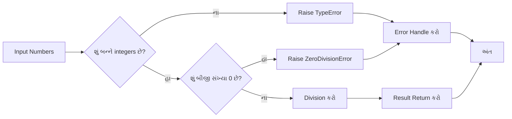
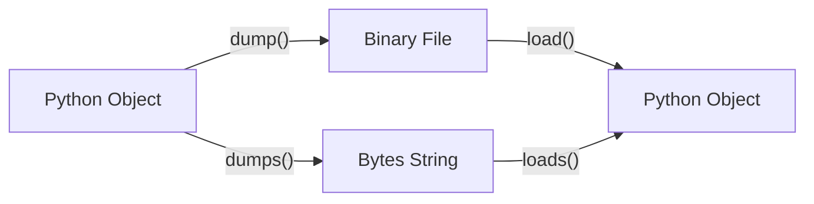

## પ્રશ્ન 1(અ) [3 ગુણ]

**ડિક્શનરી શું છે? ઉદાહરણ સાથે સમજાવો.**

**જવાબ**:

ડિક્શનરી એ Python માં key-value pairs નો collection છે જે mutable અને ordered હોય છે.

**કોષ્ટક: ડિક્શનરીની વિશેષતાઓ**

| વિશેષતા | વર્ણન |
|----------|--------|
| **Mutable** | Values ને change કરી શકાય છે |
| **Ordered** | Python 3.7+ માં insertion order maintain રહે છે |
| **Indexed** | Keys દ્વારા access કરાય છે |
| **No Duplicates** | Duplicate keys allow નથી |

```python
# ડિક્શનરી ઉદાહરણ
student = {
    "name": "રાજ",
    "age": 20,
    "course": "IT"
}
print(student["name"])  # આઉટપુટ: રાજ
```

- **Key-Value Structure**: દરેક element માં key અને value હોય છે
- **Fast Access**: O(1) time complexity માં data access
- **Dynamic Size**: Runtime માં size વધારી-ઘટાડી શકાય છે

**મેમરી ટ્રીક:** "Dictionary = Key Value Treasure"

---

## પ્રશ્ન 1(બ) [4 ગુણ]

**ટ્યુપલ બિલ્ટ-ઇન ફંકશન અને મેથડોનો વર્ણન કરો.**

**જવાબ**:

ટ્યુપલ માં limited built-in methods છે કારણ કે તે immutable છે.

**કોષ્ટક: ટ્યુપલ મેથડો**

| મેથડ | વર્ણન | ઉદાહરણ |
|------|--------|----------|
| **count()** | Element ની frequency return કરે છે | `t.count(5)` |
| **index()** | Element નું first index return કરે છે | `t.index('a')` |
| **len()** | ટ્યુપલ નું length return કરે છે | `len(t)` |
| **max()** | Maximum value return કરે છે | `max(t)` |
| **min()** | Minimum value return કરે છે | `min(t)` |

```python
# ટ્યુપલ મેથડો ઉદાહરણ
numbers = (1, 2, 3, 2, 4, 2)
print(numbers.count(2))     # આઉટપુટ: 3
print(numbers.index(3))     # આઉટપુટ: 2
print(len(numbers))         # આઉટપુટ: 6
```

- **Immutable Nature**: Methods ટ્યુપલ ને modify નથી કરતા
- **Return Values**: બધા methods નવી values return કરે છે
- **Type Conversion**: tuple() function થી list ને tuple માં convert કરી શકાય

**મેમરી ટ્રીક:** "Count Index Length Max Min"

---

## પ્રશ્ન 1(ક) [7 ગુણ]

**સેટ ઓપરેશન્સ દર્શાવવા માટે પાયથન પ્રોગ્રામ લખો.**

**જવાબ**:

Set operations mathematics ના set theory પર આધારિત છે.

**કોષ્ટક: સેટ ઓપરેશન્સ**

| ઓપરેશન | Symbol | Method | વર્ણન |
|----------|--------|--------|--------|
| **Union** | `\|` | `union()` | બન્ને sets ના elements |
| **Intersection** | `&` | `intersection()` | Common elements |
| **Difference** | `-` | `difference()` | First set માંથી second ને minus |
| **Symmetric Difference** | `^` | `symmetric_difference()` | Unique elements only |

```python
# સેટ ઓપરેશન્સ પ્રોગ્રામ
set1 = {1, 2, 3, 4, 5}
set2 = {4, 5, 6, 7, 8}

print("Set 1:", set1)
print("Set 2:", set2)

# યુનિયન ઓપરેશન
union_result = set1 | set2
print("Union:", union_result)

# ઇન્ટરસેક્શન ઓપરેશન  
intersection_result = set1 & set2
print("Intersection:", intersection_result)

# ડિફરન્સ ઓપરેશન
difference_result = set1 - set2
print("Difference:", difference_result)

# સિમેટ્રિક ડિફરન્સ
sym_diff_result = set1 ^ set2
print("Symmetric Difference:", sym_diff_result)

# સબસેટ અને સુપરસેટ
set3 = {1, 2}
print("શું set3 એ set1 નો subset છે?", set3.issubset(set1))
print("શું set1 એ set3 નો superset છે?", set1.issuperset(set3))
```

- **Mathematical Operations**: Set theory ના operations implement કરે છે
- **Efficient Processing**: Duplicate elements automatically remove થાય છે
- **Boolean Results**: Subset/superset operations boolean return કરે છે

**મેમરી ટ્રીક:** "Union Intersection Difference Symmetric"

---

## પ્રશ્ન 1(ક OR) [7 ગુણ]

**ડિક્શનરી ફંકશન અને ઓપરેશન્સ દર્શાવવા માટે પાયથન પ્રોગ્રામ લખો.**

**જવાબ**:

ડિક્શનરી ઓપરેશન્સ data manipulation માટે powerful tools પ્રદાન કરે છે.

**કોષ્ટક: ડિક્શનરી મેથડો**

| મેથડ | વર્ણન | ઉદાહરણ |
|------|--------|----------|
| **keys()** | બધી keys return કરે છે | `dict.keys()` |
| **values()** | બધા values return કરે છે | `dict.values()` |
| **items()** | Key-value pairs return કરે છે | `dict.items()` |
| **get()** | Safe value retrieval | `dict.get('key')` |
| **update()** | Dictionary merge કરે છે | `dict.update()` |

```python
# ડિક્શનરી ઓપરેશન્સ પ્રોગ્રામ
student_data = {
    "name": "અમિત",
    "age": 21,
    "course": "IT",
    "semester": 2
}

print("મૂળ Dictionary:", student_data)

# Values ને access કરવું
print("વિદ્યાર્થીનું નામ:", student_data.get("name"))
print("વિદ્યાર્થીની ઉંમર:", student_data["age"])

# નવી key-value pair ઉમેરવી
student_data["city"] = "અમદાવાદ"
print("શહેર ઉમેર્યા પછી:", student_data)

# અસ્તિત્વમાં રહેલી value અપડેટ કરવી
student_data.update({"age": 22, "semester": 3})
print("અપડેટ કર્યા પછી:", student_data)

# ડિક્શનરી મેથડો
print("Keys:", list(student_data.keys()))
print("Values:", list(student_data.values()))
print("Items:", list(student_data.items()))

# Elements ને remove કરવા
removed_value = student_data.pop("semester")
print("Remove કરેલી value:", removed_value)
print("અંતિમ Dictionary:", student_data)
```

- **Dynamic Operations**: Runtime માં keys અને values add/remove કરી શકાય
- **Safe Access**: get() method KeyError prevent કરે છે
- **Iteration Support**: keys(), values(), items() methods loop માટે useful

**મેમરી ટ્રીક:** "Get Keys Values Items Update Pop"

---

## પ્રશ્ન 2(અ) [3 ગુણ]

**પાયથનમાં ટ્યુપલ અને લિસ્ટ વચ્ચે તફાવત આપો.**

**જવાબ**:

**કોષ્ટક: ટ્યુપલ vs લિસ્ટ તુલના**

| વિશેષતા | ટ્યુપલ | લિસ્ટ |
|----------|--------|-------|
| **Mutability** | Immutable (બદલાઈ શકતું નથી) | Mutable (બદલાઈ શકે છે) |
| **Syntax** | કૌંસ `()` | ચોરસ કૌંસ `[]` |
| **Performance** | ઝડપી | ધીમી |
| **Memory** | ઓછી memory | વધુ memory |
| **Methods** | મર્યાદિત (count, index) | ઘણી methods ઉપલબ્ધ |
| **Use Case** | Fixed data | Dynamic data |

- **Immutable Nature**: ટ્યુપલ એકવાર create થયા પછી change થઈ શકતું નથી
- **Performance**: ટ્યુપલ operations લિસ્ટ કરતાં ઝડપી છે
- **Memory Efficient**: ટ્યુપલ ઓછી memory વાપરે છે

**મેમરી ટ્રીક:** "Tuple Tight, List Light"

---

## પ્રશ્ન 2(બ) [4 ગુણ]

**પાયથનમાં dir() ફંકશન શું છે? ઉદાહરણ સાથે સમજાવો.**

**જવાબ**:

dir() function એ built-in function છે જે object ના attributes અને methods ની list return કરે છે.

**કોષ્ટક: dir() ફંકશનની વિશેષતાઓ**

| વિશેષતા | વર્ણન |
|----------|--------|
| **Object Inspection** | Object ના attributes show કરે છે |
| **Method Discovery** | Available methods list કરે છે |
| **Namespace Exploration** | Current namespace ના variables show કરે છે |
| **Module Analysis** | Module ના contents explore કરે છે |

```python
# dir() ફંકશન ઉદાહરણ
# String object માટે
text = "Hello"
string_methods = dir(text)
print("String methods:", string_methods[:5])

# List object માટે  
my_list = [1, 2, 3]
list_methods = dir(my_list)
print("List methods:", [m for m in list_methods if not m.startswith('_')][:5])

# Current namespace માટે
print("Current namespace:", dir()[:3])

# Built-in functions માટે
import math
print("Math module:", dir(math)[:5])
```

- **Interactive Development**: Objects ના capabilities જાણવા માટે useful
- **Debugging Tool**: Available methods quickly identify કરવા માટે
- **Learning Aid**: નવી libraries explore કરવા માટે helpful

**મેમરી ટ્રીક:** "Dir = Directory of Methods"

---

## પ્રશ્ન 2(ક) [7 ગુણ]

**સર્કલનો એરિયા અને સિર્કમફેરન્સ શોધવા માટે મોડ્યુલ બનાવો અને બીજા પ્રોગ્રામમાં મોડ્યુલ ઇમ્પોર્ટ કરો.**

**જવાબ**:

Module approach કોડ reusability અને organization સુધારે છે.

**ડાયાગ્રામ: મોડ્યુલ સ્ટ્રક્ચર**

```goat
┌─────────────────┐    ┌─────────────────┐
│   circle.py     │    │   main.py       │
│   (Module)      │    │   (Main Program)│
├─────────────────┤    ├─────────────────┤
│ • area()        │───▶│ import circle   │
│ • circumference │    │ use functions   │
│ • PI constant   │    │                 │
└─────────────────┘    └─────────────────┘
```

**ફાઇલ 1: circle.py (મોડ્યુલ)**

```python
# circle.py - સર્કલ કેલ્ક્યુલેશન મોડ્યુલ
import math

# Constants
PI = math.pi

def area(radius):
    """સર્કલનો એરિયા કેલ્ક્યુલેટ કરે છે"""
    if radius < 0:
        return "Radius negative હોઈ શકે નહીં"
    return PI * radius * radius

def circumference(radius):
    """સર્કલનો circumference કેલ્ક્યુલેટ કરે છે"""
    if radius < 0:
        return "Radius negative હોઈ શકે નહીં"
    return 2 * PI * radius

def display_info():
    """મોડ્યુલ માહિતી દર્શાવે છે"""
    print("Circle Module - Version 1.0")
    print("Functions: area(), circumference()")
```

**ફાઇલ 2: main.py (મુખ્ય પ્રોગ્રામ)**

```python
# main.py - circle module વાપરનાર મુખ્ય પ્રોગ્રામ
import circle

# યુઝર પાસેથી radius લો
radius = float(input("Radius દાખલ કરો: "))

# મોડ્યુલ functions વાપરીને કેલ્ક્યુલેટ કરો
circle_area = circle.area(radius)
circle_circumference = circle.circumference(radius)

# પરિણામો દર્શાવો
print(f"Radius {radius} ના સર્કલ માટે:")
print(f"Area: {circle_area:.2f}")
print(f"Circumference: {circle_circumference:.2f}")

# મોડ્યુલ info દર્શાવો
circle.display_info()
```

- **Modular Design**: Functions ને separate file માં organize કરે છે
- **Reusability**: Module ને multiple programs માં use કરી શકાય
- **Namespace Management**: Module prefix થી function access કરાય છે

**મેમરી ટ્રીક:** "Import Calculate Display"

---

## પ્રશ્ન 2(અ OR) [3 ગુણ]

**નેસ્ટેડ ટ્યુપલને ઉદાહરણ સાથે સમજાવો.**

**જવાબ**:

Nested Tuple એ ટ્યુપલ અંદર બીજા tuples હોય છે, જે hierarchical data structure બનાવે છે.

**કોષ્ટક: નેસ્ટેડ ટ્યુપલની વિશેષતાઓ**

| વિશેષતા | વર્ણન |
|----------|--------|
| **Multi-dimensional** | 2D અથવા 3D data structure |
| **Immutable** | બધા levels પર immutable |
| **Indexing** | Multiple square brackets વાપરીને access |
| **Heterogeneous** | અલગ-અલગ data types store કરી શકાય |

```python
# નેસ્ટેડ ટ્યુપલ ઉદાહરણ
student_records = (
    ("રાજ", 20, ("IT", 2)),
    ("પ્રિયા", 19, ("CS", 1)), 
    ("અમિત", 21, ("IT", 3))
)

# નેસ્ટેડ elements ને access કરવા
print("પહેલો વિદ્યાર્થી:", student_records[0])
print("પહેલા વિદ્યાર્થીનું નામ:", student_records[0][0])
print("પહેલા વિદ્યાર્થીનો કોર્સ:", student_records[0][2][0])

# નેસ્ટેડ ટ્યુપલ પર iterate કરવું
for student in student_records:
    name, age, (course, semester) = student
    print(f"{name} - ઉંમર: {age}, કોર્સ: {course}, સેમ: {semester}")
```

- **Data Organization**: સંબંધિત data ને group કરવા માટે useful
- **Immutable Structure**: એકવાર create થયા પછી structure change થઈ શકતું નથી
- **Efficient Access**: Index-based fast access

**મેમરી ટ્રીક:** "Nested = Tuple Inside Tuple"

---

## પ્રશ્ન 2(બ OR) [4 ગુણ]

**PIP શું છે? પાયથન પેકેજને ઇન્સ્ટોલ અને અનઇન્સ્ટોલ કરવા માટે સિન્ટેક્સ લખો.**

**જવાબ**:

PIP (Pip Installs Packages) એ Python package installer છે જે PyPI થી packages download અને install કરે છે.

**કોષ્ટક: PIP કમાન્ડો**

| કમાન્ડ | સિન્ટેક્સ | વર્ણન |
|---------|-----------|--------|
| **Install** | `pip install package_name` | Package install કરે છે |
| **Uninstall** | `pip uninstall package_name` | Package remove કરે છે |
| **List** | `pip list` | Installed packages show કરે છે |
| **Show** | `pip show package_name` | Package info display કરે છે |
| **Upgrade** | `pip install --upgrade package_name` | Package update કરે છે |

```python
# PIP કમાન્ડ ઉદાહરણો (Terminal/Command Prompt માં run કરવા)

# Package install કરવા
# pip install requests

# Specific version install કરવા
# pip install Django==3.2.0

# Package uninstall કરવા  
# pip uninstall numpy

# બધા installed packages list કરવા
# pip list

# Package information show કરવા
# pip show matplotlib

# Package upgrade કરવા
# pip install --upgrade pandas

# Requirements file થી install કરવા
# pip install -r requirements.txt
```

- **Package Management**: Third-party libraries easily manage કરી શકાય
- **Version Control**: Specific versions install કરી શકાય
- **Dependency Resolution**: જરૂરી dependencies automatically install થાય

**મેમરી ટ્રીક:** "PIP = Package Install Python"

---

## પ્રશ્ન 2(ક OR) [7 ગુણ]

**પેકેજ ઇમ્પોર્ટ કરવાની વિવિધ રીતો સમજાવો. મોડ્યુલ અને પેકેજ એકબીજાની સાથે કેવી રીતે જોડાયેલા છે?**

**જવાબ**:

Python માં imports ના વિવિધ ways છે જે code organization અને namespace management માટે મહત્વપૂર્ણ છે.

**ડાયાગ્રામ: પેકેજ સ્ટ્રક્ચર**

```goat
MyPackage/
├── __init__.py
├── module1.py
├── module2.py
└── subpackage/
    ├── __init__.py
    └── module3.py
```

**કોષ્ટક: ઇમ્પોર્ટ મેથડો**

| મેથડ | સિન્ટેક્સ | ઉપયોગ |
|------|-----------|-------|
| **Basic Import** | `import module` | સંપૂર્ણ module name જરૂરી |
| **From Import** | `from module import function` | Direct function access |
| **Alias Import** | `import module as alias` | Module માટે ટૂંકું નામ |
| **Star Import** | `from module import *` | બધા functions import કરવા |
| **Package Import** | `from package import module` | Package માંથી import કરવા |

```python
# વિવિધ ઇમ્પોર્ટ રીતો

# 1. Basic Import
import math
result = math.sqrt(16)

# 2. From Import
from math import sqrt, pi
result = sqrt(16)
area = pi * 5 * 5

# 3. Alias Import
import numpy as np
array = np.array([1, 2, 3])

# 4. Star Import (ભલામણ નહીં)
from math import *
result = cos(0)

# 5. Package Import
from mypackage import module1
from mypackage.subpackage import module3

# 6. Relative Import (package અંદર)
# from . import module1
# from ..parent_module import function
```

**મોડ્યુલ-પેકેજ કનેક્શન:**

- **Modules**: Python code ધરાવતી single .py files
- **Packages**: \_\_init\_\_.py સાથે multiple modules ધરાવતી directories
- **Namespace**: Packages hierarchical namespace structure બનાવે છે
- **\_\_init\_\_.py**: Directory ને package બનાવે છે અને imports control કરે છે

**મેમરી ટ્રીક:** "Import From As Star Package"

---

## પ્રશ્ન 3(અ) [3 ગુણ]

**રનટાઇમ એરર અને સિન્ટેક્સ એરરનું વર્ણન કરો. ઉદાહરણ સાથે સમજાવો.**

**જવાબ**:

**કોષ્ટક: એરર પ્રકારોની તુલના**

| એરર પ્રકાર | ક્યારે થાય છે | Detection | ઉદાહરણ |
|-------------|---------------|-----------|----------|
| **Syntax Error** | Code parsing time | Execution પહેલાં | Missing colon, brackets |
| **Runtime Error** | Execution દરમિયાન | Program run કરતી વખતે | Division by zero, file not found |
| **Logic Error** | હંમેશા | Execution પછી | ખોટી calculation logic |

```python
# સિન્ટેક્સ એરર ઉદાહરણ
# print("Hello World"  # Missing closing parenthesis
# SyntaxError: unexpected EOF while parsing

# રનટાઇમ એરર ઉદાહરણો
try:
    # ZeroDivisionError
    result = 10 / 0
except ZeroDivisionError:
    print("શૂન્યથી ભાગ આપી શકાતો નથી")

try:
    # FileNotFoundError  
    file = open("nonexistent.txt", "r")
except FileNotFoundError:
    print("ફાઇલ મળી નથી")
```

- **Syntax Errors**: કોડ run થવા પહેલા જ detect થાય છે
- **Runtime Errors**: Program execution દરમિયાન થાય છે
- **Prevention**: Exception handling runtime errors ને handle કરે છે

**મેમરી ટ્રીક:** "Syntax Before, Runtime During"

---

## પ્રશ્ન 3(બ) [4 ગુણ]

**પાયથનમાં Exception હેન્ડલિંગ શું છે? ઉદાહરણ સાથે સમજાવો.**

**જવાબ**:

Exception handling એ mechanism છે જે runtime errors ને gracefully handle કરે છે અને program crash થવાથી prevent કરે છે.

**કોષ્ટક: Exception Handling Keywords**

| Keyword | હેતુ | વર્ણન |
|---------|------|--------|
| **try** | Exception માં થઈ શકે એવો code | Risk code block |
| **except** | Exception handle કરવા માટે | Error handling block |
| **finally** | હંમેશા execute થાય | Cleanup code |
| **else** | Exception ન આવે તો | Success code block |
| **raise** | Manual exception raise કરવા | Custom error throwing |

```python
# Exception Handling ઉદાહરણ
def safe_division(a, b):
    try:
        # કોડ જે exception raise કરી શકે
        result = a / b
        print(f"ભાગાકાર સફળ: {result}")
        
    except ZeroDivisionError:
        # Specific exception handle કરવા
        print("એરર: શૂન્યથી ભાગ આપી શકાતો નથી")
        result = None
        
    except TypeError:
        # Type errors handle કરવા
        print("એરર: અયોગ્ય data types")
        result = None
        
    else:
        # Exception ન આવે તો execute થાય
        print("ભાગાકાર સફળતાપૂર્વક પૂર્ણ થયું")
        
    finally:
        # હંમેશા execute થાય
        print("ભાગાકાર operation સમાપ્ત")
        
    return result

# ફંકશનને ટેસ્ટ કરો
safe_division(10, 2)   # સામાન્ય કેસ
safe_division(10, 0)   # Zero division
safe_division(10, "a") # Type error
```

- **Error Prevention**: Program crash થવાથી prevent કરે છે
- **Graceful Handling**: User-friendly error messages આપે છે
- **Resource Management**: finally block માં cleanup operations

**મેમરી ટ્રીક:** "Try Except Finally Else Raise"

---

## પ્રશ્ન 3(ક) [7 ગુણ]

**બે સંખ્યાઓના division માટે ફંકશન બનાવો, જો કોઈપણ argument ની value non-integer હોય તો એરર રેઇઝ થાય અથવા જો બીજી argument 0 હોય તો એરર રેઇઝ થાય.**

**જવાબ**:

Custom exception handling function બનાવવું validation અને error control માટે મહત્વપૂર્ણ છે.

**ડાયાગ્રામ: ફંકશન ફ્લો**



```python
def safe_integer_division(num1, num2):
    """
    બે સંખ્યાઓને validation સાથે ભાગ આપે છે
    જો arguments integers નથી તો TypeError raise કરે છે
    જો બીજી argument 0 છે તો ZeroDivisionError raise કરે છે
    """
    
    # તપાસો કે બન્ને arguments integers છે કે નહીં
    if not isinstance(num1, int):
        raise TypeError(f"પહેલી argument integer હોવી જોઈએ, મળી {type(num1).__name__}")
    
    if not isinstance(num2, int):
        raise TypeError(f"બીજી argument integer હોવી જોઈએ, મળી {type(num2).__name__}")
    
    # શૂન્યથી ભાગ માટે તપાસો
    if num2 == 0:
        raise ZeroDivisionError("શૂન્યથી ભાગ આપી શકાતો નથી")
    
    # ભાગાકાર કરો
    result = num1 / num2
    return result

# વિવિધ કેસો સાથે ફંકશનનું ટેસ્ટ
def test_division():
    test_cases = [
        (10, 2),      # યોગ્ય કેસ
        (15, 3),      # યોગ્ય કેસ  
        (10, 0),      # Zero division error
        (10.5, 2),    # Non-integer પહેલી argument
        (10, 2.5),    # Non-integer બીજી argument
        ("10", 2),    # String argument
    ]
    
    for num1, num2 in test_cases:
        try:
            result = safe_integer_division(num1, num2)
            print(f"{num1} ÷ {num2} = {result}")
            
        except TypeError as e:
            print(f"Type Error: {e}")
            
        except ZeroDivisionError as e:
            print(f"Zero Division Error: {e}")
            
        except Exception as e:
            print(f"અનપેક્ષિત Error: {e}")
        
        print("-" * 40)

# ટેસ્ટ run કરો
test_division()
```

- **Input Validation**: Arguments ના type અને value check કરે છે
- **Custom Errors**: Specific exceptions raise કરે છે
- **Error Messages**: સ્પષ્ટ અને વર્ણનાત્મક error messages

**મેમરી ટ્રીક:** "Validate Type, Check Zero, Divide Safe"

---

## પ્રશ્ન 4(અ) [3 ગુણ]

**ટેક્સ્ટ ફાઇલ અને બાયનરી ફાઇલ વચ્ચેના તફાવત પર પાંચ પોઇન્ટ્સ લખો.**

**જવાબ**:

**કોષ્ટક: ટેક્સ્ટ ફાઇલ vs બાયનરી ફાઇલ**

| વિશેષતા | ટેક્સ્ટ ફાઇલ | બાયનરી ફાઇલ |
|----------|-------------|-------------|
| **Content** | Human-readable characters | Binary data (0s અને 1s) |
| **Encoding** | Character encoding (UTF-8, ASCII) | કોઈ character encoding નથી |
| **Opening Mode** | 'r', 'w', 'a' | 'rb', 'wb', 'ab' |
| **File Size** | સામાન્યતે મોટી | સામાન્યતે નાની |
| **Platform** | Platform dependent | Platform independent |

```python
# ટેક્સ્ટ vs બાયનરી ફાઇલ ઉદાહરણો
# ટેક્સ્ટ ફાઇલ ઉદાહરણ
with open("sample.txt", "w") as f:
    f.write("Hello World")

# બાયનરી ફાઇલ ઉદાહરણ  
with open("sample.bin", "wb") as f:
    f.write(b'\x48\x65\x6c\x6c\x6f')
```

- **Readability**: ટેક્સ્ટ ફાઇલો editor માં read કરી શકાય, બાયનરી ફાઇલો માટે special software જોઈએ
- **Portability**: બાયનરી ફાઇલો different platforms પર easily transfer થાય
- **Processing**: ટેક્સ્ટ ફાઇલો string operations માટે, બાયનરી ફાઇલો exact data storage માટે

**મેમરી ટ્રીક:** "Text Human, Binary Machine"

---

## પ્રશ્ન 4(બ) [4 ગુણ]

**ફાઇલમાંથી ડેટા read કરવા માટે પ્રોગ્રામ લખો અને Uppercase કેરેક્ટર અને Lowercase કેરેક્ટરને બે અલગ ફાઇલોમાં separate કરો.**

**જવાબ**:

ફાઇલ processing માં character-based operations સામાન્ય requirements છે.

**કોષ્ટક: ફાઇલ ઓપરેશન્સ**

| ઓપરેશન | મેથડ | હેતુ |
|----------|------|------|
| **Read** | `read()` | સંપૂર્ણ ફાઇલ content |
| **Write** | `write()` | ફાઇલમાં string લખવા |
| **Character Check** | `isupper()`, `islower()` | Character case detection |
| **File Handling** | `with open()` | Safe ફાઇલ operations |

```python
def separate_case_characters(input_file, upper_file, lower_file):
    """
    ફાઇલ read કરીને uppercase/lowercase characters અલગ કરે છે
    """
    try:
        # Input ફાઇલમાંથી read કરો
        with open(input_file, 'r') as infile:
            content = infile.read()
        
        # Characters અલગ કરો
        uppercase_chars = ""
        lowercase_chars = ""
        
        for char in content:
            if char.isupper():
                uppercase_chars += char
            elif char.islower():
                lowercase_chars += char
        
        # Uppercase ફાઇલમાં લખો
        with open(upper_file, 'w') as upfile:
            upfile.write(uppercase_chars)
        
        # Lowercase ફાઇલમાં લખો  
        with open(lower_file, 'w') as lowfile:
            lowfile.write(lowercase_chars)
        
        print(f"✓ Characters સફળતાપૂર્વક અલગ કર્યા!")
        print(f"Uppercase characters: {len(uppercase_chars)}")
        print(f"Lowercase characters: {len(lowercase_chars)}")
        
    except FileNotFoundError:
        print(f"એરર: ફાઇલ '{input_file}' મળી નથી")
    except Exception as e:
        print(f"એરર: {e}")

# Sample input ફાઇલ બનાવો
def create_sample_file():
    sample_text = """Hello World! આ એક SAMPLE Text ફાઇલ છે.
તેમાં UPPERCASE અને lowercase Characters છે.
Python Programming ખૂબ જ FUN અને Educational છે."""
    
    with open("input.txt", "w") as f:
        f.write(sample_text)
    print("Sample input ફાઇલ બનાવી: input.txt")

# મુખ્ય execution
create_sample_file()
separate_case_characters("input.txt", "uppercase.txt", "lowercase.txt")

# પરિણામો દર્શાવો
print("\nફાઇલ Contents:")
print("-" * 30)

try:
    with open("uppercase.txt", "r") as f:
        print(f"Uppercase ફાઇલ: {f.read()}")
    
    with open("lowercase.txt", "r") as f:
        print(f"Lowercase ફાઇલ: {f.read()}")
except FileNotFoundError:
    print("Output ફાઇલો મળી નથી")
```

- **Character Processing**: દરેક character ની case individually check કરાય છે
- **File Safety**: with statement automatic ફાઇલ closing ensure કરે છે
- **Error Handling**: ફાઇલ operations માં proper exception handling

**મેમરી ટ્રીક:** "Read Separate Write"

---

## પ્રશ્ન 4(ક) [7 ગુણ]

**dump() અને load() મેથડનું વર્ણન કરો. ઉદાહરણ સાથે સમજાવો.**

**જવાબ**:

dump() અને load() methods pickle module ના part છે જે object serialization માટે વાપરાય છે.

**કોષ્ટક: Pickle મેથડો**

| મેથડ | હેતુ | File Mode | વર્ણન |
|------|-----|-----------|--------|
| **dump()** | Object ને file માં serialize કરવા | 'wb' | Object ને binary file માં store કરે |
| **load()** | File માંથી object deserialize કરવા | 'rb' | ફાઇલમાંથી object retrieve કરે |
| **dumps()** | Bytes માં serialize કરવા | N/A | Object ને bytes માં convert કરે |
| **loads()** | Bytes માંથી deserialize કરવા | N/A | Bytes માંથી object બનાવે |

**ડાયાગ્રામ: Serialization Process**



```python
import pickle

# વિવિધ data types સાથે ઉદાહરણ
def demonstrate_pickle():
    # Serialize કરવા માટે sample data
    student_data = {
        'name': 'રાજ પટેલ',
        'age': 20,
        'grades': [85, 92, 78, 96],
        'subjects': ('Math', 'Python', 'Database'),
        'is_active': True
    }
    
    class Student:
        def __init__(self, name, roll_no):
            self.name = name
            self.roll_no = roll_no
        
        def __str__(self):
            return f"Student: {self.name} (Roll: {self.roll_no})"
    
    # Objects બનાવો
    student_obj = Student("પ્રિયા શાહ", 101)
    data_list = [student_data, student_obj, [1, 2, 3, 4, 5]]
    
    # DUMP - Objects ને file માં serialize કરો
    print("=== DUMP Operation ===")
    try:
        with open('student_data.pkl', 'wb') as f:
            pickle.dump(data_list, f)
        print("✓ Data સફળતાપૂર્વક student_data.pkl માં dump કર્યો")
        
        # dumps() પણ demonstrate કરો
        serialized_bytes = pickle.dumps(student_data)
        print(f"✓ Data ને bytes માં serialize કર્યો: {len(serialized_bytes)} bytes")
        
    except Exception as e:
        print(f"❌ Dump error: {e}")
    
    # LOAD - File માંથી objects deserialize કરો  
    print("\n=== LOAD Operation ===")
    try:
        with open('student_data.pkl', 'rb') as f:
            loaded_data = pickle.load(f)
        
        print("✓ Data સફળતાપૂર્વક student_data.pkl માંથી load કર્યો")
        print("\nLoaded Data:")
        print("-" * 20)
        
        # Loaded data display કરો
        for i, item in enumerate(loaded_data):
            print(f"Item {i+1}: {item}")
            print(f"Type: {type(item)}")
            print()
        
        # loads() પણ demonstrate કરો
        deserialized_data = pickle.loads(serialized_bytes)
        print(f"✓ Bytes માંથી data deserialize કર્યો: {deserialized_data}")
        
    except FileNotFoundError:
        print("❌ Pickle ફાઇલ મળી નથી")
    except Exception as e:
        print(f"❌ Load error: {e}")

# Advanced ઉદાહરણ custom class સાથે
def advanced_pickle_example():
    class BankAccount:
        def __init__(self, account_no, holder_name, balance):
            self.account_no = account_no
            self.holder_name = holder_name
            self.balance = balance
            self.transactions = []
        
        def deposit(self, amount):
            self.balance += amount
            self.transactions.append(f"Deposit: +{amount}")
        
        def withdraw(self, amount):
            if self.balance >= amount:
                self.balance -= amount
                self.transactions.append(f"Withdraw: -{amount}")
            else:
                print("અપૂરતું balance")
        
        def __str__(self):
            return f"Account {self.account_no}: {self.holder_name} - Balance: ₹{self.balance}"
    
    # Account બનાવો અને વાપરો
    account = BankAccount("12345", "અમિત કુમાર", 5000)
    account.deposit(1500)
    account.withdraw(800)
    
    print("=== Advanced Pickle ઉદાહરણ ===")
    print(f"મૂળ: {account}")
    print(f"Transactions: {account.transactions}")
    
    # Account object serialize કરો
    with open('bank_account.pkl', 'wb') as f:
        pickle.dump(account, f)
    
    # Account object load કરો
    with open('bank_account.pkl', 'rb') as f:
        loaded_account = pickle.load(f)
    
    print(f"Loaded: {loaded_account}")
    print(f"Loaded transactions: {loaded_account.transactions}")
    
    # Object functionality verify કરો
    loaded_account.deposit(200)
    print(f"નવી deposit પછી: {loaded_account}")

# Demonstrations run કરો
demonstrate_pickle()
print("\n" + "="*50 + "\n")
advanced_pickle_example()
```

**ફાયદા અને મર્યાદાઓ:**

```python
# ફાયદા
benefits = [
    "સંપૂર્ણ object state preservation",
    "Complex nested objects સાથે કામ કરે છે", 
    "Object relationships maintain કરે છે",
    "Fast serialization/deserialization"
]

# મર્યાદાઓ  
limitations = [
    "Python-specific format",
    "અવિશ્વસનીય data સાથે security risks",
    "Version compatibility issues",
    "Human-readable નથી"
]

print("ફાયદા:", benefits)
print("મર્યાદાઓ:", limitations)
```

- **Object Persistence**: Python objects ને ફાઇલમાં permanently store કરી શકાય
- **Complete State**: Object ની complete state including methods preserve થાય છે
- **Binary Format**: Efficient storage પણ human-readable નથી

**મેમરી ટ્રીક:** "Dump Store, Load Restore"

---

## પ્રશ્ન 4(અ OR) [3 ગુણ]

**ફાઇલ ઓપરેશન માટે પાયથન દ્વારા આપેલ વિવિધ પ્રકારના ફાઇલ modes ની સૂચિ બનાવો અને તેમના ઉપયોગો સમજાવો.**

**જવાબ**:

**કોષ્ટક: Python ફાઇલ Modes**

| Mode | પ્રકાર | વર્ણન | Pointer Position |
|------|-------|--------|------------------|
| **'r'** | Text Read | માત્ર read કરવા, ફાઇલ હોવી જરૂરી | શરૂઆત |
| **'w'** | Text Write | માત્ર write કરવા, creates/overwrites | શરૂઆત |
| **'a'** | Text Append | માત્ર write કરવા, creates if not exist | અંત |
| **'x'** | Text Create | નવી ફાઇલ બનાવે, exists હોય તો fail | શરૂઆત |
| **'rb'** | Binary Read | Binary data read કરવા | શરૂઆત |
| **'wb'** | Binary Write | Binary data write કરવા | શરૂઆત |
| **'ab'** | Binary Append | Binary data append કરવા | અંત |
| **'r+'** | Text Read/Write | Read અને write, ફાઇલ હોવી જરૂરી | શરૂઆત |
| **'w+'** | Text Write/Read | Write અને read, creates/overwrites | શરૂઆત |

```python
# ફાઇલ Modes ઉદાહરણો
import os

# Demonstration માટે sample ફાઇલ બનાવો
with open('demo.txt', 'w') as f:
    f.write("મૂળ content\nLine 2\nLine 3")

# Read mode ('r')
with open('demo.txt', 'r') as f:
    content = f.read()
    print("Read mode:", content)

# Append mode ('a')  
with open('demo.txt', 'a') as f:
    f.write("\nAppended line")

# Read+Write mode ('r+')
with open('demo.txt', 'r+') as f:
    f.seek(0)  # શરૂઆતમાં જાઓ
    f.write("Modified")

print("ફાઇલ modes સફળતાપૂર્વક demonstrate કર્યા")
```

- **Safety**: 'x' mode accidental ફાઇલ overwriting prevent કરે છે
- **Efficiency**: Binary modes non-text data માટે ઝડપી છે
- **Flexibility**: Combined modes બંને read અને write operations allow કરે છે

**મેમરી ટ્રીક:** "Read Write Append Create Binary Plus"

---

## પ્રશ્ન 4(બ OR) [4 ગુણ]

**ફાઇલના readline() અને writeline() ફંકશનનું વર્ણન કરો.**

**જવાબ**:

**નોંધ**: Python માં `writeline()` ફંકશન અસ્તિત્વમાં નથી. યોગ્ય ફંકશન `writelines()` છે.

**કોષ્ટક: Line-based ફાઇલ ફંકશન્સ**

| ફંકશન | હેતુ | Return Type | ઉપયોગ |
|--------|-----|-------------|--------|
| **readline()** | એક line read કરવા | String | Sequential line reading |
| **readlines()** | બધી lines read કરવા | List of strings | Complete ફાઇલ as list |
| **writelines()** | Multiple lines write કરવા | None | List of strings લખવા |
| **write()** | Single string write કરવા | Number of chars | Basic writing |

```python
def demonstrate_line_functions():
    # Multiple lines સાથે sample ફાઇલ બનાવો
    lines_to_write = [
        "પ્રથમ લાઇન\n",
        "બીજી લાઇન\n", 
        "ત્રીજી લાઇન\n",
        "ચોથી લાઇન newline વગર"
    ]
    
    print("=== WRITELINES() Demonstration ===")
    # writelines() વાપરીને multiple lines લખો
    with open('sample_lines.txt', 'w') as f:
        f.writelines(lines_to_write)
    print("✓ writelines() વાપરીને multiple lines લખ્યા")
    
    print("\n=== READLINE() Demonstration ===")
    # readline() વાપરીને એક-એક line read કરો
    with open('sample_lines.txt', 'r') as f:
        line_count = 0
        while True:
            line = f.readline()
            if not line:  # ફાઇલનો અંત
                break
            line_count += 1
            print(f"Line {line_count}: {line.strip()}")
    
    print(f"કુલ lines read કર્યા: {line_count}")
    
    print("\n=== READLINES() Demonstration ===")
    # readlines() વાપરીને બધી lines એકસાથે read કરો
    with open('sample_lines.txt', 'r') as f:
        all_lines = f.readlines()
    
    print("List તરીકે બધી lines:")
    for i, line in enumerate(all_lines, 1):
        print(f"  [{i}] {repr(line)}")
    
    # Practical ઉદાહરણ: ફાઇલને line by line process કરવી
    print("\n=== Practical ઉદાહરણ ===")
    student_data = [
        "રાજ,20,IT\n",
        "પ્રિયા,19,CS\n", 
        "અમિત,21,EC\n",
        "સ્નેહા,20,IT\n"
    ]
    
    # Student data લખો
    with open('students.txt', 'w') as f:
        f.writelines(student_data)
    
    # Line by line read અને process કરો
    print("Student Information:")
    with open('students.txt', 'r') as f:
        while True:
            line = f.readline()
            if not line:
                break
            
            # દરેક line ને process કરો
            parts = line.strip().split(',')
            if len(parts) == 3:
                name, age, course = parts
                print(f"  {name} (ઉંમર: {age}, કોર્સ: {course})")

# Demonstration run કરો
demonstrate_line_functions()

# ફાઇલ pointer behavior ઉદાહરણ
def file_pointer_demo():
    print("\n=== ફાઇલ Pointer Behavior ===")
    
    with open('sample_lines.txt', 'r') as f:
        print(f"શરૂઆતની position: {f.tell()}")
        
        line1 = f.readline()
        print(f"readline() પછી: position {f.tell()}")
        print(f"Read: {repr(line1)}")
        
        line2 = f.readline()  
        print(f"બીજી readline() પછી: position {f.tell()}")
        print(f"Read: {repr(line2)}")

file_pointer_demo()
```

- **Sequential Access**: readline() sequential manner માં lines read કરે છે
- **Memory Efficient**: મોટી ફાઇલો માટે readline() memory-efficient છે
- **List Operations**: writelines() list of strings ને efficiently write કરે છે

**મેમરી ટ્રીક:** "Read Line, Write Lines"

---

## પ્રશ્ન 4(ક OR) [7 ગુણ]

**seek() અને tell() methods ને demonstrate કરવા માટે પાયથન પ્રોગ્રામ લખો.**

**જવાબ**:

seek() અને tell() methods ફાઇલ pointer manipulation માટે વાપરાય છે.

**કોષ્ટક: ફાઇલ Pointer મેથડો**

| મેથડ | હેતુ | Parameters | Return Value |
|------|-----|------------|--------------|
| **tell()** | Current position | None | Integer (byte position) |
| **seek()** | Pointer move કરવા | offset, whence | New position |
| **whence=0** | શરૂઆતથી | Default | Absolute position |
| **whence=1** | Current થી | Relative | Current + offset |
| **whence=2** | અંતથી | End relative | End + offset |

**ડાયાગ્રામ: ફાઇલ Pointer Movement**

```goat
ફાઇલ: "Hello World"
      ^             ^         ^
   Position 0   Position 6  Position 11 (EOF)
   
seek(0)    -> શરૂઆતમાં move કરો
seek(6)    -> Position 6 પર move કરો  
seek(-5,2) -> અંતથી 5 positions પહેલાં move કરો
```

```python
def demonstrate_seek_tell():
    # Known content સાથે sample ફાઇલ બનાવો
    sample_text = "Hello Python Programming World!"
    
    with open('pointer_demo.txt', 'w') as f:
        f.write(sample_text)
    
    print("=== ફાઇલ Pointer Demonstration ===")
    print(f"ફાઇલ content: '{sample_text}'")
    print(f"ફાઇલ length: {len(sample_text)} characters")
    print()
    
    with open('pointer_demo.txt', 'r') as f:
        # શરૂઆતની position
        print(f"1. શરૂઆતની position: {f.tell()}")
        
        # કેટલાક characters read કરો
        first_part = f.read(5)  # "Hello" read કરો
        print(f"2. '{first_part}' read કર્યા પછી: position {f.tell()}")
        
        # Specific position પર move કરો
        f.seek(6)  # Position 6 પર move કરો ("Python" ની શરૂઆત)
        print(f"3. seek(6) પછી: position {f.tell()}")
        
        # નવી position થી read કરો
        next_part = f.read(6)  # "Python" read કરો
        print(f"4. '{next_part}' read કર્યા: position {f.tell()}")
        
        # શરૂઆતમાં જાઓ
        f.seek(0)  # શરૂઆતમાં જાઓ
        print(f"5. seek(0) પછી: position {f.tell()}")
        
        # ફાઇલના અંતમાં જાઓ
        f.seek(0, 2)  # અંતથી 0 offset (position 2 = end)
        print(f"6. seek(0,2) - ફાઇલના અંતમાં: position {f.tell()}")
        
        # અંતથી પાછળ move કરો
        f.seek(-6, 2)  # અંતથી 6 positions પહેલાં
        print(f"7. seek(-6,2) પછી: position {f.tell()}")
        
        # બાકીનું content read કરો
        remaining = f.read()
        print(f"8. બાકીનું '{remaining}' read કર્યા: position {f.tell()}")

def practical_seek_tell_example():
    print("\n=== Practical ઉદાહરણ: ફાઇલ Editor Simulation ===")
    
    # Structured data સાથે ફાઇલ બનાવો
    data_lines = [
        "NAME:John Doe\n",
        "AGE:25\n", 
        "CITY:Mumbai\n",
        "PHONE:9876543210\n",
        "EMAIL:john@example.com\n"
    ]
    
    with open('person_data.txt', 'w') as f:
        f.writelines(data_lines)
    
    # Specific data find અને modify કરવું demonstrate કરો
    with open('person_data.txt', 'r+') as f:  # Read+Write mode
        # બધી positions find અને display કરો
        positions = {}
        
        while True:
            pos = f.tell()
            line = f.readline()
            if not line:
                break
            
            field = line.split(':')[0]
            positions[field] = pos
            print(f"Field '{field}' position {pos} પર શરૂ થાય છે")
        
        print(f"\nફાઇલ positions: {positions}")
        
        # Specific field (AGE) modify કરો
        if 'AGE' in positions:
            f.seek(positions['AGE'])
            print(f"\nAGE field પર position {f.tell()} પર move કર્યા")
            
            # Current line read કરો
            current_line = f.readline()
            print(f"Current line: {current_line.strip()}")
            
            # Overwrite માટે position calculate કરો
            f.seek(positions['AGE'])
            new_age_line = "AGE:26\n"  # મૂળ length જેટલી જ
            f.write(new_age_line)
            print(f"AGE field અપડેટ કર્યા")
    
    # Changes verify કરો
    print("\nઅપડેટ કરેલ ફાઇલ content:")
    with open('person_data.txt', 'r') as f:
        print(f.read())

def binary_seek_tell_demo():
    print("\n=== Binary ફાઇલ Seek/Tell Demo ===")
    
    # Binary ફાઇલ બનાવો
    binary_data = b'\x48\x65\x6c\x6c\x6f\x20\x57\x6f\x72\x6c\x64'  # "Hello World"
    
    with open('binary_demo.bin', 'wb') as f:
        f.write(binary_data)
    
    with open('binary_demo.bin', 'rb') as f:
        print(f"Binary ફાઇલ size: {len(binary_data)} bytes")
        
        # Binary mode માં બધા seek modes demonstrate કરો
        print(f"શરૂઆતની position: {f.tell()}")
        
        # પહેલા 5 bytes read કરો
        first_bytes = f.read(5)
        print(f"પહેલા 5 bytes read કર્યા: {first_bytes} at position {f.tell()}")
        
        # Current position થી relative seek (binary mode માં કામ કરે છે)
        f.seek(1, 1)  # Current થી 1 byte આગળ move કરો
        print(f"seek(1,1) પછી: position {f.tell()}")
        
        # અંતથી seek કરો
        f.seek(-3, 2)  # અંતથી 3 bytes પહેલાં
        print(f"seek(-3,2) પછી: position {f.tell()}")
        
        # બાકીના bytes
        remaining_bytes = f.read()
        print(f"બાકીના bytes: {remaining_bytes}")

# બધા demonstrations run કરો
demonstrate_seek_tell()
practical_seek_tell_example()
binary_seek_tell_demo()

# Cleanup
import os
try:
    os.remove('pointer_demo.txt')
    os.remove('person_data.txt') 
    os.remove('binary_demo.bin')
    print("\nDemo ફાઇલો સાફ કર્યા")
except:
    pass
```

- **ફાઇલ Navigation**: seek() arbitrary position પર move કરવા માટે વાપરાય છે
- **Position Tracking**: tell() current position track કરવા માટે useful છે
- **ફાઇલ Editing**: Specific locations પર data modify કરવા માટે જરૂરી

**મેમરી ટ્રીક:** "Tell Position, Seek Destination"

---

## પ્રશ્ન 5(અ) [3 ગુણ]

**ટર્ટલનો ઉપયોગ કરીને circle અને rectangle ના આકાર દોરો અને તેમને લાલ રંગથી ભરો.**

**જવાબ**:

Turtle graphics module માં shapes draw કરવા અને fill કરવા માટે specific methods છે.

**કોષ્ટક: Turtle Shape મેથડો**

| મેથડ | હેતુ | ઉદાહરણ |
|------|-----|----------|
| **circle()** | Circle draw કરવા | `turtle.circle(50)` |
| **forward()** | આગળ move કરવા | `turtle.forward(100)` |
| **right()** | જમણે turn કરવા | `turtle.right(90)` |
| **begin_fill()** | Fill શરૂ કરવા | `turtle.begin_fill()` |
| **end_fill()** | Fill સમાપ્ત કરવા | `turtle.end_fill()` |
| **fillcolor()** | Fill color set કરવા | `turtle.fillcolor("red")` |

```python
import turtle

def draw_filled_shapes():
    # Screen અને turtle બનાવો
    screen = turtle.Screen()
    screen.title("Turtle સાથે Filled Shapes")
    screen.bgcolor("white")
    screen.setup(800, 600)
    
    # Turtle object બનાવો
    painter = turtle.Turtle()
    painter.speed(3)
    
    # Filled circle draw કરો
    print("Filled circle draw કરી રહ્યા છીએ...")
    painter.penup()
    painter.goto(-150, 0)  # ડાબી બાજુ move કરો
    painter.pendown()
    
    painter.fillcolor("red")
    painter.begin_fill()
    painter.circle(80)  # Radius = 80
    painter.end_fill()
    
    # Filled rectangle draw કરો
    print("Filled rectangle draw કરી રહ્યા છીએ...")
    painter.penup()
    painter.goto(50, 50)  # જમણી બાજુ move કરો
    painter.pendown()
    
    painter.fillcolor("red")
    painter.begin_fill()
    
    # Rectangle draw કરો (100x80)
    for _ in range(2):
        painter.forward(100)
        painter.right(90)
        painter.forward(80)
        painter.right(90)
    
    painter.end_fill()
    
    # Labels ઉમેરો
    painter.penup()
    painter.goto(-150, -120)
    painter.write("લાલ Circle", align="center", font=("Arial", 14, "normal"))
    
    painter.goto(100, -50)
    painter.write("લાલ Rectangle", align="center", font=("Arial", 14, "normal"))
    
    # Turtle hide કરો અને result display કરો
    painter.hideturtle()
    print("Shapes સફળતાપૂર્વક draw કર્યા!")
    
    # Window open રાખો
    screen.exitonclick()

# પ્રોગ્રામ run કરો
draw_filled_shapes()
```

- **Fill Process**: begin_fill() અને end_fill() વચ્ચે drawn shape automatically fill થાય છે
- **Color Setting**: fillcolor() method fill color set કરે છે
- **Shape Drawing**: Geometric shapes માટે specific turtle movements

**મેમરી ટ્રીક:** "Begin Fill Draw End"

---

## પ્રશ્ન 5(બ) [4 ગુણ]

**ટર્ટલની Direction બદલવાની વિવિધ inbuilt પદ્ધતિઓ સમજાવો.**

**જવાબ**:

**કોષ્ટક: Turtle Direction મેથડો**

| મેથડ | Parameters | વર્ણન | ઉદાહરણ |
|------|------------|--------|----------|
| **right()** | angle | Degrees માં જમણે turn કરે છે | `turtle.right(90)` |
| **left()** | angle | Degrees માં ડાબે turn કરે છે | `turtle.left(45)` |
| **setheading()** | angle | Absolute direction set કરે છે | `turtle.setheading(0)` |
| **towards()** | x, y | Coordinates તરફ point કરે છે | `turtle.towards(100, 50)` |
| **home()** | none | Center પર return કરે, પૂર્વ તરફ face કરે | `turtle.home()` |

```python
import turtle

def demonstrate_direction_methods():
    screen = turtle.Screen()
    screen.setup(600, 600)
    screen.title("Turtle Direction મેથડો")
    
    t = turtle.Turtle()
    t.speed(2)
    t.shape("turtle")
    
    # 1. right() મેથડ
    t.write("1. right(90)", font=("Arial", 10, "normal"))
    t.forward(50)
    t.right(90)
    t.forward(50)
    
    # 2. left() મેથડ  
    t.penup()
    t.goto(-100, 100)
    t.pendown()
    t.write("2. left(45)", font=("Arial", 10, "normal"))
    t.forward(50)
    t.left(45)
    t.forward(50)
    
    # 3. setheading() મેથડ
    t.penup()
    t.goto(100, 100)
    t.pendown()
    t.write("3. setheading(180)", font=("Arial", 10, "normal"))
    t.setheading(180)  # પશ્ચિમ તરફ face કરો
    t.forward(50)
    
    # 4. towards() મેથડ
    t.penup()
    t.goto(-100, -100)
    t.pendown()
    target_x, target_y = 100, -100
    t.write("4. towards(100,-100)", font=("Arial", 10, "normal"))
    angle = t.towards(target_x, target_y)
    t.setheading(angle)
    t.goto(target_x, target_y)
    
    # 5. home() મેથડ
    t.write("5. home()", font=("Arial", 10, "normal"))
    t.home()  # Center પર return કરો અને પૂર્વ તરફ face કરો
    
    t.hideturtle()
    screen.exitonclick()

demonstrate_direction_methods()
```

- **Relative Turns**: right() અને left() current direction થી relative turn કરે છે
- **Absolute Direction**: setheading() absolute compass direction set કરે છે
- **Smart Pointing**: towards() specific coordinates તરફ point કરે છે

**મેમરી ટ્રીક:** "Right Left Set Towards Home"

---

## પ્રશ્ન 5(ક) [7 ગુણ]

**ટર્ટલનો ઉપયોગ કરીને rainbow દોરવા માટે પાયથન પ્રોગ્રામ લખો.**

**જવાબ**:

Rainbow drawing માં multiple colored arcs અને proper positioning જરૂરી છે.

**ડાયાગ્રામ: Rainbow Structure**

```goat
    Red (બાહ્ય)
   Orange  
  Yellow
 Green
Blue
Indigo
Violet (અંદરનો)
```

```python
import turtle

def draw_rainbow():
    # Screen setup
    screen = turtle.Screen()
    screen.title("સુંદર Rainbow")
    screen.bgcolor("lightblue")
    screen.setup(800, 600)
    
    # Turtle setup
    rainbow_turtle = turtle.Turtle()
    rainbow_turtle.speed(8)
    rainbow_turtle.pensize(8)
    
    # Rainbow colors (ROYGBIV)
    colors = ["red", "orange", "yellow", "green", "blue", "indigo", "violet"]
    
    # Rainbow parameters
    start_radius = 200
    radius_decrease = 15
    start_y = -150
    
    print("Rainbow draw કરી રહ્યા છીએ...")
    
    # દરેક color arc draw કરો
    for i, color in enumerate(colors):
        # Color set કરો
        rainbow_turtle.pencolor(color)
        
        # Current radius calculate કરો
        current_radius = start_radius - (i * radius_decrease)
        
        # Semi-circle માટે turtle position કરો
        rainbow_turtle.penup()
        rainbow_turtle.goto(-current_radius, start_y)
        rainbow_turtle.pendown()
        rainbow_turtle.setheading(0)  # પૂર્વ તરફ face કરો
        
        # Semi-circle draw કરો (180 degrees)
        rainbow_turtle.circle(current_radius, 180)
        
        print(f"{color} arc radius {current_radius} સાથે draw કર્યો")
    
    # Rainbow ના છેડે clouds ઉમેરો
    draw_clouds(rainbow_turtle)
    
    # Sun ઉમેરો
    draw_sun(rainbow_turtle)
    
    # Text ઉમેરો
    rainbow_turtle.penup()
    rainbow_turtle.goto(0, -250)
    rainbow_turtle.pencolor("black")
    rainbow_turtle.write("🌈 સુંદર Rainbow 🌈", align="center", 
                        font=("Arial", 16, "bold"))
    
    rainbow_turtle.hideturtle()
    print("Rainbow પૂર્ણ થયું!")
    
    screen.exitonclick()

def draw_clouds(turtle_obj):
    """Rainbow ના બંને છેડે clouds draw કરે છે"""
    turtle_obj.pensize(3)
    turtle_obj.pencolor("white")
    turtle_obj.fillcolor("lightgray")
    
    # Clouds ની positions
    cloud_positions = [(-250, -100), (250, -100)]
    
    for x, y in cloud_positions:
        turtle_obj.penup()
        turtle_obj.goto(x, y)
        turtle_obj.pendown()
        
        # Multiple circles વાપરીને cloud draw કરો
        turtle_obj.begin_fill()
        for i in range(3):
            turtle_obj.circle(20)
            turtle_obj.left(120)
        turtle_obj.end_fill()

def draw_sun(turtle_obj):
    """Corner માં sun draw કરે છે"""
    turtle_obj.penup()
    turtle_obj.goto(300, 200)
    turtle_obj.pendown()
    turtle_obj.pencolor("orange")
    turtle_obj.fillcolor("yellow")
    
    # Sun body draw કરો
    turtle_obj.begin_fill()
    turtle_obj.circle(30)
    turtle_obj.end_fill()
    
    # Sun rays draw કરો
    turtle_obj.pensize(2)
    for angle in range(0, 360, 45):
        turtle_obj.setheading(angle)
        turtle_obj.forward(45)
        turtle_obj.backward(45)

# Alternative rainbow with gradient effect
def draw_gradient_rainbow():
    screen = turtle.Screen()
    screen.title("Gradient Rainbow")
    screen.bgcolor("skyblue")
    screen.setup(800, 600)
    
    t = turtle.Turtle()
    t.speed(0)
    t.pensize(5)
    
    # Gradient effect માટે color variations
    rainbow_colors = [
        "#FF0000", "#FF4500", "#FFD700", "#32CD32", 
        "#0000FF", "#4B0082", "#8B00FF"
    ]
    
    # Varying thickness સાથે rainbow draw કરો
    for i, color in enumerate(rainbow_colors):
        t.pencolor(color)
        t.pensize(12 - i)  # Decreasing thickness
        
        radius = 150 - (i * 10)
        t.penup()
        t.goto(-radius, -100)
        t.pendown()
        t.setheading(0)
        t.circle(radius, 180)
    
    t.hideturtle()
    screen.exitonclick()

# Rainbow programs run કરો
print("Rainbow પ્રકાર પસંદ કરો:")
print("1. Standard Rainbow")
print("2. Gradient Rainbow")

choice = input("પસંદગી દાખલ કરો (1 અથવા 2): ")
if choice == "2":
    draw_gradient_rainbow()
else:
    draw_rainbow()
```

- **Color Sequence**: ROYGBIV (Red Orange Yellow Green Blue Indigo Violet) નો proper order
- **Radius Management**: દરેક arc નો radius gradually decrease કરાય છે
- **Positioning**: Proper positioning માટે penup/pendown અને goto methods

**મેમરી ટ્રીક:** "ROYGBIV Arc Radius Position"

---

## પ્રશ્ન 5(અ OR) [3 ગુણ]

**ટર્ટલ સ્ક્રીનનો ડાયાગ્રામ દોરો અને x અને y કોઓર્ડિનેટ્સના તમામ 4 quadrants સમજાવો.**

**જવાબ**:

**ડાયાગ્રામ: Turtle Coordinate System**

```goat
                    +Y
                    |
                    |
        II          |          I
    (-x,+y)         |      (+x,+y)
                    |
-X -----|-----|-----|-----|----- +X
       -200  -100   0   100  200
                    |
        III         |         IV  
    (-x,-y)         |      (+x,-y)
                    |
                    |
                   -Y
                   
Default Screen: 400x300 pixels
Center: (0, 0)
```

**કોષ્ટક: Coordinate Quadrants**

| Quadrant | X Value | Y Value | વર્ણન | ઉદાહરણ |
|----------|---------|---------|--------|----------|
| **I** | Positive (+) | Positive (+) | ઉપર-જમણે | (100, 50) |
| **II** | Negative (-) | Positive (+) | ઉપર-ડાબે | (-100, 50) |
| **III** | Negative (-) | Negative (-) | નીચે-ડાબે | (-100, -50) |
| **IV** | Positive (+) | Negative (-) | નીચે-જમણે | (100, -50) |

```python
import turtle

def demonstrate_coordinate_system():
    screen = turtle.Screen()
    screen.title("Turtle Coordinate System")
    screen.setup(600, 500)
    screen.bgcolor("white")
    
    t = turtle.Turtle()
    t.speed(3)
    t.shape("turtle")
    
    # Coordinate axes draw કરો
    t.pencolor("gray")
    t.pensize(2)
    
    # X-axis
    t.penup()
    t.goto(-250, 0)
    t.pendown()
    t.goto(250, 0)
    
    # Y-axis
    t.penup()
    t.goto(0, -200)
    t.pendown()
    t.goto(0, 200)
    
    # Center mark કરો
    t.penup()
    t.goto(0, 0)
    t.dot(8, "red")
    t.write("(0,0)", font=("Arial", 12, "normal"))
    
    # દરેક quadrant demonstrate કરો
    quadrants = [
        (100, 100, "I", "red"),     # Quadrant I
        (-100, 100, "II", "blue"),  # Quadrant II  
        (-100, -100, "III", "green"), # Quadrant III
        (100, -100, "IV", "orange")   # Quadrant IV
    ]
    
    for x, y, quad_name, color in quadrants:
        t.pencolor(color)
        t.penup()
        t.goto(x, y)
        t.pendown()
        t.dot(10, color)
        t.write(f"Q{quad_name}\n({x},{y})", align="center", 
                font=("Arial", 10, "bold"))
    
    t.hideturtle()
    screen.exitonclick()

demonstrate_coordinate_system()
```

- **Origin**: (0,0) screen ના center પર આવેલું છે
- **Positive Direction**: X-axis જમણે તરફ, Y-axis ઉપર તરફ positive
- **Navigation**: goto(x, y) method specific coordinates પર move કરે છે

**મેમરી ટ્રીક:** "Right Up Positive, Left Down Negative"

---

## પ્રશ્ન 5(બ OR) [4 ગુણ]

**Background color, title, screensize અને shapesize ને બદલવા માટે વિવિધ ટર્ટલ સ્ક્રીન પદ્ધતિઓનું વર્ણન કરો.**

**જવાબ**:

**કોષ્ટક: Turtle Screen મેથડો**

| મેથડ | હેતુ | Parameters | ઉદાહરણ |
|------|-----|------------|----------|
| **bgcolor()** | Background color set કરવા | color name/hex | `screen.bgcolor("blue")` |
| **title()** | Window title set કરવા | string | `screen.title("My Program")` |
| **setup()** | Screen size set કરવા | width, height | `screen.setup(800, 600)` |
| **screensize()** | Canvas size set કરવા | width, height | `screen.screensize(400, 300)` |
| **shapesize()** | Turtle size set કરવા | stretch_wid, stretch_len | `turtle.shapesize(2, 3)` |

```python
import turtle

def demonstrate_screen_methods():
    # Screen object બનાવો
    screen = turtle.Screen()
    
    # 1. Title મેથડ
    screen.title("Screen Methods Demonstration")
    print("✓ Title set કર્યું: 'Screen Methods Demonstration'")
    
    # 2. Background Color મેથડ
    screen.bgcolor("lightgreen")
    print("✓ Background color set કર્યો: lightgreen")
    
    # 3. Setup મેથડ (window size)
    screen.setup(width=800, height=600)
    print("✓ Window size set કર્યું: 800x600 pixels")
    
    # 4. Screen Size મેથડ (canvas size)
    screen.screensize(canvwidth=400, canvheight=300)
    print("✓ Canvas size set કર્યું: 400x300")
    
    # Shapesize demonstrate કરવા માટે turtle બનાવો
    demo_turtle = turtle.Turtle()
    demo_turtle.speed(3)
    
    # 5. Shape Size મેથડ
    demo_turtle.shape("turtle")
    demo_turtle.shapesize(stretch_wid=3, stretch_len=2, outline=3)
    print("✓ Turtle shape size: width=3x, length=2x, outline=3")
    
    # વિવિધ background colors demonstrate કરો
    colors = ["lightblue", "lightyellow", "lightpink", "lightcoral"]
    
    for i, color in enumerate(colors):
        screen.bgcolor(color)
        demo_turtle.write(f"Background: {color}", 
                         font=("Arial", 14, "normal"))
        demo_turtle.forward(50)
        demo_turtle.right(90)
        screen.ontimer(lambda: None, 1000)  # 1 સેકન્ડ રાહ જુઓ
    
    # Final state પર reset કરો
    screen.bgcolor("white")
    demo_turtle.penup()
    demo_turtle.goto(0, -50)
    demo_turtle.write("Screen Methods Demo સંપૂર્ણ!", 
                     align="center", font=("Arial", 16, "bold"))
    
    demo_turtle.hideturtle()
    screen.exitonclick()

def advanced_screen_customization():
    """Advanced screen customization ઉદાહરણ"""
    screen = turtle.Screen()
    
    # બધા parameters સાથે advanced setup
    screen.setup(width=0.8, height=0.8, startx=100, starty=50)
    screen.title("🐢 Advanced Turtle Graphics 🐢")
    screen.bgcolor("#2E8B57")  # Sea Green
    
    # Custom color palette
    screen.colormode(255)  # RGB mode enable કરો
    
    # વિવિધ sizes સાથે multiple turtles બનાવો
    turtles = []
    shapes = ["turtle", "circle", "square", "triangle"]
    sizes = [(1, 1), (2, 1), (1, 2), (3, 3)]
    colors = [(255, 0, 0), (0, 255, 0), (0, 0, 255), (255, 255, 0)]
    
    for i in range(4):
        t = turtle.Turtle()
        t.shape(shapes[i])
        t.shapesize(sizes[i][0], sizes[i][1])
        t.color(colors[i])
        t.penup()
        t.goto(-150 + i*100, 0)
        turtles.append(t)
        
        # દરેક turtle ને label કરો
        t.write(f"{shapes[i]}\n{sizes[i]}", 
               align="center", font=("Arial", 10, "normal"))
    
    # Instructions ઉમેરો
    instruction_turtle = turtle.Turtle()
    instruction_turtle.hideturtle()
    instruction_turtle.penup()
    instruction_turtle.goto(0, -100)
    instruction_turtle.color("white")
    instruction_turtle.write("વિવિધ turtle shapes અને sizes", 
                           align="center", font=("Arial", 16, "bold"))
    
    screen.exitonclick()

# Demonstrations run કરો
print("Screen Methods Demo run કરી રહ્યા છીએ...")
demonstrate_screen_methods()

print("\nAdvanced Customization run કરી રહ્યા છીએ...")
advanced_screen_customization()
```

- **Window vs Canvas**: setup() window size, screensize() canvas size control કરે છે
- **Color Modes**: bgcolor() color names અથવા hex values accept કરે છે
- **Shape Scaling**: shapesize() turtle appearance ને scale કરે છે

**મેમરી ટ્રીક:** "Title Background Setup Size Shape"

---

## પ્રશ્ન 5(ક OR) [7 ગુણ]

**ટર્ટલનો ઉપયોગ કરીને સ્ટાર, ત્રિકોણ અને અષ્ટકોણ દોરવા માટે પાયથન પ્રોગ્રામ લખો.**

**જવાબ**:

Geometric shapes drawing માં angles અને sides ની proper calculation જરૂરી છે.

**કોષ્ટક: Shape Properties**

| આકાર | બાજુઓ | External Angle | Internal Angle | Turn Angle |
|------|--------|----------------|----------------|------------|
| **ત્રિકોણ** | 3 | 120° | 60° | 120° |
| **સ્ટાર (5-point)** | 5 | 144° | 36° | 144° |
| **અષ્ટકોણ** | 8 | 45° | 135° | 45° |

**ડાયાગ્રામ: Shape Construction**

```goat
ત્રિકોણ:        સ્ટાર:           અષ્ટકોણ:
   /\             *              /‾‾‾\
  /  \           / \            /     \
 /____\         /   \          |       |
               *     *          \     /
                \   /            \___/
                 \ /
                  *
```

```python
import turtle
import math

def draw_geometric_shapes():
    # Screen setup
    screen = turtle.Screen()
    screen.title("Geometric Shapes: સ્ટાર, ત્રિકોણ, અષ્ટકોણ")
    screen.bgcolor("black")
    screen.setup(900, 600)
    
    # Turtle setup
    artist = turtle.Turtle()
    artist.speed(6)
    artist.pensize(3)
    
    # આકાર 1: ત્રિકોણ
    draw_triangle(artist, -250, 100, 80, "cyan")
    
    # આકાર 2: પાંચ-બિંદુવાળો સ્ટાર  
    draw_star(artist, 0, 100, 80, "yellow")
    
    # આકાર 3: અષ્ટકોણ
    draw_octagon(artist, 250, 100, 60, "magenta")
    
    # Labels ઉમેરો
    add_labels(artist)
    
    artist.hideturtle()
    print("બધા આકારો સફળતાપૂર્વક દોર્યા!")
    screen.exitonclick()

def draw_triangle(turtle_obj, x, y, size, color):
    """સમબાજુ ત્રિકોણ દોરે છે"""
    print(f"ત્રિકોણ ({x}, {y}) પર draw કરી રહ્યા છીએ")
    
    turtle_obj.penup()
    turtle_obj.goto(x, y)
    turtle_obj.pendown()
    turtle_obj.color(color)
    turtle_obj.fillcolor(color)
    
    turtle_obj.begin_fill()
    for _ in range(3):
        turtle_obj.forward(size)
        turtle_obj.left(120)  # ત્રિકોણ માટે external angle
    turtle_obj.end_fill()

def draw_star(turtle_obj, x, y, size, color):
    """પાંચ-બિંદુવાળો સ્ટાર દોરે છે"""
    print(f"સ્ટાર ({x}, {y}) પર draw કરી રહ્યા છીએ")
    
    turtle_obj.penup()
    turtle_obj.goto(x, y)
    turtle_obj.pendown()
    turtle_obj.color(color)
    turtle_obj.fillcolor(color)
    
    turtle_obj.begin_fill()
    for _ in range(5):
        turtle_obj.forward(size)
        turtle_obj.right(144)  # 5-pointed સ્ટાર માટે 144° turn
    turtle_obj.end_fill()

def draw_octagon(turtle_obj, x, y, size, color):
    """નિયમિત અષ્ટકોણ દોરે છે"""
    print(f"અષ્ટકોણ ({x}, {y}) પર draw કરી રહ્યા છીએ")
    
    turtle_obj.penup()
    turtle_obj.goto(x, y)
    turtle_obj.pendown()
    turtle_obj.color(color)
    turtle_obj.fillcolor(color)
    
    turtle_obj.begin_fill()
    for _ in range(8):
        turtle_obj.forward(size)
        turtle_obj.right(45)  # અષ્ટકોણ માટે 360°/8 = 45°
    turtle_obj.end_fill()

def add_labels(turtle_obj):
    """દરેક આકાર માટે labels ઉમેરે છે"""
    turtle_obj.color("white")
    
    labels = [
        (-250, 30, "ત્રિકોણ\n3 બાજુઓ\n120° turns"),
        (0, 30, "સ્ટાર\n5 બિંદુઓ\n144° turns"), 
        (250, 30, "અષ્ટકોણ\n8 બાજુઓ\n45° turns")
    ]
    
    for x, y, text in labels:
        turtle_obj.penup()
        turtle_obj.goto(x, y)
        turtle_obj.write(text, align="center", font=("Arial", 12, "normal"))

def draw_advanced_shapes():
    """Animations અને multiple variations સાથે advanced version"""
    screen = turtle.Screen()
    screen.title("Advanced Geometric Shapes")
    screen.bgcolor("navy")
    screen.setup(1000, 700)
    
    artist = turtle.Turtle()
    artist.speed(8)
    artist.pensize(2)
    
    # Animated ત્રિકોણ variations
    triangle_sizes = [40, 60, 80]
    triangle_colors = ["red", "orange", "yellow"]
    
    for i, (size, color) in enumerate(zip(triangle_sizes, triangle_colors)):
        x = -300 + i * 30
        y = 200 - i * 20
        draw_triangle(artist, x, y, size, color)
    
    # Animated સ્ટાર variations
    star_sizes = [30, 50, 70, 90]
    star_colors = ["pink", "lightblue", "lightgreen", "gold"]
    
    for i, (size, color) in enumerate(zip(star_sizes, star_colors)):
        angle = i * 90
        x = 150 + math.cos(math.radians(angle)) * 80
        y = 100 + math.sin(math.radians(angle)) * 80
        
        artist.penup()
        artist.goto(x, y)
        artist.setheading(angle)
        artist.pendown()
        artist.color(color)
        artist.fillcolor(color)
        
        artist.begin_fill()
        for _ in range(5):
            artist.forward(size)
            artist.right(144)
        artist.end_fill()
    
    # અષ્ટકોણ pattern
    for i in range(3):
        size = 40 + i * 15
        color_intensity = 0.3 + i * 0.2
        draw_octagon(artist, -100, -100 + i * 80, size, 
                    (color_intensity, 0, color_intensity))
    
    # ગણિતશાસ્ત્રીય માહિતી
    artist.penup()
    artist.goto(0, -250)
    artist.color("white")
    artist.write("Geometric Shapes - ગણિતશાસ્ત્રીય ગુણધર્મો", 
                align="center", font=("Arial", 16, "bold"))
    
    artist.goto(0, -280)
    artist.write("ત્રિકોણ: કોણોનો સરવાળો = 180°, સ્ટાર: 36° points, અષ્ટકોણ: સરવાળો = 1080°", 
                align="center", font=("Arial", 12, "normal"))
    
    artist.hideturtle()
    screen.exitonclick()

def calculate_shape_properties():
    """ગણિતશાસ્ત્રીય ગુણધર્મો calculate અને display કરે છે"""
    shapes_info = {
        "ત્રિકોણ": {
            "બાજુઓ": 3,
            "આંતરિક_કોણ": 180 * (3-2) / 3,
            "બાહ્ય_કોણ": 360 / 3,
            "કોણોનો_સરવાળો": 180 * (3-2)
        },
        "સ્ટાર (5-point)": {
            "બિંદુઓ": 5,
            "point_angle": 36,
            "turn_angle": 144,
            "કુલ_rotation": 720
        },
        "અષ્ટકોણ": {
            "બાજુઓ": 8,
            "આંતરિક_કોણ": 180 * (8-2) / 8,
            "બાહ્ય_કોણ": 360 / 8,
            "કોણોનો_સરવાળો": 180 * (8-2)
        }
    }
    
    print("\n" + "="*50)
    print("GEOMETRIC SHAPES - ગણિતશાસ્ત્રીય ગુણધર્મો")
    print("="*50)
    
    for shape, props in shapes_info.items():
        print(f"\n{shape}:")
        for prop, value in props.items():
            print(f"  {prop.replace('_', ' ').title()}: {value}°" if 'કોણ' in prop else f"  {prop.replace('_', ' ').title()}: {value}")

# પ્રોગ્રામ્સ run કરો
print("Drawing mode પસંદ કરો:")
print("1. Basic Shapes")
print("2. Advanced Shapes with Variations")

choice = input("પસંદગી દાખલ કરો (1 અથવા 2): ")

if choice == "2":
    draw_advanced_shapes()
else:
    draw_geometric_shapes()

# ગણિતશાસ્ત્રીય ગુણધર્મો display કરો
calculate_shape_properties()
```

- **Angle Calculation**: દરેક shape માટે correct turn angles ની calculation જરૂરી
- **Fill Technique**: begin_fill() અને end_fill() વચ્ચે shape automatically fill થાય
- **Mathematical Foundation**: Geometry ના principles આધારે shapes construct થાય

**મેમરી ટ્રીક:** "Triangle 120, Star 144, Octagon 45"
