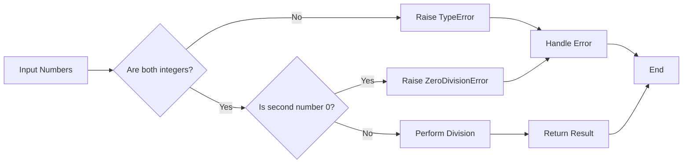
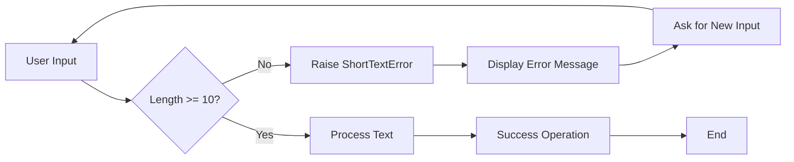
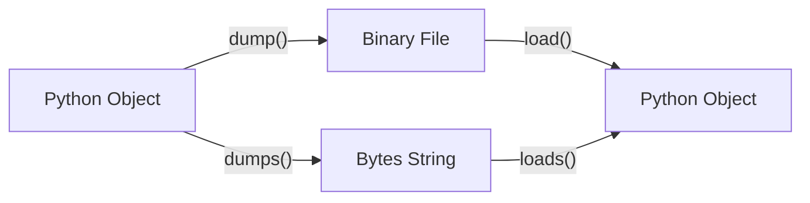

## Question 1(a) [3 marks]

**What is Dictionary? Explain with example.**

**Answer**:

Dictionary એ Python માં key-value pairs નો collection છે જે mutable અને ordered હોય છે.

**Table: Dictionary Properties**

| Property | Description |
|----------|-------------|
| **Mutable** | Values ને change કરી શકાય છે |
| **Ordered** | Python 3.7+ માં insertion order maintain રહે છે |
| **Indexed** | Keys દ્વારા access કરાય છે |
| **No Duplicates** | Duplicate keys allow નથી |

```python
# Dictionary Example
student = {
    "name": "Raj",
    "age": 20,
    "course": "IT"
}
print(student["name"])  # Output: Raj
```

- **Key-Value Structure**: દરેક element માં key અને value હોય છે
- **Fast Access**: O(1) time complexity માં data access
- **Dynamic Size**: Runtime માં size વધારી-ઘટાડી શકાય છે

**Mnemonic:** "Dictionary = Key Value Treasure"

---

## Question 1(b) [4 marks]

**Explain Tuple Built-in functions and methods.**

**Answer**:

Tuple માં limited built-in methods છે કારણ કે તે immutable છે.

**Table: Tuple Methods**

| Method | Description | Example |
|--------|-------------|---------|
| **count()** | Element ની frequency return કરે છે | `t.count(5)` |
| **index()** | Element નું first index return કરે છે | `t.index('a')` |
| **len()** | Tuple નું length return કરે છે | `len(t)` |
| **max()** | Maximum value return કરે છે | `max(t)` |
| **min()** | Minimum value return કરે છે | `min(t)` |

```python
# Tuple Methods Example
numbers = (1, 2, 3, 2, 4, 2)
print(numbers.count(2))     # Output: 3
print(numbers.index(3))     # Output: 2
print(len(numbers))         # Output: 6
```

- **Immutable Nature**: Methods tuple ને modify નથી કરતા
- **Return Values**: બધા methods નવી values return કરે છે
- **Type Conversion**: tuple() function થી list ને tuple માં convert કરી શકાય

**Mnemonic:** "Count Index Length Max Min"

---

## Question 1(c) [7 marks]

**Write a python program to demonstrate set operations.**

**Answer**:

Set operations mathematics ના set theory પર આધારિત છે.

**Table: Set Operations**

| Operation | Symbol | Method | Description |
|-----------|--------|--------|-------------|
| **Union** | `\|` | `union()` | બન્ને sets ના elements |
| **Intersection** | `&` | `intersection()` | Common elements |
| **Difference** | `-` | `difference()` | First set માંથી second ને minus |
| **Symmetric Difference** | `^` | `symmetric_difference()` | Unique elements only |

```python
# Set Operations Program
set1 = {1, 2, 3, 4, 5}
set2 = {4, 5, 6, 7, 8}

print("Set 1:", set1)
print("Set 2:", set2)

# Union Operation
union_result = set1 | set2
print("Union:", union_result)

# Intersection Operation  
intersection_result = set1 & set2
print("Intersection:", intersection_result)

# Difference Operation
difference_result = set1 - set2
print("Difference:", difference_result)

# Symmetric Difference
sym_diff_result = set1 ^ set2
print("Symmetric Difference:", sym_diff_result)

# Subset and Superset
set3 = {1, 2}
print("Is set3 subset of set1?", set3.issubset(set1))
print("Is set1 superset of set3?", set1.issuperset(set3))
```

- **Mathematical Operations**: Set theory ના operations implement કરે છે
- **Efficient Processing**: Duplicate elements automatically remove થાય છે
- **Boolean Results**: Subset/superset operations boolean return કરે છે

**Mnemonic:** "Union Intersection Difference Symmetric"

---

## Question 1(c OR) [7 marks]

**Write a python program to demonstrate the dictionaries functions and operations.**

**Answer**:

Dictionary operations data manipulation માટે powerful tools પ્રદાન કરે છે.

**Table: Dictionary Methods**

| Method | Description | Example |
|--------|-------------|---------|
| **keys()** | બધી keys return કરે છે | `dict.keys()` |
| **values()** | બધા values return કરે છે | `dict.values()` |
| **items()** | Key-value pairs return કરે છે | `dict.items()` |
| **get()** | Safe value retrieval | `dict.get('key')` |
| **update()** | Dictionary merge કરે છે | `dict.update()` |

```python
# Dictionary Operations Program
student_data = {
    "name": "Amit",
    "age": 21,
    "course": "IT",
    "semester": 2
}

print("Original Dictionary:", student_data)

# Accessing values
print("Student Name:", student_data.get("name"))
print("Student Age:", student_data["age"])

# Adding new key-value pair
student_data["city"] = "Ahmedabad"
print("After adding city:", student_data)

# Updating existing value
student_data.update({"age": 22, "semester": 3})
print("After update:", student_data)

# Dictionary methods
print("Keys:", list(student_data.keys()))
print("Values:", list(student_data.values()))
print("Items:", list(student_data.items()))

# Removing elements
removed_value = student_data.pop("semester")
print("Removed value:", removed_value)
print("Final Dictionary:", student_data)
```

- **Dynamic Operations**: Runtime માં keys અને values add/remove કરી શકાય
- **Safe Access**: get() method KeyError prevent કરે છે
- **Iteration Support**: keys(), values(), items() methods loop માટે useful

**Mnemonic:** "Get Keys Values Items Update Pop"

---

## Question 2(a) [3 marks]

**Distinguish between Tuple and List in Python.**

**Answer**:

**Table: Tuple vs List Comparison**

| Feature | Tuple | List |
|---------|-------|------|
| **Mutability** | Immutable (cannot change) | Mutable (can change) |
| **Syntax** | Parentheses `()` | Square brackets `[]` |
| **Performance** | Faster | Slower |
| **Memory** | Less memory | More memory |
| **Methods** | Limited (count, index) | Many methods available |
| **Use Case** | Fixed data | Dynamic data |

- **Immutable Nature**: Tuple એકવાર create થયા પછી change થઈ શકતું નથી
- **Performance**: Tuple operations list કરતાં fast છે
- **Memory Efficient**: Tuple ઓછી memory વાપરે છે

**Mnemonic:** "Tuple Tight, List Light"

---

## Question 2(b) [4 marks]

**What is the dir() function in python? Explain with example.**

**Answer**:

dir() function એ built-in function છે જે object ના attributes અને methods ની list return કરે છે.

**Table: dir() Function Features**

| Feature | Description |
|---------|-------------|
| **Object Inspection** | Object ના attributes show કરે છે |
| **Method Discovery** | Available methods list કરે છે |
| **Namespace Exploration** | Current namespace ના variables show કરે છે |
| **Module Analysis** | Module ના contents explore કરે છે |

```python
# dir() Function Example
# For string object
text = "Hello"
string_methods = dir(text)
print("String methods:", string_methods[:5])

# For list object  
my_list = [1, 2, 3]
list_methods = dir(my_list)
print("List methods:", [m for m in list_methods if not m.startswith('_')][:5])

# For current namespace
print("Current namespace:", dir()[:3])

# For built-in functions
import math
print("Math module:", dir(math)[:5])
```

- **Interactive Development**: Objects ના capabilities જાણવા માટે useful
- **Debugging Tool**: Available methods quickly identify કરવા માટે
- **Learning Aid**: New libraries explore કરવા માટે helpful

**Mnemonic:** "Dir = Directory of Methods"

---

## Question 2(c) [7 marks]

**Write a program to define a module to find the area and circumference of a circle. Import module to another program.**

**Answer**:

Module approach code reusability અને organization improve કરે છે.

**Diagram: Module Structure**

```goat
┌─────────────────┐    ┌─────────────────┐
│   circle.py     │    │   main.py       │
│   (Module)      │    │   (Main Program)│
├─────────────────┤    ├─────────────────┤
│ • area()        │───▶│ import circle   │
│ • circumference │    │ use functions   │
│ • PI constant   │    │                 │
└─────────────────┘    └─────────────────┘
```

**File 1: circle.py (Module)**

```python
# circle.py - Circle calculation module
import math

# Constants
PI = math.pi

def area(radius):
    """Calculate area of circle"""
    if radius < 0:
        return "Radius cannot be negative"
    return PI * radius * radius

def circumference(radius):
    """Calculate circumference of circle"""
    if radius < 0:
        return "Radius cannot be negative"
    return 2 * PI * radius

def display_info():
    """Display module information"""
    print("Circle Module - Version 1.0")
    print("Functions: area(), circumference()")
```

**File 2: main.py (Main Program)**

```python
# main.py - Main program using circle module
import circle

# Get radius from user
radius = float(input("Enter radius: "))

# Calculate using module functions
circle_area = circle.area(radius)
circle_circumference = circle.circumference(radius)

# Display results
print(f"Circle with radius {radius}:")
print(f"Area: {circle_area:.2f}")
print(f"Circumference: {circle_circumference:.2f}")

# Display module info
circle.display_info()
```

- **Modular Design**: Functions ને separate file માં organize કરે છે
- **Reusability**: Module ને multiple programs માં use કરી શકાય
- **Namespace Management**: Module prefix થી function access કરાય છે

**Mnemonic:** "Import Calculate Display"

---

## Question 2(a OR) [3 marks]

**Explain Nested Tuple with example.**

**Answer**:

Nested Tuple એ tuple અંદર બીજા tuples હોય છે, જે hierarchical data structure બનાવે છે.

**Table: Nested Tuple Features**

| Feature | Description |
|---------|-------------|
| **Multi-dimensional** | 2D અથવા 3D data structure |
| **Immutable** | બધા levels પર immutable |
| **Indexing** | Multiple square brackets વાપરીને access |
| **Heterogeneous** | Different data types store કરી શકાય |

```python
# Nested Tuple Example
student_records = (
    ("Raj", 20, ("IT", 2)),
    ("Priya", 19, ("CS", 1)), 
    ("Amit", 21, ("IT", 3))
)

# Accessing nested elements
print("First student:", student_records[0])
print("First student name:", student_records[0][0])
print("First student course:", student_records[0][2][0])

# Iterating through nested tuple
for student in student_records:
    name, age, (course, semester) = student
    print(f"{name} - Age: {age}, Course: {course}, Sem: {semester}")
```

- **Data Organization**: Related data ને group કરવા માટે useful
- **Immutable Structure**: એકવાર create થયા પછી structure change થઈ શકતું નથી
- **Efficient Access**: Index-based fast access

**Mnemonic:** "Nested = Tuple Inside Tuple"

---

## Question 2(b OR) [4 marks]

**What is PIP? Write the syntax to install and uninstall python packages.**

**Answer**:

PIP (Pip Installs Packages) એ Python package installer છે જે PyPI થી packages download અને install કરે છે.

**Table: PIP Commands**

| Command | Syntax | Description |
|---------|--------|-------------|
| **Install** | `pip install package_name` | Package install કરે છે |
| **Uninstall** | `pip uninstall package_name` | Package remove કરે છે |
| **List** | `pip list` | Installed packages show કરે છે |
| **Show** | `pip show package_name` | Package info display કરે છે |
| **Upgrade** | `pip install --upgrade package_name` | Package update કરે છે |

```python
# PIP Command Examples (Terminal/Command Prompt માં run કરવા)

# Install a package
# pip install requests

# Install specific version
# pip install Django==3.2.0

# Uninstall a package  
# pip uninstall numpy

# List all installed packages
# pip list

# Show package information
# pip show matplotlib

# Upgrade a package
# pip install --upgrade pandas

# Install from requirements file
# pip install -r requirements.txt
```

- **Package Management**: Third-party libraries easily manage કરી શકાય
- **Version Control**: Specific versions install કરી શકાય
- **Dependency Resolution**: Required dependencies automatically install થાય

**Mnemonic:** "PIP = Package Install Python"

---

## Question 2(c OR) [7 marks]

**Explain different ways of importing package. How are modules and packages connected to each other?**

**Answer**:

Python માં imports ના વિવિધ ways છે જે code organization અને namespace management માટે important છે.

**Diagram: Package Structure**

```goat
MyPackage/
├── __init__.py
├── module1.py
├── module2.py
└── subpackage/
    ├── __init__.py
    └── module3.py
```

**Table: Import Methods**

| Method | Syntax | Usage |
|--------|--------|-------|
| **Basic Import** | `import module` | Full module name required |
| **From Import** | `from module import function` | Direct function access |
| **Alias Import** | `import module as alias` | Short name for module |
| **Star Import** | `from module import *` | Import all functions |
| **Package Import** | `from package import module` | Import from package |

```python
# Different Import Ways

# 1. Basic Import
import math
result = math.sqrt(16)

# 2. From Import
from math import sqrt, pi
result = sqrt(16)
area = pi * 5 * 5

# 3. Alias Import
import numpy as np
array = np.array([1, 2, 3])

# 4. Star Import (not recommended)
from math import *
result = cos(0)

# 5. Package Import
from mypackage import module1
from mypackage.subpackage import module3

# 6. Relative Import (within package)
# from . import module1
# from ..parent_module import function
```

**Module-Package Connection:**

- **Modules**: Single .py files containing Python code
- **Packages**: Directories containing multiple modules with \_\_init\_\_.py
- **Namespace**: Packages create hierarchical namespace structure
- **__init__.py**: Makes directory a package and controls imports

**Mnemonic:** "Import From As Star Package"

---

## Question 3(a) [3 marks]

**Describe Runtime Error and Syntax Error. Explain with example.**

**Answer**:

**Table: Error Types Comparison**

| Error Type | When Occurs | Detection | Example |
|------------|-------------|-----------|---------|
| **Syntax Error** | Code parsing time | Before execution | Missing colon, brackets |
| **Runtime Error** | During execution | While running | Division by zero, file not found |
| **Logic Error** | Always | After execution | Wrong calculation logic |

```python
# Syntax Error Example
# print("Hello World"  # Missing closing parenthesis
# SyntaxError: unexpected EOF while parsing

# Runtime Error Examples
try:
    # ZeroDivisionError
    result = 10 / 0
except ZeroDivisionError:
    print("Cannot divide by zero")

try:
    # FileNotFoundError  
    file = open("nonexistent.txt", "r")
except FileNotFoundError:
    print("File not found")
```

- **Syntax Errors**: Code run થવા પહેલા જ detect થાય છે
- **Runtime Errors**: Program execution દરમિયાન થાય છે
- **Prevention**: Exception handling runtime errors ને handle કરે છે

**Mnemonic:** "Syntax Before, Runtime During"

---

## Question 3(b) [4 marks]

**What is Exception handling in Python? Explain with example.**

**Answer**:

Exception handling એ mechanism છે જે runtime errors ને gracefully handle કરે છે અને program crash થવાથી prevent કરે છે.

**Table: Exception Handling Keywords**

| Keyword | Purpose | Description |
|---------|---------|-------------|
| **try** | Exception માં થઈ શકે એવો code | Risk code block |
| **except** | Exception handle કરવા માટે | Error handling block |
| **finally** | હંમેશા execute થાય | Cleanup code |
| **else** | Exception ન આવે તો | Success code block |
| **raise** | Manual exception raise કરવા | Custom error throwing |

```python
# Exception Handling Example
def safe_division(a, b):
    try:
        # Code that might raise exception
        result = a / b
        print(f"Division successful: {result}")
        
    except ZeroDivisionError:
        # Handle specific exception
        print("Error: Cannot divide by zero")
        result = None
        
    except TypeError:
        # Handle type errors
        print("Error: Invalid data types")
        result = None
        
    else:
        # Executes if no exception
        print("Division completed successfully")
        
    finally:
        # Always executes
        print("Division operation finished")
        
    return result

# Test the function
safe_division(10, 2)   # Normal case
safe_division(10, 0)   # Zero division
safe_division(10, "a") # Type error
```

- **Error Prevention**: Program crash થવાથી prevent કરે છે
- **Graceful Handling**: User-friendly error messages provide કરે છે
- **Resource Management**: finally block માં cleanup operations

**Mnemonic:** "Try Except Finally Else Raise"

---

## Question 3(c) [7 marks]

**Create a function for division of two numbers, if the value of any argument is non-integer then raise the error or if second argument is 0 then raise the error.**

**Answer**:

Custom exception handling function બનાવવું validation અને error control માટે important છે.

**Diagram: Function Flow**



```python
def safe_integer_division(num1, num2):
    """
    Divide two numbers with validation
    Raises TypeError if arguments are not integers
    Raises ZeroDivisionError if second argument is 0
    """
    
    # Check if both arguments are integers
    if not isinstance(num1, int):
        raise TypeError(f"First argument must be integer, got {type(num1).__name__}")
    
    if not isinstance(num2, int):
        raise TypeError(f"Second argument must be integer, got {type(num2).__name__}")
    
    # Check for zero division
    if num2 == 0:
        raise ZeroDivisionError("Cannot divide by zero")
    
    # Perform division
    result = num1 / num2
    return result

# Test the function with different cases
def test_division():
    test_cases = [
        (10, 2),      # Valid case
        (15, 3),      # Valid case  
        (10, 0),      # Zero division error
        (10.5, 2),    # Non-integer first argument
        (10, 2.5),    # Non-integer second argument
        ("10", 2),    # String argument
    ]
    
    for num1, num2 in test_cases:
        try:
            result = safe_integer_division(num1, num2)
            print(f"{num1} ÷ {num2} = {result}")
            
        except TypeError as e:
            print(f"Type Error: {e}")
            
        except ZeroDivisionError as e:
            print(f"Zero Division Error: {e}")
            
        except Exception as e:
            print(f"Unexpected Error: {e}")
        
        print("-" * 40)

# Run tests
test_division()
```

- **Input Validation**: Arguments ના type અને value check કરે છે
- **Custom Errors**: Specific exceptions raise કરે છે
- **Error Messages**: Clear અને descriptive error messages

**Mnemonic:** "Validate Type, Check Zero, Divide Safe"

---

## Question 3(a OR) [3 marks]

**Describe any five built-in exceptions in Python.**

**Answer**:

**Table: Built-in Exceptions**

| Exception | Cause | Example |
|-----------|-------|---------|
| **ValueError** | Invalid value for operation | `int("abc")` |
| **TypeError** | Wrong data type | `"hello" + 5` |
| **IndexError** | Index out of range | `list[10]` when list has 5 elements |
| **KeyError** | Dictionary key not found | `dict["nonexistent"]` |
| **FileNotFoundError** | File does not exist | `open("missing.txt")` |

```python
# Built-in Exceptions Examples

# 1. ValueError
try:
    number = int("not_a_number")
except ValueError:
    print("ValueError: Invalid conversion")

# 2. TypeError  
try:
    result = "Hello" + 5
except TypeError:
    print("TypeError: Cannot add string and integer")

# 3. IndexError
try:
    my_list = [1, 2, 3]
    value = my_list[5]
except IndexError:
    print("IndexError: List index out of range")
```

- **Automatic Detection**: Python automatically raises these exceptions
- **Specific Handling**: દરેક exception નો specific purpose છે
- **Inheritance**: બધા exceptions BaseException class થી inherit થાય છે

**Mnemonic:** "Value Type Index Key File"

---

## Question 3(b OR) [4 marks]

**Explain try, except and finally terms with syntax.**

**Answer**:

Exception handling ના blocks નો specific purpose અને execution order છે.

**Table: Exception Handling Blocks**

| Block | Purpose | Execution | Mandatory |
|-------|---------|-----------|-----------|
| **try** | Risky code | First | Yes |
| **except** | Error handling | If exception occurs | At least one |
| **else** | Success code | If no exception | No |
| **finally** | Cleanup code | Always | No |

**Syntax Structure:**

```python
try:
    # Code that might raise exception
    risky_code()
except ExceptionType1:
    # Handle specific exception
    handle_error1()
except ExceptionType2:
    # Handle another exception
    handle_error2()
else:
    # Code runs if no exception
    success_code()
finally:
    # Code always runs
    cleanup_code()
```

**Practical Example:**

```python
def file_operation(filename):
    file_handle = None
    try:
        # Risky operation
        file_handle = open(filename, 'r')
        content = file_handle.read()
        print("File read successfully")
        
    except FileNotFoundError:
        print("File not found error")
        
    except PermissionError:
        print("Permission denied")
        
    else:
        print("File operation completed successfully")
        
    finally:
        # Cleanup - always executes
        if file_handle:
            file_handle.close()
            print("File closed")

# Test the function
file_operation("test.txt")
```

- **Exception Flow**: try → except/else → finally
- **Multiple Handlers**: Multiple except blocks allowed
- **Guaranteed Execution**: finally block હંમેશા run થાય છે

**Mnemonic:** "Try Exception Else Finally"

---

## Question 3(c OR) [7 marks]

**Write a user defined exception that could be raised when the text entered by a user consists of less than 10 characters.**

**Answer**:

User-defined exceptions custom validation logic implement કરવા માટે powerful tool છે.

**Diagram: Custom Exception Flow**



```python
# User-defined Exception Class
class ShortTextError(Exception):
    """Custom exception for text that is too short"""
    
    def __init__(self, text_length, minimum_length=10):
        self.text_length = text_length
        self.minimum_length = minimum_length
        message = f"Text is too short! Length: {text_length}, Required: {minimum_length}"
        super().__init__(message)

def validate_text_length(text):
    """
    Validate text length and raise exception if too short
    """
    if len(text) < 10:
        raise ShortTextError(len(text))
    return True

def process_user_text(text):
    """
    Process text after validation
    """
    try:
        validate_text_length(text)
        print(f"✓ Text accepted: '{text}'")
        print(f"Text length: {len(text)} characters")
        return text.upper()  # Process the text
        
    except ShortTextError as e:
        print(f"❌ {e}")
        return None

def interactive_text_input():
    """
    Interactive function to get valid text from user
    """
    while True:
        try:
            user_input = input("Enter text (minimum 10 characters): ")
            
            # Validate text length
            if len(user_input) < 10:
                raise ShortTextError(len(user_input))
                
            print(f"✓ Valid text entered: '{user_input}'")
            break
            
        except ShortTextError as e:
            print(f"❌ Error: {e}")
            retry = input("Try again? (y/n): ")
            if retry.lower() != 'y':
                print("Operation cancelled.")
                break

# Test different scenarios
def test_custom_exception():
    test_texts = [
        "Hi",                    # Too short (2 chars)
        "Hello",                 # Too short (5 chars)  
        "Short",                 # Too short (5 chars)
        "This is valid text",    # Valid (19 chars)
        "Perfect length text"    # Valid (20 chars)
    ]
    
    print("Testing Custom Exception:")
    print("=" * 40)
    
    for text in test_texts:
        result = process_user_text(text)
        if result:
            print(f"Processed: {result}")
        print("-" * 30)

# Run tests
test_custom_exception()

# Uncomment to test interactive input
# interactive_text_input()
```

**Additional Features:**

```python
# Enhanced Custom Exception with more features
class TextValidationError(Exception):
    """Enhanced text validation exception"""
    
    def __init__(self, text, error_type, details=None):
        self.text = text
        self.error_type = error_type
        self.details = details
        
        if error_type == "short":
            message = f"Text too short: {len(text)} chars (min: 10)"
        elif error_type == "empty":
            message = "Text cannot be empty"
        elif error_type == "spaces":
            message = "Text contains only spaces"
        else:
            message = f"Text validation failed: {error_type}"
            
        super().__init__(message)

def advanced_text_validation(text):
    """Advanced text validation with multiple checks"""
    if not text:
        raise TextValidationError(text, "empty")
    
    if text.isspace():
        raise TextValidationError(text, "spaces")
        
    if len(text.strip()) < 10:
        raise TextValidationError(text, "short")
    
    return True
```

- **Custom Logic**: Application-specific validation rules implement કરી શકાય
- **Inheritance**: Exception class ને inherit કરીને custom exceptions બનાવાય
- **Detailed Information**: Exception object માં additional data store કરી શકાય

**Mnemonic:** "Custom Exception = Class Inherit Raise"

---

## Question 4(a) [3 marks]

**Write five points on difference between Text File and Binary File.**

**Answer**:

**Table: Text File vs Binary File**

| Feature | Text File | Binary File |
|---------|-----------|-------------|
| **Content** | Human-readable characters | Binary data (0s and 1s) |
| **Encoding** | Character encoding (UTF-8, ASCII) | No character encoding |
| **Opening Mode** | 'r', 'w', 'a' | 'rb', 'wb', 'ab' |
| **File Size** | Generally larger | Generally smaller |
| **Platform** | Platform dependent | Platform independent |

```python
# Text vs Binary File Examples
# Text file example
with open("sample.txt", "w") as f:
    f.write("Hello World")

# Binary file example  
with open("sample.bin", "wb") as f:
    f.write(b'\x48\x65\x6c\x6c\x6f')
```

- **Readability**: Text files editor માં read કરી શકાય, binary files special software જોઈએ
- **Portability**: Binary files different platforms પર easily transfer થાય
- **Processing**: Text files string operations માટે, binary files exact data storage માટે

**Mnemonic:** "Text Human, Binary Machine"

---

## Question 4(b) [4 marks]

**Write a program to read the data from a file and separate the uppercase character and lowercase character into two separate files.**

**Answer**:

File processing માં character-based operations common requirements છે.

**Table: File Operations**

| Operation | Method | Purpose |
|-----------|--------|---------|
| **Read** | `read()` | Complete file content |
| **Write** | `write()` | Write string to file |
| **Character Check** | `isupper()`, `islower()` | Character case detection |
| **File Handling** | `with open()` | Safe file operations |

```python
def separate_case_characters(input_file, upper_file, lower_file):
    """
    Read file and separate uppercase/lowercase characters
    """
    try:
        # Read from input file
        with open(input_file, 'r') as infile:
            content = infile.read()
        
        # Separate characters
        uppercase_chars = ""
        lowercase_chars = ""
        
        for char in content:
            if char.isupper():
                uppercase_chars += char
            elif char.islower():
                lowercase_chars += char
        
        # Write to uppercase file
        with open(upper_file, 'w') as upfile:
            upfile.write(uppercase_chars)
        
        # Write to lowercase file  
        with open(lower_file, 'w') as lowfile:
            lowfile.write(lowercase_chars)
        
        print(f"✓ Characters separated successfully!")
        print(f"Uppercase characters: {len(uppercase_chars)}")
        print(f"Lowercase characters: {len(lowercase_chars)}")
        
    except FileNotFoundError:
        print(f"Error: File '{input_file}' not found")
    except Exception as e:
        print(f"Error: {e}")

# Create sample input file
def create_sample_file():
    sample_text = """Hello World! This is a SAMPLE Text file.
It contains UPPERCASE and lowercase Characters.
Python Programming is FUN and Educational."""
    
    with open("input.txt", "w") as f:
        f.write(sample_text)
    print("Sample input file created: input.txt")

# Main execution
create_sample_file()
separate_case_characters("input.txt", "uppercase.txt", "lowercase.txt")

# Display results
print("\nFile Contents:")
print("-" * 30)

try:
    with open("uppercase.txt", "r") as f:
        print(f"Uppercase file: {f.read()}")
    
    with open("lowercase.txt", "r") as f:
        print(f"Lowercase file: {f.read()}")
except FileNotFoundError:
    print("Output files not found")
```

- **Character Processing**: દરેક character ની case individually check કરાય છે
- **File Safety**: with statement automatic file closing ensure કરે છે
- **Error Handling**: File operations માં proper exception handling

**Mnemonic:** "Read Separate Write"

---

## Question 4(c) [7 marks]

**Describe dump() and load() method. Explain with example.**

**Answer**:

dump() અને load() methods pickle module ના part છે જે object serialization માટે વાપરાય છે.

**Table: Pickle Methods**

| Method | Purpose | File Mode | Description |
|--------|---------|-----------|-------------|
| **dump()** | Serialize object to file | 'wb' | Object ને binary file માં store કરે |
| **load()** | Deserialize object from file | 'rb' | File માંથી object retrieve કરે |
| **dumps()** | Serialize to bytes | N/A | Object ને bytes માં convert કરે |
| **loads()** | Deserialize from bytes | N/A | Bytes માંથી object બનાવે |

**Diagram: Serialization Process**



```python
import pickle

# Example with different data types
def demonstrate_pickle():
    # Sample data to serialize
    student_data = {
        'name': 'Raj Patel',
        'age': 20,
        'grades': [85, 92, 78, 96],
        'subjects': ('Math', 'Python', 'Database'),
        'is_active': True
    }
    
    class Student:
        def __init__(self, name, roll_no):
            self.name = name
            self.roll_no = roll_no
        
        def __str__(self):
            return f"Student: {self.name} (Roll: {self.roll_no})"
    
    # Create objects
    student_obj = Student("Priya Shah", 101)
    data_list = [student_data, student_obj, [1, 2, 3, 4, 5]]
    
    # DUMP - Serialize objects to file
    print("=== DUMP Operation ===")
    try:
        with open('student_data.pkl', 'wb') as f:
            pickle.dump(data_list, f)
        print("✓ Data successfully dumped to student_data.pkl")
        
        # Also demonstrate dumps()
        serialized_bytes = pickle.dumps(student_data)
        print(f"✓ Data serialized to bytes: {len(serialized_bytes)} bytes")
        
    except Exception as e:
        print(f"❌ Dump error: {e}")
    
    # LOAD - Deserialize objects from file  
    print("\n=== LOAD Operation ===")
    try:
        with open('student_data.pkl', 'rb') as f:
            loaded_data = pickle.load(f)
        
        print("✓ Data successfully loaded from student_data.pkl")
        print("\nLoaded Data:")
        print("-" * 20)
        
        # Display loaded data
        for i, item in enumerate(loaded_data):
            print(f"Item {i+1}: {item}")
            print(f"Type: {type(item)}")
            print()
        
        # Also demonstrate loads()
        deserialized_data = pickle.loads(serialized_bytes)
        print(f"✓ Data deserialized from bytes: {deserialized_data}")
        
    except FileNotFoundError:
        print("❌ Pickle file not found")
    except Exception as e:
        print(f"❌ Load error: {e}")

# Advanced example with custom class
def advanced_pickle_example():
    class BankAccount:
        def __init__(self, account_no, holder_name, balance):
            self.account_no = account_no
            self.holder_name = holder_name
            self.balance = balance
            self.transactions = []
        
        def deposit(self, amount):
            self.balance += amount
            self.transactions.append(f"Deposit: +{amount}")
        
        def withdraw(self, amount):
            if self.balance >= amount:
                self.balance -= amount
                self.transactions.append(f"Withdraw: -{amount}")
            else:
                print("Insufficient balance")
        
        def __str__(self):
            return f"Account {self.account_no}: {self.holder_name} - Balance: ₹{self.balance}"
    
    # Create and use account
    account = BankAccount("12345", "Amit Kumar", 5000)
    account.deposit(1500)
    account.withdraw(800)
    
    print("=== Advanced Pickle Example ===")
    print(f"Original: {account}")
    print(f"Transactions: {account.transactions}")
    
    # Serialize account object
    with open('bank_account.pkl', 'wb') as f:
        pickle.dump(account, f)
    
    # Load account object
    with open('bank_account.pkl', 'rb') as f:
        loaded_account = pickle.load(f)
    
    print(f"Loaded: {loaded_account}")
    print(f"Loaded transactions: {loaded_account.transactions}")
    
    # Verify object functionality
    loaded_account.deposit(200)
    print(f"After new deposit: {loaded_account}")

# Run demonstrations
demonstrate_pickle()
print("\n" + "="*50 + "\n")
advanced_pickle_example()
```

**Benefits and Limitations:**

```python
# Benefits
benefits = [
    "Complete object state preservation",
    "Works with complex nested objects", 
    "Maintains object relationships",
    "Fast serialization/deserialization"
]

# Limitations  
limitations = [
    "Python-specific format",
    "Security risks with untrusted data",
    "Version compatibility issues",
    "Not human-readable"
]

print("Benefits:", benefits)
print("Limitations:", limitations)
```

- **Object Persistence**: Python objects ને file માં permanently store કરી શકાય
- **Complete State**: Object ની complete state including methods preserve થાય છે
- **Binary Format**: Efficient storage પણ human-readable નથી

**Mnemonic:** "Dump Store, Load Restore"

---

## Question 4(a OR) [3 marks]

**List different types of file modes provided by python for file operations and explain their uses.**

**Answer**:

**Table: Python File Modes**

| Mode | Type | Description | Pointer Position |
|------|------|-------------|------------------|
| **'r'** | Text Read | Read only, file must exist | Beginning |
| **'w'** | Text Write | Write only, creates/overwrites | Beginning |
| **'a'** | Text Append | Write only, creates if not exist | End |
| **'x'** | Text Create | Create new file, fails if exists | Beginning |
| **'rb'** | Binary Read | Read binary data | Beginning |
| **'wb'** | Binary Write | Write binary data | Beginning |
| **'ab'** | Binary Append | Append binary data | End |
| **'r+'** | Text Read/Write | Read and write, file must exist | Beginning |
| **'w+'** | Text Write/Read | Write and read, creates/overwrites | Beginning |

```python
# File Modes Examples
import os

# Create sample file for demonstration
with open('demo.txt', 'w') as f:
    f.write("Original content\nLine 2\nLine 3")

# Read mode ('r')
with open('demo.txt', 'r') as f:
    content = f.read()
    print("Read mode:", content)

# Append mode ('a')  
with open('demo.txt', 'a') as f:
    f.write("\nAppended line")

# Read+Write mode ('r+')
with open('demo.txt', 'r+') as f:
    f.seek(0)  # Go to beginning
    f.write("Modified")

print("File modes demonstrated successfully")
```

- **Safety**: 'x' mode prevents accidental file overwriting
- **Efficiency**: Binary modes faster for non-text data
- **Flexibility**: Combined modes allow both read and write operations

**Mnemonic:** "Read Write Append Create Binary Plus"

---

## Question 4(b OR) [4 marks]

**Describe readline() and writeline() functions of the file.**

**Answer**:

**Note**: Python માં `writeline()` function exist નથી. Correct function `writelines()` છે.

**Table: Line-based File Functions**

| Function | Purpose | Return Type | Usage |
|----------|---------|-------------|-------|
| **readline()** | Read single line | String | Sequential line reading |
| **readlines()** | Read all lines | List of strings | Complete file as list |
| **writelines()** | Write multiple lines | None | Write list of strings |
| **write()** | Write single string | Number of chars | Basic writing |

```python
def demonstrate_line_functions():
    # Create sample file with multiple lines
    lines_to_write = [
        "First line of text\n",
        "Second line of text\n", 
        "Third line of text\n",
        "Fourth line without newline"
    ]
    
    print("=== WRITELINES() Demonstration ===")
    # Write multiple lines using writelines()
    with open('sample_lines.txt', 'w') as f:
        f.writelines(lines_to_write)
    print("✓ Multiple lines written using writelines()")
    
    print("\n=== READLINE() Demonstration ===")
    # Read lines one by one using readline()
    with open('sample_lines.txt', 'r') as f:
        line_count = 0
        while True:
            line = f.readline()
            if not line:  # End of file
                break
            line_count += 1
            print(f"Line {line_count}: {line.strip()}")
    
    print(f"Total lines read: {line_count}")
    
    print("\n=== READLINES() Demonstration ===")
    # Read all lines at once using readlines()
    with open('sample_lines.txt', 'r') as f:
        all_lines = f.readlines()
    
    print("All lines as list:")
    for i, line in enumerate(all_lines, 1):
        print(f"  [{i}] {repr(line)}")
    
    # Practical example: Processing file line by line
    print("\n=== Practical Example ===")
    student_data = [
        "Raj,20,IT\n",
        "Priya,19,CS\n", 
        "Amit,21,EC\n",
        "Sneha,20,IT\n"
    ]
    
    # Write student data
    with open('students.txt', 'w') as f:
        f.writelines(student_data)
    
    # Read and process line by line
    print("Student Information:")
    with open('students.txt', 'r') as f:
        while True:
            line = f.readline()
            if not line:
                break
            
            # Process each line
            parts = line.strip().split(',')
            if len(parts) == 3:
                name, age, course = parts
                print(f"  {name} (Age: {age}, Course: {course})")

# Run demonstration
demonstrate_line_functions()

# File pointer behavior example
def file_pointer_demo():
    print("\n=== File Pointer Behavior ===")
    
    with open('sample_lines.txt', 'r') as f:
        print(f"Initial position: {f.tell()}")
        
        line1 = f.readline()
        print(f"After readline(): position {f.tell()}")
        print(f"Read: {repr(line1)}")
        
        line2 = f.readline()  
        print(f"After second readline(): position {f.tell()}")
        print(f"Read: {repr(line2)}")

file_pointer_demo()
```

- **Sequential Access**: readline() sequential manner માં lines read કરે છે
- **Memory Efficient**: Large files માટે readline() memory-efficient છે
- **List Operations**: writelines() list of strings ને efficiently write કરે છે

**Mnemonic:** "Read Line, Write Lines"

---

## Question 4(c OR) [7 marks]

**Write a python program to demonstrate seek() and tell() methods.**

**Answer**:

seek() અને tell() methods file pointer manipulation માટે વાપરાય છે.

**Table: File Pointer Methods**

| Method | Purpose | Parameters | Return Value |
|--------|---------|------------|--------------|
| **tell()** | Current position | None | Integer (byte position) |
| **seek()** | Move pointer | offset, whence | New position |
| **whence=0** | From beginning | Default | Absolute position |
| **whence=1** | From current | Relative | Current + offset |
| **whence=2** | From end | End relative | End + offset |

**Diagram: File Pointer Movement**

```goat
File: "Hello World"
      ^             ^         ^
   Position 0   Position 6  Position 11 (EOF)
   
seek(0)    -> Move to beginning
seek(6)    -> Move to position 6  
seek(-5,2) -> Move 5 positions before end
```

```python
def demonstrate_seek_tell():
    # Create sample file with known content
    sample_text = "Hello Python Programming World!"
    
    with open('pointer_demo.txt', 'w') as f:
        f.write(sample_text)
    
    print("=== File Pointer Demonstration ===")
    print(f"File content: '{sample_text}'")
    print(f"File length: {len(sample_text)} characters")
    print()
    
    with open('pointer_demo.txt', 'r') as f:
        # Initial position
        print(f"1. Initial position: {f.tell()}")
        
        # Read some characters
        first_part = f.read(5)  # Read "Hello"
        print(f"2. After reading '{first_part}': position {f.tell()}")
        
        # Move to specific position
        f.seek(6)  # Move to position 6 (start of "Python")
        print(f"3. After seek(6): position {f.tell()}")
        
        # Read from new position
        next_part = f.read(6)  # Read "Python"
        print(f"4. Read '{next_part}': position {f.tell()}")
        
        # Move relative to current position (only in binary mode for positive offset)
        # Let's demonstrate absolute positioning
        f.seek(0)  # Go to beginning
        print(f"5. After seek(0): position {f.tell()}")
        
        # Move to end of file
        f.seek(0, 2)  # 0 offset from end (position 2 = end)
        print(f"6. After seek(0,2) - end of file: position {f.tell()}")
        
        # Move backwards from end
        f.seek(-6, 2)  # 6 positions before end
        print(f"7. After seek(-6,2): position {f.tell()}")
        
        # Read remaining content
        remaining = f.read()
        print(f"8. Read remaining '{remaining}': position {f.tell()}")

def practical_seek_tell_example():
    print("\n=== Practical Example: File Editor Simulation ===")
    
    # Create a file with structured data
    data_lines = [
        "NAME:John Doe\n",
        "AGE:25\n", 
        "CITY:Mumbai\n",
        "PHONE:9876543210\n",
        "EMAIL:john@example.com\n"
    ]
    
    with open('person_data.txt', 'w') as f:
        f.writelines(data_lines)
    
    # Demonstrate finding and modifying specific data
    with open('person_data.txt', 'r+') as f:  # Read+Write mode
        # Find and display all positions
        positions = {}
        
        while True:
            pos = f.tell()
            line = f.readline()
            if not line:
                break
            
            field = line.split(':')[0]
            positions[field] = pos
            print(f"Field '{field}' starts at position {pos}")
        
        print(f"\nFile positions: {positions}")
        
        # Modify specific field (AGE)
        if 'AGE' in positions:
            f.seek(positions['AGE'])
            print(f"\nMoving to AGE field at position {f.tell()}")
            
            # Read current line
            current_line = f.readline()
            print(f"Current line: {current_line.strip()}")
            
            # Calculate position to overwrite
            f.seek(positions['AGE'])
            new_age_line = "AGE:26\n"  # Same length as original
            f.write(new_age_line)
            print(f"Updated AGE field")
    
    # Verify changes
    print("\nUpdated file content:")
    with open('person_data.txt', 'r') as f:
        print(f.read())

def binary_seek_tell_demo():
    print("\n=== Binary File Seek/Tell Demo ===")
    
    # Create binary file
    binary_data = b'\x48\x65\x6c\x6c\x6f\x20\x57\x6f\x72\x6c\x64'  # "Hello World"
    
    with open('binary_demo.bin', 'wb') as f:
        f.write(binary_data)
    
    with open('binary_demo.bin', 'rb') as f:
        print(f"Binary file size: {len(binary_data)} bytes")
        
        # Demonstrate all seek modes in binary
        print(f"Initial position: {f.tell()}")
        
        # Read first 5 bytes
        first_bytes = f.read(5)
        print(f"Read first 5 bytes: {first_bytes} at position {f.tell()}")
        
        # Seek relative to current position (works in binary mode)
        f.seek(1, 1)  # Move 1 byte forward from current
        print(f"After seek(1,1): position {f.tell()}")
        
        # Seek from end
        f.seek(-3, 2)  # 3 bytes before end
        print(f"After seek(-3,2): position {f.tell()}")
        
        # Read remaining
        remaining_bytes = f.read()
        print(f"Remaining bytes: {remaining_bytes}")

# Run all demonstrations
demonstrate_seek_tell()
practical_seek_tell_example()
binary_seek_tell_demo()

# Cleanup
import os
try:
    os.remove('pointer_demo.txt')
    os.remove('person_data.txt') 
    os.remove('binary_demo.bin')
    print("\nDemo files cleaned up")
except:
    pass
```

- **File Navigation**: seek() arbitrary position પર move કરવા માટે વાપરાય છે
- **Position Tracking**: tell() current position track કરવા માટે useful છે
- **File Editing**: Specific locations પર data modify કરવા માટે જરૂરી

**Mnemonic:** "Tell Position, Seek Destination"

---

## Question 5(a) [3 marks]

**Draw Circle and rectangle shapes using Turtle and fill them with red color.**

**Answer**:

Turtle graphics module માં shapes draw કરવા અને fill કરવા માટે specific methods છે.

**Table: Turtle Shape Methods**

| Method | Purpose | Example |
|--------|---------|---------|
| **circle()** | Draw circle | `turtle.circle(50)` |
| **forward()** | Move forward | `turtle.forward(100)` |
| **right()** | Turn right | `turtle.right(90)` |
| **begin_fill()** | Start filling | `turtle.begin_fill()` |
| **end_fill()** | End filling | `turtle.end_fill()` |
| **fillcolor()** | Set fill color | `turtle.fillcolor("red")` |

```python
import turtle

def draw_filled_shapes():
    # Create screen and turtle
    screen = turtle.Screen()
    screen.title("Filled Shapes with Turtle")
    screen.bgcolor("white")
    screen.setup(800, 600)
    
    # Create turtle object
    painter = turtle.Turtle()
    painter.speed(3)
    
    # Draw filled circle
    print("Drawing filled circle...")
    painter.penup()
    painter.goto(-150, 0)  # Move to left side
    painter.pendown()
    
    painter.fillcolor("red")
    painter.begin_fill()
    painter.circle(80)  # Radius = 80
    painter.end_fill()
    
    # Draw filled rectangle
    print("Drawing filled rectangle...")
    painter.penup()
    painter.goto(50, 50)  # Move to right side
    painter.pendown()
    
    painter.fillcolor("red")
    painter.begin_fill()
    
    # Draw rectangle (100x80)
    for _ in range(2):
        painter.forward(100)
        painter.right(90)
        painter.forward(80)
        painter.right(90)
    
    painter.end_fill()
    
    # Add labels
    painter.penup()
    painter.goto(-150, -120)
    painter.write("Red Circle", align="center", font=("Arial", 14, "normal"))
    
    painter.goto(100, -50)
    painter.write("Red Rectangle", align="center", font=("Arial", 14, "normal"))
    
    # Hide turtle and display result
    painter.hideturtle()
    print("Shapes drawn successfully!")
    
    # Keep window open
    screen.exitonclick()

# Run the program
draw_filled_shapes()
```

- **Fill Process**: begin_fill() અને end_fill() વચ્ચે drawn shape automatically fill થાય છે
- **Color Setting**: fillcolor() method fill color set કરે છે
- **Shape Drawing**: Geometric shapes માટે specific turtle movements

**Mnemonic:** "Begin Fill Draw End"

---

## Question 5(b) [4 marks]

**Explain the various inbuilt methods to change the direction of the Turtle.**

**Answer**:

**Table: Turtle Direction Methods**

| Method | Parameters | Description | Example |
|--------|------------|-------------|---------|
| **right()** | angle | Turn right by degrees | `turtle.right(90)` |
| **left()** | angle | Turn left by degrees | `turtle.left(45)` |
| **setheading()** | angle | Set absolute direction | `turtle.setheading(0)` |
| **towards()** | x, y | Point towards coordinates | `turtle.towards(100, 50)` |
| **home()** | none | Return to center, face east | `turtle.home()` |

```python
import turtle

def demonstrate_direction_methods():
    screen = turtle.Screen()
    screen.setup(600, 600)
    screen.title("Turtle Direction Methods")
    
    t = turtle.Turtle()
    t.speed(2)
    t.shape("turtle")
    
    # 1. right() method
    t.write("1. right(90)", font=("Arial", 10, "normal"))
    t.forward(50)
    t.right(90)
    t.forward(50)
    
    # 2. left() method  
    t.penup()
    t.goto(-100, 100)
    t.pendown()
    t.write("2. left(45)", font=("Arial", 10, "normal"))
    t.forward(50)
    t.left(45)
    t.forward(50)
    
    # 3. setheading() method
    t.penup()
    t.goto(100, 100)
    t.pendown()
    t.write("3. setheading(180)", font=("Arial", 10, "normal"))
    t.setheading(180)  # Face west
    t.forward(50)
    
    # 4. towards() method
    t.penup()
    t.goto(-100, -100)
    t.pendown()
    target_x, target_y = 100, -100
    t.write("4. towards(100,-100)", font=("Arial", 10, "normal"))
    angle = t.towards(target_x, target_y)
    t.setheading(angle)
    t.goto(target_x, target_y)
    
    # 5. home() method
    t.write("5. home()", font=("Arial", 10, "normal"))
    t.home()  # Return to center and face east
    
    t.hideturtle()
    screen.exitonclick()

demonstrate_direction_methods()
```

- **Relative Turns**: right() અને left() current direction થી relative turn
- **Absolute Direction**: setheading() absolute compass direction set કરે
- **Smart Pointing**: towards() specific coordinates તરફ point કરે

**Mnemonic:** "Right Left Set Towards Home"

---

## Question 5(c) [7 marks]

**Write a python program to draw a rainbow using Turtle.**

**Answer**:

Rainbow drawing માં multiple colored arcs અને proper positioning જરૂરી છે.

**Diagram: Rainbow Structure**

```goat
    Red (outer)
   Orange  
  Yellow
 Green
Blue
Indigo
Violet (inner)
```

```python
import turtle

def draw_rainbow():
    # Screen setup
    screen = turtle.Screen()
    screen.title("Beautiful Rainbow")
    screen.bgcolor("lightblue")
    screen.setup(800, 600)
    
    # Turtle setup
    rainbow_turtle = turtle.Turtle()
    rainbow_turtle.speed(8)
    rainbow_turtle.pensize(8)
    
    # Rainbow colors (ROYGBIV)
    colors = ["red", "orange", "yellow", "green", "blue", "indigo", "violet"]
    
    # Rainbow parameters
    start_radius = 200
    radius_decrease = 15
    start_y = -150
    
    print("Drawing rainbow...")
    
    # Draw each color arc
    for i, color in enumerate(colors):
        # Set color
        rainbow_turtle.pencolor(color)
        
        # Calculate current radius
        current_radius = start_radius - (i * radius_decrease)
        
        # Position turtle for semi-circle
        rainbow_turtle.penup()
        rainbow_turtle.goto(-current_radius, start_y)
        rainbow_turtle.pendown()
        rainbow_turtle.setheading(0)  # Face east
        
        # Draw semi-circle (180 degrees)
        rainbow_turtle.circle(current_radius, 180)
        
        print(f"Drew {color} arc with radius {current_radius}")
    
    # Add clouds at ends
    draw_clouds(rainbow_turtle)
    
    # Add sun
    draw_sun(rainbow_turtle)
    
    # Add text
    rainbow_turtle.penup()
    rainbow_turtle.goto(0, -250)
    rainbow_turtle.pencolor("black")
    rainbow_turtle.write("🌈 Beautiful Rainbow 🌈", align="center", 
                        font=("Arial", 16, "bold"))
    
    rainbow_turtle.hideturtle()
    print("Rainbow completed!")
    
    screen.exitonclick()

def draw_clouds(turtle_obj):
    """Draw clouds at both ends of rainbow"""
    turtle_obj.pensize(3)
    turtle_obj.pencolor("white")
    turtle_obj.fillcolor("lightgray")
    
    # Left cloud
    cloud_positions = [(-250, -100), (250, -100)]
    
    for x, y in cloud_positions:
        turtle_obj.penup()
        turtle_obj.goto(x, y)
        turtle_obj.pendown()
        # Draw cloud using multiple circles
        turtle_obj.begin_fill()
        for i in range(3):
            turtle_obj.circle(20)
            turtle_obj.left(120)
        turtle_obj.end_fill()

def draw_sun(turtle_obj):
    """Draw sun in corner"""
    turtle_obj.penup()
    turtle_obj.goto(300, 200)
    turtle_obj.pendown()
    turtle_obj.pencolor("orange")
    turtle_obj.fillcolor("yellow")
    
    # Draw sun body
    turtle_obj.begin_fill()
    turtle_obj.circle(30)
    turtle_obj.end_fill()
    
    # Draw sun rays
    turtle_obj.pensize(2)
    for angle in range(0, 360, 45):
        turtle_obj.setheading(angle)
        turtle_obj.forward(45)
        turtle_obj.backward(45)

# Alternative rainbow with gradient effect
def draw_gradient_rainbow():
    screen = turtle.Screen()
    screen.title("Gradient Rainbow")
    screen.bgcolor("skyblue")
    screen.setup(800, 600)
    
    t = turtle.Turtle()
    t.speed(0)
    t.pensize(5)
    
    # Color variations for gradient effect
    rainbow_colors = [
        "#FF0000", "#FF4500", "#FFD700", "#32CD32", 
        "#0000FF", "#4B0082", "#8B00FF"
    ]
    
    # Draw rainbow with varying thickness
    for i, color in enumerate(rainbow_colors):
        t.pencolor(color)
        t.pensize(12 - i)  # Decreasing thickness
        
        radius = 150 - (i * 10)
        t.penup()
        t.goto(-radius, -100)
        t.pendown()
        t.setheading(0)
        t.circle(radius, 180)
    
    t.hideturtle()
    screen.exitonclick()

# Run the rainbow programs
print("Choose rainbow type:")
print("1. Standard Rainbow")
print("2. Gradient Rainbow")

choice = input("Enter choice (1 or 2): ")
if choice == "2":
    draw_gradient_rainbow()
else:
    draw_rainbow()
```

- **Color Sequence**: ROYGBIV (Red Orange Yellow Green Blue Indigo Violet) નો proper order
- **Radius Management**: દરેક arc નો radius gradually decrease કરાય છે
- **Positioning**: Proper positioning માટે penup/pendown અને goto methods

**Mnemonic:** "ROYGBIV Arc Radius Position"

---

## Question 5(a OR) [3 marks]

**Draw a diagram of turtle screen and explain all 4 quadrants of x and y coordinates.**

**Answer**:

**Diagram: Turtle Coordinate System**

```goat
                    +Y
                    |
                    |
        II          |          I
    (-x,+y)         |      (+x,+y)
                    |
-X -----|-----|-----|-----|----- +X
       -200  -100   0   100  200
                    |
        III         |         IV  
    (-x,-y)         |      (+x,-y)
                    |
                    |
                   -Y
                   
Default Screen: 400x300 pixels
Center: (0, 0)
```

**Table: Coordinate Quadrants**

| Quadrant | X Value | Y Value | Description | Example |
|----------|---------|---------|-------------|---------|
| **I** | Positive (+) | Positive (+) | Top-right | (100, 50) |
| **II** | Negative (-) | Positive (+) | Top-left | (-100, 50) |
| **III** | Negative (-) | Negative (-) | Bottom-left | (-100, -50) |
| **IV** | Positive (+) | Negative (-) | Bottom-right | (100, -50) |

```python
import turtle

def demonstrate_coordinate_system():
    screen = turtle.Screen()
    screen.title("Turtle Coordinate System")
    screen.setup(600, 500)
    screen.bgcolor("white")
    
    t = turtle.Turtle()
    t.speed(3)
    t.shape("turtle")
    
    # Draw coordinate axes
    t.pencolor("gray")
    t.pensize(2)
    
    # X-axis
    t.penup()
    t.goto(-250, 0)
    t.pendown()
    t.goto(250, 0)
    
    # Y-axis
    t.penup()
    t.goto(0, -200)
    t.pendown()
    t.goto(0, 200)
    
    # Mark center
    t.penup()
    t.goto(0, 0)
    t.dot(8, "red")
    t.write("(0,0)", font=("Arial", 12, "normal"))
    
    # Demonstrate each quadrant
    quadrants = [
        (100, 100, "I", "red"),     # Quadrant I
        (-100, 100, "II", "blue"),  # Quadrant II  
        (-100, -100, "III", "green"), # Quadrant III
        (100, -100, "IV", "orange")   # Quadrant IV
    ]
    
    for x, y, quad_name, color in quadrants:
        t.pencolor(color)
        t.penup()
        t.goto(x, y)
        t.pendown()
        t.dot(10, color)
        t.write(f"Q{quad_name}\n({x},{y})", align="center", 
                font=("Arial", 10, "bold"))
    
    t.hideturtle()
    screen.exitonclick()

demonstrate_coordinate_system()
```

- **Origin**: (0,0) screen ના center પર આવેલું છે
- **Positive Direction**: X-axis right તરફ, Y-axis up તરફ positive
- **Navigation**: goto(x, y) method specific coordinates પર move કરે છે

**Mnemonic:** "Right Up Positive, Left Down Negative"

---

## Question 5(b OR) [4 marks]

**Describe various turtle screen methods to change the background color, title, screensize and shapesize.**

**Answer**:

**Table: Turtle Screen Methods**

| Method | Purpose | Parameters | Example |
|--------|---------|------------|---------|
| **bgcolor()** | Set background color | color name/hex | `screen.bgcolor("blue")` |
| **title()** | Set window title | string | `screen.title("My Program")` |
| **setup()** | Set screen size | width, height | `screen.setup(800, 600)` |
| **screensize()** | Set canvas size | width, height | `screen.screensize(400, 300)` |
| **shapesize()** | Set turtle size | stretch_wid, stretch_len | `turtle.shapesize(2, 3)` |

```python
import turtle

def demonstrate_screen_methods():
    # Create screen object
    screen = turtle.Screen()
    
    # 1. Title Method
    screen.title("Screen Methods Demonstration")
    print("✓ Title set to: 'Screen Methods Demonstration'")
    
    # 2. Background Color Method
    screen.bgcolor("lightgreen")
    print("✓ Background color set to: lightgreen")
    
    # 3. Setup Method (window size)
    screen.setup(width=800, height=600)
    print("✓ Window size set to: 800x600 pixels")
    
    # 4. Screen Size Method (canvas size)
    screen.screensize(canvwidth=400, canvheight=300)
    print("✓ Canvas size set to: 400x300")
    
    # Create turtle to demonstrate shapesize
    demo_turtle = turtle.Turtle()
    demo_turtle.speed(3)
    
    # 5. Shape Size Method
    demo_turtle.shape("turtle")
    demo_turtle.shapesize(stretch_wid=3, stretch_len=2, outline=3)
    print("✓ Turtle shape size: width=3x, length=2x, outline=3")
    
    # Demonstrate different background colors
    colors = ["lightblue", "lightyellow", "lightpink", "lightcoral"]
    
    for i, color in enumerate(colors):
        screen.bgcolor(color)
        demo_turtle.write(f"Background: {color}", 
                         font=("Arial", 14, "normal"))
        demo_turtle.forward(50)
        demo_turtle.right(90)
        screen.ontimer(lambda: None, 1000)  # Wait 1 second
    
    # Reset to final state
    screen.bgcolor("white")
    demo_turtle.penup()
    demo_turtle.goto(0, -50)
    demo_turtle.write("Screen Methods Demo Complete!", 
                     align="center", font=("Arial", 16, "bold"))
    
    demo_turtle.hideturtle()
    screen.exitonclick()

def advanced_screen_customization():
    """Advanced screen customization example"""
    screen = turtle.Screen()
    
    # Advanced setup with all parameters
    screen.setup(width=0.8, height=0.8, startx=100, starty=50)
    screen.title("🐢 Advanced Turtle Graphics 🐢")
    screen.bgcolor("#2E8B57")  # Sea Green
    
    # Custom color palette
    screen.colormode(255)  # Enable RGB mode
    
    # Create multiple turtles with different sizes
    turtles = []
    shapes = ["turtle", "circle", "square", "triangle"]
    sizes = [(1, 1), (2, 1), (1, 2), (3, 3)]
    colors = [(255, 0, 0), (0, 255, 0), (0, 0, 255), (255, 255, 0)]
    
    for i in range(4):
        t = turtle.Turtle()
        t.shape(shapes[i])
        t.shapesize(sizes[i][0], sizes[i][1])
        t.color(colors[i])
        t.penup()
        t.goto(-150 + i*100, 0)
        turtles.append(t)
        
        # Label each turtle
        t.write(f"{shapes[i]}\n{sizes[i]}", 
               align="center", font=("Arial", 10, "normal"))
    
    # Add instructions
    instruction_turtle = turtle.Turtle()
    instruction_turtle.hideturtle()
    instruction_turtle.penup()
    instruction_turtle.goto(0, -100)
    instruction_turtle.color("white")
    instruction_turtle.write("Different turtle shapes and sizes", 
                           align="center", font=("Arial", 16, "bold"))
    
    screen.exitonclick()

# Run demonstrations
print("Running Screen Methods Demo...")
demonstrate_screen_methods()

print("\nRunning Advanced Customization...")
advanced_screen_customization()
```

- **Window vs Canvas**: setup() window size, screensize() canvas size control કરે છે
- **Color Modes**: bgcolor() color names અથવા hex values accept કરે છે
- **Shape Scaling**: shapesize() turtle appearance ને scale કરે છે

**Mnemonic:** "Title Background Setup Size Shape"

---

## Question 5(c OR) [7 marks]

**Write a python program to draw a star, triangle and octagon using turtle.**

**Answer**:

Geometric shapes drawing માં angles અને sides ની proper calculation જરૂરી છે.

**Table: Shape Properties**

| Shape | Sides | External Angle | Internal Angle | Turn Angle |
|-------|-------|----------------|----------------|------------|
| **Triangle** | 3 | 120° | 60° | 120° |
| **Star (5-point)** | 5 | 144° | 36° | 144° |
| **Octagon** | 8 | 45° | 135° | 45° |

**Diagram: Shape Construction**

```goat
Triangle:        Star:           Octagon:
   /\             *              /‾‾‾\
  /  \           / \            /     \
 /____\         /   \          |       |
               *     *          \     /
                \   /            \___/
                 \ /
                  *
```

```python
import turtle
import math

def draw_geometric_shapes():
    # Screen setup
    screen = turtle.Screen()
    screen.title("Geometric Shapes: Star, Triangle, Octagon")
    screen.bgcolor("black")
    screen.setup(900, 600)
    
    # Turtle setup
    artist = turtle.Turtle()
    artist.speed(6)
    artist.pensize(3)
    
    # Shape 1: Triangle
    draw_triangle(artist, -250, 100, 80, "cyan")
    
    # Shape 2: Five-pointed Star  
    draw_star(artist, 0, 100, 80, "yellow")
    
    # Shape 3: Octagon
    draw_octagon(artist, 250, 100, 60, "magenta")
    
    # Add labels
    add_labels(artist)
    
    artist.hideturtle()
    print("All shapes drawn successfully!")
    screen.exitonclick()

def draw_triangle(turtle_obj, x, y, size, color):
    """Draw an equilateral triangle"""
    print(f"Drawing triangle at ({x}, {y})")
    
    turtle_obj.penup()
    turtle_obj.goto(x, y)
    turtle_obj.pendown()
    turtle_obj.color(color)
    turtle_obj.fillcolor(color)
    
    turtle_obj.begin_fill()
    for _ in range(3):
        turtle_obj.forward(size)
        turtle_obj.left(120)  # External angle for triangle
    turtle_obj.end_fill()

def draw_star(turtle_obj, x, y, size, color):
    """Draw a five-pointed star"""
    print(f"Drawing star at ({x}, {y})")
    
    turtle_obj.penup()
    turtle_obj.goto(x, y)
    turtle_obj.pendown()
    turtle_obj.color(color)
    turtle_obj.fillcolor(color)
    
    turtle_obj.begin_fill()
    for _ in range(5):
        turtle_obj.forward(size)
        turtle_obj.right(144)  # 144° turn for 5-pointed star
    turtle_obj.end_fill()

def draw_octagon(turtle_obj, x, y, size, color):
    """Draw a regular octagon"""
    print(f"Drawing octagon at ({x}, {y})")
    
    turtle_obj.penup()
    turtle_obj.goto(x, y)
    turtle_obj.pendown()
    turtle_obj.color(color)
    turtle_obj.fillcolor(color)
    
    turtle_obj.begin_fill()
    for _ in range(8):
        turtle_obj.forward(size)
        turtle_obj.right(45)  # 360°/8 = 45° for octagon
    turtle_obj.end_fill()

def add_labels(turtle_obj):
    """Add labels for each shape"""
    turtle_obj.color("white")
    
    labels = [
        (-250, 30, "Triangle\n3 sides\n120° turns"),
        (0, 30, "Star\n5 points\n144° turns"), 
        (250, 30, "Octagon\n8 sides\n45° turns")
    ]
    
    for x, y, text in labels:
        turtle_obj.penup()
        turtle_obj.goto(x, y)
        turtle_obj.write(text, align="center", font=("Arial", 12, "normal"))

def draw_advanced_shapes():
    """Advanced version with animations and multiple variations"""
    screen = turtle.Screen()
    screen.title("Advanced Geometric Shapes")
    screen.bgcolor("navy")
    screen.setup(1000, 700)
    
    artist = turtle.Turtle()
    artist.speed(8)
    artist.pensize(2)
    
    # Animated triangle variations
    triangle_sizes = [40, 60, 80]
    triangle_colors = ["red", "orange", "yellow"]
    
    for i, (size, color) in enumerate(zip(triangle_sizes, triangle_colors)):
        x = -300 + i * 30
        y = 200 - i * 20
        draw_triangle(artist, x, y, size, color)
    
    # Animated star variations
    star_sizes = [30, 50, 70, 90]
    star_colors = ["pink", "lightblue", "lightgreen", "gold"]
    
    for i, (size, color) in enumerate(zip(star_sizes, star_colors)):
        angle = i * 90
        x = 150 + math.cos(math.radians(angle)) * 80
        y = 100 + math.sin(math.radians(angle)) * 80
        
        artist.penup()
        artist.goto(x, y)
        artist.setheading(angle)
        artist.pendown()
        artist.color(color)
        artist.fillcolor(color)
        
        artist.begin_fill()
        for _ in range(5):
            artist.forward(size)
            artist.right(144)
        artist.end_fill()
    
    # Octagon pattern
    for i in range(3):
        size = 40 + i * 15
        color_intensity = 0.3 + i * 0.2
        draw_octagon(artist, -100, -100 + i * 80, size, 
                    (color_intensity, 0, color_intensity))
    
    # Mathematical information
    artist.penup()
    artist.goto(0, -250)
    artist.color("white")
    artist.write("Geometric Shapes - Mathematical Properties", 
                align="center", font=("Arial", 16, "bold"))
    
    artist.goto(0, -280)
    artist.write("Triangle: Sum of angles = 180°, Star: 36° points, Octagon: Sum = 1080°", 
                align="center", font=("Arial", 12, "normal"))
    
    artist.hideturtle()
    screen.exitonclick()

def calculate_shape_properties():
    """Calculate and display mathematical properties"""
    shapes_info = {
        "Triangle": {
            "sides": 3,
            "internal_angle": 180 * (3-2) / 3,
            "external_angle": 360 / 3,
            "sum_of_angles": 180 * (3-2)
        },
        "Star (5-point)": {
            "points": 5,
            "point_angle": 36,
            "turn_angle": 144,
            "total_rotation": 720
        },
        "Octagon": {
            "sides": 8,
            "internal_angle": 180 * (8-2) / 8,
            "external_angle": 360 / 8,
            "sum_of_angles": 180 * (8-2)
        }
    }
    
    print("\n" + "="*50)
    print("GEOMETRIC SHAPES - MATHEMATICAL PROPERTIES")
    print("="*50)
    
    for shape, props in shapes_info.items():
        print(f"\n{shape}:")
        for prop, value in props.items():
            print(f"  {prop.replace('_', ' ').title()}: {value}°" if 'angle' in prop else f"  {prop.replace('_', ' ').title()}: {value}")

# Run the programs
print("Choose drawing mode:")
print("1. Basic Shapes")
print("2. Advanced Shapes with Variations")

choice = input("Enter choice (1 or 2): ")

if choice == "2":
    draw_advanced_shapes()
else:
    draw_geometric_shapes()

# Display mathematical properties
calculate_shape_properties()
```

- **Angle Calculation**: દરેક shape માટે correct turn angles ની calculation જરૂરી
- **Fill Technique**: begin_fill() અને end_fill() વચ્ચે shape automatically fill થાય
- **Mathematical Foundation**: Geometry ના principles આધારે shapes construct થાય

**Mnemonic:** "Triangle 120, Star 144, Octagon 45"
