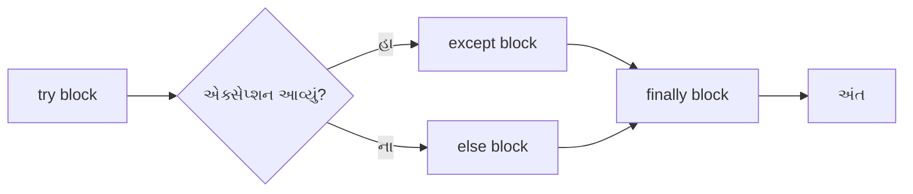
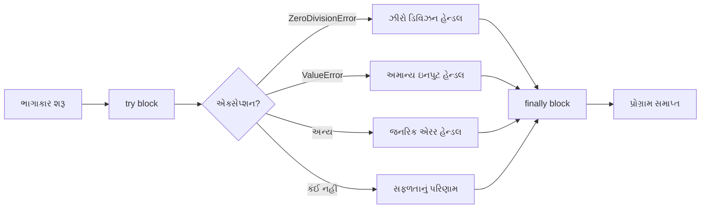
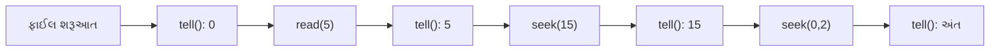
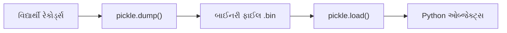
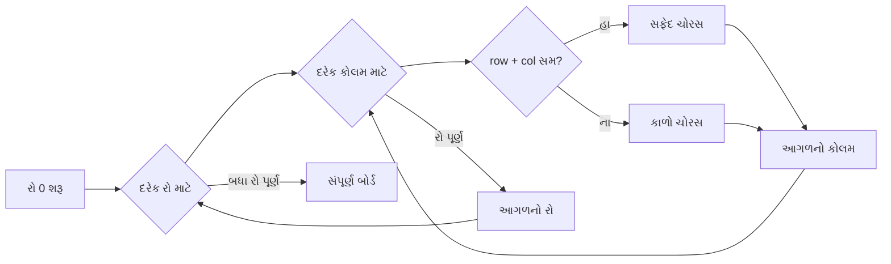
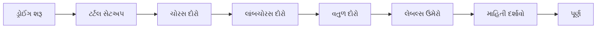

## પ્રશ્ન 1(અ) [3 માર્ક્સ]

**પાયથનમાં સેટ અને ડિક્શનરી વચ્ચેનો તફાવત લખો.**

**જવાબ**:

| **લક્ષણ** | **સેટ** | **ડિક્શનરી** |
|-----------|---------|----------------|
| **ડેટા સ્ટોરેજ** | ફક્ત યુનિક એલિમેન્ટ્સ સ્ટોર કરે | કી-વેલ્યુ પેર સ્ટોર કરે |
| **ક્રમ** | અનઓર્ડર્ડ કલેક્શન | ઓર્ડર્ડ (Python 3.7+) |
| **ડુપ્લિકેટ્સ** | ડુપ્લિકેટ્સની મંજૂરી નથી | કીઝ યુનિક હોવી જોઈએ |
| **એક્સેસ** | ઈન્ડેક્સ દ્વારા એક્સેસ કરી શકાતું નથી | કીઝ દ્વારા વેલ્યુઝ એક્સેસ કરવા |
| **સિન્ટેક્સ** | `{1, 2, 3}` | `{'key': 'value'}` |

- **સેટ**: યુનિક, અનઓર્ડર્ડ એલિમેન્ટ્સનો કલેક્શન
- **ડિક્શનરી**: યુનિક કીઝ સાથે કી-વેલ્યુ પેરનો કલેક્શન

**મેમરી ટ્રીક:** "સેટ્સ યુનિક, ડિક્ટ્સ કીઝ વાળા"

## પ્રશ્ન 1(બ) [4 માર્ક્સ]

**પાયથોનમાં લિસ્ટ ઉદાહરણ સાથે સમજાવો.**

**જવાબ**:

**લિસ્ટ** એક ઓર્ડર્ડ, મ્યુટેબલ કલેક્શન છે જે વિવિધ ડેટા ટાઈપ્સ સ્ટોર કરી શકે છે.

**લિસ્ટ ઓપરેશન્સનું ટેબલ:**

| **ઓપરેશન** | **સિન્ટેક્સ** | **ઉદાહરણ** |
|-------------|----------------|-------------|
| **બનાવવું** | `list_name = []` | `fruits = ['apple', 'banana']` |
| **એક્સેસ** | `list[index]` | `fruits[0]` રિટર્ન 'apple' |
| **ઉમેરવું** | `append()` | `fruits.append('orange')` |
| **હટાવવું** | `remove()` | `fruits.remove('apple')` |

```python
# ઉદાહરણ
numbers = [1, 2, 3, 4, 5]
numbers.append(6)  # [1, 2, 3, 4, 5, 6]
print(numbers[0])  # આઉટપુટ: 1
```

- **ઓર્ડર્ડ**: એલિમેન્ટ્સ તેમની પોઝિશન જાળવે છે
- **મ્યુટેબલ**: બનાવ્યા પછી મોડિફાઈ કરી શકાય છે
- **ફ્લેક્સિબલ**: કોઈપણ ડેટા ટાઈપ સ્ટોર કરે છે

**મેમરી ટ્રીક:** "લિસ્ટ્સ ઓર્ડર્ડ અને મોડિફાઈ કરી શકાય તેવી"

## પ્રશ્ન 1(ક) [7 માર્ક્સ]

**પાયથોનમાં ટપલ શું છે? બે ટપલ વેલ્યુને અદલાબદલી કરવાનો પાયથન પ્રોગ્રામ લખો.**

**જવાબ**:

**ટપલ** એક ઓર્ડર્ડ, ઈમ્યુટેબલ કલેક્શન છે જે મલ્ટિપલ આઈટમ્સ સ્ટોર કરે છે.

**ટપલના લક્ષણોનું ટેબલ:**

| **પ્રોપર્ટી** | **વર્ણન** | **ઉદાહરણ** |
|--------------|------------|-------------|
| **ઈમ્યુટેબલ** | બનાવ્યા પછી બદલી શકાતું નથી | `t = (1, 2, 3)` |
| **ઓર્ડર્ડ** | એલિમેન્ટ્સનો નિર્ધારિત ક્રમ | ઈન્ડેક્સ દ્વારા એક્સેસ |
| **ડુપ્લિકેટ્સ** | ડુપ્લિકેટ વેલ્યુઝની મંજૂરી | `(1, 1, 2)` |
| **ઈન્ડેક્સિંગ** | પોઝિશન દ્વારા એલિમેન્ટ્સ એક્સેસ | `t[0]` |

```python
# બે ટપલ વેલ્યુઝને સ્વેપ કરવાનો પ્રોગ્રામ
def swap_tuple_values(tup, pos1, pos2):
    # સ્વેપિંગ માટે ટપલને લિસ્ટમાં કન્વર્ટ કરો
    temp_list = list(tup)
    
    # વેલ્યુઝ સ્વેપ કરો
    temp_list[pos1], temp_list[pos2] = temp_list[pos2], temp_list[pos1]
    
    # પાછું ટપલમાં કન્વર્ટ કરો
    return tuple(temp_list)

# ઉદાહરણ ઉપયોગ
original_tuple = (10, 20, 30, 40, 50)
print("મૂળ ટપલ:", original_tuple)

# પોઝિશન 1 અને 3 પર વેલ્યુઝ સ્વેપ કરો
swapped_tuple = swap_tuple_values(original_tuple, 1, 3)
print("સ્વેપિંગ પછી:", swapped_tuple)
```

- **ઈમ્યુટેબલ**: એકવાર બનાવ્યા પછી મોડિફાઈ કરી શકાતું નથી
- **ઓર્ડર્ડ**: એલિમેન્ટ સિક્વન્સ જાળવે છે
- **હેટેરોજીનિયસ**: વિવિધ ડેટા ટાઈપ્સ સ્ટોર કરી શકે છે

**મેમરી ટ્રીક:** "ટપલ્સ ઈમ્યુટેબલ અને ઓર્ડર્ડ"

## પ્રશ્ન 1(ક OR) [7 માર્ક્સ]

**પાયથોનમાં ડિક્શનરી શું છે? લૂપની મદદથી ડિક્શનરીને ટ્રાવર્સ કરવાનો પાયથન પ્રોગ્રામ લખો.**

**જવાબ**:

**ડિક્શનરી** એક યુનિક કીઝ સાથે કી-વેલ્યુ પેરનો અનઓર્ડર્ડ કલેક્શન છે.

**ડિક્શનરી મેથડ્સનું ટેબલ:**

| **મેથડ** | **હેતુ** | **ઉદાહરણ** |
|----------|-----------|-------------|
| **keys()** | બધી કીઝ મેળવો | `dict.keys()` |
| **values()** | બધી વેલ્યુઝ મેળવો | `dict.values()` |
| **items()** | કી-વેલ્યુ પેર મેળવો | `dict.items()` |
| **get()** | સેફ કી એક્સેસ | `dict.get('key')` |

```python
# લૂપ વાપરીને ડિક્શનરી ટ્રાવર્સ કરવાનો પ્રોગ્રામ
student_marks = {
    'Alice': 85,
    'Bob': 92,
    'Charlie': 78,
    'Diana': 96,
    'Eve': 89
}

print("ડિક્શનરી ટ્રાવર્સલ મેથડ્સ:")
print("-" * 30)

# મેથડ 1: ફક્ત કીઝ ટ્રાવર્સ કરો
print("1. ફક્ત કીઝ:")
for key in student_marks:
    print(f"   {key}")

# મેથડ 2: ફક્ત વેલ્યુઝ ટ્રાવર્સ કરો
print("\n2. ફક્ત વેલ્યુઝ:")
for value in student_marks.values():
    print(f"   {value}")

# મેથડ 3: કી-વેલ્યુ પેર ટ્રાવર્સ કરો
print("\n3. કી-વેલ્યુ પેર:")
for key, value in student_marks.items():
    print(f"   {key}: {value}")

# મેથડ 4: keys() મેથડ વાપરીને
print("\n4. keys() મેથડ વાપરીને:")
for key in student_marks.keys():
    print(f"   {key} ને {student_marks[key]} માર્ક્સ મળ્યા")
```

- **કી-વેલ્યુ સ્ટોરેજ**: દરેક કી એક વેલ્યુ સાથે મેપ થાય છે
- **યુનિક કીઝ**: ડુપ્લિકેટ કીઝની મંજૂરી નથી
- **ફાસ્ટ લુકઅપ**: O(1) એવરેજ ટાઈમ કોમ્પ્લેક્સિટી

**મેમરી ટ્રીક:** "ડિક્ટ્સ કીઝને વેલ્યુઝ સાથે મેપ કરે"

## પ્રશ્ન 2(અ) [3 માર્ક્સ]

**પેકેજ શું છે? પેકેજનો ઉપયોગ કરવાના ફાયદાઓની યાદી આપો.**

**જવાબ**:

**પેકેજ** એક ડિરેક્ટરી છે જેમાં મલ્ટિપલ મોડ્યુલ્સ એકસાથે ઓર્ગેનાઈઝ કરવામાં આવે છે.

**પેકેજના ફાયદાઓનું ટેબલ:**

| **ફાયદો** | **વર્ણન** |
|-----------|------------|
| **ઓર્ગેનાઈઝેશન** | સંબંધિત મોડ્યુલ્સને એકસાથે ગ્રુપ કરે |
| **નેમસ્પેસ** | નામિંગ કોન્ફ્લિક્ટ્સ ટાળે |
| **રીયુઝેબિલિટી** | કોડ પ્રોજેક્ટ્સમાં ફરીથી વાપરી શકાય |
| **મેઈન્ટેનેબિલિટી** | મોટા કોડબેસ મેનેજ કરવું સરળ |
| **ડિસ્ટ્રિબ્યુશન** | શેર કરવું અને ઈન્સ્ટોલ કરવું સરળ |

- **મોડ્યુલર સ્ટ્રક્ચર**: વધુ સારું કોડ ઓર્ગેનાઈઝેશન
- **હાયરાર્કિકલ નેમસ્પેસ**: નેમ કોન્ફ્લિક્ટ્સ અટકાવે
- **કોડ રીયુઝ**: સોફ્ટવેર રીયુઝેબિલિટીને પ્રમોટ કરે

**મેમરી ટ્રીક:** "પેકેજિસ રિલેટેડ મોડ્યુલ્સ ઓર્ગેનાઈઝ કરે"

## પ્રશ્ન 2(બ) [4 માર્ક્સ]

**કોઈપણ બે પેકેજ આયાત પદ્ધતિઓ ઉદાહરણો સાથે સમજાવો.**

**જવાબ**:

**આયાત મેથડ્સનું ટેબલ:**

| **મેથડ** | **સિન્ટેક્સ** | **ઉપયોગ** |
|----------|----------------|------------|
| **નોર્મલ આયાત** | `import package.module` | ફુલ પાથ સાથે એક્સેસ |
| **ફ્રમ આયાત** | `from package import module` | ડાયરેક્ટ મોડ્યુલ એક્સેસ |
| **સ્પેસિફિક આયાત** | `from package.module import function` | સ્પેસિફિક આઈટમ્સ આયાત |
| **વાઈલ્ડકાર્ડ આયાત** | `from package import *` | બધા મોડ્યુલ્સ આયાત |

```python
# મેથડ 1: નોર્મલ આયાત
import mypackage.calculator
result = mypackage.calculator.add(5, 3)
print(f"નોર્મલ આયાત પરિણાม: {result}")

# મેથડ 2: ફ્રમ આયાત
from mypackage import calculator
result = calculator.multiply(4, 6)
print(f"ફ્રમ આયાત પરિણાม: {result}")
```

- **નોર્મલ આયાત**: ફુલ પેકેજ પાથ જરૂરી
- **ફ્રમ આયાત**: ડાયરેક્ટ મોડ્યુલ એક્સેસની મંજૂરી
- **સ્પેસિફિક ફંક્શન આયાત**: ફક્ત જરૂરી ફંક્શન્સ આયાત

**મેમરી ટ્રીક:** "આયાત નોર્મલી અથવા પેકેજથી"

## પ્રશ્ન 2(ક) [7 માર્ક્સ]

**ઈન્ટ્રા-પેકેજ સંદર્ભ વિશે ઉદાહરણ સાથે સમજાવો.**

**જવાબ**:

**ઈન્ટ્રા-પેકેજ રેફરન્સ** પેકેજની અંદરના મોડ્યુલ્સને એકબીજાથી આયાત કરવાની મંજૂરી આપે છે.

**પેકેજ સ્ટ્રક્ચરનો ડાયાગ્રામ:**

```goat
mypackage/
├── __init__.py
├── math_ops/
│   ├── __init__.py
│   ├── basic.py
│   └── advanced.py
└── utils/
    ├── __init__.py
    └── helpers.py
```

**રેફરન્સ ટાઈપ્સનું ટેબલ:**

| **ટાઈપ** | **સિન્ટેક્સ** | **ઉપયોગ** |
|----------|----------------|-------------|
| **એબ્સોલ્યુટ** | `from mypackage.math_ops import basic` | પેકેજ રૂટથી ફુલ પાથ |
| **રિલેટિવ** | `from . import basic` | વર્તમાન પેકેજ |
| **પેરન્ટ** | `from .. import utils` | પેરન્ટ પેકેજ |
| **સિબલિંગ** | `from ..utils import helpers` | સિબલિંગ પેકેજ |

```python
# પેકેજ સ્ટ્રક્ચર ઉદાહરણ
# mypackage/math_ops/advanced.py
from . import basic  # સેમ પેકેજથી રિલેટિવ આયાત
from ..utils import helpers  # સિબલિંગ પેકેજથી આયાત

def power_operation(base, exp):
    # બેસિક મોડ્યુલથી ફંક્શન વાપરીને
    if basic.is_valid_number(base) and basic.is_valid_number(exp):
        result = base ** exp
        # હેલ્પર ફંક્શન વાપરીને
        return helpers.format_result(result)
    return None

# mypackage/math_ops/basic.py
def is_valid_number(num):
    return isinstance(num, (int, float))

def add(a, b):
    return a + b

# mypackage/utils/helpers.py
def format_result(value):
    return f"પરિણાम: {value:.2f}"
```

- **રિલેટિવ આયાત્સ**: વર્તમાન પેકેજ માટે ડોટ્સ (.) વાપરો
- **એબ્સોલ્યુટ આયાત્સ**: ફુલ પેકેજ પાથ
- **પેકેજ હાયરાર્કી**: ડોટ નોટેશન વાપરીને નેવિગેટ કરો

**મેમરી ટ્રીક:** "ડોટ્સ પેકેજ લેવલ્સ નેવિગેટ કરે"

## પ્રશ્ન 2(અ OR) [3 માર્ક્સ]

**મોડ્યુલ શું છે? મોડ્યુલનો ઉપયોગ કરવાના ફાયદાઓની યાદી આપો.**

**જવાબ**:

**મોડ્યુલ** એક Python ફાઈલ છે જેમાં ડેફિનિશન્સ, સ્ટેટમેન્ટ્સ અને ફંક્શન્સ હોય છે.

**મોડ્યુલના ફાયદાઓનું ટેબલ:**

| **ફાયદો** | **વર્ણન** |
|-----------|------------|
| **કોડ રીયુઝેબિલિટી** | એકવાર લખો, અનેક વાર વાપરો |
| **નેમસ્પેસ** | ફંક્શન્સ માટે અલગ નેમસ્પેસ |
| **ઓર્ગેનાઈઝેશન** | વધુ સારું કોડ સ્ટ્રક્ચર |
| **મેઈન્ટેનેબિલિટી** | ડિબગ અને અપડેટ કરવું સરળ |
| **કોલેબોરેશન** | મલ્ટિપલ ડેવલપર્સ કામ કરી શકે |

- **રીયુઝેબલ કોડ**: ફંક્શન્સ ગમે ત્યાં આયાત કરી શકાય
- **મોડ્યુલર ડિઝાઈન**: મોટા પ્રોગ્રામ્સને નાના ભાગોમાં વહેંચો
- **સરળ મેઈન્ટેનન્સ**: એક જગ્યાએ ફેરફાર બધી આયાત્સને અસર કરે

**મેમરી ટ્રીક:** "મોડ્યુલ્સ કોડ રીયુઝેબલ બનાવે"

## પ્રશ્ન 2(બ OR) [4 માર્ક્સ]

**કોઈપણ બે મોડ્યુલ આયાત પદ્ધતિ ઉદાહરણ સાથે સમજાવો.**

**જવાબ**:

**મોડ્યુલ આયાત મેથડ્સનું ટેબલ:**

| **મેથડ** | **સિન્ટેક્સ** | **એક્સેસ પેટર્ન** |
|----------|----------------|-------------------|
| **ડાયરેક્ટ આયાત** | `import module_name` | `module_name.function()` |
| **ફ્રમ આયાત** | `from module_name import function` | `function()` |
| **એલિયાસ આયાત** | `import module_name as alias` | `alias.function()` |
| **વાઈલ્ડકાર્ડ આયાત** | `from module_name import *` | `function()` |

```python
# મેથડ 1: ડાયરેક્ટ આયાત
import math
result1 = math.sqrt(16)
print(f"ડાયરેક્ટ આયાત: {result1}")

# મેથડ 2: ફ્રમ આયાત
from math import pi, sin
result2 = sin(pi/2)
print(f"ફ્રમ આયાત: {result2}")
```

- **ડાયરેક્ટ આયાત**: મોડ્યુલ નામ પ્રીફિક્સ સાથે એક્સેસ
- **ફ્રમ આયાત**: પ્રીફિક્સ વગર ડાયરેક્ટ ફંક્શન એક્સેસ
- **નેમસ્પેસ કંટ્રોલ**: યોગ્ય આયાત મેથડ પસંદ કરો

**મેમરી ટ્રીક:** "આયાત ડાયરેક્ટલી અથવા મોડ્યુલથી"

## પ્રશ્ન 2(ક OR) [7 માર્ક્સ]

**વતુળનું ક્ષેત્રફળ અને પરિઘ શોધવા માટેના મોડ્યુલનો પ્રોગ્રામ લખો.**

**જવાબ**:

```python
# circle_operations.py (મોડ્યુલ ફાઈલ)
import math

def area(radius):
    """વતુળનું ક્ષેત્રફળ ગણો"""
    if radius <= 0:
        return 0
    return math.pi * radius * radius

def circumference(radius):
    """વતુળનો પરિઘ ગણો"""
    if radius <= 0:
        return 0
    return 2 * math.pi * radius

def display_info(radius):
    """વતુળની માહિતી દર્શાવો"""
    print(f"ત્રિજ્યા {radius} વાળું વતુળ:")
    print(f"ક્ષેત્રફળ: {area(radius):.2f}")
    print(f"પરિઘ: {circumference(radius):.2f}")

# કોન્સ્ટન્ટ્સ
PI = math.pi

# અ) મોડ્યુલને બીજા પ્રોગ્રામમાં આયાત કરો

# main_program.py
import circle_operations

radius = 5
print("મેથડ 1: સંપૂર્ણ મોડ્યુલ આયાત")
area_result = circle_operations.area(radius)
circumference_result = circle_operations.circumference(radius)

print(f"ક્ષેત્રફળ: {area_result:.2f}")
print(f"પરિઘ: {circumference_result:.2f}")

# બ) મોડ્યુલમાંથી બીજા પ્રોગ્રામમાં ચોક્કસ ફંક્શન આયાત કરો
# specific_import.py
from circle_operations import area, circumference

radius = 7
print("\nમેથડ 2: ચોક્કસ ફંક્શન્સ આયાત")
area_result = area(radius)
circumference_result = circumference(radius)

print(f"ક્ષેત્રફળ: {area_result:.2f}")
print(f"પરિઘ: {circumference_result:.2f}")
```

**મોડ્યુલ ફીચર્સનું ટેબલ:**

| **ફીચર** | **ઇમ્પ્લિમેન્ટેશન** |
|-----------|-------------------|
| **ફંક્શન્સ** | area(), circumference() |
| **એરર હેન્ડલિંગ** | નેગેટિવ ત્રિજ્યા માટે ચેક |
| **કોન્સ્ટન્ટ્સ** | PI વેલ્યુ |
| **ડોક્યુમેન્ટેશન** | ફંક્શન ડોકસ્ટ્રિંગ્સ |

- **મોડ્યુલ બનાવવું**: ફંક્શન્સને .py ફાઈલમાં સેવ કરો
- **આયાત લવચીકતા**: સંપૂર્ણ મોડ્યુલ અથવા ચોક્કસ ફંક્શન્સ
- **કોડ રીયુઝ**: એક જ ફંક્શન્સ મલ્ટિપલ પ્રોગ્રામ્સમાં વાપરો

**મેમરી ટ્રીક:** "મોડ્યુલ્સમાં રીયુઝેબલ ફંક્શન્સ હોય"

## પ્રશ્ન 3(અ) [3 માર્ક્સ]

**પાયથોનમાં ભૂલના પ્રકારો સમજાવો.**

**જવાબ**:

**Python એરર ટાઈપ્સનું ટેબલ:**

| **એરર ટાઈપ** | **વર્ણન** | **ઉદાહરણ** |
|---------------|------------|-------------|
| **સિન્ટેક્સ એરર** | ખોટું Python સિન્ટેક્સ | કોલન `:` ભૂલી જવું |
| **રનટાઈમ એરર** | એક્ઝિક્યુશન દરમિયાન થાય | શૂન્યથી ભાગાકાર |
| **લોજિકલ એરર** | ખોટું પ્રોગ્રામ લોજિક | ખોટું અલ્ગોરિધમ |
| **નેમ એરર** | અંડિફાઈન્ડ વેરિએબલ | અઘોષિત વેરિએબલ વાપરવું |
| **ટાઈપ એરર** | ખોટું ડેટા ટાઈપ ઓપરેશન | સ્ટ્રિંગ + ઇન્ટિજર |

- **સિન્ટેક્સ એરર**: પ્રોગ્રામ રન થાય તે પહેલાં શોધાય
- **રનટાઈમ એરર**: પ્રોગ્રામ એક્ઝિક્યુશન દરમિયાન થાય
- **લોજિકલ એરર**: પ્રોગ્રામ રન થાય પણ ખોટા પરિણામ આપે

**મેમરી ટ્રીક:** "સિન્ટેક્સ, રનટાઈમ, લોજિક એરર્સ"

## પ્રશ્ન 3(બ) [4 માર્ક્સ]

**યુઝર-ડિફાઈન્ડ એક્સેપ્શન રેઈઝ સ્ટેટમેન્ટ સાથે સમજાવો.**

**જવાબ**:

**યુઝર-ડિફાઈન્ડ એક્સેપ્શન્સ** પ્રોગ્રામર્સ દ્વારા બનાવવામાં આવેલા કસ્ટમ એરર ક્લાસીસ છે.

**એક્સેપ્શન કોમ્પોનન્ટ્સનું ટેબલ:**

| **કોમ્પોનન્ટ** | **હેતુ** | **ઉદાહરણ** |
|----------------|----------|-------------|
| **ક્લાસ ડેફિનિશન** | કસ્ટમ એક્સેપ્શન બનાવો | `class CustomError(Exception):` |
| **રેઈઝ સ્ટેટમેન્ટ** | એક્સેપ્શન ટ્રિગર કરો | `raise CustomError("message")` |
| **એરર મેસેજ** | સમસ્યાનું વર્ણન | માહિતીપ્રદ ટેક્સ્ટ |
| **એક્સેપ્શન હેન્ડલિંગ** | કસ્ટમ એક્સેપ્શન પકડો | `except CustomError:` |

```python
# કસ્ટમ એક્સેપ્શન ડિફાઈન કરો
class AgeValidationError(Exception):
    def __init__(self, age, message="અયોગ્ય વય આપેલ છે"):
        self.age = age
        self.message = message
        super().__init__(self.message)

def validate_age(age):
    if age < 0:
        raise AgeValidationError(age, "વય નેગેટિવ હોઈ શકે નહીં")
    elif age > 150:
        raise AgeValidationError(age, "વય 150 કરતાં વધુ હોઈ શકે નહીં")
    else:
        print(f"યોગ્ય વય: {age}")

# કસ્ટમ એક્સેપ્શનનો ઉપયોગ
try:
    validate_age(-5)
except AgeValidationError as e:
    print(f"એરર: {e.message}, વય: {e.age}")
```

- **કસ્ટમ એક્સેપ્શન ક્લાસ**: Exception થી ઇન્હેરિટ કરે
- **રેઈઝ સ્ટેટમેન્ટ**: મેન્યુઅલી એક્સેપ્શન્સ ટ્રિગર કરે
- **અર્થપૂર્ણ મેસેજિસ**: ડિબગિંગમાં મદદ કરે

**મેમરી ટ્રીક:** "વેલિડેશન માટે કસ્ટમ એક્સેપ્શન રેઈઝ કરો"

## પ્રશ્ન 3(ક) [7 માર્ક્સ]

**ટ્રાય-એક્સેપ્ટ-ફાઈનલી ક્લોઝ ઉદાહરણ સાથે સમજાવો.**

**જવાબ**:

**ટ્રાય-એક્સેપ્ટ-ફાઈનલી** સંપૂર્ણ એક્સેપ્શન હેન્ડલિંગ મિકેનિઝમ પૂરું પાડે છે.

**એક્સેપ્શન હેન્ડલિંગ બ્લોક્સનું ટેબલ:**

| **બ્લોક** | **હેતુ** | **એક્ઝિક્યુશન** |
|----------|----------|------------------|
| **try** | એક્સેપ્શન ઉઠાવી શકે તેવો કોડ | હંમેશા પહેલા એક્ઝિક્યુટ |
| **except** | ચોક્કસ એક્સેપ્શન્સ હેન્ડલ કરે | ફક્ત એક્સેપ્શન આવે તો |
| **else** | કોઈ એક્સેપ્શન નહીં આવે ત્યારે | ફક્ત કોઈ એક્સેપ્શન નહીં આવે તો |
| **finally** | ક્લીનઅપ કોડ | હંમેશા એક્ઝિક્યુટ થાય |

```python
# સંપૂર્ણ એક્સેપ્શન હેન્ડલિંગ ઉદાહરણ
def divide_numbers():
    try:
        print("ભાગાકાર ઓપરેશન શરૂ કરી રહ્યા છીએ...")
        
        # યુઝરથી ઇનપુટ મેળવો
        num1 = float(input("પહેલો નંબર દાખલ કરો: "))
        num2 = float(input("બીજો નંબર દાખલ કરો: "))
        
        # ભાગાકાર કરો
        result = num1 / num2
        
    except ValueError:
        print("એરર: કૃપા કરીને ફક્ત યોગ્ય નંબર્સ દાખલ કરો")
        return None
        
    except ZeroDivisionError:
        print("એરર: શૂન્યથી ભાગાકાર કરી શકાતો નથી")
        return None
        
    except Exception as e:
        print(f"અનપેક્ષિત એરર આવ્યું: {e}")
        return None
        
    else:
        print(f"ભાગાકાર સફળ: {num1} ÷ {num2} = {result}")
        return result
        
    finally:
        print("ભાગાકાર ઓપરેશન પૂર્ણ")
        print("રિસોર્સિસ ક્લીન કરી રહ્યા છીએ...")

# ઉદાહરણ ઉપયોગ
result = divide_numbers()
if result:
    print(f"અંતિમ પરિણાম: {result}")
```

**ફ્લો ડાયાગ્રામ:**



- **try**: જોખમી કોડ હોય છે
- **except**: ચોક્કસ એરર્સ હેન્ડલ કરે
- **finally**: ક્લીનઅપ માટે હંમેશા એક્ઝિક્યુટ થાય

**મેમરી ટ્રીક:** "ટ્રાય-એક્સેપ્ટ-ફાઈનલી હંમેશા ક્લીન કરે"

## પ્રશ્ન 3(અ OR) [3 માર્ક્સ]

**બિલ્ટ-ઇન એક્સેપ્શન શું છે? કોઇ પણ બેની તેમના અર્થ સાથે યાદી બનાવો.**

**જવાબ**:

**બિલ્ટ-ઇન એક્સેપ્શન્સ** Python માં પૂર્વ-નિર્ધારિત એરર ટાઈપ્સ છે.

**બિલ્ટ-ઇન એક્સેપ્શન્સનું ટેબલ:**

| **એક્સેપ્શન** | **અર્થ** | **ઉદાહરણ** |
|--------------|-----------|-------------|
| **ValueError** | યોગ્ય ટાઈપ પણ અમાન્ય વેલ્યુ | `int("abc")` |
| **TypeError** | ખોટું ડેટા ટાઈપ ઓપરેશન | `"5" + 5` |
| **IndexError** | લિસ્ટ ઇન્ડેક્સ રેન્જની બહાર | 5-આઇટમ લિસ્ટ માટે `list[10]` |
| **KeyError** | ડિક્શનરી કી મળી નહીં | `dict["missing_key"]` |
| **ZeroDivisionError** | શૂન્યથી ભાગાકાર | `10 / 0` |

**બે મુખ્ય બિલ્ટ-ઇન એક્સેપ્શન્સ:**

- **ValueError**: જ્યારે ફંક્શનને યોગ્ય ટાઈપ પણ અમાન્ય વેલ્યુ મળે
- **TypeError**: જ્યારે અયોગ્ય ડેટા ટાઈપ પર ઓપરેશન કરવામાં આવે

**મેમરી ટ્રીક:** "બિલ્ટ-ઇન એક્સેપ્શન્સ સામાન્ય એરર્સ હેન્ડલ કરે"

## પ્રશ્ન 3(બ OR) [4 માર્ક્સ]

**ટ્રાય-એક્સેપ્ટ ક્લોઝ ઉદાહરણ સાથે સમજાવો.**

**જવાબ**:

**ટ્રાય-એક્સેપ્ટ** પ્રોગ્રામ એક્ઝિક્યુશન દરમિયાન આવી શકે તેવા એક્સેપ્શન્સ હેન્ડલ કરે છે.

**એક્સેપ્શન હેન્ડલિંગનું ટેબલ:**

| **કોમ્પોનન્ટ** | **હેતુ** | **સિન્ટેક્સ** |
|---------------|----------|---------------|
| **try** | નિષ્ફળ થઈ શકે તેવો કોડ | `try:` |
| **except** | ચોક્કસ એક્સેપ્શન હેન્ડલ કરે | `except ErrorType:` |
| **મલ્ટિપલ except** | વિવિધ એરર્સ હેન્ડલ કરે | મલ્ટિપલ except બ્લોક્સ |
| **જનરલ except** | કોઈપણ એક્સેપ્શન પકડે | `except:` |

```python
# ટ્રાય-એક્સેપ્ટ ક્લોઝનું ઉદાહરણ
def safe_division():
    try:
        # એક્સેપ્શન્સ ઉઠાવી શકે તેવો કોડ
        dividend = int(input("ભાજ્ય દાખલ કરો: "))
        divisor = int(input("ભાજક દાખલ કરો: "))
        
        result = dividend / divisor
        print(f"પરિણાम: {dividend} ÷ {divisor} = {result}")
        
    except ValueError:
        print("એરર: કૃપા કરીને ફક્ત યોગ્ય ઇન્ટિજર્સ દાખલ કરો")
        
    except ZeroDivisionError:
        print("એરર: શૂન્યથી ભાગાકાર કરી શકાતો નથી")
        
    except Exception as e:
        print(f"અનપેક્ષિત એરર આવ્યું: {e}")
    
    print("એક્સેપ્શન હેન્ડલિંગ પછી પ્રોગ્રામ ચાલુ રહે છે")

# ઉદાહરણ ઉપયોગ
safe_division()
```

- **try બ્લોક**: સંભવિત જોખમી કોડ હોય છે
- **except બ્લોક**: ચોક્કસ એક્સેપ્શન ટાઈપ્સ હેન્ડલ કરે
- **મલ્ટિપલ હેન્ડલર્સ**: વિવિધ એક્સેપ્શન્સ અલગ અલગ હેન્ડલ

**મેમરી ટ્રીક:** "જોખમી કોડ ટ્રાય કરો, એક્સેપ્ટ એરર્સ હેન્ડલ કરે"

## પ્રશ્ન 3(ક OR) [7 માર્ક્સ]

**ડિવાઇડ બાય ઝીરો એક્સેપ્શન ફાઈનલી ક્લોઝ સાથે કેચ કરવાનો પ્રોગ્રામ લખો.**

**જવાબ**:

```python
# ફાઈનલી ક્લોઝ સાથે ડિવાઇડ બાય ઝીરો હેન્ડલ કરવાનો પ્રોગ્રામ
def advanced_calculator():
    """વ્યાપક એક્સેપ્શન હેન્ડલિંગ સાથે કેલ્ક્યુલેટર"""
    
    try:
        print("=== એડવાન્સ કેલ્ક્યુલેટર ===")
        print("ભાગાકાર માટે બે નંબર દાખલ કરો")
        
        # ઇનપુટ સેક્શન
        numerator = float(input("અંશ દાખલ કરો: "))
        denominator = float(input("છેદ દાખલ કરો: "))
        
        print(f"\n{numerator} ને {denominator} થી ભાગવાનો પ્રયાસ કરી રહ્યા છીએ...")
        
        # ક્રિટિકલ ઓપરેશન જે નિષ્ફળ થઈ શકે
        if denominator == 0:
            raise ZeroDivisionError("શૂન્યથી ભાગાકારની મંજૂરી નથી")
        
        result = numerator / denominator
        
        # સફળતાનો સંદેશ
        print(f"✓ ભાગાકાર સફળ!")
        print(f"✓ પરિણામ: {numerator} ÷ {denominator} = {result:.4f}")
        
        return result
        
    except ZeroDivisionError as zde:
        print(f"✗ ઝીરો ડિવિઝન એરર: {zde}")
        print("✗ કૃપા કરીને શૂન્ય સિવાયનો છેદ વાપરો")
        return None
        
    except ValueError as ve:
        print(f"✗ વેલ્યુ એરર: અમાન્ય ઇનપુટ આપ્યું")
        print("✗ કૃપા કરીને ફક્ત નંબરિક વેલ્યુઝ દાખલ કરો")
        return None
        
    except Exception as e:
        print(f"✗ અનપેક્ષિત એરર: {e}")
        return None
        
    finally:
        print("\n" + "="*40)
        print("ક્લીનઅપ ઓપરેશન્સ:")
        print("- કેલ્ક્યુલેટર સેશન બંધ કરી રહ્યા છીએ")
        print("- ઓપરેશન લોગ સેવ કરી રહ્યા છીએ")
        print("- મેમરી રિસોર્સિસ છોડી રહ્યા છીએ")
        print("- કેલ્ક્યુલેટર શટડાઉન પૂર્ણ")
        print("="*40)

# વિવિધ સ્થિતિઓ સાથે કેલ્ક્યુલેટર ટેસ્ટ કરવાનું ફંક્શન
def test_calculator():
    """વિવિધ પરિસ્થિતિઓ સાથે કેલ્ક્યુલેટર ટેસ્ટ કરો"""
    
    test_cases = [
        (10, 2),    # સામાન્ય ભાગાકાર
        (15, 0),    # ઝીરો ડિવિઝન
        (7, 3),     # દશાંશ સાથે સામાન્ય ભાગાકાર
    ]
    
    for i, (num, den) in enumerate(test_cases, 1):
        print(f"\n--- ટેસ્ટ કેસ {i} ---")
        print(f"ટેસ્ટિંગ: {num} ÷ {den}")
        
        # વાસ્તવિક પરિસ્થિતિમાં આ ઇન્ટરેક્ટિવ હશે
        # આ ફક્ત ડેમોન્સ્ટ્રેશન માટે છે
        print(f"{num} ને {den} થી ભાગવાનું સિમ્યુલેશન")
        
        try:
            if den == 0:
                raise ZeroDivisionError("શૂન્યથી ભાગાકાર કરી શકાતો નથી")
            result = num / den
            print(f"પરિણામ: {result}")
        except ZeroDivisionError as e:
            print(f"એરર પકડાયું: {e}")
        finally:
            print("ટેસ્ટ કેસ પૂર્ણ")

# કેલ્ક્યુલેટર ચલાવો
if __name__ == "__main__":
    result = advanced_calculator()
    
    if result is not None:
        print(f"\nઅંતિમ ગણેલું પરિણામ: {result}")
    else:
        print("\nએરર્સના કારણે ગણતરી નિષ્ફળ")
```

**એક્સેપ્શન હેન્ડલિંગ ફીચર્સનું ટેબલ:**

| **ફીચર** | **ઇમ્પ્લિમેન્ટેશન** |
|----------|-------------------|
| **ZeroDivisionError** | શૂન્યથી ભાગાકાર માટે ચોક્કસ હેન્ડલિંગ |
| **ValueError** | અમાન્ય ઇનપુટ ટાઈપ્સ હેન્ડલ કરે |
| **જનરિક એક્સેપ્શન** | અનપેક્ષિત એરર્સ પકડે |
| **ફાઈનલી બ્લોક** | હંમેશા ક્લીનઅપ કોડ એક્ઝિક્યુટ |

**એક્સેપ્શન હેન્ડલિંગ ફ્લો:**



- **ચોક્કસ એક્સેપ્શન હેન્ડલિંગ**: ZeroDivisionError અલગથી પકડાય
- **ફાઈનલી ક્લોઝ**: ક્લીનઅપ માટે હંમેશા એક્ઝિક્યુટ થાય
- **રિસોર્સ મેનેજમેન્ટ**: એરર્સ છતાં યોગ્ય ક્લીનઅપ

**મેમરી ટ્રીક:** "ફાઈનલી હંમેશા રિસોર્સિસ ક્લીન કરે"

## પ્રશ્ન 4(અ) [3 માર્ક્સ]

**વ્યાખ્યાયિત કરો: ફાઇલ, બાઇનરી ફાઇલ, ટેક્સ્ટ ફાઇલ**

**જવાબ**:

**ફાઈલ વ્યાખ્યાઓનું ટેબલ:**

| **શબ્દ** | **વ્યાખ્યા** | **ઉદાહરણ** |
|---------|-------------|-------------|
| **ફાઈલ** | ડિસ્ક પર નામવાળું સ્ટોરેજ સ્થાન | document.txt, image.jpg |
| **બાઈનરી ફાઈલ** | બાઈનરી ફોર્મેટમાં નોન-ટેક્સ્ટ ડેટા સમાવે | .exe, .jpg, .mp3, .pdf |
| **ટેક્સ્ટ ફાઈલ** | માનવ-વાંચી શકાય તેવા ટેક્સ્ટ કેરેક્ટર્સ સમાવે | .txt, .py, .html, .csv |

**વિગતવાર વ્યાખ્યાઓ:**

- **ફાઈલ**: સ્ટોરેજ ડિવાઈસ પર યુનિક નામ સાથે સ્ટોર કરેલો ડેટાનો કલેક્શન
- **બાઈનરી ફાઈલ**: બાઈનરી ફોર્મેટ (0s અને 1s) માં ડેટા સ્ટોર કરે, માનવ-વાંચી ન શકાય
- **ટેક્સ્ટ ફાઈલ**: ASCII અથવા Unicode કેરેક્ટર્સ સમાવે, માનવ-વાંચી શકાય તેવું ફોર્મેટ

**મેમરી ટ્રીક:** "ફાઈલ્સ ડેટા સ્ટોર કરે, બાઈનરી=મશીન, ટેક્સ્ટ=માનવ"

## પ્રશ્ન 4(બ) [4 માર્ક્સ]

**write() અને writelines() ફંક્શન ઉદાહરણ સાથે સમજાવો.**

**જવાબ**:

**રાઈટ ફંક્શન્સનું ટેબલ:**

| **ફંક્શન** | **હેતુ** | **પેરામીટર** | **ઉપયોગ** |
|-----------|----------|---------------|------------|
| **write()** | સિંગલ સ્ટ્રિંગ લખે | સ્ટ્રિંગ | `file.write("Hello")` |
| **writelines()** | સ્ટ્રિંગ્સની લિસ્ટ લખે | લિસ્ટ/સિક્વન્સ | `file.writelines(["line1", "line2"])` |

```python
# write() અને writelines() ફંક્શન્સનું ઉદાહરણ
def demonstrate_write_functions():
    
    # write() ફંક્શન વાપરીને
    with open("write_demo.txt", "w") as file:
        file.write("નમસ્તે વિશ્વ!\n")
        file.write("આ બીજી લાઈન છે\n")
        file.write("આ ત્રીજી લાઈન છે\n")
    
    # writelines() ફંક્શન વાપરીને
    lines = [
        "writelines વાપરીને પહેલી લાઈન\n",
        "writelines વાપરીને બીજી લાઈન\n", 
        "writelines વાપરીને ત્રીજી લાઈન\n"
    ]
    
    with open("writelines_demo.txt", "w") as file:
        file.writelines(lines)
    
    print("ફાઈલ્સ સફળતાપૂર્વક બનાવાઈ!")

# ડેમોન્સ્ટ્રેશન ચલાવો
demonstrate_write_functions()
```

**મુખ્ય તફાવતો:**

- **write()**: એક સમયે એક સ્ટ્રિંગ લખે
- **writelines()**: સિક્વન્સમાંથી મલ્ટિપલ સ્ટ્રિંગ્સ લખે
- **ન્યુલાઈન્સ**: `\n` મેન્યુઅલી ઉમેરવું પડે
- **રિટર્ન વેલ્યુ**: બંને લખાયેલા કેરેક્ટર્સની સંખ્યા રિટર્ન કરે

**મેમરી ટ્રીક:** "write() સિંગલ, writelines() મલ્ટિપલ"

## પ્રશ્ન 4(ક) [7 માર્ક્સ]

**tell() અને seek() ફંક્શન ઉદાહરણ સાથે સમજાવો.**

**જવાબ**:

**ફાઈલ પોઈન્ટર ફંક્શન્સ** ફાઈલની અંદર રીડિંગ/રાઈટિંગ માટે પોઝિશન કંટ્રોલ કરે છે.

**પોઝિશન ફંક્શન્સનું ટેબલ:**

| **ફંક્શન** | **હેતુ** | **રિટર્ન/પેરામીટર** | **ઉપયોગ** |
|-----------|----------|---------------------|------------|
| **tell()** | વર્તમાન પોઝિશન મેળવો | વર્તમાન બાઈટ પોઝિશન રિટર્ન | `pos = file.tell()` |
| **seek(offset, whence)** | ચોક્કસ પોઝિશન પર જાઓ | offset: બાઈટ્સ, whence: રેફરન્સ | `file.seek(10, 0)` |

**Seek Whence વેલ્યુઝ:**

| **વેલ્યુ** | **રેફરન્સ પોઈન્ટ** | **વર્ણન** |
|----------|-------------------|----------|
| **0** | ફાઈલની શરૂઆત | એબ્સોલ્યુટ પોઝિશનિંગ |
| **1** | વર્તમાન પોઝિશન | વર્તમાનના સંબંધમાં |
| **2** | ફાઈલનો અંત | અંતના સંબંધમાં |

```python
# tell() અને seek() ફંક્શન્સનું સંપૂર્ણ ઉદાહરણ
def demonstrate_file_positioning():
    
    # સેમ્પલ ફાઈલ બનાવો
    sample_text = "નમસ્તે વિશ્વ! આ tell() અને seek() ફંક્શન્સ દર્શાવવા માટે સેમ્પલ ફાઈલ છે."
    
    with open("position_demo.txt", "w", encoding='utf-8') as file:
        file.write(sample_text)
    
    # tell() અને seek() દર્શાવો
    with open("position_demo.txt", "r", encoding='utf-8') as file:
        
        # શરૂઆતની પોઝિશન
        print(f"1. શરૂઆતની પોઝિશન: {file.tell()}")
        
        # પહેલા 5 કેરેક્ટર્સ વાંચો
        data1 = file.read(5)
        print(f"2. '{data1}' વાંચ્યું, વર્તમાન પોઝિશન: {file.tell()}")
        
        # પોઝિશન 15 પર જાઓ
        file.seek(15)
        print(f"3. seek(15) પછી, પોઝિશન: {file.tell()}")
        
        # આગળના 10 કેરેક્ટર્સ વાંચો
        data2 = file.read(10)
        print(f"4. '{data2}' વાંચ્યું, વર્તમાન પોઝિશન: {file.tell()}")
        
        # seek(0, 0) વાપરીને શરૂઆતમાં જાઓ
        file.seek(0, 0)
        print(f"5. seek(0,0) પછી, પોઝિશન: {file.tell()}")
        
        # seek(0, 2) વાપરીને અંતમાં જાઓ
        file.seek(0, 2)
        print(f"6. seek(0,2) પછી, પોઝિશન: {file.tell()}")
        
        # વર્તમાન પોઝિશનથી પાછળ જાઓ
        file.seek(-10, 1)
        print(f"7. seek(-10,1) પછી, પોઝિશન: {file.tell()}")
        
        # બાકીનું કન્ટેન્ટ વાંચો
        remaining = file.read()
        print(f"8. બાકીનું કન્ટેન્ટ: '{remaining}'")

# બાઈનરી ફાઈલ સાથે ઉદાહરણ
def binary_file_positioning():
    
    # બાઈનરી ફાઈલ બનાવો
    data = b"Binary file positioning example"
    
    with open("binary_demo.bin", "wb") as file:
        file.write(data)
    
    # પોઝિશનિંગ સાથે વાંચો
    with open("binary_demo.bin", "rb") as file:
        print(f"\nબાઈનરી ફાઈલ પોઝિશન: {file.tell()}")
        
        # પહેલા 6 બાઈટ્સ વાંચો
        chunk1 = file.read(6)
        print(f"વાંચ્યું: {chunk1}, પોઝિશન: {file.tell()}")
        
        # પોઝિશન 20 પર જમ્પ કરો
        file.seek(20)
        chunk2 = file.read(7)
        print(f"વાંચ્યું: {chunk2}, પોઝિશન: {file.tell()}")

# ડેમોન્સ્ટ્રેશન્સ ચલાવો
demonstrate_file_positioning()
binary_file_positioning()
```

**પોઝિશન કંટ્રોલ ડાયાગ્રામ:**



- **tell()**: ફાઈલમાં વર્તમાન બાઈટ પોઝિશન રિટર્ન કરે
- **seek()**: ફાઈલ પોઈન્ટરને સ્પેસિફાઈડ પોઝિશન પર મૂવ કરે
- **પોઝિશનિંગ**: રેન્ડમ ફાઈલ એક્સેસ માટે જરૂરી
- **બાઈનરી મોડ**: બાઈટ પોઝિશન્સ સાથે કામ કરે

**મેમરી ટ્રીક:** "tell() પોઝિશન, seek() મૂવમેન્ટ"

## પ્રશ્ન 4(અ OR) [3 માર્ક્સ]

**એબ્સોલ્યુટ અને રિલેટિવ પાથ શું છે?**

**જવાબ**:

**પાથ ટાઈપ્સનું ટેબલ:**

| **પાથ ટાઈપ** | **વર્ણન** | **ઉદાહરણ** |
|-------------|------------|-------------|
| **એબ્સોલ્યુટ પાથ** | રૂટ ડિરેક્ટરીથી સંપૂર્ણ પાથ | `/home/user/documents/file.txt` |
| **રિલેટિવ પાથ** | વર્તમાન ડિરેક્ટરીના સંબંધમાં પાથ | `../documents/file.txt` |

**પાથ સિમ્બોલ્સ:**

| **સિમ્બોલ** | **અર્થ** | **ઉદાહરણ** |
|-------------|-----------|-------------|
| **/** | રૂટ ડિરેક્ટરી (Linux/Mac) | `/home/user/` |
| **C:\\** | ડ્રાઈવ લેટર (Windows) | `C:\\Users\\Documents\\` |
| **.** | વર્તમાન ડિરેક્ટરી | `./file.txt` |
| **..** | પેરન્ટ ડિરેક્ટરી | `../folder/file.txt` |

- **એબ્સોલ્યુટ**: સિસ્ટમ રૂટથી સંપૂર્ણ પાથ
- **રિલેટિવ**: વર્તમાન વર્કિંગ ડિરેક્ટરીથી પાથ

**મેમરી ટ્રીક:** "એબ્સોલ્યુટ રૂટથી, રિલેટિવ વર્તમાનથી"

## પ્રશ્ન 4(બ OR) [4 માર્ક્સ]

**બાયનરી અને ટેક્સ્ટ ફાઇલ ખોલવાના વિવિધ મોડ સમજાવો.**

**જવાબ**:

**ફાઈલ ઓપનિંગ મોડ્સનું ટેબલ:**

| **મોડ** | **ટાઈપ** | **હેતુ** | **ફાઈલ પોઈન્ટર** |
|---------|----------|-----------|-------------------|
| **'r'** | ટેક્સ્ટ | ફક્ત વાંચવા | શરૂઆત |
| **'w'** | ટેક્સ્ટ | લખવા (ઓવરરાઈટ) | શરૂઆત |
| **'a'** | ટેક્સ્ટ | ઉમેરવા | અંત |
| **'rb'** | બાઈનરી | બાઈનરી વાંચવા | શરૂઆત |
| **'wb'** | બાઈનરી | બાઈનરી લખવા | શરૂઆત |
| **'ab'** | બાઈનરી | બાઈનરી ઉમેરવા | અંત |
| **'r+'** | ટેક્સ્ટ | વાંચવા અને લખવા | શરૂઆત |
| **'w+'** | ટેક્સ્ટ | લખવા અને વાંચવા | શરૂઆત |

```python
# વિવિધ ફાઈલ મોડ્સના ઉદાહરણો
def demonstrate_file_modes():
    
    # ટેક્સ્ટ ફાઈલ મોડ્સ
    with open("text_file.txt", "w") as f:  # રાઈટ મોડ
        f.write("નમસ્તે વિશ્વ")
    
    with open("text_file.txt", "r") as f:  # રીડ મોડ
        content = f.read()
        print(f"ટેક્સ્ટ કન્ટેન્ટ: {content}")
    
    # બાઈનરી ફાઈલ મોડ્સ
    data = b"Binary data example"
    with open("binary_file.bin", "wb") as f:  # બાઈનરી રાઈટ
        f.write(data)
    
    with open("binary_file.bin", "rb") as f:  # બાઈનરી રીડ
        binary_content = f.read()
        print(f"બાઈનરી કન્ટેન્ટ: {binary_content}")

demonstrate_file_modes()
```

- **ટેક્સ્ટ મોડ્સ**: એન્કોડિંગ સાથે સ્ટ્રિંગ ડેટા હેન્ડલ કરે
- **બાઈનરી મોડ્સ**: એન્કોડિંગ વગર રો બાઈટ્સ હેન્ડલ કરે
- **પ્લસ મોડ્સ**: રીડિંગ અને રાઈટિંગ બંનેની મંજૂરી

**મેમરી ટ્રીક:** "ટેક્સ્ટ સ્ટ્રિંગ્સ માટે, બાઈનરી બાઈટ્સ માટે"

## પ્રશ્ન 4(ક OR) [7 માર્ક્સ]

**વિદ્યાર્થીના વિષય રેકોર્ડ જેવાં કે શાખાનું નામ, સેમેસ્ટર, વિષયનો કોડ અને વિષયનું નામ બાઇનરી ફાઇલમાં લખવા માટેનો પ્રોગ્રામ લખો.**

**જવાબ**:

```python
import pickle
import os

class StudentSubjectRecord:
    """વિદ્યાર્થી વિષય રેકોર્ડ હેન્ડલ કરવા માટેનો ક્લાસ"""
    
    def __init__(self, branch_name, semester, subject_code, subject_name):
        self.branch_name = branch_name
        self.semester = semester
        self.subject_code = subject_code
        self.subject_name = subject_name
    
    def __str__(self):
        return f"શાખા: {self.branch_name}, સેમેસ્ટર: {self.semester}, કોડ: {self.subject_code}, વિષય: {self.subject_name}"

def write_student_records():
    """વિદ્યાર્થી રેકોર્ડ્સ બાઈનરી ફાઈલમાં લખો"""
    
    # સેમ્પલ વિદ્યાર્થી રેકોર્ડ્સ
    records = [
        StudentSubjectRecord("ઈન્ફોર્મેશન ટેક્નોલોજી", 2, "4321602", "એડવાન્સ પાયથન પ્રોગ્રામિંગ"),
        StudentSubjectRecord("ઈન્ફોર્મેશન ટેક્નોલોજી", 2, "4321601", "ડેટાબેસ મેનેજમેન્ટ સિસ્ટમ"),
        StudentSubjectRecord("કમ્પ્યુટર એન્જિનિયરિંગ", 3, "4330701", "ડેટા સ્ટ્રક્ચર"),
        StudentSubjectRecord("ઈન્ફોર્મેશન ટેક્નોલોજી", 2, "4321603", "વેબ ડેવલપમેન્ટ"),
        StudentSubjectRecord("કમ્પ્યુટર એન્જિનિયરિંગ", 3, "4330702", "કમ્પ્યુટર નેટવર્ક્સ")
    ]
    
    # pickle વાપરીને રેકોર્ડ્સને બાઈનરી ફાઈલમાં લખો
    try:
        with open("student_records.bin", "wb") as binary_file:
            pickle.dump(records, binary_file)
        
        print("✓ વિદ્યાર્થી રેકોર્ડ્સ બાઈનરી ફાઈલમાં સફળતાપૂર્વક લખાયા!")
        print(f"✓ કુલ લખાયેલા રેકોર્ડ્સ: {len(records)}")
        
    except Exception as e:
        print(f"✗ બાઈનરી ફાઈલમાં લખવામાં એરર: {e}")

def read_student_records():
    """બાઈનરી ફાઈલમાંથી વિદ્યાર્થી રેકોર્ડ્સ વાંચો"""
    
    try:
        if not os.path.exists("student_records.bin"):
            print("✗ બાઈનરી ફાઈલ મળી નહીં!")
            return
        
        with open("student_records.bin", "rb") as binary_file:
            records = pickle.load(binary_file)
        
        print("\n" + "="*60)
        print("બાઈનરી ફાઈલમાંથી વિદ્યાર્થી વિષય રેકોર્ડ્સ")
        print("="*60)
        
        for i, record in enumerate(records, 1):
            print(f"{i}. {record}")
        
        print("="*60)
        print(f"કુલ વાંચેલા રેકોર્ડ્સ: {len(records)}")
        
    except Exception as e:
        print(f"✗ બાઈનરી ફાઈલમાંથી વાંચવામાં એરર: {e}")

def add_new_record():
    """હાલની બાઈનરી ફાઈલમાં નવો વિદ્યાર્થી રેકોર્ડ ઉમેરો"""
    
    try:
        # હાલના રેકોર્ડ્સ વાંચો
        records = []
        if os.path.exists("student_records.bin"):
            with open("student_records.bin", "rb") as binary_file:
                records = pickle.load(binary_file)
        
        # નવા રેકોર્ડની વિગતો મેળવો
        print("\nનવા વિદ્યાર્થી રેકોર્ડની વિગતો દાખલ કરો:")
        branch = input("શાખાનું નામ: ")
        semester = int(input("સેમેસ્ટર: "))
        code = input("વિષયનો કોડ: ")
        subject = input("વિષયનું નામ: ")
        
        # નવો રેકોર્ડ બનાવો
        new_record = StudentSubjectRecord(branch, semester, code, subject)
        records.append(new_record)
        
        # ફાઈલમાં પાછું લખો
        with open("student_records.bin", "wb") as binary_file:
            pickle.dump(records, binary_file)
        
        print("✓ નવો રેકોર્ડ સફળતાપૂર્વક ઉમેર્યો!")
        
    except Exception as e:
        print(f"✗ નવો રેકોર્ડ ઉમેરવામાં એરર: {e}")

def search_records_by_branch(branch_name):
    """શાખાના નામ દ્વારા રેકોર્ડ્સ શોધો"""
    
    try:
        if not os.path.exists("student_records.bin"):
            print("✗ બાઈનરી ફાઈલ મળી નહીં!")
            return
        
        with open("student_records.bin", "rb") as binary_file:
            records = pickle.load(binary_file)
        
        # શાખા દ્વારા રેકોર્ડ્સ ફિલ્ટર કરો
        filtered_records = [record for record in records 
                          if record.branch_name.lower() == branch_name.lower()]
        
        if filtered_records:
            print(f"\n{branch_name} માટેના રેકોર્ડ્સ:")
            print("-" * 40)
            for record in filtered_records:
                print(f"  {record}")
        else:
            print(f"શાખા માટે કોઈ રેકોર્ડ મળ્યો નહીં: {branch_name}")
            
    except Exception as e:
        print(f"✗ રેકોર્ડ્સ શોધવામાં એરર: {e}")

# મુખ્ય પ્રોગ્રામ એક્ઝિક્યુશન
def main():
    """બાઈનરી ફાઈલ ઓપરેશન્સ દર્શાવવા માટેનું મુખ્ય ફંક્શન"""
    
    print("=== વિદ્યાર્થી વિષય રેકોર્ડ મેનેજમેન્ટ ===\n")
    
    # શરૂઆતના રેકોર્ડ્સ લખો
    print("1. બાઈનરી ફાઈલમાં વિદ્યાર્થી રેકોર્ડ્સ લખી રહ્યા છીએ...")
    write_student_records()
    
    # રેકોર્ડ્સ વાંચો અને દર્શાવો
    print("\n2. બાઈનરી ફાઈલમાંથી રેકોર્ડ્સ વાંચી રહ્યા છીએ...")
    read_student_records()
    
    # શાખા દ્વારા શોધો
    print("\n3. શાખા દ્વારા રેકોર્ડ્સ શોધી રહ્યા છીએ...")
    search_records_by_branch("ઈન્ફોર્મેશન ટેક્નોલોજી")
    
    # ફાઈલની માહિતી દર્શાવો
    if os.path.exists("student_records.bin"):
        file_size = os.path.getsize("student_records.bin")
        print(f"\nબાઈનરી ફાઈલ સાઈઝ: {file_size} બાઈટ્સ")

# પ્રોગ્રામ એક્ઝિક્યુટ કરો
if __name__ == "__main__":
    main()
```

**બાઈનરી ફાઈલ ઓપરેશન્સનું ટેબલ:**

| **ઓપરેશન** | **મેથડ** | **હેતુ** |
|------------|-----------|----------|
| **લખવું** | `pickle.dump()` | ઓબ્જેક્ટ્સને બાઈનરીમાં સીરિયલાઈઝ |
| **વાંચવું** | `pickle.load()` | બાઈનરીમાંથી ઓબ્જેક્ટ્સ ડીસીરિયલાઈઝ |
| **ઉમેરવું** | વાંચવું + ઉમેરવું + લખવું | નવા રેકોર્ડ્સ ઉમેરો |
| **શોધવું** | લોડ કરેલો ડેટા ફિલ્ટર | ચોક્કસ રેકોર્ડ્સ શોધો |

**બાઈનરી ફાઈલ સ્ટ્રક્ચર:**



- **બાઈનરી સ્ટોરેજ**: ઓબ્જેક્ટ સીરિયલાઈઝેશન માટે pickle વાપરે
- **કાર્યક્ષમ સ્ટોરેજ**: કોમ્પેક્ટ બાઈનરી ફોર્મેટ
- **ઓબ્જેક્ટ પ્રિઝર્વેશન**: ડેટા સ્ટ્રક્ચર ઈન્ટેગ્રિટી જાળવે
- **ક્રોસ-પ્લેટફોર્મ**: વિવિધ ઓપરેટિંગ સિસ્ટમ્સ પર કામ કરે

**મેમરી ટ્રીક:** "Pickle Python ઓબ્જેક્ટ્સ પ્રિઝર્વ કરે"

## પ્રશ્ન 5(અ) [3 માર્ક્સ]

**વ્યાખ્યાયિત કરો: GUI, CLI**

**જવાબ**:

**ઈન્ટરફેસ વ્યાખ્યાઓનું ટેબલ:**

| **શબ્દ** | **પૂરું નામ** | **વર્ણન** | **ઉદાહરણ** |
|---------|---------------|------------|-------------|
| **GUI** | Graphical User Interface | વિન્ડોઝ, બટન્સ, આઈકોન્સ સાથે વિઝ્યુઅલ ઈન્ટરફેસ | Windows, Mac ડેસ્કટોપ |
| **CLI** | Command Line Interface | કમાન્ડ્સ વાપરીને ટેક્સ્ટ-આધારિત ઈન્ટરફેસ | ટર્મિનલ, કમાન્ડ પ્રોમ્પ્ટ |

**મુખ્ય તફાવતો:**

- **GUI**: યુઝર-ફ્રેન્ડલી, માઉસ-ડ્રિવન, વિઝ્યુઅલ એલિમેન્ટ્સ
- **CLI**: ટેક્સ્ટ-આધારિત, કીબોર્ડ-ડ્રિવન, કમાન્ડ સિન્ટેક્સ
- **ઈન્ટરેક્શન**: GUI ક્લિક્સ વાપરે, CLI ટાઈપ કરેલા કમાન્ડ્સ વાપરે

**મેમરી ટ્રીક:** "GUI ગ્રાફિક્સ, CLI કમાન્ડ્સ"

## પ્રશ્ન 5(બ) [4 માર્ક્સ]

**ટર્ટલનો ઉપયોગ કરીને for અને while લૂપનો ઉપયોગ કરીને ચોરસ આકાર દોરવા માટે પાયથોન પ્રોગ્રામ લખો.**

**જવાબ**:

```python
import turtle

def draw_square_with_for_loop():
    """for લૂપ વાપરીને ચોરસ દોરો"""
    
    # ટર્ટલ સેટઅપ
    screen = turtle.Screen()
    screen.bgcolor("white")
    square_turtle = turtle.Turtle()
    square_turtle.color("blue")
    square_turtle.pensize(3)
    
    # for લૂપ વાપરીને ચોરસ દોરો
    print("for લૂપ વાપરીને ચોરસ દોરી રહ્યા છીએ...")
    side_length = 100
    
    for i in range(4):
        square_turtle.forward(side_length)
        square_turtle.right(90)
    
    square_turtle.penup()
    square_turtle.goto(150, 0)
    square_turtle.pendown()
    
    return square_turtle

def draw_square_with_while_loop(turtle_obj):
    """while લૂપ વાપરીને ચોરસ દોરો"""
    
    # બીજા ચોરસ માટે રંગ બદલો
    turtle_obj.color("red")
    
    # while લૂપ વાપરીને ચોરસ દોરો
    print("while લૂપ વાપરીને ચોરસ દોરી રહ્યા છીએ...")
    side_length = 100
    sides_drawn = 0
    
    while sides_drawn < 4:
        turtle_obj.forward(side_length)
        turtle_obj.right(90)
        sides_drawn += 1
    
    # ટેક્સ્ટ માટે ટર્ટલને સેન્ટરમાં મૂવ કરો
    turtle_obj.penup()
    turtle_obj.goto(-50, -150)
    turtle_obj.write("નીલો: for લૂપ, લાલ: while લૂપ", 
                    font=("Arial", 12, "normal"))

# મુખ્ય એક્ઝિક્યુશન
def main():
    # ચોરસ દોરો
    turtle_obj = draw_square_with_for_loop()
    draw_square_with_while_loop(turtle_obj)
    
    # વિન્ડો ખુલ્લી રાખો
    turtle.Screen().exitonclick()

# પ્રોગ્રામ ચલાવો
main()
```

**લૂપ કમ્પેરિઝનનું ટેબલ:**

| **લૂપ ટાઈપ** | **સ્ટ્રક્ચર** | **ઉપયોગ** | **કંટ્રોલ** |
|-------------|---------------|------------|-------------|
| **for લૂપ** | `for i in range(4):` | જાણીતા ઈટરેશન્સ | કાઉન્ટર-આધારિત |
| **while લૂપ** | `while condition:` | કન્ડિશનલ ઈટરેશન્સ | કન્ડિશન-આધારિત |

- **for લૂપ**: જાણીતી સંખ્યાના ઈટરેશન્સ માટે શ્રેષ્ઠ
- **while લૂપ**: કન્ડિશન-આધારિત રિપેટિશન માટે શ્રેષ્ઠ
- **બંને અચીવ કરે**: એક જ ચોરસ દોરવાનું પરિણામ

**મેમરી ટ્રીક:** "For કાઉન્ટ, While કન્ડિશન"

## પ્રશ્ન 5(ક) [7 માર્ક્સ]

**ટર્ટલનો ઉપયોગ કરીને ચેસબોર્ડ દોરવા માટે પાયથોન પ્રોગ્રામ લખો.**

**જવાબ**:

```python
import turtle

def setup_chessboard():
    """ચેસબોર્ડ માટે ટર્ટલ સ્ક્રીન અને પ્રોપર્ટીઝ સેટઅપ કરો"""
    
    screen = turtle.Screen()
    screen.bgcolor("white")
    screen.title("Python ટર્ટલ વાપરીને ચેસબોર્ડ")
    screen.setup(width=600, height=600)
    
    # ડ્રોઈંગ માટે ટર્ટલ બનાવો
    chess_turtle = turtle.Turtle()
    chess_turtle.speed(0)  # સૌથી ઝડપી સ્પીડ
    chess_turtle.penup()
    
    return screen, chess_turtle

def draw_square(turtle_obj, size, fill_color):
    """આપેલા રંગ સાથે એક ચોરસ દોરો"""
    
    turtle_obj.pendown()
    turtle_obj.fillcolor(fill_color)
    turtle_obj.begin_fill()
    
    # ચોરસ દોરો
    for _ in range(4):
        turtle_obj.forward(size)
        turtle_obj.right(90)
    
    turtle_obj.end_fill()
    turtle_obj.penup()

def draw_chessboard():
    """સંપૂર્ણ 8x8 ચેસબોર્ડ દોરો"""
    
    screen, chess_turtle = setup_chessboard()
    
    # ચેસબોર્ડ પેરામીટર્સ
    square_size = 40
    board_size = 8
    start_x = -160
    start_y = 160
    
    print("ચેસબોર્ડ દોરી રહ્યા છીએ...")
    
    # બોર્ડ દોરો
    for row in range(board_size):
        for col in range(board_size):
            
            # પોઝિશન ગણો
            x = start_x + (col * square_size)
            y = start_y - (row * square_size)
            
            # ટર્ટલને પોઝિશન પર મૂવ કરો
            chess_turtle.goto(x, y)
            
            # ચોરસનો રંગ નક્કી કરો (અલ્ટર્નેટિંગ પેટર્ન)
            if (row + col) % 2 == 0:
                color = "white"
            else:
                color = "black"
            
            # ચોરસ દોરો
            draw_square(chess_turtle, square_size, color)
    
    # ચેસબોર્ડની આસપાસ બોર્ડર ઉમેરો
    draw_border(chess_turtle, start_x, start_y, square_size, board_size)
    
    # લેબલ્સ ઉમેરો
    add_chessboard_labels(chess_turtle, start_x, start_y, square_size, board_size)
    
    return screen

def draw_border(turtle_obj, start_x, start_y, square_size, board_size):
    """ચેસબોર્ડની આસપાસ બોર્ડર દોરો"""
    
    turtle_obj.goto(start_x - 5, start_y + 5)
    turtle_obj.pencolor("brown")
    turtle_obj.pensize(3)
    turtle_obj.pendown()
    
    # બોર્ડર રેક્ટેંગલ દોરો
    border_width = board_size * square_size + 10
    border_height = board_size * square_size + 10
    
    for _ in range(2):
        turtle_obj.forward(border_width)
        turtle_obj.right(90)
        turtle_obj.forward(border_height)
        turtle_obj.right(90)
    
    turtle_obj.penup()
    turtle_obj.pensize(1)
    turtle_obj.pencolor("black")

def add_chessboard_labels(turtle_obj, start_x, start_y, square_size, board_size):
    """ચેસબોર્ડમાં રો અને કોલમ લેબલ્સ ઉમેરો"""
    
    turtle_obj.color("blue")
    
    # કોલમ લેબલ્સ (A-H)
    columns = ['A', 'B', 'C', 'D', 'E', 'F', 'G', 'H']
    for i, letter in enumerate(columns):
        x = start_x + (i * square_size) + (square_size // 2)
        y = start_y - (board_size * square_size) - 20
        turtle_obj.goto(x, y)
        turtle_obj.write(letter, align="center", font=("Arial", 12, "bold"))
    
    # રો લેબલ્સ (1-8)
    for i in range(board_size):
        x = start_x - 20
        y = start_y - (i * square_size) - (square_size // 2)
        turtle_obj.goto(x, y)
        turtle_obj.write(str(8-i), align="center", font=("Arial", 12, "bold"))
    
    # શીર્ષક
    turtle_obj.goto(0, start_y + 30)
    turtle_obj.write("Python ટર્ટલ ચેસબોર્ડ", align="center", 
                    font=("Arial", 16, "bold"))

def draw_enhanced_chessboard_with_pieces():
    """ચેસ પીસ ઈન્ડિકેટર્સ સાથે એન્હાન્સ વર્ઝન"""
    
    screen = draw_chessboard()
    
    # પીસીસ માટે નવો ટર્ટલ બનાવો
    piece_turtle = turtle.Turtle()
    piece_turtle.speed(0)
    piece_turtle.penup()
    
    # કેટલાક પીસ સિમ્બોલ્સ ઉમેરો (સિમ્પ્લિફાઈડ)
    pieces = [
        (-120, 120, "♜"), (-80, 120, "♞"), (-40, 120, "♝"), (0, 120, "♛"),
        (-120, -120, "♖"), (-80, -120, "♘"), (-40, -120, "♗"), (0, -120, "♕")
    ]
    
    piece_turtle.color("red")
    for x, y, symbol in pieces:
        piece_turtle.goto(x, y)
        piece_turtle.write(symbol, align="center", font=("Arial", 20, "normal"))
    
    piece_turtle.hideturtle()
    
    # આંકડાકીય માહિતી દર્શાવો
    total_squares = 64
    black_squares = 32
    white_squares = 32
    
    piece_turtle.goto(0, -200)
    piece_turtle.color("green")
    piece_turtle.write(f"ચેસબોર્ડ: {total_squares} ચોરસ ({black_squares} કાળા, {white_squares} સફેદ)", 
                      align="center", font=("Arial", 12, "normal"))
    
    return screen

# મુખ્ય એક્ઝિક્યુશન
def main():
    """ચેસબોર્ડ બનાવવા માટેનું મુખ્ય ફંક્શન"""
    
    print("Python ટર્ટલ વાપરીને ચેસબોર્ડ બનાવી રહ્યા છીએ...")
    screen = draw_enhanced_chessboard_with_pieces()
    
    print("ચેસબોર્ડ સફળતાપૂર્વક બનાવ્યું!")
    print("વિન્ડો બંધ કરવા માટે સ્ક્રીન પર ક્લિક કરો.")
    
    # ક્લિક કરવામાં આવે ત્યાં સુધી વિન્ડો ખુલ્લી રાખો
    screen.exitonclick()

# પ્રોગ્રામ ચલાવો
if __name__ == "__main__":
    main()
```

**ચેસબોર્ડ કોમ્પોનન્ટ્સનું ટેબલ:**

| **કોમ્પોનન્ટ** | **ઇમ્પ્લિમેન્ટેશન** | **હેતુ** |
|---------------|---------------------|----------|
| **ચોરસ** | 8x8 ગ્રિડ ઓલ્ટર્નેટિંગ કલર્સ | મુખ્ય બોર્ડ પેટર્ન |
| **રંગો** | કાળો અને સફેદ ઓલ્ટર્નેટિંગ | પરંપરાગત ચેસ પેટર્ન |
| **બોર્ડર** | બ્રાઉન રેક્ટેંગલ આઉટલાઈન | બોર્ડને ફ્રેમ કરો |
| **લેબલ્સ** | A-H કોલમ્સ, 1-8 રોઝ | ચેસ નોટેશન |
| **પીસીસ** | યુનિકોડ ચેસ સિમ્બોલ્સ | સેમ્પલ પીસ પ્લેસમેન્ટ |

**ચેસબોર્ડ પેટર્ન લોજિક:**



- **ઓલ્ટર્નેટિંગ પેટર્ન**: (row + col) % 2 રંગ નક્કી કરે
- **ગ્રિડ સિસ્ટમ**: ચોક્કસ પોઝિશનિંગ સાથે 8x8 ચોરસ
- **વિઝ્યુઅલ એન્હાન્સમેન્ટ્સ**: બોર્ડર, લેબલ્સ અને સેમ્પલ પીસીસ
- **સ્કેલેબલ ડિઝાઈન**: ચોરસ સાઈઝ મોડિફાઈ કરવું સરળ

**મેમરી ટ્રીક:** "ગ્રિડ પેટર્નમાં ઓલ્ટર્નેટ કલર્સ"

## પ્રશ્ન 5(અ OR) [3 માર્ક્સ]

**ટર્ટલમાં કેટલા પ્રકારના આકાર હોય છે? કોઈપણ એક આકાર યોગ્ય ઉદાહરણ સાથે સમજાવો.**

**જવાબ**:

**ટર્ટલ શેપ્સનું ટેબલ:**

| **શેપ ટાઈપ** | **ઉદાહરણો** | **મેથડ** |
|-------------|--------------|-----------|
| **બેસિક શેપ્સ** | વતુળ, ચોરસ, ત્રિકોણ | બિલ્ટ-ઇન ફંક્શન્સ |
| **લાઈન પેટર્ન્સ** | સીધી લાઈનો, કર્વ્સ | forward(), backward() |
| **પોલિગોન્સ** | પંચકોણ, ષટકોણ, અષ્ટકોણ | એંગલ્સ સાથે લૂપ |
| **કોમ્પ્લેક્સ શેપ્સ** | તારા, સ્પાઈરલ્સ, ફ્રેક્ટલ્સ | ગાણિતિક પેટર્ન્સ |
| **કસ્ટમ શેપ્સ** | યુઝર-ડિફાઈન્ડ પેટર્ન્સ | મૂવમેન્ટ્સનું કોમ્બિનેશન |

**વતુળ શેપ ઉદાહરણ:**

```python
import turtle

def draw_circle_example():
    screen = turtle.Screen()
    circle_turtle = turtle.Turtle()
    
    # 50 ત્રિજ્યા સાથે વતુળ દોરો
    circle_turtle.circle(50)
    
    screen.exitonclick()

draw_circle_example()
```

- **બિલ્ટ-ઇન શેપ્સ**: વતુળ, ચોરસ, ત્રિકોણ સહેલાઈથી ઉપલબ્ધ
- **કસ્ટમ શેપ્સ**: મૂવમેન્ટ કોમ્બિનેશન વાપરીને બનાવાય
- **ગાણિતિક શેપ્સ**: ચોક્કસ ડ્રોઈંગ માટે ભૂમિતિ વાપરો

**મેમરી ટ્રીક:** "ટર્ટલ ઘણા શેપ ટાઈપ્સ દોરે"

## પ્રશ્ન 5(બ OR) [4 માર્ક્સ]

**ટર્ટલ મોડ્યુલની ચાર મૂળભૂત પદ્ધતિઓ વિશે સમજાવો.**

**જવાબ**:

**બેસિક ટર્ટલ મેથડ્સનું ટેબલ:**

| **મેથડ** | **હેતુ** | **પેરામીટર્સ** | **ઉદાહરણ** |
|----------|-----------|----------------|-------------|
| **forward(distance)** | ટર્ટલને આગળ ખસેડો | પિક્સલ્સમાં અંતર | `turtle.forward(100)` |
| **backward(distance)** | ટર્ટલને પાછળ ખસેડો | પિક્સલ્સમાં અંતર | `turtle.backward(50)` |
| **right(angle)** | ટર્ટલને જમણે ફેરવો | ડિગ્રીમાં એંગલ | `turtle.right(90)` |
| **left(angle)** | ટર્ટલને ડાબે ફેરવો | ડિગ્રીમાં એંગલ | `turtle.left(45)` |

```python
import turtle

def demonstrate_basic_methods():
    # ટર્ટલ બનાવો
    demo_turtle = turtle.Turtle()
    
    # 1. આગળની મૂવમેન્ટ
    demo_turtle.forward(100)  # 100 પિક્સલ્સ આગળ મૂવ કરો
    
    # 2. જમણે ટર્ન
    demo_turtle.right(90)     # 90 ડિગ્રી જમણે ટર્ન કરો
    
    # 3. પાછળની મૂવમેન્ટ  
    demo_turtle.backward(50)  # 50 પિક્સલ્સ પાછળ મૂવ કરો
    
    # 4. ડાબે ટર્ન
    demo_turtle.left(135)     # 135 ડિગ્રી ડાબે ટર્ન કરો
    
    turtle.done()

demonstrate_basic_methods()
```

- **મૂવમેન્ટ મેથડ્સ**: અંતર માટે forward() અને backward()
- **રોટેશન મેથડ્સ**: દિશા બદલવા માટે right() અને left()
- **કોઓર્ડિનેટ સિસ્ટમ**: વર્તમાન ટર્ટલ પોઝિશન અને હેડિંગ આધારિત
- **એંગલ મેઝરમેન્ટ**: ડિગ્રીઝ (0-360)

**મેમરી ટ્રીક:** "આગળ, પાછળ, જમણે, ડાબે બેસિક્સ"

## પ્રશ્ન 5(ક OR) [7 માર્ક્સ]

**ટર્ટલનો ઉપયોગ કરીને ચોરસ, લાંબચોરસ અને વતુળ દોરવા માટે પાયથોન પ્રોગ્રામ લખો.**

**જવાબ**:

```python
import turtle
import math

def setup_drawing_environment():
    """ટર્ટલ સ્ક્રીન અને ડ્રોઈંગ એન્વાયરનમેન્ટ સેટઅપ કરો"""
    
    screen = turtle.Screen()
    screen.bgcolor("lightblue")
    screen.title("આકાર દોરવા: ચોરસ, લાંબચોરસ, વતુળ")
    screen.setup(width=800, height=600)
    
    # મુખ્ય ડ્રોઈંગ ટર્ટલ બનાવો
    shape_turtle = turtle.Turtle()
    shape_turtle.speed(3)
    shape_turtle.pensize(2)
    
    return screen, shape_turtle

def draw_square(turtle_obj, size, color, position):
    """આપેલા સાઈઝ અને કલર સાથે ચોરસ દોરો"""
    
    x, y = position
    turtle_obj.penup()
    turtle_obj.goto(x, y)
    turtle_obj.pendown()
    
    turtle_obj.color(color)
    turtle_obj.fillcolor(color)
    turtle_obj.begin_fill()
    
    # 4 સમાન બાજુઓ વાપરીને ચોરસ દોરો
    for _ in range(4):
        turtle_obj.forward(size)
        turtle_obj.right(90)
    
    turtle_obj.end_fill()
    
    # લેબલ ઉમેરો
    turtle_obj.penup()
    turtle_obj.goto(x + size//2, y - 30)
    turtle_obj.color("black")
    turtle_obj.write(f"ચોરસ ({size}x{size})", align="center", 
                    font=("Arial", 10, "bold"))

def draw_rectangle(turtle_obj, width, height, color, position):
    """આપેલા dimensions અને કલર સાથે લાંબચોરસ દોરો"""
    
    x, y = position
    turtle_obj.penup()
    turtle_obj.goto(x, y)
    turtle_obj.pendown()
    
    turtle_obj.color(color)
    turtle_obj.fillcolor(color)
    turtle_obj.begin_fill()
    
    # લંબાઈ અને પહોળાઈ બદલીને લાંબચોરસ દોરો
    for _ in range(2):
        turtle_obj.forward(width)
        turtle_obj.right(90)
        turtle_obj.forward(height)
        turtle_obj.right(90)
    
    turtle_obj.end_fill()
    
    # લેબલ ઉમેરો
    turtle_obj.penup()
    turtle_obj.goto(x + width//2, y - height - 20)
    turtle_obj.color("black")
    turtle_obj.write(f"લાંબચોરસ ({width}x{height})", align="center", 
                    font=("Arial", 10, "bold"))

def draw_circle(turtle_obj, radius, color, position):
    """આપેલા ત્રિજ્યા અને કલર સાથે વતુળ દોરો"""
    
    x, y = position
    turtle_obj.penup()
    turtle_obj.goto(x, y - radius)  # વતુળના તળિયે પોઝિશન
    turtle_obj.pendown()
    
    turtle_obj.color(color)
    turtle_obj.fillcolor(color)
    turtle_obj.begin_fill()
    
    # વતુળ દોરો
    turtle_obj.circle(radius)
    
    turtle_obj.end_fill()
    
    # ક્ષેત્રફળ ગણતરી સાથે લેબલ ઉમેરો
    area = math.pi * radius * radius
    turtle_obj.penup()
    turtle_obj.goto(x, y - radius - 30)
    turtle_obj.color("black")
    turtle_obj.write(f"વતુળ (r={radius}, ક્ષેત્રફળ={area:.1f})", align="center", 
                    font=("Arial", 10, "bold"))

def draw_all_shapes():
    """ત્રણેય આકાર દોરવા માટેનું મુખ્ય ફંક્શન"""
    
    screen, shape_turtle = setup_drawing_environment()
    
    print("ભૌમિતિક આકાર દોરી રહ્યા છીએ...")
    
    # ચોરસ દોરો
    print("1. ચોરસ દોરી રહ્યા છીએ...")
    draw_square(shape_turtle, 80, "red", (-300, 100))
    
    # લાંબચોરસ દોરો  
    print("2. લાંબચોરસ દોરી રહ્યા છીએ...")
    draw_rectangle(shape_turtle, 120, 80, "green", (-50, 100))
    
    # વતુળ દોરો
    print("3. વતુળ દોરી રહ્યા છીએ...")
    draw_circle(shape_turtle, 60, "blue", (200, 100))
    
    # શીર્ષક અને માહિતી ઉમેરો
    add_shape_information(shape_turtle)
    
    print("બધા આકાર સફળતાપૂર્વક દોર્યા!")
    return screen

def add_shape_information(turtle_obj):
    """શીર્ષક અને આકારની માહિતી ઉમેરો"""
    
    # શીર્ષક
    turtle_obj.penup()
    turtle_obj.goto(0, 200)
    turtle_obj.color("purple")
    turtle_obj.write("Python ટર્ટલ આકારો", align="center", 
                    font=("Arial", 18, "bold"))
    
    # આકારની પ્રોપર્ટીઝ ટેબલ
    turtle_obj.goto(-350, -50)
    turtle_obj.color("black")
    turtle_obj.write("આકારની પ્રોપર્ટીઝ:", font=("Arial", 12, "bold"))
    
    properties = [
        "• ચોરસ: 4 સમાન બાજુઓ, 4 કાટકોણ",
        "• લાંબચોરસ: 4 બાજુઓ, સામેની બાજુઓ સમાન", 
        "• વતુળ: કેન્દ્રથી બધા બિંદુઓ સમાન અંતરે"
    ]
    
    for i, prop in enumerate(properties):
        turtle_obj.goto(-350, -80 - (i * 20))
        turtle_obj.write(prop, font=("Arial", 10, "normal"))
    
    # ગાણિતિક સૂત્રો
    turtle_obj.goto(-350, -170)
    turtle_obj.color("blue")
    turtle_obj.write("સૂત્રો:", font=("Arial", 12, "bold"))
    
    formulas = [
        "• ચોરસ ક્ષેત્રફળ: બાજુ²",
        "• લાંબચોરસ ક્ષેત્રફળ: લંબાઈ × પહોળાઈ",
        "• વતુળ ક્ષેત્રફળ: π × ત્રિજ્યા²"
    ]
    
    for i, formula in enumerate(formulas):
        turtle_obj.goto(-350, -200 - (i * 20))
        turtle_obj.write(formula, font=("Arial", 10, "normal"))

def interactive_shape_drawer():
    """યુઝર ઇન્ટરેક્શન સાથે એન્હાન્સ વર્ઝન"""
    
    screen, shape_turtle = setup_drawing_environment()
    
    # યુઝર પ્રાથમિકતાઓ મેળવો
    print("\n=== ઇન્ટરેક્ટિવ આકાર ડ્રોવર ===")
    
    try:
        # ચોરસ પેરામીટર્સ
        square_size = int(input("ચોરસ સાઈઝ દાખલ કરો (50-100): ") or "80")
        square_color = input("ચોરસ રંગ દાખલ કરો (લાલ/નીલો/લીલો): ") or "red"
        
        # લાંબચોરસ પેરામીટર્સ  
        rect_width = int(input("લાંબચોરસ પહોળાઈ દાખલ કરો (80-150): ") or "120")
        rect_height = int(input("લાંબચોરસ ઊંચાઈ દાખલ કરો (60-100): ") or "80")
        rect_color = input("લાંબચોરસ રંગ દાખલ કરો: ") or "green"
        
        # વતુળ પેરામીટર્સ
        circle_radius = int(input("વતુળ ત્રિજ્યા દાખલ કરો (40-80): ") or "60")
        circle_color = input("વતુળ રંગ દાખલ કરો: ") or "blue"
        
        # યુઝર પેરામીટર્સ સાથે આકાર દોરો
        draw_square(shape_turtle, square_size, square_color, (-300, 100))
        draw_rectangle(shape_turtle, rect_width, rect_height, rect_color, (-50, 100))
        draw_circle(shape_turtle, circle_radius, circle_color, (200, 100))
        
        add_shape_information(shape_turtle)
        
    except ValueError:
        print("અમાન્ય ઇનપુટ! ડિફોલ્ટ વેલ્યુઝ વાપરી રહ્યા છીએ...")
        return draw_all_shapes()
    
    return screen

# મુખ્ય એક્ઝિક્યુશન
def main():
    """વિકલ્પો સાથે મુખ્ય ફંક્શન"""
    
    print("ડ્રોઈંગ મોડ પસંદ કરો:")
    print("1. ડિફોલ્ટ આકારો")
    print("2. ઇન્ટરેક્ટિવ મોડ")
    
    choice = input("પસંદગી દાખલ કરો (1 અથવા 2): ").strip()
    
    if choice == "2":
        screen = interactive_shape_drawer()
    else:
        screen = draw_all_shapes()
    
    print("\nવિન્ડો બંધ કરવા માટે સ્ક્રીન પર ક્લિક કરો.")
    screen.exitonclick()

# પ્રોગ્રામ ચલાવો
if __name__ == "__main__":
    main()
```

**આકાર લક્ષણોનું ટેબલ:**

| **આકાર** | **બાજુઓ** | **પ્રોપર્ટીઝ** | **ક્ષેત્રફળ સૂત્ર** |
|-----------|------------|----------------|-------------------|
| **ચોરસ** | 4 સમાન | બધા કોણ 90° | બાજુ² |
| **લાંબચોરસ** | 4 (2 જોડ) | સામેની બાજુઓ સમાન | લંબાઈ × પહોળાઈ |
| **વતુળ** | 0 (વક્ર) | બધા બિંદુઓ સમદૂર | π × ત્રિજ્યા² |

**આકાર ડ્રોઈંગ પ્રક્રિયા:**



- **ભૌમિતિક ચોકસાઈ**: ચોક્કસ કોણ અને અંતર માપદંડો
- **વિઝ્યુઅલ અપીલ**: વિવિધ રંગો અને ભરેલા આકારો
- **શૈક્ષણિક મૂલ્ય**: સૂત્રો દર્શાવે છે
- **ગાણિતિક ગણતરીઓ**: ક્ષેત્રફળ સૂત્રો સામેલ
- **ઇન્ટરેક્ટિવ ફીચર્સ**: યુઝર પેરામીટર્સ કસ્ટમાઈઝ કરી શકે

**મેમરી ટ્રીક:** "ચોરસ સમાન, લાંબચોરસ સામેના, વતુળ ગોળ"
