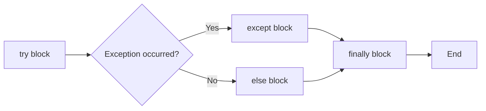
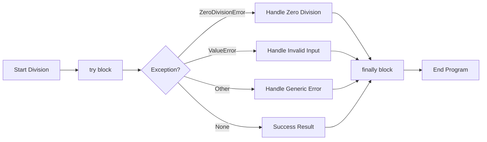
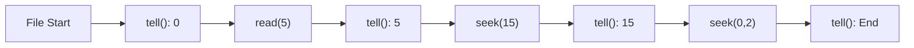
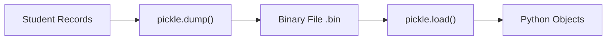
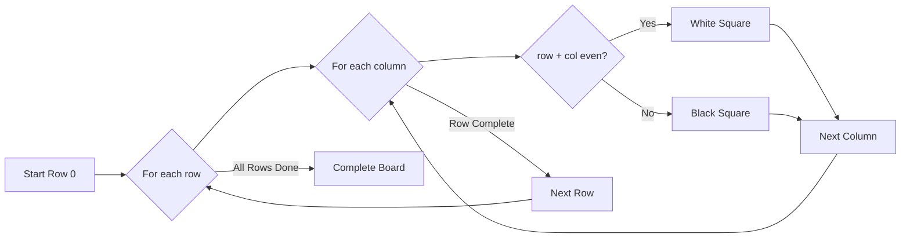
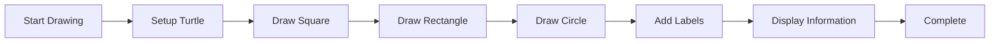

## Question 1(a) [3 marks]

**Give the difference between Set and Dictionary in python.**

**Answer**:

| **Feature** | **Set** | **Dictionary** |
|-------------|---------|----------------|
| **Data Storage** | Stores unique elements only | Stores key-value pairs |
| **Order** | Unordered collection | Ordered (Python 3.7+) |
| **Duplicates** | No duplicates allowed | Keys must be unique |
| **Access** | Cannot access by index | Access values by keys |
| **Syntax** | `{1, 2, 3}` | `{'key': 'value'}` |

- **Set**: Collection of unique, unordered elements
- **Dictionary**: Collection of key-value pairs with unique keys

**Mnemonic:** "Sets are Unique, Dicts have Keys"

## Question 1(b) [4 marks]

**Explain List in Python with example.**

**Answer**:

**List** is an ordered, mutable collection that can store different data types.

**Table of List Operations:**

| **Operation** | **Syntax** | **Example** |
|---------------|------------|-------------|
| **Create** | `list_name = []` | `fruits = ['apple', 'banana']` |
| **Access** | `list[index]` | `fruits[0]` returns 'apple' |
| **Add** | `append()` | `fruits.append('orange')` |
| **Remove** | `remove()` | `fruits.remove('apple')` |

```python
# Example
numbers = [1, 2, 3, 4, 5]
numbers.append(6)  # [1, 2, 3, 4, 5, 6]
print(numbers[0])  # Output: 1
```

- **Ordered**: Elements maintain their position
- **Mutable**: Can be modified after creation
- **Flexible**: Stores any data type

**Mnemonic:** "Lists are Ordered and Modifiable"

## Question 1(c) [7 marks]

**What is Tuple in Python? Write a Python program to swap two tuple values.**

**Answer**:

**Tuple** is an ordered, immutable collection that stores multiple items.

**Table of Tuple Features:**

| **Property** | **Description** | **Example** |
|--------------|-----------------|-------------|
| **Immutable** | Cannot change after creation | `t = (1, 2, 3)` |
| **Ordered** | Elements have defined order | Access by index |
| **Duplicates** | Allows duplicate values | `(1, 1, 2)` |
| **Indexing** | Access elements by position | `t[0]` |

```python
# Program to swap two tuple values
def swap_tuple_values(tup, pos1, pos2):
    # Convert tuple to list for swapping
    temp_list = list(tup)
    
    # Swap values
    temp_list[pos1], temp_list[pos2] = temp_list[pos2], temp_list[pos1]
    
    # Convert back to tuple
    return tuple(temp_list)

# Example usage
original_tuple = (10, 20, 30, 40, 50)
print("Original tuple:", original_tuple)

# Swap values at positions 1 and 3
swapped_tuple = swap_tuple_values(original_tuple, 1, 3)
print("After swapping:", swapped_tuple)
```

- **Immutable**: Cannot modify once created
- **Ordered**: Maintains element sequence
- **Heterogeneous**: Can store different data types

**Mnemonic:** "Tuples are Immutable and Ordered"

## Question 1(c OR) [7 marks]

**What is Dictionary in Python? Write a Python program to traverse a dictionary using loop.**

**Answer**:

**Dictionary** is an unordered collection of key-value pairs with unique keys.

**Table of Dictionary Methods:**

| **Method** | **Purpose** | **Example** |
|------------|-------------|-------------|
| **keys()** | Get all keys | `dict.keys()` |
| **values()** | Get all values | `dict.values()` |
| **items()** | Get key-value pairs | `dict.items()` |
| **get()** | Safe key access | `dict.get('key')` |

```python
# Program to traverse dictionary using loops
student_marks = {
    'Alice': 85,
    'Bob': 92,
    'Charlie': 78,
    'Diana': 96,
    'Eve': 89
}

print("Dictionary Traversal Methods:")
print("-" * 30)

# Method 1: Traverse keys only
print("1. Keys only:")
for key in student_marks:
    print(f"   {key}")

# Method 2: Traverse values only
print("\n2. Values only:")
for value in student_marks.values():
    print(f"   {value}")

# Method 3: Traverse key-value pairs
print("\n3. Key-Value pairs:")
for key, value in student_marks.items():
    print(f"   {key}: {value}")

# Method 4: Using keys() method
print("\n4. Using keys() method:")
for key in student_marks.keys():
    print(f"   {key} scored {student_marks[key]}")
```

- **Key-Value storage**: Each key maps to a value
- **Unique keys**: No duplicate keys allowed
- **Fast lookup**: O(1) average time complexity

**Mnemonic:** "Dicts map Keys to Values"

## Question 2(a) [3 marks]

**What is Package? List out advantages of using Package.**

**Answer**:

**Package** is a directory containing multiple modules organized together.

**Table of Package Advantages:**

| **Advantage** | **Description** |
|---------------|-----------------|
| **Organization** | Groups related modules together |
| **Namespace** | Avoids naming conflicts |
| **Reusability** | Code can be reused across projects |
| **Maintainability** | Easier to manage large codebases |
| **Distribution** | Easy to share and install |

- **Modular structure**: Better code organization
- **Hierarchical namespace**: Prevents name conflicts
- **Code reuse**: Promotes software reusability

**Mnemonic:** "Packages Organize Related Modules"

## Question 2(b) [4 marks]

**Explain any two package import method with example.**

**Answer**:

**Table of Import Methods:**

| **Method** | **Syntax** | **Usage** |
|------------|------------|-----------|
| **Normal Import** | `import package.module` | Access with full path |
| **From Import** | `from package import module` | Direct module access |
| **Specific Import** | `from package.module import function` | Import specific items |
| **Wildcard Import** | `from package import *` | Import all modules |

```python
# Method 1: Normal Import
import mypackage.calculator
result = mypackage.calculator.add(5, 3)
print(f"Normal import result: {result}")

# Method 2: From Import
from mypackage import calculator
result = calculator.multiply(4, 6)
print(f"From import result: {result}")
```

- **Normal import**: Requires full package path
- **From import**: Allows direct module access
- **Specific function import**: Import only needed functions

**Mnemonic:** "Import Normally or From Package"

## Question 2(c) [7 marks]

**Explain about intra-package reference with example.**

**Answer**:

**Intra-package reference** allows modules within a package to import from each other.

**Diagram of Package Structure:**

```goat
mypackage/
├── __init__.py
├── math_ops/
│   ├── __init__.py
│   ├── basic.py
│   └── advanced.py
└── utils/
    ├── __init__.py
    └── helpers.py
```

**Table of Reference Types:**

| **Type** | **Syntax** | **Usage** |
|----------|------------|-----------|
| **Absolute** | `from mypackage.math_ops import basic` | Full path from package root |
| **Relative** | `from . import basic` | Current package |
| **Parent** | `from .. import utils` | Parent package |
| **Sibling** | `from ..utils import helpers` | Sibling package |

```python
# Package structure example
# mypackage/math_ops/advanced.py
from . import basic  # Relative import from same package
from ..utils import helpers  # Import from sibling package

def power_operation(base, exp):
    # Using function from basic module
    if basic.is_valid_number(base) and basic.is_valid_number(exp):
        result = base ** exp
        # Using helper function
        return helpers.format_result(result)
    return None

# mypackage/math_ops/basic.py
def is_valid_number(num):
    return isinstance(num, (int, float))

def add(a, b):
    return a + b

# mypackage/utils/helpers.py
def format_result(value):
    return f"Result: {value:.2f}"
```

- **Relative imports**: Use dots (.) for current package
- **Absolute imports**: Full package path
- **Package hierarchy**: Navigate using dot notation

**Mnemonic:** "Dots Navigate Package Levels"

## Question 2(a OR) [3 marks]

**What is Module? List out advantages of using Module.**

**Answer**:

**Module** is a Python file containing definitions, statements, and functions.

**Table of Module Advantages:**

| **Advantage** | **Description** |
|---------------|-----------------|
| **Code Reusability** | Write once, use multiple times |
| **Namespace** | Separate namespace for functions |
| **Organization** | Better code structure |
| **Maintainability** | Easier to debug and update |
| **Collaboration** | Multiple developers can work |

- **Reusable code**: Functions can be imported anywhere
- **Modular design**: Break large programs into smaller parts
- **Easy maintenance**: Changes in one place affect all imports

**Mnemonic:** "Modules Make Code Reusable"

## Question 2(b OR) [4 marks]

**Explain any two module import method with example.**

**Answer**:

**Table of Module Import Methods:**

| **Method** | **Syntax** | **Access Pattern** |
|------------|------------|-------------------|
| **Direct Import** | `import module_name` | `module_name.function()` |
| **From Import** | `from module_name import function` | `function()` |
| **Alias Import** | `import module_name as alias` | `alias.function()` |
| **Wildcard Import** | `from module_name import *` | `function()` |

```python
# Method 1: Direct Import
import math
result1 = math.sqrt(16)
print(f"Direct import: {result1}")

# Method 2: From Import
from math import pi, sin
result2 = sin(pi/2)
print(f"From import: {result2}")
```

- **Direct import**: Access with module name prefix
- **From import**: Direct function access without prefix
- **Namespace control**: Choose appropriate import method

**Mnemonic:** "Import Directly or From Module"

## Question 2(c OR) [7 marks]

**Write a program to define a module to find the area and circumference of a circle.**

**Answer**:

```python
# circle_operations.py (Module file)
import math

def area(radius):
    """Calculate area of circle"""
    if radius <= 0:
        return 0
    return math.pi * radius * radius

def circumference(radius):
    """Calculate circumference of circle"""
    if radius <= 0:
        return 0
    return 2 * math.pi * radius

def display_info(radius):
    """Display circle information"""
    print(f"Circle with radius: {radius}")
    print(f"Area: {area(radius):.2f}")
    print(f"Circumference: {circumference(radius):.2f}")

# Constants
PI = math.pi

# a) Import the module to another program
# main_program.py
import circle_operations

radius = 5
print("Method 1: Import entire module")
area_result = circle_operations.area(radius)
circumference_result = circle_operations.circumference(radius)

print(f"Area: {area_result:.2f}")
print(f"Circumference: {circumference_result:.2f}")

# b) Import specific function from module
# specific_import.py
from circle_operations import area, circumference

radius = 7
print("\nMethod 2: Import specific functions")
area_result = area(radius)
circumference_result = circumference(radius)

print(f"Area: {area_result:.2f}")
print(f"Circumference: {circumference_result:.2f}")
```

**Table of Module Features:**

| **Feature** | **Implementation** |
|-------------|-------------------|
| **Functions** | area(), circumference() |
| **Error Handling** | Check for negative radius |
| **Constants** | PI value |
| **Documentation** | Function docstrings |

- **Module creation**: Save functions in .py file
- **Import flexibility**: Whole module or specific functions
- **Code reuse**: Use same functions in multiple programs

**Mnemonic:** "Modules Contain Reusable Functions"

## Question 3(a) [3 marks]

**Explain the types of error in Python.**

**Answer**:

**Table of Python Error Types:**

| **Error Type** | **Description** | **Example** |
|----------------|-----------------|-------------|
| **Syntax Error** | Wrong Python syntax | Missing colon `:` |
| **Runtime Error** | Occurs during execution | Division by zero |
| **Logical Error** | Wrong program logic | Incorrect algorithm |
| **Name Error** | Undefined variable | Using undeclared variable |
| **Type Error** | Wrong data type operation | String + Integer |

- **Syntax errors**: Detected before program runs
- **Runtime errors**: Occur during program execution
- **Logical errors**: Program runs but gives wrong results

**Mnemonic:** "Syntax, Runtime, Logic Errors"

## Question 3(b) [4 marks]

**Explain user-defined exception using raise statement with example.**

**Answer**:

**User-defined exceptions** are custom error classes created by programmers.

**Table of Exception Components:**

| **Component** | **Purpose** | **Example** |
|---------------|-------------|-------------|
| **Class Definition** | Create custom exception | `class CustomError(Exception):` |
| **Raise Statement** | Trigger the exception | `raise CustomError("message")` |
| **Error Message** | Describe the problem | Informative text |
| **Exception Handling** | Catch custom exception | `except CustomError:` |

```python
# Define custom exception
class AgeValidationError(Exception):
    def __init__(self, age, message="Invalid age provided"):
        self.age = age
        self.message = message
        super().__init__(self.message)

def validate_age(age):
    if age < 0:
        raise AgeValidationError(age, "Age cannot be negative")
    elif age > 150:
        raise AgeValidationError(age, "Age cannot exceed 150")
    else:
        print(f"Valid age: {age}")

# Using the custom exception
try:
    validate_age(-5)
except AgeValidationError as e:
    print(f"Error: {e.message}, Age: {e.age}")
```

- **Custom exception class**: Inherits from Exception
- **Raise statement**: Manually trigger exceptions
- **Meaningful messages**: Help debug problems

**Mnemonic:** "Raise Custom Exceptions for Validation"

## Question 3(c) [7 marks]

**Explain try-except-finally clause with example.**

**Answer**:

**Try-except-finally** provides complete exception handling mechanism.

**Table of Exception Handling Blocks:**

| **Block** | **Purpose** | **Execution** |
|-----------|-------------|---------------|
| **try** | Code that might raise exception | Always executed first |
| **except** | Handle specific exceptions | Only if exception occurs |
| **else** | Code when no exception | Only if no exception |
| **finally** | Cleanup code | Always executed |

```python
# Complete exception handling example
def divide_numbers():
    try:
        print("Starting division operation...")
        
        # Get input from user
        num1 = float(input("Enter first number: "))
        num2 = float(input("Enter second number: "))
        
        # Perform division
        result = num1 / num2
        
    except ValueError:
        print("Error: Please enter valid numbers only")
        return None
        
    except ZeroDivisionError:
        print("Error: Cannot divide by zero")
        return None
        
    except Exception as e:
        print(f"Unexpected error occurred: {e}")
        return None
        
    else:
        print(f"Division successful: {num1} ÷ {num2} = {result}")
        return result
        
    finally:
        print("Division operation completed")
        print("Cleaning up resources...")

# Example usage
result = divide_numbers()
if result:
    print(f"Final result: {result}")
```

**Flow Diagram:**



- **try**: Contains risky code
- **except**: Handles specific errors
- **finally**: Always executes for cleanup

**Mnemonic:** "Try-Except-Finally Always Cleans"

## Question 3(a OR) [3 marks]

**What is built-in exception? List out any two with their meaning.**

**Answer**:

**Built-in exceptions** are predefined error types in Python.

**Table of Built-in Exceptions:**

| **Exception** | **Meaning** | **Example** |
|---------------|-------------|-------------|
| **ValueError** | Invalid value for correct type | `int("abc")` |
| **TypeError** | Wrong data type operation | `"5" + 5` |
| **IndexError** | List index out of range | `list[10]` for 5-item list |
| **KeyError** | Dictionary key not found | `dict["missing_key"]` |
| **ZeroDivisionError** | Division by zero | `10 / 0` |

**Two Main Built-in Exceptions:**

- **ValueError**: Occurs when function receives correct type but invalid value
- **TypeError**: Occurs when operation performed on inappropriate data type

**Mnemonic:** "Built-in Exceptions Handle Common Errors"

## Question 3(b OR) [4 marks]

**Explain try-except clause with example.**

**Answer**:

**Try-except** handles exceptions that might occur during program execution.

**Table of Exception Handling:**

| **Component** | **Purpose** | **Syntax** |
|---------------|-------------|------------|
| **try** | Code that might fail | `try:` |
| **except** | Handle specific exception | `except ErrorType:` |
| **Multiple except** | Handle different errors | Multiple except blocks |
| **General except** | Catch any exception | `except:` |

```python
# Example of try-except clause
def safe_division():
    try:
        # Code that might raise exceptions
        dividend = int(input("Enter dividend: "))
        divisor = int(input("Enter divisor: "))
        
        result = dividend / divisor
        print(f"Result: {dividend} ÷ {divisor} = {result}")
        
    except ValueError:
        print("Error: Please enter valid integers only")
        
    except ZeroDivisionError:
        print("Error: Cannot divide by zero")
        
    except Exception as e:
        print(f"An unexpected error occurred: {e}")
    
    print("Program continues after exception handling")

# Example usage
safe_division()
```

- **try block**: Contains potentially risky code
- **except block**: Handles specific exception types
- **Multiple handlers**: Different exceptions handled differently

**Mnemonic:** "Try Risky Code, Except Handles Errors"

## Question 3(c OR) [7 marks]

**Write a program to catch on Divide by zero Exception with finally clause.**

**Answer**:

```python
# Program to handle divide by zero with finally clause
def advanced_calculator():
    """Calculator with comprehensive exception handling"""
    
    try:
        print("=== Advanced Calculator ===")
        print("Enter two numbers for division")
        
        # Input section
        numerator = float(input("Enter numerator: "))
        denominator = float(input("Enter denominator: "))
        
        print(f"\nAttempting to divide {numerator} by {denominator}...")
        
        # Critical operation that might fail
        if denominator == 0:
            raise ZeroDivisionError("Division by zero is not allowed")
        
        result = numerator / denominator
        
        # Success message
        print(f"✓ Division successful!")
        print(f"✓ Result: {numerator} ÷ {denominator} = {result:.4f}")
        
        return result
        
    except ZeroDivisionError as zde:
        print(f"✗ Zero Division Error: {zde}")
        print("✗ Please use a non-zero denominator")
        return None
        
    except ValueError as ve:
        print(f"✗ Value Error: Invalid input provided")
        print("✗ Please enter numeric values only")
        return None
        
    except Exception as e:
        print(f"✗ Unexpected error: {e}")
        return None
        
    finally:
        print("\n" + "="*40)
        print("CLEANUP OPERATIONS:")
        print("- Closing calculator session")
        print("- Saving operation log")
        print("- Releasing memory resources")
        print("- Calculator shutdown complete")
        print("="*40)

# Example usage with multiple test cases
def test_calculator():
    """Test the calculator with different scenarios"""
    
    test_cases = [
        (10, 2),    # Normal division
        (15, 0),    # Zero division
        (7, 3),     # Normal division with decimal
    ]
    
    for i, (num, den) in enumerate(test_cases, 1):
        print(f"\n--- Test Case {i} ---")
        print(f"Testing: {num} ÷ {den}")
        
        # Simulate user input (in real scenario, this would be interactive)
        # This is just for demonstration
        print(f"Simulating division of {num} by {den}")
        
        try:
            if den == 0:
                raise ZeroDivisionError("Cannot divide by zero")
            result = num / den
            print(f"Result: {result}")
        except ZeroDivisionError as e:
            print(f"Error caught: {e}")
        finally:
            print("Test case completed")

# Run the calculator
if __name__ == "__main__":
    result = advanced_calculator()
    
    if result is not None:
        print(f"\nFinal calculated result: {result}")
    else:
        print("\nCalculation failed due to errors")
```

**Table of Exception Handling Features:**

| **Feature** | **Implementation** |
|-------------|-------------------|
| **ZeroDivisionError** | Specific handling for division by zero |
| **ValueError** | Handle invalid input types |
| **Generic Exception** | Catch unexpected errors |
| **Finally Block** | Always execute cleanup code |

**Exception Handling Flow:**



- **Specific exception handling**: ZeroDivisionError caught separately
- **Finally clause**: Always executes for cleanup
- **Resource management**: Proper cleanup regardless of errors

**Mnemonic:** "Finally Always Cleans Up Resources"

## Question 4(a) [3 marks]

**Define: File, Binary File, Text File**

**Answer**:

**Table of File Definitions:**

| **Term** | **Definition** | **Example** |
|----------|----------------|-------------|
| **File** | Named storage location on disk | document.txt, image.jpg |
| **Binary File** | Contains non-text data in binary format | .exe, .jpg, .mp3, .pdf |
| **Text File** | Contains human-readable text characters | .txt, .py, .html, .csv |

**Detailed Definitions:**

- **File**: A collection of data stored on storage device with a unique name
- **Binary File**: Stores data in binary format (0s and 1s), not human-readable
- **Text File**: Contains ASCII or Unicode characters, human-readable format

**Mnemonic:** "Files store data, Binary=Machine, Text=Human"

## Question 4(b) [4 marks]

**Explain write() and writelines() function with example.**

**Answer**:

**Table of Write Functions:**

| **Function** | **Purpose** | **Parameter** | **Usage** |
|--------------|-------------|---------------|-----------|
| **write()** | Write single string | String | `file.write("Hello")` |
| **writelines()** | Write list of strings | List/Sequence | `file.writelines(["line1", "line2"])` |

```python
# Example demonstrating write() and writelines()
def demonstrate_write_functions():
    
    # Using write() function
    with open("write_demo.txt", "w") as file:
        file.write("Hello World!\n")
        file.write("This is line 2\n")
        file.write("This is line 3\n")
    
    # Using writelines() function
    lines = [
        "First line using writelines\n",
        "Second line using writelines\n", 
        "Third line using writelines\n"
    ]
    
    with open("writelines_demo.txt", "w") as file:
        file.writelines(lines)
    
    print("Files created successfully!")

# Run the demonstration
demonstrate_write_functions()
```

**Key Differences:**

- **write()**: Writes one string at a time
- **writelines()**: Writes multiple strings from a sequence
- **Newlines**: Must be added manually with `\n`
- **Return value**: Both return number of characters written

**Mnemonic:** "write() Single, writelines() Multiple"

## Question 4(c) [7 marks]

**Explain tell() and seek() function with example.**

**Answer**:

**File pointer functions** control position within a file for reading/writing.

**Table of Position Functions:**

| **Function** | **Purpose** | **Return/Parameter** | **Usage** |
|--------------|-------------|---------------------|-----------|
| **tell()** | Get current position | Returns current byte position | `pos = file.tell()` |
| **seek(offset, whence)** | Move to specific position | offset: bytes, whence: reference | `file.seek(10, 0)` |

**Seek Whence Values:**

| **Value** | **Reference Point** | **Description** |
|-----------|-------------------|-----------------|
| **0** | Beginning of file | Absolute positioning |
| **1** | Current position | Relative to current |
| **2** | End of file | Relative to end |

```python
# Complete example of tell() and seek() functions
def demonstrate_file_positioning():
    
    # Create a sample file
    sample_text = "Hello World! This is a sample file for demonstrating tell() and seek() functions."
    
    with open("position_demo.txt", "w") as file:
        file.write(sample_text)
    
    # Demonstrate tell() and seek()
    with open("position_demo.txt", "r") as file:
        
        # Initial position
        print(f"1. Initial position: {file.tell()}")
        
        # Read first 5 characters
        data1 = file.read(5)
        print(f"2. Read '{data1}', current position: {file.tell()}")
        
        # Move to position 15
        file.seek(15)
        print(f"3. After seek(15), position: {file.tell()}")
        
        # Read next 10 characters
        data2 = file.read(10)
        print(f"4. Read '{data2}', current position: {file.tell()}")
        
        # Move to beginning using seek(0, 0)
        file.seek(0, 0)
        print(f"5. After seek(0,0), position: {file.tell()}")
        
        # Move to end using seek(0, 2)
        file.seek(0, 2)
        print(f"6. After seek(0,2), position: {file.tell()}")
        
        # Move backward from current position
        file.seek(-10, 1)
        print(f"7. After seek(-10,1), position: {file.tell()}")
        
        # Read remaining content
        remaining = file.read()
        print(f"8. Remaining content: '{remaining}'")

# Example with binary file
def binary_file_positioning():
    
    # Create binary file
    data = b"Binary file positioning example"
    
    with open("binary_demo.bin", "wb") as file:
        file.write(data)
    
    # Read with positioning
    with open("binary_demo.bin", "rb") as file:
        print(f"\nBinary file position: {file.tell()}")
        
        # Read first 6 bytes
        chunk1 = file.read(6)
        print(f"Read: {chunk1}, position: {file.tell()}")
        
        # Jump to position 20
        file.seek(20)
        chunk2 = file.read(7)
        print(f"Read: {chunk2}, position: {file.tell()}")

# Run demonstrations
demonstrate_file_positioning()
binary_file_positioning()
```

**Position Control Diagram:**



- **tell()**: Returns current byte position in file
- **seek()**: Moves file pointer to specified position
- **Positioning**: Essential for random file access
- **Binary mode**: Works with byte positions

**Mnemonic:** "tell() Position, seek() Movement"

## Question 4(a OR) [3 marks]

**What is Absolute and Relative file path?**

**Answer**:

**Table of Path Types:**

| **Path Type** | **Description** | **Example** |
|---------------|-----------------|-------------|
| **Absolute Path** | Complete path from root directory | `/home/user/documents/file.txt` |
| **Relative Path** | Path relative to current directory | `../documents/file.txt` |

**Path Symbols:**

| **Symbol** | **Meaning** | **Example** |
|------------|-------------|-------------|
| **/** | Root directory (Linux/Mac) | `/home/user/` |
| **C:\\** | Drive letter (Windows) | `C:\\Users\\Documents\\` |
| **.** | Current directory | `./file.txt` |
| **..** | Parent directory | `../folder/file.txt` |

- **Absolute**: Complete path from system root
- **Relative**: Path from current working directory

**Mnemonic:** "Absolute from Root, Relative from Current"

## Question 4(b OR) [4 marks]

**Explain about various mode to open binary and text file.**

**Answer**:

**Table of File Opening Modes:**

| **Mode** | **Type** | **Purpose** | **File Pointer** |
|----------|----------|-------------|------------------|
| **'r'** | Text | Read only | Beginning |
| **'w'** | Text | Write (overwrites) | Beginning |
| **'a'** | Text | Append | End |
| **'rb'** | Binary | Read binary | Beginning |
| **'wb'** | Binary | Write binary | Beginning |
| **'ab'** | Binary | Append binary | End |
| **'r+'** | Text | Read and write | Beginning |
| **'w+'** | Text | Write and read | Beginning |

```python
# Examples of different file modes
def demonstrate_file_modes():
    
    # Text file modes
    with open("text_file.txt", "w") as f:  # Write mode
        f.write("Hello World")
    
    with open("text_file.txt", "r") as f:  # Read mode
        content = f.read()
        print(f"Text content: {content}")
    
    # Binary file modes
    data = b"Binary data example"
    with open("binary_file.bin", "wb") as f:  # Write binary
        f.write(data)
    
    with open("binary_file.bin", "rb") as f:  # Read binary
        binary_content = f.read()
        print(f"Binary content: {binary_content}")

demonstrate_file_modes()
```

- **Text modes**: Handle string data with encoding
- **Binary modes**: Handle raw bytes without encoding
- **Plus modes**: Allow both reading and writing

**Mnemonic:** "Text for Strings, Binary for Bytes"

## Question 4(c OR) [7 marks]

**Write a Python program to write student's subject record like branch name, semester, subject code and subject name in the binary file.**

**Answer**:

```python
import pickle
import os

class StudentSubjectRecord:
    """Class to handle student subject records"""
    
    def __init__(self, branch_name, semester, subject_code, subject_name):
        self.branch_name = branch_name
        self.semester = semester
        self.subject_code = subject_code
        self.subject_name = subject_name
    
    def __str__(self):
        return f"Branch: {self.branch_name}, Semester: {self.semester}, Code: {self.subject_code}, Subject: {self.subject_name}"

def write_student_records():
    """Write student records to binary file"""
    
    # Sample student records
    records = [
        StudentSubjectRecord("Information Technology", 2, "4321602", "Advanced Python Programming"),
        StudentSubjectRecord("Information Technology", 2, "4321601", "Database Management System"),
        StudentSubjectRecord("Computer Engineering", 3, "4330701", "Data Structure"),
        StudentSubjectRecord("Information Technology", 2, "4321603", "Web Development"),
        StudentSubjectRecord("Computer Engineering", 3, "4330702", "Computer Networks")
    ]
    
    # Write records to binary file using pickle
    try:
        with open("student_records.bin", "wb") as binary_file:
            pickle.dump(records, binary_file)
        
        print("✓ Student records written to binary file successfully!")
        print(f"✓ Total records written: {len(records)}")
        
    except Exception as e:
        print(f"✗ Error writing to binary file: {e}")

def read_student_records():
    """Read student records from binary file"""
    
    try:
        if not os.path.exists("student_records.bin"):
            print("✗ Binary file not found!")
            return
        
        with open("student_records.bin", "rb") as binary_file:
            records = pickle.load(binary_file)
        
        print("\n" + "="*60)
        print("STUDENT SUBJECT RECORDS FROM BINARY FILE")
        print("="*60)
        
        for i, record in enumerate(records, 1):
            print(f"{i}. {record}")
        
        print("="*60)
        print(f"Total records read: {len(records)}")
        
    except Exception as e:
        print(f"✗ Error reading from binary file: {e}")

def add_new_record():
    """Add new student record to existing binary file"""
    
    try:
        # Read existing records
        records = []
        if os.path.exists("student_records.bin"):
            with open("student_records.bin", "rb") as binary_file:
                records = pickle.load(binary_file)
        
        # Get new record details
        print("\nEnter new student record details:")
        branch = input("Branch Name: ")
        semester = int(input("Semester: "))
        code = input("Subject Code: ")
        subject = input("Subject Name: ")
        
        # Create new record
        new_record = StudentSubjectRecord(branch, semester, code, subject)
        records.append(new_record)
        
        # Write back to file
        with open("student_records.bin", "wb") as binary_file:
            pickle.dump(records, binary_file)
        
        print("✓ New record added successfully!")
        
    except Exception as e:
        print(f"✗ Error adding new record: {e}")

def search_records_by_branch(branch_name):
    """Search records by branch name"""
    
    try:
        if not os.path.exists("student_records.bin"):
            print("✗ Binary file not found!")
            return
        
        with open("student_records.bin", "rb") as binary_file:
            records = pickle.load(binary_file)
        
        # Filter records by branch
        filtered_records = [record for record in records 
                          if record.branch_name.lower() == branch_name.lower()]
        
        if filtered_records:
            print(f"\nRecords for {branch_name}:")
            print("-" * 40)
            for record in filtered_records:
                print(f"  {record}")
        else:
            print(f"No records found for branch: {branch_name}")
            
    except Exception as e:
        print(f"✗ Error searching records: {e}")

# Main program execution
def main():
    """Main function to demonstrate binary file operations"""
    
    print("=== STUDENT SUBJECT RECORD MANAGEMENT ===\n")
    
    # Write initial records
    print("1. Writing student records to binary file...")
    write_student_records()
    
    # Read and display records
    print("\n2. Reading records from binary file...")
    read_student_records()
    
    # Search by branch
    print("\n3. Searching records by branch...")
    search_records_by_branch("Information Technology")
    
    # Display file information
    if os.path.exists("student_records.bin"):
        file_size = os.path.getsize("student_records.bin")
        print(f"\nBinary file size: {file_size} bytes")

# Execute the program
if __name__ == "__main__":
    main()
```

**Table of Binary File Operations:**

| **Operation** | **Method** | **Purpose** |
|---------------|------------|-------------|
| **Write** | `pickle.dump()` | Serialize objects to binary |
| **Read** | `pickle.load()` | Deserialize objects from binary |
| **Append** | Read + Add + Write | Add new records |
| **Search** | Filter loaded data | Find specific records |

**Binary File Structure:**



- **Binary storage**: Uses pickle for object serialization
- **Efficient storage**: Compact binary format
- **Object preservation**: Maintains data structure integrity
- **Cross-platform**: Works on different operating systems

**Mnemonic:** "Pickle Preserves Python Objects"

## Question 5(a) [3 marks]

**Define: GUI, CLI**

**Answer**:

**Table of Interface Definitions:**

| **Term** | **Full Form** | **Description** | **Example** |
|----------|---------------|-----------------|-------------|
| **GUI** | Graphical User Interface | Visual interface with windows, buttons, icons | Windows, Mac desktop |
| **CLI** | Command Line Interface | Text-based interface using commands | Terminal, Command Prompt |

**Key Differences:**

- **GUI**: User-friendly, mouse-driven, visual elements
- **CLI**: Text-based, keyboard-driven, command syntax
- **Interaction**: GUI uses clicks, CLI uses typed commands

**Mnemonic:** "GUI Graphics, CLI Commands"

## Question 5(b) [4 marks]

**Write a Python program to draw square shape using for and while loop using Turtle.**

**Answer**:

```python
import turtle

def draw_square_with_for_loop():
    """Draw square using for loop"""
    
    # Setup turtle
    screen = turtle.Screen()
    screen.bgcolor("white")
    square_turtle = turtle.Turtle()
    square_turtle.color("blue")
    square_turtle.pensize(3)
    
    # Draw square using for loop
    print("Drawing square with for loop...")
    side_length = 100
    
    for i in range(4):
        square_turtle.forward(side_length)
        square_turtle.right(90)
    
    square_turtle.penup()
    square_turtle.goto(150, 0)
    square_turtle.pendown()
    
    return square_turtle

def draw_square_with_while_loop(turtle_obj):
    """Draw square using while loop"""
    
    # Change color for second square
    turtle_obj.color("red")
    
    # Draw square using while loop
    print("Drawing square with while loop...")
    side_length = 100
    sides_drawn = 0
    
    while sides_drawn < 4:
        turtle_obj.forward(side_length)
        turtle_obj.right(90)
        sides_drawn += 1
    
    # Move turtle to center for text
    turtle_obj.penup()
    turtle_obj.goto(-50, -150)
    turtle_obj.write("Blue: for loop, Red: while loop", 
                    font=("Arial", 12, "normal"))

# Main execution
def main():
    # Draw squares
    turtle_obj = draw_square_with_for_loop()
    draw_square_with_while_loop(turtle_obj)
    
    # Keep window open
    turtle.Screen().exitonclick()

# Run the program
main()
```

**Table of Loop Comparison:**

| **Loop Type** | **Structure** | **Usage** | **Control** |
|---------------|---------------|-----------|-------------|
| **for loop** | `for i in range(4):` | Known iterations | Counter-based |
| **while loop** | `while condition:` | Conditional iterations | Condition-based |

- **for loop**: Best for known number of iterations
- **while loop**: Best for condition-based repetition
- **Both achieve**: Same square drawing result

**Mnemonic:** "For Count, While Condition"

## Question 5(c) [7 marks]

**Write a Python program to draw a chessboard using Turtle.**

**Answer**:

```python
import turtle

def setup_chessboard():
    """Setup turtle screen and properties for chessboard"""
    
    screen = turtle.Screen()
    screen.bgcolor("white")
    screen.title("Chessboard using Python Turtle")
    screen.setup(width=600, height=600)
    
    # Create turtle for drawing
    chess_turtle = turtle.Turtle()
    chess_turtle.speed(0)  # Fastest speed
    chess_turtle.penup()
    
    return screen, chess_turtle

def draw_square(turtle_obj, size, fill_color):
    """Draw a single square with given color"""
    
    turtle_obj.pendown()
    turtle_obj.fillcolor(fill_color)
    turtle_obj.begin_fill()
    
    # Draw square
    for _ in range(4):
        turtle_obj.forward(size)
        turtle_obj.right(90)
    
    turtle_obj.end_fill()
    turtle_obj.penup()

def draw_chessboard():
    """Draw complete 8x8 chessboard"""
    
    screen, chess_turtle = setup_chessboard()
    
    # Chessboard parameters
    square_size = 40
    board_size = 8
    start_x = -160
    start_y = 160
    
    print("Drawing chessboard...")
    
    # Draw the board
    for row in range(board_size):
        for col in range(board_size):
            
            # Calculate position
            x = start_x + (col * square_size)
            y = start_y - (row * square_size)
            
            # Move turtle to position
            chess_turtle.goto(x, y)
            
            # Determine square color (alternating pattern)
            if (row + col) % 2 == 0:
                color = "white"
            else:
                color = "black"
            
            # Draw the square
            draw_square(chess_turtle, square_size, color)
    
    # Add border around chessboard
    draw_border(chess_turtle, start_x, start_y, square_size, board_size)
    
    # Add labels
    add_chessboard_labels(chess_turtle, start_x, start_y, square_size, board_size)
    
    return screen

def draw_border(turtle_obj, start_x, start_y, square_size, board_size):
    """Draw border around the chessboard"""
    
    turtle_obj.goto(start_x - 5, start_y + 5)
    turtle_obj.pencolor("brown")
    turtle_obj.pensize(3)
    turtle_obj.pendown()
    
    # Draw border rectangle
    border_width = board_size * square_size + 10
    border_height = board_size * square_size + 10
    
    for _ in range(2):
        turtle_obj.forward(border_width)
        turtle_obj.right(90)
        turtle_obj.forward(border_height)
        turtle_obj.right(90)
    
    turtle_obj.penup()
    turtle_obj.pensize(1)
    turtle_obj.pencolor("black")

def add_chessboard_labels(turtle_obj, start_x, start_y, square_size, board_size):
    """Add row and column labels to chessboard"""
    
    turtle_obj.color("blue")
    
    # Column labels (A-H)
    columns = ['A', 'B', 'C', 'D', 'E', 'F', 'G', 'H']
    for i, letter in enumerate(columns):
        x = start_x + (i * square_size) + (square_size // 2)
        y = start_y - (board_size * square_size) - 20
        turtle_obj.goto(x, y)
        turtle_obj.write(letter, align="center", font=("Arial", 12, "bold"))
    
    # Row labels (1-8)
    for i in range(board_size):
        x = start_x - 20
        y = start_y - (i * square_size) - (square_size // 2)
        turtle_obj.goto(x, y)
        turtle_obj.write(str(8-i), align="center", font=("Arial", 12, "bold"))
    
    # Title
    turtle_obj.goto(0, start_y + 30)
    turtle_obj.write("Python Turtle Chessboard", align="center", 
                    font=("Arial", 16, "bold"))

def draw_enhanced_chessboard_with_pieces():
    """Enhanced version with some chess piece indicators"""
    
    screen = draw_chessboard()
    
    # Create new turtle for pieces
    piece_turtle = turtle.Turtle()
    piece_turtle.speed(0)
    piece_turtle.penup()
    
    # Add some piece symbols (simplified)
    pieces = [
        (-120, 120, "♜"), (-80, 120, "♞"), (-40, 120, "♝"), (0, 120, "♛"),
        (-120, -120, "♖"), (-80, -120, "♘"), (-40, -120, "♗"), (0, -120, "♕")
    ]
    
    piece_turtle.color("red")
    for x, y, symbol in pieces:
        piece_turtle.goto(x, y)
        piece_turtle.write(symbol, align="center", font=("Arial", 20, "normal"))
    
    piece_turtle.hideturtle()
    
    # Display statistics
    total_squares = 64
    black_squares = 32
    white_squares = 32
    
    piece_turtle.goto(0, -200)
    piece_turtle.color("green")
    piece_turtle.write(f"Chessboard: {total_squares} squares ({black_squares} black, {white_squares} white)", 
                      align="center", font=("Arial", 12, "normal"))
    
    return screen

# Main execution
def main():
    """Main function to create chessboard"""
    
    print("Creating chessboard with Python Turtle...")
    screen = draw_enhanced_chessboard_with_pieces()
    
    print("Chessboard created successfully!")
    print("Click on the screen to close the window.")
    
    # Keep window open until clicked
    screen.exitonclick()

# Run the program
if __name__ == "__main__":
    main()
```

**Table of Chessboard Components:**

| **Component** | **Implementation** | **Purpose** |
|---------------|--------------------|-------------|
| **Squares** | 8x8 grid alternating colors | Main board pattern |
| **Colors** | Black and white alternating | Traditional chess pattern |
| **Border** | Brown rectangle outline | Frame the board |
| **Labels** | A-H columns, 1-8 rows | Chess notation |
| **Pieces** | Unicode chess symbols | Sample piece placement |

**Chessboard Pattern Logic:**



- **Alternating pattern**: (row + col) % 2 determines color
- **Grid system**: 8x8 squares with precise positioning
- **Visual enhancements**: Border, labels, and sample pieces
- **Scalable design**: Easy to modify square size

**Mnemonic:** "Alternate Colors in Grid Pattern"

## Question 5(a OR) [3 marks]

**How many types of shapes in turtle? Explain any one shape with suitable example.**

**Answer**:

**Table of Turtle Shapes:**

| **Shape Type** | **Examples** | **Method** |
|----------------|--------------|------------|
| **Basic Shapes** | Circle, Square, Triangle | Built-in functions |
| **Line Patterns** | Straight lines, Curves | forward(), backward() |
| **Polygons** | Pentagon, Hexagon, Octagon | Loop with angles |
| **Complex Shapes** | Stars, Spirals, Fractals | Mathematical patterns |
| **Custom Shapes** | User-defined patterns | Combination of moves |

**Circle Shape Example:**

```python
import turtle

def draw_circle_example():
    screen = turtle.Screen()
    circle_turtle = turtle.Turtle()
    
    # Draw circle with radius 50
    circle_turtle.circle(50)
    
    screen.exitonclick()

draw_circle_example()
```

- **Built-in shapes**: Circle, square, triangle readily available
- **Custom shapes**: Created using movement combinations
- **Mathematical shapes**: Use geometry for precise drawing

**Mnemonic:** "Turtle Draws Many Shape Types"

## Question 5(b OR) [4 marks]

**Explain about four basic methods of Turtle module.**

**Answer**:

**Table of Basic Turtle Methods:**

| **Method** | **Purpose** | **Parameters** | **Example** |
|------------|-------------|----------------|-------------|
| **forward(distance)** | Move turtle forward | distance in pixels | `turtle.forward(100)` |
| **backward(distance)** | Move turtle backward | distance in pixels | `turtle.backward(50)` |
| **right(angle)** | Turn turtle right | angle in degrees | `turtle.right(90)` |
| **left(angle)** | Turn turtle left | angle in degrees | `turtle.left(45)` |

```python
import turtle

def demonstrate_basic_methods():
    # Create turtle
    demo_turtle = turtle.Turtle()
    
    # 1. Forward movement
    demo_turtle.forward(100)  # Move 100 pixels forward
    
    # 2. Right turn
    demo_turtle.right(90)     # Turn 90 degrees right
    
    # 3. Backward movement  
    demo_turtle.backward(50)  # Move 50 pixels backward
    
    # 4. Left turn
    demo_turtle.left(135)     # Turn 135 degrees left
    
    turtle.done()

demonstrate_basic_methods()
```

- **Movement methods**: forward() and backward() for distance
- **Rotation methods**: right() and left() for direction changes
- **Coordinate system**: Based on current turtle position and heading
- **Angle measurement**: Degrees (0-360)

**Mnemonic:** "Forward, Backward, Right, Left Basics"

## Question 5(c OR) [7 marks]

**Write a Python program to draw square, rectangle, and circle using Turtle.**

**Answer**:

```python
import turtle
import math

def setup_drawing_environment():
    """Setup turtle screen and drawing environment"""
    
    screen = turtle.Screen()
    screen.bgcolor("lightblue")
    screen.title("Drawing Shapes: Square, Rectangle, Circle")
    screen.setup(width=800, height=600)
    
    # Create main drawing turtle
    shape_turtle = turtle.Turtle()
    shape_turtle.speed(3)
    shape_turtle.pensize(2)
    
    return screen, shape_turtle

def draw_square(turtle_obj, size, color, position):
    """Draw a square with given size and color"""
    
    x, y = position
    turtle_obj.penup()
    turtle_obj.goto(x, y)
    turtle_obj.pendown()
    
    turtle_obj.color(color)
    turtle_obj.fillcolor(color)
    turtle_obj.begin_fill()
    
    # Draw square using 4 equal sides
    for _ in range(4):
        turtle_obj.forward(size)
        turtle_obj.right(90)
    
    turtle_obj.end_fill()
    
    # Add label
    turtle_obj.penup()
    turtle_obj.goto(x + size//2, y - 30)
    turtle_obj.color("black")
    turtle_obj.write(f"Square ({size}x{size})", align="center", 
                    font=("Arial", 10, "bold"))

def draw_rectangle(turtle_obj, width, height, color, position):
    """Draw a rectangle with given dimensions and color"""
    
    x, y = position
    turtle_obj.penup()
    turtle_obj.goto(x, y)
    turtle_obj.pendown()
    
    turtle_obj.color(color)
    turtle_obj.fillcolor(color)
    turtle_obj.begin_fill()
    
    # Draw rectangle with alternating width and height
    for _ in range(2):
        turtle_obj.forward(width)
        turtle_obj.right(90)
        turtle_obj.forward(height)
        turtle_obj.right(90)
    
    turtle_obj.end_fill()
    
    # Add label
    turtle_obj.penup()
    turtle_obj.goto(x + width//2, y - height - 20)
    turtle_obj.color("black")
    turtle_obj.write(f"Rectangle ({width}x{height})", align="center", 
                    font=("Arial", 10, "bold"))

def draw_circle(turtle_obj, radius, color, position):
    """Draw a circle with given radius and color"""
    
    x, y = position
    turtle_obj.penup()
    turtle_obj.goto(x, y - radius)  # Position at bottom of circle
    turtle_obj.pendown()
    
    turtle_obj.color(color)
    turtle_obj.fillcolor(color)
    turtle_obj.begin_fill()
    
    # Draw circle
    turtle_obj.circle(radius)
    
    turtle_obj.end_fill()
    
    # Add label with area calculation
    area = math.pi * radius * radius
    turtle_obj.penup()
    turtle_obj.goto(x, y - radius - 30)
    turtle_obj.color("black")
    turtle_obj.write(f"Circle (r={radius}, area={area:.1f})", align="center", 
                    font=("Arial", 10, "bold"))

def draw_all_shapes():
    """Main function to draw all three shapes"""
    
    screen, shape_turtle = setup_drawing_environment()
    
    print("Drawing geometric shapes...")
    
    # Draw square
    print("1. Drawing square...")
    draw_square(shape_turtle, 80, "red", (-300, 100))
    
    # Draw rectangle  
    print("2. Drawing rectangle...")
    draw_rectangle(shape_turtle, 120, 80, "green", (-50, 100))
    
    # Draw circle
    print("3. Drawing circle...")
    draw_circle(shape_turtle, 60, "blue", (200, 100))
    
    # Add title and information
    add_shape_information(shape_turtle)
    
    print("All shapes drawn successfully!")
    return screen

def add_shape_information(turtle_obj):
    """Add title and shape information"""
    
    # Title
    turtle_obj.penup()
    turtle_obj.goto(0, 200)
    turtle_obj.color("purple")
    turtle_obj.write("Python Turtle Shapes", align="center", 
                    font=("Arial", 18, "bold"))
    
    # Shape properties table
    turtle_obj.goto(-350, -50)
    turtle_obj.color("black")
    turtle_obj.write("Shape Properties:", font=("Arial", 12, "bold"))
    
    properties = [
        "• Square: 4 equal sides, 4 right angles",
        "• Rectangle: 4 sides, opposite sides equal", 
        "• Circle: All points equidistant from center"
    ]
    
    for i, prop in enumerate(properties):
        turtle_obj.goto(-350, -80 - (i * 20))
        turtle_obj.write(prop, font=("Arial", 10, "normal"))
    
    # Mathematical formulas
    turtle_obj.goto(-350, -170)
    turtle_obj.color("blue")
    turtle_obj.write("Formulas:", font=("Arial", 12, "bold"))
    
    formulas = [
        "• Square area: side²",
        "• Rectangle area: length × width",
        "• Circle area: π × radius²"
    ]
    
    for i, formula in enumerate(formulas):
        turtle_obj.goto(-350, -200 - (i * 20))
        turtle_obj.write(formula, font=("Arial", 10, "normal"))

def interactive_shape_drawer():
    """Enhanced version with user interaction"""
    
    screen, shape_turtle = setup_drawing_environment()
    
    # Get user preferences
    print("\n=== Interactive Shape Drawer ===")
    
    try:
        # Square parameters
        square_size = int(input("Enter square size (50-100): ") or "80")
        square_color = input("Enter square color (red/blue/green): ") or "red"
        
        # Rectangle parameters  
        rect_width = int(input("Enter rectangle width (80-150): ") or "120")
        rect_height = int(input("Enter rectangle height (60-100): ") or "80")
        rect_color = input("Enter rectangle color: ") or "green"
        
        # Circle parameters
        circle_radius = int(input("Enter circle radius (40-80): ") or "60")
        circle_color = input("Enter circle color: ") or "blue"
        
        # Draw shapes with user parameters
        draw_square(shape_turtle, square_size, square_color, (-300, 100))
        draw_rectangle(shape_turtle, rect_width, rect_height, rect_color, (-50, 100))
        draw_circle(shape_turtle, circle_radius, circle_color, (200, 100))
        
        add_shape_information(shape_turtle)
        
    except ValueError:
        print("Invalid input! Using default values...")
        return draw_all_shapes()
    
    return screen

# Main execution
def main():
    """Main function with options"""
    
    print("Choose drawing mode:")
    print("1. Default shapes")
    print("2. Interactive mode")
    
    choice = input("Enter choice (1 or 2): ").strip()
    
    if choice == "2":
        screen = interactive_shape_drawer()
    else:
        screen = draw_all_shapes()
    
    print("\nClick on the screen to close the window.")
    screen.exitonclick()

# Run the program
if __name__ == "__main__":
    main()
```

**Table of Shape Characteristics:**

| **Shape** | **Sides** | **Properties** | **Area Formula** |
|-----------|-----------|----------------|------------------|
| **Square** | 4 equal | All angles 90° | side² |
| **Rectangle** | 4 (2 pairs) | Opposite sides equal | length × width |
| **Circle** | 0 (curved) | All points equidistant | π × radius² |

**Shape Drawing Process:**



- **Geometric accuracy**: Precise angle and distance measurements
- **Visual appeal**: Different colors and filled shapes
- **Educational value**: Shows formulas
- **Mathematical calculations**: Area formulas included
- **Interactive features**: User can customize parameters

**Mnemonic:** "Square Equal, Rectangle Opposite, Circle Round"
