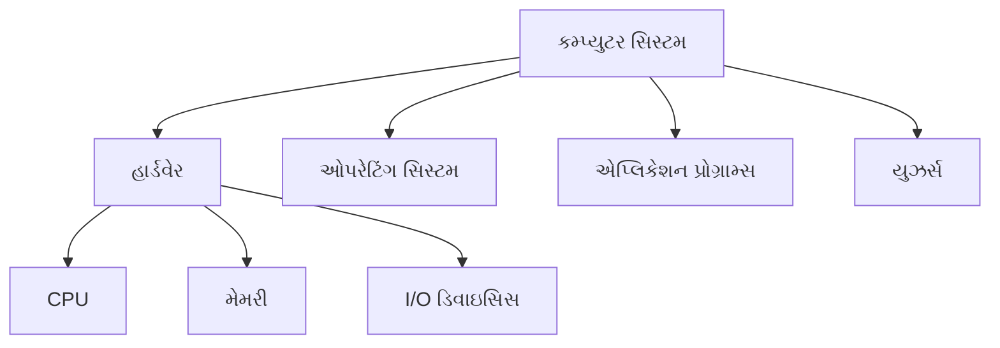
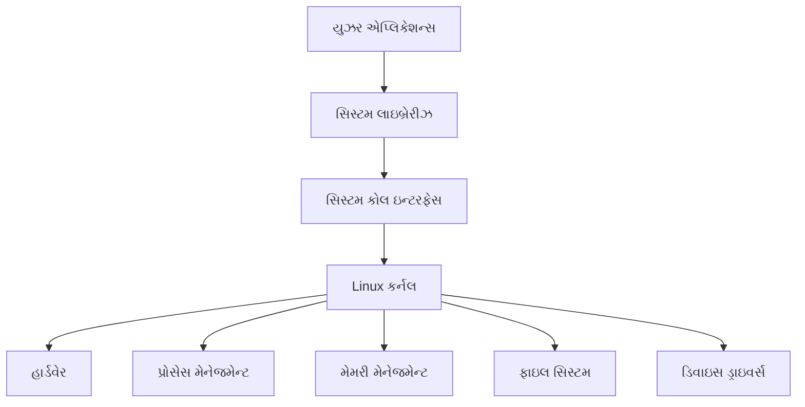
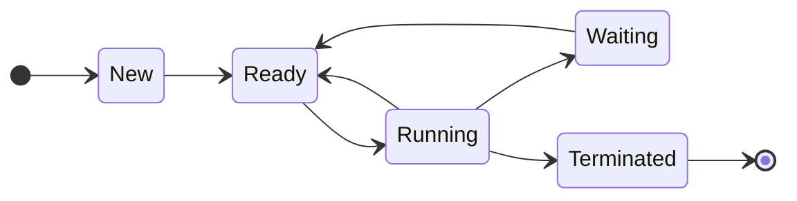
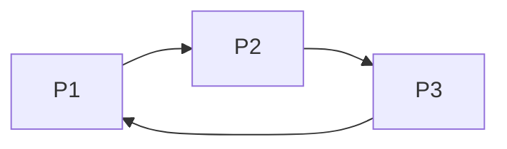
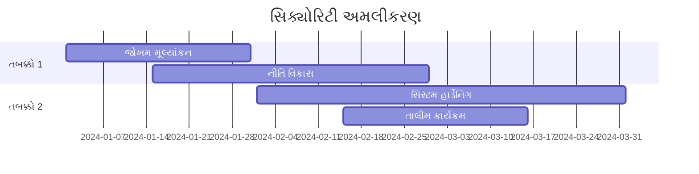

## પ્રશ્ન 1(અ) [3 ગુણ]

**ઓપરેટિંગ સિસ્ટમ વ્યાખ્યાયિત કરો અને તેનું લક્ષ્ય આપો.**

**જવાબ**:

**ઓપરેટિંગ સિસ્ટમ વ્યાખ્યા**: એક પ્રોગ્રામ જે કમ્પ્યુટર હાર્ડવેર અને યુઝર વચ્ચે ઇન્ટરફેસ તરીકે કામ કરે છે, સિસ્ટમ રિસોર્સિસ મેનેજ કરે છે અને પ્રોગ્રામ એક્ઝિક્યુશન કંટ્રોલ કરે છે.

**ઓપરેટિંગ સિસ્ટમના લક્ષ્યો**:

| લક્ષ્ય | વર્ણન |
|------|-------------|
| **રિસોર્સ મેનેજમેન્ટ** | CPU, મેમરી, I/O ડિવાઇસિસનું કાર્યક્ષમ ફાળવણી |
| **યુઝર સુવિધા** | વાપરવામાં સરળ ઇન્ટરફેસ પ્રદાન કરવું |
| **સિસ્ટમ પ્રોટેક્શન** | અનધિકૃત પહોંચથી સિસ્ટમને સુરક્ષિત કરવું |

**મેમરી ટ્રીક:** "RUS" - Resource management, User convenience, System protection

---

## પ્રશ્ન 1(બ) [4 ગુણ]

**કમ્પ્યુટર સિસ્ટમના ઘટકો નામ આપો અને ઓપરેટિંગ સિસ્ટમની જરૂરિયાત સમજાવો.**

**જવાબ**:

**કમ્પ્યુટર સિસ્ટમ ઘટકો**:



**ઓપરેટિંગ સિસ્ટમની જરૂરિયાત**:

- **રિસોર્સ મેનેજર**: હાર્ડવેર ફાળવણી કંટ્રોલ કરે છે
- **ઇન્ટરફેસ પ્રદાતા**: યુઝર અને હાર્ડવેર વચ્ચે સરળ કમ્યુનિકેશન
- **સિક્યોરિટી**: સિસ્ટમને ખતરાઓથી બચાવે છે
- **એરર હેન્ડલિંગ**: સિસ્ટમ એરર્સને કાર્યક્ષમ રીતે મેનેજ કરે છે

**મેમરી ટ્રીક:** "RISE" - Resource management, Interface, Security, Error handling

---

## પ્રશ્ન 1(ક) [7 ગુણ]

**નીચે ઓપરેટિંગ સિસ્ટમના પ્રકારો સમજાવો.**

**જવાબ**:

**I. Batch Operating System**

| લક્ષણ | વર્ણન |
|---------|-------------|
| **પ્રોસેસિંગ** | યુઝર ઇન્ટરેક્શન વિના બેચમાં જોબ્સ પ્રોસેસ કરે છે |
| **કાર્યક્ષમતા** | ઊંચું throughput, ઓછું યુઝર ઇન્ટરેક્શન |
| **ઉદાહરણ** | IBM મેઇનફ્રેમ્સ |

**II. Multiprogramming Operating System**

| લક્ષણ | વર્ણન |
|---------|-------------|
| **કોન્સેપ્ટ** | મેમરીમાં એકસાથે બહુવિધ પ્રોગ્રામ્સ |
| **CPU ઉપયોગ** | વધુ સારું CPU utilization |
| **ફાયદો** | idle time ઘટાડે છે |

**III. Time Sharing Operating System**

| લક્ષણ | વર્ણન |
|---------|-------------|
| **Time Slices** | યુઝર્સ વચ્ચે CPU time વહેંચાયેલું |
| **Response** | ઝડપી response time |
| **ઉદાહરણ** | Unix, Linux |

**મેમરી ટ્રીક:** "BMT" - Batch (કોઈ ઇન્ટરેક્શન નહીં), Multiprogramming (ઘણા પ્રોગ્રામ્સ), Time-sharing (time slices)

---

## પ્રશ્ન 1(ક) OR [7 ગુણ]

**Linux આર્કિટેક્ચર અને લક્ષણો તેના ઘટકો સાથે સમજાવો.**

**જવાબ**:

**Linux આર્કિટેક્ચર**:



**Linux લક્ષણો**:

| લક્ષણ | વર્ણન |
|----------------|-------------|
| **ઓપન સોર્સ** | મફત અને સુધારી શકાય તેવું |
| **મલ્ટિયુઝર** | એકસાથે બહુવિધ યુઝર્સ |
| **મલ્ટિટાસ્કિંગ** | એકસાથે બહુવિધ પ્રોસેસિસ |
| **પોર્ટેબલ** | વિવિધ હાર્ડવેર પર ચાલે છે |

**ઘટકો**:

- **કર્નલ**: ઓપરેટિંગ સિસ્ટમનો મુખ્ય ભાગ
- **શેલ**: કમાન્ડ interpreter
- **ફાઇલ સિસ્ટમ**: ડેટા સ્ટોરેજ ઓર્ગેનાઇઝ કરે છે

**મેમરી ટ્રીક:** "COMP" - Core (કર્નલ), Open source, Multiuser, Portable

---

## પ્રશ્ન 2(અ) [3 ગુણ]

**પ્રક્રિયા નિયંત્રણ બ્લોકનું વર્ણન કરો. અને વ્યાખ્યાયિત કરો (1) PID (2) stack pointer (3) program counter**

**જવાબ**:

**Process Control Block (PCB)**: OS મેનેજમેન્ટ માટે પ્રોસેસ ઇન્ફર્મેશન ધરાવતું ડેટા સ્ટ્રક્ચર.

**વ્યાખ્યાઓ**:

| શબ્દ | વ્યાખ્યા |
|------|------------|
| **PID** | Process Identifier - દરેક પ્રોસેસ માટે અનન્ય નંબર |
| **Stack Pointer** | પ્રોસેસ સ્ટેકની ટોપ તરફ પોઇન્ટ કરે છે |
| **Program Counter** | આગલી instruction નું address ધરાવે છે |

**મેમરી ટ્રીક:** "PSP" - PID (identifier), Stack pointer (ટોપ), Program counter (આગલું)

---

## પ્રશ્ન 2(બ) [4 ગુણ]

**પ્રક્રિયા મોડલ અને પ્રક્રિયા સ્થિતિઓનું વર્ણન કરો**

**જવાબ**:

**પ્રોસેસ મોડલ**: OS દ્વારા પ્રોસેસિસ કેવી રીતે મેનેજ થાય છે તેનું કોન્સેપ્ચ્યુઅલ રિપ્રેઝેન્ટેશન.

**પ્રોસેસ સ્થિતિઓ**:



| સ્થિતિ | વર્ણન |
|-------|-------------|
| **New** | પ્રોસેસ બનાવાઈ રહ્યું છે |
| **Ready** | CPU માટે રાહ જોઈ રહ્યું છે |
| **Running** | instructions એક્ઝિક્યુટ કરી રહ્યું છે |
| **Waiting** | I/O માટે રાહ જોઈ રહ્યું છે |
| **Terminated** | પ્રોસેસ સમાપ્ત થયું |

**મેમરી ટ્રીક:** "NRRWT" - New, Ready, Running, Waiting, Terminated

---

## પ્રશ્ન 2(ક) [7 ગુણ]

**શેડ્યુલિંગ અલ્ગોરિધમનું વર્ણન કરો:(I) First Come First Serve,(II) Shortest Job First**

**જવાબ**:

**I. First Come First Serve (FCFS)**

| પ્રોસેસ | આગમન સમય | Burst Time | પૂર્ણતા સમય | Turnaround Time |
|---------|--------------|------------|-----------------|-----------------|
| P1 | 0 | 4 | 4 | 4 |
| P2 | 1 | 3 | 7 | 6 |
| P3 | 2 | 2 | 9 | 7 |

**સરેરાશ Turnaround Time** = (4+6+7)/3 = 5.67

**II. Shortest Job First (SJF)**

| પ્રોસેસ | આગમન સમય | Burst Time | પૂર્ણતા સમય | Turnaround Time |
|---------|--------------|------------|-----------------|-----------------|
| P3 | 2 | 2 | 4 | 2 |
| P2 | 1 | 3 | 7 | 6 |
| P1 | 0 | 4 | 11 | 11 |

**સરેરાશ Turnaround Time** = (2+6+11)/3 = 6.33

**મેમરી ટ્રીક:** "FS" - FCFS (પહેલા ક્રમ), SJF (સૌથી ટૂંકું પહેલા)

---

## પ્રશ્ન 2(અ) OR [3 ગુણ]

**વ્યાખ્યાયિત કરો Race condition, Mutual Exclusion**

**જવાબ**:

| શબ્દ | વ્યાખ્યા |
|------|------------|
| **Race Condition** | બહુવિધ પ્રોસેસિસ એકસાથે shared data એક્સેસ કરે છે જેથી inconsistent પરિણામો આવે છે |
| **Mutual Exclusion** | એક સમયે માત્ર એક પ્રોસેસ critical section એક્સેસ કરી શકે છે |

**ઉદાહરણ**: બે પ્રોસેસિસ એકજ બેંક એકાઉન્ટ બેલેન્સ અપડેટ કરી રહ્યા છે.

**મેમરી ટ્રીક:** "RM" - Race (એકસાથે એક્સેસ), Mutual (એક સમયે એક)

---

## પ્રશ્ન 2(બ) OR [4 ગુણ]

**વ્યાખ્યાયિત કરો Throughput, Turnaround Time, Waiting Time, Response Time**

**જવાબ**:

| શબ્દ | વ્યાખ્યા |
|------|------------|
| **Throughput** | એકમ સમયમાં પૂર્ણ થયેલ પ્રોસેસિસની સંખ્યા |
| **Turnaround Time** | submission થી completion સુધીનો કુલ સમય |
| **Waiting Time** | ready queue માં રાહ જોવાનો સમય |
| **Response Time** | submission થી પહેલા response સુધીનો સમય |

**ફોર્મ્યુલા ટેબલ**:

| મેટ્રિક | ફોર્મ્યુલા |
|--------|---------|
| Turnaround Time | Completion Time - Arrival Time |
| Waiting Time | Turnaround Time - Burst Time |
| Response Time | First CPU Time - Arrival Time |

**મેમરી ટ્રીક:** "TTWR" - Throughput, Turnaround, Waiting, Response

---

## પ્રશ્ન 2(ક) OR [7 ગુણ]

**રાઉન્ડ રોબિન અલ્ગોરિધમ ઉદાહરણ સાથે સમજાવો.**

**જવાબ**:

**રાઉન્ડ રોબિન**: દરેક પ્રોસેસને સમાન CPU time slice (quantum) મળે છે.

**ઉદાહરણ** (Time Quantum = 2):

| પ્રોસેસ | Burst Time |
|---------|------------|
| P1 | 5 |
| P2 | 3 |
| P3 | 4 |

**એક્ઝિક્યુશન ટાઇમલાઇન**:

```goat
0----2----4----6----8----10---12
 P1   P2   P3   P1   P3   P1
```

| પ્રોસેસ | પૂર્ણતા સમય | Turnaround Time |
|---------|-----------------|-----------------|
| P1 | 12 | 12 |
| P2 | 6 | 6 |
| P3 | 10 | 10 |

**સરેરાશ Turnaround Time** = (12+6+10)/3 = 9.33

**ફાયદાઓ**:

- **ન્યાયસંગત**: બધા પ્રોસેસિસને સમાન સમય
- **રિસ્પોન્સિવ**: ઇન્ટરેક્ટિવ સિસ્ટમ્સ માટે સારું

**મેમરી ટ્રીક:** "RR-FE" - Round Robin આપે છે Fair અને Equal સમય

---

## પ્રશ્ન 3(અ) [3 ગુણ]

**ફાઇલ એક્સેસ પદ્ધતિઓનો પ્રકાર આપો**

**જવાબ**:

| એક્સેસ પદ્ધતિ | વર્ણન |
|---------------|-------------|
| **Sequential** | શરૂઆતથી ક્રમમાં read/write |
| **Direct** | કોઈ પણ record ને સીધું એક્સેસ |
| **Indexed** | records શોધવા માટે index ઉપયોગ |

**મેમરી ટ્રીક:** "SDI" - Sequential (ક્રમ), Direct (કોઈ પણ), Indexed (index)

---

## પ્રશ્ન 3(બ) [4 ગુણ]

**ડેડલોક લાક્ષણિકતાઓ આપો અને Deadlock Prevention, Deadlock Avoidance વર્ણન કરો**

**જવાબ**:

**ડેડલોક લાક્ષણિકતાઓ**:

| શરત | વર્ણન |
|-----------|-------------|
| **Mutual Exclusion** | રિસોર્સિસ શેર કરી શકાતા નથી |
| **Hold and Wait** | પ્રોસેસ રિસોર્સ પકડીને રાહ જુએ છે |
| **No Preemption** | રિસોર્સિસ બળજબરીથી લઈ શકાતા નથી |
| **Circular Wait** | રાહ જોતા પ્રોસેસિસનો ગોળાકાર chain |

**Deadlock Prevention**: ચાર શરતોમાંથી કોઈ એક દૂર કરો.

**Deadlock Avoidance**: unsafe states ટાળવા માટે Banker's algorithm જેવા અલ્ગોરિધમ ઉપયોગ કરો.

**મેમરી ટ્રીક:** "MHNC" - Mutual exclusion, Hold and wait, No preemption, Circular wait

---

## પ્રશ્ન 3(ક) [7 ગુણ]

**ફાઈલ ફાળવણી પદ્ધતિઓ લગતી, લિંક્ડ, અનુક્રમિત સમજાવો**

**જવાબ**:

**ફાઈલ ફાળવણી પદ્ધતિઓ**:

| પદ્ધતિ | વર્ણન | ફાયદાઓ | નુકસાન |
|--------|-------------|------------|---------------|
| **Contiguous** | Sequential blocks | ઝડપી એક્સેસ | External fragmentation |
| **Linked** | પોઇન્ટર્સ સાથે વિખરાયેલા blocks | કોઈ fragmentation નહીં | ધીમું random access |
| **Indexed** | Index block માં addresses | ઝડપી random access | વધારાનું overhead |

**Contiguous Allocation**:

```goat
File A: [1][2][3][4][5]
```

**Linked Allocation**:

```goat
File A: [1]→[7]→[3]→[9]→NULL
```

**Indexed Allocation**:

```goat
Index Block: [1,3,7,9,12]
File blocks: [1][3][7][9][12]
```

**મેમરી ટ્રીક:** "CLI" - Contiguous (એકસાથે), Linked (પોઇન્ટર્સ), Indexed (index block)

---

## પ્રશ્ન 3(અ) OR [3 ગુણ]

**Linux ફાઈલ સિસ્ટમ સ્ટ્રક્ચરની સમજણ આપો.**

**જવાબ**:

**Linux ફાઈલ સિસ્ટમ હાયરાર્કી**:

```goat
/
├── bin/     (સિસ્ટમ binaries)
├── etc/     (કન્ફિગરેશન ફાઈલો)
├── home/    (યુઝર ડિરેક્ટરીઝ)
├── var/     (Variable ડેટા)
├── usr/     (યુઝર પ્રોગ્રામ્સ)
└── tmp/     (Temporary ફાઈલો)
```

| ડિરેક્ટરી | હેતુ |
|-----------|---------|
| **/bin** | આવશ્યક સિસ્ટમ binaries |
| **/etc** | સિસ્ટમ કન્ફિગરેશન ફાઈલો |
| **/home** | યુઝર home ડિરેક્ટરીઝ |

**મેમરી ટ્રીક:** "BEH" - Bin (binaries), Etc (config), Home (યુઝર્સ)

---

## પ્રશ્ન 3(બ) OR [4 ગુણ]

**ઉદાહરણ સાથે Critical Section and Semaphore સમજાવો.**

**જવાબ**:

**Critical Section**: shared resources એક્સેસ કરતો કોડ segment.

**Semaphore**: counter variable ઉપયોગ કરતું synchronization tool.

**ઉદાહરણ**:

```bash
# Binary Semaphore
wait(S):
  while S <= 0 do nothing
  S = S - 1

signal(S):
  S = S + 1
```

**Critical Section સ્ટ્રક્ચર**:

| Section | વર્ણન |
|---------|-------------|
| **Entry** | પરવાનગી માંગવી |
| **Critical** | Shared resource એક્સેસ કરવું |
| **Exit** | પરવાનગી છોડવી |
| **Remainder** | બીજો કોડ |

**મેમરી ટ્રીક:** "ECER" - Entry, Critical, Exit, Remainder

---

## પ્રશ્ન 3(ક) OR [7 ગુણ]

**ડેડલોક ટાળો, ડેડલોક શોધ,અને પ્રોસેસ પુનઃપ્રાપ્તિ વ્યાખ્યાયિત કરો અને સમજાવો**

**જવાબ**:

**Deadlock Avoidance**:

- **Banker's Algorithm** ઉપયોગ કરો
- resource allocation safe state તરફ લઈ જાય છે કે નહીં તે ચેક કરો

**Deadlock Detection**:

- **Wait-for Graph** ઉપયોગ કરીને નિયમિત deadlock ચેક કરો

**Deadlock Recovery પદ્ધતિઓ**:

| પદ્ધતિ | વર્ણન |
|--------|-------------|
| **Process Termination** | Deadlocked પ્રોસેસિસને kill કરો |
| **Resource Preemption** | પ્રોસેસિસમાંથી resources લો |
| **Rollback** | અગાઉની safe state પર પાછા જાઓ |

**Banker's Algorithm સ્ટેપ્સ**:

1. request ≤ available resources છે કે નહીં ચેક કરો
2. allocation simulate કરો
3. safe state અસ્તિત્વ ચેક કરો

**Wait-for Graph**:



**મેમરી ટ્રીક:** "ADR-BWT" - Avoidance (Banker's), Detection (Wait-for), Recovery (Terminate)

---

## પ્રશ્ન 4(અ) [3 ગુણ]

**શા માટે ફાઈલ પ્રોટેક્શનની જરૂર છે સમજાવો?**

**જવાબ**:

**ફાઈલ પ્રોટેક્શનની જરૂરિયાત**:

| કારણ | વર્ણન |
|--------|-------------|
| **ગોપનીયતા** | વ્યક્તિગત ડેટાનું રક્ષણ |
| **સિક્યોરિટી** | અનધિકૃત એક્સેસ અટકાવવું |
| **અખંડતા** | ડેટા consistency જાળવવી |

**પ્રોટેક્શન મેકેનિઝમ્સ**:

- **Access Control Lists (ACL)**
- **ફાઈલ Permissions** (Read, Write, Execute)
- **યુઝર Authentication**

**મેમરી ટ્રીક:** "PSI" - Privacy, Security, Integrity

---

## પ્રશ્ન 4(બ) [4 ગુણ]

**Program threats, System threats નું વર્ણન કરો**

**જવાબ**:

**Program Threats**:

| ખતરો | વર્ણન |
|--------|-------------|
| **Virus** | Self-replicating દુર્ભાવનાપૂર્ણ કોડ |
| **Worm** | નેટવર્ક પર ફેલાતા malware |
| **Trojan Horse** | છૂપાયેલ દુર્ભાવનાપૂર્ણ પ્રોગ્રામ |

**System Threats**:

| ખતરો | વર્ણન |
|--------|-------------|
| **Denial of Service** | સિસ્ટમ resources ભરાવી દેવા |
| **Port Scanning** | vulnerable services શોધવી |
| **Man-in-Middle** | communications intercept કરવા |

**પ્રોટેક્શન પદ્ધતિઓ**:

- **એન્ટિવાયરસ સોફ્ટવેર**
- **ફાયરવોલ્સ**
- **નિયમિત અપડેટ્સ**

**મેમરી ટ્રીક:** "VWT-DPM" - Virus, Worm, Trojan; DoS, Port scan, Man-in-middle

---

## પ્રશ્ન 4(ક) [7 ગુણ]

**સંક્ષિપ્તમાં ઓપરેટિંગ સિસ્ટમ સુરક્ષા નીતિઓ અને પ્રક્રિયાઓની વિગતો આપો**

**જવાબ**:

**સિક્યોરિટી નીતિઓ**:

| નીતિ પ્રકાર | વર્ણન |
|-------------|-------------|
| **Access Control** | કોણ કયા resources એક્સેસ કરી શકે |
| **Authentication** | યુઝર identity verify કરવી |
| **Authorization** | યુઝર permissions નક્કી કરવી |
| **Audit** | પ્રવૃત્તિઓ monitor અને log કરવી |

**સિક્યોરિટી પ્રક્રિયાઓ**:


**અમલીકરણ સ્ટેપ્સ**:

1. **યુઝર Registration** અને credential સેટઅપ
2. **Multi-factor Authentication**
3. **Role-based Access Control**
4. **નિયમિત Security Audits**

**સામાન્ય સિક્યોરિટી પગલાં**:

- **Password નીતિઓ**
- **Encryption**
- **Backup પ્રક્રિયાઓ**
- **Incident Response યોજનાઓ**

**મેમરી ટ્રીક:** "AAAA" - Access control, Authentication, Authorization, Audit

---

## પ્રશ્ન 4(અ) OR [3 ગુણ]

**Authentication and Authorization સમજણ આપો**

**જવાબ**:

| શબ્દ | વ્યાખ્યા | ઉદાહરણ |
|------|------------|---------|
| **Authentication** | યુઝર identity verify કરવી | Username/password |
| **Authorization** | એક્સેસ અધિકારો નક્કી કરવા | ફાઈલ permissions |

**Authentication પદ્ધતિઓ**:

- **Password-based**
- **Biometric**
- **Token-based**

**મેમરી ટ્રીક:** "AA" - Authentication (તમે કોણ છો), Authorization (તમે શું કરી શકો છો)

---

## પ્રશ્ન 4(બ) OR [4 ગુણ]

**ઓપરેટિંગ સિસ્ટમ સુરક્ષા નીતિઓ અને પ્રક્રિયાઓ સમજાવો**

**જવાબ**:

**સિક્યોરિટી નીતિઓ ફ્રેમવર્ક**:

| ઘટક | હેતુ |
|-----------|---------|
| **યુઝર મેનેજમેન્ટ** | યુઝર એકાઉન્ટ્સ કંટ્રોલ કરવા |
| **ડેટા પ્રોટેક્શન** | સંવેદનશીલ માહિતી સુરક્ષિત કરવી |
| **નેટવર્ક સિક્યોરિટી** | કમ્યુનિકેશન્સ સુરક્ષિત કરવા |
| **સિસ્ટમ મોનિટરિંગ** | ખતરાઓ શોધવા |

**અમલીકરણ પ્રક્રિયાઓ**:

1. **જોખમ મૂલ્યાંકન**
2. **નીતિ વિકાસ**
3. **તાલીમ કાર્યક્રમો**
4. **નિયમિત સમીક્ષાઓ**

**મેમરી ટ્રીક:** "UDNS" - User management, Data protection, Network security, System monitoring

---

## પ્રશ્ન 4(ક) OR [7 ગુણ]

**ઑપરેટિંગ સિસ્ટમમાં સુરક્ષા પગલાંની વિગતો આપો.**

**જવાબ**:

**વ્યાપક સિક્યોરિટી પગલાં**:

| સ્તર | સિક્યોરિટી પગલાં |
|-------|------------------|
| **Physical** | સર્વર રૂમ એક્સેસ, biometric locks |
| **Network** | Firewalls, VPN, intrusion detection |
| **System** | Antivirus, patches, access controls |
| **Application** | Input validation, secure coding |
| **Data** | Encryption, backup, integrity checks |

**Access Control Matrix**:

| યુઝર/રોલ | ફાઈલ A | ફાઈલ B | પ્રિન્ટર |
|-----------|--------|--------|---------|
| Admin | RWX | RWX | RWX |
| User1 | RW- | R-- | -W- |
| Guest | R-- | --- | --- |

**સિક્યોરિટી અમલીકરણ સમયસીમા**:



**મોનિટરિંગ ટૂલ્સ**:

- **લોગ એનાલિસિસ**
- **Intrusion Detection Systems**
- **Vulnerability Scanners**

**મેમરી ટ્રીક:** "PNSAD" - Physical, Network, System, Application, Data security

---

## પ્રશ્ન 5(અ) [3 ગુણ]

**calendar, date ના પાંચ મૂળભૂત કમાંડ સમજાવો**

**જવાબ**:

**મૂળભૂત Linux કમાંડ્સ**:

| કમાંડ | કાર્ય | ઉદાહરણ |
|---------|----------|---------|
| `cal` | કેલેન્ડર દર્શાવવું | `cal 2024` |
| `date` | વર્તમાન તારીખ/સમય બતાવવો | `date +%d/%m/%Y` |
| `who` | લોગ-ઇન યુઝર્સ બતાવવા | `who` |
| `pwd` | વર્કિંગ ડિરેક્ટરી પ્રિન્ટ કરવી | `pwd` |
| `clear` | સ્ક્રીન સાફ કરવી | `clear` |

**કમાંડ ઉદાહરણો**:

```bash
# ચોક્કસ મહિના માટે કેલેન્ડર દર્શાવવો
cal 6 2024

# તારીખ આઉટપુટ ફોર્મેટ કરવો
date "+%A, %B %d, %Y"
```

**મેમરી ટ્રીક:** "CDWPC" - Cal, Date, Who, Pwd, Clear

---

## પ્રશ્ન 5(બ) [4 ગુણ]

**Linux ફાઈલ અને ડિરેક્ટરી કમાંડ સમજાવો: ls, cat, mkdir, rmdir, pwd,**

**જવાબ**:

**ફાઈલ અને ડિરેક્ટરી કમાંડ્સ**:

| કમાંડ | કાર્ય | Syntax | ઉદાહરણ |
|---------|----------|--------|---------|
| `ls` | ડિરેક્ટરી contents લિસ્ટ કરવા | `ls [options] [path]` | `ls -la` |
| `cat` | ફાઈલ content દર્શાવવો | `cat filename` | `cat file.txt` |
| `mkdir` | ડિરેક્ટરી બનાવવી | `mkdir dirname` | `mkdir newdir` |
| `rmdir` | ખાલી ડિરેક્ટરી દૂર કરવી | `rmdir dirname` | `rmdir olddir` |
| `pwd` | વર્કિંગ ડિરેક્ટરી પ્રિન્ટ કરવી | `pwd` | `pwd` |

**ઉપયોગ ઉદાહરણો**:

```bash
# વિગતો સાથે ફાઈલો લિસ્ટ કરવી
ls -l /home/user

# બહુવિધ ડિરેક્ટરીઝ બનાવવી
mkdir -p dir1/dir2/dir3

# લાઈન નંબર્સ સાથે ફાઈલ દર્શાવવી
cat -n document.txt
```

**સામાન્ય વિકલ્પો**:

- `ls -l`: લાંબો ફોર્મેટ
- `ls -a`: છુપાયેલી ફાઈલો બતાવવી
- `mkdir -p`: parent ડિરેક્ટરીઝ બનાવવી

**મેમરી ટ્રીક:** "LCMRP" - List, Cat, Mkdir, Rmdir, Pwd

---

## પ્રશ્ન 5(ક) [7 ગુણ]

**નિયંત્રણ નિવેદનો સમજો અને ઉપયોગ કરી શેલ સ્ક્રિપ્ટ લખો: ત્રણ સંખ્યાઓમાંથી મહત્તમ સંખ્યા શોધવા માટે શેલ સ્ક્રિપ્ટ લખો.**

**જવાબ**:

**ત્રણ સંખ્યાઓમાંથી મહત્તમ માટે શેલ સ્ક્રિપ્ટ**:

```bash
#!/bin/bash
# ત્રણ સંખ્યાઓમાંથી મહત્તમ શોધવા માટે સ્ક્રિપ્ટ

echo "ત્રણ સંખ્યાઓ દાખલ કરો:"
read -p "પહેલી સંખ્યા: " num1
read -p "બીજી સંખ્યા: " num2
read -p "ત્રીજી સંખ્યા: " num3

# પદ્ધતિ 1: if-elif-else ઉપયોગ કરીને
if [ $num1 -ge $num2 ] && [ $num1 -ge $num3 ]; then
    max=$num1
elif [ $num2 -ge $num1 ] && [ $num2 -ge $num3 ]; then
    max=$num2
else
    max=$num3
fi

echo "મહત્તમ સંખ્યા છે: $max"

# પદ્ધતિ 2: nested if ઉપયોગ કરીને
if [ $num1 -gt $num2 ]; then
    if [ $num1 -gt $num3 ]; then
        echo "મહત્તમ: $num1"
    else
        echo "મહત્તમ: $num3"
    fi
else
    if [ $num2 -gt $num3 ]; then
        echo "મહત્તમ: $num2"
    else
        echo "મહત્તમ: $num3"
    fi
fi
```

**ઉપયોગમાં લેવાયેલા Control Statements**:

| Statement | હેતુ |
|-----------|---------|
| `if-elif-else` | બહુવિધ condition ચેકિંગ |
| `read` | યુઝર input |
| `echo` | આઉટપુટ દર્શાવવો |
| Comparison operators | `-ge`, `-gt`, `-lt` |

**Comparison Operators**:

- `-eq`: બરાબર
- `-ne`: બરાબર નહીં
- `-gt`: કરતાં મોટું
- `-ge`: કરતાં મોટું અથવા સમાન
- `-lt`: કરતાં નાનું
- `-le`: કરતાં નાનું અથવા સમાન

**મેમરી ટ્રીક:** "IER" - If (condition), Echo (આઉટપુટ), Read (ઇનપુટ)

---

## પ્રશ્ન 5(અ) OR [3 ગુણ]

**top, ps, kill Linux પ્રોસેસ કમાન્ડ શું છે**

**જવાબ**:

**Linux પ્રોસેસ કમાંડ્સ**:

| કમાંડ | કાર્ય | ઉપયોગ |
|---------|----------|-------|
| `top` | ચાલતી પ્રોસેસિસ દર્શાવવી | `top` |
| `ps` | પ્રોસેસ સ્ટેટસ બતાવવો | `ps aux` |
| `kill` | પ્રોસેસ બંધ કરવી | `kill PID` |

**કમાંડ વિગતો**:

**top કમાંડ**:

- Real-time પ્રોસેસ માહિતી બતાવે છે
- CPU અને મેમરી ઉપયોગ
- Load average

**ps કમાંડ વિકલ્પો**:

- `ps aux`: વિગતો સાથે બધી પ્રોસેસિસ
- `ps -ef`: સંપૂર્ણ ફોર્મેટ લિસ્ટિંગ

**kill કમાંડ**:

- `kill -9 PID`: પ્રોસેસને ફોર્સ kill કરવી
- `killall process_name`: નામ દ્વારા kill કરવી

**મેમરી ટ્રીક:** "TPK" - Top (real-time), Ps (સ્ટેટસ), Kill (બંધ કરવી)

---

## પ્રશ્ન 5(બ) OR [4 ગુણ]

**Linux ફાઈલ અને ડિરેક્ટરી કમાંડ સમજાવો: rm, mv, split, diff, grep**

**જવાબ**:

**અદ્યતન ફાઈલ કમાંડ્સ**:

| કમાંડ | કાર્ય | Syntax | ઉદાહરણ |
|---------|----------|--------|---------|
| `rm` | ફાઈલો/ડિરેક્ટરીઝ દૂર કરવી | `rm [options] file` | `rm -rf folder` |
| `mv` | ફાઈલો ખસેડવી/નામ બદલવું | `mv source dest` | `mv old.txt new.txt` |
| `split` | મોટી ફાઈલો વિભાજિત કરવી | `split -l lines file` | `split -l 100 data.txt` |
| `diff` | ફાઈલો તુલના કરવી | `diff file1 file2` | `diff old.txt new.txt` |
| `grep` | ટેક્સ્ટ પેટર્ન શોધવા | `grep pattern file` | `grep "error" log.txt` |

**ઉપયોગ ઉદાહરણો**:

```bash
# ડિરેક્ટરી recursively દૂર કરવી
rm -rf /tmp/oldfiles

# ખસેડવું અને નામ બદલવું
mv /home/user/doc.txt /backup/document.txt

# ફાઈલને 50-line chunks માં વિભાજિત કરવી
split -l 50 largefile.txt chunk_

# ફાઈલો વચ્ચે તફાવત શોધવો
diff -u original.txt modified.txt

# બહુવિધ ફાઈલોમાં પેટર્ન શોધવો
grep -r "TODO" /project/src/
```

**સામાન્ય વિકલ્પો**:

- `rm -i`: Interactive mode
- `mv -i`: Overwrite પહેલાં પૂછવું
- `grep -i`: Case insensitive શોધ

**મેમરી ટ્રીક:** "RMSDG" - Remove, Move, Split, Diff, Grep

---

## પ્રશ્ન 5(ક) OR [7 ગુણ]

**શેલ સ્ક્રિપ્ટ લખો:પાંચ નંબરો આપી અને પાંચ સંખ્યાઓની સરેરાશ શોધો.**

**જવાબ**:

**પાંચ સંખ્યાઓની સરેરાશ માટે શેલ સ્ક્રિપ્ટ**:

```bash
#!/bin/bash
# પાંચ સંખ્યાઓની સરેરાશ ગણતરી માટે સ્ક્રિપ્ટ

echo "=== સરેરાશ કેલ્ક્યુલેટર ==="
echo "પાંચ સંખ્યાઓ દાખલ કરો:"

# પાંચ સંખ્યાઓ વાંચવી
read -p "સંખ્યા 1 દાખલ કરો: " num1
read -p "સંખ્યા 2 દાખલ કરો: " num2
read -p "સંખ્યા 3 દાખલ કરો: " num3
read -p "સંખ્યા 4 દાખલ કરો: " num4
read -p "સંખ્યા 5 દાખલ કરો: " num5

# બાદબાકી ગણતરી
sum=$((num1 + num2 + num3 + num4 + num5))

# સરેરાશ ગણતરી
average=$((sum / 5))

# પરિણામો દર્શાવવા
echo "================================"
echo "દાખલ કરેલી સંખ્યાઓ: $num1, $num2, $num3, $num4, $num5"
echo "બાદબાકી: $sum"
echo "સરેરાશ: $average"
echo "================================"

# દશાંશ ચોકસાઈ સાથે વિસ્તૃત વર્ઝન
sum_float=$(echo "$num1 + $num2 + $num3 + $num4 + $num5" | bc)
avg_float=$(echo "scale=2; $sum_float / 5" | bc)
echo "ચોક્કસ સરેરાશ: $avg_float"
```

**Arrays ઉપયોગ કરીને વૈકલ્પિક પદ્ધતિ**:

```bash
#!/bin/bash
# Array approach ઉપયોગ કરીને

declare -a numbers
sum=0

echo "5 સંખ્યાઓ દાખલ કરો:"
for i in {0..4}; do
    read -p "સંખ્યા $((i+1)): " numbers[i]
    sum=$((sum + numbers[i]))
done

average=$((sum / 5))

echo "સંખ્યાઓ: ${numbers[@]}"
echo "બાદબાકી: $sum"
echo "સરેરાશ: $average"
```

**સ્ક્રિપ્ટ લક્ષણો**:

| લક્ષણ | વર્ણન |
|---------|-------------|
| **Input Validation** | Numeric input ચેક કરવો |
| **યુઝર-ફ્રેન્ડલી આઉટપુટ** | સ્પષ્ટ ફોર્મેટિંગ |
| **Array ઉપયોગ** | બહુવિધ વેલ્યુઝ સ્ટોર કરવી |
| **અંકગણિત ઓપરેશન્સ** | બાદબાકી અને ભાગાકાર |

**Bash માં ગાણિતિક ઓપરેશન્સ**:

- `$((expression))`: Integer arithmetic
- `bc`: Floating point માટે calculator
- `expr`: Expression evaluation

**મેમરી ટ્રીક:** "RSAR" - Read (ઇનપુટ), Sum (ઉમેરવું), Average (ભાગાકાર), Result (પરિણામ)
