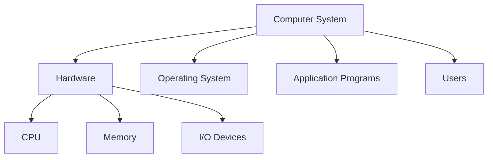
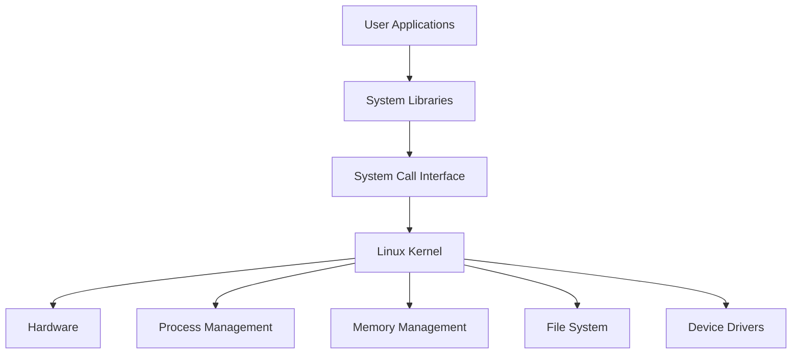
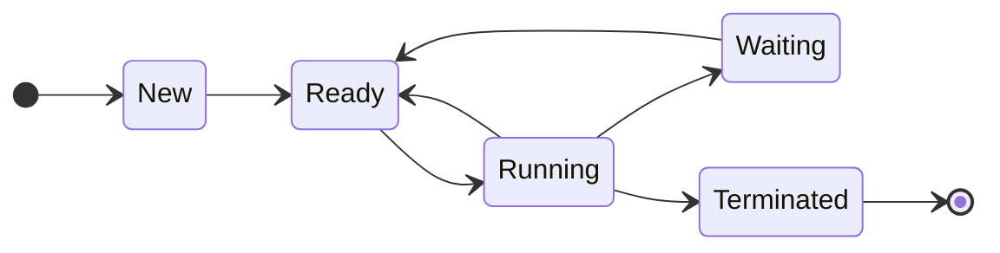
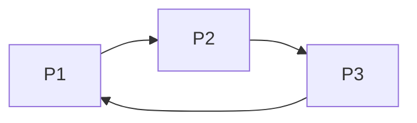
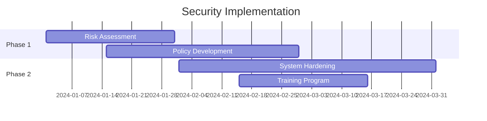

## Question 1(a) [3 marks]

**Define Operating System and give its goal.**

**Answer**:

**Operating System Definition**: A program that acts as an interface between computer hardware and users, managing system resources and controlling program execution.

**Goals of Operating System**:

| Goal | Description |
|------|-------------|
| **Resource Management** | Efficiently allocate CPU, memory, I/O devices |
| **User Convenience** | Provide easy-to-use interface |
| **System Protection** | Secure system from unauthorized access |

**Mnemonic:** "RUS" - Resource management, User convenience, System protection

---

## Question 1(b) [4 marks]

**Give name Components of Computer System & Explain need of Operating system.**

**Answer**:

**Computer System Components**:



**Need of Operating System**:

- **Resource Manager**: Controls hardware allocation
- **Interface Provider**: Easy communication between user and hardware
- **Security**: Protects system from threats
- **Error Handling**: Manages system errors efficiently

**Mnemonic:** "RISE" - Resource management, Interface, Security, Error handling

---

## Question 1(c) [7 marks]

**Explain below types of Operating system.**

**Answer**:

**I. Batch Operating System**

| Feature | Description |
|---------|-------------|
| **Processing** | Jobs processed in batches without user interaction |
| **Efficiency** | High throughput, low user interaction |
| **Example** | IBM mainframes |

**II. Multiprogramming Operating System**

| Feature | Description |
|---------|-------------|
| **Concept** | Multiple programs in memory simultaneously |
| **CPU Usage** | Better CPU utilization |
| **Advantage** | Reduced idle time |

**III. Time Sharing Operating System**

| Feature | Description |
|---------|-------------|
| **Time Slices** | CPU time divided among users |
| **Response** | Quick response time |
| **Example** | Unix, Linux |

**Mnemonic:** "BMT" - Batch (no interaction), Multiprogramming (many programs), Time-sharing (time slices)

---

## Question 1(c) OR [7 marks]

**Explain Linux Architecture & characteristics with its components.**

**Answer**:

**Linux Architecture**:



**Linux Characteristics**:

| Characteristic | Description |
|----------------|-------------|
| **Open Source** | Free and modifiable |
| **Multiuser** | Multiple users simultaneously |
| **Multitasking** | Multiple processes concurrently |
| **Portable** | Runs on various hardware |

**Components**:

- **Kernel**: Core of operating system
- **Shell**: Command interpreter
- **File System**: Organizes data storage

**Mnemonic:** "COMP" - Core (kernel), Open source, Multiuser, Portable

---

## Question 2(a) [3 marks]

**Describe Process Control Block. And define (1) PID (2) stack pointer (3) program counter**

**Answer**:

**Process Control Block (PCB)**: Data structure containing process information for OS management.

**Definitions**:

| Term | Definition |
|------|------------|
| **PID** | Process Identifier - unique number for each process |
| **Stack Pointer** | Points to top of process stack |
| **Program Counter** | Contains address of next instruction |

**Mnemonic:** "PSP" - PID (identifier), Stack pointer (top), Program counter (next)

---

## Question 2(b) [4 marks]

**Describe the Process Model and Process states**

**Answer**:

**Process Model**: Conceptual representation of how processes are managed by OS.

**Process States**:



| State | Description |
|-------|-------------|
| **New** | Process being created |
| **Ready** | Waiting for CPU |
| **Running** | Executing instructions |
| **Waiting** | Waiting for I/O |
| **Terminated** | Process finished |

**Mnemonic:** "NRRWT" - New, Ready, Running, Waiting, Terminated

---

## Question 2(c) [7 marks]

**Demonstrate Scheduling Algorithm:(I) First Come First Serve, (II) Shortest Job First**

**Answer**:

**I. First Come First Serve (FCFS)**

| Process | Arrival Time | Burst Time | Completion Time | Turnaround Time |
|---------|--------------|------------|-----------------|-----------------|
| P1 | 0 | 4 | 4 | 4 |
| P2 | 1 | 3 | 7 | 6 |
| P3 | 2 | 2 | 9 | 7 |

**Average Turnaround Time** = (4+6+7)/3 = 5.67

**II. Shortest Job First (SJF)**

| Process | Arrival Time | Burst Time | Completion Time | Turnaround Time |
|---------|--------------|------------|-----------------|-----------------|
| P3 | 2 | 2 | 4 | 2 |
| P2 | 1 | 3 | 7 | 6 |
| P1 | 0 | 4 | 11 | 11 |

**Average Turnaround Time** = (2+6+11)/3 = 6.33

**Mnemonic:** "FS" - FCFS (First order), SJF (Shortest first)

---

## Question 2(a) OR [3 marks]

**Define Race condition, Mutual Exclusion**

**Answer**:

| Term | Definition |
|------|------------|
| **Race Condition** | Multiple processes access shared data simultaneously causing inconsistent results |
| **Mutual Exclusion** | Only one process can access critical section at a time |

**Example**: Two processes updating same bank account balance.

**Mnemonic:** "RM" - Race (simultaneous access), Mutual (one at a time)

---

## Question 2(b) OR [4 marks]

**Define all Throughput, Turnaround Time, Waiting Time, Response Time**

**Answer**:

| Term | Definition |
|------|------------|
| **Throughput** | Number of processes completed per unit time |
| **Turnaround Time** | Total time from submission to completion |
| **Waiting Time** | Time spent waiting in ready queue |
| **Response Time** | Time from submission to first response |

**Formula Table**:

| Metric | Formula |
|--------|---------|
| Turnaround Time | Completion Time - Arrival Time |
| Waiting Time | Turnaround Time - Burst Time |
| Response Time | First CPU Time - Arrival Time |

**Mnemonic:** "TTWR" - Throughput, Turnaround, Waiting, Response

---

## Question 2(c) OR [7 marks]

**Explain Round Robin Algorithm with example.**

**Answer**:

**Round Robin**: Each process gets equal CPU time slice (quantum).

**Example** (Time Quantum = 2):

| Process | Burst Time |
|---------|------------|
| P1 | 5 |
| P2 | 3 |
| P3 | 4 |

**Execution Timeline**:

```goat
0----2----4----6----8----10---12
 P1   P2   P3   P1   P3   P1
```

| Process | Completion Time | Turnaround Time |
|---------|-----------------|-----------------|
| P1 | 12 | 12 |
| P2 | 6 | 6 |
| P3 | 10 | 10 |

**Average Turnaround Time** = (12+6+10)/3 = 9.33

**Advantages**:

- **Fair**: Equal time to all processes
- **Responsive**: Good for interactive systems

**Mnemonic:** "RR-FE" - Round Robin gives Fair and Equal time

---

## Question 3(a) [3 marks]

**Give File Access Methods type**

**Answer**:

| Access Method | Description |
|---------------|-------------|
| **Sequential** | Read/write in order from beginning |
| **Direct** | Access any record directly |
| **Indexed** | Use index to locate records |

**Mnemonic:** "SDI" - Sequential (order), Direct (any), Indexed (index)

---

## Question 3(b) [4 marks]

**Give Deadlock characteristics and Describe: Deadlock Prevention, Deadlock Avoidance**

**Answer**:

**Deadlock Characteristics**:

| Condition | Description |
|-----------|-------------|
| **Mutual Exclusion** | Resources cannot be shared |
| **Hold and Wait** | Process holds resource while waiting |
| **No Preemption** | Resources cannot be forcibly taken |
| **Circular Wait** | Circular chain of waiting processes |

**Deadlock Prevention**: Remove any one of four conditions.

**Deadlock Avoidance**: Use algorithms like Banker's algorithm to avoid unsafe states.

**Mnemonic:** "MHNC" - Mutual exclusion, Hold and wait, No preemption, Circular wait

---

## Question 3(c) [7 marks]

**Explain the File Allocation Methods Contiguous, linked, indexed**

**Answer**:

**File Allocation Methods**:

| Method | Description | Advantages | Disadvantages |
|--------|-------------|------------|---------------|
| **Contiguous** | Sequential blocks | Fast access | External fragmentation |
| **Linked** | Scattered blocks with pointers | No fragmentation | Slow random access |
| **Indexed** | Index block contains addresses | Fast random access | Extra overhead |

**Contiguous Allocation**:

```goat
File A: [1][2][3][4][5]
```

**Linked Allocation**:

```goat
File A: [1]→[7]→[3]→[9]→NULL
```

**Indexed Allocation**:

```goat
Index Block: [1,3,7,9,12]
File blocks: [1][3][7][9][12]
```

**Mnemonic:** "CLI" - Contiguous (together), Linked (pointers), Indexed (index block)

---

## Question 3(a) OR [3 marks]

**Give knowledge Linux File System Structure**

**Answer**:

**Linux File System Hierarchy**:

```goat
/
├── bin/     (System binaries)
├── etc/     (Configuration files)
├── home/    (User directories)
├── var/     (Variable data)
├── usr/     (User programs)
└── tmp/     (Temporary files)
```

| Directory | Purpose |
|-----------|---------|
| **/bin** | Essential system binaries |
| **/etc** | System configuration files |
| **/home** | User home directories |

**Mnemonic:** "BEH" - Bin (binaries), Etc (config), Home (users)

---

## Question 3(b) OR [4 marks]

**Explain Critical Section and Semaphore with example.**

**Answer**:

**Critical Section**: Code segment accessing shared resources.

**Semaphore**: Synchronization tool using counter variable.

**Example**:

```bash
# Binary Semaphore
wait(S):
  while S <= 0 do nothing
  S = S - 1

signal(S):
  S = S + 1
```

**Critical Section Structure**:

| Section | Description |
|---------|-------------|
| **Entry** | Request permission |
| **Critical** | Access shared resource |
| **Exit** | Release permission |
| **Remainder** | Other code |

**Mnemonic:** "ECER" - Entry, Critical, Exit, Remainder

---

## Question 3(c) OR [7 marks]

**Define and explain Deadlock Avoidance, Deadlock Detection and Recovery**

**Answer**:

**Deadlock Avoidance**:

- Use **Banker's Algorithm**
- Check if resource allocation leads to safe state

**Deadlock Detection**:

- Periodically check for deadlock using **Wait-for Graph**

**Deadlock Recovery Methods**:

| Method | Description |
|--------|-------------|
| **Process Termination** | Kill deadlocked processes |
| **Resource Preemption** | Take resources from processes |
| **Rollback** | Return to previous safe state |

**Banker's Algorithm Steps**:

1. Check if request ≤ available resources
2. Simulate allocation
3. Check if safe state exists

**Wait-for Graph**:



**Mnemonic:** "ADR-BWT" - Avoidance (Banker's), Detection (Wait-for), Recovery (Terminate)

---

## Question 4(a) [3 marks]

**Why Need of file Protection explain?**

**Answer**:

**Need for File Protection**:

| Reason | Description |
|--------|-------------|
| **Privacy** | Protect personal data |
| **Security** | Prevent unauthorized access |
| **Integrity** | Maintain data consistency |

**Protection Mechanisms**:

- **Access Control Lists (ACL)**
- **File Permissions** (Read, Write, Execute)
- **User Authentication**

**Mnemonic:** "PSI" - Privacy, Security, Integrity

---

## Question 4(b) [4 marks]

**Illustrate Program threats, System threats**

**Answer**:

**Program Threats**:

| Threat | Description |
|--------|-------------|
| **Virus** | Self-replicating malicious code |
| **Worm** | Network-spreading malware |
| **Trojan Horse** | Disguised malicious program |

**System Threats**:

| Threat | Description |
|--------|-------------|
| **Denial of Service** | Overwhelm system resources |
| **Port Scanning** | Find vulnerable services |
| **Man-in-Middle** | Intercept communications |

**Protection Methods**:

- **Antivirus Software**
- **Firewalls**
- **Regular Updates**

**Mnemonic:** "VWT-DPM" - Virus, Worm, Trojan; DoS, Port scan, Man-in-middle

---

## Question 4(c) [7 marks]

**Briefly detailing Operating System security policies and procedures**

**Answer**:

**Security Policies**:

| Policy Type | Description |
|-------------|-------------|
| **Access Control** | Who can access what resources |
| **Authentication** | Verify user identity |
| **Authorization** | Determine user permissions |
| **Audit** | Monitor and log activities |

**Security Procedures**:


**Implementation Steps**:

1. **User Registration** and credential setup
2. **Multi-factor Authentication**
3. **Role-based Access Control**
4. **Regular Security Audits**

**Common Security Measures**:

- **Password Policies**
- **Encryption**
- **Backup Procedures**
- **Incident Response Plans**

**Mnemonic:** "AAAA" - Access control, Authentication, Authorization, Audit

---

## Question 4(a) OR [3 marks]

**Give idea Authentication and Authorization.**

**Answer**:

| Term | Definition | Example |
|------|------------|---------|
| **Authentication** | Verify user identity | Username/password |
| **Authorization** | Determine access rights | File permissions |

**Authentication Methods**:

- **Password-based**
- **Biometric**
- **Token-based**

**Mnemonic:** "AA" - Authentication (who you are), Authorization (what you can do)

---

## Question 4(b) OR [4 marks]

**Explain Operating System security policies and procedures**

**Answer**:

**Security Policies Framework**:

| Component | Purpose |
|-----------|---------|
| **User Management** | Control user accounts |
| **Data Protection** | Secure sensitive information |
| **Network Security** | Protect communications |
| **System Monitoring** | Detect threats |

**Implementation Procedures**:

1. **Risk Assessment**
2. **Policy Development**
3. **Training Programs**
4. **Regular Reviews**

**Mnemonic:** "UDNS" - User management, Data protection, Network security, System monitoring

---

## Question 4(c) OR [7 marks]

**Detailing the Security measures in Operating System**

**Answer**:

**Comprehensive Security Measures**:

| Layer | Security Measures |
|-------|------------------|
| **Physical** | Server room access, biometric locks |
| **Network** | Firewalls, VPN, intrusion detection |
| **System** | Antivirus, patches, access controls |
| **Application** | Input validation, secure coding |
| **Data** | Encryption, backup, integrity checks |

**Access Control Matrix**:

| User/Role | File A | File B | Printer |
|-----------|--------|--------|---------|
| Admin | RWX | RWX | RWX |
| User1 | RW- | R-- | -W- |
| Guest | R-- | --- | --- |

**Security Implementation Timeline**:



**Monitoring Tools**:

- **Log Analysis**
- **Intrusion Detection Systems**
- **Vulnerability Scanners**

**Mnemonic:** "PNSAD" - Physical, Network, System, Application, Data security

---

## Question 5(a) [3 marks]

**Give five Basic commands: calendar, date**

**Answer**:

**Basic Linux Commands**:

| Command | Function | Example |
|---------|----------|---------|
| `cal` | Display calendar | `cal 2024` |
| `date` | Show current date/time | `date +%d/%m/%Y` |
| `who` | Show logged users | `who` |
| `pwd` | Print working directory | `pwd` |
| `clear` | Clear screen | `clear` |

**Command Examples**:

```bash
# Display calendar for specific month
cal 6 2024

# Format date output
date "+%A, %B %d, %Y"
```

**Mnemonic:** "CDWPC" - Cal, Date, Who, Pwd, Clear

---

## Question 5(b) [4 marks]

**Explain Linux File and Directory Commands: ls, cat, mkdir, rmdir, pwd.**

**Answer**:

**File and Directory Commands**:

| Command | Function | Syntax | Example |
|---------|----------|--------|---------|
| `ls` | List directory contents | `ls [options] [path]` | `ls -la` |
| `cat` | Display file content | `cat filename` | `cat file.txt` |
| `mkdir` | Create directory | `mkdir dirname` | `mkdir newdir` |
| `rmdir` | Remove empty directory | `rmdir dirname` | `rmdir olddir` |
| `pwd` | Print working directory | `pwd` | `pwd` |

**Usage Examples**:

```bash
# List files with details
ls -l /home/user

# Create multiple directories
mkdir -p dir1/dir2/dir3

# Display file with line numbers
cat -n document.txt
```

**Common Options**:

- `ls -l`: Long format
- `ls -a`: Show hidden files
- `mkdir -p`: Create parent directories

**Mnemonic:** "LCMRP" - List, Cat, Mkdir, Rmdir, Pwd

---

## Question 5(c) [7 marks]

**Understand and apply control statements Write a shell script to perform given operations: Write a shell script to find maximum number among three numbers.**

**Answer**:

**Shell Script for Maximum of Three Numbers**:

```bash
#!/bin/bash
# Script to find maximum of three numbers

echo "Enter three numbers:"
read -p "First number: " num1
read -p "Second number: " num2
read -p "Third number: " num3

# Method 1: Using if-elif-else
if [ $num1 -ge $num2 ] && [ $num1 -ge $num3 ]; then
    max=$num1
elif [ $num2 -ge $num1 ] && [ $num2 -ge $num3 ]; then
    max=$num2
else
    max=$num3
fi

echo "Maximum number is: $max"

# Method 2: Using nested if
if [ $num1 -gt $num2 ]; then
    if [ $num1 -gt $num3 ]; then
        echo "Maximum: $num1"
    else
        echo "Maximum: $num3"
    fi
else
    if [ $num2 -gt $num3 ]; then
        echo "Maximum: $num2"
    else
        echo "Maximum: $num3"
    fi
fi
```

**Control Statements Used**:

| Statement | Purpose |
|-----------|---------|
| `if-elif-else` | Multiple condition checking |
| `read` | User input |
| `echo` | Output display |
| Comparison operators | `-ge`, `-gt`, `-lt` |

**Comparison Operators**:

- `-eq`: Equal to
- `-ne`: Not equal to
- `-gt`: Greater than
- `-ge`: Greater than or equal to
- `-lt`: Less than
- `-le`: Less than or equal to

**Mnemonic:** "IER" - If (condition), Echo (output), Read (input)

---

## Question 5(a) OR [3 marks]

**What is Linux Process commands: top, ps, kill**

**Answer**:

**Linux Process Commands**:

| Command | Function | Usage |
|---------|----------|-------|
| `top` | Display running processes | `top` |
| `ps` | Show process status | `ps aux` |
| `kill` | Terminate process | `kill PID` |

**Command Details**:

**top command**:

- Shows real-time process information
- CPU and memory usage
- Load average

**ps command options**:

- `ps aux`: All processes with details
- `ps -ef`: Full format listing

**kill command**:

- `kill -9 PID`: Force kill process
- `killall process_name`: Kill by name

**Mnemonic:** "TPK" - Top (real-time), Ps (status), Kill (terminate)

---

## Question 5(b) OR [4 marks]

**Linux File and Directory Commands: rm, mv,split,diff, grep**

**Answer**:

**Advanced File Commands**:

| Command | Function | Syntax | Example |
|---------|----------|--------|---------|
| `rm` | Remove files/directories | `rm [options] file` | `rm -rf folder` |
| `mv` | Move/rename files | `mv source dest` | `mv old.txt new.txt` |
| `split` | Split large files | `split -l lines file` | `split -l 100 data.txt` |
| `diff` | Compare files | `diff file1 file2` | `diff old.txt new.txt` |
| `grep` | Search text patterns | `grep pattern file` | `grep "error" log.txt` |

**Usage Examples**:

```bash
# Remove directory recursively
rm -rf /tmp/oldfiles

# Move and rename
mv /home/user/doc.txt /backup/document.txt

# Split file into 50-line chunks
split -l 50 largefile.txt chunk_

# Find differences between files
diff -u original.txt modified.txt

# Search for pattern in multiple files
grep -r "TODO" /project/src/
```

**Common Options**:

- `rm -i`: Interactive mode
- `mv -i`: Prompt before overwrite
- `grep -i`: Case insensitive search

**Mnemonic:** "RMSDG" - Remove, Move, Split, Diff, Grep

---

## Question 5(c) OR [7 marks]

**Write a shell script to read five numbers from user and find average of five numbers.**

**Answer**:

**Shell Script for Average of Five Numbers**:

```bash
#!/bin/bash
# Script to calculate average of five numbers

echo "=== Average Calculator ==="
echo "Enter five numbers:"

# Read five numbers
read -p "Enter number 1: " num1
read -p "Enter number 2: " num2
read -p "Enter number 3: " num3
read -p "Enter number 4: " num4
read -p "Enter number 5: " num5

# Calculate sum
sum=$((num1 + num2 + num3 + num4 + num5))

# Calculate average
average=$((sum / 5))

# Display results
echo "================================"
echo "Numbers entered: $num1, $num2, $num3, $num4, $num5"
echo "Sum: $sum"
echo "Average: $average"
echo "================================"

# Enhanced version with decimal precision
sum_float=$(echo "$num1 + $num2 + $num3 + $num4 + $num5" | bc)
avg_float=$(echo "scale=2; $sum_float / 5" | bc)
echo "Precise Average: $avg_float"
```

**Alternative Method using Arrays**:

```bash
#!/bin/bash
# Using array approach

declare -a numbers
sum=0

echo "Enter 5 numbers:"
for i in {0..4}; do
    read -p "Number $((i+1)): " numbers[i]
    sum=$((sum + numbers[i]))
done

average=$((sum / 5))

echo "Numbers: ${numbers[@]}"
echo "Sum: $sum"
echo "Average: $average"
```

**Script Features**:

| Feature | Description |
|---------|-------------|
| **Input Validation** | Check for numeric input |
| **User-friendly Output** | Clear formatting |
| **Array Usage** | Store multiple values |
| **Arithmetic Operations** | Sum and division |

**Mathematical Operations in Bash**:

- `$((expression))`: Integer arithmetic
- `bc`: Calculator for floating point
- `expr`: Expression evaluation

**Mnemonic:** "RSAR" - Read (input), Sum (add), Average (divide), Result (output)
