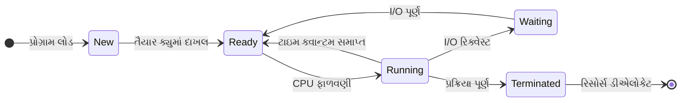
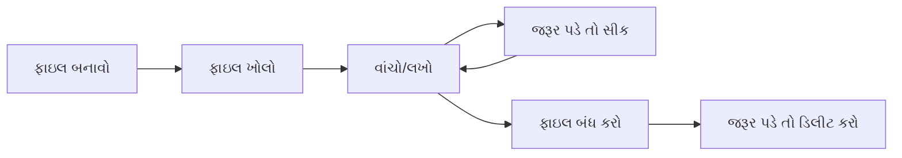

## પ્રશ્ન 1(a) [3 marks]

**ઓપરેટિંગ સિસ્ટમ વ્યાખ્યાયિત કરો અને OS ની જરૂરિયાત સમજાવો.**

**જવાબ**:

**ઓપરેટિંગ સિસ્ટમ** એ સિસ્ટમ સોફ્ટવેર છે જે કમ્પ્યુટર હાર્ડવેર અને એપ્લિકેશન સોફ્ટવેર વચ્ચે મધ્યસ્થી તરીકે કામ કરે છે. તે હાર્ડવેર રિસોર્સનું સંચાલન કરે છે અને યુઝર પ્રોગ્રામ્સને સેવાઓ પ્રદાન કરે છે.

**ઓપરેટિંગ સિસ્ટમની જરૂરિયાત:**

- **રિસોર્સ મેનેજમેન્ટ**: CPU, મેમરી, સ્ટોરેજ અને I/O ડિવાઇસનું કાર્યક્ષમ સંચાલન
- **યુઝર ઇન્ટરફેસ**: યુઝર ઇન્ટરેક્શન માટે કમાન્ડ-લાઇન અને ગ્રાફિકલ ઇન્ટરફેસ પ્રદાન કરે છે
- **પ્રોગ્રામ એક્ઝિક્યુશન**: યુઝર પ્રોગ્રામ્સને સુરક્ષિત રીતે લોડ અને એક્ઝિક્યુટ કરે છે

**મેમરી ટ્રીક:** "RUP - રિસોર્સ, યુઝર, પ્રોગ્રામ મેનેજમેન્ટ"

## પ્રશ્ન 1(b) [4 marks]

**પ્રક્રિયા નિયંત્રણ બ્લોક (PCB) પર એક ટૂંકી નોંધ લખો.**

**જવાબ**:

પ્રોસેસ કન્ટ્રોલ બ્લોક (PCB) એ ડેટા સ્ટ્રક્ચર છે જે ઓપરેટિંગ સિસ્ટમ દ્વારા દરેક ચાલતી પ્રક્રિયા માટે જાળવવામાં આવે છે.

| PCB ઘટક | વર્ણન |
|---------|--------|
| પ્રોસેસ ID | પ્રક્રિયા માટે અનન્ય ઓળખકર્તા |
| પ્રોસેસ સ્ટેટ | વર્તમાન સ્થિતિ (તૈયાર, ચાલુ, રાહ જોવી) |
| પ્રોગ્રામ કાઉન્ટર | એક્ઝિક્યુટ કરવાની આગળની instruction નું સરનામું |
| CPU રજિસ્ટર્સ | પ્રક્રિયા suspend થાય ત્યારે CPU રજિસ્ટર્સની કિંમતો |
| મેમરી મેનેજમેન્ટ | બેઝ અને લિમિટ રજિસ્ટર્સ, પેજ ટેબલ્સ |
| I/O સ્ટેટસ | ખુલ્લી ફાઇલો અને I/O ડિવાઇસની યાદી |

**મુખ્ય કાર્યો:**

- **પ્રક્રિયા ઓળખ**: અનન્ય પ્રોસેસ ID અને પેરેન્ટ પ્રોસેસ ID સ્ટોર કરે છે
- **સ્ટેટ ઇન્ફર્મેશન**: વર્તમાન એક્ઝિક્યુશન સ્ટેટ અને કન્ટેક્સ્ટ જાળવે છે
- **રિસોર્સ એલોકેશન**: ફાળવેલ રિસોર્સ અને મેમરી ઉપયોગનું ટ્રેકિંગ કરે છે

**મેમરી ટ્રીક:** "PIS - Process ID, Information, State tracking"

## પ્રશ્ન 1(c) [7 marks]

**વિવિધ પ્રકારની ઓપરેટિંગ સિસ્ટમોની યાદી બનાવો. બેચ ઓપરેટિંગ સિસ્ટમના કાર્યને યોગ્ય ઉદાહરણ સાથે સમજાવો.**

**જવાબ**:

**ઓપરેટિંગ સિસ્ટમના પ્રકારો:**

| પ્રકાર | વર્ણન |
|------|-------|
| બેચ OS | સમાન જોબ્સને જૂથમાં મૂકીને એકસાથે એક્ઝિક્યુટ કરે છે |
| ટાઇમ-શેરિંગ OS | બહુવિધ વપરાશકર્તાઓ સિસ્ટમને એકસાથે શેર કરે છે |
| રીયલ-ટાઇમ OS | નિશ્ચિત રિસ્પોન્સ ટાઇમની ગેરંટી આપે છે |
| ડિસ્ટ્રિબ્યુટેડ OS | બહુવિધ કનેક્ટેડ કમ્પ્યુટર્સનું સંચાલન કરે છે |
| નેટવર્ક OS | નેટવર્ક સેવાઓ અને રિસોર્સ શેરિંગ પ્રદાન કરે છે |
| મોબાઇલ OS | મોબાઇલ ડિવાઇસ માટે ડિઝાઇન કરેલ |

**બેચ ઓપરેટિંગ સિસ્ટમનું કાર્ય:**

```goat
+----------+    +----------+    +----------+    +----------+
|  Job 1   |    |  Job 2   |    |  Job 3   |    |  Job 4   |
| COBOL    | -> | FORTRAN  | -> |   C++    | -> |  JAVA    |
| Programs |    | Programs |    | Programs |    | Programs |
+----------+    +----------+    +----------+    +----------+
     |               |               |               |
     v               v               v               v
+--------------------------------------------------------+
|              Batch Queue Manager                       |
+--------------------------------------------------------+
     |
     v
+----------+    +----------+    +----------+
|   CPU    |    |  Memory  |    |   I/O    |
| Executor | -> | Manager  | -> | Handler  |
+----------+    +----------+    +----------+
```

**ઉદાહરણ**: બેંક ટ્રાન્ઝેક્શન પ્રોસેસિંગ જ્યાં દિવસભરના બધા ટ્રાન્ઝેક્શન્સ એકત્રિત કરીને રાત્રે કાર્યક્ષમતા માટે એકસાથે પ્રોસેસ કરવામાં આવે છે.

**મુખ્ય લક્ષણો:**

- **જોબ ગ્રુપિંગ**: કાર્યક્ષમતા માટે સમાન જોબ્સ એકસાથે એક્ઝિક્યુટ કરવામાં આવે છે
- **કોઈ યુઝર ઇન્ટરેક્શન નહીં**: એકવાર સબમિટ કર્યા પછી જોબ્સ યુઝર દખલ વિના ચાલે છે
- **ઉચ્ચ થ્રુપુટ**: સિસ્ટમ ઉપયોગને મહત્તમ બનાવે છે

**મેમરી ટ્રીક:** "JNH - Jobs grouped, No interaction, High throughput"

## પ્રશ્ન 1(c) OR [7 marks]

**વિવિધ પ્રકારની ઓપરેટિંગ સિસ્ટમોની યાદી બનાવો. રીયલ ટાઇમ ઓપરેટિંગ સિસ્ટમ્સ વિગતવાર સમજાવો.**

**જવાબ**:

**ઓપરેટિંગ સિસ્ટમના પ્રકારો:**
(ઉપરની જેમ સમાન ટેબલ)

**રીયલ-ટાઇમ ઓપરેટિંગ સિસ્ટમ (RTOS):**

રીયલ-ટાઇમ OS એ નિર્દિષ્ટ સમય મર્યાદામાં ગેરંટીડ રિસ્પોન્સ પ્રદાન કરે છે જે મહત્વપૂર્ણ એપ્લિકેશન્સ માટે જરૂરી છે.

**RTOS ના પ્રકારો:**

| પ્રકાર | ડેડલાઇન | ઉદાહરણ |
|------|---------|--------|
| હાર્ડ રીયલ-ટાઇમ | ડેડલાઇન પૂરી કરવી જ જોઈએ | એર ટ્રાફિક કંટ્રોલ, પેસમેકર |
| સોફ્ટ રીયલ-ટાઇમ | થોડો વિલંબ સહન કરી શકે | વિડિયો સ્ટ્રીમિંગ, ઓનલાઇન ગેમિંગ |
| ફર્મ રીયલ-ટાઇમ | કભીકભાર ડેડલાઇન મિસ સ્વીકાર્ય | લાઇવ ઓડિયો પ્રોસેસિંગ |

**લક્ષણો:**

- **નિર્ધારિત**: બધા ઓપરેશન માટે અનુમાનિત રિસ્પોન્સ ટાઇમ
- **પ્રાયોરિટી-આધારિત શેડ્યુલિંગ**: ઉચ્ચ પ્રાયોરિટી ટાસ્કને તાત્કાલિક ધ્યાન
- **ન્યૂનતમ ઇન્ટરપ્ટ લેટન્સી**: ઝડપી કન્ટેક્સ્ટ સ્વિચિંગ ક્ષમતાઓ
- **મેમરી મેનેજમેન્ટ**: વિલંબ વિના રીયલ-ટાઇમ મેમરી એલોકેશન

**એપ્લિકેશન્સ:**

- મેડિકલ ડિવાઇસ, ઓટોમોટિવ સિસ્ટમ્સ, ઇન્ડસ્ટ્રિયલ ઓટોમેશન, એરોસ્પેસ કંટ્રોલ સિસ્ટમ્સ

**મેમરી ટ્રીક:** "DPMA - Deterministic, Priority-based, Minimal latency, Applications critical"

## પ્રશ્ન 2(a) [3 marks]

**પ્રોગ્રામ અને પ્રક્રિયા વચ્ચે તફાવત કરો.**

**જવાબ**:

| પાસું | પ્રોગ્રામ | પ્રક્રિયા |
|------|---------|-----------|
| વ્યાખ્યા | ડિસ્ક પર સંગ્રહિત સ્ટેટિક કોડ | એક્ઝિક્યુશનમાં પ્રોગ્રામ |
| સ્થિતિ | પેસિવ એન્ટિટી | એક્ટિવ એન્ટિટી |
| મેમરી | કોઈ મેમરી એલોકેશન નહીં | એલોકેટેડ મેમરી સ્પેસ |
| જીવનકાળ | ડિલીટ થાય ત્યાં સુધી કાયમી | એક્ઝિક્યુશન દરમિયાન અસ્થાયી |
| રિસોર્સ | કોઈ રિસોર્સ વપરાશ નહીં | CPU, મેમરી, I/O વપરાશ કરે છે |

**મુખ્ય તફાવતો:**

- **સ્ટેટિક vs ડાયનેમિક**: પ્રોગ્રામ સ્ટેટિક ફાઇલ છે, પ્રક્રિયા ડાયનેમિક એક્ઝિક્યુશન છે
- **રિસોર્સ ઉપયોગ**: પ્રક્રિયા સિસ્ટમ રિસોર્સનો વપરાશ કરે છે, પ્રોગ્રામ નહીં
- **બહુવિધ ઇન્સ્ટન્સ**: એક પ્રોગ્રામ બહુવિધ પ્રક્રિયાઓ બનાવી શકે છે

**મેમરી ટ્રીક:** "SDR - Static vs Dynamic, Resource usage, Multiple instances"

## પ્રશ્ન 2(b) [4 marks]

**પ્રક્રિયા સ્થિતિ રેખાકૃતિની મદદથી પ્રક્રિયાની વિવિધ અવસ્થાઓ સમજાવો.**

**જવાબ**:



**પ્રક્રિયા સ્થિતિઓ:**

| સ્થિતિ | વર્ણન |
|--------|-------|
| New | પ્રક્રિયા બનાવવામાં આવી રહી છે |
| Ready | CPU એસાઇનમેન્ટની રાહ જોઈ રહી છે |
| Running | હાલમાં CPU પર એક્ઝિક્યુટ થઈ રહી છે |
| Waiting | I/O અથવા ઇવેન્ટ માટે બ્લોક થયેલ |
| Terminated | પ્રક્રિયાનું એક્ઝિક્યુશન પૂર્ણ થયું |

**સ્થિતિ પરિવર્તનો:**

- **Ready થી Running**: પ્રોસેસ શેડ્યુલર CPU ફાળવે છે
- **Running થી Ready**: ટાઇમ સ્લાઇસ સમાપ્ત અથવા ઉચ્ચ પ્રાયોરિટી પ્રોસેસ આવે છે
- **Running થી Waiting**: પ્રક્રિયા I/O ઓપરેશન માંગે છે
- **Waiting થી Ready**: I/O ઓપરેશન પૂર્ણ થાય છે

**મેમરી ટ્રીક:** "NRWRT - New, Ready, Waiting, Running, Terminated states"

## પ્રશ્ન 2(c) [7 marks]

**રાઉન્ડ રોબિન અલ્ગોરિધમનું વર્ણન કરો. આપેલ ડેટા માટે ગેન્ટ ચાર્ટ સાથે સરેરાશ રાહ જોવાનો સમય અને સરેરાશ ટર્ન-અરાઉન્ડ સમયની ગણતરી કરો. કન્ટેક્સ્ટ સ્વિચ = 01 ms અને ક્વાન્ટમ ટાઇમ = 04 ms ધ્યાનમાં લો.**

**જવાબ**:

**રાઉન્ડ રોબિન અલ્ગોરિધમ:**
રાઉન્ડ રોબિન એ પ્રીએમ્પ્ટિવ શેડ્યુલિંગ અલ્ગોરિધમ છે જ્યાં દરેક પ્રક્રિયાને ગોળાકાર રીતે સમાન CPU સમય (ક્વાન્ટમ) મળે છે.

**આપેલ ડેટા:**

- ક્વાન્ટમ ટાઇમ = 4 ms
- કન્ટેક્સ્ટ સ્વિચ = 1 ms

| પ્રક્રિયા | આગમન સમય | બર્સ્ટ ટાઇમ |
|----------|------------|------------|
| P1 | 0 | 8 |
| P2 | 3 | 3 |
| P3 | 1 | 10 |
| P4 | 4 | 5 |

**ગેન્ટ ચાર્ટ:**

```
0   4  5   8  9  13 14  18 19  22 23  26 27  29
|P1 |CS|P3|CS|P1|CS|P2|CS|P3|CS|P4|CS|P3|CS|P4|
```

**ગણતરીઓ:**

| પ્રક્રિયા | કમ્પ્લીશન ટાઇમ | ટર્નઅરાઉન્ડ ટાઇમ | વેઇટિંગ ટાઇમ |
|----------|-----------------|------------------|---------------|
| P1 | 13 | 13 | 5 |
| P2 | 18 | 15 | 12 |
| P3 | 26 | 25 | 15 |
| P4 | 29 | 25 | 20 |

**સરેરાશ વેઇટિંગ ટાઇમ = (5 + 12 + 15 + 20) / 4 = 13 ms**
**સરેરાશ ટર્નઅરાઉન્ડ ટાઇમ = (13 + 15 + 25 + 25) / 4 = 19.5 ms**

**મુખ્ય લક્ષણો:**

- **ન્યાયી શેડ્યુલિંગ**: દરેક પ્રક્રિયાને સમાન CPU સમય મળે છે
- **પ્રીએમ્પ્ટિવ**: ક્વાન્ટમ સમાપ્ત થયા પછી રનિંગ પ્રોસેસ ઇન્ટરપ્ટ થાય છે
- **કન્ટેક્સ્ટ સ્વિચિંગ**: ગણતરીમાં ઓવરહેડ સામેલ છે

**મેમરી ટ્રીક:** "FPC - Fair, Preemptive, Context switching overhead"

## પ્રશ્ન 2(a) OR [3 marks]

**તફાવત કરો: CPU બાઉન્ડ પ્રક્રિયા v/s I/O બાઉન્ડ પ્રક્રિયા.**

**જવાબ**:

| પાસું | CPU બાઉન્ડ પ્રક્રિયા | I/O બાઉન્ડ પ્રક્રિયા |
|------|-------------------|-------------------|
| પ્રાથમિક પ્રવૃત્તિ | સઘન ગણતરીઓ | વારંવાર I/O ઓપરેશન્સ |
| CPU ઉપયોગ | ઉચ્ચ CPU ઉપયોગ | નીચો CPU ઉપયોગ |
| બર્સ્ટ ટાઇમ | લાંબા CPU બર્સ્ટ્સ | ટૂંકા CPU બર્સ્ટ્સ |
| વેઇટિંગ ટાઇમ | ઓછી I/O રાહ | વધુ I/O રાહ |
| ઉદાહરણો | ગાણિતિક ગણતરીઓ, ઇમેજ પ્રોસેસિંગ | ફાઇલ ઓપરેશન્સ, ડેટાબેઝ ક્વેરીઝ |

**મુખ્ય તફાવતો:**

- **રિસોર્સ વપરાશ**: CPU-બાઉન્ડ વધુ પ્રોસેસર વાપરે છે, I/O-બાઉન્ડ વધુ ઇનપુટ/આઉટપુટ વાપરે છે
- **પર્ફોર્મન્સ ઇમ્પેક્ટ**: CPU-બાઉન્ડ પ્રોસેસર સ્પીડથી પ્રભાવિત, I/O-બાઉન્ડ સ્ટોરેજ સ્પીડથી પ્રભાવિત
- **શેડ્યુલિંગ પ્રાયોરિટી**: વિવિધ અલ્ગોરિધમ્સ દરેક પ્રકારને અલગ રીતે પસંદ કરે છે

**મેમરી ટ્રીક:** "CIR - CPU intensive, I/O intensive, Resource usage differs"

## પ્રશ્ન 2(b) OR [4 marks]

**ડેડલોક શું છે? ડેડલોક થવા માટે જરૂરી શરતો સમજાવો.**

**જવાબ**:

**ડેડલોક** એ એવી પરિસ્થિતિ છે જ્યાં બે અથવા વધુ પ્રક્રિયાઓ કાયમી રૂપે બ્લોક થાય છે, દરેક અન્ય દ્વારા રાખવામાં આવેલા રિસોર્સની રાહ જોતી હોય છે.

**જરૂરી શરતો (કોફમેન કંડિશન્સ):**

| શરત | વર્ણન |
|-----|-------|
| મ્યુચ્યુઅલ એક્સક્લુઝન | રિસોર્સ એકસાથે શેર કરી શકાતા નથી |
| હોલ્ડ એન્ડ વેઇટ | પ્રક્રિયા રિસોર્સ પકડીને અન્યની રાહ જુએ છે |
| નો પ્રીએમ્પ્શન | રિસોર્સ બળજબરીથી પ્રક્રિયામાંથી લઈ શકાતા નથી |
| સર્ક્યુલર વેઇટ | રિસોર્સની રાહ જોતી પ્રક્રિયાઓની વર્તુળાકાર સાંકળ |

**ઉદાહરણ પરિસ્થિતિ:**

```goat
Process A ----holds----> Resource 1
    |                        ^
    |                        |
    v                        |
waits for              Process B
Resource 2 <---holds----------|
```

**ડેડલોક અટકાવવાની પદ્ધતિઓ:**

- **મ્યુચ્યુઅલ એક્સક્લુઝન દૂર કરો**: શક્ય હોય ત્યારે રિસોર્સને શેરેબલ બનાવો
- **હોલ્ડ એન્ડ વેઇટ અટકાવો**: બધા રિસોર્સ એકસાથે જ માંગો
- **પ્રીએમ્પ્શનને મંજૂરી આપો**: જરૂર પડે ત્યારે બળજબરીથી રિસોર્સ લો
- **સર્ક્યુલર વેઇટ અટકાવો**: રિસોર્સને ક્રમ આપો અને તે ક્રમમાં જ માંગો

**મેમરી ટ્રીક:** "MHNC - Mutual exclusion, Hold-wait, No preemption, Circular wait"

## પ્રશ્ન 2(c) OR [7 marks]

**FCFS અલ્ગોરિધમનું વર્ણન કરો. આપેલ ડેટા માટે ગેન્ટ ચાર્ટ સાથે સરેરાશ વેઇટિંગ ટાઇમ અને સરેરાશ ટર્ન-અરાઉન્ડ ટાઇમની ગણતરી કરો.**

**જવાબ**:

**ફર્સ્ટ કમ ફર્સ્ટ સર્વ (FCFS) અલ્ગોરિધમ:**
FCFS એ નોન-પ્રીએમ્પ્ટિવ શેડ્યુલિંગ અલ્ગોરિધમ છે જ્યાં પ્રક્રિયાઓ આગમન ક્રમમાં એક્ઝિક્યુટ થાય છે.

**આપેલ ડેટા:**

| પ્રક્રિયા | આગમન સમય | બર્સ્ટ ટાઇમ |
|----------|------------|------------|
| P1 | 0 | 7 |
| P2 | 3 | 6 |
| P3 | 5 | 9 |
| P4 | 6 | 4 |

**ગેન્ટ ચાર્ટ:**

```
0        7        13        22        26
|   P1   |   P2   |    P3   |   P4   |
```

**ગણતરીઓ:**

| પ્રક્રિયા | સ્ટાર્ટ ટાઇમ | કમ્પ્લીશન ટાઇમ | ટર્નઅરાઉન્ડ ટાઇમ | વેઇટિંગ ટાઇમ |
|----------|-------------|-----------------|------------------|---------------|
| P1 | 0 | 7 | 7 | 0 |
| P2 | 7 | 13 | 10 | 4 |
| P3 | 13 | 22 | 17 | 8 |
| P4 | 22 | 26 | 20 | 16 |

**સરેરાશ વેઇટિંગ ટાઇમ = (0 + 4 + 8 + 16) / 4 = 7 ms**
**સરેરાશ ટર્નઅરાઉન્ડ ટાઇમ = (7 + 10 + 17 + 20) / 4 = 13.5 ms**

**લક્ષણો:**

- **સરળ અમલીકરણ**: સમજવામાં અને અમલ કરવામાં સરળ
- **નોન-પ્રીએમ્પ્ટિવ**: એકવાર શરૂ થયા પછી, પ્રક્રિયા પૂર્ણ થવા સુધી ચાલે છે
- **કોન્વોય ઇફેક્ટ**: ટૂંકી પ્રક્રિયાઓ લાંબી પ્રક્રિયાઓની રાહ જુએ છે

**મેમરી ટ્રીક:** "SNC - Simple, Non-preemptive, Convoy effect possible"

## પ્રશ્ન 3(a) [3 marks]

**સિંગલ-લેવલ ડિરેક્ટરી માળખું સમજાવો.**

**જવાબ**:

સિંગલ-લેવલ ડિરેક્ટરી સ્ટ્રક્ચર એ સૌથી સરળ ફાઇલ ઓર્ગનાઇઝેશન છે જ્યાં બધી ફાઇલો એક જ ડિરેક્ટરીમાં સ્ટોર કરવામાં આવે છે.

```goat
        રૂટ ડિરેક્ટરી
    +-------------------+
    | file1.txt         |
    | program.exe       |
    | data.dat          |
    | image.jpg         |
    | document.pdf      |
    +-------------------+
```

**લક્ષણો:**

- **સરળ માળખું**: બધી ફાઇલો એક જ સ્થાને
- **અનન્ય નામો**: દરેક ફાઇલનું અનન્ય નામ હોવું જોઈએ
- **કોઈ ઓર્ગનાઇઝેશન નહીં**: કોઈ ગ્રુપિંગ અથવા કેટેગરાઇઝેશન શક્ય નથી

**મર્યાદાઓ:**

- બહુવિધ યુઝર્સ સમાન નામે ફાઇલો બનાવે ત્યારે નામની અથડામણ
- મોટી સંખ્યામાં ફાઇલોને ઓર્ગનાઇઝ કરવું મુશ્કેલ
- યુઝર્સ વચ્ચે કોઈ પ્રાઇવસી અથવા એક્સેસ કંટ્રોલ નથી

**મેમરી ટ્રીક:** "SUN - Simple, Unique names, No organization"

## પ્રશ્ન 3(b) [4 marks]

**વિવિધ ફાઇલ લક્ષણો સમજાવો.**

**જવાબ**:

ફાઇલ એટ્રિબ્યુટ્સ એ મેટાડેટા છે જે ફાઇલ સિસ્ટમમાં સ્ટોર કરેલી ફાઇલો વિશે માહિતી પ્રદાન કરે છે.

| એટ્રિબ્યુટ | વર્ણન |
|-----------|-------|
| નામ | માનવ-વાંચી શકાય તેવું ફાઇલ ઓળખકર્તા |
| પ્રકાર | ફાઇલ ફોર્મેટ (એક્ઝિક્યુટેબલ, ટેક્સ્ટ, ઇમેજ) |
| કદ | વર્તમાન ફાઇલ કદ બાઇટ્સમાં |
| સ્થાન | સ્ટોરેજ ડિવાઇસ પર ભૌતિક સરનામું |
| પ્રોટેક્શન | એક્સેસ પરમિશન્સ (રીડ, રાઇટ, એક્ઝિક્યુટ) |
| ટાઇમ સ્ટેમ્પ્સ | બનાવટ, સુધારા, એક્સેસ સમય |
| માલિક | ફાઇલ બનાવનાર યુઝર |

**સામાન્ય ફાઇલ એટ્રિબ્યુટ્સ:**

- **ઓળખકર્તા**: ફાઇલ સિસ્ટમ રેફરન્સ માટે અનન્ય નંબર
- **પ્રકાર માહિતી**: MIME પ્રકાર અથવા ફાઇલ એક્સ્ટેન્શન
- **કદ અને ફાળવણી**: વર્તમાન કદ અને ફાળવેલ જગ્યા
- **એક્સેસ કંટ્રોલ**: યુઝર પરમિશન્સ અને ગ્રુપ એક્સેસ રાઇટ્સ

**સ્ટોરેજ સ્થાન:**
ફાઇલ એટ્રિબ્યુટ્સ સામાન્ય રીતે ડિરેક્ટરી એન્ટ્રીઝ અથવા ફાઇલ એલોકેશન ટેબલ્સમાં સ્ટોર કરવામાં આવે છે.

**મેમરી ટ્રીક:** "NTSLPTO - Name, Type, Size, Location, Protection, Time, Owner"

## પ્રશ્ન 3(c) [7 marks]

**વિવિધ ફાઇલ ફાળવણી પદ્ધતિઓની યાદી બનાવો અને જરૂરી રેખાકૃતિ સાથે કન્ટીગ્યુઅસ ફાળવણી સમજાવો.**

**જવાબ**:

**ફાઇલ ફાળવણી પદ્ધતિઓ:**

| પદ્ધતિ | વર્ણન |
|-------|-------|
| કન્ટીગ્યુઅસ | ફાઇલો સતત બ્લોક્સમાં સ્ટોર કરવામાં આવે છે |
| લિંક્ડ | ફાઇલો બ્લોક્સની લિંક્ડ લિસ્ટ વાપરીને સ્ટોર કરવામાં આવે છે |
| ઇન્ડેક્સ્ડ | ડેટા બ્લોક્સ તરફ પોઇન્ટ કરવા માટે ઇન્ડેક્સ બ્લોકનો ઉપયોગ કરે છે |

**કન્ટીગ્યુઅસ ફાળવણી:**

કન્ટીગ્યુઅસ ફાળવણીમાં, દરેક ફાઇલ ડિસ્ક પર સતત બ્લોક્સનો સેટ વ્યાપે છે.

```goat
ડિસ્ક બ્લોક્સ:
+---+---+---+---+---+---+---+---+---+---+
| 0 | 1 | 2 | 3 | 4 | 5 | 6 | 7 | 8 | 9 |
+---+---+---+---+---+---+---+---+---+---+
|   |ફાઇલ A|   |  ફાઇલ B  |   |ફાઇલ C|
|   |  2-3  |   |   5-7     |   |  9    |
+---+---+---+---+---+---+---+---+---+---+

ડિરેક્ટરી ટેબલ:
+----------+-------+--------+
| ફાઇલનામ  | શરૂઆત | લંબાઈ  |
+----------+-------+--------+
| ફાઇલ A   |   2   |   2    |
| ફાઇલ B   |   5   |   3    |
| ફાઇલ C   |   9   |   1    |
+----------+-------+--------+
```

**ફાયદા:**

- **ઝડપી એક્સેસ**: બ્લોક સરનામાંની પ્રત્યક્ષ ગણતરી
- **ન્યૂનતમ સીક ટાઇમ**: સતત બ્લોક્સ હેડ મૂવમેન્ટ ઘટાડે છે
- **સરળ અમલીકરણ**: અમલ કરવામાં અને મેનેજ કરવામાં સરળ

**નુકસાનો:**

- **એક્સટર્નલ ફ્રેગમેન્ટેશન**: ફાઇલો વચ્ચે વણવપરાશી જગ્યાઓ
- **ફાઇલ કદની મર્યાદા**: ફાઇલો વિસ્તારવી મુશ્કેલ
- **કોમ્પેક્શનની જરૂર**: સમયાંતરે પુનઃઆયોજનની જરૂર

**મેમરી ટ્રીક:** "FMS vs EFC - Fast access, Minimal seek, Simple vs External fragmentation, File size limits, Compaction needed"

## પ્રશ્ન 3(a) OR [3 marks]

**લિનક્સ ફાઇલ સિસ્ટમના વિવિધ પ્રકારો ટૂંકમાં સમજાવો.**

**જવાબ**:

| ફાઇલ સિસ્ટમ | વર્ણન |
|-------------|-------|
| ext2 | બીજું એક્સ્ટેન્ડેડ ફાઇલસિસ્ટમ, કોઈ જર્નલિંગ નથી |
| ext3 | ત્રીજું એક્સ્ટેન્ડેડ ફાઇલસિસ્ટમ જર્નલિંગ સાથે |
| ext4 | ચોથું એક્સ્ટેન્ડેડ ફાઇલસિસ્ટમ, સુધારેલ પર્ફોર્મન્સ |
| XFS | ઉચ્ચ-પર્ફોર્મન્સ 64-બિટ જર્નલિંગ ફાઇલસિસ્ટમ |
| Btrfs | B-ટ્રી ફાઇલસિસ્ટમ એડવાન્સ્ડ ફીચર્સ સાથે |
| ZFS | કોપી-ઓન-રાઇટ ફાઇલસિસ્ટમ ડેટા ઇન્ટેગ્રિટી સાથે |

**મુખ્ય લક્ષણો:**

- **જર્નલિંગ**: ext3, ext4, XFS ક્રેશ રિકવરી પ્રદાન કરે છે
- **પર્ફોર્મન્સ**: ext4, XFS મોટી ફાઇલો માટે ઓપ્ટિમાઇઝ્ડ છે
- **એડવાન્સ્ડ ફીચર્સ**: Btrfs, ZFS સ્નેપશોટ્સ અને કમ્પ્રેશન ઓફર કરે છે

**પસંદગીના માપદંડો:**
પર્ફોર્મન્સ, વિશ્વસનીયતા અને ફીચર આવશ્યકતાઓના આધારે વિવિધ ફાઇલસિસ્ટમ્સ વિવિધ ઉપયોગ કેસો માટે યોગ્ય છે.

**મેમરી ટ્રીક:** "EEXBZ - ext2/3/4, XFS, Btrfs, ZFS વિકલ્પો"

## પ્રશ્ન 3(b) OR [4 marks]

**વિવિધ ફાઇલ ઓપરેશન્સ સમજાવો.**

**જવાબ**:

| ઓપરેશન | વર્ણન |
|---------|-------|
| બનાવો | નિર્દિષ્ટ નામ અને એટ્રિબ્યુટ્સ સાથે નવી ફાઇલ બનાવો |
| ખોલો | રીડિંગ/રાઇટિંગ ઓપરેશન્સ માટે ફાઇલ તૈયાર કરો |
| વાંચો | વર્તમાન સ્થિતિ પરથી ફાઇલમાંથી ડેટા મેળવો |
| લખો | વર્તમાન સ્થિતિ પર ફાઇલમાં ડેટા સ્ટોર કરો |
| સીક | ફાઇલ પોઇન્ટરને વિશિષ્ટ સ્થિતિ પર ખસેડો |
| બંધ કરો | ફાઇલ રિસોર્સ રિલીઝ કરો અને મેટાડેટા અપડેટ કરો |
| ડિલીટ કરો | ફાઇલ દૂર કરો અને સ્ટોરેજ સ્પેસ ડીએલોકેટ કરો |

**ફાઇલ ઓપરેશન સિક્વન્સ:**



**મહત્વપૂર્ણ વિચારણાઓ:**

- **એરર હેન્ડલિંગ**: દરેક ઓપરેશન નિષ્ફળ થઈ શકે છે અને ચેક કરવું જોઈએ
- **પરમિશન્સ**: યુઝર પાસે યોગ્ય એક્સેસ રાઇટ્સ હોવા જોઈએ
- **સમાન સમયે એક્સેસ**: બહુવિધ પ્રક્રિયાઓ એક જ ફાઇલને એક્સેસ કરી શકે છે

**મેમરી ટ્રીક:** "CORWSCD - Create, Open, Read, Write, Seek, Close, Delete"

## પ્રશ્ન 3(c) OR [7 marks]

**વિવિધ ફાઇલ ફાળવણી પદ્ધતિઓની યાદી બનાવો અને જરૂરી રેખાકૃતિ સાથે ઇન્ડેક્સ્ડ ફાળવણી સમજાવો.**

**જવાબ**:

**ફાઇલ ફાળવણી પદ્ધતિઓ:**

| ઓપરેશન | વર્ણન |
|---------|-------|
| બનાવો | નિર્દિષ્ટ નામ અને એટ્રિબ્યુટ્સ સાથે નવી ફાઇલ બનાવો |
| ખોલો | રીડિંગ/રાઇટિંગ ઓપરેશન્સ માટે ફાઇલ તૈયાર કરો |
| વાંચો | વર્તમાન સ્થિતિ પરથી ફાઇલમાંથી ડેટા મેળવો |
| લખો | વર્તમાન સ્થિતિ પર ફાઇલમાં ડેટા સ્ટોર કરો |
| સીક | ફાઇલ પોઇન્ટરને વિશિષ્ટ સ્થિતિ પર ખસેડો |
| બંધ કરો | ફાઇલ રિસોર્સ રિલીઝ કરો અને મેટાડેટા અપડેટ કરો |
| ડિલીટ કરો | ફાઇલ દૂર કરો અને સ્ટોરેજ સ્પેસ ડીએલોકેટ કરો |

**ઇન્ડેક્સ્ડ ફાળવણી:**

ઇન્ડેક્સ્ડ ફાળવણીમાં, દરેક ફાઇલ પાસે ડેટા બ્લોક્સના પોઇન્ટર્સ ધરાવતો ઇન્ડેક્સ બ્લોક હોય છે.

```goat
ફાઇલ A માટે ઇન્ડેક્સ બ્લોક:
+---+---+---+---+
| 2 | 5 | 8 | 9 |
+---+---+---+---+
  |   |   |   |
  v   v   v   v
ડિસ્ક બ્લોક્સ:
+---+---+---+---+---+---+---+---+---+---+
| 0 | 1 | 2 | 3 | 4 | 5 | 6 | 7 | 8 | 9 |
+---+---+---+---+---+---+---+---+---+---+
|   |   |ફાઇલA|   |   |ફાઇલA|   |   |ફાઇલA|ફાઇલA|

ડિરેક્ટરી ટેબલ:
+----------+-------------+
| ફાઇલનામ  | ઇન્ડેક્સ બ્લોક |
+----------+-------------+
| ફાઇલ A   |      1      |
+----------+-------------+
```

**ઇન્ડેક્સ્ડ ફાળવણીના પ્રકારો:**

- **સિંગલ-લેવલ**: ફાઇલ દીઠ એક ઇન્ડેક્સ બ્લોક
- **મલ્ટિ-લેવલ**: ઇન્ડેક્સ બ્લોક્સ અન્ય ઇન્ડેક્સ બ્લોક્સ તરફ પોઇન્ટ કરે છે
- **કમ્બાઇન્ડ**: ડાઇરેક્ટ અને ઇન્ડાઇરેક્ટ પોઇન્ટર્સનું મિશ્રણ

**ફાયદા:**

- **કોઈ એક્સટર્નલ ફ્રેગમેન્ટેશન નહીં**: બ્લોક્સ ડિસ્ક પર ગમે ત્યાં હોઈ શકે છે
- **ડાયનેમિક ફાઇલ કદ**: ફાઇલો વિસ્તારવી સરળ છે
- **ઝડપી રેન્ડમ એક્સેસ**: કોઈપણ બ્લોકમાં ડાઇરેક્ટ એક્સેસ

**નુકસાનો:**

- **ઇન્ડેક્સ બ્લોક ઓવરહેડ**: પોઇન્ટર્સ સ્ટોર કરવા માટે વધારાની જગ્યા
- **બહુવિધ ડિસ્ક એક્સેસ**: બે એક્સેસની જરૂર (ઇન્ડેક્સ + ડેટા)
- **નાની ફાઇલ અકાર્યક્ષમતા**: નાની ફાઇલો માટે ઓવરહેડ વધુ

**મેમરી ટ્રીક:** "NDF vs IMI - No fragmentation, Dynamic size, Fast access vs Index overhead, Multiple access, Inefficient for small files"

## પ્રશ્ન 4(a) [3 marks]

**સિસ્ટમ ધમકીઓ વ્યાખ્યાયિત કરો અને તેના પ્રકારો સમજાવો.**

**જવાબ**:

**સિસ્ટમ ધમકીઓ** એ કમ્પ્યુટર સિસ્ટમના કામકાજને ખલેલ પહોંચાડવા, નુકસાન પહોંચાડવા, માહિતી ચોરવા અથવા અનધિકૃત પ્રવેશ મેળવવાના દુર્ભાવનાપૂર્ણ પ્રયાસો છે.

| ધમકીનો પ્રકાર | વર્ણન |
|-------------|-------|
| વર્મ્સ | નેટવર્ક પર ફેલાતા સ્વ-પ્રતિકૃત પ્રોગ્રામ્સ |
| વાયરસ | અન્ય પ્રોગ્રામ્સ સાથે જોડાતા દુર્ભાવનાપૂર્ણ કોડ |
| ટ્રોજન હોર્સ | છુપાયેલા દુર્ભાવનાપૂર્ણ કાર્યો સાથે કાયદેસર દેખાતા પ્રોગ્રામ્સ |
| ડિનાયલ ઓફ સર્વિસ | સિસ્ટમ રિસોર્સને ભરાઈ જવાની હુમલાઓ |
| પોર્ટ સ્કેનિંગ | નેટવર્ક સેવાઓની અનધિકૃત તપાસ |

**સિસ્ટમ ધમકીઓના વર્ગો:**

- **નેટવર્ક-આધારિત**: નેટવર્ક કનેક્શન્સ અને પ્રોટોકોલ્સ દ્વારા હુમલાઓ
- **હોસ્ટ-આધારિત**: વિશિષ્ટ કમ્પ્યુટર સિસ્ટમ્સને લક્ષ્ય બનાવતા હુમલાઓ
- **ભૌતિક**: સિસ્ટમને સમાધાન કરવા માટે પ્રત્યક્ષ ભૌતિક પ્રવેશ

**પ્રભાવ:**
સિસ્ટમ ધમકીઓ ડેટા ખોવાઈ જવા, સિસ્ટમ ડાઉનટાઇમ, ગોપનીયતા ભંગ અને આર્થિક નુકસાન તરફ દોરી શકે છે.

**મેમરી ટ્રીક:** "WVTDP - Worms, Viruses, Trojans, DoS, Port scanning"

## પ્રશ્ન 4(b) [4 marks]

**તફાવત કરો: યુઝર ઓથેન્ટિકેશન v/s યુઝર ઓથોરાઇઝેશન.**

**જવાબ**:

| પાસું | યુઝર ઓથેન્ટિકેશન | યુઝર ઓથોરાઇઝેશન |
|------|------------------|------------------|
| હેતુ | યુઝરની ઓળખ ચકાસવી | યુઝર પરમિશન્સ નક્કી કરવી |
| ક્યારે | સિસ્ટમ એક્સેસ પહેલાં | ઓથેન્ટિકેશન પછી |
| પદ્ધતિઓ | પાસવર્ડ્સ, બાયોમેટ્રિક્સ, ટોકન્સ | એક્સેસ કંટ્રોલ લિસ્ટ્સ, રોલ્સ |
| પ્રશ્ન | "તમે કોણ છો?" | "તમે શું કરી શકો?" |
| પ્રક્રિયા | લોગિન સમયે એકવાર | સેશન દરમિયાન સતત |

**ઓથેન્ટિકેશનની પદ્ધતિઓ:**

- **તમે જે જાણો છો**: પાસવર્ડ્સ, PINs
- **તમે જે છો**: ફિંગરપ્રિન્ટ્સ, રેટિના સ્કેન્સ
- **તમારી પાસે જે છે**: સ્માર્ટ કાર્ડ્સ, ટોકન્સ

**ઓથોરાઇઝેશન મોડલ્સ:**

- **રોલ-આધારિત એક્સેસ કંટ્રોલ (RBAC)**: યુઝર રોલ્સના આધારે પરમિશન્સ
- **ડિસ્ક્રેશનરી એક્સેસ કંટ્રોલ (DAC)**: માલિક એક્સેસ કંટ્રોલ કરે છે
- **મેન્ડેટરી એક્સેસ કંટ્રોલ (MAC)**: સિસ્ટમ-લાગુ કરેલા સિક્યોરિટી લેવલ્સ

**સંબંધ:**
ઓથોરાઇઝેશન પહેલાં ઓથેન્ટિકેશન થવી જોઈએ. વ્યાપક સિક્યોરિટી માટે બંને જરૂરી છે.

**મેમરી ટ્રીક:** "WHO vs WHAT - ઓથેન્ટિકેશન પૂછે છે કોણ, ઓથોરાઇઝેશન નક્કી કરે છે શું"

## પ્રશ્ન 4(c) [7 marks]

**વિવિધ ઓપરેટિંગ સિસ્ટમ સિક્યોરિટી નીતિઓ અને પ્રક્રિયાઓની ચર્ચા કરો.**

**જવાબ**:

**સિક્યોરિટી નીતિઓ:**

| નીતિનો પ્રકાર | વર્ણન |
|-------------|-------|
| એક્સેસ કંટ્રોલ | કોણ કયા રિસોર્સને એક્સેસ કરી શકે તે વ્યાખ્યાયિત કરે છે |
| પાસવર્ડ નીતિ | પાસવર્ડ બનાવટ અને સંચાલનના નિયમો |
| ઓડિટ નીતિ | સિસ્ટમ પ્રવૃત્તિઓનું લોગિંગ અને મોનિટરિંગ |
| અપડેટ નીતિ | નિયમિત સિક્યોરિટી પેચ અને અપડેટ્સ |
| ડેટા ક્લાસિફિકેશન | સેન્સિટિવિટી લેવલ્સ પ્રમાણે ડેટાનું વર્ગીકરણ |

**સિક્યોરિટી પ્રક્રિયાઓ:**

**1. યુઝર એકાઉન્ટ મેનેજમેન્ટ:**

- યુઝર એકાઉન્ટ્સ અને પરમિશન્સની નિયમિત સમીક્ષા
- નિવૃત્ત કર્મચારીઓ માટે એક્સેસનું તાત્કાલિક રદ્દીકરણ
- લીસ્ટ પ્રિવિલેજ સિદ્ધાંતનો અમલ

**2. સિસ્ટમ મોનિટરિંગ:**


**3. ઇન્સિડન્ટ રિસ્પોન્સ:**

- **શોધ**: સિક્યોરિટી ઇન્સિડન્ટ્સને ઝડપથી ઓળખવી
- **નિયંત્રણ**: નુકસાન મર્યાદિત કરવું અને ફેલાવો રોકવો
- **પુનઃપ્રાપ્તિ**: સામાન્ય કામકાજ સુરક્ષિત રીતે પુનઃસ્થાપિત કરવું

**4. બેકઅપ અને રિકવરી:**

- પરીક્ષિત રિસ્ટોર પ્રક્રિયાઓ સાથે નિયમિત ડેટા બેકઅપ્સ
- ડિઝાસ્ટર રિકવરી પ્લાનિંગ અને ટેસ્ટિંગ
- બિઝનેસ કન્ટિન્યુઇટી પગલાં

**અમલીકરણ ફ્રેમવર્ક:**

- **રિસ્ક એસેસમેન્ટ**: નબળાઈઓ અને ધમકીઓની ઓળખ
- **નીતિ વિકાસ**: વ્યાપક સિક્યોરિટી ગાઇડલાઇન્સ બનાવવી
- **ટ્રેનિંગ**: યુઝર્સને સિક્યોરિટી પ્રથાઓ વિશે શિક્ષિત કરવા
- **કમ્પ્લાયન્સ**: નિયમોનું પાલન સુનિશ્ચિત કરવું

**મેમરી ટ્રીક:** "AAPUD નીતિઓ + UMSIR પ્રક્રિયાઓ - Access, Audit, Password, Update, Data classification + User management, Monitoring, System response, Incident handling, Recovery"

## પ્રશ્ન 4(a) OR [3 marks]

**પ્રોગ્રામ ધમકીઓ વ્યાખ્યાયિત કરો અને તેના પ્રકારો સમજાવો.**

**જવાબ**:

**પ્રોગ્રામ ધમકીઓ** એ કમ્પ્યુટર પ્રોગ્રામ્સ અને ડેટાને ખલેલ પહોંચાડવા, નુકસાન પહોંચાડવા અથવા અનધિકૃત પ્રવેશ મેળવવા માટે ડિઝાઇન કરેલ દુર્ભાવનાપૂર્ણ સોફ્ટવેર છે.

| ધમકીનો પ્રકાર | વર્ણન |
|-------------|-------|
| મેલવેર | વાયરસ, વર્મ્સ સહિત દુર્ભાવનાપૂર્ણ સોફ્ટવેર |
| સ્પાયવેર | યુઝર પ્રવૃત્તિઓનું ગુપ્ત રીતે મોનિટરિંગ કરતા પ્રોગ્રામ્સ |
| એડવેર | અનિચ્છિત એડવર્ટાઇઝિંગ સોફ્ટવેર |
| રેન્સમવેર | ડેટા એન્ક્રિપ્ટ કરીને પેમેન્ટ માંગે છે |
| રૂટકિટ્સ | શોધથી દુર્ભાવનાપૂર્ણ પ્રવૃત્તિઓ છુપાવે છે |

**પ્રોગ્રામ ધમકીના વર્ગો:**

- **એક્ઝિક્યુટેબલ ધમકીઓ**: સ્વતંત્ર દુર્ભાવનાપૂર્ણ પ્રોગ્રામ્સ
- **પેરાસાઇટિક ધમકીઓ**: કાયદેસર પ્રોગ્રામ્સ સાથે જોડાય છે
- **નેટવર્ક ધમકીઓ**: નેટવર્ક કનેક્શન્સ દ્વારા ફેલાય છે

**સામાન્ય હુમલાના માર્ગો:**

- ઇમેઇલ એટેચમેન્ટ્સ અને ડાઉનલોડ્સ
- ઇન્ફેક્ટેડ રિમૂવેબલ મીડિયા
- નેટવર્ક નબળાઈઓ અને એક્સપ્લોઇટ્સ

**મેમરી ટ્રીક:** "MSARR - Malware, Spyware, Adware, Ransomware, Rootkits"

## પ્રશ્ન 4(b) OR [4 marks]

**પ્રોટેક્શન ડોમેનને યોગ્ય ઉદાહરણ સાથે સમજાવો.**

**જવાબ**:

**પ્રોટેક્શન ડોમેન** એ ઓબ્જેક્ટ્સ અને એક્સેસ રાઇટ્સનો સેટ છે જે વ્યાખ્યાયિત કરે છે કે પ્રક્રિયા કયા રિસોર્સને એક્સેસ કરી શકે છે અને કયા ઓપરેશન્સ કરી શકે છે.

| ઘટક | વર્ણન |
|-----|-------|
| ઓબ્જેક્ટ્સ | ફાઇલો, મેમરી, ડિવાઇસ જેવા રિસોર્સ |
| એક્સેસ રાઇટ્સ | રીડ, રાઇટ, એક્ઝિક્યુટ જેવી પરમિશન્સ |
| સબ્જેક્ટ્સ | એક્સેસ માંગતી પ્રક્રિયાઓ અથવા યુઝર્સ |

**ડોમેન સ્ટ્રક્ચર:**

```goat
Protection Domain A
+------------------+
| Objects:         |
| - File1 (R,W)    |
| - Printer (W)    |
| - Memory (R,W,X) |
+------------------+

Protection Domain B
+------------------+
| Objects:         |
| - File2 (R)      |
| - Network (R,W)  |
| - Database (R)   |
+------------------+
```

**ઉદાહરણ - યુનિવર્સિટી સિસ્ટમ:**

- **સ્ટુડન્ટ ડોમેન**: કોર્સ મટીરિયલ્સને રીડ એક્સેસ, એસાઇનમેન્ટ્સને રાઇટ એક્સેસ
- **ફેકલ્ટી ડોમેન**: ગ્રેડ ડેટાબેઝને રીડ/રાઇટ એક્સેસ, સ્ટુડન્ટ રેકોર્ડ્સને રીડ એક્સેસ
- **એડમિન ડોમેન**: સિસ્ટમ કન્ફિગરેશન, યુઝર મેનેજમેન્ટને ફુલ એક્સેસ

**ડોમેન સ્વિચિંગ:**
પ્રક્રિયાઓ નીચેના આધારે ડોમેન્સ વચ્ચે સ્વિચ કરી શકે છે:

- યુઝર ઓથેન્ટિકેશન અને ઓથોરાઇઝેશન
- પ્રોગ્રામ એક્ઝિક્યુશન કન્ટેક્સ્ટ
- સિક્યોરિટી લેવલ આવશ્યકતાઓ

**ફાયદા:**

- **આઇસોલેશન**: ડોમેન્સ વચ્ચે અનધિકૃત એક્સેસ અટકાવે છે
- **લવચીકતા**: નિયંત્રિત રિસોર્સ શેરિંગની મંજૂરી આપે છે
- **સિક્યોરિટી**: લીસ્ટ પ્રિવિલેજ સિદ્ધાંતનો અમલ કરે છે

**મેમરી ટ્રીક:** "OAS - Objects, Access rights, Subjects define domains"

## પ્રશ્ન 4(c) OR [7 marks]

**એક્સેસ કંટ્રોલ લિસ્ટ વિગતવાર સમજાવો.**

**જવાબ**:

**એક્સેસ કંટ્રોલ લિસ્ટ (ACL)** એ સિક્યોરિટી મેકેનિઝમ છે જે નિર્દિષ્ટ કરે છે કે કયા યુઝર્સ અથવા પ્રક્રિયાઓને ઓબ્જેક્ટ્સની એક્સેસ આપવામાં આવે છે અને કયા ઓપરેશન્સની મંજૂરી છે.

**ACL સ્ટ્રક્ચર:**

| ઘટક | વર્ણન |
|-----|-------|
| સબ્જેક્ટ | એક્સેસ માંગતા યુઝર, ગ્રુપ અથવા પ્રક્રિયા |
| ઓબ્જેક્ટ | સુરક્ષિત કરવામાં આવતા રિસોર્સ (ફાઇલ, ડિવાઇસ, વગેરે) |
| એક્સેસ રાઇટ્સ | આપવામાં આવેલી વિશિષ્ટ પરમિશન્સ |

**ACL અમલીકરણ:**

```goat
File: /home/project/report.txt
+--------------------------------+
| User     | Permissions         |
|----------|---------------------|
| alice    | read, write         |
| bob      | read                |
| admin    | read, write, delete |
| group:dev| read, write         |
+--------------------------------+
```

**ACL ના પ્રકારો:**

- **ડિસ્ક્રેશનરી ACL (DACL)**: માલિક એક્સેસ પરમિશન્સ કંટ્રોલ કરે છે
- **સિસ્ટમ ACL (SACL)**: સિસ્ટમ ઓડિટિંગ અને લોગિંગ કંટ્રોલ કરે છે
- **ડિફોલ્ટ ACL**: નવા ઓબ્જેક્ટ્સ માટે વારસામાં મળતી પરમિશન્સ

**ACL vs કેપેબિલિટી લિસ્ટ્સ:**

| પાસું | ACL | કેપેબિલિટી લિસ્ટ |
|------|-----|-----------------|
| ઓર્ગનાઇઝેશન | ઓબ્જેક્ટ દીઠ | સબ્જેક્ટ દીઠ |
| સ્ટોરેજ | ઓબ્જેક્ટ સાથે | સબ્જેક્ટ સાથે |
| ચેકિંગ | લિસ્ટ સ્કેન કરો | કેપેબિલિટી પ્રેઝન્ટ કરો |
| રિવોકેશન | સરળ | મુશ્કેલ |

**ફાયદા:**

- **ગ્રેન્યુલર કંટ્રોલ**: ફાઇન-ગ્રેઇન્ડ પરમિશન મેનેજમેન્ટ
- **સેન્ટ્રલાઇઝ્ડ મેનેજમેન્ટ**: ઓબ્જેક્ટ પરમિશન્સ સુધારવામાં સરળ
- **ઓડિટ ટ્રેઇલ**: કોની પાસે એક્સેસ છે તેનો સ્પષ્ટ રેકોર્ડ

**નુકસાનો:**

- **પર્ફોર્મન્સ ઓવરહેડ**: દરેક એક્સેસ માટે ACL ચેક કરવું જોઈએ
- **સ્ટોરેજ આવશ્યકતાઓ**: પરમિશન લિસ્ટ્સ માટે જગ્યાની જરૂર
- **જટિલતા**: ઘણા યુઝર્સ/ઓબ્જેક્ટ્સ માટે મેનેજ કરવું મુશ્કેલ

**વાસ્તવિક દુનિયાનું ઉદાહરણ:**
લિનક્સ ફાઇલ પરમિશન્સ માલિક, ગ્રુપ અને અન્યો માટે રીડ, રાઇટ, એક્ઝિક્યુટ રાઇટ્સ સાથે સરળીકૃત ACL નો ઉપયોગ કરે છે.

**મેમરી ટ્રીક:** "SOA structure + GDSC advantages - Subject, Object, Access rights + Granular, Distributed, Centralized, Audit capabilities"

## પ્રશ્ન 5(a) [3 marks]

**નીચેના આદેશો સમજાવો: (i) man (ii) cd (iii) ls**

**જવાબ**:

| આદેશ | હેતુ | સિન્ટેક્સ |
|------|-----|--------|
| man | આદેશો માટે મેન્યુઅલ પેજ દર્શાવે છે | man [આદેશ] |
| cd | વર્તમાન ડિરેક્ટરી બદલે છે | cd [ડિરેક્ટરી] |
| ls | ડિરેક્ટરી સામગ્રીની યાદી દર્શાવે છે | ls [વિકલ્પો] [ડિરેક્ટરી] |

**આદેશની વિગતો:**

**1. man (મેન્યુઅલ) આદેશ:**

- **કાર્ય**: લિનક્સ આદેશો માટે વિગતવાર દસ્તાવેજીકરણ દર્શાવે છે
- **ઉદાહરણ**: `man ls` ls આદેશ માટે મેન્યુઅલ પેજ દર્શાવે છે
- **વિભાગો**: આદેશો, સિસ્ટમ કોલ્સ, લાઇબ્રેરી ફંક્શન્સ, વગેરે

**2. cd (ચેન્જ ડિરેક્ટરી) આદેશ:**

- **કાર્ય**: ફાઇલસિસ્ટમમાં ડિરેક્ટરીઓ વચ્ચે નેવિગેટ કરે છે
- **ઉદાહરણો**: `cd /home`, `cd ..` (પેરેન્ટ), `cd ~` (હોમ)
- **વિશેષ**: આર્ગ્યુમેન્ટ વિના `cd` હોમ ડિરેક્ટરીમાં જાય છે

**3. ls (લિસ્ટ) આદેશ:**

- **કાર્ય**: વર્તમાન અથવા નિર્દિષ્ટ સ્થાનમાં ફાઇલો અને ડિરેક્ટરીઓ દર્શાવે છે
- **વિકલ્પો**: `-l` (લાંબો ફોર્મેટ), `-a` (છુપાયેલ ફાઇલો), `-h` (માનવ-વાંચી શકાય તેવું)
- **ઉદાહરણ**: `ls -la` છુપાયેલ ફાઇલો સહિત વિગતવાર લિસ્ટિંગ દર્શાવે છે

**મેમરી ટ્રીક:** "MCD - Manual pages, Change directory, Directory listing"

## પ્રશ્ન 5(b) [4 marks]

**ત્રણ સંખ્યાઓ વચ્ચે મહત્તમ સંખ્યા શોધવા માટે શેલ સ્ક્રિપ્ટ લખો.**

**જવાબ**:

```bash
#!/bin/bash
# ત્રણ સંખ્યાઓ વચ્ચે મહત્તમ શોધવા માટે સ્ક્રિપ્ટ

echo "ત્રણ સંખ્યાઓ દાખલ કરો:"
read -p "પ્રથમ સંખ્યા: " num1
read -p "બીજી સંખ્યા: " num2  
read -p "ત્રીજી સંખ્યા: " num3

# નેસ્ટેડ if-else વાપરીને મહત્તમ શોધો
if [ $num1 -gt $num2 ]; then
    if [ $num1 -gt $num3 ]; then
        max=$num1
    else
        max=$num3
    fi
else
    if [ $num2 -gt $num3 ]; then
        max=$num2
    else
        max=$num3
    fi
fi

echo "મહત્તમ સંખ્યા છે: $max"
```

**મુખ્ય લક્ષણો:**

- **ઇનપુટ વેલિડેશન**: યુઝર પાસેથી ત્રણ સંખ્યાઓ વાંચે છે
- **સરખાવણી લોજિક**: મહત્તમ શોધવા માટે નેસ્ટેડ if-else વાપરે છે
- **આઉટપુટ ડિસ્પ્લે**: સ્પષ્ટ સંદેશ સાથે પરિણામ દર્શાવે છે

**વૈકલ્પિક અભિગમ:**

```bash
max=$(echo "$num1 $num2 $num3" | tr ' ' '\n' | sort -nr | head -1)
```

**મેમરી ટ્રીક:** "ICD - Input, Compare, Display result"

## પ્રશ્ન 5(c) [7 marks]

**આપેલ 5 અંકની સંખ્યામાં તમામ વ્યક્તિગત અંકોનો સરવાળો શોધવા માટે શેલ સ્ક્રિપ્ટ લખો.**

**જવાબ**:

```bash
#!/bin/bash
# 5 અંકની સંખ્યાના અંકોનો સરવાળો શોધવા માટે સ્ક્રિપ્ટ

echo "5 અંકની સંખ્યા દાખલ કરો:"
read number

# ઇનપુટ ચકાસો
if [ ${#number} -ne 5 ] || ! [[ $number =~ ^[0-9]+$ ]]; then
    echo "ભૂલ: કૃપા કરીને બરાબર 5 અંકો દાખલ કરો"
    exit 1
fi

sum=0
temp=$number

# દરેક અંક કાઢો અને સરવાળો કરો
while [ $temp -gt 0 ]; do
    digit=$((temp % 10))    # છેલ્લો અંક મેળવો
    sum=$((sum + digit))    # સરવાળામાં ઉમેરો
    temp=$((temp / 10))     # છેલ્લો અંક દૂર કરો
done

echo "સંખ્યા: $number"
echo "અંકોનો સરવાળો: $sum"

# વિવરણ દર્શાવો
echo "વિવરણ:"
original=$number
echo -n "અંકો: "
for ((i=0; i<5; i++)); do
    digit=$((original % 10))
    if [ $i -eq 4 ]; then
        echo -n "$digit"
    else
        echo -n "$digit + "
    fi
    original=$((original / 10))
done | tac
echo " = $sum"
```

**અલ્ગોરિધમ સ્ટેપ્સ:**

- **ઇનપુટ વેલિડેશન**: બરાબર 5 અંકો માટે ચકાસો
- **અંક એક્સ્ટ્રેક્શન**: મોડ્યુલો અને ડિવિઝન ઓપરેશન્સનો ઉપયોગ
- **સરવાળાની ગણતરી**: દરેક એક્સ્ટ્રેક્ટ કરેલા અંકને ઉમેરો
- **પરિણામ દર્શાવો**: વિવરણ અને આખરો સરવાળો દર્શાવો

**ઉદાહરણ આઉટપુટ:**

```
5 અંકની સંખ્યા દાખલ કરો: 12345
સંખ્યા: 12345
અંકોનો સરવાળો: 15
વિવરણ: 1 + 2 + 3 + 4 + 5 = 15
```

**મેમરી ટ્રીક:** "VEDS - Validate, Extract, Display, Sum digits"

## પ્રશ્ન 5(a) OR [3 marks]

**નીચેના આદેશો સમજાવો: (i) date (ii) top (iii) cmp**

**જવાબ**:

| આદેશ | હેતુ | સિન્ટેક્સ |
|------|-----|--------|
| date | સિસ્ટમ તારીખ/સમય દર્શાવે અથવા સેટ કરે છે | date [વિકલ્પો] [ફોર્મેટ] |
| top | ચાલતી પ્રક્રિયાઓ ડાયનેમિક રીતે દર્શાવે છે | top [વિકલ્પો] |
| cmp | બે ફાઇલોની બાઇટ બાઇ સરખામણી કરે છે | cmp [વિકલ્પો] file1 file2 |

**આદેશની વિગતો:**

**1. date આદેશ:**

- **કાર્ય**: વર્તમાન સિસ્ટમ તારીખ અને સમય દર્શાવે છે
- **ઉદાહરણો**: `date`, `date +%Y-%m-%d`, `date +%H:%M:%S`
- **ફોર્મેટિંગ**: + સિમ્બોલ્સ વાપરીને કસ્ટમ આઉટપુટ ફોર્મેટ્સ

**2. top આદેશ:**

- **કાર્ય**: સિસ્ટમ પ્રક્રિયાઓ અને રિસોર્સ ઉપયોગનું રીયલ-ટાઇમ ડિસ્પ્લે
- **ઇન્ટરેક્ટિવ**: બહાર નીકળવા માટે 'q' દબાવો, પ્રક્રિયા મારવા માટે 'k'
- **માહિતી**: CPU ઉપયોગ, મેમરી ઉપયોગ, પ્રક્રિયા યાદી

**3. cmp આદેશ:**

- **કાર્ય**: બે ફાઇલોની સરખામણી કરે છે અને તફાવતોની જાણ કરે છે
- **આઉટપુટ**: પ્રથમ અલગ બાઇટ પોઝિશન દર્શાવે છે
- **વિકલ્પો**: `-s` (મૌન), `-l` (વર્બોઝ લિસ્ટિંગ)

**મેમરી ટ્રીક:** "DTC - Date/time, Task monitor, Compare files"

## પ્રશ્ન 5(b) OR [4 marks]

**લિનક્સના ઇન્સ્ટોલેશન સ્ટેપ્સ સમજાવો.**

**જવાબ**:

| સ્ટેપ | વર્ણન |
|------|-------|
| 1. ISO ડાઉનલોડ કરો | લિનક્સ ડિસ્ટ્રિબ્યુશન ઇમેજ ફાઇલ મેળવો |
| 2. બૂટેબલ મીડિયા બનાવો | ISO ને DVD અથવા USB ડ્રાઇવમાં બર્ન કરો |
| 3. મીડિયાથી બૂટ કરો | ઇન્સ્ટોલેશન મીડિયાથી કમ્પ્યુટર શરૂ કરો |
| 4. ઇન્સ્ટોલેશન પ્રકાર પસંદ કરો | OS સાથે ઇન્સ્ટોલ અથવા રિપ્લેસ પસંદ કરો |
| 5. પાર્ટિશન સેટઅપ | ડિસ્ક પાર્ટિશન્સ કન્ફિગર કરો |
| 6. યુઝર કન્ફિગરેશન | યુઝર એકાઉન્ટ અને પાસવર્ડ બનાવો |
| 7. પેકેજ પસંદગી | ઇન્સ્ટોલ કરવા માટે સોફ્ટવેર પેકેજ પસંદ કરો |
| 8. ઇન્સ્ટોલેશન પ્રક્રિયા | ફાઇલો કોપી કરો અને સિસ્ટમ કન્ફિગર કરો |
| 9. સિસ્ટમ રીબૂટ કરો | નવા લિનક્સ ઇન્સ્ટોલેશનમાં પુનઃશરૂ કરો |

**પ્રી-ઇન્સ્ટોલેશન આવશ્યકતાઓ:**

- **હાર્ડવેર સુસંગતતા**: સિસ્ટમ આવશ્યકતાઓ ચકાસો
- **ડેટા બેકઅપ**: ઇન્સ્ટોલેશન પહેલાં મહત્વપૂર્ણ ફાઇલો સુરક્ષિત કરો
- **ઇન્ટરનેટ કનેક્શન**: અપડેટ્સ અને વધારાના પેકેજ માટે

**ઇન્સ્ટોલેશન પ્રક્રિયા ફ્લો:**


**પોસ્ટ-ઇન્સ્ટોલેશન કાર્યો:**

- **સિસ્ટમ અપડેટ્સ**: નવીનતમ સિક્યોરિટી પેચ ઇન્સ્ટોલ કરો
- **ડ્રાઇવર ઇન્સ્ટોલેશન**: હાર્ડવેર ડ્રાઇવર્સ કન્ફિગર કરો
- **સોફ્ટવેર ઇન્સ્ટોલેશન**: આવશ્યક એપ્લિકેશન્સ ઉમેરો

**સામાન્ય પાર્ટિશન સ્કીમ:**

- `/` (રૂટ): સિસ્ટમ ફાઇલો માટે ન્યૂનતમ 20GB
- `/home`: યુઝર ડેટા સ્ટોરેજ
- `swap`: વર્ચ્યુઅલ મેમરી માટે 1-2x RAM કદ

**મેમરી ટ્રીક:** "DCBCPUPI - Download, Create media, Boot, Choose type, Partition, User setup, Package selection, Install"

## પ્રશ્ન 5(c) OR [7 marks]

**N સંખ્યાઓનો સરવાળો અને સરેરાશ શોધવા માટે શેલ સ્ક્રિપ્ટ લખો.**

**જવાબ**:

```bash
#!/bin/bash
# N સંખ્યાઓનો સરવાળો અને સરેરાશ શોધવા માટે સ્ક્રિપ્ટ

echo "તમે કેટલી સંખ્યાઓ દાખલ કરવા માંગો છો?"
read n

# ઇનપુટ ચકાસો
if ! [[ $n =~ ^[0-9]+$ ]] || [ $n -le 0 ]; then
    echo "ભૂલ: કૃપા કરીને સકારાત્મક પૂર્ણાંક દાખલ કરો"
    exit 1
fi

sum=0
echo "$n સંખ્યાઓ દાખલ કરો:"

# N સંખ્યાઓ વાંચો અને સરવાળો કરો
for ((i=1; i<=n; i++)); do
    echo -n "સંખ્યા $i દાખલ કરો: "
    read number
    
    # દરેક સંખ્યા ચકાસો
    if ! [[ $number =~ ^-?[0-9]+([.][0-9]+)?$ ]]; then
        echo "ભૂલ: અયોગ્ય સંખ્યા ફોર્મેટ"
        exit 1
    fi
    
    sum=$(echo "$sum + $number" | bc -l)
done

# સરેરાશ કાઢો
average=$(echo "scale=2; $sum / $n" | bc -l)

# પરિણામો દર્શાવો
echo ""
echo "પરિણામો:"
echo "========="
echo "સંખ્યાઓની ગણતરી: $n"
echo "સરવાળો: $sum"
echo "સરેરાશ: $average"

# વધારાના આંકડા
echo ""
echo "સારાંશ:"
echo "કુલ પ્રોસેસ કરેલી સંખ્યાઓ: $n"
echo "બધી સંખ્યાઓનો સરવાળો: $sum"
echo "સરેરાશ કિંમત: $average"
```

**અલ્ગોરિધમ લક્ષણો:**

- **ઇનપુટ વેલિડેશન**: સકારાત્મક ગણતરી અને વેલિડ સંખ્યાઓ માટે ચકાસે છે
- **લવચીક ઇનપુટ**: પૂર્ણાંક અને દશાંશ સંખ્યાઓ સ્વીકારે છે
- **પ્રિસિઝન હેન્ડલિંગ**: ચોક્કસ અંકગણિત માટે bc કેલ્ક્યુલેટરનો ઉપયોગ
- **એરર હેન્ડલિંગ**: દરેક ઇનપુટ ચકાસે છે અને એરર મેસેજ પ્રદાન કરે છે

**ઉદાહરણ એક્ઝિક્યુશન:**

```
તમે કેટલી સંખ્યાઓ દાખલ કરવા માંગો છો? 5
સંખ્યા 1 દાખલ કરો: 10
સંખ્યા 2 દાખલ કરો: 20
સંખ્યા 3 દાખલ કરો: 30
સંખ્યા 4 દાખલ કરો: 40
સંખ્યા 5 દાખલ કરો: 50

પરિણામો:
=========
સંખ્યાઓની ગણતરી: 5
સરવાળો: 150
સરેરાશ: 30.00
```

**વૈકલ્પિક સરળ વર્ઝન:**

```bash
#!/bin/bash
read -p "ગણતરી દાખલ કરો: " n
sum=0
for ((i=1; i<=n; i++)); do
    read -p "સંખ્યા $i: " num
    sum=$((sum + num))
done
echo "સરવાળો: $sum"
echo "સરેરાશ: $((sum / n))"
```

**મુખ્ય પ્રોગ્રામિંગ કન્સેપ્ટ્સ:**

- **લૂપ કંટ્રોલ**: N વખત પુનરાવર્તન માટે for લૂપ
- **અંકગણિત ઓપરેશન્સ**: ઉમેરો અને ભાગાકાર
- **ઇનપુટ/આઉટપુટ**: યુઝર ઇનપુટ વાંચવું અને પરિણામો દર્શાવવા
- **ડેટા વેલિડેશન**: ઇનપુટની શુદ્ધતા સુનિશ્ચિત કરવી

**મેમરી ટ્રીક:** "VLAD - Validate input, Loop for numbers, Arithmetic calculation, Display results"
