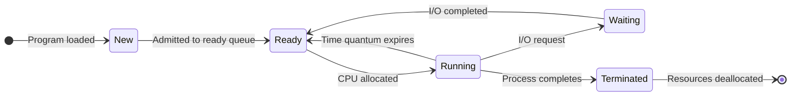
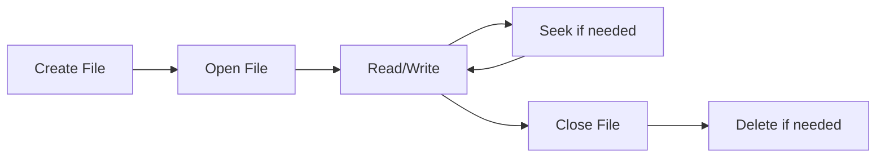
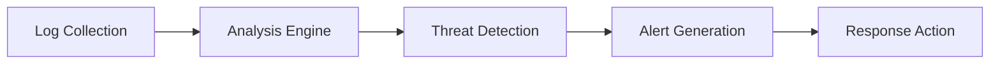

## Question 1(a) [3 marks]

**Define Operating System and explain the need of OS.**

**Answer**:

**Operating System** is a system software that acts as an intermediary between computer hardware and application software. It manages hardware resources and provides services to user programs.

**Need of Operating System:**

- **Resource Management**: Manages CPU, memory, storage, and I/O devices efficiently
- **User Interface**: Provides command-line and graphical interfaces for user interaction
- **Program Execution**: Loads and executes user programs safely

**Mnemonic:** "RUP - Resource, User, Program management"

## Question 1(b) [4 marks]

**Write a short note on Process Control Block (PCB).**

**Answer**:

Process Control Block (PCB) is a data structure maintained by the operating system for each running process.

| PCB Component | Description |
|---------------|-------------|
| Process ID | Unique identifier for the process |
| Process State | Current state (ready, running, waiting) |
| Program Counter | Address of next instruction to execute |
| CPU Registers | Values of CPU registers when process is suspended |
| Memory Management | Base and limit registers, page tables |
| I/O Status | List of open files and I/O devices |

**Key Functions:**

- **Process Identification**: Stores unique process ID and parent process ID
- **State Information**: Maintains current execution state and context
- **Resource Allocation**: Tracks allocated resources and memory usage

**Mnemonic:** "PIS - Process ID, Information, State tracking"

## Question 1(c) [7 marks]

**List different types of Operating systems. Explain the working of batch operating systems with a suitable example.**

**Answer**:

**Types of Operating Systems:**

| Type | Description |
|------|-------------|
| Batch OS | Groups similar jobs and executes them together |
| Time-sharing OS | Multiple users share system simultaneously |
| Real-time OS | Provides guaranteed response time |
| Distributed OS | Manages multiple interconnected computers |
| Network OS | Provides network services and resource sharing |
| Mobile OS | Designed for mobile devices |

**Batch Operating System Working:**

```goat
+----------+    +----------+    +----------+    +----------+
|  Job 1   |    |  Job 2   |    |  Job 3   |    |  Job 4   |
| COBOL    | -> | FORTRAN  | -> |   C++    | -> |  JAVA    |
| Programs |    | Programs |    | Programs |    | Programs |
+----------+    +----------+    +----------+    +----------+
     |               |               |               |
     v               v               v               v
+--------------------------------------------------------+
|              Batch Queue Manager                       |
+--------------------------------------------------------+
     |
     v
+----------+    +----------+    +----------+
|   CPU    |    |  Memory  |    |   I/O    |
| Executor | -> | Manager  | -> | Handler  |
+----------+    +----------+    +----------+
```

**Example**: Bank transaction processing where all day's transactions are collected and processed together at night for efficiency.

**Key Features:**

- **Job Grouping**: Similar jobs executed together for efficiency
- **No User Interaction**: Jobs run without user intervention once submitted
- **High Throughput**: Maximizes system utilization

**Mnemonic:** "JNH - Jobs grouped, No interaction, High throughput"

## Question 1(c) OR [7 marks]

**List different types of Operating systems. Explain the real time operating systems in detail.**

**Answer**:

**Types of Operating Systems:**
(Same table as above)

**Real-Time Operating System (RTOS):**

Real-time OS provides guaranteed response within specified time constraints for critical applications.

**Types of RTOS:**

| Type | Deadline | Example |
|------|----------|---------|
| Hard Real-time | Must meet deadline | Air traffic control, pacemaker |
| Soft Real-time | Can tolerate some delay | Video streaming, online gaming |
| Firm Real-time | Occasional deadline miss acceptable | Live audio processing |

**Characteristics:**

- **Deterministic**: Predictable response time for all operations
- **Priority-based Scheduling**: High-priority tasks get immediate attention
- **Minimal Interrupt Latency**: Fast context switching capabilities
- **Memory Management**: Real-time memory allocation without delays

**Applications:**

- Medical devices, automotive systems, industrial automation, aerospace control systems

**Mnemonic:** "DPMA - Deterministic, Priority-based, Minimal latency, Applications critical"

## Question 2(a) [3 marks]

**Differentiate between program and process.**

**Answer**:

| Aspect | Program | Process |
|--------|---------|---------|
| Definition | Static code stored on disk | Program in execution |
| State | Passive entity | Active entity |
| Memory | No memory allocation | Allocated memory space |
| Lifetime | Permanent until deleted | Temporary during execution |
| Resources | No resource consumption | Consumes CPU, memory, I/O |

**Key Differences:**

- **Static vs Dynamic**: Program is static file, process is dynamic execution
- **Resource Usage**: Process consumes system resources, program doesn't
- **Multiple Instances**: One program can create multiple processes

**Mnemonic:** "SDR - Static vs Dynamic, Resource usage, Multiple instances"

## Question 2(b) [4 marks]

**Explain the different states of a process with the help of a process state diagram.**

**Answer**:



**Process States:**

| State | Description |
|-------|-------------|
| New | Process being created |
| Ready | Waiting for CPU assignment |
| Running | Currently executing on CPU |
| Waiting | Blocked for I/O or event |
| Terminated | Process execution completed |

**State Transitions:**

- **Ready to Running**: Process scheduler assigns CPU
- **Running to Ready**: Time slice expires or higher priority process arrives
- **Running to Waiting**: Process requests I/O operation
- **Waiting to Ready**: I/O operation completes

**Mnemonic:** "NRWRT - New, Ready, Waiting, Running, Terminated states"

## Question 2(c) [7 marks]

**Describe the Round Robin algorithm. Calculate the average waiting time & average turn-around time along with Gantt chart for the given data. Consider context switch = 01 ms and quantum time = 04 ms.**

**Answer**:

**Round Robin Algorithm:**
Round Robin is a preemptive scheduling algorithm where each process gets equal CPU time (quantum) in circular manner.

**Given Data:**

- Quantum Time = 4 ms
- Context Switch = 1 ms

| Process | Arrival Time | Burst Time |
|---------|--------------|------------|
| P1 | 0 | 8 |
| P2 | 3 | 3 |
| P3 | 1 | 10 |
| P4 | 4 | 5 |

**Gantt Chart:**

```
0   4  5   8  9  13 14  18 19  22 23  26 27  29
|P1 |CS|P3|CS|P1|CS|P2|CS|P3|CS|P4|CS|P3|CS|P4|
```

**Calculations:**

| Process | Completion Time | Turnaround Time | Waiting Time |
|---------|-----------------|-----------------|--------------|
| P1 | 13 | 13 | 5 |
| P2 | 18 | 15 | 12 |
| P3 | 26 | 25 | 15 |
| P4 | 29 | 25 | 20 |

**Average Waiting Time = (5 + 12 + 15 + 20) / 4 = 13 ms**
**Average Turnaround Time = (13 + 15 + 25 + 25) / 4 = 19.5 ms**

**Key Features:**

- **Fair Scheduling**: Each process gets equal CPU time
- **Preemptive**: Running process is interrupted after quantum expires
- **Context Switching**: Overhead included in calculations

**Mnemonic:** "FPC - Fair, Preemptive, Context switching overhead"

## Question 2(a) OR [3 marks]

**Differentiate: CPU bound process v/s I/O bound process.**

**Answer**:

| Aspect | CPU Bound Process | I/O Bound Process |
|--------|-------------------|-------------------|
| Primary Activity | Intensive calculations | Frequent I/O operations |
| CPU Usage | High CPU utilization | Low CPU utilization |
| Burst Time | Long CPU bursts | Short CPU bursts |
| Waiting Time | Less I/O waiting | More I/O waiting |
| Examples | Mathematical calculations, image processing | File operations, database queries |

**Key Differences:**

- **Resource Consumption**: CPU-bound uses more processor, I/O-bound uses more input/output
- **Performance Impact**: CPU-bound affected by processor speed, I/O-bound by storage speed
- **Scheduling Priority**: Different algorithms favor each type differently

**Mnemonic:** "CIR - CPU intensive, I/O intensive, Resource usage differs"

## Question 2(b) OR [4 marks]

**What is a deadlock? Explain the necessary conditions for a deadlock to occur.**

**Answer**:

**Deadlock** is a situation where two or more processes are permanently blocked, each waiting for resources held by others.

**Necessary Conditions (Coffman Conditions):**

| Condition | Description |
|-----------|-------------|
| Mutual Exclusion | Resources cannot be shared simultaneously |
| Hold and Wait | Process holds resources while waiting for others |
| No Preemption | Resources cannot be forcibly taken from processes |
| Circular Wait | Circular chain of processes waiting for resources |

**Example Scenario:**

```goat
Process A ----holds----> Resource 1
    |                        ^
    |                        |
    v                        |
waits for              Process B
Resource 2 <---holds----------|
```

**Deadlock Prevention:**

- **Eliminate Mutual Exclusion**: Make resources shareable when possible
- **Prevent Hold and Wait**: Require all resources at once
- **Allow Preemption**: Forcibly take resources when needed
- **Prevent Circular Wait**: Order resources and request in sequence

**Mnemonic:** "MHNC - Mutual exclusion, Hold-wait, No preemption, Circular wait"

## Question 2(c) OR [7 marks]

**Describe the FCFS algorithm. Calculate the average waiting time and average turn-around time along with Gantt chart for the given data.**

**Answer**:

**First Come First Serve (FCFS) Algorithm:**
FCFS is a non-preemptive scheduling algorithm where processes are executed in arrival order.

**Given Data:**

| Process | Arrival Time | Burst Time |
|---------|--------------|------------|
| P1 | 0 | 7 |
| P2 | 3 | 6 |
| P3 | 5 | 9 |
| P4 | 6 | 4 |

**Gantt Chart:**

```
0        7        13        22        26
|   P1   |   P2   |    P3   |   P4   |
```

**Calculations:**

| Process | Start Time | Completion Time | Turnaround Time | Waiting Time |
|---------|------------|-----------------|-----------------|--------------|
| P1 | 0 | 7 | 7 | 0 |
| P2 | 7 | 13 | 10 | 4 |
| P3 | 13 | 22 | 17 | 8 |
| P4 | 22 | 26 | 20 | 16 |

**Average Waiting Time = (0 + 4 + 8 + 16) / 4 = 7 ms**
**Average Turnaround Time = (7 + 10 + 17 + 20) / 4 = 13.5 ms**

**Characteristics:**

- **Simple Implementation**: Easy to understand and implement
- **Non-preemptive**: Once started, process runs to completion
- **Convoy Effect**: Short processes wait for long processes

**Mnemonic:** "SNC - Simple, Non-preemptive, Convoy effect possible"

## Question 3(a) [3 marks]

**Explain single-level directory structure.**

**Answer**:

Single-level directory structure is the simplest file organization where all files are stored in one directory.

```goat
        Root Directory
    +-------------------+
    | file1.txt         |
    | program.exe       |
    | data.dat          |
    | image.jpg         |
    | document.pdf      |
    +-------------------+
```

**Characteristics:**

- **Simple Structure**: All files in one location
- **Unique Names**: Each file must have unique name
- **No Organization**: No grouping or categorization possible

**Limitations:**

- Name collision when multiple users create files with same names
- Difficult to organize large number of files
- No privacy or access control between users

**Mnemonic:** "SUN - Simple, Unique names, No organization"

## Question 3(b) [4 marks]

**Explain the different file attributes.**

**Answer**:

File attributes are metadata that provide information about files stored in the file system.

| Attribute | Description |
|-----------|-------------|
| Name | Human-readable file identifier |
| Type | File format (executable, text, image) |
| Size | Current file size in bytes |
| Location | Physical address on storage device |
| Protection | Access permissions (read, write, execute) |
| Time stamps | Creation, modification, access times |
| Owner | User who created the file |

**Common File Attributes:**

- **Identifier**: Unique number for file system reference
- **Type Information**: MIME type or file extension
- **Size and Allocation**: Current size and allocated space
- **Access Control**: User permissions and group access rights

**Storage Location:**
File attributes are typically stored in directory entries or file allocation tables.

**Mnemonic:** "NTSLPTO - Name, Type, Size, Location, Protection, Time, Owner"

## Question 3(c) [7 marks]

**List the different file allocation methods and explain contiguous allocation with necessary diagram.**

**Answer**:

**File Allocation Methods:**

| Method | Description |
|--------|-------------|
| Contiguous | Files stored in consecutive blocks |
| Linked | Files stored using linked list of blocks |
| Indexed | Uses index block to point to data blocks |

**Contiguous Allocation:**

In contiguous allocation, each file occupies a set of contiguous blocks on the disk.

```goat
Disk Blocks:
+---+---+---+---+---+---+---+---+---+---+
| 0 | 1 | 2 | 3 | 4 | 5 | 6 | 7 | 8 | 9 |
+---+---+---+---+---+---+---+---+---+---+
|   |File A |   |  File B   |   |File C |
|   |  2-3  |   |   5-7     |   |  9    |
+---+---+---+---+---+---+---+---+---+---+

Directory Table:
+----------+-------+--------+
| Filename | Start | Length |
+----------+-------+--------+
| File A   |   2   |   2    |
| File B   |   5   |   3    |
| File C   |   9   |   1    |
+----------+-------+--------+
```

**Advantages:**

- **Fast Access**: Direct calculation of block addresses
- **Minimal Seek Time**: Consecutive blocks reduce head movement
- **Simple Implementation**: Easy to implement and manage

**Disadvantages:**

- **External Fragmentation**: Unused spaces between files
- **File Size Limitation**: Difficult to extend files
- **Compaction Needed**: Periodic reorganization required

**Mnemonic:** "FMS vs EFC - Fast access, Minimal seek, Simple vs External fragmentation, File size limits, Compaction needed"

## Question 3(a) OR [3 marks]

**Explain the different types of Linux file systems in brief.**

**Answer**:

| File System | Description |
|-------------|-------------|
| ext2 | Second extended filesystem, no journaling |
| ext3 | Third extended filesystem with journaling |
| ext4 | Fourth extended filesystem, improved performance |
| XFS | High-performance 64-bit journaling filesystem |
| Btrfs | B-tree filesystem with advanced features |
| ZFS | Copy-on-write filesystem with data integrity |

**Key Features:**

- **Journaling**: ext3, ext4, XFS provide crash recovery
- **Performance**: ext4, XFS optimized for large files
- **Advanced Features**: Btrfs, ZFS offer snapshots and compression

**Selection Criteria:**
Different filesystems suit different use cases based on performance, reliability, and feature requirements.

**Mnemonic:** "EEXBZ - ext2/3/4, XFS, Btrfs, ZFS options"

## Question 3(b) OR [4 marks]

**Explain the different file operations.**

**Answer**:

| Operation | Description |
|-----------|-------------|
| Create | Make new file with specified name and attributes |
| Open | Prepare file for reading/writing operations |
| Read | Retrieve data from file at current position |
| Write | Store data to file at current position |
| Seek | Move file pointer to specific position |
| Close | Release file resources and update metadata |
| Delete | Remove file and deallocate storage space |

**File Operation Sequence:**



**Important Considerations:**

- **Error Handling**: Each operation can fail and must be checked
- **Permissions**: User must have appropriate access rights
- **Concurrent Access**: Multiple processes may access same file

**Mnemonic:** "CORWSCD - Create, Open, Read, Write, Seek, Close, Delete"

## Question 3(c) OR [7 marks]

**List the different file allocation methods and explain indexed allocation with necessary diagram.**

**Answer**:

**File Allocation Methods:**

| Operation | Description |
|-----------|-------------|
| Create | Make new file with specified name and attributes |
| Open | Prepare file for reading/writing operations |
| Read | Retrieve data from file at current position |
| Write | Store data to file at current position |
| Seek | Move file pointer to specific position |
| Close | Release file resources and update metadata |
| Delete | Remove file and deallocate storage space |

**Indexed Allocation:**

In indexed allocation, each file has an index block containing pointers to data blocks.

```goat
Index Block for File A:
+---+---+---+---+
| 2 | 5 | 8 | 9 |
+---+---+---+---+
  |   |   |   |
  v   v   v   v
Disk Blocks:
+---+---+---+---+---+---+---+---+---+---+
| 0 | 1 | 2 | 3 | 4 | 5 | 6 | 7 | 8 | 9 |
+---+---+---+---+---+---+---+---+---+---+
|   |   |FileA|   |   |FileA|   |   |FileA|FileA|

Directory Table:
+----------+-------------+
| Filename | Index Block |
+----------+-------------+
| File A   |      1      |
+----------+-------------+
```

**Types of Indexed Allocation:**

- **Single-level**: One index block per file
- **Multi-level**: Index blocks point to other index blocks
- **Combined**: Mix of direct and indirect pointers

**Advantages:**

- **No External Fragmentation**: Blocks can be anywhere on disk
- **Dynamic File Size**: Easy to extend files
- **Fast Random Access**: Direct access to any block

**Disadvantages:**

- **Index Block Overhead**: Extra space for storing pointers
- **Multiple Disk Access**: Two accesses needed (index + data)
- **Small File Inefficiency**: Overhead high for small files

**Mnemonic:** "NDF vs IMI - No fragmentation, Dynamic size, Fast access vs Index overhead, Multiple access, Inefficient for small files"

## Question 4(a) [3 marks]

**Define System threats and explain its types.**

**Answer**:

**System Threats** are malicious attempts to disrupt or damage computer system operations, steal information, or gain unauthorized access.

| Threat Type | Description |
|-------------|-------------|
| Worms | Self-replicating programs that spread across networks |
| Viruses | Malicious code that attaches to other programs |
| Trojan Horses | Legitimate-looking programs with hidden malicious functions |
| Denial of Service | Attacks that overwhelm system resources |
| Port Scanning | Unauthorized probing of network services |

**Categories of System Threats:**

- **Network-based**: Attacks through network connections and protocols
- **Host-based**: Attacks targeting specific computer systems
- **Physical**: Direct physical access to compromise systems

**Impact:**
System threats can lead to data loss, system downtime, privacy breaches, and financial damage.

**Mnemonic:** "WVTDP - Worms, Viruses, Trojans, DoS, Port scanning"

## Question 4(b) [4 marks]

**Differentiate: User Authentication v/s User Authorization.**

**Answer**:

| Aspect | User Authentication | User Authorization |
|--------|--------------------|--------------------|
| Purpose | Verify user identity | Determine user permissions |
| When | Before system access | After authentication |
| Methods | Passwords, biometrics, tokens | Access control lists, roles |
| Question | "Who are you?" | "What can you do?" |
| Process | One-time at login | Continuous during session |

**Authentication Methods:**

- **Something you know**: Passwords, PINs
- **Something you are**: Fingerprints, retina scans
- **Something you have**: Smart cards, tokens

**Authorization Models:**

- **Role-based Access Control (RBAC)**: Permissions based on user roles
- **Discretionary Access Control (DAC)**: Owner controls access
- **Mandatory Access Control (MAC)**: System-enforced security levels

**Relationship:**
Authentication must occur before authorization. Both are essential for comprehensive security.

**Mnemonic:** "WHO vs WHAT - Authentication asks WHO, Authorization determines WHAT"

## Question 4(c) [7 marks]

**Discuss various operating system security policies and procedures.**

**Answer**:

**Security Policies:**

| Policy Type | Description |
|-------------|-------------|
| Access Control | Defines who can access what resources |
| Password Policy | Rules for password creation and management |
| Audit Policy | Logging and monitoring of system activities |
| Update Policy | Regular security patches and updates |
| Data Classification | Categorizing data by sensitivity levels |

**Security Procedures:**

**1. User Account Management:**

- Regular review of user accounts and permissions
- Immediate revocation of access for terminated employees
- Principle of least privilege implementation

**2. System Monitoring:**



**3. Incident Response:**

- **Detection**: Identify security incidents quickly
- **Containment**: Limit damage and prevent spread
- **Recovery**: Restore normal operations safely

**4. Backup and Recovery:**

- Regular data backups with tested restore procedures
- Disaster recovery planning and testing
- Business continuity measures

**Implementation Framework:**

- **Risk Assessment**: Identify vulnerabilities and threats
- **Policy Development**: Create comprehensive security guidelines
- **Training**: Educate users on security practices
- **Compliance**: Ensure adherence to regulations

**Mnemonic:** "AAPUD policies + UMSIR procedures - Access, Audit, Password, Update, Data classification + User management, Monitoring, System response, Incident handling, Recovery"

## Question 4(a) OR [3 marks]

**Define Program threats and explain its types.**

**Answer**:

**Program Threats** are malicious software designed to disrupt, damage, or gain unauthorized access to computer programs and data.

| Threat Type | Description |
|-------------|-------------|
| Malware | Malicious software including viruses, worms |
| Spyware | Programs that secretly monitor user activities |
| Adware | Unwanted advertising software |
| Ransomware | Encrypts data and demands payment |
| Rootkits | Hide malicious activities from detection |

**Program Threat Categories:**

- **Executable Threats**: Standalone malicious programs
- **Parasitic Threats**: Attach to legitimate programs
- **Network Threats**: Spread through network connections

**Common Attack Vectors:**

- Email attachments and downloads
- Infected removable media
- Network vulnerabilities and exploits

**Mnemonic:** "MSARR - Malware, Spyware, Adware, Ransomware, Rootkits"

## Question 4(b) OR [4 marks]

**Explain the protection domain with a suitable example.**

**Answer**:

**Protection Domain** is a set of objects and access rights that define what resources a process can access and what operations it can perform.

| Component | Description |
|-----------|-------------|
| Objects | Resources like files, memory, devices |
| Access Rights | Permissions like read, write, execute |
| Subjects | Processes or users requesting access |

**Domain Structure:**

```goat
Protection Domain A
+------------------+
| Objects:         |
| - File1 (R,W)    |
| - Printer (W)    |
| - Memory (R,W,X) |
+------------------+

Protection Domain B
+------------------+
| Objects:         |
| - File2 (R)      |
| - Network (R,W)  |
| - Database (R)   |
+------------------+
```

**Example - University System:**

- **Student Domain**: Read access to course materials, write access to assignments
- **Faculty Domain**: Read/write access to grade databases, read access to student records
- **Admin Domain**: Full access to system configuration, user management

**Domain Switching:**
Processes can switch between domains based on:

- User authentication and authorization
- Program execution context
- Security level requirements

**Benefits:**

- **Isolation**: Prevents unauthorized access between domains
- **Flexibility**: Allows controlled resource sharing
- **Security**: Implements principle of least privilege

**Mnemonic:** "OAS - Objects, Access rights, Subjects define domains"

## Question 4(c) OR [7 marks]

**Explain Access Control List in detail.**

**Answer**:

**Access Control List (ACL)** is a security mechanism that specifies which users or processes are granted access to objects and what operations are allowed.

**ACL Structure:**

| Component | Description |
|-----------|-------------|
| Subject | User, group, or process requesting access |
| Object | Resource being protected (file, device, etc.) |
| Access Rights | Specific permissions granted |

**ACL Implementation:**

```goat
File: /home/project/report.txt
+--------------------------------+
| User     | Permissions         |
|----------|---------------------|
| alice    | read, write         |
| bob      | read                |
| admin    | read, write, delete |
| group:dev| read, write         |
+--------------------------------+
```

**Types of ACL:**

- **Discretionary ACL (DACL)**: Owner controls access permissions
- **System ACL (SACL)**: System controls auditing and logging
- **Default ACL**: Inherited permissions for new objects

**ACL vs Capability Lists:**

| Aspect | ACL | Capability List |
|--------|-----|-----------------|
| Organization | Per object | Per subject |
| Storage | With object | With subject |
| Checking | Scan list | Present capability |
| Revocation | Easy | Difficult |

**Advantages:**

- **Granular Control**: Fine-grained permission management
- **Centralized Management**: Easy to modify object permissions
- **Audit Trail**: Clear record of who has access

**Disadvantages:**

- **Performance Overhead**: Must check ACL for each access
- **Storage Requirements**: Space needed for permission lists
- **Complexity**: Difficult to manage for many users/objects

**Real-world Example:**
Linux file permissions use simplified ACL with owner, group, and others having read, write, execute rights.

**Mnemonic:** "SOA structure + GDSC advantages - Subject, Object, Access rights + Granular, Distributed, Centralized, Audit capabilities"

## Question 5(a) [3 marks]

**Explain the following commands: (i) man (ii) cd (iii) ls**

**Answer**:

| Command | Purpose | Syntax |
|---------|---------|--------|
| man | Display manual pages for commands | man [command] |
| cd | Change current directory | cd [directory] |
| ls | List directory contents | ls [options] [directory] |

**Command Details:**

**1. man (manual) command:**

- **Function**: Shows detailed documentation for Linux commands
- **Example**: `man ls` shows manual page for ls command
- **Sections**: Commands, system calls, library functions, etc.

**2. cd (change directory) command:**

- **Function**: Navigate between directories in filesystem
- **Examples**: `cd /home`, `cd ..` (parent), `cd ~` (home)
- **Special**: `cd` without arguments goes to home directory

**3. ls (list) command:**

- **Function**: Display files and directories in current or specified location
- **Options**: `-l` (long format), `-a` (hidden files), `-h` (human readable)
- **Example**: `ls -la` shows detailed listing including hidden files

**Mnemonic:** "MCD - Manual pages, Change directory, Directory listing"

## Question 5(b) [4 marks]

**Write a shell script to find maximum number among three numbers.**

**Answer**:

```bash
#!/bin/bash
# Script to find maximum among three numbers

echo "Enter three numbers:"
read -p "First number: " num1
read -p "Second number: " num2  
read -p "Third number: " num3

# Find maximum using nested if-else
if [ $num1 -gt $num2 ]; then
    if [ $num1 -gt $num3 ]; then
        max=$num1
    else
        max=$num3
    fi
else
    if [ $num2 -gt $num3 ]; then
        max=$num2
    else
        max=$num3
    fi
fi

echo "Maximum number is: $max"
```

**Key Features:**

- **Input Validation**: Reads three numbers from user
- **Comparison Logic**: Uses nested if-else for finding maximum
- **Output Display**: Shows result with clear message

**Alternative Approach:**

```bash
max=$(echo "$num1 $num2 $num3" | tr ' ' '\n' | sort -nr | head -1)
```

**Mnemonic:** "ICD - Input, Compare, Display result"

## Question 5(c) [7 marks]

**Write a shell script to find the sum of all the individual digits in a given 5-digit number.**

**Answer**:

```bash
#!/bin/bash
# Script to find sum of digits in a 5-digit number

echo "Enter a 5-digit number:"
read number

# Validate input
if [ ${#number} -ne 5 ] || ! [[ $number =~ ^[0-9]+$ ]]; then
    echo "Error: Please enter exactly 5 digits"
    exit 1
fi

sum=0
temp=$number

# Extract and sum each digit
while [ $temp -gt 0 ]; do
    digit=$((temp % 10))    # Get last digit
    sum=$((sum + digit))    # Add to sum
    temp=$((temp / 10))     # Remove last digit
done

echo "Number: $number"
echo "Sum of digits: $sum"

# Display breakdown
echo "Breakdown:"

# Display individual digits
original=$number
echo -n "Digits: "
for ((i=0; i<5; i++)); do
    digit=$((original % 10))
    if [ $i -eq 4 ]; then
        echo -n "$digit"
    else
        echo -n "$digit + "
    fi
    original=$((original / 10))
done | tac
echo " = $sum"
```

**Algorithm Steps:**

- **Input Validation**: Check for exactly 5 digits
- **Digit Extraction**: Use modulo and division operations
- **Sum Calculation**: Add each extracted digit
- **Display Results**: Show breakdown and final sum

**Example Output:**

```
Enter a 5-digit number: 12345
Number: 12345
Sum of digits: 15
Breakdown: 1 + 2 + 3 + 4 + 5 = 15
```

**Mnemonic:** "VEDS - Validate, Extract, Display, Sum digits"

## Question 5(a) OR [3 marks]

**Explain the following commands: (i) date (ii) top (iii) cmp**

**Answer**:

| Command | Purpose | Syntax |
|---------|---------|--------|
| date | Display or set system date/time | date [options] [format] |
| top | Display running processes dynamically | top [options] |
| cmp | Compare two files byte by byte | cmp [options] file1 file2 |

**Command Details:**

**1. date command:**

- **Function**: Shows current system date and time
- **Examples**: `date`, `date +%Y-%m-%d`, `date +%H:%M:%S`
- **Formatting**: Custom output formats using + symbols

**2. top command:**

- **Function**: Real-time display of system processes and resource usage
- **Interactive**: Press 'q' to quit, 'k' to kill process
- **Information**: CPU usage, memory usage, process list

**3. cmp command:**

- **Function**: Compare two files and report differences
- **Output**: Shows first differing byte position
- **Options**: `-s` (silent), `-l` (verbose listing)

**Mnemonic:** "DTC - Date/time, Task monitor, Compare files"

## Question 5(b) OR [4 marks]

**Explain the installation steps of Linux.**

**Answer**:

| Step | Description |
|------|-------------|
| 1. Download ISO | Get Linux distribution image file |
| 2. Create Bootable Media | Burn ISO to DVD or USB drive |
| 3. Boot from Media | Start computer from installation media |
| 4. Choose Installation Type | Select install alongside or replace OS |
| 5. Partition Setup | Configure disk partitions |
| 6. User Configuration | Create user account and passwords |
| 7. Package Selection | Choose software packages to install |
| 8. Installation Process | Copy files and configure system |
| 9. Reboot System | Restart into new Linux installation |

**Pre-installation Requirements:**

- **Hardware Compatibility**: Check system requirements
- **Backup Data**: Secure important files before installation
- **Internet Connection**: For updates and additional packages

**Installation Process Flow:**


**Post-installation Tasks:**

- **System Updates**: Install latest security patches
- **Driver Installation**: Configure hardware drivers
- **Software Installation**: Add required applications

**Common Partition Scheme:**

- `/` (root): 20GB minimum for system files
- `/home`: User data storage
- `swap`: 1-2x RAM size for virtual memory

**Mnemonic:** "DCBCPUPI - Download, Create media, Boot, Choose type, Partition, User setup, Package selection, Install"

## Question 5(c) OR [7 marks]

**Write a shell script to find sum and average of N numbers.**

**Answer**:

```bash
#!/bin/bash
# Script to find sum and average of N numbers

echo "How many numbers do you want to enter?"
read n

# Validate input
if ! [[ $n =~ ^[0-9]+$ ]] || [ $n -le 0 ]; then
    echo "Error: Please enter a positive integer"
    exit 1
fi

sum=0
echo "Enter $n numbers:"

# Read N numbers and calculate sum
for ((i=1; i<=n; i++)); do
    echo -n "Enter number $i: "
    read number
    
    # Validate each number
    if ! [[ $number =~ ^-?[0-9]+([.][0-9]+)?$ ]]; then
        echo "Error: Invalid number format"
        exit 1
    fi
    
    sum=$(echo "$sum + $number" | bc -l)
done

# Calculate average
average=$(echo "scale=2; $sum / $n" | bc -l)

# Display results
echo ""
echo "Results:"
echo "========="
echo "Count of numbers: $n"
echo "Sum: $sum"
echo "Average: $average"

# Additional statistics
echo ""
echo "Summary:"
echo "Total numbers processed: $n"
echo "Sum of all numbers: $sum"
echo "Average value: $average"
```

**Algorithm Features:**

- **Input Validation**: Checks for positive count and valid numbers
- **Flexible Input**: Accepts integers and decimal numbers
- **Precision Handling**: Uses bc calculator for accurate arithmetic
- **Error Handling**: Validates each input and provides error messages

**Example Execution:**

```
How many numbers do you want to enter? 5
Enter number 1: 10
Enter number 2: 20
Enter number 3: 30
Enter number 4: 40
Enter number 5: 50

Results:
=========
Count of numbers: 5
Sum: 150
Average: 30.00
```

**Alternative Simple Version:**

```bash
#!/bin/bash
read -p "Enter count: " n
sum=0
for ((i=1; i<=n; i++)); do
    read -p "Number $i: " num
    sum=$((sum + num))
done
echo "Sum: $sum"
echo "Average: $((sum / n))"
```

**Key Programming Concepts:**

- **Loop Control**: For loop for iterating N times
- **Arithmetic Operations**: Addition and division
- **Input/Output**: Reading user input and displaying results
- **Data Validation**: Ensuring input correctness

**Mnemonic:** "VLAD - Validate input, Loop for numbers, Arithmetic calculation, Display results"
