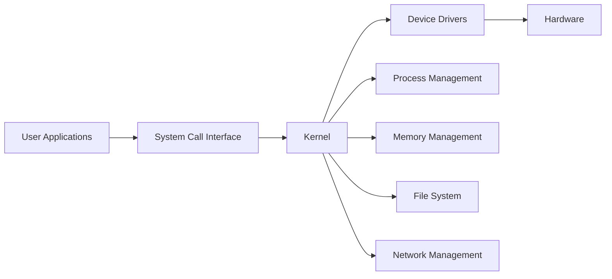
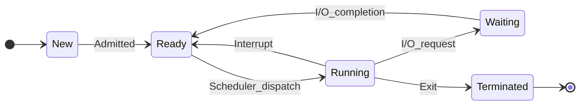

## પ્રશ્ન 1(a) [3 માર્ક્સ]

**Linux ના આર્કિટેક્ચર દોરો અને સંક્ષિપ્તમાં વિવિધ સ્તરો સમજાવો.**

**ઉત્તર**:

**આકૃતિ:**



- **User Space**: વપરાશકર્તા applications અને system utilities સમાવે છે
- **System Call Interface**: user programs અને kernel વચ્ચે interface પ્રદાન કરે છે
- **Kernel Space**: process, memory, file management સાથે મૂળ operating system

**મેમરી ટ્રીક:** "Users System Kernel Drives Hardware"

---

## પ્રશ્ન 1(b) [4 માર્ક્સ]

**રેસની સ્થિતિ શું છે? યોગ્ય ઉદાહરણ સાથે સમજાવો.**

**ઉત્તર**:

| **પાસું** | **વિવરણ** |
|----------|------------|
| **વ્યાખ્યા** | અનેક processes એકસાથે shared resource ને access કરે છે |
| **સમસ્યા** | timing dependency ને કારણે અનિશ્ચિત પરિણામો |
| **ઉદાહરણ** | બે transactions દ્વારા બેંક account balance ને update કરવું |

**ઉદાહરણ પ્રક્રિયા:**

- **Process A**: balance = 1000 વાંચે છે, 100 ઉમેરે છે
- **Process B**: balance = 1000 વાંચે છે, 50 બાદ કરે છે  
- **પરિણામ**: અંતિમ balance 1050, 950, અથવા 1100 હોઈ શકે યોગ્ય 1050 ને બદલે

**મેમરી ટ્રીક:** "Race Results Random Resources"

---

## પ્રશ્ન 1(c) [7 માર્ક્સ]

**વિવિધ પ્રકારની ઓપરેટિંગ સિસ્ટમોની યાદી બનાવો. મલ્ટિપ્રોગ્રામિંગ ઓપરેટિંગ સિસ્ટમના કાર્યને યોગ્ય ઉદાહરણ સાથે સમજાવો.**

**ઉત્તર**:

**કોષ્ટક: ઓપરેટિંગ સિસ્ટમના પ્રકારો**

| **પ્રકાર** | **લક્ષણો** | **ઉદાહરણ** |
|-----------|-----------|-------------|
| **Batch** | Jobs બેચમાં process થાય છે | IBM mainframes |
| **Time-sharing** | અનેક વપરાશકર્તાઓ એકસાથે | UNIX |
| **Real-time** | તાત્કાલિક response જરૂરી | Air traffic control |
| **Distributed** | અનેક connected computers | Google cluster |
| **Multiprogramming** | memory માં અનેક programs | Windows, Linux |

**Multiprogramming કાર્યપદ્ધતિ:**

- **Memory Management**: અનેક programs એકસાથે load થાય છે
- **CPU Scheduling**: I/O occurrence દરમિયાન programs વચ્ચે switch કરે છે
- **Resource Sharing**: CPU અને memory નો efficient ઉપયોગ
- **ઉદાહરણ**: Word processor, music player, અને browser એકસાથે ચાલે છે

**મેમરી ટ્રીક:** "Multiple Programs Maximize Performance"

---

## પ્રશ્ન 1(c OR) [7 માર્ક્સ]

**વિવિધ પ્રકારની ઓપરેટિંગ સિસ્ટમોની યાદી બનાવો. બેચ ઓપરેટિંગ સિસ્ટમ્સ વિગતવાર સમજાવો.**

**ઉત્તર**:

**ઓપરેટિંગ સિસ્ટમના પ્રકારો:**
ઉપરનું કોષ્ટક સમાન.

**Batch Operating System વિગતો:**

- **Job Collection**: Jobs offline collect થાય અને batches માં group થાય છે
- **Sequential Processing**: Jobs એક પછી એક execute થાય વપરાશકર્તા interaction વગર
- **No Direct Interaction**: વપરાશકર્તા job submit કરે અને પછીથી output collect કરે
- **Efficiency**: સમાન પ્રકારના jobs માટે high throughput
- **ગેરફાયદા**: Real-time processing નથી, લાંબો turnaround time

**મેમરી ટ્રીક:** "Batch Brings Better Business"

---

## પ્રશ્ન 2(a) [3 માર્ક્સ]

**પ્રક્રિયા જીવન ચક્ર દોરો અને સમજાવો.**

**ઉત્તર**:

**આકૃતિ:**



- **New**: પ્રક્રિયા બનાવવામાં આવે છે
- **Ready**: પ્રક્રિયા CPU assignment માટે રાહ જોતી છે
- **Running**: પ્રક્રિયા હાલમાં execute થઈ રહી છે
- **Waiting**: પ્રક્રિયા I/O operation માટે રાહ જોતી છે
- **Terminated**: પ્રક્રિયાએ execution પૂર્ણ કર્યું છે

**મેમરી ટ્રીક:** "New Ready Running Waiting Terminated"

---

## પ્રશ્ન 2(b) [4 માર્ક્સ]

**ડેડલોકને વ્યાખ્યાયિત કરો અને ડેડલોક થવા માટે જરૂરી શરતોની ચર્ચા કરો.**

**ઉત્તર**:

**વ્યાખ્યા**: ડેડલોક ત્યારે થાય છે જ્યારે processes અન્ય processes દ્વારા held resources માટે અનિશ્ચિત સમય સુધી રાહ જોતી રહે છે.

**કોષ્ટક: ડેડલોક શરતો**

| **શરત** | **વિવરણ** |
|---------|-----------|
| **Mutual Exclusion** | Resources share કરી શકાતા નથી |
| **Hold and Wait** | Process resource hold કરીને બીજા માટે રાહ જુએ છે |
| **No Preemption** | Resources જબરદસ્તીથી લઈ શકાતા નથી |
| **Circular Wait** | Processes resource dependencies નું circular chain બનાવે છે |

**મેમરી ટ્રીક:** "My Hold Never Circles"

---

## પ્રશ્ન 2(c) [7 માર્ક્સ]

**રાઉન્ડ રોબિન અલ્ગોરિધમનું વર્ણન કરો. આપેલ ડેટા માટે ગેન્ટ ચાર્ટ સાથે સરેરાશ રાહ જોવાનો સમય અને સરેરાશ ટર્ન-અરાઉન્ડ સમયની ગણતરી કરો. સંદર્ભ સ્વિચ = 01 ms અને ક્વોન્ટમ સમય = 05 ms ધ્યાનમાં લો.**

**ઉત્તર**:

**Round Robin અલ્ગોરિધમ:**

- **Time Quantum**: દરેક process માટે fixed time slice
- **Preemptive**: Quantum expire થયા પછી process preempt થાય છે
- **Fair Scheduling**: સમાન CPU time વિતરણ

**આપેલ ડેટા:**

- Context Switch = 1 ms, Quantum = 5 ms

**ગેન્ટ ચાર્ટ:**

```
|P1|CS|P2|CS|P3|CS|P4|CS|P1|CS|P3|CS|P1|CS|P3|CS|
0  5  6 10 11 16 17 22 23 28 29 34 35 40 41 46 47
```

**ગણતરી કોષ્ટક:**

| **Process** | **Arrival** | **Burst** | **Completion** | **Turnaround** | **Waiting** |
|-------------|-------------|-----------|----------------|----------------|-------------|
| P1 | 0 | 12 | 40 | 40 | 28 |
| P2 | 3 | 4 | 10 | 7 | 3 |
| P3 | 2 | 15 | 46 | 44 | 29 |
| P4 | 5 | 5 | 22 | 17 | 12 |

- **સરેરાશ Waiting Time**: (28+3+29+12)/4 = 18 ms
- **સરેરાશ Turnaround Time**: (40+7+44+17)/4 = 27 ms

**મેમરી ટ્રીક:** "Round Robin Rotates Regularly"

---

## પ્રશ્ન 2(a OR) [3 માર્ક્સ]

**તફાવત: CPU બાઉન્ડ પ્રક્રિયા v/s I/O બાઉન્ડ પ્રક્રિયા.**

**ઉત્તર**:

**કોષ્ટક: CPU vs I/O બાઉન્ડ પ્રક્રિયાઓ**

| **પાસું** | **CPU બાઉન્ડ** | **I/O બાઉન્ડ** |
|----------|-----------------|----------------|
| **CPU વપરાશ** | ઉચ્ચ CPU utilization | નીચો CPU utilization |
| **I/O Operations** | ન્યૂનતમ I/O | વારંવાર I/O |
| **ઉદાહરણો** | ગાણિતિક ગણતરીઓ | File operations |
| **Scheduling** | લાંબા time quantum ની જરૂર | ટૂંકા quantum થી ફાયદો |
| **Performance** | CPU speed થી મર્યાદિત | I/O speed થી મર્યાદિત |

**મેમરી ટ્રીક:** "CPU Computes, I/O Interacts"

---

## પ્રશ્ન 2(b OR) [4 માર્ક્સ]

**ક્રિટિકલ સેક્શનને વ્યાખ્યાયિત કરો અને ક્રિટિકલ સેક્શન સોલ્યુશનની સામાન્ય રચનાની ચર્ચા કરો.**

**ઉત્તર**:

**વ્યાખ્યા**: ક્રિટિકલ સેક્શન એ code segment છે જ્યાં shared resources ને access કરવામાં આવે છે અને atomically execute થવું જ જોઈએ.

**કોષ્ટક: ક્રિટિકલ સેક્શન સ્ટ્રક્ચર**

| **વિભાગ** | **હેતુ** |
|-----------|----------|
| **Entry Section** | ક્રિટિકલ સેક્શનમાં પ્રવેશ માટે permission માંગે છે |
| **Critical Section** | Shared resources ને access કરતો કોડ |
| **Exit Section** | Permission રિલીઝ કરે છે |
| **Remainder Section** | Shared resources access કરતો નથી તે બીજો કોડ |

**Solution Requirements:**

- **Mutual Exclusion**: ક્રિટિકલ સેક્શનમાં ફક્ત એક જ process
- **Progress**: આગળની process ની selection અનિશ્ચિત સમય સુધી postpone થઈ શકતી નથી
- **Bounded Waiting**: Waiting time પર મર્યાદા

**મેમરી ટ્રીક:** "Enter Critical Exit Remainder"

---

## પ્રશ્ન 2(c OR) [7 માર્ક્સ]

**SJF અલ્ગોરિધમનું વર્ણન કરો. કોષ્ટકમાં આપેલ ડેટા માટે ગેન્ટ ચાર્ટ સાથે સરેરાશ રાહ જોવાનો સમય અને સરેરાશ ટર્ન-અરાઉન્ડ સમયની ગણતરી કરો.**

**ઉત્તર**:

**SJF અલ્ગોરિધમ:**

- **Shortest Job First**: સૌથી નાના burst time વાળી process પહેલાં schedule થાય
- **Non-preemptive**: Process completion સુધી ચાલે છે
- **Optimal**: સરેરાશ waiting time ને minimize કરે છે

**Execution Order**: P2(4), P4(5), P1(8), P3(9)

**ગેન્ટ ચાર્ટ:**

```
|  P1  |  P2  |  P4  |     P3     |
0      8     12     17          26
```

**ગણતરી કોષ્ટક:**

| **Process** | **Arrival** | **Burst** | **Start** | **Completion** | **Turnaround** | **Waiting** |
|-------------|-------------|-----------|-----------|----------------|----------------|-------------|
| P1 | 0 | 8 | 0 | 8 | 8 | 0 |
| P2 | 3 | 4 | 8 | 12 | 9 | 5 |
| P3 | 5 | 9 | 17 | 26 | 21 | 12 |
| P4 | 6 | 5 | 12 | 17 | 11 | 6 |

- **સરેરાશ Waiting Time**: (0+5+12+6)/4 = 5.75 ms
- **સરેરાશ Turnaround Time**: (8+9+21+11)/4 = 12.25 ms

**મેમરી ટ્રીક:** "Shortest Jobs Start Soon"

---

## પ્રશ્ન 3(a) [3 માર્ક્સ]

**બે-સ્તરની ડિરેક્ટરી રચના સમજાવો.**

**ઉત્તર**:

**આકૃતિ:**

```goat
    Master File Directory (MFD)
           |
    +------+------+
    |             |
   User1         User2
 Directory      Directory
    |             |
  File1         File3
  File2         File4
```

- **Master File Directory**: દરેક વપરાશકર્તા માટે entries સમાવે છે
- **User File Directory**: દરેક વપરાશકર્તાની files માટે અલગ directory
- **Path Structure**: /user/filename
- **ફાયદા**: Naming conflicts ને ઉકેલે છે, user isolation પ્રદાન કરે છે

**મેમરી ટ્રીક:** "Two Tiers Tackle Troubles"

---

## પ્રશ્ન 3(b) [4 માર્ક્સ]

**વિવિધ ફાઇલ કામગીરી સમજાવો.**

**ઉત્તર**:

**કોષ્ટક: ફાઇલ ઓપરેશન્સ**

| **ઓપરેશન** | **હેતુ** | **ઉદાહરણ** |
|-------------|----------|-------------|
| **Create** | નવી file બનાવવી | touch file.txt |
| **Open** | ઓપરેશન્સ માટે file ને access કરવી | fopen() |
| **Read** | File માંથી data retrieve કરવો | fread() |
| **Write** | File માં data store કરવો | fwrite() |
| **Close** | File access ને terminate કરવી | fclose() |
| **Delete** | File ને remove કરવી | rm file.txt |

**મેમરી ટ્રીક:** "Create Open Read Write Close Delete"

---

## પ્રશ્ન 3(c) [7 માર્ક્સ]

**વિવિધ ફાઈલ ફાળવણી પદ્ધતિઓની યાદી બનાવો અને જરૂરી રેખાકૃતિ સાથે સંલગ્ન ફાળવણી સમજાવો.**

**ઉત્તર**:

**ફાઇલ ફાળવણી પદ્ધતિઓ:**

- **Contiguous Allocation**
- **Linked Allocation**
- **Indexed Allocation**

**સંલગ્ન ફાળવણી:**

**આકૃતિ:**

```goat
File A: |Block1|Block2|Block3|
File B: |Block4|Block5|
File C: |Block6|Block7|Block8|Block9|
```

**કોષ્ટક: સંલગ્ન ફાળવણી**

| **પાસું** | **વિવરણ** |
|----------|-----------|
| **Storage** | Files consecutive blocks માં store થાય છે |
| **Access** | કોઈપણ block ને direct access |
| **ફાયદા** | ઝડપી access, સરળ implementation |
| **ગેરફાયદા** | External fragmentation, expansion મુશ્કેલ |

**Directory Entry**: (Start block, Length)

**મેમરી ટ્રીક:** "Contiguous Creates Continuous Clusters"

---

## પ્રશ્ન 3(a OR) [3 માર્ક્સ]

**ફાઇલ સ્ટ્રક્ચરના પ્રકારોનું વર્ણન કરો.**

**ઉત્તર**:

**કોષ્ટક: ફાઇલ સ્ટ્રક્ચર પ્રકારો**

| **પ્રકાર** | **સંગઠન** | **Access** |
|-----------|-----------|------------|
| **Sequential** | Records ક્રમમાં | Sequential જ |
| **Direct/Random** | Records key દ્વારા | Direct access |
| **Indexed** | Index records ને point કરે છે | Key-based access |
| **Hierarchical** | Tree structure | Path-based |

**મેમરી ટ્રીક:** "Sequential Direct Indexed Hierarchical"

---

## પ્રશ્ન 3(b OR) [4 માર્ક્સ]

**વિવિધ ફાઇલ લક્ષણો સમજાવો.**

**ઉત્તર**:

**કોષ્ટક: ફાઇલ લક્ષણો**

| **લક્ષણ** | **વિવરણ** | **ઉદાહરણ** |
|-----------|-----------|-------------|
| **Name** | ફાઇલ identifier | document.txt |
| **Type** | ફાઇલ format | .txt, .exe |
| **Size** | ફાઇલ length bytes માં | 1024 bytes |
| **Location** | Physical storage address | Block 150 |
| **Permissions** | Access rights | rwx-rwx-rwx |
| **Timestamps** | Creation, modification dates | 2023-01-16 |

**મેમરી ટ્રીક:** "Name Type Size Location Permissions Time"

---

## પ્રશ્ન 3(c OR) [7 માર્ક્સ]

**વિવિધ ફાઈલ ફાળવણી પદ્ધતિઓની યાદી બનાવો અને જરૂરી રેખાકૃતિ સાથે લિંક કરેલ ફાળવણી સમજાવો.**

**ઉત્તર**:

**ફાઇલ ફાળવણી પદ્ધતિઓ:**
અગાઉના જવાબ સમાન.

**લિંક્ડ ફાળવણી:**

**આકૃતિ:**

```goat
File A: Block1 → Block5 → Block9 → NULL
File B: Block2 → Block7 → NULL  
File C: Block3 → Block4 → Block8 → NULL
```

**કોષ્ટક: લિંક્ડ ફાળવણી**

| **પાસું** | **વિવરણ** |
|----------|-----------|
| **Storage** | Files linked blocks માં store થાય છે |
| **Pointers** | દરેક block આગળના block નું pointer સમાવે છે |
| **ફાયદા** | External fragmentation નથી, dynamic size |
| **ગેરફાયદા** | Sequential access જ, pointer overhead |

**Directory Entry**: (Start block pointer)

**મેમરી ટ્રીક:** "Links Lead Logical Locations"

---

## પ્રશ્ન 4(a) [3 માર્ક્સ]

**પ્રોગ્રામ ધમકીઓ વ્યાખ્યાયિત કરો અને તેના પ્રકારો સમજાવો.**

**ઉત્તર**:

**વ્યાખ્યા**: પ્રોગ્રામ ધમકીઓ એ malicious programs છે જે system security અને integrity ને સાપે છે.

**કોષ્ટક: પ્રોગ્રામ ધમકીના પ્રકારો**

| **પ્રકાર** | **વિવરણ** |
|-----------|-----------|
| **Trojan Horse** | Legitimate program માં છુપાયેલો malicious code |
| **Virus** | અન્ય programs ને infect કરતો self-replicating code |
| **Worm** | Networks વચ્ચે replicate થતો standalone program |
| **Logic Bomb** | Specific conditions દ્વારા trigger થતો code |

**મેમરી ટ્રીક:** "Trojans Viruses Worms Logic-bombs"

---

## પ્રશ્ન 4(b) [4 માર્ક્સ]

**સિસ્ટમ ઓથેન્ટિકેશન સમજાવો.**

**ઉત્તર**:

**વ્યાખ્યા**: System access આપતાં પહેલાં વપરાશકર્તાની identity ને verify કરવાની પ્રક્રિયા.

**કોષ્ટક: ઓથેન્ટિકેશન પદ્ધતિઓ**

| **પદ્ધતિ** | **વિવરણ** | **ઉદાહરણ** |
|-----------|-----------|-------------|
| **Password** | Secret text string | username/password |
| **Biometric** | Physical characteristics | Fingerprint, retina |
| **Token** | Physical device | Smart card, USB key |
| **Multi-factor** | પદ્ધતિઓનું combination | Password + OTP |

**ઓથેન્ટિકેશન પ્રક્રિયા:**

- **Identification**: વપરાશકર્તા identity claim કરે છે
- **Verification**: System claim ને validate કરે છે
- **Authorization**: Access rights આપવામાં આવે છે

**મેમરી ટ્રીક:** "Passwords Biometrics Tokens Multi-factor"

---

## પ્રશ્ન 4(c) [7 માર્ક્સ]

**એક્સેસ કંટ્રોલ લિસ્ટને વિગતવાર સમજાવો.**

**ઉત્તર**:

**વ્યાખ્યા**: ACL દરેક user/group માટે system resources પર permissions specify કરે છે.

**કોષ્ટક: ACL કમ્પોનન્ટ્સ**

| **કમ્પોનન્ટ** | **હેતુ** | **ઉદાહરણ** |
|---------------|----------|-------------|
| **Subject** | User અથવા group | john, admin_group |
| **Object** | Resource | file.txt, directory |
| **Permission** | Allowed operations | read, write, execute |
| **Action** | Allow અથવા deny | permit, deny |

**ACL સ્ટ્રક્ચર:**

```
User: john    File: /etc/passwd    Permission: read    Action: allow
Group: users  File: /tmp/*        Permission: write   Action: allow
User: guest   File: /etc/*        Permission: write   Action: deny
```

**ફાયદા:**

- **Granular Control**: Fine-grained permissions
- **Flexibility**: Per-resource access control
- **Scalability**: જટિલ organizations ને handle કરે છે

**મેમરી ટ્રીક:** "Access Controls Limit Users"

---

## પ્રશ્ન 4(a OR) [3 માર્ક્સ]

**સિસ્ટમ ધમકીઓ વ્યાખ્યાયિત કરો અને તેના પ્રકારો સમજાવો.**

**ઉત્તર**:

**વ્યાખ્યા**: સિસ્ટમ ધમકીઓ operating system components અને system integrity ને target કરે છે.

**કોષ્ટક: સિસ્ટમ ધમકીના પ્રકારો**

| **પ્રકાર** | **વિવરણ** |
|-----------|-----------|
| **Denial of Service** | System resources ને overwhelm કરવા |
| **Privilege Escalation** | Unauthorized higher privileges મેળવવા |
| **Buffer Overflow** | Memory management flaws ને exploit કરવા |
| **Rootkit** | Detection થી malicious activities ને છુપાવવા |

**મેમરી ટ્રીક:** "Denial Privilege Buffer Rootkit"

---

## પ્રશ્ન 4(b OR) [4 માર્ક્સ]

**OS માં રક્ષણની જરૂરિયાતો અને લક્ષ્યોની ચર્ચા કરો.**

**ઉત્તર**:

**કોષ્ટક: રક્ષણની જરૂરિયાતો અને લક્ષ્યો**

| **જરૂરિયાત** | **લક્ષ્ય** | **Implementation** |
|---------------|----------|-------------------|
| **Confidentiality** | Unauthorized access અટકાવવા | Access controls |
| **Integrity** | Data accuracy જાળવવા | Checksums, validation |
| **Availability** | Resource access ensure કરવા | Redundancy, backup |
| **Authentication** | User identity verify કરવા | Login mechanisms |

**રક્ષણ પદ્ધતિઓ:**

- **Access Control**: Resource access ને limit કરવા
- **Capability Lists**: User permissions define કરવા
- **Security Domains**: Processes ને isolate કરવા

**મેમરી ટ્રીક:** "Confidentiality Integrity Availability Authentication"

---

## પ્રશ્ન 4(c OR) [7 માર્ક્સ]

**વિવિધ ઓપરેટિંગ સિસ્ટમ સુરક્ષા નીતિઓ અને પ્રક્રિયાઓની ચર્ચા કરો.**

**ઉત્તર**:

**કોષ્ટક: સુરક્ષા નીતિઓ અને પ્રક્રિયાઓ**

| **નીતિ પ્રકાર** | **વિવરણ** | **પ્રક્રિયા** |
|-----------------|-----------|-------------|
| **Access Control** | User permissions define કરવા | Regular audit, role-based access |
| **Password Policy** | Password requirements | Complexity rules, expiration |
| **Backup Policy** | Data protection strategy | Regular backups, testing |
| **Incident Response** | Security breach handling | Detection, containment, recovery |

**સુરક્ષા પ્રક્રિયાઓ:**

- **Regular Updates**: Patch management
- **Monitoring**: Log analysis, intrusion detection  
- **Training**: User security awareness
- **Audit**: Compliance checking

**મેમરી ટ્રીક:** "Access Password Backup Incident"

---

## પ્રશ્ન 5(a) [3 માર્ક્સ]

**નીચેના આદેશો સમજાવો: (i) pwd (ii) cd (iii) comm**

**ઉત્તર**:

**કોષ્ટક: Linux Commands**

| **Command** | **હેતુ** | **ઉદાહરણ** |
|-------------|----------|-------------|
| **pwd** | Present working directory print કરવા | pwd → /home/user |
| **cd** | Directory change કરવા | cd /tmp |
| **comm** | Sorted files ને compare કરવા | comm file1.txt file2.txt |

- **pwd**: હાલની directory નો path દર્શાવે છે
- **cd**: Directories વચ્ચે navigate કરવા
- **comm**: Files વચ્ચે common અને unique lines દર્શાવે છે

**મેમરી ટ્રીક:** "Print Working Directory, Change Directory, Compare Common"

---

## પ્રશ્ન 5(b) [4 માર્ક્સ]

**ત્રીજી ફાઇલમાં બે ફાઇલોના સમાવિષ્ટોને જોડવા માટે શેલ સ્ક્રિપ્ટ લખો.**

**ઉત્તર**:

**શેલ સ્ક્રિપ્ટ:**

```bash
#!/bin/bash
# બે files ને ત્રીજી file માં concatenate કરવા માટે script

echo "પ્રથમ file નું નામ દાખલ કરો:"
read file1
echo "બીજી file નું નામ દાખલ કરો:" 
read file2
echo "Output file નું નામ દાખલ કરો:"
read file3

# Input files exist છે કે કેમ ચેક કરો
if [ -f "$file1" ] && [ -f "$file2" ]; then
    cat "$file1" "$file2" > "$file3"
    echo "Files સફળતાપૂર્વક $file3 માં concatenate થઈ"
else
    echo "Error: Input files મળી નથી"
fi
```

**મેમરી ટ્રીક:** "Cat Combines Content Correctly"

---

## પ્રશ્ન 5(c) [7 માર્ક્સ]

**આપેલ 5 અંકની સંખ્યામાં તમામ વ્યક્તિગત અંકોનો સરવાળો શોધવા માટે શેલ સ્ક્રિપ્ટ લખો.**

**ઉત્તર**:

**શેલ સ્ક્રિપ્ટ:**

```bash
#!/bin/bash
# 5-અંકની સંખ્યામાં digits નો sum શોધવા માટે script

echo "5-અંકની સંખ્યા દાખલ કરો:"
read number

# Input validate કરો
if [ ${#number} -ne 5 ]; then
    echo "Error: કૃપા કરીને બરાબર 5 digits દાખલ કરો"
    exit 1
fi

sum=0
temp=$number

# દરેક digit extract કરો અને sum કરો
while [ $temp -gt 0 ]; do
    digit=$(($temp % 10))
    sum=$(($sum + $digit))
    temp=$(($temp / 10))
done

echo "$number માં digits નો sum છે: $sum"
```

**અલ્ગોરિધમ:**

- **Input Validation**: 5-digit number માટે ચેક કરો
- **Digit Extraction**: Modulo operation વાપરો
- **Sum Calculation**: દરેક digit ઉમેરો
- **Display Result**: અંતિમ sum બતાવો

**મેમરી ટ્રીક:** "Sum Separates Single Symbols"

---

## પ્રશ્ન 5(a OR) [3 માર્ક્સ]

**નીચેના આદેશો સમજાવો: (i) man (ii) mkdir (iii) grep**

**ઉત્તર**:

**કોષ્ટક: Linux Commands**

| **Command** | **હેતુ** | **ઉદાહરણ** |
|-------------|----------|-------------|
| **man** | Manual pages દર્શાવવા | man ls |
| **mkdir** | Directories બનાવવા | mkdir newdir |
| **grep** | Text patterns શોધવા | grep "hello" file.txt |

- **man**: Commands માટે documentation પ્રદાન કરે છે
- **mkdir**: Specified names સાથે નવી directories બનાવે છે
- **grep**: Regular expressions વાપરીને files માં patterns શોધે છે

**મેમરી ટ્રીક:** "Manual Make Directories, Grep Examines Patterns"

---

## પ્રશ્ન 5(b OR) [4 માર્ક્સ]

**ફિબોનાચી શ્રેણી જનરેટ કરવા અને પ્રદર્શિત કરવા માટે શેલ સ્ક્રિપ્ટ લખો.**

**ઉત્તર**:

**શેલ સ્ક્રિપ્ટ:**

```bash
#!/bin/bash
# ફિબોનાચી શ્રેણી generate કરવા માટે script

echo "Terms ની સંખ્યા દાખલ કરો:"
read n

# Input validate કરો
if [ $n -le 0 ]; then
    echo "Error: કૃપા કરીને positive number દાખલ કરો"
    exit 1
fi

# પ્રથમ બે terms initialize કરો
a=0
b=1

echo "ફિબોનાચી શ્રેણી:"
echo -n "$a "

if [ $n -gt 1 ]; then
    echo -n "$b "
fi

# બાકીના terms generate કરો
for ((i=3; i<=n; i++)); do
    c=$(($a + $b))
    echo -n "$c "
    a=$b
    b=$c
done
echo
```

**મેમરી ટ્રીક:** "Fibonacci Follows Forward Formula"

---

## પ્રશ્ન 5(c OR) [7 માર્ક્સ]

**આપેલ string palindrome છે કે કેમ તે નિર્ધારિત કરવા માટે શેલ સ્ક્રિપ્ટ લખો.**

**ઉત્તર**:

**શેલ સ્ક્રિપ્ટ:**

```bash
#!/bin/bash
# String palindrome છે કે કેમ ચેક કરવા માટે script

echo "String દાખલ કરો:"
read string

# Lowercase માં convert કરો અને spaces દૂર કરો
clean_string=$(echo "$string" | tr '[:upper:]' '[:lower:]' | tr -d ' ')

# String length મેળવો
length=${#clean_string}

# Flag initialize કરો
is_palindrome=true

# Palindrome ચેક કરો
for ((i=0; i<length/2; i++)); do
    if [ "${clean_string:$i:1}" != "${clean_string:$((length-1-i)):1}" ]; then
        is_palindrome=false
        break
    fi
done

# પરિણામ દર્શાવો
if [ "$is_palindrome" = true ]; then
    echo "'$string' palindrome છે"
else
    echo "'$string' palindrome નથી"
fi
```

**અલ્ગોરિધમ:**

- **String Cleaning**: Lowercase માં convert કરો, spaces દૂર કરો
- **Character Comparison**: બન્ને છેડાથી characters ને compare કરો
- **Palindrome Check**: બધી comparisons match થાય છે કે કેમ verify કરો

**મેમરી ટ્રીક:** "Palindromes Proceed Perfectly Parallel"
