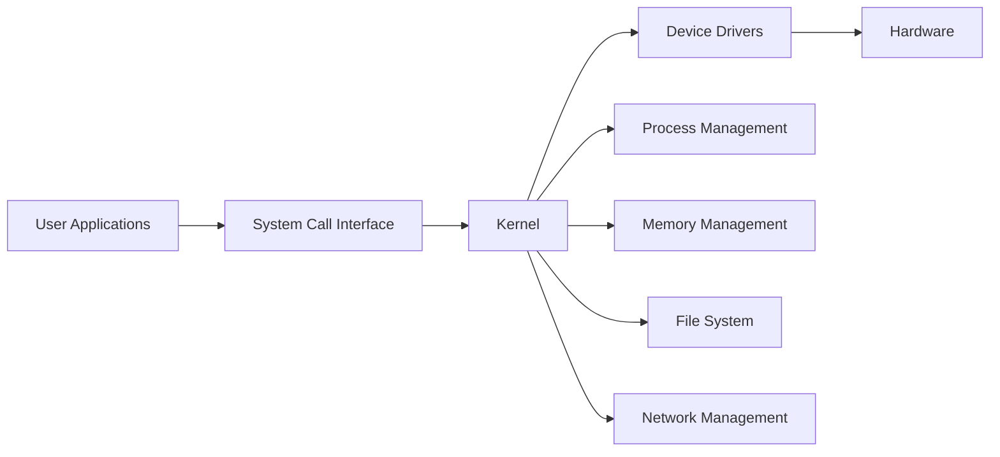
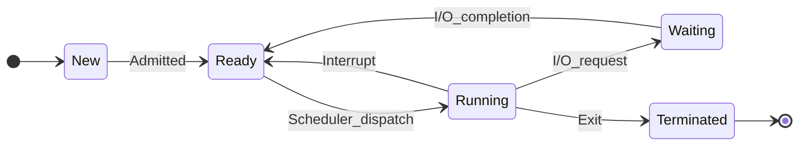

## Question 1(a) [3 marks]

**Draw the architecture of Linux and explain various layers in brief.**

**Answer**:

**Diagram:**



- **User Space**: Contains user applications and system utilities
- **System Call Interface**: Provides interface between user programs and kernel
- **Kernel Space**: Core operating system with process, memory, file management

**Mnemonic:** "Users System Kernel Drives Hardware"

---

## Question 1(b) [4 marks]

**What is a race condition? Explain with a suitable example.**

**Answer**:

| **Aspect** | **Description** |
|------------|----------------|
| **Definition** | Multiple processes accessing shared resource simultaneously |
| **Problem** | Unpredictable results due to timing dependency |
| **Example** | Bank account balance update by two transactions |

**Example Process:**

- **Process A**: Reads balance = 1000, adds 100
- **Process B**: Reads balance = 1000, subtracts 50  
- **Result**: Final balance could be 1050, 950, or 1100 instead of correct 1050

**Mnemonic:** "Race Results Random Resources"

---

## Question 1(c) [7 marks]

**List different types of Operating systems. Explain the working of multiprogramming operating systems with a suitable example.**

**Answer**:

**Table: Types of Operating Systems**

| **Type** | **Characteristics** | **Example** |
|----------|-------------------|-------------|
| **Batch** | Jobs processed in batches | IBM mainframes |
| **Time-sharing** | Multiple users simultaneously | UNIX |
| **Real-time** | Immediate response required | Air traffic control |
| **Distributed** | Multiple connected computers | Google cluster |
| **Multiprogramming** | Multiple programs in memory | Windows, Linux |

**Multiprogramming Working:**

- **Memory Management**: Multiple programs loaded simultaneously
- **CPU Scheduling**: Switches between programs when I/O occurs
- **Resource Sharing**: Efficient utilization of CPU and memory
- **Example**: Word processor, music player, and browser running together

**Mnemonic:** "Multiple Programs Maximize Performance"

---

## Question 1(c OR) [7 marks]

**List different types of Operating systems. Explain the Batch operating systems in detail.**

**Answer**:

**Types of Operating Systems:**
Same table as above.

**Batch Operating System Details:**

- **Job Collection**: Jobs collected offline and grouped into batches
- **Sequential Processing**: Jobs executed one after another without user interaction
- **No Direct Interaction**: User submits job and collects output later
- **Efficiency**: High throughput for similar type jobs
- **Disadvantages**: No real-time processing, long turnaround time

**Mnemonic:** "Batch Brings Better Business"

---

## Question 2(a) [3 marks]

**Draw and explain the Process life cycle.**

**Answer**:

**Diagram:**



- **New**: Process being created
- **Ready**: Process waiting for CPU assignment
- **Running**: Process currently executing
- **Waiting**: Process waiting for I/O operation
- **Terminated**: Process has finished execution

**Mnemonic:** "New Ready Running Waiting Terminated"

---

## Question 2(b) [4 marks]

**Define deadlock and discuss necessary conditions for a deadlock to occur.**

**Answer**:

**Definition**: Deadlock occurs when processes wait indefinitely for resources held by other processes.

**Table: Deadlock Conditions**

| **Condition** | **Description** |
|---------------|----------------|
| **Mutual Exclusion** | Resources cannot be shared |
| **Hold and Wait** | Process holds resource while waiting for another |
| **No Preemption** | Resources cannot be forcibly taken |
| **Circular Wait** | Processes form circular chain of resource dependencies |

**Mnemonic:** "My Hold Never Circles"

---

## Question 2(c) [7 marks]

**Describe the Round Robin algorithm. Calculate the average waiting time & average turn-around time along with Gantt chart for the given data. Consider context switch = 01 ms and quantum time = 05 ms.**

**Answer**:

**Round Robin Algorithm:**

- **Time Quantum**: Fixed time slice for each process
- **Preemptive**: Process preempted after quantum expires
- **Fair Scheduling**: Equal CPU time distribution

**Given Data:**

- Context Switch = 1 ms, Quantum = 5 ms

**Gantt Chart:**

```
|P1|CS|P2|CS|P3|CS|P4|CS|P1|CS|P3|CS|P1|CS|P3|CS|
0  5  6 10 11 16 17 22 23 28 29 34 35 40 41 46 47
```

**Calculations Table:**

| **Process** | **Arrival** | **Burst** | **Completion** | **Turnaround** | **Waiting** |
|-------------|-------------|-----------|----------------|----------------|-------------|
| P1 | 0 | 12 | 40 | 40 | 28 |
| P2 | 3 | 4 | 10 | 7 | 3 |
| P3 | 2 | 15 | 46 | 44 | 29 |
| P4 | 5 | 5 | 22 | 17 | 12 |

- **Average Waiting Time**: (28+3+29+12)/4 = 18 ms
- **Average Turnaround Time**: (40+7+44+17)/4 = 27 ms

**Mnemonic:** "Round Robin Rotates Regularly"

---

## Question 2(a OR) [3 marks]

**Differentiate: CPU bound process v/s I/O bound process.**

**Answer**:

**Table: CPU vs I/O Bound Processes**

| **Aspect** | **CPU Bound** | **I/O Bound** |
|------------|---------------|---------------|
| **CPU Usage** | High CPU utilization | Low CPU utilization |
| **I/O Operations** | Minimal I/O | Frequent I/O |
| **Examples** | Mathematical calculations | File operations |
| **Scheduling** | Needs longer time quantum | Benefits from shorter quantum |
| **Performance** | Limited by CPU speed | Limited by I/O speed |

**Mnemonic:** "CPU Computes, I/O Interacts"

---

## Question 2(b OR) [4 marks]

**Define Critical Section and discuss the general structure of a critical section solution.**

**Answer**:

**Definition**: Critical section is code segment where shared resources are accessed and must be executed atomically.

**Table: Critical Section Structure**

| **Section** | **Purpose** |
|-------------|-------------|
| **Entry Section** | Request permission to enter critical section |
| **Critical Section** | Code accessing shared resources |
| **Exit Section** | Release permission |
| **Remainder Section** | Other code not accessing shared resources |

**Solution Requirements:**

- **Mutual Exclusion**: Only one process in critical section
- **Progress**: Selection of next process cannot be postponed indefinitely
- **Bounded Waiting**: Limit on waiting time

**Mnemonic:** "Enter Critical Exit Remainder"

---

## Question 2(c OR) [7 marks]

**Describe the SJF algorithm. Calculate the average waiting time and average turn-around time along with Gantt chart for the given data.**

**Answer**:

**SJF Algorithm:**

- **Shortest Job First**: Process with smallest burst time scheduled first
- **Non-preemptive**: Process runs to completion
- **Optimal**: Minimizes average waiting time

**Execution Order**: P2(4), P4(5), P1(8), P3(9)

**Gantt Chart:**

```
|  P1  |  P2  |  P4  |     P3     |
0      8     12     17          26
```

**Calculations Table:**

| **Process** | **Arrival** | **Burst** | **Start** | **Completion** | **Turnaround** | **Waiting** |
|-------------|-------------|-----------|-----------|----------------|----------------|-------------|
| P1 | 0 | 8 | 0 | 8 | 8 | 0 |
| P2 | 3 | 4 | 8 | 12 | 9 | 5 |
| P3 | 5 | 9 | 17 | 26 | 21 | 12 |
| P4 | 6 | 5 | 12 | 17 | 11 | 6 |

- **Average Waiting Time**: (0+5+12+6)/4 = 5.75 ms
- **Average Turnaround Time**: (8+9+21+11)/4 = 12.25 ms

**Mnemonic:** "Shortest Jobs Start Soon"

---

## Question 3(a) [3 marks]

**Explain two-level directory structure.**

**Answer**:

**Diagram:**

```goat
    Master File Directory (MFD)
           |
    +------+------+
    |             |
   User1         User2
 Directory      Directory
    |             |
  File1         File3
  File2         File4
```

- **Master File Directory**: Contains entries for each user
- **User File Directory**: Separate directory for each user's files
- **Path Structure**: /user/filename
- **Advantages**: Solves naming conflicts, provides user isolation

**Mnemonic:** "Two Tiers Tackle Troubles"

---

## Question 3(b) [4 marks]

**Explain the different file operations.**

**Answer**:

**Table: File Operations**

| **Operation** | **Purpose** | **Example** |
|---------------|-------------|-------------|
| **Create** | Make new file | touch file.txt |
| **Open** | Access file for operations | fopen() |
| **Read** | Retrieve data from file | fread() |
| **Write** | Store data to file | fwrite() |
| **Close** | Terminate file access | fclose() |
| **Delete** | Remove file | rm file.txt |

**Mnemonic:** "Create Open Read Write Close Delete"

---

## Question 3(c) [7 marks]

**List the different file allocation methods and explain contiguous allocation with necessary diagram.**

**Answer**:

**File Allocation Methods:**

- **Contiguous Allocation**
- **Linked Allocation**
- **Indexed Allocation**

**Contiguous Allocation:**

**Diagram:**

```goat
File A: |Block1|Block2|Block3|
File B: |Block4|Block5|
File C: |Block6|Block7|Block8|Block9|
```

**Table: Contiguous Allocation**

| **Aspect** | **Description** |
|------------|----------------|
| **Storage** | Files stored in consecutive blocks |
| **Access** | Direct access to any block |
| **Advantages** | Fast access, simple implementation |
| **Disadvantages** | External fragmentation, difficult expansion |

**Directory Entry**: (Start block, Length)

**Mnemonic:** "Contiguous Creates Continuous Clusters"

---

## Question 3(a OR) [3 marks]

**Describe the types of file structures.**

**Answer**:

**Table: File Structure Types**

| **Type** | **Organization** | **Access** |
|----------|------------------|------------|
| **Sequential** | Records in order | Sequential only |
| **Direct/Random** | Records by key | Direct access |
| **Indexed** | Index points to records | Key-based access |
| **Hierarchical** | Tree structure | Path-based |

**Mnemonic:** "Sequential Direct Indexed Hierarchical"

---

## Question 3(b OR) [4 marks]

**Explain the different file attributes.**

**Answer**:

**Table: File Attributes**

| **Attribute** | **Description** | **Example** |
|---------------|----------------|-------------|
| **Name** | File identifier | document.txt |
| **Type** | File format | .txt, .exe |
| **Size** | File length in bytes | 1024 bytes |
| **Location** | Physical storage address | Block 150 |
| **Permissions** | Access rights | rwx-rwx-rwx |
| **Timestamps** | Creation, modification dates | 2023-01-16 |

**Mnemonic:** "Name Type Size Location Permissions Time"

---

## Question 3(c OR) [7 marks]

**List the different file allocation methods and explain linked allocation with necessary diagram.**

**Answer**:

**File Allocation Methods:**
Same as previous answer.

**Linked Allocation:**

**Diagram:**

```goat
File A: Block1 → Block5 → Block9 → NULL
File B: Block2 → Block7 → NULL  
File C: Block3 → Block4 → Block8 → NULL
```

**Table: Linked Allocation**

| **Aspect** | **Description** |
|------------|----------------|
| **Storage** | Files stored in linked blocks |
| **Pointers** | Each block contains pointer to next |
| **Advantages** | No external fragmentation, dynamic size |
| **Disadvantages** | Sequential access only, pointer overhead |

**Directory Entry**: (Start block pointer)

**Mnemonic:** "Links Lead Logical Locations"

---

## Question 4(a) [3 marks]

**Define Program threats and explain its types.**

**Answer**:

**Definition**: Program threats are malicious programs that compromise system security and integrity.

**Table: Program Threat Types**

| **Type** | **Description** |
|----------|----------------|
| **Trojan Horse** | Hidden malicious code in legitimate program |
| **Virus** | Self-replicating code that infects other programs |
| **Worm** | Standalone program that replicates across networks |
| **Logic Bomb** | Code triggered by specific conditions |

**Mnemonic:** "Trojans Viruses Worms Logic-bombs"

---

## Question 4(b) [4 marks]

**Explain System Authentication.**

**Answer**:

**Definition**: Process of verifying user identity before granting system access.

**Table: Authentication Methods**

| **Method** | **Description** | **Example** |
|------------|----------------|-------------|
| **Password** | Secret text string | username/password |
| **Biometric** | Physical characteristics | Fingerprint, retina |
| **Token** | Physical device | Smart card, USB key |
| **Multi-factor** | Combination of methods | Password + OTP |

**Authentication Process:**

- **Identification**: User claims identity
- **Verification**: System validates claim
- **Authorization**: Access rights granted

**Mnemonic:** "Passwords Biometrics Tokens Multi-factor"

---

## Question 4(c) [7 marks]

**Explain Access Control List in detail.**

**Answer**:

**Definition**: ACL specifies permissions for each user/group on system resources.

**Table: ACL Components**

| **Component** | **Purpose** | **Example** |
|---------------|-------------|-------------|
| **Subject** | User or group | john, admin_group |
| **Object** | Resource | file.txt, directory |
| **Permission** | Allowed operations | read, write, execute |
| **Action** | Allow or deny | permit, deny |

**ACL Structure:**

```
User: john    File: /etc/passwd    Permission: read    Action: allow
Group: users  File: /tmp/*        Permission: write   Action: allow
User: guest   File: /etc/*        Permission: write   Action: deny
```

**Advantages:**

- **Granular Control**: Fine-grained permissions
- **Flexibility**: Per-resource access control
- **Scalability**: Handles complex organizations

**Mnemonic:** "Access Controls Limit Users"

---

## Question 4(a OR) [3 marks]

**Define System threats and explain its types.**

**Answer**:

**Definition**: System threats target operating system components and system integrity.

**Table: System Threat Types**

| **Type** | **Description** |
|----------|----------------|
| **Denial of Service** | Overwhelm system resources |
| **Privilege Escalation** | Gain unauthorized higher privileges |
| **Buffer Overflow** | Exploit memory management flaws |
| **Rootkit** | Hide malicious activities from detection |

**Mnemonic:** "Denial Privilege Buffer Rootkit"

---

## Question 4(b OR) [4 marks]

**Discuss the needs and goals of protection in OS.**

**Answer**:

**Table: Protection Needs and Goals**

| **Need** | **Goal** | **Implementation** |
|----------|----------|-------------------|
| **Confidentiality** | Prevent unauthorized access | Access controls |
| **Integrity** | Maintain data accuracy | Checksums, validation |
| **Availability** | Ensure resource access | Redundancy, backup |
| **Authentication** | Verify user identity | Login mechanisms |

**Protection Mechanisms:**

- **Access Control**: Limit resource access
- **Capability Lists**: Define user permissions
- **Security Domains**: Isolate processes

**Mnemonic:** "Confidentiality Integrity Availability Authentication"

---

## Question 4(c OR) [7 marks]

**Discuss various operating system security policies and procedures.**

**Answer**:

**Table: Security Policies and Procedures**

| **Policy Type** | **Description** | **Procedure** |
|-----------------|----------------|---------------|
| **Access Control** | Define user permissions | Regular audit, role-based access |
| **Password Policy** | Password requirements | Complexity rules, expiration |
| **Backup Policy** | Data protection strategy | Regular backups, testing |
| **Incident Response** | Security breach handling | Detection, containment, recovery |

**Security Procedures:**

- **Regular Updates**: Patch management
- **Monitoring**: Log analysis, intrusion detection  
- **Training**: User security awareness
- **Audit**: Compliance checking

**Mnemonic:** "Access Password Backup Incident"

---

## Question 5(a) [3 marks]

**Explain the following commands: (i) pwd (ii) cd (iii) comm**

**Answer**:

**Table: Linux Commands**

| **Command** | **Purpose** | **Example** |
|-------------|-------------|-------------|
| **pwd** | Print working directory | pwd → /home/user |
| **cd** | Change directory | cd /tmp |
| **comm** | Compare sorted files | comm file1.txt file2.txt |

- **pwd**: Shows current directory path
- **cd**: Navigate between directories
- **comm**: Displays common and unique lines between files

**Mnemonic:** "Print Working Directory, Change Directory, Compare Common"

---

## Question 5(b) [4 marks]

**Write a shell script to concatenate the contents of two files in a third file.**

**Answer**:

**Shell Script:**

```bash
#!/bin/bash
# Script to concatenate two files into third file

echo "Enter first file name:"
read file1
echo "Enter second file name:" 
read file2
echo "Enter output file name:"
read file3

# Check if input files exist
if [ -f "$file1" ] && [ -f "$file2" ]; then
    cat "$file1" "$file2" > "$file3"
    echo "Files concatenated successfully into $file3"
else
    echo "Error: Input files not found"
fi
```

**Mnemonic:** "Cat Combines Content Correctly"

---

## Question 5(c) [7 marks]

**Write a shell script to find the sum of all the individual digits in a given 5 digit number.**

**Answer**:

**Shell Script:**

```bash
#!/bin/bash
# Script to find sum of digits in 5-digit number

echo "Enter a 5-digit number:"
read number

# Validate input
if [ ${#number} -ne 5 ]; then
    echo "Error: Please enter exactly 5 digits"
    exit 1
fi

sum=0
temp=$number

# Extract and sum each digit
while [ $temp -gt 0 ]; do
    digit=$(($temp % 10))
    sum=$(($sum + $digit))
    temp=$(($temp / 10))
done

echo "Sum of digits in $number is: $sum"
```

**Algorithm:**

- **Input Validation**: Check for 5-digit number
- **Digit Extraction**: Use modulo operation
- **Sum Calculation**: Add each digit
- **Display Result**: Show final sum

**Mnemonic:** "Sum Separates Single Symbols"

---

## Question 5(a OR) [3 marks]

**Explain the following commands: (i) man (ii) mkdir (iii) grep**

**Answer**:

**Table: Linux Commands**

| **Command** | **Purpose** | **Example** |
|-------------|-------------|-------------|
| **man** | Display manual pages | man ls |
| **mkdir** | Create directories | mkdir newdir |
| **grep** | Search text patterns | grep "hello" file.txt |

- **man**: Provides documentation for commands
- **mkdir**: Creates new directories with specified names
- **grep**: Searches for patterns in files using regular expressions

**Mnemonic:** "Manual Make Directories, Grep Examines Patterns"

---

## Question 5(b OR) [4 marks]

**Write a shell script to generate and display Fibonacci series.**

**Answer**:

**Shell Script:**

```bash
#!/bin/bash
# Script to generate Fibonacci series

echo "Enter number of terms:"
read n

# Validate input
if [ $n -le 0 ]; then
    echo "Error: Please enter positive number"
    exit 1
fi

# Initialize first two terms
a=0
b=1

echo "Fibonacci Series:"
echo -n "$a "

if [ $n -gt 1 ]; then
    echo -n "$b "
fi

# Generate remaining terms
for ((i=3; i<=n; i++)); do
    c=$(($a + $b))
    echo -n "$c "
    a=$b
    b=$c
done
echo
```

**Mnemonic:** "Fibonacci Follows Forward Formula"

---

## Question 5(c OR) [7 marks]

**Write a shell script to determine whether a given string is palindrome.**

**Answer**:

**Shell Script:**

```bash
#!/bin/bash
# Script to check if string is palindrome

echo "Enter a string:"
read string

# Convert to lowercase and remove spaces
clean_string=$(echo "$string" | tr '[:upper:]' '[:lower:]' | tr -d ' ')

# Get string length
length=${#clean_string}

# Initialize flag
is_palindrome=true

# Check palindrome
for ((i=0; i<length/2; i++)); do
    if [ "${clean_string:$i:1}" != "${clean_string:$((length-1-i)):1}" ]; then
        is_palindrome=false
        break
    fi
done

# Display result
if [ "$is_palindrome" = true ]; then
    echo "'$string' is a palindrome"
else
    echo "'$string' is not a palindrome"
fi
```

**Algorithm:**

- **String Cleaning**: Convert to lowercase, remove spaces
- **Character Comparison**: Compare characters from both ends
- **Palindrome Check**: Verify if all comparisons match

**Mnemonic:** "Palindromes Proceed Perfectly Parallel"
