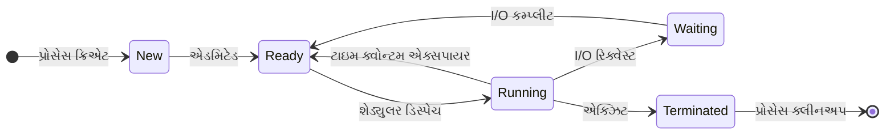

## પ્રશ્ન 1(અ) [3 ગુણ]

**મલ્ટિપ્રોગ્રામિંગ ઓપરેટિંગ સિસ્ટમ સમજાવો અને તેના ફાયદા જણાવો.**

**જવાબ**:

**મલ્ટિપ્રોગ્રામિંગ ઓપરેટિંગ સિસ્ટમ** એકસાથે ઘણા પ્રોગ્રામને મેમરીમાં રાખીને CPU નો સમય અસરકારક રીતે વહેંચીને કામ કરે છે.

**ટેબલ: મલ્ટિપ્રોગ્રામિંગ સિસ્ટમ લક્ષણો**

| લક્ષણ | વર્ણન |
|--------|-------|
| **મેમરી મેનેજમેન્ટ** | મેમરીમાં અનેક પ્રોગ્રામ લોડ કરવા |
| **CPU શેડ્યુલિંગ** | CPU પ્રોગ્રામ વચ્ચે બદલાય છે |
| **રિસોર્સ શેરિંગ** | સિસ્ટમ રિસોર્સનો કુશળ ઉપયોગ |

- **વધારો CPU ઉપયોગ**: CPU પ્રોગ્રામ વચ્ચે બદલાતું રહે છે
- **સારો throughput**: એકમ સમયમાં વધુ પ્રોગ્રામ પૂર્ણ થાય છે
- **ઓછો response time**: પેરેલલ પ્રોસેસિંગથી પ્રોગ્રામ ઝડપથી ચાલે છે

**મેમરી ટ્રીક:** "MCP" - મેમરી શેરિંગ, CPU ઉપયોગ, પેરેલલ એક્ઝિક્યુશન

## પ્રશ્ન 1(બ) [4 ગુણ]

**લિનક્સ ઓપરેટિંગ સિસ્ટમની લાક્ષણિકતાઓ સમજાવો.**

**જવાબ**:

**ટેબલ: લિનક્સ ઓપરેટિંગ સિસ્ટમ લાક્ષણિકતાઓ**

| લાક્ષણિકતા | વર્ણન |
|-------------|-------|
| **ઓપન સોર્સ** | સોર્સ કોડ ફ્રીમાં ઉપલબ્ધ અને સુધારી શકાય |
| **મલ્ટિ-યુઝર** | અનેક યુઝર એકસાથે સિસ્ટમ એક્સેસ કરી શકે |
| **મલ્ટિ-ટાસ્કિંગ** | અનેક પ્રોસેસ એકસાથે ચાલી શકે |
| **પોર્ટેબલ** | વિવિધ હાર્ડવેર પ્લેટફોર્મ પર ચાલે છે |
| **સિક્યોરિટી** | મજબૂત પરમિશન સિસ્ટમ અને એક્સેસ કંટ્રોલ |
| **સ્ટેબિલિટી** | વિશ્વસનીય અને મજબૂત સિસ્ટમ પર્ફોર્મન્સ |

- **કેસ સેન્સિટિવ**: અપરકેસ અને લોઅરકેસ વચ્ચે તફાવત કરે છે
- **કમાન્ડ લાઇન ઇન્ટરફેસ**: સિસ્ટમ ઓપરેશન માટે શક્તિશાળી શેલ
- **ફાઇલ સિસ્ટમ હાયરાર્કી**: રૂટ (/) થી શરૂ થતું વ્યવસ્થિત ડિરેક્ટરી સ્ટ્રક્ચર

**મેમરી ટ્રીક:** "LAMPS" - લિનક્સ છે Accessible, Multi-user, Portable, Secure

## પ્રશ્ન 1(ક) [7 ગુણ]

**FCFS શેડ્યુલિંગ અલ્ગોરિધમ તેના ફાયદા અને ગેરફાયદા સાથે સમજાવો. નીચેના ડેટા માટે ગેન્ટ ચાર્ટ સાથે FCFS અલ્ગોરિધમ માટે સરેરાશ waiting time અને સરેરાશ turnaround time ની ગણતરી કરો.**

**જવાબ**:

**ફર્સ્ટ કમ ફર્સ્ટ સર્વ (FCFS)** એ નોન-પ્રીએમ્પ્ટિવ શેડ્યુલિંગ અલ્ગોરિધમ છે જ્યાં પ્રોસેસ તેના આવવાના ક્રમમાં એક્ઝિક્યુટ થાય છે.

**ટેબલ: FCFS અલ્ગોરિધમ વિશ્લેષણ**

| પાસાં | વર્ણન |
|-------|-------|
| **નીતિ** | પહેલા આવેલ પ્રોસેસને પહેલા CPU મળે |
| **પ્રકાર** | નોન-પ્રીએમ્પ્ટિવ |
| **અમલીકરણ** | સાદી ક્યુ (FIFO) |

**ફાયદા:**

- **સરળ અમલીકરણ**: સમજવામાં અને કોડ કરવામાં સહેલું
- **ન્યાયિક શેડ્યુલિંગ**: કોઈ starvation થતું નથી

**ગેરફાયદા:**

- **કોન્વોય ઇફેક્ટ**: નાના પ્રોસેસ મોટા પ્રોસેસની રાહ જુએ છે
- **ખરાબ સરેરાશ waiting time**: સિસ્ટમ પર્ફોર્મન્સ માટે શ્રેષ્ઠ નથી

**ગેન્ટ ચાર્ટ ગણતરી:**

```goat
P0    |    P1  | P2 |   P3    |
0     5     8   10   17
```

**ટેબલ: પ્રોસેસ એક્ઝિક્યુશન વિશ્લેષણ**

| પ્રોસેસ | આવવાનો સમય | બર્સ્ટ ટાઇમ | શરૂઆત | સમાપ્તિ | Waiting | Turnaround |
|---------|-------------|-------------|--------|---------|---------|------------|
| P0      | 0           | 5           | 0      | 5       | 0       | 5          |
| P1      | 3           | 3           | 5      | 8       | 2       | 5          |
| P2      | 5           | 2           | 8      | 10      | 3       | 5          |
| P3      | 6           | 7           | 10     | 17      | 4       | 11         |

**સરેરાશ Waiting Time** = (0+2+3+4)/4 = **2.25 ms**
**સરેરાશ Turnaround Time** = (5+5+5+11)/4 = **6.5 ms**

**મેમરી ટ્રીક:** "FCFS-SiNo" - ફર્સ્ટ કમ ફર્સ્ટ સર્વ સિમ્પલ છે પણ શ્રેષ્ઠ નથી

---

## પ્રશ્ન 1(ક) OR [7 ગુણ]

**રાઉન્ડ રોબિન અલ્ગોરિધમ તેના ફાયદા અને ગેરફાયદા સાથે સમજાવો. નીચેના ડેટા માટે ગેન્ટ ચાર્ટ સાથે રાઉન્ડ રોબિન અલ્ગોરિધમ માટે સરેરાશ waiting time અને સરેરાશ turnaround time ની ગણતરી કરો. (ટાઇમ ક્વોન્ટમ = 2 ms)**

**જવાબ**:

**રાઉન્ડ રોબિન** એ પ્રીએમ્પ્ટિવ શેડ્યુલિંગ અલ્ગોરિધમ છે જ્યાં દરેક પ્રોસેસને સમાન CPU ટાઇમ સ્લાઇસ (ક્વોન્ટમ) મળે છે.

**ટેબલ: રાઉન્ડ રોબિન લક્ષણો**

| લક્ષણ | વર્ણન |
|--------|-------|
| **ટાઇમ ક્વોન્ટમ** | દરેક પ્રોસેસ માટે નિશ્ચિત ટાઇમ સ્લાઇસ |
| **પ્રીએમ્પ્શન** | ક્વોન્ટમ પૂરું થયા પછી પ્રોસેસ અટકાવાય છે |
| **ક્યુ પ્રકાર** | વર્તુળાકાર રેડી ક્યુ |

**ફાયદા:**

- **ન્યાયિક વિતરણ**: દરેક પ્રોસેસને સમાન CPU ટાઇમ મળે છે
- **કોઈ starvation નથી**: બધા પ્રોસેસને આખરે CPU મળે છે

**ગેરફાયદા:**

- **કોન્ટેક્સ્ટ સ્વિચિંગ ઓવરહેડ**: વારંવાર પ્રોસેસ બદલાવાનું
- **પર્ફોર્મન્સ ક્વોન્ટમ પર આધારિત**: ખૂબ નાનું કે મોટું હોવાથી અસર થાય છે

**ગેન્ટ ચાર્ટ (ક્વોન્ટમ = 2ms):**

```goat
P0|P1|P2|P3|P0|P1|P2|P1|P0|P1|
0 2 4 6 7 9 11 12 13 14 16
```

**ટેબલ: રાઉન્ડ રોબિન એક્ઝિક્યુશન**

| પ્રોસેસ | આવવાનો સમય | બર્સ્ટ ટાઇમ | પૂર્ણતા | Waiting | Turnaround |
|---------|-------------|-------------|---------|---------|------------|
| P0      | 0           | 4           | 14      | 10      | 14         |
| P1      | 1           | 5           | 16      | 10      | 15         |
| P2      | 2           | 3           | 12      | 7       | 10         |
| P3      | 3           | 1           | 7       | 3       | 4          |

**સરેરાશ Waiting Time** = (10+10+7+3)/4 = **7.5 ms**
**સરેરાશ Turnaround Time** = (14+15+10+4)/4 = **10.75 ms**

**મેમરી ટ્રીક:** "RR-TEQ" - રાઉન્ડ રોબિન ટાઇમ ઇક્વલ ક્વોન્ટમ વાપરે છે

---

## પ્રશ્ન 2(અ) [3 ગુણ]

**રિયલ ટાઇમ ઓપરેશન સિસ્ટમ સમજાવો.**

**જવાબ**:

**રિયલ ટાઇમ ઓપરેટિંગ સિસ્ટમ (RTOS)** ડેટાને પ્રોસેસ કરે છે અને કડક સમય મર્યાદામાં ઇવેન્ટ્સનો જવાબ આપે છે.

**ટેબલ: RTOS પ્રકારો**

| પ્રકાર | રિસ્પોન્સ ટાઇમ | ઉદાહરણ |
|--------|----------------|---------|
| **હાર્ડ રિયલ-ટાઇમ** | ગેરેન્ટીડ ડેડલાઇન | મિસાઇલ ગાઇડન્સ |
| **સોફ્ટ રિયલ-ટાઇમ** | લવચીક ડેડલાઇન | વિડિઓ સ્ટ્રીમિંગ |

- **ડિટર્મિનિસ્ટિક વર્તન**: અનુમાનિત રિસ્પોન્સ ટાઇમ
- **પ્રાયોરિટી-આધારિત શેડ્યુલિંગ**: મહત્વપૂર્ણ ટાસ્કને વધુ પ્રાયોરિટી
- **ન્યૂનતમ લેટન્સી**: ઝડપી ઇન્ટરપ્ટ હેન્ડલિંગ અને કોન્ટેક્સ્ટ સ્વિચિંગ

**મેમરી ટ્રીક:** "RTD" - રિયલ ટાઇમ છે ડિટર્મિનિસ્ટિક

## પ્રશ્ન 2(બ) [4 ગુણ]

**ડાયાગ્રામ સાથે પ્રોસેસ લાઇફ સાઇકલ સમજાવો.**

**જવાબ**:

**પ્રોસેસ લાઇફ સાઇકલ** એક પ્રોસેસ એક્ઝિક્યુશન દરમિયાન પસાર થતા વિવિધ સ્ટેટ્સ દર્શાવે છે.

**ડાયાગ્રામ: પ્રોસેસ સ્ટેટ ટ્રાન્ઝિશન**



**ટેબલ: પ્રોસેસ સ્ટેટ્સ**

| સ્ટેટ | વર્ણન |
|-------|-------|
| **New** | પ્રોસેસ બનાવવામાં આવી રહ્યું છે |
| **Ready** | CPU એસાઇનમેન્ટ માટે રાહ જોઈ રહ્યું છે |
| **Running** | ઇન્સ્ટ્રક્શન્સ એક્ઝિક્યુટ થઈ રહ્યા છે |
| **Waiting** | I/O પૂર્ણતા માટે રાહ જોઈ રહ્યું છે |
| **Terminated** | પ્રોસેસે એક્ઝિક્યુશન પૂર્ણ કર્યું છે |

**મેમરી ટ્રીક:** "NRRWT" - New Ready Running Waiting Terminated

## પ્રશ્ન 2(ક) [7 ગુણ]

**લિનક્સમાં વિવિધ ફાઇલ અને ડિરેક્ટરી સંબંધિત કમાન્ડ્સ સમજાવો.**

**જવાબ**:

**ટેબલ: ફાઇલ કમાન્ડ્સ**

| કમાન્ડ | કાર્ય | ઉદાહરણ |
|---------|------|---------|
| **ls** | ડિરેક્ટરી કન્ટેન્ટ્સ લિસ્ટ કરો | `ls -la` |
| **cat** | ફાઇલ કન્ટેન્ટ દર્શાવો | `cat file.txt` |
| **cp** | ફાઇલ કોપી કરો | `cp source dest` |
| **mv** | ફાઇલ મૂવ/રિનેમ કરો | `mv old new` |
| **rm** | ફાઇલ ડિલીટ કરો | `rm file.txt` |

**ટેબલ: ડિરેક્ટરી કમાન્ડ્સ**

| કમાન્ડ | કાર્ય | ઉદાહરણ |
|---------|------|---------|
| **mkdir** | ડિરેક્ટરી બનાવો | `mkdir mydir` |
| **rmdir** | ખાલી ડિરેક્ટરી ડિલીટ કરો | `rmdir mydir` |
| **cd** | ડિરેક્ટરી બદલો | `cd /home` |
| **pwd** | વર્કિંગ ડિરેક્ટરી પ્રિન્ટ કરો | `pwd` |

- **ફાઇલ પરમિશન્સ**: એક્સેસ રાઇટ્સ સુધારવા માટે `chmod` વાપરો
- **ફાઇલ ઓનરશિપ**: ફાઇલ ઓનર બદલવા માટે `chown` વાપરો
- **ફાઇલ ઇન્ફોર્મેશન**: વિગતવાર ફાઇલ ઇન્ફો માટે `stat` વાપરો

**મેમરી ટ્રીક:** "LCCMR-MRCP" - લિસ્ટ, કેટ, કોપી, મૂવ, રિમૂવ ફાઇલ માટે; મેક, રિમૂવ, ચેન્જ, પ્રિન્ટ ડિરેક્ટરી માટે

---

## પ્રશ્ન 2(અ) OR [3 ગુણ]

**ઓપરેટિંગ સિસ્ટમ સર્વિસિસનું વિગતવાર વર્ણન કરો.**

**જવાબ**:

**ઓપરેટિંગ સિસ્ટમ સર્વિસિસ** યુઝર એપ્લિકેશન્સ અને હાર્ડવેર રિસોર્સિસ વચ્ચે ઇન્ટરફેસ પ્રદાન કરે છે.

**ટેબલ: OS સર્વિસિસ કેટેગરીઝ**

| કેટેગરી | સર્વિસિસ |
|----------|-----------|
| **યુઝર ઇન્ટરફેસ** | GUI, કમાન્ડ લાઇન, બેચ |
| **પ્રોગ્રામ એક્ઝિક્યુશન** | લોડિંગ, રનિંગ, ટર્મિનેટિંગ |
| **I/O ઓપરેશન્સ** | ફાઇલ ઓપરેશન્સ, ડિવાઇસ કમ્યુનિકેશન |
| **ફાઇલ સિસ્ટમ** | ક્રિએશન, ડિલીશન, મેનિપ્યુલેશન |
| **કમ્યુનિકેશન** | પ્રોસેસ કમ્યુનિકેશન, નેટવર્ક |
| **એરર ડિટેક્શન** | હાર્ડવેર/સોફ્ટવેર એરર હેન્ડલિંગ |

- **રિસોર્સ એલોકેશન**: CPU, મેમરી અને ડિવાઇસ મેનેજમેન્ટ
- **એકાઉન્ટિંગ**: રિસોર્સ ઉપયોગ અને પર્ફોર્મન્સ ટ્રેક કરવું
- **પ્રોટેક્શન અને સિક્યોરિટી**: એક્સેસ કંટ્રોલ અને ઓથેન્ટિકેશન

**મેમરી ટ્રીક:** "UPIFCE" - યુઝર ઇન્ટરફેસ, પ્રોગ્રામ એક્ઝિક્યુશન, I/O, ફાઇલ સિસ્ટમ, કમ્યુનિકેશન, એરર ડિટેક્શન

## પ્રશ્ન 2(બ) OR [4 ગુણ]

**પ્રોસેસ કંટ્રોલ બ્લોક સમજાવો.**

**જવાબ**:

**પ્રોસેસ કંટ્રોલ બ્લોક (PCB)** એ ડેટા સ્ટ્રક્ચર છે જેમાં પ્રોસેસ વિશેની બધી માહિતી હોય છે.

**ટેબલ: PCB કમ્પોનન્ટ્સ**

| કમ્પોનન્ટ | સ્ટોર કરેલી માહિતી |
|-----------|---------------------|
| **પ્રોસેસ ID** | અનન્ય પ્રોસેસ આઇડેન્ટિફાયર |
| **પ્રોસેસ સ્ટેટ** | વર્તમાન સ્ટેટ (ready, running, waiting) |
| **CPU રજિસ્ટર્સ** | પ્રોગ્રામ કાઉન્ટર, સ્ટેક પોઇન્ટર, રજિસ્ટર્સ |
| **મેમરી મેનેજમેન્ટ** | બેઝ/લિમિટ રજિસ્ટર્સ, પેજ ટેબલ્સ |
| **I/O સ્ટેટસ** | ઓપન ફાઇલ્સ, એલોકેટેડ ડિવાઇસિસ |
| **એકાઉન્ટિંગ** | CPU ઉપયોગ, ટાઇમ લિમિટ્સ |

**ડાયાગ્રામ: PCB સ્ટ્રક્ચર**

```goat
+------------------+
| પ્રોસેસ ID       |
+------------------+
| પ્રોસેસ સ્ટેટ    |
+------------------+
| પ્રોગ્રામ કાઉન્ટર  |
+------------------+
| CPU રજિસ્ટર્સ    |
+------------------+
| મેમરી લિમિટ્સ    |
+------------------+
| ઓપન ફાઇલ લિસ્ટ  |
+------------------+
| એકાઉન્ટિંગ ઇન્ફો |
+------------------+
```

**મેમરી ટ્રીક:** "PPCMIA" - પ્રોસેસ ID, પ્રોસેસ સ્ટેટ, પ્રોગ્રામ કાઉન્ટર, CPU રજિસ્ટર્સ, મેમરી, I/O, એકાઉન્ટિંગ

## પ્રશ્ન 2(ક) OR [7 ગુણ]

**લિનક્સના ઇન્સ્ટોલેશન સ્ટેપ્સ સમજાવો.**

**જવાબ**:

**લિનક્સના ઇન્સ્ટોલેશન સ્ટેપ્સ સમજાવો.**

**જવાબ**:

**લિનક્સ ઇન્સ્ટોલેશન** સિસ્ટમ તૈયાર કરવા અને બૂટેબલ મીડિયાથી ઓપરેટિંગ સિસ્ટમ ઇન્સ્ટોલ કરવાનું છે.

**ટેબલ: ઇન્સ્ટોલેશન સ્ટેપ્સ**

| સ્ટેપ | વર્ણન |
|------|-------|
| **1. ISO ડાઉનલોડ** | લિનક્સ ડિસ્ટ્રિબ્યુશન ઇમેજ ફાઇલ લો |
| **2. બૂટેબલ મીડિયા બનાવો** | ઇન્સ્ટોલેશન મીડિયા બનાવવા USB/DVD વાપરો |
| **3. મીડિયાથી બૂટ કરો** | BIOS/UEFI બૂટ ઓર્ડર બદલો |
| **4. ભાષા પસંદ કરો** | ઇન્સ્ટોલેશન ભાષા પસંદ કરો |
| **5. ડિસ્ક પાર્ટિશન કરો** | રૂટ, સ્વેપ, હોમ પાર્ટિશન બનાવો |
| **6. નેટવર્ક કોન્ફિગર કરો** | IP, DNS, હોસ્ટનેમ સેટ કરો |
| **7. યુઝર એકાઉન્ટ બનાવો** | યુઝરનેમ, પાસવર્ડ સેટ કરો |
| **8. બૂટલોડર ઇન્સ્ટોલ કરો** | બૂટિંગ માટે GRUB કોન્ફિગર કરો |
| **9. ઇન્સ્ટોલેશન પૂર્ણ કરો** | મીડિયા કાઢો અને રીબૂટ કરો |

**પાર્ટિશનિંગ સ્કીમ:**

- **રૂટ (/)**: સિસ્ટમ ફાઇલ્સ માટે ઓછામાં ઓછું 20GB
- **સ્વેપ**: વર્ચ્યુઅલ મેમરી માટે RAM નો 2x સાઇઝ
- **હોમ (/home)**: યુઝર ડેટા માટે બાકીની જગ્યા

**પોસ્ટ-ઇન્સ્ટોલેશન:**

- **સિસ્ટમ અપડેટ કરો**: `sudo apt update && sudo apt upgrade`
- **ડ્રાઇવર્સ ઇન્સ્ટોલ કરો**: ગ્રાફિક્સ, નેટવર્ક, ઓડિયો ડ્રાઇવર્સ
- **સિક્યોરિટી કોન્ફિગર કરો**: ફાયરવોલ, યુઝર પરમિશન્સ

**મેમરી ટ્રીક:** "DCBSLNCIU" - ડાઉનલોડ, કરિએટ મીડિયા, બૂટ, સિલેક્ટ ભાષા, લેઆઉટ ડિસ્ક, નેટવર્ક, કરિએટ યુઝર, ઇન્સ્ટોલ બૂટલોડર, અપડેટ સિસ્ટમ

---

## પ્રશ્ન 3(અ) [3 ગુણ]

**વ્યાખ્યાયિત કરો: પ્રક્રિયા, પ્રોગ્રામ, સ્વેપિંગ**

**જવાબ**:

**ટેબલ: મૂળભૂત વ્યાખ્યાઓ**

| શબ્દ | વ્યાખ્યા |
|------|---------|
| **પ્રક્રિયા (Process)** | એલોકેટેડ રિસોર્સિસ સાથે એક્ઝિક્યુશનમાં રહેલ પ્રોગ્રામ |
| **પ્રોગ્રામ (Program)** | ડિસ્ક પર સ્ટોર કરેલ ઇન્સ્ટ્રક્શન્સનો સેટ |
| **સ્વેપિંગ (Swapping)** | મેમરી અને ડિસ્ક વચ્ચે પ્રોસેસને મૂવ કરવું |

- **પ્રક્રિયા**: પ્રોસેસ ID, મેમરી સ્પેસ અને એક્ઝિક્યુશન સ્ટેટ સાથેની સક્રિય એન્ટિટી
- **પ્રોગ્રામ**: સેકન્ડરી સ્ટોરેજમાં સ્ટોર કરેલી નિષ્ક્રિય એન્ટિટી, એક્ઝિક્યુટેબલ ફાઇલ
- **સ્વેપિંગ**: ફિઝિકલ મેમરી કરતાં વધુ પ્રોસેસ હેન્ડલ કરવાની મેમરી મેનેજમેન્ટ ટેકનિક

**મેમરી ટ્રીક:** "PAP-MDS" - પ્રક્રિયા છે સક્રિય પ્રોગ્રામ; પ્રોગ્રામ છે ઇન્સ્ટ્રક્શન્સ; સ્વેપિંગ છે મેમરી-ડિસ્ક ટ્રાન્સફર

## પ્રશ્ન 3(બ) [4 ગુણ]

**વિવિધ ફાઇલ ઓપરેશન્સની યાદી બનાવો અને તેમાંના દરેકનું વર્ણન કરો.**

**જવાબ**:

**ટેબલ: ફાઇલ ઓપરેશન્સ**

| ઓપરેશન | વર્ણન | સિસ્ટમ કોલ |
|----------|-------|-------------|
| **ક્રિએટ** | નિર્દિષ્ટ નામ સાથે નવી ફાઇલ બનાવો | `creat()` |
| **ઓપન** | રીડિંગ/રાઇટિંગ માટે ફાઇલ તૈયાર કરો | `open()` |
| **રીડ** | ફાઇલમાંથી ડેટા મેળવો | `read()` |
| **રાઇટ** | ફાઇલમાં ડેટા સ્ટોર કરો | `write()` |
| **ક્લોઝ** | ફાઇલ એક્સેસ પૂર્ણ કરો, રિસોર્સિસ રીલીઝ કરો | `close()` |
| **ડિલીટ** | ફાઇલ સિસ્ટમમાંથી ફાઇલ કાઢો | `unlink()` |
| **સીક** | ફાઇલ પોઇન્ટરને સ્પેસિફિક પોઝિશન પર મૂવ કરો | `lseek()` |

- **ફાઇલ એટ્રિબ્યુટ્સ**: એક્સેસ પરમિશન્સ, ટાઇમસ્ટેમ્પ્સ, સાઇઝ ઇન્ફોર્મેશન
- **ફાઇલ લોકિંગ**: કોન્કરન્ટ એક્સેસ કોન્ફ્લિક્ટ અટકાવવું
- **બફર મેનેજમેન્ટ**: કેશિંગ દ્વારા I/O પર્ફોર્મન્સ ઓપ્ટિમાઇઝ કરવું

**મેમરી ટ્રીક:** "CORWCDS" - ક્રિએટ, ઓપન, રીડ, રાઇટ, ક્લોઝ, ડિલીટ, સીક

## પ્રશ્ન 3(ક) [7 ગુણ]

**ફિબોનાકી શ્રેણી બનાવવા અને પ્રિન્ટ કરવા માટે શેલ સ્ક્રિપ્ટ લખો.**

**જવાબ**:

**ફિબોનાકી શ્રેણી** એવી સંખ્યાઓ બનાવે છે જ્યાં દરેક સંખ્યા તેની પહેલાની બે સંખ્યાઓનો સરવાળો હોય છે.

**શેલ સ્ક્રિપ્ટ:**

```bash
#!/bin/bash
# ફિબોનાકી શ્રેણી જનરેટર

echo "કેટલા ટર્મ્સ દાખલ કરો:"
read n

a=0
b=1

echo "ફિબોનાકી શ્રેણી:"
echo -n "$a $b "

for((i=2; i<n; i++))
do
    c=$((a + b))
    echo -n "$c "
    a=$b
    b=$c
done
echo
```

**ટેબલ: સ્ક્રિપ્ટ કમ્પોનન્ટ્સ**

| કમ્પોનન્ટ | હેતુ |
|-----------|-----|
| **#!/bin/bash** | ઇન્ટરપ્રેટર સ્પેસિફાઇ કરતી શેબેંગ લાઇન |
| **read n** | ટર્મ્સની સંખ્યા માટે યુઝર ઇનપુટ સ્વીકારો |
| **for લૂપ** | સિક્વન્સ જનરેટ કરવા માટે પુનરાવર્તન કરો |
| **અંકગણિત** | શ્રેણીમાં આગળની સંખ્યા ગણો |

**આઉટપુટ ઉદાહરણ:**

```
કેટલા ટર્મ્સ દાખલ કરો: 8
ફિબોનાકી શ્રેણી: 0 1 1 2 3 5 8 13
```

**મેમરી ટ્રીક:** "FLAB" - ફિબોનાકી લૂપ વાપરે છે બંને પાછલી સંખ્યાઓનો એડિશન

---

## પ્રશ્ન 3(અ) OR [3 ગુણ]

**શેડ્યુલરના પ્રકારોની યાદી બનાવો અને તેમાંથી કોઈપણ એક સમજાવો.**

**જવાબ**:

**ટેબલ: શેડ્યુલર પ્રકારો**

| શેડ્યુલર પ્રકાર | કાર્ય |
|----------------|------|
| **લોંગ-ટર્મ** | જોબ પૂલમાંથી રેડી ક્યુમાં પ્રોસેસ પસંદ કરે છે |
| **શોર્ટ-ટર્મ** | રેડી ક્યુમાંથી CPU માટે પ્રોસેસ પસંદ કરે છે |
| **મીડિયમ-ટર્મ** | મેમરી અને ડિસ્ક વચ્ચે સ્વેપિંગ હેન્ડલ કરે છે |

**શોર્ટ-ટર્મ શેડ્યુલર (CPU શેડ્યુલર):**

- **ફ્રીક્વન્સી**: ખૂબ જ વારંવાર એક્ઝિક્યુટ થાય છે (મિલિસેકન્ડ્સ)
- **કાર્ય**: નક્કી કરે છે કે આગળ કયો પ્રોસેસ CPU મેળવશે
- **અલ્ગોરિધમ્સ**: FCFS, SJF, રાઉન્ડ રોબિન, પ્રાયોરિટી
- **લક્ષ્ય**: CPU ઉપયોગ અને throughput મેક્સિમાઇઝ કરવું

**મેમરી ટ્રીક:** "LSM-JRC" - લોંગ-ટર્મ (જોબ), શોર્ટ-ટર્મ (રેડી), મીડિયમ-ટર્મ (સ્વેપ કંટ્રોલ)

## પ્રશ્ન 3(બ) OR [4 ગુણ]

**વિવિધ ફાઇલ એટ્રિબ્યુટ્સની યાદી બનાવો અને તેમાંથી દરેકનું વર્ણન કરો.**

**જવાબ**:

**ટેબલ: ફાઇલ એટ્રિબ્યુટ્સ**

| એટ્રિબ્યુટ | વર્ણન |
|------------|-------|
| **નામ** | ફાઇલનું માનવ-વાંચી શકાય તેવું આઇડેન્ટિફાયર |
| **પ્રકાર** | ફાઇલ ફોર્મેટ (ટેક્સ્ટ, બાઇનરી, એક્ઝિક્યુટેબલ) |
| **સાઇઝ** | બાઇટ્સમાં વર્તમાન ફાઇલ સાઇઝ |
| **લોકેશન** | સ્ટોરેજ ડિવાઇસ પર ફિઝિકલ એડ્રેસ |
| **પ્રોટેક્શન** | એક્સેસ પરમિશન્સ (રીડ, રાઇટ, એક્ઝિક્યુટ) |
| **ટાઇમ સ્ટેમ્પ્સ** | ક્રિએશન, મોડિફિકેશન, એક્સેસ ટાઇમ્સ |
| **ઓનર** | ફાઇલ બનાવનાર યુઝર |

**પરમિશન સ્ટ્રક્ચર:**

- **યુઝર (u)**: ઓનર પરમિશન્સ
- **ગ્રુપ (g)**: ગ્રુપ મેમ્બર પરમિશન્સ
- **અધર (o)**: બાકીના બધા યુઝર્સની પરમિશન્સ

**ઉદાહરણ:** `-rwxr-xr--`

- ફાઇલ પ્રકાર: રેગ્યુલર ફાઇલ (-)
- ઓનર: રીડ, રાઇટ, એક્ઝિક્યુટ (rwx)
- ગ્રુપ: રીડ, એક્ઝિક્યુટ (r-x)
- અધર: માત્ર રીડ (r--)

**મેમરી ટ્રીક:** "NTSLPTO" - નામ, ટાઇપ, સાઇઝ, લોકેશન, પ્રોટેક્શન, ટાઇમ, ઓનર

## પ્રશ્ન 3(ક) OR [7 ગુણ]

**વ્હાઇલ લૂપનો ઉપયોગ કરીને 1 થી 10 ના સરવાળા માટે શેલ સ્ક્રિપ્ટ લખો.**

**જવાબ**:

**વ્હાઇલ લૂપ** નિર્દિષ્ટ કંડિશન સાચી રહે ત્યાં સુધી એક્ઝિક્યુશન ચાલુ રાખે છે.

**શેલ સ્ક્રિપ્ટ:**

```bash
#!/bin/bash
# વ્હાઇલ લૂપ વાપરીને 1 થી 10 નો સરવાળો

echo "1 થી 10 નો સરવાળો ગણતરી કરી રહ્યાં છીએ:"

i=1
sum=0

while [ $i -le 10 ]
do
    sum=$((sum + i))
    echo "$i ઉમેરી રહ્યાં છીએ, વર્તમાન સરવાળો: $sum"
    i=$((i + 1))
done

echo "1 થી 10 નો અંતિમ સરવાળો છે: $sum"
```

**ટેબલ: સ્ક્રિપ્ટ લોજિક**

| કમ્પોનન્ટ | હેતુ |
|-----------|-----|
| **i=1** | કાઉન્ટર વેરિએબલ ઇનિશિયલાઇઝ કરો |
| **sum=0** | એક્યુમ્યુલેટર ઇનિશિયલાઇઝ કરો |
| **while [ $i -le 10 ]** | i ≤ 10 સુધી ચાલુ રાખો |
| **sum=$((sum + i))** | વર્તમાન સંખ્યા સરવાળામાં ઉમેરો |
| **i=$((i + 1))** | કાઉન્ટર વધારો |

**આઉટપુટ:**

```
1 થી 10 નો સરવાળો ગણતરી કરી રહ્યાં છીએ:
1 ઉમેરી રહ્યાં છીએ, વર્તમાન સરવાળો: 1
2 ઉમેરી રહ્યાં છીએ, વર્તમાન સરવાળો: 3
...
1 થી 10 નો અંતિમ સરવાળો છે: 55
```

**મેમરી ટ્રીક:** "WICS" - વ્હાઇલ લૂપને ઇનિશિયલાઇઝ, કંડિશન, સમ કેલ્ક્યુલેશન જોઈએ

---

## પ્રશ્ન 4(અ) [3 ગુણ]

**ડેડલોક થવાની કંડિશનની યાદી બનાવો અને સમજાવો.**

**જવાબ**:

**ડેડલોક** ત્યારે થાય છે જ્યારે પ્રોસેસિસ એકબીજા પાસે રહેલા રિસોર્સિસ માટે અનિશ્ચિત સમય સુધી રાહ જુએ છે.

**ટેબલ: ડેડલોક કંડિશન્સ (કોફમેન કંડિશન્સ)**

| કંડિશન | વર્ણન |
|---------|-------|
| **મ્યુચ્યુઅલ એક્સક્લુઝન** | એક સમયે માત્ર એક પ્રોસેસ રિસોર્સ વાપરી શકે |
| **હોલ્ડ એન્ડ વેઇટ** | પ્રોસેસ રિસોર્સ રાખીને બીજાની રાહ જુએ છે |
| **નો પ્રીએમ્પ્શન** | રિસોર્સિસ બળજબરીથી છીનવી શકાતા નથી |
| **સર્ક્યુલર વેઇટ** | રિસોર્સિસ માટે રાહ જોતા પ્રોસેસિસની સર્ક્યુલર ચેઇન |

**ડેડલોક માટે ચારેય કંડિશન એકસાથે સાચી હોવી જરૂરી છે.**

**ઉદાહરણ પરિસ્થિતિ:**

- પ્રોસેસ P1 પાસે રિસોર્સ A છે, રિસોર્સ B જોઈએ
- પ્રોસેસ P2 પાસે રિસોર્સ B છે, રિસોર્સ A જોઈએ
- બંને પ્રોસેસિસ અનિશ્ચિત સમય સુધી રાહ જુએ છે

**મેમરી ટ્રીક:** "MHNC" - મ્યુચ્યુઅલ એક્સક્લુઝન, હોલ્ડ એન્ડ વેઇટ, નો પ્રીએમ્પ્શન, સર્ક્યુલર વેઇટ

## પ્રશ્ન 4(બ) [4 ગુણ]

**ફાઇલ એક્સેસ મેથડ્સની િૂચિ બનાવો. કોઈપણ એક સમજાવો.**

**જવાબ**:

**ટેબલ: ફાઇલ એક્સેસ મેથડ્સ**

| મેથડ | વર્ણન |
|------|-------|
| **સિક્વન્શિયલ એક્સેસ** | શરૂઆતથી અંત સુધી ફાઇલ વાંચો |
| **ડાયરેક્ટ એક્સેસ** | કોઈપણ રેકોર્ડ પર સીધું જમ્પ કરો |
| **ઇન્ડેક્સ સિક્વન્શિયલ** | સિક્વન્શિયલ અને ઇન્ડેક્સ્ડ એક્સેસનું કોમ્બિનેશન |

**સિક્વન્શિયલ એક્સેસ મેથડ:**

- **પ્રક્રિયા**: રેકોર્ડ્સને ક્રમમાં એક પછી એક વાંચો
- **ફાયદા**: સરળ અમલીકરણ, બેચ પ્રોસેસિંગ માટે કુશળ
- **ગેરફાયદા**: સ્પેસિફિક રેકોર્ડ એક્સેસ માટે ધીમું
- **ઉપયોગ કિસ્સાઓ**: લોગ ફાઇલ્સ, ડેટા બેકઅપ, સ્ટ્રીમિંગ

**ઓપરેશન્સ:**

```
read_next() - આગળનું રેકોર્ડ વાંચો
write_next() - આગળનું રેકોર્ડ લખો
reset() - શરૂઆતમાં પાછા જાઓ
```

**મેમરી ટ્રીક:** "SDI" - સિક્વન્શિયલ (શરૂથી અંત), ડાયરેક્ટ (ગમે ત્યાં જમ્પ), ઇન્ડેક્સ (સંયુક્ત અભિગમ)

## પ્રશ્ન 4(ક) [7 ગુણ]

**ઓપરેટિંગ સિસ્ટમમાં સુરક્ષા પગલાંનું વર્ણન કરો.**

**જવાબ**:

**ઓપરેટિંગ સિસ્ટમ સિક્યોરિટી** અનધિકૃત એક્સેસ અને ખતરાઓથી સિસ્ટમ રિસોર્સિસને સુરક્ષિત રાખે છે.

**ટેબલ: સિક્યોરિટી મેકેનિઝમ્સ**

| મેકેનિઝમ | વર્ણન |
|-----------|-------|
| **ઓથેન્ટિકેશન** | યુઝર આઇડેન્ટિટી વેરિફાઇ કરવું (પાસવર્ડ્સ, બાયોમેટ્રિક્સ) |
| **ઓથોરાઇઝેશન** | રિસોર્સ એક્સેસ પરમિશન્સ કંટ્રોલ કરવું |
| **એક્સેસ કંટ્રોલ લિસ્ટ્સ** | કોણ કયા રિસોર્સિસ એક્સેસ કરી શકે તે ડિફાઇન કરવું |
| **એન્ક્રિપ્શન** | ડેટા ગુપ્તતા સુરક્ષિત રાખવી |
| **ઓડિટ લોગ્સ** | સિસ્ટમ પ્રવૃત્તિઓ અને એક્સેસ ટ્રેક કરવી |
| **ફાયરવોલ્સ** | નેટવર્ક ટ્રાફિક કંટ્રોલ કરવું |

**સિક્યોરિટી લેવલ્સ:**

- **ફિઝિકલ સિક્યોરિટી**: હાર્ડવેર અને સુવિધાઓને સુરક્ષિત રાખવી
- **યુઝર ઓથેન્ટિકેશન**: લોગિન ક્રેડેન્શિયલ્સ અને બાયોમેટ્રિક્સ
- **ફાઇલ પરમિશન્સ**: રીડ, રાઇટ, એક્ઝિક્યુટ કંટ્રોલ્સ
- **નેટવર્ક સિક્યોરિટી**: સિક્યોર કમ્યુનિકેશન પ્રોટોકોલ્સ

**ખતરાઓ સામે સુરક્ષા:**

- **મેલવેર**: એન્ટિવાયરસ સોફ્ટવેર અને સેન્ડબોક્સિંગ
- **અનધિકૃત એક્સેસ**: મજબૂત પાસવર્ડ્સ અને મલ્ટિ-ફેક્ટર ઓથેન્ટિકેશન
- **ડેટા બ્રીચ**: એન્ક્રિપ્શન અને બેકઅપ સ્ટ્રેટેજીઝ

**મેમરી ટ્રીક:** "AAAEAF" - ઓથેન્ટિકેશન, ઓથોરાઇઝેશન, એક્સેસ કંટ્રોલ, એન્ક્રિપ્શન, ઓડિટ, ફાયરવોલ

---

## પ્રશ્ન 4(અ) OR [3 ગુણ]

**ડેડલોકનો સામનો કરવાની રીતોની યાદી બનાવો. ડેડલોક ડિટેક્શન અને રિકવરી સમજાવો.**

**જવાબ**:

**ટેબલ: ડેડલોક હેન્ડલિંગ મેથડ્સ**

| મેથડ | અભિગમ |
|------|-------|
| **પ્રિવેન્શન** | ઓછામાં ઓછી એક કોફમેન કંડિશન રોકવી |
| **અવોઇડન્સ** | રિસોર્સ એલોકેશન સ્ટેટને ડાયનેમિકલી તપાસવું |
| **ડિટેક્શન અને રિકવરી** | ડેડલોકને મંજૂરી આપો, પછી ડિટેક્ટ કરો અને રિકવર કરો |
| **ઇગ્નોર** | ડેડલોક ક્યારેય નથી થતું તેવું માનવું (ઓસ્ટ્રિચ અલ્ગોરિધમ) |

**ડેડલોક ડિટેક્શન:**

- **વેઇટ-ફોર ગ્રાફ**: પ્રોસેસ ડિપેન્ડન્સીઝનો ગ્રાફ મેઇન્ટેઇન કરવો
- **ડિટેક્શન અલ્ગોરિધમ**: ગ્રાફમાં સાયકલ્સ માટે નિયમિત ચેક કરવું
- **રિસોર્સ એલોકેશન ગ્રાફ**: રિસોર્સ ઓનરશિપ અને રિક્વેસ્ટ્સ ટ્રેક કરવા

**ડેડલોક રિકવરી:**

- **પ્રોસેસ ટર્મિનેશન**: એક કે વધુ ડેડલોક્ડ પ્રોસેસિસને કિલ કરવા
- **રિસોર્સ પ્રીએમ્પ્શન**: પ્રોસેસિસ પાસેથી રિસોર્સિસ લેવા
- **રોલબેક**: ચેકપોઇન્ટ્સ વાપરીને પ્રોસેસિસને સેફ સ્ટેટમાં પાછા લાવવા

**મેમરી ટ્રીક:** "PADI" - પ્રિવેન્શન, અવોઇડન્સ, ડિટેક્શન, ઇગ્નોર

## પ્રશ્ન 4(બ) OR [4 ગુણ]

**ફાઇલ એલોકેશન મેથડ્સની યાદી બનાવો. કોઈપણ એક સમજાવો.**

**જવાબ**:

**ટેબલ: ફાઇલ એલોકેશન મેથડ્સ**

| મેથડ | વર્ણન |
|------|-------|
| **કન્ટિગ્યુઅસ** | સતત ડિસ્ક બ્લોક્સ એલોકેટ કરવા |
| **લિંક્ડ** | છૂટાછવાયા બ્લોક્સને લિંક કરવા માટે પોઇન્ટર્સ વાપરવા |
| **ઇન્ડેક્સ્ડ** | બ્લોક એડ્રેસિસ સ્ટોર કરવા માટે ઇન્ડેક્સ બ્લોક વાપરવો |

**કન્ટિગ્યુઅસ એલોકેશન:**

- **સ્ટ્રક્ચર**: ફાઇલ ડિસ્ક પર સતત બ્લોક્સ કબજે કરે છે
- **ફાયદા**: ઝડપી એક્સેસ, સરળ અમલીકરણ, સિક્વન્શિયલ એક્સેસ માટે સારું
- **ગેરફાયદા**: એક્સટર્નલ ફ્રેગમેન્ટેશન, ફાઇલ વધારવી મુશ્કેલ
- **ડિરેક્ટરી એન્ટ્રી**: શરૂઆતનું એડ્રેસ અને લેન્થ સમાવે છે

**ઉદાહરણ:**
ફાઇલ "test.txt" બ્લોક 100 થી શરૂ થાય છે, લેન્થ 5 બ્લોક્સ
બ્લોક્સ કબજે કરે છે: 100, 101, 102, 103, 104

**મેમરી ટ્રીક:** "CLI" - કન્ટિગ્યુઅસ (સતત), લિંક્ડ (પોઇન્ટર્સ), ઇન્ડેક્સ્ડ (ટેબલ)

## પ્રશ્ન 4(ક) OR [7 ગુણ]

**પ્રોગ્રામ થ્રેટ્સ અને સિસ્ટમ થ્રેટ્સ સમજાવો.**

**જવાબ**:

**પ્રોગ્રામ થ્રેટ્સ** એવા મેલિશિયસ સોફ્ટવેર છે જે સિસ્ટમ કે ડેટાને નુકસાન પહોંચાડી શકે છે.

**ટેબલ: પ્રોગ્રામ થ્રેટ્સ**

| થ્રેટ પ્રકાર | વર્ણન |
|-------------|-------|
| **વાયરસ** | અન્ય પ્રોગ્રામ્સને ચેપ લગાડતો સ્વ-પ્રતિકૃતિ કરતો કોડ |
| **વર્મ** | નેટવર્ક પર ફેલાતો સ્ટેન્ડઅલોન મેલવેર |
| **ટ્રોજન હોર્સ** | કાયદેસર સોફ્ટવેરના વેશમાં છુપાયેલો મેલિશિયસ કોડ |
| **લોજિક બોમ્બ** | સ્પેસિફિક ઇવેન્ટ પર મેલિશિયસ એક્શન ટ્રિગર કરતો કોડ |
| **બેકડોર** | નોર્મલ ઓથેન્ટિકેશનને બાયપાસ કરતો છુપો એક્સેસ પોઇન્ટ |

**સિસ્ટમ થ્રેટ્સ** ઓપરેટિંગ સિસ્ટમ અને સિસ્ટમ રિસોર્સિસને ટાર્ગેટ કરે છે.

**ટેબલ: સિસ્ટમ થ્રેટ્સ**

| થ્રેટ પ્રકાર | વર્ણન |
|-------------|-------|
| **બફર ઓવરફ્લો** | મેલિશિયસ કોડ એક્ઝિક્યુટ કરવા ઇનપુટ બફર્સ ઓવરફ્લો કરવા |
| **ડિનાયલ ઓફ સર્વિસ** | સર્વિસ અનઉપલબ્ધ બનાવવા સિસ્ટમ રિસોર્સિસને ઓવરવ્હેલ્મ કરવા |
| **પ્રિવિલેજ એસ્કેલેશન** | અધિકૃત કરતાં વધુ એક્સેસ પ્રિવિલેજ મેળવવા |
| **મેન-ઇન-ધ-મિડલ** | બે પક્ષો વચ્ચેની કમ્યુનિકેશન ઇન્ટરસેપ્ટ કરવી |

**સુરક્ષા સ્ટ્રેટેજીઝ:**

- **એન્ટિવાયરસ સોફ્ટવેર**: મેલિશિયસ પ્રોગ્રામ્સ ડિટેક્ટ અને રિમૂવ કરવા
- **નિયમિત અપડેટ્સ**: સિક્યોરિટી વલ્નરેબિલિટીઝ પેચ કરવી
- **એક્સેસ કંટ્રોલ્સ**: યુઝર પ્રિવિલેજ અને રિસોર્સ એક્સેસ મર્યાદિત કરવા
- **નેટવર્ક મોનિટરિંગ**: શંકાસ્પદ પ્રવૃત્તિઓ ડિટેક્ટ કરવી

**મેમરી ટ્રીક:** "VWTLB-BPDM" - વાયરસ, વર્મ, ટ્રોજન, લોજિક બોમ્બ, બેકડોર; બફર ઓવરફ્લો, પ્રિવિલેજ એસ્કેલેશન, DoS, મેન-ઇન-મિડલ

---

## પ્રશ્ન 5(અ) [3 ગુણ]

**ઇન્ટર પ્રોસેસ કમ્યુનિકેશન સમજાવો.**

**જવાબ**:

**ઇન્ટર પ્રોસેસ કમ્યુનિકેશન (IPC)** પ્રોસેસિસને ડેટા એક્સચેન્જ કરવા અને પ્રવૃત્તિઓ સિંક્રોનાઇઝ કરવા સક્ષમ બનાવે છે.

**ટેબલ: IPC મેકેનિઝમ્સ**

| મેકેનિઝમ | વર્ણન |
|-----------|-------|
| **પાઇપ્સ** | એકદિશીય કમ્યુનિકેશન ચેનલ |
| **મેસેજ ક્યુઝ** | સ્ટ્રક્ચર્ડ મેસેજ પાસિંગ |
| **શેર્ડ મેમરી** | મલ્ટિપલ પ્રોસેસિસ માટે કોમન મેમરી એરિયા |
| **સેમાફોર્સ** | કાઉન્ટર્સ વાપરીને સિંક્રોનાઇઝેશન |
| **સિગ્નલ્સ** | નોટિફિકેશન માટે સોફ્ટવેર ઇન્ટરપ્ટ્સ |

- **સિંક્રોનસ કમ્યુનિકેશન**: સેન્ડર રિસીવર એકનોલેજમેન્ટ માટે રાહ જુએ છે
- **અસિંક્રોનસ કમ્યુનિકેશન**: સેન્ડર રાહ જોયા વિના આગળ વધે છે
- **બફરિંગ**: રિસીવર તૈયાર ન હોય તો મેસેજિસ અસ્થાયી રૂપે સ્ટોર કરવા

**મેમરી ટ્રીક:** "PMSSS" - પાઇપ્સ, મેસેજ ક્યુઝ, શેર્ડ મેમરી, સેમાફોર્સ, સિગ્નલ્સ

## પ્રશ્ન 5(બ) [4 ગુણ]

**લિનક્સ દ્વારા વપરાતું ફાઇલ સ્ટ્રક્ચર સમજાવો.**

**જવાબ**:

**લિનક્સ ફાઇલ સિસ્ટમ** રૂટ ડિરેક્ટરીથી શરૂ થતું હાયરાર્કિકલ ડિરેક્ટરી સ્ટ્રક્ચર અનુસરે છે.

**ડાયાગ્રામ: લિનક્સ ફાઇલ સિસ્ટમ હાયરાર્કી**

```goat
         /
        /|\
       / | \
    bin  etc  home
    |    |    |
   ls   passwd user1
   cat  hosts   |
   cp          Documents
              Pictures
```

**ટેબલ: મહત્વપૂર્ણ ડિરેક્ટરીઓ**

| ડિરેક્ટરી | હેતુ |
|-----------|-----|
| **/** | રૂટ ડિરેક્ટરી, હાયરાર્કીની ટોચ |
| **/bin** | આવશ્યક યુઝર કમાન્ડ્સ |
| **/etc** | સિસ્ટમ કોન્ફિગરેશન ફાઇલ્સ |
| **/home** | યુઝર હોમ ડિરેક્ટરીઓ |
| **/var** | વેરિએબલ ડેટા (લોગ્સ, મેઇલ) |
| **/usr** | યુઝર પ્રોગ્રામ્સ અને યુટિલિટીઝ |
| **/tmp** | ટેમ્પરરી ફાઇલ્સ |

- **કેસ સેન્સિટિવ**: File.txt અને file.txt વચ્ચે તફાવત કરે છે
- **કોઈ ડ્રાઇવ લેટર્સ નથી**: સિંગલ રૂટ ડિરેક્ટરી હેઠળ બધું
- **માઉન્ટ પોઇન્ટ્સ**: એક્સટર્નલ ડિવાઇસિસ સબડિરેક્ટરીઓ તરીકે દેખાય છે

**મેમરી ટ્રીક:** "BEHVUT" - Bin, Etc, Home, Var, Usr, Tmp

## પ્રશ્ન 5(ક) [7 ગુણ]

**ઓપરેટિંગ સિસ્ટમ સિક્યોરિટી નીતિઓ અને પ્રક્રિયાઓ સમજાવો.**

**જવાબ**:

**સિક્યોરિટી નીતિઓ** સિસ્ટમ રિસોર્સિસ અને ડેટાને સુરક્ષિત રાખવા માટેના નિયમો અને માર્ગદર્શિકા ડિફાઇન કરે છે.

**ટેબલ: સિક્યોરિટી નીતિ કમ્પોનન્ટ્સ**

| કમ્પોનન્ટ | વર્ણન |
|-----------|-------|
| **એક્સેસ કંટ્રોલ નીતિ** | કોણ કયા રિસોર્સિસ એક્સેસ કરી શકે |
| **પાસવર્ડ નીતિ** | મજબૂત પાસવર્ડ્સ માટેની આવશ્યકતાઓ |
| **ઓડિટ નીતિ** | કઈ પ્રવૃત્તિઓ મોનિટર અને લોગ કરવી |
| **બેકઅપ નીતિ** | ડેટા બેકઅપ અને રિકવરી પ્રક્રિયાઓ |
| **ઇન્સિડન્ટ રિસ્પોન્સ** | સિક્યોરિટી બ્રીચ હેન્ડલ કરવાના સ્ટેપ્સ |

**સિક્યોરિટી પ્રક્રિયાઓ:**

**ઓથેન્ટિકેશન પ્રક્રિયાઓ:**

- **મલ્ટિ-ફેક્ટર ઓથેન્ટિકેશન**: પાસવર્ડ + ટોકન/બાયોમેટ્રિક
- **પાસવર્ડ જટિલતા**: મિનિમમ લેન્થ, સ્પેશિયલ કેરેક્ટર્સ
- **એકાઉન્ટ લોકઆઉટ**: નિષ્ફળ પ્રયાસો પછી અસ્થાયી ડિસેબલ

**ઓથોરાઇઝેશન પ્રક્રિયાઓ:**

- **લીસ્ટ પ્રિવિલેજનો સિદ્ધાંત**: ન્યૂનતમ જરૂરી એક્સેસ
- **રોલ-બેઝ્ડ એક્સેસ**: જોબ ફંક્શન પર આધારિત પરમિશન્સ
- **નિયમિત રિવ્યુ**: યુઝર પરમિશન્સનું સમયાંતરે ઓડિટ

**મોનિટરિંગ પ્રક્રિયાઓ:**

- **લોગ એનાલિસિસ**: સિસ્ટમ અને સિક્યોરિટી લોગ્સ રિવ્યુ કરવા
- **ઇન્ટ્રુઝન ડિટેક્શન**: અનધિકૃત એક્સેસ માટે મોનિટર કરવું
- **વલ્નરેબિલિટી સ્કેનિંગ**: સિક્યોરિટી નબળાઈઓ ઓળખવી

**મેમરી ટ્રીક:** "APABI" - એક્સેસ કંટ્રોલ, પાસવર્ડ, ઓડિટ, બેકઅપ, ઇન્સિડન્ટ રિસ્પોન્સ

---

## પ્રશ્ન 5(અ) OR [3 ગુણ]

**ક્રિટિકલ સેક્શન સમજાવો.**

**જવાબ**:

**ક્રિટિકલ સેક્શન** એ કોડ સેગમેન્ટ છે જ્યાં પ્રોસેસ શેર્ડ રિસોર્સિસ એક્સેસ કરે છે જે એકસાથે એક્સેસ થવા જોઈએ નહીં.

**ટેબલ: ક્રિટિકલ સેક્શન પ્રોપર્ટીઝ**

| પ્રોપર્ટી | વર્ણન |
|----------|-------|
| **મ્યુચ્યુઅલ એક્સક્લુઝન** | એક સમયે માત્ર એક પ્રોસેસ ક્રિટિકલ સેક્શનમાં |
| **પ્રોગ્રેસ** | આગળા પ્રોસેસની પસંદગી અનિશ્ચિત સમય માટે મોકૂફ ન મૂકવી |
| **બાઉન્ડેડ વેઇટિંગ** | અન્ય પ્રોસેસિસ ક્રિટિકલ સેક્શનમાં એન્ટર કરવાની સંખ્યા પર મર્યાદા |

**ક્રિટિકલ સેક્શન સ્ટ્રક્ચર:**

```
do {
    entry_section();     // પરમિશન માંગો
    critical_section();  // શેર્ડ રિસોર્સ એક્સેસ કરો
    exit_section();      // પરમિશન છોડો
    remainder_section(); // બીજું કામ
} while(true);
```

**સોલ્યુશન્સ:**

- **પીટરસનનું અલ્ગોરિધમ**: બે પ્રોસેસિસ માટે સોફ્ટવેર સોલ્યુશન
- **સેમાફોર્સ**: હાર્ડવેર-સપોર્ટેડ સિંક્રોનાઇઝેશન
- **મ્યુટેક્સ લોક્સ**: મ્યુચ્યુઅલ એક્સક્લુઝન માટે બાઇનરી સેમાફોર

**મેમરી ટ્રીક:** "MPB" - મ્યુચ્યુઅલ એક્સક્લુઝન, પ્રોગ્રેસ, બાઉન્ડેડ વેઇટિંગ

## પ્રશ્ન 5(બ) OR [4 ગુણ]

**લિનક્સ ફાઇલ સિસ્ટમના પ્રકારો સમજાવો.**

**જવાબ**:

**લિનક્સ ફાઇલ સિસ્ટમના પ્રકારો સમજાવો.**

**ટેબલ: લિનક્સ ફાઇલ સિસ્ટમ પ્રકારો**

| ફાઇલ સિસ્ટમ | વર્ણન |
|-------------|-------|
| **ext4** | ચોથું એક્સટેન્ડેડ ફાઇલ સિસ્ટમ, સૌથી સામાન્ય |
| **XFS** | ઉચ્ચ પર્ફોર્મન્સ જર્નલિંગ ફાઇલ સિસ્ટમ |
| **Btrfs** | એડવાન્સ્ડ ફીચર્સ સાથે B-ટ્રી ફાઇલ સિસ્ટમ |
| **ZFS** | બિલ્ટ-ઇન RAID સાથે ઝેટાબાઇટ ફાઇલ સિસ્ટમ |
| **NTFS** | વિન્ડોઝ ફાઇલ સિસ્ટમ સપોર્ટ |
| **FAT32** | સુસંગતતા માટે સાદી ફાઇલ સિસ્ટમ |

**ext4 ફીચર્સ:**

- **જર્નલિંગ**: સિસ્ટમ ક્રેશ પછી ઝડપી રિકવરી
- **લાર્જ ફાઇલ સપોર્ટ**: 16TB સુધીની ફાઇલ્સ
- **બેકવર્ડ કમ્પેટિબિલિટી**: ext2/ext3 પાર્ટિશન્સ માઉન્ટ કરી શકે છે
- **એક્સટેન્ટ્સ**: મોટી ફાઇલ્સ માટે પર્ફોર્મન્સ સુધારે છે

**ફાઇલ સિસ્ટમ પસંદગી પરિબળો:**

- **પર્ફોર્મન્સ આવશ્યકતાઓ**: સ્પીડ વર્સિસ રિલાયબિલિટી
- **ફાઇલ સાઇઝ લિમિટ્સ**: મેક્સિમમ ફાઇલ અને પાર્ટિશન સાઇઝિસ
- **કમ્પેટિબિલિટી જરૂરિયાતો**: ક્રોસ-પ્લેટફોર્મ સપોર્ટ

**મેમરી ટ્રીક:** "EXBZNF" - Ext4, XFS, Btrfs, ZFS, NTFS, FAT32

## પ્રશ્ન 5(ક) OR [7 ગુણ]

**પ્રોટેક્શન મેકેનિઝમની જરૂરિયાત અને વિવિધ પ્રોટેક્શન ડોમેઇન સમજાવો.**

**જવાબ**:

**પ્રોટેક્શન મેકેનિઝમ** પ્રોસેસિસને એકબીજા અને સિસ્ટમ રિસોર્સિસ સાથે દખલગીરી કરવાથી અટકાવે છે.

**પ્રોટેક્શનની જરૂરિયાત:**

- **રિસોર્સ શેરિંગ**: મલ્ટિપલ યુઝર્સ/પ્રોસેસિસ સમાન રિસોર્સિસ એક્સેસ કરે છે
- **એરર કન્ટેઇનમેન્ટ**: બગ્સને સંપૂર્ણ સિસ્ટમને અસર કરતા અટકાવવા
- **સિક્યોરિટી એન્ફોર્સમેન્ટ**: એક્સેસ કંટ્રોલ નીતિઓ લાગુ કરવી
- **સિસ્ટમ સ્ટેબિલિટી**: મહત્વપૂર્ણ સિસ્ટમ કમ્પોનન્ટ્સને સુરક્ષિત રાખવા

**ટેબલ: પ્રોટેક્શન ડોમેઇન્સ**

| ડોમેઇન પ્રકાર | વર્ણન |
|-------------|-------|
| **યુઝર ડોમેઇન** | યુઝર પ્રોસેસિસ માટે મર્યાદિત એક્સેસ રાઇટ્સ |
| **કર્નલ ડોમેઇન** | સિસ્ટમ રિસોર્સિસ પર સંપૂર્ણ એક્સેસ |
| **સિસ્ટમ ડોમેઇન** | સિસ્ટમ સર્વિસિસ માટે મધ્યમ પ્રિવિલેજિસ |

**પ્રોટેક્શન મેકેનિઝમ્સ:**

**હાર્ડવેર પ્રોટેક્શન:**

- **મેમરી પ્રોટેક્શન**: બેઝ અને લિમિટ રજિસ્ટર્સ
- **CPU પ્રોટેક્શન**: અનંત લૂપ્સ અટકાવવા ટાઇમર ઇન્ટરપ્ટ્સ
- **I/O પ્રોટેક્શન**: ડિવાઇસ એક્સેસ માટે પ્રિવિલેજ્ડ ઇન્સ્ટ્રક્શન્સ

**સોફ્ટવેર પ્રોટેક્શન:**

- **એક્સેસ કંટ્રોલ લિસ્ટ્સ**: રિસોર્સ પરમિશન્સ ડિફાઇન કરવા
- **કેપેબિલિટી લિસ્ટ્સ**: ટોકન-બેઝ્ડ એક્સેસ કંટ્રોલ
- **ડોમેઇન સ્વિચિંગ**: પ્રોટેક્શન લેવલ્સ સુરક્ષિત રીતે બદલવા

**ટેબલ: એક્સેસ રાઇટ્સ**

| રાઇટ | વર્ણન |
|------|-------|
| **રીડ** | રિસોર્સનું કન્ટેન્ટ જોવું |
| **રાઇટ** | રિસોર્સ કન્ટેન્ટ સુધારવું |
| **એક્ઝિક્યુટ** | પ્રોગ્રામ ચલાવવું કે ડિરેક્ટરીમાં પ્રવેશ |
| **એપેન્ડ** | હાલના ડેટાને સુધાર્યા વિના નવો ડેટા ઉમેરવો |
| **ડિલીટ** | સિસ્ટમમાંથી રિસોર્સ કાઢવો |

**મેમરી ટ્રીક:** "RECES-UKS" - રિસોર્સ શેરિંગ, એરર કન્ટેઇનમેન્ટ, સિક્યોરિટી; યુઝર ડોમેઇન, કર્નલ ડોમેઇન, સિસ્ટમ ડોમેઇન
