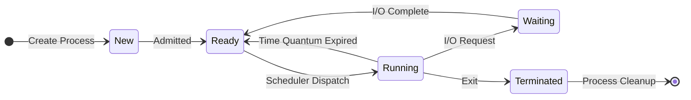

## Question 1(a) [3 marks]

**Explain Multiprogramming Operating System and give its advantages.**

**Answer**:

**Multiprogramming Operating System** allows multiple programs to reside in memory simultaneously and execute concurrently by sharing CPU time efficiently.

**Table: Multiprogramming System Features**

| Feature | Description |
|---------|-------------|
| **Memory Management** | Multiple programs loaded in memory |
| **CPU Scheduling** | CPU switches between programs |
| **Resource Sharing** | Efficient utilization of system resources |

- **Increased CPU utilization**: CPU remains busy switching between programs
- **Better throughput**: More programs completed per unit time
- **Reduced response time**: Programs execute faster due to parallel processing

**Mnemonic:** "MCP" - Memory sharing, CPU utilization, Parallel execution

## Question 1(b) [4 marks]

**Explain Characteristics of Linux operating system.**

**Answer**:

**Table: Linux Operating System Characteristics**

| Characteristic | Description |
|----------------|-------------|
| **Open Source** | Source code freely available and modifiable |
| **Multi-user** | Multiple users can access system simultaneously |
| **Multi-tasking** | Multiple processes run concurrently |
| **Portable** | Runs on various hardware platforms |
| **Security** | Strong permission system and access controls |
| **Stability** | Robust and reliable system performance |

- **Case sensitive**: Distinguishes between uppercase and lowercase
- **Command line interface**: Powerful shell for system operations
- **File system hierarchy**: Organized directory structure starting from root (/)

**Mnemonic:** "LAMPS" - Linux is Accessible, Multi-user, Portable, Secure

## Question 1(c) [7 marks]

**Explain FCFS scheduling algorithm with its advantages and disadvantages. Calculate Average waiting time and average turnaround time for FCFS algorithm with gantt chart for following data.**

**Answer**:

**First Come First Serve (FCFS)** is a non-preemptive scheduling algorithm where processes are executed in order of their arrival.

**Table: FCFS Algorithm Analysis**

| Aspect | Description |
|--------|-------------|
| **Policy** | First arrived process gets CPU first |
| **Type** | Non-preemptive |
| **Implementation** | Simple queue (FIFO) |

**Advantages:**

- **Simple implementation**: Easy to understand and code
- **Fair scheduling**: No starvation occurs

**Disadvantages:**

- **Convoy effect**: Short processes wait for long processes
- **Poor average waiting time**: Not optimal for system performance

**Gantt Chart Calculation:**

```goat
P0    |    P1  | P2 |   P3    |
0     5     8   10   17
```

**Table: Process Execution Analysis**

| Process | Arrival | Burst | Start | Finish | Waiting | Turnaround |
|---------|---------|-------|-------|--------|---------|------------|
| P0      | 0       | 5     | 0     | 5      | 0       | 5          |
| P1      | 3       | 3     | 5     | 8      | 2       | 5          |
| P2      | 5       | 2     | 8     | 10     | 3       | 5          |
| P3      | 6       | 7     | 10    | 17     | 4       | 11         |

**Average Waiting Time** = (0+2+3+4)/4 = **2.25 ms**
**Average Turnaround Time** = (5+5+5+11)/4 = **6.5 ms**

**Mnemonic:** "FCFS-SiNo" - First Come First Serve is Simple but Not optimal

---

## Question 1(c) OR [7 marks]

**Explain Round Robin algorithm with its advantages and disadvantages. Calculate Average waiting time and average turnaround time for Round Robin algorithm with gantt chart for following data. (Time Quantum = 2 ms)**

**Answer**:

**Round Robin** is a preemptive scheduling algorithm where each process gets equal CPU time slice (quantum).

**Table: Round Robin Features**

| Feature | Description |
|---------|-------------|
| **Time Quantum** | Fixed time slice for each process |
| **Preemption** | Process interrupted after quantum expires |
| **Queue Type** | Circular ready queue |

**Advantages:**

- **Fair allocation**: Each process gets equal CPU time
- **No starvation**: All processes eventually get CPU

**Disadvantages:**

- **Context switching overhead**: Frequent process switching
- **Performance depends on quantum**: Too small or large affects efficiency

**Gantt Chart (Quantum = 2ms):**

```goat
P0|P1|P2|P3|P0|P1|P2|P1|P0|P1|
0 2 4 6 7 9 11 12 13 14 16
```

**Table: Round Robin Execution**

| Process | Arrival | Burst | Completion | Waiting | Turnaround |
|---------|---------|-------|------------|---------|------------|
| P0      | 0       | 4     | 14         | 10      | 14         |
| P1      | 1       | 5     | 16         | 10      | 15         |
| P2      | 2       | 3     | 12         | 7       | 10         |
| P3      | 3       | 1     | 7          | 3       | 4          |

**Average Waiting Time** = (10+10+7+3)/4 = **7.5 ms**
**Average Turnaround Time** = (14+15+10+4)/4 = **10.75 ms**

**Mnemonic:** "RR-TEQ" - Round Robin uses Time Equal Quantum

---

## Question 2(a) [3 marks]

**Explain Real Time Operation System.**

**Answer**:

**Real Time Operating System (RTOS)** processes data and responds to events within strict time constraints.

**Table: RTOS Types**

| Type | Response Time | Example |
|------|---------------|---------|
| **Hard Real-time** | Guaranteed deadline | Missile guidance |
| **Soft Real-time** | Flexible deadline | Video streaming |

- **Deterministic behavior**: Predictable response times
- **Priority-based scheduling**: Critical tasks get higher priority
- **Minimal latency**: Fast interrupt handling and context switching

**Mnemonic:** "RTD" - Real Time is Deterministic

## Question 2(b) [4 marks]

**Explain Process Life Cycle with diagram.**

**Answer**:

**Process Life Cycle** shows different states a process goes through during execution.

**Diagram: Process State Transition**



**Table: Process States**

| State | Description |
|-------|-------------|
| **New** | Process being created |
| **Ready** | Waiting for CPU assignment |
| **Running** | Instructions being executed |
| **Waiting** | Waiting for I/O completion |
| **Terminated** | Process finished execution |

**Mnemonic:** "NRRWT" - New Ready Running Waiting Terminated

## Question 2(c) [7 marks]

**Explain Various file and directory related commands in Linux.**

**Answer**:

**Table: File Commands**

| Command | Function | Example |
|---------|----------|---------|
| **ls** | List directory contents | `ls -la` |
| **cat** | Display file content | `cat file.txt` |
| **cp** | Copy files | `cp source dest` |
| **mv** | Move/rename files | `mv old new` |
| **rm** | Remove files | `rm file.txt` |

**Table: Directory Commands**

| Command | Function | Example |
|---------|----------|---------|
| **mkdir** | Create directory | `mkdir mydir` |
| **rmdir** | Remove empty directory | `rmdir mydir` |
| **cd** | Change directory | `cd /home` |
| **pwd** | Print working directory | `pwd` |

- **File permissions**: Use `chmod` to modify access rights
- **File ownership**: Use `chown` to change file owner
- **File information**: Use `stat` for detailed file information

**Mnemonic:** "LCCMR-MRCP" - List, Cat, Copy, Move, Remove for files; Make, Remove, Change, Print for directories

---

## Question 2(a) OR [3 marks]

**Describe operating system services in detail.**

**Answer**:

**Operating System Services** provide interface between user applications and hardware resources.

**Table: OS Services Categories**

| Category | Services |
|----------|----------|
| **User Interface** | GUI, Command Line, Batch |
| **Program Execution** | Loading, Running, Terminating |
| **I/O Operations** | File operations, Device communication |
| **File System** | Creation, Deletion, Manipulation |
| **Communication** | Process communication, Network |
| **Error Detection** | Hardware/Software error handling |

- **Resource allocation**: CPU, memory, and device management
- **Accounting**: Track resource usage and performance
- **Protection and security**: Access control and authentication

**Mnemonic:** "UPIFCE" - User interface, Program execution, I/O, File system, Communication, Error detection

## Question 2(b) OR [4 marks]

**Explain Process Control Block.**

**Answer**:

**Process Control Block (PCB)** is a data structure containing all information about a process.

**Table: PCB Components**

| Component | Information Stored |
|-----------|-------------------|
| **Process ID** | Unique process identifier |
| **Process State** | Current state (ready, running, waiting) |
| **CPU Registers** | Program counter, stack pointer, registers |
| **Memory Management** | Base/limit registers, page tables |
| **I/O Status** | Open files, allocated devices |
| **Accounting** | CPU usage, time limits |

**Diagram: PCB Structure**

```goat
+------------------+
| Process ID       |
+------------------+
| Process State    |
+------------------+
| Program Counter  |
+------------------+
| CPU Registers    |
+------------------+
| Memory Limits    |
+------------------+
| Open File List   |
+------------------+
| Accounting Info  |
+------------------+
```

**Mnemonic:** "PPCMIA" - Process ID, Process state, Program Counter, CPU registers, Memory, I/O, Accounting

## Question 2(c) OR [7 marks]

**Explain installation steps of Linux.**

**Answer**:

**Linux Installation** involves preparing system and installing operating system from bootable media.

**Table: Installation Steps**

| Step | Description |
|------|-------------|
| **1. Download ISO** | Get Linux distribution image file |
| **2. Create Bootable Media** | Use USB/DVD to create installation media |
| **3. Boot from Media** | Change BIOS/UEFI boot order |
| **4. Select Language** | Choose installation language |
| **5. Partition Disk** | Create root, swap, home partitions |
| **6. Configure Network** | Set IP, DNS, hostname |
| **7. Create User Account** | Set username, password |
| **8. Install Bootloader** | Configure GRUB for booting |
| **9. Complete Installation** | Remove media and reboot |

**Partitioning Scheme:**

- **Root (/)**: 20GB minimum for system files
- **Swap**: 2x RAM size for virtual memory
- **Home (/home)**: Remaining space for user data

**Post-installation:**

- **Update system**: `sudo apt update && sudo apt upgrade`
- **Install drivers**: Graphics, network, audio drivers
- **Configure security**: Firewall, user permissions

**Mnemonic:** "DCBSLNCIU" - Download, Create media, Boot, Select language, Layout disk, Network, Create user, Install bootloader, Update system

---

## Question 3(a) [3 marks]

**Define: Process, Program, Swapping**

**Answer**:

**Table: Basic Definitions**

| Term | Definition |
|------|------------|
| **Process** | Program in execution with allocated resources |
| **Program** | Set of instructions stored on disk |
| **Swapping** | Moving processes between memory and disk |

- **Process**: Active entity with process ID, memory space, and execution state
- **Program**: Passive entity, executable file stored in secondary storage
- **Swapping**: Memory management technique to handle more processes than physical memory

**Mnemonic:** "PAP-MDS" - Process is Active Program; Program is instructions; Swapping is Memory-Disk transfer

## Question 3(b) [4 marks]

**List out various file operations and describe each of them.**

**Answer**:

**Table: File Operations**

| Operation | Description | System Call |
|-----------|-------------|-------------|
| **Create** | Make new file with specified name | `creat()` |
| **Open** | Prepare file for reading/writing | `open()` |
| **Read** | Retrieve data from file | `read()` |
| **Write** | Store data to file | `write()` |
| **Close** | Finish file access, release resources | `close()` |
| **Delete** | Remove file from file system | `unlink()` |
| **Seek** | Move file pointer to specific position | `lseek()` |

- **File attributes**: Access permissions, timestamps, size information
- **File locking**: Prevent concurrent access conflicts
- **Buffer management**: Optimize I/O performance through caching

**Mnemonic:** "CORWCDS" - Create, Open, Read, Write, Close, Delete, Seek

## Question 3(c) [7 marks]

**Write a shell script to generate and print Fibonacci series.**

**Answer**:

**Fibonacci Series** generates numbers where each number is sum of two preceding numbers.

**Shell Script:**

```bash
#!/bin/bash
# Fibonacci series generator

echo "Enter number of terms:"
read n

a=0
b=1

echo "Fibonacci Series:"
echo -n "$a $b "

for((i=2; i<n; i++))
do
    c=$((a + b))
    echo -n "$c "
    a=$b
    b=$c
done
echo
```

**Table: Script Components**

| Component | Purpose |
|-----------|---------|
| **#!/bin/bash** | Shebang line specifying interpreter |
| **read n** | Accept user input for number of terms |
| **for loop** | Iterate to generate sequence |
| **Arithmetic** | Calculate next number in series |

**Output Example:**

```
Enter number of terms: 8
Fibonacci Series: 0 1 1 2 3 5 8 13
```

**Mnemonic:** "FLAB" - Fibonacci uses Loop with Addition of Both previous numbers

---

## Question 3(a) OR [3 marks]

**List out types of scheduler and explain any one of them.**

**Answer**:

**Table: Types of Schedulers**

| Scheduler Type | Function |
|----------------|----------|
| **Long-term** | Selects processes from job pool to ready queue |
| **Short-term** | Selects process from ready queue for CPU |
| **Medium-term** | Handles swapping between memory and disk |

**Short-term Scheduler (CPU Scheduler):**

- **Frequency**: Executes very frequently (milliseconds)
- **Function**: Decides which process gets CPU next
- **Algorithms**: FCFS, SJF, Round Robin, Priority
- **Goal**: Maximize CPU utilization and throughput

**Mnemonic:** "LSM-JRC" - Long-term (Job), Short-term (Ready), Medium-term (swap Control)

## Question 3(b) OR [4 marks]

**List out various file attributes and describe each of them.**

**Answer**:

**Table: File Attributes**

| Attribute | Description |
|-----------|-------------|
| **Name** | Human-readable file identifier |
| **Type** | File format (text, binary, executable) |
| **Size** | Current file size in bytes |
| **Location** | Physical address on storage device |
| **Protection** | Access permissions (read, write, execute) |
| **Time stamps** | Creation, modification, access times |
| **Owner** | User who created the file |

**Permission Structure:**

- **User (u)**: Owner permissions
- **Group (g)**: Group member permissions  
- **Other (o)**: All other users permissions

**Example:** `-rwxr-xr--`

- File type: regular file (-)
- Owner: read, write, execute (rwx)
- Group: read, execute (r-x)
- Others: read only (r--)

**Mnemonic:** "NTSLPTO" - Name, Type, Size, Location, Protection, Time, Owner

## Question 3(c) OR [7 marks]

**Write a shell script to sum of 1 to 10 using while loop.**

**Answer**:

**While Loop** continues execution as long as specified condition remains true.

**Shell Script:**

```bash
#!/bin/bash
# Sum of numbers 1 to 10 using while loop

echo "Calculating sum of 1 to 10:"

i=1
sum=0

while [ $i -le 10 ]
do
    sum=$((sum + i))
    echo "Adding $i, current sum: $sum"
    i=$((i + 1))
done

echo "Final sum of 1 to 10 is: $sum"
```

**Table: Script Logic**

| Component | Purpose |
|-----------|---------|
| **i=1** | Initialize counter variable |
| **sum=0** | Initialize accumulator |
| **while [ $i -le 10 ]** | Continue while i ≤ 10 |
| **sum=$((sum + i))** | Add current number to sum |
| **i=$((i + 1))** | Increment counter |

**Output:**

```
Calculating sum of 1 to 10:
Adding 1, current sum: 1
Adding 2, current sum: 3
...
Final sum of 1 to 10 is: 55
```

**Mnemonic:** "WICS" - While loop needs Initialize, Condition, Sum calculation

---

## Question 4(a) [3 marks]

**List out and explain condition for Deadlock to occur.**

**Answer**:

**Deadlock** occurs when processes wait indefinitely for resources held by each other.

**Table: Deadlock Conditions (Coffman Conditions)**

| Condition | Description |
|-----------|-------------|
| **Mutual Exclusion** | Only one process can use resource at a time |
| **Hold and Wait** | Process holds resources while waiting for others |
| **No Preemption** | Resources cannot be forcibly taken away |
| **Circular Wait** | Circular chain of processes waiting for resources |

**All four conditions must be true simultaneously for deadlock to occur.**

**Example Scenario:**

- Process P1 holds Resource A, needs Resource B
- Process P2 holds Resource B, needs Resource A
- Both processes wait indefinitely

**Mnemonic:** "MHNC" - Mutual exclusion, Hold and wait, No preemption, Circular wait

## Question 4(b) [4 marks]

**List out File access methods. Explain any one.**

**Answer**:

**Table: File Access Methods**

| Method | Description |
|--------|-------------|
| **Sequential Access** | Read file from beginning to end |
| **Direct Access** | Jump to any record directly |
| **Index Sequential** | Combination of sequential and indexed access |

**Sequential Access Method:**

- **Process**: Read records one by one in order
- **Advantages**: Simple implementation, efficient for batch processing
- **Disadvantages**: Slow for specific record access
- **Use cases**: Log files, data backup, streaming

**Operations:**

```
read_next() - Read next record
write_next() - Write next record  
reset() - Return to beginning
```

**Mnemonic:** "SDI" - Sequential (start to end), Direct (jump anywhere), Index (combined approach)

## Question 4(c) [7 marks]

**Describe Security measures in operating system.**

**Answer**:

**Operating System Security** protects system resources from unauthorized access and threats.

**Table: Security Mechanisms**

| Mechanism | Description |
|-----------|-------------|
| **Authentication** | Verify user identity (passwords, biometrics) |
| **Authorization** | Control resource access permissions |
| **Access Control Lists** | Define who can access specific resources |
| **Encryption** | Protect data confidentiality |
| **Audit Logs** | Track system activities and access |
| **Firewalls** | Control network traffic |

**Security Levels:**

- **Physical security**: Protect hardware and facilities
- **User authentication**: Login credentials and biometrics
- **File permissions**: Read, write, execute controls
- **Network security**: Secure communication protocols

**Threats Protection:**

- **Malware**: Antivirus software and sandboxing
- **Unauthorized access**: Strong passwords and multi-factor authentication
- **Data breaches**: Encryption and backup strategies

**Mnemonic:** "AAAEAF" - Authentication, Authorization, Access control, Encryption, Audit, Firewall

---

## Question 4(a) OR [3 marks]

**List out ways to deal with deadlock. Explain deadlock detection and recovery.**

**Answer**:

**Table: Deadlock Handling Methods**

| Method | Approach |
|--------|----------|
| **Prevention** | Ensure at least one Coffman condition cannot hold |
| **Avoidance** | Dynamically examine resource allocation state |
| **Detection & Recovery** | Allow deadlock, then detect and recover |
| **Ignore** | Assume deadlock never occurs (Ostrich algorithm) |

**Deadlock Detection:**

- **Wait-for graph**: Maintain graph of process dependencies
- **Detection algorithm**: Periodically check for cycles in graph
- **Resource allocation graph**: Track resource ownership and requests

**Deadlock Recovery:**

- **Process termination**: Kill one or more deadlocked processes
- **Resource preemption**: Take resources from processes
- **Rollback**: Return processes to safe state using checkpoints

**Mnemonic:** "PADI" - Prevention, Avoidance, Detection, Ignore

## Question 4(b) OR [4 marks]

**List out File allocation methods. Explain any one.**

**Answer**:

**Table: File Allocation Methods**

| Method | Description |
|--------|-------------|
| **Contiguous** | Allocate consecutive disk blocks |
| **Linked** | Use pointers to link scattered blocks |
| **Indexed** | Use index block to store block addresses |

**Contiguous Allocation:**

- **Structure**: File occupies consecutive blocks on disk
- **Advantages**: Fast access, simple implementation, good for sequential access
- **Disadvantages**: External fragmentation, difficult to grow files
- **Directory entry**: Contains starting address and length

**Example:**
File "test.txt" starts at block 100, length 5 blocks
Occupies blocks: 100, 101, 102, 103, 104

**Mnemonic:** "CLI" - Contiguous (consecutive), Linked (pointers), Indexed (table)

## Question 4(c) OR [7 marks]

**Describe program threats and system threats.**

**Answer**:

**Program Threats** are malicious software that can harm system or data.

**Table: Program Threats**

| Threat Type | Description |
|-------------|-------------|
| **Virus** | Self-replicating code that infects other programs |
| **Worm** | Standalone malware that spreads across networks |
| **Trojan Horse** | Malicious code disguised as legitimate software |
| **Logic Bomb** | Code that triggers malicious action on specific event |
| **Backdoor** | Hidden access point bypassing normal authentication |

**System Threats** target operating system and system resources.

**Table: System Threats**

| Threat Type | Description |
|-------------|-------------|
| **Buffer Overflow** | Overflow input buffers to execute malicious code |
| **Denial of Service** | Overwhelm system resources to make service unavailable |
| **Privilege Escalation** | Gain higher access privileges than authorized |
| **Man-in-the-Middle** | Intercept communication between two parties |

**Protection Strategies:**

- **Antivirus software**: Detect and remove malicious programs
- **Regular updates**: Patch security vulnerabilities
- **Access controls**: Limit user privileges and resource access
- **Network monitoring**: Detect suspicious activities

**Mnemonic:** "VWTLB-BPDM" - Virus, Worm, Trojan, Logic bomb, Backdoor; Buffer overflow, Privilege escalation, DoS, Man-in-middle

---

## Question 5(a) [3 marks]

**Explain Inter Process Communication.**

**Answer**:

**Inter Process Communication (IPC)** enables processes to exchange data and synchronize activities.

**Table: IPC Mechanisms**

| Mechanism | Description |
|-----------|-------------|
| **Pipes** | Unidirectional communication channel |
| **Message Queues** | Structured message passing |
| **Shared Memory** | Common memory area for multiple processes |
| **Semaphores** | Synchronization using counters |
| **Signals** | Software interrupts for notification |

- **Synchronous communication**: Sender waits for receiver acknowledgment
- **Asynchronous communication**: Sender continues without waiting
- **Buffering**: Messages stored temporarily if receiver not ready

**Mnemonic:** "PMSSS" - Pipes, Message queues, Shared memory, Semaphores, Signals

## Question 5(b) [4 marks]

**Explain File structure used by Linux.**

**Answer**:

**Linux File System** follows hierarchical directory structure starting from root directory.

**Diagram: Linux File System Hierarchy**

```goat
         /
        /|\
       / | \
    bin  etc  home
    |    |    |
   ls   passwd user1
   cat  hosts   |
   cp          Documents
              Pictures
```

**Table: Important Directories**

| Directory | Purpose |
|-----------|---------|
| **/** | Root directory, top of hierarchy |
| **/bin** | Essential user commands |
| **/etc** | System configuration files |
| **/home** | User home directories |
| **/var** | Variable data (logs, mail) |
| **/usr** | User programs and utilities |
| **/tmp** | Temporary files |

- **Case sensitive**: Distinguishes between File.txt and file.txt
- **No drive letters**: Everything under single root directory
- **Mount points**: External devices appear as subdirectories

**Mnemonic:** "BEHVUT" - Bin, Etc, Home, Var, Usr, Tmp

## Question 5(c) [7 marks]

**Explain operating system security policies and procedures.**

**Answer**:

**Security Policies** define rules and guidelines for protecting system resources and data.

**Table: Security Policy Components**

| Component | Description |
|-----------|-------------|
| **Access Control Policy** | Who can access what resources |
| **Password Policy** | Requirements for strong passwords |
| **Audit Policy** | What activities to monitor and log |
| **Backup Policy** | Data backup and recovery procedures |
| **Incident Response** | Steps to handle security breaches |

**Security Procedures:**

**Authentication Procedures:**

- **Multi-factor authentication**: Password + token/biometric
- **Password complexity**: Minimum length, special characters
- **Account lockout**: Temporary disable after failed attempts

**Authorization Procedures:**

- **Principle of least privilege**: Minimum necessary access
- **Role-based access**: Assign permissions based on job function
- **Regular review**: Periodic audit of user permissions

**Monitoring Procedures:**

- **Log analysis**: Review system and security logs
- **Intrusion detection**: Monitor for unauthorized access
- **Vulnerability scanning**: Identify security weaknesses

**Mnemonic:** "APABI" - Access control, Password, Audit, Backup, Incident response

---

## Question 5(a) OR [3 marks]

**Explain Critical section.**

**Answer**:

**Critical Section** is code segment where process accesses shared resources that must not be accessed concurrently.

**Table: Critical Section Properties**

| Property | Description |
|----------|-------------|
| **Mutual Exclusion** | Only one process in critical section at a time |
| **Progress** | Selection of next process cannot be postponed indefinitely |
| **Bounded Waiting** | Limit on number of times other processes enter critical section |

**Critical Section Structure:**

```
do {
    entry_section();     // Request permission
    critical_section();  // Access shared resource
    exit_section();      // Release permission
    remainder_section(); // Other work
} while(true);
```

**Solutions:**

- **Peterson's algorithm**: Software solution for two processes
- **Semaphores**: Hardware-supported synchronization
- **Mutex locks**: Binary semaphore for mutual exclusion

**Mnemonic:** "MPB" - Mutual exclusion, Progress, Bounded waiting

## Question 5(b) OR [4 marks]

**Explain types of Linux file system.**

**Answer**:

**Linux File Systems** organize and manage data storage on disk devices.

**Table: Linux File System Types**

| File System | Description |
|-------------|-------------|
| **ext4** | Fourth extended file system, most common |
| **XFS** | High-performance journaling file system |
| **Btrfs** | B-tree file system with advanced features |
| **ZFS** | Zettabyte file system with built-in RAID |
| **NTFS** | Windows file system support |
| **FAT32** | Simple file system for compatibility |

**ext4 Features:**

- **Journaling**: Faster recovery after system crash
- **Large file support**: Files up to 16TB
- **Backwards compatibility**: Can mount ext2/ext3 partitions
- **Extents**: Improve performance for large files

**File System Selection Factors:**

- **Performance requirements**: Speed vs reliability
- **File size limits**: Maximum file and partition sizes
- **Compatibility needs**: Cross-platform support

**Mnemonic:** "EXBZNF" - Ext4, XFS, Btrfs, ZFS, NTFS, FAT32

## Question 5(c) OR [7 marks]

**Explain need of protection mechanism and various protection domain.**

**Answer**:

**Protection Mechanism** prevents processes from interfering with each other and system resources.

**Need for Protection:**

- **Resource sharing**: Multiple users/processes access same resources
- **Error containment**: Prevent bugs from affecting entire system
- **Security enforcement**: Implement access control policies
- **System stability**: Protect critical system components

**Table: Protection Domains**

| Domain Type | Description |
|-------------|-------------|
| **User Domain** | Limited access rights for user processes |
| **Kernel Domain** | Full access to system resources |
| **System Domain** | Intermediate privileges for system services |

**Protection Mechanisms:**

**Hardware Protection:**

- **Memory protection**: Base and limit registers
- **CPU protection**: Timer interrupts prevent infinite loops
- **I/O protection**: Privileged instructions for device access

**Software Protection:**

- **Access control lists**: Define resource permissions
- **Capability lists**: Token-based access control
- **Domain switching**: Change protection levels safely

**Table: Access Rights**

| Right | Description |
|-------|-------------|
| **Read** | View content of resource |
| **Write** | Modify resource content |
| **Execute** | Run program or enter directory |
| **Append** | Add data without modifying existing |
| **Delete** | Remove resource from system |

**Mnemonic:** "RECES-UKS" - Resource sharing, Error containment, Security; User domain, Kernel domain, System domain
