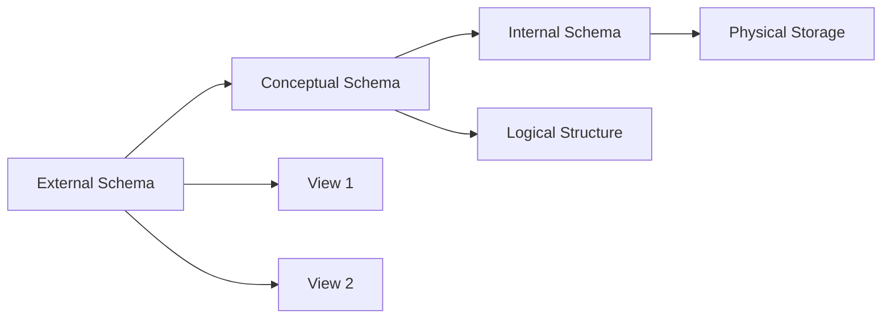
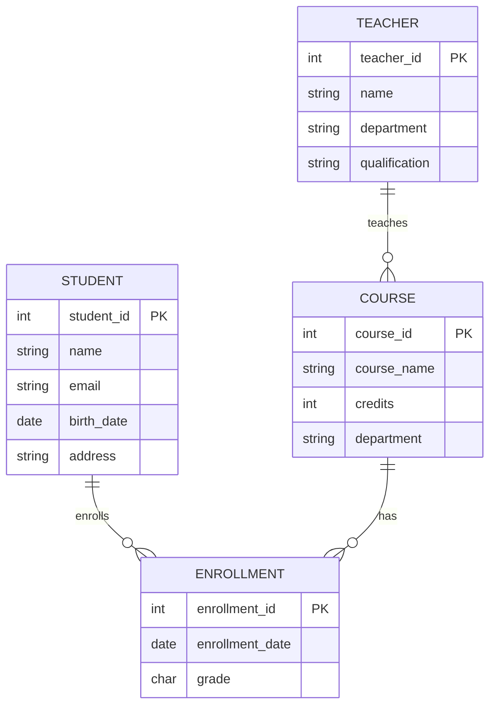
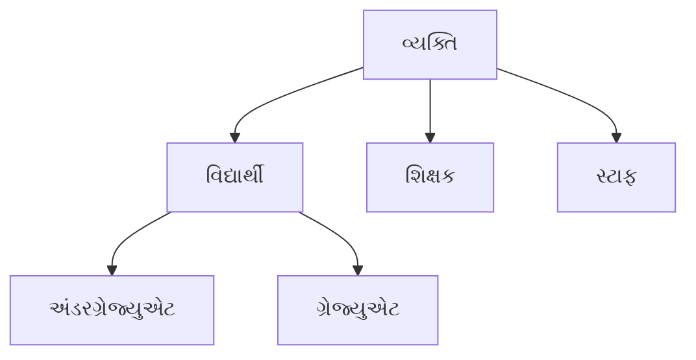

## પ્રશ્ન 1(અ) [3 ગુણ]

**નીચેના શબ્દોને વ્યાખ્યાયિત કરો: 1. ડેટા 2. ઇન્ફોર્મેશન 3. મેટાડેટા**

**જવાબ**:

**ટેબલ: ડેટા વિ ઇન્ફોર્મેશન વિ મેટાડેટા**

| શબ્દ | વ્યાખ્યા | ઉદાહરણ |
|------|------------|---------|
| **ડેટા** | કોઈ સંદર્ભ વગરના કાચા તથ્યો અને આંકડાઓ | "25", "જોન", "મુંબઈ" |
| **ઇન્ફોર્મેશન** | અર્થ અને સંદર્ભ સાથે પ્રોસેસ કરેલા ડેટા | "જોન 25 વર્ષનો છે અને મુંબઈમાં રહે છે" |
| **મેટાડેટા** | ડેટા વિશેનો ડેટા જે સ્ટ્રક્ચર અને પ્રોપર્ટીઝ વર્ણવે છે | "ઉંમર ફીલ્ડ: Integer, મહત્તમ લંબાઈ: 3" |

- **ડેટા**: ઇન્ફોર્મેશન સિસ્ટમ્સના મૂળભૂત બિલ્ડિંગ બ્લોક્સ
- **ઇન્ફોર્મેશન**: નિર્ણય લેવા માટે ડેટા પ્રોસેસિંગનું પરિણામ
- **મેટાડેટા**: ડેટાબેસ ડિઝાઇન અને મેનેજમેન્ટ માટે જરૂરી

**મેમરી ટ્રીક:** "DIM - ડેટા મેટાડેટાનો ઉપયોગ કરીને ઇન્ફોર્મેશન આપે છે"

---

## પ્રશ્ન 1(બ) [4 ગુણ]

**ફાઇલ સિસ્ટમ વિ ડેટાબેસ સિસ્ટમની તુલના કરો**

**જવાબ**:

**ટેબલ: ફાઇલ સિસ્ટમ વિ ડેટાબેસ સિસ્ટમ તુલના**

| પાસું | ફાઇલ સિસ્ટમ | ડેટાબેસ સિસ્ટમ |
|--------|-------------|-----------------|
| **ડેટા સ્ટોરેજ** | દરેક એપ્લિકેશન માટે અલગ ફાઇલો | કેન્દ્રીકૃત સ્ટોરેજ |
| **ડેટા રિડન્ડન્સી** | ઉચ્ચ રિડન્ડન્સી | લઘુત્તમ રિડન્ડન્સી |
| **ડેટા સુસંગતતા** | નબળી સુસંગતતા | ઉચ્ચ સુસંગતતા |
| **ડેટા સિક્યોરિટી** | મર્યાદિત સિક્યોરિટી | એડવાન્સ સિક્યોરિટી ફીચર્સ |
| **એકસાથે એક્સેસ** | મર્યાદિત સપોર્ટ | સંપૂર્ણ એકસાથે સપોર્ટ |
| **ડેટા ઇન્ડિપેન્ડન્સ** | કોઈ ઇન્ડિપેન્ડન્સ નથી | ફિઝિકલ અને લોજિકલ ઇન્ડિપેન્ડન્સ |

- **ફાઇલ સિસ્ટમ**: સરળ પણ ડેટા ડુપ્લિકેશનની સમસ્યાઓ સાથે
- **ડેટાબેસ સિસ્ટમ**: જટિલ પણ કાર્યક્ષમ ડેટા મેનેજમેન્ટ
- **મુખ્ય ફાયદો**: DBMS ડેટા રિડન્ડન્સી અને અસુસંગતતા દૂર કરે છે

**મેમરી ટ્રીક:** "DBMS = ડેટા બેટર મેનેજ્ડ સિસ્ટમેટિકલી"

---

## પ્રશ્ન 1(ક) [7 ગુણ]

**નેટવર્ક ડેટા મોડેલ દોરો અને સમજાવો**

**જવાબ**:

**ડાયાગ્રામ:**

```goat
    Owner 1
       |
    Set Type 1
    /    |    \
Member1 Member2 Member3
   |       |       |
Set Type 2 Set Type 3 Set Type 4
   |       |       |
Member4 Member5 Member6
```

**ટેબલ: નેટવર્ક મોડેલના ઘટકો**

| ઘટક | વર્ણન | ઉદાહરણ |
|-----------|-------------|---------|
| **રેકોર્ડ ટાઇપ** | એન્ટિટીનું પ્રતિનિધિત્વ | કર્મચારી, વિભાગ |
| **સેટ ટાઇપ** | રેકોર્ડ્સ વચ્ચેનો સંબંધ | કામ-કરે, મેનેજ-કરે |
| **ઓનર** | સંબંધમાં પેરેન્ટ રેકોર્ડ | વિભાગ (ઓનર) |
| **મેમ્બર** | સંબંધમાં ચાઇલ્ડ રેકોર્ડ | કર્મચારી (મેમ્બર) |

- **ઓનર રેકોર્ડ**: સેટને નિયંત્રિત કરે છે અને અનેક મેમ્બર્સ હોઈ શકે છે
- **મેમ્બર રેકોર્ડ**: એક અથવા વધુ સેટ્સનું સભ્ય છે
- **સેટ ઓકરન્સ**: સેટ ટાઇપનું ઇન્સ્ટન્સ જે ઓનરને મેમ્બર્સ સાથે જોડે છે
- **નેવિગેશન**: રેકોર્ડ એક્સેસ માટે પોઇન્ટર્સનો ઉપયોગ

**મેમરી ટ્રીક:** "નેટવર્ક = અનેક કનેક્શન્સ સાથેના નોડ્સ"

---

## પ્રશ્ન 1(ક) અથવા [7 ગુણ]

**સ્કીમા શું છે? ઉદાહરણ સાથે સ્કીમાના વિવિધ પ્રકારો સમજાવો**

**જવાબ**:

**વ્યાખ્યા**: સ્કીમા એ ડેટાબેસનું લોજિકલ સ્ટ્રક્ચર અથવા બ્લુપ્રિન્ટ છે જે વ્યાખ્યાયિત કરે છે કે ડેટા કેવી રીતે ગોઠવાયેલો છે.

**ડાયાગ્રામ:**



**ટેબલ: સ્કીમાના પ્રકારો**

| સ્કીમા પ્રકાર | લેવલ | વર્ણન | ઉદાહરણ |
|-------------|-------|-------------|---------|
| **એક્સટર્નલ સ્કીમા** | વ્યૂ લેવલ | ડેટાબેસનો યુઝર-સ્પેસિફિક વ્યૂ | શિક્ષકો માટે વિદ્યાર્થીઓના ગ્રેડ્સનો વ્યૂ |
| **કોન્સેપ્ચુઅલ સ્કીમા** | લોજિકલ લેવલ | સંપૂર્ણ લોજિકલ સ્ટ્રક્ચર | બધા ટેબલ્સ, સંબંધો, કન્સ્ટ્રેન્ટ્સ |
| **ઇન્ટર્નલ સ્કીમા** | ફિઝિકલ લેવલ | ફિઝિકલ સ્ટોરેજ સ્ટ્રક્ચર | ઇન્ડેક્સ ફાઇલો, સ્ટોરેજ એલોકેશન |

- **એક્સટર્નલ સ્કીમા**: યુઝર્સ માટે ડેટા ઇન્ડિપેન્ડન્સ પ્રદાન કરે છે
- **કોન્સેપ્ચુઅલ સ્કીમા**: ડેટાબેસ ડિઝાઇનરનો સંપૂર્ણ વ્યૂ
- **ઇન્ટર્નલ સ્કીમા**: ડેટાબેસ એડમિનિસ્ટ્રેટરનો ફિઝિકલ વ્યૂ

**મેમરી ટ્રીક:** "ECI - એક્સટર્નલ કોન્સેપ્ચુઅલ ઇન્ટર્નલ"

---

## પ્રશ્ન 2(અ) [3 ગુણ]

**નીચેના શબ્દોને વ્યાખ્યાયિત કરો: 1. એન્ટિટી 2. એટ્રિબ્યુટ્સ 3. રિલેશનશિપ**

**જવાબ**:

**ટેબલ: ER મોડેલની મૂળભૂત કોન્સેપ્ટ્સ**

| શબ્દ | વ્યાખ્યા | ઉદાહરણ |
|------|------------|---------|
| **એન્ટિટી** | સ્વતંત્ર અસ્તિત્વ ધરાવતો વાસ્તવિક વિશ્વનો ઓબ્જેક્ટ | વિદ્યાર્થી, કોર્સ, શિક્ષક |
| **એટ્રિબ્યુટ્સ** | એન્ટિટીનું વર્ણન કરતા ગુણધર્મો | વિદ્યાર્થી: ID, નામ, ઉંમર |
| **રિલેશનશિપ** | બે અથવા વધુ એન્ટિટી વચ્ચેનો સંબંધ | વિદ્યાર્થી કોર્સમાં નોંધણી કરે છે |

- **એન્ટિટી**: ER ડાયાગ્રામમાં લંબચોરસ દ્વારા રજૂ થાય છે
- **એટ્રિબ્યુટ્સ**: એન્ટિટીઓ સાથે જોડાયેલા અંડાકાર દ્વારા રજૂ થાય છે
- **રિલેશનશિપ**: એન્ટિટીઓને જોડતા હીરા દ્વારા રજૂ થાય છે

**મેમરી ટ્રીક:** "EAR - એન્ટિટીના એટ્રિબ્યુટ્સ અને રિલેશનશિપ્સ છે"

---

## પ્રશ્ન 2(બ) [4 ગુણ]

**ઉદાહરણ સાથે વીક એન્ટિટી સેટ્સનું વર્ણન કરો**

**જવાબ**:

**વ્યાખ્યા**: વીક એન્ટિટી એ એવી એન્ટિટી છે જે પોતાના એટ્રિબ્યુટ્સ દ્વારા અનન્ય રીતે ઓળખાઈ શકતી નથી અને સ્ટ્રોંગ એન્ટિટી પર આધાર રાખે છે.

**ડાયાગ્રામ:**

```goat
+----------+       +===========+       +----------+
| Employee |-------| Dependent |-------| Person   |
|   (1)    |       |  (Weak)   |       |   (N)    |
+----------+       +===========+       +----------+
    emp_id              name              dep_name
                     (Partial Key)
```

**ટેબલ: વીક વિ સ્ટ્રોંગ એન્ટિટી**

| પાસું | સ્ટ્રોંગ એન્ટિટી | વીક એન્ટિટી |
|--------|---------------|-------------|
| **પ્રાઇમરી કી** | પોતાની પ્રાઇમરી કી છે | કોઈ પ્રાઇમરી કી નથી |
| **અસ્તિત્વ** | સ્વતંત્ર અસ્તિત્વ | સ્ટ્રોંગ એન્ટિટી પર આધાર |
| **પ્રતિનિધિત્વ** | એક લંબચોરસ | ડબલ લંબચોરસ |
| **ઉદાહરણ** | કર્મચારી | કર્મચારીનો આશ્રિત |

- **પાર્શિયલ કી**: એટ્રિબ્યુટ જે વીક એન્ટિટીને આંશિક રૂપે ઓળખે છે
- **આઇડેન્ટિફાઇંગ રિલેશનશિપ**: વીક એન્ટિટીને સ્ટ્રોંગ એન્ટિટી સાથે જોડે છે
- **ટોટલ પાર્ટિસિપેશન**: વીક એન્ટિટીએ સંબંધમાં સહભાગી થવું જ જોઈએ

**મેમરી ટ્રીક:** "વીક એન્ટિટીઓ આશ્રિત હોય છે"

---

## પ્રશ્ન 2(ક) [7 ગુણ]

**યુનિવર્સિટી મેનેજમેન્ટ સિસ્ટમ માટે ER ડાયાગ્રામ દોરો**

**જવાબ**:

**ડાયાગ્રામ:**



**ટેબલ: એન્ટિટી રિલેશનશિપ્સ**

| રિલેશનશિપ | કાર્ડિનાલિટી | વર્ણન |
|--------------|-------------|-------------|
| **વિદ્યાર્થી નોંધણી કરે કોર્સ** | M:N | અનેક વિદ્યાર્થીઓ અનેક કોર્સમાં નોંધણી કરી શકે |
| **શિક્ષક શીખવે કોર્સ** | 1:N | એક શિક્ષક અનેક કોર્સ શીખવે છે |
| **કોર્સ છે નોંધણી** | 1:N | એક કોર્સમાં અનેક નોંધણીઓ છે |

- **પ્રાથમિક એન્ટિટીઓ**: વિદ્યાર્થી, કોર્સ, શિક્ષક
- **એસોસિએટિવ એન્ટિટી**: નોંધણી (M:N સંબંધ ઉકેલે છે)
- **કી એટ્રિબ્યુટ્સ**: બધી એન્ટિટીઓમાં અનન્ય ઓળખકર્તા છે

**મેમરી ટ્રીક:** "યુનિવર્સિટી = વિદ્યાર્થીઓ શિક્ષકો પાસેથી કોર્સ લે છે"

---

## પ્રશ્ન 2(અ) અથવા [3 ગુણ]

**નીચેના શબ્દોને વ્યાખ્યાયિત કરો: 1. પ્રાઇમરી કી 2. ફોરેન કી 3. કેન્ડિડેટ કી**

**જવાબ**:

**ટેબલ: ડેટાબેસ કીઝ**

| કી પ્રકાર | વ્યાખ્યા | ઉદાહરણ |
|----------|------------|---------|
| **પ્રાઇમરી કી** | દરેક રેકોર્ડ માટે અનન્ય ઓળખકર્તા | વિદ્યાર્થી ટેબલમાં Student_ID |
| **ફોરેન કી** | બીજા ટેબલની પ્રાઇમરી કીનો સંદર્ભ | નોંધણી ટેબલમાં Student_ID |
| **કેન્ડિડેટ કી** | સંભવિત પ્રાઇમરી કી એટ્રિબ્યુટ | વિદ્યાર્થી ટેબલમાં Email, ફોન |

- **પ્રાઇમરી કી**: NULL હોઈ શકે નહીં અને અનન્ય હોવી જોઈએ
- **ફોરેન કી**: રેફરન્શિયલ ઇન્ટેગ્રિટી જાળવે છે
- **કેન્ડિડેટ કી**: વૈકલ્પિક અનન્ય ઓળખકર્તાઓ

**મેમરી ટ્રીક:** "PFC - પ્રાઇમરી ફોરેન કેન્ડિડેટ"

---

## પ્રશ્ન 2(બ) અથવા [4 ગુણ]

**જનરલાઇઝેશન અને સ્પેશિયલાઇઝેશન પર ટૂંકી નોંધ લખો**

**જવાબ**:

**જનરલાઇઝેશન**: અનેક એન્ટિટીઓમાંથી સામાન્ય એટ્રિબ્યુટ્સ કાઢીને સામાન્ય એન્ટિટી બનાવવાની પ્રક્રિયા.

**સ્પેશિયલાઇઝેશન**: વિશિષ્ટ લાક્ષણિકતાઓના આધારે એન્ટિટીના પેટા વર્ગો વ્યાખ્યાયિત કરવાની પ્રક્રિયા.

**ડાયાગ્રામ:**



**ટેબલ: જનરલાઇઝેશન વિ સ્પેશિયલાઇઝેશન**

| પાસું | જનરલાઇઝેશન | સ્પેશિયલાઇઝેશન |
|--------|----------------|----------------|
| **દિશા** | બોટમ-અપ અપ્રોચ | ટોપ-ડાઉન અપ્રોચ |
| **હેતુ** | રિડન્ડન્સી દૂર કરવી | વિશિષ્ટ એટ્રિબ્યુટ્સ ઉમેરવા |
| **પરિણામ** | સુપરક્લાસ બનાવટ | સબક્લાસ બનાવટ |

- **ISA રિલેશનશિપ**: સુપરક્લાસ અને સબક્લાસ વચ્ચે "Is-A" સંબંધ
- **ઇન્હેરિટન્સ**: સબક્લાસ સુપરક્લાસમાંથી એટ્રિબ્યુટ્સ વારસામાં લે છે

**મેમરી ટ્રીક:** "જનરલ ઉપર જાય, સ્પેશિયલ નીચે જાય"

---

## પ્રશ્ન 2(ક) અથવા [7 ગુણ]

**ઉદાહરણ સાથે વિવિધ રિલેશનલ એલ્જીબ્રા ઓપરેશન સમજાવો**

**જવાબ**:

**ટેબલ: રિલેશનલ એલ્જીબ્રા ઓપરેશન્સ**

| ઓપરેશન | સિમ્બોલ | વર્ણન | ઉદાહરણ |
|-----------|--------|-------------|---------|
| **સિલેક્ટ** | σ | શરત આધારે પંક્તિઓ પસંદ કરે | σ(age>20)(Student) |
| **પ્રોજેક્ટ** | π | વિશિષ્ટ કૉલમ્સ પસંદ કરે | π(name,age)(Student) |
| **યુનિયન** | ∪ | બે રિલેશન્સને જોડે | R ∪ S |
| **ઇન્ટરસેક્શન** | ∩ | રિલેશન્સમાંથી સામાન્ય ટ્યુપલ્સ | R ∩ S |
| **ડિફરન્સ** | - | R માં છે પણ S માં નથી તે ટ્યુપલ્સ | R - S |
| **જોઇન** | ⋈ | સંબંધિત ટ્યુપલ્સને જોડે | Student ⋈ Enrollment |

**ઉદાહરણ રિલેશન્સ:**

Student: (ID=1, Name=જોન, Age=20)
Course: (CID=101, CName=DBMS, Credits=3)

- **સિલેક્શન**: σ(Age>18)(Student) 18 વર્ષથી વધુ વયના વિદ્યાર્થીઓ રિટર્ન કરે
- **પ્રોજેક્શન**: π(Name)(Student) માત્ર નામો રિટર્ન કરે
- **જોઇન**: Student ⋈ Enrollment વિદ્યાર્થી અને નોંધણીનો ડેટા જોડે

**મેમરી ટ્રીક:** "SPUDIJ - સિલેક્ટ પ્રોજેક્ટ યુનિયન ડિફરન્સ ઇન્ટરસેક્શન જોઇન"

---

## પ્રશ્ન 3(અ) [3 ગુણ]

**SQL માં ન્યુમેરિક ફંક્શન્સની યાદી આપો. કોઈપણ બે સમજાવો**

**જવાબ**:

**ટેબલ: SQL ન્યુમેરિક ફંક્શન્સ**

| ફંક્શન | હેતુ | ઉદાહરણ |
|----------|---------|---------|
| **ABS()** | એબ્સોલ્યુટ વેલ્યુ | ABS(-15) = 15 |
| **CEIL()** | વેલ્યુ ≥ ની સૌથી નાની પૂર્ણાંક | CEIL(4.3) = 5 |
| **FLOOR()** | વેલ્યુ ≤ ની સૌથી મોટી પૂર્ણાંક | FLOOR(4.7) = 4 |
| **ROUND()** | નિર્દિષ્ટ સ્થાને રાઉન્ડ કરે | ROUND(15.76, 1) = 15.8 |
| **SQRT()** | વર્ગમૂળ | SQRT(16) = 4 |
| **POWER()** | પાવર પર વધારો | POWER(2, 3) = 8 |

**વિગતવાર ઉદાહરણો:**

- **ABS(number)**: એબ્સોલ્યુટ વેલ્યુ રિટર્ન કરે, નેગેટિવ સાઇન દૂર કરે
- **ROUND(number, decimal_places)**: નિર્દિષ્ટ દશાંશ સ્થાને નંબર રાઉન્ડ કરે

**મેમરી ટ્રીક:** "ગણિત ફંક્શન્સ નંબર્સને સરસ બનાવે"

---

## પ્રશ્ન 3(બ) [4 ગુણ]

**ઉદાહરણ સાથે Having અને Order by Clause નું વર્ણન કરો**

**જવાબ**:

**HAVING Clause**: GROUP BY સાથે એગ્રીગેટ કન્ડિશન્સ આધારે ગ્રુપ્સ ફિલ્ટર કરવા ઉપયોગ થાય.

**ORDER BY Clause**: પરિણામ સેટને ચડતા અથવા ઊતરતા ક્રમમાં સોર્ટ કરવા ઉપયોગ થાય.

**ટેબલ: HAVING વિ WHERE**

| પાસું | WHERE | HAVING |
|--------|-------|--------|
| **ઉપયોગ** | વ્યક્તિગત પંક્તિઓ ફિલ્ટર કરે | ગ્રુપ કરેલા પરિણામો ફિલ્ટર કરે |
| **એગ્રીગેટ્સ સાથે** | ઉપયોગ કરી શકાતો નથી | એગ્રીગેટ ફંક્શન્સ ઉપયોગ કરી શકે |
| **સ્થિતિ** | GROUP BY પહેલાં | GROUP BY પછી |

**ઉદાહરણ:**

```sql
SELECT department, COUNT(*) as emp_count
FROM employees 
WHERE salary > 30000
GROUP BY department 
HAVING COUNT(*) > 5
ORDER BY emp_count DESC;
```

- **WHERE**: 30000 થી વધુ પગાર ધરાવતા કર્મચારીઓ ફિલ્ટર કરે
- **HAVING**: માત્ર 5 થી વધુ કર્મચારીઓ ધરાવતા વિભાગો બતાવે
- **ORDER BY**: કર્મચારીઓની ગણતરી આધારે ઉતરતા ક્રમમાં સોર્ટ કરે

**મેમરી ટ્રીક:** "WHERE પંક્તિઓ ફિલ્ટર કરે, HAVING ગ્રુપ્સ ફિલ્ટર કરે, ORDER BY પરિણામો સોર્ટ કરે"

---

## પ્રશ્ન 3(ક) [7 ગુણ]

**Student_ID, Stu_Name, Stu_Subject_ID, Stu_Marks, Stu_Age ફીલ્ડ્સ ધરાવતા student ટેબલ પર નીચેની queries perform કરો**

**જવાબ**:

**1. student ટેબલ બનાવવા માટે ક્વેરી:**

```sql
CREATE TABLE student (
    Student_ID INT PRIMARY KEY,
    Stu_Name VARCHAR(50),
    Stu_Subject_ID INT,
    Stu_Marks INT,
    Stu_Age INT
);
```

**2. student ટેબલમાં રેકોર્ડ દાખલ કરવા માટે ક્વેરી:**

```sql
INSERT INTO student VALUES 
(1, 'જોન', 101, 85, 22),
(2, 'મેરી', 102, 90, 21);
```

**3. લઘુત્તમ અને મહત્તમ ગુણ શોધો:**

```sql
SELECT MIN(Stu_Marks) as Min_Marks, 
       MAX(Stu_Marks) as Max_Marks 
FROM student;
```

**4. 82 થી વધુ ગુણ અને 22 વર્ષ વયના વિદ્યાર્થીઓ:**

```sql
SELECT * FROM student 
WHERE Stu_Marks > 82 AND Stu_Age = 22;
```

**5. નામ 'm' અક્ષરથી શરૂ થતા વિદ્યાર્થીઓ:**

```sql
SELECT * FROM student 
WHERE Stu_Name LIKE 'm%';
```

**6. સરેરાશ ગુણ શોધો:**

```sql
SELECT AVG(Stu_Marks) as Average_Marks 
FROM student;
```

**7. Stu_address કૉલમ ઉમેરો:**

```sql
ALTER TABLE student 
ADD Stu_address VARCHAR(100);
```

**મેમરી ટ્રીક:** "CRUD + એનાલિટિક્સ = સંપૂર્ણ ડેટાબેસ ઓપરેશન્સ"

---

## પ્રશ્ન 3(અ) અથવા [3 ગુણ]

**ઉદાહરણ સાથે SQL માં વિવિધ ડેટ ફંક્શન વર્ણવો**

**જવાબ**:

**ટેબલ: SQL ડેટ ફંક્શન્સ**

| ફંક્શન | હેતુ | ઉદાહરણ |
|----------|---------|---------|
| **SYSDATE** | વર્તમાન સિસ્ટમ ડેટ | SYSDATE '2024-06-12' રિટર્ન કરે |
| **ADD_MONTHS()** | ડેટમાં મહિનાઓ ઉમેરે | ADD_MONTHS('2024-01-15', 3) |
| **MONTHS_BETWEEN()** | ડેટ્સ વચ્ચેના મહિનાઓ | MONTHS_BETWEEN('2024-06-12', '2024-01-12') |
| **LAST_DAY()** | મહિનાનો છેલ્લો દિવસ | LAST_DAY('2024-02-15') = '2024-02-29' |
| **NEXT_DAY()** | દિવસની આગલી ઘટના | NEXT_DAY('2024-06-12', 'FRIDAY') |

**ઉદાહરણો:**

- **SYSDATE**: વર્તમાન સિસ્ટમ ડેટ અને ટાઇમ રિટર્ન કરે
- **ADD_MONTHS**: લોન ડ્યુ ડેટ્સ જેવી ભવિષ્યની તારીખો ગણવા માટે ઉપયોગી

**મેમરી ટ્રીક:** "ડેટ ફંક્શન્સ ટાઇમ મેનેજમેન્ટમાં મદદ કરે"

---

## પ્રશ્ન 3(બ) અથવા [4 ગુણ]

**SQL માં કન્સ્ટ્રેન્ટ્સની સૂચિ બનાવો. ઉદાહરણ સાથે કોઈપણ બે સમજાવો**

**જવાબ**:

**ટેબલ: SQL કન્સ્ટ્રેન્ટ્સ**

| કન્સ્ટ્રેન્ટ | હેતુ | ઉદાહરણ |
|------------|---------|---------|
| **PRIMARY KEY** | અનન્ય ઓળખકર્તા | Student_ID INT PRIMARY KEY |
| **FOREIGN KEY** | બીજા ટેબલનો સંદર્ભ | REFERENCES Student(Student_ID) |
| **NOT NULL** | null વેલ્યુઝ અટકાવે | Name VARCHAR(50) NOT NULL |
| **UNIQUE** | અનન્યતા સુનિશ્ચિત કરે | Email VARCHAR(100) UNIQUE |
| **CHECK** | ડેટા વેલિડેટ કરે | Age INT CHECK (Age >= 18) |
| **DEFAULT** | ડિફોલ્ટ વેલ્યુ | Status VARCHAR(10) DEFAULT 'Active' |

**વિગતવાર ઉદાહરણો:**

**PRIMARY KEY કન્સ્ટ્રેન્ટ:**

```sql
CREATE TABLE Student (
    Student_ID INT PRIMARY KEY,
    Name VARCHAR(50)
);
```

**CHECK કન્સ્ટ્રેન્ટ:**

```sql
CREATE TABLE Employee (
    Emp_ID INT,
    Salary INT CHECK (Salary > 0)
);
```

- **PRIMARY KEY**: દરેક રેકોર્ડ અનન્ય ઓળખકર્તા છે તેની ખાતરી કરે
- **CHECK**: ડેટા એન્ટ્રી દરમિયાન બિઝનેસ નિયમો વેલિડેટ કરે

**મેમરી ટ્રીક:** "કન્સ્ટ્રેન્ટ્સ ડેટા ક્વોલિટી કંટ્રોલ કરે"

---

## પ્રશ્ન 3(ક) અથવા [7 ગુણ]

**ઉદાહરણ સાથે SQL માં વિવિધ પ્રકારના joins સમજાવો**

**જવાબ**:

**ટેબલ: SQL Joins ના પ્રકારો**

| Join પ્રકાર | વર્ણન | સિન્ટેક્સ |
|-----------|-------------|--------|
| **INNER JOIN** | બંને ટેબલમાંથી મેચિંગ રેકોર્ડ્સ રિટર્ન કરે | Table1 INNER JOIN Table2 ON condition |
| **LEFT JOIN** | ડાબા ટેબલના બધા + જમણાના મેચિંગ રેકોર્ડ્સ | Table1 LEFT JOIN Table2 ON condition |
| **RIGHT JOIN** | જમણા ટેબલના બધા + ડાબાના મેચિંગ રેકોર્ડ્સ | Table1 RIGHT JOIN Table2 ON condition |
| **FULL OUTER JOIN** | બંને ટેબલના બધા રેકોર્ડ્સ | Table1 FULL OUTER JOIN Table2 ON condition |

**ઉદાહરણ ટેબલ્સ:**
Students: (ID=1, Name=જોન), (ID=2, Name=મેરી)
Enrollments: (StudentID=1, Course=DBMS), (StudentID=3, Course=Java)

**INNER JOIN ઉદાહરણ:**

```sql
SELECT s.Name, e.Course 
FROM Students s 
INNER JOIN Enrollments e ON s.ID = e.StudentID;
```

*પરિણામ: માત્ર જોન DBMS કોર્સ સાથે*

**LEFT JOIN ઉદાહરણ:**

```sql
SELECT s.Name, e.Course 
FROM Students s 
LEFT JOIN Enrollments e ON s.ID = e.StudentID;
```

*પરિણામ: જોન-DBMS, મેરી-NULL*

**મેમરી ટ્રીક:** "JOIN સંબંધિત ટેબલ્સને જોડે છે"

---

## પ્રશ્ન 4(અ) [3 ગુણ]

**SQL માં Grant અને Revoke કમાન્ડનું ઉદાહરણ આપો**

**જવાબ**:

**GRANT કમાન્ડ**: ડેટાબેસ ઓબ્જેક્ટ્સ પર યુઝર્સને વિશિષ્ટ વિશેષાધિકારો પ્રદાન કરે.

**REVOKE કમાન્ડ**: યુઝર્સમાંથી અગાઉ આપેલા વિશેષાધિકારો દૂર કરે.

**ટેબલ: સામાન્ય વિશેષાધિકારો**

| વિશેષાધિકાર | વર્ણન | ઉદાહરણ |
|-----------|-------------|---------|
| **SELECT** | ડેટા વાંચવો | GRANT SELECT ON Student TO user1 |
| **INSERT** | નવા રેકોર્ડ્સ ઉમેરવા | GRANT INSERT ON Student TO user1 |
| **UPDATE** | હાલના રેકોર્ડ્સ સુધારવા | GRANT UPDATE ON Student TO user1 |
| **DELETE** | રેકોર્ડ્સ દૂર કરવા | GRANT DELETE ON Student TO user1 |
| **ALL** | બધા વિશેષાધિકારો | GRANT ALL ON Student TO user1 |

**ઉદાહરણો:**

```sql
-- SELECT વિશેષાધિકાર આપો
GRANT SELECT ON Student TO john;

-- INSERT વિશેષાધિકાર દૂર કરો  
REVOKE INSERT ON Student FROM john;
```

- **WITH GRANT OPTION**: યુઝરને બીજાઓને વિશેષાધિકારો આપવાની મંજૂરી
- **CASCADE**: જેમને આ વિશેષાધિકારો મળ્યા છે તે બધામાંથી વિશેષાધિકારો દૂર કરે

**મેમરી ટ્રીક:** "GRANT અધિકારો આપે, REVOKE અધિકારો દૂર કરે"

---

## પ્રશ્ન 4(બ) [4 ગુણ]

**SQL Views પર ટૂંકી નોંધ લખો**

**જવાબ**:

**વ્યાખ્યા**: વ્યૂ એ SQL સ્ટેટમેન્ટના પરિણામ આધારિત વર્ચ્યુઅલ ટેબલ છે જેમાં વાસ્તવિક ટેબલની જેમ પંક્તિઓ અને કૉલમ્સ હોય છે.

**ટેબલ: વ્યૂની લાક્ષણિકતાઓ**

| પાસું | વર્ણન | ઉદાહરણ |
|--------|-------------|---------|
| **વર્ચ્યુઅલ ટેબલ** | ફિઝિકલ રીતે ડેટા સ્ટોર કરતું નથી | CREATE VIEW student_view AS... |
| **સિક્યોરિટી** | સંવેદનશીલ કૉલમ્સ છુપાવે | કર્મચારીઓમાંથી પગાર કૉલમ છુપાવો |
| **સરળીકરણ** | જટિલ ક્વેરીઝ સરળ બનાવે | એક વ્યૂમાં અનેક ટેબલ્સ જોડો |
| **ડેટા ઇન્ડિપેન્ડન્સ** | મૂળ ટેબલમાં ફેરફારો યુઝર્સને અસર કરતા નથી | એપ્લિકેશન્સને અસર કર્યા વિના ટેબલ સ્ટ્રક્ચર સુધારો |

**ઉદાહરણ:**

```sql
CREATE VIEW active_students AS
SELECT Student_ID, Name, Age 
FROM Student 
WHERE Status = 'Active';

-- વ્યૂનો ઉપયોગ
SELECT * FROM active_students;
```

**ફાયદાઓ:**

- **સિક્યોરિટી**: સંવેદનશીલ ડેટાની એક્સેસ મર્યાદિત કરે
- **સરળતા**: અંતિમ યુઝર્સમાંથી જટિલ joins છુપાવે
- **સુસંગતતા**: પ્રમાણિત ડેટા એક્સેસ

**મેમરી ટ્રીક:** "વ્યૂઝ એ ડેટાની વર્ચ્યુઅલ વિન્ડોઝ છે"

---

## પ્રશ્ન 4(ક) [7 ગુણ]

**નોર્મલાઇઝેશન શું છે? ઉદાહરણ સાથે 2NF સમજાવો**

**જવાબ**:

**નોર્મલાઇઝેશન**: રિડન્ડન્સી ઘટાડવા અને મોટા ટેબલ્સને નાના સંબંધિત ટેબલ્સમાં વિભાજિત કરીને ડેટા ઇન્ટેગ્રિટી સુધારવા માટે ડેટાબેસ ગોઠવવાની પ્રક્રિયા.

**2NF (સેકન્ડ નોર્મલ ફોર્મ)**:

- 1NF માં હોવું જોઈએ
- પાર્શિયલ ફંક્શનલ ડિપેન્ડન્સીઝ દૂર કરવી
- નોન-કી એટ્રિબ્યુટ્સ સંપૂર્ણ પ્રાઇમરી કી પર આધાર રાખવા જોઈએ

**ઉદાહરણ - અનોર્મલાઇઝ્ડ ટેબલ:**

| Student_ID | Course_ID | Student_Name | Course_Name | Instructor |
|------------|-----------|--------------|-------------|------------|
| 101 | C1 | જોન | DBMS | ડૉ. સ્મિથ |
| 101 | C2 | જોન | Java | ડૉ. જોન્સ |
| 102 | C1 | મેરી | DBMS | ડૉ. સ્મિથ |

**સમસ્યાઓ:**

- Student_Name માત્ર Student_ID પર આધાર રાખે છે (પાર્શિયલ ડિપેન્ડન્સી)
- Course_Name અને Instructor માત્ર Course_ID પર આધાર રાખે છે

**2NF પછી:**

**Student ટેબલ:**

| Student_ID | Student_Name |
|------------|--------------|
| 101 | જોન |
| 102 | મેરી |

**Course ટેબલ:**

| Course_ID | Course_Name | Instructor |
|-----------|-------------|------------|
| C1 | DBMS | ડૉ. સ્મિથ |
| C2 | Java | ડૉ. જોન્સ |

**Enrollment ટેબલ:**

| Student_ID | Course_ID |
|------------|-----------|
| 101 | C1 |
| 101 | C2 |
| 102 | C1 |

**ફાયદાઓ:**

- **રિડન્ડન્સી દૂર કરે**: વિદ્યાર્થીના નામ પુનરાવર્તન નથી
- **સ્ટોરેજ ઘટાડે**: ઓછો ડુપ્લિકેટ ડેટા
- **સુસંગતતા સુધારે**: વિદ્યાર્થીનું નામ એક જ જગ્યાએ અપડેટ કરો

**મેમરી ટ્રીક:** "2NF = કોઈ પાર્શિયલ ડિપેન્ડન્સીઝ નહીં"

---

## પ્રશ્ન 4(અ) અથવા [3 ગુણ]

**SQL માં Group By Clause નું ઉદાહરણ આપો**

**જવાબ**:

**GROUP BY Clause**: નિર્દિષ્ટ કૉલમ્સમાં સમાન વેલ્યુઝ ધરાવતી પંક્તિઓને ગ્રુપ કરે છે અને દરેક ગ્રુપ પર એગ્રીગેટ ફંક્શન્સની મંજૂરી આપે છે.

**ટેબલ: GROUP BY ઉપયોગ**

| હેતુ | ફંક્શન | ઉદાહરણ |
|---------|----------|---------|
| **ગણતરી** | COUNT() | વિભાગ દીઠ વિદ્યાર્થીઓની ગણતરી |
| **સરવાળો** | SUM() | વિભાગ દીઠ કુલ પગાર |
| **સરેરાશ** | AVG() | કોર્સ દીઠ સરેરાશ ગુણ |
| **મિન/મેક્સ શોધવું** | MIN()/MAX() | વિભાગ દીઠ સર્વોચ્ચ પગાર |

**ઉદાહરણ:**

```sql
SELECT Department, COUNT(*) as Total_Students, AVG(Marks) as Avg_Marks
FROM Student 
GROUP BY Department;
```

**પરિણામ:**

| Department | Total_Students | Avg_Marks |
|------------|----------------|-----------|
| IT | 25 | 78.5 |
| CS | 30 | 82.1 |

- **ગ્રુપ્સ**: દરેક વિભાગ માટે અલગ ગ્રુપ બનાવે
- **એગ્રીગેટ્સ**: દરેક ગ્રુપ માટે કાઉન્ટ અને સરેરાશ ગણે

**મેમરી ટ્રીક:** "GROUP BY સમરી રિપોર્ટ્સ બનાવે"

---

## પ્રશ્ન 4(બ) અથવા [4 ગુણ]

**ઉદાહરણ સાથે SQL માં Set Operators નું વર્ણન કરો**

**જવાબ**:

**Set Operators**: બે અથવા વધુ SELECT સ્ટેટમેન્ટ્સના પરિણામોને જોડે છે.

**ટેબલ: SQL Set Operators**

| ઓપરેટર | વર્ણન | આવશ્યકતા | ઉદાહરણ |
|----------|-------------|-------------|---------|
| **UNION** | પરિણામો જોડે, ડુપ્લિકેટ્સ દૂર કરે | સમાન કૉલમ સ્ટ્રક્ચર | SELECT name FROM students UNION SELECT name FROM teachers |
| **UNION ALL** | પરિણામો જોડે, ડુપ્લિકેટ્સ રાખે | સમાન કૉલમ સ્ટ્રક્ચર | SELECT name FROM students UNION ALL SELECT name FROM alumni |
| **INTERSECT** | સામાન્ય રેકોર્ડ્સ રિટર્ન કરે | સમાન કૉલમ સ્ટ્રક્ચર | SELECT course FROM current_courses INTERSECT SELECT course FROM popular_courses |
| **MINUS** | પહેલી ક્વેરીમાં છે પણ બીજીમાં નથી | સમાન કૉલમ સ્ટ્રક્ચર | SELECT student_id FROM enrolled MINUS SELECT student_id FROM graduated |

**ઉદાહરણ:**

```sql
-- વિદ્યાર્થીઓ જે શિક્ષકો પણ છે
SELECT name FROM students
INTERSECT
SELECT name FROM teachers;

-- યુનિવર્સિટીના બધા લોકો
SELECT name, 'Student' as type FROM students
UNION
SELECT name, 'Teacher' as type FROM teachers;
```

**નિયમો:**

- **કૉલમ કાઉન્ટ**: બધી ક્વેરીઝમાં સમાન હોવી જોઈએ
- **ડેટા ટાઇપ્સ**: અનુરૂપ કૉલમ્સમાં સુસંગત ટાઇપ્સ હોવા જોઈએ
- **ઓર્ડર**: ORDER BY માત્ર અંતે ઉપયોગ કરી શકાય

**મેમરી ટ્રીક:** "Set operators ડેટાને યુનાઇટ, ઇન્ટરસેક્ટ અને સબ્ટ્રેક્ટ કરે"

---

## પ્રશ્ન 4(ક) અથવા [7 ગુણ]

**નોર્મલાઇઝેશનના મહત્વને ન્યાયી ઠેરવો. ઉદાહરણ સાથે 1NF સમજાવો**

**જવાબ**:

**નોર્મલાઇઝેશનનું મહત્વ:**

**ટેબલ: નોર્મલાઇઝેશનના ફાયદાઓ**

| ફાયદો | વર્ણન | અસર |
|---------|-------------|--------|
| **રિડન્ડન્સી દૂર કરે** | ડુપ્લિકેટ ડેટા સ્ટોરેજ ઘટાડે | સ્ટોરેજ સ્પેસ બચાવે |
| **એનોમલીઝ અટકાવે** | ઇન્સર્શન, ડિલીશન, અપડેટ સમસ્યાઓ ટાળે | ડેટા સુસંગતતા જાળવે |
| **ઇન્ટેગ્રિટી સુધારે** | ડેટાની સચોટતા સુનિશ્ચિત કરે | વિશ્વસનીય ઇન્ફોર્મેશન સિસ્ટમ |
| **લવચીક ડિઝાઇન** | સુધારવા અને વિસ્તારવામાં સરળ | બિઝનેસ ફેરફારોને અનુકૂળ |

**1NF (ફર્સ્ટ નોર્મલ ફોર્મ)**:

- સમાન ટેબલમાંથી ડુપ્લિકેટ કૉલમ્સ દૂર કરો
- સંબંધિત ડેટા માટે અલગ ટેબલ્સ બનાવો
- દરેક સેલમાં એક વેલ્યુ હોય (એટોમિક વેલ્યુઝ)

**ઉદાહરણ - અનોર્મલાઇઝ્ડ ટેબલ:**

| Student_ID | Name | Subjects |
|------------|------|----------|
| 101 | જોન | ગણિત, વિજ્ઞાન, અંગ્રેજી |
| 102 | મેરી | વિજ્ઞાન, ઇતિહાસ |

**સમસ્યાઓ:**

- Subjects કૉલમમાં અનેક વેલ્યુઝ છે
- વિશિષ્ટ વિષયો શોધવા મુશ્કેલ
- વિષયો ઉમેરવા/દૂર કરવામાં અપડેટ એનોમલીઝ

**1NF પછી:**

**Student ટેબલ:**

| Student_ID | Name |
|------------|------|
| 101 | જોન |
| 102 | મેરી |

**Student_Subject ટેબલ:**

| Student_ID | Subject |
|------------|---------|
| 101 | ગણિત |
| 101 | વિજ્ઞાન |
| 101 | અંગ્રેજી |
| 102 | વિજ્ઞાન |
| 102 | ઇતિહાસ |

**ફાયદાઓ:**

- **એટોમિક વેલ્યુઝ**: દરેક સેલમાં એક વેલ્યુ
- **લવચીક ક્વેરીઝ**: વિશિષ્ટ વિષયો અભ્યાસ કરતા વિદ્યાર્થીઓ સરળતાથી શોધો
- **સરળ અપડેટ્સ**: બીજા ડેટાને અસર કર્યા વિના વિષયો ઉમેરો/દૂર કરો

**મેમરી ટ્રીક:** "1NF = એક સેલ દીઠ એક વેલ્યુ, કોઈ રિપીટિંગ ગ્રુપ્સ નહીં"

---

## પ્રશ્ન 5(અ) [3 ગુણ]

**ટ્રાન્ઝેક્શન મેનેજમેન્ટમાં Serializability સમજાવો**

**જવાબ**:

**Serializability**: એ ગુણધર્મ છે જે સુનિશ્ચિત કરે છે કે ટ્રાન્ઝેક્શન્સનું એકસાથે એક્ઝિક્યુશન તે ટ્રાન્ઝેક્શન્સના કોઈ સીરિયલ એક્ઝિક્યુશન જેવું જ પરિણામ આપે.

**ટેબલ: Serializability ના પ્રકારો**

| પ્રકાર | વર્ણન | પદ્ધતિ |
|------|-------------|--------|
| **Conflict Serializability** | કોન્ફ્લિક્ટિંગ ઓપરેશન્સ આધારિત | પ્રિસિડન્સ ગ્રાફ |
| **View Serializability** | રીડ-રાઇટ પેટર્ન આધારિત | વ્યૂ ઇક્વિવેલન્સ |

**ઉદાહરણ:**
Transaction T1: R(A), W(A), R(B), W(B)
Transaction T2: R(A), W(A), R(B), W(B)

**સીરિયલ શેડ્યુલ:** T1 → T2 અથવા T2 → T1
**કોન્કરન્ટ શેડ્યુલ:** ઇન્ટરલીવ્ડ ઓપરેશન્સ

- **કોન્ફ્લિક્ટ ઓપરેશન્સ**: સમાન ડેટા આઇટમ પરના ઓપરેશન્સ જ્યાં ઓછામાં ઓછું એક રાઇટ હોય
- **સીરિયલાઇઝેબલ શેડ્યુલ**: કોઈ સીરિયલ શેડ્યુલ સમકક્ષ
- **નોન-સીરિયલાઇઝેબલ**: અસુસંગત ડેટાબેસ સ્ટેટ તરફ દોરી શકે

**મેમરી ટ્રીક:** "Serializability ટ્રાન્ઝેક્શન કન્સિસ્ટન્સી સુનિશ્ચિત કરે"

---

## પ્રશ્ન 5(બ) [4 ગુણ]

**ઉદાહરણ સાથે પાર્શિયલ ફંક્શનલ ડિપેન્ડન્સી નું વર્ણન કરો**

**જવાબ**:

**પાર્શિયલ ફંક્શનલ ડિપેન્ડન્સી**: જ્યારે કોઈ નોન-કી એટ્રિબ્યુટ કમ્પોઝિટ પ્રાઇમરી કીના માત્ર એક ભાગ પર ફંક્શનલી ડિપેન્ડન્ટ હોય.

**ટેબલ: ફંક્શનલ ડિપેન્ડન્સીના પ્રકારો**

| પ્રકાર | વ્યાખ્યા | ઉદાહરણ |
|------|------------|---------|
| **ફુલ ડિપેન્ડન્સી** | સંપૂર્ણ પ્રાઇમરી કી પર આધાર | (Student_ID, Course_ID) → Grade |
| **પાર્શિયલ ડિપેન્ડન્સી** | પ્રાઇમરી કીના ભાગ પર આધાર | (Student_ID, Course_ID) → Student_Name |

**ઉદાહરણ:**
**Enrollment ટેબલ:**
પ્રાઇમરી કી: (Student_ID, Course_ID)

| Student_ID | Course_ID | Student_Name | Course_Name | Grade |
|------------|-----------|--------------|-------------|-------|
| 101 | C1 | જોન | DBMS | A |
| 101 | C2 | જોન | Java | B |

**પાર્શિયલ ડિપેન્ડન્સીઝ:**

- Student_ID → Student_Name (Student_Name માત્ર Student_ID પર આધાર રાખે)
- Course_ID → Course_Name (Course_Name માત્ર Course_ID પર આધાર રાખે)

**સમસ્યાઓ:**

- **અપડેટ એનોમલી**: વિદ્યાર્થીનું નામ બદલવા માટે અનેક અપડેટ્સ જરૂરી
- **ઇન્સર્શન એનોમલી**: કોર્સમાં નોંધણી કર્યા વિના વિદ્યાર્થી ઉમેરી શકાતો નથી
- **ડિલીશન એનોમલી**: નોંધણી ડિલીટ કરવાથી વિદ્યાર્થીની માહિતી ખોવાઈ શકે

**સોલ્યુશન**: પાર્શિયલ ડિપેન્ડન્સીઝ દૂર કરીને 2NF માં નોર્મલાઇઝ કરો

**મેમરી ટ્રીક:** "પાર્શિયલ ડિપેન્ડન્સી = કીનો ભાગ એટ્રિબ્યુટ નક્કી કરે"

---

## પ્રશ્ન 5(ક) [7 ગુણ]

**ટ્રાન્ઝેક્શન મેનેજમેન્ટમાં ઉદાહરણ સાથે Locking Mechanism પર ટૂંકી નોંધ લખો**

**જવાબ**:

**Locking Mechanism**: કન્કરન્સી કંટ્રોલ ટેકનીક જે ટ્રાન્ઝેક્શન એક્ઝિક્યુશન દરમિયાન ડેટા આઇટમ્સની એકસાથે એક્સેસ અટકાવે છે.

**ટેબલ: Locks ના પ્રકારો**

| Lock પ્રકાર | વર્ણન | ઉપયોગ |
|-----------|-------------|-------|
| **Shared Lock (S)** | અનેક ટ્રાન્ઝેક્શન્સ વાંચી શકે | રીડ ઓપરેશન્સ |
| **Exclusive Lock (X)** | માત્ર એક ટ્રાન્ઝેક્શન એક્સેસ કરી શકે | રાઇટ ઓપરેશન્સ |
| **Intention Lock** | નિચલા લેવલે lock કરવાનો ઇરાદો દર્શાવે | હાયરાર્કિકલ લોકિંગ |

**Two-Phase Locking (2PL) પ્રોટોકોલ:**

1. **ગ્રોઇંગ ફેઝ**: locks એક્વાયર કરો, કોઈ lock રિલીઝ ન કરો
2. **શ્રિંકિંગ ફેઝ**: locks રિલીઝ કરો, નવા locks એક્વાયર ન કરો

**ઉદાહરણ:**

```
Transaction T1: Read(A), Write(A), Read(B), Write(B)
Transaction T2: Read(A), Write(A), Read(C), Write(C)

T1: S-lock(A), Read(A), X-lock(A), Write(A), S-lock(B), Read(B), X-lock(B), Write(B), Unlock(A), Unlock(B)
T2: A માટે રાહ જુએ, S-lock(A), Read(A), X-lock(A), Write(A), S-lock(C), Read(C), X-lock(C), Write(C), Unlock(A), Unlock(C)
```

**Lock Compatibility Matrix:**

| વર્તમાન/માંગેલ | S | X |
|------------------|---|---|
| **S** | ✓ | ✗ |
| **X** | ✗ | ✗ |

**સમસ્યાઓ:**

- **ડેડલોક**: બે ટ્રાન્ઝેક્શન્સ એકબીજાના locks માટે રાહ જુએ
- **સ્ટાર્વેશન**: ટ્રાન્ઝેક્શન lock માટે અનંત રાહ જુએ

**સોલ્યુશન્સ:**

- **ડેડલોક ડિટેક્શન**: wait-for ગ્રાફનો ઉપયોગ
- **ડેડલોક પ્રિવેન્શન**: ટાઇમસ્ટેમ્પ-આધારિત પ્રોટોકોલ્સ

**મેમરી ટ્રીક:** "Locking કોન્કરન્ટ કોન્ફ્લિક્ટ્સ અટકાવે"

---

## પ્રશ્ન 5(અ) અથવા [3 ગુણ]

**ટ્રાન્ઝેક્શન મેનેજમેન્ટમાં ડેડલોક સમજાવો**

**જવાબ**:

**ડેડલોક**: એવી પરિસ્થિતિ જ્યાં બે અથવા વધુ ટ્રાન્ઝેક્શન્સ એકબીજાને locks રિલીઝ કરવા માટે અનંત રાહ જુએ છે, ચક્રાકાર રાહની સ્થિતિ બનાવે છે.

**ટેબલ: ડેડલોકના ઘટકો**

| ઘટક | વર્ણન | ઉદાહરણ |
|-----------|-------------|---------|
| **મ્યુચ્યુઅલ એક્સક્લુઝન** | રિસોર્સ શેર કરી શકાતા નથી | એક્સક્લુઝિવ locks |
| **હોલ્ડ એન્ડ વેઇટ** | પ્રોસેસ રિસોર્સ પકડીને બીજાની રાહ જુએ | T1 A પકડે, B ની રાહ જુએ |
| **નો પ્રીએમ્પ્શન** | રિસોર્સ બળજબરીથી છીનવી શકાતા નથી | Locks રદ કરી શકાતા નથી |
| **સર્ક્યુલર વેઇટ** | પ્રોસેસોની ચક્રાકાર રાહની સાંકળ | T1→T2→T1 |

**ઉદાહરણ:**

```
Transaction T1: Lock(A), Lock(B)
Transaction T2: Lock(B), Lock(A)

સમય 1: T1 ને Lock(A) મળે
સમય 2: T2 ને Lock(B) મળે 
સમય 3: T1 Lock(B) ની રાહ જુએ - T2 પાસે છે
સમય 4: T2 Lock(A) ની રાહ જુએ - T1 પાસે છે
પરિણામ: ડેડલોક!
```

**ડિટેક્શન**: ચક્રો ઓળખવા માટે wait-for ગ્રાફનો ઉપયોગ
**પ્રિવેન્શન**: ટાઇમસ્ટેમ્પ ઓર્ડરિંગ અથવા wound-wait પ્રોટોકોલ્સનો ઉપયોગ

**મેમરી ટ્રીક:** "ડેડલોક = રિસોર્સ માટે ચક્રાકાર રાહ"

---

## પ્રશ્ન 5(બ) અથવા [4 ગુણ]

**ઉદાહરણ સાથે ફુલ ફંક્શનલ ડિપેન્ડન્સી નું વર્ણન કરો**

**જવાબ**:

**ફુલ ફંક્શનલ ડિપેન્ડન્સી**: જ્યારે કોઈ નોન-કી એટ્રિબ્યુટ સંપૂર્ણ પ્રાઇમરી કી પર ફંક્શનલી ડિપેન્ડન્ટ હોય (માત્ર તેના ભાગ પર નહીં).

**ટેબલ: ડિપેન્ડન્સી તુલના**

| પ્રકાર | વ્યાખ્યા | ઉદાહરણ |
|------|------------|---------|
| **ફુલ ડિપેન્ડન્સી** | સંપૂર્ણ પ્રાઇમરી કી પર આધાર | (Student_ID, Course_ID) → Grade |
| **પાર્શિયલ ડિપેન્ડન્સી** | પ્રાઇમરી કીના ભાગ પર આધાર | (Student_ID, Course_ID) → Student_Name |

**ઉદાહરણ:**
**Enrollment ટેબલ:**
પ્રાઇમરી કી: (Student_ID, Course_ID)

| Student_ID | Course_ID | Grade | Hours |
|------------|-----------|-------|--------|
| 101 | C1 | A | 4 |
| 101 | C2 | B | 3 |
| 102 | C1 | B | 4 |

**ફુલ ફંક્શનલ ડિપેન્ડન્સીઝ:**

- (Student_ID, Course_ID) → Grade ✓
- (Student_ID, Course_ID) → Hours ✓

**સમજૂતી:**

- **Grade** Student_ID અને Course_ID બંને પર આધાર રાખે (વિશિષ્ટ વિદ્યાર્થી વિશિષ્ટ કોર્સમાં)
- **Hours** પણ બંને પર આધાર રાખે (વિશિષ્ટ કોર્સમાં વિદ્યાર્થીના કલાકો)
- માત્ર Student_ID થી Grade નક્કી કરી શકાતો નથી
- માત્ર Course_ID થી Grade નક્કી કરી શકાતો નથી

**ફાયદાઓ:**

- **કોઈ અપડેટ એનોમલીઝ નહીં**: ફેરફારો માત્ર સંબંધિત રેકોર્ડ્સને અસર કરે
- **યોગ્ય નોર્મલાઇઝેશન**: 2NF આવશ્યકતાઓને સપોર્ટ કરે
- **ડેટા ઇન્ટેગ્રિટી**: સચોટ સંબંધો સુનિશ્ચિત કરે

**મેમરી ટ્રીક:** "ફુલ ડિપેન્ડન્સીને સંપૂર્ણ કીની જરૂર"

---

## પ્રશ્ન 5(ક) અથવા [7 ગુણ]

**ઉદાહરણ સાથે ટ્રાન્ઝેક્શનના ACID ગુણધર્મો સમજાવો**

**જવાબ**:

**ACID ગુણધર્મો**: ડેટાબેસ ટ્રાન્ઝેક્શનની વિશ્વસનીયતાની બાંયધરી આપતા ચાર મૂળભૂત ગુણધર્મો.

**ટેબલ: ACID ગુણધર્મો**

| ગુણધર્મ | વર્ણન | ઉદાહરણ |
|----------|-------------|---------|
| **Atomicity** | બધું અથવા કશું નહીં એક્ઝિક્યુશન | બેંક ટ્રાન્સફર: ડેબિટ અને ક્રેડિટ બંને થવા જોઈએ |
| **Consistency** | ડેટાબેસ વેલિડ સ્ટેટમાં રહે | એકાઉન્ટ બેલેન્સ નેગેટિવ ન હોઈ શકે |
| **Isolation** | ટ્રાન્ઝેક્શન્સ એકબીજામાં દખલ ન કરે | કોન્કરન્ટ ટ્રાન્ઝેક્શન્સ સીક્વન્શિયલ લાગે |
| **Durability** | કમિટ થયેલા ફેરફારો કાયમી રહે | સિસ્ટમ ક્રેશ પછી પણ ડેટા બચે |

**વિગતવાર ઉદાહરણો:**

**Atomicity ઉદાહરણ:**

```sql
BEGIN TRANSACTION;
UPDATE Account SET Balance = Balance - 1000 WHERE AccNo = 'A001';
UPDATE Account SET Balance = Balance + 1000 WHERE AccNo = 'A002';
COMMIT;
```

*જો કોઈ પણ અપડેટ નિષ્ફળ જાય તો સંપૂર્ણ ટ્રાન્ઝેક્શન રોલબેક થાય*

**Consistency ઉદાહરણ:**

```sql
-- પહેલાં: A001 = 5000, A002 = 3000, કુલ = 8000
-- A001 થી A002 માં 1000 ટ્રાન્સફર
-- પછી: A001 = 4000, A002 = 4000, કુલ = 8000
-- સિસ્ટમમાં કુલ પૈસા સમાન રહે
```

**Isolation ઉદાહરણ:**

```
T1: Read(A=100), A=A+50, Write(A=150)
T2: Read(A=100), A=A*2, Write(A=200)
સીરિયલ પરિણામ: A=300 અથવા A=250
આઇસોલેટેડ એક્ઝિક્યુશન આમાંથી એક પરિણામ આપવો જોઈએ
```

**Durability ઉદાહરણ:**

```
COMMIT એક્ઝિક્યુટ થયા પછી, સિસ્ટમ ક્રેશ થયા છતાં,
ટ્રાન્સફર થયેલ રકમ ડેસ્ટિનેશન એકાઉન્ટમાં રહે
```

**અમલીકરણ:**

- **Atomicity**: ટ્રાન્ઝેક્શન લોગ્સ અને રોલબેકનો ઉપયોગ
- **Consistency**: કન્સ્ટ્રેન્ટ્સ અને ટ્રિગર્સનો ઉપયોગ
- **Isolation**: લોકિંગ મેકેનિઝમ્સનો ઉપયોગ
- **Durability**: રાઇટ-અહેડ લોગિંગનો ઉપયોગ

**મેમરી ટ્રીક:** "ACID ટ્રાન્ઝેક્શન્સને વિશ્વસનીય રાખે"
