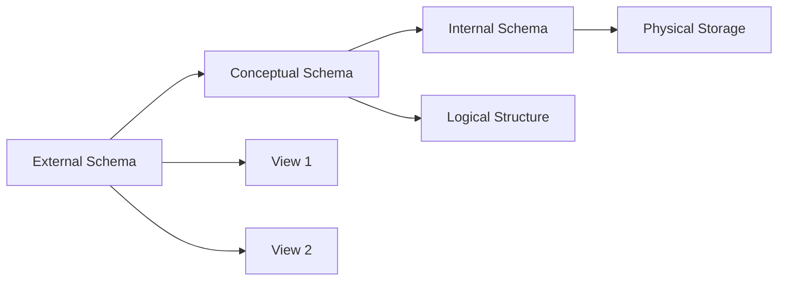
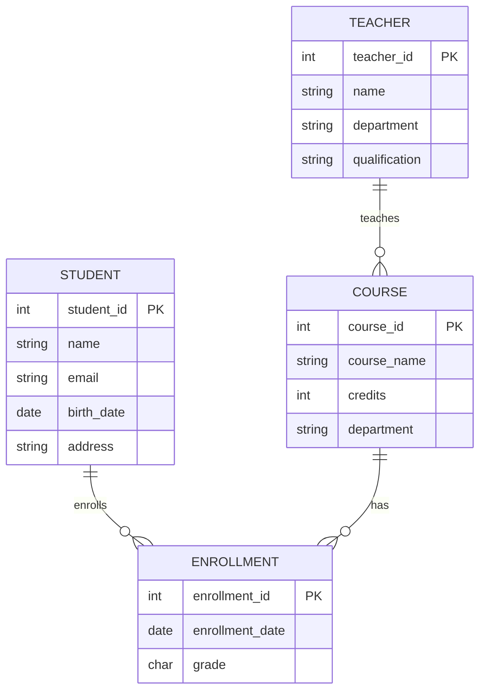
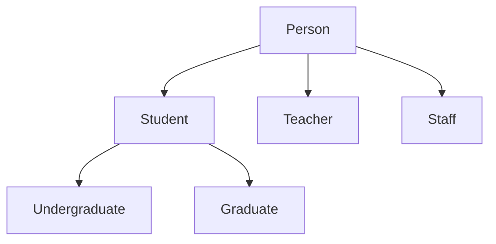

## Question 1(a) [3 marks]

**Define Following Terms: 1. Data 2. Information 3. Metadata**

**Answer**:

**Table: Data vs Information vs Metadata**

| Term | Definition | Example |
|------|------------|---------|
| **Data** | Raw facts and figures without context | "25", "John", "Mumbai" |
| **Information** | Processed data with meaning and context | "John is 25 years old and lives in Mumbai" |
| **Metadata** | Data about data describing structure and properties | "Age field: Integer, Max length: 3" |

- **Data**: Basic building blocks of information systems
- **Information**: Result of data processing for decision making
- **Metadata**: Essential for database design and management

**Mnemonic:** "DIM - Data gives Information using Metadata"

---

## Question 1(b) [4 marks]

**Compare File System vs Database System**

**Answer**:

**Table: File System vs Database System Comparison**

| Aspect | File System | Database System |
|--------|-------------|-----------------|
| **Data Storage** | Separate files for each application | Centralized storage |
| **Data Redundancy** | High redundancy | Minimal redundancy |
| **Data Consistency** | Poor consistency | High consistency |
| **Data Security** | Limited security | Advanced security features |
| **Concurrent Access** | Limited support | Full concurrent support |
| **Data Independence** | No independence | Physical and logical independence |

- **File System**: Simple but with data duplication issues
- **Database System**: Complex but efficient data management
- **Main Advantage**: DBMS eliminates data redundancy and inconsistency

**Mnemonic:** "DBMS = Data Better Managed Systematically"

---

## Question 1(c) [7 marks]

**Draw and Explain Network Data Model**

**Answer**:

**Diagram:**

```goat
    Owner 1
       |
    Set Type 1
    /    |    \
Member1 Member2 Member3
   |       |       |
Set Type 2 Set Type 3 Set Type 4
   |       |       |
Member4 Member5 Member6
```

**Table: Network Model Components**

| Component | Description | Example |
|-----------|-------------|---------|
| **Record Type** | Entity representation | Employee, Department |
| **Set Type** | Relationship between records | Works-In, Manages |
| **Owner** | Parent record in relationship | Department (owner) |
| **Member** | Child record in relationship | Employee (member) |

- **Owner Record**: Controls the set and can have multiple members
- **Member Record**: Belongs to one or more sets
- **Set Occurrence**: Instance of set type linking owner to members
- **Navigation**: Uses pointers for record access

**Mnemonic:** "Network = Nodes with Multiple Connections"

---

## Question 1(c) OR [7 marks]

**What is Schema? Explain different types of Schema with example**

**Answer**:

**Definition**: Schema is the logical structure or blueprint of a database that defines how data is organized.

**Diagram:**



**Table: Types of Schema**

| Schema Type | Level | Description | Example |
|-------------|-------|-------------|---------|
| **External Schema** | View Level | User-specific view of database | Student grades view for teachers |
| **Conceptual Schema** | Logical Level | Complete logical structure | All tables, relationships, constraints |
| **Internal Schema** | Physical Level | Physical storage structure | Index files, storage allocation |

- **External Schema**: Provides data independence for users
- **Conceptual Schema**: Database designer's complete view
- **Internal Schema**: Database administrator's physical view

**Mnemonic:** "ECI - External Conceptual Internal"

---

## Question 2(a) [3 marks]

**Define Following Terms: 1. Entity 2. Attributes 3. Relationship**

**Answer**:

**Table: ER Model Basic Concepts**

| Term | Definition | Example |
|------|------------|---------|
| **Entity** | Real-world object with independent existence | Student, Course, Teacher |
| **Attributes** | Properties that describe an entity | Student: ID, Name, Age |
| **Relationship** | Association between two or more entities | Student ENROLLS IN Course |

- **Entity**: Represented by rectangles in ER diagrams
- **Attributes**: Represented by ovals connected to entities
- **Relationship**: Represented by diamonds connecting entities

**Mnemonic:** "EAR - Entity has Attributes and Relationships"

---

## Question 2(b) [4 marks]

**Describe Weak Entity Sets with example**

**Answer**:

**Definition**: Weak entity is an entity that cannot be uniquely identified by its own attributes and depends on a strong entity.

**Diagram:**

```goat
+----------+       +===========+       +----------+
| Employee |-------| Dependent |-------| Person   |
|   (1)    |       |  (Weak)   |       |   (N)    |
+----------+       +===========+       +----------+
    emp_id              name              dep_name
                     (Partial Key)
```

**Table: Weak vs Strong Entity**

| Aspect | Strong Entity | Weak Entity |
|--------|---------------|-------------|
| **Primary Key** | Has its own primary key | No primary key |
| **Existence** | Independent existence | Depends on strong entity |
| **Representation** | Single rectangle | Double rectangle |
| **Example** | Employee | Dependent of Employee |

- **Partial Key**: Attribute that partially identifies weak entity
- **Identifying Relationship**: Connects weak entity to strong entity
- **Total Participation**: Weak entity must participate in relationship

**Mnemonic:** "Weak entities are DEPENDent"

---

## Question 2(c) [7 marks]

**Draw ER Diagram for University Management System**

**Answer**:

**Diagram:**



**Table: Entity Relationships**

| Relationship | Cardinality | Description |
|--------------|-------------|-------------|
| **Student ENROLLS Course** | M:N | Many students can enroll in many courses |
| **Teacher TEACHES Course** | 1:N | One teacher teaches multiple courses |
| **Course HAS Enrollment** | 1:N | One course has multiple enrollments |

- **Primary Entities**: Student, Course, Teacher
- **Associative Entity**: Enrollment (resolves M:N relationship)
- **Key Attributes**: All entities have unique identifier

**Mnemonic:** "University = Students Take Courses from Teachers"

---

## Question 2(a) OR [3 marks]

**Define Following Terms: 1. Primary Key 2. Foreign Key 3. Candidate Key**

**Answer**:

**Table: Database Keys**

| Key Type | Definition | Example |
|----------|------------|---------|
| **Primary Key** | Unique identifier for each record | Student_ID in Student table |
| **Foreign Key** | References primary key of another table | Student_ID in Enrollment table |
| **Candidate Key** | Potential primary key attribute | Email, Phone in Student table |

- **Primary Key**: Cannot be NULL and must be unique
- **Foreign Key**: Maintains referential integrity
- **Candidate Key**: Alternative unique identifiers

**Mnemonic:** "PFC - Primary Foreign Candidate"

---

## Question 2(b) OR [4 marks]

**Write a Short note on Generalization and Specialization**

**Answer**:

**Generalization**: Process of extracting common attributes from multiple entities to create a general entity.

**Specialization**: Process of defining subclasses of an entity based on distinguishing characteristics.

**Diagram:**



**Table: Generalization vs Specialization**

| Aspect | Generalization | Specialization |
|--------|----------------|----------------|
| **Direction** | Bottom-up approach | Top-down approach |
| **Purpose** | Remove redundancy | Add specific attributes |
| **Result** | Superclass creation | Subclass creation |

- **ISA Relationship**: "Is-A" relationship between superclass and subclass
- **Inheritance**: Subclasses inherit attributes from superclass

**Mnemonic:** "General goes UP, Special goes DOWN"

---

## Question 2(c) OR [7 marks]

**Explain different Relational Algebra operation with example**

**Answer**:

**Table: Relational Algebra Operations**

| Operation | Symbol | Description | Example |
|-----------|--------|-------------|---------|
| **Select** | σ | Selects rows based on condition | σ(age>20)(Student) |
| **Project** | π | Selects specific columns | π(name,age)(Student) |
| **Union** | ∪ | Combines two relations | R ∪ S |
| **Intersection** | ∩ | Common tuples from relations | R ∩ S |
| **Difference** | - | Tuples in R but not in S | R - S |
| **Join** | ⋈ | Combines related tuples | Student ⋈ Enrollment |

**Example Relations:**

Student: (ID=1, Name=John, Age=20)
Course: (CID=101, CName=DBMS, Credits=3)

- **Selection**: σ(Age>18)(Student) returns students above 18
- **Projection**: π(Name)(Student) returns only names
- **Join**: Student ⋈ Enrollment combines student and enrollment data

**Mnemonic:** "SPUDIJ - Select Project Union Difference Intersection Join"

---

## Question 3(a) [3 marks]

**List out Numeric Functions in SQL. Explain any Two**

**Answer**:

**Table: SQL Numeric Functions**

| Function | Purpose | Example |
|----------|---------|---------|
| **ABS()** | Absolute value | ABS(-15) = 15 |
| **CEIL()** | Smallest integer ≥ value | CEIL(4.3) = 5 |
| **FLOOR()** | Largest integer ≤ value | FLOOR(4.7) = 4 |
| **ROUND()** | Round to specified places | ROUND(15.76, 1) = 15.8 |
| **SQRT()** | Square root | SQRT(16) = 4 |
| **POWER()** | Raise to power | POWER(2, 3) = 8 |

**Detailed Examples:**

- **ABS(number)**: Returns absolute value, removing negative sign
- **ROUND(number, decimal_places)**: Rounds number to specified decimal places

**Mnemonic:** "Math functions make Numbers Nice"

---

## Question 3(b) [4 marks]

**Describe Having and Order by Clause with example**

**Answer**:

**HAVING Clause**: Used with GROUP BY to filter groups based on aggregate conditions.

**ORDER BY Clause**: Used to sort result set in ascending or descending order.

**Table: HAVING vs WHERE**

| Aspect | WHERE | HAVING |
|--------|-------|--------|
| **Usage** | Filters individual rows | Filters grouped results |
| **With Aggregates** | Cannot use | Can use aggregate functions |
| **Position** | Before GROUP BY | After GROUP BY |

**Example:**

```sql
SELECT department, COUNT(*) as emp_count
FROM employees 
WHERE salary > 30000
GROUP BY department 
HAVING COUNT(*) > 5
ORDER BY emp_count DESC;
```

- **WHERE**: Filters employees with salary > 30000
- **HAVING**: Shows only departments with more than 5 employees
- **ORDER BY**: Sorts by employee count in descending order

**Mnemonic:** "WHERE filters rows, HAVING filters groups, ORDER BY sorts results"

---

## Question 3(c) [7 marks]

**Perform the following Query on the table student having the fields Student_ID, Stu_Name, Stu_Subject_ID, Stu_Marks, Stu_Age in SQL**

**Answer**:

**1. Create student table:**

```sql
CREATE TABLE student (
    Student_ID INT PRIMARY KEY,
    Stu_Name VARCHAR(50),
    Stu_Subject_ID INT,
    Stu_Marks INT,
    Stu_Age INT
);
```

**2. Insert record in student table:**

```sql
INSERT INTO student VALUES 
(1, 'John', 101, 85, 22),
(2, 'Mary', 102, 90, 21);
```

**3. Find minimum and maximum marks:**

```sql
SELECT MIN(Stu_Marks) as Min_Marks, 
       MAX(Stu_Marks) as Max_Marks 
FROM student;
```

**4. Students with marks > 82 and age = 22:**

```sql
SELECT * FROM student 
WHERE Stu_Marks > 82 AND Stu_Age = 22;
```

**5. Students whose name begins with 'm':**

```sql
SELECT * FROM student 
WHERE Stu_Name LIKE 'm%';
```

**6. Find average marks:**

```sql
SELECT AVG(Stu_Marks) as Average_Marks 
FROM student;
```

**7. Add Stu_address column:**

```sql
ALTER TABLE student 
ADD Stu_address VARCHAR(100);
```

**Mnemonic:** "CRUD + Analytics = Complete Database Operations"

---

## Question 3(a) OR [3 marks]

**Describe different date function in SQL with example**

**Answer**:

**Table: SQL Date Functions**

| Function | Purpose | Example |
|----------|---------|---------|
| **SYSDATE** | Current system date | SYSDATE returns '2024-06-12' |
| **ADD_MONTHS()** | Add months to date | ADD_MONTHS('2024-01-15', 3) |
| **MONTHS_BETWEEN()** | Months between dates | MONTHS_BETWEEN('2024-06-12', '2024-01-12') |
| **LAST_DAY()** | Last day of month | LAST_DAY('2024-02-15') = '2024-02-29' |
| **NEXT_DAY()** | Next occurrence of day | NEXT_DAY('2024-06-12', 'FRIDAY') |

**Examples:**

- **SYSDATE**: Returns current system date and time
- **ADD_MONTHS**: Useful for calculating future dates like loan due dates

**Mnemonic:** "Date functions help with Time Management"

---

## Question 3(b) OR [4 marks]

**List out Constraints in SQL. Explain any two with example**

**Answer**:

**Table: SQL Constraints**

| Constraint | Purpose | Example |
|------------|---------|---------|
| **PRIMARY KEY** | Unique identifier | Student_ID INT PRIMARY KEY |
| **FOREIGN KEY** | References another table | REFERENCES Student(Student_ID) |
| **NOT NULL** | Prevents null values | Name VARCHAR(50) NOT NULL |
| **UNIQUE** | Ensures uniqueness | Email VARCHAR(100) UNIQUE |
| **CHECK** | Validates data | Age INT CHECK (Age >= 18) |
| **DEFAULT** | Default value | Status VARCHAR(10) DEFAULT 'Active' |

**Detailed Examples:**

**PRIMARY KEY Constraint:**

```sql
CREATE TABLE Student (
    Student_ID INT PRIMARY KEY,
    Name VARCHAR(50)
);
```

**CHECK Constraint:**

```sql
CREATE TABLE Employee (
    Emp_ID INT,
    Salary INT CHECK (Salary > 0)
);
```

- **PRIMARY KEY**: Ensures each record has unique identifier
- **CHECK**: Validates business rules during data entry

**Mnemonic:** "Constraints Control Data Quality"

---

## Question 3(c) OR [7 marks]

**Explain different types of joins with example in SQL**

**Answer**:

**Table: Types of SQL Joins**

| Join Type | Description | Syntax |
|-----------|-------------|--------|
| **INNER JOIN** | Returns matching records from both tables | Table1 INNER JOIN Table2 ON condition |
| **LEFT JOIN** | All records from left table + matching from right | Table1 LEFT JOIN Table2 ON condition |
| **RIGHT JOIN** | All records from right table + matching from left | Table1 RIGHT JOIN Table2 ON condition |
| **FULL OUTER JOIN** | All records from both tables | Table1 FULL OUTER JOIN Table2 ON condition |

**Example Tables:**
Students: (ID=1, Name=John), (ID=2, Name=Mary)
Enrollments: (StudentID=1, Course=DBMS), (StudentID=3, Course=Java)

**INNER JOIN Example:**

```sql
SELECT s.Name, e.Course 
FROM Students s 
INNER JOIN Enrollments e ON s.ID = e.StudentID;
```

*Result: Only John with DBMS course*

**LEFT JOIN Example:**

```sql
SELECT s.Name, e.Course 
FROM Students s 
LEFT JOIN Enrollments e ON s.ID = e.StudentID;
```

*Result: John-DBMS, Mary-NULL*

**Mnemonic:** "JOIN connects Related Tables"

---

## Question 4(a) [3 marks]

**Give an example of Grant and Revoke command in SQL**

**Answer**:

**GRANT Command**: Provides specific privileges to users on database objects.

**REVOKE Command**: Removes previously granted privileges from users.

**Table: Common Privileges**

| Privilege | Description | Example |
|-----------|-------------|---------|
| **SELECT** | Read data | GRANT SELECT ON Student TO user1 |
| **INSERT** | Add new records | GRANT INSERT ON Student TO user1 |
| **UPDATE** | Modify existing records | GRANT UPDATE ON Student TO user1 |
| **DELETE** | Remove records | GRANT DELETE ON Student TO user1 |
| **ALL** | All privileges | GRANT ALL ON Student TO user1 |

**Examples:**

```sql
-- Grant SELECT privilege
GRANT SELECT ON Student TO john;

-- Revoke INSERT privilege  
REVOKE INSERT ON Student FROM john;
```

- **WITH GRANT OPTION**: Allows user to grant privileges to others
- **CASCADE**: Revokes privileges from all users who received them

**Mnemonic:** "GRANT gives rights, REVOKE removes rights"

---

## Question 4(b) [4 marks]

**Write a short note on SQL Views**

**Answer**:

**Definition**: A view is a virtual table based on the result of an SQL statement containing rows and columns like a real table.

**Table: View Characteristics**

| Aspect | Description | Example |
|--------|-------------|---------|
| **Virtual Table** | Does not store data physically | CREATE VIEW student_view AS... |
| **Security** | Hides sensitive columns | Hide salary column from employees |
| **Simplification** | Simplifies complex queries | Join multiple tables in single view |
| **Data Independence** | Changes in base tables don't affect users | Modify table structure without affecting applications |

**Example:**

```sql
CREATE VIEW active_students AS
SELECT Student_ID, Name, Age 
FROM Student 
WHERE Status = 'Active';

-- Using the view
SELECT * FROM active_students;
```

**Advantages:**

- **Security**: Restrict access to sensitive data
- **Simplicity**: Hide complex joins from end users
- **Consistency**: Standardized data access

**Mnemonic:** "Views are Virtual Windows to Data"

---

## Question 4(c) [7 marks]

**What is Normalization? Explain 2NF with example**

**Answer**:

**Normalization**: Process of organizing database to reduce redundancy and improve data integrity by dividing large tables into smaller related tables.

**2NF (Second Normal Form)**:

- Must be in 1NF
- Remove partial functional dependencies
- Non-key attributes must depend on entire primary key

**Example - Unnormalized Table:**

| Student_ID | Course_ID | Student_Name | Course_Name | Instructor |
|------------|-----------|--------------|-------------|------------|
| 101 | C1 | John | DBMS | Dr. Smith |
| 101 | C2 | John | Java | Dr. Jones |
| 102 | C1 | Mary | DBMS | Dr. Smith |

**Problems:**

- Student_Name depends only on Student_ID (partial dependency)
- Course_Name and Instructor depend only on Course_ID

**After 2NF:**

**Student Table:**

| Student_ID | Student_Name |
|------------|--------------|
| 101 | John |
| 102 | Mary |

**Course Table:**

| Course_ID | Course_Name | Instructor |
|-----------|-------------|------------|
| C1 | DBMS | Dr. Smith |
| C2 | Java | Dr. Jones |

**Enrollment Table:**

| Student_ID | Course_ID |
|------------|-----------|
| 101 | C1 |
| 101 | C2 |
| 102 | C1 |

**Benefits:**

- **Eliminates Redundancy**: Student names not repeated
- **Reduces Storage**: Less duplicate data
- **Improves Consistency**: Update student name in one place

**Mnemonic:** "2NF = No Partial Dependencies"

---

## Question 4(a) OR [3 marks]

**Give an example of Group By Clause in SQL**

**Answer**:

**GROUP BY Clause**: Groups rows with same values in specified columns and allows aggregate functions on each group.

**Table: GROUP BY Usage**

| Purpose | Function | Example |
|---------|----------|---------|
| **Counting** | COUNT() | Count students per department |
| **Summing** | SUM() | Total salary per department |
| **Averaging** | AVG() | Average marks per course |
| **Finding Min/Max** | MIN()/MAX() | Highest salary per department |

**Example:**

```sql
SELECT Department, COUNT(*) as Total_Students, AVG(Marks) as Avg_Marks
FROM Student 
GROUP BY Department;
```

**Result:**

| Department | Total_Students | Avg_Marks |
|------------|----------------|-----------|
| IT | 25 | 78.5 |
| CS | 30 | 82.1 |

- **Groups**: Creates separate groups for each department
- **Aggregates**: Calculates count and average for each group

**Mnemonic:** "GROUP BY creates Summary Reports"

---

## Question 4(b) OR [4 marks]

**Describe Set Operators in SQL with example**

**Answer**:

**Set Operators**: Combine results from two or more SELECT statements.

**Table: SQL Set Operators**

| Operator | Description | Requirement | Example |
|----------|-------------|-------------|---------|
| **UNION** | Combines results, removes duplicates | Same column structure | SELECT name FROM students UNION SELECT name FROM teachers |
| **UNION ALL** | Combines results, keeps duplicates | Same column structure | SELECT name FROM students UNION ALL SELECT name FROM alumni |
| **INTERSECT** | Returns common records | Same column structure | SELECT course FROM current_courses INTERSECT SELECT course FROM popular_courses |
| **MINUS** | Records in first query but not second | Same column structure | SELECT student_id FROM enrolled MINUS SELECT student_id FROM graduated |

**Example:**

```sql
-- Students who are also teachers
SELECT name FROM students
INTERSECT
SELECT name FROM teachers;

-- All people in university
SELECT name, 'Student' as type FROM students
UNION
SELECT name, 'Teacher' as type FROM teachers;
```

**Rules:**

- **Column Count**: Must be same in all queries
- **Data Types**: Corresponding columns must have compatible types
- **Order**: ORDER BY can only be used at the end

**Mnemonic:** "Set operators Unite, Intersect, and Subtract data"

---

## Question 4(c) OR [7 marks]

**Justify the importance of Normalization. Explain 1NF with example**

**Answer**:

**Importance of Normalization:**

**Table: Benefits of Normalization**

| Benefit | Description | Impact |
|---------|-------------|--------|
| **Eliminates Redundancy** | Reduces duplicate data storage | Saves storage space |
| **Prevents Anomalies** | Avoids insertion, deletion, update problems | Maintains data consistency |
| **Improves Integrity** | Ensures data accuracy | Reliable information system |
| **Flexible Design** | Easy to modify and extend | Adaptable to business changes |

**1NF (First Normal Form)**:

- Eliminate duplicate columns from same table
- Create separate tables for related data
- Each cell contains single value (atomic values)

**Example - Unnormalized Table:**

| Student_ID | Name | Subjects |
|------------|------|----------|
| 101 | John | Math, Science, English |
| 102 | Mary | Science, History |

**Problems:**

- Subjects column contains multiple values
- Difficult to query specific subjects
- Update anomalies when adding/removing subjects

**After 1NF:**

**Student Table:**

| Student_ID | Name |
|------------|------|
| 101 | John |
| 102 | Mary |

**Student_Subject Table:**

| Student_ID | Subject |
|------------|---------|
| 101 | Math |
| 101 | Science |
| 101 | English |
| 102 | Science |
| 102 | History |

**Benefits:**

- **Atomic Values**: Each cell contains single value
- **Flexible Queries**: Easy to find students studying specific subjects
- **Easy Updates**: Add/remove subjects without affecting other data

**Mnemonic:** "1NF = One value per cell, No repeating groups"

---

## Question 5(a) [3 marks]

**Explain Serializability in Transaction Management**

**Answer**:

**Serializability**: Property that ensures concurrent execution of transactions produces same result as some serial execution of those transactions.

**Table: Types of Serializability**

| Type | Description | Method |
|------|-------------|--------|
| **Conflict Serializability** | Based on conflicting operations | Precedence graph |
| **View Serializability** | Based on read-write patterns | View equivalence |

**Example:**
Transaction T1: R(A), W(A), R(B), W(B)
Transaction T2: R(A), W(A), R(B), W(B)

**Serial Schedule:** T1 → T2 or T2 → T1
**Concurrent Schedule:** Interleaved operations

- **Conflict Operations**: Operations on same data item where at least one is write
- **Serializable Schedule**: Equivalent to some serial schedule
- **Non-serializable**: May lead to inconsistent database state

**Mnemonic:** "Serializability ensures Transaction Consistency"

---

## Question 5(b) [4 marks]

**Describe Partial Functional Dependency with example**

**Answer**:

**Partial Functional Dependency**: When a non-key attribute is functionally dependent on only part of a composite primary key.

**Table: Functional Dependency Types**

| Type | Definition | Example |
|------|------------|---------|
| **Full Dependency** | Depends on entire primary key | (Student_ID, Course_ID) → Grade |
| **Partial Dependency** | Depends on part of primary key | (Student_ID, Course_ID) → Student_Name |

**Example:**
**Enrollment Table:**
Primary Key: (Student_ID, Course_ID)

| Student_ID | Course_ID | Student_Name | Course_Name | Grade |
|------------|-----------|--------------|-------------|-------|
| 101 | C1 | John | DBMS | A |
| 101 | C2 | John | Java | B |

**Partial Dependencies:**

- Student_ID → Student_Name (Student_Name depends only on Student_ID)
- Course_ID → Course_Name (Course_Name depends only on Course_ID)

**Problems:**

- **Update Anomaly**: Changing student name requires multiple updates
- **Insertion Anomaly**: Cannot add student without enrolling in course
- **Deletion Anomaly**: Deleting enrollment may lose student information

**Solution**: Normalize to 2NF by removing partial dependencies

**Mnemonic:** "Partial dependency = Part of key determines attribute"

---

## Question 5(c) [7 marks]

**Write a Short note on Locking Mechanism with example in Transaction Management**

**Answer**:

**Locking Mechanism**: Concurrency control technique that prevents simultaneous access to data items during transaction execution.

**Table: Types of Locks**

| Lock Type | Description | Usage |
|-----------|-------------|-------|
| **Shared Lock (S)** | Multiple transactions can read | Read operations |
| **Exclusive Lock (X)** | Only one transaction can access | Write operations |
| **Intention Lock** | Indicates intent to lock at lower level | Hierarchical locking |

**Two-Phase Locking (2PL) Protocol:**

1. **Growing Phase**: Acquire locks, cannot release any lock
2. **Shrinking Phase**: Release locks, cannot acquire new locks

**Example:**

```
Transaction T1: Read(A), Write(A), Read(B), Write(B)
Transaction T2: Read(A), Write(A), Read(C), Write(C)

T1: S-lock(A), Read(A), X-lock(A), Write(A), S-lock(B), Read(B), X-lock(B), Write(B), Unlock(A), Unlock(B)
T2: Wait for A, S-lock(A), Read(A), X-lock(A), Write(A), S-lock(C), Read(C), X-lock(C), Write(C), Unlock(A), Unlock(C)
```

**Lock Compatibility Matrix:**

| Current/Requested | S | X |
|------------------|---|---|
| **S** | ✓ | ✗ |
| **X** | ✗ | ✗ |

**Problems:**

- **Deadlock**: Two transactions waiting for each other's locks
- **Starvation**: Transaction waits indefinitely for lock

**Solutions:**

- **Deadlock Detection**: Use wait-for graph
- **Deadlock Prevention**: Timestamp-based protocols

**Mnemonic:** "Locking prevents Concurrent Conflicts"

---

## Question 5(a) OR [3 marks]

**Explain Deadlock in Transaction Management**

**Answer**:

**Deadlock**: Situation where two or more transactions are waiting indefinitely for each other to release locks, creating a circular wait condition.

**Table: Deadlock Components**

| Component | Description | Example |
|-----------|-------------|---------|
| **Mutual Exclusion** | Resources cannot be shared | Exclusive locks |
| **Hold and Wait** | Process holds resources while waiting | T1 holds A, waits for B |
| **No Preemption** | Resources cannot be forcibly taken | Locks cannot be revoked |
| **Circular Wait** | Circular chain of waiting processes | T1→T2→T1 |

**Example:**

```
Transaction T1: Lock(A), Lock(B)
Transaction T2: Lock(B), Lock(A)

Time 1: T1 gets Lock(A)
Time 2: T2 gets Lock(B) 
Time 3: T1 waits for Lock(B) - held by T2
Time 4: T2 waits for Lock(A) - held by T1
Result: DEADLOCK!
```

**Detection**: Use wait-for graph to identify cycles
**Prevention**: Use timestamp ordering or wound-wait protocols

**Mnemonic:** "Deadlock = Circular Waiting for Resources"

---

## Question 5(b) OR [4 marks]

**Describe Full Functional Dependency with example**

**Answer**:

**Full Functional Dependency**: A non-key attribute is functionally dependent on the entire primary key (not just part of it).

**Table: Dependency Comparison**

| Type | Definition | Example |
|------|------------|---------|
| **Full Dependency** | Depends on complete primary key | (Student_ID, Course_ID) → Grade |
| **Partial Dependency** | Depends on part of primary key | (Student_ID, Course_ID) → Student_Name |

**Example:**
**Enrollment Table:**
Primary Key: (Student_ID, Course_ID)

| Student_ID | Course_ID | Grade | Hours |
|------------|-----------|-------|--------|
| 101 | C1 | A | 4 |
| 101 | C2 | B | 3 |
| 102 | C1 | B | 4 |

**Full Functional Dependencies:**

- (Student_ID, Course_ID) → Grade ✓
- (Student_ID, Course_ID) → Hours ✓

**Explanation:**

- **Grade** depends on both Student_ID AND Course_ID (specific student in specific course)
- **Hours** also depends on both (student's hours in specific course)
- Cannot determine Grade from Student_ID alone
- Cannot determine Grade from Course_ID alone

**Benefits:**

- **No Update Anomalies**: Changes affect only relevant records
- **Proper Normalization**: Supports 2NF requirements
- **Data Integrity**: Ensures accurate relationships

**Mnemonic:** "Full dependency needs Complete Key"

---

## Question 5(c) OR [7 marks]

**Explain ACID Properties of Transaction with example**

**Answer**:

**ACID Properties**: Four fundamental properties that guarantee database transaction reliability.

**Table: ACID Properties**

| Property | Description | Example |
|----------|-------------|---------|
| **Atomicity** | All or nothing execution | Bank transfer: both debit and credit must happen |
| **Consistency** | Database remains in valid state | Account balance cannot be negative |
| **Isolation** | Transactions don't interfere | Concurrent transactions appear sequential |
| **Durability** | Committed changes are permanent | Data survives system crashes |

**Detailed Examples:**

**Atomicity Example:**

```sql
BEGIN TRANSACTION;
UPDATE Account SET Balance = Balance - 1000 WHERE AccNo = 'A001';
UPDATE Account SET Balance = Balance + 1000 WHERE AccNo = 'A002';
COMMIT;
```

*If either update fails, entire transaction is rolled back*

**Consistency Example:**

```sql
-- Before: A001 = 5000, A002 = 3000, Total = 8000
-- Transfer 1000 from A001 to A002
-- After: A001 = 4000, A002 = 4000, Total = 8000
-- Total money in system remains constant
```

**Isolation Example:**

```
T1: Read(A=100), A=A+50, Write(A=150)
T2: Read(A=100), A=A*2, Write(A=200)
Serial Result: A=300 or A=250
Isolated execution must produce one of these results
```

**Durability Example:**

```
After COMMIT is executed, even if system crashes,
the transferred amount remains in destination account
```

**Implementation:**

- **Atomicity**: Using transaction logs and rollback
- **Consistency**: Using constraints and triggers
- **Isolation**: Using locking mechanisms
- **Durability**: Using write-ahead logging

**Mnemonic:** "ACID keeps Transactions Reliable"
