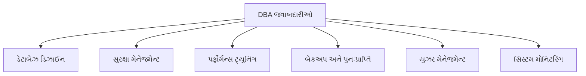
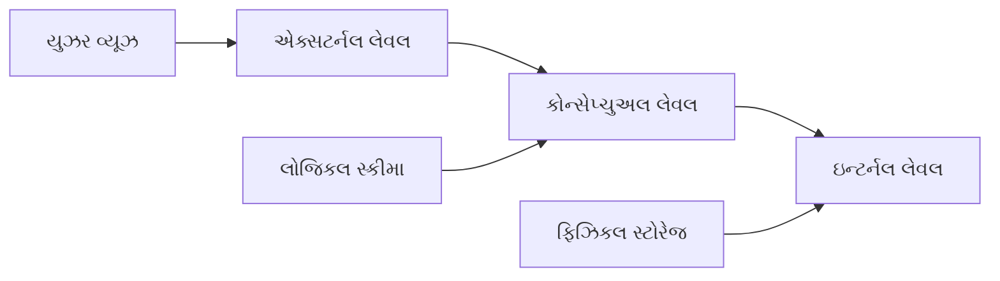
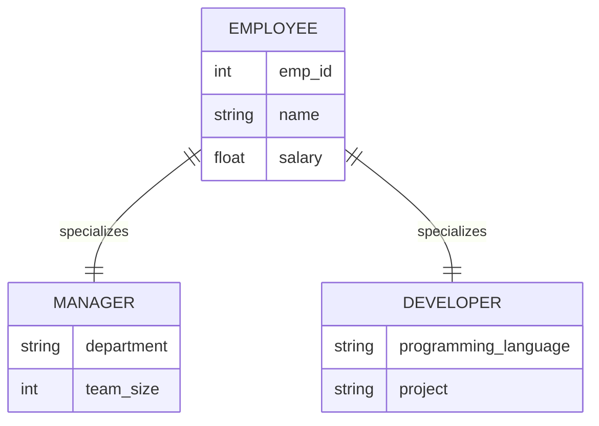
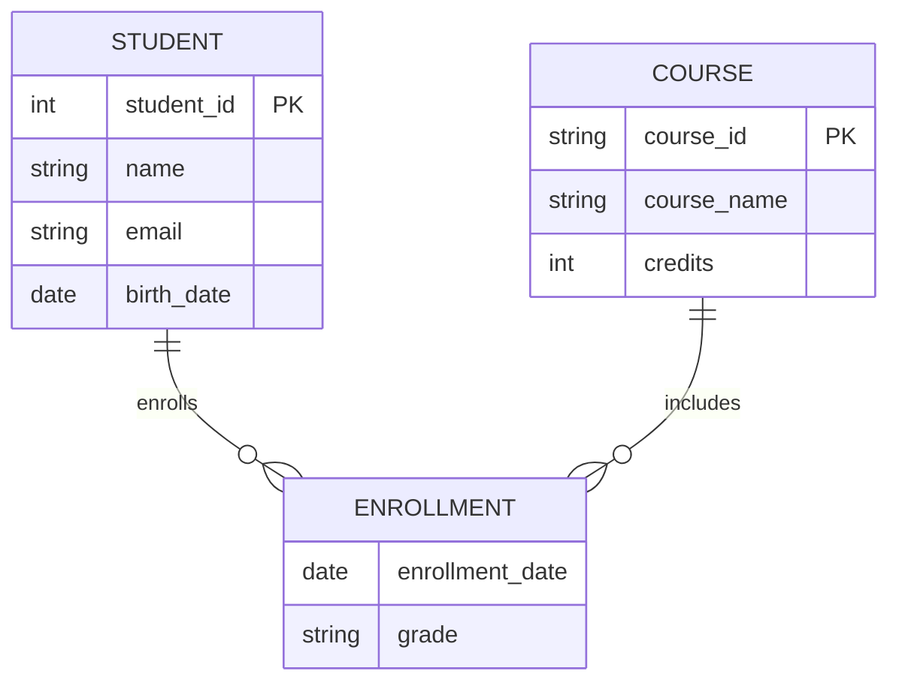
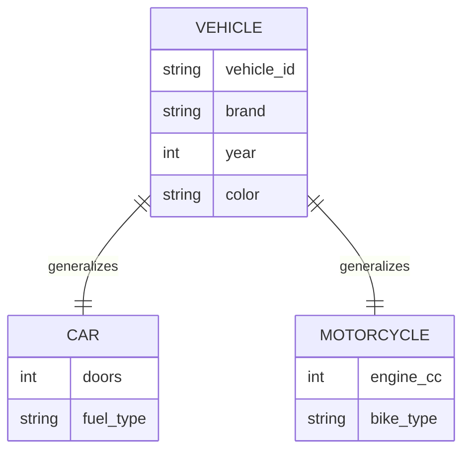
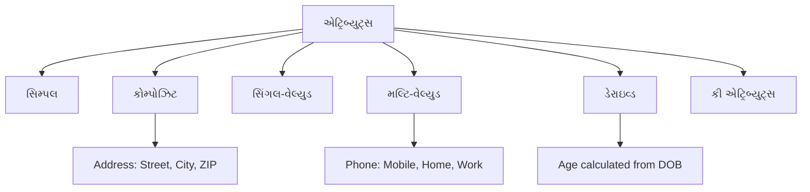
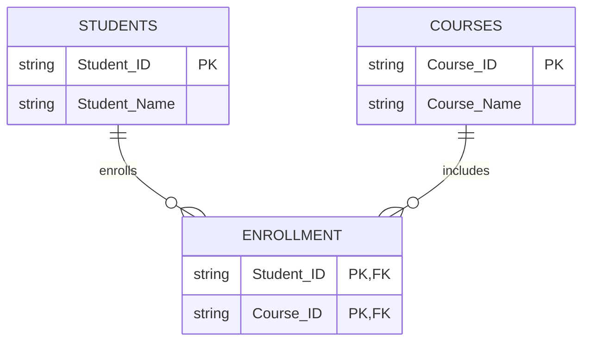
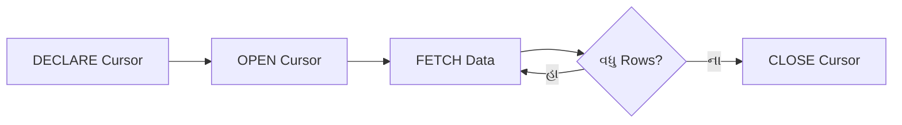

## પ્રશ્ન 1(a) [3 ગુણ]

**નીચેના શબ્દોની વ્યાખ્યા આપો. 1) મેટાડેટા 2) સ્કીમા 3) ડેટા ડિક્શનરી.**

**જવાબ**:

**ટેબલ:**

| શબ્દ | વ્યાખ્યા |
|------|---------|
| **મેટાડેટા** | ડેટા વિશેનો ડેટા જે ડેટાબેઝની રચના અને વિશેષતાઓ વર્ણવે છે |
| **સ્કીમા** | ડેટાબેઝના સંગઠન અને સંબંધોને દર્શાવતી તાર્કિક રચના |
| **ડેટા ડિક્શનરી** | ડેટાબેઝના તત્વો વિશેની માહિતી સંગ્રહિત કરતો કેન્દ્રીય ભંડાર |

- **મેટાડેટા**: ડેટાની લાક્ષણિકતાઓ અને ગુણધર્મો વર્ણવતી માહિતી
- **સ્કીમા**: ડેટાબેઝની રચના અને મર્યાદાઓ વ્યાખ્યાયિત કરતો બ્લુપ્રિન્ટ
- **ડેટા ડિક્શનરી**: બધા ડેટાબેઝ ઓબ્જેક્ટ્સ અને તેમના ગુણધર્મોની કેટલોગ

**મેમરી ટ્રીક:** "MSD - My System Dictionary"

## પ્રશ્ન 1(b) [4 ગુણ]

**ડેટાબેઝ મેનેજમેન્ટ સિસ્ટમના ફાયદા લખો.**

**જવાબ**:

**ટેબલ:**

| ફાયદો | વર્ણન |
|-------|-------|
| **ડેટા સ્વતંત્રતા** | એપ્લિકેશન્સ ડેટા સ્ટોરેજથી સ્વતંત્ર |
| **ડેટા અખંડિતતા** | ડેટાની ચોકસાઈ અને સુસંગતતા જાળવે છે |
| **સુરક્ષા નિયંત્રણ** | વપરાશકર્તા પ્રમાણીકરણ અને અધિકરણ |
| **સમવર્તી પહોંચ** | અનેક વપરાશકર્તાઓ એકસાથે પહોંચ કરી શકે છે |

- **ઘટેલી રીડન્ડન્સી**: ડુપ્લિકેટ ડેટા સ્ટોરેજ દૂર કરે છે
- **કેન્દ્રીકૃત નિયંત્રણ**: ડેટા મેનેજમેન્ટનું એક જ બિંદુ
- **ડેટા વહેંચણી**: અનેક એપ્લિકેશન્સ સમાન ડેટાનો ઉપયોગ કરી શકે છે
- **બેકઅપ પુનઃપ્રાપ્તિ**: આપોઆપ ડેટા સુરક્ષા પદ્ધતિઓ

**મેમરી ટ્રીક:** "DISC-RCDB - Database Is Super Cool"

## પ્રશ્ન 1(c) [7 ગુણ]

**DBA ની જવાબદારીઓ સમજાવો.**

**જવાબ**:

**ટેબલ:**

| જવાબદારી | કાર્યો |
|----------|-------|
| **ડેટાબેઝ ડિઝાઈન** | તાર્કિક અને ભૌતિક રચનાઓ બનાવવી |
| **સુરક્ષા મેનેજમેન્ટ** | વપરાશકર્તા પહોંચ અને પરવાનગીઓનું નિયંત્રણ |
| **પર્ફોર્મન્સ ટ્યુનિંગ** | ક્વેરીઝ અને ડેટાબેઝ ઓપરેશન્સને ઓપ્ટિમાઈઝ કરવા |
| **બેકઅપ પુનઃપ્રાપ્તિ** | ડેટા સુરક્ષા અને પુનઃસ્થાપન સુનિશ્ચિત કરવું |
| **યુઝર મેનેજમેન્ટ** | એકાઉન્ટ બનાવવા અને વિશેષાધિકારો અસાઇન કરવા |



- **ડેટાબેઝ ઇન્સ્ટલેશન**: DBMS સોફ્ટવેર સેટઅપ અને કોન્ફિગર કરવું
- **ડેટા માઇગ્રેશન**: સિસ્ટમ્સ વચ્ચે ડેટાને સુરક્ષિત રીતે ટ્રાન્સફર કરવો
- **ડોક્યુમેન્ટેશન**: ડેટાબેઝ સ્કીમા અને પ્રક્રિયાઓ જાળવવી
- **મોનિટરિંગ**: સિસ્ટમ પર્ફોર્મન્સ અને રિસોર્સ વપરાશ ટ્રેક કરવું
- **ટ્રબલશૂટિંગ**: ડેટાબેઝ સમસ્યાઓ અને ભૂલો ઉકેલવી

**મેમરી ટ્રીક:** "DSPBU-DMT - DBA Solves Problems By Understanding Database Management Tasks"

## પ્રશ્ન 1(c OR) [7 ગુણ]

**ડેટા એબ્સ્ટ્રેક્શન શું છે? ત્રણ સ્તરની ANSI SPARC આર્કિટેક્ચરને વિગતવાર સમજાવો.**

**જવાબ**:

**ડેટા એબ્સ્ટ્રેક્શન**: વપરાશકર્તાઓથી જટિલ ડેટાબેઝ અમલીકરણ વિગતો છુપાવીને સરળ ઇન્ટરફેસ પ્રદાન કરવું.



**ટેબલ:**

| સ્તર | વર્ણન | વપરાશકર્તાઓ |
|-----|-------|-------------|
| **એક્સટર્નલ લેવલ** | વ્યક્તિગત વપરાશકર્તા દૃશ્યો અને એપ્લિકેશન્સ | એન્ડ યુઝર્સ |
| **કોન્સેપ્ચુઅલ લેવલ** | સંપૂર્ણ તાર્કિક ડેટાબેઝ રચના | ડેટાબેઝ ડિઝાઇનર્સ |
| **ઇન્ટર્નલ લેવલ** | ભૌતિક સ્ટોરેજ અને એક્સેસ પદ્ધતિઓ | સિસ્ટમ પ્રોગ્રામર્સ |

- **એક્સટર્નલ લેવલ**: જટિલતા છુપાવતા અનેક વપરાશકર્તા દૃશ્યો
- **કોન્સેપ્ચુઅલ લેવલ**: સ્ટોરેજ વિગતો વિના સંપૂર્ણ ડેટાબેઝ સ્કીમા
- **ઇન્ટર્નલ લેવલ**: ભૌતિક ફાઇલ સંગઠન અને ઇન્ડેક્સિંગ
- **ડેટા સ્વતંત્રતા**: એક સ્તરમાં ફેરફારો અન્યને અસર કરતા નથી

**મેમરી ટ્રીક:** "ECI - Every Computer Implements"

## પ્રશ્ન 2(a) [3 ગુણ]

**સ્કીમા અને ઇન્સ્ટન્સનો તફાવત સમજાવો**

**જવાબ**:

**ટેબલ:**

| પાસું | સ્કીમા | ઇન્સ્ટન્સ |
|------|-------|---------|
| **વ્યાખ્યા** | ડેટાબેઝ રચનાનો બ્લુપ્રિન્ટ | ચોક્કસ સમયે વાસ્તવિક ડેટા |
| **પ્રકૃતિ** | સ્થિર તાર્કિક ડિઝાઇન | ડાયનામિક ડેટા સામગ્રી |
| **ફેરફારો** | ભાગ્યે જ સંશોધિત | વારંવાર અપડેટ |

- **સ્કીમા**: ડેટાબેઝ સંગઠન અને મર્યાદાઓ વર્ણવે છે
- **ઇન્સ્ટન્સ**: ચોક્કસ ક્ષણે ડેટાબેઝ સામગ્રીનો સ્નેપશોટ
- **સંબંધ**: સ્કીમા રચના વ્યાખ્યાયિત કરે છે, ઇન્સ્ટન્સ ડેટા સમાવે છે

**મેમરી ટ્રીક:** "SI - Structure vs Information"

## પ્રશ્ન 2(b) [4 ગુણ]

**સ્પેશ્યલાઈઝેશન ઉદાહરણ સાથે સમજાવો.**

**જવાબ**:

**સ્પેશ્યલાઈઝેશન**: ચોક્કસ લાક્ષણિકતાઓના આધારે સુપરક્લાસમાંથી સબક્લાસ બનાવવાની પ્રક્રિયા.



- **ટોપ-ડાઉન અપ્રોચ**: સામાન્ય એન્ટિટીથી ચોક્કસ એન્ટિટીઓ તરફ
- **ઇન્હેરિટન્સ**: સબક્લાસેસ સુપરક્લાસના ગુણધર્મો વારસામાં લે છે
- **ડિસજોઇન્ટ**: મેનેજર અને ડેવલપર અલગ કેટેગરી છે
- **ઉદાહરણ**: એમ્પ્લોયી મેનેજર અને ડેવલપરમાં વિશેષીકૃત

**મેમરી ટ્રીક:** "STID - Specialization Takes Inheritance Down"

## પ્રશ્ન 2(c) [7 ગુણ]

**ER ડાયાગ્રામ શું છે? ER ડાયાગ્રામમાં વપરાતા વિવિધ પ્રતીકોને ઉદાહરણ સાથે સમજાવો.**

**જવાબ**:

**ER ડાયાગ્રામ**: ડેટાબેઝ ડિઝાઇનમાં એન્ટિટીઝ, એટ્રિબ્યુટ્સ અને સંબંધો દર્શાવતી ગ્રાફિકલ પ્રતિનિધિત્વ.

**ટેબલ:**

| પ્રતીક | આકાર | હેતુ | ઉદાહરણ |
|-------|------|-----|---------|
| **એન્ટિટી** | લંબચોરસ | વાસ્તવિક વિશ્વનો ઓબ્જેક્ટ | Student, Course |
| **એટ્રિબ્યુટ** | અંડાકાર | એન્ટિટીના ગુણધર્મો | Name, Age, ID |
| **સંબંધ** | હીરો | એન્ટિટી કનેક્શન્સ | Enrolls, Takes |
| **પ્રાઇમરી કી** | અન્ડરલાઇન અંડાકાર | યુનિક આઇડેન્ટિફાયર | Student_ID |



- **એન્ટિટી સેટ્સ**: સમાન ગુણધર્મો ધરાવતી સમાન એન્ટિટીઝનો સંગ્રહ
- **વીક એન્ટિટી**: ઓળખ માટે સ્ટ્રોંગ એન્ટિટી પર આધારિત
- **કાર્ડિનાલિટી**: સંબંધ સહભાગિતા વ્યાખ્યાયિત કરે છે (1:1, 1:M, M:N)
- **પાર્ટિસિપેશન**: ટોટલ (ડબલ લાઇન) અથવા પાર્શિયલ (સિંગલ લાઇન)

**મેમરી ટ્રીક:** "EARP - Entities And Relationships Program"

## પ્રશ્ન 2(a OR) [3 ગુણ]

**DA અને DBA નો તફાવત સમજાવો.**

**જવાબ**:

**ટેબલ:**

| પાસું | ડેટા એડમિનિસ્ટ્રેટર (DA) | ડેટાબેઝ એડમિનિસ્ટ્રેટર (DBA) |
|------|------------------------|---------------------------|
| **ફોકસ** | ડેટા પોલિસીઝ અને સ્ટાન્ડર્ડ્સ | તકનીકી ડેટાબેઝ ઓપરેશન્સ |
| **સ્તર** | વ્યૂહાત્મક આયોજન | ઓપરેશનલ અમલીકરણ |
| **સ્કોપ** | સંસ્થા-વ્યાપી ડેટા | ચોક્કસ ડેટાબેઝ સિસ્ટમ્સ |

- **DA**: સંસ્થાકીય સંસાધન તરીકે ડેટાનું સંચાલન કરે છે
- **DBA**: તકનીકી ડેટાબેઝ જાળવણી અને પર્ફોર્મન્સ સંભાળે છે
- **સહયોગ**: DA નીતિઓ સેટ કરે છે, DBA તેમને અમલમાં મૂકે છે

**મેમરી ટ્રીક:** "DA-DBA: Design Authority - Database Builder Administrator"

## પ્રશ્ન 2(b OR) [4 ગુણ]

**જનરલાઈઝેશન ઉદાહરણ સાથે સમજાવો.**

**જવાબ**:

**જનરલાઈઝેશન**: સમાન એન્ટિટીઝને સામાન્ય સુપરક્લાસમાં જોડવાની બોટમ-અપ પ્રક્રિયા.



- **બોટમ-અપ અપ્રોચ**: ચોક્કસ એન્ટિટીઝથી સામાન્ય એન્ટિટી તરફ
- **કોમન એટ્રિબ્યુટ્સ**: સહેજ ગુણધર્મો સુપરક્લાસમાં ખસેડાય છે
- **સ્પેશ્યલાઈઝેશન રિવર્સ**: સ્પેશ્યલાઈઝેશન પ્રક્રિયાનું વિપરીત
- **ઉદાહરણ**: કાર અને મોટરસાઇકલ વાહનમાં સામાન્યીકૃત

**મેમરી ટ્રીક:** "GBCS - Generalization Brings Common Superclass"

## પ્રશ્ન 2(c OR) [7 ગુણ]

**એટ્રિબ્યુટ શું છે? વિવિધ પ્રકારના એટ્રિબ્યુટ્સ ઉદાહરણ સાથે સમજાવો.**

**જવાબ**:

**એટ્રિબ્યુટ**: એન્ટિટીનું વર્ણન કરતી ગુણવત્તા અથવા લાક્ષણિકતા.

**ટેબલ:**

| એટ્રિબ્યુટ પ્રકાર | વર્ણન | ઉદાહરણ |
|-----------------|-------|---------|
| **સિમ્પલ** | વધુ વિભાજિત કરી શકાતું નથી | Age, Name |
| **કોમ્પોઝિટ** | ઉપવિભાગ કરી શકાય છે | Address (Street, City, ZIP) |
| **સિંગલ-વેલ્યુડ** | એન્ટિટી દીઠ એક મૂલ્ય | Student_ID |
| **મલ્ટિ-વેલ્યુડ** | અનેક મૂલ્યો શક્ય | Phone_numbers |
| **ડેરાઇવ્ડ** | અન્ય એટ્રિબ્યુટ્સમાંથી ગણાય છે | Age from Birth_date |



- **કી એટ્રિબ્યુટ**: એન્ટિટી ઇન્સ્ટન્સેસને યુનિકલી ઓળખે છે
- **નલ વેલ્યુઝ**: એટ્રિબ્યુટ્સ કે જેમાં કોઈ મૂલ્ય ન હોઈ શકે
- **ડિફોલ્ટ વેલ્યુઝ**: નિર્દિષ્ટ ન હોય ત્યારે પૂર્વનિર્ધારિત મૂલ્યો
- **કન્સ્ટ્રેઇન્ટ્સ**: એટ્રિબ્યુટ મૂલ્યોને સંચાલિત કરતા નિયમો

**મેમરી ટ્રીક:** "SCSMD-K - Simple Composite Single Multi Derived Key"

## પ્રશ્ન 3(a) [3 ગુણ]

**SQL માં GRANT અને REVOKE સ્ટેટમેન્ટ સમજાવો.**

**જવાબ**:

**ટેબલ:**

| સ્ટેટમેન્ટ | હેતુ | સિન્ટેક્સ ઉદાહરણ |
|-----------|-----|-----------------|
| **GRANT** | વપરાશકર્તાઓને વિશેષાધિકારો પ્રદાન કરે છે | GRANT SELECT ON table TO user |
| **REVOKE** | વપરાશકર્તા વિશેષાધિકારો દૂર કરે છે | REVOKE INSERT ON table FROM user |

```sql
-- Grant privileges
GRANT SELECT, INSERT ON employees TO john;
GRANT ALL PRIVILEGES ON database TO admin;

-- Revoke privileges  
REVOKE DELETE ON employees FROM john;
REVOKE ALL ON database FROM user;
```

- **વિશેષાધિકારો**: SELECT, INSERT, UPDATE, DELETE, ALL
- **ઓબ્જેક્ટ્સ**: ટેબલ્સ, વ્યૂઝ, ડેટાબેઝિસ, પ્રોસીજર્સ
- **સુરક્ષા**: ડેટા એક્સેસ અને મોડિફિકેશન રાઇટ્સનું નિયંત્રણ

**મેમરી ટ્રીક:** "GR - Grant Rights, Remove Rights"

## પ્રશ્ન 3(b) [4 ગુણ]

**નીચેના Character functions સમજાવો. 1) INITCAP 2) SUBSTR**

**જવાબ**:

**ટેબલ:**

| ફંક્શન | હેતુ | સિન્ટેક્સ | ઉદાહરણ |
|--------|-----|---------|---------|
| **INITCAP** | દરેક શબ્દનો પહેલો અક્ષર મોટો કરે છે | INITCAP(string) | INITCAP('hello world') = 'Hello World' |
| **SUBSTR** | સ્ટ્રિંગમાંથી સબસ્ટ્રિંગ કાઢે છે | SUBSTR(string, start, length) | SUBSTR('Database', 1, 4) = 'Data' |

```sql
-- INITCAP examples
SELECT INITCAP('database management') FROM dual; -- Database Management
SELECT INITCAP('gtu university') FROM dual; -- Gtu University

-- SUBSTR examples  
SELECT SUBSTR('Programming', 1, 7) FROM dual; -- Program
SELECT SUBSTR('Database', 5) FROM dual;

-- base
```

- **INITCAP**: સ્ટ્રિંગને યોગ્ય કેસ ફોર્મેટમાં કન્વર્ટ કરે છે
- **SUBSTR**: પેરામીટર્સ છે સ્ટ્રિંગ, શરૂઆતની સ્થિતિ, વૈકલ્પિક લંબાઈ
- **વપરાશ**: ટેક્સ્ટ ફોર્મેટિંગ અને સ્ટ્રિંગ મેનિપ્યુલેશન ઓપરેશન્સ

**મેમરી ટ્રીક:** "IS - Initialize String, Split String"

## પ્રશ્ન 3(c) [7 ગુણ]

**નીચે દશાવેલ ટેબલને ધ્યાનમાં લઈ આપેલ ક્વેરીઝના જવાબ લખો.**
**stud_master (enroll_no, name, city, dept)**

**જવાબ**:

```sql
-- 1. IT dept માં અભ્યાસ કરતા બધા વિદ્યાર્થીઓની વિગતો દર્શાવો
SELECT * FROM stud_master 
WHERE dept = 'IT';

-- 2. 'p' થી શરૂ થતા નામ વિશેની બધી માહિતી મેળવો
SELECT * FROM stud_master 
WHERE name LIKE 'p%';

-- 3. ટેબલમાં નવો વિદ્યાર્થી દાખલ કરો
INSERT INTO stud_master (enroll_no, name, city, dept) 
VALUES ('202501', 'John Smith', 'Mumbai', 'CS');

-- 4. stud_master ટેબલમાં gender નામનું નવું કૉલમ ઉમેરો
ALTER TABLE stud_master 
ADD gender VARCHAR(10);

-- 5. stud_master ટેબલની પંક્તિઓની સંખ્યા ગણો
SELECT COUNT(*) FROM stud_master;

-- 6. enroll_no ના અવરોહી ક્રમમાં બધી વિદ્યાર્થી વિગતો દર્શાવો
SELECT * FROM stud_master 
ORDER BY enroll_no DESC;

-- 7. ડેટા સાથે stud_master ટેબલનો નાશ કરો
DROP TABLE stud_master;
```

**ટેબલ:**

| ક્વેરી પ્રકાર | SQL કમાન્ડ | હેતુ |
|------------|-------------|-----|
| **SELECT** | ડેટા મેળવે છે | રેકોર્ડ્સ દર્શાવે છે |
| **INSERT** | નવો ડેટા ઉમેરે છે | રેકોર્ડ્સ બનાવે છે |
| **ALTER** | રચના સંશોધિત કરે છે | કૉલમ્સ ઉમેરે છે |
| **COUNT** | એગ્રિગેટ ફંક્શન | પંક્તિઓ ગણે છે |

**મેમરી ટ્રીક:** "SIAC-DOC - SQL Is A Complete Database Operations Collection"

## પ્રશ્ન 3(a OR) [3 ગુણ]

**SQL માં equi join ઉદાહરણ સાથે સમજાવો.**

**જવાબ**:

**Equi Join**: સમાન કૉલમ્સના આધારે ટેબલ્સને જોડવા માટે સમાનતા શરતનો ઉપયોગ કરતું જોઇન ઓપરેશન.

```sql
-- Equi Join ઉદાહરણ
SELECT s.name, c.course_name
FROM students s, courses c
WHERE s.course_id = c.course_id;

-- JOIN સિન્ટેક્સનો ઉપયોગ
SELECT s.name, c.course_name  
FROM students s
JOIN courses c ON s.course_id = c.course_id;
```

- **સમાનતા ઓપરેટર**: કૉલમ મૂલ્યો મેચ કરવા માટે = નો ઉપયોગ
- **કોમન કૉલમ્સ**: ટેબલ્સમાં સંબંધિત એટ્રિબ્યુટ્સ હોવા જોઈએ
- **પરિણામ**: મેચના આધારે અનેક ટેબલ્સમાંથી સંયુક્ત ડેટા

**મેમરી ટ્રીક:** "EJ - Equal Join"

## પ્રશ્ન 3(b OR) [4 ગુણ]

**નીચેના Aggregate functions સમજાવો. 1) MAX 2) SUM**

**જવાબ**:

**ટેબલ:**

| ફંક્શન | હેતુ | સિન્ટેક્સ | ઉદાહરણ |
|--------|-----|---------|---------|
| **MAX** | મહત્તમ મૂલ્ય પરત કરે છે | MAX(column) | MAX(salary) = 50000 |
| **SUM** | મૂલ્યોનો કુલ સરવાળો પરત કરે છે | SUM(column) | SUM(marks) = 450 |

```sql
-- MAX ઉદાહરણો
SELECT MAX(salary) FROM employees; -- સૌથી વધુ પગાર
SELECT MAX(age) FROM students; -- સૌથી જૂના વિદ્યાર્થીની ઉંમર

-- SUM ઉદાહરણો
SELECT SUM(credits) FROM courses; -- કુલ ક્રેડિટ્સ
SELECT SUM(price * quantity) FROM orders; -- કુલ ઓર્ડર મૂલ્ય
```

- **એગ્રિગેટ ફંક્શન્સ**: અનેક પંક્તિઓ પર કામ કરે છે, એક મૂલ્ય પરત કરે છે
- **NULL હેન્ડલિંગ**: ગણતરીમાં NULL મૂલ્યોને અવગણે છે
- **GROUP BY**: કેટેગરી-વાઇઝ પરિણામો માટે ગ્રુપિંગ સાથે ઉપયોગ કરી શકાય છે

**મેમરી ટ્રીક:** "MS - Maximum Sum"

## પ્રશ્ન 3(c OR) [7 ગુણ]

**નીચે દશાવેલ ટેબલ માટે SQL ક્વેરીઝ લખો:**
**PRODUCT_Master: (prod_no, prod_name, profit, quantity, sell_price, cost_price)**

**જવાબ**:

```sql
-- 1. PRODUCT_Master ટેબલ બનાવો
CREATE TABLE PRODUCT_Master (
    prod_no VARCHAR(10) PRIMARY KEY,
    prod_name VARCHAR(50),
    profit NUMBER(10,2),
    quantity NUMBER,
    sell_price NUMBER(10,2),
    cost_price NUMBER(10,2)
);

-- 2. આ ટેબલમાં એક રેકોર્ડ દાખલ કરો
INSERT INTO PRODUCT_Master VALUES 
('P001', 'Laptop', 15000, 10, 45000, 30000);

-- 3. 20000 થી વધુ નફો ધરાવતા પ્રોડક્ટ શોધો
SELECT * FROM PRODUCT_Master 
WHERE profit > 20000;

-- 4. 5 થી ઓછી quantity ધરાવતા પ્રોડક્ટ ડિલીટ કરો
DELETE FROM PRODUCT_Master 
WHERE quantity < 5;

-- 5. 5000 થી વધુ sell_price ધરાવતા પ્રોડક્ટમાં 2% નફો ઉમેરો
UPDATE PRODUCT_Master 
SET profit = profit * 1.02 
WHERE sell_price > 5000;

-- 6. PRODUCT_Master માં total_price નામનું નવું ફીલ્ડ ઉમેરો
ALTER TABLE PRODUCT_Master 
ADD total_price NUMBER(10,2);

-- 7. કોઈ ડુપ્લિકેટ ડેટા વગર પ્રોડક્ટ નામ શોધો
SELECT DISTINCT prod_name FROM PRODUCT_Master;
```

**મેમરી ટ્રીક:** "CIDFAUD - Create Insert Delete Find Add Update Distinct"

## પ્રશ્ન 4(a) [3 ગુણ]

**fully functional dependency ઉદાહરણ સાથે સમજાવો.**

**જવાબ**:

**Fully Functional Dependency**: એટ્રિબ્યુટ સંપૂર્ણ રીતે ફંક્શનલ ડિપેન્ડન્ટ છે જો તે સંપૂર્ણ પ્રાઇમરી કી પર આધારિત હોય, આંશિક કી પર નહીં.

**ટેબલ:**

| ડિપેન્ડન્સી પ્રકાર | વ્યાખ્યા | ઉદાહરણ |
|-------------------|---------|---------|
| **Full FD** | સંપૂર્ણ કી પર આધારિત | (Student_ID, Course_ID) → Grade |
| **Partial FD** | કીના ભાગ પર આધારિત | (Student_ID, Course_ID) → Student_Name |

```
ઉદાહરણ: Student_Course(Student_ID, Course_ID, Student_Name, Grade)

Full FD: (Student_ID, Course_ID) → Grade
Partial FD: Student_ID → Student_Name
```

- **સંપૂર્ણ કી**: કોમ્પોઝિટ પ્રાઇમરી કીના બધા એટ્રિબ્યુટ્સ જરૂરી
- **નોન-કી એટ્રિબ્યુટ**: સંપૂર્ણ પ્રાઇમરી કી કોમ્બિનેશન પર આધારિત
- **2NF જરૂરિયાત**: આંશિક ડિપેન્ડન્સીઝ દૂર કરે છે

**મેમરી ટ્રીક:** "FFD - Full Function Dependency"

## પ્રશ્ન 4(b) [4 ગુણ]

**નીચે દશાવેલ રિલેશનલ સ્કીમાને ધ્યાનમાં લઈ રિલેશનલ અલજીબ્રા એક્સપ્રેશન આપો:**
**Employee (Emp_name, Emp_id, birth_date, Post, salary)**

**જવાબ**:

```
(i) Post="Clerk" ધરાવતા બધા કર્મચારીઓની યાદી બનાવો
σ(Post='Clerk')(Employee)

(ii) salary > 2000 અને post='Manager' ધરાવતા Emp_id અને Emp_name શોધો
π(Emp_id, Emp_name)(σ(salary>2000 ∧ Post='Manager')(Employee))
```

**ટેબલ:**

| પ્રતીક | ઓપરેશન | હેતુ |
|--------|---------|-----|
| **σ** | સિલેક્શન | શરત આધારિત પંક્તિઓ ફિલ્ટર કરે છે |
| **π** | પ્રોજેક્શન | ચોક્કસ કૉલમ્સ પસંદ કરે છે |
| **∧** | AND | તાર્કિક સંયોજન |

- **સિલેક્શન (σ)**: નિર્દિષ્ટ શરતો પૂરી કરતી પંક્તિઓ પસંદ કરે છે
- **પ્રોજેક્શન (π)**: પરિણામમાંથી જરૂરી કૉલમ્સ પસંદ કરે છે
- **સંયુક્ત ઓપરેશન્સ**: અનેક ઓપરેશન્સનો એકસાથે ઉપયોગ કરી શકાય છે

**મેમરી ટ્રીક:** "SPA - Select Project And"

## પ્રશ્ન 4(c) [7 ગુણ]

**2NF ના ક્રાઇટેરિયા શું છે? આપેલ રિલેશનમાં વિવિધ ફંક્શનલ ડિપેન્ડન્સીઝ શોધો અને તેને 2NF માં નોર્મલાઈઝ કરો.**

**જવાબ**:

**2NF ક્રાઇટેરિયા**:

- 1NF માં હોવું જોઈએ
- પ્રાઇમરી કી પર કોઈ આંશિક ફંક્શનલ ડિપેન્ડન્સીઝ ન હોવી જોઈએ

**આપેલ ટેબલ**: Student_Course(Student_ID, Course_ID, Student_Name, Course_Name)

**ફંક્શનલ ડિપેન્ડન્સીઝ**:

```
Student_ID → Student_Name (Partial FD)
Course_ID → Course_Name (Partial FD)
(Student_ID, Course_ID) → (Student_Name, Course_Name) (Full FD)
```

**2NF નોર્મલાઈઝેશન**:

```sql
-- ટેબલ 1: Students
Students(Student_ID, Student_Name)

-- ટેબલ 2: Courses  
Courses(Course_ID, Course_Name)

-- ટેબલ 3: Enrollment
Enrollment(Student_ID, Course_ID)
```



**મેમરી ટ્રીક:** "2NF - Two Normal Form removes partial dependencies"

## પ્રશ્ન 4(a OR) [3 ગુણ]

**3NF ઉદાહરણ સાથે સમજાવો.**

**જવાબ**:

**3NF (Third Normal Form)**: 2NF માં હોય અને પ્રાઇમરી કી પર કોઈ ટ્રાન્ઝિટિવ ડિપેન્ડન્સીઝ ન હોય તેવું ટેબલ.

**ટેબલ:**

| નોર્મલ ફોર્મ | જરૂરિયાત | નાબૂદ કરે છે |
|-------------|-------------|-------------|
| **3NF** | 2NF માં + કોઈ ટ્રાન્ઝિટિવ ડિપેન્ડન્સીઝ નહીં | ટ્રાન્ઝિટિવ FD |

```
ઉદાહરણ: Employee(Emp_ID, Dept_ID, Dept_Name)

ટ્રાન્ઝિટિવ ડિપેન્ડન્સી: Emp_ID → Dept_ID → Dept_Name

3NF ઉકેલ:
Employee(Emp_ID, Dept_ID)
Department(Dept_ID, Dept_Name)
```

- **ટ્રાન્ઝિટિવ ડિપેન્ડન્સી**: A → B → C જ્યાં A પ્રાઇમરી કી છે
- **નોન-કી ટુ નોન-કી**: નોન-કી એટ્રિબ્યુટ્સ વચ્ચે ડિપેન્ડન્સી
- **ડિકમ્પોઝિશન**: ટ્રાન્ઝિટિવ ડિપેન્ડન્સીઝ દૂર કરવા માટે ટેબલ વિભાજિત કરવું

**મેમરી ટ્રીક:** "3NF - Third Normal Form removes Transitive dependencies"

## પ્રશ્ન 4(b OR) [4 ગુણ]

**નીચે દશાવેલ રિલેશનલ સ્કીમાને ધ્યાનમાં લઈ રિલેશનલ અલજીબ્રા એક્સપ્રેશન આપો:**
**Students (Name, SPI, DOB, Enrollment No)**

**જવાબ**:

```
(i) SPI 7.0 થી વધુ હોય તેવા બધા વિદ્યાર્થીઓની યાદી બનાવો
σ(SPI > 7.0)(Students)

(ii) enrollment number 007 હોય તેવા વિદ્યાર્થીનું name, DOB દર્શાવો
π(Name, DOB)(σ(Enrollment_No = '007')(Students))
```

**ટેબલ:**

| ક્વેરી | રિલેશનલ અલજીબ્રા | હેતુ |
|-------|-------------------|-----|
| **ફિલ્ટર** | σ(condition) | પંક્તિઓ પસંદ કરે છે |
| **પ્રોજેક્ટ** | π(attributes) | કૉલમ્સ પસંદ કરે છે |

- **પહેલા સિલેક્શન**: પ્રોજેક્શન પહેલાં શરતો લાગુ કરો
- **ચોક્કસ મૂલ્ય**: સ્ટ્રિંગ લિટરલ્સ માટે ક્વોટ્સનો ઉપયોગ કરો
- **કૉલમ નામો**: ચોક્કસ એટ્રિબ્યુટ નામો જરૂરી

**મેમરી ટ્રીક:** "SPI-DOB: Select Project Information - Display Output Better"

## પ્રશ્ન 4(c OR) [7 ગુણ]

**1NF ના ક્રાઇટેરિયા શું છે? આપેલ ટેબલને બે અલગ અલગ પદ્ધતિથી 1NF માં નોર્મલાઇઝ કરો.**

**જવાબ**:

**1NF ક્રાઇટેરિયા**:

- દરેક સેલમાં એક જ અણુ મૂલ્ય હોવું જોઈએ
- કોઈ પુનરાવર્તિત જૂથો અથવા એરેઝ નહીં
- દરેક પંક્તિ અનન્ય હોવી જોઈએ

**આપેલ ટેબલ**:

| EnrollmentNo | Name | Subjects |
|--------------|------|----------|
| 001 | DEF | Maths,Physics,Chemistry |
| 002 | XYZ | History,Biology,English |

**પદ્ધતિ 1 - અલગ પંક્તિઓ**:

| EnrollmentNo | Name | Subject |
|--------------|------|---------|
| 001 | DEF | Maths |
| 001 | DEF | Physics |
| 001 | DEF | Chemistry |
| 002 | XYZ | History |
| 002 | XYZ | Biology |
| 002 | XYZ | English |

**પદ્ધતિ 2 - અલગ ટેબલ્સ**:

```sql
-- Students ટેબલ
Students(EnrollmentNo, Name)

-- Subjects ટેબલ  
Subjects(SubjectID, SubjectName)

-- Student_Subjects ટેબલ
Student_Subjects(EnrollmentNo, SubjectID)
```

**મેમરી ટ્રીક:** "1NF - One Normal Form creates Atomic values"

## પ્રશ્ન 5(a) [3 ગુણ]

**ટ્રાન્ઝેક્શનની ACID પ્રોપર્ટીઝ સમજાવો.**

**જવાબ**:

**ટેબલ:**

| પ્રોપર્ટી | વર્ણન | હેતુ |
|----------|-------|-----|
| **Atomicity** | સંપૂર્ણ અથવા કંઈ જ એક્ઝિક્યુશન | ટ્રાન્ઝેક્શન સંપૂર્ણતા |
| **Consistency** | ડેટાબેઝ માન્ય રહે છે | ડેટા અખંડિતતા |
| **Isolation** | સમવર્તી ટ્રાન્ઝેક્શન્સ સ્વતંત્ર | હસ્તક્ષેપ ટાળવો |
| **Durability** | કમિટ થયેલા ફેરફારો કાયમી | ડેટા સ્થિરતા |

- **Atomicity**: ટ્રાન્ઝેક્શન સંપૂર્ણ રીતે એક્ઝિક્યુટ થાય અથવા બિલકુલ નહીં
- **Consistency**: ટ્રાન્ઝેક્શન પહેલાં/પછી ડેટાબેઝ કન્સ્ટ્રેઇન્ટ્સ જાળવાય છે
- **Isolation**: ટ્રાન્ઝેક્શન્સ એકબીજા સાથે હસ્તક્ષેપ કરતા નથી
- **Durability**: એકવાર કમિટ થયા પછી, ફેરફારો સિસ્ટમ ફેઇલ્યુર્સમાં ટકી રહે છે

**મેમરી ટ્રીક:** "ACID - All Consistent Isolated Durable"

## પ્રશ્ન 5(b) [4 ગુણ]

**નીચે દશાવેલ સ્પેસિફિકેશન મુજબ ટેબલ બનાવો:**
**STUDENT: (stu_id, stu_name, Address, City, contact_no, Branch_name)**

**જવાબ**:

```sql
CREATE TABLE STUDENT (
    stu_id VARCHAR(10) PRIMARY KEY,
    stu_name VARCHAR(50) NOT NULL,
    Address VARCHAR(100),
    City VARCHAR(30),
    contact_no NUMBER(10),
    Branch_name VARCHAR(20) CHECK (Branch_name IN ('IT', 'Computer', 'Electrical', 'Civil'))
);
```

**ટેબલ:**

| કન્સ્ટ્રેઇન્ટ | હેતુ | અમલીકરણ |
|-------------|-----|----------|
| **NOT NULL** | ફરજિયાત ફીલ્ડ | stu_name NOT NULL |
| **CHECK** | વેલ્યુ વેલિડેશન | Branch_name IN (...) |

- **પ્રાઇમરી કી**: stu_id દરેક વિદ્યાર્થીને અનન્ય રીતે ઓળખે છે
- **NOT NULL**: stu_name ખાલી હોઈ શકે નહીં
- **CHECK કન્સ્ટ્રેઇન્ટ**: Branch_name નિર્દિષ્ટ મૂલ્યો સુધી મર્યાદિત
- **ડેટા ટાઇપ્સ**: દરેક ફીલ્ડ માટે યોગ્ય સાઇઝ

**મેમરી ટ્રીક:** "CNPD - Constraints Names Primary Datatypes"

## પ્રશ્ન 5(c) [7 ગુણ]

**ટ્રિગર શું છે? Oracle માં ટ્રિગર બનાવવા માટે સિન્ટેક્સ લખો. સિમ્પલ ટ્રિગર બનાવો.**

**જવાબ**:

**ટ્રિગર**: વિશેષ સ્ટોર્ડ પ્રોસીજર જે ડેટાબેઝ ઇવેન્ટ્સના પ્રતિભાવમાં આપોઆપ એક્ઝિક્યુટ થાય છે.

**Oracle ટ્રિગર સિન્ટેક્સ**:

```sql
CREATE [OR REPLACE] TRIGGER trigger_name
{BEFORE | AFTER | INSTEAD OF} {INSERT | UPDATE | DELETE}
ON table_name
[FOR EACH ROW]
[WHEN condition]
DECLARE
    -- Variable declarations
BEGIN
    -- Trigger logic
END;
```

**સિમ્પલ ટ્રિગર ઉદાહરણ**:

```sql
CREATE OR REPLACE TRIGGER display_student_trigger
BEFORE INSERT ON STUDENT
FOR EACH ROW
BEGIN
    DBMS_OUTPUT.PUT_LINE('Inserting student: ' || :NEW.stu_name || 
                        ' with ID: ' || :NEW.stu_id);
END;
```

**ટેબલ:**

| ટ્રિગર પ્રકાર | ક્યારે એક્ઝિક્યુટ થાય | હેતુ |
|--------------|-------------------|-----|
| **BEFORE** | DML ઓપરેશન પહેલાં | વેલિડેશન, મોડિફિકેશન |
| **AFTER** | DML ઓપરેશન પછી | લોગિંગ, ઓડિટિંગ |
| **FOR EACH ROW** | રો-લેવલ ટ્રિગર | પ્રતિ પંક્તિ એક્ઝિક્યુશન |

- **:NEW**: દાખલ/અપડેટ કરવામાં આવતા નવા મૂલ્યોનો સંદર્ભ
- **:OLD**: ડિલીટ/અપડેટ કરવામાં આવતા જૂના મૂલ્યોનો સંદર્ભ
- **આપોઆપ એક્ઝિક્યુશન**: નિર્દિષ્ષ્ટ ઇવેન્ટ્સ પર આપોઆપ ફાયર થાય છે
- **બિઝનેસ લોજિક**: જટિલ બિઝનેસ નિયમો લાગુ કરે છે

**મેમરી ટ્રીક:** "TBA-FEN - Triggers Before After For Each New"

## પ્રશ્ન 5(a OR) [3 ગુણ]

**ટ્રાન્ઝેક્શનમાં કન્કરન્સી કંટ્રોલના પ્રોબ્લેમ્સ સમજાવો.**

**જવાબ**:

**ટેબલ:**

| સમસ્યા | વર્ણન | ઉદાહરણ |
|--------|-------|---------|
| **Lost Update** | એક ટ્રાન્ઝેક્શન બીજાના ફેરફારો પર લખે છે | T1, T2 સમાન રેકોર્ડ અપડેટ કરે છે |
| **Dirty Read** | અનકમિટ ડેટા વાંચવો | T1 T2 ના અનકમિટ ફેરફારો વાંચે છે |
| **Unrepeatable Read** | સમાન ક્વેરી અલગ પરિણામો આપે છે | T1 વાંચે, T2 અપડેટ કરે, T1 ફરી વાંચે |

- **Phantom Read**: સમાન ટ્રાન્ઝેક્શનમાં ક્વેરીઝ વચ્ચે નવી પંક્તિઓ દેખાય છે
- **Deadlock**: બે ટ્રાન્ઝેક્શન્સ એકબીજાના લોક્સની રાહ જુએ છે
- **Inconsistent Analysis**: ડેટા સંશોધિત થતો હોય ત્યારે વાંચવો

**મેમરી ટ્રીક:** "LDU-PID - Lost Dirty Unrepeatable Phantom Inconsistent Deadlock"

## પ્રશ્ન 5(b OR) [4 ગુણ]

**નીચે દશાવેલ સ્પેસિફિકેશન મુજબ ટેબલ બનાવો:**
**STUDENT: (stu_id, stu_name, Address, City, contact_no, Branch_name)**

**જવાબ**:

```sql
CREATE TABLE STUDENT (
    stu_id VARCHAR(10) PRIMARY KEY CHECK (stu_id LIKE 'S%'),
    stu_name VARCHAR(50),
    Address VARCHAR(100),
    City VARCHAR(30),
    contact_no NUMBER(10),
    Branch_name VARCHAR(20)
);
```

**ટેબલ:**

| કન્સ્ટ્રેઇન્ટ | અમલીકરણ | હેતુ |
|-------------|----------|-----|
| **PRIMARY KEY** | stu_id PRIMARY KEY | અનન્ય ઓળખ |
| **CHECK** | stu_id LIKE 'S%' | 'S' થી શરૂ થવું જોઈએ |

- **પ્રાઇમરી કી**: stu_id અનન્ય આઇડેન્ટિફાયર તરીકે કામ કરે છે
- **પેટર્ન ચેક**: stu_id અક્ષર 'S' થી શરૂ થવું જોઈએ
- **ડેટા ટાઇપ્સ**: યોગ્ય ફીલ્ડ સાઇઝ અને ટાઇપ્સ
- **કન્સ્ટ્રેઇન્ટ વેલિડેશન**: ડેટાબેઝ આપોઆપ નિયમો લાગુ કરે છે

**મેમરી ટ્રીક:** "PKC-ST - Primary Key Check Starts"

## પ્રશ્ન 5(c OR) [7 ગુણ]

**એક્સપ્લિસિટ કર્સર શું છે? એક્સપ્લિસિટ કર્સર ઉદાહરણ સાથે સમજાવો.**

**જવાબ**:

**એક્સપ્લિસિટ કર્સર**: અનેક પંક્તિઓ પરત કરતા SELECT સ્ટેટમેન્ટ્સ હેન્ડલ કરવા માટે પ્રોગ્રામેટિક કંટ્રોલ સાથે વપરાશકર્તા-વ્યાખ્યાયિત કર્સર.

**કર્સર ઓપરેશન્સ**:

```sql
-- ડિક્લેરેશન
DECLARE
    CURSOR student_cursor IS
        SELECT stu_id, stu_name FROM STUDENT WHERE city = 'Ahmedabad';
    v_id STUDENT.stu_id%TYPE;
    v_name STUDENT.stu_name%TYPE;
BEGIN
    -- કર્સર ઓપન કરો
    OPEN student_cursor;
    
    -- ડેટા ફેચ કરો
    LOOP
        FETCH student_cursor INTO v_id, v_name;
        EXIT WHEN student_cursor%NOTFOUND;
        
        DBMS_OUTPUT.PUT_LINE('ID: ' || v_id || ', Name: ' || v_name);
    END LOOP;
    
    -- કર્સર બંધ કરો
    CLOSE student_cursor;
END;
```

**ટેબલ:**

| ઓપરેશન | હેતુ | સિન્ટેક્સ |
|---------|-----|---------|
| **DECLARE** | કર્સર ડિફાઇન કરવું | CURSOR name IS SELECT... |
| **OPEN** | કર્સર ઇનિશિયલાઇઝ કરવું | OPEN cursor_name |
| **FETCH** | ડેટા મેળવવો | FETCH cursor INTO variables |
| **CLOSE** | રિસોર્સ છોડવા | CLOSE cursor_name |



- **મેન્યુઅલ કંટ્રોલ**: પ્રોગ્રામર કર્સર ઓપરેશન્સને નિયંત્રિત કરે છે
- **મેમરી મેનેજમેન્ટ**: સ્પષ્ટ રીતે ઓપન અને ક્લોઝ કરવું જોઈએ
- **લૂપ પ્રોસેસિંગ**: સામાન્ય રીતે અનેક પંક્તિઓ માટે લૂપ્સ સાથે ઉપયોગ થાય છે
- **કર્સર એટ્રિબ્યુટ્સ**: %FOUND, %NOTFOUND, %ROWCOUNT

**મેમરી ટ્રીક:** "DOFC - Declare Open Fetch Close"
