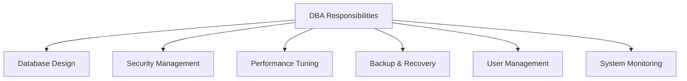
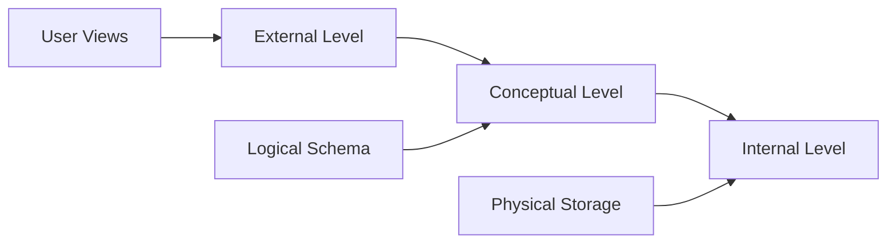
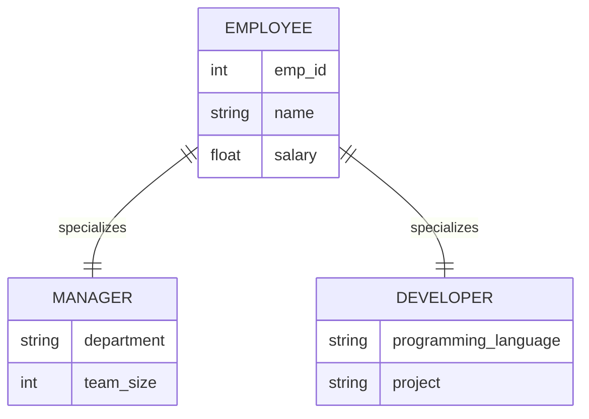
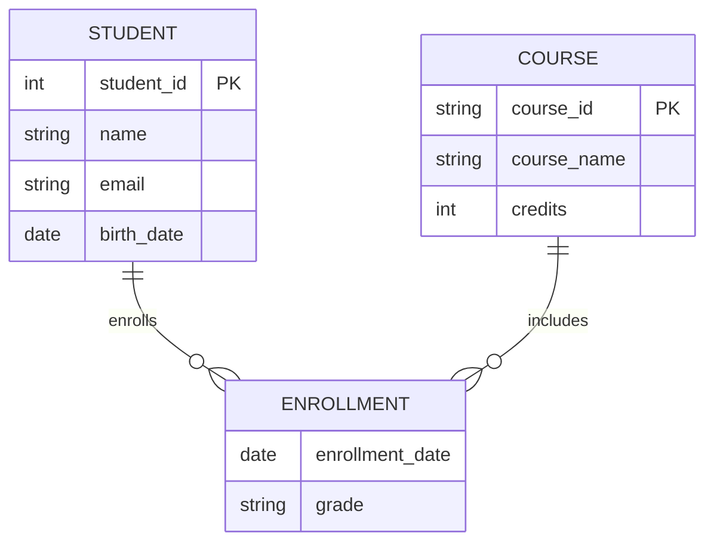
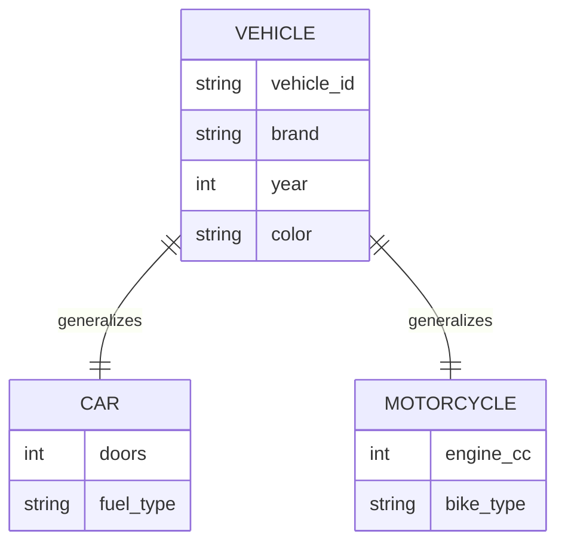
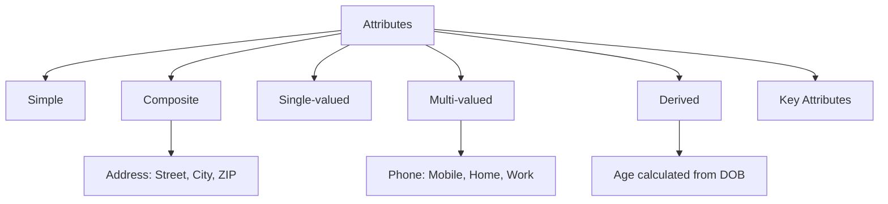
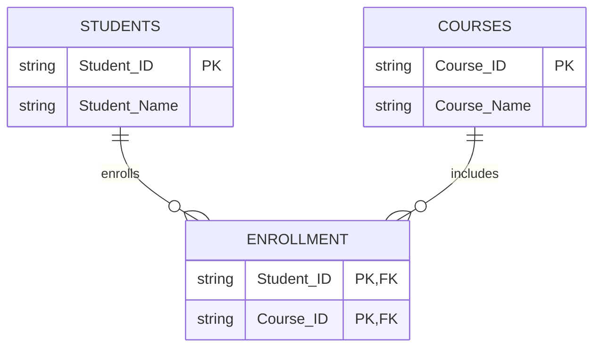
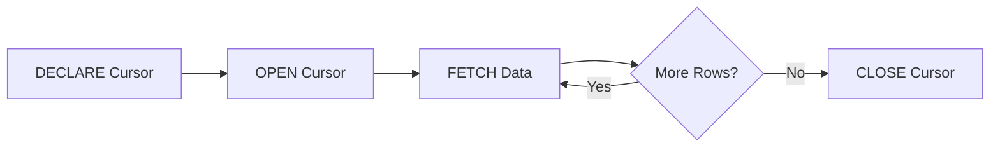

## Question 1(a) [3 marks]

**Define the following terms. 1) Metadata 2) Schema 3) Data dictionary.**

**Answer**:

**Table:**

| Term | Definition |
|------|------------|
| **Metadata** | Data about data that describes structure, format, and characteristics of database |
| **Schema** | Logical structure describing database organization and relationships |
| **Data Dictionary** | Centralized repository storing information about database elements |

- **Metadata**: Information describing data characteristics and properties
- **Schema**: Blueprint defining database structure and constraints
- **Data Dictionary**: Catalog of all database objects and their attributes

**Mnemonic:** "MSD - My System Dictionary"

## Question 1(b) [4 marks]

**Write down advantages of Database Management system.**

**Answer**:

**Table:**

| Advantage | Description |
|-----------|-------------|
| **Data Independence** | Applications independent of data storage |
| **Data Integrity** | Maintains accuracy and consistency |
| **Security Control** | User authentication and authorization |
| **Concurrent Access** | Multiple users access simultaneously |

- **Reduced Redundancy**: Eliminates duplicate data storage
- **Centralized Control**: Single point of data management
- **Data Sharing**: Multiple applications can use same data
- **Backup Recovery**: Automatic data protection mechanisms

**Mnemonic:** "DISC-RCDB - Database Is Super Cool"

## Question 1(c) [7 marks]

**Explain Responsibilities of DBA.**

**Answer**:

**Table:**

| Responsibility | Tasks |
|----------------|-------|
| **Database Design** | Create logical and physical structures |
| **Security Management** | Control user access and permissions |
| **Performance Tuning** | Optimize queries and database operations |
| **Backup Recovery** | Ensure data protection and restoration |
| **User Management** | Create accounts and assign privileges |



- **Database Installation**: Setup and configure DBMS software
- **Data Migration**: Transfer data between systems safely
- **Documentation**: Maintain database schemas and procedures
- **Monitoring**: Track system performance and resource usage
- **Troubleshooting**: Resolve database issues and errors

**Mnemonic:** "DSPBU-DMT - DBA Solves Problems By Understanding Database Management Tasks"

## Question 1(c OR) [7 marks]

**What is data abstraction? Explain three level ANSI SPARC architecture in detail.**

**Answer**:

**Data Abstraction**: Hiding complex database implementation details from users while providing simplified interfaces.



**Table:**

| Level | Description | Users |
|-------|-------------|-------|
| **External Level** | Individual user views and applications | End Users |
| **Conceptual Level** | Complete logical database structure | Database Designers |
| **Internal Level** | Physical storage and access methods | System Programmers |

- **External Level**: Multiple user views hiding complexity
- **Conceptual Level**: Complete database schema without storage details
- **Internal Level**: Physical file organization and indexing
- **Data Independence**: Changes at one level don't affect others

**Mnemonic:** "ECI - Every Computer Implements"

## Question 2(a) [3 marks]

**Differentiate Schema vs Instance**

**Answer**:

**Table:**

| Aspect | Schema | Instance |
|--------|--------|----------|
| **Definition** | Database structure blueprint | Actual data at specific time |
| **Nature** | Static logical design | Dynamic data content |
| **Changes** | Rarely modified | Frequently updated |

- **Schema**: Describes database organization and constraints
- **Instance**: Snapshot of database content at particular moment
- **Relationship**: Schema defines structure, instance contains data

**Mnemonic:** "SI - Structure vs Information"

## Question 2(b) [4 marks]

**Explain Specialization with example.**

**Answer**:

**Specialization**: Process of creating subclasses from superclass based on specific characteristics.



- **Top-Down Approach**: From general entity to specific entities
- **Inheritance**: Subclasses inherit superclass attributes
- **Disjoint**: Manager and Developer are separate categories
- **Example**: Employee specialized into Manager and Developer

**Mnemonic:** "STID - Specialization Takes Inheritance Down"

## Question 2(c) [7 marks]

**What is ER diagram? Explain different symbols used in E-R diagram with example.**

**Answer**:

**ER Diagram**: Graphical representation showing entities, attributes, and relationships in database design.

**Table:**

| Symbol | Shape | Purpose | Example |
|--------|-------|---------|---------|
| **Entity** | Rectangle | Real-world object | Student, Course |
| **Attribute** | Oval | Entity properties | Name, Age, ID |
| **Relationship** | Diamond | Entity connections | Enrolls, Takes |
| **Primary Key** | Underlined oval | Unique identifier | Student_ID |



- **Entity Sets**: Collection of similar entities with same attributes
- **Weak Entity**: Depends on strong entity for identification
- **Cardinality**: Defines relationship participation (1:1, 1:M, M:N)
- **Participation**: Total (double line) or Partial (single line)

**Mnemonic:** "EARP - Entities And Relationships Program"

## Question 2(a OR) [3 marks]

**Differentiate DA vs DBA.**

**Answer**:

**Table:**

| Aspect | Data Administrator (DA) | Database Administrator (DBA) |
|--------|-------------------------|------------------------------|
| **Focus** | Data policies and standards | Technical database operations |
| **Level** | Strategic planning | Operational implementation |
| **Scope** | Organization-wide data | Specific database systems |

- **DA**: Manages data as organizational resource
- **DBA**: Handles technical database maintenance and performance
- **Collaboration**: DA sets policies, DBA implements them

**Mnemonic:** "DA-DBA: Design Authority - Database Builder Administrator"

## Question 2(b OR) [4 marks]

**Explain Generalization with example.**

**Answer**:

**Generalization**: Bottom-up process combining similar entities into common superclass.



- **Bottom-Up Approach**: From specific entities to general entity
- **Common Attributes**: Shared properties moved to superclass
- **Specialization Reverse**: Opposite of specialization process
- **Example**: Car and Motorcycle generalized into Vehicle

**Mnemonic:** "GBCS - Generalization Brings Common Superclass"

## Question 2(c OR) [7 marks]

**What is attribute? Explain different types of attributes with example.**

**Answer**:

**Attribute**: Property or characteristic that describes an entity.

**Table:**

| Attribute Type | Description | Example |
|----------------|-------------|---------|
| **Simple** | Cannot be divided further | Age, Name |
| **Composite** | Can be subdivided | Address (Street, City, ZIP) |
| **Single-valued** | One value per entity | Student_ID |
| **Multi-valued** | Multiple values possible | Phone_numbers |
| **Derived** | Calculated from other attributes | Age from Birth_date |



- **Key Attribute**: Uniquely identifies entity instances
- **Null Values**: Attributes that may have no value
- **Default Values**: Predetermined values when not specified
- **Constraints**: Rules governing attribute values

**Mnemonic:** "SCSMD-K - Simple Composite Single Multi Derived Key"

## Question 3(a) [3 marks]

**Explain the GRANT and REVOKE statement in SQL.**

**Answer**:

**Table:**

| Statement | Purpose | Syntax Example |
|-----------|---------|----------------|
| **GRANT** | Provides privileges to users | GRANT SELECT ON table TO user |
| **REVOKE** | Removes user privileges | REVOKE INSERT ON table FROM user |

```sql
-- Grant privileges
GRANT SELECT, INSERT ON employees TO john;
GRANT ALL PRIVILEGES ON database TO admin;

-- Revoke privileges  
REVOKE DELETE ON employees FROM john;
REVOKE ALL ON database FROM user;
```

- **Privileges**: SELECT, INSERT, UPDATE, DELETE, ALL
- **Objects**: Tables, views, databases, procedures
- **Security**: Controls data access and modification rights

**Mnemonic:** "GR - Grant Rights, Remove Rights"

## Question 3(b) [4 marks]

**Explain following Character functions. 1) INITCAP 2) SUBSTR**

**Answer**:

**Table:**

| Function | Purpose | Syntax | Example |
|----------|---------|---------|---------|
| **INITCAP** | Capitalizes first letter of each word | INITCAP(string) | INITCAP('hello world') = 'Hello World' |
| **SUBSTR** | Extracts substring from string | SUBSTR(string, start, length) | SUBSTR('Database', 1, 4) = 'Data' |

```sql
-- INITCAP examples
SELECT INITCAP('database management') FROM dual; -- Database Management
SELECT INITCAP('gtu university') FROM dual; -- Gtu University

-- SUBSTR examples  
SELECT SUBSTR('Programming', 1, 7) FROM dual; -- Program
SELECT SUBSTR('Database', 5) FROM dual; -- base
```

- **INITCAP**: Converts string to proper case format
- **SUBSTR**: Parameters are string, starting position, optional length
- **Usage**: Text formatting and string manipulation operations

**Mnemonic:** "IS - Initialize String, Split String"

## Question 3(c) [7 marks]

**Consider following tables and write answers for the given queries.**
**stud_master (enroll_no, name, city, dept)**

**Answer**:

```sql
-- 1. Display all student details who study in IT dept
SELECT * FROM stud_master 
WHERE dept = 'IT';

-- 2. Retrieve all information about name where name begins with 'p'
SELECT * FROM stud_master 
WHERE name LIKE 'p%';

-- 3. Insert new student to table
INSERT INTO stud_master (enroll_no, name, city, dept) 
VALUES ('202501', 'John Smith', 'Mumbai', 'CS');

-- 4. Add new column gender to table stud_master
ALTER TABLE stud_master 
ADD gender VARCHAR(10);

-- 5. Count number of rows for stud_master table
SELECT COUNT(*) FROM stud_master;

-- 6. Display all student details in descending order of enroll_no
SELECT * FROM stud_master 
ORDER BY enroll_no DESC;

-- 7. Destroy table stud_master along with data
DROP TABLE stud_master;
```

**Table:**

| Query Type | SQL Command | Purpose |
|------------|-------------|---------|
| **SELECT** | Retrieves data | Display records |
| **INSERT** | Adds new data | Create records |
| **ALTER** | Modifies structure | Add columns |
| **COUNT** | Aggregate function | Count rows |

**Mnemonic:** "SIAC-DOC - SQL Is A Complete Database Operations Collection"

## Question 3(a OR) [3 marks]

**Explain equi join with example in SQL.**

**Answer**:

**Equi Join**: Join operation using equality condition to combine tables based on common columns.

```sql
-- Equi Join example
SELECT s.name, c.course_name
FROM students s, courses c
WHERE s.course_id = c.course_id;

-- Using JOIN syntax
SELECT s.name, c.course_name  
FROM students s
JOIN courses c ON s.course_id = c.course_id;
```

- **Equality Operator**: Uses = to match column values
- **Common Columns**: Tables must have related attributes
- **Result**: Combined data from multiple tables based on matches

**Mnemonic:** "EJ - Equal Join"

## Question 3(b OR) [4 marks]

**Explain following Aggregate functions. 1) MAX 2) SUM**

**Answer**:

**Table:**

| Function | Purpose | Syntax | Example |
|----------|---------|---------|---------|
| **MAX** | Returns maximum value | MAX(column) | MAX(salary) = 50000 |
| **SUM** | Returns total of values | SUM(column) | SUM(marks) = 450 |

```sql
-- MAX examples
SELECT MAX(salary) FROM employees; -- Highest salary
SELECT MAX(age) FROM students; -- Oldest student age

-- SUM examples
SELECT SUM(credits) FROM courses; -- Total credits
SELECT SUM(price * quantity) FROM orders; -- Total order value
```

- **Aggregate Functions**: Operate on multiple rows, return single value
- **NULL Handling**: Ignore NULL values in calculations
- **GROUP BY**: Can be used with grouping for category-wise results

**Mnemonic:** "MS - Maximum Sum"

## Question 3(c OR) [7 marks]

**Write SQL queries for the following table:**
**PRODUCT_Master: (prod_no, prod_name, profit, quantity, sell_price, cost_price)**

**Answer**:

```sql
-- 1. Create table PRODUCT_Master
CREATE TABLE PRODUCT_Master (
    prod_no VARCHAR(10) PRIMARY KEY,
    prod_name VARCHAR(50),
    profit NUMBER(10,2),
    quantity NUMBER,
    sell_price NUMBER(10,2),
    cost_price NUMBER(10,2)
);

-- 2. Insert one record in this table
INSERT INTO PRODUCT_Master VALUES 
('P001', 'Laptop', 15000, 10, 45000, 30000);

-- 3. Find product having profit greater than 20000
SELECT * FROM PRODUCT_Master 
WHERE profit > 20000;

-- 4. Delete product having quantity less than 5
DELETE FROM PRODUCT_Master 
WHERE quantity < 5;

-- 5. Add 2% profit in product having sell price greater than 5000
UPDATE PRODUCT_Master 
SET profit = profit * 1.02 
WHERE sell_price > 5000;

-- 6. Add new field total_price to PRODUCT_Master
ALTER TABLE PRODUCT_Master 
ADD total_price NUMBER(10,2);

-- 7. Find product name having no duplicate data
SELECT DISTINCT prod_name FROM PRODUCT_Master;
```

**Mnemonic:** "CIDFAUD - Create Insert Delete Find Add Update Distinct"

## Question 4(a) [3 marks]

**Explain fully functional dependency with example.**

**Answer**:

**Fully Functional Dependency**: Attribute is fully functionally dependent if it depends on complete primary key, not on partial key.

**Table:**

| Dependency Type | Definition | Example |
|----------------|-------------|---------|
| **Full FD** | Depends on entire key | (Student_ID, Course_ID) → Grade |
| **Partial FD** | Depends on part of key | (Student_ID, Course_ID) → Student_Name |

```
Example: Student_Course(Student_ID, Course_ID, Student_Name, Grade)

Full FD: (Student_ID, Course_ID) → Grade
Partial FD: Student_ID → Student_Name
```

- **Complete Key**: All attributes of composite primary key required
- **Non-key Attribute**: Depends on full primary key combination
- **2NF Requirement**: Eliminates partial dependencies

**Mnemonic:** "FFD - Full Function Dependency"

## Question 4(b) [4 marks]

**Consider following relational schema & give Relational Algebra Expressions:**
**Employee (Emp_name, Emp_id, birth_date, Post, salary)**

**Answer**:

```
(i) List all Employees having Post="Clerk"
σ(Post='Clerk')(Employee)

(ii) Find Emp_id and Emp_name having salary > 2000 and post='Manager'
π(Emp_id, Emp_name)(σ(salary>2000 ∧ Post='Manager')(Employee))
```

**Table:**

| Symbol | Operation | Purpose |
|--------|-----------|---------|
| **σ** | Selection | Filter rows based on condition |
| **π** | Projection | Select specific columns |
| **∧** | AND | Logical conjunction |

- **Selection (σ)**: Chooses rows meeting specified conditions
- **Projection (π)**: Selects required columns from result
- **Combined Operations**: Can use multiple operations together

**Mnemonic:** "SPA - Select Project And"

## Question 4(c) [7 marks]

**What are the criteria of 2NF? Find different functional dependencies and normalize into 2NF.**

**Answer**:

**2NF Criteria**:

- Must be in 1NF
- No partial functional dependencies on primary key

**Given Table**: Student_Course(Student_ID, Course_ID, Student_Name, Course_Name)

**Functional Dependencies**:

```
Student_ID → Student_Name (Partial FD)
Course_ID → Course_Name (Partial FD)
(Student_ID, Course_ID) → (Student_Name, Course_Name) (Full FD)
```

**2NF Normalization**:

```sql
-- Table 1: Students
Students(Student_ID, Student_Name)

-- Table 2: Courses  
Courses(Course_ID, Course_Name)

-- Table 3: Enrollment
Enrollment(Student_ID, Course_ID)
```



**Mnemonic:** "2NF - Two Normal Form removes partial dependencies"

## Question 4(a OR) [3 marks]

**Explain 3NF with example.**

**Answer**:

**3NF (Third Normal Form)**: Table in 2NF with no transitive dependencies on primary key.

**Table:**

| Normal Form | Requirement | Eliminates |
|-------------|-------------|------------|
| **3NF** | In 2NF + No transitive dependencies | Transitive FD |

```
Example: Employee(Emp_ID, Dept_ID, Dept_Name)

Transitive Dependency: Emp_ID → Dept_ID → Dept_Name

3NF Solution:
Employee(Emp_ID, Dept_ID)
Department(Dept_ID, Dept_Name)
```

- **Transitive Dependency**: A → B → C where A is primary key
- **Non-key to Non-key**: Dependency between non-key attributes
- **Decomposition**: Split table to remove transitive dependencies

**Mnemonic:** "3NF - Third Normal Form removes Transitive dependencies"

## Question 4(b OR) [4 marks]

**Consider following Relational Schema and give Relational Algebra Expression:**
**Students (Name, SPI, DOB, Enrollment No)**

**Answer**:

```
(i) List all students whose SPI is greater than 7.0
σ(SPI > 7.0)(Students)

(ii) List name, DOB of student whose enrollment number is 007
π(Name, DOB)(σ(Enrollment_No = '007')(Students))
```

**Table:**

| Query | Relational Algebra | Purpose |
|-------|-------------------|---------|
| **Filter** | σ(condition) | Select rows |
| **Project** | π(attributes) | Select columns |

- **Selection First**: Apply conditions before projection
- **Specific Value**: Use quotes for string literals
- **Column Names**: Exact attribute names required

**Mnemonic:** "SPI-DOB: Select Project Information - Display Output Better"

## Question 4(c OR) [7 marks]

**What are criteria of 1NF? Normalize given table into 1NF with two different techniques.**

**Answer**:

**1NF Criteria**:

- Each cell contains single atomic value
- No repeating groups or arrays
- Each row must be unique

**Given Table**:

| EnrollmentNo | Name | Subjects |
|--------------|------|----------|
| 001 | DEF | Maths,Physics,Chemistry |
| 002 | XYZ | History,Biology,English |

**Technique 1 - Separate Rows**:

| EnrollmentNo | Name | Subject |
|--------------|------|---------|
| 001 | DEF | Maths |
| 001 | DEF | Physics |
| 001 | DEF | Chemistry |
| 002 | XYZ | History |
| 002 | XYZ | Biology |
| 002 | XYZ | English |

**Technique 2 - Separate Tables**:

```sql
-- Students Table
Students(EnrollmentNo, Name)

-- Subjects Table  
Subjects(SubjectID, SubjectName)

-- Student_Subjects Table
Student_Subjects(EnrollmentNo, SubjectID)
```

**Mnemonic:** "1NF - One Normal Form creates Atomic values"

## Question 5(a) [3 marks]

**Explain ACID properties of transaction.**

**Answer**:

**Table:**

| Property | Description | Purpose |
|----------|-------------|---------|
| **Atomicity** | All or nothing execution | Transaction completeness |
| **Consistency** | Database remains valid | Data integrity |
| **Isolation** | Concurrent transactions independent | Avoid interference |
| **Durability** | Committed changes permanent | Data persistence |

- **Atomicity**: Transaction executes completely or not at all
- **Consistency**: Database constraints maintained before/after transaction
- **Isolation**: Transactions don't interfere with each other
- **Durability**: Once committed, changes survive system failures

**Mnemonic:** "ACID - All Consistent Isolated Durable"

## Question 5(b) [4 marks]

**Create following table with specification:**
**STUDENT: (stu_id, stu_name, Address, City, contact_no, Branch_name)**

**Answer**:

```sql
CREATE TABLE STUDENT (
    stu_id VARCHAR(10) PRIMARY KEY,
    stu_name VARCHAR(50) NOT NULL,
    Address VARCHAR(100),
    City VARCHAR(30),
    contact_no NUMBER(10),
    Branch_name VARCHAR(20) CHECK (Branch_name IN ('IT', 'Computer', 'Electrical', 'Civil'))
);
```

**Table:**

| Constraint | Purpose | Implementation |
|------------|---------|----------------|
| **NOT NULL** | Mandatory field | stu_name NOT NULL |
| **CHECK** | Value validation | Branch_name IN (...) |

- **Primary Key**: stu_id uniquely identifies each student
- **NOT NULL**: stu_name cannot be empty
- **CHECK Constraint**: Branch_name limited to specified values
- **Data Types**: Appropriate sizes for each field

**Mnemonic:** "CNPD - Constraints Names Primary Datatypes"

## Question 5(c) [7 marks]

**What is trigger? Write syntax to create trigger in oracle. Create simple trigger.**

**Answer**:

**Trigger**: Special stored procedure that automatically executes in response to database events.

**Oracle Trigger Syntax**:

```sql
CREATE [OR REPLACE] TRIGGER trigger_name
{BEFORE | AFTER | INSTEAD OF} {INSERT | UPDATE | DELETE}
ON table_name
[FOR EACH ROW]
[WHEN condition]
DECLARE
    -- Variable declarations
BEGIN
    -- Trigger logic
END;
```

**Simple Trigger Example**:

```sql
CREATE OR REPLACE TRIGGER display_student_trigger
BEFORE INSERT ON STUDENT
FOR EACH ROW
BEGIN
    DBMS_OUTPUT.PUT_LINE('Inserting student: ' || :NEW.stu_name || 
                        ' with ID: ' || :NEW.stu_id);
END;
```

**Table:**

| Trigger Type | When Executed | Purpose |
|--------------|---------------|---------|
| **BEFORE** | Before DML operation | Validation, modification |
| **AFTER** | After DML operation | Logging, auditing |
| **FOR EACH ROW** | Row-level trigger | Per row execution |

- **:NEW**: References new values being inserted/updated
- **:OLD**: References old values being deleted/updated
- **Automatic Execution**: Fires automatically on specified events
- **Business Logic**: Enforces complex business rules

**Mnemonic:** "TBA-FEN - Triggers Before After For Each New"

## Question 5(a OR) [3 marks]

**Explain problems of concurrency control in transaction.**

**Answer**:

**Table:**

| Problem | Description | Example |
|---------|-------------|---------|
| **Lost Update** | One transaction overwrites another's changes | T1, T2 update same record |
| **Dirty Read** | Reading uncommitted data | T1 reads T2's uncommitted changes |
| **Unrepeatable Read** | Same query returns different results | T1 reads, T2 updates, T1 reads again |

- **Phantom Read**: New rows appear between queries in same transaction
- **Deadlock**: Two transactions wait for each other's locks
- **Inconsistent Analysis**: Reading data while it's being modified

**Mnemonic:** "LDU-PID - Lost Dirty Unrepeatable Phantom Inconsistent Deadlock"

## Question 5(b OR) [4 marks]

**Create following table with specification:**
**STUDENT: (stu_id, stu_name, Address, City, contact_no, Branch_name)**

**Answer**:

```sql
CREATE TABLE STUDENT (
    stu_id VARCHAR(10) PRIMARY KEY CHECK (stu_id LIKE 'S%'),
    stu_name VARCHAR(50),
    Address VARCHAR(100),
    City VARCHAR(30),
    contact_no NUMBER(10),
    Branch_name VARCHAR(20)
);
```

**Table:**

| Constraint | Implementation | Purpose |
|------------|----------------|---------|
| **PRIMARY KEY** | stu_id PRIMARY KEY | Unique identification |
| **CHECK** | stu_id LIKE 'S%' | Must start with 'S' |

- **Primary Key**: stu_id serves as unique identifier
- **Pattern Check**: stu_id must begin with letter 'S'
- **Data Types**: Appropriate field sizes and types
- **Constraint Validation**: Database enforces rules automatically

**Mnemonic:** "PKC-ST - Primary Key Check Starts"

## Question 5(c OR) [7 marks]

**What is Explicit cursor? Explain explicit cursor with simple example.**

**Answer**:

**Explicit Cursor**: User-defined cursor for handling SELECT statements that return multiple rows with programmatic control.

**Cursor Operations**:

```sql
-- Declaration
DECLARE
    CURSOR student_cursor IS
        SELECT stu_id, stu_name FROM STUDENT WHERE city = 'Ahmedabad';
    v_id STUDENT.stu_id%TYPE;
    v_name STUDENT.stu_name%TYPE;
BEGIN
    -- Open cursor
    OPEN student_cursor;
    
    -- Fetch data
    LOOP
        FETCH student_cursor INTO v_id, v_name;
        EXIT WHEN student_cursor%NOTFOUND;
        
        DBMS_OUTPUT.PUT_LINE('ID: ' || v_id || ', Name: ' || v_name);
    END LOOP;
    
    -- Close cursor
    CLOSE student_cursor;
END;
```

**Table:**

| Operation | Purpose | Syntax |
|-----------|---------|---------|
| **DECLARE** | Define cursor | CURSOR name IS SELECT... |
| **OPEN** | Initialize cursor | OPEN cursor_name |
| **FETCH** | Retrieve data | FETCH cursor INTO variables |
| **CLOSE** | Release resources | CLOSE cursor_name |



- **Manual Control**: Programmer controls cursor operations
- **Memory Management**: Must explicitly open and close
- **Loop Processing**: Typically used with loops for multiple rows
- **Cursor Attributes**: %FOUND, %NOTFOUND, %ROWCOUNT

**Mnemonic:** "DOFC - Declare Open Fetch Close"
