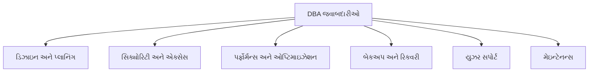
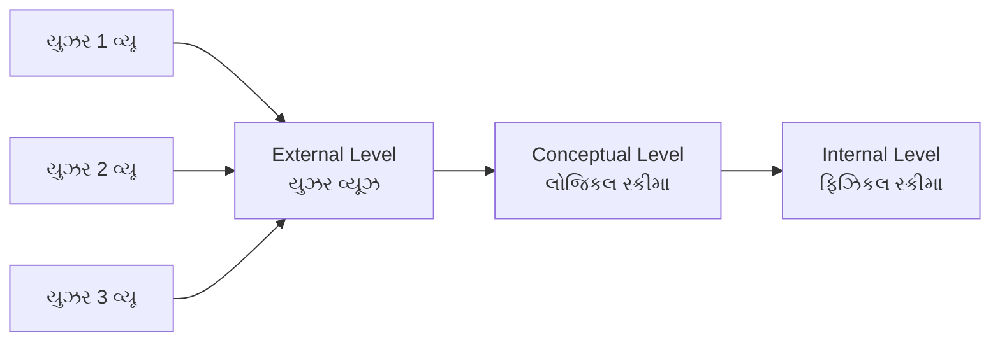
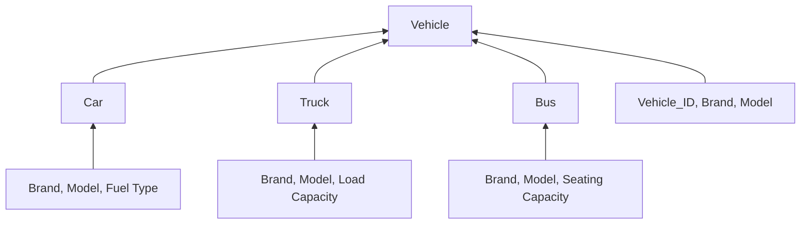
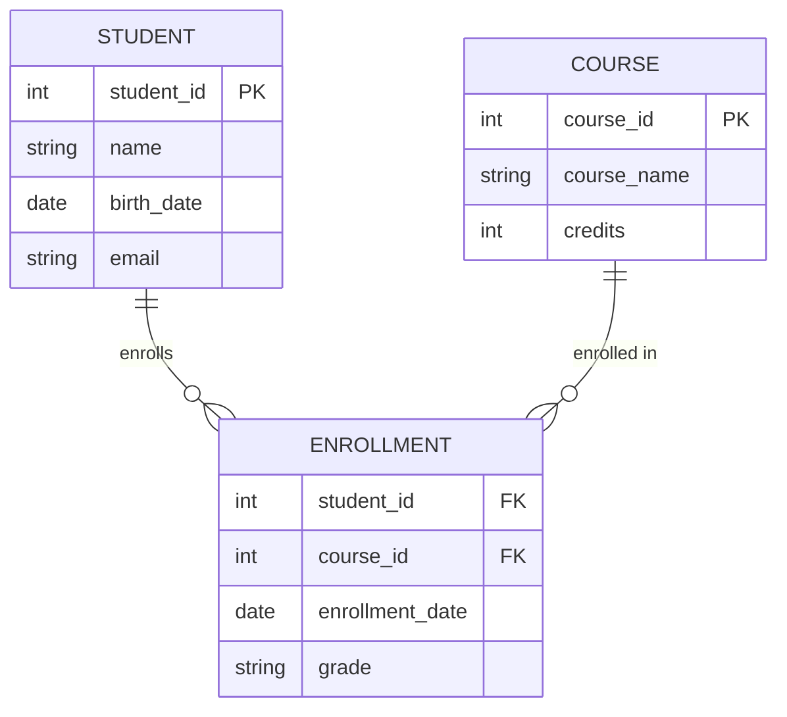
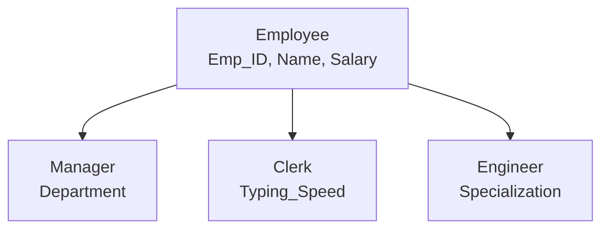
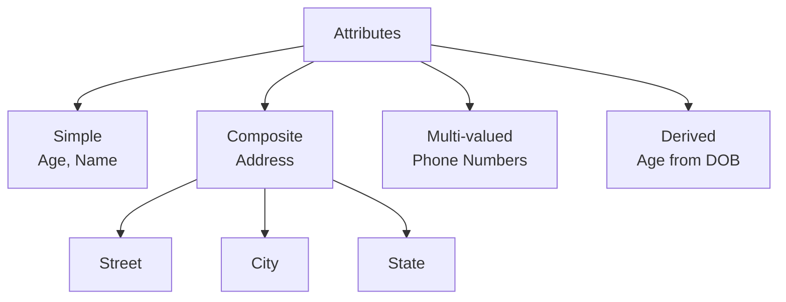
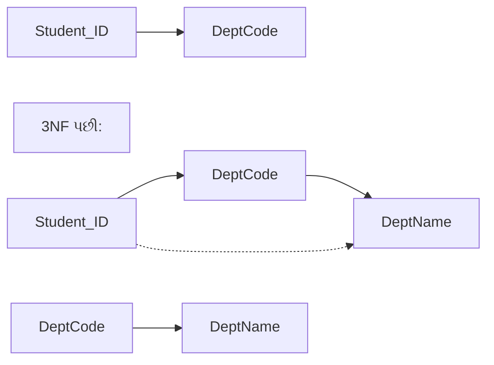
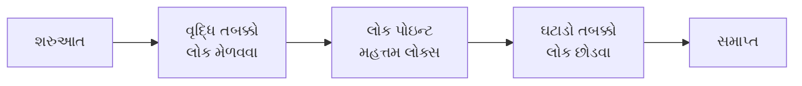

## પ્રશ્ન 1(a) [3 ગુણ]

**નીચેના શબ્દો વ્યાખ્યાયિત કરો: a). Data items b). Data dictionary c).Meta data**

**જવાબ**:

| શબ્દ | વ્યાખ્યા |
|------|------------|
| **Data Items** | ડેટાના મૂળભૂત એકમો જે વધુ વિભાજન કરી શકાતા નથી. ડેટાબેઝ ફીલ્ડ્સમાં સંગ્રહિત વ્યક્તિગત તથ્યો અથવા મૂલ્યો |
| **Data Dictionary** | ડેટાબેઝ સ્ટ્રક્ચર, ટેબલ્સ, કોલમ્સ અને સંબંધો વિશે મેટાડેટા ધરાવતો કેન્દ્રીય ભંડાર |
| **Metadata** | ડેટા વિશેનો ડેટા જે ડેટાબેઝ એલિમેન્ટ્સની રચના, અવરોધો અને ગુણધર્મોનું વર્ણન કરે છે |

**મેમરી ટ્રીક:** "DDM - Data Dictionary Manages"

---

## પ્રશ્ન 1(b) [4 ગુણ]

**ફાઇલ ઓરિએન્ટેડ સિસ્ટમના ગેરફાયદા સમજાવો.**

**જવાબ**:

| ગેરફાયદો | વિવરણ |
|--------------|-------------|
| **ડેટા રીડન્ડન્સી** | બહુવિધ ફાઇલોમાં સમાન ડેટાનો સંગ્રહ, જે સ્ટોરેજનો બગાડ કરે છે |
| **ડેટા અસંગતતા** | વિવિધ ફાઇલોમાં સમાન ડેટાના વિવિધ વર્ઝન |
| **ડેટા આઇસોલેશન** | બહુવિધ ફાઇલોમાં વિખરાયેલા ડેટાને એક્સેસ કરવામાં મુશ્કેલી |
| **સિક્યોરિટી સમસ્યાઓ** | મર્યાદિત એક્સેસ કંટ્રોલ અને સુરક્ષા મિકેનિઝમ |

**મેમરી ટ્રીક:** "RDIS - Really Difficult Information System"

---

## પ્રશ્ન 1(c) [7 ગુણ]

**DBA ની જવાબદારીઓનું વિગતવાર વર્ણન કરો.**

**જવાબ**:

| જવાબદારી | વિગતો |
|----------------|---------|
| **ડેટાબેઝ ડિઝાઇન** | લોજિકલ અને ફિઝિકલ ડેટાબેઝ સ્ટ્રક્ચર બનાવવું |
| **સિક્યોરિટી મેનેજમેન્ટ** | યુઝર એક્સેસ કંટ્રોલ અને ડેટા પ્રોટેક્શન લાગુ કરવું |
| **પર્ફોર્મન્સ મોનિટરિંગ** | ડેટાબેઝ પર્ફોર્મન્સ અને ક્વેરી એક્ઝિક્યુશન ઓપ્ટિમાઇઝ કરવું |
| **બેકઅપ અને રિકવરી** | નિયમિત બેકઅપ દ્વારા ડેટા સેફ્ટી સુનિશ્ચિત કરવી |
| **યુઝર સપોર્ટ** | ડેટાબેઝ યુઝર્સને ટેકનિકલ સહાય પૂરી પાડવી |
| **સિસ્ટમ મેઇન્ટેનન્સ** | નિયમિત અપડેટ્સ, પેચેસ અને સિસ્ટમ ઓપ્ટિમાઇઝેશન |



**મેમરી ટ્રીક:** "DSPBUM - Database Specialists Provide Better User Management"

---

## પ્રશ્ન 1(c OR) [7 ગુણ]

**Data abstraction ની વ્યાખ્યા આપો? DBMS નું ત્રિ સ્તરનું આર્કિટેક્ચર સમજાવો.**

**જવાબ**:

**Data Abstraction**: યુઝર્સને માત્ર આવશ્યક ફીચર્સ દર્શાવતી વખતે જટિલ implementation વિગતો છુપાવવાની પ્રક્રિયા.

| સ્તર | વિવરણ | હેતુ |
|-------|-------------|---------|
| **External Level** | ડેટાબેઝનો યુઝર વ્યૂ | વ્યક્તિગત યુઝર પરસ્પેક્ટિવ્સ |
| **Conceptual Level** | સંપૂર્ણ ડેટાબેઝની લોજિકલ સ્ટ્રક્ચર | એકંદર ડેટાબેઝ ઓર્ગેનાઇઝેશન |
| **Internal Level** | ફિઝિકલ સ્ટોરેજ વિગતો | ડેટા ખરેખર કેવી રીતે સ્ટોર થાય છે |



**મેમરી ટ્રીક:** "ECI - Every Computer Industry"

---

## પ્રશ્ન 2(a) [3 ગુણ]

**નીચેના શબ્દો વ્યાખ્યાયિત કરો: a).Relationship set b).Participation c).Candidate key**

**જવાબ**:

| શબ્દ | વ્યાખ્યા |
|------|------------|
| **Relationship Set** | એન્ટિટી સેટ્સ વચ્ચે સમાન પ્રકારના સંબંધોનો સંગ્રહ |
| **Participation** | અવરોધ જે સ્પષ્ટ કરે છે કે એન્ટિટી ઓકરન્સ સંબંધમાં ફરજિયાત છે કે નહીં |
| **Candidate Key** | એટ્રિબ્યુટ્સનો ન્યૂનતમ સેટ જે એન્ટિટી સેટમાં દરેક એન્ટિટીને અનન્ય રીતે ઓળખે છે |

**મેમરી ટ્રીક:** "RPC - Relationship Participation Candidate"

---

## પ્રશ્ન 2(b) [4 ગુણ]

**Generalization ઉદાહરણ સાથે સમજાવો.**

**જવાબ**:

**Generalization**: બોટમ-અપ અપ્રોચ જ્યાં નીચલા-સ્તરની એન્ટિટીઝના સામાન્ય એટ્રિબ્યુટ્સને ઉચ્ચ-સ્તરની એન્ટિટીમાં જોડવામાં આવે છે.

| ખ્યાલ | વિવરણ |
|---------|-------------|
| **હેતુ** | સામાન્ય સુપરક્લાસ બનાવીને રીડન્ડન્સી ઘટાડવી |
| **દિશા** | બોટમ-અપ (વિશિષ્ટથી સામાન્ય) |
| **ઉદાહરણ** | Car, Truck, Bus → Vehicle |



**મેમરી ટ્રીક:** "GBU - Generalization Builds Up"

---

## પ્રશ્ન 2(c) [7 ગુણ]

**E-R Diagram ની વ્યાખ્યા આપો? E-R ડાયાગ્રામમાં વપરાતા વિવિધ Symbols ને ઉદાહરણ સાથે સમજાવો.**

**જવાબ**:

**E-R Diagram**: ડેટાબેઝ ડિઝાઇનમાં એન્ટિટીઝ, એટ્રિબ્યુટ્સ અને સંબંધો દર્શાવતું ગ્રાફિકલ પ્રતિનિધિત્વ.

| સિમ્બોલ | આકાર | ઉપયોગ | ઉદાહરણ |
|--------|-------|-------|---------|
| **Entity** | લંબચોરસ | ઓબ્જેક્ટ્સનું પ્રતિનિધિત્વ | Student, Course |
| **Attribute** | અંડાકાર | એન્ટિટીઝના ગુણધર્મો | Name, Age, ID |
| **Relationship** | હીરા | એન્ટિટીઝ વચ્ચેના જોડાણો | Enrolls, Teaches |
| **Primary Key** | અન્ડરલાઇન્ડ અંડાકાર | અનન્ય ઓળખકર્તા | Student_ID |
| **Multivalued** | ડબલ અંડાકાર | બહુવિધ મૂલ્યો | Phone_Numbers |
| **Derived** | ડેશ્ડ અંડાકાર | ગણતરી કરેલા એટ્રિબ્યુટ્સ | Age from DOB |



**મેમરી ટ્રીક:** "EARPM - Every Attribute Represents Proper Meaning"

---

## પ્રશ્ન 2(a OR) [3 ગુણ]

**Relational Algebra ની વ્યાખ્યા આપો? Relational Algebra માં વિવિધ કામગીરીની યાદી આપો?**

**જવાબ**:

**Relational Algebra**: રિલેશનલ ડેટાબેઝ ટેબલ્સને મેનિપ્યુલેટ કરવા માટેની ઓપરેશન્સ સાથે ફોર્મલ ક્વેરી લેંગ્વેજ.

| ઓપરેશન પ્રકાર | ઓપરેશન્સ |
|----------------|------------|
| **મૂળભૂત ઓપરેશન્સ** | Select, Project, Union, Set Difference, Cartesian Product |
| **વધારાની ઓપરેશન્સ** | Intersection, Join, Division, Rename |

**મેમરી ટ્રીક:** "SPUDC-IJDR - Simple People Use Database Concepts"

---

## પ્રશ્ન 2(b OR) [4 ગુણ]

**Specialization ઉદાહરણ સાથે સમજાવો.**

**જવાબ**:

**Specialization**: ટોપ-ડાઉન અપ્રોચ જ્યાં ઉચ્ચ-સ્તરની એન્ટિટીને વિશિષ્ટ નીચલા-સ્તરની એન્ટિટીઝમાં વિભાજિત કરવામાં આવે છે.

| ખ્યાલ | વિવરણ |
|---------|-------------|
| **હેતુ** | અનન્ય એટ્રિબ્યુટ્સ સાથે વિશિષ્ટ સબક્લાસીસ બનાવવી |
| **દિશા** | ટોપ-ડાઉન (સામાન્યથી વિશિષ્ટ) |
| **ઉદાહરણ** | Employee → Manager, Clerk, Engineer |



**મેમરી ટ્રીક:** "STD - Specialization Top Down"

---

## પ્રશ્ન 2(c OR) [7 ગુણ]

**Attribute ની વ્યાખ્યા આપો? વિવિધ પ્રકારના Attribute ને ઉદાહરણ સાથે સમજાવો.**

**જવાબ**:

**Attribute**: એન્ટિટીનું વર્ણન કરતી મિલકત અથવા લાક્ષણિકતા.

| એટ્રિબ્યુટ પ્રકાર | વિવરણ | ઉદાહરણ |
|----------------|-------------|---------|
| **Simple** | વધુ વિભાજન કરી શકાતું નથી | Age, Name |
| **Composite** | ઉપવિભાગ કરી શકાય છે | Address (Street, City, State) |
| **Single-valued** | એક મૂલ્ય ધરાવે છે | SSN, Employee_ID |
| **Multi-valued** | બહુવિધ મૂલ્યો હોઈ શકે છે | Phone_Numbers, Skills |
| **Derived** | અન્ય એટ્રિબ્યુટ્સથી ગણતરી કરેલ | Age from Birth_Date |
| **Key** | એન્ટિટીને અનન્ય રીતે ઓળખે છે | Student_ID |



**મેમરી ટ્રીક:** "SCSMDK - Simple Composite Single Multi Derived Key"

---

## પ્રશ્ન 3(a) [3 ગુણ]

**SQL માં GRANT અને REVOKE સ્ટેટમેન્ટ સમજાવો.**

**જવાબ**:

| સ્ટેટમેન્ટ | હેતુ | સિન્ટેક્સ ઉદાહરણ |
|-----------|---------|----------------|
| **GRANT** | યુઝર્સને વિશેષાધિકારો પ્રદાન કરે છે | `GRANT SELECT ON table TO user` |
| **REVOKE** | યુઝર્સ પાસેથી વિશેષાધિકારો દૂર કરે છે | `REVOKE SELECT ON table FROM user` |

**સામાન્ય વિશેષાધિકારો**: SELECT, INSERT, UPDATE, DELETE, ALL

**મેમરી ટ્રીક:** "GR - Grant Removes (via REVOKE)"

---

## પ્રશ્ન 3(b) [4 ગુણ]

**નીચેના Character function સમજાવો .1) INSTR 2) LENGTH**

**જવાબ**:

| ફંક્શન | હેતુ | સિન્ટેક્સ | ઉદાહરણ |
|----------|---------|--------|---------|
| **INSTR** | સબસ્ટ્રિંગની સ્થિતિ શોધે છે | `INSTR(string, substring)` | `INSTR('Hello', 'e')` 2 રિટર્ન કરે છે |
| **LENGTH** | સ્ટ્રિંગની લંબાઈ રિટર્ન કરે છે | `LENGTH(string)` | `LENGTH('Hello')` 5 રિટર્ન કરે છે |

**મેમરી ટ્રીક:** "IL - INSTR Locates, LENGTH measures"

---

## પ્રશ્ન 3(c) [7 ગુણ]

**નીચેના Table માટે SQL સ્ટેટમેન્ટ લખો: Student(Enno,name,branch,sem,clgname,bdate)**

**જવાબ**:

```sql
-- 1. Create a table Student
CREATE TABLE Student (
    Enno VARCHAR(10) PRIMARY KEY,
    name VARCHAR(50),
    branch VARCHAR(20),
    sem INT,
    clgname VARCHAR(100),
    bdate DATE
);

-- 2. Add a column mobno in Student table
ALTER TABLE Student ADD mobno VARCHAR(15);

-- 3. Insert one record in student table
INSERT INTO Student VALUES 
('E001', 'Raj Patel', 'IT', 3, 'GTU College', '2003-05-15', '9876543210');

-- 4. Find out list of students who have enrolled in "IT" branch
SELECT * FROM Student WHERE branch = 'IT';

-- 5. Retrieve all information about student where name begin with 'a'
SELECT * FROM Student WHERE name LIKE 'a%';

-- 6. Count the number of rows in student table
SELECT COUNT(*) FROM Student;

-- 7. Delete all record of student table
DELETE FROM Student;
```

**મેમરી ટ્રીક:** "CAIRSCD - Create Add Insert Retrieve Search Count Delete"

---

## પ્રશ્ન 3(a OR) [3 ગુણ]

**SQL માં equi join ઉદાહરણ સાથે સમજાવો.**

**જવાબ**:

**Equi Join**: ટેબલ્સને જોડવા માટે સમતા શરતનો ઉપયોગ કરતી જોઇન ઓપરેશન.

| જોઇન પ્રકાર | શરત | પરિણામ |
|-----------|-----------|--------|
| **Equi Join** | Column1 = Column2 | બંને ટેબલ્સમાંથી મેચિંગ રો |

```sql
-- ઉદાહરણ
SELECT s.name, c.course_name 
FROM Student s, Course c 
WHERE s.course_id = c.course_id;
```

**મેમરી ટ્રીક:** "EE - Equi Equals"

---

## પ્રશ્ન 3(b OR) [4 ગુણ]

**નીચેના Aggregate function સમજાવો .1) MAX 2) SUM**

**જવાબ**:

| ફંક્શન | હેતુ | સિન્ટેક્સ | ઉદાહરણ |
|----------|---------|--------|---------|
| **MAX** | મહત્તમ મૂલ્ય રિટર્ન કરે છે | `MAX(column)` | `MAX(salary)` |
| **SUM** | કુલ સરવાળો રિટર્ન કરે છે | `SUM(column)` | `SUM(marks)` |

**મેમરી ટ્રીક:** "MS - MAX Sum"

---

## પ્રશ્ન 3(c OR) [7 ગુણ]

**નીચેના Table માટે SQL સ્ટેટમેન્ટ લખો: Employee(EmpID,Ename,DOB,Dept,Salary)**

**જવાબ**:

```sql
-- 1. Create a table Employee
CREATE TABLE Employee (
    EmpID VARCHAR(10) PRIMARY KEY,
    Ename VARCHAR(50),
    DOB DATE,
    Dept VARCHAR(30),
    Salary DECIMAL(10,2)
);

-- 2. Find sum of salaries of all employee
SELECT SUM(Salary) FROM Employee;

-- 3. Insert one record in Employee table
INSERT INTO Employee VALUES 
('E001', 'John Doe', '1990-05-15', 'IT', 35000);

-- 4. Find names of employees who salary between 25000/- and 48000/-
SELECT Ename FROM Employee WHERE Salary BETWEEN 25000 AND 48000;

-- 5. Display detail of all employees in descending order of their DOB
SELECT * FROM Employee ORDER BY DOB DESC;

-- 6. List name of all employees whose name ends with 'a'
SELECT Ename FROM Employee WHERE Ename LIKE '%a';

-- 7. Find highest and least salaries of all employees
SELECT MAX(Salary) AS Highest, MIN(Salary) AS Lowest FROM Employee;
```

**મેમરી ટ્રીક:** "CSIDDHL - Create Sum Insert Display Display List HighLow"

---

## પ્રશ્ન 4(a) [3 ગુણ]

**નીચે દર્શાવેલ રિલેશનલ સ્કીમાનું ધ્યાન માં લઇ દરેક ક્વેરી માટે રિલેશનલ એલજીબ્રા એક્સપ્રેશન લખો.**

**જવાબ**:

```
Student (Enrollment_No,Name,DOB,SPI)

i. σ(SPI > 7.0)(Student)
ii. π(Name)(σ(Enrollment_No = 007)(Student))
```

**મેમરી ટ્રીક:** "SP - Select Project"

---

## પ્રશ્ન 4(b) [4 ગુણ]

**Partial functional dependency ની ટૂંકી નોંધ લખો.**

**જવાબ**:

| ખ્યાલ | વિવરણ |
|---------|-------------|
| **વ્યાખ્યા** | Non-prime એટ્રિબ્યુટ કમ્પોઝિટ પ્રાઇમરી કીના ભાગ પર આધાર રાખે છે |
| **ક્યાં જોવા મળે** | કમ્પોઝિટ પ્રાઇમરી કી વાળા ટેબલ્સમાં |
| **સમસ્યા** | રીડન્ડન્સી અને અપડેટ એનોમેલીઝ કારણભૂત |
| **સોલ્યુશન** | 2NF માં ડીકમ્પોઝ કરવું |

**ઉદાહરણ**: Table(StudentID, CourseID, StudentName, CourseName) માં, StudentName માત્ર StudentID પર આધાર રાખે છે (કીનો ભાગ).

**મેમરી ટ્રીક:** "PDPR - Partial Dependency Problems Resolved"

---

## પ્રશ્ન 4(c) [7 ગુણ]

**Normalization ની જરૂરિયાત સમજાવો? ઉદાહરણ સાથે 2NF વિશે ચર્ચા કરો.**

**જવાબ**:

**Normalization ની જરૂરિયાત**:

| સમસ્યા | Normalization દ્વારા સોલ્યુશન |
|---------|-------------------------------|
| **ડેટા રીડન્ડન્સી** | ડુપ્લિકેટ ડેટા દૂર કરે છે |
| **અપડેટ એનોમેલીઝ** | અસંગત અપડેટ્સ અટકાવે છે |
| **ઇન્સર્ટ એનોમેલીઝ** | સ્વતંત્ર ડેટા ઇન્સર્શનની મંજૂરી આપે છે |
| **ડિલીટ એનોમેલીઝ** | મહત્વપૂર્ણ ડેટાની હાનિ અટકાવે છે |

**Second Normal Form (2NF)**:

- 1NF માં હોવું જોઈએ
- કોઈ આંશિક કાર્યાત્મક નિર્ભરતા નહીં

**ઉદાહરણ**:

```
2NF પહેલાં:
StudentCourse(StudentID, CourseID, StudentName, CourseName)

2NF પછી:
Student(StudentID, StudentName)
Course(CourseID, CourseName)
Enrollment(StudentID, CourseID)
```

**મેમરી ટ્રીક:** "NUID2 - Normalization Unifies Important Data to 2NF"

---

## પ્રશ્ન 4(a OR) [3 ગુણ]

**નીચે દર્શાવેલ રિલેશનલ સ્કીમાનું ધ્યાન માં લઇ દરેક ક્વેરી માટે રિલેશનલ એલજીબ્રા એક્સપ્રેશન લખો.**

**જવાબ**:

```
Student(Enno,name,age,address)

i. π(name)(σ(address = 'Surat')(Student))
ii. π(name)(σ(age > 30)(Student))
```

---

## પ્રશ્ન 4(b OR) [4 ગુણ]

**1NF ની વ્યાખ્યા આપો? યોગ્ય ઉદાહરણ સાથે 1NF સમજાવો.**

**જવાબ**:

**First Normal Form (1NF)**: દરેક કૉલમ એટોમિક (અવિભાજ્ય) મૂલ્યો ધરાવે છે, અને દરેક કૉલમ એક જ પ્રકારના મૂલ્યો ધરાવે છે.

| નિયમ | વિવરણ |
|------|-------------|
| **એટોમિક મૂલ્યો** | એક સેલમાં બહુવિધ મૂલ્યો નહીં |
| **રિપીટિંગ ગ્રુપ્સ નહીં** | ડુપ્લિકેટ કૉલમ્સ નહીં |
| **અનન્ય રો** | દરેક રો અનન્ય હોવી જોઈએ |

**ઉદાહરણ**:

```
1NF પહેલાં:
Student(ID, Name, Subjects)
1, John, Math,Science,English

1NF પછી:
Student(ID, Name, Subject)
1, John, Math
1, John, Science  
1, John, English
```

**મેમરી ટ્રીક:** "ANU - Atomic No-repeat Unique"

---

## પ્રશ્ન 4(c OR) [7 ગુણ]

**Transitive Dependency ની વ્યાખ્યા આપો? યોગ્ય ઉદાહરણ સાથે 3NF સમજાવો.**

**જવાબ**:

**Transitive Dependency**: Non-prime એટ્રિબ્યુટ પ્રાઇમરી કી પર સીધો આધાર ન રાખીને બીજા non-prime એટ્રિબ્યુટ પર આધાર રાખે છે.

**Third Normal Form (3NF)**:

- 2NF માં હોવું જોઈએ
- કોઈ ટ્રાન્ઝિટિવ નિર્ભરતા નહીં

| 3NF પહેલાં | 3NF પછી |
|------------|-----------|
| Student(ID, Name, DeptCode, DeptName) | Student(ID, Name, DeptCode) |
| DeptName, DeptCode પર આધાર રાખે છે | Department(DeptCode, DeptName) |



**મેમરી ટ્રીક:** "T3ND - Transitive Third Normal Form No Dependencies"

---

## પ્રશ્ન 5(a) [3 ગુણ]

**Serializability ની વ્યાખ્યા આપો? Serializability ના નિયમો સમજાવો?**

**જવાબ**:

**Serializability**: સમાંતર ટ્રાન્ઝેક્શન એક્ઝિક્યુશન સીરિયલ એક્ઝિક્યુશનના સમાન પરિણામ આપે તેની ખાતરી કરતી મિલકત.

| નિયમ | વિવરણ |
|------|-------------|
| **Conflict Serializability** | વિવિધ ક્રમમાં કોઈ સંઘર્ષકારી ઓપરેશન્સ નહીં |
| **View Serializability** | સીરિયલ શેડ્યૂલ જેવા જ રીડ-રાઇટ પેટર્ન |

**મેમરી ટ્રીક:** "SCV - Serial Conflict View"

---

## પ્રશ્ન 5(b) [4 ગુણ]

**Implicit Cursors ના Attribute સમજાવો.**

**જવાબ**:

| એટ્રિબ્યુટ | વિવરણ |
|-----------|-------------|
| **%FOUND** | TRUE જો છેલ્લા SQL એ ઓછામાં ઓછી એક રો પર અસર કરી |
| **%NOTFOUND** | TRUE જો છેલ્લા SQL એ કોઈ રો પર અસર ન કરી |
| **%ROWCOUNT** | છેલ્લા SQL દ્વારા પ્રભાવિત રોની સંખ્યા |
| **%ISOPEN** | ઇમ્પ્લિસિટ કર્સર્સ માટે હંમેશા FALSE |

**મેમરી ટ્રીક:** "FNRI - Found NotFound RowCount IsOpen"

---

## પ્રશ્ન 5(c) [7 ગુણ]

**Two phase locking protocol ને યોગ્ય ઉદાહરણ સાથે સમજાવો.**

**જવાબ**:

**Two Phase Locking (2PL)**: બે તબક્કા દ્વારા serializability સુનિશ્ચિત કરતો પ્રોટોકોલ.

| તબક્કો | વિવરણ | નિયમો |
|-------|-------------|-------|
| **વૃદ્ધિ તબક્કો** | માત્ર લોક મેળવવા | લોક મેળવી શકે છે, છોડી શકતા નથી |
| **ઘટાડો તબક્કો** | માત્ર લોક છોડવા | લોક છોડી શકે છે, મેળવી શકતા નથી |

**ઉદાહરણ**:

```
Transaction T1:
1. Lock(A) - વૃદ્ધિ
2. Lock(B) - વૃદ્ધિ  
3. Read(A), Write(A)
4. Unlock(A) - ઘટાડો
5. Read(B), Write(B)
6. Unlock(B) - ઘટાડો
```



**મેમરી ટ્રીક:** "2PGS - Two Phase Growing Shrinking"

---

## પ્રશ્ન 5(a OR) [3 ગુણ]

**ટ્રાન્ઝેક્શનની ACID પ્રોપર્ટીસ સમજાવો.**

**જવાબ**:

| પ્રોપર્ટી | વિવરણ |
|----------|-------------|
| **Atomicity** | ટ્રાન્ઝેક્શન all-or-nothing છે |
| **Consistency** | ડેટાબેઝ વેલિડ સ્ટેટમાં રહે છે |
| **Isolation** | સમાંતર ટ્રાન્ઝેક્શન્સ દખલ કરતા નથી |
| **Durability** | કમિટ થયેલા ફેરફારો કાયમી છે |

**મેમરી ટ્રીક:** "ACID - All Changes In Database"

---

## પ્રશ્ન 5(b OR) [4 ગુણ]

**Triggers ની વ્યાખ્યા આપો? ટ્રિગર્સના ફાયદા સમજાવો.**

**જવાબ**:

**Triggers**: ડેટાબેઝ ઇવેન્ટ્સના જવાબમાં આપોઆપ એક્ઝિક્યુટ થતી વિશેષ સ્ટોર્ડ પ્રોસીજર્સ.

| ફાયદો | વિવરણ |
|-----------|-------------|
| **આપોઆપ એક્ઝિક્યુશન** | સ્પષ્ટ કૉલ વિના ચાલે છે |
| **ડેટા ઇન્ટેગ્રિટી** | બિઝનેસ રૂલ્સ લાગુ કરે છે |
| **ઓડિટિંગ** | ડેટાબેઝ ફેરફારોને ટ્રેક કરે છે |
| **સિક્યોરિટી** | ડેટા એક્સેસ કંટ્રોલ કરે છે |

**મેમરી ટ્રીક:** "ADAS - Automatic Data Auditing Security"

---

## પ્રશ્ન 5(c OR) [7 ગુણ]

**Problems of concurrency control ની યાદી બનાવો. કોઈપણ બેના યોગ્ય ઉદાહરણ સાથે સમજાવો.**

**જવાબ**:

**Concurrency Control ની સમસ્યાઓ**:

| સમસ્યા | વિવરણ |
|---------|-------------|
| **Lost Update** | એક ટ્રાન્ઝેક્શનનું અપડેટ બીજાના દ્વારા ઓવરરાઇટ થાય છે |
| **Dirty Read** | અનકમિટેડ ડેટા વાંચવો |
| **Non-repeatable Read** | સમાન ટ્રાન્ઝેક્શનમાં વિવિધ મૂલ્યો વાંચવા |
| **Phantom Read** | રીડ્સ વચ્ચે નવી રો દેખાય છે |

**ઉદાહરણ 1 - Lost Update**:

```
T1: Read(A=100)
T2: Read(A=100)  
T1: A = A + 50 (A=150)
T2: A = A + 30 (A=130) <- T1 નું અપડેટ ગુમ
T1: Write(A=150)
T2: Write(A=130) <- અંતિમ મૂલ્ય ખોટું
```

**ઉદાહરણ 2 - Dirty Read**:

```
T1: Write(A=200) [કમિટ નથી]
T2: Read(A=200)  <- ડર્ટી રીડ
T1: Rollback     <- A પાછું મૂળ મૂલ્યે
T2: ખોટા મૂલ્ય સાથે ચાલુ રાખે છે
```

**મેમરી ટ્રીક:** "LDNP - Lost Dirty Non-repeatable Phantom"
