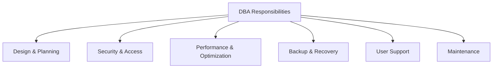
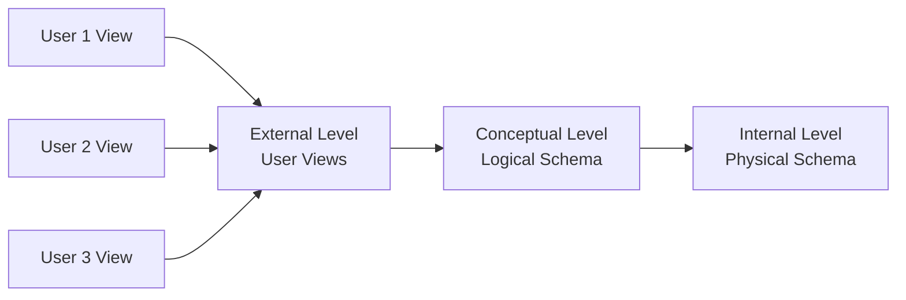
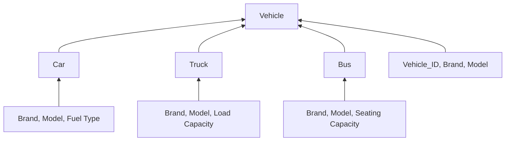
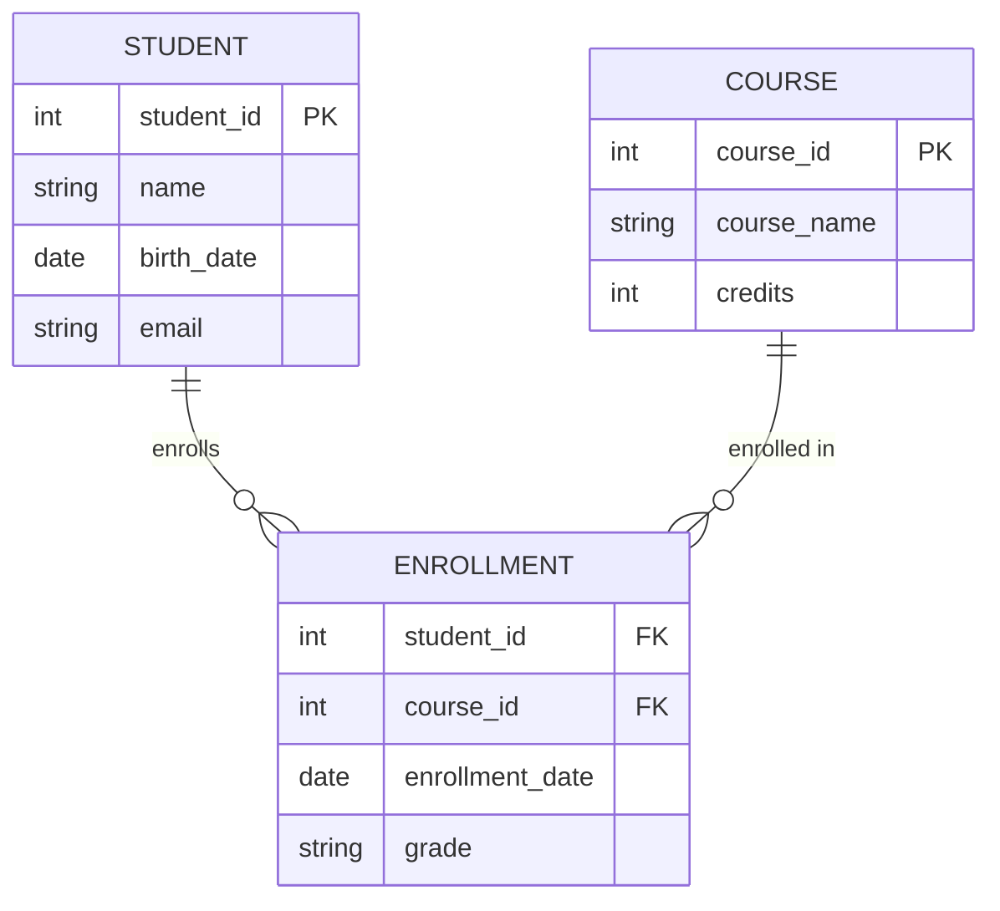
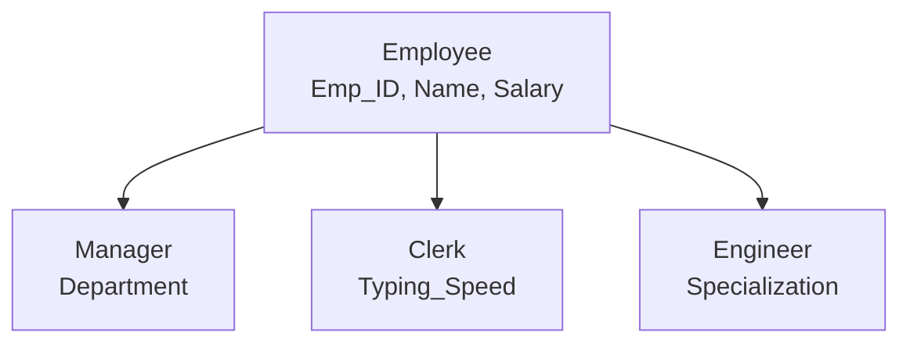
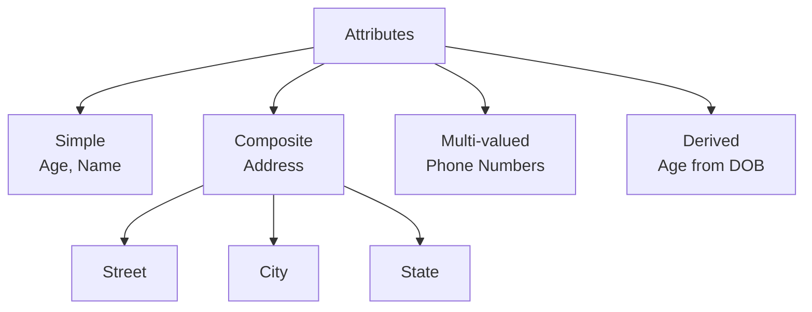
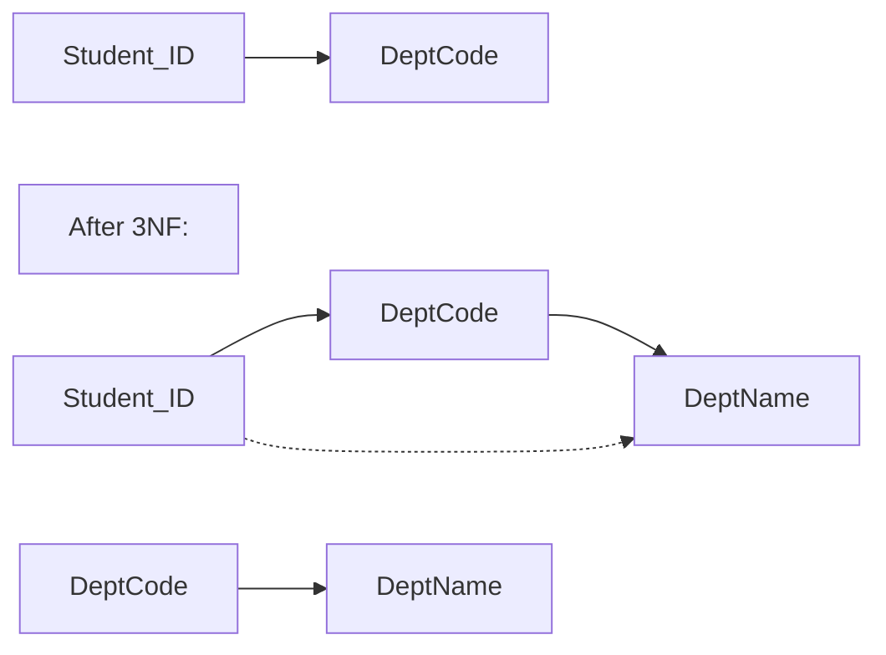

## Question 1(a) [3 marks]

**Define the following terms: a). Data items b). Data dictionary c).Meta data**

**Answer**:

| Term | Definition |
|------|------------|
| **Data Items** | Basic units of data that cannot be subdivided further. Individual facts or values stored in database fields |
| **Data Dictionary** | Centralized repository containing metadata about database structure, tables, columns, and relationships |
| **Metadata** | Data about data that describes structure, constraints, and properties of database elements |

**Mnemonic:** "DDM - Data Dictionary Manages"

---

## Question 1(b) [4 marks]

**Explain disadvantages of File oriented system.**

**Answer**:

| Disadvantage | Description |
|--------------|-------------|
| **Data Redundancy** | Same data stored in multiple files leading to storage waste |
| **Data Inconsistency** | Different versions of same data in different files |
| **Data Isolation** | Difficulty in accessing data scattered across multiple files |
| **Security Issues** | Limited access control and security mechanisms |

**Mnemonic:** "RDIS - Really Difficult Information System"

---

## Question 1(c) [7 marks]

**Describe the responsibilities of DBA in detail.**

**Answer**:

| Responsibility | Details |
|----------------|---------|
| **Database Design** | Creating logical and physical database structures |
| **Security Management** | Implementing user access controls and data protection |
| **Performance Monitoring** | Optimizing database performance and query execution |
| **Backup & Recovery** | Ensuring data safety through regular backups |
| **User Support** | Providing technical assistance to database users |
| **System Maintenance** | Regular updates, patches, and system optimization |



**Mnemonic:** "DSPBUM - Database Specialists Provide Better User Management"

---

## Question 1(c OR) [7 marks]

**Define data abstraction? Explain Three level Architecture of DBMS.**

**Answer**:

**Data Abstraction**: Process of hiding complex implementation details while showing only essential features to users.

| Level | Description | Purpose |
|-------|-------------|---------|
| **External Level** | User view of database | Individual user perspectives |
| **Conceptual Level** | Logical structure of entire database | Overall database organization |
| **Internal Level** | Physical storage details | How data is actually stored |



**Mnemonic:** "ECI - Every Computer Industry"

---

## Question 2(a) [3 marks]

**Define the Following Terms :a).Relationship set b).Participation c).Candidate key**

**Answer**:

| Term | Definition |
|------|------------|
| **Relationship Set** | Collection of relationships of same type between entity sets |
| **Participation** | Constraint specifying whether entity occurrence is mandatory in relationship |
| **Candidate Key** | Minimal set of attributes that uniquely identifies each entity in entity set |

**Mnemonic:** "RPC - Relationship Participation Candidate"

---

## Question 2(b) [4 marks]

**Explain Generalization with example.**

**Answer**:

**Generalization**: Bottom-up approach where common attributes of lower-level entities are combined into higher-level entity.

| Concept | Description |
|---------|-------------|
| **Purpose** | Reduce redundancy by creating common superclass |
| **Direction** | Bottom-up (specific to general) |
| **Example** | Car, Truck, Bus → Vehicle |



**Mnemonic:** "GBU - Generalization Builds Up"

---

## Question 2(c) [7 marks]

**Define E-R diagram? Explain different symbols used in E-R diagram with example.**

**Answer**:

**E-R Diagram**: Graphical representation showing entities, attributes, and relationships in database design.

| Symbol | Shape | Usage | Example |
|--------|-------|-------|---------|
| **Entity** | Rectangle | Represents objects | Student, Course |
| **Attribute** | Oval | Properties of entities | Name, Age, ID |
| **Relationship** | Diamond | Connections between entities | Enrolls, Teaches |
| **Primary Key** | Underlined oval | Unique identifier | Student_ID |
| **Multivalued** | Double oval | Multiple values | Phone_Numbers |
| **Derived** | Dashed oval | Calculated attributes | Age from DOB |



**Mnemonic:** "EARPM - Every Attribute Represents Proper Meaning"

---

## Question 2(a OR) [3 marks]

**Define Relational Algebra? List out various operations in relational algebra?**

**Answer**:

**Relational Algebra**: Formal query language with operations for manipulating relational database tables.

| Operation Type | Operations |
|----------------|------------|
| **Basic Operations** | Select, Project, Union, Set Difference, Cartesian Product |
| **Additional Operations** | Intersection, Join, Division, Rename |

**Mnemonic:** "SPUDC-IJDR - Simple People Use Database Concepts"

---

## Question 2(b OR) [4 marks]

**Explain Specialization with example.**

**Answer**:

**Specialization**: Top-down approach where higher-level entity is divided into specialized lower-level entities.

| Concept | Description |
|---------|-------------|
| **Purpose** | Create specialized subclasses with unique attributes |
| **Direction** | Top-down (general to specific) |
| **Example** | Employee → Manager, Clerk, Engineer |



**Mnemonic:** "STD - Specialization Top Down"

---

## Question 2(c OR) [7 marks]

**Define attribute? Explain different types of attributes with example.**

**Answer**:

**Attribute**: Property or characteristic that describes an entity.

| Attribute Type | Description | Example |
|----------------|-------------|---------|
| **Simple** | Cannot be divided further | Age, Name |
| **Composite** | Can be subdivided | Address (Street, City, State) |
| **Single-valued** | Has one value | SSN, Employee_ID |
| **Multi-valued** | Can have multiple values | Phone_Numbers, Skills |
| **Derived** | Calculated from other attributes | Age from Birth_Date |
| **Key** | Uniquely identifies entity | Student_ID |



**Mnemonic:** "SCSMDK - Simple Composite Single Multi Derived Key"

---

## Question 3(a) [3 marks]

**Explain the GRANT and REVOKE statement in SQL.**

**Answer**:

| Statement | Purpose | Syntax Example |
|-----------|---------|----------------|
| **GRANT** | Provides privileges to users | `GRANT SELECT ON table TO user` |
| **REVOKE** | Removes privileges from users | `REVOKE SELECT ON table FROM user` |

**Common Privileges**: SELECT, INSERT, UPDATE, DELETE, ALL

**Mnemonic:** "GR - Grant Removes (via REVOKE)"

---

## Question 3(b) [4 marks]

**Explain following Character functions. 1) INSTR 2) LENGTH**

**Answer**:

| Function | Purpose | Syntax | Example |
|----------|---------|--------|---------|
| **INSTR** | Finds position of substring | `INSTR(string, substring)` | `INSTR('Hello', 'e')` returns 2 |
| **LENGTH** | Returns string length | `LENGTH(string)` | `LENGTH('Hello')` returns 5 |

**Mnemonic:** "IL - INSTR Locates, LENGTH measures"

---

## Question 3(c) [7 marks]

**Write SQL statements for following table: Student(Enno,name,branch,sem,clgname,bdate)**

**Answer**:

```sql
-- 1. Create a table Student
CREATE TABLE Student (
    Enno VARCHAR(10) PRIMARY KEY,
    name VARCHAR(50),
    branch VARCHAR(20),
    sem INT,
    clgname VARCHAR(100),
    bdate DATE
);

-- 2. Add a column mobno in Student table
ALTER TABLE Student ADD mobno VARCHAR(15);

-- 3. Insert one record in student table
INSERT INTO Student VALUES 
('E001', 'Raj Patel', 'IT', 3, 'GTU College', '2003-05-15', '9876543210');

-- 4. Find out list of students who have enrolled in "IT" branch
SELECT * FROM Student WHERE branch = 'IT';

-- 5. Retrieve all information about student where name begin with 'a'
SELECT * FROM Student WHERE name LIKE 'a%';

-- 6. Count the number of rows in student table
SELECT COUNT(*) FROM Student;

-- 7. Delete all record of student table
DELETE FROM Student;
```

**Mnemonic:** "CAIRSCD - Create Add Insert Retrieve Search Count Delete"

---

## Question 3(a OR) [3 marks]

**Explain equi join with example in SQL.**

**Answer**:

**Equi Join**: Join operation using equality condition to combine tables.

| Join Type | Condition | Result |
|-----------|-----------|--------|
| **Equi Join** | Column1 = Column2 | Matching rows from both tables |

```sql
-- Example
SELECT s.name, c.course_name 
FROM Student s, Course c 
WHERE s.course_id = c.course_id;
```

**Mnemonic:** "EE - Equi Equals"

---

## Question 3(b OR) [4 marks]

**Explain following Aggregate functions. 1) MAX 2) SUM**

**Answer**:

| Function | Purpose | Syntax | Example |
|----------|---------|--------|---------|
| **MAX** | Returns maximum value | `MAX(column)` | `MAX(salary)` |
| **SUM** | Returns total sum | `SUM(column)` | `SUM(marks)` |

**Mnemonic:** "MS - MAX Sum"

---

## Question 3(c OR) [7 marks]

**Write SQL statements for the following table: Employee(EmpID,Ename,DOB,Dept,Salary)**

**Answer**:

```sql
-- 1. Create a table Employee
CREATE TABLE Employee (
    EmpID VARCHAR(10) PRIMARY KEY,
    Ename VARCHAR(50),
    DOB DATE,
    Dept VARCHAR(30),
    Salary DECIMAL(10,2)
);

-- 2. Find sum of salaries of all employee
SELECT SUM(Salary) FROM Employee;

-- 3. Insert one record in Employee table
INSERT INTO Employee VALUES 
('E001', 'John Doe', '1990-05-15', 'IT', 35000);

-- 4. Find names of employees who salary between 25000/- and 48000/-
SELECT Ename FROM Employee WHERE Salary BETWEEN 25000 AND 48000;

-- 5. Display detail of all employees in descending order of their DOB
SELECT * FROM Employee ORDER BY DOB DESC;

-- 6. List name of all employees whose name ends with 'a'
SELECT Ename FROM Employee WHERE Ename LIKE '%a';

-- 7. Find highest and least salaries of all employees
SELECT MAX(Salary) AS Highest, MIN(Salary) AS Lowest FROM Employee;
```

**Mnemonic:** "CSIDDHL - Create Sum Insert Display Display List HighLow"

---

## Question 4(a) [3 marks]

**Consider a following relational schema & give Relational Algebra Expressions for the following queries.**

**Answer**:

```
Student (Enrollment_No,Name,DOB,SPI)

i. σ(SPI > 7.0)(Student)
ii. π(Name)(σ(Enrollment_No = 007)(Student))
```

**Mnemonic:** "SP - Select Project"

---

## Question 4(b) [4 marks]

**Write a short note on partial functional dependency.**

**Answer**:

| Concept | Description |
|---------|-------------|
| **Definition** | Non-prime attribute depends on part of composite primary key |
| **Occurs in** | Tables with composite primary keys |
| **Problem** | Causes redundancy and update anomalies |
| **Solution** | Decompose into 2NF |

**Example**: In table(StudentID, CourseID, StudentName, CourseName), StudentName depends only on StudentID (part of key).

**Mnemonic:** "PDPR - Partial Dependency Problems Resolved"

---

## Question 4(c) [7 marks]

**Explain need of Normalization? Discuss about 2NF with example.**

**Answer**:

**Need of Normalization**:

| Problem | Solution through Normalization |
|---------|-------------------------------|
| **Data Redundancy** | Eliminates duplicate data |
| **Update Anomalies** | Prevents inconsistent updates |
| **Insert Anomalies** | Allows independent data insertion |
| **Delete Anomalies** | Prevents loss of important data |

**Second Normal Form (2NF)**:

- Must be in 1NF
- No partial functional dependencies

**Example**:

```
Before 2NF:
StudentCourse(StudentID, CourseID, StudentName, CourseName)

After 2NF:
Student(StudentID, StudentName)
Course(CourseID, CourseName)
Enrollment(StudentID, CourseID)
```

**Mnemonic:** "NUID2 - Normalization Unifies Important Data to 2NF"

---

## Question 4(a OR) [3 marks]

**Consider a following relational schema & give Relational Algebra Expressions for the following queries.**

**Answer**:

```
Student(Enno,name,age,address)

i. π(name)(σ(address = 'Surat')(Student))
ii. π(name)(σ(age > 30)(Student))
```

---

## Question 4(b OR) [4 marks]

**Define 1 NF? Explain 1NF with suitable example.**

**Answer**:

**First Normal Form (1NF)**: Each column contains atomic (indivisible) values, and each column contains values of a single type.

| Rule | Description |
|------|-------------|
| **Atomic Values** | No multiple values in single cell |
| **No Repeating Groups** | No duplicate columns |
| **Unique Rows** | Each row must be unique |

**Example**:

```
Before 1NF:
Student(ID, Name, Subjects)
1, John, Math,Science,English

After 1NF:
Student(ID, Name, Subject)
1, John, Math
1, John, Science  
1, John, English
```

**Mnemonic:** "ANU - Atomic No-repeat Unique"

---

## Question 4(c OR) [7 marks]

**Define Transitive Dependency? Explain 3NF with suitable example.**

**Answer**:

**Transitive Dependency**: Non-prime attribute depends on another non-prime attribute rather than directly on primary key.

**Third Normal Form (3NF)**:

- Must be in 2NF
- No transitive dependencies

| Before 3NF | After 3NF |
|------------|-----------|
| Student(ID, Name, DeptCode, DeptName) | Student(ID, Name, DeptCode) |
| DeptName depends on DeptCode | Department(DeptCode, DeptName) |



**Mnemonic:** "T3ND - Transitive Third Normal Form No Dependencies"

---

## Question 5(a) [3 marks]

**Define Serializability? Explain rules of serializability?**

**Answer**:

**Serializability**: Property ensuring concurrent transaction execution produces same result as serial execution.

| Rule | Description |
|------|-------------|
| **Conflict Serializability** | No conflicting operations in different order |
| **View Serializability** | Same read-write patterns as serial schedule |

**Mnemonic:** "SCV - Serial Conflict View"

---

## Question 5(b) [4 marks]

**Explain Attributes of Implicit Cursors.**

**Answer**:

| Attribute | Description |
|-----------|-------------|
| **%FOUND** | TRUE if last SQL affected at least one row |
| **%NOTFOUND** | TRUE if last SQL affected no rows |
| **%ROWCOUNT** | Number of rows affected by last SQL |
| **%ISOPEN** | Always FALSE for implicit cursors |

**Mnemonic:** "FNRI - Found NotFound RowCount IsOpen"

---

## Question 5(c) [7 marks]

**Explain two phase locking protocol with suitable example.**

**Answer**:

**Two Phase Locking (2PL)**: Protocol ensuring serializability through two phases.

| Phase | Description | Rules |
|-------|-------------|-------|
| **Growing Phase** | Acquire locks only | Can acquire locks, cannot release |
| **Shrinking Phase** | Release locks only | Can release locks, cannot acquire |

**Example**:

```
Transaction T1:
1. Lock(A) - Growing
2. Lock(B) - Growing  
3. Read(A), Write(A)
4. Unlock(A) - Shrinking
5. Read(B), Write(B)
6. Unlock(B) - Shrinking
```


**Mnemonic:** "2PGS - Two Phase Growing Shrinking"

---

## Question 5(a OR) [3 marks]

**Explain ACID properties of transaction.**

**Answer**:

| Property | Description |
|----------|-------------|
| **Atomicity** | Transaction is all-or-nothing |
| **Consistency** | Database remains in valid state |
| **Isolation** | Concurrent transactions don't interfere |
| **Durability** | Committed changes are permanent |

**Mnemonic:** "ACID - All Changes In Database"

---

## Question 5(b OR) [4 marks]

**Define Triggers? Explain advantages of triggers.**

**Answer**:

**Triggers**: Special stored procedures that automatically execute in response to database events.

| Advantage | Description |
|-----------|-------------|
| **Automatic Execution** | Runs without explicit call |
| **Data Integrity** | Enforces business rules |
| **Auditing** | Tracks database changes |
| **Security** | Controls data access |

**Mnemonic:** "ADAS - Automatic Data Auditing Security"

---

## Question 5(c OR) [7 marks]

**List down problems of concurrency control. Explain any two with suitable example.**

**Answer**:

**Problems of Concurrency Control**:

| Problem | Description |
|---------|-------------|
| **Lost Update** | One transaction's update overwrites another's |
| **Dirty Read** | Reading uncommitted data |
| **Non-repeatable Read** | Different values read in same transaction |
| **Phantom Read** | New rows appear between reads |

**Example 1 - Lost Update**:

```
T1: Read(A=100)
T2: Read(A=100)  
T1: A = A + 50 (A=150)
T2: A = A + 30 (A=130) <- Lost T1's update
T1: Write(A=150)
T2: Write(A=130) <- Final value wrong
```

**Example 2 - Dirty Read**:

```
T1: Write(A=200) [Not committed]
T2: Read(A=200)  <- Dirty read
T1: Rollback     <- A back to original
T2: Continues with wrong value
```

**Mnemonic:** "LDNP - Lost Dirty Non-repeatable Phantom"
