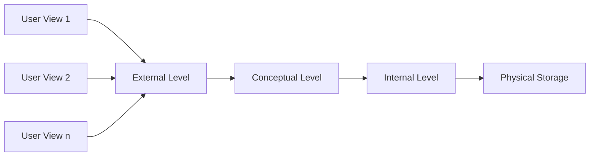
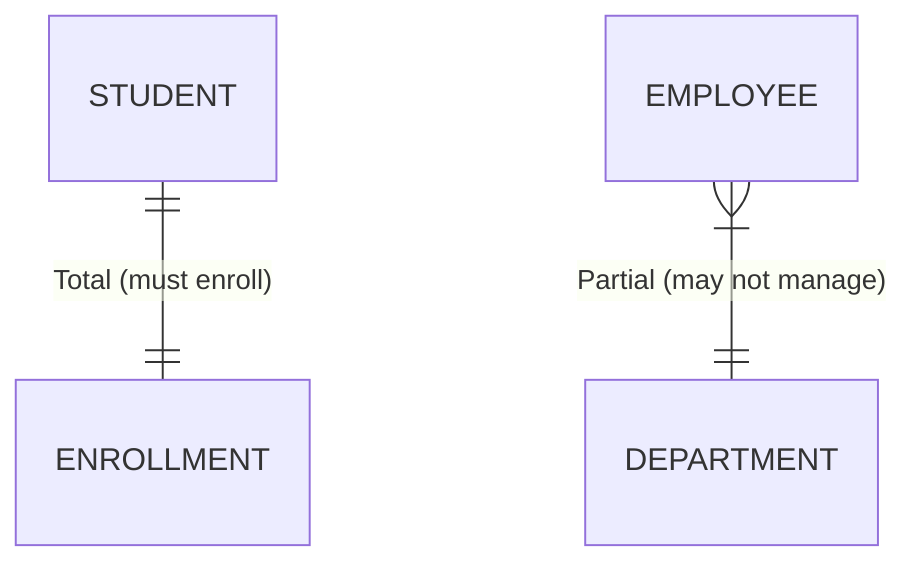
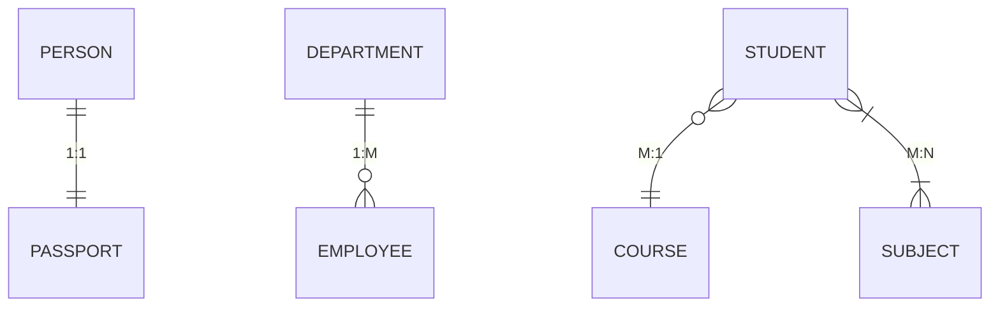
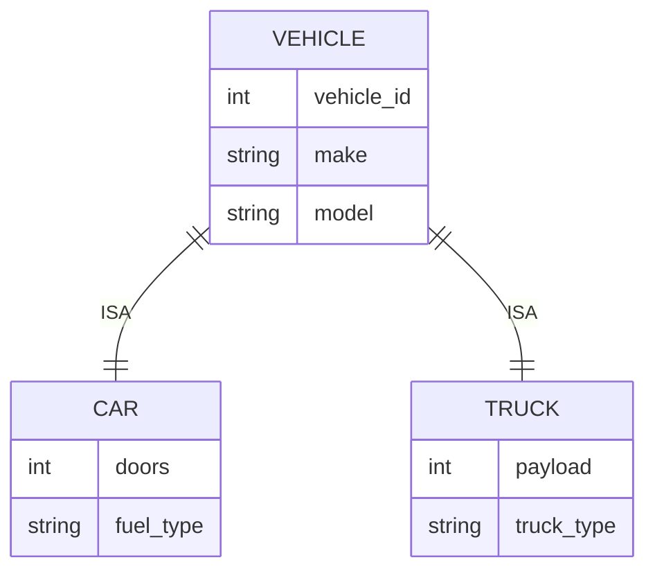
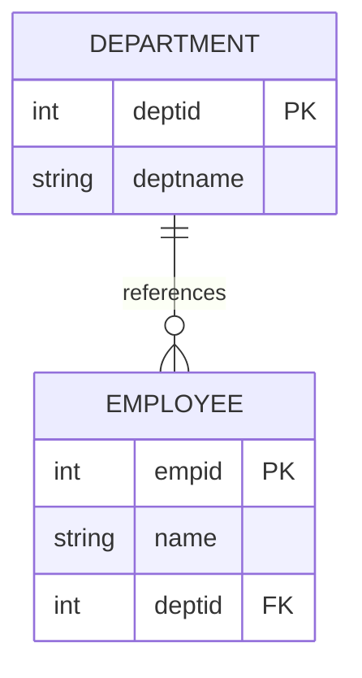
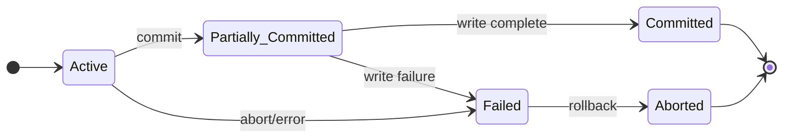

## પ્રશ્ન 1(અ) [3 ગુણ]

**Three-level ડેટાબેઝ આર્કિટેક્ચરને સમજાવો.**

**જવાબ**:

**ટેબલ:**

| સ્તર | વર્ણન | હેતુ |
|-------|-------------|---------|
| **External Level** | યુઝર વ્યુઝ અને એપ્લિકેશન પ્રોગ્રામ્સ | વપરાશકર્તાઓ માટે ડેટા abstraction |
| **Conceptual Level** | સંપૂર્ણ લોજિકલ સ્ટ્રક્ચર | સંસ્થાવ્યાપી ડેટા દૃશ્ય |
| **Internal Level** | ભૌતિક સ્ટોરેજ વિગતો | સ્ટોરેજ અને access methods |

**ડાયાગ્રામ:**



- **External Level**: વ્યક્તિગત યુઝર વ્યુઝ અને વિશિષ્ટ એપ્લિકેશન જરૂરિયાતો
- **Conceptual Level**: સ્ટોરેજ વિગતો વિના સંપૂર્ણ ડેટાબેઝ schema  
- **Internal Level**: ભૌતિક સ્ટોરેજ સ્ટ્રક્ચર્સ અને access paths

**મેમરી ટ્રીક:** "ECI - Every Computer Interface"

## પ્રશ્ન 1(બ) [4 ગુણ]

**ઉદાહરણ સાથે Total Participation અને Partial Participation સમજાવો.**

**જવાબ**:

**ટેબલ:**

| Participation Type | વ્યાખ્યા | પ્રતીક | ઉદાહરણ |
|-------------------|------------|---------|---------|
| **Total Participation** | દરેક entity એ ભાગ લેવો જ જોઈએ | Double line | Student-Course enrollment |
| **Partial Participation** | કેટલીક entities ભાગ ન પણ લઈ શકે | Single line | Employee-Department management |

**ડાયાગ્રામ:**



- **Total Participation**: તમામ વિદ્યાર્થીઓએ ઓછામાં ઓછા એક કોર્સમાં નોંધણી કરાવવી જ જોઈએ
- **Partial Participation**: બધા કર્મચારીઓ department ને manage કરતા નથી
- **Double lines** total participation constraints દર્શાવે છે
- **Single lines** partial participation relationships બતાવે છે

**મેમરી ટ્રીક:** "Total = Two lines, Partial = Plain line"

## પ્રશ્ન 1(ક) [7 ગુણ]

**ફાઇલ મેનેજમેન્ટ સિસ્ટમ પર DBMS ના ફાયદા સમજાવો.**

**જવાબ**:

**ટેબલ:**

| ફાયદો | File System | DBMS |
|-----------|-------------|------|
| **Data Redundancy** | ઉચ્ચ duplication | નિયંત્રિત redundancy |
| **Data Inconsistency** | સામાન્ય સમસ્યા | ડેટા integrity જાળવાઈ રહે |
| **Data Sharing** | મર્યાદિત sharing | Concurrent access સપોર્ટ |
| **સિક્યુરિટી** | File-level security | User-level access control |
| **Backup & Recovery** | Manual process | Automatic mechanisms |

- **ઘટાડેલ ડેટા Redundancy**: એપ્લિકેશનોમાં duplicate ડેટા સ્ટોરેજ દૂર કરે છે
- **ડેટા Consistency**: તમામ એપ્લિકેશનોમાં સમાન ડેટા સુનિશ્ચિત કરે છે
- **ડેટા Independence**: એપ્લિકેશનો ડેટા structure ના ફેરફારોથી સ્વતંત્ર
- **Concurrent Access**: અનેક યુઝર્સ એક સાથે ડેટા access કરી શકે છે
- **સિક્યુરિટી કંટ્રોલ**: યુઝર authentication અને authorization mechanisms
- **Backup અને Recovery**: આપોઆપ ડેટા સુરક્ષા અને પુનઃસ્થાપન
- **ડેટા Integrity**: Constraint enforcement ડેટા ગુણવત્તા જાળવે છે

**મેમરી ટ્રીક:** "RDCCSBI - Really Don't Copy, Control, Secure, Backup, Integrate"

## પ્રશ્ન 1(ક OR) [7 ગુણ]

**વિવિધ ડેટા મોડેલ્સની યાદી બનાવો. કોઈપણ બેને ટૂંકમાં સમજાવો.**

**જવાબ**:

**ડેટા મોડેલ્સની યાદી:**

- Hierarchical Data Model
- Network Data Model  
- Relational Data Model
- Object-Oriented Data Model
- Entity-Relationship Model

**ટેબલ:**

| મોડેલ | સ્ટ્રક્ચર | ફાયદા | ગેરફાયદા |
|-------|-----------|------------|---------------|
| **Relational Model** | Tables with rows/columns | સરળ, લવચીક | Performance overhead |
| **Network Model** | Graph with records/links | કુશળ navigation | જટિલ સ્ટ્રક્ચર |

**Relational Data Model:**

- **સ્ટ્રક્ચર**: ડેટા tables (relations) માં ગોઠવાયેલો
- **ઘટકો**: Tuples (rows), attributes (columns), domains
- **ઓપરેશન્સ**: Select, project, join operations ઉપલબ્ધ

**Network Data Model:**

- **સ્ટ્રક્ચર**: Owner-member relationships સાથે graph-based
- **નેવિગેશન**: Record types વચ્ચે સ્પષ્ટ links
- **લવચીકતા**: Many-to-many relationships કુદરતી રીતે સપોર્ટેડ

**મેમરી ટ્રીક:** "HNROE - Have Network Relational Object Entity"

## પ્રશ્ન 2(અ) [3 ગુણ]

**મેપિંગ કાર્ડિનાલિટીઝ સમજાવો.**

**જવાબ**:

**ટેબલ:**

| Cardinality | પ્રતીક | વર્ણન | ઉદાહરણ |
|-------------|---------|-------------|---------|
| **One-to-One** | 1:1 | દરેક entity એક બીજા સાથે સંબંધ ધરાવે | Person-Passport |
| **One-to-Many** | 1:M | એક entity અનેક સાથે સંબંધ ધરાવે | Department-Employee |
| **Many-to-One** | M:1 | અનેક entities એક સાથે સંબંધ ધરાવે | Student-Course |
| **Many-to-Many** | M:N | અનેક entities અનેક સાથે સંબંધ | Student-Subject |

**ડાયાગ્રામ:**



- **Cardinality constraints** relationship participation limits વ્યાખ્યાયિત કરે છે
- **Maximum cardinality** associations ની ઉપરી મર્યાદા સ્પષ્ટ કરે છે
- **ડેટાબેઝ ડિઝાઈન** અને relationship modeling માં મદદ કરે છે

**મેમરી ટ્રીક:** "OMOM - One, One-Many, One-Many, Many-Many"

## પ્રશ્ન 2(બ) [4 ગુણ]

**Relational Algebra માં આઉટર જોઇન ઑપરેશન સમજાવો.**

**જવાબ**:

**ટેબલ:**

| Join Type | પ્રતીક | પરિણામ | NULL Handling |
|-----------|---------|---------|---------------|
| **Left Outer Join** | ⟕ | બધા left + મેચિંગ right | અનમેચ્ડ right માટે NULLs |
| **Right Outer Join** | ⟖ | બધા right + મેચિંગ left | અનમેચ્ડ left માટે NULLs |
| **Full Outer Join** | ⟗ | બંને tables માંથી બધા | અનમેચ્ડ માટે NULLs |

**ઉદાહરણ:**

```
EMPLOYEE ⟕ DEPARTMENT
- બધા employees શામેલ કરે છે
- Department વિના employees માટે NULL values
```

- **અનમેચ્ડ tuples ને સાચવે છે** સ્પષ્ટ કરેલ relation(s) માંથી
- **NULL values** ગુમ થયેલ attribute values ભરે છે
- **ત્રણ પ્રકાર**: Left, Right, અને Full outer joins
- **અધૂરા ડેટા relationships** ની reporting માટે ઉપયોગી

**મેમરી ટ્રીક:** "LRF - Left Right Full outer joins"

## પ્રશ્ન 2(ક) [7 ગુણ]

**Specialization અને Generalization ની concept ના ઉદાહરણ સાથે સમજાવો.**

**જવાબ**:

**ટેબલ:**

| Concept | દિશા | પ્રક્રિયા | ઉદાહરણ |
|---------|-----------|---------|---------|
| **Specialization** | Top-Down | સામાન્યથી વિશિષ્ટ | Vehicle → Car, Truck |
| **Generalization** | Bottom-Up | વિશિષ્ટથી સામાન્ય | Car, Truck → Vehicle |

**ડાયાગ્રામ:**



**Specialization:**

- **પ્રક્રિયા**: Superclass માંથી subclasses બનાવવી
- **વારસો**: Subclasses બધા superclass attributes વારસામાં મેળવે છે
- **વધારાના attributes**: Subclasses ને વિશિષ્ટ ગુણધર્મો હોય છે

**Generalization:**

- **પ્રક્રિયા**: સામાન્ય subclass features માંથી superclass બનાવવું
- **અમૂર્તીકરણ**: સામાન્ય attributes અને relationships ઓળખે છે
- **સરળીકરણ**: Hierarchy દ્વારા જટિલતા ઘટાડે છે

**મેમરી ટ્રીક:** "SG-TD-BU - Specialization General-To-Detail, Bottom-Up"

## પ્રશ્ન 2(અ OR) [3 ગુણ]

**Relational Algebra માં keys ના વિવિધ પ્રકારો સમજાવો.**

**જવાબ**:

**ટેબલ:**

| Key Type | વ્યાખ્યા | અનન્યતા | ઉદાહરણ |
|----------|------------|------------|---------|
| **Super Key** | કોઈપણ attribute set જે uniquely identifies કરે | હા | {ID, Name, Phone} |
| **Candidate Key** | Minimal super key | હા | {ID}, {Email} |
| **Primary Key** | પસંદ કરેલ candidate key | હા | {StudentID} |
| **Foreign Key** | Primary key ને reference કરે છે | ના | {DeptID} references Dept |

- **Super Key**: Tuples ને uniquely identifies કરે છે, વધારાના attributes હોઈ શકે
- **Candidate Key**: Redundant attributes વિના minimal super key
- **Primary Key**: Entity identification માટે પસંદ કરેલ candidate key
- **Foreign Key**: Tables વચ્ચે referential integrity સ્થાપિત કરે છે

**મેમરી ટ્રીક:** "SCPF - Super Candidate Primary Foreign"

## પ્રશ્ન 2(બ OR) [4 ગુણ]

**યોગ્ય ઉદાહરણ સાથે ER-ડાયાગ્રામમાં attributes ના પ્રકારો સમજાવો.**

**જવાબ**:

**ટેબલ:**

| Attribute Type | પ્રતીક | વર્ણન | ઉદાહરણ |
|----------------|---------|-------------|---------|
| **Simple** | Oval | વિભાજિત કરી શકાતા નથી | Age, Name |
| **Composite** | Oval with sub-ovals | વિભાજિત કરી શકાય છે | Address (Street, City) |
| **Derived** | Dashed oval | બીજા attributes માંથી ગણતરી | Age from Birth_Date |
| **Multi-valued** | Double oval | અનેક values | Phone_Numbers |

**ડાયાગ્રામ:**

```goat
    +----------+
    |   Name   |  <-- Simple
    +----------+
    
    +----------+
    |  Address |  <-- Composite
    +----+-----+
         |
    +----+---+------+
    | Street | City |
    +--------+------+
    
    +----------+
    :|Phone_No|:  <-- Multi-valued
    +----------+
    
    +----------+
    :   Age    :  <-- Derived
    +----------+
```

- **Simple attributes** atomic અને અવિભાજ્ય છે
- **Composite attributes** ને અર્થપૂર્ણ ઉપ-ભાગો હોય છે
- **Derived attributes** અન્ય attribute values માંથી computed છે  
- **Multi-valued attributes** entity દીઠ અનેક values સ્ટોર કરે છે

**મેમરી ટ્રીક:** "SCDM - Simple Composite Derived Multi-valued"

## પ્રશ્ન 2(ક OR) [7 ગુણ]

**SELECT, PROJECT, UNION અને SET-INTERSECTION ઓપરેશનને યોગ્ય ઉદાહરણ સાથે સમજાવો.**

**જવાબ**:

**ટેબલ:**

| Operation | પ્રતીક | હેતુ | ઉદાહરણ |
|-----------|---------|---------|---------|
| **SELECT** | σ | Rows filter કરવા | σ(salary > 50000)(Employee) |
| **PROJECT** | π | Columns પસંદ કરવા | π(name, age)(Employee) |
| **UNION** | ∪ | Relations જોડવા | R ∪ S |
| **INTERSECTION** | ∩ | સામાન્ય tuples | R ∩ S |

**ઉદાહરણો:**

**SELECT Operation:**

```
σ(age > 25)(STUDENT)
- 25 વર્ષથી વધુ ઉંમરના students return કરે
```

**PROJECT Operation:**

```
π(name, course)(STUDENT)  
- ફક્ત name અને course columns return કરે
```

**UNION Operation:**

```
SCIENCE_STUDENTS ∪ ARTS_STUDENTS
- બંને streams ના students જોડે છે
```

**INTERSECTION Operation:**

```
MALE_STUDENTS ∩ SPORTS_STUDENTS
- સ્પોર્ટ્સ રમતા પુરુષ વિદ્યાર્થીઓ return કરે
```

**મેમરી ટ્રીક:** "SPUI - Select Project Union Intersection"

## પ્રશ્ન 3(અ) [3 ગુણ]

**Primary Key અને Foreign Key constraint ને અલગ કરો.**

**જવાબ**:

**ટેબલ:**

| પાસું | Primary Key | Foreign Key |
|--------|-------------|-------------|
| **હેતુ** | Unique identification | Referential integrity |
| **NULL Values** | મંજૂર નથી | મંજૂર છે |
| **અનન્યતા** | Unique હોવી જ જોઈએ | Duplicate હોઈ શકે |
| **Table દીઠ સંખ્યા** | ફક્ત એક | અનેક મંજૂર |

- **Primary Key**: Table ની અંદર entity integrity સુનિશ્ચિત કરે છે
- **Foreign Key**: Tables વચ્ચે referential integrity જાળવે છે
- **અનન્યતા**: Primary keys unique, foreign keys repeat થઈ શકે
- **NULL handling**: Primary keys ક્યારેય NULL નથી, foreign keys NULL હોઈ શકે

**મેમરી ટ્રીક:** "PU-FN - Primary Unique, Foreign Nullable"

## પ્રશ્ન 3(બ) [4 ગુણ]

**DUAL table અને SYSDATE ઉદાહરણ સાથે સમજાવો.**

**જવાબ**:

**ટેબલ:**

| ઘટક | પ્રકાર | હેતુ | ઉદાહરણ |
|-----------|------|---------|---------|
| **DUAL** | Virtual table | Expressions ટેસ્ટ કરવા | SELECT 2+3 FROM DUAL |
| **SYSDATE** | System function | વર્તમાન date/time | SELECT SYSDATE FROM DUAL |

**DUAL Table:**

- **Virtual table** એક row અને એક column સાથે
- **ટેસ્ટિંગ માટે વપરાય છે** expressions અને functions
- **Oracle-specific** pseudo table

**SYSDATE Function:**

- **વર્તમાન return કરે છે** system date અને time
- **આપોઆપ અપડેટ** system clock સાથે
- **Date/time operations** સપોર્ટેડ

**ઉદાહરણો:**

```sql
SELECT SYSDATE FROM DUAL;
SELECT SYSDATE + 30 FROM DUAL;  -- 30 દિવસ પછી
```

**મેમરી ટ્રીક:** "DT-ST - DUAL Testing, SYSDATE Time"

## પ્રશ્ન 3(ક) [7 ગુણ]

**વિવિધ numeric function નો ઉપયોગ કરવા માટે SQL પ્રશ્નો લખો:**

**જવાબ**:

**ટેબલ:**

| Function | હેતુ | SQL Query | પરિણામ |
|----------|---------|-----------|---------|
| **TRUNC** | Integer value | `SELECT TRUNC(125.25) FROM DUAL;` | 125 |
| **ABS** | Absolute value | `SELECT ABS(-15) FROM DUAL;` | 15 |
| **CEIL** | Ceiling value | `SELECT CEIL(55.65) FROM DUAL;` | 56 |
| **FLOOR** | Floor value | `SELECT FLOOR(100.2) FROM DUAL;` | 100 |

**SQL Queries:**

```sql
-- (a) 125.25 નું integer મૂલ્ય દર્શાવો
SELECT TRUNC(125.25) FROM DUAL;

-- (b) (-15) નું absolute મૂલ્ય દર્શાવો
SELECT ABS(-15) FROM DUAL;

-- (c) 55.65 ની ceil ની કિંમત દર્શાવો
SELECT CEIL(55.65) FROM DUAL;

-- (d) 100.2 નું floor મૂલ્ય દર્શાવો
SELECT FLOOR(100.2) FROM DUAL;

-- (e) 16 નું વર્ગમૂળ દર્શાવો
SELECT SQRT(16) FROM DUAL;

-- (f) e³ ની કિંમત બતાવો
SELECT EXP(3) FROM DUAL;

-- (g) 12 raised to 6 દર્શાવો
SELECT POWER(12, 6) FROM DUAL;

-- (h) 24 મોડ 2 નું પરિણામ દર્શાવો
SELECT MOD(24, 2) FROM DUAL;

-- (i) sign(-25), sign(25), sign(0) નું આઉટપુટ બતાવો
SELECT SIGN(-25), SIGN(25), SIGN(0) FROM DUAL;
```

**મેમરી ટ્રીક:** "TACFSEPM - TRUNC ABS CEIL FLOOR SQRT EXP POWER MOD"

## પ્રશ્ન 3(અ OR) [3 ગુણ]

**યોગ્ય ઉદાહરણ સાથે Unique અને Check સમજાવો.**

**જવાબ**:

**ટેબલ:**

| Constraint | હેતુ | Duplicates | ઉદાહરણ |
|------------|---------|------------|---------|
| **UNIQUE** | Duplicates અટકાવવા | મંજૂર નથી | Email address |
| **CHECK** | ડેટા validate કરવા | Value restrictions | Age > 0 |

**ઉદાહરણો:**

```sql
-- UNIQUE Constraint
CREATE TABLE Student (
    email VARCHAR(50) UNIQUE,
    phone VARCHAR(15) UNIQUE
);

-- CHECK Constraint  
CREATE TABLE Employee (
    age NUMBER CHECK (age >= 18),
    salary NUMBER CHECK (salary > 0)
);
```

- **UNIQUE constraint** column માં duplicate values અટકાવે છે
- **CHECK constraint** specified conditions વિરુદ્ધ ડેટા validate કરે છે
- **અનેક constraints** single column પર લાગુ કરી શકાય

**મેમરી ટ્રીક:** "UC-DV - Unique no Copy, Check Validates"

## પ્રશ્ન 3(બ OR) [4 ગુણ]

**PL/SQL બ્લોકની રચના સમજાવો.**

**જવાબ**:

**ટેબલ:**

| વિભાગ | જરૂરી | હેતુ | ઉદાહરણ |
|---------|----------|---------|---------|
| **DECLARE** | વૈકલ્પિક | Variable declarations | var_name VARCHAR2(20); |
| **BEGIN** | ફરજિયાત | Executable statements | SELECT ... INTO var; |
| **EXCEPTION** | વૈકલ્પિક | Error handling | WHEN OTHERS THEN ... |
| **END** | ફરજિયાત | Block termination | END; |

**ડાયાગ્રામ:**

```
DECLARE
    -- Variable declarations
BEGIN  
    -- Executable statements
EXCEPTION
    -- Error handling
END;
```

- **DECLARE section**: Variable અને cursor declarations
- **BEGIN-END**: ફરજિયાત executable section
- **EXCEPTION section**: Error handling routines
- **Nested blocks**: PL/SQL blocks nested થઈ શકે છે

**મેમરી ટ્રીક:** "DBE-E - Declare Begin Exception End"

## પ્રશ્ન 3(ક OR) [7 ગુણ]

**નીચેના tables ના પ્રમાણે પ્રશ્નો હલ કરો:**

**જવાબ**:

**I) PRIMARY KEY તરીકે branchId સાથે બ્રાન્ચ ટેબલ બનાવો:**

```sql
CREATE TABLE BRANCH (
    branchid VARCHAR2(10) PRIMARY KEY,
    branchname VARCHAR2(50) NOT NULL,
    address VARCHAR2(100)
);
```

**II) EMPLOYEE ટેબલને પ્રાથમિક કી તરીકે empid સાથે બનાવો:**

```sql
CREATE TABLE EMPLOYEE (
    empid VARCHAR2(10) PRIMARY KEY,
    name VARCHAR2(50) NOT NULL,
    post VARCHAR2(30),
    gender CHAR(1) CHECK (gender IN ('M', 'F')),
    birthdate DATE,
    salary NUMBER(10,2),
    branchid VARCHAR2(10),
    FOREIGN KEY (branchid) REFERENCES BRANCH(branchid)
);
```

**III) અમદાવાદ શાખામાં કામ કરતા તમામ કર્મચારીઓને શોધો:**

```sql
SELECT e.* FROM EMPLOYEE e, BRANCH b 
WHERE e.branchid = b.branchid 
AND b.branchname = 'Ahmedabad';
```

**IV) 1998 માં જન્મેલા તમામ કર્મચારીઓને શોધો:**

```sql
SELECT * FROM EMPLOYEE 
WHERE EXTRACT(YEAR FROM birthdate) = 1998;
```

**V) 5000 થી વધુ પગાર ધરાવતા તમામ મહિલા કર્મચારીઓને શોધો:**

```sql
SELECT * FROM EMPLOYEE 
WHERE gender = 'F' AND salary > 5000;
```

**VI) અજય જ્યાં કામ કરે છે તે શાખાનું સરનામું શોધો:**

```sql
SELECT b.address FROM EMPLOYEE e, BRANCH b
WHERE e.branchid = b.branchid 
AND e.name = 'Ajay';
```

**મેમરી ટ્રીક:** "CBEFFA - Create Branch Employee Find Female Address"

## પ્રશ્ન 4(અ) [3 ગુણ]

**યોગ્ય ઉદાહરણ સાથે રેફરન્શિયલ ઇન્ટિગ્રિટી સમજાવો.**

**જવાબ**:

**ટેબલ:**

| પાસું | વર્ણન | ઉદાહરણ |
|--------|-------------|---------|
| **વ્યાખ્યા** | Foreign key એ વર્તમાન primary key ને reference કરવી જ જોઈએ | Employee.deptid → Department.deptid |
| **હેતુ** | ડેટા consistency જાળવવી | Orphan records અટકાવવા |
| **ક્રિયાઓ** | CASCADE, SET NULL, RESTRICT | ON DELETE CASCADE |

**ડાયાગ્રામ:**



- **રેફરન્શિયલ ઇન્ટિગ્રિટી** સુનિશ્ચિત કરે છે કે foreign key values referenced table માં અસ્તિત્વ ધરાવે
- **Orphan records** constraint enforcement દ્વારા અટકાવાય છે
- **Cascade operations** updates/deletes દરમિયાન consistency જાળવે છે

**મેમરી ટ્રીક:** "RIO - Referential Integrity prevents Orphans"

## પ્રશ્ન 4(બ) [4 ગુણ]

**આંશિક અને સંપૂર્ણ Functional Dependency ને અલગ કરો.**

**જવાબ**:

**ટેબલ:**

| Dependency Type | વ્યાખ્યા | ઉદાહરણ | જરૂરિયાત |
|-----------------|------------|---------|-------------|
| **Partial** | Composite key ના ભાગ પર આધાર | (StudentID, CourseID) → StudentName | Composite primary key |
| **Full** | સંપૂર્ણ key પર આધાર | (StudentID, CourseID) → Grade | Complete key needed |

**ઉદાહરણો:**

**Partial Functional Dependency:**

```
(StudentID, CourseID) → StudentName
StudentName ફક્ત StudentID પર આધાર રાખે છે, CourseID પર નહીં
```

**Full Functional Dependency:**

```
(StudentID, CourseID) → Grade  
Grade બંને StudentID અને CourseID પર આધાર રાખે છે
```

- **Partial dependency** ડેટા redundancy અને anomalies ઉત્પન્ન કરે છે
- **Full dependency** યોગ્ય normalization માટે જરૂરી છે
- **2NF** partial functional dependencies દૂર કરે છે

**મેમરી ટ્રીક:** "PF-CF - Partial Few, Complete Full"

## પ્રશ્ન 4(ક) [7 ગુણ]

**ઉદાહરણ સાથે તૃતીય Normal Form સમજાવો.**

**જવાબ**:

**3rd Normal Form જરૂરિયાતો:**

1. 2NF માં હોવું જ જોઈએ
2. Transitive dependencies ન હોવી જોઈએ
3. Non-key attributes ફક્ત primary key પર આધાર રાખવા જોઈએ

**3NF પહેલાંનું ટેબલ:**

| StudentID | StudentName | CourseID | CourseName | InstructorID | InstructorName |
|-----------|-------------|----------|------------|--------------|----------------|
| S1 | John | C1 | Math | I1 | Dr. Smith |
| S2 | Jane | C1 | Math | I1 | Dr. Smith |

**સમસ્યાઓ:**

- **Transitive dependency**: StudentID → CourseID → InstructorName
- **Update anomaly**: Instructor name બદલવા માટે અનેક updates જરૂરી
- **Delete anomaly**: Student દૂર કરવાથી instructor information ખોવાઈ શકે

**3NF સોલ્યુશન:**

**STUDENT ટેબલ:**

| StudentID | StudentName | CourseID |
|-----------|-------------|----------|
| S1 | John | C1 |
| S2 | Jane | C1 |

**COURSE ટેબલ:**

| CourseID | CourseName | InstructorID |
|----------|------------|--------------|
| C1 | Math | I1 |

**INSTRUCTOR ટેબલ:**

| InstructorID | InstructorName |
|--------------|----------------|
| I1 | Dr. Smith |

**મેમરી ટ્રીક:** "3NF-NT - 3rd Normal Form No Transitives"

## પ્રશ્ન 4(અ OR) [3 ગુણ]

**નોર્મલાઇઝેશનનું મહત્વ સમજાવો.**

**જવાબ**:

**ટેબલ:**

| ફાયદો | હલ થતી સમસ્યા | પરિણામ |
|---------|----------------|---------|
| **Redundancy ઘટાડવી** | Duplicate data | Storage efficiency |
| **Anomalies દૂર કરવી** | Update/Insert/Delete issues | Data consistency |
| **Integrity સુધારવી** | Data inconsistency | વિશ્વસનીય માહિતી |

- **ડેટા redundancy ઘટાડવી** યોગ્ય table decomposition દ્વારા
- **Update anomalies દૂર કરવી** duplicate information દૂર કરીને
- **Storage space ઓપ્ટિમાઇઝ કરવી** normalized structure દ્વારા
- **ડેટા integrity જાળવવી** referential constraints સાથે
- **Maintenance સરળ બનાવવી** logical table organization સાથે

**મેમરી ટ્રીક:** "RESIM - Redundancy Eliminated, Storage Improved, Maintenance"

## પ્રશ્ન 4(બ OR) [4 ગુણ]

**પ્રાઇમ એટ્રિબ્યુટ્સ અને નોન-પ્રાઇમ એટ્રિબ્યુટ્સને અલગ કરો.**

**જવાબ**:

**ટેબલ:**

| Attribute Type | વ્યાખ્યા | ભૂમિકા | ઉદાહરણ |
|----------------|------------|------|---------|
| **Prime** | Candidate key નો ભાગ | Key formation | StudentID, CourseID |
| **Non-Prime** | કોઈપણ candidate key નો ભાગ નથી | Data storage | StudentName, Grade |

**ઉદાહરણ:**

```
ENROLLMENT (StudentID, CourseID, Grade, Semester)
Candidate Key: (StudentID, CourseID)

Prime Attributes: StudentID, CourseID
Non-Prime Attributes: Grade, Semester
```

- **Prime attributes** candidate key formation માં ભાગ લે છે
- **Non-Prime attributes** વધારાની entity information પ્રદાન કરે છે
- **Functional dependencies** આ વચ્ચે normal forms નક્કી કરે છે
- **2NF જરૂરી છે** non-prime પર prime ની કોઈ partial dependencies ન હોવી

**મેમરી ટ્રીક:** "PN-KD - Prime in Key, Non-prime for Data"

## પ્રશ્ન 4(ક OR) [7 ગુણ]

**2nd Normal Form ઉદાહરણ સાથે સમજાવો.**

**જવાબ**:

**2nd Normal Form જરૂરિયાતો:**

1. 1NF માં હોવું જ જોઈએ
2. Partial functional dependencies ન હોવી જોઈએ
3. બધા non-key attributes primary key પર સંપૂર્ણ આધાર રાખવા જોઈએ

**2NF પહેલાંનું ટેબલ:**

| StudentID | CourseID | StudentName | CourseName | Grade |
|-----------|----------|-------------|------------|-------|
| S1 | C1 | John | Math | A |
| S1 | C2 | John | Physics | B |
| S2 | C1 | Jane | Math | A |

**સમસ્યાઓ:**

- **Partial Dependencies**: StudentID → StudentName, CourseID → CourseName
- **Update Anomaly**: Student name બદલવા માટે અનેક updates જરૂરી
- **Insert Anomaly**: Student enrollment વિના course ઉમેરી શકાતો નથી

**2NF સોલ્યુશન:**

**STUDENT ટેબલ:**

| StudentID | StudentName |
|-----------|-------------|
| S1 | John |
| S2 | Jane |

**COURSE ટેબલ:**

| CourseID | CourseName |
|----------|------------|
| C1 | Math |
| C2 | Physics |

**ENROLLMENT ટેબલ:**

| StudentID | CourseID | Grade |
|-----------|----------|-------|
| S1 | C1 | A |
| S1 | C2 | B |
| S2 | C1 | A |

**મેમરી ટ્રીક:** "2NF-FD - 2nd Normal Form Full Dependencies"

## પ્રશ્ન 5(અ) [3 ગુણ]

**ટ્રાન્ઝેક્શન સ્ટેટ્સને યોગ્ય ડાયાગ્રામ સાથે સમજાવો.**

**જવાબ**:

**ડાયાગ્રામ:**



**ટેબલ:**

| સ્થિતિ | વર્ણન | આગળની સ્થિતિ |
|-------|-------------|------------|
| **Active** | ટ્રાન્ઝેક્શન execute થઈ રહ્યું છે | Partially Committed/Failed |
| **Partially Committed** | છેલ્લું statement execute થયું | Committed/Failed |
| **Committed** | ટ્રાન્ઝેક્શન સફળ | End |
| **Failed** | સામાન્ય રીતે આગળ વધી શકતું નથી | Aborted |
| **Aborted** | ટ્રાન્ઝેક્શન rolled back | End |

- **Active state**: ટ્રાન્ઝેક્શન હાલમાં operations execute કરી રહ્યું છે
- **Partially committed**: બધા operations execute થયા, commit ની રાહ જોઈ રહ્યું છે
- **Failed state**: error આવી, ટ્રાન્ઝેક્શન ચાલુ રાખી શકતું નથી

**મેમરી ટ્રીક:** "APCFA - Active Partial Commit Fail Abort"

## પ્રશ્ન 5(બ) [4 ગુણ]

**કોઈપણ બે DDL commands ને યોગ્ય ઉદાહરણ સાથે સમજાવો.**

**જવાબ**:

**ટેબલ:**

| કમાન્ડ | હેતુ | Syntax | ઉદાહરણ |
|---------|---------|---------|---------|
| **CREATE** | ડેટાબેઝ ઓબ્જેક્ટ્સ બનાવવા | CREATE TABLE | CREATE TABLE Student(...) |
| **ALTER** | વર્તમાન ઓબ્જેક્ટ્સ modify કરવા | ALTER TABLE | ALTER TABLE Student ADD... |

**CREATE કમાન્ડ:**

```sql
CREATE TABLE EMPLOYEE (
    empid NUMBER(5) PRIMARY KEY,
    name VARCHAR2(50) NOT NULL,
    salary NUMBER(10,2),
    deptid NUMBER(3)
);
```

**ALTER કમાન્ડ:**

```sql
-- નવો column ઉમેરવો
ALTER TABLE EMPLOYEE ADD phone VARCHAR2(15);

-- વર્તમાન column modify કરવો
ALTER TABLE EMPLOYEE MODIFY name VARCHAR2(100);

-- Column drop કરવો
ALTER TABLE EMPLOYEE DROP COLUMN phone;
```

- **CREATE** નવા ડેટાબેઝ structures સ્થાપિત કરે છે
- **ALTER** વર્તમાન table definitions modify કરે છે
- **DDL commands** changes ને auto-commit કરે છે
- **Schema changes** ડેટા structure ને કાયમી અસર કરે છે

**મેમરી ટ્રીક:** "CA-NM - CREATE Adds, ALTER Modifies"

## પ્રશ્ન 5(ક) [7 ગુણ]

**ACID ગુણધર્મો વિગતવાર સમજાવો.**

**જવાબ**:

**ટેબલ:**

| ગુણધર્મ | વ્યાખ્યા | હેતુ | ઉદાહરણ |
|----------|------------|---------|---------|
| **Atomicity** | બધું અથવા કંઈ નહીં execution | ટ્રાન્ઝેક્શન integrity | Bank transfer |
| **Consistency** | ડેટાબેઝ valid રહે છે | ડેટા integrity | Balance constraints |
| **Isolation** | Concurrent execution independence | Concurrency control | અલગ transactions |
| **Durability** | Committed changes કાયમી | Recovery guarantee | Power failure survival |

**Atomicity:**

- **બધા operations** ટ્રાન્ઝેક્શનમાં સંપૂર્ણ execute થાય અથવા બિલકુલ ન થાય
- **Rollback mechanism** failure પર partial changes undo કરે છે
- **ઉદાહરણ**: Bank transfer માં debit અને credit બંને operations જરૂરી

**Consistency:**

- **ડેટાબેઝ state** ટ્રાન્ઝેક્શન પહેલાં અને પછી valid રહે છે
- **Integrity constraints** execution દરમિયાન જાળવાય છે
- **ઉદાહરણ**: Account balance ક્યારેય negative નથી થતું

**Isolation:**

- **Concurrent transactions** એકબીજા સાથે interference કરતા નથી
- **Locking mechanisms** interference અટકાવે છે
- **ઉદાહરણ**: બે યુઝર્સ એક સાથે same account update કરી રહ્યા છે

**Durability:**

- **Committed changes** system failures પછી પણ ટકે છે
- **Write-ahead logging** recovery capability સુનિશ્ચિત કરે છે
- **ઉદાહરણ**: Commit પછી power outage થતાં પણ ટ્રાન્ઝેક્શન ટકે છે

**મેમરી ટ્રીક:** "ACID - Atomicity Consistency Isolation Durability"

## પ્રશ્ન 5(અ OR) [3 ગુણ]

**two phase લોકિંગ ટેકનિક શું છે?**

**જવાબ**:

**ટેબલ:**

| ફેઝ | ક્રિયા | વર્ણન | Lock Operations |
|-------|--------|-------------|-----------------|
| **Growing Phase** | Locks મેળવવા | ટ્રાન્ઝેક્શન જરૂરી locks મેળવે છે | ફક્ત LOCK |
| **Shrinking Phase** | Locks છોડવા | ટ્રાન્ઝેક્શન locks એક પછી એક છોડે છે | ફક્ત UNLOCK |

**ડાયાગ્રામ:**

```goat
Number of Locks
      ^
      |     /\
      |    /  \
      |   /    \
      |  /      \
      | /        \
      |/          \
      +------------>
     Growing  Shrinking
     Phase     Phase
        Time
```

- **બે ફેઝ**: Growing (lock acquisition) અને Shrinking (lock release)
- **કોઈ lock upgrades** પ્રથમ unlock operation પછી મંજૂર નથી
- **Deadlocks અટકાવે છે** જ્યારે યોગ્ય રીતે implemented હોય
- **Serializability guarantee** concurrent transactions માટે

**મેમરી ટ્રીક:** "2PL-GS - Two Phase Locking Growing Shrinking"

## પ્રશ્ન 5(બ OR) [4 ગુણ]

**કોઈપણ બે DML આદેશોને યોગ્ય ઉદાહરણ સાથે સમજાવો.**

**જવાબ**:

**ટેબલ:**

| કમાન્ડ | હેતુ | Syntax | ઉદાહરણ |
|---------|---------|---------|---------|
| **INSERT** | નવા records ઉમેરવા | INSERT INTO | INSERT INTO Student VALUES... |
| **UPDATE** | વર્તમાન records modify કરવા | UPDATE SET | UPDATE Student SET name=... |

**INSERT કમાન્ડ:**

```sql
-- Single record insert કરવો
INSERT INTO EMPLOYEE (empid, name, salary, deptid)
VALUES (101, 'John Smith', 50000, 10);

-- Multiple records insert કરવા
INSERT INTO EMPLOYEE 
VALUES (102, 'Jane Doe', 45000, 20),
       (103, 'Bob Wilson', 55000, 10);
```

**UPDATE કમાન્ડ:**

```sql
-- Single record update કરવો
UPDATE EMPLOYEE 
SET salary = 60000 
WHERE empid = 101;

-- Multiple records update કરવા
UPDATE EMPLOYEE 
SET salary = salary * 1.10 
WHERE deptid = 10;
```

- **INSERT** table માં નવા rows ઉમેરે છે
- **UPDATE** વર્તમાન row values modify કરે છે
- **WHERE clause** update conditions સ્પષ્ટ કરે છે
- **DML commands** explicit commit જરૂરી છે

**મેમરી ટ્રીક:** "IU-AM - INSERT Adds, UPDATE Modifies"

## પ્રશ્ન 5(ક OR) [7 ગુણ]

**concurrency control ની સમસ્યાઓની યાદી બનાવો અને કોઈપણ બેને વિગતવાર સમજાવો.**

**જવાબ**:

**Concurrency Control સમસ્યાઓ:**

1. Lost Update Problem
2. Dirty Read Problem  
3. Unrepeatable Read Problem
4. Phantom Read Problem
5. Inconsistent Analysis Problem

**ટેબલ:**

| સમસ્યા | વર્ણન | ઉકેલ |
|---------|-------------|----------|
| **Lost Update** | એક ટ્રાન્ઝેક્શન બીજાના changes overwrite કરે છે | Locking mechanisms |
| **Dirty Read** | Uncommitted data વાંચવો | Read committed isolation |

**Lost Update સમસ્યા:**

- **સ્થિતિ**: બે ટ્રાન્ઝેક્શન same data વાંચે છે, modify કરે છે, અને પાછું લખે છે
- **ઉદાહરણ**:
  - T1 account balance વાંચે છે: $1000
  - T2 account balance વાંચે છે: $1000  
  - T1 $100 ઉમેરે છે, $1100 લખે છે
  - T2 $50 બાદ કરે છે, $950 લખે છે
  - **પરિણામ**: T1 નું update ખોવાઈ ગયું, અંતિમ balance ખોટું

**Dirty Read સમસ્યા:**

- **સ્થિતિ**: ટ્રાન્ઝેક્શન બીજા uncommitted ટ્રાન્ઝેક્શન દ્વારા modified ડેટા વાંચે છે
- **ઉદાહરણ**:
  - T1 account balance $1000 થી $1500 કરે છે
  - T2 balance $1500 તરીકે વાંચે છે (uncommitted data)
  - T1 fail થાય છે અને $1000 પર rollback કરે છે
  - **પરિણામ**: T2 એ calculations માટે ખોટો ડેટા વાપર્યો

**ઉકેલો:**

- **Locking protocols**: Same data ને simultaneous access અટકાવે છે
- **Isolation levels**: Uncommitted changes ની visibility control કરે છે
- **Timestamp ordering**: Timestamps ના આધારે transactions ને order કરે છે
- **Multi-version concurrency**: અનેક ડેટા versions જાળવે છે

**મેમરી ટ્રીક:** "LDUI - Lost Dirty Unrepeatable Inconsistent"
