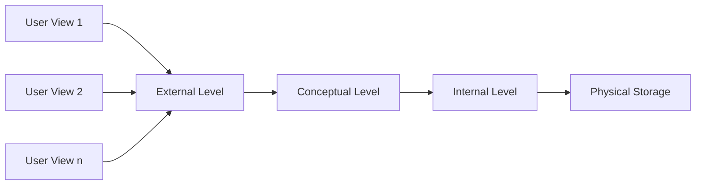
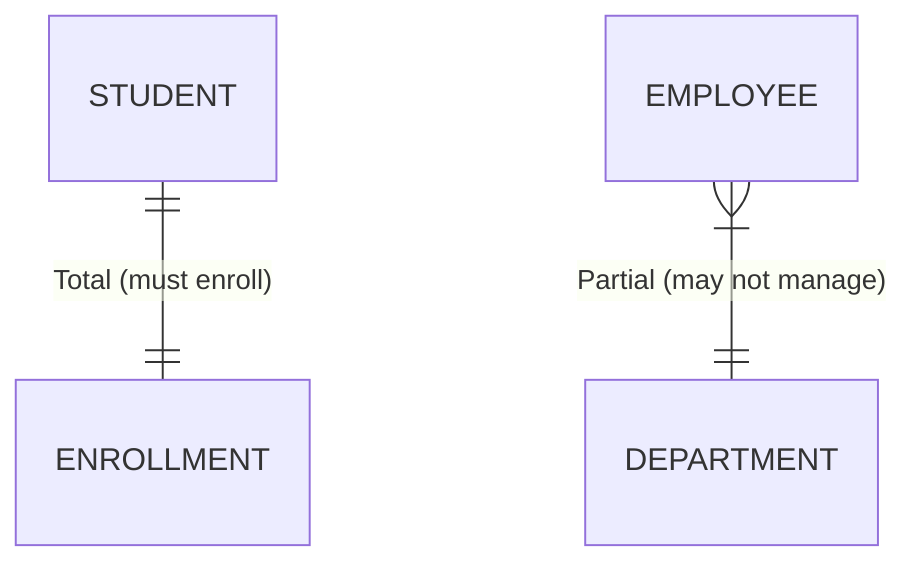
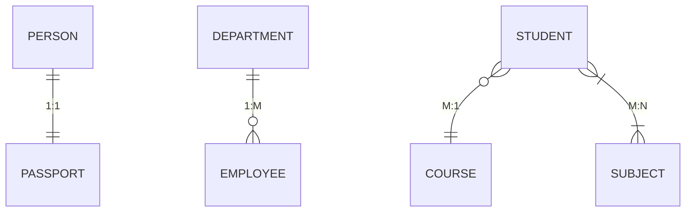
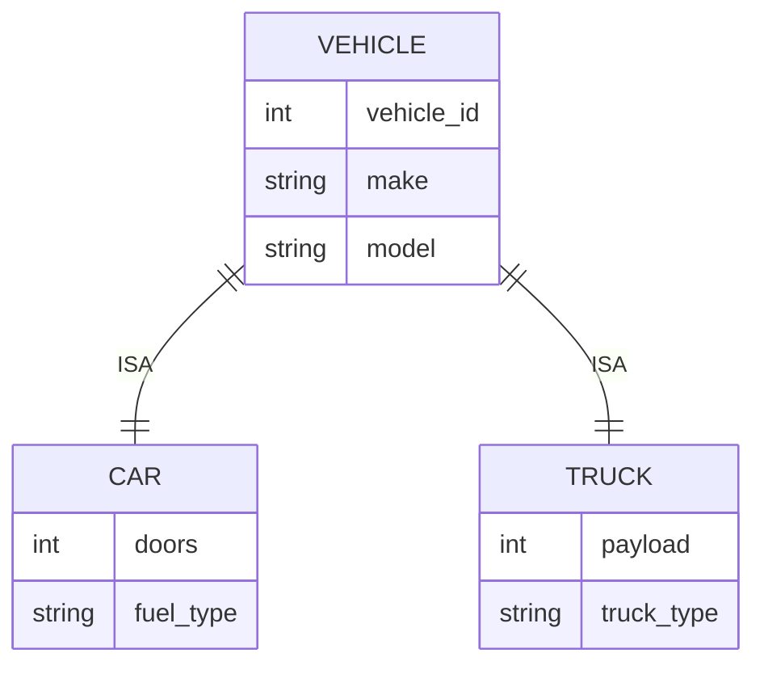
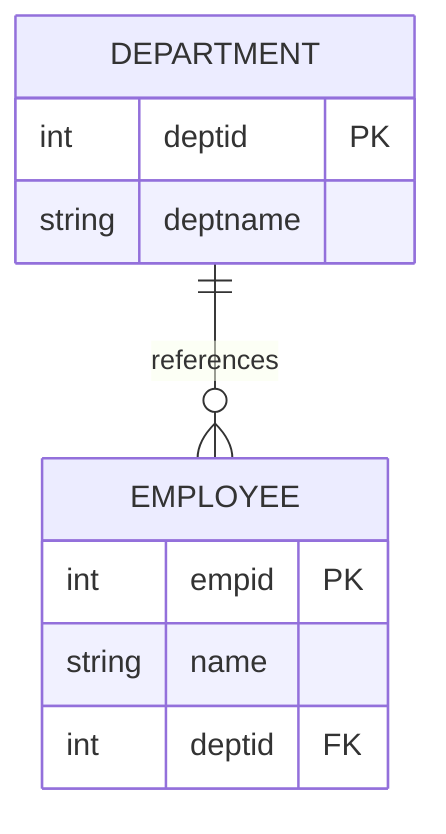
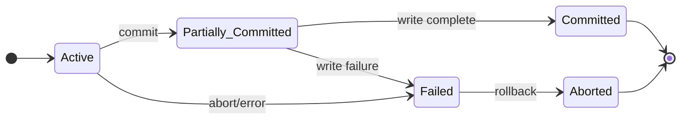

## Question 1(a) [3 marks]

**Explain three-level database architecture.**

**Answer**:

**Table:**

| Level | Description | Purpose |
|-------|-------------|---------|
| **External Level** | User views and application programs | Data abstraction for users |
| **Conceptual Level** | Complete logical structure | Organization-wide data view |
| **Internal Level** | Physical storage details | Storage and access methods |

**Diagram:**



- **External Level**: Individual user views and specific application requirements
- **Conceptual Level**: Complete database schema without storage details  
- **Internal Level**: Physical storage structures and access paths

**Mnemonic:** "ECI - Every Computer Interface"

## Question 1(b) [4 marks]

**Explain Total Participation and Partial Participation with example.**

**Answer**:

**Table:**

| Participation Type | Definition | Symbol | Example |
|-------------------|------------|---------|---------|
| **Total Participation** | Every entity must participate | Double line | Student-Course enrollment |
| **Partial Participation** | Some entities may not participate | Single line | Employee-Department management |

**Diagram:**



- **Total Participation**: All students must be enrolled in at least one course
- **Partial Participation**: Not all employees manage a department
- **Double lines** indicate total participation constraints
- **Single lines** show partial participation relationships

**Mnemonic:** "Total = Two lines, Partial = Plain line"

## Question 1(c) [7 marks]

**Explain advantages of DBMS over file management systems.**

**Answer**:

**Table:**

| Advantage | File System | DBMS |
|-----------|-------------|------|
| **Data Redundancy** | High duplication | Controlled redundancy |
| **Data Inconsistency** | Common problem | Data integrity maintained |
| **Data Sharing** | Limited sharing | Concurrent access support |
| **Security** | File-level security | User-level access control |
| **Backup & Recovery** | Manual process | Automatic mechanisms |

- **Reduced Data Redundancy**: Eliminates duplicate data storage across applications
- **Data Consistency**: Ensures uniform data across all applications
- **Data Independence**: Applications independent of data structure changes
- **Concurrent Access**: Multiple users can access data simultaneously
- **Security Control**: User authentication and authorization mechanisms
- **Backup and Recovery**: Automatic data protection and restoration
- **Data Integrity**: Constraint enforcement maintains data quality

**Mnemonic:** "RDCCSBI - Really Don't Copy, Control, Secure, Backup, Integrate"

## Question 1(c OR) [7 marks]

**List out various data models. Explain any two in brief.**

**Answer**:

**Data Models List:**

- Hierarchical Data Model
- Network Data Model  
- Relational Data Model
- Object-Oriented Data Model
- Entity-Relationship Model

**Table:**

| Model | Structure | Advantages | Disadvantages |
|-------|-----------|------------|---------------|
| **Relational Model** | Tables with rows/columns | Simple, flexible | Performance overhead |
| **Network Model** | Graph with records/links | Efficient navigation | Complex structure |

**Relational Data Model:**

- **Structure**: Data organized in tables (relations)
- **Components**: Tuples (rows), attributes (columns), domains
- **Operations**: Select, project, join operations available

**Network Data Model:**

- **Structure**: Graph-based with owner-member relationships
- **Navigation**: Explicit links between record types
- **Flexibility**: Many-to-many relationships supported naturally

**Mnemonic:** "HNROE - Have Network Relational Object Entity"

## Question 2(a) [3 marks]

**Explain Mapping Cardinalities.**

**Answer**:

**Table:**

| Cardinality | Symbol | Description | Example |
|-------------|---------|-------------|---------|
| **One-to-One** | 1:1 | Each entity relates to one other | Person-Passport |
| **One-to-Many** | 1:M | One entity relates to many | Department-Employee |
| **Many-to-One** | M:1 | Many entities relate to one | Student-Course |
| **Many-to-Many** | M:N | Many relate to many | Student-Subject |

**Diagram:**



- **Cardinality constraints** define relationship participation limits
- **Maximum cardinality** specifies upper bound of associations
- **Helps in database design** and relationship modeling

**Mnemonic:** "OMOM - One, One-Many, One-Many, Many-Many"

## Question 2(b) [4 marks]

**Explain Outer Join operation in Relational Algebra.**

**Answer**:

**Table:**

| Join Type | Symbol | Result | NULL Handling |
|-----------|---------|---------|---------------|
| **Left Outer Join** | ⟕ | All left + matching right | NULLs for unmatched right |
| **Right Outer Join** | ⟖ | All right + matching left | NULLs for unmatched left |
| **Full Outer Join** | ⟗ | All from both tables | NULLs for unmatched |

**Example:**

```
EMPLOYEE ⟕ DEPARTMENT
- Includes all employees
- NULL values for employees without departments
```

- **Preserves unmatched tuples** from specified relation(s)
- **NULL values** fill missing attribute values
- **Three types**: Left, Right, and Full outer joins
- **Useful for reporting** incomplete data relationships

**Mnemonic:** "LRF - Left Right Full outer joins"

## Question 2(c) [7 marks]

**Explain concept of Specialization and Generalization with example.**

**Answer**:

**Table:**

| Concept | Direction | Process | Example |
|---------|-----------|---------|---------|
| **Specialization** | Top-Down | General to Specific | Vehicle → Car, Truck |
| **Generalization** | Bottom-Up | Specific to General | Car, Truck → Vehicle |

**Diagram:**



**Specialization:**

- **Process**: Creating subclasses from superclass
- **Inheritance**: Subclasses inherit all superclass attributes
- **Additional attributes**: Subclasses have specific properties

**Generalization:**

- **Process**: Creating superclass from common subclass features
- **Abstraction**: Identifies common attributes and relationships
- **Simplification**: Reduces complexity through hierarchy

**Mnemonic:** "SG-TD-BU - Specialization General-To-Detail, Bottom-Up"

## Question 2(a OR) [3 marks]

**Explain different types of Keys in Relational Algebra.**

**Answer**:

**Table:**

| Key Type | Definition | Uniqueness | Example |
|----------|------------|------------|---------|
| **Super Key** | Any attribute set that uniquely identifies | Yes | {ID, Name, Phone} |
| **Candidate Key** | Minimal super key | Yes | {ID}, {Email} |
| **Primary Key** | Chosen candidate key | Yes | {StudentID} |
| **Foreign Key** | References primary key | No | {DeptID} references Dept |

- **Super Key**: Uniquely identifies tuples, may have extra attributes
- **Candidate Key**: Minimal super key without redundant attributes
- **Primary Key**: Selected candidate key for entity identification
- **Foreign Key**: Establishes referential integrity between tables

**Mnemonic:** "SCPF - Super Candidate Primary Foreign"

## Question 2(b OR) [4 marks]

**Explain types of attributes in ER-diagram with suitable example.**

**Answer**:

**Table:**

| Attribute Type | Symbol | Description | Example |
|----------------|---------|-------------|---------|
| **Simple** | Oval | Cannot be subdivided | Age, Name |
| **Composite** | Oval with sub-ovals | Can be subdivided | Address (Street, City) |
| **Derived** | Dashed oval | Calculated from others | Age from Birth_Date |
| **Multi-valued** | Double oval | Multiple values | Phone_Numbers |

**Diagram:**

```goat
    +----------+
    |   Name   |  <-- Simple
    +----------+
    
    +----------+
    |  Address |  <-- Composite
    +----+-----+
         |
    +----+---+------+
    | Street | City |
    +--------+------+
    
    +----------+
    :|Phone_No|:  <-- Multi-valued
    +----------+
    
    +----------+
    :   Age    :  <-- Derived
    +----------+
```

- **Simple attributes** are atomic and indivisible
- **Composite attributes** have meaningful sub-parts
- **Derived attributes** computed from other attribute values  
- **Multi-valued attributes** store multiple values per entity

**Mnemonic:** "SCDM - Simple Composite Derived Multi-valued"

## Question 2(c OR) [7 marks]

**Explain SELECT, PROJECT, UNION and SET-INTERSECTION operation with suitable example.**

**Answer**:

**Table:**

| Operation | Symbol | Purpose | Example |
|-----------|---------|---------|---------|
| **SELECT** | σ | Filter rows | σ(salary > 50000)(Employee) |
| **PROJECT** | π | Select columns | π(name, age)(Employee) |
| **UNION** | ∪ | Combine relations | R ∪ S |
| **INTERSECTION** | ∩ | Common tuples | R ∩ S |

**Examples:**

**SELECT Operation:**

```
σ(age > 25)(STUDENT)
- Returns students older than 25 years
```

**PROJECT Operation:**

```
π(name, course)(STUDENT)  
- Returns only name and course columns
```

**UNION Operation:**

```
SCIENCE_STUDENTS ∪ ARTS_STUDENTS
- Combines students from both streams
```

**INTERSECTION Operation:**

```
MALE_STUDENTS ∩ SPORTS_STUDENTS
- Returns male students who play sports
```

**Mnemonic:** "SPUI - Select Project Union Intersection"

## Question 3(a) [3 marks]

**Differentiate Primary Key and Foreign Key constraint.**

**Answer**:

**Table:**

| Aspect | Primary Key | Foreign Key |
|--------|-------------|-------------|
| **Purpose** | Unique identification | Referential integrity |
| **NULL Values** | Not allowed | Allowed |
| **Uniqueness** | Must be unique | Can be duplicate |
| **Number per table** | Only one | Multiple allowed |

- **Primary Key**: Ensures entity integrity within table
- **Foreign Key**: Maintains referential integrity between tables
- **Uniqueness**: Primary keys unique, foreign keys can repeat
- **NULL handling**: Primary keys never NULL, foreign keys may be NULL

**Mnemonic:** "PU-FN - Primary Unique, Foreign Nullable"

## Question 3(b) [4 marks]

**Explain DUAL table and SYSDATE with example.**

**Answer**:

**Table:**

| Component | Type | Purpose | Example |
|-----------|------|---------|---------|
| **DUAL** | Virtual table | Test expressions | SELECT 2+3 FROM DUAL |
| **SYSDATE** | System function | Current date/time | SELECT SYSDATE FROM DUAL |

**DUAL Table:**

- **Virtual table** with one row and one column
- **Used for testing** expressions and functions
- **Oracle-specific** pseudo table

**SYSDATE Function:**

- **Returns current** system date and time
- **Automatic update** with system clock
- **Date/time operations** supported

**Examples:**

```sql
SELECT SYSDATE FROM DUAL;
SELECT SYSDATE + 30 FROM DUAL;  -- 30 days later
```

**Mnemonic:** "DT-ST - DUAL Testing, SYSDATE Time"

## Question 3(c) [7 marks]

**Write SQL queries to use various numeric functions:**

**Answer**:

**Table:**

| Function | Purpose | SQL Query | Result |
|----------|---------|-----------|---------|
| **TRUNC** | Integer value | `SELECT TRUNC(125.25) FROM DUAL;` | 125 |
| **ABS** | Absolute value | `SELECT ABS(-15) FROM DUAL;` | 15 |
| **CEIL** | Ceiling value | `SELECT CEIL(55.65) FROM DUAL;` | 56 |
| **FLOOR** | Floor value | `SELECT FLOOR(100.2) FROM DUAL;` | 100 |

**SQL Queries:**

```sql
-- (a) Display integer value of 125.25
SELECT TRUNC(125.25) FROM DUAL;

-- (b) Display absolute value of(-15)  
SELECT ABS(-15) FROM DUAL;

-- (c) Display ceil value of 55.65
SELECT CEIL(55.65) FROM DUAL;

-- (d) Display floor value of 100.2
SELECT FLOOR(100.2) FROM DUAL;

-- (e) Display the square root of 16
SELECT SQRT(16) FROM DUAL;

-- (f) Show value of e³
SELECT EXP(3) FROM DUAL;

-- (g) Display result of 12 raised to 6
SELECT POWER(12, 6) FROM DUAL;

-- (h) Display result of 24 mod 2
SELECT MOD(24, 2) FROM DUAL;

-- (i) Show output of sign(-25), sign(25), sign(0)
SELECT SIGN(-25), SIGN(25), SIGN(0) FROM DUAL;
```

**Mnemonic:** "TACFSEPM - TRUNC ABS CEIL FLOOR SQRT EXP POWER MOD"

## Question 3(a OR) [3 marks]

**Explain Unique and Check Constraint with suitable example.**

**Answer**:

**Table:**

| Constraint | Purpose | Duplicates | Example |
|------------|---------|------------|---------|
| **UNIQUE** | Prevent duplicates | Not allowed | Email address |
| **CHECK** | Validate data | Value restrictions | Age > 0 |

**Examples:**

```sql
-- UNIQUE Constraint
CREATE TABLE Student (
    email VARCHAR(50) UNIQUE,
    phone VARCHAR(15) UNIQUE
);

-- CHECK Constraint  
CREATE TABLE Employee (
    age NUMBER CHECK (age >= 18),
    salary NUMBER CHECK (salary > 0)
);
```

- **UNIQUE constraint** ensures no duplicate values in column
- **CHECK constraint** validates data against specified conditions
- **Multiple constraints** can be applied to single column

**Mnemonic:** "UC-DV - Unique no Copy, Check Validates"

## Question 3(b OR) [4 marks]

**Explain structure of PL/SQL block.**

**Answer**:

**Table:**

| Section | Required | Purpose | Example |
|---------|----------|---------|---------|
| **DECLARE** | Optional | Variable declarations | var_name VARCHAR2(20); |
| **BEGIN** | Mandatory | Executable statements | SELECT ... INTO var; |
| **EXCEPTION** | Optional | Error handling | WHEN OTHERS THEN ... |
| **END** | Mandatory | Block termination | END; |

**Diagram:**

```
DECLARE
    -- Variable declarations
BEGIN  
    -- Executable statements
EXCEPTION
    -- Error handling
END;
```

- **DECLARE section**: Variable and cursor declarations
- **BEGIN-END**: Mandatory executable section
- **EXCEPTION section**: Error handling routines
- **Nested blocks**: PL/SQL blocks can be nested

**Mnemonic:** "DBE-E - Declare Begin Exception End"

## Question 3(c OR) [7 marks]

**Consider the following table and solve queries:**

**Answer**:

**I) Create the BRANCH table:**

```sql
CREATE TABLE BRANCH (
    branchid VARCHAR2(10) PRIMARY KEY,
    branchname VARCHAR2(50) NOT NULL,
    address VARCHAR2(100)
);
```

**II) Create the EMPLOYEE table:**

```sql
CREATE TABLE EMPLOYEE (
    empid VARCHAR2(10) PRIMARY KEY,
    name VARCHAR2(50) NOT NULL,
    post VARCHAR2(30),
    gender CHAR(1) CHECK (gender IN ('M', 'F')),
    birthdate DATE,
    salary NUMBER(10,2),
    branchid VARCHAR2(10),
    FOREIGN KEY (branchid) REFERENCES BRANCH(branchid)
);
```

**III) Find employees in Ahmedabad branch:**

```sql
SELECT e.* FROM EMPLOYEE e, BRANCH b 
WHERE e.branchid = b.branchid 
AND b.branchname = 'Ahmedabad';
```

**IV) Find employees born in 1998:**

```sql
SELECT * FROM EMPLOYEE 
WHERE EXTRACT(YEAR FROM birthdate) = 1998;
```

**V) Find female employees with salary > 5000:**

```sql
SELECT * FROM EMPLOYEE 
WHERE gender = 'F' AND salary > 5000;
```

**VI) Find address where Ajay works:**

```sql
SELECT b.address FROM EMPLOYEE e, BRANCH b
WHERE e.branchid = b.branchid 
AND e.name = 'Ajay';
```

**Mnemonic:** "CBEFFA - Create Branch Employee Find Female Address"

## Question 4(a) [3 marks]

**Explain Referential Integrity with suitable example.**

**Answer**:

**Table:**

| Aspect | Description | Example |
|--------|-------------|---------|
| **Definition** | Foreign key must reference existing primary key | Employee.deptid → Department.deptid |
| **Purpose** | Maintain data consistency | Prevent orphan records |
| **Actions** | CASCADE, SET NULL, RESTRICT | ON DELETE CASCADE |

**Diagram:**



- **Referential integrity** ensures foreign key values exist in referenced table
- **Orphan records** prevented by constraint enforcement
- **Cascade operations** maintain consistency during updates/deletes

**Mnemonic:** "RIO - Referential Integrity prevents Orphans"

## Question 4(b) [4 marks]

**Differentiate Partial and Full Functional Dependency.**

**Answer**:

**Table:**

| Dependency Type | Definition | Example | Requirement |
|-----------------|------------|---------|-------------|
| **Partial** | Depends on part of composite key | (StudentID, CourseID) → StudentName | Composite primary key |
| **Full** | Depends on entire key | (StudentID, CourseID) → Grade | Complete key needed |

**Examples:**

**Partial Functional Dependency:**

```
(StudentID, CourseID) → StudentName
StudentName depends only on StudentID, not CourseID
```

**Full Functional Dependency:**

```
(StudentID, CourseID) → Grade  
Grade depends on both StudentID and CourseID
```

- **Partial dependency** causes data redundancy and anomalies
- **Full dependency** required for proper normalization
- **2NF eliminates** partial functional dependencies

**Mnemonic:** "PF-CF - Partial Few, Complete Full"

## Question 4(c) [7 marks]

**Explain 3rd Normal Form with example.**

**Answer**:

**3rd Normal Form Requirements:**

1. Must be in 2NF
2. No transitive dependencies
3. Non-key attributes depend only on primary key

**Table Before 3NF:**

| StudentID | StudentName | CourseID | CourseName | InstructorID | InstructorName |
|-----------|-------------|----------|------------|--------------|----------------|
| S1 | John | C1 | Math | I1 | Dr. Smith |
| S2 | Jane | C1 | Math | I1 | Dr. Smith |

**Problems:**

- **Transitive dependency**: StudentID → CourseID → InstructorName
- **Update anomaly**: Instructor name change requires multiple updates
- **Delete anomaly**: Removing student may lose instructor information

**3NF Solution:**

**STUDENT Table:**

| StudentID | StudentName | CourseID |
|-----------|-------------|----------|
| S1 | John | C1 |
| S2 | Jane | C1 |

**COURSE Table:**

| CourseID | CourseName | InstructorID |
|----------|------------|--------------|
| C1 | Math | I1 |

**INSTRUCTOR Table:**

| InstructorID | InstructorName |
|--------------|----------------|
| I1 | Dr. Smith |

**Mnemonic:** "3NF-NT - 3rd Normal Form No Transitives"

## Question 4(a OR) [3 marks]

**Explain Importance of Normalization.**

**Answer**:

**Table:**

| Benefit | Problem Solved | Result |
|---------|----------------|---------|
| **Reduce Redundancy** | Duplicate data | Storage efficiency |
| **Eliminate Anomalies** | Update/Insert/Delete issues | Data consistency |
| **Improve Integrity** | Data inconsistency | Reliable information |

- **Data redundancy minimized** through proper table decomposition
- **Update anomalies eliminated** by removing duplicate information
- **Storage space optimized** through normalized structure
- **Data integrity maintained** with referential constraints
- **Maintenance simplified** with logical table organization

**Mnemonic:** "RESIM - Redundancy Eliminated, Storage Improved, Maintenance"

## Question 4(b OR) [4 marks]

**Differentiate Prime Attributes and Non-Prime Attributes.**

**Answer**:

**Table:**

| Attribute Type | Definition | Role | Example |
|----------------|------------|------|---------|
| **Prime** | Part of candidate key | Key formation | StudentID, CourseID |
| **Non-Prime** | Not part of any candidate key | Data storage | StudentName, Grade |

**Example:**

```
ENROLLMENT (StudentID, CourseID, Grade, Semester)
Candidate Key: (StudentID, CourseID)

Prime Attributes: StudentID, CourseID
Non-Prime Attributes: Grade, Semester
```

- **Prime attributes** participate in candidate key formation
- **Non-Prime attributes** provide additional entity information
- **Functional dependencies** between these determine normal forms
- **2NF requires** no partial dependencies of non-prime on prime attributes

**Mnemonic:** "PN-KD - Prime in Key, Non-prime for Data"

## Question 4(c OR) [7 marks]

**Explain 2nd Normal Form with example.**

**Answer**:

**2nd Normal Form Requirements:**

1. Must be in 1NF
2. No partial functional dependencies
3. All non-key attributes fully depend on primary key

**Table Before 2NF:**

| StudentID | CourseID | StudentName | CourseName | Grade |
|-----------|----------|-------------|------------|-------|
| S1 | C1 | John | Math | A |
| S1 | C2 | John | Physics | B |
| S2 | C1 | Jane | Math | A |

**Problems:**

- **Partial Dependencies**: StudentID → StudentName, CourseID → CourseName
- **Update Anomaly**: Student name change requires multiple updates
- **Insert Anomaly**: Cannot add course without student enrollment

**2NF Solution:**

**STUDENT Table:**

| StudentID | StudentName |
|-----------|-------------|
| S1 | John |
| S2 | Jane |

**COURSE Table:**

| CourseID | CourseName |
|----------|------------|
| C1 | Math |
| C2 | Physics |

**ENROLLMENT Table:**

| StudentID | CourseID | Grade |
|-----------|----------|-------|
| S1 | C1 | A |
| S1 | C2 | B |
| S2 | C1 | A |

**Mnemonic:** "2NF-FD - 2nd Normal Form Full Dependencies"

## Question 5(a) [3 marks]

**Explain Transaction states with proper diagram.**

**Answer**:

**Diagram:**



**Table:**

| State | Description | Next State |
|-------|-------------|------------|
| **Active** | Transaction executing | Partially Committed/Failed |
| **Partially Committed** | Last statement executed | Committed/Failed |
| **Committed** | Transaction successful | End |
| **Failed** | Cannot proceed normally | Aborted |
| **Aborted** | Transaction rolled back | End |

- **Active state**: Transaction currently executing operations
- **Partially committed**: All operations executed, waiting for commit
- **Failed state**: Error occurred, transaction cannot continue

**Mnemonic:** "APCFA - Active Partial Commit Fail Abort"

## Question 5(b) [4 marks]

**Explain any two DDL commands with a suitable example.**

**Answer**:

**Table:**

| Command | Purpose | Syntax | Example |
|---------|---------|---------|---------|
| **CREATE** | Create database objects | CREATE TABLE | CREATE TABLE Student(...) |
| **ALTER** | Modify existing objects | ALTER TABLE | ALTER TABLE Student ADD... |

**CREATE Command:**

```sql
CREATE TABLE EMPLOYEE (
    empid NUMBER(5) PRIMARY KEY,
    name VARCHAR2(50) NOT NULL,
    salary NUMBER(10,2),
    deptid NUMBER(3)
);
```

**ALTER Command:**

```sql
-- Add new column
ALTER TABLE EMPLOYEE ADD phone VARCHAR2(15);

-- Modify existing column
ALTER TABLE EMPLOYEE MODIFY name VARCHAR2(100);

-- Drop column
ALTER TABLE EMPLOYEE DROP COLUMN phone;
```

- **CREATE** establishes new database structures
- **ALTER** modifies existing table definitions
- **DDL commands** auto-commit changes
- **Schema changes** affect data structure permanently

**Mnemonic:** "CA-NM - CREATE Adds, ALTER Modifies"

## Question 5(c) [7 marks]

**Explain ACID Properties in detail.**

**Answer**:

**Table:**

| Property | Definition | Purpose | Example |
|----------|------------|---------|---------|
| **Atomicity** | All or nothing execution | Transaction integrity | Bank transfer |
| **Consistency** | Database remains valid | Data integrity | Balance constraints |
| **Isolation** | Concurrent execution independence | Concurrency control | Separate transactions |
| **Durability** | Committed changes permanent | Recovery guarantee | Power failure survival |

**Atomicity:**

- **All operations** in transaction execute completely or not at all
- **Rollback mechanism** undoes partial changes on failure
- **Example**: Bank transfer requires both debit and credit operations

**Consistency:**

- **Database state** remains valid before and after transaction
- **Integrity constraints** maintained throughout execution
- **Example**: Account balance never becomes negative

**Isolation:**

- **Concurrent transactions** do not interfere with each other
- **Locking mechanisms** prevent interference
- **Example**: Two users updating same account simultaneously

**Durability:**

- **Committed changes** survive system failures
- **Write-ahead logging** ensures recovery capability
- **Example**: Transaction survives power outage after commit

**Mnemonic:** "ACID - Atomicity Consistency Isolation Durability"

## Question 5(a OR) [3 marks]

**What is two phase locking technique?**

**Answer**:

**Table:**

| Phase | Action | Description | Lock Operations |
|-------|--------|-------------|-----------------|
| **Growing Phase** | Acquire locks | Transaction obtains all needed locks | LOCK only |
| **Shrinking Phase** | Release locks | Transaction releases locks one by one | UNLOCK only |

**Diagram:**

```goat
Number of Locks
      ^
      |     /\
      |    /  \
      |   /    \
      |  /      \
      | /        \
      |/          \
      +------------>
     Growing  Shrinking
     Phase     Phase
        Time
```

- **Two phases**: Growing (lock acquisition) and Shrinking (lock release)
- **No lock upgrades** allowed after first unlock operation
- **Prevents deadlocks** when properly implemented
- **Serializability guarantee** for concurrent transactions

**Mnemonic:** "2PL-GS - Two Phase Locking Growing Shrinking"

## Question 5(b OR) [4 marks]

**Explain any two DML commands with a suitable example.**

**Answer**:

**Table:**

| Command | Purpose | Syntax | Example |
|---------|---------|---------|---------|
| **INSERT** | Add new records | INSERT INTO | INSERT INTO Student VALUES... |
| **UPDATE** | Modify existing records | UPDATE SET | UPDATE Student SET name=... |

**INSERT Command:**

```sql
-- Insert single record
INSERT INTO EMPLOYEE (empid, name, salary, deptid)
VALUES (101, 'John Smith', 50000, 10);

-- Insert multiple records
INSERT INTO EMPLOYEE 
VALUES (102, 'Jane Doe', 45000, 20),
       (103, 'Bob Wilson', 55000, 10);
```

**UPDATE Command:**

```sql
-- Update single record
UPDATE EMPLOYEE 
SET salary = 60000 
WHERE empid = 101;

-- Update multiple records
UPDATE EMPLOYEE 
SET salary = salary * 1.10 
WHERE deptid = 10;
```

- **INSERT** adds new rows to table
- **UPDATE** modifies existing row values
- **WHERE clause** specifies update conditions
- **DML commands** require explicit commit

**Mnemonic:** "IU-AM - INSERT Adds, UPDATE Modifies"

## Question 5(c OR) [7 marks]

**List problems of concurrency control and explain any two in detail.**

**Answer**:

**Concurrency Control Problems:**

1. Lost Update Problem
2. Dirty Read Problem  
3. Unrepeatable Read Problem
4. Phantom Read Problem
5. Inconsistent Analysis Problem

**Table:**

| Problem | Description | Solution |
|---------|-------------|----------|
| **Lost Update** | One transaction overwrites another's changes | Locking mechanisms |
| **Dirty Read** | Reading uncommitted data | Read committed isolation |

**Lost Update Problem:**

- **Scenario**: Two transactions read same data, modify it, and write back
- **Example**:
  - T1 reads account balance: $1000
  - T2 reads account balance: $1000  
  - T1 adds $100, writes $1100
  - T2 subtracts $50, writes $950
  - **Result**: T1's update lost, final balance incorrect

**Dirty Read Problem:**

- **Scenario**: Transaction reads data modified by another uncommitted transaction
- **Example**:
  - T1 updates account balance from $1000 to $1500
  - T2 reads balance as $1500 (uncommitted data)
  - T1 fails and rolls back to $1000
  - **Result**: T2 used incorrect data for calculations

**Solutions:**

- **Locking protocols**: Prevent simultaneous access to same data
- **Isolation levels**: Control visibility of uncommitted changes
- **Timestamp ordering**: Order transactions based on timestamps
- **Multi-version concurrency**: Maintain multiple data versions

**Mnemonic:** "LDUI - Lost Dirty Unrepeatable Inconsistent"
