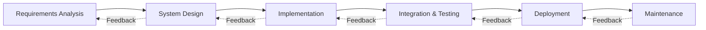
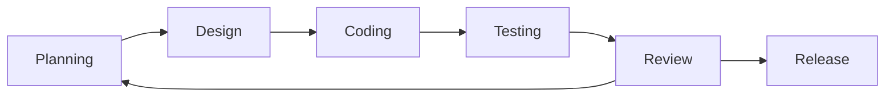
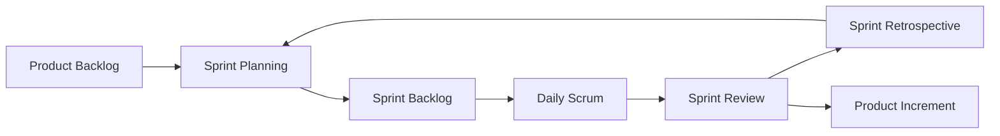
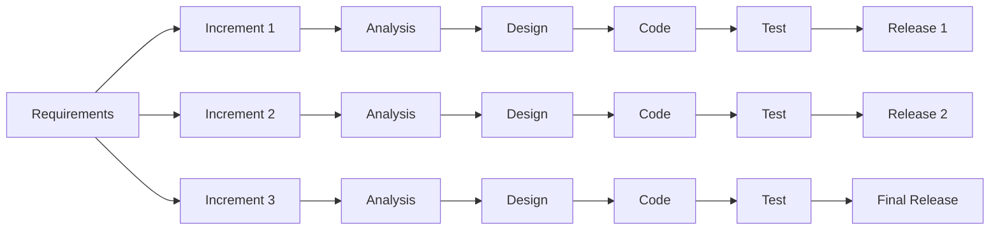
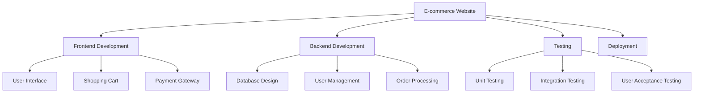
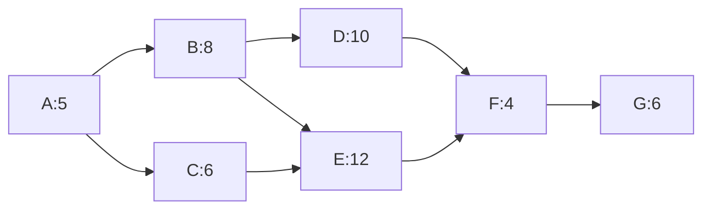
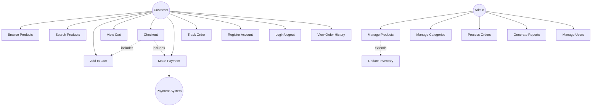
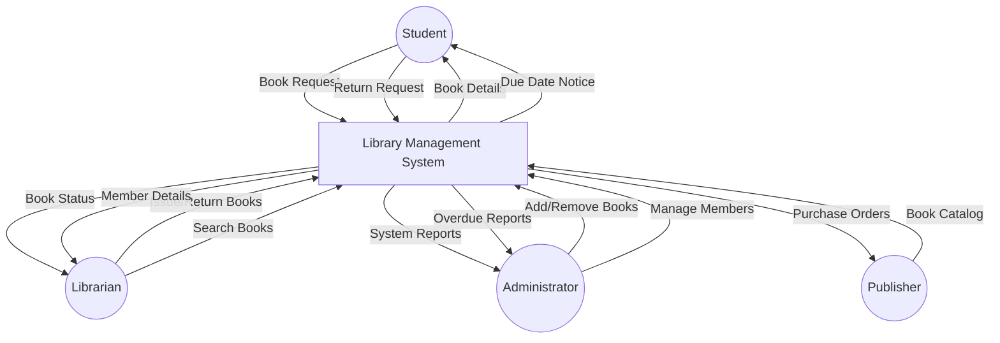
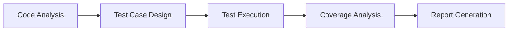
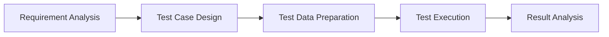

## પ્રશ્ન 1(a) [3 ગુણ]

**સોફ્ટવેર એન્જિનિયરિંગ layered approach સમજાવો.**

**જવાબ**:

સોફ્ટવેર એન્જિનિયરિંગ એક layered approach અપનાવે છે જેમાં ચાર મુખ્ય layers હોય છે જે ગુણવત્તાયુક્ત સોફ્ટવેર પ્રોડક્ટ બનાવવા માટે સાથે કામ કરે છે.

**ટેબલ: સોફ્ટવેર એન્જિનિયરિંગ Layered Approach**

| Layer | વર્ણન | હેતુ |
|-------|--------|------|
| **Quality Focus** | સતત સુધારા પર ભાર મૂકતું foundation layer | ખામી-મુક્ત પ્રોડક્ટ્સ બનાવવા |
| **Process** | પ્રવૃત્તિઓ અને કાર્યોનું framework | વ્યવસ્થિત વિકાસ પ્રક્રિયા પૂરી પાડવી |
| **Methods** | વિશ્લેષણ, ડિઝાઇન, કોડિંગ, ટેસ્ટિંગ માટે તકનીકી પ્રક્રિયાઓ | "કેવી રીતે કરવું" તે માર્ગદર્શન આપવું |
| **Tools** | Process અને methods માટે automated support | કાર્યક્ષમતા અને સુસંગતતા પૂરી પાડવી |

- **Quality Focus**: ગ્રાહક સંતોષ સુનિશ્ચિત કરતું foundation બનાવે છે
- **Process Layer**: કાર્યપ્રવાહ અને પ્રોજેક્ટ મેનેજમેન્ટ પ્રવૃત્તિઓ વ્યાખ્યાયિત કરે છે
- **Methods Layer**: દરેક વિકાસ તબક્કા માટે તકનીકી અભિગમ પૂરો પાડે છે
- **Tools Layer**: ઓટોમેશન અને integration ને સપોર્ટ કરે છે

**મેમરી ટ્રીક:** "Quality Processes Make Tools" - નીચેથી ઉપર સુધીના ચાર layers યાદ રાખો.

---

## પ્રશ્ન 1(b) [4 ગુણ]

**Iterative Waterfall model સમજાવો.**

**જવાબ**:

Iterative Waterfall Model એ waterfall ની structured approach અને સુધારા અને ભૂલ સુધારણા માટે feedback loops ને જોડે છે.



**મુખ્ય લક્ષણો:**

- **ક્રમિક તબક્કાઓ**: દરેક તબક્કો પૂર્ણ થયા પછી આગળનો શરૂ થાય છે
- **Feedback loops**: અગાઉના તબક્કાઓમાં પાછા જવાની મંજૂરી આપે છે
- **Documentation driven**: દરેક તબક્કામાં documentation પર ભારે ભાર
- **ભૂલ સુધારણા**: પછીના તબક્કાઓમાં ઓળખાયેલી સમસ્યાઓ સુધારી શકાય છે

**મેમરી ટ્રીક:** "Water Falls Back Up" - ઉપરની તરફ feedback ક્ષમતા સાથે sequential flow.

---

## પ્રશ્ન 1(c) [7 ગુણ]

**Agile મોડેલ અને Agile Principles સમજાવો.**

**જવાબ**:

Agile એ iterative સોફ્ટવેર ડેવલપમેન્ટ methodology છે જે સહયોગ, ગ્રાહક feedback, અને કાર્યશીલ સોફ્ટવેરની ઝડપી delivery પર ભાર મૂકે છે.

**ટેબલ: Agile Values વિ Traditional Approach**

| Agile Values | Traditional Approach |
|--------------|---------------------|
| વ્યક્તિઓ અને આંતરક્રિયાઓ | પ્રક્રિયાઓ અને ટૂલ્સ |
| કાર્યશીલ સોફ્ટવેર | વ્યાપક documentation |
| ગ્રાહક સહયોગ | કરાર વાટાઘાટ |
| પરિવર્તનનો પ્રતિસાદ | યોજનાને અનુસરવી |

**મુખ્ય Agile સિદ્ધાંતો:**

- **ગ્રાહક સંતોષ**: મૂલ્યવાન સોફ્ટવેર વહેલી અને સતત delivery
- **પરિવર્તનનું સ્વાગત**: વિકાસ દરમિયાન મોડેથી આવતા બદલાવો પણ સ્વીકારવા
- **વારંવાર delivery**: કાર્યશીલ સોફ્ટવેર વારંવાર deliver કરવું (મહિનાને બદલે અઠવાડિયાઓમાં)
- **સહયોગ**: વ્યાપારિક લોકો અને developers દરરોજ સાથે કામ કરે
- **પ્રેરિત વ્યક્તિઓ**: પ્રેરિત લોકોની આસપાસ પ્રોજેક્ટ્સ બનાવવા
- **આમને-સામનો વાતચીત**: સંદેશાવ્યવહારની સૌથી અસરકારક પદ્ધતિ
- **કાર્યશીલ સોફ્ટવેર**: પ્રગતિનું પ્રાથમિક માપદંડ
- **ટકાઉ વિકાસ**: અનિશ્ચિત સમય સુધી સતત ગતિ જાળવવી
- **તકનીકી ઉત્કૃષ્ટતા**: સારી ડિઝાઇન પર સતત ધ્યાન
- **સરળતા**: ન કરેલા કામને વધુ મહત્ત્વ આપવાની કળા
- **સ્વ-સંગઠિત ટીમો**: સ્વ-સંગઠિત ટીમોમાંથી શ્રેષ્ઠ requirements બહાર આવે છે
- **નિયમિત પ્રતિબિંબ**: ટીમ વર્તનને પ્રતિબિંબિત કરે અને ગોઠવે છે

**આકૃતિ: Agile Development Cycle**



**મેમરી ટ્રીક:** "Customer Change Frequently Collaborates" - મુખ્ય agile સિદ્ધાંતો પર ધ્યાન.

---

## પ્રશ્ન 1(c OR) [7 ગુણ]

**Scrum પર ટૂંક નોંધ લખો.**

**જવાબ**:

Scrum એ ટીમ સહયોગ અને iterative પ્રગતિ પર ભાર મૂકીને સોફ્ટવેર ડેવલપમેન્ટ મેનેજ કરવા માટેનું agile framework છે.

**ટેબલ: Scrum Roles અને જવાબદારીઓ**

| Role | જવાબદારીઓ | મુખ્ય પ્રવૃત્તિઓ |
|------|-------------|------------------|
| **Product Owner** | પ્રોડક્ટ features અને priorities વ્યાખ્યાયિત કરે | Product backlog મેનેજ કરે |
| **Scrum Master** | પ્રક્રિયાને સુવિધા આપે અને અવરોધો દૂર કરે | Ceremonies આયોજિત કરે |
| **Development Team** | કાર્યશીલ સોફ્ટવેર બનાવે | સ્વ-સંગઠિત અને cross-functional |

**Scrum Events:**

- **Sprint**: 1-4 અઠવાડિયાનું iteration જે સંભવિત shippable product બનાવે
- **Sprint Planning**: આગામી sprint માટે ટીમ કામની યોજના બનાવે
- **Daily Scrum**: 15 મિનિટની દૈનિક synchronization બેઠક
- **Sprint Review**: stakeholders ને પૂર્ણ થયેલું કામ દર્શાવવું
- **Sprint Retrospective**: પ્રક્રિયા સુધારણા પર ટીમનું પ્રતિબિંબ

**Scrum Artifacts:**

- **Product Backlog**: features ની પ્રાથમિકતા આધારિત યાદી
- **Sprint Backlog**: વર્તમાન sprint માટે પસંદ કરેલી items
- **Increment**: Sprint ના અંતે કાર્યશીલ પ્રોડક્ટ

**આકૃતિ: Scrum Process Flow**



**મેમરી ટ્રીક:** "Product Sprints Daily Reviews" - મુખ્ય scrum elements નો ક્રમ.

---

## પ્રશ્ન 2(a) [3 ગુણ]

**જો તમે એક word processing software બનાવી રહ્યા હોઈ તો તમે ક્યા process model નો ઉપયોગ કરશો? તમારો જવાબ સમજાવો.**

**જવાબ**:

Word processing software ડેવલપમેન્ટ માટે હું **Incremental Model** ને સૌથી યોગ્ય process model તરીકે પસંદ કરીશ.

**બચાવ:**

- **જટિલ functionality**: Word processors માં અસંખ્ય features છે (editing, formatting, spell-check) જે incrementally વિકસિત કરી શકાય
- **User feedback**: પ્રારંભિક increments user testing અને feedback incorporation ની મંજૂરી આપે છે
- **જોખમ મેનેજમેન્ટ**: મુખ્ય features પહેલા deliver, advanced features પછીથી ઉમેરવા
- **બજાર લાભ**: બેઝિક વર્ઝન વહેલું રિલીઝ કરીને બજારમાં હાજરી મેળવી શકાય

**ડેવલપમેન્ટ Increments:**

1. **Increment 1**: મૂળભૂત text editing અને file operations
2. **Increment 2**: Formatting અને font management
3. **Increment 3**: Advanced features (spell-check, templates)

**મેમરી ટ્રીક:** "Word Processing Increments User Feedback" - જટિલ સોફ્ટવેર માટે incremental approach યોગ્ય.

---

## પ્રશ્ન 2(b) [4 ગુણ]

**સારા SRS ની લાક્ષણિકતાઓ સમજાવો.**

**જવાબ**:

સારા Software Requirements Specification (SRS) દસ્તાવેજમાં સફળ સોફ્ટવેર ડેવલપમેન્ટ સુનિશ્ચિત કરવા માટે ચોક્કસ લાક્ષણિકતાઓ હોવી જરૂરી છે.

**ટેબલ: સારા SRS ની લાક્ષણિકતાઓ**

| લાક્ષણિકતા | વર્ણન | મહત્વ |
|-------------|--------|--------|
| **સંપૂર્ણ** | બધી જરૂરી requirements ધરાવે | Scope creep અટકાવે છે |
| **સુસંગત** | કોઈ વિરોધાભાસી requirements નહીં | Implementation confusion ટાળે છે |
| **અસ્પષ્ટતા રહિત** | સ્પષ્ટ અને ચોક્કસ ભાષા | એક જ અર્થઘટન શક્ય |
| **ચકાસી શકાય તેવું** | Requirements ટેસ્ટ કરી શકાય | Validation શક્ય બનાવે |
| **સુધારી શકાય તેવું** | બદલવા અને જાળવવામાં સરળ | Requirement evolution ને સપોર્ટ કરે |
| **ટ્રેસેબલ** | Requirements સ્રોતો સાથે જોડાયેલ | Impact analysis શક્ય બનાવે |

**વધારાની લાક્ષણિકતાઓ:**

- **શક્ય**: તકનીકી અને આર્થિક રીતે સાધ્ય
- **જરૂરી**: દરેક requirement નો હેતુ હોય
- **પ્રાથમિકતા આપેલ**: Requirements મહત્વ પ્રમાણે ક્રમાંકિત
- **ટેસ્ટ કરી શકાય તેવું**: ચકાસણી માટે ચોક્કસ માપદંડો

**મેમરી ટ્રીક:** "Complete Consistent Unambiguous Verifiable" - મુખ્ય SRS ગુણવત્તા લક્ષણો.

---

## પ્રશ્ન 2(c) [7 ગુણ]

**ATM software માટે functional અને non-functional requirements સમજાવો.**

**જવાબ**:

ATM software requirements ને functional (સિસ્ટમ શું કરે છે) અને non-functional (સિસ્ટમ કેવી રીતે perform કરે છે) requirements માં વર્ગીકૃત કરવામાં આવે છે.

**ટેબલ: ATM Functional Requirements**

| Function | વર્ણન | ઉદાહરણ |
|----------|--------|----------|
| **પ્રમાણીકરણ** | યુઝર લોગિન અને ચકાસણી | PIN validation, card reading |
| **એકાઉન્ટ ઓપરેશન્સ** | મૂળભૂત બેંકિંગ વ્યવહારો | બેલેન્સ પૂછપરછ, રોકડ ઉપાડ |
| **Transaction Processing** | પૈસા ટ્રાન્સફર અને જમા | એકાઉન્ટ-ટુ-એકાઉન્ટ ટ્રાન્સફર |
| **Receipt Generation** | વ્યવહાર documentation | Transaction receipts પ્રિન્ટ કરવી |
| **Session Management** | યુઝર session નિયંત્રણ | Timeout, logout functionality |

**ટેબલ: ATM Non-Functional Requirements**

| શ્રેણી | Requirement | સ્પેસિફિકેશન |
|--------|-------------|---------------|
| **Performance** | Response time | પ્રતિ transaction મહત્તમ 3 સેકન્ડ |
| **Security** | ડેટા સુરક્ષા | બધા ડેટા માટે 256-bit encryption |
| **Reliability** | સિસ્ટમ ઉપલબ્ધતા | 99.9% uptime requirement |
| **Usability** | યુઝર interface | બધી ઉંમરના લોકો માટે સરળ interface |
| **Scalability** | લોડ હેન્ડલિંગ | 1000 concurrent users ને સપોર્ટ |

**Functional Requirements વિગતો:**

- **રોકડ ઉપાડ**: સફળ પ્રમાણીકરણ પછી રોકડ આપવી
- **બેલેન્સ પૂછપરછ**: વર્તમાન એકાઉન્ટ બેલેન્સ દર્શાવવું
- **PIN બદલવી**: યુઝર્સને તેમની PIN અપડેટ કરવાની મંજૂરી
- **મિની સ્ટેટમેન્ટ**: છેલ્લા 10 transactions પૂરા પાડવા

**Non-Functional Requirements વિગતો:**

- **સુરક્ષા**: Multi-factor authentication, transaction logging
- **Performance**: ઝડપી transaction processing, ન્યૂનતમ રાહ જોવાનો સમય
- **ઉપલબ્ધતા**: ન્યૂનતમ downtime સાથે 24/7 ઓપરેશન
- **જાળવણીક્ષમતા**: સરળ software updates અને hardware maintenance

**મેમરી ટ્રીક:** "Functions Work, Quality Matters" - Functional વિ non-functional ભેદ.

---

## પ્રશ્ન 2(a OR) [3 ગુણ]

**આકૃતિ સાથે Incremental Model સમજાવો.**

**જવાબ**:

Incremental Model એ સોફ્ટવેરને increments તરીકે ઓળખાતા નાના, મેનેજ કરી શકાય તેવા ભાગોમાં વિકસિત કરે છે, જેમાં દરેક increment હાલની સિસ્ટમમાં નવી functionality ઉમેરે છે.

**આકૃતિ: Incremental Model**



**મુખ્ય લક્ષણો:**

- **સમાંતર વિકાસ**: અનેક increments એક સાથે વિકસિત
- **પ્રારંભિક delivery**: પ્રથમ increment પછી કાર્યશીલ સોફ્ટવેર ઉપલબ્ધ
- **જોખમ ઘટાડો**: મુખ્ય functionality પહેલા deliver

**મેમરી ટ્રીક:** "Increments Build Upon Previous" - દરેક increment હાલની functionality પર ઉમેરે છે.

---

## પ્રશ્ન 2(b OR) [4 ગુણ]

**Functional અને non-functional requirements નો તફાવત સમજાવો.**

**જવાબ**:

**ટેબલ: Functional વિ Non-Functional Requirements**

| પાસું | Functional Requirements | Non-Functional Requirements |
|------|------------------------|----------------------------|
| **વ્યાખ્યા** | સિસ્ટમ શું કરે છે | સિસ્ટમ કેવી રીતે perform કરે છે |
| **ફોકસ** | સિસ્ટમ વર્તન અને features | સિસ્ટમ ગુણવત્તા લક્ષણો |
| **ટેસ્ટિંગ** | Black-box testing | Performance અને stress testing |
| **Documentation** | Use cases, user stories | Quality metrics, constraints |
| **ઉદાહરણો** | Login, search, calculate | Speed, security, usability |
| **ચકાસણી** | Functional testing | Non-functional testing |
| **બદલાવની અસર** | Feature modification | Performance tuning |
| **યુઝર દૃશ્યતા** | યુઝર્સને સીધી દેખાય છે | પરોક્ષ રીતે અનુભવાય છે |

**Functional Requirements લાક્ષણિકતાઓ:**

- **વર્તન-કેન્દ્રિત**: સિસ્ટમ ક્રિયાઓ અને પ્રતિસાદો વ્યાખ્યાયિત કરે
- **Feature-વિશિષ્ટ**: દરેક requirement ચોક્કસ ક્ષમતા વર્ણવે છે
- **યુઝર-સંચાલિત**: યુઝર જરૂરિયાતો અને બિઝનેસ પ્રક્રિયાઓ પર આધારિત

**Non-Functional Requirements લાક્ષણિકતાઓ:**

- **ગુણવત્તા-કેન્દ્રિત**: Performance અને ગુણવત્તા ધોરણો વ્યાખ્યાયિત કરે
- **સિસ્ટમ-વ્યાપી**: ચોક્કસ features ને બદલે સમગ્ર સિસ્ટમ પર લાગુ પડે
- **અવરોધ-સંચાલિત**: સિસ્ટમ ઓપરેશન માટે મર્યાદાઓ અને બાઉન્ડરીઝ સેટ કરે

**મેમરી ટ્રીક:** "Functions Do, Quality Shows" - Functional requirements ક્રિયાઓ વ્યાખ્યાયિત કરે, non-functional ગુણવત્તા વ્યાખ્યાયિત કરે.

---

## પ્રશ્ન 2(c OR) [7 ગુણ]

**Requirements Analysis પર ટૂંક નોંધ લખો.**

**જવાબ**:

Requirements Analysis એ યુઝર જરૂરિયાતોનો અભ્યાસ કરવાની અને સોફ્ટવેર સિસ્ટમે શું સિદ્ધ કરવું જોઈએ તે સમજવા માટે સિસ્ટમ requirements વ્યાખ્યાયિત કરવાની પ્રક્રિયા છે.

**ટેબલ: Requirements Analysis Process**

| તબક્કો | પ્રવૃત્તિઓ | Deliverables |
|--------|------------|--------------|
| **Elicitation** | Stakeholders પાસેથી requirements ભેગી કરવી | Requirement lists, interviews |
| **Analysis** | Requirements નો અભ્યાસ અને સમજ | Requirement models, prototypes |
| **Specification** | Requirements ને ઔપચારિક રીતે document કરવી | SRS document, use cases |
| **Validation** | Requirements ની શુદ્ધતા ચકાસવી | Validated requirements |

**Requirements Elicitation તકનીકો:**

- **Interviews**: Stakeholders સાથે એક-નાસીક ચર્ચા
- **Questionnaires**: મોટા યુઝર ગ્રૂપ માટે structured surveys
- **Observation**: હાલની કાર્ય પ્રક્રિયાઓનો અભ્યાસ
- **Workshops**: Requirement gathering માટે જૂથ સત્રો
- **Prototyping**: Feedback માટે પ્રારંભિક વર્ઝન બનાવવા

**Analysis પ્રવૃત્તિઓ:**

- **Requirement prioritization**: મહત્વ પ્રમાણે requirements ને રેંક કરવી
- **Feasibility study**: તકનીકી અને આર્થિક વ્યવહાર્યતાનું મૂલ્યાંકન
- **Conflict resolution**: વિરોધાભાસી requirements ને ઉકેલવી
- **Requirement modeling**: દ્રશ્ય પ્રતિનિધિત્વો બનાવવા

**Validation તકનીકો:**

- **Requirement reviews**: Documented requirements ની ઔપચારિક તપાસ
- **Prototyping**: સમજણીને validate કરવા માટે models બનાવવા
- **Test case generation**: Requirements પરથી ટેસ્ટ્સ બનાવવા

**Requirements Analysis માં પડકારો:**

- **બદલાતી requirements**: Stakeholder જરૂરિયાતો સમય સાથે વિકસિત થાય છે
- **સંદેશાવ્યવહાર ગેપ**: યુઝર્સ અને developers વચ્ચે ગેરસમજ
- **અધૂરી requirements**: ગુમ અથવા અસ્પષ્ટ વર્ણનો
- **વિરોધાભાસી stakeholder જરૂરિયાતો**: અલગ યુઝર ગ્રૂપોની અલગ પ્રાથમિકતાઓ

**મેમરી ટ્રીક:** "Every Analysis Specification Validates" - Requirements analysis ના મુખ્ય તબક્કાઓ.

---

## પ્રશ્ન 3(a) [3 ગુણ]

**Gantt Chart સમજાવો.**

**જવાબ**:

Gantt Chart એ દૃશ્ય પ્રોજેક્ટ મેનેજમેન્ટ ટૂલ છે જે timeline સામે પ્રોજેક્ટ કાર્યો દર્શાવે છે, task duration, dependencies, અને પ્રગતિ બતાવે છે.

**ટેબલ: Gantt Chart ઘટકો**

| ઘટક | વર્ણન | હેતુ |
|-----|--------|------|
| **Tasks** | ઊભી રીતે સૂચિબદ્ધ પ્રોજેક્ટ પ્રવૃત્તિઓ | કાર્ય વિભાજન દર્શાવે |
| **Timeline** | આડું સમય માપદંડ | પ્રોજેક્ટ અવધિ દર્શાવે |
| **Bars** | Task duration દર્શાવતા આડા બાર્સ | દૃશ્ય task પ્રતિનિધિત્વ |
| **Dependencies** | સંબંધિત tasks ને જોડતી લાઇનો | Task સંબંધો દર્શાવે |
| **Milestones** | મુખ્ય પ્રોજેક્ટ checkpoints | મહત્વપૂર્ણ ઇવેન્ટ્સ માર્ક કરે |

**આકૃતિ: Sample Gantt Chart**

```goat
Task Name       | Week 1 | Week 2 | Week 3 | Week 4 |
Requirements    |████████|        |        |        |
Design          |        |████████|████████|        |
Coding          |        |        |████████|████████|
Testing         |        |        |        |████████|
```

**ફાયદાઓ:**

- **દૃશ્ય સ્પષ્ટતા**: પ્રોજેક્ટ timeline સમજવામાં સરળ
- **પ્રગતિ ટ્રેકિંગ**: પૂર્ણ વિ બાકી કામ દર્શાવે છે
- **સંસાધન આયોજન**: સંસાધનો અસરકારક રીતે ફાળવવામાં મદદ કરે

**મેમરી ટ્રીક:** "Gantt Graphs Timeline Tasks" - પ્રોજેક્ટ tasks નું દૃશ્ય timeline પ્રતિનિધિત્વ.

---

## પ્રશ્ન 3(b) [4 ગુણ]

**સંક્ષિપ્તમાં લખો: સોફ્ટવેર પ્રોજેક્ટ મેનેજરની જવાબદારીઓ અને કુશળતા.**

**જવાબ**:

સોફ્ટવેર પ્રોજેક્ટ મેનેજર સમગ્ર સોફ્ટવેર ડેવલપમેન્ટ lifecycle ની દેખરેખ રાખે છે, પ્રોજેક્ટ્સ સમયસર, બજેટમાં, અને ગુણવત્તા ધોરણો પૂરા કરીને પૂર્ણ થાય તે સુનિશ્ચિત કરે છે.

**ટેબલ: પ્રોજેક્ટ મેનેજર જવાબદારીઓ**

| શ્રેણી | જવાબદારીઓ | મુખ્ય પ્રવૃત્તિઓ |
|-------|-------------|------------------|
| **આયોજન** | પ્રોજેક્ટ scope અને timeline વ્યાખ્યા | WBS બનાવટ, શેડ્યુલિંગ |
| **સંસાધન મેનેજમેન્ટ** | ટીમ ફાળવણી અને સંકલન | સ્ટાફ assignment, skill matching |
| **જોખમ મેનેજમેન્ટ** | પ્રોજેક્ટ જોખમો ઓળખવા અને ઘટાડવા | જોખમ મૂલ્યાંકન, contingency આયોજન |
| **સંદેશાવ્યવહાર** | Stakeholder સંકલન | સ્થિતિ રિપોર્ટિંગ, બેઠકો |
| **ગુણવત્તા બાંયધરી** | Deliverable ગુણવત્તા સુનિશ્ચિત કરવી | સમીક્ષા પ્રક્રિયાઓ, ધોરણો |

**આવશ્યક કુશળતાઓ:**

- **તકનીકી કુશળતાઓ**: સોફ્ટવેર ડેવલપમેન્ટ પ્રક્રિયાઓની સમજ
- **નેતૃત્વ કુશળતાઓ**: ટીમ પ્રેરણા અને માર્ગદર્શન
- **સંદેશાવ્યવહાર કુશળતાઓ**: અસરકારક stakeholder આંતરક્રિયા
- **સમસ્યા-નિરાકરણ કુશળતાઓ**: ઝડપી મુદ્દા નિરાકરણ
- **સમય મેનેજમેન્ટ**: કાર્યક્ષમ કાર્ય પ્રાથમિકતા

**મુખ્ય જવાબદારીઓ:**

- **પ્રોજેક્ટ આયોજન**: Scope, timeline, અને સંસાધનો વ્યાખ્યાયિત કરવા
- **ટીમ સંકલન**: ડેવલપમેન્ટ ટીમ પ્રવૃત્તિઓ મેનેજ કરવી
- **Stakeholder મેનેજમેન્ટ**: ક્લાઇન્ટ અને sponsor સંબંધો જાળવવા
- **જોખમ ઘટાડો**: સંભવિત સમસ્યાઓ ઓળખવી અને સંબોધવી

**મેમરી ટ્રીક:** "Managers Plan Resources Risks Communication" - પ્રોજેક્ટ મેનેજર્સની મુખ્ય જવાબદારીઓ.

---

## પ્રશ્ન 3(c) [7 ગુણ]

**Risk Management પર ટૂંકી નોંધ લખો.**

**જવાબ**:

Risk Management એ સોફ્ટવેર ડેવલપમેન્ટની સફળતાને અસર કરી શકે તેવા પ્રોજેક્ટ જોખમોને ઓળખવા, વિશ્લેષણ કરવા, અને તેનો પ્રતિસાદ આપવાની વ્યવસ્થિત પ્રક્રિયા છે.

**ટેબલ: Risk Management Process**

| તબક્કો | પ્રવૃત્તિઓ | તકનીકો | પરિણામો |
|-------|------------|---------|-----------|
| **Risk Identification** | સંભવિત જોખમો શોધવા | Brainstorming, checklists | Risk register |
| **Risk Analysis** | સંભાવના અને અસરનું મૂલ્યાંકન | Risk matrices, scoring | પ્રાથમિકતા આપેલા જોખમો |
| **Risk Planning** | પ્રતિસાદ વ્યૂહરચના વિકસિત કરવી | Mitigation, avoidance | Risk response plans |
| **Risk Monitoring** | જોખમોને ટ્રેક અને કંટ્રોલ કરવા | નિયમિત સમીક્ષાઓ | અપડેટેડ જોખમ સ્થિતિ |

**સોફ્ટવેર પ્રોજેક્ટ જોખમોના પ્રકારો:**

**તકનીકી જોખમો:**

- **ટેકનોલોજી અનિશ્ચિતતા**: નવી અથવા અપ્રમાણિત ટેકનોલોજીઓ
- **Performance મુદ્દાઓ**: સિસ્ટમ performance requirements પૂરા ન કરવા
- **Integration સમસ્યાઓ**: સિસ્ટમ ઘટકોને જોડવામાં મુશ્કેલી

**પ્રોજેક્ટ જોખમો:**

- **શેડ્યુલ વિલંબ**: કાર્યો અંદાજ કરતાં વધારે સમય લેવા
- **સંસાધન અવરોધો**: અપૂરતા સ્ટાફ અથવા બજેટ
- **Scope creep**: અનિયંત્રિત requirement બદલાવો

**બિઝનેસ જોખમો:**

- **બજાર બદલાવો**: બદલાતી બિઝનેસ requirements
- **સ્પર્ધા**: સ્પર્ધાત્મક પ્રોડક્ટ્સ પ્રોજેક્ટ મૂલ્યને અસર કરવા
- **નિયમનકારી બદલાવો**: નવી compliance requirements

**Risk પ્રતિસાદ વ્યૂહરચનાઓ:**

- **Risk Avoidance**: પ્રોજેક્ટ અભિગમ બદલીને જોખમ દૂર કરવું
- **Risk Mitigation**: જોખમની સંભાવના અથવા અસર ઘટાડવી
- **Risk Transfer**: ત્રીજા પક્ષને જોખમ હસ્તાંતરિત કરવું (વીમો, આઉટસોર્સિંગ)
- **Risk Acceptance**: જોખમ સ્વીકારવું અને contingency યોજનાઓ વિકસિત કરવી

**Risk Monitoring તકનીકો:**

- **નિયમિત જોખમ સમીક્ષાઓ**: જોખમ સ્થિતિનું સામયિક મૂલ્યાંકન
- **Risk metrics**: જોખમ exposure ના માત્રાત્મક માપદંડો
- **પ્રારંભિક ચેતવણી સૂચકાંકો**: ઉભરતા જોખમોના સંકેતો

**મેમરી ટ્રીક:** "Identify Analyze Plan Monitor" - જોખમ મેનેજમેન્ટ પ્રક્રિયાના ચાર તબક્કાઓ.

---

## પ્રશ્ન 3(a OR) [3 ગુણ]

**ઉદાહરણ સાથે WBS સમજાવો.**

**જવાબ**:

Work Breakdown Structure (WBS) એ પ્રોજેક્ટ કાર્યનું હાયરાર્કિકલ વિઘટન છે જે નાના, મેનેજ કરી શકાય તેવા ઘટકોમાં વિભાજિત થાય છે જેનો સરળતાથી અંદાજ, અસાઇનમેન્ટ, અને ટ્રેકિંગ થઈ શકે.

**આકૃતિ: E-commerce Website માટે WBS ઉદાહરણ**



**WBS લાક્ષણિકતાઓ:**

- **હાયરાર્કિકલ સ્ટ્રક્ચર**: પ્રોજેક્ટ scope નું ટોપ-ડાઉન વિભાજન
- **100% નિયમ**: WBS માં પ્રોજેક્ટ scope દ્વારા વ્યાખ્યાયિત 100% કાર્ય સામેલ
- **પરસ્પર વિશિષ્ટ**: WBS ઘટકો વચ્ચે કોઈ ઓવરલેપ નહીં

**મેમરી ટ્રીક:** "Work Breaks Small" - કાર્યને નાના મેનેજ કરી શકાય તેવા ટુકડાઓમાં તોડવું.

---

## પ્રશ્ન 3(b OR) [4 ગુણ]

**પ્રોજેક્ટ મોનિટરિંગ અને નિયંત્રણ સમજાવો.**

**જવાબ**:

પ્રોજેક્ટ મોનિટરિંગ અને કંટ્રોલમાં પ્રોજેક્ટ પ્રગતિને ટ્રેક કરવું, આયોજિત performance સામે વાસ્તવિક performance ની તુલના કરવી, અને જરૂર પડે ત્યારે સુધારાત્મક પગલાં લેવાનો સમાવેશ થાય છે.

**ટેબલ: મોનિટરિંગ અને કંટ્રોલ પ્રવૃત્તિઓ**

| પ્રવૃત્તિ | વર્ણન | ટૂલ્સ/તકનીકો |
|----------|--------|---------------|
| **પ્રગતિ ટ્રેકિંગ** | Task completion મોનિટર કરવું | Gantt charts, dashboards |
| **Performance માપણ** | વાસ્તવિક વિ આયોજિત તુલના | Earned value analysis |
| **ગુણવત્તા નિયંત્રણ** | Deliverable ગુણવત્તા સુનિશ્ચિત કરવી | Reviews, testing |
| **જોખમ મોનિટરિંગ** | ઓળખાયેલા જોખમોને ટ્રેક કરવા | Risk registers, reports |
| **બદલાવ નિયંત્રણ** | Scope બદલાવો મેનેજ કરવા | Change request process |

**મુખ્ય મોનિટરિંગ મેટ્રિક્સ:**

- **શેડ્યુલ performance**: સમયસર પૂર્ણ થયેલા tasks
- **ખર્ચ performance**: બજેટ ઉપયોગ અને variance
- **ગુણવત્તા મેટ્રિક્સ**: ખામી દરો, ગ્રાહક સંતોષ
- **સંસાધન ઉપયોગ**: ટીમ ઉત્પાદકતા અને કાર્યક્ષમતા

**કંટ્રોલ ક્રિયાઓ:**

- **સુધારાત્મક ક્રિયાઓ**: Performance વિચલનોને સંબોધવા
- **નિવારક ક્રિયાઓ**: સંભવિત સમસ્યાઓ ટાળવા
- **બદલાવ મેનેજમેન્ટ**: Scope મોડિફિકેશન હેન્ડલ કરવું

**મેમરી ટ્રીક:** "Monitor Progress Performance Quality" - પ્રોજેક્ટ મોનિટરિંગના મુખ્ય ક્ષેત્રો.

---

## પ્રશ્ન 3(c OR) [7 ગુણ]

**યોગ્ય ઉદાહરણ સાથે Critical Path Method (CPM) સમજાવો.**

**જવાબ**:

Critical Path Method (CPM) એ પ્રોજેક્ટ મેનેજમેન્ટ તકનીક છે જે dependent tasks નો સૌથી લાંબો ક્રમ ઓળખે છે અને ન્યૂનતમ પ્રોજેક્ટ પૂર્ણતા સમય નક્કી કરે છે.

**ટેબલ: Sample પ્રોજેક્ટ Tasks**

| Task | અવધિ (દિવસો) | Predecessors |
|------|-------------|--------------|
| A - Requirements | 5 | - |
| B - Design | 8 | A |
| C - Database Setup | 6 | A |
| D - Frontend Coding | 10 | B |
| E - Backend Coding | 12 | B, C |
| F - Integration | 4 | D, E |
| G - Testing | 6 | F |

**આકૃતિ: CPM Network**



**Critical Path ગણતરી:**

- **Path 1**: A → B → D → F → G = 5 + 8 + 10 + 4 + 6 = 33 દિવસ
- **Path 2**: A → B → E → F → G = 5 + 8 + 12 + 4 + 6 = 35 દિવસ (Critical Path)
- **Path 3**: A → C → E → F → G = 5 + 6 + 12 + 4 + 6 = 33 દિવસ

**CPM ફાયદાઓ:**

- **પ્રોજેક્ટ અવધિ**: ન્યૂનતમ પૂર્ણતા સમય નક્કી કરે છે
- **Critical પ્રવૃત્તિઓ**: Tasks ઓળખે છે જે વિલંબિત થઈ શકતા નથી
- **Float ગણતરી**: Non-critical tasks માટે ઉપલબ્ધ slack time દર્શાવે છે
- **સંસાધન ઑપ્ટિમાઇઝેશન**: સંસાધનો કાર્યક્ષમ રીતે ફાળવવામાં મદદ કરે છે

**CPM પગલાં:**

1. **પ્રવૃત્તિ ઓળખ**: બધી પ્રોજેક્ટ પ્રવૃત્તિઓની યાદી બનાવવી
2. **Dependency mapping**: Task સંબંધો નક્કી કરવા
3. **અવધિ અંદાજ**: દરેક પ્રવૃત્તિ માટે સમયનો અંદાજ
4. **Network બાંધકામ**: પ્રોજેક્ટ network diagram બનાવવું
5. **Critical path ગણતરી**: Network દ્વારા સૌથી લાંબો path શોધવો

**Float પ્રકારો:**

- **Total Float**: પ્રોજેક્ટ પૂર્ણતાને અસર કર્યા વિના મહત્તમ વિલંબ
- **Free Float**: Successor પ્રવૃત્તિઓને અસર કર્યા વિના વિલંબ
- **Independent Float**: Predecessors અથવા successors ને અસર કર્યા વિના વિલંબ

**મેમરી ટ્રીક:** "Critical Paths Minimize Project Duration" - CPM ન્યૂનતમ સમય નક્કી કરતો સૌથી લાંબો path શોધે છે.

---

## પ્રશ્ન 4(a) [3 ગુણ]

**ડિઝાઇન પ્રવૃત્તિઓના વર્ગીકરણ પર નોંધ લખો.**

**જવાબ**:

સોફ્ટવેર ડિઝાઇન પ્રવૃત્તિઓને ડિઝાઇન પ્રક્રિયાને વ્યવસ્થિત કરવા અને વ્યાપક સિસ્ટમ ડેવલપમેન્ટ સુનિશ્ચિત કરવા માટે વ્યવસ્થિત રીતે વર્ગીકૃત કરવામાં આવે છે.

**ટેબલ: ડિઝાઇન પ્રવૃત્તિઓનું વર્ગીકરણ**

| વર્ગીકરણ | પ્રવૃત્તિઓ | ફોકસ ક્ષેત્ર |
|----------|------------|-------------|
| **Architectural Design** | સિસ્ટમ સ્ટ્રક્ચર, ઘટકો | ઉચ્ચ-સ્તરીય સંગઠન |
| **Interface Design** | યુઝર interface, સિસ્ટમ interfaces | Interaction design |
| **Component Design** | Module વિગતો, algorithms | નીચલા-સ્તરીય implementation |
| **Data Design** | Database, data structures | ડેટા સંગઠન |

**ડિઝાઇન પ્રવૃત્તિ સ્તરો:**

- **સિસ્ટમ લેવલ**: સમગ્ર સિસ્ટમ આર્કિટેક્ચર અને મુખ્ય ઘટકો
- **Subsystem લેવલ**: વ્યક્તિગત subsystem ડિઝાઇન અને interfaces
- **Component લેવલ**: વિગતવાર module ડિઝાઇન અને algorithms

**ડિઝાઇન અભિગમો:**

- **Top-down design**: ઉચ્ચ-સ્તરથી શરૂ કરીને decompose કરવું
- **Bottom-up design**: વ્યક્તિગત ઘટકોથી ઉપરની તરફ બિલ્ડ કરવું

**મેમરી ટ્રીક:** "Architects Interface Components Data" - ચાર મુખ્ય ડિઝાઇન પ્રવૃત્તિ વર્ગીકરણો.

---

## પ્રશ્ન 4(b) [4 ગુણ]

**કપલિંગ વ્યાખ્યાયિત કરો. તેનું વર્ગીકરણ સમજાવો.**

**જવાબ**:

Coupling એ સોફ્ટવેર modules વચ્ચેની આંતરનિર્ભરતાની ડિગ્રીનો ઉલ્લેખ કરે છે. ઓછું coupling વધુ maintainable અને લવચીક કોડ સાથે બહેતર સોફ્ટવેર ડિઝાઇન દર્શાવે છે.

**ટેબલ: Coupling ના પ્રકારો (ઢીલાથી કડકા સુધી)**

| Coupling પ્રકાર | વર્ણન | ઉદાહરણ |
|----------------|--------|----------|
| **Data Coupling** | Modules parameters દ્વારા વાતચીત કરે | સરળ parameters સાથે function calls |
| **Stamp Coupling** | Modules composite data structure શેર કરે | Parameter તરીકે record/structure પાસ કરવું |
| **Control Coupling** | એક module બીજાના execution ને કંટ્રોલ કરે | Control flags પાસ કરવા |
| **External Coupling** | Modules બાહ્ય format પર આધાર રાખે | Shared file format અથવા protocol |
| **Common Coupling** | Modules global data શેર કરે | Global variables એક્સેસ |
| **Content Coupling** | એક module બીજાના data ને modify કરે | બીજા module ના data ને સીધો એક્સેસ |

**Coupling લાક્ષણિકતાઓ:**

- **Data coupling**: શ્રેષ્ઠ પ્રકાર - ન્યૂનતમ આંતરનિર્ભરતા
- **Stamp coupling**: સ્વીકાર્ય - shared data structures
- **Control coupling**: મધ્યમ - control માહિતી પાસ કરવી
- **Content coupling**: સૌથી ખરાબ પ્રકાર - ઉચ્ચ આંતરનિર્ભરતા

**Loose Coupling ના ફાયદાઓ:**

- **જાળવણીક્ષમતા**: વ્યક્તિગત modules ને modify કરવું સરળ
- **પુનઃઉપયોગિતા**: Modules અલગ contexts માં ઉપયોગ કરી શકાય
- **ટેસ્ટેબિલિટી**: Modules સ્વતંત્ર રીતે ટેસ્ટ કરી શકાય

**મેમરી ટ્રીક:** "Data Stamp Control External Common Content" - ઢીલાથી કડક સુધીના coupling પ્રકારો.

---

## પ્રશ્ન 4(c) [7 ગુણ]

**Online shopping web application માટે use-case ડાયાગ્રામ દોરો.**

**જવાબ**:

Use case diagram એ actors અને સિસ્ટમ સાથેની તેમની આંતરક્રિયાઓ દર્શાવીને online shopping સિસ્ટમની functional requirements બતાવે છે.

**આકૃતિ: Online Shopping Use Case Diagram**



**મુખ્ય Use Cases સમજાવ્યા:**

**Customer Use Cases:**

- **Browse Products**: શ્રેણી પ્રમાણે ઉપલબ્ધ products જોવા
- **Search Products**: keywords વાપરીને ચોક્કસ products શોધવા
- **Shopping Cart**: Cart items ઉમેરવા, દૂર કરવા, અને modify કરવા
- **Checkout Process**: shipping વિગતો સાથે ખરીદી પૂર્ણ કરવી
- **Payment Processing**: સુરક્ષિત payment transactions હેન્ડલ કરવા
- **Order Management**: Orders ટ્રેક કરવા અને ખરીદી history જોવા

**Admin Use Cases:**

- **Product Management**: Products અને categories ઉમેરવા, edit કરવા, delete કરવા
- **Order Processing**: Order fulfillment અને shipping મેનેજ કરવું
- **User Management**: Customer accounts અને permissions હેન્ડલ કરવા
- **Reporting**: Sales અને inventory reports જનરેટ કરવા

**સિસ્ટમ સંબંધો:**

- **Include**: ફરજિયાત sub-use cases (checkout માં payment include)
- **Extend**: વૈકલ્પિક extensions (inventory update product management ને extend કરે)
- **Inheritance**: વિશિષ્ટ actor વર્તણૂકો

**Actors:**

- **Primary Actors**: Customer, Admin (use cases શરૂ કરે છે)
- **Secondary Actors**: Payment System (સિસ્ટમ requests ને જવાબ આપે છે)

**મેમરી ટ્રીક:** "Customers Browse Buy, Admins Manage Monitor" - મુખ્ય use case શ્રેણીઓ.

---

## પ્રશ્ન 4(a OR) [3 ગુણ]

**સારા UI ના લક્ષણો સમજાવો.**

**જવાબ**:

સારી User Interface (UI) ડિઝાઇન intuitive અને user-friendly ડિઝાઇન સિદ્ધાંતો દ્વારા સોફ્ટવેર સિસ્ટમ્સ સાથે અસરકારક યુઝર interaction સુનિશ્ચિત કરે છે.

**ટેબલ: સારા UI ની લાક્ષણિકતાઓ**

| લાક્ષણિકતા | વર્ણન | ઉદાહરણ |
|-------------|--------|----------|
| **સુસંગતતા** | એપ્લિકેશન દરમિયાન એકરૂપ ડિઝાઇન | સમગ્રમાં સમાન button styles |
| **સરળતા** | સમજવા અને ઉપયોગ કરવામાં સરળ | ન્યૂનતમ, સ્વચ્છ interface |
| **દૃશ્યતા** | મહત્વપૂર્ણ ઘટકો સ્પષ્ટ રીતે દેખાય | મુખ્ય ક્રિયાઓ અગ્રણી રીતે પ્રદર્શિત |
| **Feedback** | યુઝર ક્રિયાઓનો સિસ્ટમ પ્રતિસાદ | Progress bars, confirmations |
| **ભૂલ અટકાવણ** | યુઝર ભૂલો અટકાવે છે | Input validation, confirmations |
| **લવચીકતા** | અલગ યુઝર જરૂરિયાતોને સમાવે છે | Customizable interfaces |

**UI ડિઝાઇન સિદ્ધાંતો:**

- **યુઝર-કેન્દ્રિત**: યુઝર જરૂરિયાતો અને લક્ષ્યો પર કેન્દ્રિત ડિઝાઇન
- **પહોંચિયાત**: અલગ ક્ષમતાઓ ધરાવતા લોકો દ્વારા ઉપયોગ્ય
- **કાર્યક્ષમતા**: કાર્યો પૂર્ણ કરવા માટે પગલાં ઘટાડે છે

**મેમરી ટ્રીક:** "Consistent Simple Visible Feedback" - મુખ્ય UI ડિઝાઇન લાક્ષણિકતાઓ.

---

## પ્રશ્ન 4(b OR) [4 ગુણ]

**Cohesion વ્યાખ્યાયિત કરો. તેનું વર્ગીકરણ સમજાવો.**

**જવાબ**:

Cohesion એ સિંગલ module ની જવાબદારીઓ કેટલી નજીકથી સંબંધિત અને કેન્દ્રિત છે તેનો ઉલ્લેખ કરે છે. ઉચ્ચ cohesion સંબંધિત functionality સાથે સારી રીતે ડિઝાઇન કરેલા modules દર્શાવે છે.

**ટેબલ: Cohesion ના પ્રકારો (નબળાથી મજબૂત સુધી)**

| Cohesion પ્રકાર | વર્ણન | ઉદાહરણ |
|----------------|--------|----------|
| **Coincidental** | ઘટકો મનસ્વી રીતે જૂથબદ્ધ | અસંબંધિત functions સાથે utility module |
| **Logical** | ઘટકો સમાન તાર્કિક functions કરે | બધા input/output operations |
| **Temporal** | ઘટકો એક જ સમયે execute થાય | સિસ્ટમ initialization module |
| **Procedural** | ઘટકો ચોક્કસ sequence અનુસરે | Sequential processing steps |
| **Communicational** | ઘટકો સમાન data પર operate કરે | સમાન record પર process કરતું module |
| **Sequential** | એક ઘટકનું output બીજાનું input બને | Data transformation pipeline |
| **Functional** | બધા ઘટકો સિંગલ task માં ફાળો આપે | કર્મચારીનો પગાર calculate કરવો |

**Cohesion લાક્ષણિકતાઓ:**

- **Functional cohesion**: શ્રેષ્ઠ પ્રકાર - સિંગલ, સારી રીતે વ્યાખ્યાયિત હેતુ
- **Sequential cohesion**: સારું - module દ્વારા data flow
- **Communicational cohesion**: સ્વીકાર્ય - સમાન data પર operate કરે
- **Coincidental cohesion**: સૌથી ખરાબ પ્રકાર - કોઈ તાર્કિક સંબંધ નહીં

**ઉચ્ચ Cohesion ના ફાયદાઓ:**

- **જાળવણીક્ષમતા**: સમજવા અને modify કરવામાં સરળ
- **વિશ્વસનીયતા**: ભૂલો થવાની શક્યતા ઓછી
- **પુનઃઉપયોગિતા**: સિંગલ-હેતુ modules વધુ પુનઃઉપયોગ્ય

**મેમરી ટ્રીક:** "Coincidental Logical Temporal Procedural Communicational Sequential Functional" - નબળાથી મજબૂત સુધીના cohesion પ્રકારો.

---

## પ્રશ્ન 4(c OR) [7 ગુણ]

**Library system માટે સંદર્ભ રેખાકૃતિ દોરો.**

**જવાબ**:

Context diagram લાઇબ્રેરી સિસ્ટમને સિંગલ process તરીકે તેના બાહ્ય entities અને data flows સાથે દર્શાવે છે, સિસ્ટમ બાઉન્ડરીઝનું ઉચ્ચ-સ્તરીય દૃશ્ય પૂરું પાડે છે.

**આકૃતિ: Library System Context Diagram**



**બાહ્ય Entities:**

**Student (લાઇબ્રેરી સભ્ય):**

- **Inputs**: પુસ્તક શોધ requests, reservation requests, return notifications
- **Outputs**: પુસ્તક ઉપલબ્ધતા માહિતી, due dates, fine વિગતો

**Librarian:**

- **Inputs**: પુસ્તક issue/return transactions, સભ્ય ચકાસણી
- **Outputs**: પુસ્તક સ્થિતિ updates, સભ્ય માહિતી, transaction confirmations

**Administrator:**

- **Inputs**: નવી પુસ્તક ઉમેરણા, સભ્ય મેનેજમેન્ટ, સિસ્ટમ configuration
- **Outputs**: સિસ્ટમ reports, આંકડા, overdue notifications

**Publisher/Supplier:**

- **Inputs**: પુસ્તક catalogs, ઉપલબ્ધતા updates
- **Outputs**: ખરીદી orders, procurement requests

**Data Flows:**

- **પુસ્તક માહિતી**: પુસ્તકો, ઉપલબ્ધતા, સ્થાન વિશેની વિગતો
- **સભ્ય ડેટા**: વિદ્યાર્થી/શિક્ષક માહિતી, ધિરાણ history
- **Transaction Records**: Issue/return વિગતો, fine ગણતરીઓ
- **Reports**: ઉપયોગ આંકડા, overdue યાદીઓ, inventory reports

**સિસ્ટમ Boundary:**
Context diagram સ્પષ્ટ રીતે વ્યાખ્યાયિત કરે છે કે લાઇબ્રેરી સિસ્ટમની અંદર શું છે (પુસ્તક મેનેજમેન્ટ, સભ્ય મેનેજમેન્ટ, transaction processing) અને બહાર શું છે (બાહ્ય entities જેવા કે વિદ્યાર્થીઓ, સ્ટાફ, અને suppliers).

**મુખ્ય Data Stores (સિસ્ટમની અંદરના):**

- પુસ્તક catalog database
- સભ્ય માહિતી database
- Transaction history database
- Fine અને payment records

**મેમરી ટ્રીક:** "Students Librarians Admins Publishers" - લાઇબ્રેરી સિસ્ટમ સાથે આંતરક્રિયા કરતા ચાર મુખ્ય બાહ્ય entities.

---

## પ્રશ્ન 5(a) [3 ગુણ]

**ચકાસણી અને માન્યતાને અલગ પાડો.**

**જવાબ**:

ચકાસણી (Verification) અને માન્યતા (Validation) એ બે પૂરક ગુણવત્તા બાંયધરી પ્રક્રિયાઓ છે જે સોફ્ટવેર requirements અને યુઝર જરૂરિયાતો પૂરી કરે તે સુનિશ્ચિત કરે છે.

**ટેબલ: ચકાસણી વિ માન્યતા**

| પાસું | ચકાસણી (Verification) | માન્યતા (Validation) |
|------|----------------------|---------------------|
| **પ્રશ્ન** | શું આપણે પ્રોડક્ટ યોગ્ય રીતે બનાવી રહ્યા છીએ? | શું આપણે યોગ્ય પ્રોડક્ટ બનાવી રહ્યા છીએ? |
| **ફોકસ** | પ્રક્રિયા અને ધોરણો અનુપાલન | પ્રોડક્ટ યુઝર જરૂરિયાતો પૂરી કરે |
| **ક્યારે** | વિકાસ દરમિયાન | પ્રોડક્ટ પૂર્ણતા પછી |
| **પદ્ધતિઓ** | Reviews, inspections, walkthroughs | Testing, user acceptance |
| **ખર્ચ** | ખામી શોધની ઓછી કિંમત | વધારે કિંમત પરંતુ આવશ્યક |
| **ઉદ્દેશ્ય** | Specifications સાથે અનુરૂપતા સુનિશ્ચિત કરવી | ઉપયોગ માટે યોગ્યતા સુનિશ્ચિત કરવી |

**ચકાસણી પ્રવૃત્તિઓ:**

- **કોડ reviews**: કોડિંગ ધોરણો સામે કોડ ચકાસવો
- **ડિઝાઇન reviews**: ડિઝાઇન requirements પૂરી કરે છે તે સુનિશ્ચિત કરવું
- **દસ્તાવેજ reviews**: Documentation પૂર્ણતા ચકાસવી

**માન્યતા પ્રવૃત્તિઓ:**

- **સિસ્ટમ testing**: સંપૂર્ણ integrated સિસ્ટમનું testing
- **યુઝર acceptance testing**: End-user દ્વારા functionality ની માન્યતા
- **Performance testing**: સિસ્ટમ performance requirements ની માન્યતા

**મેમરી ટ્રીક:** "Verification Verifies Process, Validation Validates Product" - બંને વચ્ચેનો મુખ્ય ભેદ.

---

## પ્રશ્ન 5(b) [4 ગુણ]

**કોડ સમીક્ષા સમજાવો.**

**જવાબ**:

કોડ Review એ ખામીઓ ઓળખવા, કોડ ગુણવત્તા સુધારવા, અને કોડિંગ ધોરણોનું પાલન સુનિશ્ચિત કરવા માટે લેખક સિવાયના developers દ્વારા source code ની વ્યવસ્થિત તપાસ છે.

**ટેબલ: કોડ Review ના પ્રકારો**

| પ્રકાર | વર્ણન | સહભાગીઓ | ઔપચારિકતા |
|------|--------|----------|-----------|
| **Code Walkthrough** | લેખક reviewers ને કોડ સમજાવે છે | લેખક + 2-3 reviewers | અનૌપચારિક |
| **Code Inspection** | ઔપચારિક વ્યવસ્થિત તપાસ | Moderator, લેખક, reviewers | ઔપચારિક |
| **Peer Review** | સહયોગી કોડ બદલાવો review કરે છે | 1-2 peer developers | અર્ધ-ઔપચારિક |
| **Tool-Assisted Review** | Automated tools review માં મદદ કરે છે | લેખક + automated tools | ચલ |

**કોડ Review પ્રક્રિયા:**

1. **તૈયારી**: લેખક કોડ અને documentation તૈયાર કરે છે
2. **Review બેઠક**: ટીમ કોડની વ્યવસ્થિત તપાસ કરે છે
3. **ખામી Logging**: મુદ્દાઓ અને સુધારાઓ દસ્તાવેજિત કરવામાં આવે છે
4. **Follow-up**: લેખક ઓળખાયેલા મુદ્દાઓનું નિરાકરણ કરે છે
5. **Re-review**: જરૂર પડે તો fixes ની ચકાસણી

**Review માપદંડો:**

- **Functionality**: કોડ હેતુપૂર્વકની કામગીરી યોગ્ય રીતે કરે છે
- **ધોરણો અનુપાલન**: કોડિંગ પરંપરાઓ અને માર્ગદર્શિકાઓનું પાલન
- **જાળવણીક્ષમતા**: કોડ વાંચી શકાય તેવો અને સારી રીતે documented છે
- **Performance**: કાર્યક્ષમ algorithms અને સંસાધન ઉપયોગ

**ફાયદાઓ:**

- **ખામી શોધ**: testing પહેલાં bugs અને મુદ્દાઓની પ્રારંભિક ઓળખ
- **જ્ઞાન શેરિંગ**: ટીમ એકબીજાના કોડમાંથી શીખે છે
- **ગુણવત્તા સુધારો**: ટીમ દરમિયાન સુસંગત કોડિંગ ધોરણો

**મેમરી ટ્રીક:** "Reviews Reveal Errors Early" - કોડ reviews testing પહેલાં ખામીઓ પકડે છે.

---

## પ્રશ્ન 5(c) [7 ગુણ]

**વ્હાઇટ બોક્સ ટેસ્ટિંગ પર ટૂંકી નોંધ લખો.**

**જવાબ**:

વ્હાઇટ બોક્સ Testing એ સોફ્ટવેર testing તકનીક છે જે એપ્લિકેશનની આંતરિક સ્ટ્રક્ચર, ડિઝાઇન, અને કોડિંગની તપાસ કરીને input-output flow ચકાસે છે અને ડિઝાઇન અને usability સુધારે છે.

**ટેબલ: વ્હાઇટ બોક્સ Testing તકનીકો**

| તકનીક | વર્ણન | Coverage માપદંડ |
|--------|--------|------------------|
| **Statement Coverage** | દરેક statement execute કરવું | બધા statements ઓછામાં ઓછા એકવાર execute |
| **Branch Coverage** | બધા decision points ટેસ્ટ કરવા | બધી branches (true/false) covered |
| **Path Coverage** | બધા શક્ય paths ટેસ્ટ કરવા | બધા independent paths execute |
| **Condition Coverage** | બધા conditions ટેસ્ટ કરવા | બધા boolean conditions ટેસ્ટ |

**વ્હાઇટ બોક્સ Testing પ્રક્રિયા:**



**Coverage પ્રકારો સમજાવ્યા:**

**Statement Coverage:**

- દરેક કોડ લાઇન ઓછામાં ઓછી એકવાર execute થાય તે સુનિશ્ચિત કરે
- Formula: (Statements Executed / Total Statements) × 100
- Testing ની ન્યૂનતમ આવશ્યક સ્તર

**Branch Coverage:**

- બધા decision points (if-else, switch-case) ટેસ્ટ કરે છે
- true અને false બંને conditions ટેસ્ટ થાય તે સુનિશ્ચિત કરે
- Statement coverage કરતાં વધુ સંપૂર્ણ

**Path Coverage:**

- કોડ દ્વારા બધા શક્ય execution paths ટેસ્ટ કરે છે
- સૌથી વ્યાપક પરંતુ જટિલ programs માટે અવારનવાર અવ્યવહારુ
- Paths નક્કી કરવા માટે cyclomatic complexity વાપરે છે

**Condition Coverage:**

- બધા boolean sub-expressions વ્યક્તિગત રીતે ટેસ્ટ કરે છે
- દરેક condition true અને false બંનેમાં evaluate થાય તે સુનિશ્ચિત કરે
- જટિલ conditional statements માટે મહત્વપૂર્ણ

**વ્હાઇટ બોક્સ Testing ટૂલ્સ:**

- **Static Analysis ટૂલ્સ**: Execution વિના કોડની તપાસ
- **Dynamic Analysis ટૂલ્સ**: Execution દરમિયાન કોડ monitor કરે છે
- **Coverage ટૂલ્સ**: Test coverage ટકાવારી માપે છે
- **Profiling ટૂલ્સ**: Performance લાક્ષણિકતાઓનું વિશ્લેષણ

**ફાયદાઓ:**

- **સંપૂર્ણ Testing**: બધા કોડ paths અને logic ની તપાસ
- **પ્રારંભિક ખામી શોધ**: વિકાસ દરમિયાન ભૂલો શોધે છે
- **Optimization**: બિનઉપયોગી કોડ અને કાર્યક્ષમતાની ઓળખ
- **સુરક્ષા Testing**: સંભવિત સુરક્ષા vulnerabilities પ્રગટ કરે છે

**ગેરફાયદાઓ:**

- **સમય બરબાદ**: વિગતવાર કોડ જ્ઞાનની આવશ્યકતા
- **મોંઘું**: કોડથી પરિચિત કુશળ testers ની જરૂર
- **મર્યાદિત વ્યાપ્તિ**: Integration અને system-level મુદ્દાઓ ચૂકી શકે
- **જાળવણી**: કોડ બદલાવા સાથે test cases અપડેટ કરવાની જરૂર

**વ્હાઇટ બોક્સ વિ બ્લેક બોક્સ:**

- **વ્હાઇટ બોક્સ**: આંતરિક સ્ટ્રક્ચર ફોકસ, કોડ-આધારિત testing
- **બ્લેક બોક્સ**: Functional વર્તન ફોકસ, specification-આધારિત testing
- **પૂરક**: વ્યાપક testing માટે બંને અભિગમો જરૂરી

**Test Case ડિઝાઇન માર્ગદર્શિકાઓ:**

- **Boundary Testing**: Edge cases અને limits ટેસ્ટ કરવા
- **Loop Testing**: Loop conditions અને iterations ચકાસવા
- **Data Flow Testing**: Variable definitions અને usage ને follow કરવા
- **Control Flow Testing**: Decision logic અને branches ટેસ્ટ કરવા

**મેમરી ટ્રીક:** "White Box Sees Inside Structure" - આંતરિક કોડ સ્ટ્રક્ચર testing અભિગમ.

---

## પ્રશ્ન 5(a OR) [3 ગુણ]

**વિવિધ કોડિંગ ધોરણો અને માર્ગદર્શિકાઓની યાદી બનાવો.**

**જવાબ**:

કોડિંગ ધોરણો અને માર્ગદર્શિકાઓ વિકાસ ટીમો અને પ્રોજેક્ટ્સમાં સુસંગત, વાંચી શકાય તેવા, અને જાળવી શકાય તેવા કોડને સુનિશ્ચિત કરે છે.

**ટેબલ: કોડિંગ ધોરણોની શ્રેણીઓ**

| શ્રેણી | ધોરણો | ઉદાહરણો |
|-------|--------|----------|
| **નામકરણ પરંપરાઓ** | Variable, function, class નામકરણ | camelCase, PascalCase |
| **કોડ સ્ટ્રક્ચર** | Indentation, spacing, brackets | 4-space indentation |
| **Documentation** | Comments, function headers | Inline comments, API docs |
| **Error Handling** | Exception handling, logging | Try-catch blocks |

**સામાન્ય કોડિંગ માર્ગદર્શિકાઓ:**

- **અર્થપૂર્ણ નામો**: Variable અને function નામો વર્ણનાત્મક વાપરવા
- **સુસંગત indentation**: સુસંગત spacing (2 અથવા 4 spaces) વાપરવી
- **કોડ comment**: જટિલ logic અને બિઝનેસ rules સમજાવવા
- **Function સાઇઝ**: Functions નાના અને કેન્દ્રિત રાખવા
- **Error handling**: યોગ્ય exception handling implement કરવું

**Language-વિશિષ્ટ ધોરણો:**

- **Java**: Oracle Java Code Conventions
- **Python**: PEP 8 Style Guide
- **JavaScript**: Airbnb JavaScript Style Guide
- **C++**: Google C++ Style Guide

**મેમરી ટ્રીક:** "Names Structure Documentation Errors" - ચાર મુખ્ય કોડિંગ ધોરણ શ્રેણીઓ.

---

## પ્રશ્ન 5(b OR) [4 ગુણ]

**ટેસ્ટ કેસ અને ટેસ્ટ સ્યુટ ઉદાહરણ સાથે સમજાવો.**

**જવાબ**:

ટેસ્ટ કેસેસ એ ચોક્કસ પરિસ્થિતિઓ છે જેના હેઠળ tester નક્કી કરે છે કે સોફ્ટવેર એપ્લિકેશન યોગ્ય રીતે કામ કરી રહી છે કે નહીં, જ્યારે ટેસ્ટ સ્યુટ એ સંબંધિત ટેસ્ટ કેસેસનો સંગ્રહ છે.

**ટેબલ: ટેસ્ટ કેસ વિ ટેસ્ટ સ્યુટ**

| પાસું | ટેસ્ટ કેસ | ટેસ્ટ સ્યુટ |
|------|----------|------------|
| **વ્યાખ્યા** | સિંગલ ટેસ્ટ સિનેરિયો | ટેસ્ટ કેસેસનો સંગ્રહ |
| **વ્યાપ્તિ** | ચોક્કસ functionality | સંબંધિત functionalities |
| **Execution** | વ્યક્તિગત ટેસ્ટ | જૂથ execution |
| **મેનેજમેન્ટ** | સિંગલ ટેસ્ટ મેનેજમેન્ટ | Batch મેનેજમેન્ટ |

**ટેસ્ટ કેસ ઘટકો:**

- **ટેસ્ટ કેસ ID**: અનન્ય identifier (TC_001)
- **ટેસ્ટ વર્ણન**: શું ટેસ્ટ કરવામાં આવી રહ્યું છે
- **Preconditions**: સેટઅપ આવશ્યકતાઓ
- **ટેસ્ટ પગલાં**: પગલાં-દર-પગલાં પ્રક્રિયા
- **અપેક્ષિત પરિણામ**: અપેક્ષિત પરિણામ
- **વાસ્તવિક પરિણામ**: અવલોકન કરેલ પરિણામ
- **સ્થિતિ**: Pass/Fail/Blocked

**ઉદાહરણ ટેસ્ટ કેસ:**

```
ટેસ્ટ કેસ ID: TC_LOGIN_001
વર્ણન: માન્ય credentials સાથે યુઝર લોગિન ચકાસવું
Preconditions: સિસ્ટમમાં યુઝર એકાઉન્ટ અસ્તિત્વમાં છે
ટેસ્ટ પગલાં:
1. લોગિન પેજ પર navigate કરો
2. માન્ય username દાખલ કરો
3. માન્ય password દાખલ કરો
4. Login બટન ક્લિક કરો
અપેક્ષિત પરિણામ: યુઝર dashboard પર redirect થાય
વાસ્તવિક પરિણામ: [Execution દરમિયાન ભરવાનું]
સ્થિતિ: [Pass/Fail]
```

**ટેસ્ટ સ્યુટ ઉદાહરણ:**

- **લોગિન ટેસ્ટ સ્યુટ**: બધા લોગિન-સંબંધિત ટેસ્ટ કેસેસ સમાવે છે
  - TC_LOGIN_001: માન્ય લોગિન
  - TC_LOGIN_002: અમાન્ય username
  - TC_LOGIN_003: અમાન્ય password
  - TC_LOGIN_004: ખાલી fields

**મેમરી ટ્રીક:** "Cases Test Functions, Suites Group Cases" - વ્યક્તિગત વિ સંગ્રહ સંબંધ.

---

## પ્રશ્ન 5(c OR) [7 ગુણ]

**બ્લેક બોક્સ ટેસ્ટિંગ પર ટૂંકી નોંધ લખો.**

**જવાબ**:

બ્લેક બોક્સ Testing એ સોફ્ટવેર testing પદ્ધતિ છે જે આંતરિક કોડ સ્ટ્રક્ચરના જ્ઞાન વિના functionality ની તપાસ કરે છે, input-output વર્તન અને requirement compliance પર ધ્યાન કેન્દ્રિત કરે છે.

**ટેબલ: બ્લેક બોક્સ Testing તકનીકો**

| તકનીક | વર્ણન | એપ્લિકેશન |
|--------|--------|-------------|
| **Equivalence Partitioning** | Inputs ને સમકક્ષ જૂથોમાં વિભાજિત કરવા | Input validation testing |
| **Boundary Value Analysis** | Edge values અને boundaries ટેસ્ટ કરવા | Range અને limit testing |
| **Decision Table Testing** | Conditions ના combinations ટેસ્ટ કરવા | જટિલ બિઝનેસ logic |
| **State Transition Testing** | State બદલાવો ટેસ્ટ કરવા | Workflow અને status testing |
| **Use Case Testing** | યુઝર scenarios ટેસ્ટ કરવા | End-to-end functionality |

**બ્લેક બોક્સ Testing પ્રક્રિયા:**



**Testing તકનીકો સમજાવી:**

**Equivalence Partitioning:**

- Input domain ને સમકક્ષ data ના વર્ગોમાં વિભાજિત કરે છે
- દરેક partition માંથી એક ટેસ્ટ કેસ સમગ્ર class ને પ્રતિનિધિત્વ આપે છે
- Coverage જાળવતી વખતે ટેસ્ટ કેસેસની સંખ્યા ઘટાડે છે
- ઉદાહરણ: ઉંમર input (0-17: નાબાલિગ, 18-65: પુખ્ત, 65+: વરિષ્ઠ)

**Boundary Value Analysis:**

- Equivalence partitions ની boundaries પર values ટેસ્ટ કરે છે
- Edge cases પર ધ્યાન કેન્દ્રિત કરે છે જ્યાં સામાન્ય રીતે ભૂલો થાય છે
- Minimum, maximum, અને boundaries ની અંદર/બહાર ટેસ્ટ કરે છે
- ઉદાહરણ: Range 1-100 માટે, ટેસ્ટ: 0, 1, 2, 99, 100, 101

**Decision Table Testing:**

- જટિલ બિઝનેસ rules ને tabular format માં રજૂ કરે છે
- Conditions અને actions ના બધા શક્ય combinations દર્શાવે છે
- બિઝનેસ logic scenarios ના સંપૂર્ણ coverage ને સુનિશ્ચિત કરે છે
- અનેક આંતરક્રિયા કરતી conditions વાળી સિસ્ટમ્સ માટે ઉપયોગી

**State Transition Testing:**

- સિસ્ટમ વર્તનને states અને transitions તરીકે model કરે છે
- માન્ય અને અમાન્ય state બદલાવો ટેસ્ટ કરે છે
- સિસ્ટમ state transitions યોગ્ય રીતે handle કરે છે તે ચકાસે છે
- ઉદાહરણ: Order states (Pending → Processing → Shipped → Delivered)

**Use Case Testing:**

- યુઝર scenarios અને use cases પર આધારિત
- સંપૂર્ણ બિઝનેસ workflows end-to-end ટેસ્ટ કરે છે
- યુઝર પરિપ્રેક્ષ્ય અને વાસ્તવિક-જગતના ઉપયોગ પર ધ્યાન કેન્દ્રિત કરે છે
- સિસ્ટમ યુઝર requirements પૂરી કરે છે તે validate કરે છે

**બ્લેક બોક્સ Testing સ્તરો:**

- **Unit Testing**: વ્યક્તિગત component functionality
- **Integration Testing**: Component interaction testing
- **System Testing**: સંપૂર્ણ સિસ્ટમ functionality
- **Acceptance Testing**: યુઝર requirement validation

**ફાયદાઓ:**

- **યુઝર પરિપ્રેક્ષ્ય**: End-user દૃષ્ટિકોણથી ટેસ્ટ કરે છે
- **કોડ જ્ઞાનની જરૂર નહીં**: Testers ને programming skills ની જરૂર નથી
- **નિષ્પક્ષ Testing**: કોડ implementation દ્વારા પ્રભાવિત નથી
- **પ્રારંભિક Testing**: Requirements specification સાથે શરૂ કરી શકાય

**ગેરફાયદાઓ:**

- **મર્યાદિત Coverage**: આંતરિક logic ભૂલો ચૂકી શકે છે
- **અકાર્યક્ષમ**: બધા શક્ય inputs ઓળખવું મુશ્કેલ
- **અનાવશ્યક Testing**: ટેસ્ટ scenarios duplicate થઈ શકે છે
- **અંધ Testing**: ચોક્કસ કોડ ક્ષેત્રોને target કરી શકાતું નથી

- **માન્ય Inputs**: સામાન્ય ઓપરેશનલ conditions ટેસ્ટ કરવા
- **અમાન્ય Inputs**: Error handling ક્ષમતાઓ ટેસ્ટ કરવા
- **Edge Cases**: Boundary conditions અને limits ટેસ્ટ કરવા
- **Stress Inputs**: અત્યંત conditions હેઠળ સિસ્ટમ ટેસ્ટ કરવી

**બ્લેક બોક્સ વિ વ્હાઇટ બોક્સ તુલના:**

- **બ્લેક બોક્સ**: બાહ્ય વર્તન, specification-આધારિત
- **વ્હાઇટ બોક્સ**: આંતરિક સ્ટ્રક્ચર, કોડ-આધારિત
- **ગ્રે બોક્સ**: બંને અભિગમોનું સંયોજન
- **પૂરક**: સંપૂર્ણ testing માટે બંને જરૂરી

**મેમરી ટ્રીક:** "Black Box Behavior Based" - આંતરિક જ્ઞાન વિના બાહ્ય functionality પર ધ્યાન.
