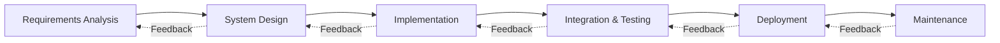
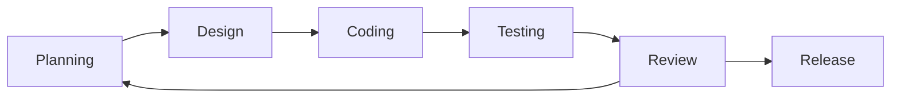
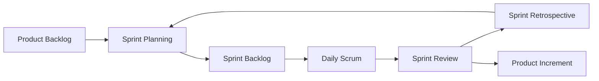
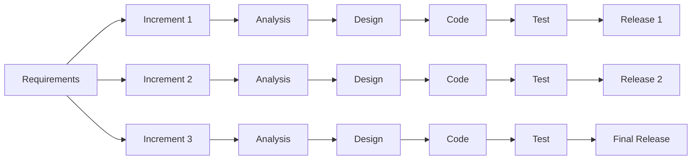
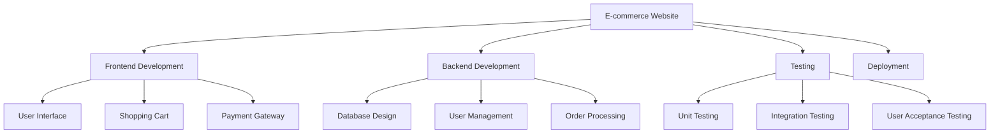
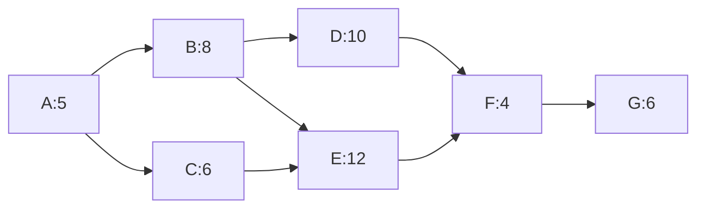
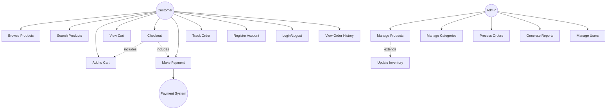
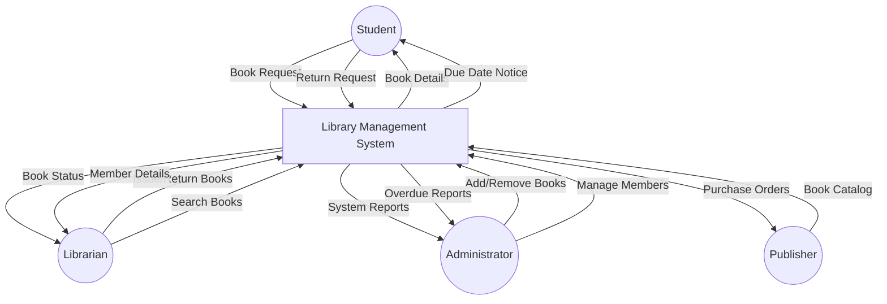
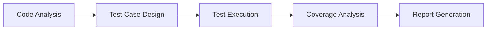
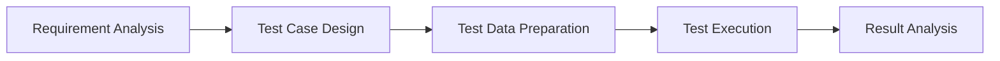

## Question 1(a) [3 marks]

**Explain software engineering layered approach.**

**Answer**:

Software engineering follows a layered approach with four fundamental layers working together to create quality software products.

**Table: Software Engineering Layered Approach**

| Layer | Description | Purpose |
|-------|-------------|---------|
| **Quality Focus** | Foundation layer emphasizing continuous improvement | Ensures defect-free products |
| **Process** | Defines framework of activities and tasks | Provides systematic development approach |
| **Methods** | Technical procedures for analysis, design, coding, testing | Offers "how-to" guidance |
| **Tools** | Automated support for process and methods | Provides efficiency and consistency |

- **Quality Focus**: Forms the foundation ensuring customer satisfaction
- **Process Layer**: Defines workflow and project management activities
- **Methods Layer**: Provides technical approach for each development phase
- **Tools Layer**: Supports automation and integration

**Mnemonic:** "Quality Processes Make Tools" - Remember the four layers from bottom to top.

---

## Question 1(b) [4 marks]

**Explain Iterative waterfall model.**

**Answer**:

The Iterative Waterfall Model combines the structured approach of waterfall with feedback loops for improvement and error correction.



**Key Features:**

- **Sequential phases**: Each phase completed before next begins
- **Feedback loops**: Allow return to previous phases for corrections
- **Documentation driven**: Heavy emphasis on documentation at each phase
- **Error correction**: Issues identified in later phases can be fixed

**Mnemonic:** "Water Falls Back Up" - Sequential flow with upward feedback capability.

---

## Question 1(c) [7 marks]

**Explain Agile Model and Agile Principles.**

**Answer**:

Agile is an iterative software development methodology emphasizing collaboration, customer feedback, and rapid delivery of working software.

**Table: Agile Values vs Traditional Approach**

| Agile Values | Traditional Approach |
|--------------|---------------------|
| Individuals and interactions | Processes and tools |
| Working software | Comprehensive documentation |
| Customer collaboration | Contract negotiation |
| Responding to change | Following a plan |

**Core Agile Principles:**

- **Customer satisfaction**: Deliver valuable software early and continuously
- **Welcome change**: Embrace changing requirements even late in development
- **Frequent delivery**: Deliver working software frequently (weeks rather than months)
- **Collaboration**: Business people and developers work together daily
- **Motivated individuals**: Build projects around motivated people
- **Face-to-face conversation**: Most efficient method of communication
- **Working software**: Primary measure of progress
- **Sustainable development**: Maintain constant pace indefinitely
- **Technical excellence**: Continuous attention to good design
- **Simplicity**: Art of maximizing work not done
- **Self-organizing teams**: Best requirements emerge from self-organizing teams
- **Regular reflection**: Team reflects and adjusts behavior regularly

**Diagram: Agile Development Cycle**



**Mnemonic:** "Customer Change Frequently Collaborates" - Core agile principles focus.

---

## Question 1(c OR) [7 marks]

**Write a short note on Scrum.**

**Answer**:

Scrum is an agile framework for managing software development with emphasis on team collaboration and iterative progress.

**Table: Scrum Roles and Responsibilities**

| Role | Responsibilities | Key Activities |
|------|------------------|----------------|
| **Product Owner** | Defines product features and priorities | Manages product backlog |
| **Scrum Master** | Facilitates process and removes obstacles | Conducts ceremonies |
| **Development Team** | Creates working software | Self-organizing and cross-functional |

**Scrum Events:**

- **Sprint**: 1-4 week iteration producing potentially shippable product
- **Sprint Planning**: Team plans work for upcoming sprint
- **Daily Scrum**: 15-minute daily synchronization meeting
- **Sprint Review**: Demonstrate completed work to stakeholders
- **Sprint Retrospective**: Team reflects on process improvements

**Scrum Artifacts:**

- **Product Backlog**: Prioritized list of features
- **Sprint Backlog**: Items selected for current sprint
- **Increment**: Working product at sprint end

**Diagram: Scrum Process Flow**



**Mnemonic:** "Product Sprints Daily Reviews" - Key scrum elements sequence.

---

## Question 2(a) [3 marks]

**If you have to develop a word processing software product, what process models will you choose? Justify your answer.**

**Answer**:

For word processing software development, I would choose the **Incremental Model** as the most suitable process model.

**Justification:**

- **Complex functionality**: Word processors have numerous features (editing, formatting, spell-check) that can be developed incrementally
- **User feedback**: Early increments allow user testing and feedback incorporation
- **Risk management**: Core features delivered first, advanced features added later
- **Market advantage**: Basic version can be released early to gain market presence

**Development Increments:**

1. **Increment 1**: Basic text editing and file operations
2. **Increment 2**: Formatting and font management
3. **Increment 3**: Advanced features (spell-check, templates)

**Mnemonic:** "Word Processing Increments User Feedback" - Incremental approach suits complex software.

---

## Question 2(b) [4 marks]

**Explain characteristics of good SRS.**

**Answer**:

A good Software Requirements Specification (SRS) document must possess specific characteristics to ensure successful software development.

**Table: Characteristics of Good SRS**

| Characteristic | Description | Importance |
|----------------|-------------|------------|
| **Complete** | Contains all necessary requirements | Prevents scope creep |
| **Consistent** | No conflicting requirements | Avoids implementation confusion |
| **Unambiguous** | Clear and precise language | Single interpretation possible |
| **Verifiable** | Requirements can be tested | Enables validation |
| **Modifiable** | Easy to change and maintain | Supports requirement evolution |
| **Traceable** | Requirements linked to sources | Impact analysis possible |

**Additional Characteristics:**

- **Feasible**: Technically and economically achievable
- **Necessary**: Each requirement serves a purpose
- **Prioritized**: Requirements ranked by importance
- **Testable**: Specific criteria for verification

**Mnemonic:** "Complete Consistent Unambiguous Verifiable" - Core SRS quality attributes.

---

## Question 2(c) [7 marks]

**Explain functional and non-functional requirements for an ATM software.**

**Answer**:

ATM software requirements are categorized into functional (what system does) and non-functional (how system performs) requirements.

**Table: ATM Functional Requirements**

| Function | Description | Example |
|----------|-------------|---------|
| **Authentication** | User login and verification | PIN validation, card reading |
| **Account Operations** | Basic banking transactions | Balance inquiry, cash withdrawal |
| **Transaction Processing** | Money transfer and deposits | Account-to-account transfer |
| **Receipt Generation** | Transaction documentation | Print transaction receipts |
| **Session Management** | User session control | Timeout, logout functionality |

**Table: ATM Non-Functional Requirements**

| Category | Requirement | Specification |
|----------|-------------|---------------|
| **Performance** | Response time | Maximum 3 seconds per transaction |
| **Security** | Data protection | 256-bit encryption for all data |
| **Reliability** | System availability | 99.9% uptime requirement |
| **Usability** | User interface | Simple interface for all age groups |
| **Scalability** | Load handling | Support 1000 concurrent users |

**Functional Requirements Details:**

- **Cash Withdrawal**: Dispense cash after successful authentication
- **Balance Inquiry**: Display current account balance
- **PIN Change**: Allow users to update their PIN
- **Mini Statement**: Provide last 10 transactions

**Non-Functional Requirements Details:**

- **Security**: Multi-factor authentication, transaction logging
- **Performance**: Fast transaction processing, minimal wait time
- **Availability**: 24/7 operation with minimal downtime
- **Maintainability**: Easy software updates and hardware maintenance

**Mnemonic:** "Functions Work, Quality Matters" - Functional vs non-functional distinction.

---

## Question 2(a OR) [3 marks]

**Explain Incremental Model with diagram.**

**Answer**:

The Incremental Model develops software in small, manageable portions called increments, with each increment adding new functionality to the existing system.

**Diagram: Incremental Model**



**Key Features:**

- **Parallel development**: Multiple increments developed simultaneously
- **Early delivery**: Working software available after first increment
- **Risk reduction**: Core functionality delivered first

**Mnemonic:** "Increments Build Upon Previous" - Each increment adds to existing functionality.

---

## Question 2(b OR) [4 marks]

**Differentiate between functional and non-functional requirements.**

**Answer**:

**Table: Functional vs Non-Functional Requirements**

| Aspect | Functional Requirements | Non-Functional Requirements |
|--------|------------------------|----------------------------|
| **Definition** | What the system does | How the system performs |
| **Focus** | System behavior and features | System quality attributes |
| **Testing** | Black-box testing | Performance and stress testing |
| **Documentation** | Use cases, user stories | Quality metrics, constraints |
| **Examples** | Login, search, calculate | Speed, security, usability |
| **Verification** | Functional testing | Non-functional testing |
| **Change Impact** | Feature modification | Performance tuning |
| **User Visibility** | Directly visible to users | Indirectly experienced |

**Functional Requirements Characteristics:**

- **Behavior-focused**: Define system actions and responses
- **Feature-specific**: Each requirement describes a specific capability
- **User-driven**: Based on user needs and business processes

**Non-Functional Requirements Characteristics:**

- **Quality-focused**: Define performance and quality standards
- **System-wide**: Apply to entire system rather than specific features
- **Constraint-driven**: Set limits and boundaries for system operation

**Mnemonic:** "Functions Do, Quality Shows" - Functional requirements define actions, non-functional define quality.

---

## Question 2(c OR) [7 marks]

**Write a short note on Requirements Analysis.**

**Answer**:

Requirements Analysis is the process of studying user needs and defining system requirements to understand what the software system should accomplish.

**Table: Requirements Analysis Process**

| Phase | Activities | Deliverables |
|-------|------------|--------------|
| **Elicitation** | Gather requirements from stakeholders | Requirement lists, interviews |
| **Analysis** | Study and understand requirements | Requirement models, prototypes |
| **Specification** | Document requirements formally | SRS document, use cases |
| **Validation** | Verify requirements correctness | Validated requirements |

**Requirements Elicitation Techniques:**

- **Interviews**: One-on-one discussions with stakeholders
- **Questionnaires**: Structured surveys for large user groups
- **Observation**: Studying current work processes
- **Workshops**: Group sessions for requirement gathering
- **Prototyping**: Building preliminary versions for feedback

**Analysis Activities:**

- **Requirement prioritization**: Ranking requirements by importance
- **Feasibility study**: Assessing technical and economic viability
- **Conflict resolution**: Resolving contradictory requirements
- **Requirement modeling**: Creating visual representations

**Validation Techniques:**

- **Requirement reviews**: Formal examination of documented requirements
- **Prototyping**: Building models to validate understanding
- **Test case generation**: Creating tests from requirements

**Challenges in Requirements Analysis:**

- **Changing requirements**: Stakeholder needs evolve over time
- **Communication gaps**: Misunderstanding between users and developers
- **Incomplete requirements**: Missing or vague specifications
- **Conflicting stakeholder needs**: Different user groups have different priorities

**Mnemonic:** "Every Analysis Specification Validates" - Key phases of requirements analysis.

---

## Question 3(a) [3 marks]

**Explain Gantt Chart.**

**Answer**:

A Gantt Chart is a visual project management tool that displays project tasks against a timeline, showing task duration, dependencies, and progress.

**Table: Gantt Chart Components**

| Component | Description | Purpose |
|-----------|-------------|---------|
| **Tasks** | Project activities listed vertically | Shows work breakdown |
| **Timeline** | Horizontal time scale | Displays project duration |
| **Bars** | Horizontal bars showing task duration | Visual task representation |
| **Dependencies** | Lines connecting related tasks | Shows task relationships |
| **Milestones** | Key project checkpoints | Marks important events |

**Diagram: Sample Gantt Chart**

```goat
Task Name       | Week 1 | Week 2 | Week 3 | Week 4 |
Requirements    |████████|        |        |        |
Design          |        |████████|████████|        |
Coding          |        |        |████████|████████|
Testing         |        |        |        |████████|
```

**Benefits:**

- **Visual clarity**: Easy to understand project timeline
- **Progress tracking**: Shows completed vs remaining work
- **Resource planning**: Helps allocate resources effectively

**Mnemonic:** "Gantt Graphs Timeline Tasks" - Visual timeline representation of project tasks.

---

## Question 3(b) [4 marks]

**Write in brief: Responsibilities and skills of software project manager.**

**Answer**:

A software project manager oversees the entire software development lifecycle, ensuring projects are completed on time, within budget, and meet quality standards.

**Table: Project Manager Responsibilities**

| Category | Responsibilities | Key Activities |
|----------|------------------|----------------|
| **Planning** | Project scope and timeline definition | WBS creation, scheduling |
| **Resource Management** | Team allocation and coordination | Staff assignment, skill matching |
| **Risk Management** | Identify and mitigate project risks | Risk assessment, contingency planning |
| **Communication** | Stakeholder coordination | Status reporting, meetings |
| **Quality Assurance** | Ensure deliverable quality | Review processes, standards |

**Essential Skills:**

- **Technical skills**: Understanding of software development processes
- **Leadership skills**: Team motivation and guidance
- **Communication skills**: Effective stakeholder interaction
- **Problem-solving skills**: Quick issue resolution
- **Time management**: Efficient task prioritization

**Key Responsibilities:**

- **Project planning**: Define scope, timeline, and resources
- **Team coordination**: Manage development team activities
- **Stakeholder management**: Maintain client and sponsor relationships
- **Risk mitigation**: Identify and address potential problems

**Mnemonic:** "Managers Plan Resources Risks Communication" - Core responsibilities of project managers.

---

## Question 3(c) [7 marks]

**Write a short note on Risk Management.**

**Answer**:

Risk Management is the systematic process of identifying, analyzing, and responding to project risks that could impact software development success.

**Table: Risk Management Process**

| Phase | Activities | Techniques | Outcomes |
|-------|------------|------------|----------|
| **Risk Identification** | Find potential risks | Brainstorming, checklists | Risk register |
| **Risk Analysis** | Assess probability and impact | Risk matrices, scoring | Prioritized risks |
| **Risk Planning** | Develop response strategies | Mitigation, avoidance | Risk response plans |
| **Risk Monitoring** | Track and control risks | Regular reviews | Updated risk status |

**Types of Software Project Risks:**

**Technical Risks:**

- **Technology uncertainty**: New or unproven technologies
- **Performance issues**: System not meeting performance requirements
- **Integration problems**: Difficulty combining system components

**Project Risks:**

- **Schedule delays**: Tasks taking longer than estimated
- **Resource constraints**: Insufficient staff or budget
- **Scope creep**: Uncontrolled requirement changes

**Business Risks:**

- **Market changes**: Shifting business requirements
- **Competition**: Competitive products affecting project value
- **Regulatory changes**: New compliance requirements

**Risk Response Strategies:**

- **Risk Avoidance**: Eliminate risk by changing project approach
- **Risk Mitigation**: Reduce probability or impact of risk
- **Risk Transfer**: Shift risk to third party (insurance, outsourcing)
- **Risk Acceptance**: Accept risk and develop contingency plans

**Risk Monitoring Techniques:**

- **Regular risk reviews**: Periodic assessment of risk status
- **Risk metrics**: Quantitative measures of risk exposure
- **Early warning indicators**: Signals of emerging risks

**Mnemonic:** "Identify Analyze Plan Monitor" - Four phases of risk management process.

---

## Question 3(a OR) [3 marks]

**Explain WBS with example.**

**Answer**:

Work Breakdown Structure (WBS) is a hierarchical decomposition of project work into smaller, manageable components that can be easily estimated, assigned, and tracked.

**Diagram: WBS Example for E-commerce Website**



**WBS Characteristics:**

- **Hierarchical structure**: Top-down breakdown of project scope
- **100% rule**: WBS includes 100% of work defined by project scope
- **Mutually exclusive**: No overlap between WBS elements

**Mnemonic:** "Work Breaks Small" - Breaking work into smaller manageable pieces.

---

## Question 3(b OR) [4 marks]

**Explain Project monitoring and control.**

**Answer**:

Project monitoring and control involves tracking project progress, comparing actual performance against planned performance, and taking corrective actions when necessary.

**Table: Monitoring and Control Activities**

| Activity | Description | Tools/Techniques |
|----------|-------------|------------------|
| **Progress Tracking** | Monitor task completion | Gantt charts, dashboards |
| **Performance Measurement** | Compare actual vs planned | Earned value analysis |
| **Quality Control** | Ensure deliverable quality | Reviews, testing |
| **Risk Monitoring** | Track identified risks | Risk registers, reports |
| **Change Control** | Manage scope changes | Change request process |

**Key Monitoring Metrics:**

- **Schedule performance**: Tasks completed on time
- **Cost performance**: Budget utilization and variance
- **Quality metrics**: Defect rates, customer satisfaction
- **Resource utilization**: Team productivity and efficiency

**Control Actions:**

- **Corrective actions**: Address performance deviations
- **Preventive actions**: Avoid potential problems
- **Change management**: Handle scope modifications

**Mnemonic:** "Monitor Progress Performance Quality" - Key areas of project monitoring.

---

## Question 3(c OR) [7 marks]

**Explain Critical Path Method (CPM) with a suitable example.**

**Answer**:

Critical Path Method (CPM) is a project management technique that identifies the longest sequence of dependent tasks and determines the minimum project completion time.

**Table: Sample Project Tasks**

| Task | Duration (Days) | Predecessors |
|------|----------------|--------------|
| A - Requirements | 5 | - |
| B - Design | 8 | A |
| C - Database Setup | 6 | A |
| D - Frontend Coding | 10 | B |
| E - Backend Coding | 12 | B, C |
| F - Integration | 4 | D, E |
| G - Testing | 6 | F |

**Diagram: CPM Network**



**Critical Path Calculation:**

- **Path 1**: A → B → D → F → G = 5 + 8 + 10 + 4 + 6 = 33 days
- **Path 2**: A → B → E → F → G = 5 + 8 + 12 + 4 + 6 = 35 days (Critical Path)
- **Path 3**: A → C → E → F → G = 5 + 6 + 12 + 4 + 6 = 33 days

**CPM Benefits:**

- **Project duration**: Determines minimum completion time
- **Critical activities**: Identifies tasks that cannot be delayed
- **Float calculation**: Shows available slack time for non-critical tasks
- **Resource optimization**: Helps allocate resources efficiently

**CPM Steps:**

1. **Activity identification**: List all project activities
2. **Dependency mapping**: Determine task relationships
3. **Duration estimation**: Estimate time for each activity
4. **Network construction**: Create project network diagram
5. **Critical path calculation**: Find longest path through network

**Float Types:**

- **Total Float**: Maximum delay without affecting project completion
- **Free Float**: Delay without affecting successor activities
- **Independent Float**: Delay without affecting predecessors or successors

**Mnemonic:** "Critical Paths Minimize Project Duration" - CPM finds longest path determining minimum time.

---

## Question 4(a) [3 marks]

**Write a note on classification of design activities.**

**Answer**:

Software design activities are systematically classified to organize the design process and ensure comprehensive system development.

**Table: Classification of Design Activities**

| Classification | Activities | Focus Area |
|----------------|------------|------------|
| **Architectural Design** | System structure, components | High-level organization |
| **Interface Design** | User interface, system interfaces | Interaction design |
| **Component Design** | Module details, algorithms | Low-level implementation |
| **Data Design** | Database, data structures | Data organization |

**Design Activity Levels:**

- **System Level**: Overall system architecture and major components
- **Subsystem Level**: Individual subsystem design and interfaces
- **Component Level**: Detailed module design and algorithms

**Design Approaches:**

- **Top-down design**: Start with high-level and decompose
- **Bottom-up design**: Build from individual components upward

**Mnemonic:** "Architects Interface Components Data" - Four main design activity classifications.

---

## Question 4(b) [4 marks]

**Define Coupling. Explain its classification.**

**Answer**:

Coupling refers to the degree of interdependence between software modules. Lower coupling indicates better software design with more maintainable and flexible code.

**Table: Types of Coupling (Loosest to Tightest)**

| Coupling Type | Description | Example |
|---------------|-------------|---------|
| **Data Coupling** | Modules communicate through parameters | Function calls with simple parameters |
| **Stamp Coupling** | Modules share composite data structure | Passing record/structure as parameter |
| **Control Coupling** | One module controls another's execution | Passing control flags |
| **External Coupling** | Modules depend on external format | Shared file format or protocol |
| **Common Coupling** | Modules share global data | Global variables access |
| **Content Coupling** | One module modifies another's data | Direct access to another module's data |

**Coupling Characteristics:**

- **Data coupling**: Best type - minimal interdependence
- **Stamp coupling**: Acceptable - shared data structures
- **Control coupling**: Moderate - control information passed
- **Content coupling**: Worst type - high interdependence

**Benefits of Loose Coupling:**

- **Maintainability**: Easier to modify individual modules
- **Reusability**: Modules can be used in different contexts
- **Testability**: Modules can be tested independently

**Mnemonic:** "Data Stamp Control External Common Content" - Coupling types from loose to tight.

---

## Question 4(c) [7 marks]

**Draw a use case diagram for online shopping web application.**

**Answer**:

A use case diagram shows the functional requirements of an online shopping system by illustrating actors and their interactions with the system.

**Diagram: Online Shopping Use Case Diagram**



**Key Use Cases Explained:**

**Customer Use Cases:**

- **Browse Products**: View available products by category
- **Search Products**: Find specific products using keywords
- **Shopping Cart**: Add, remove, and modify cart items
- **Checkout Process**: Complete purchase with shipping details
- **Payment Processing**: Handle secure payment transactions
- **Order Management**: Track orders and view purchase history

**Admin Use Cases:**

- **Product Management**: Add, edit, delete products and categories
- **Order Processing**: Manage order fulfillment and shipping
- **User Management**: Handle customer accounts and permissions
- **Reporting**: Generate sales and inventory reports

**System Relationships:**

- **Include**: Mandatory sub-use cases (checkout includes payment)
- **Extend**: Optional extensions (inventory update extends product management)
- **Inheritance**: Specialized actor behaviors

**Actors:**

- **Primary Actors**: Customer, Admin (initiate use cases)
- **Secondary Actors**: Payment System (respond to system requests)

**Mnemonic:** "Customers Browse Buy, Admins Manage Monitor" - Core use case categories.

---

## Question 4(a OR) [3 marks]

**Explain the characteristics of good UI.**

**Answer**:

Good User Interface (UI) design ensures effective user interaction with software systems through intuitive and user-friendly design principles.

**Table: Characteristics of Good UI**

| Characteristic | Description | Example |
|----------------|-------------|---------|
| **Consistency** | Uniform design across application | Same button styles throughout |
| **Simplicity** | Easy to understand and use | Minimal, clean interface |
| **Visibility** | Important elements clearly visible | Key actions prominently displayed |
| **Feedback** | System responds to user actions | Progress bars, confirmations |
| **Error Prevention** | Prevents user mistakes | Input validation, confirmations |
| **Flexibility** | Accommodates different user needs | Customizable interfaces |

**UI Design Principles:**

- **User-centered**: Design focused on user needs and goals
- **Accessibility**: Usable by people with different abilities
- **Efficiency**: Minimizes steps to complete tasks

**Mnemonic:** "Consistent Simple Visible Feedback" - Core UI design characteristics.

---

## Question 4(b OR) [4 marks]

**Define Cohesion. Explain its classification.**

**Answer**:

Cohesion refers to how closely related and focused the responsibilities of a single module are. High cohesion indicates well-designed modules with related functionality.

**Table: Types of Cohesion (Weakest to Strongest)**

| Cohesion Type | Description | Example |
|---------------|-------------|---------|
| **Coincidental** | Elements grouped arbitrarily | Utility module with unrelated functions |
| **Logical** | Elements perform similar logical functions | All input/output operations |
| **Temporal** | Elements executed at same time | System initialization module |
| **Procedural** | Elements follow specific sequence | Sequential processing steps |
| **Communicational** | Elements operate on same data | Module processing same record |
| **Sequential** | Output of one element is input to next | Data transformation pipeline |
| **Functional** | All elements contribute to single task | Calculate employee salary |

**Cohesion Characteristics:**

- **Functional cohesion**: Best type - single, well-defined purpose
- **Sequential cohesion**: Good - data flows through module
- **Communicational cohesion**: Acceptable - operates on same data
- **Coincidental cohesion**: Worst type - no logical relationship

**Benefits of High Cohesion:**

- **Maintainability**: Easier to understand and modify
- **Reliability**: Less likely to have errors
- **Reusability**: Single-purpose modules more reusable

**Mnemonic:** "Coincidental Logical Temporal Procedural Communicational Sequential Functional" - Cohesion types from weak to strong.

---

## Question 4(c OR) [7 marks]

**Draw context diagram for library system.**

**Answer**:

A context diagram shows the library system as a single process with its external entities and data flows, providing a high-level view of system boundaries.

**Diagram: Library System Context Diagram**



**External Entities:**

**Student (Library Member):**

- **Inputs**: Book search requests, reservation requests, return notifications
- **Outputs**: Book availability information, due dates, fine details

**Librarian:**

- **Inputs**: Book issue/return transactions, member verification
- **Outputs**: Book status updates, member information, transaction confirmations

**Administrator:**

- **Inputs**: New book additions, member management, system configuration
- **Outputs**: System reports, statistics, overdue notifications

**Publisher/Supplier:**

- **Inputs**: Book catalogs, availability updates
- **Outputs**: Purchase orders, procurement requests

**Data Flows:**

- **Book Information**: Details about books, availability, location
- **Member Data**: Student/faculty information, borrowing history
- **Transaction Records**: Issue/return details, fine calculations
- **Reports**: Usage statistics, overdue lists, inventory reports

**System Boundary:**
The context diagram clearly defines what is inside the library system (book management, member management, transaction processing) and what is outside (external entities like students, staff, and suppliers).

**Key Data Stores (Internal to System):**

- Book catalog database
- Member information database
- Transaction history database
- Fine and payment records

**Mnemonic:** "Students Librarians Admins Publishers" - Four main external entities interacting with library system.

---

## Question 5(a) [3 marks]

**Differentiate verification and validation.**

**Answer**:

Verification and validation are two complementary quality assurance processes that ensure software meets requirements and user needs.

**Table: Verification vs Validation**

| Aspect | Verification | Validation |
|--------|--------------|------------|
| **Question** | Are we building the product right? | Are we building the right product? |
| **Focus** | Process and standards compliance | Product meets user needs |
| **When** | Throughout development | After product completion |
| **Methods** | Reviews, inspections, walkthroughs | Testing, user acceptance |
| **Cost** | Lower cost of defect detection | Higher cost but essential |
| **Objective** | Ensure conformance to specifications | Ensure fitness for use |

**Verification Activities:**

- **Code reviews**: Checking code against coding standards
- **Design reviews**: Ensuring design meets requirements
- **Document reviews**: Verifying documentation completeness

**Validation Activities:**

- **System testing**: Testing complete integrated system
- **User acceptance testing**: End-user validation of functionality
- **Performance testing**: Validating system performance requirements

**Mnemonic:** "Verification Verifies Process, Validation Validates Product" - Key distinction between the two.

---

## Question 5(b) [4 marks]

**Explain Code Review.**

**Answer**:

Code Review is a systematic examination of source code by developers other than the author to identify defects, improve code quality, and ensure adherence to coding standards.

**Table: Types of Code Review**

| Type | Description | Participants | Formality |
|------|-------------|--------------|-----------|
| **Code Walkthrough** | Author explains code to reviewers | Author + 2-3 reviewers | Informal |
| **Code Inspection** | Formal systematic examination | Moderator, author, reviewers | Formal |
| **Peer Review** | Colleague reviews code changes | 1-2 peer developers | Semi-formal |
| **Tool-Assisted Review** | Automated tools assist review | Author + automated tools | Variable |

**Code Review Process:**

1. **Preparation**: Author prepares code and documentation
2. **Review Meeting**: Team examines code systematically
3. **Defect Logging**: Issues and improvements documented
4. **Follow-up**: Author addresses identified issues
5. **Re-review**: Verification of fixes if necessary

**Review Criteria:**

- **Functionality**: Code performs intended operations correctly
- **Standards Compliance**: Follows coding conventions and guidelines
- **Maintainability**: Code is readable and well-documented
- **Performance**: Efficient algorithms and resource usage

**Benefits:**

- **Defect Detection**: Early identification of bugs and issues
- **Knowledge Sharing**: Team learns from each other's code
- **Quality Improvement**: Consistent coding standards across team

**Mnemonic:** "Reviews Reveal Errors Early" - Code reviews catch defects before testing.

---

## Question 5(c) [7 marks]

**Write a short note on White Box Testing.**

**Answer**:

White Box Testing is a software testing technique that examines the internal structure, design, and coding of an application to verify input-output flow and improve design and usability.

**Table: White Box Testing Techniques**

| Technique | Description | Coverage Criteria |
|-----------|-------------|-------------------|
| **Statement Coverage** | Execute every statement | All statements executed at least once |
| **Branch Coverage** | Test all decision points | All branches (true/false) covered |
| **Path Coverage** | Test all possible paths | All independent paths executed |
| **Condition Coverage** | Test all conditions | All boolean conditions tested |

**White Box Testing Process:**



**Coverage Types Explained:**

**Statement Coverage:**

- Ensures every line of code is executed at least once
- Formula: (Statements Executed / Total Statements) × 100
- Minimum level of testing required

**Branch Coverage:**

- Tests all decision points (if-else, switch-case)
- Ensures both true and false conditions are tested
- More thorough than statement coverage

**Path Coverage:**

- Tests all possible execution paths through code
- Most comprehensive but often impractical for complex programs
- Uses cyclomatic complexity to determine paths

**Condition Coverage:**

- Tests all boolean sub-expressions individually
- Ensures each condition evaluates to both true and false
- Important for complex conditional statements

**White Box Testing Tools:**

- **Static Analysis Tools**: Examine code without execution
- **Dynamic Analysis Tools**: Monitor code during execution
- **Coverage Tools**: Measure test coverage percentage
- **Profiling Tools**: Analyze performance characteristics

**Advantages:**

- **Thorough Testing**: Examines all code paths and logic
- **Early Defect Detection**: Finds errors during development
- **Optimization**: Identifies unused code and inefficiencies
- **Security Testing**: Reveals potential security vulnerabilities

**Disadvantages:**

- **Time Consuming**: Requires detailed code knowledge
- **Expensive**: Needs skilled testers familiar with code
- **Limited Scope**: May miss integration and system-level issues
- **Maintenance**: Test cases need updates with code changes

**White Box vs Black Box:**

- **White Box**: Internal structure focus, code-based testing
- **Black Box**: Functional behavior focus, specification-based testing
- **Complementary**: Both approaches needed for comprehensive testing

**Test Case Design Guidelines:**

- **Boundary Testing**: Test edge cases and limits
- **Loop Testing**: Verify loop conditions and iterations
- **Data Flow Testing**: Follow variable definitions and usage
- **Control Flow Testing**: Test decision logic and branches

**Mnemonic:** "White Box Sees Inside Structure" - Internal code structure testing approach.

---

## Question 5(a OR) [3 marks]

**List out various coding standards and guidelines.**

**Answer**:

Coding standards and guidelines ensure consistent, readable, and maintainable code across development teams and projects.

**Table: Coding Standards Categories**

| Category | Standards | Examples |
|----------|-----------|----------|
| **Naming Conventions** | Variable, function, class naming | camelCase, PascalCase |
| **Code Structure** | Indentation, spacing, brackets | 4-space indentation |
| **Documentation** | Comments, function headers | Inline comments, API docs |
| **Error Handling** | Exception handling, logging | Try-catch blocks |

**Common Coding Guidelines:**

- **Meaningful names**: Use descriptive variable and function names
- **Consistent indentation**: Use consistent spacing (2 or 4 spaces)
- **Comment code**: Explain complex logic and business rules
- **Function size**: Keep functions small and focused
- **Error handling**: Implement proper exception handling

**Language-Specific Standards:**

- **Java**: Oracle Java Code Conventions
- **Python**: PEP 8 Style Guide
- **JavaScript**: Airbnb JavaScript Style Guide
- **C++**: Google C++ Style Guide

**Mnemonic:** "Names Structure Documentation Errors" - Four main coding standard categories.

---

## Question 5(b OR) [4 marks]

**Explain Test cases and Test suite with example.**

**Answer**:

Test cases are specific conditions under which a tester determines whether a software application is working correctly, while a test suite is a collection of related test cases.

**Table: Test Case vs Test Suite**

| Aspect | Test Case | Test Suite |
|--------|-----------|------------|
| **Definition** | Single test scenario | Collection of test cases |
| **Scope** | Specific functionality | Related functionalities |
| **Execution** | Individual test | Group execution |
| **Management** | Single test management | Batch management |

**Test Case Components:**

- **Test Case ID**: Unique identifier (TC_001)
- **Test Description**: What is being tested
- **Preconditions**: Setup requirements
- **Test Steps**: Step-by-step procedure
- **Expected Result**: Expected outcome
- **Actual Result**: Observed outcome
- **Status**: Pass/Fail/Blocked

**Example Test Case:**

```
Test Case ID: TC_LOGIN_001
Description: Verify user login with valid credentials
Preconditions: User account exists in system
Test Steps:
1. Navigate to login page
2. Enter valid username
3. Enter valid password
4. Click Login button
Expected Result: User redirected to dashboard
Actual Result: [To be filled during execution]
Status: [Pass/Fail]
```

**Test Suite Example:**

- **Login Test Suite**: Contains all login-related test cases
  - TC_LOGIN_001: Valid login
  - TC_LOGIN_002: Invalid username
  - TC_LOGIN_003: Invalid password
  - TC_LOGIN_004: Empty fields

**Mnemonic:** "Cases Test Functions, Suites Group Cases" - Individual vs collection relationship.

---

## Question 5(c OR) [7 marks]

**Write a short note on Black Box Testing.**

**Answer**:

Black Box Testing is a software testing method that examines functionality without knowledge of internal code structure, focusing on input-output behavior and requirement compliance.

**Table: Black Box Testing Techniques**

| Technique | Description | Application |
|-----------|-------------|-------------|
| **Equivalence Partitioning** | Divide inputs into equivalent groups | Input validation testing |
| **Boundary Value Analysis** | Test edge values and boundaries | Range and limit testing |
| **Decision Table Testing** | Test combinations of conditions | Complex business logic |
| **State Transition Testing** | Test state changes | Workflow and status testing |
| **Use Case Testing** | Test user scenarios | End-to-end functionality |

**Black Box Testing Process:**



**Testing Techniques Explained:**

**Equivalence Partitioning:**

- Divides input domain into classes of equivalent data
- One test case from each partition represents entire class
- Reduces number of test cases while maintaining coverage
- Example: Age input (0-17: Minor, 18-65: Adult, 65+: Senior)

**Boundary Value Analysis:**

- Tests values at boundaries of equivalence partitions
- Focuses on edge cases where errors commonly occur
- Tests minimum, maximum, and just inside/outside boundaries
- Example: For range 1-100, test: 0, 1, 2, 99, 100, 101

**Decision Table Testing:**

- Represents complex business rules in tabular format
- Shows all possible combinations of conditions and actions
- Ensures complete coverage of business logic scenarios
- Useful for systems with multiple interacting conditions

**State Transition Testing:**

- Models system behavior as states and transitions
- Tests valid and invalid state changes
- Verifies system handles state transitions correctly
- Example: Order states (Pending → Processing → Shipped → Delivered)

**Use Case Testing:**

- Based on user scenarios and use cases
- Tests complete business workflows end-to-end
- Focuses on user perspective and real-world usage
- Validates system meets user requirements

**Black Box Testing Levels:**

- **Unit Testing**: Individual component functionality
- **Integration Testing**: Component interaction testing
- **System Testing**: Complete system functionality
- **Acceptance Testing**: User requirement validation

**Advantages:**

- **User Perspective**: Tests from end-user viewpoint
- **No Code Knowledge**: Testers don't need programming skills
- **Unbiased Testing**: Not influenced by code implementation
- **Early Testing**: Can start with requirements specification

**Disadvantages:**

- **Limited Coverage**: May miss internal logic errors
- **Inefficient**: Difficult to identify all possible inputs
- **Redundant Testing**: May duplicate test scenarios
- **Blind Testing**: Cannot target specific code areas

**Test Data Design:**

- **Valid Inputs**: Test normal operational conditions
- **Invalid Inputs**: Test error handling capabilities
- **Edge Cases**: Test boundary conditions and limits
- **Stress Inputs**: Test system under extreme conditions

**Black Box vs White Box Comparison:**

- **Black Box**: External behavior, specification-based
- **White Box**: Internal structure, code-based
- **Gray Box**: Combination of both approaches
- **Complementary**: Both needed for thorough testing

**Mnemonic:** "Black Box Behavior Based" - Focus on external functionality without internal knowledge.
