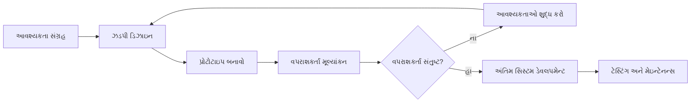
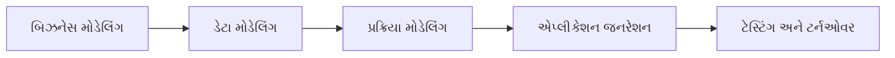
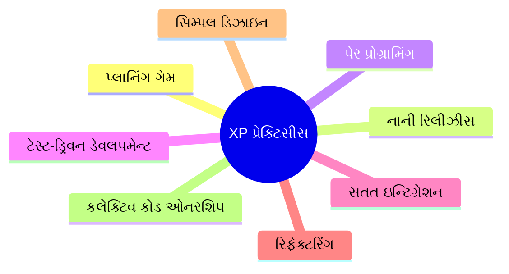
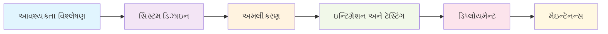
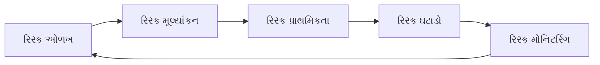
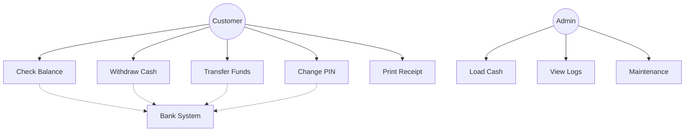
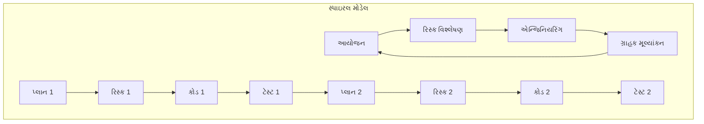
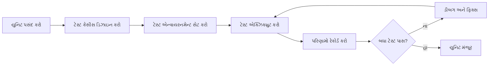
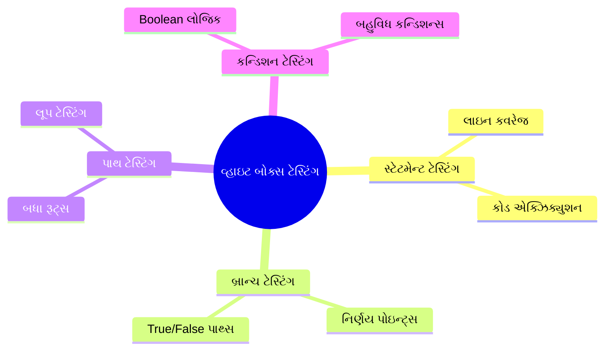

## પ્રશ્ન ૧(અ) [3 ગુણ]

**સોફ્ટવેરની IEEE વ્યાખ્યા આપો. એપ્લીકેશન અને સિસ્ટમ સોફ્ટવેરનું એક એક ઉદાહરણ આપો.**

**જવાબ**:

**IEEE વ્યાખ્યા**: સોફ્ટવેર એ કમ્પ્યુટર પ્રોગ્રામ્સ, પ્રક્રિયાઓ, નિયમો અને સંબંધિત દસ્તાવેજીકરણ અને ડેટાનો સંગ્રહ છે.

**ઉદાહરણો**:

| સોફ્ટવેર પ્રકાર | ઉદાહરણ | હેતુ |
|---------------|---------|---------|
| **એપ્લીકેશન સોફ્ટવેર** | Microsoft Word | વર્ડ પ્રોસેસિંગ અને ડોક્યુમેન્ટ બનાવવા |
| **સિસ્ટમ સોફ્ટવેર** | Windows 10 | હાર્ડવેર સંસાધનોનું સંચાલન કરતું ઓપરેટિંગ સિસ્ટમ |

- **એપ્લીકેશન સોફ્ટવેર**: અંતિમ વપરાશકર્તાઓ માટે ચોક્કસ કાર્યો પૂર્ણ કરવા માટે ડિઝાઇન કરેલા પ્રોગ્રામ્સ
- **સિસ્ટમ સોફ્ટવેર**: કમ્પ્યુટર હાર્ડવેરનું સંચાલન અને સંચાલન કરતા પ્રોગ્રામ્સ

**મેમરી ટ્રીક:** "Apps મદદ કરે Users ને, Systems મદદ કરે Hardware ને"

---

## પ્રશ્ન ૧(બ) [4 ગુણ]

**ડેટા ડિક્શનરી પર ટૂંકનોંધ લખો.**

**જવાબ**:

ડેટા ડિક્શનરી એ સિસ્ટમમાં વપરાતા ડેટા તત્વોની વ્યાખ્યાઓ અને લક્ષણો ધરાવતો કેન્દ્રીયકૃત ભંડાર છે.

**ઘટકો સારણી**:

| ઘટક | વર્ણન |
|-----------|-------------|
| **ડેટા નામ** | ડેટા તત્વ માટે અનન્ય ઓળખકર્તા |
| **ઉપનામો** | વપરાયેલા વૈકલ્પિક નામો |
| **વર્ણન** | હેતુ અને અર્થ |
| **ડેટા પ્રકાર** | ફોર્મેટ (integer, string, વગેરે) |
| **લંબાઈ** | સાઇઝ મર્યાદાઓ |
| **મૂલ્યો** | માન્ય શ્રેણી અથવા સેટ |

- **હેતુ**: ડેવલપમેન્ટ ટીમમાં ડેટા ઉપયોગમાં સુસંગતતા સુનિશ્ચિત કરે છે
- **ફાયદા**: અસ્પષ્ટતા ઘટાડે છે, સંચાર સુધારે છે, ડેટા વ્યાખ્યાઓનું પ્રમાણીકરણ કરે છે
- **ઉપયોગ**: સિસ્ટમ ડિઝાઇન અને ડેટાબેઝ બનાવવા દરમિયાન સંદર્ભિત

**મેમરી ટ્રીક:** "Dictionary ડેટાને સ્પષ્ટ રીતે વ્યાખ્યાયિત કરે છે"

---

## પ્રશ્ન ૧(ક) [7 ગુણ]

**પ્રોટોટાઇપ મોડેલ આકૃતિ સહિત સમજાવો.**

**જવાબ**:

પ્રોટોટાઇપ મોડેલ એ પુનરાવર્તક અભિગમ છે જ્યાં આવશ્યકતાઓને વધુ સારી રીતે સમજવા માટે વહેલું કામકાજનું મોડેલ બનાવવામાં આવે છે.

**ડાયાગ્રામ**:



**લક્ષણો**:

| તબક્કો | પ્રવૃત્તિ | આઉટપુટ |
|-------|----------|--------|
| **ઝડપી ડિઝાઇન** | મૂળભૂત આર્કિટેક્ચર | પ્રારંભિક ડિઝાઇન |
| **પ્રોટોટાઇપ બિલ્ડ** | કામકાજનું મોડેલ | પરીક્ષણયોગ્ય સિસ્ટમ |
| **વપરાશકર્તા મૂલ્યાંકન** | ફીડબેક સંગ્રહ | આવશ્યકતાઓનું શુદ્ધીકરણ |

- **ફાયદા**: વહેલું વપરાશકર્તા ફીડબેક, ઓછું ડેવલપમેન્ટ જોખમ, આવશ્યકતાઓની વધુ સારી સમજ
- **ગેરફાયદા**: અપર્યાપ્ત વિશ્લેષણ તરફ દોરી શકે છે, ગ્રાહક પ્રોટોટાઇપને અંતિમ ઉત્પાદન તરીકે અપેક્ષા કરે છે
- **શ્રેષ્ઠ માટે**: અસ્પષ્ટ આવશ્યકતાઓ સાથેના પ્રોજેક્ટ્સ

**મેમરી ટ્રીક:** "Prototype શક્યતાઓ સાબિત કરે છે"

---

## પ્રશ્ન ૧(ક) અથવા [7 ગુણ]

**RAD મોડેલ ફાયદા અને ગેરફાયદા સાથે સમજાવો.**

**જવાબ**:

RAD (Rapid Application Development) પ્રોટોટાઇપિંગ અને પુનરાવર્તક ડેવલપમેન્ટ દ્વારા ઝડપી ડેવલપમેન્ટ પર ભાર મૂકે છે.

**RAD તબક્કાઓ**:



**ફાયદા વિ ગેરફાયદા**:

| ફાયદા | ગેરફાયદા |
|------------|---------------|
| **ઝડપી ડેવલપમેન્ટ** | **કુશળ ડેવલપર્સની જરૂર** |
| **વહેલો વપરાશકર્તા સંડોવણી** | **મોટા પ્રોજેક્ટ્સ માટે યોગ્ય નથી** |
| **ઓછો ખર્ચ** | **વપરાશકર્તાની પ્રતિબદ્ધતા જરૂરી** |
| **વધુ સારી ગુણવત્તા** | **સંચાલિત ન હોય તો તકનીકી જોખમો** |

- **મુખ્ય વિશેષતા**: સ્વયંસંચાલિત સાધનો અને 4GL પ્રોગ્રામિંગનો ઉપયોગ
- **સમયસીમા**: સામાન્ય રીતે ડેવલપમેન્ટ માટે 60-90 દિવસ
- **ટીમ**: નાની, અનુભવી ડેવલપમેન્ટ ટીમો

**મેમરી ટ્રીક:** "RAD ઝડપથી ડેવલપમેન્ટને ઝડપી બનાવે છે"

---

## પ્રશ્ન ૨(અ) [3 ગુણ]

**પૂર્ણ નામ આપો: SQA, FTR, RAD, BVA, GUI, DFD**

**જવાબ**:

| સંક્ષિપ્ત શબ્દ | પૂર્ણ નામ |
|--------------|-----------|
| **SQA** | Software Quality Assurance |
| **FTR** | Formal Technical Review |
| **RAD** | Rapid Application Development |
| **BVA** | Boundary Value Analysis |
| **GUI** | Graphical User Interface |
| **DFD** | Data Flow Diagram |

**મેમરી ટ્રીક:** "Software Quality And Formal Technical Reviews Rapidly Analyze Development, Boundary Value Analysis Guides User Interface, Data Flow Diagrams"

---

## પ્રશ્ન ૨(બ) [4 ગુણ]

**Agile મેથોડોલોજીની વ્યાખ્યા આપો. તેના સિદ્ધાંતો સમજાવો.**

**જવાબ**:

**વ્યાખ્યા**: Agile એ પુનરાવર્તક સોફ્ટવેર ડેવલપમેન્ટ અભિગમ છે જે સહયોગ, લવચીકતા અને કામકાજના સોફ્ટવેરની ઝડપી ડિલિવરી પર ભાર મૂકે છે.

**મુખ્ય Agile સિદ્ધાંતો**:

| સિદ્ધાંત | વર્ણન |
|-----------|-------------|
| **પ્રક્રિયાઓ કરતા વ્યક્તિઓ** | લોકો અને સંચાર પ્રાથમિકતા છે |
| **દસ્તાવેજીકરણ કરતા કામકાજનું સોફ્ટવેર** | કાર્યાત્મક સોફ્ટવેર પ્રાથમિક માપદંડ છે |
| **ગ્રાહક સહયોગ** | સતત ગ્રાહક સંડોવણી |
| **પરિવર્તનનો જવાબ** | કઠોર યોજનાઓ કરતા અનુકૂલનક્ષમતા |

- **પુનરાવર્તન લંબાઈ**: સામાન્ય રીતે 2-4 અઠવાડિયા (sprints)
- **ડિલિવરી**: વારંવાર કામકાજના સોફ્ટવેર રિલીઝ
- **ટીમ માળખું**: ક્રોસ-ફંક્શનલ, સ્વ-સંગઠિત ટીમો

**મેમરી ટ્રીક:** "Agile અનુકૂલન કરે છે અને આગળ વધે છે"

---

## પ્રશ્ન ૨(ક) [7 ગુણ]

**XP મોડેલ ફાયદા અને ગેરફાયદા સાથે સમજાવો.**

**જવાબ**:

XP (Extreme Programming) એ agile પદ્ધતિ છે જે એન્જિનિયરિંગ પ્રેક્ટિસ અને ગ્રાહક સંતોષ પર ભાર મૂકે છે.

**XP પ્રેક્ટિસીસ**:



**ફાયદા અને ગેરફાયદા**:

| ફાયદા | ગેરફાયદા |
|------------|---------------|
| **ઉચ્ચ કોડ ગુણવત્તા** | **અનુભવી પ્રોગ્રામર્સની જરૂર** |
| **ઝડપી ફીડબેક** | **ગ્રાહક ઉપલબ્ધ હોવા જોઈએ** |
| **ઓછા બગ્સ** | **કોડ-કેન્દ્રિત, ઓછા દસ્તાવેજીકરણ** |
| **લવચીકતા** | **ખર્ચનો અંદાજ લગાવવો મુશ્કેલ** |

- **મુખ્ય પ્રેક્ટિસ**: પેર પ્રોગ્રામિંગ કોડ ગુણવત્તા સુનિશ્ચિત કરે છે
- **ટેસ્ટિંગ**: સ્વયંસંચાલિત ટેસ્ટિંગ સાથે ટેસ્ટ-ફર્સ્ટ અભિગમ
- **ગ્રાહકની ભૂમિકા**: સતત ફીડબેક પ્રદાન કરતો ઓન-સાઇટ ગ્રાહક

**મેમરી ટ્રીક:** "eXtreme Programming પ્રેક્ટિસીસ દ્વારા શ્રેષ્ઠતા હાંસલ કરે છે"

---

## પ્રશ્ન ૨(અ) અથવા [3 ગુણ]

**બ્લેક બોક્સ ટેસ્ટિંગની વ્યાખ્યા આપો. તેની બે પદ્ધતિઓના નામ આપો.**

**જવાબ**:

**વ્યાખ્યા**: બ્લેક બોક્સ ટેસ્ટિંગ આંતરિક કોડ માળખાના જ્ઞાન વિના સોફ્ટવેરની કાર્યક્ષમતાની તપાસ કરે છે, ઇનપુટ-આઉટપુટ વર્તન પર ધ્યાન કેન્દ્રિત કરે છે.

**બ્લેક બોક્સ ટેસ્ટિંગ પદ્ધતિઓ**:

| પદ્ધતિ | વર્ણન |
|--------|-------------|
| **Equivalence Partitioning** | ઇનપુટને માન્ય/અમાન્ય વર્ગોમાં વિભાજિત કરે છે |
| **Boundary Value Analysis** | ઇનપુટ સીમાઓ પર મૂલ્યોનું પરીક્ષણ કરે છે |

- **અભિગમ**: આવશ્યકતાઓ અને સ્પેસિફિકેશન આધારિત પરીક્ષણ
- **ટેસ્ટર જ્ઞાન**: આંતરિક કોડ જ્ઞાનની જરૂર નથી
- **ફોકસ**: બાહ્ય વર્તન અને કાર્યક્ષમતા

**મેમરી ટ્રીક:** "Black Box વર્તન આધારિત છે"

---

## પ્રશ્ન ૨(બ) અથવા [4 ગુણ]

**CLI નું પૂર્ણ નામ આપો. CLI ને ટૂંકમાં સમજાવો.**

**જવાબ**:

**CLI**: Command Line Interface

**CLI લક્ષણો**:

| પાસાં | વર્ણન |
|--------|-------------|
| **ઇનપુટ પદ્ધતિ** | વપરાશકર્તા દ્વારા ટાઇપ કરેલા ટેક્સ્ટ કમાન્ડ્સ |
| **આઉટપુટ** | ટેક્સ્ટ-આધારિત પ્રતિસાદો |
| **નેવિગેશન** | ફાઇલ/ડાયરેક્ટરી ઓપરેશન માટે કમાન્ડ્સ |
| **કાર્યક્ષમતા** | અનુભવી વપરાશકર્તાઓ માટે ઝડપી |

- **ફાયદા**: ઝડપી એક્ઝિક્યુશન, ઓછો મેમરી ઉપયોગ, સ્ક્રિપ્ટેબલ
- **ગેરફાયદા**: કમાન્ડ્સ શીખવાની જરૂર, શરૂઆતીઓ માટે વપરાશકર્તા-મિત્ર નથી
- **ઉદાહરણો**: Windows Command Prompt, Linux Terminal, DOS

**મેમરી ટ્રીક:** "Commands ઇન્ટરેક્શનને લીડ કરે છે"

---

## પ્રશ્ન ૨(ક) અથવા [7 ગુણ]

**સ્વચ્છ આકૃતિ સાથે વોટરફોલ મોડેલ સમજાવો.**

**જવાબ**:

વોટરફોલ મોડેલ એ રેખીય ક્રમિક અભિગમ છે જ્યાં પછીના તબક્કામાં જતા પહેલા દરેક તબક્કો પૂર્ણ કરવો આવશ્યક છે.

**વોટરફોલ મોડેલ ડાયાગ્રામ**:



**તબક્કાની વિગતો**:

| તબક્કો | પ્રવૃત્તિઓ | ડિલિવરેબલ્સ |
|-------|------------|--------------|
| **આવશ્યકતાઓ** | જરૂરિયાતો એકત્રિત અને દસ્તાવેજીકરણ | SRS દસ્તાવેજ |
| **ડિઝાઇન** | સિસ્ટમ આર્કિટેક્ચર | ડિઝાઇન દસ્તાવેજો |
| **અમલીકરણ** | કોડ ડેવલપમેન્ટ | સોર્સ કોડ |
| **ટેસ્ટિંગ** | કાર્યક્ષમતા ચકાસો | ટેસ્ટ રિપોર્ટ્સ |
| **ડિપ્લોયમેન્ટ** | સિસ્ટમ ઇન્સ્ટોલેશન | કામકાજનું સિસ્ટમ |
| **મેઇન્ટેનન્સ** | બગ ફિક્સ, અપડેટ્સ | અપડેટેડ સિસ્ટમ |

- **ફાયદા**: સરળ, સંચાલન કરવા સરળ, સારી રીતે દસ્તાવેજીકૃત
- **ગેરફાયદા**: અનમ્ય, મોડું ટેસ્ટિંગ, પરિવર્તનોને સમાવવા મુશ્કેલ

**મેમરી ટ્રીક:** "પાણી હંમેશા નીચે તરફ વહે છે"

---

## પ્રશ્ન ૩(અ) [3 ગુણ]

**એક શબ્દમાં જવાબ આપો:**

**જવાબ**:

| પ્રશ્ન | જવાબ |
|----------|--------|
| **સૌથી નાનું કોહેશન** | Coincidental |
| **સૌથી મોટું કપલિંગ** | Content |
| **ક્રીટીકલ એકટીવીટીનો ફાજલ સમય** | Zero |

**મેમરી ટ્રીક:** "Coincidental કોહેશન, Content કપલિંગ, Critical શૂન્ય"

---

## પ્રશ્ન ૩(બ) [4 ગુણ]

**કપલિંગનું વર્ગીકરણ સમજાવો.**

**જવાબ**:

કપલિંગ મોડ્યુલો વચ્ચે પરસ્પર નિર્ભરતાને માપે છે. જાળવણીક્ષમતા માટે ઓછું કપલિંગ વધુ સારું છે.

**કપલિંગ પ્રકારો (શ્રેષ્ઠથી ખરાબ સુધી)**:

| પ્રકાર | વર્ણન | ઉદાહરણ |
|------|-------------|---------|
| **ડેટા** | પેરામીટર્સ પાસ કરવામાં આવે છે | પેરામીટર્સ સાથે મેથડ કોલ્સ |
| **સ્ટેમ્પ** | ડેટા સ્ટ્રક્ચર પાસ કરવામાં આવે છે | ઓબ્જેક્ટ્સ/રેકોર્ડ્સ પાસ કરવા |
| **કંટ્રોલ** | કંટ્રોલ માહિતી પાસ કરવામાં આવે છે | ફ્લેગ્સ/સ્વિચીસ પાસ કરવા |
| **એક્સટર્નલ** | બાહ્ય ડેટા સંદર્ભ | ગ્લોબલ વેરિયેબલ્સ |
| **કોમન** | શેર્ડ ડેટા એરિયા | કોમન મેમરી બ્લોક્સ |
| **કન્ટેન્ટ** | આંતરિક બાબતોમાં સીધો પ્રવેશ | બીજા મોડ્યુલના ડેટાને બદલવા |

- **શ્રેષ્ઠ પ્રેક્ટિસ**: ડેટા કપલિંગનો લક્ષ્ય રાખો
- **ટાળો**: કન્ટેન્ટ અને કોમન કપલિંગ
- **ડિઝાઇન ધ્યેય**: મોડ્યુલો વચ્ચેની નિર્ભરતાઓ ઘટાડો

**મેમરી ટ્રીક:** "Data Stamps Control External Common Content"

---

## પ્રશ્ન ૩(ક) [7 ગુણ]

**નીચેના પદોની વ્યાખ્યા આપો (ફક્ત પૂર્ણ નામ ન આપવું):**

**જવાબ**:

| પદ | વ્યાખ્યા |
|------|------------|
| **UI** | User Interface - વપરાશકર્તાઓ સોફ્ટવેર સિસ્ટમ્સ સાથે ક્રિયાપ્રતિક્રિયા કરવાનું સાધન |
| **SE** | Software Engineering - એન્જિનિયરિંગ સિદ્ધાંતોનો ઉપયોગ કરીને સોફ્ટવેર ડેવલપમેન્ટ માટે વ્યવસ્થિત અભિગમ |
| **PMC** | Project Management and Control - સોફ્ટવેર પ્રોજેક્ટ્સનું આયોજન, મોનિટરિંગ અને નિયંત્રણ |
| **SDLC** | Software Development Life Cycle - વિભાવનાથી મેઇન્ટેનન્સ સુધી સોફ્ટવેર ડેવલપમેન્ટમાં સંડોવાયેલા તબક્કાઓ |
| **Verification** | સોફ્ટવેર નિર્દિષ્ટ આવશ્યકતાઓ અને ડિઝાઇનને પૂર્ણ કરે છે કે કેમ તે તપાસવાની પ્રક્રિયા |
| **Validation** | સોફ્ટવેર વપરાશકર્તાની જરૂરિયાતો અને હેતુપૂર્ણ હેતુને પૂર્ણ કરે છે કે કેમ તે તપાસવાની પ્રક્રિયા |
| **SRS** | Software Requirements Specification - સોફ્ટવેર કાર્યક્ષમતા અને મર્યાદાઓનું વર્ણન કરતો વિસ્તૃત દસ્તાવેજ |

- **Verification**: "શું આપણે ઉત્પાદન સાચી રીતે બનાવી રહ્યા છીએ?"
- **Validation**: "શું આપણે સાચો ઉત્પાદન બનાવી રહ્યા છીએ?"
- **મુખ્ય તફાવત**: Verification સ્પેસિફિકેશન તપાસે છે, Validation વપરાશકર્તાની સંતોષ તપાસે છે

**મેમરી ટ્રીક:** "Users ઇન્ટરેક્ટ કરે છે, Software Engineers પ્લાન કરે છે, Projects મેનેજ કરે છે, Cycles ડિફાઇન કરે છે, Verification આવશ્યકતાઓ તપાસે છે, Validation સંતોષ તપાસે છે, Requirements સોફ્ટવેર સ્પેસિફાય કરે છે"

---

## પ્રશ્ન ૩(અ) અથવા [3 ગુણ]

**મેન આધારિત UI ફાયદા અને ગેરફાયદા સાથે સમજાવો.**

**જવાબ**:

મેન-આધારિત UI વપરાશકર્તા પસંદગી માટે વિકલ્પોને હાયરાર્કિકલ મેન્યુમાં રજૂ કરે છે.

**ફાયદા વિ ગેરફાયદા**:

| ફાયદા | ગેરફાયદા |
|------------|---------------|
| **શીખવા માટે સરળ** | **નિષ્ણાતો માટે ધીમું** |
| **ભૂલો ઘટાડે છે** | **મર્યાદિત લવચીકતા** |
| **સ્વ-સ્પષ્ટીકરણ** | **સ્ક્રીન સ્પેસનો વપરાશ** |

- **માળખું**: વિકલ્પોનું હાયરાર્કિકલ સંગઠન
- **નેવિગેશન**: પોઇન્ટ-એન્ડ-ક્લિક અથવા કીબોર્ડ શોર્ટકટ્સ
- **શ્રેષ્ઠ માટે**: સારી રીતે વ્યાખ્યાયિત કાર્યો સાથેની એપ્લીકેશન્સ

**મેમરી ટ્રીક:** "Menus પસંદગીઓને સ્પષ્ટ બનાવે છે"

---

## પ્રશ્ન ૩(બ) અથવા [4 ગુણ]

**કોહેશનનું વર્ગીકરણ સમજાવો.**

**જવાબ**:

કોહેશન મોડ્યુલની અંદર તત્વો કેટલા નજીકથી સંબંધિત છે તે માપે છે. ઉચ્ચ કોહેશન વધુ સારું છે.

**કોહેશન પ્રકારો (શ્રેષ્ઠથી ખરાબ સુધી)**:

| પ્રકાર | વર્ણન |
|------|-------------|
| **ફંક્શનલ** | એક, સારી રીતે વ્યાખ્યાયિત કાર્ય |
| **સિક્વેન્શિયલ** | એક તત્વનું આઉટપુટ આગળના તત્વને ફીડ કરે છે |
| **કમ્યુનિકેશનલ** | તત્વો સમાન ડેટા પર કામ કરે છે |
| **પ્રોસીડ્યુરલ** | તત્વો અમલીકરણ ક્રમને અનુસરે છે |
| **ટેમ્પોરલ** | તત્વો સમાન સમયે અમલમાં મૂકાય છે |
| **લોજિકલ** | તત્વો સમાન કાર્યો કરે છે |
| **કોઇન્સિડેન્ટલ** | તત્વો રેન્ડમ રીતે ગ્રુપ કરવામાં આવ્યા છે |

- **ધ્યેય**: ફંક્શનલ કોહેશન હાંસલ કરો
- **ડિઝાઇન સિદ્ધાંત**: દરેક મોડ્યુલની એક જ જવાબદારી હોવી જોઈએ
- **માપદંડ**: ઉચ્ચ કોહેશન = વધુ સારું ડિઝાઇન

**મેમરી ટ્રીક:** "Functional Sequences Communicate Procedures Temporally through Logical Coincidence"

---

## પ્રશ્ન ૩(ક) અથવા [7 ગુણ]

**રિસ્કની વ્યાખ્યા આપો. રિસ્ક મેનેજમેન્ટ સમજાવો.**

**જવાબ**:

**રિસ્ક વ્યાખ્યા**: સોફ્ટવેર ડેવલપમેન્ટ દરમિયાન થઈ શકતી સંભવિત સમસ્યા, જે પ્રોજેક્ટની સફળતા પર નકારાત્મક અસર કરે છે.

**રિસ્ક મેનેજમેન્ટ પ્રક્રિયા**:



**રિસ્ક મેનેજમેન્ટ પ્રવૃત્તિઓ**:

| પ્રવૃત્તિ | વર્ણન | આઉટપુટ |
|----------|-------------|--------|
| **ઓળખ** | સંભવિત સમસ્યાઓ શોધો | રિસ્ક યાદી |
| **મૂલ્યાંકન** | સંભાવના અને અસરનું વિશ્લેષણ | રિસ્ક વિશ્લેષણ |
| **પ્રાથમિકતા** | મહત્વ પ્રમાણે રિસ્ક રેન્ક કરો | પ્રાથમિકતા મેટ્રિક્સ |
| **ઘટાડો** | રિસ્ક પ્રતિસાદ આયોજન | ઘટાડવાની વ્યૂહરચનાઓ |
| **મોનિટરિંગ** | રિસ્ક સ્થિતિ ટ્રેક કરો | અપડેટેડ રિસ્ક સ્થિતિ |

- **રિસ્ક પ્રકારો**: તકનીકી, પ્રોજેક્ટ, બિઝનેસ રિસ્ક
- **વ્યૂહરચનાઓ**: ટાળો, ટ્રાન્સફર કરો, ઘટાડો, સ્વીકારો
- **સાધનો**: રિસ્ક મેટ્રિસેસ, સંભાવના-અસર ચાર્ટ્સ

**મેમરી ટ્રીક:** "Risk ને સાવચેતીભર્યા આયોજનની જરૂર છે"

---

## પ્રશ્ન ૪(અ) [3 ગુણ]

**વ્યાખ્યા આપો: Error, Failure, Test case**

**જવાબ**:

| પદ | વ્યાખ્યા |
|------|------------|
| **Error** | સોફ્ટવેર ડેવલપમેન્ટ પ્રક્રિયા દરમિયાન થયેલી માનવીય ભૂલ |
| **Failure** | અપેક્ષિત પરિણામોથી સોફ્ટવેર વર્તનનું વિચલન |
| **Test case** | ચોક્કસ કાર્યક્ષમતા અથવા સિસ્ટમ આવશ્યકતાને ચકાસવા માટેની શરતોનો સેટ |

- **સંબંધ**: Error દોષ તરફ દોરી જાય છે, દોષ નિષ્ફળતાનું કારણ બને છે
- **Error સ્રોત**: ડેવલપરની ભૂલો, આવશ્યકતાઓની ગેરસમજ
- **Test case ઘટકો**: ઇનપુટ, અપેક્ષિત આઉટપુટ, અમલીકરણ પગલાં

**મેમરી ટ્રીક:** "Errors નિષ્ફળતાનું કારણ બને છે, Tests સમસ્યાઓ પકડે છે"

---

## પ્રશ્ન ૪(બ) [4 ગુણ]

**ATM સિસ્ટમની કોઈ પણ છ ફંક્શનલ રિક્વાયરમેન્ટ ઓળખો.**

**જવાબ**:

**ATM સિસ્ટમ ફંક્શનલ રિક્વાયરમેન્ટ્સ**:

| રિક્વાયરમેન્ટ | વર્ણન |
|-------------|-------------|
| **વપરાશકર્તા ઓથેન્ટિકેશન** | એકાઉન્ટ પ્રવેશ માટે PIN વેરિફિકેશન |
| **બેલેન્સ ઇન્ક્વાયરી** | વર્તમાન એકાઉન્ટ બેલેન્સ પ્રદર્શિત કરો |
| **કેશ વિથડ્રોવલ** | વિનંતી કરેલ કેશ રકમ વિતરિત કરો |
| **ફંડ ટ્રાન્સફર** | એકાઉન્ટ્સ વચ્ચે પૈસા ટ્રાન્સફર કરો |
| **ટ્રાન્ઝેક્શન હિસ્ટરી** | તાજેતરના ટ્રાન્ઝેક્શન રેકોર્ડ્સ બતાવો |
| **PIN ચેન્જ** | વપરાશકર્તાઓને PIN બદલવાની મંજૂરી આપો |

- **સિક્યોરિટી**: બધા ટ્રાન્ઝેક્શન્સ માટે ઓથેન્ટિકેશન જરૂરી
- **વેલિડેશન**: વિથડ્રોવલ પહેલા પર્યાપ્ત બેલેન્સ તપાસો
- **લોગિંગ**: ઓડિટ માટે બધા ટ્રાન્ઝેક્શન્સ રેકોર્ડ કરો

**મેમરી ટ્રીક:** "ATMs ઓથેન્ટિકેટ કરે છે, બેલેન્સ કરે છે, કેશ કરે છે, ટ્રાન્સફર કરે છે, હિસ્ટરી કરે છે, PIN કરે છે"

---

## પ્રશ્ન ૪(ક) [7 ગુણ]

**એક્ટિવિટી નેટવર્ક ડાયાગ્રામનો ઉપયોગ જણાવો. નીચેની સિસ્ટમ માટે એક્ટિવિટી નેટવર્ક ડાયાગ્રામ બનાવો અને તેના માટે ક્રિટિકલ પાથ શોધો.**

**જવાબ**:

**એક્ટિવિટી નેટવર્ક ડાયાગ્રામના ઉપયોગો**:

- **પ્રોજેક્ટ શેડ્યુલિંગ**: પ્રોજેક્ટ ટાઇમલાઇન નક્કી કરો
- **ક્રિટિકલ પાથ ઓળખ**: લાંબામાં લાંબો પાથ શોધો જે લઘુત્તમ પ્રોજેક્ટ અવધિ નક્કી કરે છે
- **રિસોર્સ પ્લાનિંગ**: રિસોર્સ ફાળવણીને ઓપ્ટિમાઇઝ કરો

**એક્ટિવિટી નેટવર્ક ડાયાગ્રામ**:

```goat
    A(2) -----> C(2) -----> E(4) -----> G(5) -----> H(2)
             /           \           /
    B(3) ---+             +--> D(4) +
                              |
                              F(3)
```

**ક્રિટિકલ પાથ વિશ્લેષણ**:

| પાથ | એક્ટિવિટીઝ | અવધિ | ક્રિટિકલ? |
|------|------------|----------|-----------|
| **A-C-E-G-H** | A→C→E→G→H | 2+2+4+5+2 = 15 | ના |
| **B-C-E-G-H** | B→C→E→G→H | 3+2+4+5+2 = 16 | **હા** |
| **A-C-D-G-H** | A→C→D→G→H | 2+2+4+5+2 = 15 | ના |

**ક્રિટિકલ પાથ**: B→C→E→G→H (16 દિવસ)
**પ્રોજેક્ટ અવધિ**: 16 દિવસ

**મેમરી ટ્રીક:** "Networks પ્રોજેક્ટ પાથ્સને નેવિગેટ કરે છે"

---

## પ્રશ્ન ૪(અ) અથવા [3 ગુણ]

**રિક્વાયરમેન્ટ સંગ્રહ કરવાની કોઈ પણ ત્રણ પ્રક્રિયાઓ સમજાવો.**

**જવાબ**:

**રિક્વાયરમેન્ટ સંગ્રહ પ્રવૃત્તિઓ**:

| પ્રવૃત્તિ | વર્ણન | આઉટપુટ |
|----------|-------------|--------|
| **સ્ટેકહોલ્ડર ઇન્ટરવ્યુ** | વપરાશકર્તાઓ અને ક્લાયન્ટ્સ સાથે સીધી ચર્ચા | ઇન્ટરવ્યુ નોંધો, રિક્વાયરમેન્ટ્સ યાદી |
| **પ્રશ્નાવલીઓ** | મોટા વપરાશકર્તા જૂથો માટે માળખાગત પ્રશ્નો | સર્વે પ્રતિસાદો, આંકડાકીય ડેટા |
| **દસ્તાવેજ વિશ્લેષણ** | હાલની સિસ્ટમ દસ્તાવેજીકરણની સમીક્ષા | વર્તમાન સિસ્ટમની સમજ |

- **હેતુ**: વપરાશકર્તાની જરૂરિયાતો અને સિસ્ટમ અપેક્ષાઓ સમજવા
- **સહભાગીઓ**: વપરાશકર્તાઓ, ગ્રાહકો, ડોમેઇન નિષ્ણાતો, ડેવલપર્સ
- **દસ્તાવેજીકરણ**: બધા ધોરણો SRS દસ્તાવેજમાં રેકોર્ડ કરવામાં આવે છે

**મેમરી ટ્રીક:** "Interviews, Questions, Documents રિક્વાયરમેન્ટ્સ એકત્રિત કરે છે"

---

## પ્રશ્ન ૪(બ) અથવા [4 ગુણ]

**Bank ATM સિસ્ટમ માટે યુઝ કેસ ડાયાગ્રામ દોરો.**

**જવાબ**:

**ATM યુઝ કેસ ડાયાગ્રામ**:



**યુઝ કેસ વિગતો**:

| એક્ટર | યુઝ કેસીસ |
|-------|-----------|
| **કસ્ટમર** | Check Balance, Withdraw Cash, Transfer Funds, Change PIN |
| **એડમિન** | Load Cash, View Logs, System Maintenance |
| **બેંક સિસ્ટમ** | Validate accounts, Process transactions |

**મેમરી ટ્રીક:** "Customers ATMs વાપરે છે, Admins સિસ્ટમ્સ મેઇન્ટેઇન કરે છે"

---

## પ્રશ્ન ૪(ક) અથવા [7 ગુણ]

**સ્પાઇરલ મોડેલ આકૃતિ સહિત સમજાવો.**

**જવાબ**:

**સ્પાઇરલ મોડેલ ડાયાગ્રામ**:



**સ્પાઇરલ મોડેલ લક્ષણો**:

| ક્વાડ્રન્ટ | પ્રવૃત્તિ | હેતુ |
|----------|----------|---------|
| **આયોજન** | ઉદ્દેશ્યો, વિકલ્પો નક્કી કરો | પુનરાવર્તન માટે ધ્યેયો સેટ કરો |
| **રિસ્ક વિશ્લેષણ** | રિસ્ક ઓળખો અને ઉકેલો | પ્રોજેક્ટ રિસ્ક ઘટાડો |
| **એન્જિનિયરિંગ** | ઉત્પાદન વિકસાવો અને ટેસ્ટ કરો | કામકાજનું સોફ્ટવેર બનાવો |
| **મૂલ્યાંકન** | ગ્રાહક મૂલ્યાંકન | વપરાશકર્તા ફીડબેક મેળવો |

- **મુખ્ય વિશેષતા**: પુનરાવર્તક ડેવલપમેન્ટ સાથે રિસ્ક-ડ્રિવન અભિગમ
- **શ્રેષ્ઠ માટે**: મોટા, જટિલ, ઉચ્ચ-રિસ્ક પ્રોજેક્ટ્સ
- **ફાયદા**: રિસ્ક મેનેજમેન્ટ, લવચીક, વૃદ્ધિશીલ ડેવલપમેન્ટ
- **ગેરફાયદા**: જટિલ મેનેજમેન્ટ, મોંઘું, રિસ્ક નિપુણતાની જરૂર

**મેમરી ટ્રીક:** "Spirals પ્લાન કરે છે, રિસ્ક કરે છે, એન્જિનિયર કરે છે, મૂલ્યાંકન કરે છે"

---

## પ્રશ્ન ૫(અ) [3 ગુણ]

**સાચું છે કે ખોટું તે જણાવો.**

**જવાબ**:

| વિધાન | જવાબ | સ્પષ્ટીકરણ |
|-----------|--------|-------------|
| **એક્ટિવિટી નેટવર્ક ડાયાગ્રામ ક્રિટિકલ પાથ નક્કી કરવા વપરાય છે** | **સાચું** | એક્ટિવિટી નેટવર્કનો પ્રાથમિક હેતુ |
| **CPM માં સૌથી નાનો પાથ ક્રિટિકલ પાથ છે** | **ખોટું** | લાંબામાં લાંબો પાથ ક્રિટિકલ પાથ છે |
| **રિસ્ક આવોઇડન્સ એ રિસ્ક ઉકેલવાની શ્રેષ્ઠ તકનીક છે** | **ખોટું** | શ્રેષ્ઠ તકનીક રિસ્ક પ્રકાર પર આધારિત છે |

- **ક્રિટિકલ પાથ**: પ્રોજેક્ટ નેટવર્કમાં લાંબામાં લાંબો અવધિનો પાથ
- **CPM**: ક્રિટિકલ પાથ મેથડ પ્રોજેક્ટ બોટલનેક ઓળખે છે
- **રિસ્ક વ્યૂહરચનાઓ**: ટાળો, ટ્રાન્સફર કરો, ઘટાડો, સ્વીકારો (પસંદગી સંદર્ભ પર આધારિત છે)

**મેમરી ટ્રીક:** "સાચા નેટવર્ક્સ, ખોટા નાના, ખોટા શ્રેષ્ઠ"

---

## પ્રશ્ન ૫(બ) [4 ગુણ]

**પ્રણાલીગત અને એજાઇલ માર્ગ વચ્ચેના તફાવતને ઓળખો.**

**જવાબ**:

**પ્રણાલીગત વિ એજાઇલ તુલના**:

| પાસું | પ્રણાલીગત | એજાઇલ |
|--------|-------------|-------|
| **આયોજન** | વ્યાપક અગાઉનું આયોજન | અનુકૂલનશીલ આયોજન |
| **દસ્તાવેજીકરણ** | ભારે દસ્તાવેજીકરણ | ન્યૂનતમ દસ્તાવેજીકરણ |
| **ગ્રાહક સંડોવણી** | આવશ્યકતા તબક્કા સુધી મર્યાદિત | સતત સંડોવણી |
| **પરિવર્તન હેન્ડલિંગ** | મુશ્કેલ અને મોંઘું | પરિવર્તનને અપનાવે છે |
| **ડિલિવરી** | એક અંતિમ ડિલિવરી | વારંવાર વૃદ્ધિશીલ ડિલિવરી |
| **પ્રક્રિયા** | પ્રક્રિયા-સંચાલિત | લોકો-સંચાલિત |

- **પ્રણાલીગત**: અનુમાનિત, ક્રમિક અભિગમ
- **એજાઇલ**: અનુકૂલનશીલ, પુનરાવર્તક અભિગમ
- **લવચીકતા**: એજાઇલ બદલાતી આવશ્યકતાઓ માટે વધુ પ્રતિસાદશીલ

**મેમરી ટ્રીક:** "પ્રણાલીગત ભારે આયોજન કરે છે, એજાઇલ હળવું અનુકૂલન કરે છે"

---

## પ્રશ્ન ૫(ક) [7 ગુણ]

**યુનિટ ટેસ્ટિંગની વ્યાખ્યા આપો. તેની આકૃતિ દોરો. તેની પ્રક્રિયા સમજાવો.**

**જવાબ**:

**યુનિટ ટેસ્ટિંગ વ્યાખ્યા**: ડિઝાઇન સ્પેસિફિકેશન અનુસાર તેઓ યોગ્ય રીતે કાર્ય કરે છે તે ચકાસવા માટે વ્યક્તિગત સોફ્ટવેર ઘટકો અથવા મોડ્યુલોનું અલગથી પરીક્ષણ.

**યુનિટ ટેસ્ટિંગ પ્રક્રિયા**:



**યુનિટ ટેસ્ટિંગ પ્રક્રિયા પગલાં**:

| પગલું | પ્રવૃત્તિ | હેતુ |
|------|----------|---------|
| **ટેસ્ટ પ્લાનિંગ** | ટેસ્ટ કરવાના યુનિટ ઓળખો | ટેસ્ટિંગ સ્કોપ વ્યાખ્યાયિત કરો |
| **ટેસ્ટ ડિઝાઇન** | ટેસ્ટ કેસીસ બનાવો | બધા કોડ પાથ આવરો |
| **ટેસ્ટ સેટઅપ** | ટેસ્ટ એન્વાયરનમેન્ટ તૈયાર કરો | ટેસ્ટ હેઠળના યુનિટને અલગ કરો |
| **ટેસ્ટ એક્ઝિક્યુશન** | ટેસ્ટ કેસીસ ચલાવો | યુનિટ વર્તન ચકાસો |
| **પરિણામ વિશ્લેષણ** | પરિણામોનું મૂલ્યાંકન કરો | ખામીઓ ઓળખો |
| **ખામી સુધારણા** | મળેલી સમસ્યાઓ સુધારો | યુનિટ ગુણવત્તા સુનિશ્ચિત કરો |

- **ફાયદા**: વહેલું ખામી શોધ, સરળ ડીબગિંગ, સુધારેલી કોડ ગુણવત્તા
- **સાધનો**: JUnit, NUnit, સ્વયંસંચાલિત ટેસ્ટિંગ ફ્રેમવર્ક્સ
- **કવરેજ**: ઉચ્ચ કોડ કવરેજનો લક્ષ્ય રાખો (સ્ટેટમેન્ટ્સ, બ્રાન્ચીસ, પાથ્સ)

**મેમરી ટ્રીક:** "યુનિટ્સ વ્યક્તિગત ઘટકોનું સંપૂર્ણ પરીક્ષણ કરે છે"

---

## પ્રશ્ન ૫(અ) અથવા [3 ગુણ]

**પૂર્ણ નામ આપો.**

**જવાબ**:

| સંક્ષિપ્ત શબ્દ | પૂર્ણ નામ |
|--------------|-----------|
| **AOA** | Activity On Arrow |
| **PERT** | Program Evaluation and Review Technique |
| **EVA** | Earned Value Analysis |
| **CPM** | Critical Path Method |
| **WBS** | Work Breakdown Structure |
| **PMC** | Project Management and Control |

**મેમરી ટ્રીક:** "Activities On Arrows, Programs Evaluate Review Techniques, Earned Values Analyzed, Critical Paths Managed, Work Broken Structured, Projects Managed Controlled"

---

## પ્રશ્ન ૫(બ) અથવા [4 ગુણ]

**કોડ ઇન્સ્પેક્શન સમજાવો.**

**જવાબ**:

કોડ ઇન્સ્પેક્શન એ ખામીઓ ઓળખવા અને ગુણવત્તા ધોરણો સુનિશ્ચિત કરવા માટે ટીમ સભ્યો દ્વારા સોર્સ કોડની વ્યવસ્થિત તપાસ છે.

**કોડ ઇન્સ્પેક્શન પ્રક્રિયા**:

| તબક્કો | પ્રવૃત્તિ | સહભાગીઓ |
|-------|----------|--------------|
| **આયોજન** | ઇન્સ્પેક્શન મીટિંગ શેડ્યુલ કરો | મોડરેટર |
| **તૈયારી** | વ્યક્તિગત રીતે કોડ સમીક્ષા કરો | બધા ઇન્સ્પેક્ટર્સ |
| **ઇન્સ્પેક્શન મીટિંગ** | ધોરણોની ચર્ચા કરો | ટીમ સભ્યો |
| **રીવર્ક** | ઓળખાયેલી સમસ્યાઓ સુધારો | લેખક |
| **ફોલો-અપ** | સુધારણાઓ ચકાસો | મોડરેટર |

- **ફાયદા**: વહેલું ખામી શોધ, જ્ઞાન શેરિંગ, સુધારેલી કોડ ગુણવત્તા
- **ભૂમિકાઓ**: લેખક, મોડરેટર, રિવ્યુઅર્સ, રેકોર્ડર
- **ફોકસ વિસ્તારો**: લોજિક એરર્સ, કોડિંગ સ્ટાન્ડર્ડ્સ, જાળવણીક્ષમતા

**મેમરી ટ્રીક:** "Inspections કોડ ગુણવત્તા સુધારે છે"

---

## પ્રશ્ન ૫(ક) અથવા [7 ગુણ]

**વ્હાઇટ બોક્સ ટેસ્ટિંગ મેથડની વ્યાખ્યા આપો. જુદી જુદી વ્હાઇટ બોક્સ ટેસ્ટિંગ મેથડ સમજાવો.**

**જવાબ**:

**વ્હાઇટ બોક્સ ટેસ્ટિંગ વ્યાખ્યા**: ટેસ્ટિંગ પદ્ધતિ જે સંપૂર્ણ કવરેજ સુનિશ્ચિત કરવા માટે આંતરિક કોડ માળખું, લોજિક પાથ્સ અને અમલીકરણ વિગતોની તપાસ કરે છે.

**વ્હાઇટ બોક્સ ટેસ્ટિંગ પદ્ધતિઓ**:

| પદ્ધતિ | વર્ણન | કવરેજ ફોકસ |
|--------|-------------|----------------|
| **સ્ટેટમેન્ટ કવરેજ** | દરેક સ્ટેટમેન્ટ એક્ઝિક્યુટ કરો | બધી કોડ લાઇન્સ |
| **બ્રાન્ચ કવરેજ** | બધા નિર્ણય પરિણામોનું પરીક્ષણ કરો | If-else શરતો |
| **પાથ કવરેજ** | બધા સંભવિત પાથ્સ એક્ઝિક્યુટ કરો | સંપૂર્ણ એક્ઝિક્યુશન ફ્લો |
| **કન્ડિશન કવરેજ** | બધા કન્ડિશન કોમ્બિનેશનનું પરીક્ષણ કરો | Boolean એક્સપ્રેશન્સ |

**ટેસ્ટિંગ તકનીકો**:



**કવરેજ વિશ્લેષણ**:

| તકનીક | ફોર્મ્યુલા | હેતુ |
|-----------|---------|---------|
| **સ્ટેટમેન્ટ** | એક્ઝિક્યુટેડ સ્ટેટમેન્ટ્સ / કુલ સ્ટેટમેન્ટ્સ | બધા કોડ ચાલે તે સુનિશ્ચિત કરો |
| **બ્રાન્ચ** | ટેસ્ટેડ બ્રાન્ચીસ / કુલ બ્રાન્ચીસ | બધા નિર્ણયો આવરો |
| **પાથ** | ટેસ્ટેડ પાથ્સ / કુલ પાથ્સ | સંપૂર્ણ ફ્લો કવરેજ |

- **સાધનો**: કોડ કવરેજ વિશ્લેષકો, ડીબગિંગ સાધનો
- **ફાયદા**: સંપૂર્ણ ટેસ્ટિંગ, મૃત કોડ ઓળખે છે, ગુણવત્તા સુનિશ્ચિત કરે છે
- **ગેરફાયદા**: કોડ જ્ઞાનની જરૂર, સમય લેતું, આવશ્યકતા ગેપ્સ ચૂકી શકે છે

**મેમરી ટ્રીક:** "વ્હાઇટ બોક્સ કોડ માળખાની અંદર જુએ છે"
