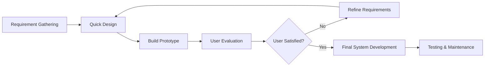
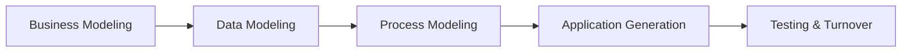
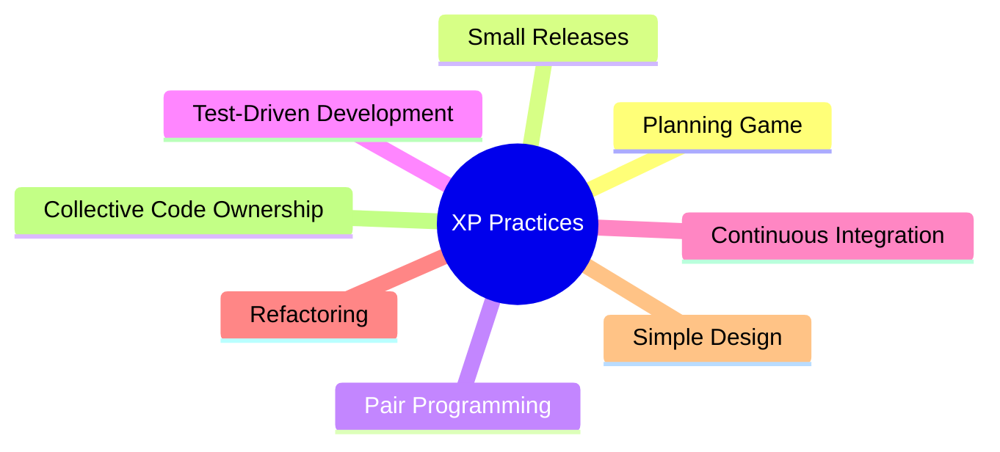
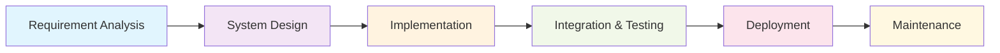
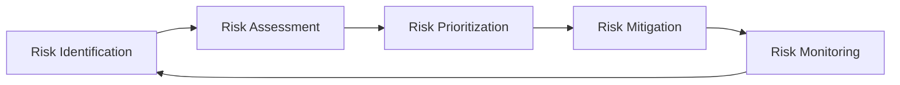
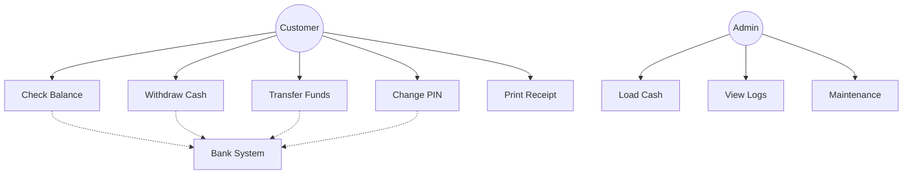
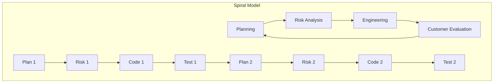
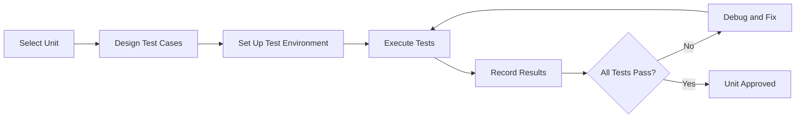
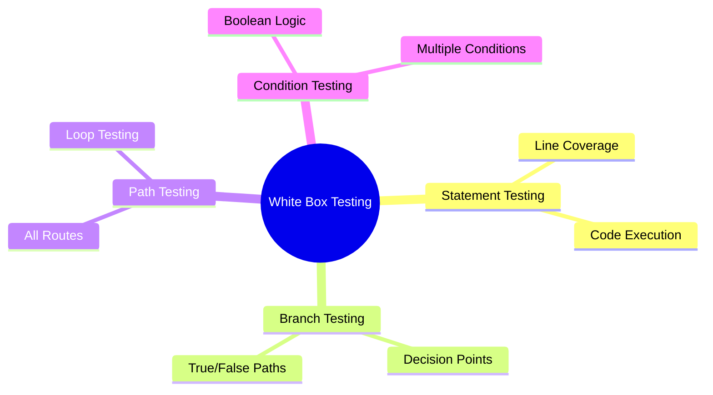

## Question 1(a) [3 marks]

**Give IEEE definition of software. Write one example of each for application and system software.**

**Answer**:

**IEEE Definition**: Software is a collection of computer programs, procedures, rules, and associated documentation and data.

**Examples**:

| Software Type | Example | Purpose |
|---------------|---------|---------|
| **Application Software** | Microsoft Word | Word processing and document creation |
| **System Software** | Windows 10 | Operating system managing hardware resources |

- **Application software**: Programs designed for end-users to accomplish specific tasks
- **System software**: Programs that manage and operate computer hardware

**Mnemonic:** "Apps help Users, Systems help Hardware"

---

## Question 1(b) [4 marks]

**Write a short note on data dictionary.**

**Answer**:

Data dictionary is a centralized repository containing definitions and characteristics of data elements used in a system.

**Components Table**:

| Component | Description |
|-----------|-------------|
| **Data Name** | Unique identifier for data element |
| **Aliases** | Alternative names used |
| **Description** | Purpose and meaning |
| **Data Type** | Format (integer, string, etc.) |
| **Length** | Size constraints |
| **Values** | Valid range or set |

- **Purpose**: Ensures consistency in data usage across development team
- **Benefits**: Reduces ambiguity, improves communication, standardizes data definitions
- **Usage**: Referenced during system design and database creation

**Mnemonic:** "Dictionary Defines Data Clearly"

---

## Question 1(c) [7 marks]

**Explain prototype model with figure.**

**Answer**:

Prototype model is an iterative approach where a working model is built early to understand requirements better.

**Diagram**:



**Characteristics**:

| Phase | Activity | Output |
|-------|----------|--------|
| **Quick Design** | Basic architecture | Initial design |
| **Prototype Build** | Working model | Testable system |
| **User Evaluation** | Feedback collection | Requirements refinement |

- **Advantages**: Early user feedback, reduced development risk, better requirement understanding
- **Disadvantages**: May lead to inadequate analysis, customer expects prototype as final product
- **Best for**: Projects with unclear requirements

**Mnemonic:** "Prototype Proves Possibilities"

---

## Question 1(c) OR [7 marks]

**Explain RAD model with advantages and disadvantages.**

**Answer**:

RAD (Rapid Application Development) emphasizes quick development through prototyping and iterative development.

**RAD Phases**:



**Advantages vs Disadvantages**:

| Advantages | Disadvantages |
|------------|---------------|
| **Faster development** | **Requires skilled developers** |
| **Early user involvement** | **Not suitable for large projects** |
| **Reduced costs** | **Requires user commitment** |
| **Better quality** | **Technical risks if not managed** |

- **Key feature**: Uses automated tools and 4GL programming
- **Timeline**: Typically 60-90 days for development
- **Team**: Small, experienced development teams

**Mnemonic:** "RAD Rapidly Accelerates Development"

---

## Question 2(a) [3 marks]

**Give the full form of following: SQA, FTR, RAD, BVA, GUI, DFD**

**Answer**:

| Abbreviation | Full Form |
|--------------|-----------|
| **SQA** | Software Quality Assurance |
| **FTR** | Formal Technical Review |
| **RAD** | Rapid Application Development |
| **BVA** | Boundary Value Analysis |
| **GUI** | Graphical User Interface |
| **DFD** | Data Flow Diagram |

**Mnemonic:** "Software Quality And Formal Technical Reviews Rapidly Analyze Development, Boundary Value Analysis Guides User Interface, Data Flow Diagrams"

---

## Question 2(b) [4 marks]

**Define agile methodology. Discuss agile principles.**

**Answer**:

**Definition**: Agile is an iterative software development approach emphasizing collaboration, flexibility, and rapid delivery of working software.

**Core Agile Principles**:

| Principle | Description |
|-----------|-------------|
| **Individuals over processes** | People and communication are priority |
| **Working software over documentation** | Functional software is primary measure |
| **Customer collaboration** | Continuous customer involvement |
| **Responding to change** | Adaptability over rigid plans |

- **Iteration length**: Typically 2-4 weeks (sprints)
- **Delivery**: Frequent working software releases
- **Team structure**: Cross-functional, self-organizing teams

**Mnemonic:** "Agile Adapts And Advances"

---

## Question 2(c) [7 marks]

**Explain XP model with its advantages and disadvantages.**

**Answer**:

XP (Extreme Programming) is an agile methodology emphasizing engineering practices and customer satisfaction.

**XP Practices**:



**Advantages and Disadvantages**:

| Advantages | Disadvantages |
|------------|---------------|
| **High code quality** | **Requires experienced programmers** |
| **Rapid feedback** | **Customer must be available** |
| **Reduced bugs** | **Code-focused, less documentation** |
| **Flexibility** | **Difficult to estimate costs** |

- **Key practice**: Pair programming ensures code quality
- **Testing**: Test-first approach with automated testing
- **Customer role**: On-site customer provides continuous feedback

**Mnemonic:** "eXtreme Programming eXcels through Practices"

---

## Question 2(a) OR [3 marks]

**Define black box testing. Give at least two names of black box testing method.**

**Answer**:

**Definition**: Black box testing examines software functionality without knowledge of internal code structure, focusing on input-output behavior.

**Black Box Testing Methods**:

| Method | Description |
|--------|-------------|
| **Equivalence Partitioning** | Divides input into valid/invalid classes |
| **Boundary Value Analysis** | Tests values at input boundaries |

- **Approach**: Tests based on requirements and specifications
- **Tester knowledge**: No internal code knowledge required
- **Focus**: External behavior and functionality

**Mnemonic:** "Black Box Behavior Based"

---

## Question 2(b) OR [4 marks]

**Give the full form of CLI. Explain CLI in brief.**

**Answer**:

**CLI**: Command Line Interface

**CLI Characteristics**:

| Aspect | Description |
|--------|-------------|
| **Input method** | Text commands typed by user |
| **Output** | Text-based responses |
| **Navigation** | Commands for file/directory operations |
| **Efficiency** | Faster for experienced users |

- **Advantages**: Fast execution, less memory usage, scriptable
- **Disadvantages**: Requires learning commands, not user-friendly for beginners
- **Examples**: Windows Command Prompt, Linux Terminal, DOS

**Mnemonic:** "Commands Lead Interaction"

---

## Question 2(c) OR [7 marks]

**Explain waterfall model with neat figure.**

**Answer**:

Waterfall model is a linear sequential approach where each phase must be completed before moving to the next.

**Waterfall Model Diagram**:



**Phase Details**:

| Phase | Activities | Deliverables |
|-------|------------|--------------|
| **Requirements** | Gather and document needs | SRS document |
| **Design** | System architecture | Design documents |
| **Implementation** | Code development | Source code |
| **Testing** | Verify functionality | Test reports |
| **Deployment** | System installation | Working system |
| **Maintenance** | Bug fixes, updates | Updated system |

- **Advantages**: Simple, easy to manage, well-documented
- **Disadvantages**: Inflexible, late testing, difficult to accommodate changes

**Mnemonic:** "Water Always Flows Downward"

---

## Question 3(a) [3 marks]

**Give one word answer:**

**Answer**:

| Question | Answer |
|----------|--------|
| **Lowest cohesion is** | Coincidental |
| **Highest coupling is** | Content |
| **Slack time of critical activity is** | Zero |

**Mnemonic:** "Coincidental Cohesion, Content Coupling, Critical Zero"

---

## Question 3(b) [4 marks]

**Explain classification of coupling.**

**Answer**:

Coupling measures interdependence between modules. Lower coupling is better for maintainability.

**Coupling Types (Best to Worst)**:

| Type | Description | Example |
|------|-------------|---------|
| **Data** | Parameters passed | Method calls with parameters |
| **Stamp** | Data structure passed | Passing objects/records |
| **Control** | Control information passed | Flags/switches passed |
| **External** | External data reference | Global variables |
| **Common** | Shared data area | Common memory blocks |
| **Content** | Direct access to internals | Modifying another module's data |

- **Best practice**: Aim for data coupling
- **Avoid**: Content and common coupling
- **Design goal**: Minimize dependencies between modules

**Mnemonic:** "Data Stamps Control External Common Content"

---

## Question 3(c) [7 marks]

**Define following terms (don't just give the full form):**

**Answer**:

| Term | Definition |
|------|------------|
| **UI** | User Interface - the means by which users interact with software systems |
| **SE** | Software Engineering - systematic approach to software development using engineering principles |
| **PMC** | Project Management and Control - planning, monitoring, and controlling software projects |
| **SDLC** | Software Development Life Cycle - phases involved in software development from conception to maintenance |
| **Verification** | Process of checking if software meets specified requirements and design |
| **Validation** | Process of checking if software meets user needs and intended purpose |
| **SRS** | Software Requirements Specification - detailed document describing software functionality and constraints |

- **Verification**: "Are we building the product right?"
- **Validation**: "Are we building the right product?"
- **Key difference**: Verification checks specifications, Validation checks user satisfaction

**Mnemonic:** "Users Interact, Software Engineers Plan, Managing Cycles, Specifications Define, Verification checks Requirements, Validation checks Satisfaction, Requirements Specify Software"

---

## Question 3(a) OR [3 marks]

**Explain menu based UI with advantages and disadvantages.**

**Answer**:

Menu-based UI presents options in hierarchical menus for user selection.

**Advantages vs Disadvantages**:

| Advantages | Disadvantages |
|------------|---------------|
| **Easy to learn** | **Slower for experts** |
| **Reduces errors** | **Limited flexibility** |
| **Self-explanatory** | **Screen space consumption** |

- **Structure**: Hierarchical organization of options
- **Navigation**: Point-and-click or keyboard shortcuts
- **Best for**: Applications with well-defined functions

**Mnemonic:** "Menus Make Choices Clear"

---

## Question 3(b) OR [4 marks]

**Explain classification of cohesion.**

**Answer**:

Cohesion measures how closely related elements within a module are. Higher cohesion is better.

**Cohesion Types (Best to Worst)**:

| Type | Description |
|------|-------------|
| **Functional** | Single, well-defined task |
| **Sequential** | Output of one element feeds next |
| **Communicational** | Elements work on same data |
| **Procedural** | Elements follow execution sequence |
| **Temporal** | Elements executed at same time |
| **Logical** | Elements perform similar functions |
| **Coincidental** | Elements randomly grouped |

- **Goal**: Achieve functional cohesion
- **Design principle**: Each module should have single responsibility
- **Measurement**: Higher cohesion = better design

**Mnemonic:** "Functional Sequences Communicate Procedures Temporally through Logical Coincidence"

---

## Question 3(c) OR [7 marks]

**Define risk. Explain risk management.**

**Answer**:

**Risk Definition**: Potential problem that may occur during software development, causing negative impact on project success.

**Risk Management Process**:



**Risk Management Activities**:

| Activity | Description | Output |
|----------|-------------|--------|
| **Identification** | Find potential problems | Risk list |
| **Assessment** | Analyze probability and impact | Risk analysis |
| **Prioritization** | Rank risks by importance | Priority matrix |
| **Mitigation** | Plan risk responses | Mitigation strategies |
| **Monitoring** | Track risk status | Updated risk status |

- **Risk types**: Technical, Project, Business risks
- **Strategies**: Avoid, Transfer, Mitigate, Accept
- **Tools**: Risk matrices, probability-impact charts

**Mnemonic:** "Risk Requires Careful Planning"

---

## Question 4(a) [3 marks]

**Define: Error, Failure, Test case**

**Answer**:

| Term | Definition |
|------|------------|
| **Error** | Human mistake made during software development process |
| **Failure** | Deviation of software behavior from expected results |
| **Test case** | Set of conditions to verify specific functionality or system requirement |

- **Relationship**: Error leads to defect, defect causes failure
- **Error source**: Developer mistakes, misunderstanding requirements
- **Test case components**: Input, expected output, execution steps

**Mnemonic:** "Errors Cause Failures, Tests Catch Problems"

---

## Question 4(b) [4 marks]

**Identify any six functional requirements of ATM system.**

**Answer**:

**ATM System Functional Requirements**:

| Requirement | Description |
|-------------|-------------|
| **User Authentication** | PIN verification for account access |
| **Balance Inquiry** | Display current account balance |
| **Cash Withdrawal** | Dispense requested cash amount |
| **Fund Transfer** | Transfer money between accounts |
| **Transaction History** | Show recent transaction records |
| **PIN Change** | Allow users to modify PIN |

- **Security**: All transactions require authentication
- **Validation**: Check sufficient balance before withdrawal
- **Logging**: Record all transactions for audit

**Mnemonic:** "ATMs Authenticate, Balance, Cash, Transfer, History, PIN"

---

## Question 4(c) [7 marks]

**State the use of activity network diagram. Develop activity network diagram for the following system and find the critical path for the same.**

**Answer**:

**Activity Network Diagram Uses**:

- **Project scheduling**: Determine project timeline
- **Critical path identification**: Find longest path determining minimum project duration
- **Resource planning**: Optimize resource allocation

**Activity Network Diagram**:

```goat
    A(2) -----> C(2) -----> E(4) -----> G(5) -----> H(2)
             /           \           /
    B(3) ---+             +--> D(4) +
                              |
                              F(3)
```

**Critical Path Analysis**:

| Path | Activities | Duration | Critical? |
|------|------------|----------|-----------|
| **A-C-E-G-H** | A→C→E→G→H | 2+2+4+5+2 = 15 | No |
| **B-C-E-G-H** | B→C→E→G→H | 3+2+4+5+2 = 16 | **Yes** |
| **A-C-D-G-H** | A→C→D→G→H | 2+2+4+5+2 = 15 | No |

**Critical Path**: B→C→E→G→H (16 days)
**Project Duration**: 16 days

**Mnemonic:** "Networks Navigate Project Paths"

---

## Question 4(a) OR [3 marks]

**Explain any three requirement gathering activities.**

**Answer**:

**Requirement Gathering Activities**:

| Activity | Description | Output |
|----------|-------------|--------|
| **Stakeholder Interviews** | Direct discussion with users and clients | Interview notes, requirements list |
| **Questionnaires** | Structured questions for large user groups | Survey responses, statistical data |
| **Document Analysis** | Review existing system documentation | Current system understanding |

- **Purpose**: Understand user needs and system expectations
- **Participants**: Users, customers, domain experts, developers
- **Documentation**: All findings recorded in SRS document

**Mnemonic:** "Interviews, Questions, Documents Gather Requirements"

---

## Question 4(b) OR [4 marks]

**Develop use case diagram for Bank ATM system.**

**Answer**:

**ATM Use Case Diagram**:



**Use Case Details**:

| Actor | Use Cases |
|-------|-----------|
| **Customer** | Check Balance, Withdraw Cash, Transfer Funds, Change PIN |
| **Admin** | Load Cash, View Logs, System Maintenance |
| **Bank System** | Validate accounts, Process transactions |

**Mnemonic:** "Customers Use ATMs, Admins Maintain Systems"

---

## Question 4(c) OR [7 marks]

**Draw the figure of spiral model. Explain it in brief.**

**Answer**:

**Spiral Model Diagram**:



**Spiral Model Characteristics**:

| Quadrant | Activity | Purpose |
|----------|----------|---------|
| **Planning** | Define objectives, alternatives | Set goals for iteration |
| **Risk Analysis** | Identify and resolve risks | Minimize project risks |
| **Engineering** | Develop and test product | Create working software |
| **Evaluation** | Customer assessment | Get user feedback |

- **Key feature**: Risk-driven approach with iterative development
- **Best for**: Large, complex, high-risk projects
- **Advantages**: Risk management, flexible, incremental development
- **Disadvantages**: Complex management, expensive, requires risk expertise

**Mnemonic:** "Spirals Plan, Risk, Engineer, Evaluate"

---

## Question 5(a) [3 marks]

**State TRUE or FALSE for the following.**

**Answer**:

| Statement | Answer | Explanation |
|-----------|--------|-------------|
| **Activity network diagram used to determine critical path** | **TRUE** | Primary purpose of activity networks |
| **In CPM, the shortest path is the critical path** | **FALSE** | Longest path is critical path |
| **Risk avoidance is the best technique to solve risks** | **FALSE** | Best technique depends on risk type |

- **Critical path**: Longest duration path in project network
- **CPM**: Critical Path Method identifies project bottlenecks
- **Risk strategies**: Avoid, Transfer, Mitigate, Accept (choice depends on context)

**Mnemonic:** "True Networks, False Shortest, False Best"

---

## Question 5(b) [4 marks]

**Identify the differences between traditional model approach and agile approach. (at least 4 differences)**

**Answer**:

**Traditional vs Agile Comparison**:

| Aspect | Traditional | Agile |
|--------|-------------|-------|
| **Planning** | Extensive upfront planning | Adaptive planning |
| **Documentation** | Heavy documentation | Minimal documentation |
| **Customer involvement** | Limited to requirements phase | Continuous involvement |
| **Change handling** | Difficult and expensive | Embraces change |
| **Delivery** | Single final delivery | Frequent incremental delivery |
| **Process** | Process-driven | People-driven |

- **Traditional**: Predictive, sequential approach
- **Agile**: Adaptive, iterative approach
- **Flexibility**: Agile more responsive to changing requirements

**Mnemonic:** "Traditional Plans Heavy, Agile Adapts Light"

---

## Question 5(c) [7 marks]

**Define unit testing. Draw the figure of it. Explain the process of unit testing.**

**Answer**:

**Unit Testing Definition**: Testing individual software components or modules in isolation to verify they function correctly according to design specifications.

**Unit Testing Process**:



**Unit Testing Process Steps**:

| Step | Activity | Purpose |
|------|----------|---------|
| **Test Planning** | Identify units to test | Define testing scope |
| **Test Design** | Create test cases | Cover all code paths |
| **Test Setup** | Prepare test environment | Isolate unit under test |
| **Test Execution** | Run test cases | Verify unit behavior |
| **Result Analysis** | Evaluate outcomes | Identify defects |
| **Defect Fixing** | Correct found issues | Ensure unit quality |

- **Benefits**: Early defect detection, easier debugging, improved code quality
- **Tools**: JUnit, NUnit, automated testing frameworks
- **Coverage**: Aim for high code coverage (statements, branches, paths)

**Mnemonic:** "Units Test Individual Components Thoroughly"

---

## Question 5(a) OR [3 marks]

**Give the full form of the following.**

**Answer**:

| Abbreviation | Full Form |
|--------------|-----------|
| **AOA** | Activity On Arrow |
| **PERT** | Program Evaluation and Review Technique |
| **EVA** | Earned Value Analysis |
| **CPM** | Critical Path Method |
| **WBS** | Work Breakdown Structure |
| **PMC** | Project Management and Control |

**Mnemonic:** "Activities On Arrows, Programs Evaluate Review Techniques, Earned Values Analyzed, Critical Paths Managed, Work Broken Structured, Projects Managed Controlled"

---

## Question 5(b) OR [4 marks]

**Explain code inspection.**

**Answer**:

Code inspection is a systematic examination of source code by team members to identify defects and ensure quality standards.

**Code Inspection Process**:

| Phase | Activity | Participants |
|-------|----------|--------------|
| **Planning** | Schedule inspection meeting | Moderator |
| **Preparation** | Review code individually | All inspectors |
| **Inspection Meeting** | Discuss findings | Team members |
| **Rework** | Fix identified issues | Author |
| **Follow-up** | Verify corrections | Moderator |

- **Benefits**: Early defect detection, knowledge sharing, improved code quality
- **Roles**: Author, Moderator, Reviewers, Recorder
- **Focus areas**: Logic errors, coding standards, maintainability

**Mnemonic:** "Inspections Improve Code Quality"

---

## Question 5(c) OR [7 marks]

**Define white box testing method. Explain different white box testing methods.**

**Answer**:

**White Box Testing Definition**: Testing method that examines internal code structure, logic paths, and implementation details to ensure thorough coverage.

**White Box Testing Methods**:

| Method | Description | Coverage Focus |
|--------|-------------|----------------|
| **Statement Coverage** | Execute every statement | All code lines |
| **Branch Coverage** | Test all decision outcomes | If-else conditions |
| **Path Coverage** | Execute all possible paths | Complete execution flows |
| **Condition Coverage** | Test all condition combinations | Boolean expressions |

**Testing Techniques**:



**Coverage Analysis**:

| Technique | Formula | Purpose |
|-----------|---------|---------|
| **Statement** | Executed statements / Total statements | Ensure all code runs |
| **Branch** | Tested branches / Total branches | Cover all decisions |
| **Path** | Tested paths / Total paths | Complete flow coverage |

- **Tools**: Code coverage analyzers, debugging tools
- **Advantages**: Thorough testing, identifies dead code, ensures quality
- **Disadvantages**: Requires code knowledge, time-consuming, may miss requirement gaps

**Mnemonic:** "White Box Sees Inside Code Structure"
