## પ્રશ્ન 1(અ) [3 ગુણ]

**સૉફ્ટવેર ની વ્યાખ્યા આપો. તેમજ એના લક્ષણો સમજાવો**

**જવાબ**:

સૉફ્ટવેર એ પ્રોગ્રામ્સ, સૂચનાઓ અને દસ્તાવેજીકરણનો સંગ્રહ છે જે કમ્પ્યુટર સિસ્ટમ પર કાર્યો કરે છે.

**મુખ્ય લક્ષણો:**

| લક્ષણ | વર્ણન |
|---|---|
| **અમૂર્ત** | શારીરિક રીતે સ્પર્શ કરી શકાતું નથી |
| **તાર્કિક** | વ્યવસ્થિત અભિગમ દ્વારા બનાવાયેલ |
| **ઉત્પાદિત** | પરંપરાગત રીતે ઉત્પન્ન નહીં, વિકસિત |
| **જટિલ** | અંતર્ગત જટિલ માળખું ધરાવે છે |

**મેમરી ટ્રીક:** "અમૂર્ત તાર્કિક ઉત્પાદન જટિલતા"

## પ્રશ્ન 1(બ) [4 ગુણ]

**Software engineering- A layered technology વિશેનો નોંધ લખો.**

**જવાબ**:

Software Engineering એ સ્તરીય ટેકનોલોજી તરીકે માળખાકીય છે જ્યાં દરેક સ્તર આગામી સ્તરને આધાર આપે છે.

**સ્તરીય માળખું:**

| સ્તર | હેતુ | વર્ણન |
|---|---|---|
| **Quality Focus** | પાયો | ગુણવત્તાયુક્ત ઉત્પાદનો પહોંચાડવાનો ભાર |
| **Process** | ફ્રેમવર્ક | સૉફ્ટવેર ડેવલપમેન્ટ કેવી રીતે કરવું તે નક્કી કરે છે |
| **Methods** | તકનીકો | પ્રવૃત્તિઓ કરવાની વિશિષ્ટ પદ્ધતિઓ |
| **Tools** | સ્વચાલન | પદ્ધતિઓને આધાર આપતું સૉફ્ટવેર |

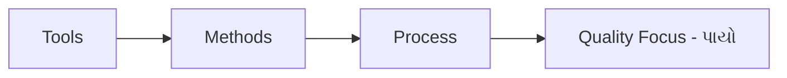

**મેમરી ટ્રીક:** "ટૂલ્સ મેથડ્સ પ્રોસેસ ક્વોલિટી"

## પ્રશ્ન 1(ક) [7 ગુણ]

**સૉફ્ટવેર પ્રોસેસ ફ્રેમવર્ક તેમજ umbrella એક્ટિવિટી સમજાવો.**

**જવાબ**:

સૉફ્ટવેર પ્રોસેસ ફ્રેમવર્ક સૉફ્ટવેર ડેવલપમેન્ટ માટે મુખ્ય પ્રવૃત્તિઓ અને umbrella પ્રવૃત્તિઓ સાથે માળખું પ્રદાન કરે છે.

**ફ્રેમવર્ક પ્રવૃત્તિઓ:**

| પ્રવૃત્તિ | હેતુ | મુખ્ય કાર્યો |
|---|---|---|
| **Communication** | આવશ્યકતાઓ સમજવી | હિસ્સેદારો સાથે વાતચીત, આવશ્યકતા એકત્રીકરણ |
| **Planning** | રોડમેપ બનાવવો | અંદાજ, શેડ્યૂલિંગ, જોખમ મૂલ્યાંકન |
| **Modeling** | બ્લુપ્રિન્ટ બનાવવા | વિશ્લેષણ અને ડિઝાઇન મોડલ્સ |
| **Construction** | સૉફ્ટવેર બનાવવું | કોડિંગ અને ટેસ્ટિંગ |
| **Deployment** | વપરાશકર્તાઓને પહોંચાડવું | ઇન્સ્ટોલેશન, સપોર્ટ, ફીડબેક |

**Umbrella પ્રવૃત્તિઓ:**

- **Software project tracking**: પ્રગતિ નિરીક્ષણ અને ગુણવત્તા નિયંત્રણ
- **Risk management**: સંભવિત સમસ્યાઓ ઓળખવી અને ઘટાડવી
- **Quality assurance**: ધોરણો પૂરા થાય તેની ખાતરી કરવી
- **Configuration management**: ફેરફારોને વ્યવસ્થિત રીતે નિયંત્રિત કરવા
- **Work product preparation**: ડિલિવરેબલ દસ્તાવેજો બનાવવા

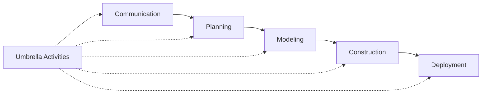

**મેમરી ટ્રીક:** "કોમ્યુનિકેશન પ્લાનિંગ મોડલિંગ કન્સ્ટ્રક્શન ડિપ્લોયમેન્ટ" + "ટ્રેક રિસ્ક ક્વોલિટી કન્ફિગરેશન વર્ક"

## પ્રશ્ન 1(ક) અથવા [7 ગુણ]

**SDLC ની વ્યાખ્યા આપો. તેમજ દરેક તબક્કા સમજાવો.**

**જવાબ**:

SDLC (Software Development Life Cycle) એ સૉફ્ટવેર એપ્લિકેશન્સ વિકસાવવા માટેની વ્યવસ્થિત પ્રક્રિયા છે.

**SDLC તબક્કાઓ:**

| તબક્કો | હેતુ | મુખ્ય પ્રવૃત્તિઓ | ડિલિવરેબલ્સ |
|---|---|---|---|
| **Planning** | અવકાશ નક્કી કરવો | શક્યતા અભ્યાસ, સંસાધન ફાળવણી | પ્રોજેક્ટ પ્લાન |
| **Analysis** | આવશ્યકતાઓ એકત્રિત કરવી | આવશ્યકતા સંગ્રહ, દસ્તાવેજીકરણ | SRS દસ્તાવેજ |
| **Design** | આર્કિટેક્ચર બનાવવું | સિસ્ટમ ડિઝાઇન, ડેટાબેસ ડિઝાઇન | ડિઝાઇન દસ્તાવેજો |
| **Implementation** | કોડ લખવો | પ્રોગ્રામિંગ, યુનિટ ટેસ્ટિંગ | સોર્સ કોડ |
| **Testing** | ગુણવત્તા ચકાસવી | સિસ્ટમ ટેસ્ટિંગ, બગ ફિક્સિંગ | ટેસ્ટ રિપોર્ટ્સ |
| **Deployment** | સૉફ્ટવેર રિલીઝ કરવું | ઇન્સ્ટોલેશન, યુઝર ટ્રેનિંગ | લાઇવ સિસ્ટમ |
| **Maintenance** | ચાલુ સપોર્ટ | બગ ફિક્સ, એન્હાન્સમેન્ટ્સ | અપડેટેડ સિસ્ટમ |


**મેમરી ટ્રીક:** "પ્લાન એનાલિસિસ ડિઝાઇન ઇમ્પ્લિમેન્ટેશન ટેસ્ટિંગ ડિપ્લોયમેન્ટ મેઇન્ટેનન્સ"

## પ્રશ્ન 2(અ) [3 ગુણ]

**Prototype model ના ફાયદા તેમજ નુકશાન વર્ણન કરો.**

**જવાબ**:

**Prototype Model વિશ્લેષણ:**

| ફાયદા | નુકસાન |
|---|---|
| **વહેલો ફીડબેક** વપરાશકર્તાઓ તરફથી | **સમય વાપરતું** ડેવલપમેન્ટ પ્રોસેસ |
| **ઓછું જોખમ** નિષ્ફળતાનું | **ખર્ચમાં વધારો** પુનરાવર્તન કારણે |
| **બહેતર સમજ** આવશ્યકતાઓની | **Scope creep** થઈ શકે છે |

**મેમરી ટ્રીક:** "વહેલો ઓછું બહેતર" વિરુદ્ધ "સમય ખર્ચ સ્કોપ"

## પ્રશ્ન 2(બ) [4 ગુણ]

**Prototyping મૉડલ સમજાવો, એ મૉડલ ક્યારે ઉપયોગમાં લઈ શકાય.**

**જવાબ**:

Prototyping Model વિકાસ પ્રક્રિયાની શરૂઆતમાં સૉફ્ટવેરનું કાર્યશીલ મોડલ બનાવે છે.

**ક્યારે ઉપયોગ કરવો:**

| સ્થિતિ | ઉદાહરણ | જસ્ટિફિકેશન |
|---|---|---|
| **અસ્પષ્ટ આવશ્યકતાઓ** | ઓનલાઇન શોપિંગ કાર્ટ | યુઝર ઇન્ટરફેસને સુધારવાની જરૂર |
| **નવી ટેકનોલોજી** | મોબાઇલ બેંકિંગ એપ | શક્યતા પરીક્ષણ જરૂરી |
| **યુઝર ઇન્ટરેક્શન જટિલ** | ગેમિંગ એપ્લિકેશન | યુઝર અનુભવ ચકાસણી જરૂરી |

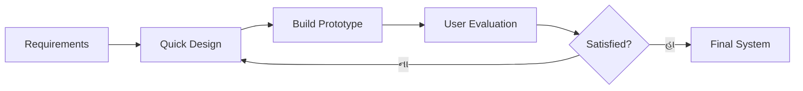

**મેમરી ટ્રીક:** "આવશ્યકતા ઝડપી બિલ્ડ યુઝર સંતુષ્ટ ફાઇનલ"

## પ્રશ્ન 2(ક) [7 ગુણ]

**આકૃતિ બનાવી સમજાવો (I) Waterfall model & (II) Incremental Model.**

**જવાબ**:

**(I) Waterfall Model:**

રેખીય ક્રમિક અભિગમ જ્યાં દરેક તબક્કો આગલા તબક્કા પહેલાં પૂર્ણ થવો જોઈએ.


| લક્ષણો | વર્ણન |
|---|---|
| **ક્રમિક** | એક સમયે એક તબક્કો |
| **દસ્તાવેજીકરણ આધારિત** | ભારે દસ્તાવેજીકરણ |
| **યોગ્ય** | સ્પષ્ટ આવશ્યકતાઓ માટે |

**(II) Incremental Model:**

નાના increments માં વિકાસ જ્યાં દરેક increment કાર્યક્ષમતા ઉમેરે છે.

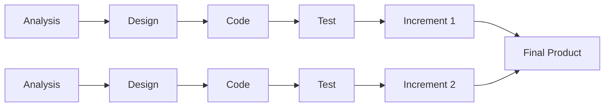

| લક્ષણ | Waterfall | Incremental |
|---|---|---|
| **લવચીકતા** | ઓછી | વધુ |
| **જોખમ** | વધુ | ઓછું |
| **ડિલિવરી** | પ્રોજેક્ટના અંતે | બહુવિધ ડિલિવરીઓ |

**મેમરી ટ્રીક:** "વોટર એકવાર પડે, ઇન્ક્રિમેન્ટ બહુવિધ બનાવે"

## પ્રશ્ન 2(અ) અથવા [3 ગુણ]

**Incremental Model ના ફાયદા તેમજ નુકશાન વર્ણન કરો.**

**જવાબ**:

**Incremental Model વિશ્લેષણ:**

| ફાયદા | નુકસાન |
|---|---|
| **વહેલી ડિલિવરી** કાર્યશીલ સૉફ્ટવેરની | **કુલ ખર્ચ** વધુ હોઈ શકે |
| **સરળ ટેસ્ટિંગ** નાના increments ની | **સિસ્ટમ આર્કિટેક્ચર** સમસ્યાઓ |
| **ઓછું જોખમ** વહેલા ફીડબેક દ્વારા | **મેનેજમેન્ટ જટિલતા** વધે છે |

**મેમરી ટ્રીક:** "વહેલી સરળ ઓછું" વિરુદ્ધ "કુલ સિસ્ટમ મેનેજમેન્ટ"

## પ્રશ્ન 2(બ) અથવા [4 ગુણ]

**Rapid Application Development (RAD) નો ખ્યાલ આપો સમજાવો.**

**જવાબ**:

RAD યોજના અને ટેસ્ટિંગ કરતાં ઝડપી prototyping અને ત્વરિત ફીડબેક પર ભાર મૂકે છે.

**RAD ઘટકો:**

| તબક્કો | અવધિ | પ્રવૃત્તિઓ | આઉટપુટ |
|---|---|---|---|
| **Business Modeling** | ટૂંકી | માહિતી પ્રવાહ નક્કી કરવો | બિઝનેસ આવશ્યકતાઓ |
| **Data Modeling** | ટૂંકી | ડેટા ઓબ્જેક્ટ્સ નક્કી કરવા | ડેટા મોડલ્સ |
| **Process Modeling** | ટૂંકી | પ્રોસેસિંગ functions નક્કી કરવા | પ્રોસેસ વર્ણનો |
| **Application Generation** | ટૂંકી | ટૂલ્સ વાપરીને બનાવવું | કાર્યશીલ એપ્લિકેશન |
| **Testing & Turnover** | ટૂંકી | ટેસ્ટ અને ડિલિવર કરવું | ફાઇનલ સિસ્ટમ |


**મેમરી ટ્રીક:** "બિઝનેસ ડેટા પ્રોસેસ એપ્લિકેશન ટેસ્ટિંગ"

## પ્રશ્ન 2(ક) અથવા [7 ગુણ]

**Spiral Model ની આકૃતિ બનાવી સમજાવો. તેમજ ફાયદા અને નુકશાન વર્ણન કરો.**

**જવાબ**:

Spiral Model પુનરાવર્તક વિકાસને વ્યવસ્થિત જોખમ વિશ્લેષણ સાથે જોડે છે.

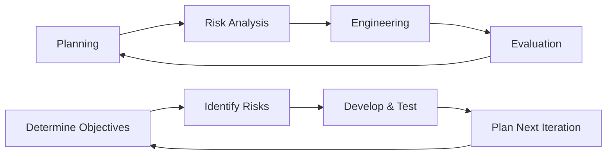

**Spiral ચતુર્થાંશ:**

| ચતુર્થાંશ | પ્રવૃત્તિ | હેતુ |
|---|---|---|
| **Planning** | લક્ષ્ય સેટિંગ | આવશ્યકતાઓ અને અવરોધો નક્કી કરવા |
| **Risk Analysis** | જોખમ મૂલ્યાંકન | જોખમો ઓળખવા અને ઉકેલવા |
| **Engineering** | વિકાસ | ઉત્પાદન બનાવવું અને ટેસ્ટ કરવું |
| **Evaluation** | ગ્રાહક મૂલ્યાંકન | પરિણામો મૂલ્યાંકન અને આગલા iteration ની યોજના |

**ફાયદા વિરુદ્ધ નુકસાન:**

| ફાયદા | નુકસાન |
|---|---|
| **ઉચ્ચ જોખમ પ્રોજેક્ટ્સ** સારી રીતે હેન્ડલ થાય | **જટિલ મેનેજમેન્ટ** જરૂરી |
| **મોટી** એપ્લિકેશન્સ માટે સારું | **નાના પ્રોજેક્ટ્સ માટે મોંઘું** |
| **ગ્રાહક સામેલ** આખા દરમિયાન | **જોખમ વિશ્લેષણ કુશળતા** જરૂરી |

**મેમરી ટ્રીક:** "પ્લાન રિસ્ક એન્જિનિયર ઇવેલ્યુએટ" + "ઉચ્ચ સારું ગ્રાહક" વિરુદ્ધ "જટિલ મોંઘું જોખમ"

## પ્રશ્ન 3(અ) [3 ગુણ]

**SRS ના મહત્વ દર્શાવો**

**જવાબ**:

SRS (Software Requirements Specification) એ સૉફ્ટવેર ડેવલપમેન્ટ માટે મહત્વપૂર્ણ પાયાનું દસ્તાવેજ છે.

**મહત્વ કોષ્ટક:**

| પાસું | મહત્વ | ફાયદો |
|---|---|---|
| **કોમ્યુનિકેશન** | હિસ્સેદારોની સમજ | સ્પષ્ટ અપેક્ષાઓ |
| **કરાર** | કાનૂની સમજૂતી | વિવાદ નિરાકરણ |
| **ટેસ્ટિંગ આધાર** | ચકાસણી માપદંડ | ગુણવત્તા ખાતરી |

**મેમરી ટ્રીક:** "કોમ્યુનિકેશન કરાર ટેસ્ટિંગ"

## પ્રશ્ન 3(બ) [4 ગુણ]

**સારા અને ખરાબ SRS ના લક્ષણો સમજાવો**

**જવાબ**:

**SRS ગુણવત્તા લક્ષણો:**

| સારો SRS | ખરાબ SRS |
|---|---|
| **સંપૂર્ણ** - બધી આવશ્યકતાઓ આવરી લેવાયેલ | **અધૂરો** - આવશ્યકતાઓ ખૂટે છે |
| **સુસંગત** - કોઈ વિરોધાભાસ નથી | **અસંગત** - વિરોધી નિવેદનો |
| **અસ્પષ્ટ નહીં** - સ્પષ્ટ અર્થ | **અસ્પષ્ટ** - બહુવિધ અર્થઘટન |
| **ચકાસી શકાય તેવું** - ટેસ્ટ કરી શકાય | **ચકાસી ન શકાય** - વેલિડેટ કરી શકાતું નથી |

**વધારાના સારા લક્ષણો:**

- **સુધારી શકાય તેવું**: બદલવું અને જાળવવું સરળ
- **ટ્રેસેબલ**: સ્રોત અને ડિઝાઇન સાથે લિંક

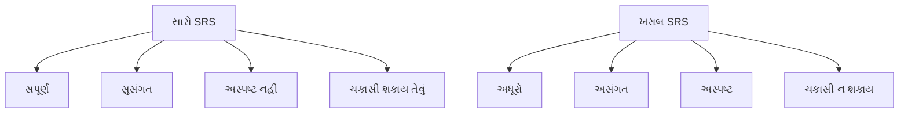

**મેમરી ટ્રીક:** "સંપૂર્ણ સુસંગત અસ્પષ્ટ-ન ચકાસી-શકાય" વિરુદ્ધ "અધૂરો અસંગત અસ્પષ્ટ ચકાસી-ન-શકાય"

## પ્રશ્ન 3(ક) [7 ગુણ]

**નીચે આપેલ નું વર્ગીકરણ/વર્ણન કરો. i) Functional Requirements ii) Non-functional Requirements**

**જવાબ**:

સૉફ્ટવેર આવશ્યકતાઓને બે મુખ્ય શ્રેણીઓમાં વર્ગીકૃત કરવામાં આવે છે.

**(i) Functional Requirements:**

સિસ્ટમે શું કરવું જોઈએ તે નક્કી કરે છે - વિશિષ્ટ વર્તણૂકો અને કાર્યો.

| પ્રકાર | વર્ણન | ઉદાહરણ |
|---|---|---|
| **બિઝનેસ નિયમો** | મુખ્ય બિઝનેસ લોજિક | "આવકના સ્લેબ મુજબ ટેક્સ ગણતરી કરવી" |
| **યુઝર એક્શન્સ** | સિસ્ટમ પ્રતિભાવો | "યુઝરનેમ/પાસવર્ડ સાથે લોગિન" |
| **ડેટા પ્રોસેસિંગ** | માહિતી હેન્ડલિંગ | "માસિક વેચાણ રિપોર્ટ જનરેટ કરવી" |
| **એક્સટર્નલ ઇન્ટરફેસ** | સિસ્ટમ ક્રિયાપ્રતિક્રિયાઓ | "પેમેન્ટ ગેટવે સાથે કનેક્ટ કરવું" |

**(ii) Non-functional Requirements:**

સિસ્ટમે કેવી રીતે પ્રદર્શન કરવું જોઈએ તે નક્કી કરે છે - ગુણવત્તા લક્ષણો અને મર્યાદાઓ.

| શ્રેણી | આવશ્યકતા | ઉદાહરણ | માપદંડ |
|---|---|---|---|
| **પ્રદર્શન** | પ્રતિભાવ સમય | "પેજ લોડ < 3 સેકન્ડ" | સમય મેટ્રિક્સ |
| **સુરક્ષા** | ડેટા સુરક્ષા | "યુઝર પાસવર્ડ એન્ક્રિપ્ટ કરવા" | સુરક્ષા ધોરણો |
| **વિશ્વસનીયતા** | સિસ્ટમ અપટાઇમ | "99.9% ઉપલબ્ધતા" | નિષ્ફળતા દરો |
| **ઉપયોગિતા** | યુઝર અનુભવ | "ચેકઆઉટ માટે મહત્તમ 3 ક્લિક" | યુઝર મેટ્રિક્સ |
| **સ્કેલેબિલિટી** | વૃદ્ધિ ક્ષમતા | "10,000 યુઝર્સ સપોર્ટ કરવા" | લોડ ક્ષમતા |

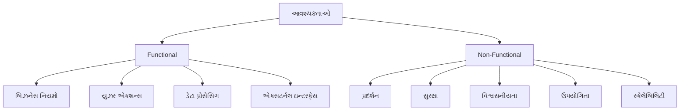

**સરખામણી કોષ્ટક:**

| પાસું | Functional | Non-Functional |
|---|---|---|
| **ધ્યાન** | સિસ્ટમ શું કરે છે | સિસ્ટમ કેવી રીતે પ્રદર્શન કરે છે |
| **ટેસ્ટિંગ** | Black-box testing | Performance testing |
| **દસ્તાવેજીકરણ** | Use cases | ગુણવત્તા મેટ્રિક્સ |

**મેમરી ટ્રીક:** "Functional = શું, Non-Functional = કેવી રીતે"

## પ્રશ્ન 3(અ) અથવા [3 ગુણ]

**Software projects ની વ્યવસ્થા કરવાની કુશળતાનું વર્ણન કરો.**

**જવાબ**:

પ્રોજેક્ટ મેનેજમેન્ટ માટે સફળ સૉફ્ટવેર ડિલિવરી માટે વિવિધ કુશળતાઓની જરૂર છે.

**આવશ્યક કુશળતાઓ:**

| કુશળતા શ્રેણી | વર્ણન | ઉપયોગ |
|---|---|---|
| **ટેકનિકલ** | ટેકનોલોજીની સમજ | આર્કિટેક્ચર નિર્ણયો |
| **નેતૃત્વ** | ટીમ પ્રેરણા | સંઘર્ષ નિરાકરણ |
| **કોમ્યુનિકેશન** | હિસ્સેદાર ક્રિયાપ્રતિક્રિયા | સ્થિતિ રિપોર્ટિંગ |

**મેમરી ટ્રીક:** "ટેકનિકલ નેતૃત્વ કોમ્યુનિકેશન"

## પ્રશ્ન 3(બ) અથવા [4 ગુણ]

**ટૂંકમાં સૉફ્ટવેર પ્રોજેક્ટ મેનેજરની જવાબદારી આપો.**

**જવાબ**:

સૉફ્ટવેર પ્રોજેક્ટ મેનેજર સમગ્ર પ્રોજેક્ટ લાઇફસાઇકલની દેખરેખ રાખે છે અને સફળ ડિલિવરી સુનિશ્ચિત કરે છે.

**મુખ્ય જવાબદારીઓ:**

| ક્ષેત્ર | જવાબદારી | પ્રવૃત્તિઓ |
|---|---|---|
| **પ્લાનિંગ** | પ્રોજેક્ટ રોડમેપ | શેડ્યૂલ, બજેટ, સંસાધન ફાળવણી |
| **એક્ઝિક્યુશન** | ટીમ સંકલન | કાર્ય સોંપણી, પ્રગતિ નિરીક્ષણ |
| **ગુણવત્તા** | ધોરણ પાલન | કોડ રિવ્યુ, ટેસ્ટિંગ દેખરેખ |
| **કોમ્યુનિકેશન** | હિસ્સેદાર અપડેટ્સ | સ્થિતિ રિપોર્ટ્સ, જોખમ કોમ્યુનિકેશન |

**વધારાની ફરજો:**

- **જોખમ વ્યવસ્થાપન**: પ્રોજેક્ટ જોખમો ઓળખવા અને ઘટાડવા
- **ટીમ ડેવલપમેન્ટ**: ટીમ સભ્યોને માર્ગદર્શન અને સંઘર્ષ નિરાકરણ

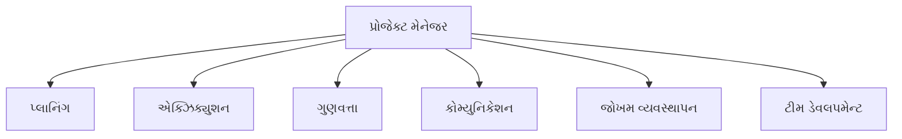

**મેમરી ટ્રીક:** "પ્લાન એક્ઝિક્યુટ ગુણવત્તા કોમ્યુનિકેટ જોખમ ટીમ"

## પ્રશ્ન 3(ક) અથવા [7 ગુણ]

**PERT chart – Gantt chart ની સરખામણી સામ સામે કરો.**

**જવાબ**:

બંને ચાર્ટ પ્રોજેક્ટ મેનેજમેન્ટ ટૂલ્સ છે પરંતુ વિવિધ હેતુઓ સેવે છે અને અલગ લક્ષણો ધરાવે છે.

**વિગતવાર સરખામણી:**

| પાસું | PERT Chart | Gantt Chart |
|---|---|---|
| **હેતુ** | કાર્ય અવલંબન દર્શાવવું | પ્રોજેક્ટ ટાઇમલાઇન બતાવવું |
| **માળખું** | નેટવર્ક ડાયાગ્રામ | બાર ચાર્ટ |
| **ધ્યાન** | ક્રિટિકલ પાથ વિશ્લેષણ | શેડ્યૂલ વિઝ્યુઅલાઇઝેશન |
| **સમય પ્રદર્શન** | અંદાજિત અવધિ | વાસ્તવિક તારીખો |
| **અવલંબન** | સ્પષ્ટ તીરો | ગર્ભિત જોડાણો |
| **શ્રેષ્ઠ** | જટિલ પ્રોજેક્ટ્સ | સરળ શેડ્યૂલિંગ |

**વિઝ્યુઅલ રિપ્રેઝન્ટેશન:**

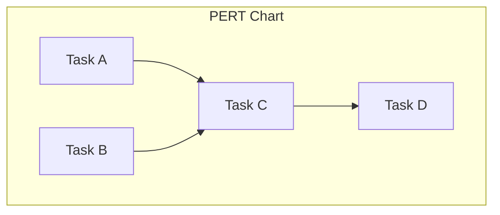

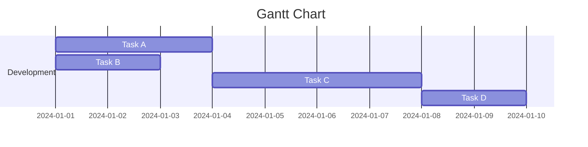

**ક્યારે ઉપયોગ કરવો:**

| સ્થિતિ | PERT | Gantt |
|---|---|---|
| **પ્રોજેક્ટ પ્રકાર** | સંશોધન અને વિકાસ | બાંધકામ, સૉફ્ટવેર |
| **અનિશ્ચિતતા** | ઉચ્ચ અનિશ્ચિતતા | સ્પષ્ટ કાર્યો |
| **પ્રેક્ષકો** | ટેકનિકલ ટીમ | મેનેજમેન્ટ, ક્લાયન્ટ્સ |

**ફાયદાઓની સરખામણી:**

| PERT ફાયદા | Gantt ફાયદા |
|---|---|
| **ક્રિટિકલ પાથ** ઓળખ | **સમજવામાં સરળ** વિઝ્યુઅલી |
| **લવચીક સમય** અંદાજ | **પ્રગતિ ટ્રેકિંગ** ક્ષમતા |
| **જોખમ વિશ્લેષણ** સપોર્ટ | **સંસાધન ફાળવણી** પ્રદર્શન |

**મેમરી ટ્રીક:** "PERT = પાથ, Gantt = બાર્સ"

## પ્રશ્ન 4(અ) [3 ગુણ]

**પ્રોજેક્ટ મોનિટરિંગ અને નિયંત્રણ પ્રક્રિયાના પગલાં આપો**

**જવાબ**:

પ્રોજેક્ટ મોનિટરિંગ વ્યવસ્થિત નિરીક્ષણ અને સુધારાત્મક ક્રિયાઓ દ્વારા પ્રોજેક્ટ ટ્રેક પર રહે તેની ખાતરી કરે છે.

**મોનિટરિંગ પગલાં:**

| પગલું | પ્રવૃત્તિ | હેતુ |
|---|---|---|
| **પ્રગતિ ટ્રેક કરવી** | વાસ્તવિક વિરુદ્ધ આયોજિત માપવું | વિચલનો ઓળખવા |
| **ગુણવત્તા મૂલ્યાંકન** | ડિલિવરેબલ્સ સમીક્ષા | ધોરણો સુનિશ્ચિત કરવા |
| **પગલાં લેવા** | સુધારાઓ લાગુ કરવા | સંરેખણ જાળવવા |

**મેમરી ટ્રીક:** "ટ્રેક મૂલ્યાંકન પગલાં"

## પ્રશ્ન 4(બ) [4 ગુણ]

**ચર્ચા કરો i)Risk Assessment ii)Risk Mitigation**

**જવાબ**:

**(i) Risk Assessment:**

સંભવિત પ્રોજેક્ટ જોખમો ઓળખવા અને મૂલ્યાંકન કરવાની પ્રક્રિયા.

| મૂલ્યાંકન પ્રકાર | પદ્ધતિ | આઉટપુટ |
|---|---|---|
| **જોખમ ઓળખ** | બ્રેઇનસ્ટોર્મિંગ, ચેકલિસ્ટ્સ | જોખમ સૂચિ |
| **જોખમ વિશ્લેષણ** | સંભાવના × પ્રભાવ | જોખમ પ્રાથમિકતા |
| **જોખમ મૂલ્યાંકન** | જોખમ મેટ્રિક્સ | કાર્ય પ્રાથમિકતાઓ |

**(ii) Risk Mitigation:**

જોખમની અસર અને સંભાવના ઘટાડવાની વ્યૂહરચનાઓ.

| વ્યૂહરચના | વર્ણન | ઉદાહરણ |
|---|---|---|
| **ટાળવું** | જોખમ સ્રોત દૂર કરવો | ટેકનોલોજી બદલવી |
| **ઘટાડવું** | અસર ઓછી કરવી | ટેસ્ટિંગ ઉમેરવું |
| **ટ્રાન્સફર કરવું** | અન્યને જોખમ સ્થાનાંતરિત કરવું | વીમો, આઉટસોર્સિંગ |
| **સ્વીકારવું** | જોખમ સાથે જીવવું | કન્ટિન્જન્સી પ્લાનિંગ |

**મેમરી ટ્રીક:** "ટાળો ઘટાડો ટ્રાન્સફર સ્વીકારો"

## પ્રશ્ન 4(ક) [7 ગુણ]

**પ્રોજેક્ટ જોખમ વ્યાખ્યાયિત કરો અને જોખમ વ્યવસ્થાપન કેવી રીતે સંચાલિત કરશો?**

**જવાબ**:

પ્રોજેક્ટ જોખમ એ અનિશ્ચિત ઘટના છે જે, જો થાય તો, પ્રોજેક્ટ લક્ષ્યો પર સકારાત્મક અથવા નકારાત્મક અસર કરે છે.

**જોખમ લક્ષણો:**

| લક્ષણ | વર્ણન | ઉદાહરણ |
|---|---|---|
| **અનિશ્ચિતતા** | થઈ શકે અથવા ન પણ થાય | ટેકનોલોજી નિષ્ફળતા |
| **પ્રભાવ** | પ્રોજેક્ટ પેરામીટર્સને અસર કરે | ખર્ચ, શેડ્યૂલ, ગુણવત્તા |
| **સંભાવના** | થવાની શક્યતા | 30% વિલંબની તક |

**જોખમ વ્યવસ્થાપન પ્રક્રિયા:**

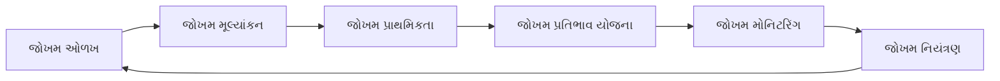

**જોખમ વ્યવસ્થાપન પગલાં:**

| પગલું | પ્રવૃત્તિઓ | ટૂલ્સ | આઉટપુટ |
|---|---|---|---|
| **જોખમ ઓળખ** | બ્રેઇનસ્ટોર્મિંગ, ઇન્ટરવ્યુ | ચેકલિસ્ટ્સ, SWOT | જોખમ રજિસ્ટર |
| **જોખમ મૂલ્યાંકન** | સંભાવના અને પ્રભાવ વિશ્લેષણ | જોખમ મેટ્રિક્સ | જોખમ રેટિંગ્સ |
| **જોખમ પ્રતિભાવ** | ઘટાડવાની વ્યૂહરચના વિકસાવવી | પ્રતિભાવ ટેમ્પ્લેટ્સ | કાર્ય યોજનાઓ |
| **જોખમ મોનિટરિંગ** | જોખમ સૂચકો ટ્રેક કરવા | ડેશબોર્ડ્સ | સ્થિતિ રિપોર્ટ્સ |

**જોખમ શ્રેણીઓ:**

| શ્રેણી | ઉદાહરણો | ઘટાડવાનો અભિગમ |
|---|---|---|
| **ટેકનિકલ** | ટેકનોલોજી અપ્રચલિતતા | પ્રૂફ ઓફ કન્સેપ્ટ |
| **પ્રોજેક્ટ** | સંસાધન અનુપલબ્ધતા | સંસાધન આયોજન |
| **બિઝનેસ** | બજાર ફેરફારો | હિસ્સેદાર સંલગ્નતા |
| **બાહ્ય** | નિયમનકારી ફેરફારો | કાનૂની સલાહ |

**જોખમ પ્રતિભાવ વ્યૂહરચનાઓ:**

- **નકારાત્મક જોખમો (ધમકીઓ)**: ટાળવું, ટ્રાન્સફર કરવું, ઘટાડવું, સ્વીકારવું
- **સકારાત્મક જોખમો (તકો)**: શોષણ કરવું, શેર કરવું, વધારવું, સ્વીકારવું

**મેમરી ટ્રીક:** "ઓળખો મૂલ્યાંકન પ્રતિભાવ મોનિટર" + "ટાળો ટ્રાન્સફર ઘટાડો સ્વીકારો"

## પ્રશ્ન 4(અ) અથવા [3 ગુણ]

**સૉફ્ટવેર ડિઝાઇન પ્રક્રિયાનું વર્ણન કરો અને ડિઝાઇન પદ્ધતિઓ સમજાવો**

**જવાબ**:

સૉફ્ટવેર ડિઝાઇન આવશ્યકતાઓને વ્યવસ્થિત અભિગમ દ્વારા અમલીકરણ માટે બ્લુપ્રિન્ટમાં રૂપાંતરિત કરે છે.

**ડિઝાઇન પ્રક્રિયા:**

| તબક્કો | પ્રવૃત્તિ | આઉટપુટ |
|---|---|---|
| **વિશ્લેષણ** | આવશ્યકતાઓ સમજવી | સમસ્યા વ્યાખ્યા |
| **આર્કિટેક્ચર** | ઉચ્ચ-સ્તરીય માળખું | સિસ્ટમ આર્કિટેક્ચર |
| **વિગતવાર ડિઝાઇન** | ઘટક સ્પષ્ટીકરણ | ડિઝાઇન દસ્તાવેજો |

**મેમરી ટ્રીક:** "વિશ્લેષણ આર્કિટેક્ચર વિગત"

## પ્રશ્ન 4(બ) અથવા [4 ગુણ]

**Cohesion and Coupling ની સરખામણી સામ સામે કરો.**

**જવાબ**:

બંને ખ્યાલો મોડ્યુલ ડિઝાઇન ગુણવત્તા માપે છે પરંતુ વિવિધ પાસાઓ પર ધ્યાન કેન્દ્રિત કરે છે.

**વ્યાપક સરખામણી:**

| પાસું | Cohesion | Coupling |
|---|---|---|
| **વ્યાખ્યા** | મોડ્યુલની અંદર સંબંધની ડિગ્રી | મોડ્યુલો વચ્ચે પરસ્પર નિર્ભરતાની ડિગ્રી |
| **લક્ષ્ય** | ઉચ્ચ cohesion ઇચ્છનીય | નીચું coupling ઇચ્છનીય |
| **ધ્યાન** | આંતરિક મોડ્યુલ માળખું | આંતર-મોડ્યુલ સંબંધો |
| **ગુણવત્તા સૂચક** | મજબૂત = બહેતર | નબળું = બહેતર |

**પ્રકારોની સરખામણી:**

| Cohesion પ્રકારો (શ્રેષ્ઠથી ખરાબ) | Coupling પ્રકારો (શ્રેષ્ઠથી ખરાબ) |
|---|---|
| **Functional** - એક હેતુ | **Data** - સરળ ડેટા શેરિંગ |
| **Sequential** - આઉટપુટ→ઇનપુટ | **Stamp** - ડેટા સ્ટ્રક્ચર શેરિંગ |
| **Communicational** - સમાન ડેટા | **Control** - નિયંત્રણ માહિતી |
| **Procedural** - ક્રમિક અમલીકરણ | **External** - બાહ્ય નિર્ભરતા |
| **Temporal** - સમાન સમય | **Common** - વૈશ્વિક ડેટા |
| **Logical** - સમાન કાર્યો | **Content** - આંતરિક ડેટા પ્રવેશ |
| **Coincidental** - કોઈ સંબંધ નથી | |

**ડિઝાઇન પર પ્રભાવ:**

| પરિબળ | ઉચ્ચ Cohesion | નીચું Coupling |
|---|---|---|
| **જાળવણીક્ષમતા** | સુધારવામાં સરળ | સ્વતંત્ર ફેરફારો |
| **પુનઃઉપયોગ** | સ્વ-સમાયેલ મોડ્યુલ્સ | લવચીક એકીકરણ |
| **ટેસ્ટિંગ** | કેન્દ્રિત ટેસ્ટ કેસ | અલગ ટેસ્ટિંગ |

**મેમરી ટ્રીક:** "Cohesion = અંદર મજબૂત, Coupling = વચ્ચે નબળું"

## પ્રશ્ન 4(ક) અથવા [7 ગુણ]

**સ્તરો સાથે ડેટા-ફ્લો ડાયાગ્રામ સ્કેચ કરો અને સમજાવો**

**જવાબ**:

ડેટા ફ્લો ડાયાગ્રામ (DFD) ગ્રાફિકલ નોટેશન વાપરીને સિસ્ટમ દ્વારા ડેટા કેવી રીતે ચાલે છે તે બતાવે છે અને વિગતના બહુવિધ સ્તરો ધરાવે છે.

**DFD સિમ્બોલ્સ:**

| સિમ્બોલ | રજૂઆત | વર્ણન |
|---|---|---|
| **વર્તુળ/બબલ** | પ્રોસેસ | ઇનપુટને આઉટપુટમાં રૂપાંતરિત કરે છે |
| **લંબચોરસ** | બાહ્ય એન્ટિટી | સ્રોત અથવા ગંતવ્ય |
| **ખુલ્લો લંબચોરસ** | ડેટા સ્ટોર | ડેટાનો ભંડાર |
| **તીર** | ડેટા ફ્લો | ડેટાની હિલચાલ |

**DFD સ્તરો:**

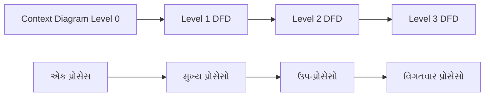

**સ્તર વર્ણનો:**

| સ્તર | અવકાશ | હેતુ | વિગત |
|---|---|---|---|
| **Level 0 (Context)** | સંપૂર્ણ સિસ્ટમ | સિસ્ટમ સીમા | એક પ્રોસેસ |
| **Level 1** | મુખ્ય કાર્યો | ઉચ્ચ-સ્તરીય પ્રોસેસો | 5-7 પ્રોસેસો |
| **Level 2** | ઉપ-કાર્યો | પ્રોસેસ વિભાજન | વિગતવાર દૃશ્ય |
| **Level 3+** | બારીક વિગતો | અમલીકરણ સ્તર | ખૂબ જ વિશિષ્ટ |

**ઉદાહરણ - વિદ્યાર્થી માહિતી સિસ્ટમ:**

**Level 0 (Context Diagram):**

```
[વિદ્યાર્થી] → વિદ્યાર્થી માહિતી → [વિદ્યાર્થી સિસ્ટમ] → રિપોર્ટ્સ → [એડમિન]
```

**Level 1 DFD:**

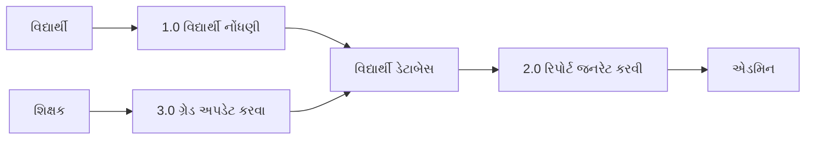

**બેલેન્સિંગ નિયમો:**

- **ડેટા સંરક્ષણ**: દરેક સ્તરે ઇનપુટ = આઉટપુટ
- **પ્રોસેસ નંબરિંગ**: સ્તરીય નંબરિંગ સિસ્ટમ
- **બાહ્ય એન્ટિટીઓ**: બધા સ્તરો પર સમાન

**સ્તરીય DFDs ના ફાયદા:**

| ફાયદો | વર્ણન | લાભ |
|---|---|---|
| **અમૂર્તતા** | જટિલતા છુપાવવી | સરળ સમજ |
| **વિઘટન** | પ્રોસેસો તોડવા | મેનેજેબલ ભાગો |
| **ચકાસણી** | પૂર્ણતા તપાસવી | ગુણવત્તા ખાતરી |

**મેમરી ટ્રીક:** "Context મુખ્ય ઉપ બારીક" + "પ્રોસેસ એન્ટિટી સ્ટોર ફ્લો"

## પ્રશ્ન 5(અ) [3 ગુણ]

**સારા UI ની લાક્ષણિકતાઓ આપો.**

**જવાબ**:

સારો યુઝર ઇન્ટરફેસ ડિઝાઇન સૉફ્ટવેર સિસ્ટમ સાથે અસરકારક યુઝર ક્રિયાપ્રતિક્રિયા સુનિશ્ચિત કરે છે.

**UI લાક્ષણિકતાઓ:**

| લાક્ષણિકતા | વર્ણન | ફાયદો |
|---|---|---|
| **સરળ** | સમજવામાં સરળ | શીખવાની વળાંક ઘટાડે છે |
| **સુસંગત** | એકસમાન વર્તન | અનુમાનિત ક્રિયાપ્રતિક્રિયા |
| **પ્રતિસાદશીલ** | ઝડપી ફીડબેક | યુઝર સંતુષ્ટતા |

**મેમરી ટ્રીક:** "સરળ સુસંગત પ્રતિસાદશીલ"

## પ્રશ્ન 5(બ) [4 ગુણ]

**સંક્ષિપ્તમાં Unit testing સમજાવો**

**જવાબ**:

યુનિટ ટેસ્ટિંગ સાચી કાર્યક્ષમતા સુનિશ્ચિત કરવા માટે વ્યક્તિગત સૉફ્ટવેર ઘટકોને અલગતામાં ચકાસે છે.

**યુનિટ ટેસ્ટિંગ ઝાંખી:**

| પાસું | વર્ણન | હેતુ |
|---|---|---|
| **અવકાશ** | વ્યક્તિગત મોડ્યુલ્સ/ફંક્શન્સ | ઘટક ચકાસણી |
| **અલગતા** | અલગતામાં ટેસ્ટ | સ્વતંત્ર ચકાસણી |
| **સ્વચાલન** | સ્વચાલિત ટેસ્ટ અમલીકરણ | કાર્યક્ષમ ટેસ્ટિંગ |
| **વહેલી શોધ** | વહેલો બગ શોધ | ખર્ચ-અસરકારક ડિબગિંગ |

**ટેસ્ટિંગ પ્રક્રિયા:**

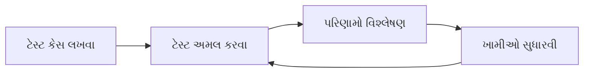

**ફાયદા:**

- **વહેલી બગ શોધ** સુધારવાનો ખર્ચ ઘટાડે છે
- **કોડ ગુણવત્તા** ટેસ્ટિંગ શિસ્ત દ્વારા સુધારણા
- **રિગ્રેશન ટેસ્ટિંગ** ભાવિ ભંગાણ અટકાવે છે

**મેમરી ટ્રીક:** "અવકાશ અલગતા સ્વચાલન વહેલી"

## પ્રશ્ન 5(ક) [7 ગુણ]

**ટ્રેન રિઝર્વેશન સિસ્ટમની activity diagrams બનાવો, દરેક પગલું સમજાવો.**

**જવાબ**:

Activity Diagram યુઝર વિનંતીથી ટિકિટ પુષ્ટિ સુધી ટ્રેન રિઝર્વેશન સિસ્ટમનો વર્કફ્લો બતાવે છે.

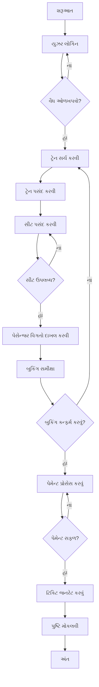

**પગલા-દર-પગલાની સમજૂતી:**

| પગલું | પ્રવૃત્તિ | વર્ણન | નિર્ણય બિંદુઓ |
|---|---|---|---|
| **1** | યુઝર લોગિન | યુઝર ઓળખપત્રો ચકાસવા | વૈધ/અવૈધ |
| **2** | ટ્રેન સર્ચ કરવી | રૂટ/તારીખ માટે ઉપલબ્ધ ટ્રેન શોધવી | પરિણામો મળ્યા |
| **3** | ટ્રેન પસંદ કરવી | વિશિષ્ટ ટ્રેન પસંદ કરવી | ટ્રેન પસંદગી |
| **4** | સીટ પસંદ કરવી | સીટ પસંદગીઓ પસંદ કરવી | ઉપલબ્ધતા તપાસ |
| **5** | વિગતો દાખલ કરવી | પેસેન્જર માહિતી પ્રદાન કરવી | ડેટા ચકાસણી |
| **6** | બુકિંગ સમીક્ષા | બુકિંગ વિગતો પુષ્ટિ કરવી | યુઝર પુષ્ટિ |
| **7** | પેમેન્ટ પ્રોસેસ કરવું | પેમેન્ટ ટ્રાન્ઝેક્શન હેન્ડલ કરવું | સફળ/નિષ્ફળ |
| **8** | ટિકિટ જનરેટ કરવું** | ટિકિટ દસ્તાવેજ બનાવવું | ટિકિટ બનાવટ |
| **9** | પુષ્ટિ મોકલવી | યુઝરને પુષ્ટિ પહોંચાડવી | પ્રક્રિયા પૂર્ણ |

**પ્રવૃત્તિ પ્રકારો:**

| પ્રકાર | સિમ્બોલ | હેતુ | ઉદાહરણો |
|---|---|---|---|
| **એક્શન** | ગોળાકાર લંબચોરસ | પ્રવૃત્તિ કરવી | ટ્રેન સર્ચ કરવી |
| **નિર્ણય** | હીરો | પાથ પસંદ કરવો | વૈધ ઓળખપત્રો? |
| **શરૂઆત/અંત** | વર્તુળ | શરૂઆત/સમાપ્તિ | શરૂઆત, અંત |
| **ફ્લો** | તીર | ક્રમ બતાવવો | પ્રોસેસ ફ્લો |

**સમાંતર પ્રવૃત્તિઓ:**

- પેમેન્ટ પ્રોસેસિંગ અને સીટ રિઝર્વેશન એકસાથે થઈ શકે છે
- પુષ્ટિ ઇમેઇલ અને SMS સમાંતરમાં મોકલી શકાય છે

**એક્સેપ્શન હેન્ડલિંગ:**

- **લોગિન નિષ્ફળતા**: લોગિન સ્ક્રીન પર પાછા ફરવું
- **કોઈ સીટ નથી**: વિવિધ સીટ પસંદગીની મંજૂરી
- **પેમેન્ટ નિષ્ફળતા**: પેમેન્ટ વિકલ્પો ફરી પ્રયાસ
- **સિસ્ટમ એરર**: એરર મેસેજ બતાવવો અને ફરી શરૂ કરવું

**મેમરી ટ્રીક:** "લોગિન સર્ચ સિલેક્ટ ચૂઝ એન્ટર રિવ્યુ પે જનરેટ સેન્ડ"

## પ્રશ્ન 5(અ) અથવા [3 ગુણ]

**Verification, Validation ની સરખામણી સામ સામે કરો.**

**જવાબ**:

બંને ગુણવત્તા ખાતરીની પ્રવૃત્તિઓ છે પરંતુ સાચકીના વિવિધ પાસાઓ પર ધ્યાન કેન્દ્રિત કરે છે.

**Verification વિરુદ્ધ Validation:**

| પાસું | Verification | Validation |
|---|---|---|
| **પ્રશ્ન** | "શું આપણે સાચું બનાવી રહ્યા છીએ?" | "શું આપણે સાચી વસ્તુ બનાવી રહ્યા છીએ?" |
| **ધ્યાન** | પ્રક્રિયાની સાચકી | ઉત્પાદનની સાચકી |
| **પદ્ધતિ** | સમીક્ષાઓ, નિરીક્ષણો | ટેસ્ટિંગ, યુઝર ફીડબેક |

**મેમરી ટ્રીક:** "Verification = સાચી પ્રક્રિયા, Validation = સાચું ઉત્પાદન"

## પ્રશ્ન 5(બ) અથવા [4 ગુણ]

**Testing ની વ્યાખ્યા સમજાવો કોઈપણ બે Testing ના પ્રકારનું વર્ણન કરો**

**જવાબ**:

ટેસ્ટિંગ એ ભૂલો શોધવા અને તે આવશ્યકતાઓ પૂરી કરે છે તે ચકાસવા માટે સૉફ્ટવેરનું મૂલ્યાંકન કરવાની પ્રક્રિયા છે.

**ટેસ્ટિંગ વ્યાખ્યા:** ખામીઓ શોધવા અને કાર્યક્ષમતા ચકાસવા માટે સૉફ્ટવેરની વ્યવસ્થિત તપાસ.

**બે ટેસ્ટિંગ પ્રકારો:**

**(1) Black Box Testing:**

| પાસું | વર્ણન | ઉદાહરણ |
|---|---|---|
| **અભિગમ** | આંતરિક માળખું જાણ્યા વિના ટેસ્ટ | ઇનપુટ/આઉટપુટ ટેસ્ટિંગ |
| **ધ્યાન** | કાર્યાત્મક આવશ્યકતાઓ | લોગિન ચકાસણી |
| **તકનીક** | સમકક્ષતા વિભાજન | વૈધ/અવૈધ ઇનપુટ્સ |
| **ટેસ્ટર** | બાહ્ય દૃષ્ટિકોણ | યુઝર સ્વીકૃતિ |

**(2) White Box Testing:**

| પાસું | વર્ણન | ઉદાહરણ |
|---|---|---|
| **અભિગમ** | કોડ માળખાના જ્ઞાન સાથે ટેસ્ટ | પાથ કવરેજ |
| **ધ્યાન** | આંતરિક તર્ક | કોડ શાખાઓ |
| **તકનીક** | સ્ટેટમેન્ટ કવરેજ | બધી લાઇનો અમલ |
| **ટેસ્ટર** | ડેવલપર દૃષ્ટિકોણ | યુનિટ ટેસ્ટિંગ |

**સરખામણી:**

| પરિબળ | Black Box | White Box |
|---|---|---|
| **જ્ઞાન** | કોડ જ્ઞાન નથી | સંપૂર્ણ કોડ જ્ઞાન |
| **કવરેજ** | કાર્યાત્મક કવરેજ | માળખાકીય કવરેજ |
| **સ્તર** | સિસ્ટમ સ્તર | યુનિટ સ્તર |

**મેમરી ટ્રીક:** "Black = બાહ્ય, White = આંતરિક"

## પ્રશ્ન 5(ક) અથવા [7 ગુણ]

**દરેક Coding standards અને માર્ગદર્શિકાઓનું વર્ણન કરો.**

**જવાબ**:

કોડિંગ સ્ટાન્ડર્ડ્સ એ સુસંગત, જાળવી શકાય તેવા અને વાંચી શકાય તેવા કોડ લખવા માટેના નિયમો અને પરંપરાઓનો સમૂહ છે.

**કોડિંગ સ્ટાન્ડર્ડ્સનો હેતુ:**

| ફાયદો | વર્ણન | પ્રભાવ |
|---|---|---|
| **વાંચી શકાય તેવું** | સમજવામાં સરળ કોડ | ઝડપી મેઇન્ટેનન્સ |
| **સુસંગતતા** | એકસમાન કોડિંગ શૈલી | ટીમ સહયોગ |
| **જાળવણીક્ષમતા** | સુધારવામાં સરળ | ઘટેલા ખર્ચ |
| **ગુણવત્તા** | ઓછી ખામીઓ | વિશ્વસનીય સૉફ્ટવેર |

**મુખ્ય કોડિંગ સ્ટાન્ડર્ડ્સ શ્રેણીઓ:**

**(1) નામકરણ પરંપરાઓ:**

| તત્વ | સ્ટાન્ડર્ડ | ઉદાહરણ | હેતુ |
|---|---|---|---|
| **વેરિએબલ્સ** | camelCase | userName, totalAmount | સ્પષ્ટ ઓળખ |
| **કોન્સ્ટન્ટ્સ** | UPPER_CASE | MAX_SIZE, DEFAULT_VALUE | કોન્સ્ટન્ટ્સને અલગ પાડવા |
| **ફંક્શન્સ** | વર્ણનાત્મક ક્રિયાપદ | calculateTax(), validateInput() | ક્રિયા સ્પષ્ટતા |
| **ક્લાસીસ** | PascalCase | CustomerAccount, OrderManager | પ્રકાર ઓળખ |

**(2) કોડ માળખું:**

| પાસું | માર્ગદર્શિકા | ઉદાહરણ | ફાયદો |
|---|---|---|---|
| **ઇન્ડેન્ટેશન** | સુસંગત અંતર | 4 સ્પેસ અથવા 1 ટેબ | વિઝ્યુઅલ હાયરાર્કી |
| **લાઇનની લંબાઈ** | મહત્તમ 80-120 અક્ષરો | લાંબી લાઇનો તોડવી | સ્ક્રીન વાંચન |
| **બ્રેસીસ** | ઓપનિંગ બ્રેસ શૈલી | સમાન લાઇન વિરુદ્ધ નવી લાઇન | સુસંગતતા |
| **કોમેન્ટ્સ** | અર્થપૂર્ણ વર્ણનો | // ટેક્સ રકમ ગણતરી | કોડ દસ્તાવેજીકરણ |

**(3) કોડ ગોઠવણી:**

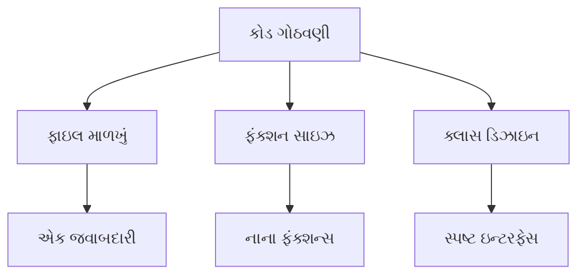

| સિદ્ધાંત | માર્ગદર્શિકા | મર્યાદા | ફાયદો |
|---|---|---|---|
| **ફાઇલ ગોઠવણી** | એક ફાઇલમાં એક ક્લાસ | સંબંધિત ફંક્શન્સ ગ્રુપ કરેલા | સરળ નેવિગેશન |
| **ફંક્શનની લંબાઈ** | ફંક્શન્સ નાના રાખવા | મહત્તમ 20-30 લાઇન | બહેતર ટેસ્ટિંગ |
| **ક્લાસ સાઇઝ** | એક જવાબદારી | કેન્દ્રિત હેતુ | જાળવણીક્ષમતા |
| **મોડ્યુલ કપ્લિંગ** | નિર્ભરતા ઓછી કરવી | લૂઝ કપ્લિંગ | લવચીકતા |

**(4) દસ્તાવેજીકરણ સ્ટાન્ડર્ડ્સ:**

| પ્રકાર | ફોર્મેટ | સામગ્રી | ઉદાહરણ |
|---|---|---|---|
| **હેડર કોમેન્ટ્સ** | ફાઇલ વર્ણન | હેતુ, લેખક, તારીખ | `// ગ્રાહક વ્યવસ્થાપન મોડ્યુલ` |
| **ફંક્શન કોમેન્ટ્સ** | પેરામીટર વર્ણન | ઇનપુટ/આઉટપુટ સ્પેક્સ | `@param userId - યુનીક ઓળખ` |
| **ઇનલાઇન કોમેન્ટ્સ** | જટિલ તર્ક | શા માટે, શું નહીં | `// પર્ફોર્મન્સ માટે બાઇનરી સર્ચ` |
| **API દસ્તાવેજીકરણ** | પબ્લિક ઇન્ટરફેસ | ઉપયોગ ઉદાહરણો | મેથડ સહી |

**(5) એરર હેન્ડલિંગ:**

| પ્રેક્ટિસ | વર્ણન | ઉદાહરણ | હેતુ |
|---|---|---|---|
| **એક્સેપ્શન હેન્ડલિંગ** | try-catch બ્લોક્સ વાપરવા | `try { ... } catch (Exception e)` | ગ્રેસફુલ ફેઇલ્યુર |
| **એરર મેસેજ** | અર્થપૂર્ણ સંદેશા | "અવૈધ ઇમેઇલ ફોર્મેટ" | યુઝર માર્ગદર્શન |
| **લોગિંગ** | એરર વિગતો રેકોર્ડ કરવી | `log.error("ડેટાબેસ કનેક્શન નિષ્ફળ")` | ડિબગિંગ સપોર્ટ |
| **વેલિડેશન** | ઇનપુટ તપાસ | null વેલ્યુઝ તપાસવી | એરર અટકાવવા |

**(6) પર્ફોર્મન્સ માર્ગદર્શિકાઓ:**

| ક્ષેત્ર | સ્ટાન્ડર્ડ | ઉદાહરણ | પ્રભાવ |
|---|---|---|---|
| **મેમરી ઉપયોગ** | મેમરી લીક્સ ટાળવા | રિસોર્સીસ બંધ કરવા | સિસ્ટમ સ્થિરતા |
| **એલ્ગોરિધમ પસંદગી** | કાર્યક્ષમ એલ્ગોરિધમ્સ | યોગ્ય ડેટા સ્ટ્રક્ચર વાપરવા | પ્રતિભાવ સમય |
| **ડેટાબેસ એક્સેસ** | ક્વેરીઝ ઓછી કરવી | કનેક્શન પૂલિંગ વાપરવું | સ્કેલેબિલિટી |
| **કોડ ઓપ્ટિમાઇઝેશન** | અકાળ ઓપ્ટિમાઇઝેશન ટાળવું | ઓપ્ટિમાઇઝ કરતા પહેલા પ્રોફાઇલ | જાળવણીક્ષમતા |

**કોડ રિવ્યુ સ્ટાન્ડર્ડ્સ:**


**રિવ્યુ ચેકલિસ્ટ:**

| શ્રેણી | તપાસ વસ્તુઓ | હેતુ |
|---|---|---|
| **કાર્યક્ષમતા** | આવશ્યકતાઓ પૂરી, એજ કેસ હેન્ડલ કરેલા | શુદ્ધતા |
| **સ્ટાન્ડર્ડ્સ** | નામકરણ, ફોર્મેટિંગ, દસ્તાવેજીકરણ | સુસંગતતા |
| **સુરક્ષા** | ઇનપુટ વેલિડેશન, ઓથેન્ટિકેશન | સુરક્ષા |
| **પર્ફોર્મન્સ** | કાર્યક્ષમ એલ્ગોરિધમ્સ, રિસોર્સ ઉપયોગ | સ્કેલેબિલિટી |

**સ્ટાન્ડર્ડ્સ અનુસરવાના ફાયદા:**

| ફાયદો | વર્ણન | લાંબા ગાળાનો પ્રભાવ |
|---|---|---|
| **ટીમ પ્રોડક્ટિવિટી** | ઝડપી વિકાસ | ડેવલપમેન્ટ સમય ઘટાડ્યો |
| **કોડ ગુણવત્તા** | ઓછા બગ્સ | નીચા મેઇન્ટેનન્સ ખર્ચ |
| **જ્ઞાન ટ્રાન્સફર** | સરળ સમજ | સરળ ટીમ ટ્રાન્ઝિશન |
| **ટૂલ સપોર્ટ** | બહેતર IDE સપોર્ટ | વધારેલ ડેવલપમેન્ટ અનુભવ |

**અમલીકરણ વ્યૂહરચના:**

1. **માર્ગદર્શિકાઓ સ્થાપિત કરવી**: ટીમ-વિશિષ્ટ કોડિંગ સ્ટાન્ડર્ડ્સ દસ્તાવેજ બનાવવો
2. **ટૂલ ઇન્ટિગ્રેશન**: સ્વચાલિત ફોર્મેટિંગ અને લિન્ટિંગ ટૂલ્સ વાપરવા
3. **તાલીમ**: કોડિંગ શ્રેષ્ઠ પ્રેક્ટિસિસ પર વર્કશોપ્સ કરાવવી
4. **અમલીકરણ**: કોડ રિવ્યુ પ્રક્રિયામાં સ્ટાન્ડર્ડ્સ સામેલ કરવા
5. **સતત સુધારણા**: ટીમ ફીડબેક પર આધારિત નિયમિત અપડેટ્સ

**લોકપ્રિય કોડિંગ સ્ટાન્ડર્ડ્સ:**

| ભાષા | સ્ટાન્ડર્ડ | સંસ્થા | ધ્યાન |
|---|---|---|---|
| **Java** | Google Java Style | Google | વ્યાપક માર્ગદર્શિકાઓ |
| **Python** | PEP 8 | Python Software Foundation | Pythonic કોડ |
| **JavaScript** | Airbnb Style | Airbnb | આધુનિક JS પ્રેક્ટિસિસ |
| **C#** | Microsoft Guidelines | Microsoft | .NET ઇકોસિસ્ટમ |

**મેમરી ટ્રીક:** "નામ માળખું ગોઠવણી દસ્તાવેજ હેન્ડલ પર્ફોર્મ રિવ્યુ"
