## Question 1(a) [3 marks]

**Define Software and explain its characteristics.**

**Answer**:

Software is a collection of programs, instructions, and documentation that performs tasks on a computer system.

**Key Characteristics:**

| Characteristic | Description |
|---|---|
| **Intangible** | Cannot be touched physically |
| **Logical** | Created through systematic approach |
| **Manufactured** | Developed, not produced traditionally |
| **Complex** | Has intricate internal structure |

**Mnemonic:** "In Logic, Manufacturing Creates" (Intangible, Logical, Manufactured, Complex)

## Question 1(b) [4 marks]

**Write a note on Software engineering – A layered technology.**

**Answer**:

Software engineering is structured as a layered technology with each layer supporting the next.

**Layered Structure:**

| Layer | Purpose | Description |
|---|---|---|
| **Quality Focus** | Foundation | Emphasis on delivering quality products |
| **Process** | Framework | Defines how software development is done |
| **Methods** | Techniques | Specific ways to perform activities |
| **Tools** | Automation | Software that supports methods |

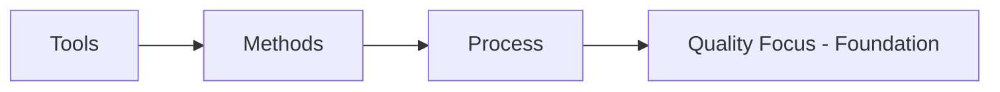

**Mnemonic:** "Tools Make Process Quality" (Tools, Methods, Process, Quality)

## Question 1(c) [7 marks]

**Explain Software Process framework and umbrella activities.**

**Answer**:

Software Process Framework provides structure for software development with core activities and umbrella activities.

**Framework Activities:**

| Activity | Purpose | Key Tasks |
|---|---|---|
| **Communication** | Understand requirements | Stakeholder interaction, requirement gathering |
| **Planning** | Create roadmap | Estimation, scheduling, risk assessment |
| **Modeling** | Create blueprints | Analysis and design models |
| **Construction** | Build software | Coding and testing |
| **Deployment** | Deliver to users | Installation, support, feedback |

**Umbrella Activities:**

- **Software project tracking**: Monitor progress and control quality
- **Risk management**: Identify and mitigate potential problems
- **Quality assurance**: Ensure standards are met
- **Configuration management**: Control changes systematically
- **Work product preparation**: Create deliverable documents

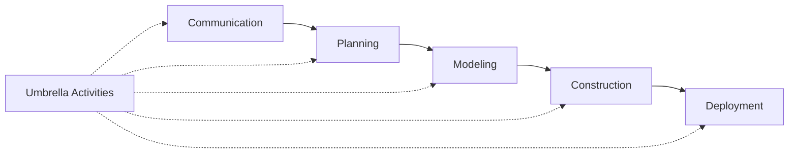

**Mnemonic:** "Can People Model Construction Daily" + "Track Risk Quality Configuration Work"

## Question 1(c OR) [7 marks]

**Define SDLC and explain each phase.**

**Answer**:

SDLC (Software Development Life Cycle) is a systematic process for developing software applications.

**SDLC Phases:**

| Phase | Purpose | Key Activities | Deliverables |
|---|---|---|---|
| **Planning** | Define scope | Feasibility study, resource allocation | Project plan |
| **Analysis** | Gather requirements | Requirement collection, documentation | SRS document |
| **Design** | Create architecture | System design, database design | Design documents |
| **Implementation** | Write code | Programming, unit testing | Source code |
| **Testing** | Verify quality | System testing, bug fixing | Test reports |
| **Deployment** | Release software | Installation, user training | Live system |
| **Maintenance** | Ongoing support | Bug fixes, enhancements | Updated system |

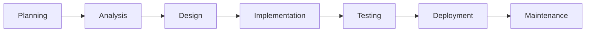

**Mnemonic:** "Please Analyze Design Implementation Testing Deployment Maintenance"

## Question 2(a) [3 marks]

**Describe advantage disadvantage of prototype model.**

**Answer**:

**Prototype Model Analysis:**

| Advantages | Disadvantages |
|---|---|
| **Early feedback** from users | **Time consuming** development process |
| **Reduced risk** of failure | **Cost increase** due to iterations |
| **Better understanding** of requirements | **Scope creep** may occur |

**Mnemonic:** "Early Reduced Better" vs "Time Cost Scope"

## Question 2(b) [4 marks]

**Explain Prototyping Model and justify when to use with example.**

**Answer**:

Prototyping Model creates working model of software early in development process.

**When to Use:**

| Situation | Example | Justification |
|---|---|---|
| **Unclear requirements** | Online shopping cart | User interface needs refinement |
| **New technology** | Mobile banking app | Feasibility testing required |
| **User interaction critical** | Gaming application | User experience validation needed |

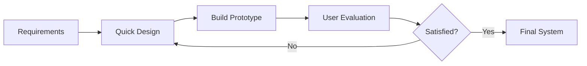

**Mnemonic:** "Requirements Quick Build User Satisfied Final"

## Question 2(c) [7 marks]

**Sketch and discuss (I) Waterfall model & (II) Incremental Model.**

**Answer**:

**(I) Waterfall Model:**

Linear sequential approach where each phase must complete before next begins.

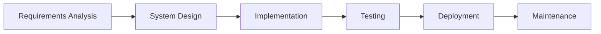

| Characteristics | Description |
|---|---|
| **Sequential** | One phase at a time |
| **Documentation driven** | Heavy documentation |
| **Suitable for** | Well-defined requirements |

**(II) Incremental Model:**

Development in small increments with each increment adding functionality.

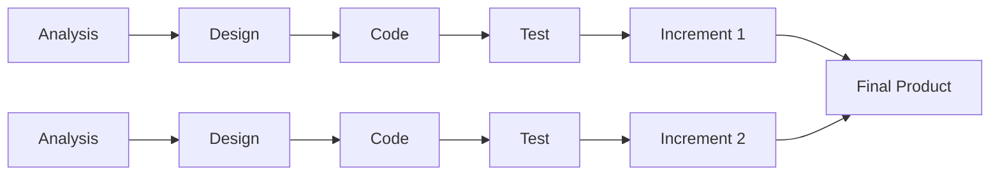

| Feature | Waterfall | Incremental |
|---|---|---|
| **Flexibility** | Low | High |
| **Risk** | High | Low |
| **Delivery** | End of project | Multiple deliveries |

**Mnemonic:** "Water Falls Once, Increments Build Multiple"

## Question 2(a OR) [3 marks]

**Describe advantage and disadvantage of Incremental Model.**

**Answer**:

**Incremental Model Analysis:**

| Advantages | Disadvantages |
|---|---|
| **Early delivery** of working software | **Total cost** may be higher |
| **Easier testing** of small increments | **System architecture** issues |
| **Reduced risk** through early feedback | **Management complexity** increases |

**Mnemonic:** "Early Easier Reduced" vs "Total System Management"

## Question 2(b OR) [4 marks]

**Write concept of Rapid Application Development (RAD) and explain it.**

**Answer**:

RAD emphasizes rapid prototyping and quick feedback over planning and testing.

**RAD Components:**

| Phase | Duration | Activities | Output |
|---|---|---|---|
| **Business Modeling** | Short | Define information flow | Business requirements |
| **Data Modeling** | Short | Define data objects | Data models |
| **Process Modeling** | Short | Define processing functions | Process descriptions |
| **Application Generation** | Short | Use tools to create | Working application |
| **Testing & Turnover** | Short | Test and deliver | Final system |

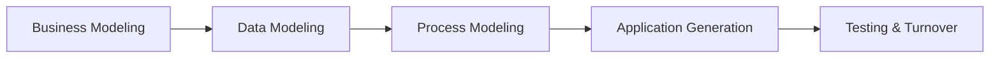

**Mnemonic:** "Business Data Process Application Testing"

## Question 2(c OR) [7 marks]

**Design and describe Spiral Model and give advantage and disadvantage.**

**Answer**:

Spiral Model combines iterative development with systematic risk analysis.

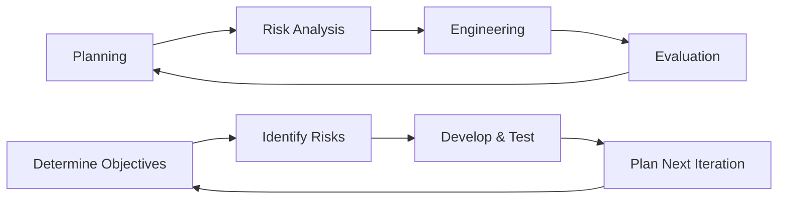

**Spiral Quadrants:**

| Quadrant | Activity | Purpose |
|---|---|---|
| **Planning** | Objective setting | Define requirements and constraints |
| **Risk Analysis** | Risk assessment | Identify and resolve risks |
| **Engineering** | Development | Build and test the product |
| **Evaluation** | Customer assessment | Evaluate results and plan next iteration |

**Advantages vs Disadvantages:**

| Advantages | Disadvantages |
|---|---|
| **High risk projects** handled well | **Complex management** required |
| **Good for large** applications | **Expensive** for small projects |
| **Customer involved** throughout | **Risk analysis expertise** needed |

**Mnemonic:** "Plan Risk Engineer Evaluate" + "High Good Customer" vs "Complex Expensive Risk"

## Question 3(a) [3 marks]

**Illustrate importance of SRS**

**Answer**:

SRS (Software Requirements Specification) is crucial foundation document for software development.

**Importance Table:**

| Aspect | Importance | Benefit |
|---|---|---|
| **Communication** | Stakeholder understanding | Clear expectations |
| **Contract** | Legal agreement | Dispute resolution |
| **Testing basis** | Validation criteria | Quality assurance |

**Mnemonic:** "Communication Contract Testing"

## Question 3(b) [4 marks]

**Specify characteristics of good & bad SRS**

**Answer**:

**SRS Quality Characteristics:**

| Good SRS | Bad SRS |
|---|---|
| **Complete** - All requirements covered | **Incomplete** - Missing requirements |
| **Consistent** - No contradictions | **Inconsistent** - Conflicting statements |
| **Unambiguous** - Clear meaning | **Ambiguous** - Multiple interpretations |
| **Verifiable** - Can be tested | **Unverifiable** - Cannot be validated |

**Additional Good Characteristics:**

- **Modifiable**: Easy to change and maintain
- **Traceable**: Links to source and design

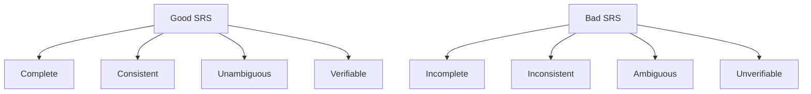

**Mnemonic:** "Complete Consistent Unambiguous Verifiable" vs "Incomplete Inconsistent Ambiguous Unverifiable"

## Question 3(c) [7 marks]

**Classify Types of Requirements in SRS**

**Answer**:

Software requirements are classified into two main categories.

**(i) Functional Requirements:**

Define what the system should do - specific behaviors and functions.

| Type | Description | Example |
|---|---|---|
| **Business Rules** | Core business logic | "Calculate tax based on income bracket" |
| **User Actions** | System responses | "Login with username/password" |
| **Data Processing** | Information handling | "Generate monthly sales report" |
| **External Interfaces** | System interactions | "Connect to payment gateway" |

**(ii) Non-functional Requirements:**

Define how the system should perform - quality attributes and constraints.

| Category | Requirement | Example | Measurement |
|---|---|---|---|
| **Performance** | Response time | "Page load < 3 seconds" | Time metrics |
| **Security** | Data protection | "Encrypt user passwords" | Security standards |
| **Reliability** | System uptime | "99.9% availability" | Failure rates |
| **Usability** | User experience | "Max 3 clicks to checkout" | User metrics |
| **Scalability** | Growth capacity | "Support 10,000 users" | Load capacity |

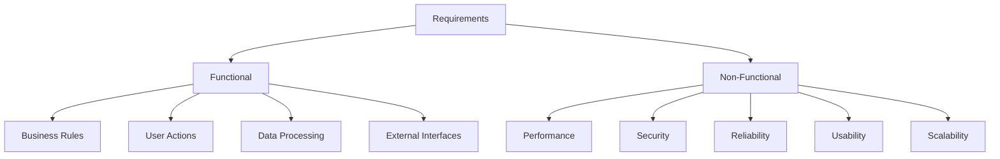

**Comparison Table:**

| Aspect | Functional | Non-Functional |
|---|---|---|
| **Focus** | What system does | How system performs |
| **Testing** | Black-box testing | Performance testing |
| **Documentation** | Use cases | Quality metrics |

**Mnemonic:** "Functional = What, Non-Functional = How"

## Question 3(a OR) [3 marks]

**Describe skill to manage software projects**

**Answer**:

Project management requires diverse skill set for successful software delivery.

**Essential Skills:**

| Skill Category | Description | Application |
|---|---|---|
| **Technical** | Understanding technology | Architecture decisions |
| **Leadership** | Team motivation | Conflict resolution |
| **Communication** | Stakeholder interaction | Status reporting |

**Mnemonic:** "Technical Leadership Communication"

## Question 3(b OR) [4 marks]

**Briefly give the Responsibility of software project Manager.**

**Answer**:

Software Project Manager oversees entire project lifecycle and ensures successful delivery.

**Key Responsibilities:**

| Area | Responsibility | Activities |
|---|---|---|
| **Planning** | Project roadmap | Schedule, budget, resource allocation |
| **Execution** | Team coordination | Task assignment, progress monitoring |
| **Quality** | Standard compliance | Code reviews, testing oversight |
| **Communication** | Stakeholder updates | Status reports, risk communication |

**Additional Duties:**

- **Risk Management**: Identify and mitigate project risks
- **Team Development**: Mentor team members and resolve conflicts

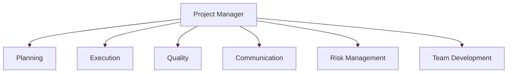

**Mnemonic:** "Plan Execute Quality Communicate Risk Team"

## Question 3(c OR) [7 marks]

**Compare PERT chart – Gantt chart side by side.**

**Answer**:

Both charts are project management tools but serve different purposes and have distinct characteristics.

**Detailed Comparison:**

| Aspect | PERT Chart | Gantt Chart |
|---|---|---|
| **Purpose** | Show task dependencies | Show project timeline |
| **Structure** | Network diagram | Bar chart |
| **Focus** | Critical path analysis | Schedule visualization |
| **Time Display** | Estimated durations | Actual dates |
| **Dependencies** | Explicit arrows | Implicit connections |
| **Best For** | Complex projects | Simple scheduling |

**Visual Representation:**

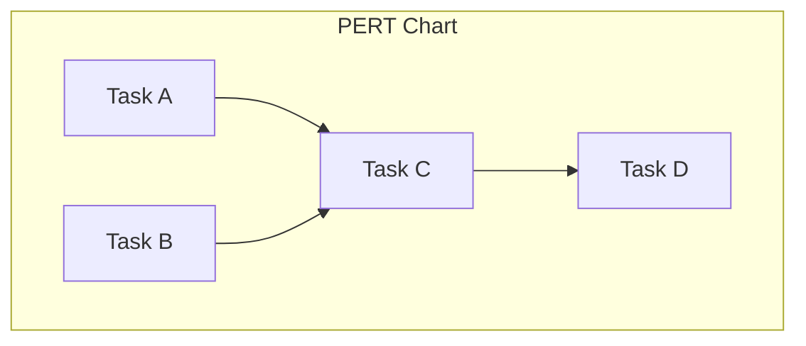

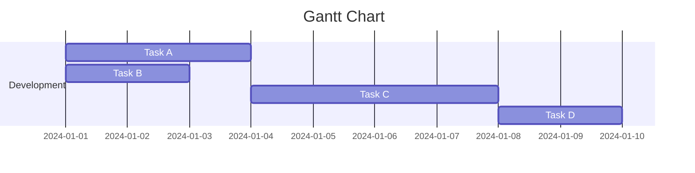

**When to Use:**

| Scenario | PERT | Gantt |
|---|---|---|
| **Project Type** | Research & Development | Construction, Software |
| **Uncertainty** | High uncertainty | Well-defined tasks |
| **Audience** | Technical team | Management, Clients |

**Advantages Comparison:**

| PERT Advantages | Gantt Advantages |
|---|---|
| **Critical path** identification | **Easy to understand** visually |
| **Flexible timing** estimates | **Progress tracking** capability |
| **Risk analysis** support | **Resource allocation** display |

**Mnemonic:** "PERT = Path, Gantt = Bars"

## Question 4(a) [3 marks]

**Give steps of Project Monitoring and control process**

**Answer**:

Project monitoring ensures project stays on track through systematic observation and corrective actions.

**Monitoring Steps:**

| Step | Activity | Purpose |
|---|---|---|
| **Track Progress** | Measure actual vs planned | Identify deviations |
| **Assess Quality** | Review deliverables | Ensure standards |
| **Take Action** | Implement corrections | Maintain alignment |

**Mnemonic:** "Track Assess Take"

## Question 4(b) [4 marks]

**Discuss i)Risk Assessment ii)Risk Mitigation**

**Answer**:

**(i) Risk Assessment:**

Process of identifying and evaluating potential project risks.

| Assessment Type | Method | Output |
|---|---|---|
| **Risk Identification** | Brainstorming, checklists | Risk list |
| **Risk Analysis** | Probability × Impact | Risk priority |
| **Risk Evaluation** | Risk matrix | Action priorities |

**(ii) Risk Mitigation:**

Strategies to reduce risk impact and probability.

| Strategy | Description | Example |
|---|---|---|
| **Avoidance** | Eliminate risk source | Change technology |
| **Reduction** | Minimize impact | Add testing |
| **Transfer** | Shift risk to others | Insurance, outsourcing |
| **Acceptance** | Live with risk | Contingency planning |

**Mnemonic:** "Avoid Reduce Transfer Accept"

## Question 4(c) [7 marks]

**Define project risk and how Manage Risk Management it.**

**Answer**:

Project Risk is an uncertain event that, if occurs, has positive or negative effect on project objectives.

**Risk Characteristics:**

| Characteristic | Description | Example |
|---|---|---|
| **Uncertainty** | May or may not occur | Technology failure |
| **Impact** | Affects project parameters | Cost, schedule, quality |
| **Probability** | Likelihood of occurrence | 30% chance of delay |

**Risk Management Process:**

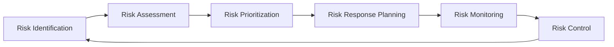

**Risk Management Steps:**

| Step | Activities | Tools | Output |
|---|---|---|---|
| **Risk Identification** | Brainstorming, interviews | Checklists, SWOT | Risk register |
| **Risk Assessment** | Probability and impact analysis | Risk matrix | Risk ratings |
| **Risk Response** | Develop mitigation strategies | Response templates | Action plans |
| **Risk Monitoring** | Track risk indicators | Dashboards | Status reports |

**Risk Categories:**

| Category | Examples | Mitigation Approach |
|---|---|---|
| **Technical** | Technology obsolescence | Proof of concept |
| **Project** | Resource unavailability | Resource planning |
| **Business** | Market changes | Stakeholder engagement |
| **External** | Regulatory changes | Legal consultation |

**Risk Response Strategies:**

- **Negative Risks (Threats)**: Avoid, Transfer, Mitigate, Accept
- **Positive Risks (Opportunities)**: Exploit, Share, Enhance, Accept

**Mnemonic:** "Identify Assess Respond Monitor" + "Avoid Transfer Mitigate Accept"

## Question 4(a OR) [3 marks]

**Describe Software design process and explain Design methodologies.**

**Answer**:

Software design transforms requirements into blueprint for implementation through systematic approach.

**Design Process:**

| Phase | Activity | Output |
|---|---|---|
| **Analysis** | Understand requirements | Problem definition |
| **Architecture** | High-level structure | System architecture |
| **Detailed Design** | Component specification | Design documents |

**Mnemonic:** "Analysis Architecture Detail"

## Question 4(b OR) [4 marks]

**Compare Cohesion and Coupling side by side.**

**Answer**:

Both concepts measure module design quality but focus on different aspects.

**Comprehensive Comparison:**

| Aspect | Cohesion | Coupling |
|---|---|---|
| **Definition** | Degree of relatedness within module | Degree of interdependence between modules |
| **Goal** | High cohesion desired | Low coupling desired |
| **Focus** | Internal module structure | Inter-module relationships |
| **Quality Indicator** | Stronger = Better | Weaker = Better |

**Types Comparison:**

| Cohesion Types (Best to Worst) | Coupling Types (Best to Worst) |
|---|---|
| **Functional** - Single purpose | **Data** - Simple data sharing |
| **Sequential** - Output→Input | **Stamp** - Data structure sharing |
| **Communicational** - Same data | **Control** - Control information |
| **Procedural** - Sequential execution | **External** - External dependencies |
| **Temporal** - Same time | **Common** - Global data |
| **Logical** - Similar functions | **Content** - Internal data access |
| **Coincidental** - No relation | |

**Impact on Design:**

| Factor | High Cohesion | Low Coupling |
|---|---|---|
| **Maintainability** | Easy to modify | Independent changes |
| **Reusability** | Self-contained modules | Flexible integration |
| **Testing** | Focused test cases | Isolated testing |

**Mnemonic:** "Cohesion = Inside Strong, Coupling = Between Weak"

## Question 4(c OR) [7 marks]

**Sketch Data Flow Diagram with levels and explain.**

**Answer**:

Data Flow Diagram (DFD) shows how data moves through system using graphical notation with multiple levels of detail.

**DFD Symbols:**

| Symbol | Represents | Description |
|---|---|---|
| **Circle/Bubble** | Process | Transforms input to output |
| **Rectangle** | External Entity | Source or destination |
| **Open Rectangle** | Data Store | Repository of data |
| **Arrow** | Data Flow | Movement of data |

**DFD Levels:**

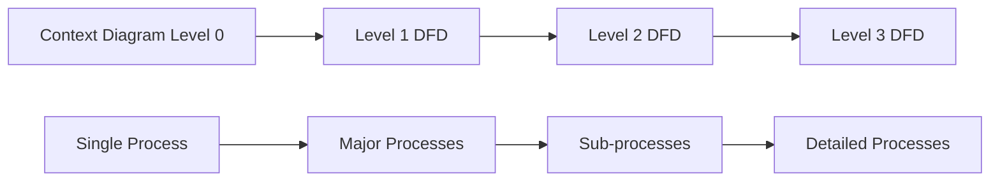

**Level Descriptions:**

| Level | Scope | Purpose | Detail |
|---|---|---|---|
| **Level 0 (Context)** | Entire system | System boundary | Single process |
| **Level 1** | Major functions | High-level processes | 5-7 processes |
| **Level 2** | Sub-functions | Process breakdown | Detailed view |
| **Level 3+** | Fine details | Implementation level | Very specific |

**Example - Student Information System:**

**Level 0 (Context Diagram):**

```
[Student] → Student Info → [Student System] → Reports → [Admin]
```

**Level 1 DFD:**

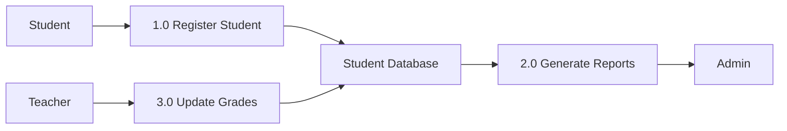

**Balancing Rules:**

- **Data Conservation**: Input = Output at each level
- **Process Numbering**: Hierarchical numbering system
- **External Entities**: Same at all levels

**Benefits of Leveled DFDs:**

| Benefit | Description | Advantage |
|---|---|---|
| **Abstraction** | Hide complexity | Easy understanding |
| **Decomposition** | Break down processes | Manageable chunks |
| **Verification** | Check completeness | Quality assurance |

**Mnemonic:** "Context Major Sub Fine" + "Process Entity Store Flow"

## Question 5(a) [3 marks]

**Give Characteristics of good UI.**

**Answer**:

Good User Interface design ensures effective user interaction with software system.

**UI Characteristics:**

| Characteristic | Description | Benefit |
|---|---|---|
| **Simple** | Easy to understand | Reduced learning curve |
| **Consistent** | Uniform behavior | Predictable interaction |
| **Responsive** | Quick feedback | User satisfaction |

**Mnemonic:** "Simple Consistent Responsive"

## Question 5(b) [4 marks]

**Briefly explain Unit testing**

**Answer**:

Unit Testing verifies individual software components in isolation to ensure correct functionality.

**Unit Testing Overview:**

| Aspect | Description | Purpose |
|---|---|---|
| **Scope** | Individual modules/functions | Component verification |
| **Isolation** | Test in isolation | Independent validation |
| **Automation** | Automated test execution | Efficient testing |
| **Early Detection** | Find bugs early | Cost-effective debugging |

**Testing Process:**

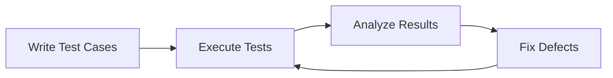

**Benefits:**

- **Early bug detection** reduces fixing costs
- **Code quality** improvement through testing discipline
- **Regression testing** prevents future breaks

**Mnemonic:** "Scope Isolation Automation Early"

## Question 5(c) [7 marks]

**Draw activity diagrams of the train reservation system, explain each step.**

**Answer**:

Activity Diagram shows workflow of train reservation system from user request to ticket confirmation.

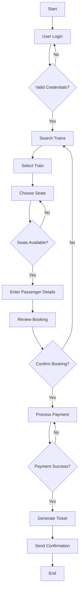

**Step-by-Step Explanation:**

| Step | Activity | Description | Decision Points |
|---|---|---|---|
| **1** | User Login | Authenticate user credentials | Valid/Invalid |
| **2** | Search Trains | Find available trains for route/date | Results found |
| **3** | Select Train | Choose specific train | Train selection |
| **4** | Choose Seats | Select seat preferences | Availability check |
| **5** | Enter Details | Provide passenger information | Data validation |
| **6** | Review Booking | Confirm booking details | User confirmation |
| **7** | Process Payment | Handle payment transaction | Success/Failure |
| **8** | Generate Ticket | Create ticket document | Ticket creation |
| **9** | Send Confirmation | Deliver confirmation to user | Process complete |

**Activity Types:**

| Type | Symbol | Purpose | Examples |
|---|---|---|---|
| **Action** | Rounded Rectangle | Perform activity | Search Trains |
| **Decision** | Diamond | Choose path | Valid Credentials? |
| **Start/End** | Circle | Begin/Terminate | Start, End |
| **Flow** | Arrow | Show sequence | Process flow |

**Parallel Activities:**

- Payment processing and seat reservation can occur simultaneously
- Confirmation email and SMS can be sent in parallel

**Exception Handling:**

- **Login Failure**: Return to login screen
- **No Seats**: Allow different seat selection
- **Payment Failure**: Retry payment options
- **System Error**: Show error message and restart

**Mnemonic:** "Login Search Select Choose Enter Review Pay Generate Send"

## Question 5(a OR) [3 marks]

**Compare Verification, Validation side by side.**

**Answer**:

Both are quality assurance activities but focus on different aspects of correctness.

**Verification vs Validation:**

| Aspect | Verification | Validation |
|---|---|---|
| **Question** | "Are we building right?" | "Are we building right thing?" |
| **Focus** | Process correctness | Product correctness |
| **Method** | Reviews, inspections | Testing, user feedback |

**Mnemonic:** "Verification = Right Process, Validation = Right Product"

## Question 5(b OR) [4 marks]

**Define Testing describe any two testing type.**

**Answer**:

Testing is process of evaluating software to detect errors and ensure it meets requirements.

**Testing Definition:** Systematic examination of software to find defects and verify functionality.

**Two Testing Types:**

**(1) Black Box Testing:**

| Aspect | Description | Example |
|---|---|---|
| **Approach** | Test without knowing internal structure | Input/Output testing |
| **Focus** | Functional requirements | Login validation |
| **Technique** | Equivalence partitioning | Valid/Invalid inputs |
| **Tester** | External perspective | User acceptance |

**(2) White Box Testing:**

| Aspect | Description | Example |
|---|---|---|
| **Approach** | Test with knowledge of code structure | Path coverage |
| **Focus** | Internal logic | Code branches |
| **Technique** | Statement coverage | All lines executed |
| **Tester** | Developer perspective | Unit testing |

**Comparison:**

| Factor | Black Box | White Box |
|---|---|---|
| **Knowledge** | No code knowledge | Full code knowledge |
| **Coverage** | Functional coverage | Structural coverage |
| **Level** | System level | Unit level |

**Mnemonic:** "Black = External, White = Internal"

## Question 5(c OR) [7 marks]

**Describe each Coding standards and guidelines.**

**Answer**:

Coding Standards are set of rules and conventions for writing consistent, maintainable, and readable code.

**Purpose of Coding Standards:**

| Benefit | Description | Impact |
|---|---|---|
| **Readability** | Easy to understand code | Faster maintenance |
| **Consistency** | Uniform coding style | Team collaboration |
| **Maintainability** | Easy to modify | Reduced costs |
| **Quality** | Fewer defects | Reliable software |

**Major Coding Standards Categories:**

**(1) Naming Conventions:**

| Element | Standard | Example | Purpose |
|---|---|---|---|
| **Variables** | camelCase | userName, totalAmount | Clear identification |
| **Constants** | UPPER_CASE | MAX_SIZE, DEFAULT_VALUE | Distinguish constants |
| **Functions** | descriptive verbs | calculateTax(), validateInput() | Action clarity |
| **Classes** | PascalCase | CustomerAccount, OrderManager | Type identification |

**(2) Code Structure:**

| Aspect | Guideline | Example | Benefit |
|---|---|---|---|
| **Indentation** | Consistent spacing | 4 spaces or 1 tab | Visual hierarchy |
| **Line Length** | Maximum 80-120 chars | Break long lines | Screen readability |
| **Braces** | Opening brace style | Same line vs new line | Consistency |
| **Comments** | Meaningful descriptions | // Calculate tax amount | Code documentation |

**(3) Code Organization:**

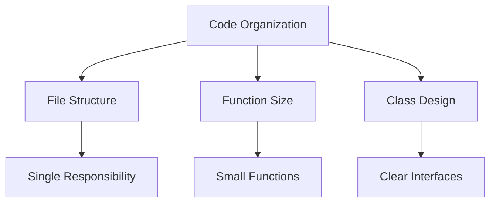

| Principle | Guideline | Limit | Benefit |
|---|---|---|---|
| **File Organization** | One class per file | Related functions grouped | Easy navigation |
| **Function Length** | Keep functions small | 20-30 lines max | Better testing |
| **Class Size** | Single responsibility | Focused purpose | Maintainability |
| **Module Coupling** | Minimize dependencies | Loose coupling | Flexibility |

**(4) Documentation Standards:**

| Type | Format | Content | Example |
|---|---|---|---|
| **Header Comments** | File description | Purpose, author, date | `// Customer management module` |
| **Function Comments** | Parameter description | Input/output specs | `@param userId - unique identifier` |
| **Inline Comments** | Complex logic | Why, not what | `// Using binary search for performance` |
| **API Documentation** | Public interfaces | Usage examples | Method signatures |

**(5) Error Handling:**

| Practice | Description | Example | Purpose |
|---|---|---|---|
| **Exception Handling** | Use try-catch blocks | `try { ... } catch (Exception e)` | Graceful failure |
| **Error Messages** | Meaningful messages | "Invalid email format" | User guidance |
| **Logging** | Record error details | `log.error("Database connection failed")` | Debugging support |
| **Validation** | Input checking | Check null values | Prevent errors |

**(6) Performance Guidelines:**

| Area | Standard | Example | Impact |
|---|---|---|---|
| **Memory Usage** | Avoid memory leaks | Close resources | System stability |
| **Algorithm Choice** | Efficient algorithms | Use appropriate data structures | Response time |
| **Database Access** | Minimize queries | Use connection pooling | Scalability |
| **Code Optimization** | Avoid premature optimization | Profile before optimizing | Maintainability |

**Code Review Standards:**

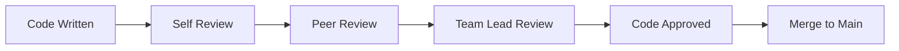

**Review Checklist:**

| Category | Check Items | Purpose |
|---|---|---|
| **Functionality** | Requirements met, edge cases handled | Correctness |
| **Standards** | Naming, formatting, documentation | Consistency |
| **Security** | Input validation, authentication | Safety |
| **Performance** | Efficient algorithms, resource usage | Scalability |

**Benefits of Following Standards:**

| Benefit | Description | Long-term Impact |
|---|---|---|
| **Team Productivity** | Faster development | Reduced development time |
| **Code Quality** | Fewer bugs | Lower maintenance costs |
| **Knowledge Transfer** | Easy understanding | Smooth team transitions |
| **Tool Support** | Better IDE support | Enhanced development experience |

**Implementation Strategy:**

1. **Establish Guidelines**: Create team-specific coding standards document
2. **Tool Integration**: Use automated formatting and linting tools
3. **Training**: Conduct workshops on coding best practices
4. **Enforcement**: Include standards in code review process
5. **Continuous Improvement**: Regular updates based on team feedback

**Popular Coding Standards:**

| Language | Standard | Organization | Focus |
|---|---|---|---|
| **Java** | Google Java Style | Google | Comprehensive guidelines |
| **Python** | PEP 8 | Python Software Foundation | Pythonic code |
| **JavaScript** | Airbnb Style | Airbnb | Modern JS practices |
| **C#** | Microsoft Guidelines | Microsoft | .NET ecosystem |

**Mnemonic:** "Name Structure Organize Document Handle Perform Review"
