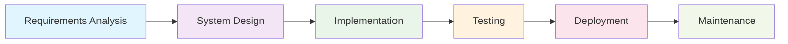
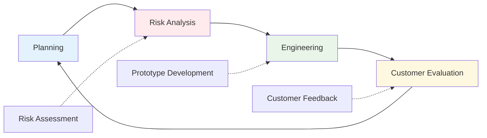
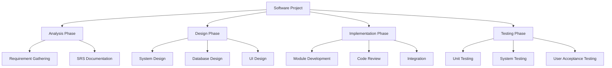
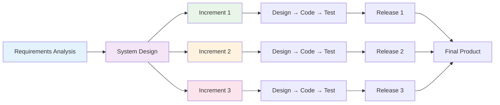
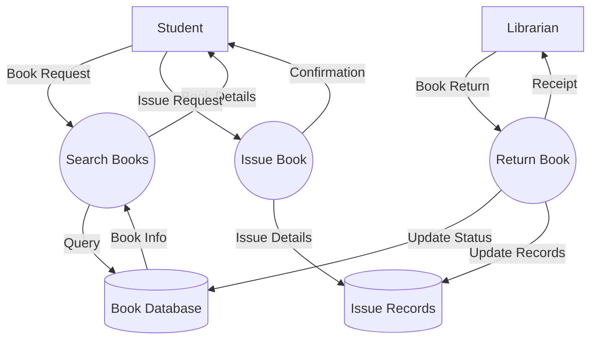
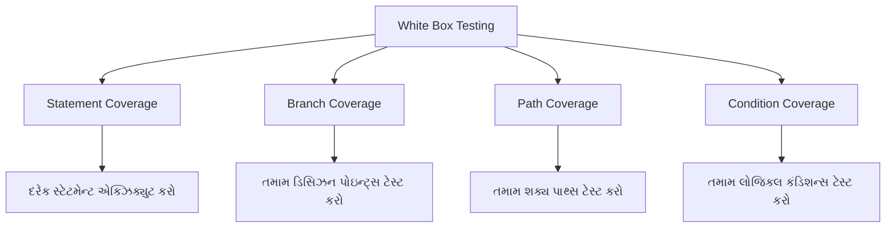
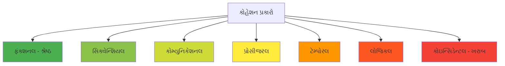
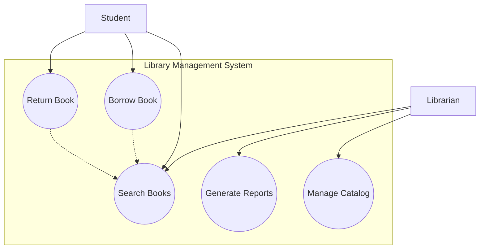
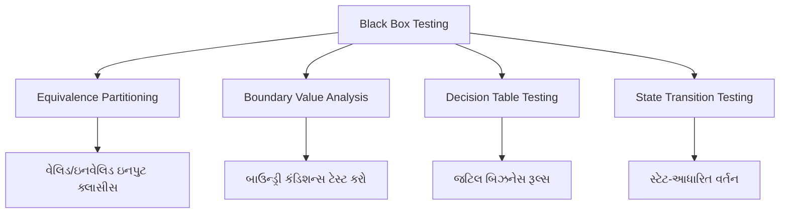
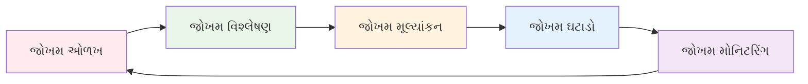

## પ્રશ્ન 1(અ) [3 ગુણ]

**સ્ક્રમ મોડેલ શું છે? એના વિશે લખો.**

**જવાબ**:

સ્ક્રમ એક **એજાઇલ ફ્રેમવર્ક** છે જે પુનરાવર્તક અને વધારાની પદ્ધતિઓ દ્વારા સોફ્ટવેર ડેવલપમેન્ટ પ્રોજેક્ટ્સનું સંચાલન કરે છે.

| પાસાં | વર્ણન |
|-------|-------|
| **ફ્રેમવર્ક પ્રકાર** | એજાઇલ મેથડોલોજી |
| **સ્પ્રિન્ટ અવધિ** | સામાન્ય રીતે 2-4 અઠવાડિયા |
| **ટીમ સાઇઝ** | 5-9 સભ્યો |
| **મુખ્ય સમારંભો** | ડેઇલી સ્ટેન્ડઅપ્સ, સ્પ્રિન્ટ પ્લાનિંગ, સ્પ્રિન્ટ રિવ્યુ, રિટ્રોસ્પેક્ટિવ |

**મુખ્ય લક્ષણો:**

- **પ્રોડક્ટ ઓનર**: જરૂરિયાતો અને પ્રાધાન્યતાઓ નક્કી કરે છે
- **સ્ક્રમ માસ્ટર**: પ્રક્રિયાને સુવિધા આપે છે અને અવરોધો દૂર કરે છે
- **ડેવલપમેન્ટ ટીમ**: પ્રોડક્ટ બનાવતી ક્રોસ-ફંક્શનલ ટીમ

**મેમરી ટ્રીક:** "SPIR" - Sprint, Product owner, Incremental delivery, Review

---

## પ્રશ્ન 1(બ) [4 ગુણ]

**સોફ્ટવેરની વ્યાખ્યા આપો અને સોફ્ટવેરની કેરેક્ટરિસ્ટિક સમજાવો.**

**જવાબ**:

**સોફ્ટવેરની વ્યાખ્યા**: કમ્પ્યુટર સિસ્ટમ પર કાર્યો કરતા કમ્પ્યુટર પ્રોગ્રામ્સ, પ્રક્રિયાઓ અને ડોક્યુમેન્ટેશનનો સંગ્રહ.

| લક્ષણ | વર્ણન |
|-------|-------|
| **અસ્પષ્ટ** | શારીરિક રીતે સ્પર્શ કરી શકાતું નથી |
| **શારીરિક ઘસારો નહીં** | સમય સાથે બગડતું નથી |
| **કસ્ટમ બિલ્ટ** | ચોક્કસ જરૂરિયાતો માટે વિકસાવવામાં આવે છે |
| **મોંઘું** | વિકાસ અને જાળવણીની ઊંચી કિંમત |

**મુખ્ય મુદ્દાઓ:**

- **લોજિકલ પ્રોડક્ટ**: સૂચનાઓ અને ડેટાથી બનેલું
- **એન્જિનીયર્ડ**: વ્યવસ્થિત વિકાસ પ્રક્રિયાને અનુસરે છે
- **કોમ્પ્લેક્સ**: બહુવિધ પરસ્પર જોડાયેલા કાર્યોને હેન્ડલ કરે છે
- **જાળવી શકાય તેવું**: ફેરફાર અને અપડેટ કરી શકાય છે

**મેમરી ટ્રીક:** "IELM" - Intangible, Engineered, Logical, Maintainable

---

## પ્રશ્ન 1(ક) [7 ગુણ]

**વોટરફોલ મોડેલ ડાયાગ્રામ સાથે સમજાવો.**

**જવાબ**:

**વોટરફોલ મોડેલ** એક લીનિયર સિક્વેન્શિયલ સોફ્ટવેર ડેવલપમેન્ટ અભિગમ છે જ્યાં દરેક તબક્કો પૂર્ણ થયા પછી આગળનો શરૂ થાય છે.



| તબક્કો | પ્રવૃત્તિઓ | આઉટપુટ |
|-------|----------|--------|
| **આવશ્યકતાઓ** | જરૂરિયાતો ભેગી કરવી અને દસ્તાવેજીકરણ | SRS ડોક્યુમેન્ટ |
| **ડિઝાઇન** | સિસ્ટમ આર્કિટેક્ચર આયોજન | ડિઝાઇન સ્પેસિફિકેશન્સ |
| **ઇમ્પ્લિમેન્ટેશન** | વાસ્તવિક કોડિંગ | સોર્સ કોડ |
| **ટેસ્ટિંગ** | વેરિફિકેશન અને વેલિડેશન | ટેસ્ટ રિપોર્ટ્સ |
| **ડિપ્લોયમેન્ટ** | ક્લાયન્ટ સાઇટ પર ઇન્સ્ટોલેશન | કાર્યકારી સિસ્ટમ |
| **મેન્ટેનન્સ** | બગ ફિક્સ અને અપડેટ્સ | અપડેટેડ સિસ્ટમ |

**ફાયદાઓ:**

- **સમજવામાં સરળ** અને અમલીકરણ
- **સારી રીતે દસ્તાવેજીકૃત** તબક્કાઓ
- **સરળ પ્રોજેક્ટ મેનેજમેન્ટ** સ્પષ્ટ માઇલસ્ટોન્સ સાથે

**નુકસાનો:**

- **બદલાવ માટે કોઈ લવચીકતા** નથી
- **મોડું ટેસ્ટિંગ** સમસ્યાઓની મોડી શોધ
- **કોમ્પ્લેક્સ પ્રોજેક્ટ્સ** માટે યોગ્ય નથી

**મેમરી ટ્રીક:** "RSITDM" - Requirements, System design, Implementation, Testing, Deployment, Maintenance

---

## પ્રશ્ન 1(ક) OR [7 ગુણ]

**સ્પાઇરલ મોડેલ ડાયાગ્રામ સાથે સમજાવો.**

**જવાબ**:

**સ્પાઇરલ મોડેલ** પુનરાવર્તક વિકાસને વ્યવસ્થિત જોખમ મૂલ્યાંકન સાથે જોડે છે, દરેક પુનરાવર્તનમાં જોખમ વિશ્લેષણ પર ભાર મૂકે છે.



| ચતુર્થાંશ | પ્રવૃત્તિ | હેતુ |
|----------|-----------|-----|
| **પ્લાનિંગ** | આવશ્યકતા ભેગી કરવી | ઉદ્દેશ્યો નક્કી કરવા |
| **રિસ્ક એનાલિસિસ** | જોખમો ઓળખવા અને ઉકેલવા | અનિશ્ચિતતા ઘટાડવા |
| **એન્જિનીયરિંગ** | વિકાસ અને ટેસ્ટિંગ | કાર્યકારી સોફ્ટવેર બનાવવા |
| **ઇવેલ્યુએશન** | ગ્રાહક મૂલ્યાંકન | આગળના પુનરાવર્તન માટે પ્રતિસાદ |

**મુખ્ય લક્ષણો:**

- **જોખમ-સંચાલિત અભિગમ** પ્રારંભિક જોખમ ઓળખ સાથે
- **ગ્રાહકની સંડોવણી** સાથે પુનરાવર્તક વિકાસ
- **દરેક સ્પાઇરલમાં** પ્રોટોટાઇપિંગ
- **મોટા અને જટિલ** પ્રોજેક્ટ્સ માટે યોગ્ય

**ફાયદાઓ:**

- **પ્રારંભિક જોખમ શોધ** અને ઘટાડો
- **સમગ્ર વિકાસ** દરમિયાન ગ્રાહકની સંડોવણી
- **બદલાવોને સમાવવા** માટે લવચીક

**નુકસાનો:**

- **જોખમ વિશ્લેષણ** કારણે જટિલ મેનેજમેન્ટ
- **નાના પ્રોજેક્ટ્સ** માટે મોંઘું
- **જોખમ મૂલ્યાંકનમાં** નિપુણતાની જરૂર

**મેમરી ટ્રીક:** "PRICE" - Planning, Risk analysis, Iterative, Customer evaluation, Engineering

---

## પ્રશ્ન 2(અ) [3 ગુણ]

**કઈ પરિસ્થિતિમાં પ્રોટોટાઇપ મોડેલ ઉપયોગ થાય છે?**

**જવાબ**:

**પ્રોટોટાઇપ મોડેલ** એ વખતે ઉપયોગ થાય છે જ્યારે આવશ્યકતાઓ અસ્પષ્ટ હોય અથવા શક્યતાનું પ્રદર્શન કરવું મહત્વપૂર્ણ હોય.

| પરિસ્થિતિ | ઉપયોગ |
|-----------|-------|
| **અસ્પષ્ટ આવશ્યકતાઓ** | જ્યારે વપરાશકર્તાની જરૂરિયાતો સારી રીતે નિર્ધારિત નથી |
| **નવી ટેક્નોલોજી** | નવા ટૂલ્સ/પ્લેટફોર્મની શક્યતા ચકાસવી |
| **યુઝર ઇન્ટરફેસ** | જટિલ UI/UX સિસ્ટમ્સ ડિઝાઇન કરવા |
| **હાઇ રિસ્ક પ્રોજેક્ટ્સ** | શરૂઆતમાં અનિશ્ચિતતા ઘટાડવા |

**ચોક્કસ ઉપયોગના કેસેસ:**

- **વેબ એપ્લિકેશન્સ** જટિલ વપરાશકર્તા ક્રિયાપ્રતિક્રિયાઓ સાથે
- **રિયલ-ટાઇમ સિસ્ટમ્સ** પ્રદર્શન વેલિડેશનની જરૂર
- **AI/ML પ્રોજેક્ટ્સ** પ્રાયોગિક અલ્ગોરિધમ્સ સાથે

**મેમરી ટ્રીક:** "UNIT" - Unclear requirements, New technology, Interface design, Testing feasibility

---

## પ્રશ્ન 2(બ) [4 ગુણ]

**રિક્વાયરમેન્ટ ગેધરિંગ વિગતમાં સમજાવો.**

**જવાબ**:

**રિક્વાયરમેન્ટ ગેધરિંગ** એ સ્ટેકહોલ્ડર્સ પાસેથી સોફ્ટવેર આવશ્યકતાઓ એકત્રિત કરવાની, વિશ્લેષણ કરવાની અને દસ્તાવેજીકરણ કરવાની પ્રક્રિયા છે.

| તકનીક | વર્ણન | ક્યારે ઉપયોગ કરવો |
|-------|-------|------------------|
| **ઇન્ટરવ્યુ** | એક-પર-એક ચર્ચાઓ | વિગતવાર આવશ્યકતાઓ |
| **પ્રશ્નાવલીઓ** | સંરચિત સર્વેક્ષણો | મોટા વપરાશકર્તા જૂથો |
| **અવલોકન** | વર્તમાન પ્રક્રિયાઓ જોવી | વર્કફ્લો સમજવા |
| **વર્કશોપ્સ** | જૂથ સત્રો | સહયોગી આવશ્યકતાઓ |

**પ્રક્રિયાના પગલાં:**

- **સ્ટેકહોલ્ડર ઓળખ**: તમામ સંબંધિત પક્ષો શોધવા
- **માહિતી સંગ્રહ**: વિવિધ એકત્રીકરણ તકનીકોનો ઉપયોગ
- **વિશ્લેષણ**: આવશ્યકતાઓને પ્રાધાન્ય અને વર્ગીકૃત કરવી
- **દસ્તાવેજીકરણ**: ઔપચારિક આવશ્યકતા સ્પેસિફિકેશન્સ બનાવવા

**પડકારો:**

- **વિકાસ દરમિયાન** બદલાતી આવશ્યકતાઓ
- **સ્ટેકહોલ્ડર્સ વચ્ચે** કોમ્યુનિકેશન ગેપ
- **વપરાશકર્તાઓ પાસેથી** અધૂરી માહિતી

**મેમરી ટ્રીક:** "IQOW" - Interviews, Questionnaires, Observation, Workshops

---

## પ્રશ્ન 2(ક) [7 ગુણ]

**સોફ્ટવેર પ્રોજેક્ટ મેનેજરની જવાબદારીની ચર્ચા કરો.**

**જવાબ**:

**સોફ્ટવેર પ્રોજેક્ટ મેનેજર** સફળ પ્રોજેક્ટ ડિલિવરી સુનિશ્ચિત કરતા સમગ્ર સોફ્ટવેર ડેવલપમેન્ટ લાઇફસાઇકલની દેખરેખ કરે છે.

| જવાબદારી વિસ્તાર | મુખ્ય કાર્યો | જરૂરી કુશળતા |
|-------------------|-------------|---------------|
| **પ્લાનિંગ** | પ્રોજેક્ટ શેડ્યુલિંગ, રિસોર્સ એલોકેશન | વ્યૂહાત્મક વિચારણા |
| **ટીમ મેનેજમેન્ટ** | ટીમ સંકલન, પ્રેરણા | નેતૃત્વ |
| **રિસ્ક મેનેજમેન્ટ** | જોખમ ઓળખ, ઘટાડાની વ્યૂહરચના | સમસ્યા-નિરાકરણ |
| **કોમ્યુનિકેશન** | સ્ટેકહોલ્ડર સંકલન, રિપોર્ટિંગ | વાતચીત કુશળતા |
| **ગુણવત્તા ખાતરી** | પ્રક્રિયા અનુપાલન, ડિલિવરેબલ ગુણવત્તા | વિગતો પર ધ્યાન |

**વિગતવાર જવાબદારીઓ:**

**પ્રોજેક્ટ પ્લાનિંગ:**

- **વર્ક બ્રેકડાઉન સ્ટ્રક્ચર** બનાવવું
- **ટાઇમલાઇન એસ્ટિમેશન** અને શેડ્યુલિંગ
- **રિસોર્સ એલોકેશન** અને બજેટ મેનેજમેન્ટ

**ટીમ લીડરશિપ:**

- **ટીમ બિલ્ડિંગ** અને પ્રેરણા
- **ટીમ સભ્યો વચ્ચે** સંઘર્ષ નિરાકરણ
- **પ્રદર્શન મોનિટરિંગ** અને પ્રતિસાદ

**સ્ટેકહોલ્ડર મેનેજમેન્ટ:**

- **ક્લાયન્ટ કોમ્યુનિકેશન** અને અપેક્ષા મેનેજમેન્ટ
- **સિનિયર મેનેજમેન્ટને** પ્રગતિ રિપોર્ટિંગ
- **ચેન્જ રિક્વેસ્ટ** હેન્ડલિંગ અને મંજૂરી

**રિસ્ક અને ક્વોલિટી મેનેજમેન્ટ:**

- **રિસ્ક એસેસમેન્ટ** અને આકસ્મિક આયોજન
- **ગુણવત્તા ધોરણો** અમલીકરણ
- **પ્રક્રિયા સુધારણા** અમલીકરણ

**આવશ્યક કુશળતા:**

- **સોફ્ટવેર ડેવલપમેન્ટનું** તકનીકી જ્ઞાન
- **પ્રોજેક્ટ મેનેજમેન્ટ** મેથડોલોજીઝ (Agile, Waterfall)
- **વિવિધ સ્ટેકહોલ્ડર્સ** માટે કોમ્યુનિકેશન સ્કિલ્સ
- **સમસ્યા-નિરાકરણ** અને નિર્ણય લેવાની ક્ષમતા

**મેમરી ટ્રીક:** "PLACE" - Planning, Leadership, Assessment, Communication, Execution

---

## પ્રશ્ન 2(અ) OR [3 ગુણ]

**ગાંટ ચાર્ટ અને પર્ટ ચાર્ટનો તફાવત લખો.**

**જવાબ**:

| પાસું | ગાંટ ચાર્ટ | પર્ટ ચાર્ટ |
|------|-----------|-----------|
| **હેતુ** | કાર્યોની વિઝ્યુઅલ ટાઇમલાઇન | નિર્ભરતાનું નેટવર્ક વિશ્લેષણ |
| **ફોર્મેટ** | હોરિઝોન્ટલ બાર ચાર્ટ | નોડ્સ સાથે નેટવર્ક ડાયાગ્રામ |
| **સમય ફોકસ** | અવધિ અને તારીખો બતાવે છે | ક્રિટિકલ પાથ અને સ્લેક ટાઇમ |
| **જટિલતા** | સમજવામાં સરળ | વધુ જટિલ વિશ્લેષણ |
| **શ્રેષ્ઠ માટે** | પ્રોજેક્ટ શેડ્યુલિંગ | સમય ઑપ્ટિમાઇઝેશન |

**મુખ્ય તફાવતો:**

- **ગાંટ**: બતાવે છે **કાર્યો ક્યારે થાય છે**
- **પર્ટ**: બતાવે છે **કાર્ય સંબંધો** અને ક્રિટિકલ પાથ

**મેમરી ટ્રીક:** "GT vs PT" - Gantt Timeline vs PERT dependencies

---

## પ્રશ્ન 2(બ) OR [4 ગુણ]

**RAD, SDLC, XP model અને SRS નું પૂરું નામ લખો.**

**જવાબ**:

| સંક્ષેપ | પૂરું નામ | વર્ણન |
|-------|-----------|-------|
| **RAD** | Rapid Application Development | ઝડપી પ્રોટોટાઇપિંગ મેથડોલોજી |
| **SDLC** | Software Development Life Cycle | સંપૂર્ણ વિકાસ પ્રક્રિયા |
| **XP** | Extreme Programming | એજાઇલ ડેવલપમેન્ટ મેથડોલોજી |
| **SRS** | Software Requirement Specification | ઔપચારિક આવશ્યકતા દસ્તાવેજ |

**સંક્ષિપ્ત સમજૂતીઓ:**

- **RAD**: **ઝડપી પ્રોટોટાઇપિંગ** અને પુનરાવર્તક વિકાસ પર ફોકસ
- **SDLC**: સોફ્ટવેર ડેવલપમેન્ટ તબક્કાઓ માટે **વ્યવસ્થિત અભિગમ**
- **XP**: કોડિંગ પ્રેક્ટિસ પર ભાર મૂકતી **એજાઇલ મેથડોલોજી**
- **SRS**: કાર્યાત્મક અને બિન-કાર્યાત્મક આવશ્યકતાઓનું **વિગતવાર દસ્તાવેજીકરણ**

**મેમરી ટ્રીક:** "RSXS" - RAD, SDLC, XP, SRS

---

## પ્રશ્ન 2(ક) OR [7 ગુણ]

**WBS વિગતમાં સમજાવો.**

**જવાબ**:

**વર્ક બ્રેકડાઉન સ્ટ્રક્ચર (WBS)** પ્રોજેક્ટ કાર્યનું વંશવેલો વિઘટન છે જે નાના, વ્યવસ્થાપન યોગ્ય ઘટકોમાં વિભાજિત કરે છે.



| WBS લેવલ | વર્ણન | ઉદાહરણ |
|----------|-------|---------|
| **લેવલ 1** | મુખ્ય પ્રોજેક્ટ તબક્કાઓ | વિશ્લેષણ, ડિઝાઇન, અમલીકરણ |
| **લેવલ 2** | મુખ્ય ડિલિવરેબલ્સ | SRS, ડિઝાઇન ડોક્સ, કોડ મોડ્યુલ્સ |
| **લેવલ 3** | વર્ક પેકેજીસ | ચોક્કસ કાર્યો અને પ્રવૃત્તિઓ |
| **લેવલ 4** | વ્યક્તિગત પ્રવૃત્તિઓ | વિગતવાર કાર્ય વિઘટન |

**WBS ના ફાયદાઓ:**

- **સ્પષ્ટ પ્રોજેક્ટ સ્કોપ** વ્યાખ્યા
- **સમય અને સંસાધનોનું** બહેતર અંદાજ
- **સુધારેલ કાર્ય સોંપણી** અને જવાબદારી
- **વર્ધિત પ્રગતિ ટ્રેકિંગ** અને નિયંત્રણ

**WBS બનાવવાની પ્રક્રિયા:**

- **પ્રોજેક્ટ સ્કોપમાંથી** મુખ્ય ડિલિવરેબલ્સ ઓળખવા
- **ડિલિવરેબલ્સને** નાના ઘટકોમાં વિઘટન કરવા
- **વર્ક પેકેજીસ** વ્યવસ્થાપન યોગ્ય થાય ત્યાં સુધી ભંગાણ ચાલુ રાખવું
- **દરેક વર્ક પેકેજ** માટે જવાબદારીઓ સોંપવી

**મુખ્ય સિદ્ધાંતો:**

- **100% નિયમ**: WBS માં તમામ પ્રોજેક્ટ કાર્ય સામેલ છે
- **પરસ્પર વિશિષ્ટ**: ઘટકો વચ્ચે કોઈ ઓવરલેપ નથી
- **વ્યવસ્થાપન યોગ્ય સાઇઝ**: વર્ક પેકેજીસ 8-80 કલાકની હોવી જોઈએ

**મેમરી ટ્રીક:** "DEBT" - Decompose, Estimate, Breakdown, Track

---

## પ્રશ્ન 3(અ) [3 ગુણ]

**ઇન્ક્રિમેન્ટલ મોડેલનો ડાયાગ્રામ દોરો.**

**જવાબ**:

**ઇન્ક્રિમેન્ટલ મોડેલ** સોફ્ટવેરને વધારાઓમાં વિકસાવે છે, દરેક વધારો પાછલા વર્ઝનમાં કાર્યક્ષમતા ઉમેરે છે.



**મુખ્ય લક્ષણો:**

- **કોર કાર્યક્ષમતા** પહેલા ડિલિવર કરવામાં આવે છે
- **વધારાની સુવિધાઓ** ક્રમિક રીતે ઉમેરવામાં આવે છે
- **કાર્યકારી સોફ્ટવેર** શરૂઆતમાં ઉપલબ્ધ

**મેમરી ટ્રીક:** "IRA" - Incremental, Release, Add features

---

## પ્રશ્ન 3(બ) [4 ગુણ]

**ફંક્શનલ અને નોન-ફંક્શનલ રિક્વાયરમેન્ટનો તફાવત લખો.**

**જવાબ**:

| પાસું | ફંક્શનલ રિક્વાયરમેન્ટ્સ | નોન-ફંક્શનલ રિક્વાયરમેન્ટ્સ |
|------|------------------------|------------------------------|
| **વ્યાખ્યા** | સિસ્ટમે શું કરવું જોઈએ | સિસ્ટમે કેવી રીતે કામ કરવું જોઈએ |
| **ફોકસ** | સિસ્ટમ વર્તન અને સુવિધાઓ | સિસ્ટમ ગુણવત્તા લક્ષણો |
| **ઉદાહરણો** | લોગિન, ડેટા પ્રોસેસિંગ, રિપોર્ટ્સ | પ્રદર્શન, સુરક્ષા, ઉપયોગિતા |
| **ટેસ્ટિંગ** | ફંક્શનલ ટેસ્ટિંગ | પ્રદર્શન, સુરક્ષા ટેસ્ટિંગ |
| **દસ્તાવેજીકરણ** | યુઝ કેસીસ, યુઝર સ્ટોરીઝ | ગુણવત્તા મેટ્રિક્સ, મર્યાદાઓ |

**વિગતવાર તુલના:**

**ફંક્શનલ રિક્વાયરમેન્ટ્સ:**

- **યુઝર ઓથેન્ટિકેશન** અને ઓથોરાઇઝેશન
- **ડેટા પ્રોસેસિંગ** અને ગણતરીઓ
- **રિપોર્ટ જનરેશન** અને એક્સપોર્ટ સુવિધાઓ
- **બિઝનેસ લોજિક** અમલીકરણ

**નોન-ફંક્શનલ રિક્વાયરમેન્ટ્સ:**

- **પ્રદર્શન**: પ્રતિસાદ સમય, થ્રુપુટ
- **સુરક્ષા**: ડેટા એન્ક્રિપ્શન, એક્સેસ કંટ્રોલ
- **ઉપયોગિતા**: યુઝર ઇન્ટરફેસ ડિઝાઇન, પહોંચ
- **વિશ્વસનીયતા**: સિસ્ટમ ઉપલબ્ધતા, ફોલ્ટ સહનશીલતા

**લાઇબ્રેરી સિસ્ટમ માટે ઉદાહરણો:**

- **ફંક્શનલ**: પુસ્તક શોધ, પુસ્તક ઇશ્યુ/રિટર્ન, દંડ ગણતરી
- **નોન-ફંક્શનલ**: <2 સેકંડમાં શોધ પરિણામો, 99.9% અપટાઇમ, SSL એન્ક્રિપ્શન

**મેમરી ટ્રીક:** "FW vs NH" - Functional What vs Non-functional How

---

## પ્રશ્ન 3(ક) [7 ગુણ]

**ડીએફડી ઉદાહરણ સાથે સમજાવો.**

**જવાબ**:

**ડેટા ફ્લો ડાયાગ્રામ (DFD)** પ્રોસેસીસ, ડેટા સ્ટોર્સ, બાહ્ય એન્ટિટીઝ અને ડેટા ફ્લોઝનો ઉપયોગ કરીને સિસ્ટમ દ્વારા ડેટા ફ્લોનું ગ્રાફિકલ પ્રતિનિધિત્વ છે.

**DFD સિમ્બોલ્સ:**

| સિમ્બોલ | નામ | હેતુ |
|--------|-----|------|
| વર્તુળ/અંડાકાર | પ્રોસેસ | ડેટા રૂપાંતરણ |
| લંબચોરસ | બાહ્ય એન્ટિટી | ડેટા સ્રોત/ગંતવ્ય |
| ખુલ્લો લંબચોરસ | ડેટા સ્ટોર | ડેટા સંગ્રહ |
| તીર | ડેટા ફ્લો | ડેટા હિલચાલની દિશા |

**ઉદાહરણ: લાઇબ્રેરી મેનેજમેન્ટ સિસ્ટમ**



**DFD લેવલ્સ:**

**કોન્ટેક્સ્ટ ડાયાગ્રામ (લેવલ 0):**

- **એક પ્રોસેસ** જે સમગ્ર સિસ્ટમનું પ્રતિનિધિત્વ કરે છે
- **બાહ્ય એન્ટિટીઝ** અને મુખ્ય ડેટા ફ્લોઝ
- **સિસ્ટમ બાઉન્ડ્રીઝનું** ઉચ્ચ-સ્તરનું વિહંગાવલોકન

**લેવલ 1 DFD:**

- **સિસ્ટમની મુખ્ય** પ્રોસેસીસ
- **ડેટા સ્ટોર્સ** અને તેમની ક્રિયાપ્રતિક્રિયાઓ
- **પ્રોસેસીસ વચ્ચે** વિગતવાર ડેટા ફ્લોઝ

**લેવલ 2 અને તે પછી:**

- **જટિલ પ્રોસેસીસનું** વિઘટન
- **વધુ વિગતવાર** ડેટા રૂપાંતરણો
- **નીચલા-સ્તરની** પ્રોસેસ સ્પેસિફિકેશન્સ

**DFD નિયમો:**

- **પ્રોસેસ નામકરણ**: ક્રિયાપદ + ઑબ્જેક્ટ ઉપયોગ કરો (જેમ કે "વપરાશકર્તાને માન્ય કરો")
- **ડેટા ફ્લો નામકરણ**: સંજ્ઞા શબ્દસમૂહોનો ઉપયોગ કરો (જેમ કે "વપરાશકર્તા વિગતો")
- **બેલેન્સિંગ**: લેવલ્સ વચ્ચે ઇનપુટ/આઉટપુટ મેચ થવા જોઈએ
- **બાહ્ય એન્ટિટીઝ વચ્ચે** કોઈ સીધા કનેક્શન્સ નહીં

**ફાયદાઓ:**

- **સ્ટેકહોલ્ડર્સ સાથે** સ્પષ્ટ કોમ્યુનિકેશન
- **સિસ્ટમ બાઉન્ડ્રી** ઓળખ
- **પ્રોસેસ વિશ્લેષણ** અને ઑપ્ટિમાઇઝેશન
- **સિસ્ટમ ડિઝાઇન** માટે દસ્તાવેજીકરણ

**મેમરી ટ્રીક:** "PEDS" - Process, External entity, Data store, Data flow

---

## પ્રશ્ન 3(અ) OR [3 ગુણ]

**ડિઝાઇન એક્ટિવિટીનું ક્લાસિફિકેશન લખો.**

**જવાબ**:

**ડિઝાઇન એક્ટિવિટીઓ** સોફ્ટવેર ડેવલપમેન્ટમાં તેમના સ્કોપ અને હેતુના આધારે વર્ગીકૃત કરવામાં આવે છે.

| વર્ગીકરણ | પ્રવૃત્તિઓ | હેતુ |
|-----------|-----------|-----|
| **સિસ્ટમ ડિઝાઇન** | આર્કિટેક્ચર, મોડ્યુલ્સ, ઇન્ટરફેસીસ | ઉચ્ચ-સ્તરનું માળખું |
| **વિગતવાર ડિઝાઇન** | અલ્ગોરિધમ્સ, ડેટા સ્ટ્રક્ચર્સ | અમલીકરણની વિગતો |
| **ઇન્ટરફેસ ડિઝાઇન** | UI/UX, API સ્પેસિફિકેશન્સ | યુઝર ઇન્ટરેક્શન |
| **ડેટાબેઝ ડિઝાઇન** | સ્કીમા, સંબંધો, ઑપ્ટિમાઇઝેશન | ડેટા મેનેજમેન્ટ |

**મુખ્ય ડિઝાઇન એક્ટિવિટીઓ:**

- **આર્કિટેક્ચરલ ડિઝાઇન**: સમગ્ર સિસ્ટમ માળખું
- **કોમ્પોનેન્ટ ડિઝાઇન**: વ્યક્તિગત મોડ્યુલ સ્પેસિફિકેશન્સ
- **ડેટા ડિઝાઇન**: ડેટાબેઝ અને ફાઇલ સ્ટ્રક્ચર્સ

**મેમરી ટ્રીક:** "ACID" - Architectural, Component, Interface, Data design

---

## પ્રશ્ન 3(બ) OR [4 ગુણ]

**સારા SRS ની કેરેક્ટરિસ્ટિક લખો.**

**જવાબ**:

**સારું SRS (સોફ્ટવેર રિક્વાયરમેન્ટ સ્પેસિફિકેશન)** દસ્તાવેજમાં અસરકારક કોમ્યુનિકેશન અને ડેવલપમેન્ટ માટે ચોક્કસ લક્ષણો હોવા જોઈએ.

| લક્ષણ | વર્ણન | ફાયદો |
|-------|-------|--------|
| **સંપૂર્ણ** | તમામ આવશ્યકતાઓ સામેલ | કોઈ ગુમ થતી કાર્યક્ષમતા નથી |
| **સુસંગત** | કોઈ વિરોધાભાસી આવશ્યકતાઓ નથી | સ્પષ્ટ સમજ |
| **અસ્પષ્ટ નથી** | એક જ અર્થઘટન શક્ય | મૂંઝવણ ઘટાડવી |
| **ચકાસી શકાય તેવું** | આવશ્યકતાઓનું ટેસ્ટ કરી શકાય | ગુણવત્તા ખાતરી |
| **બદલી શકાય તેવું** | અપડેટ અને જાળવણી સરળ | અનુકૂલનક્ષમતા |
| **ટ્રેસેબલ** | આવશ્યકતાઓને ટ્રેક કરી શકાય | ચેન્જ મેનેજમેન્ટ |

**વિગતવાર લક્ષણો:**

**સંપૂર્ણતા:**

- **તમામ કાર્યાત્મક** આવશ્યકતાઓ સ્પષ્ટ
- **તમામ બિન-કાર્યાત્મક** આવશ્યકતાઓ સામેલ
- **તમામ ઇન્ટરફેસીસ** અને મર્યાદાઓ દસ્તાવેજીકૃત

**સુસંગતતા:**

- **કોઈ વિરોધી** આવશ્યકતાઓ નથી
- **સમગ્ર દસ્તાવેજમાં** એકસમાન પરિભાષા
- **સુસંગત ફોર્મેટિંગ** અને માળખું

**ચકાસણીયોગ્યતા:**

- **સ્પષ્ટ માપદંડો** સાથે ટેસ્ટ કરી શકાય તેવી આવશ્યકતાઓ
- **માપી શકાય તેવા** ગુણવત્તા લક્ષણો
- **ઉદ્દેશ્ય સફળતા** માપદંડો વ્યાખ્યાયિત

**મેમરી ટ્રીક:** "CCUMVT" - Complete, Consistent, Unambiguous, Modifiable, Verifiable, Traceable

---

## પ્રશ્ન 3(ક) OR [7 ગુણ]

**વ્હાઇટ બોક્સ ટેસ્ટિંગ સમજાવો.**

**જવાબ**:

**વ્હાઇટ બોક્સ ટેસ્ટિંગ** એ ટેસ્ટિંગ પદ્ધતિ છે જે સોફ્ટવેર એપ્લિકેશન્સના આંતરિક માળખા, કોડ અને લોજિકની તપાસ કરે છે.

| પાસું | વર્ણન |
|------|-------|
| **અન્ય નામથી ઓળખાય** | સ્ટ્રક્ચરલ ટેસ્ટિંગ, ગ્લાસ બોક્સ ટેસ્ટિંગ, ક્લિયર બોક્સ ટેસ્ટિંગ |
| **એક્સેસ લેવલ** | સોર્સ કોડ અને આંતરિક માળખાની સંપૂર્ણ પહોંચ |
| **ફોકસ** | કોડ કવરેજ, લોજિક પાથ્સ, આંતરિક ડેટા સ્ટ્રક્ચર્સ |
| **ટેસ્ટરનું જ્ઞાન** | પ્રોગ્રામિંગ જ્ઞાનની જરૂર |

**વ્હાઇટ બોક્સ ટેસ્ટિંગ તકનીકો:**



**કવરેજ પ્રકારો:**

| કવરેજ પ્રકાર | ફોર્મ્યુલા | વર્ણન |
|-------------|----------|-------|
| **સ્ટેટમેન્ટ કવરેજ** | (એક્ઝિક્યુટેડ સ્ટેટમેન્ટ્સ / કુલ સ્ટેટમેન્ટ્સ) × 100% | કોડની દરેક લાઇન ટેસ્ટ કરે છે |
| **બ્રાન્ચ કવરેજ** | (એક્ઝિક્યુટેડ બ્રાન્ચ / કુલ બ્રાન્ચ) × 100% | તમામ ડિસિઝન આઉટકમ્સ ટેસ્ટ કરે છે |
| **પાથ કવરેજ** | (એક્ઝિક્યુટેડ પાથ્સ / કુલ પાથ્સ) × 100% | તમામ એક્ઝિક્યુશન પાથ્સ ટેસ્ટ કરે છે |
| **કંડિશન કવરેજ** | (ટેસ્ટેડ કંડિશન્સ / કુલ કંડિશન્સ) × 100% | તમામ લોજિકલ કંડિશન્સ ટેસ્ટ કરે છે |

**ફાયદાઓ:**

- **કોડ લોજિકનું** સંપૂર્ણ ટેસ્ટિંગ
- **ડેવલપમેન્ટમાં** પ્રારંભિક ડિફેક્ટ શોધ
- **કોડ ઑપ્ટિમાઇઝેશન** તકોની ઓળખ
- **સંપૂર્ણ કોડ કવરેજ** શક્ય

**નુકસાનો:**

- **મોંઘી અને સમય લેતી** પ્રક્રિયા
- **ટેસ્ટર્સ પાસેથી** પ્રોગ્રામિંગ સ્કિલ્સની જરૂર
- **રિક્વાયરમેન્ટ-સંબંધિત** ડિફેક્ટ્સ ચૂકી શકે છે
- **મોટી એપ્લિકેશન્સ** માટે જટિલ

**ઉપયોગમાં લેવાતા ટૂલ્સ:**

- **કોડ કવરેજ ટૂલ્સ** (JaCoCo, gcov)
- **સ્ટેટિક એનાલિસિસ ટૂલ્સ** (SonarQube)
- **યુનિટ ટેસ્ટિંગ ફ્રેમવર્ક્સ** (JUnit, NUnit)

**ઉદાહરણ ટેસ્ટ કેસીસ:**

```javascript
// ટેસ્ટ કરવાનું ફંક્શન
function calculateGrade(marks) {
    if (marks >= 90) return 'A';
    else if (marks >= 80) return 'B';
    else if (marks >= 70) return 'C';
    else return 'F';
}

// 100% બ્રાન્ચ કવરેજ માટે વ્હાઇટ બોક્સ ટેસ્ટ કેસીસ
// ટેસ્ટ 1: marks = 95 (A ગ્રેડ પાથ)
// ટેસ્ટ 2: marks = 85 (B ગ્રેડ પાથ)  
// ટેસ્ટ 3: marks = 75 (C ગ્રેડ પાથ)
// ટેસ્ટ 4: marks = 65 (F ગ્રેડ પાથ)
```

**મેમરી ટ્રીક:** "SBPC" - Statement, Branch, Path, Condition coverage

---

## પ્રશ્ન 4(અ) [3 ગુણ]

**RAD મોડેલનું મહત્વ સમજાવો.**

**જવાબ**:

**RAD (રેપિડ એપ્લિકેશન ડેવલપમેન્ટ)** મોડેલ પ્રોટોટાઇપિંગ અને પુનરાવર્તક ડિઝાઇન દ્વારા ઝડપી વિકાસ પર ભાર મૂકે છે.

| મહત્વ | ફાયદો | એપ્લિકેશન |
|-------|--------|-----------|
| **ઝડપી ડેવલપમેન્ટ** | માર્કેટ-ટૂ-ટાઇમ ઘટાડો | બિઝનેસ એપ્લિકેશન્સ |
| **યુઝર ઇન્વોલ્વમેન્ટ** | આવશ્યકતાઓની બહેતર સમજ | ઇન્ટરેક્ટિવ સિસ્ટમ્સ |
| **પ્રોટોટાઇપ-આધારિત** | પ્રારંભિક પ્રતિસાદ અને વેલિડેશન | UI-ઇન્ટેન્સિવ એપ્લિકેશન્સ |
| **કોમ્પોનેન્ટ રીયુઝ** | કિંમત ઘટાડો અને કાર્યક્ષમતા | એન્ટરપ્રાઇઝ એપ્લિકેશન્સ |

**મુખ્ય ફાયદાઓ:**

- **કાર્યકારી પ્રોટોટાઇપ્સની** ઝડપી ડિલિવરી
- **ડેવલપમેન્ટ સમય** અને ખર્ચમાં ઘટાડો
- **સંડોવણી દ્વારા** ઉચ્ચ યુઝર સંતોષ
- **ડેવલપમેન્ટ દરમિયાન** બદલાવો માટે લવચીક

**RAD ક્યારે ઉપયોગ કરવું:**

- **સારી રીતે વ્યાખ્યાયિત** બિઝનેસ આવશ્યકતાઓ
- **અનુભવી ડેવલપમેન્ટ** ટીમ ઉપલબ્ધ
- **મોડ્યુલર સિસ્ટમ** આર્કિટેક્ચર શક્ય

**મેમરી ટ્રીક:** "FUPR" - Fast, User involvement, Prototype-based, Reusable components

---

## પ્રશ્ન 4(બ) [4 ગુણ]

**કોડ ઇન્સ્પેક્શન સમજાવો.**

**જવાબ**:

**કોડ ઇન્સ્પેક્શન** સોર્સ કોડની વ્યવસ્થિત તપાસ છે જે ડિફેક્ટ્સ ઓળખવા, ગુણવત્તા સુધારવા અને ધોરણોનું પાલન સુનિશ્ચિત કરવા માટે કરવામાં આવે છે.

| પ્રકાર | વર્ણન | સહભાગીઓ | અવધિ |
|------|-------|-----------|-------|
| **ફોર્મલ ઇન્સ્પેક્શન** | નિર્ધારિત ભૂમિકાઓ સાથે સંરચિત પ્રક્રિયા | 3-6 લોકો | 2-4 કલાક |
| **વોકથ્રુ** | લેખક-આગેવાની વાળું રિવ્યુ સત્ર | 2-7 લોકો | 1-2 કલાક |
| **પીઅર રિવ્યુ** | અનૌપચારિક સાથીદાર રિવ્યુ | 2-3 લોકો | 30-60 મિનિટ |
| **ટૂલ-આધારિત રિવ્યુ** | ઓટોમેટેડ કોડ એનાલિસિસ | વ્યક્તિગત | વિવિધ |

**કોડ ઇન્સ્પેક્શન પ્રક્રિયા:**

- **આયોજન**: કોડ પસંદ કરવો, ભૂમિકાઓ સોંપવી, મીટિંગ શેડ્યુલ કરવી
- **ઓવરવ્યુ**: લેખક કોડનો હેતુ અને ડિઝાઇન સમજાવે છે
- **તૈયારી**: રિવ્યુઅર્સ વ્યક્તિગત રીતે કોડનો અભ્યાસ કરે છે
- **ઇન્સ્પેક્શન મીટિંગ**: વ્યવસ્થિત ડિફેક્ટ ઓળખ
- **રીવર્ક**: લેખક ઓળખાયેલ સમસ્યાઓ ઠીક કરે છે
- **ફોલો-અપ**: ડિફેક્ટ રિઝોલ્યુશનની ચકાસણી

**ફાયદાઓ:**

- **ટેસ્ટિંગ પહેલાં** પ્રારંભિક ડિફેક્ટ શોધ
- **ટીમ સભ્યો વચ્ચે** નોલેજ શેરિંગ
- **કોડ ગુણવત્તા સુધારણા** અને માનકીકરણ
- **મેન્ટેનન્સ ખર્ચમાં** ઘટાડો

**મેમરી ટ્રીક:** "FWPT" - Formal, Walkthrough, Peer review, Tool-based

---

## પ્રશ્ન 4(ક) [7 ગુણ]

**કોહેશન કલાસિફિકેશન સાથે સમજાવો.**

**જવાબ**:

**કોહેશન** માપે છે કે એક મોડ્યુલની જવાબદારીઓ કેટલી નજીકથી સંબંધિત અને કેન્દ્રિત છે. ઊંચું કોહેશન વધુ સારું મોડ્યુલ ડિઝાઇન દર્શાવે છે.

**કોહેશન પ્રકારો (શ્રેષ્ઠથી ખરાબ ક્રમમાં):**

| પ્રકાર | વર્ણન | ઉદાહરણ | મજબૂતાઈ |
|------|-------|---------|--------|
| **ફંક્શનલ** | એક, સારી રીતે વ્યાખ્યાયિત કાર્ય | ટેક્સ રકમ ગણતરી | સર્વોચ્ચ |
| **સિક્વેન્શિયલ** | એક એલિમેન્ટનું આઉટપુટ આગળના માટે ઇનપુટ | વાંચો→પ્રોસેસ કરો→લખો ડેટા | ઊંચું |
| **કોમ્યુનિકેશનલ** | એલિમેન્ટ્સ સમાન ડેટા પર કામ કરે છે | ગ્રાહક રેકોર્ડ અપડેટ | ઊંચું |
| **પ્રોસીજરલ** | એલિમેન્ટ્સ એક્ઝિક્યુશન સિક્વેન્સ અનુસરે છે | ઇનિશિયલાઇઝ→પ્રોસેસ→ક્લીનઅપ | મધ્યમ |
| **ટેમ્પોરલ** | એલિમેન્ટ્સ સમાન સમયે એક્ઝિક્યુટ થાય છે | સિસ્ટમ સ્ટાર્ટઅપ રૂટીન્સ | મધ્યમ |
| **લોજિકલ** | સમાન લોજિકલ ફંક્શન્સ ગૃપ કરેલા | તમામ ઇનપુટ/આઉટપુટ ઓપરેશન્સ | નીચું |
| **કોઇન્સિડેન્ટલ** | કોઈ અર્થપૂર્ણ સંબંધ નથી | રેન્ડમ યુટિલિટી ફંક્શન્સ | સૌથી નીચું |

**વિગતવાર વર્ગીકરણ:**



**ફંક્શનલ કોહેશન (શ્રેષ્ઠ):**

- **સિંગલ રિસ્પોન્સિબિલિટી** સિદ્ધાંત
- **ઉદાહરણ**: `calculateInterest()` - ફક્ત વ્યાજ ગણતરી કરે છે
- **ફાયદાઓ**: સમજવા, ટેસ્ટ કરવા અને જાળવવા આસાન

**સિક્વેન્શિયલ કોહેશન:**

- **ડેટા ફ્લો** એક એલિમેન્ટથી આગળના માટે
- **ઉદાહરણ**: `readFile() → parseData() → generateReport()`
- **પ્રોસેસિંગ પાઇપલાઇન્સ** માટે સારું ડિઝાઇન

**કોમ્યુનિકેશનલ કોહેશન:**

- **સમાન ડેટા સ્ટ્રક્ચર** મેનિપ્યુલેશન
- **ઉદાહરણ**: ગ્રાહક રેકોર્ડના તમામ ફીલ્ડ અપડેટ કરતું મોડ્યુલ
- **ડેટા-કેન્દ્રિત ઓપરેશન્સ** માટે વાજબી ડિઝાઇન

**પ્રોસીજરલ કોહેશન:**

- **કંટ્રોલ ફ્લો** સંબંધ
- **ઉદાહરણ**: ચોક્કસ ક્રમમાં ઇનિશિયલાઇઝેશન સિક્વેન્સ
- **પ્રોસીજરલ ઓપરેશન્સ** માટે સ્વીકાર્ય

**ટેમ્પોરલ કોહેશન:**

- **સમય-આધારિત** સંબંધ
- **ઉદાહરણ**: સિસ્ટમ સ્ટાર્ટઅપ અથવા શટડાઉન રૂટીન્સ
- **મધ્યમ ગુણવત્તા** ડિઝાઇન

**લોજિકલ કોહેશન:**

- **સમાન ફંક્શન્સ** એકસાથે ગૃપ કરેલા
- **ઉદાહરણ**: એક મોડ્યુલમાં તમામ મેથેમેટિકલ ફંક્શન્સ
- **ખરાબ ડિઝાઇન** - જાળવવું મુશ્કેલ

**કોઇન્સિડેન્ટલ કોહેશન (ખરાબ):**

- **એલિમેન્ટ્સ વચ્ચે કોઈ** લોજિકલ સંબંધ નથી
- **ઉદાહરણ**: મિસેલેનિયસ યુટિલિટી ફંક્શન્સ
- **આને ટાળો** - મેન્ટેનન્સ નાઇટમેર બનાવે છે

**ઊંચા કોહેશનના ફાયદાઓ:**

- **સરળ મેન્ટેનન્સ** અને ડીબગિંગ
- **મોડ્યુલ્સની વધુ સારી** પુનઃઉપયોગિતા
- **સુધારેલી ટેસ્ટેબિલિટી** અને વિશ્વસનીયતા
- **સ્પષ્ટ કોડ** સમજ

**ઊંચું કોહેશન કેવી રીતે પ્રાપ્ત કરવું:**

- **સિંગલ રિસ્પોન્સિબિલિટી પ્રિન્સિપલ**: બદલાવનું એક કારણ
- **સ્પષ્ટ મોડ્યુલ હેતુ**: સારી રીતે વ્યાખ્યાયિત કાર્યક્ષમતા
- **મિનિમલ ઇન્ટરફેસીસ**: બાહ્ય નિર્ભરતા ઘટાડવી
- **લોજિકલ ગૃપિંગ**: સંબંધિત ફંક્શન્સ એકસાથે

**મેમરી ટ્રીક:** "FSCPTLC" - Functional, Sequential, Communicational, Procedural, Temporal, Logical, Coincidental

---

## પ્રશ્ન 4(અ) OR [3 ગુણ]

**સોફ્ટવેર વેર આઉટ થતું નથી.**

**જવાબ**:

**સોફ્ટવેર વેર આઉટ થતું નથી** એનો અર્થ છે કે સોફ્ટવેર હાર્ડવેર કોમ્પોનેન્ટ્સની જેમ સમય સાથે શારીરિક રીતે બગડતું નથી.

| પાસું | હાર્ડવેર | સોફ્ટવેર |
|------|---------|----------|
| **શારીરિક ડિગ્રેડેશન** | કોમ્પોનેન્ટ્સ ઘસાઈ જાય છે | કોઈ શારીરિક ડિગ્રેડેશન નથી |
| **વય અસર** | પ્રદર્શન ઘટે છે | પ્રદર્શન સ્થિર રહે છે |
| **ફેઇલ્યુર પેટર્ન** | વધતો ફેઇલ્યુર રેટ | સ્થિર ફેઇલ્યુર રેટ |
| **મેન્ટેનન્સ** | ઘસાયેલા ભાગો બદલવા | ફક્ત લોજિકલ એરર્સ ઠીક કરવા |

**મુખ્ય મુદ્દાઓ:**

- **કોઈ મિકેનિકલ ભાગો** ઘસાવા માટે નથી
- **લોજિકલ એરર્સ** સમય સાથે વધતા નથી
- **પ્રદર્શન ડિગ્રેડેશન** વાતાવરણીય ફેરફારોને કારણે, વય કારણે નહીં
- **ફેઇલ્યુર થાય છે** ડિઝાઇન ખામીઓને કારણે, ઘસારાને કારણે નહીં

**આ કેમ મહત્વપૂર્ણ છે:**

- **અલગ મેન્ટેનન્સ** અભિગમની જરૂર
- **બદલી કરવાને બદલે** અપડેટ્સ પર ફોકસ
- **લોન્જેવિટી પ્લાનિંગ** હાર્ડવેરથી અલગ

**મેમરી ટ્રીક:** "NLPF" - No physical parts, Logical errors, Performance constant, Failures from design

---

## પ્રશ્ન 4(બ) OR [4 ગુણ]

**યુઝ કેસ ડાયાગ્રામ સમજાવો.**

**જવાબ**:

**યુઝ કેસ ડાયાગ્રામ** એક UML વર્તણૂકીય ડાયાગ્રામ છે જે એક્ટર્સ અને યુઝ કેસીસ વચ્ચેની ક્રિયાપ્રતિક્રિયાઓ દ્વારા યુઝરના પરસ્પેક્ટિવથી સિસ્ટમ કાર્યક્ષમતા બતાવે છે.

| કોમ્પોનેન્ટ | સિમ્બોલ | વર્ણન |
|------------|--------|-------|
| **એક્ટર** | સ્ટિક ફિગર | સિસ્ટમ સાથે ક્રિયાપ્રતિક્રિયા કરતી બાહ્ય એન્ટિટી |
| **યુઝ કેસ** | અંડાકાર | સિસ્ટમ ફંક્શન અથવા સેવા |
| **સિસ્ટમ બાઉન્ડ્રી** | લંબચોરસ | સિસ્ટમ સ્કોપ વ્યાખ્યા |
| **સંબંધો** | લાઇન્સ/એરો | કોમ્પોનેન્ટ્સ વચ્ચે એસોસિએશન્સ |

**યુઝ કેસ ડાયાગ્રામ એલિમેન્ટ્સ:**



**સંબંધ પ્રકારો:**

- **એસોસિએશન**: એક્ટર યુઝ કેસમાં ભાગ લે છે
- **ઇન્ક્લુડ**: યુઝ કેસ હંમેશા બીજા યુઝ કેસનો સમાવેશ કરે છે
- **એક્સ્ટેન્ડ**: યુઝ કેસ શરતી રીતે બીજાનું વિસ્તરણ કરે છે
- **જનરલાઇઝેશન**: એક્ટર્સ/યુઝ કેસીસ વચ્ચે ઇન્હેરિટન્સ

**ફાયદાઓ:**

- **સ્પષ્ટ સિસ્ટમ સ્કોપ** વ્યાખ્યા
- **યુઝર રિક્વાયરમેન્ટ્સનું** વિઝ્યુઅલાઇઝેશન
- **સ્ટેકહોલ્ડર્સ સાથે** કોમ્યુનિકેશન ટૂલ
- **ટેસ્ટ કેસ** બનાવવાનો આધાર

**મેમરી ટ્રીક:** "AUSB" - Actor, Use case, System boundary, Relationships

---

## પ્રશ્ન 4(ક) OR [7 ગુણ]

**બ્લેક બોક્સ ટેસ્ટિંગ સમજાવો.**

**જવાબ**:

**બ્લેક બોક્સ ટેસ્ટિંગ** એ ટેસ્ટિંગ પદ્ધતિ છે જે આંતરિક કોડ સ્ટ્રક્ચર અથવા અમલીકરણની વિગતોના જ્ઞાન વિના સોફ્ટવેર કાર્યક્ષમતાની તપાસ કરે છે.

| પાસું | વર્ણન |
|------|-------|
| **અન્ય નામથી ઓળખાય** | ફંક્શનલ ટેસ્ટિંગ, બિહેવિયરલ ટેસ્ટિંગ, સ્પેસિફિકેશન-આધારિત ટેસ્ટિંગ |
| **એક્સેસ લેવલ** | સોર્સ કોડ અથવા આંતરિક માળખાની કોઈ પહોંચ નથી |
| **ફોકસ** | ઇનપુટ-આઉટપુટ વર્તન, કાર્યાત્મક આવશ્યકતાઓ |
| **ટેસ્ટરનું જ્ઞાન** | ડોમેઇન જ્ઞાનની જરૂર, પ્રોગ્રામિંગ નહીં |

**બ્લેક બોક્સ ટેસ્ટિંગ તકનીકો:**



**ટેસ્ટિંગ તકનીકો:**

| તકનીક | વર્ણન | ઉદાહરણ |
|-------|-------|---------|
| **ઇક્વિવેલન્સ પાર્ટિશનિંગ** | ઇનપુટ્સને વેલિડ/ઇનવેલિડ ગૃપોમાં વહેંચવા | વય: 0-17, 18-60, 60+ |
| **બાઉન્ડ્રી વેલ્યુ એનાલિસિસ** | ઇનપુટ રેન્જીસની બાઉન્ડ્રીઝ પર ટેસ્ટ | 17, 18, 60, 61 પર ટેસ્ટ |
| **ડિસિઝન ટેબલ** | કંડિશન્સના કોમ્બિનેશન ટેસ્ટ | વેલિડ/ઇનવેલિડ યુઝર/પાસવર્ડ સાથે લોગિન |
| **સ્ટેટ ટ્રાન્ઝિશન** | સ્ટેટ ચેન્જીસ ટેસ્ટ | ATM સ્ટેટ્સ: આઇડલ→કાર્ડ ઇન્સર્ટ→PIN એન્ટ્રી |

**ટેસ્ટ કેસ ડિઝાઇન ઉદાહરણ:**

```
ફંક્શન: લોગિન વેલિડેશન
ઇનપુટ્સ: યુઝરનેમ, પાસવર્ડ

વેલિડ ઇક્વિવેલન્સ ક્લાસીસ:
- યુઝરનેમ: 5-20 કેરેક્ટર્સ, આલ્ફાન્યુમેરિક
- પાસવર્ડ: 8-15 કેરેક્ટર્સ, સ્પેશિયલ કેરેક્ટર્સ મંજૂર

ઇનવેલિડ ઇક્વિવેલન્સ ક્લાસીસ:
- યુઝરનેમ: <5 અથવા >20 કેરેક્ટર્સ, સ્પેશિયલ કેરેક્ટર્સ
- પાસવર્ડ: <8 અથવા >15 કેરેક્ટર્સ, સ્પેસીસ

ટેસ્ટ કરવાની બાઉન્ડ્રી વેલ્યુઝ:
- યુઝરનેમ: 4, 5, 20, 21
- પાસવર્ડ: 7, 8, 15, 16
```

**ફાયદાઓ:**

- **ટેસ્ટર્સ માટે** પ્રોગ્રામિંગ જ્ઞાનની જરૂર નથી
- **યુઝર પરસ્પેક્ટિવ** ટેસ્ટિંગ અભિગમ
- **રિક્વાયરમેન્ટ્સનું** સ્વતંત્ર વેરિફિકેશન
- **મોટી એપ્લિકેશન્સ** માટે અસરકારક

**નુકસાનો:**

- **કોડ કવરેજની** મર્યાદિત દૃશ્યતા
- **બિનઉપયોગી કોડ પાથ્સ** ઓળખી શકતું નથી
- **સ્પેસિફિકેશન્સ વિના** ટેસ્ટ કેસીસ ડિઝાઇન કરવા મુશ્કેલ
- **કોડમાં લોજિકલ એરર્સ** ચૂકી શકે છે

**બ્લેક બોક્સ ટેસ્ટિંગના પ્રકારો:**

- **ફંક્શનલ ટેસ્ટિંગ**: ફીચર વેરિફિકેશન
- **ઇન્ટિગ્રેશન ટેસ્ટિંગ**: મોડ્યુલ ઇન્ટરેક્શન ટેસ્ટિંગ
- **સિસ્ટમ ટેસ્ટિંગ**: સંપૂર્ણ સિસ્ટમ વેલિડેશન
- **એક્સેપ્ટન્સ ટેસ્ટિંગ**: યુઝર રિક્વાયરમેન્ટ વેરિફિકેશન

**ઉપયોગમાં લેવાતા ટૂલ્સ:**

- **ટેસ્ટ મેનેજમેન્ટ ટૂલ્સ** (TestRail, Zephyr)
- **ઓટોમેશન ટૂલ્સ** (Selenium, QTP)
- **ડિફેક્ટ ટ્રેકિંગ ટૂલ્સ** (Jira, Bugzilla)

**ક્યારે ઉપયોગ કરવું:**

- **રિક્વાયરમેન્ટ્સ-આધારિત** ટેસ્ટિંગ
- **યુઝર એક્સેપ્ટન્સ** ટેસ્ટિંગ
- **સિસ્ટમ ઇન્ટિગ્રેશન** ટેસ્ટિંગ
- **ફેરફારો પછી** રિગ્રેશન ટેસ્ટિંગ

**મેમરી ટ્રીક:** "EBDS" - Equivalence, Boundary, Decision table, State transition

---

## પ્રશ્ન 5(અ) [3 ગુણ]

**વેરિફિકેશન અને વેલિડેશનનો તફાવત લખો.**

**જવાબ**:

| પાસું | વેરિફિકેશન | વેલિડેશન |
|------|-------------|-----------|
| **વ્યાખ્યા** | "અમે યોગ્ય પ્રોડક્ટ બનાવી રહ્યા છીએ?" | "અમે યોગ્ય પ્રોડક્ટ બનાવી રહ્યા છીએ?" |
| **ફોકસ** | પ્રક્રિયા અનુપાલન | પ્રોડક્ટ યોગ્યતા |
| **ક્યારે** | ડેવલપમેન્ટ દરમિયાન | ડેવલપમેન્ટ પછી |
| **પદ્ધતિ** | રિવ્યુઝ, ઇન્સ્પેક્શન્સ, વોકથ્રુઝ | વાસ્તવિક ડેટા સાથે ટેસ્ટિંગ |
| **ખર્ચ** | ડિફેક્ટ શોધનો નીચો ખર્ચ | ડિફેક્ટ શોધનો ઊંચો ખર્ચ |

**મુખ્ય તફાવતો:**

- **વેરિફિકેશન**: **સ્પેસિફિકેશન્સ** સામે ચકાસે છે
- **વેલિડેશન**: **યુઝર જરૂરિયાતો** સામે ચકાસે છે
- **વેરિફિકેશન**: **સ્ટેટિક ટેસ્ટિંગ** પદ્ધતિઓ
- **વેલિડેશન**: **ડાયનેમિક ટેસ્ટિંગ** પદ્ધતિઓ

**ઉદાહરણો:**

- **વેરિફિકેશન**: કોડ રિવ્યુ, ડિઝાઇન રિવ્યુ, SRS રિવ્યુ
- **વેલિડેશન**: યુનિટ ટેસ્ટિંગ, ઇન્ટિગ્રેશન ટેસ્ટિંગ, સિસ્ટમ ટેસ્ટિંગ

**મેમરી ટ્રીક:** "VR vs VT" - Verification Reviews vs Validation Testing

---

## પ્રશ્ન 5(બ) [4 ગુણ]

**એસઆરએસ સમજાવો.**

**જવાબ**:

**SRS (સોફ્ટવેર રિક્વાયરમેન્ટ સ્પેસિફિકેશન)** એ સોફ્ટવેર સિસ્ટમની કાર્યાત્મક અને બિન-કાર્યાત્મક આવશ્યકતાઓનું વર્ણન કરતું વિગતવાર દસ્તાવેજ છે.

| કોમ્પોનેન્ટ | વર્ણન | હેતુ |
|------------|-------|-----|
| **પરિચય** | સિસ્ટમ ઓવરવ્યુ અને સ્કોપ | કોન્ટેક્સ્ટ સેટિંગ |
| **કાર્યાત્મક આવશ્યકતાઓ** | સિસ્ટમે શું કરવું જોઈએ | ફીચર સ્પેસિફિકેશન |
| **બિન-કાર્યાત્મક આવશ્યકતાઓ** | સિસ્ટમે કેવી રીતે કામ કરવું જોઈએ | ગુણવત્તા લક્ષણો |
| **મર્યાદાઓ** | સીમાઓ અને પ્રતિબંધો | બાઉન્ડ્રી વ્યાખ્યા |

**SRS માળખું:**

- **સિસ્ટમ હેતુ**: સિસ્ટમની જરૂર શા માટે છે
- **સિસ્ટમ સ્કોપ**: સિસ્ટમ શું કરશે અને શું કરશે નહીં
- **વ્યાખ્યાઓ**: તકનીકી શબ્દો અને સંક્ષેપો
- **યુઝર આવશ્યકતાઓ**: ઉચ્ચ-સ્તરીય યુઝર જરૂરિયાતો
- **સિસ્ટમ આવશ્યકતાઓ**: વિગતવાર તકનીકી સ્પેસિફિકેશન્સ

**SRS નું મહત્વ:**

- **સ્ટેકહોલ્ડર્સ વચ્ચે** કોમ્યુનિકેશન ટૂલ
- **ટેસ્ટિંગ અને વેલિડેશન** માટે બેઝલાઇન
- **ક્લાયન્ટ અને ડેવલપર** વચ્ચે કોન્ટ્રાક્ટ આધાર
- **ચેન્જ મેનેજમેન્ટ** રેફરન્સ દસ્તાવેજ

**SRS ના વપરાશકર્તાઓ:**

- **ડેવલપર્સ**: અમલીકરણ માર્ગદર્શન
- **ટેસ્ટર્સ**: ટેસ્ટ કેસ બનાવવા
- **પ્રોજેક્ટ મેનેજર્સ**: આયોજન અને ટ્રેકિંગ
- **ક્લાયન્ટ્સ**: આવશ્યકતા વેરિફિકેશન

**મેમરી ટ્રીક:** "IFNC" - Introduction, Functional, Non-functional, Constraints

---

## પ્રશ્ન 5(ક) [7 ગુણ]

**રિસ્ક મેનેજમેન્ટ સમજાવો.**

**જવાબ**:

**રિસ્ક મેનેજમેન્ટ** પ્રોજેક્ટની સફળતા પર તેમની અસરને ઘટાડવા માટે પ્રોજેક્ટ જોખમોને ઓળખવા, વિશ્લેષણ કરવા અને તેનો પ્રતિસાદ આપવાની વ્યવસ્થિત પ્રક્રિયા છે.

**રિસ્ક મેનેજમેન્ટ પ્રક્રિયા:**



| તબક્કો | પ્રવૃત્તિઓ | આઉટપુટ |
|-------|-----------|--------|
| **ઓળખ** | બ્રેઇનસ્ટોર્મિંગ, ચેકલિસ્ટ્સ, એક્સપર્ટ જજમેન્ટ | રિસ્ક રજિસ્ટર |
| **વિશ્લેષણ** | સંભાવના અને અસર મૂલ્યાંકન | રિસ્ક મેટ્રિક્સ |
| **મૂલ્યાંકન** | જોખમ પ્રાધાન્ય અને રેન્કિંગ | રિસ્ક પ્રાધાન્ય સૂચિ |
| **ઘટાડો** | પ્રતિસાદ વ્યૂહરચના વિકાસ | ઘટાડાની યોજનાઓ |
| **મોનિટરિંગ** | જોખમો અને ઘટાડાની અસરકારકતા ટ્રેક કરવી | સ્થિતિ રિપોર્ટ્સ |

**જોખમ શ્રેણીઓ:**

**પ્રોજેક્ટ રિસ્ક્સ:**

- **શેડ્યુલ વિલંબ** રિસોર્સ અનુપલબ્ધતાને કારણે
- **બજેટ ઓવરરન** સ્કોપ ફેરફારોથી
- **ટીમ ટર્નઓવર** ઉત્પાદકતાને અસર કરે છે
- **કોમ્યુનિકેશન ગેપ્સ** સ્ટેકહોલ્ડર્સ વચ્ચે

**તકનીકી રિસ્ક્સ:**

- **ટેક્નોલોજી જટિલતા** ટીમ સ્કિલ્સ કરતાં વધારે
- **હાલની સિસ્ટમ્સ સાથે** ઇન્ટિગ્રેશન પડકારો
- **લોડ કંડિશન્સ હેઠળ** પ્રદર્શન સમસ્યાઓ
- **ડિઝાઇનમાં** સિક્યોરિટી વલ્નરેબિલિટીઝ

**બિઝનેસ રિસ્ક્સ:**

- **માર્કેટ કંડિશન્સથી** બદલાતી આવશ્યકતાઓ
- **કોમ્પિટિશન** સમાન પ્રોડક્ટ્સ રિલીઝ કરે છે
- **રેગ્યુલેટરી ફેરફારો** કોમ્પ્લાયન્સને અસર કરે છે
- **પ્રાધાન્યતાઓ પર** સ્ટેકહોલ્ડર સંઘર્ષો

**રિસ્ક રિસ્પોન્સ વ્યૂહરચનાઓ:**

| વ્યૂહરચના | વર્ણન | ક્યારે ઉપયોગ કરવો | ઉદાહરણ |
|----------|-------|------------------|---------|
| **સ્વીકાર** | જોખમ સ્વીકારવું, કોઈ ક્રિયા નહીં | નીચી અસરવાળા જોખમો | નાના UI ફેરફારો |
| **ટાળવું** | જોખમ સ્રોત દૂર કરવો | ઊંચી અસર, ટાળી શકાય તેવા | ટેક્નોલોજી બદલવી |
| **ઘટાડવું** | સંભાવના/અસર ઘટાડવી | વ્યવસ્થાપન યોગ્ય જોખમો | વધારાનું ટેસ્ટિંગ |
| **ટ્રાન્સફર કરવું** | જોખમ થર્ડ પાર્ટીને શિફ્ટ કરવું | વિશેષીકૃત જોખમો | ઇન્શ્યોરન્સ, આઉટસોર્સિંગ |

**રિસ્ક એસેસમેન્ટ મેટ્રિક્સ:**

| સંભાવના/અસર | નીચી | મધ્યમ | ઊંચી |
|-------------|-----|------|------|
| **ઊંચી** | મધ્યમ | ઊંચી | ક્રિટિકલ |
| **મધ્યમ** | નીચી | મધ્યમ | ઊંચી |
| **નીચી** | ખૂબ નીચી | નીચી | મધ્યમ |

**રિસ્ક મિટિગેશન તકનીકો:**

- **પ્રોટોટાઇપિંગ** તકનીકી અનિશ્ચિતતા ઘટાડવા માટે
- **સ્ટાફ ટ્રેનિંગ** સ્કિલ ગેપ્સને સંબોધવા માટે
- **નિયમિત રિવ્યુઝ** વહેલી સમસ્યાઓ પકડવા માટે
- **કોન્ટિન્જન્સી પ્લાનિંગ** ક્રિટિકલ સ્થિતિઓ માટે

**રિસ્ક મેનેજમેન્ટના ફાયદાઓ:**

- **પ્રોએક્ટિવ સમસ્યા** નિવારણ
- **રિસ્ક જાગૃતિ સાથે** બહેતર નિર્ણય લેવો
- **પ્રોજેક્ટની સફળતાના** સુધારેલા દરો
- **પ્રોજેક્ટ ડિલિવરીમાં** સ્ટેકહોલ્ડર આત્મવિશ્વાસ

**રિસ્ક મોનિટરિંગ પ્રવૃત્તિઓ:**

- **નિયમિત રિસ્ક રિવ્યુઝ** અને અપડેટ્સ
- **પ્રારંભિક ચેતવણી** માટે રિસ્ક ટ્રિગર મોનિટરિંગ
- **મિટિગેશન પ્લાન** પ્રગતિ ટ્રેકિંગ
- **પ્રોજેક્ટ વિકસિત થાય** તેમ નવા રિસ્કની ઓળખ

**રિસ્ક મેનેજમેન્ટ માટે ટૂલ્સ:**

- **રિસ્ક રજિસ્ટર્સ** અને ડેટાબેસીસ
- **રિસ્ક એસેસમેન્ટ** મેટ્રિસીસ
- **ક્વોન્ટિટેટિવ એનાલિસિસ** માટે મોન્ટે કાર્લો સિમ્યુલેશન
- **એક્સપર્ટ જજમેન્ટ** અને ઐતિહાસિક ડેટા

**મુખ્ય સફળતા પરિબળો:**

- **રિસ્ક પ્રક્રિયાઓ** માટે મેનેજમેન્ટ કમિટમેન્ટ
- **ટીમ જાગૃતિ** અને સહભાગિતા
- **રિસ્ક વિશે** નિયમિત કોમ્યુનિકેશન
- **પ્રોજેક્ટ મેનેજમેન્ટ પ્રક્રિયાઓ** સાથે ઇન્ટિગ્રેશન

**મેમરી ટ્રીક:** "IATMM" - Identify, Analyze, Assess, Treat, Monitor risks

---

## પ્રશ્ન 5(અ) OR [3 ગુણ]

**હોસ્ટેલ મેનેજમેન્ટ માટેની કોઈપણ ફંક્શનલ રિક્વાયરમેન્ટ નેલિસ્ટ આઉટ કરો.**

**જવાબ**:

**હોસ્ટેલ મેનેજમેન્ટ સિસ્ટમ** માટે **ફંક્શનલ રિક્વાયરમેન્ટ્સ** હોસ્ટેલ ઓપરેશન્સનું અસરકારક સંચાલન કરવા માટે સિસ્ટમે શું કરવું જોઈએ તે વ્યાખ્યાયિત કરે છે.

| મોડ્યુલ | ફંક્શનલ રિક્વાયરમેન્ટ્સ |
|--------|----------------------|
| **સ્ટુડન્ટ મેનેજમેન્ટ** | વિદ્યાર્થીઓની નોંધણી, રૂમ એસાઇનમેન્ટ, પ્રોફાઇલ જાળવણી |
| **રૂમ મેનેજમેન્ટ** | રૂમ એલોકેશન, ઉપલબ્ધતા ટ્રેકિંગ, મેન્ટેનન્સ |
| **ફી મેનેજમેન્ટ** | ફી ગણતરી, પેમેન્ટ પ્રોસેસિંગ, રસીદ જનરેશન |
| **વિઝિટર મેનેજમેન્ટ** | વિઝિટર રજિસ્ટ્રેશન, એન્ટ્રી/એક્ઝિટ ટ્રેકિંગ, મંજૂરી |

**વિગતવાર ફંક્શનલ રિક્વાયરમેન્ટ્સ:**

**સ્ટુડન્ટ મોડ્યુલ:**

- **વિદ્યાર્થી નોંધણી** વ્યક્તિગત વિગતો સાથે
- **રૂમ એસાઇનમેન્ટ** ઉપલબ્ધતાના આધારે
- **વિદ્યાર્થી પ્રોફાઇલ** મેનેજમેન્ટ અને અપડેટ્સ

**એડમિનિસ્ટ્રેટિવ મોડ્યુલ:**

- **સ્ટાફ મેનેજમેન્ટ** અને ભૂમિકા સોંપણી
- **કબજો અને ફાઇનાન્સ** માટે રિપોર્ટ જનરેશન
- **ફરિયાદ મેનેજમેન્ટ** અને રિઝોલ્યુશન ટ્રેકિંગ

**સિક્યોરિટી મોડ્યુલ:**

- **વિવિધ યુઝર પ્રકારો** માટે એક્સેસ કંટ્રોલ
- **વિઝિટર લોગિંગ** અને મંજૂરી સિસ્ટમ
- **ઇમર્જન્સી કોન્ટેક્ટ** મેનેજમેન્ટ

**મેમરી ટ્રીક:** "SRFV" - Student, Room, Fee, Visitor management

---

## પ્રશ્ન 5(બ) OR [4 ગુણ]

**એજાઇલ પ્રોસેસ સમજાવો.**

**જવાબ**:

**એજાઇલ પ્રોસેસ** એ પુનરાવર્તક અને વધારાશીલ સોફ્ટવેર ડેવલપમેન્ટ અભિગમ છે જે સહયોગ, લવચીકતા અને ગ્રાહક સંતોષ પર ભાર મૂકે છે.

| એજાઇલ સિદ્ધાંત | વર્ણન | ફાયદો |
|---------------|-------|--------|
| **ગ્રાહક સહયોગ** | સતત ગ્રાહક સંડોવણી | આવશ્યકતાઓની બહેતર સમજ |
| **કાર્યકારી સોફ્ટવેર** | વારંવાર કાર્યાત્મક સોફ્ટવેર ડિલિવર કરવું | પ્રારંભિક વેલ્યુ ડિલિવરી |
| **બદલાવનો પ્રતિસાદ** | બદલાતી આવશ્યકતાઓને અનુકૂળ થવું | માર્કેટ રિસ્પોન્સિવનેસ |
| **વ્યક્તિઓ અને ક્રિયાપ્રતિક્રિયાઓ** | પ્રક્રિયાઓ અને ટૂલ્સ કરતાં લોકો | બહેતર ટીમ ડાયનેમિક્સ |

**એજાઇલ વેલ્યુઝ:**

- **વ્યક્તિઓ અને ક્રિયાપ્રતિક્રિયાઓ** પ્રક્રિયાઓ અને ટૂલ્સ કરતાં
- **કાર્યકારી સોફ્ટવેર** વ્યાપક દસ્તાવેજીકરણ કરતાં
- **ગ્રાહક સહયોગ** કોન્ટ્રાક્ટ વાટાઘાટો કરતાં
- **બદલાવનો પ્રતિસાદ** યોજનાને અનુસરવા કરતાં

**એજાઇલ પ્રેક્ટિસીસ:**

- **ટૂંકા પુનરાવર્તનો** (1-4 અઠવાડિયા)
- **ટીમ સંકલન** માટે ડેઇલી સ્ટેન્ડઅપ્સ
- **સ્પ્રિન્ટ પ્લાનિંગ** અને રિવ્યુ મીટિંગ્સ
- **સતત ઇન્ટિગ્રેશન** અને ટેસ્ટિંગ

**ફાયદાઓ:**

- **કાર્યકારી સોફ્ટવેરની** ઝડપી ડિલિવરી
- **સતત ટેસ્ટિંગ** દ્વારા બહેતર ગુણવત્તા
- **સુધારેલ સ્ટેકહોલ્ડર** સંતોષ
- **ફેરફારોને હેન્ડલ** કરવાની લવચીકતા

**મેમરી ટ્રીક:** "CWRI" - Customer collaboration, Working software, Responding to change, Individuals

---

## પ્રશ્ન 5(ક) OR [7 ગુણ]

**સોફ્ટવેર એન્જિનીયરિંગ - લેયર્ડ એપ્રોચ સમજાવો.**

**જવાબ**:

**સોફ્ટવેર એન્જિનીયરિંગ - લેયર્ડ એપ્રોચ** સોફ્ટવેર એન્જિનીયરિંગને બહુવિધ પરસ્પર જોડાયેલા સ્તરો સાથે સંરચિત પદ્ધતિ તરીકે રજૂ કરે છે, દરેક નીચલા સ્તરોના પાયા પર બનાવે છે.

**લેયર્ડ આર્કિટેક્ચર:**


| લેયર | વર્ણન | હેતુ | ઉદાહરણો |
|------|-------|-----|---------|
| **ગુણવત્તા ફોકસ** | ગુણવત્તા પર ભાર મૂકતો પાયો | ગ્રાહક સંતોષ સુનિશ્ચિત કરે છે | ગુણવત્તા ધોરણો, મેટ્રિક્સ |
| **પ્રોસેસ** | સોફ્ટવેર ડેવલપમેન્ટ માટે ફ્રેમવર્ક | માળખું અને નિયંત્રણ પ્રદાન કરે છે | SDLC મોડલ્સ, પ્રોજેક્ટ મેનેજમેન્ટ |
| **મેથડ્સ** | તકનીકી અભિગમો અને તકનીકો | ડેવલપમેન્ટ પ્રવૃત્તિઓને માર્ગદર્શન આપે છે | વિશ્લેષણ, ડિઝાઇન, ટેસ્ટિંગ પદ્ધતિઓ |
| **ટૂલ્સ** | પદ્ધતિઓ માટે ઓટોમેટેડ સપોર્ટ | ઉત્પાદકતા વધારે છે | IDE, ટેસ્ટિંગ ટૂલ્સ, CASE ટૂલ્સ |

**વિગતવાર લેયર વિશ્લેષણ:**

**ગુણવત્તા ફોકસ (પાયાનો સ્તર):**

- **સોફ્ટવેર એન્જિનીયરિંગ અભિગમનો** પાયો
- **તમામ પ્રવૃત્તિઓમાં** ગુણવત્તા પ્રત્યે પ્રતિબદ્ધતા
- **પ્રાથમિક લક્ષ્ય** તરીકે ગ્રાહક સંતોષ
- **સતત સુધારણા** માનસિકતા
- **ગુણવત્તા લક્ષણો**: યોગ્યતા, વિશ્વસનીયતા, કાર્યક્ષમતા, જાળવણીયોગ્યતા

**પ્રોસેસ લેયર:**

- **અસરકારક ડિલિવરી** માટે ફ્રેમવર્ક વ્યાખ્યાયિત કરે છે
- **તકનીકી પદ્ધતિઓ** માટે સંદર્ભ સ્થાપિત કરે છે
- **મુખ્ય એલિમેન્ટ્સ**: કોમ્યુનિકેશન, આયોજન, મોડેલિંગ, બાંધકામ, જમાવટ
- **પ્રોસેસ મોડલ્સ**: વોટરફોલ, એજાઇલ, સ્પાઇરલ, ઇન્ક્રિમેન્ટલ
- **મેનેજમેન્ટ પ્રવૃત્તિઓ**: પ્રોજેક્ટ પ્લાનિંગ, ટ્રેકિંગ, રિસ્ક મેનેજમેન્ટ

**મેથડ્સ લેયર:**

- **સોફ્ટવેર બનાવવા** માટે તકનીકી જ્ઞાન
- **વ્યાપક કાર્યોની** શ્રેણીને સમાવે છે
- **કોમ્યુનિકેશન પદ્ધતિઓ**: આવશ્યકતા એલિસિટેશન, વિશ્લેષણ
- **પ્લાનિંગ પદ્ધતિઓ**: પ્રોજેક્ટ એસ્ટિમેશન, શેડ્યુલિંગ
- **મોડેલિંગ પદ્ધતિઓ**: વિશ્લેષણ અને ડિઝાઇન તકનીકો
- **કન્સ્ટ્રક્શન પદ્ધતિઓ**: કોડિંગ ધોરણો, ટેસ્ટિંગ વ્યૂહરચનાઓ
- **ડિપ્લોયમેન્ટ પદ્ધતિઓ**: ડિલિવરી, સપોર્ટ, પ્રતિસાદ

**ટૂલ્સ લેયર:**

- **ઓટોમેટેડ અથવા સેમી-ઓટોમેટેડ** સપોર્ટ
- **કાર્યક્ષમતા વધારે છે** અને એરર્સ ઘટાડે છે
- **ટૂલ કેટેગરીઝ**:
  - **ડેવલપમેન્ટ એનવાયરનમેન્ટ્સ**: IDE, કમ્પાઇલર્સ
  - **વિશ્લેષણ અને ડિઝાઇન ટૂલ્સ**: UML ટૂલ્સ, CASE ટૂલ્સ
  - **ટેસ્ટિંગ ટૂલ્સ**: યુનિટ ટેસ્ટિંગ, ઓટોમેશન ફ્રેમવર્ક્સ
  - **પ્રોજેક્ટ મેનેજમેન્ટ ટૂલ્સ**: શેડ્યુલિંગ, ટ્રેકિંગ સોફ્ટવેર

**લેયર્સ વચ્ચે ક્રિયાપ્રતિક્રિયાઓ:**

**ગુણવત્તા ↔ પ્રોસેસ:**

- ગુણવત્તા ફોકસ **પ્રોસેસ પસંદગીને** ચલાવે છે
- પ્રોસેસ **ગુણવત્તા ડિલિવરી** સુનિશ્ચિત કરે છે

**પ્રોસેસ ↔ મેથડ્સ:**

- પ્રોસેસ મેથડ્સ માટે **સંદર્ભ પ્રદાન** કરે છે
- મેથડ્સ **પ્રોસેસ પ્રવૃત્તિઓ** અમલમાં મૂકે છે

**મેથડ્સ ↔ ટૂલ્સ:**

- મેથડ્સ **શું કરવું** તે વ્યાખ્યાયિત કરે છે
- ટૂલ્સ **કેવી રીતે કરવું** કાર્યક્ષમતાથી તે પ્રદાન કરે છે

**લેયર્ડ અભિગમના ફાયદાઓ:**

- **સોફ્ટવેર ડેવલપમેન્ટ** માટે વ્યવસ્થિત પદ્ધતિ
- **નાનાથી મોટા પ્રોજેક્ટ્સ** માટે સ્કેલેબિલિટી
- **ટૂલ્સ અને પદ્ધતિઓને** અનુકૂળ કરવાની લવચીકતા
- **દરેક સ્તરે** ગુણવત્તા ખાતરી
- **સંરચિત અભિગમ** દ્વારા જોખમ ઘટાડો

**અમલીકરણ વ્યૂહરચના:**

- **ગુણવત્તા ફોકસ** સ્થાપના સાથે શરૂઆત
- **પ્રોજેક્ટ સંદર્ભ** માટે યોગ્ય પ્રોસેસ પસંદ કરવી
- **પ્રોસેસ આવશ્યકતાઓને** મેચ કરતી પદ્ધતિઓ પસંદ કરવી
- **પસંદ કરેલી પદ્ધતિઓને** સપોર્ટ કરતા ટૂલ્સનું ઇન્ટિગ્રેશન
- **સતત મૂલ્યાંકન** અને સુધારણા

**મુખ્ય સફળતા પરિબળો:**

- **ગુણવત્તા પ્રત્યે** મેનેજમેન્ટ કમિટમેન્ટ
- **પદ્ધતિઓ અને ટૂલ્સ** પર ટીમ ટ્રેનિંગ
- **પ્રોસેસ પાલન** અને શિસ્ત
- **ટૂલ ઇન્ટિગ્રેશન** અને માનકીકરણ
- **સતત સુધારણા** સંસ્કૃતિ

**વાસ્તવિક વિશ્વ એપ્લિકેશન:**

- **મોટી સંસ્થાઓ**: સંપૂર્ણ લેયર અમલીકરણ
- **નાની ટીમો**: સરળીકૃત પરંતુ સુસંગત અભિગમ
- **પ્રોજેક્ટ-સ્પેસિફિક**: તૈયાર કરેલ લેયર પસંદગી
- **ઇન્ડસ્ટ્રી સ્ટાન્ડર્ડ્સ**: ગુણવત્તા ફ્રેમવર્ક્સ સાથે અનુપાલન

**મેમરી ટ્રીક:** "QPMT" - Quality focus, Process, Methods, Tools (નીચેથી ઉપર)
