## Question 1(a) [3 marks]

**What is Scrum model? Write about it.**

**Answer**:

Scrum is an **agile framework** for managing software development projects through iterative and incremental practices.

| Aspect | Description |
|--------|-------------|
| **Framework Type** | Agile methodology |
| **Sprint Duration** | 2-4 weeks typically |
| **Team Size** | 5-9 members |
| **Key Ceremonies** | Daily standups, Sprint planning, Sprint review, Retrospective |

**Key Features:**

- **Product Owner**: Defines requirements and priorities
- **Scrum Master**: Facilitates process and removes obstacles  
- **Development Team**: Cross-functional team building the product

**Mnemonic:** "SPIR" - Sprint, Product owner, Incremental delivery, Review

---

## Question 1(b) [4 marks]

**Define Software and Explain Software Characteristics.**

**Answer**:

**Software Definition**: A collection of computer programs, procedures, and documentation that performs tasks on a computer system.

| Characteristic | Description |
|----------------|-------------|
| **Intangible** | Cannot be touched physically |
| **No Physical Wear** | Doesn't deteriorate with time |
| **Custom Built** | Developed for specific requirements |
| **Expensive** | High development and maintenance costs |

**Key Points:**

- **Logical Product**: Made of instructions and data
- **Engineered**: Follows systematic development process
- **Complex**: Handles multiple interconnected functions
- **Maintainable**: Can be modified and updated

**Mnemonic:** "IELM" - Intangible, Engineered, Logical, Maintainable

---

## Question 1(c) [7 marks]

**Explain Waterfall Model with diagram.**

**Answer**:

The **Waterfall Model** is a linear sequential software development approach where each phase must be completed before the next begins.

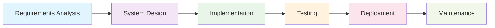

| Phase | Activities | Output |
|-------|------------|--------|
| **Requirements** | Gather and document needs | SRS Document |
| **Design** | System architecture planning | Design specs |
| **Implementation** | Actual coding | Source code |
| **Testing** | Verification and validation | Test reports |
| **Deployment** | Installation at client site | Working system |
| **Maintenance** | Bug fixes and updates | Updated system |

**Advantages:**

- **Simple to understand** and implement
- **Well-documented** phases
- **Easy project management** with clear milestones

**Disadvantages:**

- **No flexibility** for requirement changes
- **Late testing** discovery of issues
- **Not suitable** for complex projects

**Mnemonic:** "RSITDM" - Requirements, System design, Implementation, Testing, Deployment, Maintenance

---

## Question 1(c) OR [7 marks]

**Explain Spiral Model with diagram.**

**Answer**:

The **Spiral Model** combines iterative development with systematic risk assessment, emphasizing risk analysis in each iteration.

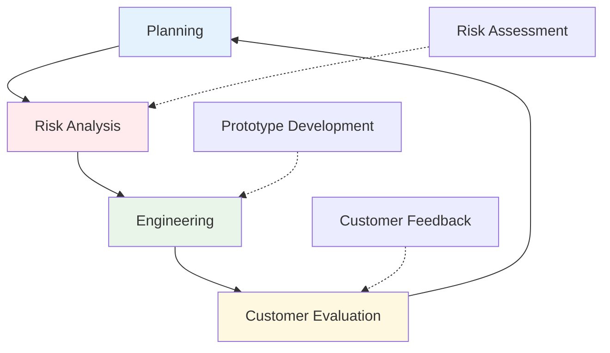

| Quadrant | Activity | Purpose |
|----------|----------|---------|
| **Planning** | Requirement gathering | Define objectives |
| **Risk Analysis** | Identify and resolve risks | Minimize uncertainties |
| **Engineering** | Development and testing | Build working software |
| **Evaluation** | Customer assessment | Get feedback for next iteration |

**Key Features:**

- **Risk-driven approach** with early risk identification
- **Iterative development** with customer involvement
- **Prototyping** in each spiral
- **Suitable for large** and complex projects

**Advantages:**

- **Early risk detection** and mitigation
- **Customer involvement** throughout development
- **Flexible** to accommodate changes

**Disadvantages:**

- **Complex management** due to risk analysis
- **Expensive** for small projects
- **Requires expertise** in risk assessment

**Mnemonic:** "PRICE" - Planning, Risk analysis, Iterative, Customer evaluation, Engineering

---

## Question 2(a) [3 marks]

**In which situation prototype model is used?**

**Answer**:

The **Prototype Model** is used when requirements are unclear or when demonstrating feasibility is crucial.

| Situation | Application |
|-----------|-------------|
| **Unclear Requirements** | When user needs are not well-defined |
| **New Technology** | Testing feasibility of new tools/platforms |
| **User Interface** | Designing complex UI/UX systems |
| **High Risk Projects** | Reducing uncertainties early |

**Specific Use Cases:**

- **Web applications** with complex user interactions
- **Real-time systems** requiring performance validation
- **AI/ML projects** with experimental algorithms

**Mnemonic:** "UNIT" - Unclear requirements, New technology, Interface design, Testing feasibility

---

## Question 2(b) [4 marks]

**Explain requirement gathering in detail.**

**Answer**:

**Requirement Gathering** is the process of collecting, analyzing, and documenting software requirements from stakeholders.

| Technique | Description | When to Use |
|-----------|-------------|-------------|
| **Interviews** | One-on-one discussions | Detailed requirements |
| **Questionnaires** | Structured surveys | Large user groups |
| **Observation** | Watching current processes | Understanding workflows |
| **Workshops** | Group sessions | Collaborative requirements |

**Process Steps:**

- **Stakeholder Identification**: Find all relevant parties
- **Information Collection**: Use various gathering techniques
- **Analysis**: Prioritize and categorize requirements
- **Documentation**: Create formal requirement specifications

**Challenges:**

- **Changing requirements** during development
- **Communication gaps** between stakeholders
- **Incomplete information** from users

**Mnemonic:** "IQOW" - Interviews, Questionnaires, Observation, Workshops

---

## Question 2(c) [7 marks]

**Discuss the responsibilities of software project manager.**

**Answer**:

A **Software Project Manager** oversees the entire software development lifecycle ensuring successful project delivery.

| Responsibility Area | Key Tasks | Skills Required |
|-------------------|-----------|-----------------|
| **Planning** | Project scheduling, resource allocation | Strategic thinking |
| **Team Management** | Team coordination, motivation | Leadership |
| **Risk Management** | Risk identification, mitigation strategies | Problem-solving |
| **Communication** | Stakeholder coordination, reporting | Communication skills |
| **Quality Assurance** | Process compliance, deliverable quality | Attention to detail |

**Detailed Responsibilities:**

**Project Planning:**

- **Work Breakdown Structure** creation
- **Timeline estimation** and scheduling
- **Resource allocation** and budget management

**Team Leadership:**

- **Team building** and motivation
- **Conflict resolution** between team members
- **Performance monitoring** and feedback

**Stakeholder Management:**

- **Client communication** and expectation management
- **Progress reporting** to senior management
- **Change request** handling and approval

**Risk and Quality Management:**

- **Risk assessment** and contingency planning
- **Quality standards** enforcement
- **Process improvement** implementation

**Essential Skills:**

- **Technical knowledge** of software development
- **Project management** methodologies (Agile, Waterfall)
- **Communication skills** for diverse stakeholders
- **Problem-solving** and decision-making abilities

**Mnemonic:** "PLACE" - Planning, Leadership, Assessment, Communication, Execution

---

## Question 2(a) OR [3 marks]

**Difference between GANTT chart and PERT chart.**

**Answer**:

| Aspect | GANTT Chart | PERT Chart |
|--------|-------------|-------------|
| **Purpose** | Visual timeline of tasks | Network analysis of dependencies |
| **Format** | Horizontal bar chart | Network diagram with nodes |
| **Time Focus** | Shows duration and dates | Shows critical path and slack time |
| **Complexity** | Simple to understand | More complex analysis |
| **Best For** | Project scheduling | Time optimization |

**Key Differences:**

- **GANTT**: Shows **when tasks happen**
- **PERT**: Shows **task relationships** and critical path

**Mnemonic:** "GT vs PT" - Gantt Timeline vs PERT dependencies

---

## Question 2(b) OR [4 marks]

**Give the Full Form of: RAD, SDLC, XP model and SRS.**

**Answer**:

| Acronym | Full Form | Description |
|---------|-----------|-------------|
| **RAD** | Rapid Application Development | Fast prototyping methodology |
| **SDLC** | Software Development Life Cycle | Complete development process |
| **XP** | Extreme Programming | Agile development methodology |
| **SRS** | Software Requirement Specification | Formal requirement document |

**Brief Explanations:**

- **RAD**: Focuses on **rapid prototyping** and iterative development
- **SDLC**: **Systematic approach** to software development phases
- **XP**: **Agile methodology** emphasizing coding practices
- **SRS**: **Detailed documentation** of functional and non-functional requirements

**Mnemonic:** "RSXS" - RAD, SDLC, XP, SRS

---

## Question 2(c) OR [7 marks]

**Explain WBS in Detail.**

**Answer**:

**Work Breakdown Structure (WBS)** is a hierarchical decomposition of project work into smaller, manageable components.

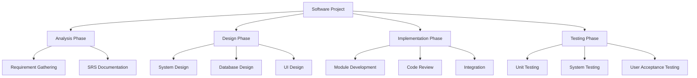

| WBS Level | Description | Example |
|-----------|-------------|---------|
| **Level 1** | Major project phases | Analysis, Design, Implementation |
| **Level 2** | Major deliverables | SRS, Design docs, Code modules |
| **Level 3** | Work packages | Specific tasks and activities |
| **Level 4** | Individual activities | Detailed task breakdown |

**Benefits of WBS:**

- **Clear project scope** definition
- **Better estimation** of time and resources
- **Improved task assignment** and accountability
- **Enhanced progress tracking** and control

**WBS Creation Process:**

- **Identify major deliverables** from project scope
- **Decompose deliverables** into smaller components
- **Continue breakdown** until work packages are manageable
- **Assign responsibilities** for each work package

**Key Principles:**

- **100% Rule**: WBS includes all project work
- **Mutually Exclusive**: No overlap between components
- **Manageable Size**: Work packages should be 8-80 hours

**Mnemonic:** "DEBT" - Decompose, Estimate, Breakdown, Track

---

## Question 3(a) [3 marks]

**Draw the diagram of Incremental Model.**

**Answer**:

The **Incremental Model** develops software in increments, with each increment adding functionality to the previous versions.

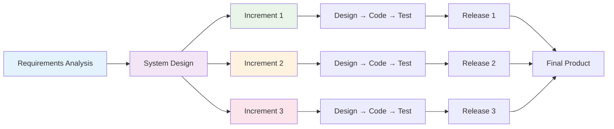

**Key Features:**

- **Core functionality** delivered first
- **Additional features** added incrementally
- **Working software** available early

**Mnemonic:** "IRA" - Incremental, Release, Add features

---

## Question 3(b) [4 marks]

**Difference between functional and non-functional requirements**

**Answer**:

| Aspect | Functional Requirements | Non-Functional Requirements |
|--------|------------------------|----------------------------|
| **Definition** | What the system should do | How the system should perform |
| **Focus** | System behavior and features | System quality attributes |
| **Examples** | Login, data processing, reports | Performance, security, usability |
| **Testing** | Functional testing | Performance, security testing |
| **Documentation** | Use cases, user stories | Quality metrics, constraints |

**Detailed Comparison:**

**Functional Requirements:**

- **User authentication** and authorization
- **Data processing** and calculations
- **Report generation** and export features
- **Business logic** implementation

**Non-Functional Requirements:**

- **Performance**: Response time, throughput
- **Security**: Data encryption, access control
- **Usability**: User interface design, accessibility
- **Reliability**: System availability, fault tolerance

**Examples for Library System:**

- **Functional**: Book search, issue/return books, fine calculation
- **Non-Functional**: Search results in <2 seconds, 99.9% uptime, SSL encryption

**Mnemonic:** "FW vs NH" - Functional What vs Non-functional How

---

## Question 3(c) [7 marks]

**Explain DFD with example.**

**Answer**:

**Data Flow Diagram (DFD)** is a graphical representation showing data flow through a system using processes, data stores, external entities, and data flows.

**DFD Symbols:**

| Symbol | Name | Purpose |
|--------|------|---------|
| Circle/Oval | Process | Data transformation |
| Rectangle | External Entity | Data source/destination |
| Open Rectangle | Data Store | Data storage |
| Arrow | Data Flow | Data movement direction |

**Example: Library Management System**

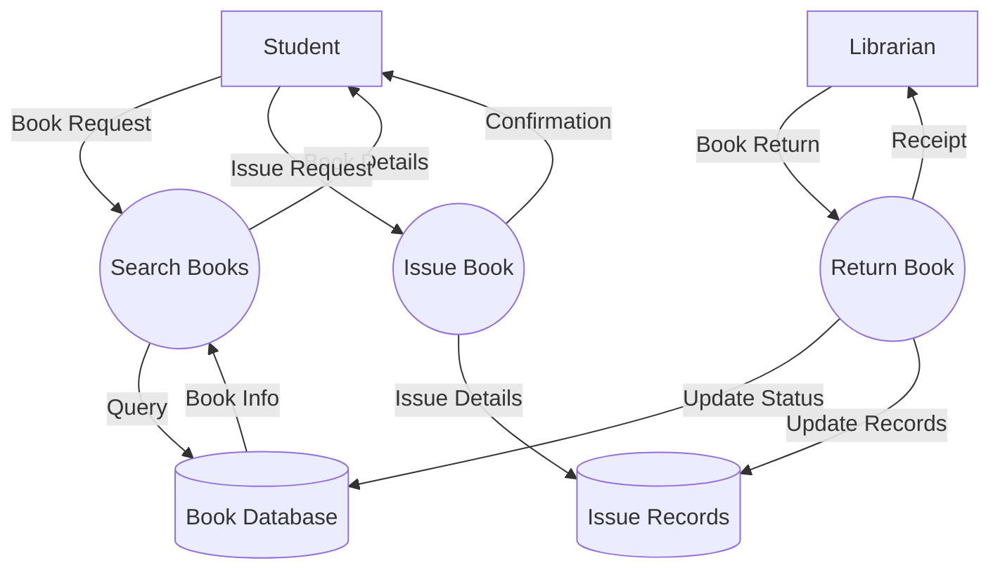

**DFD Levels:**

**Context Diagram (Level 0):**

- **Single process** representing entire system
- **External entities** and major data flows
- **High-level overview** of system boundaries

**Level 1 DFD:**

- **Major processes** of the system
- **Data stores** and their interactions
- **Detailed data flows** between processes

**Level 2 and beyond:**

- **Decomposition** of complex processes
- **More detailed** data transformations
- **Lower-level** process specifications

**DFD Rules:**

- **Process naming**: Use verb + object (e.g., "Validate User")
- **Data flow naming**: Use noun phrases (e.g., "User Details")
- **Balancing**: Input/output must match between levels
- **No direct connections** between external entities

**Benefits:**

- **Clear communication** with stakeholders
- **System boundary** identification
- **Process analysis** and optimization
- **Documentation** for system design

**Mnemonic:** "PEDS" - Process, External entity, Data store, Data flow

---

## Question 3(a) OR [3 marks]

**Write classification of design activities.**

**Answer**:

**Design Activities** are classified based on their scope and purpose in software development.

| Classification | Activities | Purpose |
|----------------|------------|---------|
| **System Design** | Architecture, modules, interfaces | High-level structure |
| **Detailed Design** | Algorithms, data structures | Implementation details |
| **Interface Design** | UI/UX, API specifications | User interaction |
| **Database Design** | Schema, relationships, optimization | Data management |

**Key Design Activities:**

- **Architectural Design**: Overall system structure
- **Component Design**: Individual module specifications
- **Data Design**: Database and file structures

**Mnemonic:** "ACID" - Architectural, Component, Interface, Data design

---

## Question 3(b) OR [4 marks]

**Explain characteristics of good SRS.**

**Answer**:

A **good SRS (Software Requirement Specification)** document should possess specific characteristics for effective communication and development.

| Characteristic | Description | Benefit |
|----------------|-------------|---------|
| **Complete** | All requirements included | No missing functionality |
| **Consistent** | No contradictory requirements | Clear understanding |
| **Unambiguous** | Single interpretation possible | Reduced confusion |
| **Verifiable** | Requirements can be tested | Quality assurance |
| **Modifiable** | Easy to update and maintain | Adaptability |
| **Traceable** | Requirements can be tracked | Change management |

**Detailed Characteristics:**

**Completeness:**

- **All functional** requirements specified
- **All non-functional** requirements included
- **All interfaces** and constraints documented

**Consistency:**

- **No conflicting** requirements
- **Uniform terminology** throughout document
- **Consistent formatting** and structure

**Verifiability:**

- **Testable requirements** with clear criteria
- **Measurable quality** attributes
- **Objective success** criteria defined

**Mnemonic:** "CCUMVT" - Complete, Consistent, Unambiguous, Modifiable, Verifiable, Traceable

---

## Question 3(c) OR [7 marks]

**Explain White box Testing.**

**Answer**:

**White Box Testing** is a testing method that examines the internal structure, code, and logic of software applications.

| Aspect | Description |
|--------|-------------|
| **Also Known As** | Structural testing, Glass box testing, Clear box testing |
| **Access Level** | Full access to source code and internal structure |
| **Focus** | Code coverage, logic paths, internal data structures |
| **Tester Knowledge** | Programming knowledge required |

**White Box Testing Techniques:**

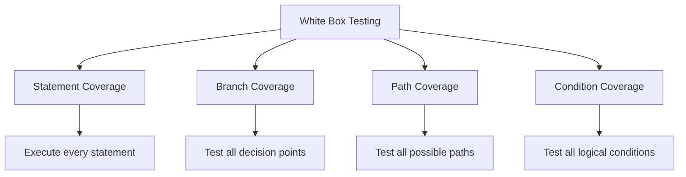

**Coverage Types:**

| Coverage Type | Formula | Description |
|---------------|---------|-------------|
| **Statement Coverage** | (Executed statements / Total statements) × 100% | Tests every line of code |
| **Branch Coverage** | (Executed branches / Total branches) × 100% | Tests all decision outcomes |
| **Path Coverage** | (Executed paths / Total paths) × 100% | Tests all execution paths |
| **Condition Coverage** | (Tested conditions / Total conditions) × 100% | Tests all logical conditions |

**Advantages:**

- **Thorough testing** of code logic
- **Early defect detection** in development
- **Code optimization** opportunities identification
- **Complete code coverage** possible

**Disadvantages:**

- **Expensive and time-consuming** process
- **Requires programming skills** from testers
- **May miss** requirement-related defects
- **Complex for large** applications

**Tools Used:**

- **Code coverage tools** (JaCoCo, gcov)
- **Static analysis tools** (SonarQube)
- **Unit testing frameworks** (JUnit, NUnit)

**Example Test Cases:**

```javascript
// Function to test
function calculateGrade(marks) {
    if (marks >= 90) return 'A';
    else if (marks >= 80) return 'B';
    else if (marks >= 70) return 'C';
    else return 'F';
}

// White box test cases for 100% branch coverage
// Test 1: marks = 95 (A grade path)
// Test 2: marks = 85 (B grade path)  
// Test 3: marks = 75 (C grade path)
// Test 4: marks = 65 (F grade path)
```

**Mnemonic:** "SBPC" - Statement, Branch, Path, Condition coverage

---

## Question 4(a) [3 marks]

**Importance of RAD model.**

**Answer**:

**RAD (Rapid Application Development)** model emphasizes quick development through prototyping and iterative design.

| Importance | Benefit | Application |
|------------|---------|-------------|
| **Fast Development** | Reduced time-to-market | Business applications |
| **User Involvement** | Better requirement understanding | Interactive systems |
| **Prototype-based** | Early feedback and validation | UI-intensive applications |
| **Component Reuse** | Cost reduction and efficiency | Enterprise applications |

**Key Benefits:**

- **Quick delivery** of working prototypes
- **Reduced development** time and costs
- **High user satisfaction** through involvement
- **Flexible to changes** during development

**When to Use RAD:**

- **Well-defined business** requirements
- **Experienced development** team available
- **Modular system** architecture possible

**Mnemonic:** "FUPR" - Fast, User involvement, Prototype-based, Reusable components

---

## Question 4(b) [4 marks]

**Explain code inspection.**

**Answer**:

**Code Inspection** is a systematic examination of source code to identify defects, improve quality, and ensure compliance with standards.

| Type | Description | Participants | Duration |
|------|-------------|--------------|----------|
| **Formal Inspection** | Structured process with defined roles | 3-6 people | 2-4 hours |
| **Walkthrough** | Author-led review session | 2-7 people | 1-2 hours |
| **Peer Review** | Informal colleague review | 2-3 people | 30-60 minutes |
| **Tool-based Review** | Automated code analysis | Individual | Varies |

**Code Inspection Process:**

- **Planning**: Select code, assign roles, schedule meeting
- **Overview**: Author explains code purpose and design
- **Preparation**: Reviewers study code individually
- **Inspection Meeting**: Systematic defect identification
- **Rework**: Author fixes identified issues
- **Follow-up**: Verify defect resolution

**Benefits:**

- **Early defect detection** before testing
- **Knowledge sharing** among team members
- **Code quality improvement** and standardization
- **Reduced maintenance** costs

**Mnemonic:** "FWPT" - Formal, Walkthrough, Peer review, Tool-based

---

## Question 4(c) [7 marks]

**Explain cohesion with its classification.**

**Answer**:

**Cohesion** measures how closely related and focused the responsibilities of a single module are. Higher cohesion indicates better module design.

**Cohesion Types (Ranked from Best to Worst):**

| Type | Description | Example | Strength |
|------|-------------|---------|----------|
| **Functional** | Single, well-defined task | Calculate tax amount | Highest |
| **Sequential** | Output of one element feeds next | Read→Process→Write data | High |
| **Communicational** | Elements operate on same data | Update customer record | High |
| **Procedural** | Elements follow execution sequence | Initialize→Process→Cleanup | Medium |
| **Temporal** | Elements executed at same time | System startup routines | Medium |
| **Logical** | Similar logical functions grouped | All input/output operations | Low |
| **Coincidental** | No meaningful relationship | Random utility functions | Lowest |

**Detailed Classification:**

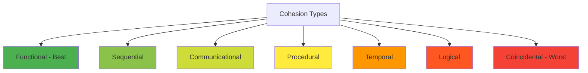

**Functional Cohesion (Best):**

- **Single responsibility** principle
- **Example**: `calculateInterest()` - only calculates interest
- **Benefits**: Easy to understand, test, and maintain

**Sequential Cohesion:**

- **Data flows** from one element to next
- **Example**: `readFile() → parseData() → generateReport()`
- **Good design** for processing pipelines

**Communicational Cohesion:**

- **Same data structure** manipulation
- **Example**: Module updating all fields of customer record
- **Reasonable design** for data-centric operations

**Procedural Cohesion:**

- **Control flow** relationship
- **Example**: Initialization sequence in specific order
- **Acceptable** for procedural operations

**Temporal Cohesion:**

- **Time-based** relationship
- **Example**: System startup or shutdown routines
- **Moderate quality** design

**Logical Cohesion:**

- **Similar functions** grouped together
- **Example**: All mathematical functions in one module
- **Poor design** - difficult to maintain

**Coincidental Cohesion (Worst):**

- **No logical relationship** between elements
- **Example**: Miscellaneous utility functions
- **Avoid this** - creates maintenance nightmares

**Benefits of High Cohesion:**

- **Easier maintenance** and debugging
- **Better reusability** of modules
- **Improved testability** and reliability
- **Clearer code** understanding

**How to Achieve High Cohesion:**

- **Single Responsibility Principle**: One reason to change
- **Clear module purpose**: Well-defined functionality
- **Minimal interfaces**: Reduce external dependencies
- **Logical grouping**: Related functions together

**Mnemonic:** "FSCPTLC" - Functional, Sequential, Communicational, Procedural, Temporal, Logical, Coincidental

---

## Question 4(a) OR [3 marks]

**Software doesn't wear out.**

**Answer**:

**Software doesn't wear out** means software doesn't deteriorate physically like hardware components do over time.

| Aspect | Hardware | Software |
|--------|----------|----------|
| **Physical Degradation** | Components wear out | No physical degradation |
| **Age Effect** | Performance decreases | Performance remains constant |
| **Failure Pattern** | Increasing failure rate | Constant failure rate |
| **Maintenance** | Replace worn parts | Fix logical errors only |

**Key Points:**

- **No mechanical parts** to wear out
- **Logical errors** don't increase with time
- **Performance degradation** due to environment changes, not aging
- **Failures occur** due to design flaws, not wear

**Why This Matters:**

- **Different maintenance** approach needed
- **Focus on updates** rather than replacement
- **Longevity planning** differs from hardware

**Mnemonic:** "NLPF" - No physical parts, Logical errors, Performance constant, Failures from design

---

## Question 4(b) OR [4 marks]

**Explain use-case diagram.**

**Answer**:

**Use-case Diagram** is a UML behavioral diagram showing system functionality from user's perspective through interactions between actors and use cases.

| Component | Symbol | Description |
|-----------|--------|-------------|
| **Actor** | Stick figure | External entity interacting with system |
| **Use Case** | Oval | System function or service |
| **System Boundary** | Rectangle | System scope definition |
| **Relationships** | Lines/Arrows | Associations between components |

**Use-case Diagram Elements:**

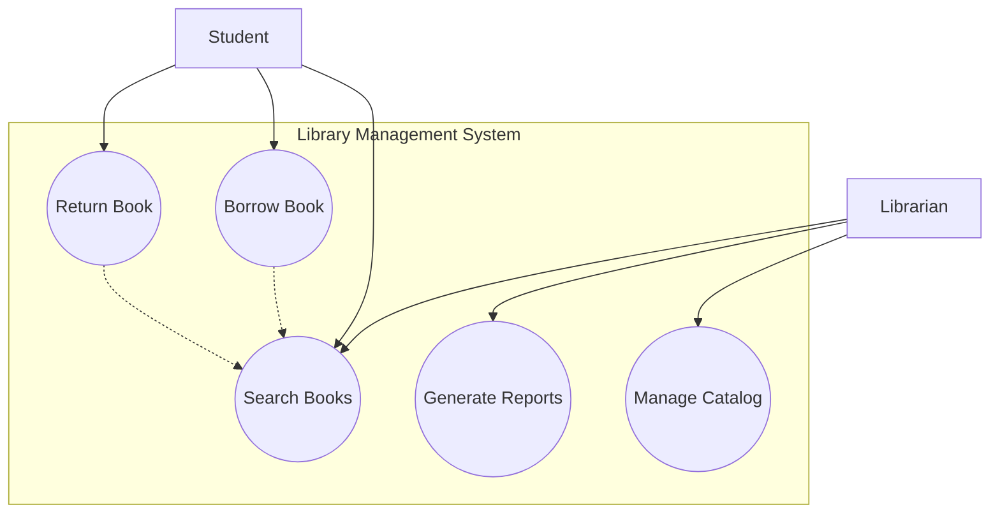

**Relationship Types:**

- **Association**: Actor participates in use case
- **Include**: Use case always includes another use case
- **Extend**: Use case conditionally extends another
- **Generalization**: Inheritance between actors/use cases

**Benefits:**

- **Clear system scope** definition
- **User requirements** visualization
- **Communication tool** with stakeholders
- **Test case** derivation basis

**Mnemonic:** "AUSB" - Actor, Use case, System boundary, Relationships

---

## Question 4(c) OR [7 marks]

**Explain Black box Testing.**

**Answer**:

**Black Box Testing** is a testing method that examines software functionality without knowledge of internal code structure or implementation details.

| Aspect | Description |
|--------|-------------|
| **Also Known As** | Functional testing, Behavioral testing, Specification-based testing |
| **Access Level** | No access to source code or internal structure |
| **Focus** | Input-output behavior, functional requirements |
| **Tester Knowledge** | Domain knowledge required, not programming |

**Black Box Testing Techniques:**

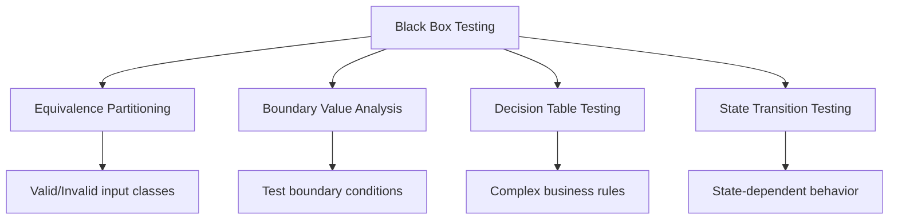

**Testing Techniques:**

| Technique | Description | Example |
|-----------|-------------|---------|
| **Equivalence Partitioning** | Divide inputs into valid/invalid groups | Age: 0-17, 18-60, 60+ |
| **Boundary Value Analysis** | Test at boundaries of input ranges | Test at 17, 18, 60, 61 |
| **Decision Table** | Test combinations of conditions | Login with valid/invalid user/password |
| **State Transition** | Test state changes | ATM states: Idle→Card inserted→PIN entry |

**Test Case Design Example:**

```
Function: Login validation
Inputs: Username, Password
Valid equivalence classes:
- Username: 5-20 characters, alphanumeric
- Password: 8-15 characters, special chars allowed

Invalid equivalence classes:
- Username: <5 or >20 characters, special chars
- Password: <8 or >15 characters, spaces

Boundary values to test:
- Username: 4, 5, 20, 21
- Password: 7, 8, 15, 16
```

**Advantages:**

- **No programming knowledge** required for testers
- **User perspective** testing approach
- **Independent verification** of requirements
- **Effective for** large applications

**Disadvantages:**

- **Limited code coverage** visibility
- **Cannot identify** unused code paths
- **Difficult to design** test cases without specifications
- **May miss** logical errors in code

**Types of Black Box Testing:**

- **Functional Testing**: Feature verification
- **Integration Testing**: Module interaction testing
- **System Testing**: Complete system validation
- **Acceptance Testing**: User requirement verification

**Tools Used:**

- **Test management tools** (TestRail, Zephyr)
- **Automation tools** (Selenium, QTP)
- **Defect tracking tools** (Jira, Bugzilla)

**When to Use:**

- **Requirements-based** testing
- **User acceptance** testing
- **System integration** testing
- **Regression testing** after changes

**Mnemonic:** "EBDS" - Equivalence, Boundary, Decision table, State transition

---

## Question 5(a) [3 marks]

**Difference between verification and validation.**

**Answer**:

| Aspect | Verification | Validation |
|--------|--------------|------------|
| **Definition** | "Are we building the product right?" | "Are we building the right product?" |
| **Focus** | Process compliance | Product correctness |
| **When** | During development | After development |
| **Method** | Reviews, inspections, walkthroughs | Testing with actual data |
| **Cost** | Lower cost of defect detection | Higher cost of defect detection |

**Key Differences:**

- **Verification**: Checks against **specifications**
- **Validation**: Checks against **user needs**
- **Verification**: **Static testing** methods
- **Validation**: **Dynamic testing** methods

**Examples:**

- **Verification**: Code review, design review, SRS review
- **Validation**: Unit testing, integration testing, system testing

**Mnemonic:** "VR vs VT" - Verification Reviews vs Validation Testing

---

## Question 5(b) [4 marks]

**Explain SRS.**

**Answer**:

**SRS (Software Requirement Specification)** is a detailed document describing the functional and non-functional requirements of a software system.

| Component | Description | Purpose |
|-----------|-------------|---------|
| **Introduction** | System overview and scope | Context setting |
| **Functional Requirements** | What system should do | Feature specification |
| **Non-functional Requirements** | How system should perform | Quality attributes |
| **Constraints** | Limitations and restrictions | Boundary definition |

**SRS Structure:**

- **System Purpose**: Why the system is needed
- **System Scope**: What the system will and won't do
- **Definitions**: Technical terms and acronyms
- **User Requirements**: High-level user needs
- **System Requirements**: Detailed technical specifications

**Importance of SRS:**

- **Communication tool** between stakeholders
- **Baseline for testing** and validation
- **Contract basis** between client and developer
- **Change management** reference document

**Users of SRS:**

- **Developers**: Implementation guidance
- **Testers**: Test case creation
- **Project Managers**: Planning and tracking
- **Clients**: Requirement verification

**Mnemonic:** "IFNC" - Introduction, Functional, Non-functional, Constraints

---

## Question 5(c) [7 marks]

**Explain Risk Management.**

**Answer**:

**Risk Management** is the systematic process of identifying, analyzing, and responding to project risks to minimize their impact on project success.

**Risk Management Process:**

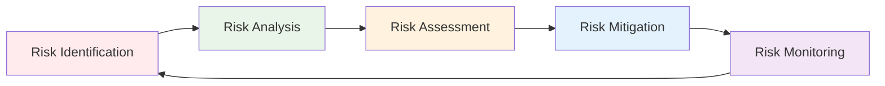

| Phase | Activities | Output |
|-------|------------|--------|
| **Identification** | Brainstorming, checklists, expert judgment | Risk register |
| **Analysis** | Probability and impact assessment | Risk matrix |
| **Assessment** | Risk prioritization and ranking | Risk priority list |
| **Mitigation** | Response strategy development | Mitigation plans |
| **Monitoring** | Track risks and mitigation effectiveness | Status reports |

**Risk Categories:**

**Project Risks:**

- **Schedule delays** due to resource unavailability
- **Budget overruns** from scope changes
- **Team turnover** affecting productivity
- **Communication gaps** between stakeholders

**Technical Risks:**

- **Technology complexity** exceeding team skills
- **Integration challenges** with existing systems
- **Performance issues** under load conditions
- **Security vulnerabilities** in design

**Business Risks:**

- **Changing requirements** from market conditions
- **Competition** releasing similar products
- **Regulatory changes** affecting compliance
- **Stakeholder conflicts** on priorities

**Risk Response Strategies:**

| Strategy | Description | When to Use | Example |
|----------|-------------|-------------|---------|
| **Accept** | Acknowledge risk, no action | Low impact risks | Minor UI changes |
| **Avoid** | Eliminate risk source | High impact, avoidable | Change technology |
| **Mitigate** | Reduce probability/impact | Manageable risks | Additional testing |
| **Transfer** | Shift risk to third party | Specialized risks | Insurance, outsourcing |

**Risk Assessment Matrix:**

| Probability/Impact | Low | Medium | High |
|-------------------|-----|--------|------|
| **High** | Medium | High | Critical |
| **Medium** | Low | Medium | High |
| **Low** | Very Low | Low | Medium |

**Risk Mitigation Techniques:**

- **Prototyping** to reduce technical uncertainty
- **Staff training** to address skill gaps
- **Regular reviews** to catch issues early
- **Contingency planning** for critical scenarios

**Benefits of Risk Management:**

- **Proactive problem** prevention
- **Better decision** making with risk awareness
- **Improved project** success rates
- **Stakeholder confidence** in project delivery

**Risk Monitoring Activities:**

- **Regular risk reviews** and updates
- **Risk trigger monitoring** for early warning
- **Mitigation plan** progress tracking
- **New risk identification** as project evolves

**Tools for Risk Management:**

- **Risk registers** and databases
- **Risk assessment** matrices
- **Monte Carlo** simulation for quantitative analysis
- **Expert judgment** and historical data

**Key Success Factors:**

- **Management commitment** to risk processes
- **Team awareness** and participation
- **Regular communication** about risks
- **Integration** with project management processes

**Mnemonic:** "IATMM" - Identify, Analyze, Assess, Treat, Monitor risks

---

## Question 5(a) OR [3 marks]

**List out any functional requirements for Hostel management system.**

**Answer**:

**Functional Requirements** for Hostel Management System define what the system should do to manage hostel operations effectively.

| Module | Functional Requirements |
|--------|------------------------|
| **Student Management** | Register students, assign rooms, maintain profiles |
| **Room Management** | Room allocation, availability tracking, maintenance |
| **Fee Management** | Fee calculation, payment processing, receipt generation |
| **Visitor Management** | Visitor registration, entry/exit tracking, approval |

**Detailed Functional Requirements:**

**Student Module:**

- **Student registration** with personal details
- **Room assignment** based on availability
- **Student profile** management and updates

**Administrative Module:**

- **Staff management** and role assignment
- **Report generation** for occupancy and finances
- **Complaint management** and resolution tracking

**Security Module:**

- **Access control** for different user types
- **Visitor logging** and approval system
- **Emergency contact** management

**Mnemonic:** "SRFV" - Student, Room, Fee, Visitor management

---

## Question 5(b) OR [4 marks]

**Explain Agile process.**

**Answer**:

**Agile Process** is an iterative and incremental software development approach emphasizing collaboration, flexibility, and customer satisfaction.

| Agile Principle | Description | Benefit |
|----------------|-------------|---------|
| **Customer Collaboration** | Continuous customer involvement | Better requirement understanding |
| **Working Software** | Deliver functional software frequently | Early value delivery |
| **Responding to Change** | Adapt to changing requirements | Market responsiveness |
| **Individuals and Interactions** | People over processes and tools | Better team dynamics |

**Agile Values:**

- **Individuals and interactions** over processes and tools
- **Working software** over comprehensive documentation
- **Customer collaboration** over contract negotiation
- **Responding to change** over following a plan

**Agile Practices:**

- **Short iterations** (1-4 weeks)
- **Daily standups** for team coordination
- **Sprint planning** and review meetings
- **Continuous integration** and testing

**Benefits:**

- **Faster delivery** of working software
- **Better quality** through continuous testing
- **Improved stakeholder** satisfaction
- **Flexibility** to handle changes

**Mnemonic:** "CWRI" - Customer collaboration, Working software, Responding to change, Individuals

---

## Question 5(c) OR [7 marks]

**Explain Software Engineering - A layered approach**

**Answer**:

**Software Engineering - A Layered Approach** represents software engineering as a structured methodology with multiple interconnected layers, each building upon the foundation of lower layers.

**Layered Architecture:**

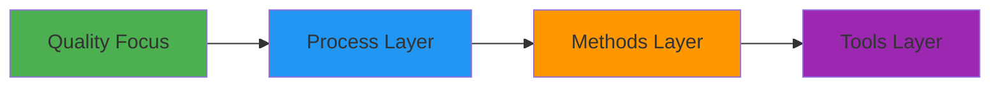

| Layer | Description | Purpose | Examples |
|-------|-------------|---------|----------|
| **Quality Focus** | Foundation emphasizing quality | Ensures customer satisfaction | Quality standards, metrics |
| **Process** | Framework for software development | Provides structure and control | SDLC models, project management |
| **Methods** | Technical approaches and techniques | Guides development activities | Analysis, design, testing methods |
| **Tools** | Automated support for methods | Increases productivity | IDEs, testing tools, CASE tools |

**Detailed Layer Analysis:**

**Quality Focus (Foundation Layer):**

- **Bedrock of software engineering** approach
- **Commitment to quality** in all activities
- **Customer satisfaction** as primary goal
- **Continuous improvement** mindset
- **Quality characteristics**: Correctness, reliability, efficiency, maintainability

**Process Layer:**

- **Defines framework** for effective delivery
- **Establishes context** for technical methods
- **Key elements**: Communication, planning, modeling, construction, deployment
- **Process models**: Waterfall, Agile, Spiral, Incremental
- **Management activities**: Project planning, tracking, risk management

**Methods Layer:**

- **Technical knowledge** for building software
- **Encompasses broad array** of tasks
- **Communication methods**: Requirement elicitation, analysis
- **Planning methods**: Project estimation, scheduling
- **Modeling methods**: Analysis and design techniques
- **Construction methods**: Coding standards, testing strategies
- **Deployment methods**: Delivery, support, feedback

**Tools Layer:**

- **Automated or semi-automated** support
- **Increases efficiency** and reduces errors
- **Tool categories**:
  - **Development environments**: IDEs, compilers
  - **Analysis and design tools**: UML tools, CASE tools
  - **Testing tools**: Unit testing, automation frameworks
  - **Project management tools**: Scheduling, tracking software

**Interactions Between Layers:**

**Quality ↔ Process:**

- Quality focus **drives process** selection
- Process **ensures quality** delivery

**Process ↔ Methods:**

- Process **provides context** for methods
- Methods **implement process** activities

**Methods ↔ Tools:**

- Methods **define what** needs to be done
- Tools **provide how** to do it efficiently

**Benefits of Layered Approach:**

- **Systematic methodology** for software development
- **Scalability** from small to large projects
- **Flexibility** to adapt tools and methods
- **Quality assurance** at every level
- **Risk reduction** through structured approach

**Implementation Strategy:**

- **Start with quality focus** establishment
- **Select appropriate process** for project context
- **Choose methods** matching process requirements
- **Integrate tools** supporting selected methods
- **Continuous evaluation** and improvement

**Key Success Factors:**

- **Management commitment** to quality
- **Team training** on methods and tools
- **Process adherence** and discipline
- **Tool integration** and standardization
- **Continuous improvement** culture

**Real-world Application:**

- **Large organizations**: Complete layer implementation
- **Small teams**: Simplified but consistent approach
- **Project-specific**: Tailored layer selection
- **Industry standards**: Compliance with quality frameworks

**Mnemonic:** "QPMT" - Quality focus, Process, Methods, Tools (from bottom to top)
