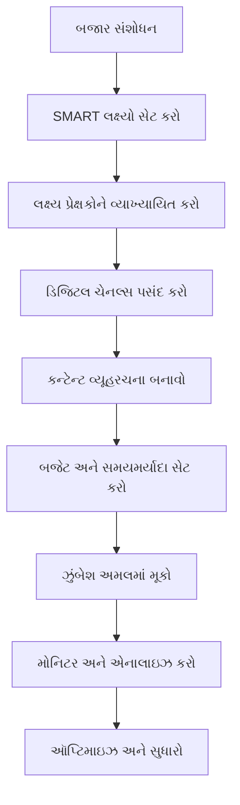
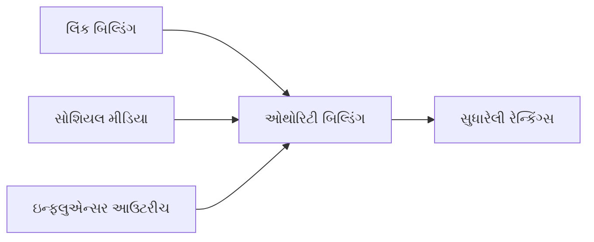
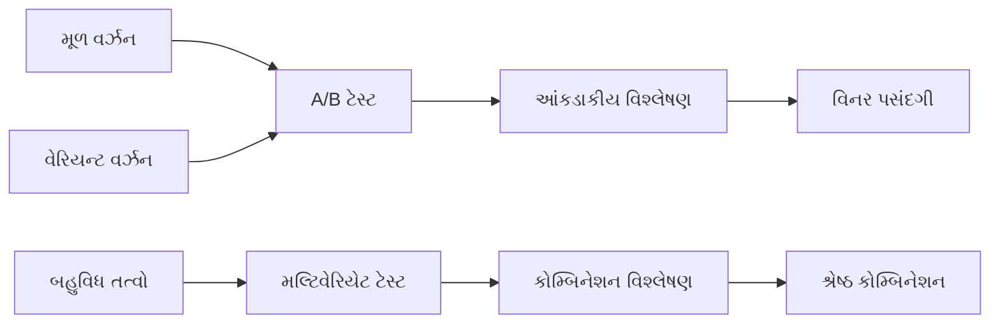
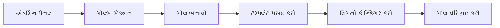
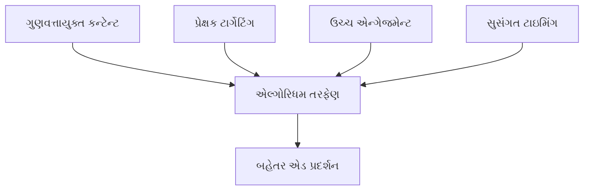
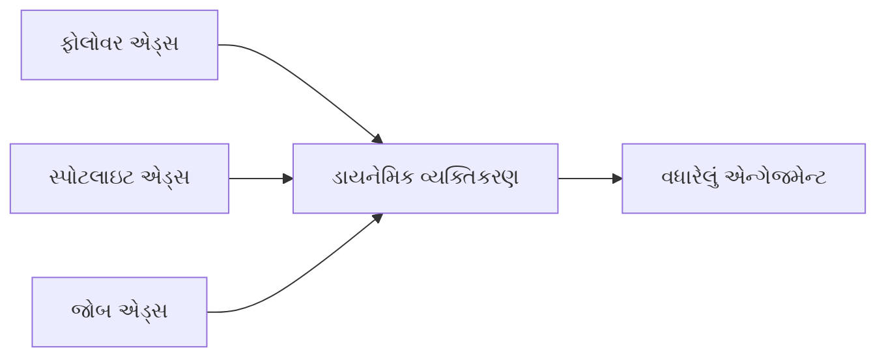
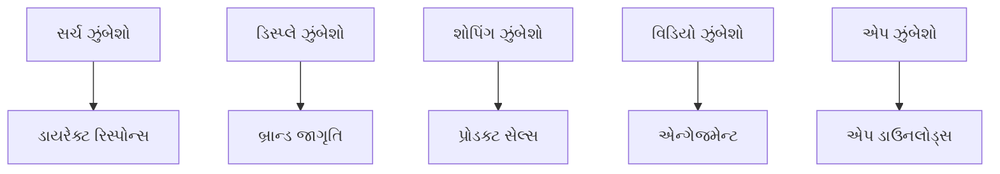

## પ્રશ્ન 1(a) [3 ગુણ]

**ડિજિટલ માર્કેટિંગમાં કારકિર્દી બનાવવા માટે વ્યક્તિ પાસે કઈ વિશિષ્ટ કુશળતા હોવી જોઈએ?**

**ઉત્તર**:

| કુશળતાની શ્રેણી | જરૂરી કુશળતાઓ |
|----------------|-----------------|
| **ટેકનિકલ સ્કિલ્સ** | SEO/SEM, Google Analytics, સોશિયલ મીડિયા મેનેજમેન્ટ |
| **ક્રિએટિવ સ્કિલ્સ** | કન્ટેન્ટ ક્રિએશન, ગ્રાફિક ડિઝાઇન, વિડિયો એડિટિંગ |
| **એનાલિટિકલ સ્કિલ્સ** | ડેટા એનાલિસિસ, રિપોર્ટ જનરેશન, પર્ફોર્મન્સ મેટ્રિક્સ |
| **કમ્યુનિકેશન** | લેખન, પ્રેઝન્ટેશન, કસ્ટમર એન્ગેજમેન્ટ |

**મુખ્ય કુશળતાઓ**:

- **SEO ઑપ્ટિમાઇઝેશન**: સર્ચ એલ્ગોરિધમ અને કીવર્ડ રિસર્ચની સમજ
- **એનાલિટિક્સ ટૂલ્સ**: Google Analytics, Facebook Insights માં પ્રાવીણ્ય
- **કન્ટેન્ટ માર્કેટિંગ**: આકર્ષક પોસ્ટ્સ, બ્લોગ્સ અને મલ્ટિમીડિયા કન્ટેન્ટ બનાવવું
- **સોશિયલ મીડિયા**: પ્લેટફોર્મ-વિશિષ્ટ વ્યૂહરચના અને કમ્યુનિટી મેનેજમેન્ટ

**મેમરી ટ્રીક:** "SCAP" - Strategic, Creative, Analytical, Promotional

---

## પ્રશ્ન 1(b) [4 ગુણ]

**તફાવત કરો: SEO માં ઑન-પેજ અને ઑફ-પેજ ઑપ્ટિમાઇઝેશન.**

**ઉત્તર**:

| પાસું | ઑન-પેજ SEO | ઑફ-પેજ SEO |
|------|-------------|-------------|
| **વ્યાખ્યા** | વેબસાઇટની અંદર ઑપ્ટિમાઇઝેશન | વેબસાઇટની બહાર ઑપ્ટિમાઇઝેશન |
| **નિયંત્રણ** | સંપૂર્ણ નિયંત્રણ | મર્યાદિત નિયંત્રણ |
| **ફોકસ** | કન્ટેન્ટ, HTML, સાઇટ સ્ટ્રક્ચર | બેકલિંક્સ, સોશિયલ સિગ્નલ્સ |
| **ઉદાહરણો** | મેટા ટેગ્સ, કીવર્ડ્સ, URL સ્ટ્રક્ચર | લિંક બિલ્ડિંગ, સોશિયલ મીડિયા મેન્શન્સ |

**મુખ્ય તફાવતો**:

- **ઑન-પેજ**: ટાઇટલ ટેગ્સ, મેટા વર્ણનો, ઇન્ટર્નલ લિંકિંગ, કન્ટેન્ટ ગુણવત્તા
- **ઑફ-પેજ**: બેકલિંક એક્વિઝિશન, સોશિયલ મીડિયા માર્કેટિંગ, ગેસ્ટ પોસ્ટિંગ
- **સમયમર્યાદા**: ઑન-પેજ ઝડપી પરિણામો આપે છે, ઑફ-પેજ લાંબા ગાળાની ઓથોરિટી બનાવે છે
- **ખર્ચ**: ઑન-પેજને સમયનું રોકાણ, ઑફ-પેજને નાણાકીય રોકાણની જરૂર

**મેમરી ટ્રીક:** "અંદર-બહાર" - ઑન-પેજ તમારા નિયંત્રણમાં, ઑફ-પેજ બહારના નિયંત્રણમાં

---

## પ્રશ્ન 1(c) [7 ગુણ]

**વ્યવસાય સફળ ડિજિટલ માર્કેટિંગ યોજના કેવી રીતે વિકસાવી શકે? યોગ્ય ઉદાહરણ સાથે સમજાવો.**

**ઉત્તર**:



**ડિજિટલ માર્કેટિંગ પ્લાન માટેના પગલાં**:

- **બજાર વિશ્લેષણ**: સ્પર્ધકો, ઇન્ડસ્ટ્રી ટ્રેન્ડ્સ, ગ્રાહક વર્તનનું સંશોધન
- **લક્ષ્ય નિર્ધારણ**: બ્રાન્ડ જાગૃતિ 30% વધારવી, માસિક 500 ક્વોલિફાઇડ લીડ્સ જનરેટ કરવા
- **પ્રેક્ષક વ્યાખ્યા**: ડેમોગ્રાફિક્સ અને પસંદગીઓ સાથે બાયર પર્સોનાસ બનાવવા
- **ચેનલ પસંદગી**: યોગ્ય પ્લેટફોર્મ્સ પસંદ કરવા (Facebook, Google Ads, ઇમેઇલ)

**ઉદાહરણ - ઑનલાઇન કપડાની દુકાન**:

- **લક્ષ્ય**: 25-40 વર્ષની મહિલાઓ જે ટકાઉ ફેશનમાં રસ ધરાવે છે
- **ચેનલ્સ**: Instagram (વિઝ્યુઅલ કન્ટેન્ટ), Google Ads (સર્ચ ઇન્ટેન્ટ), ઇમેઇલ માર્કેટિંગ
- **કન્ટેન્ટ**: સ્ટાઇલિંગ ટિપ્સ, ટકાઉપણાની વાર્તાઓ, ગ્રાહક પ્રશંસાપત્રો
- **બજેટ**: 40% સોશિયલ મીડિયા, 35% સર્ચ એડ્સ, 25% કન્ટેન્ટ ક્રિએશન

**મેમરી ટ્રીક:** "MAPCODE" - Market research, Audience, Plan, Channels, Operations, Data, Evaluation

---

## પ્રશ્ન 1(c OR) [7 ગુણ]

**P.O.E.M ના પ્રાથમિક તત્વો શું છે? ડિજિટલ માર્કેટિંગ વ્યૂહરચના માટેનું માળખું, અને તે વ્યવસાયમાં કેવી રીતે લાગુ કરી શકાય?**

**ઉત્તર**:

| તત્વ | વર્ણન | વ્યવસાયિક ઉપયોગ |
|------|-------|------------------|
| **Paid** | જાહેરાત ખર્ચ | Google Ads, Facebook Ads, YouTube ads |
| **Owned** | બ્રાન્ડ-નિયંત્રિત કન્ટેન્ટ | વેબસાઇટ, બ્લોગ, ઇમેઇલ લિસ્ટ, મોબાઇલ એપ |
| **Earned** | ગ્રાહક-જનરેટેડ કન્ટેન્ટ | રિવ્યૂઝ, શેર્સ, મેન્શન્સ, વાયરલ કન્ટેન્ટ |
| **Managed** | નિયંત્રિત તૃતીય-પક્ષ | ઇન્ફ્લુએન્સર પાર્ટનરશિપ્સ, એફિલિએટ માર્કેટિંગ |

**ફ્રેમવર્કના ફાયદા**:

- **સંકલિત અભિગમ**: મહત્તમ પ્રભાવ માટે બધા માર્કેટિંગ ટચપોઇન્ટ્સને જોડે છે
- **ખર્ચ ઑપ્ટિમાઇઝેશન**: પેઇડ એડવર્ટાઇઝિંગને ઓર્ગેનિક કન્ટેન્ટ સાથે સંતુલિત કરે છે
- **પ્રેક્ષકોની પહોંચ**: બહુવિધ ચેનલ્સ અને પાર્ટનરશિપ્સ દ્વારા પહોંચ વધારે છે
- **વિશ્વસનીયતા નિર્માણ**: Earned મીડિયા અધિકૃત ગ્રાહક વેલિડેશન પ્રદાન કરે છે

**વ્યવસાયિક ઉપયોગનું ઉદાહરણ**:

- **Paid**: તાત્કાલિક દૃશ્યતા માટે Google સર્ચ એડ્સ
- **Owned**: SEO-ઑપ્ટિમાઇઝ્ડ કન્ટેન્ટ સાથે કંપની બ્લોગ
- **Earned**: ગ્રાહક રિવ્યૂઝ અને સોશિયલ મીડિયા શેર્સ
- **Managed**: ઇન્ફ્લુએન્સર કોલેબોરેશન્સ અને એફિલિએટ પ્રોગ્રામ્સ

**મેમરી ટ્રીક:** "POEM Creates Marketing Magic"

---

## પ્રશ્ન 2(a) [3 ગુણ]

**સિંગલ-ટચ અને મલ્ટિ-ટચ એટ્રિબ્યુશન મોડલ્સ વચ્ચે તફાવત કરો.**

**ઉત્તર**:

| એટ્રિબ્યુશન પ્રકાર | સિંગલ-ટચ | મલ્ટિ-ટચ |
|-------------------|-----------|------------|
| **ક્રેડિટ અસાઇનમેન્ટ** | એક ટચપોઇન્ટને 100% ક્રેડિટ | બહુવિધ ટચપોઇન્ટ્સમાં ક્રેડિટ વિતરણ |
| **જટિલતા** | સમજવું સરળ | વધુ જટિલ વિશ્લેષણ |
| **ચોકસાઈ** | લાંબા સેલ્સ સાઇકલ માટે ઓછી ચોકસાઈ | ગ્રાહક યાત્રાનું વધુ ચોકસાઈ પૂર્ણ પ્રતિનિધિત્વ |
| **ઉદાહરણો** | First-click, Last-click | Linear, Time-decay, Position-based |

**મુખ્ય તફાવતો**:

- **સિંગલ-ટચ**: કન્વર્ઝન સાથે માત્ર પ્રથમ અથવા છેલ્લી ક્રિયાપ્રતિક્રિયાને ક્રેડિટ આપે છે
- **મલ્ટિ-ટચ**: કન્વર્ઝનમાં ફાળો આપતા બધા ટચપોઇન્ટ્સને ઓળખે છે
- **ઉપયોગના કેસેસ**: સરળ ખરીદીઓ માટે સિંગલ-ટચ, જટિલ B2B સેલ્સ માટે મલ્ટિ-ટચ

**મેમરી ટ્રીક:** "Single Shot vs Multiple Steps"

---

## પ્રશ્ન 2(b) [4 ગુણ]

**કીવર્ડ સંશોધન, ઑન-પેજ ઑપ્ટિમાઇઝેશન અને ઑફ-પેજ ઑપ્ટિમાઇઝેશન યુક્તિઓ સહિત નવી લૉન્ચ થયેલી ઇ-કૉમર્સ વેબસાઇટ માટે SEO વ્યૂહરચના વિકસાવો.**

**ઉત્તર**:

**SEO વ્યૂહરચના ફ્રેમવર્ક**:

```goat
┌─────────────────┐    ┌─────────────────┐    ┌─────────────────┐
│  Keyword        │    │  On-Page        │    │  Off-Page       │
│  Research       │───▶│  Optimization   │───▶│  Optimization   │
└─────────────────┘    └─────────────────┘    └─────────────────┘
│                      │                      │
▼                      ▼                      ▼
• Tool Analysis        • Title Tags           • Link Building
• Competitor Study     • Meta Descriptions    • Social Signals
• Long-tail Keywords   • URL Structure        • Guest Posting
• Search Volume        • Internal Linking     • Directory Listings
```

**અમલીકરણના પગલાં**:

- **કીવર્ડ સંશોધન**: Google Keyword Planner નો ઉપયોગ કરો, કમર્શિયલ ઇન્ટેન્ટ સાથે લોંગ-ટેઇલ કીવર્ડ્સ પર ફોકસ કરો
- **ઑન-પેજ**: અનન્ય ટાઇટલ્સ, વર્ણનો અને સ્કીમા માર્કઅપ સાથે પ્રોડક્ટ પેજેસ ઑપ્ટિમાઇઝ કરો
- **ઑફ-પેજ**: કન્ટેન્ટ માર્કેટિંગ અને ઇન્ડસ્ટ્રી પાર્ટનરશિપ્સ દ્વારા ગુણવત્તાયુક્ત બેકલિંક્સ બનાવો
- **ટેકનિકલ**: ઝડપી લોડિંગ સ્પીડ, મોબાઇલ રિસ્પોન્સિવનેસ અને SSL સર્ટિફિકેટ સુનિશ્ચિત કરો

**મેમરી ટ્રીક:** "Research, Optimize, Build, Measure"

---

## પ્રશ્ન 2(c) [7 ગુણ]

**SEO ને અસર કરતા પરિબળો અને તેઓ સર્ચ એન્જિન રેન્કિંગને કેવી રીતે અસર કરે છે તે સમજાવો.**

**ઉત્તર**:

| પરિબળની શ્રેણી | વિશિષ્ટ પરિબળો | રેન્કિંગ્સ પર અસર |
|----------------|----------------|------------------|
| **કન્ટેન્ટ ગુણવત્તા** | સુસંગતતા, મૌલિકતા, ઊંડાઈ | ઉચ્ચ - પ્રાથમિક રેન્કિંગ પરિબળ |
| **ટેકનિકલ SEO** | સાઇટ સ્પીડ, મોબાઇલ-ફ્રેન્ડલી, SSL | ઉચ્ચ - યુઝર એક્સપિરિયન્સ સિગ્નલ્સ |
| **ઓથોરિટી** | બેકલિંક્સ, ડોમેઇન ઓથોરિટી | ઉચ્ચ - વિશ્વાસ અને વિશ્વસનીયતા |
| **યુઝર એક્સપિરિયન્સ** | બાઉન્સ રેટ, ડ્વેલ ટાઇમ, CTR | મધ્યમ - વર્તણૂકીય સિગ્નલ્સ |

**વિગતવાર પરિબળો**:

- **કન્ટેન્ટ સુસંગતતા**: સર્ચ એન્જિન્સ યુઝર ઇન્ટેન્ટ સાથે મેળ ખાતા કન્ટેન્ટને પ્રાથમિકતા આપે છે
- **પેજ લોડિંગ સ્પીડ**: 3 સેકન્ડથી ઓછા સમયમાં લોડ થતી સાઇટ્સ ઉચ્ચ રેન્ક પામે છે
- **મોબાઇલ ઑપ્ટિમાઇઝેશન**: મોબાઇલ-ફર્સ્ટ ઇન્ડેક્સિંગ રિસ્પોન્સિવ ડિઝાઇનને અહમ બનાવે છે
- **બેકલિંક ગુણવત્તા**: ઉચ્ચ-ઓથોરિટી લિંક્સ ડોમેઇન વિશ્વસનીયતા સુધારે છે

**અસરની પદ્ધતિ**:

- **એલ્ગોરિધમ અપડેટ્સ**: Google ના એલ્ગોરિધમ્સ આ પરિબળોનું સતત મૂલ્યાંકન કરે છે
- **યુઝર વર્તન**: સકારાત્મક યુઝર સિગ્નલ્સ સારી રેન્કિંગ્સને મજબૂત બનાવે છે
- **સ્પર્ધા**: સ્પર્ધકો સામે સંબંધિત પ્રદર્શન પોઝિશનિંગને અસર કરે છે

**મેમરી ટ્રીક:** "Content, Technical, Authority, User Experience" (CTAU)

---

## પ્રશ્ન 2(a OR) [3 ગુણ]

**વેબસાઇટ એનાલિટિક્સમાં ડેટા એકત્ર કરવાની વિવિધ પદ્ધતિઓ શું છે?**

**ઉત્તર**:

| એકત્રીકરણ પદ્ધતિ | વર્ણન | ઉપયોગનો કેસ |
|------------------|--------|-------------|
| **પેજ ટેગિંગ** | JavaScript ટ્રેકિંગ કોડ્સ | રિયલ-ટાઇમ યુઝર વર્તન |
| **વેબ લોગ ફાઇલ્સ** | સર્વર-સાઇડ ડેટા એકત્રીકરણ | ટેકનિકલ પર્ફોર્મન્સ એનાલિસિસ |
| **પેકેટ સ્નિફિંગ** | નેટવર્ક ટ્રાફિક મોનિટરિંગ | એન્ટરપ્રાઇઝ-લેવલ ટ્રેકિંગ |
| **હાઇબ્રિડ એપ્રોચ** | પદ્ધતિઓનું સંયોજન | વ્યાપક એનાલિટિક્સ |

**પદ્ધતિઓની ઝાંખી**:

- **JavaScript ટેગ્સ**: Google Analytics કોડ વાપરતી સૌથી સામાન્ય પદ્ધતિ
- **સર્વર લોગ્સ**: ક્લાઇન્ટ-સાઇડ ડિપેન્ડન્સી વિના સીધો સર્વર ડેટા
- **API ઇન્ટિગ્રેશન**: થર્ડ-પાર્ટી ડેટા સોર્સેસ અને CRM ઇન્ટિગ્રેશન

**મેમરી ટ્રીક:** "Page, Log, Packet, Hybrid" (PLPH)

---

## પ્રશ્ન 2(b OR) [4 ગુણ]

**નવી લૉન્ચ થયેલી વેબસાઇટ માટે ઑફ-પેજ ઑપ્ટિમાઇઝેશન પ્લાન બનાવો, બેકલિંક્સ બનાવવા માટેની વ્યૂહરચનાઓની રૂપરેખા આપો, સોશિયલ મીડિયા માર્કેટિંગમાં સામેલ થાઓ અને તેના સર્ચ એન્જિન રેન્કિંગ અને ઑનલાઇન હાજરીને સુધારવા માટે પ્રભાવશાળી આઉટરીચનો લાભ લો.**

**ઉત્તર**:

**ઑફ-પેજ ઑપ્ટિમાઇઝેશન પ્લાન**:



**વ્યૂહરચનાના ઘટકો**:

- **લિંક બિલ્ડિંગ**: ઇન્ડસ્ટ્રી બ્લોગ્સ પર ગેસ્ટ પોસ્ટિંગ, રિસોર્સ પેજ લિસ્ટિંગ્સ, બ્રોકન લિંક બિલ્ડિંગ
- **સોશિયલ મીડિયા માર્કેટિંગ**: પ્લેટફોર્મ્સ પર કન્ટેન્ટ શેર કરો, ઇન્ડસ્ટ્રી કમ્યુનિટીઝ સાથે જોડાવ
- **ઇન્ફ્લુએન્સર આઉટરીચ**: મેન્શન્સ અને રિવ્યૂઝ માટે ઇન્ડસ્ટ્રી એક્સપર્ટ્સ સાથે સહયોગ
- **ડિરેક્ટરી સબમિશન્સ**: સંબંધિત બિઝનેસ ડિરેક્ટરીઝ અને લોકલ લિસ્ટિંગ્સમાં સબમિટ કરો

**અમલીકરણની સમયમર્યાદા**:

1. **મહિનો 1**: સોશિયલ પ્રોફાઇલ્સ સેટ કરો, લિંક તકો ઓળખો
2. **મહિનો 2-3**: ગેસ્ટ પોસ્ટિંગ, ઇન્ફ્લુએન્સર આઉટરીચ એક્ઝિક્યુટ કરો
3. **મહિનો 4+**: પરિણામોનું મોનિટરિંગ કરો, સફળ યુક્તિઓનું સ્કેલ કરો

**મેમરી ટ્રીક:** "Build Links, Engage Socially, Influence Others" (BLEO)

---

## પ્રશ્ન 2(c OR) [7 ગુણ]

**વ્યવસાયો તેમના SEO રેન્કિંગને સુધારવા માટે સોશિયલ મીડિયાનો ઉપયોગ કેવી રીતે કરી શકે છે? યોગ્ય ઉદાહરણ સાથે સમજાવો.**

**ઉત્તર**:

**સોશિયલ મીડિયા SEO ફાયદા**:

| સોશિયલ સિગ્નલ | SEO અસર | અમલીકરણ |
|---------------|----------|-----------|
| **કન્ટેન્ટ શેરિંગ** | વધેલી દૃશ્યતા અને બેકલિંક્સ | શેર કરી શકાય તેવો કન્ટેન્ટ બનાવો |
| **બ્રાન્ડ મેન્શન્સ** | ઓથોરિટી અને વિશ્વાસના સિગ્નલ્સ | સક્રિય કમ્યુનિટી એન્ગેજમેન્ટ |
| **ટ્રાફિક જનરેશન** | યુઝર વર્તણૂકના સિગ્નલ્સ | સોશિયલ ટ્રાફિકને વેબસાઇટ તરફ દોરો |
| **લોકલ SEO** | સ્થાન-આધારિત સિગ્નલ્સ | Google My Business ઑપ્ટિમાઇઝેશન |

**ઉદાહરણ - લોકલ રેસ્ટોરન્ટ**:

- **Facebook**: મેનુ અપડેટ્સ, કસ્ટમર ફોટો, લોકેશન ટેગ્સ શેર કરો
- **Instagram**: લોકેશન હેશટેગ્સ સાથે ખોરાકના ફોટો પોસ્ટ કરો, ચેક-ઇન્સને પ્રોત્સાહન આપો
- **Google My Business**: અપડેટેડ માહિતી જાળવો, રિવ્યૂઝના જવાબ આપો
- **પરિણામ**: "મારી નજીકના રેસ્ટોરન્ટ્સ" માટે સુધારેલી લોકલ સર્ચ રેન્કિંગ્સ

**અમલીકરણ વ્યૂહરચના**:

- **કન્ટેન્ટ ઑપ્ટિમાઇઝેશન**: સોશિયલ મીડિયા પોસ્ટ્સમાં સંબંધિત કીવર્ડ્સ વાપરો
- **ક્રોસ-પ્લેટફોર્મ પ્રમોશન**: બધી સોશિયલ ચેનલ્સ પર વેબસાઇટ કન્ટેન્ટ શેર કરો
- **કમ્યુનિટી બિલ્ડિંગ**: બ્રાન્ડ લોયલ્ટી વધારવા માટે ફોલોવર્સ સાથે જોડાવ
- **લોકલ એન્ગેજમેન્ટ**: લોકલ હેશટેગ્સ અને કમ્યુનિટી ગ્રુપ્સમાં ભાગ લો

**મેમરી ટ્રીક:** "Share, Mention, Traffic, Local" (SMTL)

---

## પ્રશ્ન 3(a) [3 ગુણ]

**રૂપાંતરણ દરની વ્યાખ્યા આપો અને તેની ગણતરીનું વર્ણન કરો.**

**ઉત્તર**:

**રૂપાંતરણ દરની વ્યાખ્યા**:
કુલ મુલાકાતીઓમાંથી ઇચ્છિત ક્રિયા (રૂપાંતરણ) પૂર્ણ કરતા વેબસાઇટ મુલાકાતીઓની ટકાવારી.

**ગણતરીનું સૂત્ર**:

```
રૂપાંતરણ દર = (રૂપાંતરણોની સંખ્યા / કુલ મુલાકાતીઓ) × 100
```

**ઉદાહરણ ગણતરી**:

- કુલ વેબસાઇટ મુલાકાતીઓ: 10,000
- ખરીદીઓની સંખ્યા: 250
- રૂપાંતરણ દર = (250 ÷ 10,000) × 100 = 2.5%

**રૂપાંતરણના પ્રકારો**:

- **મેક્રો રૂપાંતરણો**: ખરીદીઓ, સાઇન-અપ્સ, ડાઉનલોડ્સ
- **માઇક્રો રૂપાંતરણો**: ઇમેઇલ સબ્સ્ક્રિપ્શન્સ, પ્રોડક્ટ વ્યૂઝ, કાર્ટ એડિશન્સ

**મેમરી ટ્રીક:** "Conversions Count from Total Traffic" (CCTT)

---

## પ્રશ્ન 3(b) [4 ગુણ]

**કલ્પના કરો કે તમે ફેશન રિટેલ સ્ટોર માટે Instagram એકાઉન્ટનું સંચાલન કરી રહ્યા છો. ત્રણ અલગ અલગ Instagram આંતરદૃષ્ટિ મેટ્રિક્સની ચર્ચા કરો જે તમારી સામગ્રી વ્યૂહરચનાની સફળતા પર દેખરેખ રાખવા માટે જરૂરી હશે.**

**ઉત્તર**:

| મેટ્રિક | હેતુ | સફળતાનું સૂચક |
|---------|-----|----------------|
| **એન્ગેજમેન્ટ રેટ** | પ્રેક્ષક ક્રિયાપ્રતિક્રિયા માપે છે | >3% સારું માનવામાં આવે છે |
| **રીચ અને ઇમ્પ્રેશન્સ** | કન્ટેન્ટ દૃશ્યતા ટ્રેક કરે છે | મહિને-મહિને સતત વૃદ્ધિ |
| **સ્ટોરી કમ્પ્લીશન રેટ** | કન્ટેન્ટ અસરકારકતા માપે છે | >70% કમ્પ્લીશન રેટ |

**આવશ્યક મેટ્રિક્સ**:

- **એન્ગેજમેન્ટ રેટ**: (લાઇક્સ + કોમેન્ટ્સ + શેર્સ) ÷ કુલ ફોલોવર્સ × 100
- **રીચ વિ ઇમ્પ્રેશન્સ**: રીચ અનન્ય વ્યૂઝ દર્શાવે છે, ઇમ્પ્રેશન્સ કુલ વ્યૂઝ દર્શાવે છે
- **સ્ટોરી એનાલિટિક્સ**: કમ્પ્લીશન રેટ, એક્ઝિટ્સ અને ફોરવર્ડ/બેક નેવિગેશન

**ફેશન રિટેલ માટે ઉપયોગ**:

- **એન્ગેજમેન્ટ**: કયા આઉટફિટ પોસ્ટ્સ સૌથી વધુ ક્રિયાપ્રતિક્રિયા જનરેટ કરે છે તે ટ્રેક કરો
- **રીચ**: કેટલા અનન્ય યુઝર્સ નવા કલેક્શનની જાહેરાતો જુએ છે તે મોનિટર કરો
- **સ્ટોરીઝ**: કયા બિહાઇન્ડ-ધ-સીન્સ કન્ટેન્ટ વ્યૂવર્સને વ્યસ્ત રાખે છે તે વિશ્લેષણ કરો

**મેમરી ટ્રીક:** "Engage, Reach, Complete" (ERC)

---

## પ્રશ્ન 3(c) [7 ગુણ]

**A/B અને મલ્ટિવેરિયેટ ટેસ્ટિંગ ટૂલ્સ સમજાવો અને વેબસાઇટના પ્રદર્શનને ઑપ્ટિમાઇઝ કરવામાં તેમની ભૂમિકા સમજાવો.**

**ઉત્તર**:

**ટેસ્ટિંગ પ્રકારોની તુલના**:

| ટેસ્ટ પ્રકાર | વેરિયેબલ્સ | જટિલતા | ઉપયોગનો કેસ |
|-------------|------------|----------|-------------|
| **A/B ટેસ્ટિંગ** | 2 વર્ઝન, 1 વેરિયેબલ | સરળ | ઇમેઇલ સબ્જેક્ટ લાઇન્સ, બટન રંગો |
| **મલ્ટિવેરિયેટ ટેસ્ટિંગ** | બહુવિધ વર્ઝન્સ, બહુવિધ વેરિયેબલ્સ | જટિલ | લેન્ડિંગ પેજ ઑપ્ટિમાઇઝેશન |



**ટૂલ્સ અને અમલીકરણ**:

- **A/B ટેસ્ટિંગ ટૂલ્સ**: Google Optimize, Optimizely, VWO
- **મલ્ટિવેરિયેટ ટૂલ્સ**: Adobe Target, Unbounce, Convert
- **મુખ્ય મેટ્રિક્સ**: રૂપાંતરણ દર, ક્લિક-થ્રુ રેટ, એન્ગેજમેન્ટ સમય
- **આંકડાકીય મહત્વ**: ન્યૂનતમ 95% વિશ્વાસ સ્તર જરૂરી

**ઑપ્ટિમાઇઝેશન પ્રક્રિયા**:

1. **પૂર્વધારણા રચના**: શું ટેસ્ટ કરવું અને અપેક્ષિત પરિણામ ઓળખો
2. **ટેસ્ટ ડિઝાઇન**: વેરિયેશન્સ બનાવો અને સેમ્પલ સાઇઝ નક્કી કરો
3. **અમલીકરણ**: પર્યાપ્ત અવધિ માટે ટેસ્ટ ચલાવો
4. **વિશ્લેષણ**: પરિણામોનું મૂલ્યાંકન કરો અને વિજેતા વર્ઝન અમલમાં મૂકો

**મેમરી ટ્રીક:** "Analyze, Build, Compare, Decide" (ABCD)

---

## પ્રશ્ન 3(a OR) [3 ગુણ]

**નીચેના મુખ્ય મેટ્રિક્સ સમજાવો: પૃષ્ઠ દૃશ્યો, મુલાકાતની સરેરાશ અવધિ અને બાઉન્સ દર.**

**ઉત્તર**:

| મેટ્રિક | વ્યાખ્યા | સારું બેન્ચમાર્ક |
|---------|----------|------------------|
| **પૃષ્ઠ દૃશ્યો** | જોવાયેલા પૃષ્ઠોની કુલ સંખ્યા | સાઇટ પ્રકાર મુજબ બદલાય છે |
| **મુલાકાતની સરેરાશ અવધિ** | પ્રતિ સેશન સાઇટ પર વિતાવેલો સમય | મોટાભાગની સાઇટ્સ માટે 2-3 મિનિટ |
| **બાઉન્સ રેટ** | સિંગલ-પેજ મુલાકાતોની ટકાવારી | <40% ઉત્કૃષ્ટ, >70% સુધારાની જરૂર |

**વિગતવાર સમજૂતીઓ**:

- **પૃષ્ઠ દૃશ્યો**: દરેક પેજ લોડની ગણતરી કરે છે, કન્ટેન્ટ વપરાશની ઊંડાઈ દર્શાવે છે
- **મુલાકાતની અવધિ**: યુઝર એન્ગેજમેન્ટ અને કન્ટેન્ટ ગુણવત્તાની અસરકારકતા બતાવે છે
- **બાઉન્સ રેટ**: ઉચ્ચ બાઉન્સ રેટ અપ્રસ્તુત ટ્રાફિક અથવા નબળા યુઝર અનુભવ સૂચવે છે

**મેમરી ટ્રીક:** "Pages, Time, Bounce" (PTB)

---

## પ્રશ્ન 3(b OR) [4 ગુણ]

**પ્રાયોજિત InMail સમજાવો અને માર્કેટિંગ ઝુંબેશમાં તેનો અસરકારક રીતે ઉપયોગ કરી શકાય તેવા દૃશ્યનું ઉદાહરણ આપો.**

**ઉત્તર**:

**પ્રાયોજિત InMail ફીચર્સ**:

| ફીચર | ફાયદો | અમલીકરણ |
|-------|--------|-----------|
| **ડાયરેક્ટ મેસેજિંગ** | વ્યક્તિગત કમ્યુનિકેશન | પ્રોસ્પેક્ટ્સને કસ્ટમાઇઝ્ડ મેસેજ |
| **ટાર્ગેટિંગ વિકલ્પો** | ચોક્કસ પ્રેક્ષક પસંદગી | જોબ ટાઇટલ, ઇન્ડસ્ટ્રી, કંપની સાઇઝ |
| **વધારે ઓપન રેટ્સ** | ઇમેઇલ કરતાં 50% વધુ | વ્યાવસાયિક સંદર્ભ સુસંગતતા વધારે છે |
| **કૉલ-ટુ-એક્શન** | ડાયરેક્ટ રિસ્પોન્સ મિકેનિઝમ | ઇવેન્ટ રજિસ્ટ્રેશન, ડેમો બુકિંગ |

**ઉદાહરણ દૃશ્ય - B2B સોફ્ટવેર કંપની**:

- **ટાર્ગેટ**: 500+ કર્મચારીઓ ધરાવતી કંપનીઓમાં IT ડાયરેક્ટર્સ
- **મેસેજ**: એક્સક્લુસિવ સાયબર સિક્યોરિટી વેબિનારનું આમંત્રણ
- **CTA**: "ફ્રી વેબિનાર માટે રજિસ્ટર કરો"
- **પર્સનલાઇઝેશન**: હાલના ઇન્ડસ્ટ્રી સિક્યોરિટી બ્રીચેસનો સંદર્ભ
- **અપેક્ષિત પરિણામ**: ક્વોલિફાઇડ લીડ્સ માટે 15-20% રિસ્પોન્સ રેટ

**શ્રેષ્ઠ પ્રેક્ટિસેસ**:

- **પર્સનલાઇઝેશન**: પ્રાપ્તકર્તાનું નામ અને કંપનીની માહિતી વાપરો
- **વેલ્યુ પ્રોપોઝિશન**: પ્રથમ વાક્યમાં સ્પષ્ટ ફાયદાનું નિવેદન
- **ટાઇમિંગ**: વીકડેઝ પર બિઝનેસ અવર્સ દરમિયાન મોકલો

**મેમરી ટ્રીક:** "Personal Professional Prospects" (PPP)

---

## પ્રશ્ન 3(c OR) [7 ગુણ]

**યોગ્ય ઉદાહરણ સાથે સમજાવો કે વ્યવસાયો Google Analytics માં લક્ષ્યો કેવી રીતે સેટ કરી શકે છે.**

**ઉત્તર**:

**Google Analytics માં લક્ષ્યના પ્રકારો**:

| લક્ષ્યનો પ્રકાર | વર્ણન | ઉદાહરણ |
|----------------|--------|----------|
| **ડેસ્ટિનેશન** | વિશિષ્ટ પેજની મુલાકાત | ખરીદી પછી ધન્યવાદ પેજ |
| **અવધિ** | સાઇટ પર વિતાવેલો સમય | 5 મિનિટથી વધુ લાંબો સેશન |
| **પેજેસ/સ્ક્રીન્સ** | જોવાયેલા પેજેસની સંખ્યા | પ્રતિ સેશન 3થી વધુ પેજેસ |
| **ઇવેન્ટ** | વિશિષ્ટ ક્રિયાની પૂર્ણતા | વિડિયો પ્લે, ફાઇલ ડાઉનલોડ |

**સેટઅપ પ્રક્રિયાનું ઉદાહરણ - ઇ-કૉમર્સ સ્ટોર**:



**અમલીકરણના પગલાં**:

1. **નેવિગેટ**: Admin → View → Goals → New Goal
2. **ટેમ્પલેટ પસંદગી**: ઇ-કૉમર્સ માટે "Purchase" પસંદ કરો
3. **ગોલ વર્ણન**: નામ: "Purchase Completion", પ્રકાર: Destination
4. **ગોલની વિગતો**: ડેસ્ટિનેશન URL: "/thank-you-purchase"
5. **વેલ્યુ અસાઇનમેન્ટ**: કન્વર્ઝન ટ્રેકિંગ માટે નાણાકીય મૂલ્ય સેટ કરો
6. **વેરિફિકેશન**: સેમ્પલ ડેટા સાથે ગોલ ટેસ્ટ કરો

**વ્યવસાયિક ફાયદા**:

- **કન્વર્ઝન ટ્રેકિંગ**: માર્કેટિંગ ઝુંબેશોની સફળતા માપો
- **ROI ગણતરી**: કયા ચેનલ્સ નફાકારક ટ્રાફિક લાવે છે તે નક્કી કરો
- **ઑપ્ટિમાઇઝેશન ઇનસાઇટ્સ**: ઉચ્ચ કન્વર્ઝન સંભાવના ધરાવતા પેજેસ ઓળખો

**મેમરી ટ્રીક:** "Destination, Duration, Pages, Events" (DDPE)

---

## પ્રશ્ન 4(a) [3 ગુણ]

**ટ્વિટર જાહેરાતોના વિવિધ પ્રકારો શું છે? દરેક પ્રકારને ટૂંકમાં સમજાવો.**

**ઉત્તર**:

| એડનો પ્રકાર | હેતુ | ફોર્મેટ |
|-------------|-----|--------|
| **પ્રમોટેડ ટ્વિટ્સ** | એન્ગેજમેન્ટ વધારવું | વિસ્તૃત રીચ સાથે નિયમિત ટ્વિટ્સ |
| **પ્રમોટેડ એકાઉન્ટ્સ** | ફોલોવર્સ મેળવવા | ટાઇમલાઇનમાં એકાઉન્ટ સૂચનો |
| **પ્રમોટેડ ટ્રેન્ડ્સ** | બ્રાન્ડ જાગૃતિ | ટ્રેન્ડિંગ ટોપિક્સ સેક્શન |
| **ટ્વિટર કાર્ડ્સ** | વેબસાઇટ ટ્રાફિક ચલાવવું | રિચ મીડિયા એટેચમેન્ટ્સ |

**ટૂંકી સમજૂતીઓ**:

- **પ્રમોટેડ ટ્વિટ્સ**: ફોલોવર્સથી આગળ લક્ષિત પ્રેક્ષકોને બતાવાતા નિયમિત ટ્વિટ્સ
- **પ્રમોટેડ એકાઉન્ટ્સ**: રુચિઓ અને વર્તન આધારિત એકાઉન્ટ ફોલો કરવાની સૂચનો
- **પ્રમોટેડ ટ્રેન્ડ્સ**: 24 કલાક માટે ટ્રેન્ડિંગ ટોપિક્સમાં દેખાતા બ્રાન્ડ હેશટેગ્સ
- **ટ્વિટર કાર્ડ્સ**: ઇમેજેસ, વિડિયોઝ અથવા વેબસાઇટ પ્રીવ્યૂઝ સાથે વધારેલા ટ્વિટ્સ

**મેમરી ટ્રીક:** "Tweets, Accounts, Trends, Cards" (TATC)

---

## પ્રશ્ન 4(b) [4 ગુણ]

**કલ્પના કરો કે તમે ફેશન ઉદ્યોગમાં નવો વ્યવસાય શરૂ કરી રહ્યા છો. તમારા વ્યવસાય માટે સોશિયલ મીડિયા માર્કેટિંગ વ્યૂહરચના રૂપરેખા વિકસાવો, જેમાં સોશિયલ મીડિયા પ્લેટફોર્મની પસંદગી, સામગ્રી વિચારો અને જોડાણ વ્યૂહનો સમાવેશ થાય છે. લક્ષ્ય પ્રેક્ષકો અને માર્કેટિંગ ઉદ્દેશ્યોના આધારે તમારી પસંદગીઓને ન્યાયી ઠેરવો.**

**ઉત્તર**:

**ફેશન બિઝનેસ માટે સોશિયલ મીડિયા વ્યૂહરચના**:

| પ્લેટફોર્મ | લક્ષ્ય પ્રેક્ષકો | કન્ટેન્ટ વ્યૂહરચના | એન્ગેજમેન્ટ યુક્તિઓ |
|------------|----------------|------------------|-------------------|
| **Instagram** | 18-35 વર્ષની મહિલાઓ, ફેશન ઉત્સાહીઓ | આઉટફિટ પોસ્ટ્સ, સ્ટાઇલિંગ ટિપ્સ, બિહાઇન્ડ-સીન્સ | સ્ટોરીઝ પોલ્સ, યુઝર-જનરેટેડ કન્ટેન્ટ |
| **TikTok** | Gen Z, ટ્રેન્ડ ફોલોવર્સ | ફેશન ટ્રેન્ડ્સ, સ્ટાઇલિંગ વિડિયોઝ | ચેલેન્જીસ, કોલેબોરેશન્સ |
| **Pinterest** | 25-45 વર્ષની મહિલાઓ, સ્ટાઇલ પ્લાનર્સ | સીઝનલ કલેક્શન્સ, સ્ટાઇલ બોર્ડ્સ | રિચ પિન્સ, સીઝનલ બોર્ડ્સ |
| **Facebook** | વ્યાપક પ્રેક્ષકો, કમ્યુનિટી બિલ્ડિંગ | બ્રાન્ડ સ્ટોરી, કસ્ટમર ટેસ્ટિમોનિયલ્સ | ગ્રુપ્સ, લાઇવ ઇવેન્ટ્સ |

**કન્ટેન્ટ કેલેન્ડરનું ઉદાહરણ**:

- **સોમવાર**: પ્રેરણાદાયક આઉટફિટ પોસ્ટ્સ (#MondayStyle)
- **બુધવાર**: બિહાઇન્ડ-ધ-સીન્સ કન્ટેન્ટ
- **શુક્રવાર**: નવા આગમન અને ટ્રેન્ડ્સ
- **વીકએન્ડ**: યુઝર-જનરેટેડ કન્ટેન્ટ ફીચર્સ

**વાજબીપણું**:

- **વિઝ્યુઅલ પ્રકૃતિ**: ફેશન અત્યંત વિઝ્યુઅલ છે, જેને ઇમેજ/વિડિયો-ફોકસ્ડ પ્લેટફોર્મ્સની જરૂર છે
- **ટ્રેન્ડ સેન્સિટિવિટી**: યુવા પ્રેક્ષકો TikTok અને Instagram પર ફેશન ટ્રેન્ડ્સ ફોલો કરે છે
- **ખરીદીની યોજના**: Pinterest યુઝર્સ ખરીદી પહેલાં સંશોધન કરે છે, ફેશન ડિસ્કવરી માટે આદર્શ
- **કમ્યુનિટી બિલ્ડિંગ**: Facebook ગ્રુપ્સ સ્ટાઇલ સલાહ અને બ્રાન્ડ લોયલ્ટી માટે

**મેમરી ટ્રીક:** "Instagram, TikTok, Pinterest, Facebook" (ITPF)

---

## પ્રશ્ન 4(c) [7 ગુણ]

**જાહેરાતકર્તાઓ Facebook એલ્ગોરિધમમાં તેમના જાહેરાત પ્રદર્શનને કેવી રીતે ઑપ્ટિમાઇઝ કરી શકે છે? ચોક્કસ વ્યૂહરચના અને ઉદાહરણો પ્રદાન કરો.**

**ઉત્તર**:

**Facebook એલ્ગોરિધમ ઑપ્ટિમાઇઝેશન વ્યૂહરચનાઓ**:

| વ્યૂહરચના | અમલીકરણ | ઉદાહરણ |
|-----------|-----------|----------|
| **પ્રેક્ષક ટાર્ગેટિંગ** | વિગતવાર ડેમોગ્રાફિક્સ અને રુચિઓનો ઉપયોગ | 25-40 વર્ષના "ફેશન ઉત્સાહીઓ"ને ટાર્ગેટ કરો |
| **એન્ગેજમેન્ટ ઑપ્ટિમાઇઝેશન** | ક્રિયાપ્રતિક્રિયા જનરેટ કરતો કન્ટેન્ટ બનાવો | પ્રશ્નો પૂછો, પોસ્ટ્સમાં પોલ્સ વાપરો |
| **સુસંગતતા સ્કોર** | પ્રેક્ષકોની રુચિઓ સાથે એડ કન્ટેન્ટને સંરેખિત કરો | સંબંધિત યુઝર્સને સીઝનલ કલેક્શન્સ બતાવો |
| **બિડિંગ વ્યૂહરચના** | યોગ્ય બિડ પ્રકાર પસંદ કરો | કન્વર્ઝન્સ માટે ઓટોમેટિક બિડિંગનો ઉપયોગ |



**વિશિષ્ટ ઑપ્ટિમાઇઝેશન યુક્તિઓ**:

- **ક્રિએટિવ ટેસ્ટિંગ**: વિવિધ એડ ફોર્મેટ્સ A/B ટેસ્ટ કરો (ઇમેજ વિ વિડિયો વિ કેરોઝલ)
- **પ્રેક્ષક લુકઅલાઇક**: હાલના કસ્ટમર્સમાંથી લુકઅલાઇક પ્રેક્ષકો બનાવો
- **રીટાર્ગેટિંગ**: વેબસાઇટ વિઝિટર્સને સંબંધિત પ્રોડક્ટ એડ્સ સાથે ટાર્ગેટ કરો
- **ટાઇમ ઑપ્ટિમાઇઝેશન**: જ્યારે લક્ષ્ય પ્રેક્ષકો સૌથી વધુ સક્રિય હોય ત્યારે પોસ્ટ કરો

**પ્રદર્શન મોનિટરિંગ**:

- **મુખ્ય મેટ્રિક્સ**: CTR, CPM, CPC, કન્વર્ઝન રેટ
- **ફ્રીક્વન્સી કેપિંગ**: યુઝર દીઠ ઇમ્પ્રેશન્સ મર્યાદિત કરીને એડ ફેટિગ અટકાવો
- **ઝુંબેશ ઑપ્ટિમાઇઝેશન**: પ્રદર્શન ડેટા આધારિત ટાર્ગેટિંગ એડજસ્ટ કરો

**ઉદાહરણ અમલીકરણ**:

- **ફેશન બ્રાન્ડ**: કાર્ટ છોડનારાઓને રીટાર્ગેટ કરવા માટે ડાયનેમિક પ્રોડક્ટ એડ્સનો ઉપયોગ
- **પરિણામ**: વ્યક્તિગત પ્રોડક્ટ ભલામણો દ્વારા ROAS માં 30% વધારો

**મેમરી ટ્રીક:** "Target, Engage, Optimize, Monitor" (TEOM)

---

## પ્રશ્ન 4(a OR) [3 ગુણ]

**વિવિધ પ્રકારની YouTube જાહેરાતો સમજાવો.**

**ઉત્તર**:

| એડનો પ્રકાર | ફોર્મેટ | સ્કિપેબલ | પ્લેસમેન્ટ |
|-------------|--------|-----------|-----------|
| **TrueView In-Stream** | વિડિયો એડ્સ | હા (5 સેકન્ડ પછી) | વિડિયોઝ પહેલાં/દરમિયાન |
| **TrueView Discovery** | થમ્બનેઇલ + ટેક્સ્ટ | N/A | સર્ચ રિઝલ્ટ્સ, સંબંધિત વિડિયોઝ |
| **બમ્પર એડ્સ** | 6-સેકન્ડ વિડિયોઝ | ના | વિડિયોઝ પહેલાં |
| **નોન-સ્કિપેબલ** | 15-20 સેકન્ડ વિડિયોઝ | ના | વિડિયોઝ પહેલાં/દરમિયાન |

**વધારાના પ્રકારો**:

- **ઓવરલે એડ્સ**: વિડિયોઝ પર દેખાતા બેનર એડ્સ
- **સ્પોન્સર્ડ કાર્ડ્સ**: વિડિયોઝ દરમિયાન પ્રોડક્ટ માહિતી કાર્ડ્સ
- **મેસ્ટહેડ એડ્સ**: YouTube હોમપેજ પર પ્રીમિયમ પ્લેસમેન્ટ

**મેમરી ટ્રીક:** "True, Bumper, Non-Skip, Overlay" (TBNO)

---

## પ્રશ્ન 4(b OR) [4 ગુણ]

**ધારો કે તમે એક નવું ઉત્પાદન લૉન્ચ કરવાની યોજના બનાવી રહ્યા છો અને YouTube જાહેરાતોનો લાભ લેવા માંગો છો. તમે કયા પ્રકારનું YouTube જાહેરાત ફોર્મેટ પસંદ કરશો અને શા માટે?**

**ઉત્તર**:

**ભલામણ કરેલ એડ ફોર્મેટ: TrueView In-Stream**

**વાજબીપણું**:

| પરિબળ | ફાયદો | લાભ |
|--------|-------|------|
| **કોસ્ટ એફિશિયન્સી** | માત્ર >30 સેકન્ડના વ્યૂઝ માટે પે કરો | બજેટ ઑપ્ટિમાઇઝેશન |
| **એન્ગેજમેન્ટ** | જોવાનું ચાલુ રાખવાની વ્યૂવરની પસંદગી | ઉચ્ચ ઇન્ટેન્ટ પ્રેક્ષકો |
| **રીચ** | વિશાળ YouTube પ્રેક્ષકો | બ્રાન્ડ જાગૃતિ |
| **ટાર્ગેટિંગ** | ચોક્કસ પ્રેક્ષક પસંદગી | સંબંધિત એક્સપોઝર |

**અમલીકરણ વ્યૂહરચના**:

- **વિડિયોની લંબાઈ**: પ્રોડક્ટના ફાયદા દર્શાવતા 2-3 મિનિટ
- **હૂક**: સ્કિપિંગ અટકાવવા માટે આકર્ષક પ્રથમ 5 સેકન્ડ
- **CTA**: પ્રોડક્ટ વેબસાઇટ મુલાકાત માટે સ્પષ્ટ કૉલ-ટુ-એક્શન
- **ટાર્ગેટિંગ**: રુચિ-આધારિત અને ડેમોગ્રાફિક ટાર્ગેટિંગ

**ઉદાહરણ - નવા સ્માર્ટફોનનું લૉન્ચ**:

- **ક્રિએટિવ**: અનન્ય ફીચર્સ હાઇલાઇટ કરતો 2-મિનિટનો વિડિયો
- **ટાર્ગેટિંગ**: ટેક ઉત્સાહીઓ, સ્માર્ટફોન ખરીદદારો
- **બજેટ**: પ્રારંભિક ટેસ્ટિંગ માટે $5,000 થી શરૂઆત
- **મેટ્રિક્સ**: વ્યૂ રેટ, ક્લિક-થ્રુ રેટ, કન્વર્ઝન્સ પર ફોકસ

**વૈકલ્પિક વિચારણા**: ગેરંટીડ કમ્પ્લીશનને કારણે બ્રાન્ડ જાગૃતિ માટે બમ્પર એડ્સ

**મેમરી ટ્રીક:** "Choose TrueView for True Value" (CTTV)

---

## પ્રશ્ન 4(c OR) [7 ગુણ]

**ડાયનેમિક જાહેરાતોનો ખ્યાલ સમજાવો અને LinkedIn પ્રેક્ષકો સાથે જોડાવા માટે તેને કેવી રીતે વ્યક્તિગત બનાવી શકાય તેનું ઉદાહરણ આપો.**

**ઉત્તર**:

**ડાયનેમિક જાહેરાતોનો ખ્યાલ**:

| ફીચર | વર્ણન | ફાયદો |
|-------|--------|-------|
| **વ્યક્તિકરણ** | સભ્ય પ્રોફાઇલ ડેટાનો ઉપયોગ | ઉચ્ચ સુસંગતતા |
| **ઑટોમેશન** | આપમેળે કન્ટેન્ટ કસ્ટમાઇઝ કરે છે | સ્કેલ અને કાર્યક્ષમતા |
| **ટાર્ગેટિંગ** | ચોક્કસ વ્યાવસાયિક ટાર્ગેટિંગ | બહેતર ROI |
| **ફોર્મેટ્સ** | બહુવિધ એડ ફોર્મેટ્સ ઉપલબ્ધ | વર્સેટાઇલ મેસેજિંગ |

**LinkedIn ડાયનેમિક જાહેરાતોના પ્રકારો**:



**વ્યક્તિકરણનું ઉદાહરણ - HR સોફ્ટવેર કંપની**:

- **ટાર્ગેટ**: 100+ કર્મચારીઓ ધરાવતી કંપનીઓમાં HR મેનેજર્સ
- **વ્યક્તિકરણના તત્વો**:
  - સભ્યનું નામ: "Hi [FirstName]"
  - કંપનીનું નામ: "[CompanyName] પર HR ને સુવ્યવસ્થિત કરો"
  - જોબ ટાઇટલ: "તમારા જેવા [JobTitle] માટે આદર્શ"
  - પ્રોફાઇલ ઇમેજ: સભ્યના LinkedIn ફોટોનો ઉપયોગ

**એડ કોપીનું ઉદાહરણ**:
"હાય સારા, TechCorp પર અમારા ઑટોમેટેડ સોલ્યુશન સાથે HR પ્રક્રિયાઓને સુવ્યવસ્થિત કરો. તમારા જેવા HR ડાયરેક્ટર્સ માટે આદર્શ જેઓ મેન્યુઅલ કાર્યો 50% ઘટાડવા માંગે છે."

**અમલીકરણની શ્રેષ્ઠ પ્રેક્ટિસેસ**:

- **A/B ટેસ્ટિંગ**: વિવિધ વ્યક્તિકરણ તત્વોનું ટેસ્ટ કરો
- **સુસંગતતા**: મેસેજિંગ સભ્યના રોલ અને ઇન્ડસ્ટ્રી સાથે સંરેખિત હોય તેની ખાતરી કરો
- **વેલ્યુ પ્રોપોઝિશન**: વિશિષ્ટ જોબ ફંક્શન માટે સ્પષ્ટ ફાયદાનું નિવેદન
- **લેન્ડિંગ પેજ**: એડ વ્યક્તિકરણ સાથે મેળ ખાતા લેન્ડિંગ પેજને કસ્ટમાઇઝ કરો

**મેમરી ટ્રીક:** "Personal Professional Precise Powerful" (PPPP)

---

## પ્રશ્ન 5(a) [3 ગુણ]

**Facebook Insights માં ઉપલબ્ધ મેટ્રિક્સ અને ડેટા સમજાવો.**

**ઉત્તર**:

| મેટ્રિકની શ્રેણી | વિશિષ્ટ મેટ્રિક્સ | હેતુ |
|----------------|------------------|-----|
| **પેજ પ્રદર્શન** | લાઇક્સ, ફોલોઝ, રીચ, ઇમ્પ્રેશન્સ | વૃદ્ધિ ટ્રેકિંગ |
| **પ્રેક્ષક ડેમોગ્રાફિક્સ** | ઉંમર, લિંગ, સ્થાન, ભાષા | પ્રેક્ષકોની સમજ |
| **પોસ્ટ પ્રદર્શન** | એન્ગેજમેન્ટ રેટ, શેર્સ, કોમેન્ટ્સ | કન્ટેન્ટ ઑપ્ટિમાઇઝેશન |
| **વિડિયો મેટ્રિક્સ** | વ્યૂ ડ્યુરેશન, કમ્પ્લીશન રેટ | વિડિયો કન્ટેન્ટ એનાલિસિસ |

**ઉપલબ્ધ મુખ્ય ઇનસાઇટ્સ**:

- **પેજ ઇનસાઇટ્સ**: એકંદર પેજ પ્રદર્શન અને વૃદ્ધિના ટ્રેન્ડ્સ
- **પોસ્ટ ઇનસાઇટ્સ**: વ્યક્તિગત પોસ્ટ એન્ગેજમેન્ટ અને રીચ ડેટા
- **પ્રેક્ષક ઇનસાઇટ્સ**: વિગતવાર ડેમોગ્રાફિક્સ અને વર્તણૂકના પેટર્ન
- **વિડિયો ઇનસાઇટ્સ**: સર્વગ્રાહી વિડિયો પ્રદર્શન એનાલિટિક્સ

**મેમરી ટ્રીક:** "Performance, Demographics, Posts, Videos" (PDPV)

---

## પ્રશ્ન 5(b) [4 ગુણ]

**ડ્રિપ ઝુંબેશ શું છે અને તે ઇમેઇલ માર્કેટિંગમાં કેવી રીતે ફાયદાકારક બની શકે છે?**

**ઉત્તર**:

**ડ્રિપ ઝુંબેશની વ્યાખ્યા**:
વિશિષ્ટ ટ્રિગર્સ અથવા સમય અંતરાલ આધારિત મોકલાતા ઑટોમેટેડ ઇમેઇલ સિક્વન્સ જે લીડ્સને પોષે છે અને તેમને ગ્રાહક યાત્રા દ્વારા માર્ગદર્શન આપે છે.

| ઝુંબેશનો પ્રકાર | ટ્રિગર | હેતુ | ઉદાહરણ |
|----------------|--------|-----|----------|
| **વેલકમ સિરીઝ** | નવી સબ્સ્ક્રિપ્શન | ઓનબોર્ડિંગ | 5-ઇમેઇલ પરિચય સિક્વન્સ |
| **એબેન્ડન્ડ કાર્ટ** | કાર્ટ છોડવું | રિકવરી | રિમાઇન્ડર + ડિસ્કાઉન્ટ ઓફર |
| **રી-એન્ગેજમેન્ટ** | નિષ્ક્રિયતા | રિટેન્શન | "અમે તમને યાદ કરીએ છીએ" ઝુંબેશો |
| **એજ્યુકેશનલ** | રુચિનું સૂચન | નર્ચરિંગ | સાપ્તાહિક ટિપ્સ અને ટ્યુટોરિયલ્સ |

**ઇમેઇલ માર્કેટિંગમાં ફાયદા**:

- **ઑટોમેશન**: સમય બચાવે છે અને સુસંગત કમ્યુનિકેશન સુનિશ્ચિત કરે છે
- **વ્યક્તિકરણ**: યુઝર વર્તન આધારિત ટેલર્ડ કન્ટેન્ટ
- **લીડ નર્ચરિંગ**: ધીમે ધીમે વિશ્વાસ અને સંબંધ બનાવે છે
- **ઉચ્ચ કન્વર્ઝન**: વ્યૂહાત્મક ટાઇમિંગ કન્વર્ઝન રેટ સુધારે છે

**અમલીકરણનું ઉદાહરણ**:

1. **દિવસ 1**: બ્રાન્ડ પરિચય સાથે વેલકમ ઇમેઇલ
2. **દિવસ 3**: કસ્ટમર ટેસ્ટિમોનિયલ્સ સાથે પ્રોડક્ટ શોકેસ
3. **દિવસ 7**: એજ્યુકેશનલ કન્ટેન્ટ અને ટિપ્સ
4. **દિવસ 14**: પ્રથમ ખરીદી માટે સ્પેશિયલ ઓફર

**મેમરી ટ્રીક:** "Drip Delivers Persistent Personalization" (DDPP)

---

## પ્રશ્ન 5(c) [7 ગુણ]

**Google જાહેરાતોમાં ઉપલબ્ધ વિવિધ પ્રકારનાં જાહેરાત એક્સ્ટેંશન દરેકના ઉદાહરણ સાથે સમજાવો.**

**ઉત્તર**:

**Google Ads એક્સ્ટેંશન પ્રકારો**:

| એક્સ્ટેંશનનો પ્રકાર | હેતુ | ઉદાહરણ |
|-------------------|-----|----------|
| **સાઇટલિંક એક્સ્ટેંશન્સ** | વધારાના પેજ લિંક્સ | "હવે ખરીદો", "અમારો સંપર્ક કરો", "અમારા વિશે" |
| **કૉલ એક્સ્ટેંશન્સ** | ફોન નંબર ડિસ્પ્લે | "(555) 123-4567" ક્લિક-ટુ-કૉલ |
| **લોકેશન એક્સ્ટેંશન્સ** | બિઝનેસ સરનામું | "123 મેઇન સ્ટ્રીટ, શહેર, રાજ્ય" |
| **કૉલઆઉટ એક્સ્ટેંશન્સ** | વધારાના ટેક્સ્ટ હાઇલાઇટ્સ | "ફ્રી શિપિંગ", "24/7 સપોર્ટ" |

**એડવાન્સ્ડ એક્સ્ટેંશન્સ**:

| એક્સ્ટેંશન | કાર્ય | અમલીકરણનું ઉદાહરણ |
|-----------|------|---------------------|
| **સ્ટ્રક્ચર્ડ સ્નિપેટ્સ** | વર્ગીકૃત માહિતી | સેવાઓ: વેબ ડિઝાઇન, SEO, PPC |
| **પ્રાઇસ એક્સ્ટેંશન્સ** | સેવા/પ્રોડક્ટ કિંમત | "બેસિક પ્લાન: ₹2,900/મહિને" |
| **એપ એક્સ્ટેંશન્સ** | મોબાઇલ એપ ડાઉનલોડ્સ | "અમારી iOS એપ ડાઉનલોડ કરો" |
| **પ્રમોશન એક્સ્ટેંશન્સ** | સ્પેશિયલ ઓફર્સ | "પ્રથમ ઓર્ડર પર 20% છૂટ" |

```goat
Ad Extensions
├── Sitelink Extensions
│   ├── હવે ખરીદો
│   ├── અમારો સંપર્ક કરો
│   └── અમારા વિશે
├── Call Extensions
│   └── (555) 123-4567
├── Location Extensions
│   └── 123 મેઇન સ્ટ્રીટ, શહેર
└── Callout Extensions
    ├── ફ્રી શિપિંગ
    └── 24/7 સપોર્ટ
```

**અમલીકરણના ફાયદા**:

- **વધેલું CTR**: એક્સ્ટેંશન્સ જાહેરાતોને વધુ અગ્રણી અને માહિતીપ્રદ બનાવે છે
- **બહેતર ક્વોલિટી સ્કોર**: Google સંબંધિત એક્સ્ટેંશન્સ સાથેની જાહેરાતોને પુરસ્કાર આપે છે
- **વધારેલો યુઝર એક્સપિરિયન્સ**: યુઝર એન્ગેજમેન્ટ માટે બહુવિધ પાથવે પ્રદાન કરે છે
- **કોસ્ટ એફિશિયન્સી**: કોઈ વધારાનો ખર્ચ નહીં, માત્ર મેઇન એડ ક્લિક્સ માટે પે કરો

**શ્રેષ્ઠ પ્રેક્ટિસેસ**:

- **સુસંગતતા**: એક્સ્ટેંશન્સ એડ કન્ટેન્ટ અને લેન્ડિંગ પેજ સાથે મેળ ખાય તેની ખાતરી કરો
- **મોબાઇલ ઑપ્ટિમાઇઝેશન**: મોબાઇલ ઝુંબેશો માટે કૉલ એક્સ્ટેંશન્સનો ઉપયોગ કરો
- **નિયમિત અપડેટ્સ**: પ્રમોશનલ એક્સ્ટેંશન્સને સક્રિય ઓફર્સ સાથે અપ-ટુ-ડેટ રાખો

**મેમરી ટ્રીક:** "Site, Call, Location, Callout, Structure, Price, App, Promotion" (SCLCSPAP)

---

## પ્રશ્ન 5(a OR) [3 ગુણ]

**ફેસબુક પર જાહેરાત વિતરણ અને પહોંચને પ્રભાવિત કરતા પરિબળોનું વર્ણન કરો.**

**ઉત્તર**:

| પરિબળની શ્રેણી | વિશિષ્ટ પરિબળો | અસર |
|----------------|----------------|-----|
| **એડ ગુણવત્તા** | સુસંગતતા સ્કોર, યુઝર ફીડબેક | ઉચ્ચ - એલ્ગોરિધમ પ્રાથમિકતા |
| **પ્રેક્ષકો** | સાઇઝ, એન્ગેજમેન્ટ રેટ, સ્પર્ધા | મધ્યમ - પહોંચની સંભાવના |
| **બજેટ** | દૈનિક/લાઇફટાઇમ બજેટ, બિડિંગ | ઉચ્ચ - વિતરણ આવૃત્તિ |
| **ટાઇમિંગ** | પોસ્ટિંગ સ્કેજ્યુલ, પ્રેક્ષક ગતિવિધિ | મધ્યમ - એન્ગેજમેન્ટ ઑપ્ટિમાઇઝેશન |

**એલ્ગોરિધમ વિચારણાઓ**:

- **સુસંગતતા સ્કોર**: ઉચ્ચ સ્કોર બહેતર વિતરણ અને ઓછા ખર્ચ મેળવે છે
- **યુઝર ફીડબેક**: નકારાત્મક ફીડબેક એડ વિતરણ ઘટાડે છે
- **સ્પર્ધા**: ઉચ્ચ સ્પર્ધા ખર્ચ વધારે છે અને પહોંચ ઘટાડે છે
- **એડ ફ્રીક્વન્સી**: ઑપ્ટિમલ ફ્રીક્વન્સી એડ ફેટિગ અટકાવે છે

**મેમરી ટ્રીક:** "Quality, Audience, Budget, Timing" (QABT)

---

## પ્રશ્ન 5(b OR) [4 ગુણ]

**PPC અને SEO વચ્ચેનો તફાવત આપો.**

**ઉત્તર**:

| પાસું | PPC (Pay-Per-Click) | SEO (Search Engine Optimization) |
|------|---------------------|----------------------------------|
| **ખર્ચ** | ક્લિક દીઠ તાત્કાલિક ચુકવણી | લાંબા ગાળાનું રોકાણ, ક્લિક દીઠ સીધો ખર્ચ નહીં |
| **પરિણામોનો સમય** | તાત્કાલિક દૃશ્યતા | મહત્વપૂર્ણ પરિણામો માટે 3-6 મહિના |
| **ટકાઉપણું** | બજેટ સમાપ્ત થતાં બંધ થાય છે | ચાલુ પેમેન્ટ વિના ચાલુ રહે છે |
| **નિયંત્રણ** | ટાર્ગેટિંગ પર સંપૂર્ણ નિયંત્રણ | રેન્કિંગ્સ પર મર્યાદિત નિયંત્રણ |

**વિગતવાર તુલના**:

- **PPC ફાયદા**: તાત્કાલિક પરિણામો, ચોક્કસ ટાર્ગેટિંગ, માપી શકાય તેવો ROI
- **SEO ફાયદા**: લાંબા ગાળે કોસ્ટ-ઇફેક્ટિવ, વિશ્વસનીયતા બનાવે છે, ટકાઉ ટ્રાફિક
- **PPC નુકસાન**: ચાલુ ખર્ચ, સ્પર્ધા કિંમતો વધારે છે
- **SEO નુકસાન**: સમય-સઘન, એલ્ગોરિધમ નિર્ભરતા, પરિણામોની ગેરંટી નહીં

**વ્યૂહાત્મક ઉપયોગ**:

- **PPC**: તાત્કાલિક પરિણામો, પ્રોડક્ટ લૉન્ચ, સીઝનલ ઝુંબેશો માટે વાપરો
- **SEO**: લાંબા ગાળાના ઓર્ગેનિક ટ્રાફિક, બ્રાન્ડ ઓથોરિટી, કોસ્ટ એફિશિયન્સી માટે બનાવો
- **સંયુક્ત અભિગમ**: સર્વગ્રાહી સર્ચ માર્કેટિંગ વ્યૂહરચના માટે બંનેનો ઉપયોગ કરો

**મેમરી ટ્રીક:** "Pay for Position vs. Patience for Position" (PPPP)

---

## પ્રશ્ન 5(c OR) [7 ગુણ]

**Google જાહેરાત ઝુંબેશોના વિવિધ પ્રકારો અને તેમના હેતુઓ સમજાવો.**

**ઉત્તર**:

**Google Ads ઝુંબેશ પ્રકારો**:

| ઝુંબેશનો પ્રકાર | પ્રાથમિક હેતુ | એડ ફોર્મેટ્સ | શ્રેષ્ઠ વપરાશ |
|----------------|-------------|------------|-------------|
| **સર્ચ** | સર્ચ ઇન્ટેન્ટ કેપ્ચર કરવું | ટેક્સ્ટ એડ્સ | ઉચ્ચ-ઇન્ટેન્ટ કીવર્ડ્સ |
| **ડિસ્પ્લે** | બ્રાન્ડ જાગૃતિ | ઇમેજ/વિડિયો બેનર્સ | વિઝ્યુઅલ બ્રાન્ડ પ્રમોશન |
| **શોપિંગ** | પ્રોડક્ટ પ્રમોશન | પ્રોડક્ટ લિસ્ટિંગ્સ | ઇ-કૉમર્સ સેલ્સ |
| **વિડિયો** | એન્ગેજમેન્ટ | YouTube એડ્સ | બ્રાન્ડ સ્ટોરીટેલિંગ |
| **એપ** | એપ પ્રમોશન | એપ ઇન્સ્ટૉલ એડ્સ | મોબાઇલ એપ ડાઉનલોડ્સ |

**વિગતવાર ઝુંબેશ હેતુઓ**:



**એડવાન્સ્ડ ઝુંબેશ પ્રકારો**:

- **સ્માર્ટ ઝુંબેશો**: નાના વ્યવસાયો માટે ઑટોમેટેડ ટાર્ગેટિંગ અને બિડિંગ
- **લોકલ ઝુંબેશો**: ભૌતિક સ્ટોર લોકેશન્સની મુલાકાત ચલાવો
- **ડિસ્કવરી ઝુંબેશો**: Google ની ફીડ-આધારિત પ્રોપર્ટીઝ પર યુઝર્સ સુધી પહોંચો
- **પર્ફોર્મન્સ મેક્સ**: બધી Google પ્રોપર્ટીઝ પર AI-ચાલિત ઝુંબેશો

**ઝુંબેશ પસંદગી વ્યૂહરચના**:

- **સર્ચ**: તમારા પ્રોડક્ટ્સ/સેવાઓ માટે સક્રિયપણે સર્ચ કરતા યુઝર્સને ટાર્ગેટ કરો
- **ડિસ્પ્લે**: વિઝ્યુઅલ કન્ટેન્ટ સાથે વ્યાપક પ્રેક્ષકોમાં જાગૃતિ બનાવો
- **શોપિંગ**: ઇમેજેસ, કિંમતો અને રિવ્યૂઝ સાથે પ્રોડક્ટ્સ શોકેસ કરો
- **વિડિયો**: બ્રાન્ડ સ્ટોરી કહો અને એક્શનમાં પ્રોડક્ટ્સ દર્શાવો
- **એપ**: મોબાઇલ એપ ઇન્સ્ટૉલેશન અને એન્ગેજમેન્ટ ચલાવો

**બજેટ એલોકેશનનું ઉદાહરણ**:

- **ઇ-કૉમર્સ બિઝનેસ**: 40% સર્ચ, 25% શોપિંગ, 20% ડિસ્પ્લે, 15% વિડિયો
- **સર્વિસ બિઝનેસ**: 50% સર્ચ, 30% ડિસ્પ્લે, 20% લોકલ ઝુંબેશો

**પર્ફોર્મન્સ ઑપ્ટિમાઇઝેશન**:

- **સર્ચ**: કીવર્ડ સુસંગતતા અને લેન્ડિંગ પેજ ગુણવત્તા પર ફોકસ કરો
- **ડિસ્પ્લે**: ક્રિએટિવ તત્વો અને પ્રેક્ષક ટાર્ગેટિંગ ઑપ્ટિમાઇઝ કરો
- **શોપિંગ**: પ્રોડક્ટ ફીડ એક્યુરસી અને સ્પર્ધાત્મક કિંમત સુનિશ્ચિત કરો
- **વિડિયો**: સ્પષ્ટ કૉલ-ટુ-એક્શન્સ સાથે આકર્ષક કન્ટેન્ટ બનાવો

**મેમરી ટ્રીક:** "Search, Display, Shopping, Video, App" (SDSVA)
