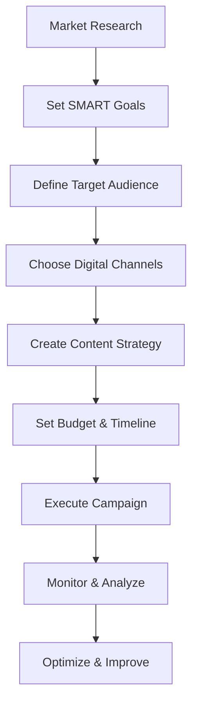
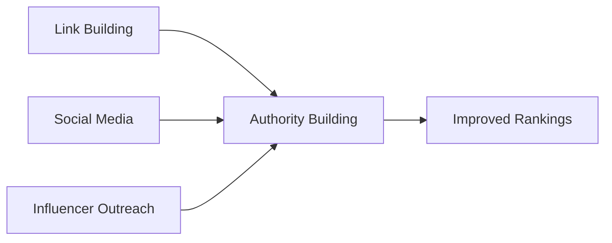
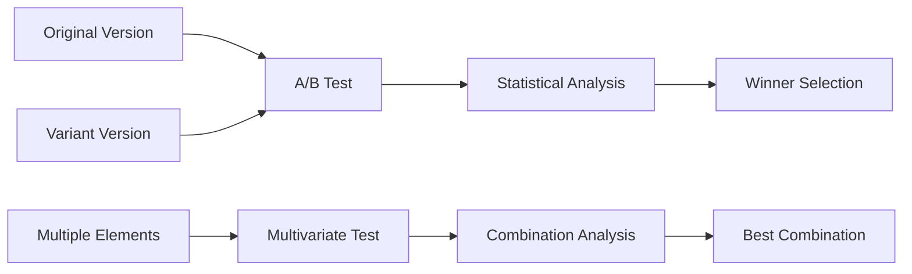
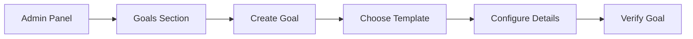
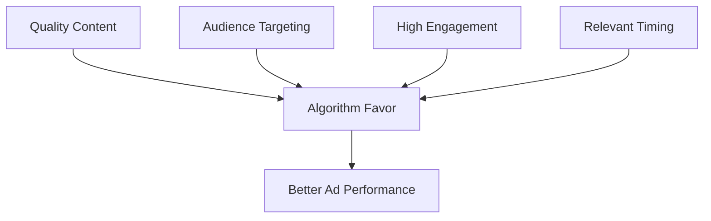
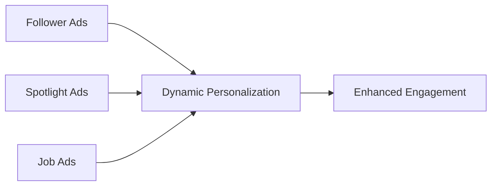
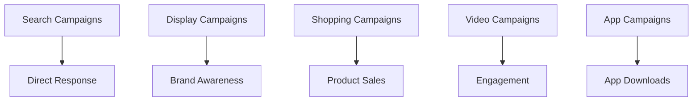

## Question 1(a) [3 marks]

**What typical skills must one possess to pursue a career in digital marketing?**

**Answer**:

| Skill Category | Skills Required |
|----------------|-----------------|
| **Technical Skills** | SEO/SEM, Google Analytics, Social Media Management |
| **Creative Skills** | Content Creation, Graphic Design, Video Editing |
| **Analytical Skills** | Data Analysis, Report Generation, Performance Metrics |
| **Communication** | Writing, Presentation, Customer Engagement |

**Key Skills**:

- **SEO Optimization**: Understanding search algorithms and keyword research
- **Analytics Tools**: Google Analytics, Facebook Insights proficiency
- **Content Marketing**: Creating engaging posts, blogs, and multimedia content
- **Social Media**: Platform-specific strategies and community management

**Mnemonic**: "SCAP" - Strategic, Creative, Analytical, Promotional

---

## Question 1(b) [4 marks]

**Differentiate: on-page and off-page optimization in SEO.**

**Answer**:

| Aspect | On-Page SEO | Off-Page SEO |
|--------|-------------|--------------|
| **Definition** | Optimization within website | Optimization outside website |
| **Control** | Complete control | Limited control |
| **Focus** | Content, HTML, site structure | Backlinks, social signals |
| **Examples** | Meta tags, keywords, URL structure | Link building, social media mentions |

**Key Differences**:

- **On-Page**: Title tags, meta descriptions, internal linking, content quality
- **Off-Page**: Backlink acquisition, social media marketing, guest posting
- **Timeline**: On-page shows faster results, off-page builds long-term authority
- **Cost**: On-page requires time investment, off-page may need monetary investment

**Mnemonic**: "Inside-Outside" - On-page is inside your control, off-page is outside

---

## Question 1(c) [7 marks]

**How can a business develop a successful digital marketing plan? Explain with a suitable example.**

**Answer**:



**Steps for Digital Marketing Plan**:

- **Market Analysis**: Research competitors, industry trends, customer behavior
- **Goal Setting**: Increase brand awareness by 30%, generate 500 qualified leads monthly
- **Audience Definition**: Create buyer personas with demographics and preferences
- **Channel Selection**: Choose appropriate platforms (Facebook, Google Ads, email)

**Example - Online Clothing Store**:

- **Target**: Women aged 25-40 interested in sustainable fashion
- **Channels**: Instagram (visual content), Google Ads (search intent), email marketing
- **Content**: Styling tips, sustainability stories, customer testimonials
- **Budget**: 40% social media, 35% search ads, 25% content creation

**Mnemonic**: "MAPCODE" - Market research, Audience, Plan, Channels, Operations, Data, Evaluation

---

## Question 1(c OR) [7 marks]

**What are the primary elements of the P.O.E.M. framework for digital marketing strategy, and how can they be applied to a business?**

**Answer**:

| Element | Description | Business Application |
|---------|-------------|---------------------|
| **Paid** | Advertising spend | Google Ads, Facebook Ads, YouTube ads |
| **Owned** | Brand-controlled content | Website, blog, email list, mobile app |
| **Earned** | Customer-generated content | Reviews, shares, mentions, viral content |
| **Managed** | Controlled third-party | Influencer partnerships, affiliate marketing |

**Framework Benefits**:

- **Integrated Approach**: Combines all marketing touchpoints for maximum impact
- **Cost Optimization**: Balances paid advertising with organic content
- **Audience Reach**: Expands reach through multiple channels and partnerships
- **Credibility Building**: Earned media provides authentic customer validation

**Business Application Example**:

- **Paid**: Google search ads for immediate visibility
- **Owned**: Company blog with SEO-optimized content
- **Earned**: Customer reviews and social media shares
- **Managed**: Influencer collaborations and affiliate programs

**Mnemonic**: "POEM Creates Marketing Magic"

---

## Question 2(a) [3 marks]

**Differentiate between single-touch and multi-touch attribution models.**

**Answer**:

| Attribution Type | Single-Touch | Multi-Touch |
|------------------|--------------|-------------|
| **Credit Assignment** | One touchpoint gets 100% credit | Credit distributed across multiple touchpoints |
| **Complexity** | Simple to understand | More complex analysis |
| **Accuracy** | Less accurate for long sales cycles | More accurate customer journey representation |
| **Examples** | First-click, Last-click | Linear, Time-decay, Position-based |

**Key Differences**:

- **Single-Touch**: Credits only first or last interaction with conversion
- **Multi-Touch**: Recognizes all touchpoints contributing to conversion
- **Use Cases**: Single-touch for simple purchases, multi-touch for complex B2B sales

**Mnemonic**: "Single Shot vs Multiple Steps"

---

## Question 2(b) [4 marks]

**Develop an SEO strategy for a newly launched e-commerce website, including keyword research, on-page optimization, and off-page optimization tactics.**

**Answer**:

**SEO Strategy Framework**:

```goat
┌─────────────────┐    ┌─────────────────┐    ┌─────────────────┐
│  Keyword        │    │  On-Page        │    │  Off-Page       │
│  Research       │───▶│  Optimization   │───▶│  Optimization   │
└─────────────────┘    └─────────────────┘    └─────────────────┘
│                      │                      │
▼                      ▼                      ▼
• Tool Analysis        • Title Tags           • Link Building
• Competitor Study     • Meta Descriptions    • Social Signals
• Long-tail Keywords   • URL Structure        • Guest Posting
• Search Volume        • Internal Linking     • Directory Listings
```

**Implementation Steps**:

- **Keyword Research**: Use Google Keyword Planner, focus on long-tail keywords with commercial intent
- **On-Page**: Optimize product pages with unique titles, descriptions, and schema markup
- **Off-Page**: Build quality backlinks through content marketing and industry partnerships
- **Technical**: Ensure fast loading speed, mobile responsiveness, and SSL certificate

**Mnemonic**: "Research, Optimize, Build, Measure"

---

## Question 2(c) [7 marks]

**Explain the factors that affect SEO and how they affect search engine rankings.**

**Answer**:

| Factor Category | Specific Factors | Impact on Rankings |
|----------------|------------------|-------------------|
| **Content Quality** | Relevance, originality, depth | High - Primary ranking factor |
| **Technical SEO** | Site speed, mobile-friendly, SSL | High - User experience signals |
| **Authority** | Backlinks, domain authority | High - Trust and credibility |
| **User Experience** | Bounce rate, dwell time, CTR | Medium - Behavioral signals |

**Detailed Factors**:

- **Content Relevance**: Search engines prioritize content matching user intent
- **Page Loading Speed**: Sites loading under 3 seconds rank higher
- **Mobile Optimization**: Mobile-first indexing makes responsive design crucial
- **Backlink Quality**: High-authority links improve domain credibility

**Impact Mechanism**:

- **Algorithm Updates**: Google's algorithms constantly evaluate these factors
- **User Behavior**: Positive user signals reinforce good rankings
- **Competition**: Relative performance against competitors affects positioning

**Mnemonic**: "Content, Technical, Authority, User Experience" (CTAU)

---

## Question 2(a OR) [3 marks]

**What are the different methods of data collection in website analytics?**

**Answer**:

| Collection Method | Description | Use Case |
|------------------|-------------|----------|
| **Page Tagging** | JavaScript tracking codes | Real-time user behavior |
| **Web Log Files** | Server-side data collection | Technical performance analysis |
| **Packet Sniffing** | Network traffic monitoring | Enterprise-level tracking |
| **Hybrid Approach** | Combination of methods | Comprehensive analytics |

**Methods Overview**:

- **JavaScript Tags**: Most common method using Google Analytics code
- **Server Logs**: Direct server data without client-side dependencies
- **API Integration**: Third-party data sources and CRM integration

**Mnemonic**: "Page, Log, Packet, Hybrid" (PLPH)

---

## Question 2(b OR) [4 marks]

**Construct an off-page optimization plan for a newly launched website, outlining strategies for building backlinks, engaging in social media marketing, and leveraging influencer outreach to improve its search engine rankings and online presence.**

**Answer**:

**Off-Page Optimization Plan**:



**Strategy Components**:

- **Link Building**: Guest posting on industry blogs, resource page listings, broken link building
- **Social Media Marketing**: Share content across platforms, engage with industry communities
- **Influencer Outreach**: Collaborate with industry experts for mentions and reviews
- **Directory Submissions**: Submit to relevant business directories and local listings

**Implementation Timeline**:

1. **Month 1**: Set up social profiles, identify link opportunities
2. **Month 2-3**: Execute guest posting, influencer outreach
3. **Month 4+**: Monitor results, scale successful tactics

**Mnemonic**: "Build Links, Engage Socially, Influence Others" (BLEO)

---

## Question 2(c OR) [7 marks]

**How can businesses utilize social media to improve their SEO rankings? Explain with a suitable example.**

**Answer**:

**Social Media SEO Benefits**:

| Social Signal | SEO Impact | Implementation |
|---------------|------------|----------------|
| **Content Sharing** | Increased visibility and backlinks | Create shareable content |
| **Brand Mentions** | Authority and trust signals | Active community engagement |
| **Traffic Generation** | User behavior signals | Drive social traffic to website |
| **Local SEO** | Location-based signals | Google My Business optimization |

**Example - Local Restaurant**:

- **Facebook**: Share menu updates, customer photos, location tags
- **Instagram**: Post food photos with location hashtags, encourage check-ins
- **Google My Business**: Maintain updated information, respond to reviews
- **Result**: Improved local search rankings for "restaurants near me"

**Implementation Strategy**:

- **Content Optimization**: Use relevant keywords in social media posts
- **Cross-Platform Promotion**: Share website content across all social channels
- **Community Building**: Engage with followers to increase brand loyalty
- **Local Engagement**: Participate in local hashtags and community groups

**Mnemonic**: "Share, Mention, Traffic, Local" (SMTL)

---

## Question 3(a) [3 marks]

**Provide the definition of conversion rate and describe its calculation.**

**Answer**:

**Conversion Rate Definition**:
The percentage of website visitors who complete a desired action (conversion) out of total visitors.

**Calculation Formula**:

```
Conversion Rate = (Number of Conversions / Total Visitors) × 100
```

**Example Calculation**:

- Total website visitors: 10,000
- Number of purchases: 250
- Conversion Rate = (250 ÷ 10,000) × 100 = 2.5%

**Types of Conversions**:

- **Macro Conversions**: Purchases, sign-ups, downloads
- **Micro Conversions**: Email subscriptions, product views, cart additions

**Mnemonic**: "Conversions Count from Total Traffic" (CCTT)

---

## Question 3(b) [4 marks]

**Imagine you are managing the Instagram account for a fashion retail store. Discuss three different Instagram Insights metrics that would be essential for monitoring the success of your content strategy.**

**Answer**:

| Metric | Purpose | Success Indicator |
|--------|---------|------------------|
| **Engagement Rate** | Measures audience interaction | >3% is considered good |
| **Reach and Impressions** | Tracks content visibility | Consistent growth month-over-month |
| **Story Completion Rate** | Measures content effectiveness | >70% completion rate |

**Essential Metrics**:

- **Engagement Rate**: (Likes + Comments + Shares) ÷ Total Followers × 100
- **Reach vs Impressions**: Reach shows unique views, impressions show total views
- **Story Analytics**: Completion rate, exits, and forward/back navigation

**Application for Fashion Retail**:

- **Engagement**: Track which outfit posts generate most interactions
- **Reach**: Monitor how many unique users see new collection announcements
- **Stories**: Analyze which behind-the-scenes content keeps viewers engaged

**Mnemonic**: "Engage, Reach, Complete" (ERC)

---

## Question 3(c) [7 marks]

**Explain A/B and multivariate testing tools and their role in optimizing website performance.**

**Answer**:

**Testing Types Comparison**:

| Test Type | Variables | Complexity | Use Case |
|-----------|-----------|------------|----------|
| **A/B Testing** | 2 versions, 1 variable | Simple | Email subject lines, button colors |
| **Multivariate Testing** | Multiple versions, multiple variables | Complex | Landing page optimization |



**Tools and Implementation**:

- **A/B Testing Tools**: Google Optimize, Optimizely, VWO
- **Multivariate Tools**: Adobe Target, Unbounce, Convert
- **Key Metrics**: Conversion rate, click-through rate, engagement time
- **Statistical Significance**: Minimum 95% confidence level required

**Optimization Process**:

1. **Hypothesis Formation**: Identify what to test and expected outcome
2. **Test Design**: Create variations and determine sample size
3. **Implementation**: Run test for sufficient duration
4. **Analysis**: Evaluate results and implement winning version

**Mnemonic**: "Analyze, Build, Compare, Decide" (ABCD)

---

## Question 3(a OR) [3 marks]

**Explain the following key metrics: pageviews, average visit duration, and bounce rate.**

**Answer**:

| Metric | Definition | Good Benchmark |
|--------|------------|----------------|
| **Pageviews** | Total number of pages viewed | Varies by site type |
| **Average Visit Duration** | Time spent on site per session | 2-3 minutes for most sites |
| **Bounce Rate** | Percentage of single-page visits | <40% is excellent, >70% needs improvement |

**Detailed Explanations**:

- **Pageviews**: Counts each page load, indicates content consumption depth
- **Visit Duration**: Shows user engagement and content quality effectiveness
- **Bounce Rate**: High bounce rate may indicate irrelevant traffic or poor user experience

**Mnemonic**: "Pages, Time, Bounce" (PTB)

---

## Question 3(b OR) [4 marks]

**Explain sponsored InMail and give an example of a scenario where it can be effectively utilized in a marketing campaign.**

**Answer**:

**Sponsored InMail Features**:

| Feature | Benefit | Implementation |
|---------|---------|----------------|
| **Direct Messaging** | Personal communication | Customized messages to prospects |
| **Targeting Options** | Precise audience selection | Job title, industry, company size |
| **Higher Open Rates** | 50% higher than email | Professional context increases relevance |
| **Call-to-Action** | Direct response mechanism | Event registration, demo booking |

**Example Scenario - B2B Software Company**:

- **Target**: IT Directors in companies with 500+ employees
- **Message**: Invitation to exclusive cybersecurity webinar
- **CTA**: "Register for Free Webinar"
- **Personalization**: Reference recent industry security breaches
- **Expected Result**: 15-20% response rate for qualified leads

**Best Practices**:

- **Personalization**: Use recipient's name and company information
- **Value Proposition**: Clear benefit statement in first sentence
- **Timing**: Send during business hours on weekdays

**Mnemonic**: "Personal Professional Prospects" (PPP)

---

## Question 3(c OR) [7 marks]

**With a suitable example, explain how businesses can set up goals in Google Analytics.**

**Answer**:

**Goal Types in Google Analytics**:

| Goal Type | Description | Example |
|-----------|-------------|---------|
| **Destination** | Specific page visit | Thank you page after purchase |
| **Duration** | Time spent on site | Session longer than 5 minutes |
| **Pages/Screens** | Number of pages viewed | More than 3 pages per session |
| **Event** | Specific action completion | Video play, file download |

**Setup Process Example - E-commerce Store**:



**Implementation Steps**:

1. **Navigate**: Admin → View → Goals → New Goal
2. **Template Selection**: Choose "Purchase" for e-commerce
3. **Goal Description**: Name: "Purchase Completion", Type: Destination
4. **Goal Details**: Destination URL: "/thank-you-purchase"
5. **Value Assignment**: Set monetary value for conversion tracking
6. **Verification**: Test goal with sample data

**Business Benefits**:

- **Conversion Tracking**: Measure success of marketing campaigns
- **ROI Calculation**: Determine which channels drive profitable traffic
- **Optimization Insights**: Identify pages with high conversion potential

**Mnemonic**: "Destination, Duration, Pages, Events" (DDPE)

---

## Question 4(a) [3 marks]

**What are the different types of Twitter ads? Explain each type briefly.**

**Answer**:

| Ad Type | Purpose | Format |
|---------|---------|--------|
| **Promoted Tweets** | Increase engagement | Regular tweets with wider reach |
| **Promoted Accounts** | Gain followers | Account suggestions in timeline |
| **Promoted Trends** | Brand awareness | Trending topics section |
| **Twitter Cards** | Drive website traffic | Rich media attachments |

**Brief Explanations**:

- **Promoted Tweets**: Regular tweets shown to targeted audience beyond followers
- **Promoted Accounts**: Suggestions to follow account based on interests and behavior
- **Promoted Trends**: Brand hashtags appearing in trending topics for 24 hours
- **Twitter Cards**: Enhanced tweets with images, videos, or website previews

**Mnemonic**: "Tweets, Accounts, Trends, Cards" (TATC)

---

## Question 4(b) [4 marks]

**Imagine you are starting a new business in the fashion industry. Develop a social media marketing strategy outline for your business, including the choice of social media platforms, content ideas, and engagement tactics. Justify your choices based on the target audience and marketing objectives.**

**Answer**:

**Social Media Strategy for Fashion Business**:

| Platform | Target Audience | Content Strategy | Engagement Tactics |
|----------|----------------|------------------|-------------------|
| **Instagram** | Women 18-35, fashion enthusiasts | Outfit posts, styling tips, behind-scenes | Stories polls, user-generated content |
| **TikTok** | Gen Z, trend followers | Fashion trends, styling videos | Challenges, collaborations |
| **Pinterest** | Women 25-45, style planners | Seasonal collections, style boards | Rich Pins, seasonal boards |
| **Facebook** | Broader audience, community building | Brand story, customer testimonials | Groups, live events |

**Content Calendar Example**:

- **Monday**: Motivational outfit posts (#MondayStyle)
- **Wednesday**: Behind-the-scenes content
- **Friday**: New arrivals and trends
- **Weekend**: User-generated content features

**Justification**:

- **Visual Nature**: Fashion is highly visual, requiring image/video-focused platforms
- **Trend Sensitivity**: Young audience follows fashion trends on TikTok and Instagram
- **Purchase Planning**: Pinterest users research before buying, perfect for fashion discovery
- **Community Building**: Facebook groups for style advice and brand loyalty

**Mnemonic**: "Instagram, TikTok, Pinterest, Facebook" (ITPF)

---

## Question 4(c) [7 marks]

**How can advertisers optimize their ad performance within the Facebook algorithm? Provide specific strategies and examples.**

**Answer**:

**Facebook Algorithm Optimization Strategies**:

| Strategy | Implementation | Example |
|----------|----------------|---------|
| **Audience Targeting** | Use detailed demographics and interests | Target "fashion enthusiasts" aged 25-40 |
| **Engagement Optimization** | Create content that generates interactions | Ask questions, use polls in posts |
| **Relevance Score** | Align ad content with audience interests | Show seasonal collections to relevant users |
| **Bidding Strategy** | Choose appropriate bid type | Use automatic bidding for conversions |



**Specific Optimization Tactics**:

- **Creative Testing**: A/B test different ad formats (image vs video vs carousel)
- **Audience Lookalike**: Create lookalike audiences from existing customers
- **Retargeting**: Target website visitors with relevant product ads
- **Time Optimization**: Post when target audience is most active

**Performance Monitoring**:

- **Key Metrics**: CTR, CPM, CPC, conversion rate
- **Frequency Capping**: Prevent ad fatigue by limiting impressions per user
- **Campaign Optimization**: Adjust targeting based on performance data

**Example Implementation**:

- **Fashion Brand**: Use dynamic product ads to retarget cart abandoners
- **Result**: 30% increase in ROAS through personalized product recommendations

**Mnemonic**: "Target, Engage, Optimize, Monitor" (TEOM)

---

## Question 4(a OR) [3 marks]

**Explain different types of YouTube ads.**

**Answer**:

| Ad Type | Format | Skippable | Placement |
|---------|--------|-----------|-----------|
| **TrueView In-Stream** | Video ads | Yes (after 5 seconds) | Before/during videos |
| **TrueView Discovery** | Thumbnail + text | N/A | Search results, related videos |
| **Bumper Ads** | 6-second videos | No | Before videos |
| **Non-Skippable** | 15-20 second videos | No | Before/during videos |

**Additional Types**:

- **Overlay Ads**: Banner ads appearing over videos
- **Sponsored Cards**: Product information cards during videos
- **Masthead Ads**: Premium placement on YouTube homepage

**Mnemonic**: "True, Bumper, Non-Skip, Overlay" (TBNO)

---

## Question 4(b OR) [4 marks]

**Suppose you are planning to launch a new product and want to leverage YouTube ads. Which type of YouTube ad format would you choose and why?**

**Answer**:

**Recommended Ad Format: TrueView In-Stream**

**Justification**:

| Factor | Advantage | Benefit |
|--------|-----------|---------|
| **Cost Efficiency** | Pay only for views >30 seconds | Budget optimization |
| **Engagement** | Viewer choice to continue watching | Higher intent audience |
| **Reach** | Massive YouTube audience | Brand awareness |
| **Targeting** | Precise audience selection | Relevant exposure |

**Implementation Strategy**:

- **Video Length**: 2-3 minutes showcasing product benefits
- **Hook**: Compelling first 5 seconds to prevent skipping
- **CTA**: Clear call-to-action for product website visit
- **Targeting**: Interest-based and demographic targeting

**Example - New Smartphone Launch**:

- **Creative**: 2-minute video highlighting unique features
- **Targeting**: Tech enthusiasts, smartphone shoppers
- **Budget**: Start with $5,000 for initial testing
- **Metrics**: Focus on view rate, click-through rate, conversions

**Alternative Consideration**: Bumper ads for brand awareness due to guaranteed completion

**Mnemonic**: "Choose TrueView for True Value" (CTTV)

---

## Question 4(c OR) [7 marks]

**Explain the concept of Dynamic Ads and give an example of how they can be personalized to engage with the LinkedIn audience.**

**Answer**:

**Dynamic Ads Concept**:

| Feature | Description | Benefit |
|---------|-------------|---------|
| **Personalization** | Uses member profile data | Higher relevance |
| **Automation** | Automatically customizes content | Scale and efficiency |
| **Targeting** | Precise professional targeting | Better ROI |
| **Formats** | Multiple ad formats available | Versatile messaging |

**Types of LinkedIn Dynamic Ads**:



**Personalization Example - HR Software Company**:

- **Target**: HR Managers at companies with 100+ employees
- **Personalization Elements**:
  - Member name: "Hi [FirstName]"
  - Company name: "Streamline HR at [CompanyName]"
  - Job title: "Perfect for [JobTitle] like you"
  - Profile image: Use member's LinkedIn photo

**Ad Copy Example**:
"Hi Sarah, Streamline HR processes at TechCorp with our automated solution. Perfect for HR Directors like you who want to reduce manual tasks by 50%."

**Implementation Best Practices**:

- **A/B Testing**: Test different personalization elements
- **Relevance**: Ensure messaging aligns with member's role and industry
- **Value Proposition**: Clear benefit statement for specific job function
- **Landing Page**: Customize landing page to match ad personalization

**Mnemonic**: "Personal Professional Precise Powerful" (PPPP)

---

## Question 5(a) [3 marks]

**Explain the metrics and data available in Facebook Insights.**

**Answer**:

| Metric Category | Specific Metrics | Purpose |
|----------------|------------------|---------|
| **Page Performance** | Likes, follows, reach, impressions | Growth tracking |
| **Audience Demographics** | Age, gender, location, language | Audience understanding |
| **Post Performance** | Engagement rate, shares, comments | Content optimization |
| **Video Metrics** | View duration, completion rate | Video content analysis |

**Key Insights Available**:

- **Page Insights**: Overall page performance and growth trends
- **Post Insights**: Individual post engagement and reach data
- **Audience Insights**: Detailed demographics and behavior patterns
- **Video Insights**: Comprehensive video performance analytics

**Mnemonic**: "Performance, Demographics, Posts, Videos" (PDPV)

---

## Question 5(b) [4 marks]

**What are drip campaigns, and how can they be beneficial in email marketing?**

**Answer**:

**Drip Campaign Definition**:
Automated email sequences sent based on specific triggers or time intervals to nurture leads and guide them through the customer journey.

| Campaign Type | Trigger | Purpose | Example |
|---------------|---------|---------|---------|
| **Welcome Series** | New subscription | Onboarding | 5-email introduction sequence |
| **Abandoned Cart** | Cart abandonment | Recovery | Reminder + discount offer |
| **Re-engagement** | Inactivity | Retention | "We miss you" campaigns |
| **Educational** | Interest indication | Nurturing | Weekly tips and tutorials |

**Benefits in Email Marketing**:

- **Automation**: Saves time and ensures consistent communication
- **Personalization**: Tailored content based on user behavior
- **Lead Nurturing**: Gradually builds trust and relationship
- **Higher Conversion**: Strategic timing improves conversion rates

**Implementation Example**:

1. **Day 1**: Welcome email with brand introduction
2. **Day 3**: Product showcase with customer testimonials
3. **Day 7**: Educational content and tips
4. **Day 14**: Special offer for first purchase

**Mnemonic**: "Drip Delivers Persistent Personalization" (DDPP)

---

## Question 5(c) [7 marks]

**Explain different types of ad extensions available in Google Ads with an example of each.**

**Answer**:

**Google Ads Extensions Types**:

| Extension Type | Purpose | Example |
|----------------|---------|---------|
| **Sitelink Extensions** | Additional page links | "Shop Now", "Contact Us", "About Us" |
| **Call Extensions** | Phone number display | "(555) 123-4567" click-to-call |
| **Location Extensions** | Business address | "123 Main St, City, State" |
| **Callout Extensions** | Additional text highlights | "Free Shipping", "24/7 Support" |

**Advanced Extensions**:

| Extension | Function | Implementation Example |
|-----------|----------|----------------------|
| **Structured Snippets** | Categorized information | Services: Web Design, SEO, PPC |
| **Price Extensions** | Service/product pricing | "Basic Plan: $29/month" |
| **App Extensions** | Mobile app downloads | "Download our iOS app" |
| **Promotion Extensions** | Special offers | "20% Off First Order" |

```goat
Ad Extensions
├── Sitelink Extensions
│   ├── Shop Now
│   ├── Contact Us
│   └── About Us
├── Call Extensions
│   └── (555) 123-4567
├── Location Extensions
│   └── 123 Main St, City
└── Callout Extensions
    ├── Free Shipping
    └── 24/7 Support
```

**Implementation Benefits**:

- **Increased CTR**: Extensions make ads more prominent and informative
- **Better Quality Score**: Google rewards ads with relevant extensions
- **Enhanced User Experience**: Provides multiple pathways for user engagement
- **Cost Efficiency**: No additional cost, only pay for main ad clicks

**Best Practices**:

- **Relevance**: Ensure extensions match ad content and landing page
- **Mobile Optimization**: Use call extensions for mobile campaigns
- **Regular Updates**: Keep promotional extensions current with active offers

**Mnemonic**: "Site, Call, Location, Callout, Structure, Price, App, Promotion" (SCLCSPAP)

---

## Question 5(a OR) [3 marks]

**Describe the factors that influence ad delivery and reach on Facebook.**

**Answer**:

| Factor Category | Specific Factors | Impact |
|----------------|------------------|--------|
| **Ad Quality** | Relevance score, user feedback | High - Algorithm priority |
| **Audience** | Size, engagement rate, competition | Medium - Reach potential |
| **Budget** | Daily/lifetime budget, bidding | High - Delivery frequency |
| **Timing** | Posting schedule, audience activity | Medium - Engagement optimization |

**Algorithm Considerations**:

- **Relevance Score**: Higher scores get better delivery and lower costs
- **User Feedback**: Negative feedback reduces ad delivery
- **Competition**: Higher competition increases costs and reduces reach
- **Ad Frequency**: Optimal frequency prevents ad fatigue

**Mnemonic**: "Quality, Audience, Budget, Timing" (QABT)

---

## Question 5(b OR) [4 marks]

**Give the difference between PPC and SEO.**

**Answer**:

| Aspect | PPC (Pay-Per-Click) | SEO (Search Engine Optimization) |
|--------|-------------------|----------------------------------|
| **Cost** | Immediate payment per click | Long-term investment, no direct cost per click |
| **Time to Results** | Immediate visibility | 3-6 months for significant results |
| **Sustainability** | Stops when budget ends | Continues without ongoing payment |
| **Control** | Complete control over targeting | Limited control over rankings |

**Detailed Comparison**:

- **PPC Advantages**: Instant results, precise targeting, measurable ROI
- **SEO Advantages**: Cost-effective long-term, builds credibility, sustainable traffic
- **PPC Disadvantages**: Ongoing costs, competition drives up prices
- **SEO Disadvantages**: Time-intensive, algorithm dependency, no guaranteed results

**Strategic Application**:

- **PPC**: Use for immediate results, product launches, seasonal campaigns
- **SEO**: Build for long-term organic traffic, brand authority, cost efficiency
- **Combined Approach**: Use both for comprehensive search marketing strategy

**Mnemonic**: "Pay for Position vs. Patience for Position" (PPPP)

---

## Question 5(c OR) [7 marks]

**Explain the different types of Google Ads Campaigns and their purposes.**

**Answer**:

**Google Ads Campaign Types**:

| Campaign Type | Primary Purpose | Ad Formats | Best For |
|---------------|----------------|------------|----------|
| **Search** | Capture search intent | Text ads | High-intent keywords |
| **Display** | Brand awareness | Image/video banners | Visual brand promotion |
| **Shopping** | Product promotion | Product listings | E-commerce sales |
| **Video** | Engagement | YouTube ads | Brand storytelling |
| **App** | App promotion | App install ads | Mobile app downloads |

**Detailed Campaign Purposes**:



**Advanced Campaign Types**:

- **Smart Campaigns**: Automated targeting and bidding for small businesses
- **Local Campaigns**: Drive visits to physical store locations
- **Discovery Campaigns**: Reach users across Google's feed-based properties
- **Performance Max**: AI-driven campaigns across all Google properties

**Campaign Selection Strategy**:

- **Search**: Target users actively searching for your products/services
- **Display**: Build awareness among broader audience with visual content
- **Shopping**: Showcase products with images, prices, and reviews
- **Video**: Tell brand story and demonstrate products in action
- **App**: Drive mobile app installations and engagement

**Budget Allocation Example**:

- **E-commerce Business**: 40% Search, 25% Shopping, 20% Display, 15% Video
- **Service Business**: 50% Search, 30% Display, 20% Local campaigns

**Performance Optimization**:

- **Search**: Focus on keyword relevance and landing page quality
- **Display**: Optimize creative elements and audience targeting
- **Shopping**: Ensure product feed accuracy and competitive pricing
- **Video**: Create engaging content with clear call-to-actions

**Mnemonic**: "Search, Display, Shopping, Video, App" (SDSVA)
