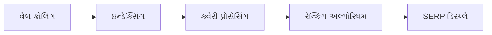
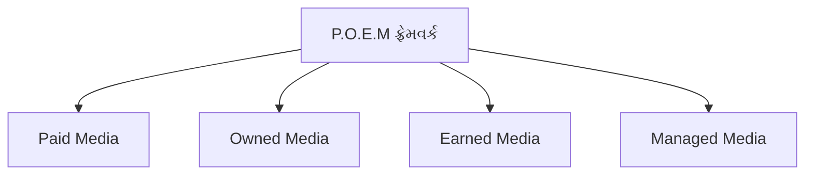
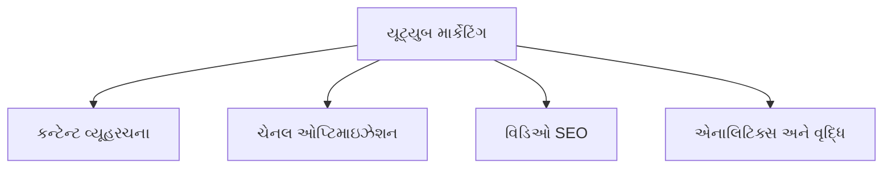
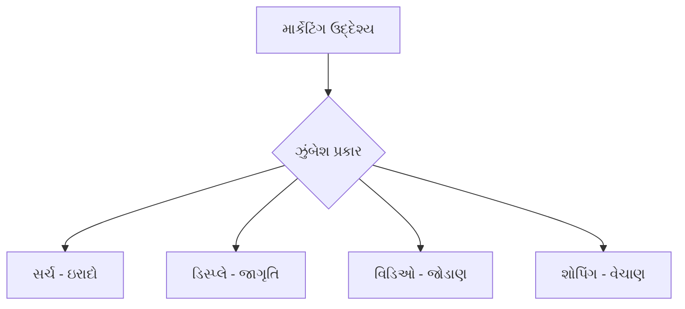
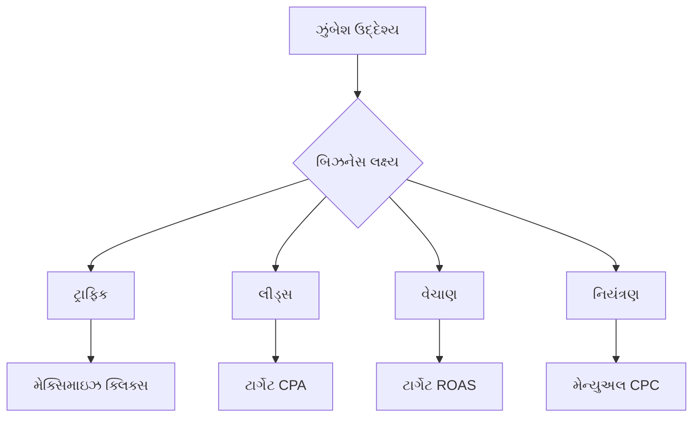

## પ્રશ્ન 1(અ) [3 ગુણ]

**તફાવત આપો: ટ્રેડિશનલ માર્કેટિંગ અને ડિજિટલ માર્કેટિંગ.**

**જવાબ**:

| ટ્રેડિશનલ માર્કેટિંગ | ડિજિટલ માર્કેટિંગ |
|----------------------|-------------------|
| **ભૌતિક હાજરી** જરૂરી | **ઓનલાઇન હાજરી** ઇન્ટરનેટ દ્વારા |
| **મર્યાદિત પહોંચ** સ્થાનિક પ્રેક્ષકો સુધી | **વૈશ્વિક પહોંચ** વિશ્વભરના પ્રેક્ષકો સુધી |
| **એક તરફી સંદેશાવ્યવહાર** | **બે તરફી ઇન્ટરેક્ટિવ** સંદેશાવ્યવહાર |
| **વધુ ખર્ચાળ** જાહેરાત માટે | **ખર્ચ અસરકારક** ઝુંબેશો |
| **ROI માપવું મુશ્કેલ** | **સરળ ટ્રેકિંગ** અને analytics |
| **ધીમો પ્રતિસાદ** ગ્રાહકો પાસેથી | **તાત્કાલિક પ્રતિસાદ** અને જવાબો |

**મેમરી ટ્રીક:** "PITCH vs CLICK" (ભૌતિક વિરુદ્ધ ઇન્ટરેક્ટિવ, પરંપરાગત વિરુદ્ધ ટ્રેકેબલ, વધુ ખર્ચ વિરુદ્ધ ખર્ચ અસરકારક)

---

## પ્રશ્ન 1(બ) [4 ગુણ]

**સર્ચ એન્જિન અલ્ગોરિધમનું કાર્ય સમજાવો.**

**જવાબ**:

સર્ચ એન્જિન અલ્ગોરિધમ સિસ્ટેમેટિક પ્રક્રિયાઓ દ્વારા સંબંધિત પરિણામો પહોંચાડે છે:

**પ્રક્રિયા ક્રમ:**

- **ક્રોલિંગ**: સર્ચ બોટ્સ નવી સામગ્રી શોધવા માટે વેબસાઇટ્સ સતત સ્કેન કરે છે
- **ઇન્ડેક્સિંગ**: વિશ્લેષિત સામગ્રી કીવર્ડ્સ સાથે વિશાળ ડેટાબેઝમાં સંગ્રહિત થાય છે
- **ક્વેરી મેચિંગ**: વપરાશકર્તાના સર્ચ શબ્દો ઇન્ડેક્સ્ડ સામગ્રી સાથે મેચ થાય છે
- **રેન્કિંગ ફેક્ટર્સ**: સામગ્રીની સંબંધિતતા, અધિકાર અને વપરાશકર્તા અનુભવ પોઝિશન નક્કી કરે છે

**મેમરી ટ્રીક:** "CIRR" (ક્રોલ, ઇન્ડેક્સ, રેન્ક, રિઝલ્ટ્સ)

---

## પ્રશ્ન 1(ક) [7 ગુણ]

**ડિજિટલ માર્કેટિંગ યોજનાના મુખ્ય ઘટકો સમજાવો.**

**જવાબ**:

વ્યાપક ડિજિટલ માર્કેટિંગ યોજનામાં સફળતા માટે આવશ્યક ઘટકો છે:

| ઘટક | વર્ણન | હેતુ |
|-----------|-------------|---------|
| **પરિસ્થિતિ વિશ્લેષણ** | વર્તમાન બજાર સ્થિતિ અને SWOT | **પ્રારંભિક બિંદુ** સમજવું |
| **લક્ષ્ય પ્રેક્ષકો** | ડેમોગ્રાફિક્સ અને બાયર પર્સોનાસ | **કેન્દ્રિત માર્કેટિંગ** પ્રયાસો |
| **લક્ષ્યો અને ઉદ્દેશ્યો** | SMART લક્ષ્યો KPIs સાથે | **માપી શકાય તેવા પરિણામો** |
| **વ્યૂહરચના પસંદગી** | SEO, SEM, સોશિયલ મીડિયા, ઇમેઇલ | **ચેનલ ઓપ્ટિમાઇઝેશન** |
| **બજેટ ફાળવણી** | ચેનલ્સમાં સંસાધન વિતરણ | **ખર્ચ વ્યવસ્થાપન** |
| **કન્ટેન્ટ કૅલેન્ડર** | સુનિશ્ચિત કન્ટેન્ટ પ્રકાશન | **સતત જોડાણ** |
| **Analytics સેટઅપ** | ટ્રેકિંગ ટૂલ્સ અને મેટ્રિક્સ | **પ્રદર્શન મોનિટરિંગ** |

**મુખ્ય સફળતા પરિબળો:**

- **સંશોધન આધારિત** અભિગમ બજાર આંતરદૃષ્ટિ સાથે
- **એકીકરણ** વિવિધ ડિજિટલ ચેનલ્સમાં
- **લવચીકતા** પ્રદર્શન ડેટાના આધારે અનુકૂલન માટે

**મેમરી ટ્રીક:** "STGSBC Analytics" (સિચ્યુએશન, ટાર્ગેટ, ગોલ્સ, સ્ટ્રેટેજી, બજેટ, કન્ટેન્ટ, Analytics)

---

## પ્રશ્ન 1(ક) OR [7 ગુણ]

**P.O.E.M. ફ્રેમવર્કના ઘટકો સમજાવો અને ડિજિટલ માર્કેટિંગમાં તેમની સુસંગતતા સમજાવો.**

**જવાબ**:

P.O.E.M. ફ્રેમવર્ક વ્યૂહરચનાત્મક આયોજન માટે ડિજિટલ માર્કેટિંગ ચેનલ્સનું વર્ગીકરણ કરે છે:

| ઘટક | વ્યાખ્યા | ઉદાહરણો | સુસંગતતા |
|-----------|------------|----------|-----------|
| **Paid Media** | ખરીદેલ જાહેરાત સ્થળ | Google Ads, Facebook Ads | **તાત્કાલિક પહોંચ** અને નિયંત્રણ |
| **Owned Media** | બ્રાન્ડ-નિયંત્રિત ચેનલ્સ | વેબસાઇટ, ઇમેઇલ લિસ્ટ, બ્લોગ્સ | **લાંબા ગાળાની સંપત્તિ** નિર્માણ |
| **Earned Media** | ત્રીજા પક્ષની ભલામણો | રિવ્યૂઝ, શેર્સ, મેન્શન્સ | **વિશ્વસનીયતા** અને વિશ્વાસ |
| **Managed Media** | પ્રભાવિત પરંતુ માલિકીના નહીં | ઇન્ફ્લ્યુઅન્સર પાર્ટનરશિપ | **અન્ય દ્વારા વિસ્તૃત પહોંચ** |

**વ્યૂહરચનાત્મક ફાયદા:**

- **સંતુલિત અભિગમ** તમામ મીડિયા પ્રકારોમાં
- **ખર્ચ ઓપ્ટિમાઇઝેશન** ચેનલ મિશ્રણ દ્વારા
- **વિસ્તૃત અસર** જ્યારે ચેનલ્સ એકસાથે કામ કરે છે

**મેમરી ટ્રીક:** "POEM બિલ્ડ્સ ડિજિટલ SUCCESS" (Paid, Owned, Earned, Managed)

---

## પ્રશ્ન 2(અ) [3 ગુણ]

**SEO ની જરૂરિયાત વર્ણન કરો.**

**જવાબ**:

SEO ઓનલાઇન દૃશ્યતા અને વ્યવસાયિક વિકાસ માટે આવશ્યક છે:

- **ઓર્ગેનિક ટ્રાફિક**: 68% ઓનલાઇન અનુભવો સર્ચ એન્જિન્સથી શરૂ થાય છે
- **ખર્ચ અસરકારક**: પેઇડ Ads થી વિપરીત ઓર્ગેનિક રેન્કિંગ માટે સીધો ચુકવણી નથી
- **વિશ્વાસ નિર્માણ**: ઉચ્ચ રેન્કિંગ વપરાશકર્તાઓ સાથે વિશ્વસનીયતા બનાવે છે
- **લાંબા ગાળાના પરિણામો**: સમય સાથે ટકાઉ ટ્રાફિક વૃદ્ધિ

**મેમરી ટ્રીક:** "OCTL" (ઓર્ગેનિક, ખર્ચ અસરકારક, ટ્રસ્ટ, લાંબા ગાળાના)

---

## પ્રશ્ન 2(બ) [4 ગુણ]

**ઓન-પેજ અને ઓફ-પેજ ઓપ્ટિમાઇઝેશન વચ્ચે તફાવત આપો.**

**જવાબ**:

| On-Page SEO | Off-Page SEO |
|-------------|--------------|
| **વેબસાઇટ તત્વો** ઓપ્ટિમાઇઝેશન | **બાહ્ય પરિબળો** ઓપ્ટિમાઇઝેશન |
| **ટાઇટલ ટેગ્સ, મેટા વર્ણનો** | **અન્ય સાઇટ્સથી બેકલિંક્સ** |
| **કન્ટેન્ટ ગુણવત્તા અને કીવર્ડ્સ** | **સોશિયલ મીડિયા સિગ્નલ્સ** |
| **આંતરિક લિંકિંગ સ્ટ્રક્ચર** | **ડોમેઇન ઓથોરિટી બિલ્ડિંગ** |
| **વેબસાઇટ માલિકનું સંપૂર્ણ નિયંત્રણ** | **મર્યાદિત નિયંત્રણ**, અન્યો પર આધાર |
| **ટેકનિકલ ઓપ્ટિમાઇઝેશન** ફોકસ | **ઓથોરિટી અને લોકપ્રિયતા** ફોકસ |

**મેમરી ટ્રીક:** "IN vs OUT" (આંતરિક ઓપ્ટિમાઇઝેશન વિરુદ્ધ બાહ્ય ઓથોરિટી)

---

## પ્રશ્ન 2(ક) [7 ગુણ]

**SEO રેન્કિંગ સમજાવો અને SEO રેન્કિંગને સુધારવાની રીતો સમજાવો.**

**જવાબ**:

SEO રેન્કિંગ સર્ચ એન્જિન રિઝલ્ટ પેજીસ (SERPs) માં વેબસાઇટની સ્થિતિ નક્કી કરે છે.

**રેન્કિંગ ફેક્ટર્સ ટેબલ:**

| ફેક્ટર કેટેગરી | ટેકનિક્સ | અસર સ્તર |
|----------------|------------|--------------|
| **કન્ટેન્ટ ગુણવત્તા** | મૂળ, મૂલ્યવાન સામગ્રી | ઉચ્ચ |
| **કીવર્ડ્સ** | સંશોધન અને કુદરતી પ્લેસમેન્ટ | ઉચ્ચ |
| **ટેકનિકલ SEO** | સાઇટ સ્પીડ, મોબાઇલ-ફ્રેન્ડલી | મધ્યમ |
| **બેકલિંક્સ** | ગુણવત્તાયુક્ત લિંક બિલ્ડિંગ | ઉચ્ચ |
| **વપરાશકર્તા અનુભવ** | ઓછો બાઉન્સ રેટ, વધુ જોડાણ | મધ્યમ |

**સુધારણા વ્યૂહરચના:**

- **કન્ટેન્ટ ઓપ્ટિમાઇઝેશન**: વ્યાપક, વપરાશકર્તા કેન્દ્રિત સામગ્રી બનાવો
- **કીવર્ડ સંશોધન**: સંબંધિત, પ્રાપ્ત કરી શકાય તેવા કીવર્ડ્સને લક્ષ્ય બનાવો
- **ટેકનિકલ સુધારણા**: સાઇટ સ્પીડ અને મોબાઇલ રિસ્પોન્સિવનેસ સુધારો
- **લિંક બિલ્ડિંગ**: અધિકૃત સાઇટ્સથી ગુણવત્તાયુક્ત બેકલિંક્સ મેળવો
- **વપરાશકર્તા સિગ્નલ્સ**: એન્ગેજમેન્ટ મેટ્રિક્સ વધારો

**સફળતા મેટ્રિક્સ:**

- **SERP પોઝિશન** સુધારણા
- **ઓર્ગેનિક ટ્રાફિક** વૃદ્ધિ
- **ક્લિક-થ્રુ રેટ્સ** વધારો

**મેમરી ટ્રીક:** "CKTU for SEO SUCCESS" (કન્ટેન્ટ, કીવર્ડ્સ, ટેકનિકલ, વપરાશકર્તા અનુભવ)

---

## પ્રશ્ન 2(અ) OR [3 ગુણ]

**વ્યાખ્યા આપો: 1. બેકલિંક્સ 2. વેબસાઇટ સ્પીડ 3. કીવર્ડ સ્ટફિંગ.**

**જવાબ**:

| શબ્દ | વ્યાખ્યા |
|------|------------|
| **બેકલિંક્સ** | બાહ્ય વેબસાઇટ્સથી તમારી સાઇટ તરફ આવતી હાઇપરલિંક્સ |
| **વેબસાઇટ સ્પીડ** | બ્રાઉઝરમાં વેબ પેજીસ સંપૂર્ણ લોડ થવા માટે લાગતો સમય |
| **કીવર્ડ સ્ટફિંગ** | રેન્કિંગ હેરફેર માટે સામગ્રીમાં કીવર્ડ્સનો અકુદરતી વધારે ઉપયોગ |

**મેમરી ટ્રીક:** "BWK" (બેકલિંક્સ, વેબસાઇટ સ્પીડ, કીવર્ડ સ્ટફિંગ)

---

## પ્રશ્ન 2(બ) OR [4 ગુણ]

**બ્લેક હેટ અને વ્હાઇટ હેટ SEO ટેકનિક વચ્ચે તફાવત આપો.**

**જવાબ**:

| વ્હાઇટ હેટ SEO | બ્લેક હેટ SEO |
|---------------|---------------|
| **નૈતિક પ્રથાઓ** માર્ગદર્શિકાઓ અનુસરે છે | **છેતરપિંડીની યુક્તિઓ** નિયમોનું ઉલ્લંઘન કરે છે |
| **ગુણવત્તાયુક્ત સામગ્રી** નિર્માણ | **સામગ્રી ચોરી** અને ડુપ્લિકેશન |
| **કુદરતી લિંક બિલ્ડિંગ** | **લિંક ફાર્મ્સ** અને પેઇડ લિંક્સ |
| **લાંબા ગાળાના પરિણામો** | **ઝડપી પરંતુ જોખમી** લાભ |
| **સર્ચ એન્જિન મંજૂર** | **પેનલ્ટી જોખમો** સર્ચ એન્જિન્સ તરફથી |

**મેમરી ટ્રીક:** "સારું vs ખરાબ" (માર્ગદર્શિકા અનુસરતું vs પેનલ્ટી જોખમ)

---

## પ્રશ્ન 2(ક) OR [7 ગુણ]

**કોઈપણ ત્રણ સામાન્ય SEO ટૂલ્સના નામ આપો અને તેમના કાર્યોનું વર્ણન કરો.**

**જવાબ**:

| SEO ટૂલ | પ્રાથમિક કાર્યો | મુખ્ય ફીચર્સ |
|----------|------------------|--------------|
| **Google Analytics** | વેબસાઇટ ટ્રાફિક વિશ્લેષણ | વિઝિટર વર્તન, કન્વર્ઝન ટ્રેકિંગ, પ્રેક્ષક આંતરદૃષ્ટિ |
| **SEMrush** | કીવર્ડ સંશોધન અને કોમ્પિટિટર એનાલિસિસ | કીવર્ડ મુશ્કેલી, બેકલિંક વિશ્લેષણ, સાઇટ ઓડિટ |
| **Yoast SEO** | ઓન-પેજ ઓપ્ટિમાઇઝેશન (WordPress) | કન્ટેન્ટ ઓપ્ટિમાઇઝેશન, ટેકનિકલ SEO, વાંચવાની ક્ષમતા વિશ્લેષણ |

**વિગતવાર કાર્યો:**

- **Google Analytics**: વપરાશકર્તા જર્ની, બાઉન્સ રેટ્સ અને ગોલ કમ્પલીશન ટ્રેક કરે છે
- **SEMrush**: રેન્કિંગ તકો ઓળખે છે અને કોમ્પિટિટર વ્યૂહરચનાઓનું મોનિટરિંગ કરે છે
- **Yoast SEO**: કન્ટેન્ટ અને મેટા ટેગ્સ માટે રીઅલ-ટાઇમ ઓપ્ટિમાઇઝેશન સૂચનો પ્રદાન કરે છે

**ફાયદાઓ:**

- **ડેટા-આધારિત નિર્ણયો** વ્યાપક analytics દ્વારા
- **સ્પર્ધાત્મક લાભ** બજાર આંતરદૃષ્ટિ સાથે
- **કાર્યક્ષમતા** ઓપ્ટિમાઇઝેશન કાર્યોમાં

**મેમરી ટ્રીક:** "GSY ટૂલ્સ" (Google Analytics, SEMrush, Yoast)

---

## પ્રશ્ન 3(અ) [3 ગુણ]

**કોઈપણ એક મલ્ટી-ટચ એટ્રિબ્યુશન મોડલ ઉદાહરણ સાથે સમજાવો.**

**જવાબ**:

**લિનિયર એટ્રિબ્યુશન મોડલ** ગ્રાહક જર્નીમાં તમામ ટચપોઇન્ટ્સમાં સમાન રીતે ક્રેડિટ વિતરિત કરે છે.

**ઉદાહરણ પરિસ્થિતિ:**
ગ્રાહક જર્ની: સોશિયલ મીડિયા Ad → ઇમેઇલ → વેબસાઇટ વિઝિટ → ખરીદી

**ક્રેડિટ વિતરણ:**

- સોશિયલ મીડિયા Ad: 25%
- ઇમેઇલ: 25%
- વેબસાઇટ વિઝિટ: 25%
- ખરીદી પેજ: 25%

**મેમરી ટ્રીક:** "બધા ટચીસ માટે સમાન ક્રેડિટ" (લિનિયર = સમાન વિતરણ)

---

## પ્રશ્ન 3(બ) [4 ગુણ]

**નીચેના મુખ્ય મેટ્રિક્સ સમજાવો: યુનિક વિઝિટર્સ, બાઉન્સ રેટ.**

**જવાબ**:

| મેટ્રિક | વ્યાખ્યા | મહત્વ |
|--------|------------|--------------|
| **યુનિક વિઝિટર્સ** | ચોક્કસ સમયગાળામાં વેબસાઇટ મુલાકાત લેતા વ્યક્તિગત વપરાશકર્તાઓની ગણતરી | **પ્રેક્ષક પહોંચ** અને વૃદ્ધિ માપે છે |
| **બાઉન્સ રેટ** | માત્ર એક પેજ જોયા પછી છોડી જતા વિઝિટર્સની ટકાવારી | **સામગ્રીની સંબંધિતતા** અને જોડાણ દર્શાવે છે |

**ઓપ્ટિમાઇઝેશન ટિપ્સ:**

- **યુનિક વિઝિટર્સ**: SEO અને સોશિયલ મીડિયા દ્વારા વધારો
- **બાઉન્સ રેટ**: બહેતર કન્ટેન્ટ અને સાઇટ નેવિગેશન સાથે સુધારો

**મેમરી ટ્રીક:** "UV-BR" (યુનિક વિઝિટર્સ પહોંચ માપે છે, બાઉન્સ રેટ જોડાણ માપે છે)

---

## પ્રશ્ન 3(ક) [7 ગુણ]

**નીચેના ટ્રેકિંગ કોડને તેમના ફાયદા અને ગેરફાયદા સાથે સમજાવો: લોંગ ટ્રેકિંગ કોડ, UTM કોડ.**

**જવાબ**:

| ટ્રેકિંગ કોડ પ્રકાર | વર્ણન | ફાયદા | ગેરફાયદા |
|-------------------|-------------|------------|---------------|
| **લોંગ ટ્રેકિંગ કોડ** | વિસ્તૃત માહિતી સાથે વિગતવાર પેરામીટર્સ | **વ્યાપક ડેટા** એકત્રીકરણ, **વિગતવાર આંતરદૃષ્ટિ** | **જટિલ URLs**, **વપરાશકર્તા-અમૈત્રીપૂર્ણ** દેખાવ |
| **UTM કોડ** | ઝુંબેશ ટ્રેકિંગ માટે Urchin Tracking Module પેરામીટર્સ | **સરળ અમલીકરણ**, **ઝુંબેશ-વિશિષ્ટ** ટ્રેકિંગ | **મર્યાદિત ડેટા**, **મેન્યુઅલ વ્યવસ્થાપન** જરૂરી |

**UTM પેરામીટર્સ:**

- **utm_source**: ટ્રાફિક સ્રોત (google, facebook)
- **utm_medium**: માર્કેટિંગ માધ્યમ (cpc, email)
- **utm_campaign**: ઝુંબેશનું નામ (summer_sale)

**બેસ્ટ પ્રેક્ટિસિસ:**

- **સુસંગત નામકરણ** પરંપરાઓ
- **લાંબા ટ્રેકિંગ કોડ માટે URL શોર્ટનિંગ**
- **ઝુંબેશ પ્રદર્શનનું નિયમિત મોનિટરિંગ**

**મેમરી ટ્રીક:** "લાંબું vs ટૂંકું" (વ્યાપક vs સરળ ટ્રેકિંગ)

---

## પ્રશ્ન 3(અ) OR [3 ગુણ]

**કોઈપણ એક સિંગલ-ટચ એટ્રિબ્યુશન મોડલ ઉદાહરણ સાથે સમજાવો.**

**જવાબ**:

**લાસ્ટ-ક્લિક એટ્રિબ્યુશન મોડલ** કન્વર્ઝન પહેલાના છેલ્લા ટચપોઇન્ટને 100% ક્રેડિટ આપે છે.

**ઉદાહરણ પરિસ્થિતિ:**
ગ્રાહક જર્ની: સોશિયલ મીડિયા → ઇમેઇલ → Google સર્ચ → ખરીદી

**ક્રેડિટ વિતરણ:**

- Google સર્ચ: 100%
- અન્ય ટચપોઇન્ટ્સ: 0%

**ઉપયોગનો કેસ:** તાત્કાલિક કન્વર્ઝન ડ્રાઇવર્સ પર ફોકસ કરતું સરળ ઇ-કોમર્સ ટ્રેકિંગ

**મેમરી ટ્રીક:** "છેલ્લું બધું જીતે" (અંતિમ ટચપોઇન્ટને સંપૂર્ણ ક્રેડિટ)

---

## પ્રશ્ન 3(બ) OR [4 ગુણ]

**નીચેના મુખ્ય મેટ્રિક્સ સમજાવો: પેજવ્યૂઝ, ન્યૂ વિઝિટ્સ.**

**જવાબ**:

| મેટ્રિક | વ્યાખ્યા | માપણી મૂલ્ય |
|--------|------------|-------------------|
| **પેજવ્યૂઝ** | પુનરાવર્તિત દૃશ્યો સહિત જોવાયેલા પૃષ્ઠોની કુલ સંખ્યા | **કન્ટેન્ટની લોકપ્રિયતા** અને સાઇટ ઉપયોગ |
| **ન્યૂ વિઝિટ્સ** | વેબસાઇટના પ્રથમ વખતના વિઝિટર્સની ટકાવારી | **પ્રેક્ષક વૃદ્ધિ** અને પહોંચ વિસ્તરણ |

**વિશ્લેષણ મહત્વ:**

- **પેજવ્યૂઝ**: ઉચ્ચ સંખ્યા આકર્ષક કન્ટેન્ટ દર્શાવે છે
- **ન્યૂ વિઝિટ્સ**: વૃદ્ધિ અસરકારક માર્કેટિંગ આઉટરીચ દર્શાવે છે

**મેમરી ટ્રીક:** "PN મેટ્રિક્સ" (પેજવ્યૂઝ જોડાણ માટે, ન્યૂ વિઝિટ્સ વૃદ્ધિ માટે)

---

## પ્રશ્ન 3(ક) OR [7 ગુણ]

**વિવિધ પ્રકારના વેબ એનાલિટિક્સ ટૂલનું વર્ણન કરો.**

**જવાબ**:

| ટૂલ કેટેગરી | હેતુ | ઉદાહરણો | મુખ્ય ફીચર્સ |
|---------------|---------|----------|--------------|
| **કન્ટેન્ટ એનાલિટિક્સ** | કન્ટેન્ટ પરફોર્મન્સ ટ્રેકિંગ | Google Analytics, Adobe Analytics | પેજ વ્યૂઝ, પેજ પર સમય, બાઉન્સ રેટ |
| **કસ્ટમર એનાલિટિક્સ** | વપરાશકર્તા વર્તન વિશ્લેષણ | Hotjar, Crazy Egg | હીટમેપ્સ, સેશન રેકોર્ડિંગ્સ |
| **SEO એનાલિટિક્સ** | સર્ચ ઓપ્ટિમાઇઝેશન | SEMrush, Ahrefs | કીવર્ડ રેન્કિંગ્સ, બેકલિંક વિશ્લેષણ |
| **સોશિયલ મીડિયા એનાલિટિક્સ** | સોશિયલ પરફોર્મન્સ | Facebook Insights, Twitter Analytics | એન્ગેજમેન્ટ રેટ્સ, રીચ મેટ્રિક્સ |
| **A/B ટેસ્ટિંગ ટૂલ્સ** | કન્વર્ઝન ઓપ્ટિમાઇઝેશન | Optimizely, VWO | સ્પ્લિટ ટેસ્ટિંગ, કન્વર્ઝન ટ્રેકિંગ |

**પસંદગી માપદંડ:**

- **બિઝનેસ ઉદ્દેશ્યો** સાથે સંલગ્નતા
- **વર્તમાન ટૂલ્સ સાથે એકીકરણ** ક્ષમતાઓ
- **સંસ્થાના કદ માટે ખર્ચ-અસરકારકતા**

**અમલીકરણ ફાયદા:**

- **માર્કેટિંગ વ્યૂહરચના માટે ડેટા-આધારિત નિર્ણયો**
- **ચેનલ્સમાં ROI માપણી**
- **વપરાશકર્તા અનુભવ** ઓપ્ટિમાઇઝેશન

**મેમરી ટ્રીક:** "CCSSA એનાલિટિક્સ" (કન્ટેન્ટ, કસ્ટમર, SEO, સોશિયલ, A/B ટેસ્ટિંગ)

---

## પ્રશ્ન 4(અ) [3 ગુણ]

**સોશિયલ મીડિયા માર્કેટિંગ સમજાવો.**

**જવાબ**:

સોશિયલ મીડિયા માર્કેટિંગ ઉત્પાદનોને પ્રમોટ કરવા અને પ્રેક્ષકોને સંલગ્ન કરવા માટે સોશિયલ પ્લેટફોર્મનો ઉપયોગ કરે છે.

**મુખ્ય તત્વો:**

- **કન્ટેન્ટ નિર્માણ** લક્ષ્ય પ્રેક્ષકોના જોડાણ માટે
- **કમ્યુનિટી બિલ્ડિંગ** સુસંગત ઇન્ટરેક્શન દ્વારા
- **બ્રાન્ડ જાગૃતિ** ઓર્ગેનિક અને પેઇડ વ્યૂહરચનાઓ દ્વારા
- **કસ્ટમર સપોર્ટ** સોશિયલ ચેનલ્સ દ્વારા

**મેમરી ટ્રીક:** "CCBC" (કન્ટેન્ટ, કમ્યુનિટી, બ્રાન્ડ જાગૃતિ, કસ્ટમર સપોર્ટ)

---

## પ્રશ્ન 4(બ) [4 ગુણ]

**ઇન્સ્ટાગ્રામ જાહેરાતોના પ્રકારો સમજાવો.**

**જવાબ**:

| જાહેરાત પ્રકાર | ફોર્મેટ | શ્રેષ્ઠ ઉપયોગ કેસ |
|---------|--------|---------------|
| **ફોટો Ads** | કેપ્શન સાથે સિંગલ ઇમેજ | **ઉત્પાદન પ્રદર્શન** અને બ્રાન્ડ જાગૃતિ |
| **વિડિઓ Ads** | ટૂંકી વિડિઓ કન્ટેન્ટ | **સ્ટોરીટેલિંગ** અને જોડાણ |
| **કેરોસેલ Ads** | બહુવિધ ઇમેજ/વિડિઓ | **ઉત્પાદન કેટાલોગ** અને ફીચર્સ |
| **સ્ટોરીઝ Ads** | ફુલ-સ્ક્રીન વર્ટિકલ ફોર્મેટ | **તાત્કાલિક કાર્ય** અને તાકીદ |

**મેમરી ટ્રીક:** "PVCS ઇન્સ્ટાગ્રામ" (ફોટો, વિડિઓ, કેરોસેલ, સ્ટોરીઝ)

---

## પ્રશ્ન 4(ક) [7 ગુણ]

**યૂટ્યુબ માર્કેટિંગ સમજાવો અને ડિજિટલ માર્કેટિંગમાં તેનું મહત્વ સમજાવો.**

**જવાબ**:

યૂટ્યુબ માર્કેટિંગ બ્રાન્ડ પ્રમોશન અને પ્રેક્ષક જોડાણ માટે વિડિઓ કન્ટેન્ટનો લાભ લે છે.

**યૂટ્યુબ માર્કેટિંગ ઘટકો:**

| ઘટક | વ્યૂહરચના | મહત્વ |
|-----------|----------|------------|
| **કન્ટેન્ટ વ્યૂહરચના** | શિક્ષણાત્મક, મનોરંજક વિડિઓઝ | **પ્રેક્ષક જોડાણ** અને મૂલ્ય પહોંચાડવું |
| **ચેનલ ઓપ્ટિમાઇઝેશન** | બ્રાન્ડિંગ, પ્લેલિસ્ટ્સ, વર્ણનો | **વ્યાવસાયિક હાજરી** અને શોધવા યોગ્યતા |
| **વિડિઓ SEO** | કીવર્ડ્સ, થમ્બનેઇલ્સ, ટાઇટલ્સ | **સર્ચ દૃશ્યતા** અને ઓર્ગેનિક પહોંચ |
| **યૂટ્યુબ Ads** | TrueView, બમ્પર ads | **લક્ષિત પ્રમોશન** અને ઝડપી પરિણામો |

**ડિજિટલ માર્કેટિંગ મહત્વ:**

- **વિઝ્યુઅલ સ્ટોરીટેલિંગ** ભાવનાત્મક જોડાણો બનાવે છે
- **સર્ચ એન્જિન ફાયદા** (યૂટ્યુબ બીજું સૌથી મોટું સર્ચ એન્જિન છે)
- **અન્ય માર્કેટિંગ ચેનલ્સ સાથે ક્રોસ-પ્લેટફોર્મ એકીકરણ**
- **પરંપરાગત વિડિઓ જાહેરાતની તુલનામાં ખર્ચ-અસરકારક**

**સફળતા મેટ્રિક્સ:**

- **વોચ ટાઇમ** અને રીટેન્શન રેટ્સ
- **સબ્સ્ક્રાઇબર વૃદ્ધિ** અને જોડાણ
- **વિડિઓથી વેબસાઇટ કન્વર્ઝન ટ્રેકિંગ**

**મેમરી ટ્રીક:** "CCVA સફળતા" (કન્ટેન્ટ, ચેનલ, વિડિઓ SEO, Ads યૂટ્યુબ સફળતા માટે)

---

## પ્રશ્ન 4(અ) OR [3 ગુણ]

**માર્કેટિંગ વ્યૂહરચનાઓની સફળતાને ટ્રેક કરવા માટે ઇન્સ્ટાગ્રામ પર ઉપલબ્ધ મેટ્રિક્સની સૂચિ બનાવો.**

**જવાબ**:

**ઇન્સ્ટાગ્રામ એનાલિટિક્સ મેટ્રિક્સ:**

- **રીચ**: કન્ટેન્ટ જોતા યુનિક એકાઉન્ટ્સની સંખ્યા
- **ઇમ્પ્રેશન્સ**: પુનરાવર્તન સહિત કુલ કન્ટેન્ટ વ્યૂઝ
- **એન્ગેજમેન્ટ રેટ**: લાઇક્સ, કોમેન્ટ્સ, શેર્સની ટકાવારી
- **પ્રોફાઇલ વિઝિટ્સ**: ઇન્સ્ટાગ્રામ બિઝનેસ પ્રોફાઇલ પર ટ્રાફિક
- **વેબસાઇટ ક્લિક્સ**: બાહ્ય વેબસાઇટ પર ચલાવવામાં આવેલ ટ્રાફિક
- **સ્ટોરી કમ્પલીશન રેટ**: સંપૂર્ણ સ્ટોરીઝ જોનારાઓની ટકાવારી

**મેમરી ટ્રીક:** "RIEPSW" (રીચ, ઇમ્પ્રેશન્સ, એન્ગેજમેન્ટ, પ્રોફાઇલ વિઝિટ્સ, સ્ટોરી કમ્પલીશન, વેબસાઇટ ક્લિક્સ)

---

## પ્રશ્ન 4(બ) OR [4 ગુણ]

**યૂટ્યુબ જાહેરાતોના પ્રકારો સમજાવો.**

**જવાબ**:

| યૂટ્યુબ Ad પ્રકાર | ફોર્મેટ | અવધિ | શ્રેષ્ઠ માટે |
|-----------------|--------|----------|----------|
| **TrueView In-Stream** | સ્કિપ કરી શકાય તેવી વિડિઓ ads | 12 સેકંડ+ | **બ્રાન્ડ જાગૃતિ** ઝુંબેશો |
| **TrueView Discovery** | થમ્બનેઇલ + ટેક્સ્ટ | વેરિએબલ | **કન્ટેન્ટ પ્રમોશન** |
| **બમ્પર Ads** | સ્કિપ ન કરી શકાય તેવી ટૂંકી ads | 6 સેકંડ | **ઝડપી મેસેજિંગ** |
| **ઓવરલે Ads** | વિડિઓ પર બેનર | સ્ટેટિક | **વેબસાઇટ ટ્રાફિક** |

**મેમરી ટ્રીક:** "TTBO યૂટ્યુબ" (TrueView In-stream, TrueView Discovery, બમ્પર, ઓવરલે)

---

## પ્રશ્ન 4(ક) OR [7 ગુણ]

**ફેસબુક જાહેરાતમાં ઉપલબ્ધ લક્ષ્યીકરણ વિકલ્પોનું વર્ણન કરો.**

**જવાબ**:

ફેસબુક ચોક્કસ પ્રેક્ષક પહોંચ માટે વ્યાપક લક્ષ્યીકરણ પ્રદાન કરે છે:

| લક્ષ્યીકરણ કેટેગરી | વિકલ્પો | હેતુ |
|-------------------|---------|---------|
| **ડેમોગ્રાફિક્સ** | ઉંમર, લિંગ, શિક્ષણ, આવક | **મૂળભૂત પ્રેક્ષક** વ્યાખ્યા |
| **સ્થાન** | દેશો, શહેરો, રેડિયસ | **ભૌગોલિક** લક્ષ્યીકરણ |
| **રુચિઓ** | શોખ, લાઇક કરેલા પેજીસ, પ્રવૃત્તિઓ | **વર્તણૂકલક્ષી** લક્ષ્યીકરણ |
| **વર્તન** | ખરીદી ઇતિહાસ, ડિવાઇસ ઉપયોગ | **ક્રિયા-આધારિત** લક્ષ્યીકરણ |
| **કસ્ટમ પ્રેક્ષકો** | વેબસાઇટ વિઝિટર્સ, ઇમેઇલ લિસ્ટ્સ | **વર્તમાન સંપર્કોને રિટાર્ગેટિંગ** |
| **લુકલાઇક પ્રેક્ષકો** | વર્તમાન ગ્રાહકો જેવા | **પ્રેક્ષક વિસ્તરણ** |

**એડવાન્સ્ડ ફીચર્સ:**

- **વિગતવાર લક્ષ્યીકરણ** સમાવેશ/બાકાત વિકલ્પો સાથે
- **પ્રેક્ષક આંતરદૃષ્ટિ** ઓપ્ટિમાઇઝેશન માટે
- **વિવિધ પ્રેક્ષક સેગમેન્ટ્સનું A/B ટેસ્ટિંગ**

**ઝુંબેશ ઓપ્ટિમાઇઝેશન:**

- **ચોક્કસ ઉત્પાદનો માટે સંકુચિત લક્ષ્યીકરણ**
- **બ્રાન્ડ જાગૃતિ માટે વ્યાપક લક્ષ્યીકરણ**
- **વપરાશકર્તા વર્તનના આધારે ડાયનેમિક પ્રેક્ષકો**

**પ્રદર્શન ફાયદા:**

- **ચોકસાઈ દ્વારા ઉચ્ચ કન્વર્ઝન** દરો
- **સંબંધિત પ્રેક્ષકો સાથે ખર્ચ કાર્યક્ષમતા**
- **લુકલાઇક વિસ્તરણ દ્વારા સ્કેલેબલ વૃદ્ધિ**

**મેમરી ટ્રીક:** "DLIBCL ટાર્ગેટિંગ" (ડેમોગ્રાફિક્સ, લોકેશન, ઇન્ટરેસ્ટ્સ, બિહેવિયર્સ, કસ્ટમ, લુકલાઇક)

---

## પ્રશ્ન 5(અ) [3 ગુણ]

**LinkedIn માર્કેટિંગની કોન્સેપ્ટ સમજાવો.**

**જવાબ**:

LinkedIn માર્કેટિંગ વ્યાવસાયિક નેટવર્કિંગ અને B2B સંબંધ નિર્માણ પર ધ્યાન કેન્દ્રિત કરે છે.

**મુખ્ય કોન્સેપ્ટ્સ:**

- **B2B વેચાણ માટે વ્યાવસાયિક પ્રેક્ષક** લક્ષ્યીકરણ
- **ઇન્ડસ્ટ્રી કન્ટેન્ટ દ્વારા થોટ લીડરશિપ**
- **કનેક્શન્સ અને ગ્રુપ્સ દ્વારા નેટવર્ક વિસ્તરણ**
- **લક્ષિત ઝુંબેશો દ્વારા લીડ જનરેશન**

**મેમરી ટ્રીક:** "PTNL" (પ્રોફેશનલ, થોટ લીડરશિપ, નેટવર્ક, લીડ્સ)

---

## પ્રશ્ન 5(બ) [4 ગુણ]

**વિવિધ પ્રકારની ઇમેઇલ માર્કેટિંગ ઝુંબેશ વિશે સમજાવો.**

**જવાબ**:

| ઝુંબેશ પ્રકાર | હેતુ | સમય |
|---------------|---------|--------|
| **વેલકમ સિરીઝ** | નવા સબ્સ્ક્રાઇબર ઓનબોર્ડિંગ | સાઇનઅપ પછી **તાત્કાલિક** |
| **ન્યૂઝલેટર** | નિયમિત કન્ટેન્ટ અપડેટ્સ | **સાપ્તાહિક/માસિક** શેડ્યૂલ |
| **પ્રમોશનલ** | વેચાણ અને વિશેષ ઓફર્સ | **ઇવેન્ટ-આધારિત** ઝુંબેશો |
| **એબેન્ડન્ડ કાર્ટ** | અધૂરી ખરીદીઓ પુનઃપ્રાપ્તિ | ત્યાગ પછી **24-48 કલાક** |

**મેમરી ટ્રીક:** "WNPA ઇમેઇલ્સ" (વેલકમ, ન્યૂઝલેટર, પ્રમોશનલ, એબેન્ડન્ડ કાર્ટ)

---

## પ્રશ્ન 5(ક) [7 ગુણ]

**Google Ads ઝુંબેશના વિવિધ પ્રકારો સમજાવો.**

**જવાબ**:

Google Ads વિવિધ માર્કેટિંગ ઉદ્દેશ્યો માટે બહુવિધ ઝુંબેશ પ્રકારો પ્રદાન કરે છે:

| ઝુંબેશ પ્રકાર | પ્લેટફોર્મ | Ad ફોર્મેટ | શ્રેષ્ઠ માટે |
|---------------|----------|-----------|----------|
| **સર્ચ ઝુંબેશો** | Google સર્ચ | ટેક્સ્ટ ads | **ઉચ્ચ-ઇરાદા** કીવર્ડ લક્ષ્યીકરણ |
| **ડિસ્પ્લે ઝુંબેશો** | પાર્ટનર વેબસાઇટ્સ | બેનર/ઇમેજ ads | **બ્રાન્ડ જાગૃતિ** અને રિટાર્ગેટિંગ |
| **વિડિઓ ઝુંબેશો** | યૂટ્યુબ | વિડિઓ ads | **જોડાણ** અને સ્ટોરીટેલિંગ |
| **શોપિંગ ઝુંબેશો** | Google શોપિંગ | ઉત્પાદન લિસ્ટિંગ્સ | **ઇ-કોમર્સ** વેચાણ |
| **App ઝુંબેશો** | બહુવિધ પ્લેટફોર્મ | ઓટોમેટેડ ads | **App ડાઉનલોડ્સ** અને જોડાણ |
| **સ્માર્ટ ઝુંબેશો** | ઓટોમેટેડ પ્લેસમેન્ટ | મિશ્ર ફોર્મેટ્સ | **નાના બિઝનેસ** ઓટોમેશન |

**ઝુંબેશ વ્યૂહરચના ફ્રેમવર્ક:**

**ઓપ્ટિમાઇઝેશન વ્યૂહરચનાઓ:**

- **સર્ચ ઝુંબેશો માટે કીવર્ડ સંશોધન**
- **ડિસ્પ્લે ઝુંબેશો માટે પ્રેક્ષક લક્ષ્યીકરણ**
- **બધા ફોર્મેટ્સમાં ક્રિએટિવ ટેસ્ટિંગ**
- **ROI માપણી માટે કન્વર્ઝન ટ્રેકિંગ**

**બજેટ ફાળવણી:**

- **સર્ચ**: ઉચ્ચ-ઇરાદા ટ્રાફિક માટે 40-50%
- **ડિસ્પ્લે**: બ્રાન્ડ બિલ્ડિંગ માટે 20-30%
- **વિડિઓ**: જોડાણ માટે 15-25%
- **શોપિંગ**: ઇ-કોમર્સ માટે 10-20%

**પ્રદર્શન મેટ્રિક્સ:**

- **ક્લિક-થ્રુ રેટ્સ** (CTR)
- **કોસ્ટ પર એક્વિઝિશન** (CPA)
- **રિટર્ન ઓન Ad સ્પેન્ડ** (ROAS)

**મેમરી ટ્રીક:** "SDVSAS Google" (સર્ચ, ડિસ્પ્લે, વિડિઓ, શોપિંગ, App, સ્માર્ટ ઝુંબેશો)

---

## પ્રશ્ન 5(અ) OR [3 ગુણ]

**Twitter માર્કેટિંગની કોન્સેપ્ટ સમજાવો.**

**જવાબ**:

Twitter માર્કેટિંગ બ્રાન્ડ જોડાણ અને કસ્ટમર સેવા માટે રીઅલ-ટાઇમ કમ્યુનિકેશનનો ઉપયોગ કરે છે.

**મુખ્ય તત્વો:**

- **ટ્રેન્ડિંગ ટોપિક્સ સાથે રીઅલ-ટાઇમ જોડાણ**
- **ડાયરેક્ટ રિસ્પોન્સ દ્વારા કસ્ટમર સપોર્ટ**
- **રીટ્વીટ્સ અને હેશટેગ્સ દ્વારા કન્ટેન્ટ એમ્પ્લિફિકેશન**
- **વિસ્તૃત પહોંચ માટે ઇન્ફ્લ્યુઅન્સર પાર્ટનરશિપ**

**મેમરી ટ્રીક:** "RCCI Twitter" (રીઅલ-ટાઇમ, કસ્ટમર સપોર્ટ, કન્ટેન્ટ એમ્પ્લિફિકેશન, ઇન્ફ્લ્યુઅન્સર પાર્ટનરશિપ)

---

## પ્રશ્ન 5(બ) OR [4 ગુણ]

**SEO અને PPC વચ્ચેનો તફાવત આપો.**

**જવાબ**:

| SEO (સર્ચ એન્જિન ઓપ્ટિમાઇઝેશન) | PPC (પે-પર-ક્લિક) |
|----------------------------------|---------------------|
| **ઓર્ગેનિક પરિણામો** પ્લેસમેન્ટ | **પેઇડ જાહેરાત** પ્લેસમેન્ટ |
| **લાંબા ગાળાની વ્યૂહરચના** (3-6 મહિના) | **તાત્કાલિક પરિણામો** (કલાકોમાં) |
| **ક્લિક દીઠ કોઈ સીધો ખર્ચ નહીં** | **ક્લિક દીઠ ખર્ચ** ચુકવણી |
| **ટકાઉ ટ્રાફિક** વૃદ્ધિ | **બજેટ સમાપ્ત થતાં ટ્રાફિક બંધ** |
| **વિશ્વાસ અને વિશ્વસનીયતા** વધુ | **ઓછો વિશ્વાસ** (ads તરીકે ચિહ્નિત) |
| **ચાલુ SEO પ્રયાસો** જરૂરી | **સતત બજેટ** જરૂરી |

**મેમરી ટ્રીક:** "OLNSTN vs PICRCR" (ઓર્ગેનિક, લાંબા ગાળાના, કોઈ ખર્ચ નહીં vs પેઇડ, તાત્કાલિક, ક્લિક દીઠ ખર્ચ)

---

## પ્રશ્ન 5(ક) OR [7 ગુણ]

**Google Ads માં ઉપલબ્ધ વિવિધ બિડિંગ વ્યૂહરચનાઓ સમજાવો.**

**જવાબ**:

Google Ads વિવિધ ઝુંબેશ લક્ષ્યો માટે બહુવિધ બિડિંગ વ્યૂહરચનાઓ પ્રદાન કરે છે:

| બિડિંગ વ્યૂહરચના | પ્રકાર | લક્ષ્ય | શ્રેષ્ઠ માટે |
|------------------|------|------|----------|
| **મેન્યુઅલ CPC** | મેન્યુઅલ | **ટ્રાફિક નિયંત્રણ** | **અનુભવી જાહેરાતકર્તાઓ** |
| **એનહાન્સ્ડ CPC** | અર્ધ-ઓટોમેટેડ | **કન્વર્ઝન ઓપ્ટિમાઇઝેશન** | **સંતુલિત નિયંત્રણ** |
| **ટાર્ગેટ CPA** | ઓટોમેટેડ | **કોસ્ટ પર એક્વિઝિશન** | **લીડ જનરેશન** |
| **ટાર્ગેટ ROAS** | ઓટોમેટેડ | **રિટર્ન ઓન Ad સ્પેન્ડ** | **ઇ-કોમર્સ વેચાણ** |
| **મેક્સિમાઇઝ ક્લિક્સ** | ઓટોમેટેડ | **ટ્રાફિક વોલ્યુમ** | **બ્રાન્ડ જાગૃતિ** |
| **મેક્સિમાઇઝ કન્વર્ઝન્સ** | ઓટોમેટેડ | **કન્વર્ઝન વોલ્યુમ** | **ઝુંબેશ સ્કેલિંગ** |

**વ્યૂહરચના પસંદગી ફ્રેમવર્ક:**

**અમલીકરણ માર્ગદર્શિકા:**

- **મેન્યુઅલ CPC**: બિડ એડજસ્ટમેન્ટ્સ અને કીવર્ડ-લેવલ નિયંત્રણ સાથે શરૂ કરો
- **એનહાન્સ્ડ CPC**: બહેતર કન્વર્ઝન માટે Google ને 30% સુધી બિડ એડજસ્ટ કરવાની મંજૂરી આપે છે
- **ટાર્ગેટ CPA**: ઐતિહાસિક કન્વર્ઝન ડેટાના આધારે સેટ કરો
- **ટાર્ગેટ ROAS**: પર્યાપ્ત કન્વર્ઝન ટ્રેકિંગ ડેટાની જરૂર છે

**પ્રદર્શન મોનિટરિંગ:**

- **અસરકારકતા વિશ્લેષણ માટે બિડ વ્યૂહરચના રિપોર્ટ્સ**
- **કીવર્ડ ઓપ્ટિમાઇઝેશન માટે સર્ચ ટર્મ રિપોર્ટ્સ**
- **સ્પર્ધક તુલના માટે ઓક્શન ઇન્સાઇટ્સ**

**એડવાન્સ્ડ વિચારણાઓ:**

- **ઓટોમેટેડ વ્યૂહરચનાઓ માટે કન્વર્ઝન ટ્રેકિંગ** સેટઅપ મહત્વપૂર્ણ છે
- **ઓપ્ટિમાઇઝેશન માટે 2-4 અઠવાડિયાનો લર્નિંગ પીરિયડ**
- **ઓટોમેટેડ બિડિંગની અસરકારકતા માટે બજેટ પર્યાપ્તતા**

**મેમરી ટ્રીક:** "METMM બિડિંગ" (મેન્યુઅલ, એનહાન્સ્ડ, ટાર્ગેટ CPA, ટાર્ગેટ ROAS, મેક્સિમાઇઝ ક્લિક્સ, મેક્સિમાઇઝ કન્વર્ઝન્સ)
