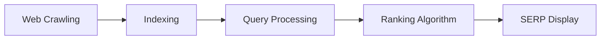
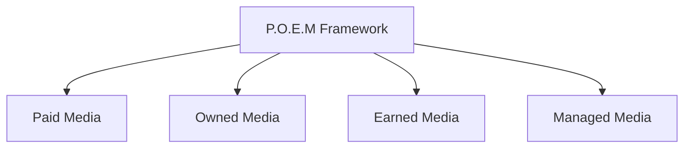
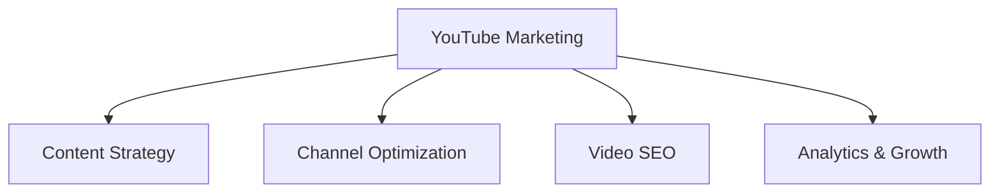
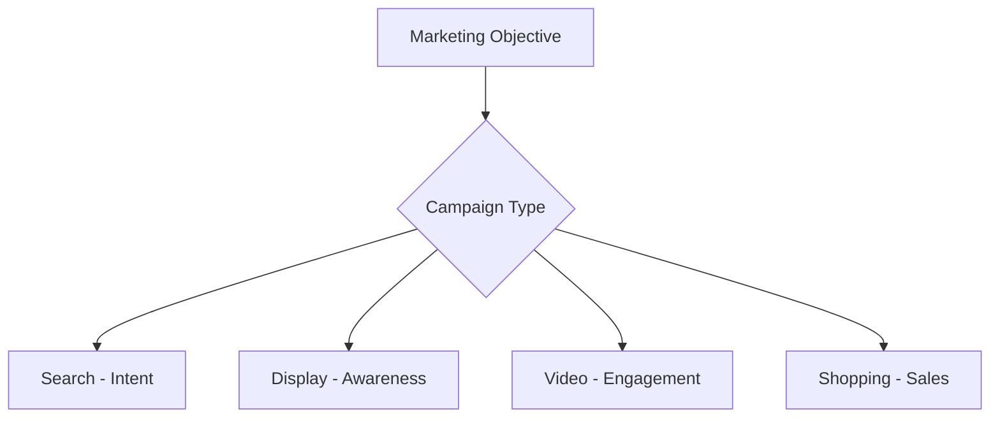
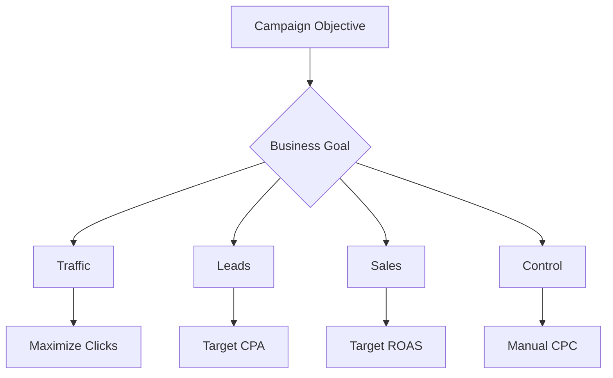

## Question 1(a) [3 marks]

**Differentiate: Traditional marketing and Digital marketing.**

**Answer**:

| Traditional Marketing | Digital Marketing |
|----------------------|-------------------|
| **Physical presence** required | **Online presence** through internet |
| **Limited reach** to local audience | **Global reach** to worldwide audience |
| **One-way communication** | **Two-way interactive** communication |
| **High cost** for advertising | **Cost-effective** campaigns |
| **Difficult to measure** ROI | **Easy tracking** and analytics |
| **Slow feedback** from customers | **Instant feedback** and responses |

**Mnemonic:** "PITCH vs CLICK" (Physical vs Interactive, Traditional vs Trackable, High-cost vs Cost-effective)

---

## Question 1(b) [4 marks]

**Explain working of search engine algorithm.**

**Answer**:

Search engine algorithms work through systematic processes to deliver relevant results:

**Process Flow:**

- **Crawling**: Search bots scan websites continuously to discover new content
- **Indexing**: Analyzed content is stored in massive databases with keywords
- **Query matching**: User search terms are matched with indexed content
- **Ranking factors**: Content relevance, authority, and user experience determine position

**Mnemonic:** "CIRR" (Crawl, Index, Rank, Results)

---

## Question 1(c) [7 marks]

**Explain the key components of a digital marketing plan.**

**Answer**:

A comprehensive digital marketing plan includes essential components for success:

| Component | Description | Purpose |
|-----------|-------------|---------|
| **Situation Analysis** | Current market position and SWOT | Understanding starting point |
| **Target Audience** | Demographics and buyer personas | Focused marketing efforts |
| **Goals & Objectives** | SMART goals with KPIs | Measurable outcomes |
| **Strategy Selection** | SEO, SEM, Social Media, Email | Channel optimization |
| **Budget Allocation** | Resource distribution across channels | Cost management |
| **Content Calendar** | Scheduled content publication | Consistent engagement |
| **Analytics Setup** | Tracking tools and metrics | Performance monitoring |

**Key Success Factors:**

- **Research-driven** approach with market insights
- **Integration** across multiple digital channels
- **Flexibility** to adapt based on performance data

**Mnemonic:** "STGSBC Analytics" (Situation, Target, Goals, Strategy, Budget, Content, Analytics)

---

## Question 1(c) OR [7 marks]

**Explain the components of the P.O.E.M. framework and their relevance in digital marketing.**

**Answer**:

P.O.E.M. framework categorizes digital marketing channels for strategic planning:

| Component | Definition | Examples | Relevance |
|-----------|------------|----------|-----------|
| **Paid Media** | Purchased advertising space | Google Ads, Facebook Ads | **Immediate reach** and control |
| **Owned Media** | Brand-controlled channels | Website, email lists, blogs | **Long-term asset** building |
| **Earned Media** | Third-party endorsements | Reviews, shares, mentions | **Credibility** and trust |
| **Managed Media** | Influenced but not owned | Influencer partnerships | **Extended reach** through others |

**Strategic Benefits:**

- **Balanced approach** across all media types
- **Cost optimization** through channel mix
- **Amplified impact** when channels work together

**Mnemonic:** "POEM builds Digital SUCCESS" (Paid, Owned, Earned, Managed)

---

## Question 2(a) [3 marks]

**Describe need of SEO.**

**Answer**:

SEO is essential for online visibility and business growth:

- **Organic traffic**: 68% of online experiences begin with search engines
- **Cost-effective**: No direct payment for organic rankings unlike paid ads
- **Trust building**: Higher rankings create credibility with users
- **Long-term results**: Sustainable traffic growth over time

**Mnemonic:** "OCTL" (Organic, Cost-effective, Trust, Long-term)

---

## Question 2(b) [4 marks]

**Differentiate between on-page and off-page optimization.**

**Answer**:

| On-Page SEO | Off-Page SEO |
|-------------|--------------|
| **Website elements** optimization | **External factors** optimization |
| **Title tags, meta descriptions** | **Backlinks from other sites** |
| **Content quality and keywords** | **Social media signals** |
| **Internal linking structure** | **Domain authority building** |
| **Complete control** by website owner | **Limited control**, depends on others |
| **Technical optimization** focus | **Authority and popularity** focus |

**Mnemonic:** "IN vs OUT" (Internal optimization vs Outbound authority)

---

## Question 2(c) [7 marks]

**Explain SEO ranking and ways to improve SEO ranking.**

**Answer**:

SEO ranking determines website position in search engine results pages (SERPs).

**Ranking Factors Table:**

| Factor Category | Techniques | Impact Level |
|----------------|------------|--------------|
| **Content Quality** | Original, valuable content | High |
| **Keywords** | Research and natural placement | High |
| **Technical SEO** | Site speed, mobile-friendly | Medium |
| **Backlinks** | Quality link building | High |
| **User Experience** | Low bounce rate, high engagement | Medium |

**Improvement Strategies:**

- **Content optimization**: Create comprehensive, user-focused content
- **Keyword research**: Target relevant, achievable keywords
- **Technical fixes**: Improve site speed and mobile responsiveness
- **Link building**: Earn quality backlinks from authoritative sites
- **User signals**: Enhance engagement metrics

**Success Metrics:**

- **SERP position** improvements
- **Organic traffic** growth
- **Click-through rates** increase

**Mnemonic:** "CKTU for SEO SUCCESS" (Content, Keywords, Technical, User-experience)

---

## Question 2(a) OR [3 marks]

**Define: 1. Backlinks 2. Website Speed 3. Keyword stuffing.**

**Answer**:

| Term | Definition |
|------|------------|
| **Backlinks** | Incoming hyperlinks from external websites pointing to your site |
| **Website Speed** | Time taken for web pages to load completely in browser |
| **Keyword Stuffing** | Overuse of keywords unnaturally in content to manipulate rankings |

**Mnemonic:** "BWK" (Backlinks, Website speed, Keyword stuffing)

---

## Question 2(b) OR [4 marks]

**Differentiate between Black Hat and White Hat SEO Techniques.**

**Answer**:

| White Hat SEO | Black Hat SEO |
|---------------|---------------|
| **Ethical practices** following guidelines | **Manipulative tactics** violating rules |
| **Quality content** creation | **Content scraping** and duplication |
| **Natural link building** | **Link farms** and paid links |
| **Long-term results** | **Quick but risky** gains |
| **Search engine approved** | **Penalty risks** from search engines |

**Mnemonic:** "GOOD vs BAD" (Guidelines-following vs Penalty-risking)

---

## Question 2(c) OR [7 marks]

**Give name of any three common SEO tools and describe their functions.**

**Answer**:

| SEO Tool | Primary Functions | Key Features |
|----------|------------------|--------------|
| **Google Analytics** | Website traffic analysis | Visitor behavior, conversion tracking, audience insights |
| **SEMrush** | Keyword research and competitor analysis | Keyword difficulty, backlink analysis, site audit |
| **Yoast SEO** | On-page optimization (WordPress) | Content optimization, technical SEO, readability analysis |

**Detailed Functions:**

- **Google Analytics**: Tracks user journey, bounce rates, and goal completions
- **SEMrush**: Identifies ranking opportunities and monitors competitor strategies  
- **Yoast SEO**: Provides real-time optimization suggestions for content and meta tags

**Benefits:**

- **Data-driven decisions** through comprehensive analytics
- **Competitive advantage** with market insights
- **Efficiency** in optimization tasks

**Mnemonic:** "GSY Tools" (Google Analytics, SEMrush, Yoast)

---

## Question 3(a) [3 marks]

**Explain any one Multi-touch attribution model with example.**

**Answer**:

**Linear Attribution Model** distributes credit equally across all touchpoints in customer journey.

**Example Scenario:**
Customer journey: Social Media Ad → Email → Website Visit → Purchase

**Credit Distribution:**

- Social Media Ad: 25%
- Email: 25%  
- Website Visit: 25%
- Purchase Page: 25%

**Mnemonic:** "EQUAL Credit for ALL Touches" (Linear = Equal distribution)

---

## Question 3(b) [4 marks]

**Explain following Key metrics: Unique Visitors, Bounce Rate.**

**Answer**:

| Metric | Definition | Significance |
|--------|------------|--------------|
| **Unique Visitors** | Count of individual users visiting website in specific period | Measures **audience reach** and growth |
| **Bounce Rate** | Percentage of visitors leaving after viewing only one page | Indicates **content relevance** and engagement |

**Optimization Tips:**

- **Unique Visitors**: Increase through SEO and social media
- **Bounce Rate**: Improve with better content and site navigation

**Mnemonic:** "UV-BR" (Unique Visitors measure reach, Bounce Rate measures engagement)

---

## Question 3(c) [7 marks]

**Explain following tracking code with their advantage and disadvantage: Long tracking code, UTM code.**

**Answer**:

| Tracking Code Type | Description | Advantages | Disadvantages |
|-------------------|-------------|------------|---------------|
| **Long Tracking Code** | Detailed parameters with extensive information | **Comprehensive data** collection, **Detailed insights** | **Complex URLs**, **User-unfriendly** appearance |
| **UTM Code** | Urchin Tracking Module parameters for campaign tracking | **Simple implementation**, **Campaign-specific** tracking | **Limited data**, **Manual management** required |

**UTM Parameters:**

- **utm_source**: Traffic source (google, facebook)
- **utm_medium**: Marketing medium (cpc, email)  
- **utm_campaign**: Campaign name (summer_sale)

**Best Practices:**

- **Consistent naming** conventions
- **URL shortening** for long tracking codes
- **Regular monitoring** of campaign performance

**Mnemonic:** "LONG vs SHORT" (Comprehensive vs Simple tracking)

---

## Question 3(a) OR [3 marks]

**Explain any one Single-touch attribution model with example.**

**Answer**:

**Last-Click Attribution Model** gives 100% credit to the final touchpoint before conversion.

**Example Scenario:**
Customer journey: Social Media → Email → Google Search → Purchase

**Credit Distribution:**

- Google Search: 100%
- Other touchpoints: 0%

**Use Case:** Simple e-commerce tracking focusing on immediate conversion drivers

**Mnemonic:** "LAST WINS ALL" (Final touchpoint gets full credit)

---

## Question 3(b) OR [4 marks]

**Explain following Key metrics: Pageviews, New Visits.**

**Answer**:

| Metric | Definition | Measurement Value |
|--------|------------|-------------------|
| **Pageviews** | Total number of pages viewed including repeat views | **Content popularity** and site usage |
| **New Visits** | Percentage of first-time visitors to website | **Audience growth** and reach expansion |

**Analysis Importance:**

- **Pageviews**: Higher numbers indicate engaging content
- **New Visits**: Growth shows effective marketing outreach

**Mnemonic:** "PN Metrics" (Pageviews for engagement, New visits for growth)

---

## Question 3(c) OR [7 marks]

**Describe various types of web analytics tool.**

**Answer**:

| Tool Category | Purpose | Examples | Key Features |
|---------------|---------|----------|--------------|
| **Content Analytics** | Content performance tracking | Google Analytics, Adobe Analytics | Page views, time on page, bounce rate |
| **Customer Analytics** | User behavior analysis | Hotjar, Crazy Egg | Heatmaps, session recordings |
| **SEO Analytics** | Search optimization | SEMrush, Ahrefs | Keyword rankings, backlink analysis |
| **Social Media Analytics** | Social performance | Facebook Insights, Twitter Analytics | Engagement rates, reach metrics |
| **A/B Testing Tools** | Conversion optimization | Optimizely, VWO | Split testing, conversion tracking |

**Selection Criteria:**

- **Business objectives** alignment
- **Integration capabilities** with existing tools
- **Cost-effectiveness** for organization size

**Implementation Benefits:**

- **Data-driven decisions** for marketing strategy
- **ROI measurement** across channels
- **User experience** optimization

**Mnemonic:** "CCSSA Analytics" (Content, Customer, SEO, Social, A/B testing)

---

## Question 4(a) [3 marks]

**Explain Social Media Marketing.**

**Answer**:

Social Media Marketing uses social platforms to promote products and engage audiences.

**Core Elements:**

- **Content creation** for target audience engagement
- **Community building** through consistent interaction  
- **Brand awareness** through organic and paid strategies
- **Customer support** via social channels

**Mnemonic:** "CCBC" (Content, Community, Brand awareness, Customer support)

---

## Question 4(b) [4 marks]

**Explain types of Instagram Ads.**

**Answer**:

| Ad Type | Format | Best Use Case |
|---------|--------|---------------|
| **Photo Ads** | Single image with caption | **Product showcasing** and brand awareness |
| **Video Ads** | Short video content | **Storytelling** and engagement |
| **Carousel Ads** | Multiple images/videos | **Product catalogs** and features |
| **Stories Ads** | Full-screen vertical format | **Immediate action** and urgency |

**Mnemonic:** "PVCS Instagram" (Photo, Video, Carousel, Stories)

---

## Question 4(c) [7 marks]

**Explain YouTube Marketing and its importance in digital marketing.**

**Answer**:

YouTube Marketing leverages video content for brand promotion and audience engagement.

**YouTube Marketing Components:**

| Component | Strategy | Importance |
|-----------|----------|------------|
| **Content Strategy** | Educational, entertaining videos | **Audience engagement** and value delivery |
| **Channel Optimization** | Branding, playlists, descriptions | **Professional presence** and discoverability |
| **Video SEO** | Keywords, thumbnails, titles | **Search visibility** and organic reach |
| **YouTube Ads** | TrueView, bumper ads | **Targeted promotion** and quick results |

**Digital Marketing Importance:**

- **Visual storytelling** builds emotional connections
- **Search engine benefits** (YouTube is 2nd largest search engine)
- **Cross-platform integration** with other marketing channels
- **Cost-effective** compared to traditional video advertising

**Success Metrics:**

- **Watch time** and retention rates
- **Subscriber growth** and engagement
- **Conversion tracking** from video to website

**Mnemonic:** "CCVA Success" (Content, Channel, Video SEO, Ads for YouTube success)

---

## Question 4(a) OR [3 marks]

**List the metrics available on Instagram for tracking the success of marketing strategies.**

**Answer**:

**Instagram Analytics Metrics:**

- **Reach**: Number of unique accounts seeing content
- **Impressions**: Total content views including repeats  
- **Engagement Rate**: Likes, comments, shares percentage
- **Profile Visits**: Traffic to Instagram business profile
- **Website Clicks**: Traffic driven to external website
- **Story Completion Rate**: Percentage viewing full stories

**Mnemonic:** "RIEPSW" (Reach, Impressions, Engagement, Profile visits, Story completion, Website clicks)

---

## Question 4(b) OR [4 marks]

**Explain types of YouTube Ads.**

**Answer**:

| YouTube Ad Type | Format | Duration | Best For |
|-----------------|--------|----------|----------|
| **TrueView In-Stream** | Skippable video ads | 12 seconds+ | **Brand awareness** campaigns |
| **TrueView Discovery** | Thumbnail + text | Variable | **Content promotion** |
| **Bumper Ads** | Non-skippable short ads | 6 seconds | **Quick messaging** |
| **Overlay Ads** | Banner on video | Static | **Website traffic** |

**Mnemonic:** "TTBO YouTube" (TrueView In-stream, TrueView Discovery, Bumper, Overlay)

---

## Question 4(c) OR [7 marks]

**Describe the targeting options available in Facebook advertising.**

**Answer**:

Facebook offers comprehensive targeting for precise audience reach:

| Targeting Category | Options | Purpose |
|-------------------|---------|---------|
| **Demographics** | Age, gender, education, income | **Basic audience** definition |
| **Location** | Countries, cities, radius | **Geographic** targeting |
| **Interests** | Hobbies, pages liked, activities | **Behavioral** targeting |
| **Behaviors** | Purchase history, device usage | **Action-based** targeting |
| **Custom Audiences** | Website visitors, email lists | **Retargeting** existing contacts |
| **Lookalike Audiences** | Similar to existing customers | **Audience expansion** |

**Advanced Features:**

- **Detailed targeting** with inclusion/exclusion options
- **Audience insights** for optimization
- **A/B testing** different audience segments

**Campaign Optimization:**

- **Narrow targeting** for specific products
- **Broad targeting** for brand awareness
- **Dynamic audiences** based on user behavior

**Performance Benefits:**

- **Higher conversion** rates through precision
- **Cost efficiency** with relevant audiences
- **Scalable growth** through lookalike expansion

**Mnemonic:** "DLIBCL Targeting" (Demographics, Location, Interests, Behaviors, Custom, Lookalike)

---

## Question 5(a) [3 marks]

**Explain the concept of LinkedIn marketing.**

**Answer**:

LinkedIn Marketing focuses on professional networking and B2B relationship building.

**Key Concepts:**

- **Professional audience** targeting for B2B sales
- **Thought leadership** through industry content
- **Network expansion** via connections and groups
- **Lead generation** through targeted campaigns

**Mnemonic:** "PTNL" (Professional, Thought leadership, Network, Leads)

---

## Question 5(b) [4 marks]

**Explain different types of email marketing campaigns.**

**Answer**:

| Campaign Type | Purpose | Timing |
|---------------|---------|--------|
| **Welcome Series** | New subscriber onboarding | **Immediate** after signup |
| **Newsletter** | Regular content updates | **Weekly/Monthly** schedule |
| **Promotional** | Sales and special offers | **Event-based** campaigns |
| **Abandoned Cart** | Recovery incomplete purchases | **24-48 hours** after abandonment |

**Mnemonic:** "WNPA Emails" (Welcome, Newsletter, Promotional, Abandoned cart)

---

## Question 5(c) [7 marks]

**Explain the different types of Google Ads Campaigns.**

**Answer**:

Google Ads offers multiple campaign types for different marketing objectives:

| Campaign Type | Platform | Ad Format | Best For |
|---------------|----------|-----------|----------|
| **Search Campaigns** | Google Search | Text ads | **High-intent** keyword targeting |
| **Display Campaigns** | Partner websites | Banner/image ads | **Brand awareness** and retargeting |
| **Video Campaigns** | YouTube | Video ads | **Engagement** and storytelling |
| **Shopping Campaigns** | Google Shopping | Product listings | **E-commerce** sales |
| **App Campaigns** | Multiple platforms | Automated ads | **App downloads** and engagement |
| **Smart Campaigns** | Automated placement | Mixed formats | **Small business** automation |

**Campaign Strategy Framework:**

**Optimization Strategies:**

- **Keyword research** for search campaigns
- **Audience targeting** for display campaigns
- **Creative testing** across all formats
- **Conversion tracking** for ROI measurement

**Budget Allocation:**

- **Search**: 40-50% for high-intent traffic
- **Display**: 20-30% for brand building
- **Video**: 15-25% for engagement
- **Shopping**: 10-20% for e-commerce

**Performance Metrics:**

- **Click-through rates** (CTR)
- **Cost per acquisition** (CPA)
- **Return on ad spend** (ROAS)

**Mnemonic:** "SDVSAS Google" (Search, Display, Video, Shopping, App, Smart campaigns)

---

## Question 5(a) OR [3 marks]

**Explain the concept of Twitter Marketing.**

**Answer**:

Twitter Marketing utilizes real-time communication for brand engagement and customer service.

**Core Elements:**

- **Real-time engagement** with trending topics
- **Customer support** through direct responses
- **Content amplification** via retweets and hashtags
- **Influencer partnerships** for extended reach

**Mnemonic:** "RCCI Twitter" (Real-time, Customer support, Content amplification, Influencer partnerships)

---

## Question 5(b) OR [4 marks]

**Give the difference between SEO and PPC.**

**Answer**:

| SEO (Search Engine Optimization) | PPC (Pay-Per-Click) |
|----------------------------------|---------------------|
| **Organic results** placement | **Paid advertisement** placement |
| **Long-term strategy** (3-6 months) | **Immediate results** (within hours) |
| **No direct cost** per click | **Cost per click** payment |
| **Sustainable traffic** growth | **Traffic stops** when budget ends |
| **Trust and credibility** higher | **Lower trust** (marked as ads) |
| **Requires ongoing** SEO efforts | **Requires continuous** budget |

**Mnemonic:** "OLNSTN vs PICRCR" (Organic, Long-term, No cost vs Paid, Immediate, Cost-per-click)

---

## Question 5(c) OR [7 marks]

**Explain various bidding strategies available in Google Ads.**

**Answer**:

Google Ads provides multiple bidding strategies for different campaign goals:

| Bidding Strategy | Type | Goal | Best For |
|------------------|------|------|----------|
| **Manual CPC** | Manual | **Traffic control** | **Experienced advertisers** |
| **Enhanced CPC** | Semi-automated | **Conversion optimization** | **Balanced control** |
| **Target CPA** | Automated | **Cost per acquisition** | **Lead generation** |
| **Target ROAS** | Automated | **Return on ad spend** | **E-commerce sales** |
| **Maximize Clicks** | Automated | **Traffic volume** | **Brand awareness** |
| **Maximize Conversions** | Automated | **Conversion volume** | **Campaign scaling** |

**Strategy Selection Framework:**

**Implementation Guidelines:**

- **Manual CPC**: Start with bid adjustments and keyword-level control
- **Enhanced CPC**: Allows Google to adjust bids up to 30% for better conversions
- **Target CPA**: Set based on historical conversion data
- **Target ROAS**: Requires sufficient conversion tracking data

**Performance Monitoring:**

- **Bid strategy reports** for effectiveness analysis
- **Search term reports** for keyword optimization
- **Auction insights** for competitor comparison

**Advanced Considerations:**

- **Conversion tracking** setup is crucial for automated strategies
- **Learning period** of 2-4 weeks for optimization
- **Budget sufficiency** for automated bidding effectiveness

**Mnemonic:** "METMM Bidding" (Manual, Enhanced, Target CPA, Target ROAS, Maximize clicks, Maximize conversions)
