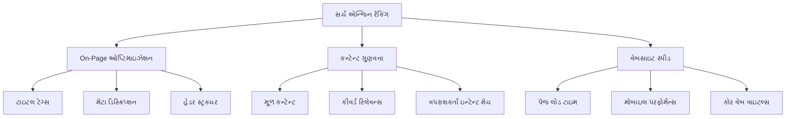
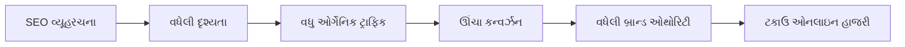
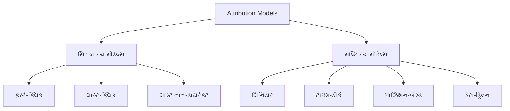
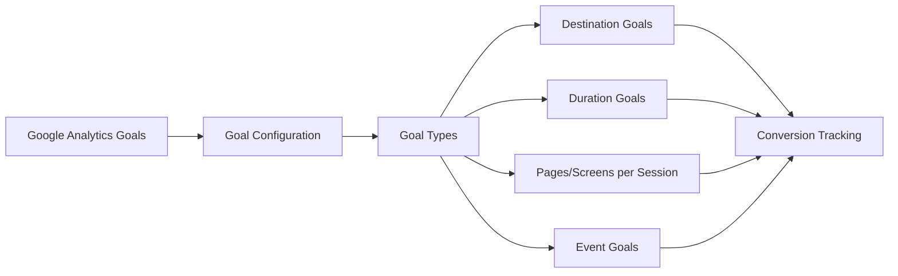
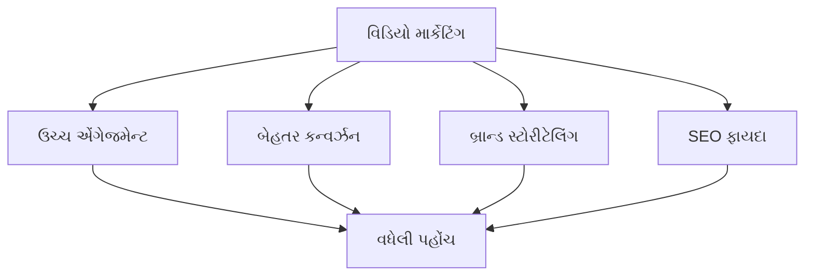
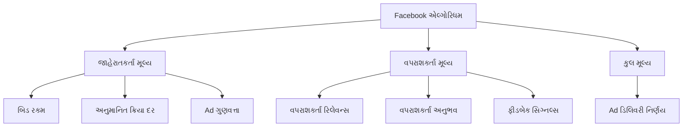
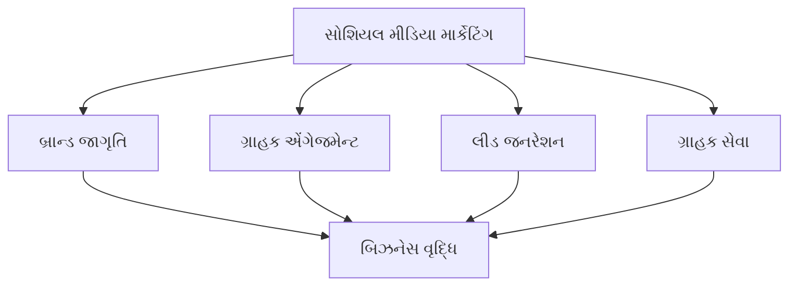
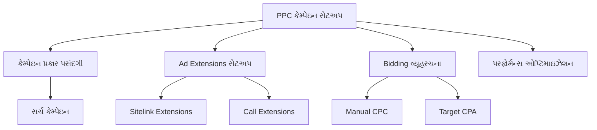
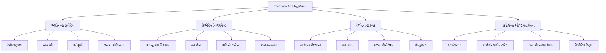

## પ્રશ્ન 1(અ) [3 ગુણ]

**SEO ranking સમજાવો.**

**જવાબ**:

SEO ranking એ ચોક્કસ કીવર્ડ અથવા પ્રશ્નો માટે સર્ચ એન્જિન પરિણામ પૃષ્ઠો (SERPs) માં વેબસાઇટ અથવા વેબપેજની સ્થિતિને દર્શાવે છે.

**મુખ્ય ઘટકો:**

| પરિબળ | વર્ણન |
|--------|---------|
| **પેજ પોઝિશન** | પ્રથમ પેજ પર સંખ્યાત્મક સ્થિતિ (1-10) |
| **સર્ચ વિઝિબિલિટી** | સર્ચ પરિણામોમાં કેટલી વાર સાઇટ દેખાય છે |
| **કીવર્ડ રિલેવન્સ** | કન્ટેન્ટ અને સર્ચ શબ્દો વચ્ચેનો મેળ |

- **ઉંચી રેંકિંગ**: બહેતર દૃશ્યતા અને વધુ ઓર્ગેનિક ટ્રાફિક
- **એલ્ગોરિધમ-આધારિત**: Google 200+ રેંકિંગ પરિબળોનો ઉપયોગ કરે છે
- **ગતિશીલ પ્રકૃતિ**: એલ્ગોરિધમ અપડેટ્સના આધારે રેંકિંગ બદલાય છે

**મેમરી ટ્રીક:** "SERP સફળતા સ્માર્ટ SEO સાથે શરૂ થાય છે"

---

## પ્રશ્ન 1(બ) [4 ગુણ]

**ડિજિટલ માર્કેટિંગમાં P.O.E.M. ફ્રેમવર્કનું વર્ણન કરો**

**જવાબ**:

P.O.E.M. ફ્રેમવર્ક એ ડિજિટલ માર્કેટિંગ ચેનલો અને કન્ટેન્ટ ડિસ્ટ્રિબ્યુશનને વર્ગીકૃત કરવાનો વ્યૂહાત્મક અભિગમ છે.

**ફ્રેમવર્ક ઘટકો:**

| ચેનલ પ્રકાર | વ્યાખ્યા | ઉદાહરણો |
|-------------|---------|----------|
| **Paid** | ખરીદેલી જાહેરાત જગ્યા | Google Ads, Facebook Ads |
| **Owned** | બ્રાન્ડ-નિયંત્રિત પ્લેટફોર્મ | વેબસાઇટ, Email lists |
| **Earned** | ત્રીજા પક્ષની સમર્થન | રિવ્યુઝ, સોશિયલ શેર |
| **Managed** | નિયંત્રિત સોશિયલ હાજરી | Facebook Pages, Twitter |

- **સંકલિત અભિગમ**: મહત્તમ પહોંચ માટે બધી ચેનલોને સંયોજિત કરે છે
- **કોસ્ટ ઓપ્ટિમાઇઝેશન**: પેઇડ અને ઓર્ગેનિક પ્રયત્નોને સંતુલિત કરે છે
- **બ્રાન્ડ કંટ્રોલ**: બધી ચેનલોમાં સુસંગત મેસેજિંગ જાળવે છે

**મેમરી ટ્રીક:** "લોકો ઘણીવાર પૈસા કમાય છે"

---

## પ્રશ્ન 1(ક) [7 ગુણ]

**ડિજિટલ માર્કેટિંગમાં નૈતિકતા અને ડેટા ગોપનીયતાના મહત્વ પર ચર્ચા કરો. નૈતિક પ્રથાઓ અને ડેટા ગોપનીયતા પ્રત્યેની પ્રતિબદ્ધતા "ગૌરવપૂર્ણ ડિજિટલ માર્કેટિંગ" માં કેવી રીતે યોગદાન આપે છે**

**જવાબ**:

આજના ડેટા-સંચાલિત લેન્ડસ્કેપમાં નૈતિકતા અને ડેટા ગોપનીયતા જવાબદાર ડિજિટલ માર્કેટિંગ પ્રથાઓનો પાયો છે.

**નૈતિક મહત્વ:**

| પાસું | મહત્વ |
|------|--------|
| **ગ્રાહક વિશ્વાસ** | લાંબા ગાળાના સંબંધો બનાવે છે |
| **કાયદાકીય અનુપાલન** | GDPR/CCPA દંડથી બચાવે છે |
| **બ્રાન્ડ પ્રતિષ્ઠા** | સકારાત્મક છબી જાળવે છે |
| **બજાર ટકાઉપણું** | ઉદ્યોગની વિશ્વસનીયતા સુનિશ્ચિત કરે છે |

**ડેટા ગોપનીયતા પ્રથાઓ:**

- **પારદર્શક સંગ્રહ**: સ્પષ્ટ સંમતિ તંત્ર
- **ન્યૂનતમ ડેટા એકત્રીકરણ**: ફક્ત જરૂરી માહિતી
- **સુરક્ષિત સંગ્રહ**: એન્ક્રિપ્ટેડ ડેટાબેસ અને એક્સેસ કંટ્રોલ
- **વપરાશકર્તા અધિકારો**: સરળ opt-out અને ડેટા ડિલીશન વિકલ્પો

**ગૌરવપૂર્ણ ડિજિટલ માર્કેટિંગના ફાયદા:**

- **વધેલી વિશ્વસનીયતા**: ગ્રાહકો નૈતિક બ્રાન્ડ્સ પર વિશ્વાસ કરે છે
- **સ્પર્ધાત્મક ફાયદો**: જવાબદાર પ્રથાઓ દ્વારા અલગતા
- **નિયમનકારી અનુપાલન**: ગોપનીયતા કાયદાઓ માટે સક્રિય અભિગમ
- **ટકાઉ વૃદ્ધિ**: લાંબા ગાળાના ગ્રાહક સંબંધો

**મેમરી ટ્રીક:** "પારદર્શિતા દ્વારા વિશ્વાસ જીતો"

---

## પ્રશ્ન 1(ક) વા [7 ગુણ]

**પરંપરાગત માર્કેટિંગ અને ડિજિટલ માર્કેટિંગ વચ્ચે તેમની પહોંચ, ટાર્ગેટિંગ, કોસ્ટ-અસરકારકતા અને સફળતા માપનના દ્રષ્ટિકોણથી તફાવત કરો.**

**જવાબ**:

**તુલનાત્મક વિશ્લેષણ:**

| પરિબળ | પરંપરાગત માર્કેટિંગ | ડિજિટલ માર્કેટિંગ |
|--------|---------------------|-------------------|
| **પહોંચ** | સ્થાનિક/પ્રાદેશિક મર્યાદાઓ | તરત જ વૈશ્વિક પ્રેક્ષકો |
| **ટાર્ગેટિંગ** | વ્યાપક ડેમોગ્રાફિક જૂથો | ચોક્કસ વર્તણૂકીય ટાર્ગેટિંગ |
| **ખર્ચ** | ઉંચા અગાઉથી રોકાણ | લવચીક બજેટ વિકલ્પો |
| **માપણ** | ROI ટ્રેક કરવું મુશ્કેલ | રીઅલ-ટાઇમ એનાલિટિક્સ ઉપલબ્ધ |

**વિગતવાર તફાવતો:**

**પહોંચ ક્ષમતાઓ:**

- **પરંપરાગત**: ભૌગોલિક અવરોધો, મર્યાદિત પ્રેક્ષકો
- **ડિજિટલ**: વિશ્વવ્યાપી પહોંચ, 24/7 ઉપલબ્ધતા

**ટાર્ગેટિંગ ચોકસાઈ:**

- **પરંપરાગત**: મોટા બજાર અભિગમ, મર્યાદિત વિભાજન
- **ડિજિટલ**: વ્યક્તિગત-સ્તરે ટાર્ગેટિંગ, વર્તણૂકીય ડેટા વપરાશ

**કોસ્ટ સ્ટ્રક્ચર:**

- **પરંપરાગત**: નિશ્ચિત ખર્ચ, ન્યૂનતમ ખર્ચ જરૂરિયાતો
- **ડિજિટલ**: પે-પર-ક્લિક, સ્કેલેબલ બજેટ, સૂક્ષ્મ રોકાણ

**સફળતા માપણ:**

- **પરંપરાગત**: સર્વેક્ષણો, અનુમાનિત પહોંચ ગણતરીઓ
- **ડિજિટલ**: ક્લિક-થ્રુ રેટ્સ, કન્વર્ઝન ટ્રેકિંગ, એટ્રિબ્યુશન મોડેલ્સ

**મેમરી ટ્રીક:** "પહોંચ, ટાર્ગેટ, કોસ્ટ, માપો - ડિજિટલ બેહતર"

---

## પ્રશ્ન 2(અ) [3 ગુણ]

**White Hat SEO અને Black Hat SEO વચ્ચે સરખામણી કરો**

**જવાબ**:

**SEO પ્રથાઓની સરખામણી:**

| પાસું | White Hat SEO | Black Hat SEO |
|------|---------------|---------------|
| **પદ્ધતિઓ** | નૈતિક, ગાઇડલાઇન-અનુકૂળ | ચાલાકીપૂર્ણ, નિયમ-ભંગ |
| **સમયમર્યાદા** | લાંબા ગાળાના ટકાઉ પરિણામો | ઝડપી પરંતુ અસ્થાયી લાભ |
| **જોખમ** | સર્ચ એન્જિન મંજૂર | દંડ અને પ્રતિબંધ જોખમો |

- **White Hat**: ગુણવત્તાયુક્ત કન્ટેન્ટ, કુદરતી લિંક બિલ્ડિંગ, વપરાશકર્તા-કેન્દ્રિત ઓપ્ટિમાઇઝેશન
- **Black Hat**: કીવર્ડ સ્ટફિંગ, છુપાયેલું ટેક્સ્ટ, લિંક ફાર્મિંગ
- **પરિણામો**: White Hat ઓથોરિટી બનાવે છે, Black Hat દંડનું જોખમ છે

**મેમરી ટ્રીક:** "વાઇટ છે રાઇટ, બ્લેક એટેક"

---

## પ્રશ્ન 2(બ) [4 ગુણ]

**Outdated content અને slow loading times ધરાવતી વેબસાઇટ assume કરો અને તેની search engine rankings સુધારવા માટેની SEO tactics apply કરો.**

**જવાબ**:

**SEO સુધારણા વ્યૂહરચના:**

```goat
જૂની વેબસાઇટ સમસ્યાઓ
         |
    +----+----+
    |         |
કન્ટેન્ટ    પરફોર્મન્સ
સમસ્યાઓ     સમસ્યાઓ
    |         |
    v         v
તાજું      સ્પીડ
કન્ટેન્ટ    ઓપ્ટિમાઇઝેશન
    |         |
    +----+----+
         |
   સુધારેલી રેંકિંગ
```

**વ્યૂહાત્મક ઉકેલો:**

| સમસ્યા | SEO યુક્તિ | અમલીકરણ |
|-------|-------------|----------|
| **જૂનું કન્ટેન્ટ** | કન્ટેન્ટ રિફ્રેશ | વર્તમાન માહિતી સાથે અપડેટ |
| **ધીમું લોડિંગ** | પરફોર્મન્સ ઓપ્ટિમાઇઝેશન | ઇમેજ કોમ્પ્રેસ, કોડ મિનિમાઇઝ |
| **નબળું સ્ટ્રક્ચર** | ટેકનિકલ SEO | સાઇટ આર્કિટેક્ચર સુધારો |

- **કન્ટેન્ટ વ્યૂહરચના**: નિયમિત અપડેટ્સ, ટ્રેન્ડિંગ વિષયો, વપરાશકર્તા-સંબંધિત માહિતી
- **ટેકનિકલ ફિક્સ**: CDN અમલીકરણ, કેશિંગ, મોબાઇલ ઓપ્ટિમાઇઝેશન
- **મોનિટરિંગ**: પેજ સ્પીડ, વપરાશકર્તા એંગેજમેન્ટ મેટ્રિક્સ ટ્રેક કરો

**મેમરી ટ્રીક:** "કન્ટેન્ટ કરન્સી ક્લિક્સ બનાવે છે"

---

## પ્રશ્ન 2(ક) [7 ગુણ]

**on-page optimization, content quality, અને વેબસાઇટની ઝડપ કેવી રીતે સારી search engine rankings માટે યોગદાન આપે છે તે ચર્ચા કરો. આ વિસ્તારોમાં વેબસાઇટની visibility વધારવા માટેની કેટલીક વિશિષ્ટ તકનીકોના ઉદાહરણ આપો**

**જવાબ**:

**SEO રેંકિંગ પરિબળો:**



**On-Page ઓપ્ટિમાઇઝેશન ટેકનિક્સ:**

| એલિમેન્ટ | બેસ્ટ પ્રેક્ટિસ | ઉદાહરણ |
|----------|----------------|----------|
| **ટાઇટલ ટેગ્સ** | પ્રાથમિક કીવર્ડ શામેલ કરો | "શ્રેષ્ઠ ડિજિટલ માર્કેટિંગ ટૂલ્સ 2025" |
| **મેટા ડિસ્ક્રિપ્શન** | આકર્ષક 155-160 અક્ષરો | "ટોચના ડિજિટલ માર્કેટિંગ ટૂલ્સ શોધો..." |
| **હેડર ટેગ્સ** | વંશવેલો સ્ટ્રક્ચર | H1→H2→H3 તાર્કિક પ્રવાહ |
| **આંતરિક લિંકિંગ** | સંબંધિત પેજ કનેક્શન્સ | સંબંધિત બ્લોગ પોસ્ટ્સ લિંક કરો |

**કન્ટેન્ટ ગુણવત્તા પરિબળો:**

- **મૌલિકતા**: અનોખી, મૂલ્યવાન માહિતી
- **ઊંડાઈ**: વિષયનું વ્યાપક કવરેજ
- **તાજગી**: નિયમિત અપડેટ્સ અને વર્તમાન ડેટા
- **વપરાશકર્તા એંગેજમેન્ટ**: પેજ પર સમય, ઓછી બાઉન્સ રેટ

**વેબસાઇટ સ્પીડ ઓપ્ટિમાઇઝેશન:**

- **ઇમેજ કોમ્પ્રેશન**: WebP ફોર્મેટ, લેઝી લોડિંગ
- **કોડ મિનિફિકેશન**: CSS, JavaScript ઓપ્ટિમાઇઝેશન
- **કેશિંગ વ્યૂહરચના**: બ્રાઉઝર અને સર્વર-સાઇડ કેશિંગ
- **CDN અમલીકરણ**: વૈશ્વિક કન્ટેન્ટ ડિલિવરી

**મેમરી ટ્રીક:** "ઓપ્ટિમાઇઝ, ગુણવત્તા, સ્પીડ = સફળતા"

---

## પ્રશ્ન 2(અ) વા [3 ગુણ]

**Search engine ની crawling થી ranking process માં આવેલા મુખ્ય steps ની ચર્ચા કરો.**

**જવાબ**:

**સર્ચ એન્જિન પ્રક્રિયા:**

| સ્ટેપ | પ્રક્રિયા | વર્ણન |
|------|---------|--------|
| **1. ક્રોલિંગ** | શોધ | બોટ્સ નવા/અપડેટેડ પેજ શોધે છે |
| **2. ઇન્ડેક્સિંગ** | સંગ્રહ | કન્ટેન્ટનું વિશ્લેષણ અને સંગ્રહ |
| **3. રેંકિંગ** | મૂલ્યાંકન | એલ્ગોરિધમ રિલેવન્સ નક્કી કરે છે |

- **ક્રોલિંગ**: સ્પાઇડર બોટ્સ લિંક્સ અનુસરે છે, કન્ટેન્ટ શોધે છે
- **ઇન્ડેક્સિંગ**: કન્ટેન્ટ પાર્સ, કીવર્ડ્સ ઓળખાણ, ડેટાબેસ સંગ્રહ
- **રેંકિંગ**: એલ્ગોરિધમ મૂલ્યાંકન, SERP સ્થિતિ નિર્ધારણ

**મેમરી ટ્રીક:** "ક્રોલ, ઇન્ડેક્સ, રેંક - સર્ચ સફળતા"

---

## પ્રશ્ન 2(બ) વા [4 ગુણ]

**ઓછી search engine visibility ધરાવતી વેબસાઇટ પર on-page optimization ના concepts apply કરો. તેની rankings સુધારવા માટે ત્રણ વિશિષ્ટ on-page SEO tactics સૂચવો**

**જવાબ**:

**On-Page SEO સુધારણા યોજના:**

```goat
નીચી વિઝિબિલિટી વેબસાઇટ
         |
    +----+----+
    |    |    |
ટાઇટલ  મેટા  કન્ટેન્ટ
ઓપ્ટિમાઇઝેશન  ઓપ્ટિમાઇઝેશન
    |    |    |
    +----+----+
         |
   બેહતર રેંકિંગ
```

**ત્રણ મુખ્ય યુક્તિઓ:**

| યુક્તિ | અમલીકરણ | અપેક્ષિત અસર |
|-------|-----------|---------------|
| **ટાઇટલ ટેગ ઓપ્ટિમાઇઝેશન** | પ્રાથમિક કીવર્ડ્સ, બ્રાન્ડ નામ શામેલ કરો | બેહતર ક્લિક-થ્રુ રેટ્સ |
| **કન્ટેન્ટ સ્ટ્રક્ચર** | H1-H6 હેડર્સ, બુલેટ પોઇન્ટ્સ ઉમેરો | બેહતર વપરાશકર્તા અનુભવ |
| **આંતરિક લિંકિંગ** | સંબંધિત પેજો લિંક કરો, એન્કર ટેક્સ્ટ | વધેલી પેજ ઓથોરિટી |

- **કીવર્ડ પ્લેસમેન્ટ**: ટાઇટલ, હેડર્સ, પ્રથમ પેરાગ્રાફમાં વ્યૂહાત્મક સ્થાન
- **મેટા ડિસ્ક્રિપ્શન**: આકર્ષક 155-અક્ષર સારાંશ
- **ઇમેજ ઓપ્ટિમાઇઝેશન**: Alt ટેગ્સ, વર્ણનાત્મક ફાઇલનામ

**મેમરી ટ્રીક:** "ટાઇટલ, સ્ટ્રક્ચર, લિંક - સફળતાનું ચિંતન"

---

## પ્રશ્ન 2(ક) વા [7 ગુણ]

**વેબસાઇટની ઓનલાઇન હાજરી વધારવામાં SEO ની ભૂમિકા ચર્ચા કરો. ઉદાહરણ સાથે સમજાવો.**

**જવાબ**:

SEO વ્યવસાયો અને સંસ્થાઓ માટે મજબૂત ડિજિટલ ફૂટપ્રિન્ટ સ્થાપિત કરવા અને જાળવવામાં મહત્વપૂર્ણ ભૂમિકા ભજવે છે.

**ઓનલાઇન હાજરીમાં SEO ની ભૂમિકા:**



**મુખ્ય યોગદાન:**

| પાસું | SEO અસર | વ્યાપારિક ફાયદો |
|------|----------|------------------|
| **સર્ચ વિઝિબિલિટી** | ઊંચી SERP રેંકિંગ | વધુ સંભવિત ગ્રાહકો તમને શોધે છે |
| **વિશ્વસનીયતા** | આધિકારિક કન્ટેન્ટ | વપરાશકર્તાઓ ટોચની રેંકવાળા પરિણામો પર વિશ્વાસ કરે છે |
| **વપરાશકર્તા અનુભવ** | ઝડપી, મોબાઇલ-ફ્રેન્ડલી સાઇટ્સ | બેહતર એંગેજમેન્ટ મેટ્રિક્સ |
| **કોસ્ટ-અસરકારક** | ઓર્ગેનિક ટ્રાફિક જનરેશન | ઓછી ગ્રાહક અધિગ્રહણ કિંમતો |

**ઉદાહરણ: ઇ-કોમર્સ સ્ટોર:**
એક સ્થાનિક ઇલેક્ટ્રોનિક્સ સ્ટોરે SEO વ્યૂહરચના અમલ કરી:

- **પહેલાં**: "electronics store" માટે પેજ 3 પર રેંકિંગ
- **SEO ક્રિયાઓ**: પ્રોડક્ટ પેજ ઓપ્ટિમાઇઝ, લોકલ SEO, ગુણવત્તાયુક્ત કન્ટેન્ટ
- **પછી**: પેજ 1 રેંકિંગ, 300% ટ્રાફિક વધારો, 150% વેચાણ વૃદ્ધિ

**લાંબા ગાળાના ફાયદા:**

- **ટકાઉ ટ્રાફિક**: પેઇડ જાહેરાતોથી વિપરીત, ઓર્ગેનિક પરિણામો સ્થિર રહે છે
- **બ્રાન્ડ બિલ્ડિંગ**: સતત દૃશ્યતા ઓળખ બનાવે છે
- **બજાર વિસ્તરણ**: ઉત્પાદનો માટે સક્રિયપણે શોધતા ગ્રાહકો સુધી પહોંચો

**મેમરી ટ્રીક:** "સર્ચ એન્જિન ઓપ્ટિમાઇઝેશન = ટકાઉ ઓનલાઇન સફળતા"

---

## પ્રશ્ન 3(અ) [3 ગુણ]

**Unique Visitors, Pageviews વ્યાખ્યાયિત કરો**

**જવાબ**:

**વેબ એનાલિટિક્સ વ્યાખ્યાઓ:**

| મેટ્રિક | વ્યાખ્યા | માપણ સમયગાળો |
|---------|---------|-----------------|
| **Unique Visitors** | સાઇટની મુલાકાત લેતા અલગ વ્યક્તિઓ | ચોક્કસ સમયગાળો |
| **Pageviews** | જોવાયેલા કુલ પેજ | વ્યક્તિગત પેજ લોડ્સ |

- **Unique Visitors**: પેજ જોયા હોય તે ગમે તેટલા હોય, સત્ર દીઠ એકવાર ગણાય છે
- **Pageviews**: દરેક પેજ રિફ્રેશ અથવા નવા પેજ અલગ ગણાય છે
- **સંબંધ**: એક અનન્ય મુલાકાતી અનેક pageviews જનરેટ કરી શકે છે

**મેમરી ટ્રીક:** "અનોખા વપરાશકર્તાઓ, જોવાયેલા પેજો"

---

## પ્રશ્ન 3(બ) [4 ગુણ]

**વેબસાઇટની કાર્યક્ષમતાને સમજવા Content Analytics Tools કેવી રીતે યોગદાન આપે છે?**

**જવાબ**:

Content Analytics Tools વપરાશકર્તાઓ વેબસાઇટ કન્ટેન્ટ સાથે કેવી રીતે ક્રિયાપ્રતિક્રિયા કરે છે તેની અંતર્દૃષ્ટિ પ્રદાન કરે છે, જે ડેટા-સંચાલિત ઓપ્ટિમાઇઝેશન નિર્ણયો સક્ષમ કરે છે.

**યોગદાન ક્ષેત્રો:**

| વિશ્લેષણ પ્રકાર | પ્રદાન કરેલી અંતર્દૃષ્ટિ | ઓપ્ટિમાઇઝેશન ક્રિયાઓ |
|----------------|----------------------|----------------------|
| **કન્ટેન્ટ પરફોર્મન્સ** | પેજ લોકપ્રિયતા, એંગેજમેન્ટ સમય | ઉચ્ચ પ્રદર્શન વિષયો પર ધ્યાન કેન્દ્રિત કરો |
| **વપરાશકર્તા વર્તન** | વાંચન પેટર્ન, સ્ક્રોલ ઊંડાઈ | કન્ટેન્ટ સ્ટ્રક્ચર સુધારો |
| **કન્વર્ઝન ટ્રેકિંગ** | કન્ટેન્ટ-ટુ-કન્વર્ઝન પાથ | કન્વર્ઝન ફનલ ઓપ્ટિમાઇઝ કરો |

- **પરફોર્મન્સ મેટ્રિક્સ**: બાઉન્સ રેટ, પેજ પર સમય, સોશિયલ શેર
- **કન્ટેન્ટ ગેપ**: ખૂટતા વિષયો, વપરાશકર્તા સર્ચ ક્વેરીઓ ઓળખો
- **A/B ટેસ્ટિંગ**: અસરકારકતા માટે કન્ટેન્ટ વેરિયેશન સરખાવો
- **ROI માપણ**: કન્ટેન્ટ પ્રયત્નોને વ્યાપારિક લક્ષ્યો સાથે જોડો

**મેમરી ટ્રીક:** "કન્ટેન્ટ એનાલિટિક્સ કાર્યક્ષમ અંતર્દૃષ્ટિ બનાવે છે"

---

## પ્રશ્ન 3(ક) [7 ગુણ]

**Web analytics માં વપરાતા જુદા જુદા attribution models ની ચર્ચા કરો. ઉદાહરણ સાથે.**

**જવાબ**:

Attribution models માર્કેટર્સને ગ્રાહક જર્નીમાં કયા ટચપોઇન્ટ્સ કન્વર્ઝનમાં યોગદાન આપે છે તે સમજવામાં મદદ કરે છે.

**Attribution Model પ્રકારો:**



**મોડેલ સરખામણી:**

| મોડેલ | ક્રેડિટ વિતરણ | શ્રેષ્ઠ ઉપયોગ કેસ |
|-------|----------------|------------------|
| **ફર્સ્ટ-ક્લિક** | પ્રથમ ટચપોઇન્ટને 100% | બ્રાન્ડ જાગૃતિ ઝુંબેશ |
| **લાસ્ટ-ક્લિક** | અંતિમ ટચપોઇન્ટને 100% | ડાયરેક્ટ રિસ્પોન્સ માર્કેટિંગ |
| **લિનિયર** | બધા ટચપોઇન્ટ્સને સમાન ક્રેડિટ | લાંબા વેચાણ ચક્ર |
| **ટાઇમ-ડીકે** | તાજેતરની ક્રિયાપ્રતિક્રિયાઓને વધુ ક્રેડિટ | ટૂંકા વિચારણા સમયગાળો |

**ઉદાહરણ ગ્રાહક જર્નी:**

1. **Facebook Ad** (જાગૃતિ) → 2. **Google Search** (સંશોધન) → 3. **Email** (કન્વર્ઝન)

**Attribution પરિણામો:**

- **ફર્સ્ટ-ક્લિક**: Facebook Ad ને 100% ક્રેડિટ
- **લાસ્ટ-ક્લિક**: Email ને 100% ક્રેડિટ
- **લિનિયર**: દરેક ટચપોઇન્ટને 33.3% ક્રેડિટ
- **ટાઇમ-ડીકે**: Email 50%, Google 30%, Facebook 20%

**યોગ્ય મોડેલ પસંદ કરવું:**

- **વ્યાપારિક લક્ષ્યો**: જાગૃતિ વિ. કન્વર્ઝન ફોકસ
- **વેચાણ ચક્ર લંબાઈ**: ટૂંકા વિ. લાંબા વિચારણા સમયગાળો
- **માર્કેટિંગ મિક્સ**: સિંગલ વિ. મલ્ટિ-ચેનલ વ્યૂહરચના

**મેમરી ટ્રીક:** "ફર્સ્ટ, લાસ્ટ, લિનિયર, ટાઇમ - Attribution ની ડિઝાઇન"

---

## પ્રશ્ન 3(અ) વા [3 ગુણ]

**Average Visit Duration, Bounce Rate, અને New Visits વ્યાખ્યાયિત કરો.**

**જવાબ**:

**વેબ એનાલિટિક્સ મેટ્રિક્સ:**

| મેટ્રિક | વ્યાખ્યા | ગણતરી |
|---------|----------|--------|
| **Average Visit Duration** | સત્ર દીઠ વિતાવેલો સમય | કુલ સમય ÷ સત્રો |
| **Bounce Rate** | સિંગલ-પેજ સત્રોની ટકાવારી | બાઉન્સ ÷ કુલ સત્રો × 100 |
| **New Visits** | પ્રથમ વખતના મુલાકાતીઓની ટકાવારી | નવા વપરાશકર્તાઓ ÷ કુલ વપરાશકર્તાઓ × 100 |

- **Visit Duration**: કન્ટેન્ટ એંગેજમેન્ટ અને વપરાશકર્તા રુચિ સૂચવે છે
- **Bounce Rate**: કન્ટેન્ટ સુસંગતતા અને સાઇટ ઉપયોગિતા દર્શાવે છે
- **New Visits**: પ્રેક્ષક વૃદ્ધિ અને અધિગ્રહણ અસરકારકતા માપે છે

**મેમરી ટ્રીક:** "અવધિ, બાઉન્સ, નવું - એનાલિટિક્સ સત્ય"

---

## પ્રશ્ન 3(બ) વા [4 ગુણ]

**વેબસાઇટની કાર્યક્ષમતાને સમજવા Customer Analytics Tools કેવી રીતે યોગદાન આપે છે?**

**જવાબ**:

Customer Analytics Tools વપરાશકર્તા વર્તન, પસંદગીઓ અને કન્વર્ઝન પેટર્નમાં ઊંડી અંતર્દૃષ્ટિ પ્રદાન કરે છે.

**મુખ્ય યોગદાન:**

| એનાલિટિક્સ ક્ષેત્ર | અંતર્દૃષ્ટિ | પરફોર્મન્સ અસર |
|-------------------|----------|-----------------|
| **વપરાશકર્તા વિભાજન** | ડેમોગ્રાફિક્સ, વર્તન પેટર્ન | લક્ષિત કન્ટેન્ટ બનાવટ |
| **જર્ની મેપિંગ** | કન્વર્ઝન પાથ, ડ્રોપ-ઓફ પોઇન્ટ્સ | ઓપ્ટિમાઇઝ્ડ વપરાશકર્તા અનુભવ |
| **લાઇફટાઇમ વેલ્યુ** | ગ્રાહક મૂલ્ય, રિટેન્શન રેટ્સ | ROI-કેન્દ્રિત વ્યૂહરચના |

- **વર્તણૂકીય વિશ્લેષણ**: ક્લિક પેટર્ન, નેવિગેશન પસંદગીઓ
- **કન્વર્ઝન ઓપ્ટિમાઇઝેશન**: વપરાશકર્તા જર્નીમાં ઘર્ષણ બિંદુઓ ઓળખો
- **વ્યક્તિગતકરણ**: વપરાશકર્તા પ્રોફાઇલ આધારિત કસ્ટમાઇઝ્ડ કન્ટેન્ટ
- **રિટેન્શન વ્યૂહરચના**: ગ્રાહકોને સંલગ્ન રાખતી બાબતો સમજવી

**મેમરી ટ્રીક:** "ગ્રાહક એનાલિટિક્સ સ્પર્ધાત્મક ફાયદા બનાવે છે"

---

## પ્રશ્ન 3(ક) વા [7 ગુણ]

**Google Analytics માં goals સેટ કરવા અને conversion rates ટ્રેક કરવાની પ્રક્રિયા પર ઉદાહરણ સાથે ચર્ચા કરો.**

**જવાબ**:

Google Analytics માં goals સેટ કરવું અને conversions ટ્રેક કરવું વેબસાઇટની સફળતા માપવા અને ROI ઓપ્ટિમાઇઝેશન સક્ષમ કરે છે.

**Goal Setup પ્રક્રિયા:**



**Goal પ્રકારો અને સેટઅપ:**

| Goal Type | વર્ણન | ઉદાહરણ સેટઅપ |
|-----------|---------|----------------|
| **Destination** | ચોક્કસ પેજ મુલાકાતો | Thank you page URL |
| **Duration** | સત્રની લંબાઈ | સત્રો > 3 મિનિટ |
| **Pages/Session** | મુલાકાત દીઠ પેજ વ્યૂઝ | 5 થી વધુ પેજો |
| **Event** | ચોક્કસ ક્રિયાઓ | ડાઉનલોડ બટન ક્લિક |

**ઉદાહરણ: ઇ-કોમર્સ કન્વર્ઝન સેટઅપ:**

**પગલું-દર-પગલું પ્રક્રિયા:**

1. **Goals એક્સેસ કરો**: Admin → View → Goals → New Goal
2. **Goal Type**: Destination (Thank you page)
3. **Goal Details**: 
   - નામ: "Purchase Completion"
   - પ્રકાર: Destination
   - Destination: "/thank-you"
4. **Funnel Setup**: ચેકઆઉટ સ્ટેપ્સ ઉમેરો
5. **Value Assignment**: સરેરાશ ઓર્ડર વેલ્યુ

**Conversion Rate ગણતરી:**

- **ફોર્મ્યુલા**: (Conversions ÷ Sessions) × 100
- **ઉદાહરણ**: 50 ખરીદીઓ ÷ 2,000 સત્રો = 2.5% conversion rate

**ટ્રેકિંગ ફાયદા:**

- **પરફોર્મન્સ માપણ**: સ્પષ્ટ સફળતા મેટ્રિક્સ
- **ROI ગણતરી**: માર્કેટિંગ ચેનલોને આવક એટ્રિબ્યુશન
- **ઓપ્ટિમાઇઝેશન તકો**: સુધારણા ક્ષેત્રો ઓળખો
- **A/B ટેસ્ટિંગ**: વિવિધ વર્ઝનના conversion rates સરખાવો

**મેમરી ટ્રીક:** "ગોલ્સ ગ્રેટ ગ્રોથ ગાઇડન્સ આપે છે"

---

## પ્રશ્ન 4(અ) [3 ગુણ]

**Marketers માટે ઉપલબ્ધ Twitter Ads ના પ્રકારો કયા છે?**

**જવાબ**:

**Twitter જાહેરાત વિકલ્પો:**

| Ad Type | હેતુ | ફોર્મેટ |
|---------|------|--------|
| **Promoted Tweets** | એંગેજમેન્ટ વધારો | નેટિવ ટ્વીટ દેખાવ |
| **Promoted Accounts** | ફોલોવર્સ વધારો | એકાઉન્ટ સૂચનો |
| **Promoted Trends** | વિષય દૃશ્યતા | ટ્રેન્ડિંગ સેક્શન પ્લેસમેન્ટ |

- **Promoted Tweets**: અસ્તિત્વમાં રહેલા ટ્વીટ્સની પહોંચ વધારો, ક્લિક્સ/કન્વર્ઝન ચલાવો
- **Promoted Accounts**: ફોલો કરવાની સંભાવના ધરાવતા વપરાશકર્તાઓને ટાર્ગેટ કરો, પ્રેક્ષક સાઇઝ વધારો
- **Promoted Trends**: ટ્રેન્ડિંગ વિષયોમાં પ્રીમિયમ પ્લેસમેન્ટ, ઉચ્ચ દૃશ્યતા

**મેમરી ટ્રીક:** "ટ્વીટ્સ, એકાઉન્ટ્સ, ટ્રેન્ડ્સ - Twitter જાહેરાતનો અંત"

---

## પ્રશ્ન 4(બ) [4 ગુણ]

**તમને કંપનીના આગામી વેબિનાર માટે LinkedIn જાહેરાત અભિયાન વિકસાવવા માટે નિમણૂક કરવામાં આવી છે. આ અભિયાન માટે LinkedIn Ads બનાવવા અને સુધારવા માટેની પ્રક્રિયા outline કરો. તેમાં તમે કયા પ્રકારની LinkedIn ads પસંદ કરશો, કયા content ઉપયોગમાં લેશો, અને LinkedIn Analytics નો ઉપયોગ કરીને અભિયાનની અસરકારકતા મૂલવવા અને સુધારવા માટે કેવી રીતે કાર્ય કરશો તે સમાવો.**

**જવાબ**:

**LinkedIn વેબિનાર કેમ્પેઇન વ્યૂહરચના:**

```goat
વેબિનાર કેમ્પેઇન પ્લાનિંગ
         |
    +----+----+
    |         |
Ad Types   Content
Selection  Strategy
    |         |
    v         v
Sponsored   Professional
Content     Messaging
    |         |
    +----+----+
         |
   Analytics &
   Optimization
```

**કેમ્પેઇન ડેવલપમેન્ટ પ્રક્રિયા:**

| તબક્કો | કાર્ય આઇટમ્સ | અમલીકરણ |
|--------|-------------|-----------|
| **Ad Selection** | Sponsored Content + Message Ads પસંદ કરો | એંગેજમેન્ટ માટે વિડિયો કન્ટેન્ટ |
| **Targeting** | પ્રોફેશનલ ડેમોગ્રાફિક્સ, જોબ ટાઇટલ | IT પ્રોફેશનલ્સ, નિર્ણય નિર્માતાઓ |
| **Content Creation** | વેલ્યુ પ્રોપોઝિશન, સ્પષ્ટ CTA | "નિષ્ણાત-સંચાલિત માર્કેટિંગ વેબિનારમાં જોડાઓ" |
| **Optimization** | A/B ટેસ્ટ હેડલાઇન્સ, CTR મોનિટર કરો | પરફોર્મન્સ ડેટાના આધારે એડજસ્ટ કરો |

**ભલામણ કરેલા Ad Types:**

- **Sponsored Content**: નેટિવ ફીડ પ્લેસમેન્ટ, પ્રોફેશનલ દેખાવ
- **Message Ads**: ડાયરેક્ટ ઇનબોક્સ ડિલિવરી, વ્યક્તિગત અભિગમ
- **Dynamic Ads**: પ્રોફાઇલ આધારિત વ્યક્તિગત ક્રિએટિવ

**કન્ટેન્ટ વ્યૂહરચના:**

- **હેડલાઇન્સ**: "ડિજિટલ માર્કેટિંગમાં નિપુણતા: મફત નિષ્ણાત વેબિનાર"
- **વિઝ્યુઅલ્સ**: પ્રોફેશનલ સ્પીકર ફોટા, એજેન્ડા હાઇલાઇટ્સ
- **CTA**: "હમણાં રજિસ્ટર કરો - મર્યાદિત સીટો ઉપલબ્ધ"

**LinkedIn Analytics ઓપ્ટિમાઇઝેશન:**

- **ટ્રેક મેટ્રિક્સ**: ક્લિક-થ્રુ રેટ, રજિસ્ટ્રેશન કન્વર્ઝન
- **ઓડિયન્સ ઇનસાઇટ્સ**: પ્રતિસાદ આપતા જોબ ટાઇટલ, ઉદ્યોગો, કંપની સાઇઝ
- **બજેટ એલોકેશન**: શ્રેષ્ઠ પ્રદર્શન કરતા ad ફોર્મેટ્સમાં ખર્ચ શિફ્ટ કરો
- **રિટાર્ગેટિંગ**: વિવિધ મેસેજિંગ વાપરીને બિન-કન્વર્ટર્સને ફોલો કરો

**મેમરી ટ્રીક:** "પસંદ કરો, ટાર્ગેટ કરો, બનાવો, ઓપ્ટિમાઇઝ કરો - LinkedIn સફળતા"

---

## પ્રશ્ન 4(ક) [7 ગુણ]

**ડિજિટલ માર્કેટિંગ વ્યૂહરચનાઓમાં વિડિયો માર્કેટિંગની ભૂમિકા અને મહત્વ પર ચર્ચા કરો. YouTube Ads વ્યાપક વિડિયો માર્કેટિંગ વ્યૂહરચનામાં કેવી રીતે ફિટ થાય છે તે સમજાવો.**

**જવાબ**:

વિડિયો માર્કેટિંગ આધુનિક ડિજિટલ માર્કેટિંગ વ્યૂહરચનાઓનો પાયાનો પથ્થર બની ગયું છે, જે અપ્રતિમ એંગેજમેન્ટ અને કન્વર્ઝન સંભાવના પ્રદાન કરે છે.

**વિડિયો માર્કેટિંગ મહત્વ:**



**વ્યૂહાત્મક મહત્વ:**

| પાસું | અસર | વ્યાપારિક મૂલ્ય |
|------|------|------------------|
| **એંગેજમેન્ટ** | ટેક્સ્ટ કન્ટેન્ટ કરતાં 10x વધુ | વધેલું બ્રાન્ડ રિકૉલ |
| **કન્વર્ઝન** | ખરીદી માટે 80% વધુ શક્યતા | ઉચ્ચ વેચાણ આવક |
| **SEO વેલ્યુ** | પ્રથમ રેંક કરવાની 53x વધુ શક્યતા | ઓર્ગેનિક ટ્રાફિક વૃદ્ધિ |
| **સોશિયલ શેરિંગ** | ટેક્સ્ટ કરતાં 1200% વધુ શેર | વાયરલ માર્કેટિંગ સંભાવના |

**YouTube Ads ઇન્ટિગ્રેશન:**

**Ad Format વ્યૂહરચના:**

- **TrueView Ads**: સ્કિપેબલ ફોર્મેટ, કોસ્ટ-અસરકારક પહોંચ
- **Bumper Ads**: 6-સેકન્ડ નોન-સ્કિપેબલ, બ્રાન્ડ જાગૃતિ
- **Discovery Ads**: સર્ચ પરિણામોમાં નેટિવ પ્લેસમેન્ટ
- **Masthead Ads**: હોમપેજ પર પ્રીમિયમ પ્લેસમેન્ટ

**વ્યાપક વિડિયો વ્યૂહરચના કનેક્શન:**

- **કન્ટેન્ટ ફનલ**: જાગૃતિ → વિચારણા → કન્વર્ઝન
- **ક્રોસ-પ્લેટફોર્મ ડિસ્ટ્રિબ્યુશન**: YouTube → સોશિયલ મીડિયા → વેબસાઇટ
- **રિટાર્ગેટિંગ તકો**: વિડિયો દર્શકોમાંથી કસ્ટમ ઓડિયન્સ
- **એનાલિટિક્સ ઇન્ટિગ્રેશન**: વ્યૂ ડ્યુરેશન, એંગેજમેન્ટ, કન્વર્ઝન ટ્રેક કરો

**અમલીકરણ ફ્રેમવર્ક:**

- **કન્ટેન્ટ પ્લાનિંગ**: શિક્ષણાત્મક, મનોરંજક, પ્રમોશનલ મિક્સ
- **પ્રોડક્શન ક્વોલિટી**: પ્રોફેશનલ દેખાવ, સ્પષ્ટ ઓડિયો
- **ડિસ્ટ્રિબ્યુશન વ્યૂહરચના**: ઓર્ગેનિક અને પેઇડ પ્રમોશન બેલેન્સ
- **પરફોર્મન્સ માપણ**: વ્યૂ ટાઇમ, ક્લિક-થ્રુ રેટ્સ, કન્વર્ઝન

**ROI મેક્સિમાઇઝેશન:**

- **ઓડિયન્સ ટાર્ગેટિંગ**: ડેમોગ્રાફિક્સ, રુચિઓ, વર્તનો
- **બજેટ ઓપ્ટિમાઇઝેશન**: બિડ વ્યૂહરચના, ડેપાર્ટિંગ
- **ક્રિએટિવ ટેસ્ટિંગ**: અનેક વર્ઝન, પરફોર્મન્સ સરખામણી
- **કન્વર્ઝન ટ્રેકિંગ**: વિડિયો વ્યૂઝને વ્યાપારિક પરિણામો સાથે લિંક કરો

**મેમરી ટ્રીક:** "વિડિયો એંગેજ કરે, કન્વર્ટ કરે અને માર્કેટિંગ એક્સેલન્સ સ્કેલ કરે"

---

## પ્રશ્ન 4(અ) વા [3 ગુણ]

**LinkedIn ના Campaign Manager ના બે મુખ્ય લક્ષણો નામ આપો.**

**જવાબ**:

**LinkedIn Campaign Manager લક્ષણો:**

| લક્ષણ | કાર્યક્ષમતા | ફાયદો |
|-------|-------------|-------|
| **ઓડિયન્સ ટાર્ગેટિંગ** | પ્રોફેશનલ ડેમોગ્રાફિક્સ, જોબ ફંક્શન્સ | ચોક્કસ B2B ટાર્ગેટિંગ |
| **પરફોર્મન્સ એનાલિટિક્સ** | રીઅલ-ટાઇમ મેટ્રિક્સ, કન્વર્ઝન ટ્રેકિંગ | ડેટા-સંચાલિત ઓપ્ટિમાઇઝેશન |

- **ઓડિયન્સ ટાર્ગેટિંગ**: ઉદ્યોગ, કંપની સાઇઝ, જોબ ટાઇટલ, કૌશલ્ય-આધારિત વિભાજન
- **પરફોર્મન્સ એનાલિટિક્સ**: CTR, CPC, કન્વર્ઝન ટ્રેકિંગ, A/B ટેસ્ટિંગ ક્ષમતાઓ

**મેમરી ટ્રીક:** "ચોક્કસ ટાર્ગેટ, પરફોર્મન્સ એનાલાઇઝ"

---

## પ્રશ્ન 4(બ) વા [4 ગુણ]

**તમને Instagram પર નવા Product launch માટે એક જાહેરાત અભિયાન બનાવવાનું કામ આપવામાં આવ્યું છે. Instagram Ads બનાવવા અને સુધારવા માટે તમે કયા પગલાં લેશો તે outline કરો, તેમાં ઉપયોગ કરવા માટેના content types પણ સમાવેશ કરો.**

**જવાબ**:

**Instagram પ્રોડક્ટ લૉન્ચ કેમ્પેઇન:**

```goat
પ્રોડક્ટ લૉન્ચ વ્યૂહરચના
         |
    +----+----+----+
    |    |    |    |
કન્ટેન્ટ Ad    ટાર્ગેટિંગ ઓપ્ટિમાઇઝેશન
પ્લાનિંગ ફોર્મેટ બજેટ    એનાલિટિક્સ
    |    |    |    |
    v    v    v    v
વિઝ્યુઅલ Stories Interest Performance
કન્ટેન્ટ Ads   Groups  Tracking
```

**કેમ્પેઇન ડેવલપમેન્ટ સ્ટેપ્સ:**

| સ્ટેપ | ક્રિયા | અમલીકરણ |
|------|--------|----------|
| **1. કન્ટેન્ટ ક્રિએશન** | વિઝ્યુઅલ સ્ટોરીટેલિંગ | પ્રોડક્ટ ફોટા, લાઇફસ્ટાઇલ ઇમેજ |
| **2. Ad Format Selection** | Feed + Stories + Reels | મલ્ટિ-ફોર્મેટ અભિગમ |
| **3. Targeting Setup** | ડેમોગ્રાફિક્સ + રુચિઓ | Lookalike ઓડિયન્સ |
| **4. Budget Allocation** | દૈનિક ખર્ચ મર્યાદા | પરફોર્મન્સ-આધારિત ઓપ્ટિમાઇઝેશન |

**કન્ટેન્ટ વ્યૂહરચના:**

- **Feed Posts**: ઉચ્ચ-ગુણવત્તાની પ્રોડક્ટ ફોટોગ્રાફી, લાઇફસ્ટાઇલ કન્ટેક્સ્ટ
- **Stories Ads**: પડદા પાછળની કન્ટેન્ટ, યુઝર-જનરેટેડ કન્ટેન્ટ
- **Reels**: ટ્રેન્ડિંગ ઓડિયો, પ્રોડક્ટ ડેમોન્સ્ટ્રેશન, ટ્યુટોરિયલ્સ
- **Carousel Ads**: અનેક પ્રોડક્ટ એંગલ, ફીચર હાઇલાઇટ્સ

**ઓપ્ટિમાઇઝેશન યુક્તિઓ:**

- **A/B ટેસ્ટિંગ**: હેડલાઇન્સ, વિઝ્યુઅલ્સ, call-to-action બટન
- **ઓડિયન્સ રિફાઇનમેન્ટ**: પરફોર્મન્સ આધારિત વય, રુચિઓ, વર્તન
- **બજેટ રિએલોકેશન**: શ્રેષ્ઠ પ્રદર્શન કરતા ad sets માં ખર્ચ શિફ્ટ કરો
- **ક્રિએટિવ રિફ્રેશ**: ad fatigue ટાળવા માટે નિયમિત કન્ટેન્ટ અપડેટ્સ

**મેમરી ટ્રીક:** "બનાવો, પસંદ કરો, ટાર્ગેટ કરો, ટ્રેક કરો - Instagram અસર"

---

## પ્રશ્ન 4(ક) વા [7 ગુણ]

**Facebook ના advertising એલ્ગોરિધમને સમજવાની મહત્વપૂર્ણતાનો સ્પષ્ટ કરો અને તે ad delivery ને કેવી રીતે અસર કરે છે તે સમજાવો.**

**જવાબ**:

Facebook ના advertising એલ્ગોરિધમને સમજવું ad પરફોર્મન્સને મહત્તમ બનાવવા અને રોકાણ પર શ્રેષ્ઠ પ્રતિસાદ મેળવવા માટે મહત્વપૂર્ણ છે.

**એલ્ગોરિધમ ઘટકો:**



**એલ્ગોરિધમ પરિબળો:**

| ઘટક | વેઇટ | ડિલિવરી પર અસર |
|------|------|-----------------|
| **બિડ વ્યૂહરચના** | ઉચ્ચ | બજેટ એલોકેશન કાર્યક્ષમતા |
| **Ad રિલેવન્સ** | ઉચ્ચ | ગુણવત્તા સ્કોર નિર્ધારણ |
| **વપરાશકર્તા એંગેજમેન્ટ** | મધ્યમ | ઓડિયન્સ પ્રતિસાદ અનુમાન |
| **Landing Page** | મધ્યમ | એકંદર વપરાશકર્તા અનુભવ |

**Ad ડિલિવરી પ્રક્રિયા:**

1. **Auction Entry**: Ad રીઅલ-ટાઇમ બિડિંગમાં પ્રવેશ કરે છે
2. **Value Calculation**: એલ્ગોરિધમ ad રિલેવન્સ અને ગુણવત્તા સ્કોર કરે છે
3. **Winner Selection**: સૌથી ઊંચી કુલ વેલ્યુ પ્લેસમેન્ટ જીતે છે
4. **Performance Feedback**: પરિણામો ભાવિ ડિલિવરીને પ્રભાવિત કરે છે

**ઓપ્ટિમાઇઝેશન વ્યૂહરચનાઓ:**

**બેહતર એલ્ગોરિધમ પરફોર્મન્સ માટે:**

- **રિલેવન્સ સ્કોરિંગ**: ઓડિયન્સ રુચિઓ સાથે મેળ ખાતું કન્ટેન્ટ બનાવો
- **એંગેજમેન્ટ ઓપ્ટિમાઇઝેશન**: આકર્ષક વિઝ્યુઅલ્સ અને કોપી વાપરો
- **Landing page એલાઇનમેન્ટ**: ad-થી-પેજ સુસંગતતા સુનિશ્ચિત કરો
- **ફીડબેક મોનિટરિંગ**: નકારાત્મક ફીડબેકને તુરંત સંબોધિત કરો

**Ad ગુણવત્તા પરિબળો:**

- **વિઝ્યુઅલ અપીલ**: ઉચ્ચ-રિઝોલ્યુશન ઇમેજ, પ્રોફેશનલ ડિઝાઇન
- **કોપી રિલેવન્સ**: ટાર્ગેટ ઓડિયન્સ સાથે મેસેજ એલાઇનમેન્ટ
- **Call-to-action**: સ્પષ્ટ, આકર્ષક ક્રિયા પ્રોમ્પ્ટ્સ
- **મોબાઇલ ઓપ્ટિમાઇઝેશન**: બધા ડિવાઇસ માટે રિસ્પોન્સિવ ડિઝાઇન

**પરફોર્મન્સ અસર:**

- **કોસ્ટ એફિશિયન્સી**: બેહતર એલ્ગોરિધમ સ્કોર કોસ્ટ-પર-ક્લિક ઘટાડે છે
- **રીચ ઓપ્ટિમાઇઝેશન**: ઉચ્ચ ગુણવત્તાવાળા ads વ્યાપક વિતરણ મેળવે છે
- **કન્વર્ઝન સુધારો**: સંબંધિત ads બેહતર પરિણામો લાવે છે
- **લાંબા ગાળાની ટકાઉપણું**: સતત પરફોર્મન્સ એકાઉન્ટ મજબૂતાઈ બનાવે છે

**માપણ અને એડજસ્ટમેન્ટ:**

- **રિલેવન્સ ડાયગ્નોસ્ટિક્સ**: ગુણવત્તા રેંકિંગ મોનિટર કરો
- **A/B ટેસ્ટિંગ**: વિવિધ ક્રિએટિવ અભિગમો સરખાવો
- **ઓડિયન્સ ઇનસાઇટ્સ**: વપરાશકર્તાઓ સાથે શું રિઝોનેટ કરે છે તે સમજો
- **પરફોર્મન્સ ટ્રેકિંગ**: એલ્ગોરિધમ સ્કોર્સને બિઝનેસ આઉટકમ સાથે સહસંબંધિત કરો

**મેમરી ટ્રીક:** "એલ્ગોરિધમ જાગૃતિ જાહેરાત ફાયદો પ્રાપ્ત કરે છે"

---

## પ્રશ્ન 5(અ) [3 ગુણ]

**વિવિધ પ્રકારની Email Marketing ની સૂચિ બનાવો અને તેનું સંક્ષિપ્ત વર્ણન કરો.**

**જવાબ**:

**Email Marketing પ્રકારો:**

| પ્રકાર | હેતુ | કન્ટેન્ટ ફોકસ |
|-------|------|-------------|
| **Newsletter** | નિયમિત સંવાદ | કંપની અપડેટ્સ, ઉદ્યોગ સમાચાર |
| **Promotional** | વેચાણ અને ઓફર | ડિસ્કાઉન્ટ કોડ્સ, પ્રોડક્ટ લૉન્ચ |
| **Transactional** | ખરીદી પુષ્ટિકરણ | ઓર્ડર રિસીટ, શિપિંગ અપડેટ્સ |

- **Newsletter**: બ્રાન્ડ જાગૃતિ, ગ્રાહક જાળવણી, વિચાર નેતૃત્વ
- **Promotional**: વેચાણ વધારો, ઇવેન્ટ્સ પ્રમોટ કરો, મોસમી ઝુંબેશ
- **Transactional**: ઓર્ડર કન્ફર્મેશન, વેલકમ સિરીઝ, એકાઉન્ટ અપડેટ્સ

**મેમરી ટ્રીક:** "ન્યૂઝ, પ્રમોટ, ટ્રાન્ઝેક્ટ - Email નો અસર"

---

## પ્રશ્ન 5(બ) [4 ગુણ]

**તમે નવી પ્રોડક્ટ લૉન્ચ માટે એક Email Marketing અભિયાનની યોજના બનાવી રહ્યા છો. આ અભિયાન ડિઝાઇન અને અમલમાં લાવવાના પગલાંઓનું વિવરણ આપો, તેમાં તમે તેની સફળતા માપવા માટે Email Marketing Analytics નો કેવી રીતે ઉપયોગ કરશો તે પણ સમાવો.**

**જવાબ**:

**Email કેમ્પેઇન વ્યૂહરચના:**

```goat
પ્રોડક્ટ લૉન્ચ Email કેમ્પેઇન
         |
    +----+----+----+
    |    |    |    |
પ્લાનિંગ ડિઝાઇન  એક્ઝિક્યુશન એનાલિટિક્સ
તબક્કો   તબક્કો   તબક્કો    તબક્કો
    |    |    |    |
    v    v    v    v
ટાર્ગેટ  Email  Send    Measure
ઓડિયન્સ Template Schedule Results
```

**કેમ્પેઇન ડેવલપમેન્ટ પ્રક્રિયા:**

| તબક્કો | પ્રવૃત્તિઓ | મુખ્ય ડિલિવરેબલ્સ |
|--------|------------|------------------|
| **પ્લાનિંગ** | ઓડિયન્સ સેગમેન્ટેશન, લક્ષ્ય સેટિંગ | ટાર્ગેટ લિસ્ટ્સ, KPIs |
| **ડિઝાઇન** | ટેમ્પ્લેટ ક્રિએશન, કન્ટેન્ટ લેખન | Email ટેમ્પ્લેટ્સ, કોપી |
| **એક્ઝિક્યુશન** | સેન્ડ શેડ્યુલિંગ, A/B ટેસ્ટિંગ | કેમ્પેઇન ડિપ્લોયમેન્ટ |
| **એનાલિટિક્સ** | પરફોર્મન્સ ટ્રેકિંગ, ઓપ્ટિમાઇઝેશન | રિપોર્ટ્સ, ઇનસાઇટ્સ |

**અમલીકરણ સ્ટેપ્સ:**

- **ઓડિયન્સ સેગમેન્ટેશન**: ડેમોગ્રાફિક્સ, ખરીદી હિસ્ટ્રી, એંગેજમેન્ટ લેવલ
- **કન્ટેન્ટ વ્યૂહરચના**: ટીઝર સિક્વન્સ, લૉન્ચ એનાઉન્સમેન્ટ, ફોલો-અપ સિરીઝ
- **ડિઝાઇન એલિમેન્ટ્સ**: મોબાઇલ-રિસ્પોન્સિવ ટેમ્પ્લેટ્સ, આકર્ષક વિઝ્યુઅલ્સ
- **ટેસ્ટિંગ અભિગમ**: સબ્જેક્ટ લાઇન્સ, સેન્ડ ટાઇમ્સ, call-to-action બટન

**એનાલિટિક્સ માપણ:**

- **Open rates**: સબ્જેક્ટ લાઇન અસરકારકતા, સેન્ડર પ્રતિષ્ઠા
- **Click-through rates**: કન્ટેન્ટ રિલેવન્સ, call-to-action પરફોર્મન્સ
- **Conversion rates**: Landing page અસરકારકતા, ઓફર અપીલ
- **Unsubscribe rates**: કન્ટેન્ટ ગુણવત્તા, આવર્તન યોગ્યતા

**મેમરી ટ્રીક:** "યોજના, ડિઝાઇન, અમલ, વિશ્લેષણ - Email સફળતા"

---

## પ્રશ્ન 5(ક) [7 ગુણ]

**આજના ડિજિટલ લેન્ડસ્કેપમાં સોશિયલ મીડિયા માર્કેટિંગનું મહત્વ ચર્ચાઓ.**

**જવાબ**:

સોશિયલ મીડિયા માર્કેટિંગ ડિજિટલ માર્કેટિંગ વ્યૂહરચનાઓનો અનિવાર્ય ઘટક બની ગયું છે, જે બ્રાન્ડ્સ ગ્રાહકો સાથે કેવી રીતે ક્રિયાપ્રતિક્રિયા કરે છે તેમાં મૂળભૂત રીતે પરિવર્તન લાવ્યું છે.

**વ્યૂહાત્મક મહત્વ:**



**મુખ્ય મહત્વ ક્ષેત્રો:**

| પાસું | અસર | વ્યાપારિક મૂલ્ય |
|------|------|------------------|
| **વૈશ્વિક પહોંચ** | વિશ્વભરમાં 4.8 બિલિયન વપરાશકર્તાઓ | વિશાળ ઓડિયન્સ સંભાવના |
| **કોસ્ટ અસરકારકતા** | પરંપરાગત મીડિયા કરતાં ઓછું | ઉચ્ચ ROI તકો |
| **રીઅલ-ટાઇમ એંગેજમેન્ટ** | તત્કાલ ગ્રાહક ક્રિયાપ્રતિક્રિયા | સુધારેલા સંબંધો |
| **ટાર્ગેટેડ જાહેરાત** | ચોક્કસ ડેમોગ્રાફિક ટાર્ગેટિંગ | કાર્યક્ષમ બજેટ ઉપયોગ |

**પ્લેટફોર્મ-વિશિષ્ટ ફાયદા:**

**Facebook:**

- **કમ્યુનિટી બિલ્ડિંગ**: ગ્રુપ્સ, પેજ, ઇવેન્ટ્સ
- **વિવિધ કન્ટેન્ટ**: ટેક્સ્ટ, ઇમેજ, વિડિયો, લાઇવ સ્ટ્રીમ
- **એડવાન્સ ટાર્ગેટિંગ**: વિગતવાર ડેમોગ્રાફિક અને વર્તણૂકીય વિકલ્પો
- **ઇ-કોમર્સ ઇન્ટિગ્રેશન**: શોપ ફીચર્સ, કેટાલોગ જાહેરાત

**Instagram:**

- **વિઝ્યુઅલ સ્ટોરીટેલિંગ**: ઉચ્ચ-ગુણવત્તાની ઇમેજરી, સૌંદર્યલક્ષી અપીલ
- **ઇન્ફ્લુએન્સર માર્કેટિંગ**: પાર્ટનરશિપ તકો, અધિકૃત કન્ટેન્ટ
- **શોપિંગ ફીચર્સ**: પ્રોડક્ટ ટેગ્સ, shoppable posts
- **Stories ફોર્મેટ**: અસ્થાયી કન્ટેન્ટ, પડદા પાછળની એક્સેસ

**LinkedIn:**

- **B2B નેટવર્કિંગ**: પ્રોફેશનલ સંબંધો, ઉદ્યોગ કનેક્શન્સ
- **વિચાર નેતૃત્વ**: ઉદ્યોગ ઇનસાઇટ્સ, નિષ્ણાત પોઝિશનિંગ
- **રિક્રુટમેન્ટ માર્કેટિંગ**: ટેલેન્ટ એક્વિઝિશન, એમ્પ્લોયર બ્રાન્ડિંગ
- **લીડ જનરેશન**: પ્રોફેશનલ ટાર્ગેટિંગ, નિર્ણય-નિર્માતા પહોંચ

**Twitter:**

- **રીઅલ-ટાઇમ અપડેટ્સ**: સમાચાર, ટ્રેન્ડ્સ, તત્કાલ સંવાદ
- **ગ્રાહક સેવા**: ઝડપી પ્રતિસાદ, સાર્વજનિક સમસ્યા નિરાકરણ
- **હેશટેગ માર્કેટિંગ**: ટ્રેન્ડિંગ વિષયો, વાયરલ કન્ટેન્ટ સંભાવના
- **વિચાર નેતૃત્વ**: ઉદ્યોગ ચર્ચા, નિષ્ણાત મંતવ્યો

**YouTube:**

- **વિડિયો માર્કેટિંગ**: આકર્ષક કન્ટેન્ટ ફોર્મેટ, ઉચ્ચ રિટેન્શન
- **SEO ફાયદા**: સર્ચ વિઝિબિલિટી, Google ઇન્ટિગ્રેશન
- **શિક્ષણાત્મક કન્ટેન્ટ**: ટ્યુટોરિયલ્સ, ડેમોન્સ્ટ્રેશન, હાઉ-ટુ ગાઇડ્સ
- **મુદ્રીકરણ**: જાહેરાત આવક, સ્પોન્સરશિપ તકો

**વર્તમાન ડિજિટલ લેન્ડસ્કેપ અસર:**

**ગ્રાહક વર્તન પરિવર્તનો:**

- **સંશોધન આદતો**: ખરીદી પહેલાં 71% લોકો સોશિયલ પર બ્રાન્ડ્સ સંશોધે છે
- **વિશ્વાસ પરિબળો**: સાથીદારોની સમીક્ષાઓ અને ભલામણો નિર્ણયોને પ્રભાવિત કરે છે
- **સંવાદ પસંદગીઓ**: ઇમેઇલ અથવા ફોન કરતાં ડાયરેક્ટ મેસેજિંગ
- **કન્ટેન્ટ વપરાશ**: શોર્ટ-ફોર્મ વિડિયો કન્ટેન્ટનું પ્રભુત્વ

**બિઝનેસ ટ્રાન્સફોર્મેશન:**

- **ગ્રાહક અધિગ્રહણ**: પ્રાથમિક શોધ ચેનલ તરીકે સોશિયલ મીડિયા
- **બ્રાન્ડ બિલ્ડિંગ**: અધિકૃત સ્ટોરીટેલિંગ, વ્યક્તિત્વ વિકાસ
- **કટોકટી વ્યવસ્થાપન**: રીઅલ-ટાઇમ પ્રતિસાદ ક્ષમતાઓ
- **બજાર સંશોધન**: ગ્રાહક ઇનસાઇટ્સ માટે સોશિયલ લિસનિંગ

**સ્પર્ધાત્મક ફાયદા:**

- **ફર્સ્ટ-મૂવર બેનિફિટ**: વહેલા પ્લેટફોર્મ એડોપ્શન ફાયદા
- **કમ્યુનિટી બિલ્ડિંગ**: વફાદાર ફોલોવર બેઝ ડેવલપમેન્ટ
- **યુઝર-જનરેટેડ કન્ટેન્ટ**: અધિકૃત બ્રાન્ડ એડવોકેસી
- **વાયરલ સંભાવના**: શેરિંગ દ્વારા ઝડપી પહોંચ

**ભાવિ વિચારણાઓ:**

- **પ્રાઇવસી રેગ્યુલેશન્સ**: ડેટા પ્રોટેક્શન કાયદાઓનું અનુકૂલન
- **એલ્ગોરિધમ ચેન્જ**: પ્લેટફોર્મ પોલિસી એડજસ્ટમેન્ટ્સ
- **ઇમર્જિંગ પ્લેટફોર્મ્સ**: નવા ચેનલ તકો
- **ઇન્ટિગ્રેશન જરૂરિયાતો**: ઓમનિચેનલ અનુભવ સુસંગતતા

**મેમરી ટ્રીક:** "સોશિયલ મીડિયા આધુનિક માર્કેટિંગને અર્થપૂર્ણ બનાવે છે"

---

## પ્રશ્ન 5(અ) વા [3 ગુણ]

**Google Ads Campaigns ના વિવિધ પ્રકારો કયા છે? દરેકનું સંક્ષિપ્ત વર્ણન આપો.**

**જવાબ**:

**Google Ads કેમ્પેઇન પ્રકારો:**

| કેમ્પેઇન પ્રકાર | હેતુ | પ્લેસમેન્ટ |
|-----------------|------|-----------|
| **Search** | સર્ચ પરિણામોમાં ટેક્સ્ટ જાહેરાત | Google સર્ચ પેજ |
| **Display** | વેબસાઇટ્સમાં વિઝ્યુઅલ જાહેરાત | Google Display Network |
| **Video** | વિડિયો જાહેરાતો | YouTube પ્લેટફોર્મ |
| **Shopping** | પ્રોડક્ટ શોકેસ જાહેરાત | Google Shopping, Search |
| **App** | મોબાઇલ ઍપ પ્રમોશન | ક્રોસ-પ્લેટફોર્મ પ્લેસમેન્ટ |

- **Search**: કીવર્ડ-ટાર્ગેટેડ ટેક્સ્ટ જાહેરાત, ઉચ્ચ ઇન્ટેન્ટ ઓડિયન્સ
- **Display**: બેનર જાહેરાત, વ્યાપક પહોંચ, વિઝ્યુઅલ અપીલ
- **Video**: YouTube જાહેરાત, આકર્ષક કન્ટેન્ટ ફોર્મેટ
- **Shopping**: પ્રોડક્ટ ઇમેજ, કિંમતો, ડાયરેક્ટ પર્ચેઝ લિંક્સ
- **App**: ઍપ ડાઉનલોડ્સ, ઇન-ઍપ એક્શન્સ, યુઝર એક્વિઝિશન

**મેમરી ટ્રીક:** "સર્ચ, ડિસ્પ્લે, વિડિયો, શોપિંગ, ઍપ - Google નો નકશો"

---

## પ્રશ્ન 5(બ) વા [4 ગુણ]

**ધારો કે તમે Google Ads નો ઉપયોગ કરીને Pay-Per-Click (PPC) કેમ્પેઇન સેટ કરી રહ્યા છો. કેમ્પેઇન બનાવવાની પ્રક્રિયા વર્ણવો, તેમાં Google Ads કેમ્પેઇનનો પ્રકાર પસંદ કરવો, ad extensions સેટ કરવું, અને ad performance ને optimize કરવા માટે bidding અને ranking વ્યૂહરચના પસંદ કરવી તે સમાવેશ કરો.**

**જવાબ**:

**PPC કેમ્પેઇન સેટઅપ પ્રક્રિયા:**



**પગલું-દર-પગલું પ્રક્રિયા:**

| સ્ટેપ | ક્રિયા | અમલીકરણ વિગતો |
|------|--------|-----------------|
| **1. કેમ્પેઇન પસંદગી** | સર્ચ કેમ્પેઇન પસંદ કરો | ઉચ્ચ-ઇન્ટેન્ટ કીવર્ડ ટાર્ગેટિંગ |
| **2. Ad Extensions** | સંબંધિત extensions ઉમેરો | Sitelinks, callouts, structured snippets |
| **3. Bidding સેટઅપ** | Bidding વ્યૂહરચના પસંદ કરો | Target CPA અથવા Maximize Conversions |
| **4. ઓપ્ટિમાઇઝેશન** | મોનિટર અને એડજસ્ટ કરો | કીવર્ડ પરફોર્મન્સ, ad ટેસ્ટિંગ |

**કેમ્પેઇન પ્રકાર પસંદગી:**

- **સર્ચ કેમ્પેઇન**: તાત્કાલિક કન્વર્ઝન માટે શ્રેષ્ઠ, કીવર્ડ-આધારિત ટાર્ગેટિંગ
- **ટાર્ગેટ ઓડિયન્સ**: ઉત્પાદનો/સેવાઓ માટે સક્રિયપણે શોધતા વપરાશકર્તાઓ
- **બજેટ એલોકેશન**: ઉચ્ચ-કોમર્શિયલ ઇન્ટેન્ટ કીવર્ડ્સ પર ફોકસ

**Ad Extensions કન્ફિગ્યુરેશન:**

- **Sitelink Extensions**: વધારાના પેજ લિંક્સ (પ્રોડક્ટ્સ, સર્વિસિસ, સંપર્ક)
- **Call Extensions**: મોબાઇલ વપરાશકર્તાઓ માટે ફોન નંબર ડિસ્પ્લે
- **Location Extensions**: બિઝનેસ એડ્રેસ અને દિશાઓ
- **Callout Extensions**: અનન્ય વિક્રય બિંદુઓ હાઇલાઇટ કરો
- **Structured Snippets**: વિશિષ્ટ પાસાઓ (બ્રાન્ડ્સ, સર્વિસિસ, ડેસ્ટિનેશન્સ)

**Bidding વ્યૂહરચના વિકલ્પો:**

- **Manual CPC**: વ્યક્તિગત કીવર્ડ બિડ્સ પર સંપૂર્ણ નિયંત્રણ
- **Target CPA**: ચોક્કસ કોસ્ટ-પર-એક્વિઝિશન માટે ઓટોમેટેડ બિડિંગ
- **Maximize Conversions**: બજેટની અંદર ઓટોમેટેડ બિડ ઓપ્ટિમાઇઝેશન
- **Target ROAS**: રિટર્ન ઓન એડ સ્પેન્ડ ઓપ્ટિમાઇઝેશન

**પરફોર્મન્સ ઓપ્ટિમાઇઝેશન:**

- **કીવર્ડ સંશોધન**: નેગેટિવ કીવર્ડ્સ, લોંગ-ટેઇલ તકો
- **Ad કોપી ટેસ્ટિંગ**: અનેક વર્ઝન, પરફોર્મન્સ સરખામણી
- **Landing page એલાઇનમેન્ટ**: મેસેજ સુસંગતતા, કન્વર્ઝન ઓપ્ટિમાઇઝેશન
- **ક્વોલિટી સ્કોર સુધારણા**: રિલેવન્સ, ક્લિક-થ્રુ રેટ, landing page અનુભવ

**મેમરી ટ્રીક:** "પસંદ કરો, વિસ્તૃત કરો, બિડ કરો, ઓપ્ટિમાઇઝ કરો - PPC સફળતાનો માર્ગ"

---

## પ્રશ્ન 5(ક) વા [7 ગુણ]

**સફળ Facebook Ads વ્યૂહરચનાના મુખ્ય ઘટકોનું વર્ણન કરો.**

**જવાબ**:

સફળ Facebook Ads વ્યૂહરચના માટે અનેક પરસ્પર જોડાયેલા ઘટકોમાં સાવચેતીપૂર્વક આયોજન, અમલીકરણ અને ઓપ્ટિમાઇઝેશનની જરૂર છે.

**વ્યૂહાત્મક ફ્રેમવર્ક:**



**મુખ્ય વ્યૂહરચના ઘટકો:**

| ઘટક | એલિમેન્ટ્સ | સફળતા પરિબળો |
|------|-----------|----------------|
| **ઓડિયન્સ ટાર્ગેટિંગ** | ડેમોગ્રાફિક્સ, રુચિઓ, વર્તણૂકો | ચોક્કસ ટાર્ગેટિંગ, સંબંધિત પહોંચ |
| **ક્રિએટિવ એક્સેલન્સ** | વિઝ્યુઅલ્સ, કોપી, વિડિયો કન્ટેન્ટ | એંગેજમેન્ટ, બ્રાન્ડ સુસંગતતા |
| **કેમ્પેઇન સ્ટ્રક્ચર** | ઉદ્દેશ્યો, બજેટ, શેડ્યુલિંગ | સ્પષ્ટ લક્ષ્યો, કાર્યક્ષમ ખર્ચ |
| **ઓપ્ટિમાઇઝેશન** | ટેસ્ટિંગ, મોનિટરિંગ, એડજસ્ટમેન્ટ્સ | ડેટા-સંચાલિત નિર્ણયો |

**ઓડિયન્સ ટાર્ગેટિંગ વ્યૂહરચના:**

**કોર ઓડિયન્સ:**

- **ડેમોગ્રાફિક્સ**: વય, લિંગ, સ્થાન, શિક્ષણ, આવક
- **રુચિઓ**: શોખ, પ્રવૃત્તિઓ, બ્રાન્ડ પસંદગીઓ
- **વર્તણૂકો**: ખરીદી વર્તન, ડિવાઇસ ઉપયોગ, મુસાફરી પેટર્ન
- **કનેક્શન્સ**: પેજ ફેન્સના મિત્રો, ઍપ વપરાશકર્તાઓ, ઇવેન્ટ સહભાગીઓ

**કસ્ટમ ઓડિયન્સ:**

- **વેબસાઇટ મુલાકાતીઓ**: પિક્સેલ-આધારિત રિટાર્ગેટિંગ
- **ગ્રાહક લિસ્ટ્સ**: ઇમેઇલ સબ્સ્ક્રાઇબર્સ, CRM ડેટા
- **ઍપ વપરાશકર્તાઓ**: મોબાઇલ ઍપ એંગેજમેન્ટ ટ્રેકિંગ
- **એંગેજમેન્ટ ઓડિયન્સ**: વિડિયો વ્યૂઅર્સ, પેજ ક્રિયાપ્રતિક્રિયાઓ

**Lookalike ઓડિયન્સ:**

- **સોર્સ પસંદગી**: શ્રેષ્ઠ ગ્રાહકો, ઉચ્ચ-મૂલ્ય સેગમેન્ટ્સ
- **ઓડિયન્સ સાઇઝ**: 1-10% સમાનતા શ્રેણી
- **ભૌગોલિક ટાર્ગેટિંગ**: દેશ-વિશિષ્ટ વિસ્તરણ
- **નિયમિત અપડેટ્સ**: ચોકસાઈ માટે તાજો ડેટા

**ક્રિએટિવ ડેવલપમેન્ટ:**

**વિઝ્યુઅલ કન્ટેન્ટ:**

- **ઉચ્ચ-ગુણવત્તાની ઇમેજ**: પ્રોફેશનલ ફોટોગ્રાફી, બ્રાન્ડ સુસંગતતા
- **વિડિયો કન્ટેન્ટ**: મોશન ગ્રાફિક્સ, પ્રોડક્ટ ડેમોન્સ્ટ્રેશન
- **Carousel ફોર્મેટ**: અનેક પ્રોડક્ટ્સ, સ્ટોરીટેલિંગ સિક્વન્સ
- **મોબાઇલ ઓપ્ટિમાઇઝેશન**: વર્ટિકલ ફોર્મેટ્સ, થમ્બ-સ્ટોપિંગ વિઝ્યુઅલ્સ

**Ad કોપી વ્યૂહરચના:**

- **હેડલાઇન્સ**: ધ્યાન ખેંચતી, લાભ-કેન્દ્રિત
- **બોડી ટેક્સ્ટ**: સ્પષ્ટ વેલ્યુ પ્રપોઝિશન, ભાવનાત્મક અપીલ
- **Call-to-action**: ક્રિયા-લક્ષી, તાત્કાલિકતા સર્જના
- **સોશિયલ પ્રૂફ**: પ્રશંસાપત્રો, સમીક્ષાઓ, યુઝર-જનરેટેડ કન્ટેન્ટ

**કેમ્પેઇન સ્ટ્રક્ચર:**

**ઉદ્દેશ્ય પસંદગી:**

- **જાગૃતિ**: બ્રાન્ડ જાગૃતિ, પહોંચ કેમ્પેઇન્સ
- **વિચારણા**: ટ્રાફિક, એંગેજમેન્ટ, વિડિયો વ્યૂઝ
- **કન્વર્ઝન**: લીડ જનરેશન, વેચાણ, ઍપ ઇન્સ્ટોલ
- **રિટેન્શન**: રિમાર્કેટિંગ, ગ્રાહક લાઇફટાઇમ વેલ્યુ

**બજેટ વ્યૂહરચના:**

- **કેમ્પેઇન બજેટ**: એકંદર ખર્ચ મર્યાદા
- **Ad set બજેટ**: ઓડિયન્સ-વિશિષ્ટ એલોકેશન
- **Bidding વ્યૂહરચના**: કોસ્ટ કંટ્રોલ, પરફોર્મન્સ ઓપ્ટિમાઇઝેશન
- **શેડ્યુલ ઓપ્ટિમાઇઝેશન**: પીક પરફોર્મન્સ ટાઇમિંગ

**પરફોર્મન્સ ઓપ્ટિમાઇઝેશન:**

**ટેસ્ટિંગ ફ્રેમવર્ક:**

- **A/B ટેસ્ટિંગ**: ક્રિએટિવ વેરિયેશન્સ, ઓડિયન્સ સેગમેન્ટ્સ
- **આંકડાકીય મહત્વ**: યોગ્ય ટેસ્ટ અવધિ, સેમ્પલ સાઇઝ
- **પરફોર્મન્સ મેટ્રિક્સ**: CTR, CPC, કન્વર્ઝન રેટ, ROAS
- **વિજેતા અમલીકરણ**: સફળ વેરિયેશન્સ સ્કેલ કરો

**મોનિટરિંગ અને એડજસ્ટમેન્ટ:**

- **દૈનિક મોનિટરિંગ**: બજેટ પેસિંગ, પરફોર્મન્સ ટ્રેન્ડ્સ
- **સાપ્તાહિક ઓપ્ટિમાઇઝેશન**: બિડ એડજસ્ટમેન્ટ્સ, ઓડિયન્સ રિફાઇનમેન્ટ
- **માસિક સમીક્ષા**: વ્યૂહરચના મૂલ્યાંકન, કેમ્પેઇન પુનર્ગઠન
- **ત્રિમાસિક આયોજન**: લાંબા ગાળાના લક્ષ્ય એલાઇનમેન્ટ, બજેટ રિએલોકેશન

**સફળતા માપણ:**

- **મુખ્ય પરફોર્મન્સ સૂચકાંકો**: બિઝનેસ ઉદ્દેશ્યો સાથે એલાઇન કરો
- **Attribution મોડેલિંગ**: મલ્ટિ-ટચ કન્વર્ઝન ટ્રેકિંગ
- **રોકાણ પર વળતર**: આવક એટ્રિબ્યુશન, લાભ ગણતરી
- **ગ્રાહક લાઇફટાઇમ વેલ્યુ**: લાંબા ગાળાની અસર મૂલ્યાંકન

**એડવાન્સ વ્યૂહરચનાઓ:**

- **ડાયનામિક પ્રોડક્ટ ads**: ઓટોમેટેડ રિટાર્ગેટિંગ
- **Messenger ઇન્ટિગ્રેશન**: સંવાદાત્મક માર્કેટિંગ
- **Instagram પ્લેસમેન્ટ**: ક્રોસ-પ્લેટફોર્મ ઓપ્ટિમાઇઝેશન
- **Facebook Shops**: ઇ-કોમર્સ ઇન્ટિગ્રેશન

**મેમરી ટ્રીક:** "ચોક્કસ ટાર્ગેટ, આકર્ષક બનાવો, વ્યૂહાત્મક રચના, સતત ઓપ્ટિમાઇઝ કરો"
